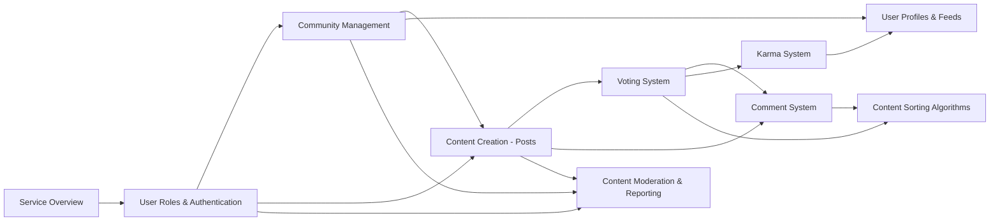

# Requirements Specification - Table of Contents

## Document Overview

This requirements specification provides comprehensive documentation for a Reddit-like community platform. The documentation is structured to guide stakeholders from high-level business strategy through detailed functional requirements, ensuring all aspects of the platform are clearly defined and ready for implementation.

### Purpose and Scope

This collection of documents serves as the authoritative source for understanding what the Reddit-like community platform should do, why it exists, and how users will interact with it. The specification focuses on business requirements, user needs, and functional behavior, providing development teams with the complete context needed to make informed technical decisions.

### Target Audience

- **Business Stakeholders**: Understand the business model, market opportunity, and strategic direction
- **Product Managers**: Gain comprehensive view of features, user journeys, and success metrics
- **Development Teams**: Access detailed functional requirements and business logic specifications
- **Moderators and Community Managers**: Learn content moderation workflows and community management features
- **Quality Assurance Teams**: Understand expected system behavior for test planning

### Document Version

- **Version**: 1.0
- **Last Updated**: 2025-10-13
- **Status**: Draft for Development

## Project Background

### Platform Vision

The Reddit-like community platform is designed to enable users to create, discover, and engage with topic-based communities. The platform facilitates meaningful discussions through a democratic content curation system where community members collectively determine content quality and visibility through voting mechanisms.

### Core Feature Summary

The platform encompasses several interconnected feature sets:

- **User Management**: Registration, authentication, and profile management
- **Community System**: Creation and management of topic-based communities (subreddits)
- **Content Creation**: Text posts, link sharing, and image uploads
- **Engagement Mechanisms**: Upvote/downvote voting system for posts and comments
- **Discussion Threading**: Nested comment system enabling threaded conversations
- **Reputation System**: User karma tracking based on community engagement
- **Content Discovery**: Multiple sorting algorithms (hot, new, top, controversial)
- **Personalization**: Community subscriptions and personalized content feeds
- **Content Moderation**: Reporting system and moderation tools for maintaining community standards

### Business Context

This platform addresses the need for organized, community-driven content aggregation and discussion. By empowering users to create specialized communities and democratically curate content, the platform serves as a hub for diverse interests, expertise sharing, and community building.

## Documentation Structure

The requirements specification consists of eleven interconnected documents, each addressing specific aspects of the platform. Documents are organized in logical progression from business strategy to detailed functional requirements.

### Complete Document List

#### [Service Overview](./01-service-overview.md)
**Filename**: `01-service-overview.md`  
**Purpose**: Establishes the foundational business context, defining why the platform exists, what market needs it addresses, and the overall business strategy.  
**Audience**: Business stakeholders, product managers, development team  
**Key Topics**:
- Executive summary and service vision
- Problem statement and market opportunity analysis
- Target market and user demographics
- Core value proposition and competitive differentiation
- Business model and revenue strategy
- Success metrics and key performance indicators
- Long-term growth and scaling strategy

#### [User Roles and Authentication](./02-user-roles-authentication.md)
**Filename**: `02-user-roles-authentication.md`  
**Purpose**: Defines the complete authentication system and user role hierarchy, establishing who can perform what actions in the system.  
**Audience**: Development team  
**Key Topics**:
- Authentication system architecture and workflows
- User registration and login requirements
- Session management and token handling
- User role hierarchy (Guest, Member, Moderator, Administrator)
- Detailed permission matrix by role
- Email verification and password management
- Security requirements and best practices

#### [Community Management](./03-community-management.md)
**Filename**: `03-community-management.md`  
**Purpose**: Specifies how communities (subreddits) are created, configured, managed, and moderated as the core organizational structure.  
**Audience**: Development team, product managers  
**Key Topics**:
- Community creation and configuration workflows
- Community settings and customization options
- Subscription system for users to follow communities
- Moderator assignment and management processes
- Community rules and guideline enforcement
- Community discovery and search functionality
- Privacy settings and access controls

#### [Content Creation - Posts](./04-content-creation-posts.md)
**Filename**: `04-content-creation-posts.md`  
**Purpose**: Details requirements for creating, editing, and managing posts across different content types (text, links, images).  
**Audience**: Development team  
**Key Topics**:
- Post types overview (text, link, image)
- Content creation workflows for each post type
- Post editing and deletion capabilities
- Post metadata and attributes
- Content validation rules and constraints
- Image upload requirements and specifications
- Draft and publishing functionality

#### [Voting System](./05-voting-system.md)
**Filename**: `05-voting-system.md`  
**Purpose**: Specifies the complete upvote/downvote system that drives content ranking and user reputation.  
**Audience**: Development team  
**Key Topics**:
- Voting mechanism for posts and comments
- Upvote and downvote functionality
- Vote counting and score calculation
- Vote change and removal capabilities
- Voting restrictions and authorization rules
- Anti-manipulation measures
- Vote privacy and display requirements

#### [Comment System](./06-comment-system.md)
**Filename**: `06-comment-system.md`  
**Purpose**: Defines the nested comment system enabling threaded discussions with replies and voting.  
**Audience**: Development team  
**Key Topics**:
- Comment creation and threading structure
- Nested reply functionality and depth limits
- Comment editing and deletion rules
- Comment voting integration
- Comment sorting algorithms
- Permalink functionality for direct comment access
- Comment collapse and expansion behavior

#### [Karma System](./07-karma-system.md)
**Filename**: `07-karma-system.md`  
**Purpose**: Describes how user reputation (karma) is earned, calculated, tracked, and displayed as a gamification element.  
**Audience**: Development team, product managers  
**Key Topics**:
- Karma concept and purpose
- Karma earning rules from votes
- Post karma and comment karma calculation
- Karma loss mechanisms
- Karma display on user profiles
- Karma-based privileges and thresholds
- Karma history and tracking

#### [Content Sorting Algorithms](./08-content-sorting-algorithms.md)
**Filename**: `08-content-sorting-algorithms.md`  
**Purpose**: Specifies the sorting algorithms (hot, new, top, controversial) that determine content discovery and visibility.  
**Audience**: Development team  
**Key Topics**:
- Hot algorithm for trending content
- New sorting for chronological ordering
- Top sorting with time range filters
- Controversial algorithm for divisive content
- Time range filters (hour, day, week, month, year, all-time)
- Sorting performance expectations
- Default sorting behavior per context

#### [User Profiles and Feeds](./09-user-profiles-feeds.md)
**Filename**: `09-user-profiles-feeds.md`  
**Purpose**: Details user profile features, personalized content feeds, and subscription-based content delivery.  
**Audience**: Development team  
**Key Topics**:
- User profile information display
- User post and comment history presentation
- Karma display on profiles
- Community subscription management
- Personalized home feed composition
- Feed content sources and prioritization
- Profile privacy settings

#### [Content Moderation and Reporting](./10-content-moderation-reporting.md)
**Filename**: `10-content-moderation-reporting.md`  
**Purpose**: Specifies the content reporting system and moderation workflows for maintaining community standards and platform safety.  
**Audience**: Development team, moderators  
**Key Topics**:
- Content reporting mechanisms for users
- Report categories and violation types
- Report submission workflows
- Moderator review queue functionality
- Content removal and action processes
- User banning and suspension procedures
- Appeal processes for moderation actions
- Moderation logging and audit trails
- Automated content filtering rules

## Document Navigation Guide

### Recommended Reading Order by Role

#### For Business Stakeholders
1. **Start here**: [Service Overview](./01-service-overview.md) - Understand business strategy and market opportunity
2. [Community Management](./03-community-management.md) - Learn about the platform's core organizational structure
3. [Karma System](./07-karma-system.md) - Understand user engagement and gamification strategy
4. [Content Moderation and Reporting](./10-content-moderation-reporting.md) - Review safety and community standards approach

#### For Product Managers
1. **Start here**: [Service Overview](./01-service-overview.md) - Grasp overall business context
2. [User Roles and Authentication](./02-user-roles-authentication.md) - Understand user types and permissions
3. [Community Management](./03-community-management.md) - Learn community creation and management features
4. [Content Creation - Posts](./04-content-creation-posts.md) - Review content creation capabilities
5. [Voting System](./05-voting-system.md) - Understand engagement mechanics
6. [Comment System](./06-comment-system.md) - Learn discussion features
7. [Content Sorting Algorithms](./08-content-sorting-algorithms.md) - Review content discovery mechanisms
8. [User Profiles and Feeds](./09-user-profiles-feeds.md) - Understand personalization features
9. [Content Moderation and Reporting](./10-content-moderation-reporting.md) - Review moderation workflows

#### For Development Teams
1. **Start here**: [Service Overview](./01-service-overview.md) - Understand business requirements context
2. [User Roles and Authentication](./02-user-roles-authentication.md) - Build authentication foundation first
3. [Community Management](./03-community-management.md) - Implement core community features
4. [Content Creation - Posts](./04-content-creation-posts.md) - Build content creation functionality
5. [Voting System](./05-voting-system.md) - Implement voting mechanics
6. [Comment System](./06-comment-system.md) - Build discussion features
7. [Karma System](./07-karma-system.md) - Implement reputation tracking
8. [Content Sorting Algorithms](./08-content-sorting-algorithms.md) - Build content discovery
9. [User Profiles and Feeds](./09-user-profiles-feeds.md) - Implement personalization
10. [Content Moderation and Reporting](./10-content-moderation-reporting.md) - Build moderation tools

#### For Moderators and Community Managers
1. **Start here**: [Community Management](./03-community-management.md) - Learn community management capabilities
2. [Content Moderation and Reporting](./10-content-moderation-reporting.md) - Understand moderation workflows and tools
3. [User Roles and Authentication](./02-user-roles-authentication.md) - Understand moderator permissions
4. [Voting System](./05-voting-system.md) - Learn how voting affects content visibility
5. [Content Sorting Algorithms](./08-content-sorting-algorithms.md) - Understand how users discover content

### Document Dependencies

The documents build upon each other in a logical progression:

**Dependency Explanation**:
- **Service Overview** provides business context for all other documents
- **User Roles & Authentication** establishes permission foundation required by all feature documents
- **Community Management** defines organizational structure needed for content features
- **Content Creation** must be understood before voting and commenting features
- **Voting System** impacts karma, sorting, and comment features
- **Karma System** depends on voting mechanics
- **Content Sorting** requires understanding of posts, comments, and voting
- **User Profiles & Feeds** integrates karma, communities, and content
- **Content Moderation** builds upon user roles, communities, and content types

## How to Use This Documentation

### For Business Stakeholders

**Objective**: Understand the business rationale, market opportunity, and strategic direction.

**Approach**:
- Focus on business-oriented documents that explain market fit and revenue strategy
- Review feature summaries to understand platform capabilities
- Use technical documents as reference for understanding scope and complexity
- Pay attention to success metrics and KPIs to align expectations

**Key Documents**: Service Overview, Community Management (overview sections), Karma System (gamification strategy), Content Moderation (safety approach)

### For Product Managers

**Objective**: Gain comprehensive understanding of all features and user experiences.

**Approach**:
- Read documents sequentially to build complete mental model
- Pay special attention to user workflows and interaction patterns
- Note feature dependencies and integration points
- Use requirements to inform roadmap and release planning
- Identify gaps or areas needing further clarification

**Key Documents**: All documents, with emphasis on Service Overview, user-facing features, and moderation workflows

### For Development Teams

**Objective**: Understand business requirements and user needs to inform technical implementation.

**Approach**:
- Start with Service Overview for business context and objectives
- Study User Roles & Authentication to understand permission model
- Review feature documents in implementation order (authentication → communities → content → engagement → moderation)
- Extract business rules and validation requirements from each document
- Note performance expectations and user experience requirements
- Remember: These documents define WHAT to build (business requirements), not HOW to build it (technical implementation)
- Technical architecture, API design, database schema, and technology choices are your responsibility

**Key Documents**: All documents are relevant, read in dependency order

**Important Notes for Developers**:
- Documents describe business logic and user requirements in natural language
- You have full autonomy over technical implementation decisions
- Translate business requirements into appropriate technical solutions
- Choose architecture, frameworks, and design patterns that best fit requirements
- Database design, API specifications, and system architecture are your domain

### For Quality Assurance Teams

**Objective**: Understand expected system behavior for comprehensive test planning.

**Approach**:
- Use requirements as basis for test case development
- Identify testable acceptance criteria from EARS-formatted requirements
- Note edge cases and error scenarios described in documents
- Map requirements to test coverage areas
- Cross-reference features to ensure integration testing coverage

**Key Documents**: All functional requirement documents (02-10), with special attention to validation rules and error handling

### For Moderators and Community Managers

**Objective**: Learn moderation tools and community management capabilities.

**Approach**:
- Focus on moderation and community management workflows
- Understand the tools and actions available to moderators
- Learn permission boundaries and escalation paths
- Review content policies and enforcement mechanisms

**Key Documents**: Content Moderation & Reporting, Community Management, User Roles & Authentication (moderator permissions)

## Document Relationship Map

### Logical Flow

The documentation follows a structured narrative:

1. **Business Foundation** (Service Overview)
   - Establishes WHY the platform exists
   - Defines market opportunity and business model
   - Sets strategic direction

2. **Access Control Foundation** (User Roles & Authentication)
   - Defines WHO can use the platform
   - Establishes permission framework
   - Specifies authentication mechanisms

3. **Core Platform Features** (Community Management, Content Creation, Voting, Comments)
   - Defines WHAT users can do
   - Specifies platform capabilities
   - Details user interactions

4. **Engagement Systems** (Karma, Content Sorting, User Profiles & Feeds)
   - Enhances HOW users discover and engage with content
   - Provides personalization and gamification
   - Improves user experience

5. **Safety and Governance** (Content Moderation & Reporting)
   - Ensures platform health and safety
   - Provides tools for community standards enforcement
   - Protects users and communities

### Feature Integration Points

Multiple documents address interconnected features:

- **Voting** is referenced in: Voting System, Karma System, Content Sorting, Comment System
- **User Roles** impact: Authentication, Community Management, Content Creation, Moderation
- **Communities** are central to: Community Management, Content Creation, Feeds, Moderation
- **Content** (posts/comments) appears in: Content Creation, Voting, Comments, Sorting, Profiles, Moderation

### Cross-Document Consistency

When reading multiple documents, note that:
- Requirements in one document may reference or depend on features defined in others
- Permission rules established in User Roles & Authentication apply throughout all features
- Business rules defined in one area may affect behavior in related areas
- The same user actions may be described from different perspectives in different documents

## Getting Started

### First-Time Readers

If you're new to this specification:

1. **Start with this Table of Contents** to orient yourself
2. **Read the Service Overview** to understand business context
3. **Identify your role** (business stakeholder, product manager, developer, etc.)
4. **Follow the recommended reading order** for your role
5. **Refer back to this ToC** as you navigate between documents

### Finding Specific Information

To locate specific topics:

- **User authentication and permissions**: See [User Roles and Authentication](./02-user-roles-authentication.md)
- **Community creation and management**: See [Community Management](./03-community-management.md)
- **Posting content**: See [Content Creation - Posts](./04-content-creation-posts.md)
- **Upvoting and downvoting**: See [Voting System](./05-voting-system.md)
- **Comments and replies**: See [Comment System](./06-comment-system.md)
- **User reputation**: See [Karma System](./07-karma-system.md)
- **Content ranking and discovery**: See [Content Sorting Algorithms](./08-content-sorting-algorithms.md)
- **User profiles and feeds**: See [User Profiles and Feeds](./09-user-profiles-feeds.md)
- **Reporting and moderation**: See [Content Moderation and Reporting](./10-content-moderation-reporting.md)

### Document Maintenance

As the platform evolves:

- Documents will be updated to reflect requirement changes
- Version numbers and last-updated dates will be maintained
- Change logs may be added to track requirement evolution
- Stakeholders should refer to the latest version of each document

---

> *Developer Note: This documentation defines **business requirements only**. All technical implementations (architecture, APIs, database design, etc.) are at the discretion of the development team.*
