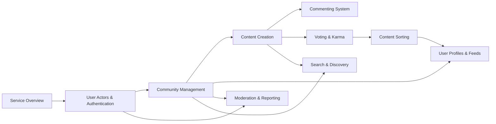

# Table of Contents - Community Platform Requirements Analysis

## Introduction

This requirements analysis documentation package provides comprehensive business requirements for building a Reddit-like community platform. The platform enables users to create and participate in topic-based communities, share content, engage in discussions, and build reputation through community voting.

### Purpose of This Documentation

This documentation suite serves as the complete business requirements specification for the community platform project. It defines:

- **What the system should do** from a business and user perspective
- **User workflows and interactions** throughout the platform
- **Business rules and validation requirements** for all features
- **User actors and their permissions** in business terms
- **Functional requirements** for all major features and capabilities

### Scope and Coverage

The documentation covers all major aspects of the community platform:

- User authentication and authorization
- Community creation and management
- Content creation (posts and comments)
- Voting and reputation systems
- Content sorting and discovery
- Moderation and safety features
- User profiles and personalized experiences
- Search and discovery capabilities

### Target Audience

This documentation is written primarily for:

- **Backend developers** who will implement the business logic and system functionality
- **Product managers** who need to understand the complete feature set
- **QA teams** who will validate business requirements
- **Business stakeholders** who need to understand system capabilities

## Document Organization and Reading Guide

### Recommended Reading Order

The documents are organized to build understanding progressively, from business context to detailed functional requirements:

#### Phase 1: Foundation and Context (Start Here)
1. **Service Overview** - Understand the business model, value proposition, and strategic goals
2. **User Actors and Authentication** - Learn about who uses the system and how they authenticate

#### Phase 2: Core Features (Essential Functionality)
3. **Community Management** - Understand how communities work as the platform's organizational structure
4. **Content Creation (Posts)** - Learn how users create and share content
5. **Commenting System** - Understand discussion and engagement mechanics
6. **Voting and Karma System** - Learn the reputation and ranking foundations

#### Phase 3: User Experience Features (Enhanced Functionality)
7. **Content Sorting Algorithms** - Understand how content is ranked and displayed
8. **User Profiles and Feeds** - Learn about personalized user experiences
9. **Search and Discovery** - Understand how users find content and communities

#### Phase 4: Safety and Governance (Platform Health)
10. **Moderation and Reporting** - Learn about content safety and community management

### Document Categories

The documentation is organized into these logical categories:

**Business Foundation**
- Documents that establish business context, objectives, and strategic direction

**User Management**
- Documents covering user authentication, actors, and permissions

**Content Management**
- Documents defining how content is created, organized, and managed

**Engagement Systems**
- Documents covering voting, karma, sorting, and user interaction

**Platform Governance**
- Documents addressing moderation, safety, and community health

**Discovery and Navigation**
- Documents covering search, feeds, and content discovery

### How Documents Relate

The documents build upon each other in a logical hierarchy:

```mermaid
graph LR
    A["Service Overview"] --> B["User Actors & Authentication"]
    B --> C["Community Management"]
    C --> D["Content Creation"]
    D --> E["Commenting System"]
    D --> F["Voting & Karma"]
    F --> G["Content Sorting"]
    C --> H["User Profiles & Feeds"]
    G --> H
    B --> I["Moderation & Reporting"]
    C --> I
    C --> J["Search & Discovery"]
    D --> J
```

## Complete Document Index

### 01. Service Overview
**Filename:** [Service Overview Document](./01-service-overview.md)

**Purpose:** Establishes the business foundation by defining what the community platform is, why it exists, and what core value it delivers to users and stakeholders.

**Key Topics:**
- Executive summary and service vision
- Problem statement and market opportunity
- Core value proposition and competitive differentiation
- Business model and revenue strategy
- Target audience and user segments
- Success metrics and KPIs

**Read this first to understand:** The business context, strategic goals, and market positioning of the platform.

---

### 02. User Actors and Authentication
**Filename:** [User Actors and Authentication Document](./02-user-actors-authentication.md)

**Purpose:** Defines all user types, their roles and permissions in business terms, and the complete authentication requirements for accessing the platform.

**Key Topics:**
- Member, Moderator, and Site Administrator actor definitions
- User registration and login workflows
- Session management and token-based authentication
- Password requirements and security expectations
- Permission hierarchy and access control in business terms
- Actor permission matrix showing what each user type can do

**Read this to understand:** Who uses the system, how they authenticate, and what permissions each user type has.

---

### 03. Community Management
**Filename:** [Community Management Document](./03-community-management.md)

**Purpose:** Details how communities function as the core organizational structure of the platform, including creation, configuration, moderation, and membership management.

**Key Topics:**
- Community creation by members
- Community settings and configuration options
- Public vs private community visibility
- Subscription and membership workflows
- Community moderation capabilities
- Community rules and guidelines
- Community discovery features

**Read this to understand:** How communities are created, configured, and managed by users and moderators.

---

### 04. Content Creation - Posts
**Filename:** [Content Creation - Posts Document](./04-content-creation-posts.md)

**Purpose:** Specifies complete functionality for creating, editing, and managing posts across different content types (text, link, image).

**Key Topics:**
- Three post types: text, link, and image posts
- Post creation workflows for each type
- Post editing and deletion capabilities
- Post metadata and attributes
- Content validation rules and character limits
- Image upload and link validation requirements

**Read this to understand:** How users create and manage different types of posts within communities.

---

### 05. Commenting System
**Filename:** [Commenting System Document](./05-commenting-system.md)

**Purpose:** Defines the nested commenting system that enables threaded discussions and community engagement on posts.

**Key Topics:**
- Comment creation and reply workflows
- Nested reply threading up to 10 levels deep
- Comment editing and deletion
- Comment sorting and display options
- Comment validation rules
- Thread navigation and collapse features

**Read this to understand:** How users engage in discussions through comments and nested replies.

---

### 06. Voting and Karma System
**Filename:** [Voting and Karma System Document](./06-voting-karma-system.md)

**Purpose:** Details the voting mechanism and karma calculation system that drives content ranking and user reputation.

**Key Topics:**
- Upvote and downvote mechanics on posts and comments
- Vote changing and removal capabilities
- Karma calculation formulas
- Post karma vs comment karma tracking
- User total karma display
- Vote count display rules
- Voting restrictions and validation

**Read this to understand:** How the voting system works and how user reputation (karma) is calculated.

---

### 07. Content Sorting Algorithms
**Filename:** [Content Sorting Algorithms Document](./07-content-sorting-algorithms.md)

**Purpose:** Specifies the algorithms for sorting posts by hot, new, top, and controversial, which determines content visibility and user experience.

**Key Topics:**
- Hot sorting (trending content based on recent votes)
- New sorting (chronological by creation time)
- Top sorting with time filters (today, week, month, year, all-time)
- Controversial sorting (balanced upvotes and downvotes)
- Default sorting behaviors
- User sorting preferences
- Feed generation based on sorting

**Read this to understand:** How content is ranked and displayed to users across different sorting methods.

---

### 08. User Profiles and Feeds
**Filename:** [User Profiles and Feeds Document](./08-user-profiles-feeds.md)

**Purpose:** Defines user profile functionality and personalized feed generation based on community subscriptions.

**Key Topics:**
- User profile structure and displayed information
- Profile customization options (avatar, bio)
- User activity history display
- Post and comment history on profiles
- Personalized home feed from subscribed communities
- All communities feed for discovery
- Feed refresh and update workflows

**Read this to understand:** How user profiles work and how personalized feeds are generated.

---

### 09. Moderation and Reporting
**Filename:** [Moderation and Reporting Document](./09-moderation-reporting.md)

**Purpose:** Specifies the content moderation and reporting system that maintains platform quality and safety.

**Key Topics:**
- Content reporting workflows for users
- Report categories and types
- Report review processes for moderators
- Community moderator actions (remove posts, ban users from community)
- Site admin capabilities (platform-wide moderation)
- Content removal procedures
- User banning at community and platform levels
- Post pinning for moderators
- Moderation queue management

**Read this to understand:** How content safety is maintained through user reporting and moderator actions.

---

### 10. Search and Discovery
**Filename:** [Search and Discovery Document](./10-search-discovery.md)

**Purpose:** Defines search and discovery features that help users find communities, posts, and other users.

**Key Topics:**
- Community search functionality
- Post search across the platform
- User search and profile discovery
- Search query processing and result ranking
- Search filters and refinement options
- Trending communities and posts
- Discovery recommendations
- Search performance expectations

**Read this to understand:** How users discover and search for content, communities, and other users.

---

## Navigation Guidelines

### For Backend Developers

**Start with these documents in order:**
1. Service Overview (business context)
2. User Actors and Authentication (security foundation)
3. Then proceed through documents 03-10 based on development priorities

**When implementing specific features, refer to:**
- The primary document for that feature
- User Actors and Authentication for permission requirements
- Related documents linked within each specification

### For Business Stakeholders

**Focus on these documents:**
1. Service Overview (strategic direction)
2. User Actors and Authentication (user types)
3. Community Management (core platform structure)
4. Content Sorting Algorithms (user experience)
5. Moderation and Reporting (platform safety)

### For Project Managers

**Review all documents with emphasis on:**
- Service Overview (scope and objectives)
- Each functional area document (03-10) for feature understanding
- Cross-document dependencies for sequencing development work

### Quick Topic Reference

**Looking for information about...**
- **Authentication and login?** → Document 02
- **Creating communities?** → Document 03
- **Making posts?** → Document 04
- **Comments and replies?** → Document 05
- **Upvotes and karma?** → Document 06
- **Content ranking?** → Document 07
- **User profiles?** → Document 08
- **Moderation tools?** → Document 09
- **Search features?** → Document 10

### Cross-References

Documents frequently reference each other. When you see links to other documents:
- Follow them to understand related functionality
- Use them to trace dependencies between features
- Return to the original document to maintain context

## Documentation Conventions

### Business Requirements Focus

All documents focus on business requirements and user needs rather than technical implementation. You will find:

- **User workflows** described in natural language
- **Business rules** for validation and processing
- **Functional capabilities** users can perform
- **Performance expectations** from the user's perspective
- **Error scenarios** and user-facing recovery processes

### What You Won't Find

These documents intentionally do not include:
- API endpoint specifications
- Database schemas or table structures
- Technical architecture decisions
- Frontend UI/UX designs
- Infrastructure specifications

### EARS Format Requirements

Throughout the documentation, functional requirements use EARS (Easy Approach to Requirements Syntax) format for clarity and precision:

- **WHEN** [trigger], THE system SHALL [action] - Event-driven requirements
- **WHILE** [state], THE system SHALL [action] - State-driven requirements
- **IF** [condition], THEN THE system SHALL [action] - Error handling
- **WHERE** [feature], THE system SHALL [action] - Optional features
- **THE** system SHALL [action] - Always-active requirements

This format ensures requirements are specific, measurable, and testable.

### Visual Diagrams

Documents include Mermaid diagrams to illustrate:
- User workflows and journeys
- Process flows
- State transitions
- System interactions

Diagrams complement the written requirements and provide visual clarity.

## Document Maintenance

### Version Control

This is the initial version of the requirements documentation. As the project evolves:
- Requirements may be refined based on development feedback
- Additional documents may be added for new features
- This table of contents will be updated to reflect changes

### Feedback and Questions

If you have questions about requirements or need clarification:
- Refer to the specific document covering that topic
- Check related documents for additional context
- Consult with business stakeholders for business rule clarifications
- Consult with the project team for scope questions

## Getting Started

### New to This Project?

1. **Read the Service Overview** to understand the business vision
2. **Review User Actors and Authentication** to understand security model
3. **Scan the table of contents** above to familiarize yourself with all documents
4. **Read documents 03-10** in sequence for comprehensive understanding
5. **Refer back to specific documents** as needed during development

### Ready to Build?

Each document provides complete business requirements for its area. Developers have full autonomy to:
- Design technical architecture
- Create API specifications
- Design database schemas
- Make implementation decisions

The requirements define **what** the system should do from a business perspective, while developers determine **how** to build it technically.

---

Developer Note: This documentation defines business requirements only. All technical implementations (architecture, APIs, database design, etc.) are at the discretion of the development team.
