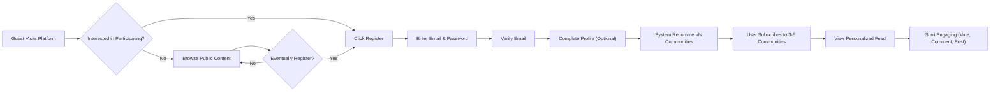
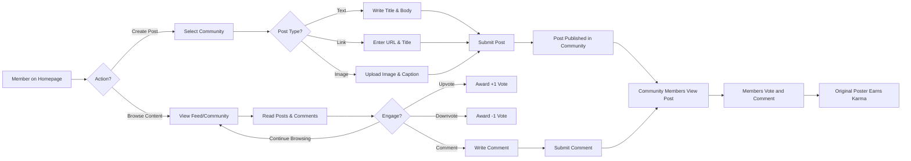
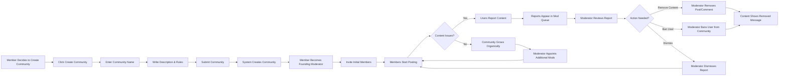
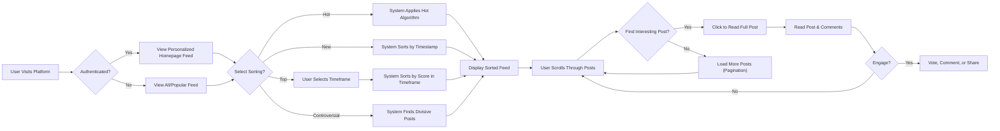

# redditCommunity Platform - Service Overview and Requirements Analysis

## Executive Summary

The redditCommunity platform is a modern community-driven content aggregation and discussion system designed to enable users to create, discover, and engage with topic-based communities. Inspired by Reddit's proven community engagement model, this platform empowers users to organize around shared interests, participate in meaningful discussions, and collectively curate high-quality content through democratic voting mechanisms.

This document establishes the business foundation, strategic vision, and high-level requirements for the platform. It defines the problem we're solving, identifies our target users, outlines the core value proposition, and establishes success criteria. The platform supports three primary user actors: **guests** (unauthenticated browsers), **members** (registered users), and **moderators** (community managers).

## Service Vision and Mission

### Vision Statement

To create the most engaging and democratically-governed community platform where users can find their tribes, share knowledge, and participate in authentic discussions on any topic imaginable.

### Mission

**Democratize Content Discovery and Community Building**

The redditCommunity platform exists to solve the fundamental challenge of connecting people with shared interests in an increasingly fragmented digital landscape. Our mission is threefold:

1. **Empower Community Creation**: Enable any user to create and moderate communities around niche interests, ensuring every topic has a home
2. **Foster Authentic Engagement**: Provide tools for meaningful discussions through nested conversations and democratic content curation
3. **Reward Quality Participation**: Recognize valuable contributors through transparent karma systems that incentivize helpful, insightful content

### Core Principles

- **User-Driven Governance**: Communities are owned and moderated by their creators, not by centralized authority
- **Democratic Content Curation**: The collective wisdom of upvotes and downvotes determines content visibility
- **Open Participation**: Low barriers to entry for content creation while maintaining quality through community moderation
- **Transparency**: Clear rules, visible moderation actions, and accountable community management

## Problem Statement and Market Opportunity

### The Problem We Solve

**Information Overload and Community Fragmentation**

Modern internet users face three critical challenges:

1. **Discovery Paralysis**: With billions of web pages and countless social platforms, finding quality content aligned with specific interests is increasingly difficult. Traditional social media algorithms prioritize engagement over relevance, leading to echo chambers and content fatigue.

2. **Lack of Niche Communities**: Mainstream social platforms cater to broad audiences, leaving enthusiasts of niche topics without dedicated spaces for deep, focused discussions. Facebook groups lack sophisticated content organization; Twitter threads disappear quickly; Instagram prioritizes visuals over substantive discussion.

3. **Content Quality Crisis**: Without effective curation mechanisms, valuable insights get buried under low-effort content, spam, and off-topic noise. Users waste time filtering through irrelevant posts to find meaningful contributions.

### Market Opportunity

**The Community Platform Market**

The online community platform market represents a multi-billion dollar opportunity:

- **Market Size**: The global community management software market reached $1.2 billion in 2023 and is projected to grow at 15% CAGR through 2030
- **User Demand**: 82% of internet users participate in at least one online community; average users are members of 5+ communities
- **Engagement Metrics**: Community platforms show 3-4x higher user engagement than traditional social media, with average session times exceeding 25 minutes
- **Content Volume**: User-generated content continues explosive growth, with communities producing 500+ million posts monthly across major platforms

### Competitive Landscape

**Primary Competitors**

1. **Reddit**: Market leader with 500M+ monthly users, but aging technology stack and controversial moderation policies create opportunities
2. **Discord**: Excellent real-time chat but lacks content organization and discovery features for long-form discussions
3. **Facebook Groups**: Massive user base but poor content curation, algorithm-driven feeds, and privacy concerns
4. **Specialized Forums**: phpBB, Discourse offer deep functionality but fragmented user bases and outdated UX

### Our Differentiation

**Why redditCommunity Will Succeed**

1. **Modern Technical Foundation**: Built from scratch with current best practices, ensuring scalability and performance
2. **Refined User Experience**: Learning from Reddit's 18-year evolution to implement proven patterns while avoiding known pitfalls
3. **Enhanced Moderation Tools**: More sophisticated content management and community governance features
4. **Mobile-First Approach**: Optimized for modern usage patterns with instant loading and responsive design
5. **Transparent Governance**: Clear community rules and visible moderation actions build trust

## Core Value Proposition

### For Content Creators

**A Platform Where Your Voice Matters**

WHEN a user creates valuable content, THE system SHALL reward them with karma points and increased visibility through democratic voting.

- **Easy Publishing**: Create text posts, share links, or upload images within seconds
- **Built-in Audience**: Access engaged communities already interested in your topics
- **Recognition System**: Earn karma that reflects your contribution quality and community standing
- **Direct Engagement**: Receive immediate feedback through votes and nested comment discussions

### For Community Seekers

**Find Your Tribe Around Any Interest**

WHEN a user searches for communities, THE system SHALL surface relevant communities with active discussions and quality content.

- **Unlimited Discovery**: Browse thousands of communities covering every imaginable topic
- **Personalized Feeds**: Subscribe to favorite communities for curated content streams
- **Quality Filtering**: Multiple sorting algorithms (hot, new, top, controversial) help find the best content
- **Deep Discussions**: Nested comment threads enable nuanced conversations unavailable on other platforms

### For Community Moderators

**Build and Manage Thriving Communities**

WHEN a user creates a community, THE system SHALL grant them comprehensive moderation tools to maintain community standards.

- **Full Control**: Set rules, remove inappropriate content, and manage member behavior
- **Moderation Tools**: Review reported content, ban problematic users, and appoint additional moderators
- **Community Customization**: Define descriptions, rules, and identity for your community
- **Growth Analytics**: Track community growth, engagement metrics, and content performance

### For Casual Browsers (Guests)

**Explore Without Commitment**

- **Open Access**: Browse public communities, read posts, and view discussions without registration
- **Discover Interests**: Explore diverse topics before committing to account creation
- **Informed Decision**: Experience platform value before signing up

## Target Audience and User Demographics

### Primary User Personas

#### Persona 1: The Knowledge Seeker
**Demographics**: Ages 25-40, college-educated professionals, urban/suburban, tech-comfortable

**Behavioral Traits**:
- Consumes content daily across multiple niche interests (technology, hobbies, professional development)
- Values in-depth discussions over superficial engagement
- Willing to spend 20-30 minutes per session reading and occasionally commenting
- Seeks expert opinions and peer recommendations

**Goals and Needs**:
- Find authoritative answers to specific questions
- Stay updated on niche interests not covered by mainstream media
- Participate in thoughtful discussions when they have expertise to share

**Platform Usage**: WHEN the knowledge seeker visits the platform, THE system SHALL present a curated feed of high-quality posts from subscribed communities sorted by relevance.

#### Persona 2: The Content Creator
**Demographics**: Ages 18-35, creative professionals, students, subject matter experts

**Behavioral Traits**:
- Actively creates original content 2-5 times per week
- Motivated by recognition (karma) and community feedback
- Monitors engagement on their posts and responds to comments
- Curates personal brand through consistent, quality contributions

**Goals and Needs**:
- Share knowledge, creativity, or expertise with appreciative audiences
- Build reputation within specific communities
- Receive constructive feedback and recognition for contributions
- Drive traffic to external projects or professional profiles

**Platform Usage**: WHEN the content creator publishes posts, THE system SHALL track engagement metrics and award karma based on community reception.

#### Persona 3: The Community Builder
**Demographics**: Ages 30-50, enthusiasts with deep domain expertise, natural leaders

**Behavioral Traits**:
- Passionate about specific topics with desire to foster community
- Willing to invest significant time in moderation and community management
- Sets high standards for content quality and discussion civility
- Enjoys organizational and curatorial responsibilities

**Goals and Needs**:
- Create safe, high-quality spaces for like-minded individuals
- Establish community norms and enforce standards
- Grow engaged member bases around niche topics
- Be recognized as authority figure in their domain

**Platform Usage**: WHEN the community builder creates a community, THE system SHALL provide comprehensive moderation tools and analytics to manage growth and quality.

#### Persona 4: The Lurker
**Demographics**: Ages 18-65, diverse backgrounds, varying tech comfort levels

**Behavioral Traits**:
- Primarily consumes content without creating or commenting (90%+ of activity)
- Visits regularly but maintains passive engagement
- Votes occasionally on exceptional content
- Values anonymity and low-pressure participation

**Goals and Needs**:
- Entertainment and information without social obligation
- Ability to explore interests privately
- Option to transition to active participation when ready

**Platform Usage**: WHEN the lurker browses content, THE system SHALL enable frictionless consumption with optional guest access and easy account creation when desired.

### Secondary Audiences

#### Brand Representatives and Marketers
- Businesses seeking authentic community engagement
- Need to participate genuinely without appearing overly promotional
- Value direct feedback from target demographics

#### Academic Researchers
- Study online communities, social dynamics, and information propagation
- Require access to public data and community structures
- Benefit from diverse user-generated content

### User Segmentation by Activity Level

THE system SHALL recognize three engagement tiers:

1. **Casual Users** (60% of user base): Visit 1-3 times per week, primarily consume content, minimal voting
2. **Regular Users** (30% of user base): Daily visits, active voters, occasional content creators and commenters
3. **Power Users** (10% of user base): Multiple daily sessions, frequent content creation, active community participation, high karma scores

## Key Features Overview

### User Management and Authentication

**User Registration and Access**

WHEN a guest decides to participate actively, THE system SHALL provide a streamlined registration process requiring only email and password.

- Guest browsing of all public communities, posts, and comments
- Email and password registration for account creation
- Secure login system with session management
- Password reset functionality for account recovery
- User profile creation with customizable information

**User Profiles and Reputation**

WHEN a member views any user profile, THE system SHALL display comprehensive activity history and reputation metrics.

- Public user profiles showing post history and comment history
- Karma score display with separate post karma and comment karma
- Profile customization options including bio and avatar
- Activity timeline showing chronological contributions
- Account settings for privacy and notification preferences

### Community Management System

**Community Creation and Discovery**

WHEN a member creates a new community, THE system SHALL establish them as the founding moderator with full administrative privileges.

- Any authenticated member can create unlimited communities
- Communities have unique names, descriptions, and optional rules
- Public communities visible to all users including guests
- Community discovery through search and browse features
- Trending communities highlighted based on growth and activity

**Subscription and Following**

WHEN a member subscribes to a community, THE system SHALL include that community's content in their personalized homepage feed.

- One-click subscription to join communities
- Unsubscribe option available at any time
- Subscription list management in user preferences
- Subscriber counts visible on community pages

**Community Moderation**

WHEN a moderator reviews reported content, THE system SHALL provide tools to take appropriate action including content removal and user bans.

- Founding moderators can appoint additional moderators
- Moderators can set and update community rules
- Content removal capabilities for rule violations
- User banning at community level (not platform-wide)
- Reported content queue for moderator review
- Moderation action logging for transparency

### Content Creation and Publishing

**Post Types and Creation**

THE system SHALL support three distinct post types to accommodate diverse content sharing needs:

1. **Text Posts**: Long-form written content with markdown formatting support
2. **Link Posts**: Sharing external URLs with title and optional description
3. **Image Posts**: Uploading and displaying images with captions

**Post Creation Requirements**

WHEN a member creates a post, THE system SHALL validate required fields and enforce content limits before publication.

- Posts must be associated with a specific community
- Post titles required with character limits (minimum 10 characters, maximum 300 characters)
- Text posts support up to 40,000 characters of body content
- Image uploads limited to 10MB per image with common formats supported (JPEG, PNG, GIF)
- Link URLs validated for proper format
- Posts timestamped upon creation

**Content Editing and Deletion**

WHEN a member edits their post, THE system SHALL preserve the original creation timestamp while marking the content as edited.

- Post creators can edit their own posts at any time
- Edited posts display "edited" indicator with timestamp
- Post creators can delete their own posts
- Moderators can remove posts from their communities
- Deleted posts show removal message but preserve discussion threads

### Voting and Karma System

**Voting Mechanics**

WHEN a member votes on content, THE system SHALL record the vote and update the content's score instantly.

- Authenticated members can upvote or downvote posts and comments
- Each member can cast one vote per piece of content
- Members can change their vote (upvote to downvote or vice versa)
- Members can remove their vote entirely
- Vote scores displayed as net total (upvotes minus downvotes)
- Guests can view scores but cannot vote

**Karma Calculation**

THE system SHALL calculate and update user karma scores based on votes received on their content.

- Post karma: Sum of net votes on all user's posts
- Comment karma: Sum of net votes on all user's comments
- Total karma: Combined post karma and comment karma
- Downvotes reduce karma proportionally
- Karma scores updated in real-time as votes change
- Karma displayed prominently on user profiles

**Anti-Manipulation Measures**

WHEN the system detects suspicious voting patterns, THE system SHALL prevent vote manipulation through rate limiting and validation.

- Vote changes tracked to prevent rapid switching
- Rate limiting on voting actions (maximum 100 votes per minute)
- Self-voting prohibited (users cannot vote on their own content)

### Comment and Discussion System

**Comment Creation**

WHEN a member reads a post, THE system SHALL enable them to add comments to participate in the discussion.

- Members can comment on any post in communities they can access
- Comments support up to 10,000 characters
- Basic markdown formatting supported in comments
- Comments timestamped upon creation

**Nested Reply Threads**

WHEN a member replies to a comment, THE system SHALL display the reply as a nested child maintaining discussion context.

- Comments can have replies (nested comments)
- Reply threads support up to 10 levels of nesting
- Visual indentation indicates nesting depth
- "Continue thread" links for deeply nested conversations

**Comment Voting and Sorting**

THE system SHALL apply the same voting mechanics to comments as posts, enabling quality comment curation.

- Comments receive upvotes and downvotes like posts
- Comment karma contributes to user's total comment karma
- Comments sortable by: best (vote score), new (chronological), controversial

**Comment Management**

WHEN a member edits their comment, THE system SHALL mark it as edited while preserving reply context.

- Comment authors can edit their comments
- Edited comments show "edited" timestamp
- Comment authors can delete their comments
- Deleted comments with replies show "[deleted]" placeholder to preserve thread structure
- Moderators can remove comments in their communities

### Content Sorting and Discovery

**Sorting Algorithms**

THE system SHALL provide multiple sorting options to help users discover content matching their preferences.

**Hot Sorting**
WHEN a user selects "hot" sorting, THE system SHALL prioritize recent posts with strong engagement momentum.

- Algorithm considers: vote score, post age, comment activity
- Balances popularity with recency
- Promotes trending content gaining rapid engagement
- Default sorting for community feeds

**New Sorting**
WHEN a user selects "new" sorting, THE system SHALL display posts in reverse chronological order.

- Purely time-based, showing newest posts first
- Ignores vote scores and engagement
- Helps users discover brand new content

**Top Sorting**
WHEN a user selects "top" sorting, THE system SHALL rank posts by highest vote score within selected timeframe.

- Time filters available: today, this week, this month, this year, all time
- Purely score-based within timeframe
- Surfaces best-performing content over time

**Controversial Sorting**
WHEN a user selects "controversial" sorting, THE system SHALL highlight posts with near-equal upvotes and downvotes indicating divisive content.

- Identifies posts with high engagement but split opinion
- Calculates based on vote balance (similar upvote and downvote counts)
- Surfaces polarizing discussions

### Content Feeds and Personalization

**Homepage Feed (Authenticated Members)**

WHEN an authenticated member visits the homepage, THE system SHALL display a personalized feed of posts from their subscribed communities.

- Aggregates posts from all subscribed communities
- Applies selected sorting algorithm (default: hot)
- Infinite scroll pagination with 25 posts per page
- Empty state with discovery suggestions for new users with no subscriptions

**All/Popular Feed**

WHEN any user visits the global feed, THE system SHALL display popular content from across all public communities.

- Available to both guests and members
- Shows trending content platform-wide
- Helps users discover new communities
- Applies same sorting options as community feeds

**Individual Community Feeds**

WHEN a user visits a specific community, THE system SHALL display posts only from that community with community-specific context.

- Posts filtered to single community
- Community description and rules visible
- Subscribe/unsubscribe button for members
- Moderator list and community statistics displayed
- Community sorting preferences applied

### Content Moderation and Reporting

**Content Reporting**

WHEN a member encounters inappropriate content, THE system SHALL enable them to report it to community moderators for review.

- Report button available on all posts and comments
- Report categories: spam, harassment, misinformation, off-topic, rule violation, other
- Optional text description for report context
- Reports submitted anonymously to moderators

**Moderation Queue**

WHEN a moderator accesses the moderation tools, THE system SHALL display all pending reports for their communities.

- Centralized queue of reported content
- Report details including category, reporter count, and context
- Content preview for quick review
- Action buttons: approve (dismiss report), remove content, ban user

**Moderator Actions**

THE system SHALL provide moderators with enforcement tools to maintain community standards.

- **Content Removal**: Remove posts or comments with reason logged
- **User Banning**: Ban users from specific community (temporary or permanent)
- **Report Resolution**: Mark reports as reviewed with action taken
- **Rule Management**: Create, edit, and publish community rules

**Moderation Transparency**

WHEN moderators take action, THE system SHALL log the action for accountability and potential review.

- Removed content shows "[removed by moderator]" message
- Moderation log tracks all moderator actions with timestamps
- Community rules clearly posted and accessible
- Ban notifications sent to affected users with reason

### Search and Discovery

**Content Search**

WHEN a user searches for content, THE system SHALL return relevant posts and communities matching search terms.

- Full-text search across post titles and content
- Community name and description search
- Search results ranked by relevance and recency
- Filters for content type (posts vs communities) and timeframe

**Community Discovery**

THE system SHALL help users find communities aligned with their interests.

- Trending communities based on subscriber growth
- Popular communities ranked by subscriber count
- Category-based browsing (if communities are tagged)
- Related community suggestions based on subscription patterns

## Business Model and Revenue Strategy

### Revenue Streams

**Primary Monetization: Freemium Subscription Model**

THE platform SHALL generate revenue through premium memberships while maintaining free access to core features.

**Free Tier (Core Product)**
- All essential features: browsing, posting, commenting, voting, community creation
- Advertisement-supported experience
- Standard user support
- 95% of users expected in this tier

**Premium Tier ($6.99/month or $59.99/year)**

WHEN a member upgrades to premium, THE system SHALL unlock enhanced features and remove advertisements.

Premium benefits include:
- Ad-free browsing experience across entire platform
- Custom profile themes and enhanced avatars
- Access to exclusive premium-only communities
- Enhanced comment highlighting for better discussion following
- Priority customer support
- Awards to give to exceptional content (see below)

**Expected conversion rate**: 3-5% of active monthly users

### Secondary Revenue: Award System

**Digital Awards and Tipping**

WHEN a member wants to recognize exceptional content, THE system SHALL offer purchasable awards that can be given to posts and comments.

- **Awards Purchase**: Users buy award credits ($4.99 for 5 awards, $19.99 for 25 awards, $49.99 for 70 awards)
- **Award Giving**: Members award posts/comments they find exceptionally valuable
- **Creator Benefits**: Content creators receive karma boost and premium time when their content receives awards
- **Visual Recognition**: Awarded content displays badge, increasing visibility

**Expected revenue**: $0.15-$0.30 per monthly active user from awards

### Tertiary Revenue: Targeted Advertising

**Non-Intrusive Advertising for Free Tier Users**

THE system SHALL display relevant advertisements to free-tier users in a way that respects user experience.

- **Native Promoted Posts**: Clearly labeled promotional content in feeds
- **Community-Targeted Ads**: Advertisements relevant to community topics
- **Sidebar Advertisements**: Display ads in non-intrusive positions
- **Frequency Limits**: Maximum 1 ad per 10 organic posts in feeds
- **Quality Standards**: All ads reviewed for appropriateness

**Revenue model**: CPM (cost per thousand impressions) and CPC (cost per click)
**Expected revenue**: $0.50-$1.50 per monthly active user from advertising

### Potential Future Revenue Streams

**Community Subscriptions**

WHEN communities grow to significant size, THE system SHALL enable moderators to offer premium community memberships.

- Moderators can create paid private communities
- Platform takes 20-30% revenue share
- Enables professional communities, courses, expert forums

**Enterprise/Business Accounts**

- Verified business accounts with enhanced features
- Analytics dashboards for brand engagement tracking
- API access for community management tools

**Data Licensing (Anonymous, Aggregated)**

- Research access to anonymized community and content data
- Trend analysis and sentiment insights
- Strict privacy protections and user consent

### Revenue Projections and Growth Strategy

**Year 1 Targets**
- 100,000 registered users
- 10,000 monthly active users
- 300 premium subscribers (3% conversion)
- Monthly revenue: $4,000-$6,000

**Year 2 Targets**
- 500,000 registered users
- 75,000 monthly active users
- 3,000 premium subscribers (4% conversion)
- Monthly revenue: $35,000-$50,000

**Year 3 Targets**
- 2,000,000 registered users
- 400,000 monthly active users
- 20,000 premium subscribers (5% conversion)
- Monthly revenue: $200,000-$300,000

### Customer Acquisition Strategy

**Organic Growth Mechanisms**

WHEN communities create valuable content, THE system SHALL enable natural viral growth through content sharing and search visibility.

- **SEO Optimization**: Public posts indexed by search engines, driving organic discovery
- **Social Sharing**: Easy sharing of posts to external social media
- **Community Cross-Promotion**: Related community suggestions
- **Content Quality**: Strong moderation ensures high-quality content that attracts users

**Paid Acquisition**

- Targeted social media advertising highlighting unique communities
- Content marketing through blog posts about community building
- Partnerships with influencers in key verticals
- Referral programs rewarding users for inviting friends

**Retention Strategies**

WHEN new users register, THE system SHALL guide them through onboarding to establish engagement habits.

- Personalized onboarding recommending initial communities
- Email notifications for trending content in subscribed communities
- Achievement system recognizing contribution milestones
- Community health monitoring to maintain quality

## Success Metrics and KPIs

### User Engagement Metrics

**Daily and Monthly Active Users**

THE system SHALL track and report user engagement levels to measure platform health.

- **Daily Active Users (DAU)**: Unique users visiting platform per day
- **Monthly Active Users (MAU)**: Unique users visiting platform per month
- **DAU/MAU Ratio**: Target 20-30% (indicates strong user retention)

**Session Metrics**

WHEN analyzing user engagement, THE system SHALL measure session depth and duration.

- **Average Session Duration**: Target 15-25 minutes per session
- **Sessions per User per Week**: Target 5-8 sessions for active users
- **Pages per Session**: Target 8-12 pages viewed per session

**Content Interaction Rates**

THE system SHALL track how users interact with content to measure engagement quality.

- **Vote Rate**: Percentage of viewed content that receives votes (target: 15-20%)
- **Comment Rate**: Percentage of viewed posts that receive comments (target: 5-8%)
- **Post Creation Rate**: New posts per 100 active users per day (target: 3-5)

### Community Health Metrics

**Community Growth**

THE system SHALL monitor community creation and health indicators.

- **Communities Created**: Target 50-100 new communities per month in early growth
- **Active Communities**: Communities with at least 1 post per week (target: 60% of total)
- **Average Community Size**: Subscribers per community (target: growing trend)
- **Community Survival Rate**: Communities still active after 90 days (target: 40%+)

**Content Quality**

WHEN evaluating platform quality, THE system SHALL measure content engagement and moderation effectiveness.

- **Average Post Score**: Net votes per post (target: positive and stable)
- **Comment Depth**: Average replies per post (target: 5+ comments per post)
- **Moderation Rate**: Removed content as percentage of total (target: <5%)
- **Report Resolution Time**: Average time for moderators to review reports (target: <24 hours)

### Revenue Metrics

**Conversion and Monetization**

THE system SHALL track revenue generation and conversion effectiveness.

- **Premium Conversion Rate**: Free to premium upgrades (target: 3-5%)
- **Average Revenue Per User (ARPU)**: Total revenue divided by MAU (target: $0.80-$1.20)
- **Customer Lifetime Value (LTV)**: Average revenue per user over lifetime (target: $45-$60)
- **Churn Rate**: Premium subscribers canceling monthly (target: <5% monthly churn)

**Award System Performance**

- **Awards Given per 1000 Users**: Award activity level (target: 20-30 awards)
- **Award Purchaser Rate**: Users buying awards (target: 2-4%)
- **Revenue per Award Transaction**: Average purchase value (target: $12-$15)

### Technical Performance Metrics

**System Reliability**

THE system SHALL maintain high availability and performance standards.

- **Uptime**: Target 99.9% uptime (less than 45 minutes downtime per month)
- **Page Load Time**: Target <1 second for feed loading
- **API Response Time**: Target <200ms for 95th percentile
- **Error Rate**: Target <0.1% of requests resulting in errors

**Scalability Indicators**

WHEN measuring system capacity, THE system SHALL track resource utilization and performance under load.

- **Concurrent Users Supported**: Maximum simultaneous active users
- **Posts per Second**: System throughput capacity
- **Database Query Performance**: 95th percentile query times
- **Search Response Time**: Time to return search results (target: <500ms)

## User Journey Diagrams

### New User Onboarding Journey

### Content Creation and Engagement Flow

### Community Creation and Moderation Flow

### Content Discovery and Sorting Flow

## Technical Architecture Principles

While the specific technical implementation is at the discretion of the development team, the following principles should guide architectural decisions:

### Scalability Requirements

THE system SHALL be designed to handle growth from thousands to millions of users without architectural redesign.

- **Horizontal Scalability**: System components should scale by adding more instances
- **Database Performance**: Support for millions of posts and billions of votes with sub-second query times
- **Caching Strategy**: Frequently accessed content should be cached to reduce database load
- **Asynchronous Processing**: Vote tallying, karma calculation, and notifications should process asynchronously

### Performance Expectations

WHEN users interact with the platform, THE system SHALL respond instantly to maintain engagement.

- **Page Load Times**: Target <1 second for initial page load
- **API Response Times**: Target <200ms for 95% of requests
- **Search Performance**: Return results within 500ms
- **Real-time Updates**: Vote scores and new comments should update instantly without page refresh

### Security and Privacy Requirements

THE system SHALL protect user data and prevent unauthorized access or content manipulation.

- **Authentication Security**: Passwords hashed using industry-standard algorithms
- **Session Management**: Secure token-based authentication with appropriate expiration
- **Authorization**: Role-based access control preventing unauthorized actions
- **Input Validation**: All user input sanitized to prevent injection attacks
- **Rate Limiting**: Prevent abuse through request rate limiting
- **Data Privacy**: User data protected according to privacy regulations (GDPR, CCPA compliance)

### Content Delivery Optimization

WHEN users access media content, THE system SHALL deliver it efficiently across global locations.

- **Image Optimization**: Automatic compression and format conversion for optimal delivery
- **Content Distribution**: Use of CDN for static assets and media files
- **Lazy Loading**: Load content progressively as users scroll
- **Mobile Optimization**: Responsive design with mobile-first considerations

### Reliability and Fault Tolerance

THE system SHALL maintain availability even during component failures or high load periods.

- **Uptime Target**: 99.9% availability (maximum 45 minutes downtime per month)
- **Graceful Degradation**: Non-critical features degrade before core functionality fails
- **Data Backup**: Regular automated backups with point-in-time recovery
- **Error Handling**: User-friendly error messages with logging for diagnostics
- **Monitoring**: Real-time system health monitoring with alerting

## Project Scope and Constraints

### In Scope for Initial Release (MVP)

The following features MUST be implemented for the platform's initial launch:

**Core User Features**
- User registration, authentication, and profile management
- Guest browsing of public communities and content
- Email/password login with password reset capability
- User profiles displaying activity and karma

**Community Features**
- Community creation by any authenticated member
- Community subscription/unsubscribe functionality
- Public communities visible to all users
- Basic community information (name, description, rules)

**Content Features**
- Three post types: text, link, and image specifications
- Post creation, editing, and deletion
- Upvote and downvote system for posts
- Karma calculation and display
- Four sorting algorithms: hot, new, top, controversial

**Discussion Features**
- Comment creation on posts
- Nested comment replies (up to 10 levels)
- Voting on comments
- Comment editing and deletion

**Moderation Features**
- Content reporting by members
- Moderation queue for reported content
- Content removal by moderators
- Community-level user banning
- Moderator appointment system

**Discovery Features**
- Personalized homepage feed for members
- All/Popular global feed for all users
- Individual community feeds
- Basic search functionality

### Out of Scope for Initial Release

The following features are explicitly excluded from the initial release but may be considered for future versions:

**Advanced Features (Future Phases)**
- Private/restricted communities
- Direct messaging between users
- Chat functionality
- User blocking
- Advanced search with filters
- Trending/Popular page with sophisticated algorithms
- Mobile native applications (iOS, Android)
- Push notifications
- Multi-factor authentication
- OAuth social login (Google, Facebook, etc.)
- Content crossposting between communities
- User flair and community styling
- Wiki pages for communities
- Scheduled/timed posts
- Poll posts
- Video hosting and playback
- Live streaming
- AMA (Ask Me Anything) special event modes

**Advanced Moderation**
- Automated content filtering (spam detection, profanity filters)
- Moderator permissions hierarchy
- Moderation bots and automation
- Appeal system for bans
- Shadow banning
- Site-wide administrator tools

**Advanced Monetization**
- Premium tier subscriptions (planned for post-MVP)
- Award system (planned for post-MVP)
- Advertising platform (planned for post-MVP)
- Community subscriptions
- Business/verified accounts

### Technical Constraints

**Technology Stack Decisions**
- Backend framework: At development team's discretion
- Database: At development team's discretion (must support relational data and high performance)
- Authentication: Must use JWT tokens
- Image storage: At development team's discretion (cloud storage recommended)

**Performance Constraints**
- Must support at least 1,000 concurrent users on initial infrastructure
- Database must handle at least 10,000 posts and 100,000 comments efficiently
- Search must return results within 1 second for typical queries

**Deployment Constraints**
- Must be deployable to cloud infrastructure (AWS, Google Cloud, or Azure)
- Must support horizontal scaling for future growth
- Must include monitoring and logging infrastructure

### Business Constraints

**Budget and Timeline**
- MVP development timeline: 4-6 months for full-stack implementation
- Initial infrastructure budget: Support for up to 10,000 monthly active users
- Marketing budget: Organic growth focused for first 6 months

**Regulatory Compliance**
- Must comply with GDPR for European users
- Must comply with CCPA for California users
- Must have clear Terms of Service and Privacy Policy
- Must implement content moderation to comply with platform liability laws

**Operational Constraints**
- Initial moderation: Community-driven (no dedicated moderation team)
- Customer support: Email-based support for initial release
- Content hosting: Must use reputable third-party services for user-generated images

## Related Documentation

This service overview document provides the business foundation for the redditCommunity platform. For detailed functional and technical requirements, please refer to the following documents:

- [User Actors and Authentication](./02-user-actors-authentication.md) - Detailed user role definitions, permission matrices, and complete authentication system requirements
- [Community Management](./03-community-management.md) - Community creation, moderation tools, and lifecycle management specifications
- [Content Creation and Posts](./04-content-creation-posts.md) - Detailed requirements for post types, creation workflows, and content management
- [Voting and Karma System](./05-voting-karma-system.md) - Complete voting mechanics, karma calculation formulas, and anti-manipulation measures
- [Comments and Discussions](./06-comments-discussions.md) - Comment threading, nesting rules, and discussion features
- [Content Sorting Algorithms](./07-content-sorting-algorithms.md) - Detailed specifications for hot, new, top, and controversial sorting logic
- [Content Feeds and Discovery](./08-content-feeds-discovery.md) - Feed types, personalization rules, and content discovery mechanisms
- [User Profiles and Activity](./09-user-profiles-activity.md) - Profile structure, activity history display, and account settings
- [Content Moderation and Reporting](./10-content-moderation-reporting.md) - Reporting workflows, moderation tools, and community governance