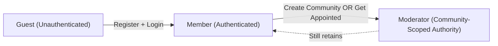

# User Actors and Authentication

## Document Purpose

This document defines all user actor types in the Reddit-like community platform, their permissions, capabilities, and the complete authentication and authorization system. It provides the foundation for implementing secure user management, access control, and session handling throughout the application.

## User Actor Definitions

The platform supports three distinct user actor types, each with specific capabilities and restrictions. The actor system follows a hierarchical permission model where capabilities expand as users authenticate and gain moderator status.

### Guest Actor

**Guest** represents unauthenticated visitors to the platform who can browse and consume content without creating an account.

**Characteristics:**
- No authentication required
- No persistent user identity
- Read-only access to public content
- Cannot perform any mutating actions
- Cannot access personalized features

**Core Capabilities:**
- Browse all public communities
- View posts in public communities
- Read comments and comment threads
- See vote scores on posts and comments
- View user profiles and public user activity
- Access community descriptions and rules
- Search for communities and posts
- View content sorted by hot, new, top, or controversial

**Explicit Restrictions:**
- Cannot create an account or profile (must register first)
- Cannot log in (no credentials exist)
- Cannot create posts in any community
- Cannot write comments or replies
- Cannot upvote or downvote posts or comments
- Cannot subscribe to communities
- Cannot report content
- Cannot create communities
- Cannot access personalized feeds
- Cannot save or bookmark content
- Cannot receive notifications
- Cannot earn karma points

**Business Purpose:**
Guests enable content discovery and platform growth by allowing potential users to explore the platform before committing to registration. This lowers the barrier to entry and supports viral content sharing through public links.

### Member Actor

**Member** represents authenticated users who have registered an account and can fully participate in the community platform.

**Characteristics:**
- Authenticated with email and password
- Persistent user identity across sessions
- Personal karma score tracking
- Profile customization capabilities
- Full content creation and engagement rights

**Core Capabilities:**

*Authentication and Account Management:*
- Register for a new account with email and password
- Log in to access authenticated features
- Log out to end session
- Verify email address
- Reset forgotten password
- Change password while authenticated
- Update profile information
- Customize profile with bio and avatar

*Community Participation:*
- Create new communities and become their moderator
- Subscribe to communities
- Unsubscribe from communities
- View personalized homepage feed showing posts from subscribed communities

*Content Creation:*
- Create text posts in any public community
- Create link posts in any public community
- Create image posts in any public community
- Edit their own posts within allowed time window
- Delete their own posts

*Engagement:*
- Write comments on posts
- Write nested replies to comments
- Edit their own comments within allowed time window
- Delete their own comments
- Upvote posts and comments
- Downvote posts and comments
- Change or remove their votes

*Content Discovery:*
- View all sorting options (hot, new, top, controversial)
- Search for communities and content
- Access global "All" feed
- Browse community feeds

*Moderation Participation:*
- Report inappropriate posts
- Report inappropriate comments
- Report rule-violating content

*Profile and Reputation:*
- Earn post karma from upvotes on their posts
- Earn comment karma from upvotes on their comments
- View their karma score on their profile
- View their post and comment history

**Explicit Restrictions:**
- Cannot moderate communities they did not create (unless appointed)
- Cannot remove other users' posts or comments
- Cannot ban users from communities
- Cannot appoint moderators to communities they don't moderate
- Cannot review reported content in communities they don't moderate
- Cannot access site-wide administrative functions
- Cannot modify community settings for communities they don't moderate

**Business Purpose:**
Members are the core user base driving content creation, engagement, and community growth. The karma system incentivizes quality contributions, while full participation capabilities enable vibrant discussions and community building.

### Moderator Actor

**Moderator** represents community creators and appointed moderators who have authority to manage specific communities and enforce community standards.

**Characteristics:**
- All capabilities of Member actor
- Authority scoped to specific communities
- Moderation tools and content management powers
- Responsibility for community health and rule enforcement
- Ability to delegate moderation responsibilities

**Core Capabilities:**

*Inherits All Member Capabilities Plus:*

*Community Management:*
- Automatically becomes moderator of communities they create
- Set and update community rules
- Set and update community descriptions
- Configure community settings
- Archive or close communities they created

*Content Moderation:*
- Review reported posts in their communities
- Review reported comments in their communities
- Remove posts that violate community rules
- Remove comments that violate community rules
- View moderation queue for their communities
- Access moderation logs showing all actions taken

*User Management:*
- Ban users from their communities
- Unban users from their communities
- View list of banned users in their communities
- Set ban duration (temporary or permanent)

*Moderator Delegation:*
- Appoint additional moderators to their communities
- Remove moderators they appointed
- View list of all moderators in their communities

**Scope Limitations:**
- Moderator powers apply ONLY to communities they created or were appointed to moderate
- Cannot moderate communities where they are not a moderator
- Cannot perform site-wide administrative actions
- Cannot ban users from the entire platform (only from specific communities)
- Cannot remove content outside their communities
- Cannot access reports from communities they don't moderate

**Business Purpose:**
Moderators maintain community health, enforce standards, and ensure content quality. Distributed moderation allows the platform to scale while maintaining appropriate content standards across diverse communities. Community-specific moderation empowers community creators to build and maintain their unique cultures.

## Permission Hierarchy and Relationships

The platform uses a hierarchical permission model:



**Hierarchy Principles:**
- Guest < Member < Moderator (in terms of capabilities)
- Moderator inherits all Member capabilities
- Member inherits all Guest browsing capabilities
- Permissions are additive as users advance
- Moderator authority is scoped to specific communities, not global

## Complete Authentication System Requirements

### Authentication Flows

#### User Registration Flow

WHEN a guest submits registration information, THE system SHALL validate the email format, password strength, and email uniqueness.

THE system SHALL require the following registration fields:
- Email address (valid email format)
- Password (minimum 8 characters, containing at least one uppercase letter, one lowercase letter, one number, and one special character)
- Username (3-20 alphanumeric characters, unique across the platform)

WHEN registration validation succeeds, THE system SHALL create a new user account with Member role and send an email verification link.

WHEN registration validation fails, THE system SHALL return specific error messages indicating which fields failed validation and why.

THE system SHALL prevent duplicate accounts using the same email address.

IF an email address is already registered, THEN THE system SHALL return error code "EMAIL_ALREADY_EXISTS" and reject the registration.

IF a username is already taken, THEN THE system SHALL return error code "USERNAME_ALREADY_TAKEN" and suggest available alternatives.

#### Email Verification Flow

WHEN a new user account is created, THE system SHALL generate a unique email verification token valid for 24 hours.

THE system SHALL send an email containing a verification link to the registered email address within 1 minute of registration.

WHEN a user clicks the verification link with valid token, THE system SHALL mark the email as verified and enable full account capabilities.

IF a verification token has expired, THEN THE system SHALL allow the user to request a new verification email.

THE system SHALL allow users to log in before email verification but display a notice prompting verification.

#### Login Flow

WHEN a user submits login credentials (email and password), THE system SHALL validate the credentials against stored user records.

WHEN login credentials are valid, THE system SHALL generate a JWT access token and refresh token and return them to the client.

THE system SHALL complete authentication and return tokens within 2 seconds of credential submission.

IF login credentials are invalid, THEN THE system SHALL return HTTP 401 with error code "AUTH_INVALID_CREDENTIALS" without specifying whether email or password was incorrect (security measure).

IF a user account is banned from the platform, THEN THE system SHALL return error code "ACCOUNT_SUSPENDED" and reject login.

THE system SHALL implement rate limiting allowing maximum 5 failed login attempts per email address within 15 minutes.

IF rate limit is exceeded, THEN THE system SHALL temporarily block login attempts for that email for 15 minutes and return error code "TOO_MANY_ATTEMPTS".

#### Logout Flow

WHEN an authenticated user requests logout, THE system SHALL invalidate the current access token and remove it from client storage.

THE system SHALL support logout from current session only (single device logout).

WHEN a user logs out, THE system SHALL redirect them to the public homepage and clear all session data.

#### Password Reset Flow

WHEN a user requests password reset, THE system SHALL send a password reset link to the registered email address if the email exists in the system.

THE system SHALL return success response regardless of whether the email exists (security measure to prevent email enumeration).

THE system SHALL generate a unique password reset token valid for 1 hour.

WHEN a user submits a new password with valid reset token, THE system SHALL validate password strength and update the password.

WHEN password is successfully reset, THE system SHALL invalidate all existing sessions and tokens for that user.

THE system SHALL require users to log in again after password reset.

#### Password Change Flow (Authenticated Users)

WHEN an authenticated user requests password change, THE system SHALL require current password verification before allowing change.

THE system SHALL validate new password strength using the same rules as registration.

WHEN password change succeeds, THE system SHALL maintain the current session but invalidate all other sessions for that user.

### Session Management

#### Session Duration and Expiration

THE system SHALL issue access tokens with 30-minute expiration time.

THE system SHALL issue refresh tokens with 30-day expiration time.

WHEN an access token expires, THE system SHALL require the client to obtain a new access token using the refresh token.

WHEN a refresh token expires, THE system SHALL require the user to log in again.

#### Concurrent Sessions

THE system SHALL allow users to be logged in on multiple devices simultaneously.

THE system SHALL maintain independent sessions for each device/browser.

WHEN a user changes their password, THE system SHALL invalidate all sessions except the current one performing the password change.

#### Session Security

THE system SHALL use secure, httpOnly cookies for storing refresh tokens when cookies are the chosen storage method.

WHERE the client uses localStorage for tokens, THE system SHALL implement CSRF protection mechanisms.

THE system SHALL transmit all authentication tokens over HTTPS only.

THE system SHALL never log or store tokens in plain text server-side logs.

## JWT Token Management Strategy

### Token Type: JWT (JSON Web Tokens)

THE system SHALL use JWT (JSON Web Tokens) as the exclusive token format for authentication and authorization.

THE system SHALL implement two token types:
- Access Token: Short-lived token for API authentication
- Refresh Token: Long-lived token for obtaining new access tokens

### Access Token Specification

**Expiration:**
THE access token SHALL expire 30 minutes after issuance.

**Payload Structure:**
THE access token JWT payload SHALL include the following claims:
```json
{
  "userId": "unique user identifier (UUID)",
  "username": "user's username",
  "email": "user's email address",
  "role": "guest | member | moderator",
  "moderatedCommunities": ["array of community IDs where user is moderator"],
  "karma": {
    "post": "post karma score",
    "comment": "comment karma score",
    "total": "combined karma score"
  },
  "emailVerified": "boolean indicating email verification status",
  "iat": "issued at timestamp",
  "exp": "expiration timestamp"
}
```

**Signing:**
THE system SHALL sign access tokens using HS256 (HMAC with SHA-256) algorithm.

THE system SHALL use a secure secret key of at least 256 bits (32 characters) for signing tokens.

### Refresh Token Specification

**Expiration:**
THE refresh token SHALL expire 30 days after issuance.

**Payload Structure:**
THE refresh token JWT payload SHALL include:
```json
{
  "userId": "unique user identifier (UUID)",
  "tokenId": "unique token identifier for revocation tracking",
  "iat": "issued at timestamp",
  "exp": "expiration timestamp"
}
```

**Storage:**
THE system SHALL store refresh tokens in one of two ways based on client architecture:
- Option 1: httpOnly, secure cookies (recommended for web browsers)
- Option 2: localStorage (for single-page applications requiring more control)

WHERE refresh tokens are stored in httpOnly cookies, THE system SHALL set the Secure flag requiring HTTPS transmission.

WHERE refresh tokens are stored in httpOnly cookies, THE system SHALL set the SameSite attribute to "Strict" to prevent CSRF attacks.

### Token Refresh Flow

WHEN a client's access token expires, THE system SHALL accept the refresh token to issue a new access token.

THE system SHALL validate the refresh token signature and expiration before issuing a new access token.

WHEN a refresh token is used successfully, THE system SHALL issue a new access token with updated user information and karma scores.

THE system SHALL allow refresh token reuse within its validity period (sliding session approach).

IF a refresh token is expired or invalid, THEN THE system SHALL return HTTP 401 with error code "REFRESH_TOKEN_INVALID" and require user login.

### Token Revocation

THE system SHALL support token revocation for security events:
- Password change: Revoke all refresh tokens except current session
- Account suspension: Revoke all tokens immediately
- Manual logout from all devices: Revoke all refresh tokens

THE system SHALL maintain a token revocation list (blacklist) storing revoked token IDs until their natural expiration.

WHEN validating a refresh token, THE system SHALL check the revocation list and reject revoked tokens.

### Secret Key Management

THE system SHALL store JWT signing secrets in environment variables, never in source code.

THE system SHALL use different signing secrets for development, staging, and production environments.

THE system SHALL implement secret rotation capability allowing periodic secret key updates without service disruption.

## Security Requirements

### Password Security

THE system SHALL hash all passwords using bcrypt with a work factor (cost) of 12.

THE system SHALL never store passwords in plain text or reversibly encrypted form.

THE system SHALL never return password hashes in API responses.

**Password Strength Requirements:**
THE system SHALL enforce the following password requirements:
- Minimum length: 8 characters
- Maximum length: 128 characters
- Must contain at least one uppercase letter (A-Z)
- Must contain at least one lowercase letter (a-z)
- Must contain at least one number (0-9)
- Must contain at least one special character (!@#$%^&*()_+-=[]{}|;:,.<>?)

WHEN a user submits a password that does not meet requirements, THE system SHALL return specific guidance on which requirements are not met.

### Authentication Security Measures

**Rate Limiting:**
THE system SHALL implement rate limiting on authentication endpoints:
- Login: Maximum 5 attempts per email per 15 minutes
- Registration: Maximum 3 attempts per IP address per hour
- Password reset: Maximum 3 requests per email per hour
- Token refresh: Maximum 10 requests per user per minute

**Brute Force Protection:**
IF failed login attempts exceed threshold, THEN THE system SHALL temporarily lock the account for 15 minutes and notify the user via email.

**Token Security:**
THE system SHALL validate token signatures on every authenticated request.

THE system SHALL reject tokens with tampered payloads or invalid signatures with HTTP 401.

THE system SHALL implement token expiration strictly and reject expired tokens.

**HTTPS Requirement:**
THE system SHALL require HTTPS for all authentication endpoints in production environments.

THE system SHALL reject authentication requests over unencrypted HTTP connections in production.

### Session Security

**Session Fixation Prevention:**
WHEN a user successfully logs in, THE system SHALL generate a new session token, not reuse any existing token.

**XSS Protection:**
THE system SHALL sanitize all user input to prevent cross-site scripting attacks.

WHERE tokens are stored in localStorage, THE system SHALL implement Content Security Policy headers to mitigate XSS risks.

**CSRF Protection:**
WHERE refresh tokens are stored in cookies, THE system SHALL implement CSRF tokens for state-changing requests.

THE system SHALL validate CSRF tokens on all POST, PUT, PATCH, and DELETE requests from cookie-authenticated sessions.

## Permission Matrix by Feature

The following table defines exactly what each actor can do across all platform features:

| Feature / Action | Guest | Member | Moderator |
|-----------------|-------|---------|--------------|
| **Account & Authentication** |
| Register for account | ❌ | ❌ | ❌ |
| Log in | ❌ | ✅ | ✅ |
| Log out | ❌ | ✅ | ✅ |
| Verify email | ❌ | ✅ | ✅ |
| Reset password | ❌ | ✅ | ✅ |
| Change password | ❌ | ✅ | ✅ |
| Update profile | ❌ | ✅ | ✅ |
| View own profile | ❌ | ✅ | ✅ |
| **Communities** |
| Browse public communities | ✅ | ✅ | ✅ |
| View community details | ✅ | ✅ | ✅ |
| Create community | ❌ | ✅ | ✅ |
| Subscribe to community | ❌ | ✅ | ✅ |
| Unsubscribe from community | ❌ | ✅ | ✅ |
| Set community rules | ❌ | ❌ | ✅ (own communities) |
| Update community description | ❌ | ❌ | ✅ (own communities) |
| Appoint moderators | ❌ | ❌ | ✅ (own communities) |
| **Posts** |
| View posts | ✅ | ✅ | ✅ |
| Create text post | ❌ | ✅ | ✅ |
| Create link post | ❌ | ✅ | ✅ |
| Create image post | ❌ | ✅ | ✅ |
| Edit own post | ❌ | ✅ | ✅ |
| Delete own post | ❌ | ✅ | ✅ |
| Remove others' posts | ❌ | ❌ | ✅ (in moderated communities) |
| **Comments** |
| Read comments | ✅ | ✅ | ✅ |
| Write comment | ❌ | ✅ | ✅ |
| Write nested reply | ❌ | ✅ | ✅ |
| Edit own comment | ❌ | ✅ | ✅ |
| Delete own comment | ❌ | ✅ | ✅ |
| Remove others' comments | ❌ | ❌ | ✅ (in moderated communities) |
| **Voting** |
| View vote scores | ✅ | ✅ | ✅ |
| Upvote post | ❌ | ✅ | ✅ |
| Downvote post | ❌ | ✅ | ✅ |
| Upvote comment | ❌ | ✅ | ✅ |
| Downvote comment | ❌ | ✅ | ✅ |
| Change vote | ❌ | ✅ | ✅ |
| Remove vote | ❌ | ✅ | ✅ |
| **Karma & Reputation** |
| View karma scores | ✅ | ✅ | ✅ |
| Earn post karma | ❌ | ✅ | ✅ |
| Earn comment karma | ❌ | ✅ | ✅ |
| View own karma breakdown | ❌ | ✅ | ✅ |
| **Content Discovery** |
| View sorted feeds (hot/new/top/controversial) | ✅ | ✅ | ✅ |
| View community feed | ✅ | ✅ | ✅ |
| View global "All" feed | ✅ | ✅ | ✅ |
| View personalized homepage | ❌ | ✅ | ✅ |
| Search communities | ✅ | ✅ | ✅ |
| Search posts | ✅ | ✅ | ✅ |
| **Moderation** |
| Report post | ❌ | ✅ | ✅ |
| Report comment | ❌ | ✅ | ✅ |
| Review reports | ❌ | ❌ | ✅ (in moderated communities) |
| Remove reported content | ❌ | ❌ | ✅ (in moderated communities) |
| Ban user from community | ❌ | ❌ | ✅ (in moderated communities) |
| Unban user from community | ❌ | ❌ | ✅ (in moderated communities) |
| View moderation logs | ❌ | ❌ | ✅ (in moderated communities) |
| View banned users list | ❌ | ❌ | ✅ (in moderated communities) |
| **User Profiles** |
| View any user profile | ✅ | ✅ | ✅ |
| View user's posts | ✅ | ✅ | ✅ |
| View user's comments | ✅ | ✅ | ✅ |
| View user's karma | ✅ | ✅ | ✅ |

**Permission Notes:**
- ✅ = Actor has permission to perform action
- ❌ = Actor does NOT have permission
- "own communities" = communities the moderator created or was appointed to moderate
- "moderated communities" = communities where the user has moderator status

## Actor Transition Rules

### Guest to Member Transition

WHEN a guest completes registration and email verification, THE system SHALL automatically assign Member role to the user account.

THE system SHALL allow immediate login after registration, even before email verification, but display verification reminders.

The guest-to-member transition is permanent and cannot be reversed (accounts cannot become unauthenticated).

### Member to Moderator Transition

WHEN a member creates a new community, THE system SHALL automatically grant Moderator role for that specific community.

WHEN an existing moderator appoints a member as moderator, THE system SHALL grant Moderator role for that specific community only.

THE system SHALL maintain a list of moderated communities for each moderator in their user profile.

A user can be a Moderator for multiple communities simultaneously.

Moderator status is community-specific and does not elevate global platform permissions.

### Moderator Removal

WHEN a community creator removes an appointed moderator, THE system SHALL revoke moderator permissions for that community only.

IF a user moderates multiple communities and is removed from one, THEN THE system SHALL retain moderator status for other communities.

WHEN a user's last moderated community is removed or they are removed as moderator from all communities, THE system SHALL maintain their Member role.

Moderator role cannot be revoked from the original community creator unless the community is deleted.

## Authentication Error Handling

### Login Errors

**Invalid Credentials:**
```
HTTP Status: 401 Unauthorized
Error Code: AUTH_INVALID_CREDENTIALS
Message: "Email or password is incorrect"
```

**Account Not Verified:**
```
HTTP Status: 403 Forbidden
Error Code: EMAIL_NOT_VERIFIED
Message: "Please verify your email address to continue"
Action: Provide option to resend verification email
```

**Account Suspended:**
```
HTTP Status: 403 Forbidden
Error Code: ACCOUNT_SUSPENDED
Message: "This account has been suspended. Please contact support."
```

**Rate Limit Exceeded:**
```
HTTP Status: 429 Too Many Requests
Error Code: TOO_MANY_ATTEMPTS
Message: "Too many login attempts. Please try again in 15 minutes."
Retry-After: 900 (seconds)
```

### Registration Errors

**Email Already Exists:**
```
HTTP Status: 409 Conflict
Error Code: EMAIL_ALREADY_EXISTS
Message: "An account with this email already exists"
```

**Username Already Taken:**
```
HTTP Status: 409 Conflict
Error Code: USERNAME_ALREADY_TAKEN
Message: "This username is already taken"
Suggestions: ["alternative_username1", "alternative_username2"]
```

**Weak Password:**
```
HTTP Status: 400 Bad Request
Error Code: PASSWORD_WEAK
Message: "Password does not meet security requirements"
Requirements: {
  "minLength": 8,
  "requiresUppercase": true,
  "requiresLowercase": true,
  "requiresNumber": true,
  "requiresSpecial": true,
  "failed": ["requiresUppercase", "requiresNumber"]
}
```

**Invalid Email Format:**
```
HTTP Status: 400 Bad Request
Error Code: INVALID_EMAIL_FORMAT
Message: "Please provide a valid email address"
```

### Token Errors

**Expired Access Token:**
```
HTTP Status: 401 Unauthorized
Error Code: TOKEN_EXPIRED
Message: "Access token has expired. Please refresh your session."
```

**Invalid Access Token:**
```
HTTP Status: 401 Unauthorized
Error Code: TOKEN_INVALID
Message: "Invalid or malformed access token"
```

**Expired Refresh Token:**
```
HTTP Status: 401 Unauthorized
Error Code: REFRESH_TOKEN_EXPIRED
Message: "Session has expired. Please log in again."
```

**Revoked Token:**
```
HTTP Status: 401 Unauthorized
Error Code: TOKEN_REVOKED
Message: "This session has been terminated. Please log in again."
```

### Password Reset Errors

**Invalid Reset Token:**
```
HTTP Status: 400 Bad Request
Error Code: RESET_TOKEN_INVALID
Message: "Password reset link is invalid or has expired"
```

**Password Reset Rate Limit:**
```
HTTP Status: 429 Too Many Requests
Error Code: RESET_RATE_LIMIT
Message: "Too many password reset requests. Please try again later."
```

## Session Management Rules

### Concurrent Session Handling

THE system SHALL allow users to maintain multiple active sessions across different devices and browsers.

Each session SHALL have independent access and refresh tokens.

WHEN a user logs in from a new device, THE system SHALL create a new session without terminating existing sessions.

### Session Expiration Behavior

WHEN an access token expires during an active user session, THE system SHALL automatically attempt to refresh the token using the refresh token without user intervention.

IF automatic token refresh fails, THEN THE system SHALL display a session expired message and require user login.

THE system SHALL provide a 5-minute grace period before hard logout when refresh token expires, allowing users to complete in-progress actions.

### Logout Behavior

**Single Device Logout:**
WHEN a user logs out from one device, THE system SHALL invalidate only that device's tokens and preserve other active sessions.

**All Devices Logout:**
WHERE the platform provides a "logout from all devices" feature, THE system SHALL revoke all refresh tokens for the user account.

WHEN a user initiates "logout from all devices", THE system SHALL immediately invalidate all sessions except the current one, then redirect the user to the login page.

### Session Activity Tracking

THE system SHALL update the "last active" timestamp for each session on every authenticated request.

THE system SHALL provide users a view of their active sessions showing:
- Device type (inferred from user agent)
- Approximate location (based on IP address)
- Last active timestamp
- Login timestamp

WHERE session management UI is provided, users SHALL be able to terminate individual sessions remotely.

## Security Audit and Logging

THE system SHALL log all authentication events including:
- Successful logins with timestamp and IP address
- Failed login attempts with timestamp and IP address
- Account registrations
- Password changes and resets
- Token refreshes
- Logout events
- Session terminations

THE system SHALL retain authentication logs for minimum 90 days for security audit purposes.

THE system SHALL never log sensitive information including passwords, token values, or complete JWTs in plain text.

## Compliance and Best Practices

THE authentication system SHALL comply with OWASP authentication security best practices including:
- Secure password storage using bcrypt
- Protection against brute force attacks via rate limiting
- Session management security
- Token-based authentication with appropriate expiration
- Protection against common vulnerabilities (XSS, CSRF, session fixation)

THE system SHALL implement security headers including:
- Content-Security-Policy
- X-Frame-Options: DENY
- X-Content-Type-Options: nosniff
- Strict-Transport-Security (HSTS)

WHEN deployed to production, THE system SHALL use HTTPS exclusively for all authentication endpoints and token transmission.

---

*This document defines business requirements and user authentication needs. All technical implementation decisions including architecture, API design, database schema, and infrastructure are at the discretion of the development team.*