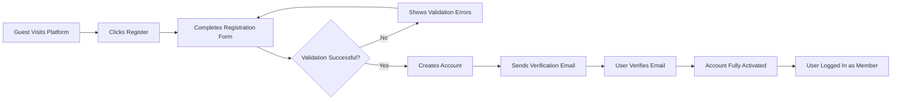
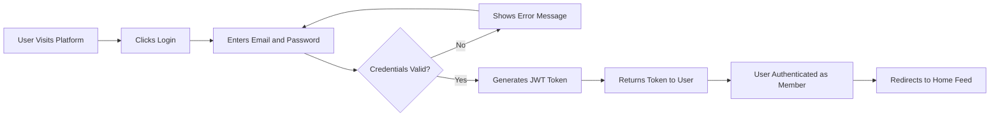

# User Roles and Authentication Requirements

## Overview

This document defines the complete authentication system and user role hierarchy for the Reddit-like community platform. Authentication is the foundation of user identity, content ownership, and permission-based access control throughout the platform. This specification establishes who can access the system, how users prove their identity, and what capabilities each user role possesses.

The platform implements a four-tier role hierarchy: Guests (unauthenticated visitors), Members (authenticated standard users), Moderators (community managers), and Administrators (platform managers). Each role has progressively expanded capabilities, ensuring appropriate access control while maintaining platform security and community standards.

## Authentication System Overview

The platform uses a modern authentication system centered on user credentials (email and password) with secure session management through JSON Web Tokens (JWT). The authentication system supports the complete user lifecycle from initial registration through daily login, password management, and account security.

### Authentication Principles

THE system SHALL implement authentication using email addresses and passwords as the primary credential mechanism.

THE system SHALL use JWT (JSON Web Tokens) for session management and authentication state maintenance.

THE system SHALL maintain user sessions securely with appropriate token expiration and refresh mechanisms.

THE system SHALL distinguish between authenticated and unauthenticated users, applying different permission sets based on authentication status.

## User Registration Requirements

User registration is the process by which new users create accounts and become Members of the platform. Registration establishes user identity, creates credentials, and grants access to authenticated features.

### Registration Workflow

### Registration Data Requirements

WHEN a guest initiates registration, THE system SHALL request the following information:
- Username (display name for the platform)
- Email address (unique identifier and communication channel)
- Password (authentication credential)

THE system SHALL validate that the username meets the following requirements:
- Minimum length of 3 characters
- Maximum length of 20 characters
- Contains only alphanumeric characters, underscores, and hyphens
- Is unique across the entire platform (no duplicate usernames)

THE system SHALL validate that the email address meets the following requirements:
- Conforms to standard email format (contains @ symbol and domain)
- Is unique across the entire platform (no duplicate email addresses)
- Is a valid, deliverable email address

THE system SHALL validate that the password meets the following requirements:
- Minimum length of 8 characters
- Contains at least one uppercase letter
- Contains at least one lowercase letter
- Contains at least one number
- Contains at least one special character (@, #, $, %, &, *, etc.)

### Registration Process Requirements

WHEN a user submits valid registration information, THE system SHALL create a new user account with the following properties:
- Unique user identifier
- Username as provided
- Email address as provided
- Securely hashed password (never stored in plain text)
- Account creation timestamp
- Email verification status (initially unverified)
- Default role assignment (Member)
- Initial karma score of zero

WHEN a new account is created, THE system SHALL send a verification email to the provided email address within 5 minutes.

THE verification email SHALL contain a unique verification link that expires after 24 hours.

WHEN a user clicks the verification link, THE system SHALL mark the email address as verified and confirm activation to the user.

IF a user attempts to register with an email address that already exists, THEN THE system SHALL reject the registration and display an error message indicating the email is already in use.

IF a user attempts to register with a username that already exists, THEN THE system SHALL reject the registration and display an error message indicating the username is already taken.

### Post-Registration Behavior

WHEN registration is successfully completed, THE system SHALL automatically log in the new user as a Member.

THE system SHALL redirect newly registered users to a welcome page or personalized feed after successful registration.

WHEN a user has not verified their email within 24 hours, THE system SHALL allow them to request a new verification email.

## Login and Session Management

Login is the process by which existing users authenticate themselves and gain access to their accounts and Member-level privileges. Session management maintains the authenticated state throughout the user's interaction with the platform.

### Login Workflow

### Login Requirements

WHEN a user attempts to log in, THE system SHALL request the following credentials:
- Email address
- Password

WHEN a user submits login credentials, THE system SHALL validate the email and password against stored account information.

IF the provided email address does not match any registered account, THEN THE system SHALL reject the login attempt and display a generic error message "Invalid email or password."

IF the provided password does not match the stored password for the given email address, THEN THE system SHALL reject the login attempt and display a generic error message "Invalid email or password."

WHEN login credentials are validated successfully, THE system SHALL generate a JWT token containing the following payload:
- User unique identifier
- Username
- User role (Member, Moderator, or Admin)
- Token issue timestamp
- Token expiration timestamp

THE system SHALL set the access token expiration to 30 minutes from the time of issue.

THE system SHALL generate a refresh token with an expiration of 30 days from the time of issue.

WHEN a user successfully logs in, THE system SHALL return both the access token and refresh token to the user's client application.

### Session Management Requirements

THE system SHALL maintain user authentication state using the JWT access token for all authenticated requests.

WHEN a user makes a request to the platform, THE system SHALL validate the JWT token to confirm the user's authentication status and role.

IF a JWT token has expired, THEN THE system SHALL reject the request and return an authentication error requiring the user to refresh their token or log in again.

WHEN a user's access token expires, THE system SHALL allow the user to obtain a new access token using their valid refresh token without re-entering credentials.

WHEN a user requests a token refresh, THE system SHALL validate the refresh token and issue a new access token with a fresh 30-minute expiration.

IF a refresh token has expired, THEN THE system SHALL require the user to log in again with their email and password.

### Logout Requirements

WHEN a user initiates logout, THE system SHALL invalidate the user's current session by clearing tokens from the client application.

THE system SHALL provide a logout mechanism accessible from all authenticated pages.

WHEN a user logs out, THE system SHALL redirect the user to the public homepage or login page.

### Security Requirements for Authentication

THE system SHALL never transmit passwords in plain text.

THE system SHALL store passwords using industry-standard cryptographic hashing algorithms with salt.

THE system SHALL implement rate limiting on login attempts to prevent brute-force attacks, allowing a maximum of 5 failed login attempts within 15 minutes before temporarily locking the account.

WHEN an account is temporarily locked due to failed login attempts, THE system SHALL notify the user via email and unlock the account automatically after 30 minutes.

THE system SHALL log all authentication events including successful logins, failed login attempts, and logout actions for security monitoring.

## Email Verification and Password Management

Email verification and password management features ensure account security and enable users to recover access when credentials are forgotten.

### Email Verification Requirements

WHEN a user registers a new account, THE system SHALL mark the email address as unverified initially.

THE system SHALL send a verification email containing a unique, time-limited verification link.

THE verification link SHALL expire 24 hours after being sent.

WHEN a user clicks a valid verification link, THE system SHALL mark the email address as verified and display a confirmation message.

IF a user clicks an expired verification link, THEN THE system SHALL display an error message and offer to resend a new verification email.

WHEN a user requests a new verification email, THE system SHALL generate a fresh verification link and send it to the registered email address.

THE system SHALL allow users to log in and use the platform even if their email is not yet verified.

WHERE a feature requires email verification (such as posting in certain communities or becoming a moderator), THE system SHALL restrict access and prompt the user to verify their email.

### Password Reset Requirements

THE system SHALL provide a "Forgot Password" mechanism accessible from the login page.

WHEN a user requests a password reset, THE system SHALL ask for the email address associated with their account.

WHEN a valid email address is provided, THE system SHALL send a password reset email containing a unique, time-limited reset link.

THE password reset link SHALL expire 1 hour after being sent.

WHEN a user clicks a valid password reset link, THE system SHALL display a form to enter a new password.

THE new password SHALL meet all password validation requirements specified in the registration section.

WHEN a user submits a valid new password, THE system SHALL update the stored password hash and invalidate all existing sessions for that account.

THE system SHALL display a confirmation message and prompt the user to log in with the new password.

IF a user clicks an expired password reset link, THEN THE system SHALL display an error message and offer to resend a new reset link.

### Password Change Requirements

WHEN an authenticated user wishes to change their password, THE system SHALL provide a password change feature accessible from account settings.

WHEN a user initiates a password change, THE system SHALL require the following information:
- Current password (for verification)
- New password (meeting all validation requirements)
- New password confirmation (must match new password)

THE system SHALL validate that the current password provided matches the stored password.

IF the current password is incorrect, THEN THE system SHALL reject the password change and display an error message "Current password is incorrect."

THE system SHALL validate that the new password meets all password requirements.

THE system SHALL validate that the new password confirmation matches the new password exactly.

WHEN a password change is successful, THE system SHALL update the stored password hash and invalidate all existing sessions except the current session.

THE system SHALL send a notification email to the account email address confirming the password change.

## User Role Hierarchy

The platform implements a four-tier user role system, each with progressively expanded capabilities. This hierarchy ensures appropriate access control, maintains platform security, and enables community governance.

### Role Overview

The platform defines the following user roles:

1. **Guest**: Unauthenticated visitors with read-only access
2. **Member**: Authenticated standard users with full participation rights
3. **Moderator**: Community managers with content moderation capabilities
4. **Administrator**: Platform managers with system-wide control

### Guest Role

Guests are unauthenticated visitors who have not logged in or registered for an account. Guests represent the public face of the platform and have read-only access to public content.

**Guest Capabilities:**

THE system SHALL allow guests to browse public communities without authentication.

THE system SHALL allow guests to view posts in public communities.

THE system SHALL allow guests to read comments on posts without authentication.

THE system SHALL allow guests to view user profiles and public karma scores.

THE system SHALL display community information and rules to guests.

**Guest Restrictions:**

WHEN a guest attempts to create a post, THE system SHALL deny access and prompt the user to register or log in.

WHEN a guest attempts to vote on content, THE system SHALL deny access and prompt the user to register or log in.

WHEN a guest attempts to comment on a post, THE system SHALL deny access and prompt the user to register or log in.

WHEN a guest attempts to subscribe to a community, THE system SHALL deny access and prompt the user to register or log in.

WHEN a guest attempts to create a community, THE system SHALL deny access and prompt the user to register or log in.

WHEN a guest attempts to report content, THE system SHALL deny access and prompt the user to register or log in.

### Member Role

Members are authenticated standard users who have registered and logged into the platform. Members have full participation rights including content creation, voting, commenting, and community subscription.

**Member Capabilities:**

THE system SHALL allow members to create text posts in communities they have access to.

THE system SHALL allow members to create link posts in communities they have access to.

THE system SHALL allow members to create image posts in communities they have access to.

THE system SHALL allow members to upvote posts and comments.

THE system SHALL allow members to downvote posts and comments.

THE system SHALL allow members to comment on posts.

THE system SHALL allow members to reply to comments, creating nested comment threads.

THE system SHALL allow members to edit their own posts within reasonable time limits or indefinitely based on community settings.

THE system SHALL allow members to delete their own posts.

THE system SHALL allow members to edit their own comments within reasonable time limits.

THE system SHALL allow members to delete their own comments.

THE system SHALL allow members to subscribe to communities to personalize their feed.

THE system SHALL allow members to unsubscribe from communities.

THE system SHALL allow members to create new communities, becoming the initial moderator.

THE system SHALL allow members to view their personalized home feed based on subscribed communities.

THE system SHALL allow members to manage their profile information.

THE system SHALL allow members to view their karma scores (post karma and comment karma separately).

THE system SHALL allow members to report inappropriate content for moderator review.

THE system SHALL allow members to change their password.

THE system SHALL allow members to update their email address with re-verification.

**Member Restrictions:**

WHEN a member attempts to edit or delete another user's post, THE system SHALL deny access and display an appropriate error message.

WHEN a member attempts to edit or delete another user's comment, THE system SHALL deny access and display an appropriate error message.

WHEN a member attempts to ban users or remove content they don't own, THE system SHALL deny access unless they are a moderator of that specific community.

WHEN a member attempts to access moderation tools, THE system SHALL deny access unless they have moderator privileges for the specific community.

WHEN a member attempts to access administrative functions, THE system SHALL deny access and display an appropriate error message.

### Moderator Role

Moderators are trusted users who manage specific communities. Moderators retain all member privileges and gain additional moderation capabilities within the communities they manage. Moderator status is community-specific, meaning a user can be a moderator of one community while being a regular member in others.

**How Users Become Moderators:**

WHEN a member creates a new community, THE system SHALL automatically assign them as the first moderator of that community.

THE system SHALL allow existing community moderators to appoint additional moderators from the member base.

THE system SHALL require moderator appointments to be approved by existing moderators of the community.

**Moderator Capabilities:**

THE system SHALL allow moderators to review reported content within their communities.

THE system SHALL allow moderators to remove posts that violate community rules within their communities.

THE system SHALL allow moderators to remove comments that violate community rules within their communities.

THE system SHALL allow moderators to ban users from their specific communities.

THE system SHALL allow moderators to unban users from their specific communities.

THE system SHALL allow moderators to set temporary bans with specified durations.

THE system SHALL allow moderators to configure community settings (name, description, rules, posting permissions).

THE system SHALL allow moderators to create and update community rules.

THE system SHALL allow moderators to pin important posts within their communities.

THE system SHALL allow moderators to add or remove other moderators for their communities.

THE system SHALL allow moderators to view moderation logs showing all moderation actions taken in their communities.

THE system SHALL allow moderators to lock posts to prevent further comments within their communities.

THE system SHALL allow moderators to mark posts with flair or tags within their communities.

**Moderator Restrictions:**

THE system SHALL restrict moderator privileges to only the communities where the user has been assigned moderator status.

WHEN a moderator attempts to moderate content in a community where they are not a moderator, THE system SHALL deny access and treat them as a regular member.

WHEN a moderator attempts to ban a user platform-wide, THE system SHALL deny access (only community-level bans are allowed).

WHEN a moderator attempts to delete communities or access platform-wide administrative functions, THE system SHALL deny access.

### Administrator Role

Administrators are platform-level managers with system-wide elevated permissions. Administrators can manage all communities, handle user appeals, and make platform-wide decisions. Administrators represent the highest authority level on the platform.

**Administrator Capabilities:**

THE system SHALL allow administrators to manage all communities regardless of moderator assignments.

THE system SHALL allow administrators to remove any post or comment platform-wide.

THE system SHALL allow administrators to ban users from the entire platform (global bans).

THE system SHALL allow administrators to suspend user accounts temporarily.

THE system SHALL allow administrators to permanently delete user accounts.

THE system SHALL allow administrators to review and handle appeals from users who have been banned by moderators.

THE system SHALL allow administrators to override moderator decisions.

THE system SHALL allow administrators to remove or appoint moderators in any community.

THE system SHALL allow administrators to delete communities that violate platform-wide policies.

THE system SHALL allow administrators to configure platform-wide settings.

THE system SHALL allow administrators to access platform analytics and usage statistics.

THE system SHALL allow administrators to view all moderation logs across all communities.

THE system SHALL allow administrators to create platform-wide announcements.

THE system SHALL allow administrators to manage user roles, promoting members to administrators or demoting administrators.

**Administrator Security:**

THE system SHALL log all administrative actions for audit and accountability purposes.

THE system SHALL require administrators to confirm destructive actions (such as deleting communities or permanently banning users).

THE system SHALL notify affected users when administrative actions are taken against their accounts.

## Comprehensive Permission Matrix

The following table provides a comprehensive view of all major actions and which roles can perform them:

| Action | Guest | Member | Moderator | Admin |
|--------|-------|--------|-----------|-------|
| **Browsing & Viewing** |
| View public communities | ✅ | ✅ | ✅ | ✅ |
| View posts | ✅ | ✅ | ✅ | ✅ |
| Read comments | ✅ | ✅ | ✅ | ✅ |
| View user profiles | ✅ | ✅ | ✅ | ✅ |
| View community rules | ✅ | ✅ | ✅ | ✅ |
| **Content Creation** |
| Create text posts | ❌ | ✅ | ✅ | ✅ |
| Create link posts | ❌ | ✅ | ✅ | ✅ |
| Create image posts | ❌ | ✅ | ✅ | ✅ |
| Comment on posts | ❌ | ✅ | ✅ | ✅ |
| Reply to comments | ❌ | ✅ | ✅ | ✅ |
| **Content Management** |
| Edit own posts | ❌ | ✅ | ✅ | ✅ |
| Delete own posts | ❌ | ✅ | ✅ | ✅ |
| Edit own comments | ❌ | ✅ | ✅ | ✅ |
| Delete own comments | ❌ | ✅ | ✅ | ✅ |
| Edit others' posts | ❌ | ❌ | ❌ | ❌ |
| Delete others' posts | ❌ | ❌ | ✅ (in moderated communities) | ✅ (platform-wide) |
| Delete others' comments | ❌ | ❌ | ✅ (in moderated communities) | ✅ (platform-wide) |
| **Engagement** |
| Upvote content | ❌ | ✅ | ✅ | ✅ |
| Downvote content | ❌ | ✅ | ✅ | ✅ |
| Change votes | ❌ | ✅ | ✅ | ✅ |
| Earn karma | ❌ | ✅ | ✅ | ✅ |
| **Community Management** |
| Create communities | ❌ | ✅ | ✅ | ✅ |
| Subscribe to communities | ❌ | ✅ | ✅ | ✅ |
| Unsubscribe from communities | ❌ | ✅ | ✅ | ✅ |
| Configure community settings | ❌ | ❌ | ✅ (own communities) | ✅ (all communities) |
| Create community rules | ❌ | ❌ | ✅ (own communities) | ✅ (all communities) |
| Delete communities | ❌ | ❌ | ❌ | ✅ |
| **Moderation** |
| Report content | ❌ | ✅ | ✅ | ✅ |
| Review reports | ❌ | ❌ | ✅ (in moderated communities) | ✅ (platform-wide) |
| Remove posts | ❌ | ❌ | ✅ (in moderated communities) | ✅ (platform-wide) |
| Remove comments | ❌ | ❌ | ✅ (in moderated communities) | ✅ (platform-wide) |
| Ban users from community | ❌ | ❌ | ✅ (in moderated communities) | ✅ (platform-wide) |
| Ban users platform-wide | ❌ | ❌ | ❌ | ✅ |
| Appoint moderators | ❌ | ❌ | ✅ (in own communities) | ✅ (all communities) |
| Remove moderators | ❌ | ❌ | ✅ (in own communities) | ✅ (all communities) |
| Pin posts | ❌ | ❌ | ✅ (in moderated communities) | ✅ (platform-wide) |
| Lock posts | ❌ | ❌ | ✅ (in moderated communities) | ✅ (platform-wide) |
| View moderation logs | ❌ | ❌ | ✅ (own communities) | ✅ (all communities) |
| **Administrative** |
| Access platform analytics | ❌ | ❌ | ❌ | ✅ |
| Manage user roles | ❌ | ❌ | ❌ | ✅ |
| Platform-wide configuration | ❌ | ❌ | ❌ | ✅ |
| Handle user appeals | ❌ | ❌ | ❌ | ✅ |
| Create platform announcements | ❌ | ❌ | ❌ | ✅ |
| Permanently delete accounts | ❌ | ❌ | ❌ | ✅ |
| **Account Management** |
| Register account | ✅ | N/A | N/A | N/A |
| Login | ✅ | ✅ | ✅ | ✅ |
| Logout | N/A | ✅ | ✅ | ✅ |
| Change password | ❌ | ✅ | ✅ | ✅ |
| Reset password | ✅ | ✅ | ✅ | ✅ |
| Update email | ❌ | ✅ | ✅ | ✅ |
| Verify email | ✅ | ✅ | ✅ | ✅ |
| View personalized feed | ❌ | ✅ | ✅ | ✅ |

## Error Handling and User Feedback

Effective error handling ensures users understand what went wrong and how to recover when authentication or permission issues occur.

### Authentication Error Scenarios

IF a user attempts to log in with invalid credentials, THEN THE system SHALL display the message "Invalid email or password. Please try again."

IF a user attempts to log in to an account that has been temporarily locked due to failed login attempts, THEN THE system SHALL display the message "Your account has been temporarily locked due to multiple failed login attempts. Please try again in 30 minutes or reset your password."

IF a user attempts to log in to an account that has been suspended by an administrator, THEN THE system SHALL display the message "Your account has been suspended. Please contact support for more information."

IF a user's JWT token is invalid or malformed, THEN THE system SHALL return an authentication error and prompt the user to log in again.

IF a user's access token has expired, THEN THE system SHALL display the message "Your session has expired. Please log in again."

### Registration Error Scenarios

IF a user attempts to register with an email that is already in use, THEN THE system SHALL display the message "This email address is already registered. Please use a different email or try logging in."

IF a user attempts to register with a username that is already taken, THEN THE system SHALL display the message "This username is already taken. Please choose a different username."

IF a user submits a password that does not meet requirements, THEN THE system SHALL display specific validation errors listing which requirements are not met.

IF a user submits an invalid email format, THEN THE system SHALL display the message "Please enter a valid email address."

### Permission Error Scenarios

WHEN a guest attempts an action requiring authentication, THE system SHALL display a prompt "You need to be logged in to perform this action. Please register or log in."

WHEN a member attempts an action requiring moderator privileges, THE system SHALL display the message "You need moderator privileges to perform this action."

WHEN a moderator attempts to moderate a community where they lack moderator status, THE system SHALL display the message "You are not a moderator of this community."

WHEN a member or moderator attempts an administrative action, THE system SHALL display the message "You do not have permission to perform this action."

### Password Reset Error Scenarios

IF a user clicks an expired password reset link, THEN THE system SHALL display the message "This password reset link has expired. Please request a new password reset."

IF a user enters an incorrect current password during a password change, THEN THE system SHALL display the message "The current password you entered is incorrect."

IF a user's new password confirmation does not match the new password, THEN THE system SHALL display the message "Password confirmation does not match. Please ensure both passwords are identical."

## Security Best Practices

THE system SHALL enforce HTTPS for all authentication-related communications.

THE system SHALL never log or store passwords in plain text anywhere in the system.

THE system SHALL implement secure password hashing using industry-standard algorithms (bcrypt, Argon2, or PBKDF2).

THE system SHALL use cryptographically secure random number generation for creating tokens and verification links.

THE system SHALL implement CSRF protection for all state-changing operations.

THE system SHALL sanitize all user inputs to prevent injection attacks.

THE system SHALL implement rate limiting on sensitive endpoints including login, registration, and password reset to prevent abuse.

THE system SHALL expire password reset tokens and email verification links after specified time periods.

THE system SHALL invalidate all existing sessions when a user changes their password.

THE system SHALL log all security-relevant events including failed login attempts, password changes, and administrative actions.

## Summary

This document has established the complete authentication system and user role hierarchy for the Reddit-like community platform. The four-tier role system (Guest, Member, Moderator, Administrator) provides appropriate access control while enabling community governance and platform management. The authentication system using JWT tokens ensures secure session management, while comprehensive registration, login, and password management workflows support the complete user lifecycle.

For detailed information about how these roles interact with specific features, please refer to the related requirement documents:
- [Service Overview](./01-service-overview.md) for business context and platform strategy
- [Community Management Requirements](./03-community-management.md) for community creation and moderation workflows
- [Content Creation Requirements](./04-content-creation-posts.md) for post creation permissions
- [Content Moderation and Reporting](./10-content-moderation-reporting.md) for detailed moderation workflows

> *Developer Note: This document defines **business requirements only**. All technical implementations (architecture, APIs, database design, etc.) are at the discretion of the development team.*