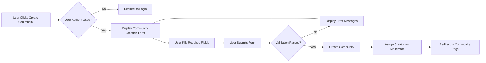

# Community Management Requirements

## 1. Community Concept and Purpose

### 1.1 What Are Communities?

Communities (analogous to subreddits in Reddit) are the foundational organizational structure of this platform. Each community serves as a dedicated space where users gather around shared interests, topics, or themes. Communities provide:

- **Content Organization**: All posts belong to a specific community, creating focused discussion spaces
- **Moderation Boundaries**: Each community has its own moderation team and rules
- **User Affiliation**: Users subscribe to communities that interest them, creating personalized content feeds
- **Identity and Culture**: Each community develops its own culture, rules, and norms

### 1.2 Business Value of Community Structure

The community-centric architecture provides several business advantages:

- **Scalable Content Organization**: As the platform grows, communities naturally segment content without requiring centralized taxonomy management
- **Distributed Moderation**: Community-specific moderators reduce the burden on platform administrators
- **User Engagement**: Subscription-based feeds increase user retention and session duration
- **Content Discovery**: Users can easily find content matching their interests by browsing and subscribing to relevant communities
- **Network Effects**: Popular communities attract more users, driving platform growth

## 2. Community Creation Requirements

### 2.1 Community Creation Authorization

**Role-Based Creation Permission**:
- THE system SHALL allow authenticated members, moderators, and administrators to create new communities
- THE system SHALL deny community creation requests from guest users
- WHEN a guest user attempts to create a community, THE system SHALL redirect them to the registration or login page with a message explaining that account creation is required

### 2.2 Community Creation Workflow

**User Journey for Creating a Community**:

1. User navigates to the "Create Community" interface
2. User fills out required community information (name, description)
3. User optionally configures additional settings (icon, banner, privacy, posting rules)
4. User submits the community creation request
5. System validates all inputs
6. System creates the community and assigns the creator as the primary moderator
7. User is redirected to the newly created community page

### 2.3 Required Community Information

**Community Name Requirements**:
- THE system SHALL require a unique community name
- THE community name SHALL be between 3 and 25 characters long
- THE community name SHALL contain only alphanumeric characters and underscores
- THE community name SHALL not contain spaces
- THE community name SHALL be case-insensitive for uniqueness (e.g., "Gaming" and "gaming" are considered duplicates)
- WHEN a user submits a community name that already exists, THE system SHALL display an error message indicating the name is taken and suggest available alternatives

**Community Description Requirements**:
- THE system SHALL require a community description
- THE description SHALL be between 10 and 500 characters long
- THE description SHALL clearly explain the community's purpose and topic
- THE system SHALL validate that the description does not contain prohibited content (spam links, profanity, etc.)

### 2.4 Optional Community Information

**Community Icon**:
- THE system SHALL allow users to upload a community icon during creation
- IF a user uploads an icon, THE system SHALL validate the file format (JPEG, PNG, GIF allowed)
- IF a user uploads an icon, THE system SHALL validate the file size does not exceed 2MB
- IF a user uploads an icon, THE system SHALL resize the image to 256x256 pixels
- IF no icon is uploaded, THE system SHALL assign a default placeholder icon

**Community Banner**:
- THE system SHALL allow users to upload a community banner during creation
- IF a user uploads a banner, THE system SHALL validate the file format (JPEG, PNG allowed)
- IF a user uploads a banner, THE system SHALL validate the file size does not exceed 5MB
- IF a user uploads a banner, THE system SHALL resize the image to maintain aspect ratio with maximum width of 1920 pixels
- IF no banner is uploaded, THE system SHALL use a default banner or no banner

### 2.5 Community Creation Validation Rules

**Input Validation**:
- THE system SHALL validate all required fields are filled before allowing submission
- THE system SHALL validate community names against a blacklist of prohibited terms
- THE system SHALL validate community names do not impersonate platform entities (e.g., "admin", "moderator", "official")
- THE system SHALL validate descriptions do not contain spam or malicious links

**Creation Limits**:
- THE system SHALL allow users to create a maximum of 3 communities per day to prevent abuse
- WHEN a user reaches the daily creation limit, THE system SHALL display an error message indicating they must wait until the next day
- THE system SHALL allow administrators to bypass creation limits

### 2.6 Community Name Uniqueness Enforcement

**Real-time Name Availability Check**:
- WHILE a user types a community name, THE system SHALL check availability in real-time and display immediate feedback
- THE system SHALL show a green checkmark when a name is available
- THE system SHALL show a red X with an error message when a name is already taken
- THE system SHALL suggest 3-5 similar available names when the desired name is unavailable

## 3. Community Settings and Configuration

### 3.1 Editable Community Metadata

**Post-Creation Settings Management**:
- THE system SHALL allow community moderators to edit community settings after creation
- THE system SHALL allow the following settings to be modified:
  - Community description
  - Community icon
  - Community banner
  - Community rules
  - Posting permissions
  - Privacy settings
  - Content categorization tags

**Non-Editable Fields**:
- THE community name SHALL NOT be editable after creation to maintain URL stability and prevent confusion
- IF a community needs a name change, THE system SHALL require administrator approval and manual intervention

### 3.2 Community Description and Branding

**Description Updates**:
- WHEN a moderator updates the community description, THE system SHALL validate the new description meets length requirements (10-500 characters)
- THE system SHALL save description edit history for audit purposes
- THE system SHALL display the updated description immediately to all users

**Visual Branding**:
- WHEN a moderator uploads a new icon or banner, THE system SHALL apply the same validation rules as during creation
- THE system SHALL replace the old image with the new one immediately
- THE system SHALL optimize images for fast loading across all devices

### 3.3 Content Posting Rules Configuration

**Who Can Post**:
- THE system SHALL provide the following posting permission options:
  - "Anyone Subscribed" - All subscribed members can create posts
  - "Approved Users Only" - Only users approved by moderators can create posts
  - "Moderators Only" - Only community moderators can create posts
- THE default posting permission SHALL be "Anyone Subscribed"
- WHEN a moderator changes posting permissions, THE system SHALL enforce the new rules immediately for all subsequent post attempts

**Post Type Restrictions**:
- THE system SHALL allow moderators to restrict which post types are allowed in their community
- THE system SHALL provide toggles for:
  - Text posts (enabled/disabled)
  - Link posts (enabled/disabled)
  - Image posts (enabled/disabled)
- THE default configuration SHALL allow all post types
- WHEN a user attempts to create a post type that is disabled, THE system SHALL display an error message explaining which post types are allowed

### 3.4 Community Categorization and Tags

**Category Assignment**:
- THE system SHALL provide a predefined list of categories including but not limited to:
  - Technology
  - Gaming
  - Sports
  - Entertainment
  - Education
  - Science
  - Arts & Crafts
  - News & Politics
  - Lifestyle
  - Business & Finance
  - Other
- THE system SHALL allow moderators to assign one primary category to their community
- THE system SHALL allow moderators to assign up to 3 additional secondary tags for better discoverability

**Tag Usage**:
- THE system SHALL use category tags to power community discovery and recommendation features
- THE system SHALL display the primary category prominently on the community page
- THE system SHALL use tags to group communities in browse and search interfaces

### 3.5 Community Content Appearance Settings

**Content Display Options**:
- THE system SHALL allow moderators to configure the default post sorting method for their community (hot, new, top, controversial)
- THE system SHALL allow moderators to enable or disable thumbnail previews for link and image posts
- THE system SHALL allow moderators to set a default comment sort order (best, new, top, controversial)

## 4. Community Subscription System

### 4.1 Discovering Communities

**Community Browse Interface**:
- THE system SHALL provide a community directory accessible to all users (including guests)
- THE system SHALL display communities organized by:
  - Most popular (highest subscriber count)
  - Fastest growing (highest recent subscriber growth rate)
  - Newest (most recently created)
  - By category (grouped by primary category tag)
- THE system SHALL display for each community:
  - Community name
  - Community icon
  - Subscriber count
  - Short description (truncated to 100 characters)
  - Primary category

**Community Search**:
- THE system SHALL provide a search bar for finding communities
- WHEN a user enters a search query, THE system SHALL search community names and descriptions
- THE system SHALL display search results ranked by relevance and subscriber count
- THE system SHALL show at least the top 50 matching communities
- THE system SHALL allow filtering search results by category

### 4.2 Subscription Workflow

**Subscribing to a Community**:
- WHEN an authenticated user clicks the "Subscribe" button on a community, THE system SHALL add that community to the user's subscribed communities list
- WHEN an authenticated user subscribes to a community, THE system SHALL increment the community's subscriber count by 1
- WHEN a user subscribes to a community, THE system SHALL immediately include posts from that community in the user's personalized home feed
- THE system SHALL provide immediate visual feedback (button changes to "Subscribed" or "Unsubscribe")
- THE system SHALL allow users to subscribe from:
  - The community page
  - The community directory
  - Search results

**Guest User Subscription Attempts**:
- WHEN a guest user attempts to subscribe to a community, THE system SHALL display a prompt to register or log in
- THE system SHALL remember the community the guest wanted to subscribe to and automatically subscribe them after successful authentication

### 4.3 Unsubscription Workflow

**Unsubscribing from a Community**:
- WHEN an authenticated user clicks the "Unsubscribe" button on a community they are subscribed to, THE system SHALL remove that community from the user's subscribed communities list
- WHEN an authenticated user unsubscribes from a community, THE system SHALL decrement the community's subscriber count by 1
- WHEN a user unsubscribes from a community, THE system SHALL immediately stop including posts from that community in the user's personalized home feed
- THE system SHALL provide immediate visual feedback (button changes to "Subscribe")

**Unsubscription Access Points**:
- THE system SHALL allow users to unsubscribe from:
  - The community page
  - The user's subscription management page
  - The sidebar of the home feed

### 4.4 Subscription Limits and Management

**Subscription Limits**:
- THE system SHALL allow users to subscribe to an unlimited number of communities
- THE system SHALL display the total count of subscribed communities on the user's profile

**Subscription Management Interface**:
- THE system SHALL provide a dedicated "My Communities" or "Subscriptions" page for each user
- THE system SHALL display all subscribed communities with:
  - Community icon
  - Community name
  - Subscriber count
  - Quick unsubscribe action
- THE system SHALL allow users to sort their subscribed communities by:
  - Alphabetically
  - Most recently subscribed
  - Most active (based on recent post volume)

### 4.5 Subscriber Count Tracking

**Public Subscriber Metrics**:
- THE system SHALL display the current subscriber count on every community page
- THE system SHALL update subscriber counts in real-time or with minimal delay (within 60 seconds)
- THE system SHALL use subscriber count as a key metric for community ranking in discovery interfaces

## 5. Moderator Assignment and Management

### 5.1 Community Creator as Default Moderator

**Automatic Moderator Assignment**:
- WHEN a user creates a new community, THE system SHALL automatically assign them as the primary moderator with full moderator permissions
- THE primary moderator SHALL have the role designation "Founder" or "Creator" to distinguish them from subsequently added moderators
- THE primary moderator SHALL have permissions that cannot be revoked by other moderators

### 5.2 Adding Additional Moderators

**Moderator Invitation Workflow**:
- THE system SHALL allow the primary moderator and existing moderators with "manage moderators" permission to invite additional moderators
- WHEN a moderator invites a new moderator, THE system SHALL:
  1. Verify the invited user is a registered member
  2. Send an invitation notification to the invited user
  3. Add a pending invitation record
- WHEN an invited user accepts the moderator invitation, THE system SHALL grant them moderator permissions for that specific community
- WHEN an invited user declines the moderator invitation, THE system SHALL remove the pending invitation

**Moderator Invitation Requirements**:
- THE invited user SHALL be an existing registered member
- THE invited user SHALL NOT already be a moderator of the community
- THE system SHALL allow a community to have up to 25 moderators

### 5.3 Moderator Hierarchy and Permissions

**Moderator Permission Levels**:
- THE system SHALL support granular moderator permissions including:
  - **Manage Posts**: Remove posts, approve posts, mark as spam
  - **Manage Comments**: Remove comments, approve comments
  - **Manage Users**: Ban users from the community, mute users
  - **Manage Settings**: Edit community settings, rules, appearance
  - **Manage Moderators**: Invite new moderators, remove moderators, adjust permissions
  - **Access Reports**: View and manage content reports
- THE primary moderator (creator) SHALL have ALL permissions by default and cannot have permissions revoked
- THE system SHALL allow the primary moderator to assign custom permission sets to each additional moderator

**Permission Assignment**:
- WHEN a primary moderator invites a new moderator, THE system SHALL allow them to select which permissions to grant
- THE default permission set for new moderators SHALL include "Manage Posts", "Manage Comments", and "Access Reports"
- THE system SHALL allow the primary moderator to modify permissions of existing moderators at any time

### 5.4 Removing Moderators

**Moderator Removal Authority**:
- THE system SHALL allow the primary moderator to remove any other moderator from the community
- THE system SHALL allow moderators with "Manage Moderators" permission to remove moderators who were added after them (seniority-based removal)
- THE system SHALL NOT allow the primary moderator to be removed by any other moderator

**Moderator Removal Process**:
- WHEN a moderator is removed, THE system SHALL immediately revoke all their moderator permissions for that community
- WHEN a moderator is removed, THE system SHALL send them a notification informing them of the removal
- WHEN a moderator is removed, THE system SHALL retain their status as a regular community member (they remain subscribed unless they choose to unsubscribe)

### 5.5 Moderator Resignation

**Voluntary Resignation**:
- THE system SHALL allow any moderator to resign from their moderator position at any time
- WHEN a moderator resigns, THE system SHALL immediately revoke their moderator permissions
- WHEN a moderator resigns, THE system SHALL retain their status as a regular community member

**Primary Moderator Resignation**:
- IF the primary moderator resigns, THE system SHALL promote the longest-serving remaining moderator to primary moderator status
- IF the primary moderator resigns and no other moderators exist, THE system SHALL flag the community for administrator review

## 6. Community Rules and Guidelines

### 6.1 Defining Community-Specific Rules

**Rule Creation Interface**:
- THE system SHALL allow community moderators to create and edit community-specific rules
- THE system SHALL allow moderators to add up to 15 custom rules per community
- WHEN creating a rule, moderators SHALL provide:
  - Rule title (required, 3-100 characters)
  - Rule description (optional, up to 500 characters providing additional context)
  - Rule type (e.g., "Required", "Prohibited", "Etiquette")

**Rule Examples**:
- Communities may define rules such as:
  - "No self-promotion or spam"
  - "Be respectful and civil in discussions"
  - "Posts must be related to [topic]"
  - "No memes or low-effort content"
  - "Use appropriate post flair"

### 6.2 Rule Display to Users

**Rule Visibility**:
- THE system SHALL display community rules prominently in the community sidebar
- THE system SHALL display community rules on the post creation page before users submit content
- THE system SHALL allow users to expand and collapse rule descriptions
- THE system SHALL display a "Read the Rules" link accessible from all community pages

**Rule Acceptance**:
- WHEN a user creates their first post in a community, THE system SHALL display a one-time acknowledgment prompt asking them to confirm they have read the community rules
- THE system SHALL require users to check an "I have read and agree to follow the community rules" checkbox before submitting their first post

### 6.3 Rule Enforcement Mechanisms

**Moderator Enforcement Tools**:
- WHEN moderators remove content, THE system SHALL allow them to select which rule was violated from the community's rule list
- WHEN content is removed for a rule violation, THE system SHALL send the user a notification citing the specific rule that was broken
- THE system SHALL track rule violation patterns per user within each community to identify repeat offenders

**Automated Rule Hints**:
- WHEN a user attempts to post content, THE system SHALL display relevant rules as hints (e.g., if the title contains "I'm selling...", show the "No self-promotion" rule)
- THE system SHALL provide keyword-based rule suggestions to help users comply before posting

### 6.4 Platform-Wide Rules

**Global Rules**:
- THE system SHALL enforce platform-wide rules that apply to all communities regardless of community-specific rules
- THE platform-wide rules SHALL include:
  - No illegal content
  - No harassment or hate speech
  - No doxxing or sharing personal information
  - No vote manipulation or brigading
  - No sexual or suggestive content involving minors
  - No spam or excessive self-promotion across multiple communities
- THE system SHALL NOT allow community moderators to override or disable platform-wide rules

**Rule Priority**:
- WHEN community rules conflict with platform-wide rules, THE platform-wide rules SHALL take precedence
- THE system SHALL allow administrators to remove content that violates platform-wide rules even if community moderators approve it

## 7. Community Discovery and Search

### 7.1 Community Browsing Mechanisms

**Browse Categories**:
- THE system SHALL provide category-based browsing allowing users to explore communities by topic
- WHEN a user selects a category, THE system SHALL display all communities tagged with that category sorted by subscriber count
- THE system SHALL display the top 100 communities in each category

**Trending Communities**:
- THE system SHALL calculate and display trending communities based on:
  - Recent subscriber growth rate (past 7 days)
  - Recent post activity increase
  - Recent upvote velocity
- THE system SHALL update the trending communities list every 6 hours
- THE system SHALL display the top 20 trending communities on the platform homepage

**Popular Communities**:
- THE system SHALL display the most popular communities based on total subscriber count
- THE system SHALL update popular community rankings daily
- THE system SHALL feature the top 50 popular communities on the community directory page

### 7.2 Search Functionality

**Community Search**:
- THE system SHALL provide a search interface for finding communities by name or keywords in their description
- WHEN a user enters a search query, THE system SHALL return results within 1 second for common queries
- THE system SHALL rank search results by:
  - Exact name matches (highest priority)
  - Partial name matches
  - Keyword matches in description
  - Subscriber count (as a tiebreaker)
- THE system SHALL display up to 100 search results per query

**Search Filters**:
- THE system SHALL allow users to filter community search results by:
  - Category
  - Minimum subscriber count (e.g., "communities with 1000+ subscribers")
  - Activity level (active, moderate, low)
- THE system SHALL persist filter selections during the user's session

### 7.3 Featured and Recommended Communities

**Featured Communities**:
- THE system SHALL allow administrators to feature specific communities on the platform homepage
- THE system SHALL display up to 5 featured communities with custom promotional banners
- THE administrators SHALL rotate featured communities weekly to promote diverse content

**Personalized Recommendations**:
- WHEN a user is authenticated, THE system SHALL recommend communities based on:
  - Categories of communities they are already subscribed to
  - Communities popular among users with similar subscription patterns
  - Communities related to topics the user frequently engages with
- THE system SHALL display up to 10 personalized community recommendations on the user's home page
- THE system SHALL update recommendations weekly or when subscription patterns change significantly

### 7.4 Community Directory Organization

**Directory Interface**:
- THE system SHALL provide a comprehensive community directory page accessible from the main navigation
- THE directory SHALL display communities in a grid or list layout with:
  - Community icon
  - Community name (clickable link)
  - Subscriber count
  - Brief description (100 character limit)
  - Primary category tag
  - Subscribe button
- THE system SHALL support infinite scroll or pagination for browsing large numbers of communities

## 8. Community Privacy Settings

### 8.1 Public vs Private Communities

**Public Communities (Default)**:
- THE system SHALL create all new communities as public by default
- THE public communities SHALL be:
  - Visible in community directories and search results
  - Accessible to all users (guests and members) for viewing posts and comments
  - Open for subscription by any authenticated user
  - Indexed for internal search

**Private Communities**:
- THE system SHALL allow community moderators to change a community from public to private
- THE private communities SHALL be:
  - Hidden from community directories and general search results
  - Accessible only to approved members
  - Visible by name only to users who have been invited or approved
  - Not indexed for public search

### 8.2 Access Control for Private Communities

**Joining Private Communities**:
- WHEN a user wants to join a private community, THE system SHALL require them to submit a request to join
- WHEN a join request is submitted, THE system SHALL notify community moderators
- THE system SHALL allow moderators to approve or deny join requests
- WHEN a moderator approves a join request, THE system SHALL grant the user access to view and participate in the community
- WHEN a moderator denies a join request, THE system SHALL notify the user and optionally provide a reason

**Private Community Invitations**:
- THE system SHALL allow moderators of private communities to invite specific users directly
- WHEN a user receives an invitation to a private community, THE system SHALL send them a notification
- WHEN a user accepts a private community invitation, THE system SHALL grant them immediate access

**Private Community Visibility**:
- WHEN a non-member attempts to access a private community, THE system SHALL display a message indicating the community is private and provide an option to request access
- THE system SHALL NOT display posts, comments, or subscriber counts from private communities to non-members

### 8.3 Changing Privacy Settings

**Public to Private Conversion**:
- WHEN a moderator changes a community from public to private, THE system SHALL:
  - Remove the community from public directories
  - Maintain existing subscribers as approved members
  - Require new users to request access
  - Display a notification to all current members explaining the change

**Private to Public Conversion**:
- WHEN a moderator changes a community from private to public, THE system SHALL:
  - Add the community to public directories
  - Make all content visible to all users
  - Allow any authenticated user to subscribe freely
  - Display a notification to all current members explaining the change

## 9. Community Deletion and Archival

### 9.1 Community Deletion Requirements

**Who Can Delete Communities**:
- THE system SHALL allow only the primary moderator (community creator) to delete a community
- THE system SHALL allow platform administrators to delete any community if it violates platform policies
- THE system SHALL NOT allow regular moderators (non-creators) to delete communities

### 9.2 Community Deletion Process

**Deletion Workflow**:
- WHEN a primary moderator initiates community deletion, THE system SHALL display a confirmation dialog warning them that this action is irreversible
- THE system SHALL require the moderator to type the community name exactly to confirm deletion
- WHEN confirmed, THE system SHALL:
  - Mark the community as deleted
  - Remove the community from all directories and search results
  - Unsubscribe all members
  - Archive all posts and comments (not permanently delete, for potential recovery)
  - Prevent new posts or comments
  - Display a "This community has been deleted" message to anyone attempting to access it

**Deletion Cooldown Period**:
- THE system SHALL enforce a 30-day cooldown period before permanent deletion
- DURING the cooldown period, THE system SHALL allow the primary moderator or administrators to restore the community
- AFTER 30 days, THE system SHALL permanently archive all community data

### 9.3 Community Archival for Inactive Communities

**Automatic Archival Criteria**:
- THE system SHALL identify communities as inactive if:
  - No posts have been created in the past 6 months
  - The community has fewer than 10 subscribers
  - No moderators have logged in during the past 6 months

**Archival Process**:
- WHEN a community meets inactivity criteria, THE system SHALL send notifications to all moderators warning of potential archival
- IF no moderator activity occurs within 30 days of the warning, THE system SHALL mark the community as archived
- THE archived communities SHALL:
  - Remain viewable but marked as "Archived"
  - Prevent new posts or comments
  - Remain searchable
  - Be eligible for adoption by new moderators via administrator request

### 9.4 Community Restoration

**Restoring Deleted Communities**:
- DURING the 30-day cooldown period, THE primary moderator SHALL be able to restore a deleted community
- WHEN a community is restored, THE system SHALL:
  - Reactivate the community
  - Restore all posts and comments
  - Re-add the community to directories and search
  - Notify previously subscribed users of the restoration (optional re-subscription)

**Adopting Archived Communities**:
- THE system SHALL allow users to request to adopt archived communities by submitting a request to administrators
- THE administrators SHALL review adoption requests and assign new primary moderators to archived communities
- WHEN a new moderator is assigned, THE system SHALL reactivate the community and remove the archived status

## 10. Community Permission Matrix

The following table defines what each user role can do with respect to community management:

| Action | Guest | Member | Moderator (of community) | Admin |
|--------|-------|--------|--------------------------|-------|
| View public community | ✅ | ✅ | ✅ | ✅ |
| View private community | ❌ | ❌ (unless approved member) | ✅ | ✅ |
| Create community | ❌ | ✅ | ✅ | ✅ |
| Subscribe to public community | ❌ | ✅ | ✅ | ✅ |
| Request access to private community | ❌ | ✅ | ✅ | ✅ |
| Edit community settings | ❌ | ❌ | ✅ (own community only) | ✅ |
| Create community rules | ❌ | ❌ | ✅ (own community only) | ✅ |
| Invite moderators | ❌ | ❌ | ✅ (with permission) | ✅ |
| Remove moderators | ❌ | ❌ | ✅ (primary mod or with permission) | ✅ |
| Delete community | ❌ | ❌ | ✅ (primary moderator only) | ✅ |
| Change community privacy | ❌ | ❌ | ✅ (own community only) | ✅ |
| Archive community | ❌ | ❌ | ❌ | ✅ |
| Restore archived community | ❌ | ❌ | ❌ | ✅ |
| Override community rules | ❌ | ❌ | ❌ | ✅ |

## 11. Community Performance and User Experience Requirements

### 11.1 Performance Expectations

**Community Page Load Time**:
- WHEN a user navigates to a community page, THE system SHALL load and display the page within 2 seconds on standard broadband connections
- THE system SHALL display initial content (community header, description) within 1 second and load posts progressively

**Subscription Actions**:
- WHEN a user subscribes or unsubscribes from a community, THE system SHALL provide immediate visual feedback (button state change) within 200 milliseconds
- THE system SHALL update the user's feed to reflect the subscription change within 60 seconds

**Search Performance**:
- WHEN a user searches for communities, THE system SHALL return results within 1 second for queries matching common terms
- THE system SHALL display at least the first 20 results immediately and load additional results as the user scrolls

### 11.2 Scalability Requirements

**Community Growth**:
- THE system SHALL support up to 100,000 active communities without performance degradation
- THE system SHALL support individual communities with up to 10,000,000 subscribers
- THE system SHALL handle up to 1,000 new community creations per day

### 11.3 Error Handling and User Feedback

**Community Creation Errors**:
- WHEN community creation fails due to validation errors, THE system SHALL display specific error messages for each field with issues
- WHEN community creation fails due to technical errors, THE system SHALL display a user-friendly message and allow the user to retry
- THE system SHALL preserve user input when errors occur so users don't need to re-enter all information

**Subscription Errors**:
- WHEN a subscription action fails, THE system SHALL display an error message and automatically retry once
- IF the retry fails, THE system SHALL provide a manual retry button
- THE system SHALL log subscription failures for debugging

**Access Denied Scenarios**:
- WHEN a user attempts to access a private community without permission, THE system SHALL display a clear message explaining the community is private and provide a "Request Access" button
- WHEN a guest attempts an action requiring authentication, THE system SHALL display a modal prompting them to log in or register

## 12. Business Rules Summary

### 12.1 Core Community Business Rules

1. **Community Uniqueness**: Each community name must be globally unique (case-insensitive)
2. **Creator Ownership**: Community creators are automatically assigned as primary moderators with irrevocable permissions
3. **Subscription Freedom**: Users can subscribe to unlimited communities at no cost
4. **Public by Default**: All new communities are public unless explicitly changed to private by moderators
5. **Distributed Moderation**: Each community manages its own rules and moderation independently within platform-wide guidelines
6. **Platform Rule Supremacy**: Platform-wide rules always override community-specific rules

### 12.2 Content and User Interaction Rules

1. **Posting Permissions**: By default, any subscribed member can post in a community unless moderators restrict permissions
2. **Rule Visibility**: Community rules must be visible to users before they post content
3. **Moderator Hierarchy**: Moderators can only remove moderators who were added after them (seniority-based)
4. **Deletion Protection**: Only primary moderators and administrators can delete communities

### 12.3 Privacy and Access Rules

1. **Private Community Access**: Private communities require explicit approval for membership
2. **Guest Limitations**: Guests can view public communities but cannot subscribe or create communities
3. **Search Visibility**: Only public communities appear in general search and directories
4. **Invitation System**: Private communities can invite users directly, bypassing the request process

## 13. Integration Points with Other System Components

### 13.1 User Authentication Integration

**Community Creation and User Roles**:
- Community creation features SHALL integrate with the user authentication system defined in [User Roles and Authentication Document](./02-user-roles-authentication.md)
- User role verification SHALL occur before allowing community creation, moderator assignment, or permission changes
- Session management SHALL ensure authenticated users maintain their moderator status across sessions

### 13.2 Content Creation Integration

**Post Creation in Communities**:
- All posts SHALL belong to a specific community as defined in the content creation requirements
- Community posting permissions SHALL be enforced before allowing post submission
- Community-specific rules SHALL be displayed during the post creation workflow

### 13.3 Moderation Integration

**Content Moderation Workflow**:
- Community moderators SHALL access reported content through the content moderation system
- Moderator actions (post removal, user bans) SHALL be scoped to their specific communities
- Platform administrators SHALL have override capabilities across all communities

### 13.4 Feed and Discovery Integration

**Personalized Feed Generation**:
- User subscriptions SHALL determine which community posts appear in personalized home feeds
- Community popularity metrics (subscriber count, activity) SHALL influence content ranking in feeds
- Community discovery features SHALL integrate with search and recommendation algorithms

## 14. Future Considerations

While not required for the initial release, the following features may be considered for future iterations:

1. **Community Flairs**: Allow communities to define custom post and user flair tags
2. **Community Wikis**: Enable communities to maintain wiki pages with community information and resources
3. **Community Events**: Allow communities to schedule and promote events
4. **Cross-Community Interactions**: Enable multi-community posts or cross-posting features
5. **Community Analytics**: Provide moderators with detailed analytics on community growth, engagement, and demographics
6. **Community Customization**: Allow advanced CSS or theme customization for community pages
7. **Community Partnerships**: Enable communities to form partnerships or alliances
8. **Community Verification**: Introduce verified community badges for official or high-quality communities

---

> *Developer Note: This documentation defines **business requirements only**. All technical implementations (architecture, APIs, database design, etc.) are at the discretion of the development team.*
