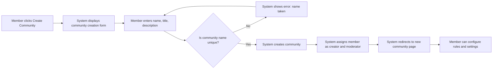
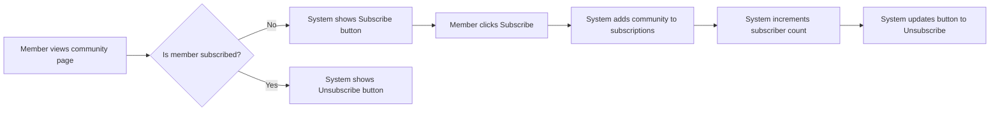
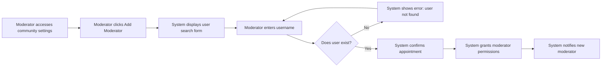
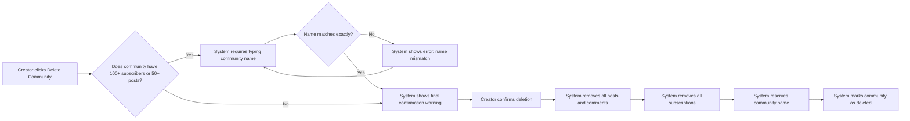

# Community Management Requirements

## Introduction

Communities (analogous to subreddits in Reddit) are the foundational organizing principle of this platform. Each community serves as a dedicated space for users to share content, engage in discussions, and build connections around specific topics, interests, or themes. This document defines the complete business requirements for community creation, configuration, moderation, subscription, discovery, and lifecycle management.

The community system enables decentralized content organization where members can create topic-based spaces, while moderators maintain community standards and culture. This document focuses exclusively on business requirements and user workflows, leaving all technical implementation decisions to the development team.

> *Developer Note: This document defines **business requirements only**. All technical implementations (architecture, APIs, database design, etc.) are at the discretion of the development team.*

## Business Model Context

Communities are the core value driver of the platform's engagement model. By allowing users to create and moderate their own topic-specific spaces, the platform enables:

- **Organic Growth**: Users create communities around emerging interests, driving platform expansion without central planning
- **User Retention**: Subscription to multiple communities creates habit-forming daily engagement
- **Content Quality**: Distributed moderation by passionate community creators maintains higher content standards than centralized moderation alone
- **Network Effects**: More communities attract more users, more users create more communities, creating a virtuous growth cycle

The community-centric model differentiates this platform by empowering users to self-organize around any topic, creating a long-tail of niche communities alongside popular mainstream ones.

## Community Creation and Setup

### Community Creation Process

THE system SHALL allow authenticated members to create new communities at any time.

WHEN a member initiates community creation, THE system SHALL require the following information:
- Community name (unique identifier for URL and display)
- Community display title (human-readable name)
- Community description (purpose and topic explanation)
- Community rules (optional at creation, editable later)

THE community name SHALL be unique across the entire platform.

THE community name SHALL contain only lowercase letters, numbers, and underscores, with length between 3 and 21 characters.

THE community display title SHALL have a maximum length of 100 characters and support Unicode text.

THE community description SHALL have a maximum length of 500 characters.

WHEN a member successfully creates a community, THE system SHALL automatically assign that member as the community's creator and primary moderator.

THE system SHALL record the creation timestamp for every community.

WHEN a community is created, THE system SHALL make it immediately discoverable and accessible to all users.

### Community Creation Business Rules

THE system SHALL allow a single member to create multiple communities without predefined limits.

THE system SHALL prevent duplicate community names by enforcing uniqueness at creation time.

WHEN a community name is already taken, THE system SHALL inform the user immediately and require a different name.

THE system SHALL preserve community names permanently, even if the community is deleted, to prevent impersonation or confusion.

### Community Creator Rights

WHEN a member creates a community, THE system SHALL grant that member permanent moderator status for that community.

THE community creator SHALL have the ability to appoint additional moderators.

THE community creator SHALL have the ability to remove appointed moderators, but cannot remove themselves as moderator.

THE community creator SHALL retain all moderation permissions regardless of additional moderators appointed.

## Community Properties and Configuration

### Core Community Properties

Each community SHALL have the following properties:

**Identity Properties:**
- Unique community name (immutable after creation)
- Display title (editable by moderators)
- Description (editable by moderators)
- Creation date and time
- Creator user identifier

**Content Properties:**
- Community rules text (editable by moderators)
- Community icon/avatar (optional, editable by moderators)
- Community banner image (optional, editable by moderators)

**Metrics Properties:**
- Total subscriber count
- Total post count
- Community activity metrics (posts per day, comments per day)

**Status Properties:**
- Active/Archived status
- Public/Private visibility (for future enhancement)

### Community Configuration Requirements

WHEN a moderator edits community configuration, THE system SHALL apply changes immediately to all users viewing that community.

THE system SHALL allow moderators to update the community display title at any time.

THE system SHALL allow moderators to update the community description at any time.

THE system SHALL allow moderators to set and modify community rules at any time.

THE community rules text SHALL support up to 5,000 characters to accommodate detailed guidelines.

WHEN moderators update community rules, THE system SHALL display the last updated timestamp to users.

### Community Visibility

THE system SHALL make all communities publicly visible by default, allowing any user (including guests) to view community content.

THE system SHALL display community information (name, description, subscriber count, rules) to all visitors regardless of authentication status.

WHEN a guest user views a community, THE system SHALL allow them to browse all posts and comments without requiring login.

WHEN a guest user attempts to subscribe, post, comment, or vote in a community, THE system SHALL redirect them to login or registration.

## Subscription System

### Subscription Mechanics

THE system SHALL allow any authenticated member to subscribe to any public community.

WHEN a member subscribes to a community, THE system SHALL add that community to the member's subscription list.

WHEN a member subscribes to a community, THE system SHALL increment the community's total subscriber count by one.

THE system SHALL allow members to unsubscribe from communities at any time.

WHEN a member unsubscribes from a community, THE system SHALL remove that community from the member's subscription list.

WHEN a member unsubscribes from a community, THE system SHALL decrement the community's total subscriber count by one.

THE system SHALL prevent duplicate subscriptions, ensuring a member can only subscribe to a community once.

WHEN a member attempts to subscribe to a community they're already subscribed to, THE system SHALL treat this as a no-operation and return success.

### Subscription Impact on User Experience

WHEN a member is subscribed to one or more communities, THE system SHALL display posts from those communities in the member's personalized homepage feed.

THE system SHALL use subscription status to personalize content recommendations and community suggestions.

THE system SHALL display a visual indicator on communities showing whether the current member is subscribed.

WHEN viewing a community page, THE system SHALL show members a "Subscribe" button if not subscribed, or "Unsubscribe" if already subscribed.

### Subscription Limits and Rules

THE system SHALL allow members to subscribe to unlimited communities without artificial restrictions.

WHEN a community is deleted or archived, THE system SHALL automatically remove all subscriptions to that community.

THE system SHALL maintain accurate subscriber counts even when users delete their accounts or are banned.

WHEN a user account is deleted, THE system SHALL decrement the subscriber count for all communities that user was subscribed to.

## Moderator Appointment and Hierarchy

### Moderator Role and Authority

Moderators are members who have been granted additional permissions to manage specific communities. Each moderator's authority is scoped to the communities they moderate.

THE system SHALL support multiple moderators per community.

THE system SHALL grant all moderators of a community equal permissions for moderation actions within that community.

### Moderator Appointment Process

THE system SHALL allow existing moderators of a community to appoint additional moderators.

WHEN a moderator appoints a new moderator, THE system SHALL require the username or user identifier of the member to promote.

THE system SHALL verify that the user to be appointed is an existing member before granting moderator status.

WHEN a member is appointed as moderator, THE system SHALL grant them immediate access to all moderation tools for that community.

THE system SHALL notify the newly appointed moderator when they are granted moderator permissions.

### Moderator Removal Process

THE system SHALL allow moderators to remove other moderators from their community.

THE community creator SHALL NOT be removable as a moderator by other moderators.

THE community creator SHALL have the ability to remove any appointed moderator.

WHEN a moderator is removed, THE system SHALL immediately revoke their moderation permissions for that community.

WHEN a moderator is removed, THE system SHALL retain the community's moderation history logs showing actions that moderator performed.

### Moderator Permissions

Moderators of a community SHALL have the following capabilities within their moderated communities:

**Content Moderation:**
- Review reported posts and comments
- Remove posts that violate community rules
- Remove comments that violate community rules
- Approve or deny flagged content

**User Management:**
- Ban users from the community
- Unban previously banned users
- View list of banned users

**Community Configuration:**
- Edit community display title
- Edit community description
- Update community rules
- Upload community icon and banner images

**Moderator Management:**
- Appoint new moderators
- Remove appointed moderators (except community creator)

**Moderation Tools Access:**
- View moderation queue (reported content)
- View moderation logs (history of moderation actions)
- Access community analytics and metrics

THE system SHALL restrict moderator permissions to only the communities they moderate.

WHEN a moderator attempts to perform moderation actions in a community they don't moderate, THE system SHALL deny the action.

## Community Rules and Descriptions

### Community Rules System

THE system SHALL allow moderators to define custom rules for their community.

THE community rules SHALL be displayed prominently to users when viewing the community or creating posts.

THE system SHALL support numbered rule lists where each rule has:
- Rule number (automatically assigned in sequence)
- Rule title (short summary, maximum 100 characters)
- Rule description (detailed explanation, optional, maximum 500 characters per rule)

THE system SHALL allow moderators to create up to 25 rules per community.

WHEN a user reports content in a community, THE system SHALL display the community's rules as report reason options.

### Community Description Requirements

THE community description SHALL serve as the primary explanation of the community's purpose, topic, and culture.

THE system SHALL display the community description on the community's main page, visible to all visitors.

THE description field SHALL support basic formatting including paragraphs and line breaks.

WHEN a user searches for communities, THE system SHALL include community descriptions in search matching.

### Editing Rules and Descriptions

WHEN a moderator updates community rules or descriptions, THE system SHALL save changes immediately.

THE system SHALL display the last updated date for community rules.

THE system SHALL allow moderators to reorder rules by changing rule numbers.

THE system SHALL allow moderators to delete individual rules without affecting other rules.

## Community Discovery and Search

### Community Discovery Mechanisms

THE system SHALL provide multiple ways for users to discover communities:
- Search by community name or description
- Browse popular communities (sorted by subscriber count)
- Browse trending communities (sorted by recent activity)
- Browse newest communities (sorted by creation date)
- Suggested communities based on subscribed communities (personalized recommendations)

### Community Search Requirements

THE system SHALL provide a community search function accessible from the main navigation.

WHEN a user enters a search query, THE system SHALL match against:
- Community names (exact and partial matches)
- Community display titles
- Community descriptions

THE system SHALL return search results instantly for responsive user experience.

THE system SHALL sort search results by relevance, prioritizing:
1. Exact name matches
2. Name prefix matches
3. Name substring matches
4. Description matches with higher subscriber counts

THE system SHALL display search results showing:
- Community name
- Display title
- Description preview (first 150 characters)
- Subscriber count
- Current user's subscription status

WHEN a search query returns no results, THE system SHALL suggest similar community names or indicate no matches found.

### Community Browsing and Listing

THE system SHALL provide a "Browse Communities" page listing all public communities.

THE browse page SHALL support sorting by:
- Most subscribers (popular)
- Most active (posts and comments in last 24 hours)
- Newest (recently created)
- Alphabetical (by name)

THE system SHALL paginate community lists, displaying 25 communities per page for optimal performance.

WHEN a guest user browses communities, THE system SHALL show all the same information as authenticated members, except subscription status indicators.

### Community Recommendations

WHEN a member is subscribed to at least one community, THE system SHALL recommend similar communities based on:
- Communities that users with similar subscriptions follow
- Communities with related topics (based on description keywords)
- Active communities the user hasn't subscribed to yet

THE system SHALL display recommended communities on the user's homepage or sidebar.

## Community Lifecycle Management

### Active Communities

THE system SHALL consider a community "active" from the moment of creation until a moderator explicitly archives it.

Active communities SHALL appear in search results, browse listings, and discovery features.

Active communities SHALL allow all normal operations: posting, commenting, voting, subscribing.

### Community Archiving

THE system SHALL allow moderators to archive their community.

WHEN a moderator archives a community, THE system SHALL change the community status to "archived."

WHEN a community is archived, THE system SHALL:
- Preserve all existing posts, comments, and vote data
- Display all historical content in read-only mode
- Prevent creation of new posts in the community
- Prevent new comments on existing posts
- Prevent new votes on posts or comments
- Prevent new subscriptions to the community
- Maintain existing subscriptions (users remain subscribed but content is read-only)

THE system SHALL display an "Archived" badge on archived communities.

THE system SHALL allow moderators to unarchive communities, restoring full functionality.

WHEN a community is unarchived, THE system SHALL immediately restore all posting, commenting, and voting capabilities.

### Community Deletion

THE system SHALL allow the community creator to permanently delete their community.

WHEN a community creator initiates deletion, THE system SHALL display a confirmation warning explaining that deletion is permanent and irreversible.

WHEN a community is deleted, THE system SHALL:
- Remove the community from all search results and browse listings
- Remove the community from all users' subscription lists
- Remove all posts and comments created within that community
- Remove all votes associated with posts and comments in that community
- Preserve the community name to prevent future reuse (name reservation)

THE system SHALL NOT restore deleted communities under any circumstances.

IF a community has more than 100 subscribers OR more than 50 posts, THEN THE system SHALL require the moderator to type the community name as additional deletion confirmation.

### Community Ownership Transfer

THE system SHALL NOT support automatic ownership transfer when the creator account is deleted.

WHEN a community creator deletes their account, THE system SHALL:
- Maintain the community in active status if other moderators exist
- Promote the longest-serving appointed moderator to creator status
- If no other moderators exist, archive the community automatically

WHEN a community is auto-archived due to creator account deletion with no remaining moderators, THE system SHALL allow the platform administrators to appoint a new moderator upon user request.

## Community Permissions Matrix

The following table defines exact permissions for each user actor in relation to community features:

| Action | Guest | Member | Moderator (of community) |
|--------|-------|--------|-----------------------------|
| View community page | ✅ | ✅ | ✅ |
| View community posts and comments | ✅ | ✅ | ✅ |
| View community rules and description | ✅ | ✅ | ✅ |
| View subscriber count | ✅ | ✅ | ✅ |
| Search for communities | ✅ | ✅ | ✅ |
| Browse community listings | ✅ | ✅ | ✅ |
| Create new community | ❌ | ✅ | ✅ |
| Subscribe to community | ❌ | ✅ | ✅ |
| Unsubscribe from community | ❌ | ✅ | ✅ |
| Create posts in community | ❌ | ✅ | ✅ |
| Create comments in community | ❌ | ✅ | ✅ |
| Vote on posts/comments | ❌ | ✅ | ✅ |
| Edit community title | ❌ | ❌ | ✅ (own community only) |
| Edit community description | ❌ | ❌ | ✅ (own community only) |
| Edit community rules | ❌ | ❌ | ✅ (own community only) |
| Upload community icon/banner | ❌ | ❌ | ✅ (own community only) |
| Appoint moderators | ❌ | ❌ | ✅ (own community only) |
| Remove moderators | ❌ | ❌ | ✅ (own community only, cannot remove creator) |
| Remove posts/comments | ❌ | ❌ | ✅ (own community only) |
| Ban users from community | ❌ | ❌ | ✅ (own community only) |
| Unban users from community | ❌ | ❌ | ✅ (own community only) |
| View moderation queue | ❌ | ❌ | ✅ (own community only) |
| View moderation logs | ❌ | ❌ | ✅ (own community only) |
| Archive community | ❌ | ❌ | ✅ (own community only) |
| Delete community | ❌ | ❌ | ✅ (creator only) |

### Permission Scope Rules

THE moderator permissions SHALL be scoped exclusively to communities where the user has moderator status.

WHEN a moderator performs an action, THE system SHALL verify that the moderator has authority over the specific community before executing the action.

IF a moderator attempts to moderate a community they don't have permissions for, THEN THE system SHALL deny the action and return an appropriate error message.

THE system SHALL maintain a many-to-many relationship between users and communities for moderator assignments, allowing users to moderate multiple communities and communities to have multiple moderators.

## Community-Based Content Access

### Posting Permissions

THE system SHALL restrict post creation to authenticated members who are not banned from the target community.

WHEN a member is banned from a community, THE system SHALL prevent that member from creating new posts in that community.

WHEN a member is banned from a community, THE system SHALL prevent that member from creating new comments in that community.

WHEN a member is banned from a community, THE system SHALL still allow that member to view posts and comments in that community as a read-only visitor.

### Banned User Handling

THE system SHALL maintain a ban list for each community showing all banned users and ban timestamps.

WHEN a moderator bans a user from their community, THE system SHALL:
- Add the user to the community's ban list
- Prevent that user from posting in the community
- Prevent that user from commenting in the community
- Allow that user to continue viewing community content
- Preserve all historical posts and comments created by that user before the ban

THE ban SHALL be scoped to the specific community only and SHALL NOT affect the user's access to other communities.

WHEN a user is banned from a community they're subscribed to, THE system SHALL maintain their subscription but prevent participation.

THE system SHALL allow moderators to unban users, immediately restoring their ability to post and comment in the community.

## Community Metrics and Analytics

### Public Community Statistics

THE system SHALL display the following metrics publicly on each community page:
- Total subscriber count
- Online users count (members currently viewing the community)
- Total posts created in the community
- Community age (time since creation)

THE system SHALL update subscriber counts in real-time when users subscribe or unsubscribe.

### Moderator Analytics

THE system SHALL provide moderators with additional analytics for their communities:
- Posts created per day (last 7 days, last 30 days)
- Comments created per day (last 7 days, last 30 days)
- New subscribers per day (growth trends)
- Top contributors (users with most posts and comments)
- Moderation activity summary (reports reviewed, posts removed, users banned)

THE system SHALL refresh analytics data at least once per hour for moderately active communities.

## Community User Flows

### Flow 1: Creating a New Community

```mermaid
graph LR
    A["Member clicks Create Community"] --> B["System displays community creation form"]
    B --> C["Member enters name, title, description"]
    C --> D{"Is community name unique?"}
    D -->|"No"| E["System shows error: name taken"]
    E --> C
    D -->|"Yes"| F["System creates community"]
    F --> G["System assigns member as creator and moderator"]
    G --> H["System redirects to new community page"]
    H --> I["Member can configure rules and settings"]
```

### Flow 2: Subscribing to a Community

```mermaid
graph LR
    A["Member views community page"] --> B{"Is member subscribed?"}
    B -->|"No"| C["System shows Subscribe button"]
    C --> D["Member clicks Subscribe"]
    D --> E["System adds community to subscriptions"]
    E --> F["System increments subscriber count"]
    F --> G["System updates button to Unsubscribe"]
    B -->|"Yes"| H["System shows Unsubscribe button"]
```

### Flow 3: Moderator Appointing Another Moderator

```mermaid
graph LR
    A["Moderator accesses community settings"] --> B["Moderator clicks Add Moderator"]
    B --> C["System displays user search form"]
    C --> D["Moderator enters username"]
    D --> E{"Does user exist?"}
    E -->|"No"| F["System shows error: user not found"]
    F --> D
    E -->|"Yes"| G["System confirms appointment"]
    G --> H["System grants moderator permissions"]
    H --> I["System notifies new moderator"]
```

### Flow 4: Community Deletion Process

```mermaid
graph LR
    A["Creator clicks Delete Community"] --> B{"Does community have 100+ subscribers or 50+ posts?"}
    B -->|"Yes"| C["System requires typing community name"]
    C --> D{"Name matches exactly?"}
    D -->|"No"| E["System shows error: name mismatch"]
    E --> C
    D -->|"Yes"| F["System shows final confirmation warning"]
    B -->|"No"| F
    F --> G["Creator confirms deletion"]
    G --> H["System removes all posts and comments"]
    H --> I["System removes all subscriptions"]
    I --> J["System reserves community name"]
    J --> K["System marks community as deleted"]
```

## Error Handling Scenarios

### Community Name Conflicts

WHEN a member attempts to create a community with a name that already exists, THE system SHALL immediately display an error message indicating the name is taken.

THE error message SHALL suggest checking for similar community names that are available.

THE system SHALL return the error within 2 seconds of submission.

### Invalid Community Names

WHEN a member enters a community name with invalid characters, THE system SHALL display a real-time validation error explaining the naming rules.

THE system SHALL specify that community names must contain only lowercase letters, numbers, and underscores.

WHEN a member enters a community name shorter than 3 characters or longer than 21 characters, THE system SHALL display a length validation error.

### Moderator Permission Errors

WHEN a user attempts to access moderator tools for a community they don't moderate, THE system SHALL display an error message indicating insufficient permissions.

WHEN a non-creator moderator attempts to delete a community, THE system SHALL display an error message indicating only the creator can delete communities.

### Subscription Errors

WHEN a guest user attempts to subscribe to a community, THE system SHALL redirect to the login page with a message explaining authentication is required.

WHEN network issues prevent subscription processing, THE system SHALL display a retry option and maintain the previous subscription state.

### Community Not Found

WHEN a user navigates to a community URL that doesn't exist, THE system SHALL display a "Community not found" page.

THE not found page SHALL suggest browsing popular communities or using search to find relevant topics.

WHEN a user navigates to a deleted community URL, THE system SHALL display a message indicating the community has been deleted and is no longer available.

## Performance Expectations

### Page Load Requirements

WHEN a user navigates to a community page, THE system SHALL load and display the community information within 2 seconds under normal network conditions.

THE system SHALL prioritize loading community metadata (name, description, subscriber count) before loading posts.

### Search Response Times

WHEN a user searches for communities, THE system SHALL return results instantly (within 1 second) for a responsive experience.

THE system SHALL display partial results immediately while continuing to load complete results in the background.

### Subscription Actions

WHEN a member subscribes or unsubscribes from a community, THE system SHALL update the UI immediately to reflect the new state.

THE system SHALL process the subscription change in the background without blocking the user interface.

### Community Creation

WHEN a member creates a new community, THE system SHALL complete the creation process and redirect to the new community page within 3 seconds.

## Future Enhancements (Out of Scope)

The following features are recognized as potential future enhancements but are NOT required for the initial implementation:

- Private/restricted communities requiring approval to join
- Community categories and tagging system
- Cross-community features (multi-community posting)
- Community partnerships and affiliations
- Advanced moderation tools (auto-moderation rules, spam filters)
- Community widgets and customization themes
- Community events and scheduling features
- Community badges and flair systems
- Verified community status

These enhancements may be considered in future iterations based on user feedback and business priorities.

## Summary

This document has defined comprehensive business requirements for the community management system, which serves as the foundational organizing principle of the Reddit-like platform. Communities enable decentralized content organization, distributed moderation, and user-driven growth through topic-based spaces.

Key aspects covered include:
- Complete community lifecycle from creation through archiving and deletion
- Moderator hierarchy with creator and appointed moderator roles
- Subscription mechanics for personalized content feeds
- Discovery and search for finding relevant communities
- Permission models ensuring appropriate access control
- Community configuration and customization options

All requirements are specified in natural language using EARS format where applicable, focusing on business logic and user workflows rather than technical implementation. Backend developers have full autonomy to design the technical architecture, APIs, and database structures needed to fulfill these business requirements.