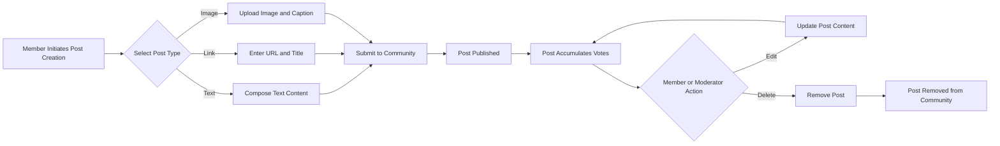

# Content Creation and Post Management

## 1. Introduction

### 1.1 Purpose

Posts are the primary content type that drives user engagement, community discussions, and content discovery within the Reddit-like community platform. This specification covers three distinct post types (text, link, and image), their creation workflows, validation requirements, editing capabilities, and deletion processes.

### 1.2 Post System Overview

The post system enables members to share content within communities, fostering discussions and community engagement. Each post belongs to a single community and is authored by a member. Posts accumulate votes (upvotes and downvotes) that determine their visibility and contribute to the author's karma score. Comments can be attached to posts, creating discussion threads.

Posts serve as the foundation for:
- **Content sharing**: Members contribute valuable information, questions, or media to their communities
- **Discussion initiation**: Posts create context for community conversations
- **Community engagement**: High-quality posts drive subscriptions and active participation
- **User reputation**: Post performance contributes to author karma and community standing

### 1.3 Post Lifecycle

## 2. Post Types and Characteristics

### 2.1 Text Posts

Text posts contain written content authored by members. They are the most versatile post type, suitable for questions, discussions, stories, guides, and opinion pieces.

**Text Post Characteristics**:
- **Title**: Required, brief description of the post content
- **Body**: Required, main text content supporting rich formatting
- **Community**: Required, the community where the post is published
- **Author**: Automatically set to the authenticated member creating the post

**Business Use Cases**:
- Members asking questions to the community
- Sharing detailed experiences or stories
- Starting discussions on specific topics
- Posting guides, tutorials, or informational content

### 2.2 Link Posts

Link posts share external URLs with the community, enabling members to reference articles, websites, videos, or other online resources.

**Link Post Characteristics**:
- **Title**: Required, descriptive title for the linked content
- **URL**: Required, valid external web address
- **Community**: Required, the community where the post is published
- **Author**: Automatically set to the authenticated member creating the post

**Business Use Cases**:
- Sharing news articles relevant to the community
- Posting interesting videos or media content
- Referencing external resources or documentation
- Sharing products, tools, or services for discussion

### 2.3 Image Posts

Image posts display visual content uploaded by members, supporting photos, illustrations, infographics, memes, and other graphical content.

**Image Post Characteristics**:
- **Title**: Required, caption or description of the image
- **Image**: Required, uploaded image file
- **Community**: Required, the community where the post is published
- **Author**: Automatically set to the authenticated member creating the post

**Business Use Cases**:
- Sharing photos related to the community topic
- Posting memes or humorous content
- Displaying infographics or data visualizations
- Showcasing artwork, designs, or creative work

### 2.4 Common Post Properties

All post types share these fundamental properties:

| Property | Description | Mutability |
|----------|-------------|------------|
| Post ID | Unique identifier for the post | Immutable |
| Author | Member who created the post | Immutable |
| Community | Community where post is published | Immutable |
| Title | Post title or headline | Editable |
| Creation Timestamp | When the post was first created | Immutable |
| Last Edit Timestamp | When the post was last modified | Auto-updated on edit |
| Vote Score | Net votes (upvotes minus downvotes) | Dynamic |
| Comment Count | Number of comments on the post | Dynamic |
| Deleted Status | Whether post has been removed | Toggleable |

## 3. Post Creation Requirements

### 3.1 Actor Permissions for Post Creation

**Post Creation Permission Matrix**:

| Actor | Can Create Posts | Restrictions |
|-------|------------------|--------------|
| Guest | ❌ No | Must authenticate as member to create posts |
| Member | ✅ Yes | Can create posts in any public community they can access |
| Moderator | ✅ Yes | Has same post creation rights as members, plus moderation capabilities |

**EARS Requirement**:
- WHEN a guest attempts to create a post, THE system SHALL deny access and return an authentication error
- WHEN a member submits a valid post, THE system SHALL create the post and associate it with the member's account
- THE system SHALL allow moderators to create posts in communities they moderate with the same workflow as regular members

### 3.2 Text Post Creation Requirements

**EARS Requirements**:

1. WHEN a member creates a text post, THE system SHALL require a title between 3 and 300 characters
2. WHEN a member creates a text post, THE system SHALL require body content between 1 and 40,000 characters
3. WHEN a member submits a text post, THE system SHALL validate the title does not consist only of whitespace
4. WHEN a member submits a text post, THE system SHALL validate the body does not consist only of whitespace
5. WHEN a member creates a text post, THE system SHALL require selection of a valid community where the member has posting permissions
6. WHEN a text post is successfully created, THE system SHALL record the creation timestamp
7. WHEN a text post is successfully created, THE system SHALL set the author to the authenticated member
8. WHEN a text post is successfully created, THE system SHALL initialize vote score to zero
9. WHEN a text post is successfully created, THE system SHALL return the complete post details including the unique post ID

**Text Post Input Validation**:

| Field | Validation Rule | Error Message Context |
|-------|-----------------|----------------------|
| Title | Length: 3-300 characters | Title too short or too long |
| Title | Not blank/whitespace only | Title cannot be empty |
| Body | Length: 1-40,000 characters | Body too long |
| Body | Not blank/whitespace only | Body cannot be empty |
| Community ID | Must exist and be accessible | Invalid or inaccessible community |

**Business Rules**:
- Members can create unlimited text posts (subject to rate limiting)
- Text posts are immediately visible upon creation (no approval workflow)
- Post titles should clearly describe the content to facilitate discovery
- Body content supports plain text; formatting is preserved as entered

### 3.3 Link Post Creation Requirements

**EARS Requirements**:

1. WHEN a member creates a link post, THE system SHALL require a title between 3 and 300 characters
2. WHEN a member creates a link post, THE system SHALL require a valid URL
3. WHEN a member submits a link post URL, THE system SHALL validate the URL format matches standard web URL patterns (http or https)
4. WHEN a member submits a link post URL, THE system SHALL verify the URL length does not exceed 2,000 characters
5. WHEN a member creates a link post, THE system SHALL require selection of a valid community
6. WHEN a link post is successfully created, THE system SHALL store the URL exactly as provided without modification
7. WHEN a link post is successfully created, THE system SHALL record the creation timestamp
8. WHEN a link post is successfully created, THE system SHALL set the author to the authenticated member
9. WHEN a link post is successfully created, THE system SHALL initialize vote score to zero

**Link Post Input Validation**:

| Field | Validation Rule | Error Message Context |
|-------|-----------------|----------------------|
| Title | Length: 3-300 characters | Title too short or too long |
| Title | Not blank/whitespace only | Title cannot be empty |
| URL | Valid URL format (http/https) | Invalid URL format |
| URL | Length: maximum 2,000 characters | URL too long |
| URL | Not blank/whitespace only | URL cannot be empty |
| Community ID | Must exist and be accessible | Invalid or inaccessible community |

**Business Rules**:
- The system does not validate whether the URL is accessible or live (no external URL checking)
- Members can post the same URL multiple times in different communities or as different posts
- URLs are stored without normalization to preserve member intent
- Link posts do not include preview generation or metadata extraction (can be added as future enhancement)

### 3.4 Image Post Creation Requirements

**EARS Requirements**:

1. WHEN a member creates an image post, THE system SHALL require a title between 3 and 300 characters
2. WHEN a member creates an image post, THE system SHALL require an uploaded image file
3. WHEN a member uploads an image file, THE system SHALL validate the file format is one of: JPEG, PNG, GIF, or WebP
4. WHEN a member uploads an image file, THE system SHALL validate the file size does not exceed 10 megabytes
5. WHEN a member uploads an image file, THE system SHALL validate the image dimensions do not exceed 10,000 pixels in width or height
6. WHEN an image file passes validation, THE system SHALL store the image securely
7. WHEN an image post is successfully created, THE system SHALL generate a permanent URL for accessing the uploaded image
8. WHEN an image post is successfully created, THE system SHALL record the creation timestamp
9. WHEN an image post is successfully created, THE system SHALL set the author to the authenticated member
10. WHEN an image post is successfully created, THE system SHALL initialize vote score to zero

**Image Post Input Validation**:

| Field | Validation Rule | Error Message Context |
|-------|-----------------|----------------------|
| Title | Length: 3-300 characters | Title too short or too long |
| Title | Not blank/whitespace only | Title cannot be empty |
| Image File | Format: JPEG, PNG, GIF, WebP | Unsupported image format |
| Image File | Size: maximum 10 MB | File too large |
| Image File | Dimensions: max 10,000 x 10,000 px | Image resolution too high |
| Community ID | Must exist and be accessible | Invalid or inaccessible community |

**Image Handling Business Rules**:
- Images are uploaded directly to the platform's storage system (not external hosting)
- The system stores original images without automatic compression or resizing (optimization can be added later)
- Each uploaded image receives a unique identifier for retrieval
- Image URLs are permanent and do not change after creation
- Animated GIFs are supported and preserved with animation
- Members cannot upload videos or other media types through image posts
- Deleted image posts result in image files being marked for deletion from storage

**Image Storage Approach**:
- Images are stored server-side in a secure file storage system
- Access to image files is public (no authentication required to view images once posted)
- Image URLs include the post ID for association and tracking
- Storage quota per user is not enforced in initial version

### 3.5 Community Association

**EARS Requirements**:

1. WHEN a member creates any post type, THE system SHALL require the member to specify a target community
2. WHEN a member selects a community for posting, THE system SHALL verify the community exists
3. WHEN a member selects a community for posting, THE system SHALL verify the member has permission to post in that community
4. IF a member is banned from a community, THEN THE system SHALL prevent the member from creating posts in that community
5. WHEN a post is created, THE system SHALL permanently associate the post with the specified community (immutable)

**Business Rules**:
- Members can post in any public community unless they are banned
- Community moderators can post in their own communities with the same workflow as regular members
- Posts cannot be moved between communities after creation
- Private or restricted communities (if implemented in future) would require additional permission checks

## 4. Content Validation and Limits

### 4.1 Title Validation

**EARS Requirements**:

1. THE system SHALL enforce a minimum title length of 3 characters for all post types
2. THE system SHALL enforce a maximum title length of 300 characters for all post types
3. WHEN a member submits a post title, THE system SHALL trim leading and trailing whitespace before validation
4. IF a post title consists only of whitespace after trimming, THEN THE system SHALL reject the post with a validation error
5. WHEN a post title is validated successfully, THE system SHALL preserve internal spacing and capitalization as entered

**Title Business Rules**:
- Titles are plain text (no rich formatting or markup)
- Special characters and Unicode are permitted in titles
- The system does not enforce title uniqueness (duplicate titles are allowed)
- Titles are indexed for search functionality

### 4.2 Text Content Validation

**EARS Requirements**:

1. THE system SHALL enforce a minimum body content length of 1 character for text posts
2. THE system SHALL enforce a maximum body content length of 40,000 characters for text posts
3. WHEN a member submits post body content, THE system SHALL preserve line breaks and paragraph formatting
4. IF post body content consists only of whitespace, THEN THE system SHALL reject the post with a validation error

**Text Content Business Rules**:
- Body content supports plain text with preserved whitespace and line breaks
- Special characters, Unicode, and emoji are permitted
- Markdown or rich text formatting is not supported in the initial version (can be added as enhancement)
- The system does not perform content filtering or profanity checking at the platform level (moderators handle inappropriate content)

### 4.3 URL Validation

**EARS Requirements**:

1. WHEN a member submits a URL for a link post, THE system SHALL validate the URL starts with http:// or https://
2. WHEN a member submits a URL for a link post, THE system SHALL validate the URL length does not exceed 2,000 characters
3. WHEN a member submits a URL, THE system SHALL accept the URL without checking whether the destination is accessible
4. WHEN a valid URL is submitted, THE system SHALL store the URL exactly as provided without normalization

**URL Business Rules**:
- Only web URLs (http/https) are supported (no ftp, mailto, or other protocols)
- The system does not verify if URLs are live or return successful HTTP responses
- URL shorteners are permitted (no restriction on URL structure beyond protocol and length)
- Duplicate URLs can be posted multiple times by the same or different members

### 4.4 Image File Validation

**EARS Requirements**:

1. WHEN a member uploads an image file, THE system SHALL verify the file extension is .jpg, .jpeg, .png, .gif, or .webp
2. WHEN a member uploads an image file, THE system SHALL verify the MIME type matches the expected image format
3. WHEN a member uploads an image file, THE system SHALL verify the file size does not exceed 10 megabytes (10,485,760 bytes)
4. WHEN a member uploads an image file, THE system SHALL read the image dimensions and verify neither width nor height exceeds 10,000 pixels
5. IF an uploaded file fails any validation check, THEN THE system SHALL reject the upload and return a specific error message indicating the validation failure

**Image Validation Business Rules**:
- The system validates both file extension and MIME type to prevent misnamed files
- Corrupted or invalid image files are rejected during processing
- The system does not perform content scanning or analyze image content for inappropriate material
- Animated GIFs are processed to verify they are valid images but animation is preserved

### 4.5 Content Sanitization

**EARS Requirements**:

1. WHEN any text input is received (titles, body content), THE system SHALL sanitize input to prevent code injection attacks
2. WHEN text content is stored, THE system SHALL escape HTML special characters to prevent cross-site scripting
3. WHEN text content is retrieved for display, THE system SHALL return sanitized content safe for rendering

**Sanitization Business Rules**:
- All user-generated text is treated as untrusted input
- HTML tags, JavaScript, and other code elements are escaped or stripped
- Unicode and special characters are preserved for legitimate use (emoji, international characters)
- URL input is stored as-is but validated for protocol safety

## 5. Post Editing Requirements

### 5.1 Edit Permissions

**EARS Requirements**:

1. THE system SHALL allow post authors to edit their own posts
2. THE system SHALL allow post authors to edit posts at any time after creation (no time limit)
3. WHEN a moderator views a post in their community, THE system SHALL not provide moderators with post editing capabilities (moderators can only delete, not edit)
4. IF a member attempts to edit another member's post, THEN THE system SHALL deny the edit request with a permission error

**Edit Permission Matrix**:

| Actor | Can Edit Own Posts | Can Edit Others' Posts | Restrictions |
|-------|-------------------|----------------------|--------------|
| Guest | ❌ No | ❌ No | Cannot edit any posts |
| Member (Author) | ✅ Yes | ❌ No | Can edit only their own posts |
| Member (Non-author) | N/A | ❌ No | Cannot edit posts by other members |
| Moderator (Non-author) | ✅ Yes (own posts) | ❌ No | Cannot edit posts by community members |

### 5.2 Editable Fields by Post Type

**Text Posts - Editable Fields**:

| Field | Editable | Notes |
|-------|----------|-------|
| Title | ✅ Yes | Can be updated at any time |
| Body Content | ✅ Yes | Can be updated at any time |
| Community | ❌ No | Immutable after creation |
| Author | ❌ No | Immutable after creation |
| Creation Timestamp | ❌ No | Immutable after creation |

**Link Posts - Editable Fields**:

| Field | Editable | Notes |
|-------|----------|-------|
| Title | ✅ Yes | Can be updated at any time |
| URL | ❌ No | Immutable to prevent bait-and-switch |
| Community | ❌ No | Immutable after creation |
| Author | ❌ No | Immutable after creation |
| Creation Timestamp | ❌ No | Immutable after creation |

**Image Posts - Editable Fields**:

| Field | Editable | Notes |
|-------|----------|-------|
| Title | ✅ Yes | Can be updated at any time |
| Image | ❌ No | Immutable after upload |
| Community | ❌ No | Immutable after creation |
| Author | ❌ No | Immutable after creation |
| Creation Timestamp | ❌ No | Immutable after creation |

### 5.3 Edit Workflow Requirements

**EARS Requirements**:

1. WHEN a member edits a post, THE system SHALL validate the new content using the same validation rules as post creation
2. WHEN a member successfully updates a post, THE system SHALL update the "last edited" timestamp to the current time
3. WHEN a post is edited, THE system SHALL preserve the original creation timestamp
4. WHEN a post is edited, THE system SHALL preserve all existing votes and comments
5. WHEN a post edit is saved, THE system SHALL return the updated post details

**Edit Business Rules**:
- Edits are saved immediately without moderation or approval
- The system does not maintain edit history (members cannot see previous versions)
- Editing a post does not change its position in sorted feeds (sort rank based on original creation time and votes)
- Members cannot edit deleted posts (must be active)
- No notification is sent when a post is edited

### 5.4 Link URL Immutability

**Business Rationale**: Link post URLs are immutable after creation to prevent "bait-and-switch" tactics where a member posts a legitimate link that gains votes, then changes it to spam or inappropriate content.

**EARS Requirement**:
- THE system SHALL prevent modification of link post URLs after the post is created
- IF a member wants to change a link URL, THEN the member SHALL delete the original post and create a new link post with the correct URL

## 6. Post Deletion Requirements

### 6.1 Deletion Permissions

**EARS Requirements**:

1. THE system SHALL allow post authors to delete their own posts at any time
2. THE system SHALL allow community moderators to delete any post within communities they moderate
3. IF a guest attempts to delete a post, THEN THE system SHALL deny the request with an authentication error
4. IF a member attempts to delete another member's post in a community they do not moderate, THEN THE system SHALL deny the request with a permission error

**Deletion Permission Matrix**:

| Actor | Can Delete Own Posts | Can Delete Others' Posts | Scope |
|-------|---------------------|------------------------|-------|
| Guest | ❌ No | ❌ No | No deletion permissions |
| Member (Author) | ✅ Yes | ❌ No | Own posts only |
| Member (Non-author) | N/A | ❌ No | Cannot delete others' posts |
| Moderator | ✅ Yes (own posts) | ✅ Yes | Posts in moderated communities |

### 6.2 Soft Delete Approach

**EARS Requirements**:

1. WHEN a post is deleted, THE system SHALL mark the post as deleted rather than permanently removing it from the database (soft delete)
2. WHEN a post is deleted, THE system SHALL preserve the post record including author, community, timestamps, and metadata
3. WHEN a deleted post is accessed, THE system SHALL display a placeholder indicating the post has been removed
4. WHEN a deleted post is viewed, THE system SHALL hide the post content (title, body, URL, or image) from all users
5. WHEN a deleted post is accessed, THE system SHALL preserve and display existing comments for context

**Soft Delete Business Rules**:
- Deleted posts remain in the database for audit and moderation purposes
- Post IDs of deleted posts are not reused
- Deleted posts do not appear in community feeds or search results
- Direct links to deleted posts show a "post removed" message
- Vote counts on deleted posts are preserved but hidden from public view

### 6.3 Comment and Vote Preservation

**EARS Requirements**:

1. WHEN a post is deleted, THE system SHALL preserve all comments associated with the post
2. WHEN a deleted post is viewed directly, THE system SHALL display existing comments to provide discussion context
3. WHEN a post is deleted, THE system SHALL preserve all vote records for karma calculation purposes
4. WHEN a post is deleted, THE system SHALL freeze the vote score at the time of deletion

**Business Rules**:
- Comments on deleted posts remain visible when accessing the post directly
- Members cannot add new comments to deleted posts
- Deleted posts do not accept new votes
- Existing votes on deleted posts continue to count toward author karma

### 6.4 Image Post Deletion

**EARS Requirements**:

1. WHEN an image post is deleted, THE system SHALL mark the associated image file for removal from storage
2. WHEN an image file is marked for deletion, THE system SHALL make the image URL inaccessible
3. WHEN an image is deleted, THE system SHALL remove the file from storage within 24 hours

**Image Deletion Business Rules**:
- Deleted image files are not immediately removed to allow for recovery in case of accidental deletion
- Image URLs return an error or placeholder after deletion
- Storage space is reclaimed after the retention period expires

### 6.5 Deletion by Moderators vs. Authors

**EARS Requirements**:

1. WHEN a moderator deletes a post, THE system SHALL record the moderator's identity and deletion timestamp in moderation logs
2. WHEN an author deletes their own post, THE system SHALL record the deletion as author-initiated
3. WHEN a post is deleted by a moderator, THE system SHALL optionally allow the moderator to specify a removal reason

**Business Rules**:
- Moderator deletions are logged for transparency and audit purposes
- Author deletions are treated as voluntary content removal
- Removal reasons are visible to other moderators but not to regular members
- Authors cannot recover posts deleted by moderators (moderator decision is final)

## 7. Post Metadata and Properties

### 7.1 Timestamps

**EARS Requirements**:

1. WHEN a post is created, THE system SHALL record the creation timestamp with precision to the second
2. WHEN a post is edited, THE system SHALL update the "last edited" timestamp to the current time
3. IF a post has never been edited, THEN THE system SHALL indicate the post has not been modified
4. WHEN post timestamps are displayed, THE system SHALL use UTC timezone for consistency

**Timestamp Properties**:

| Timestamp Field | Set On | Mutable | Purpose |
|-----------------|--------|---------|---------|
| Created At | Post creation | ❌ Immutable | Determines post age for sorting |
| Last Edited At | Post edit | ✅ Updated on each edit | Indicates when post was modified |

**Business Rules**:
- Creation timestamp determines post position in "new" sorting
- Last edited timestamp helps users identify recently updated content
- Timestamps are stored in UTC and converted to user's local timezone for display
- Edit timestamp is null if post has never been edited

### 7.2 Author Information

**EARS Requirements**:

1. WHEN a post is created, THE system SHALL set the author to the authenticated member creating the post
2. THE system SHALL store the author's member ID as an immutable property of the post
3. WHEN a post is displayed, THE system SHALL include the author's username and profile link
4. IF an author's account is deleted, THEN the post SHALL remain visible with the author marked as deleted user

**Author Properties**:
- Author member ID (immutable)
- Author username (displayed, may change if user updates profile)
- Author karma at time of viewing (dynamic)

**Business Rules**:
- Authors cannot be changed after post creation (no post transfers)
- If a member's account is deleted, their posts remain but show "[deleted]" as author
- Author information is required for all posts (no anonymous posting)

### 7.3 Community Association

**EARS Requirements**:

1. WHEN a post is created, THE system SHALL permanently associate the post with the specified community
2. THE system SHALL store the community ID as an immutable property of the post
3. WHEN a post is displayed, THE system SHALL include the community name and link
4. IF a community is deleted, THEN all posts in that community SHALL be marked as inaccessible

**Business Rules**:
- Posts cannot be moved between communities after creation
- Posts are always viewed in the context of their parent community
- Deleted communities result in orphaned posts that are no longer accessible

### 7.4 Vote Score and Engagement Metrics

**EARS Requirements**:

1. WHEN a post is created, THE system SHALL initialize the vote score to zero
2. WHEN users vote on a post, THE system SHALL update the vote score in real-time
3. WHEN a post is displayed, THE system SHALL show the current net vote score (upvotes minus downvotes)
4. WHEN a post is displayed, THE system SHALL show the total number of comments
5. THE system SHALL calculate and display the post score dynamically based on current vote data

**Engagement Metrics**:

| Metric | Description | Update Frequency |
|--------|-------------|------------------|
| Vote Score | Net votes (upvotes - downvotes) | Real-time on each vote |
| Upvote Count | Total number of upvotes | Real-time on each vote |
| Downvote Count | Total number of downvotes | Real-time on each vote |
| Comment Count | Total number of comments (including nested replies) | Real-time on comment creation/deletion |

**Business Rules**:
- Vote scores can be negative if downvotes exceed upvotes
- Vote scores are displayed publicly for all posts
- Comment count includes all nested replies (not just top-level comments)
- Engagement metrics influence post ranking in various sorting algorithms

### 7.5 Post Identification

**EARS Requirements**:

1. WHEN a post is created, THE system SHALL generate a unique post ID
2. THE system SHALL ensure post IDs are globally unique across all posts
3. THE system SHALL use post IDs for all post retrieval operations
4. WHEN a post URL is generated, THE system SHALL include the post ID for direct access

**Business Rules**:
- Post IDs are immutable and never reused
- Post IDs are used in URLs for direct linking
- Post IDs are used to associate votes and comments with posts

## 8. Error Handling and Edge Cases

### 8.1 Authentication and Authorization Errors

**EARS Requirements**:

1. IF a guest attempts to create a post, THEN THE system SHALL return an authentication required error
2. IF a member attempts to create a post with an invalid or expired authentication token, THEN THE system SHALL return an authentication expired error
3. IF a member attempts to edit a post they did not author, THEN THE system SHALL return a permission denied error
4. IF a member attempts to delete a post they did not author and they are not a moderator of the community, THEN THE system SHALL return a permission denied error
5. IF a banned member attempts to post in a community, THEN THE system SHALL return a ban error indicating the member is restricted from posting

**Error Response Business Rules**:
- Authentication errors include guidance to log in or refresh authentication
- Permission errors clearly state why the action was denied
- Ban errors indicate the member is banned from the specific community

### 8.2 Validation Errors

**EARS Requirements**:

1. IF a post title is shorter than 3 characters, THEN THE system SHALL return a validation error indicating the minimum title length
2. IF a post title exceeds 300 characters, THEN THE system SHALL return a validation error indicating the maximum title length
3. IF a text post body is empty or whitespace-only, THEN THE system SHALL return a validation error indicating body content is required
4. IF a text post body exceeds 40,000 characters, THEN THE system SHALL return a validation error indicating the maximum body length
5. IF a link post URL is invalid or missing protocol, THEN THE system SHALL return a validation error indicating the URL format requirements
6. IF an image file exceeds 10 MB, THEN THE system SHALL return a validation error indicating the maximum file size
7. IF an image file is not a supported format, THEN THE system SHALL return a validation error listing supported formats (JPEG, PNG, GIF, WebP)
8. IF an image has dimensions exceeding 10,000 pixels, THEN THE system SHALL return a validation error indicating the maximum dimensions

**Validation Error Business Rules**:
- Validation errors are returned immediately before any data is persisted
- Error messages are specific and actionable (tell users exactly what to fix)
- Multiple validation errors are returned together when possible (don't make users fix one error at a time)
- Validation errors include the field name and constraint that was violated

### 8.3 Resource Not Found Errors

**EARS Requirements**:

1. IF a member attempts to create a post in a non-existent community, THEN THE system SHALL return a community not found error
2. IF a member attempts to edit a non-existent post, THEN THE system SHALL return a post not found error
3. IF a member attempts to delete a non-existent post, THEN THE system SHALL return a post not found error
4. IF a member attempts to retrieve a deleted post, THE system SHALL return a post removed message rather than a not found error

**Business Rules**:
- Not found errors distinguish between "never existed" and "was deleted"
- Not found errors do not reveal information about resources the user cannot access (privacy)

### 8.4 Rate Limiting and Spam Prevention

**EARS Requirements**:

1. IF a member creates more than 10 posts within 60 minutes, THEN THE system SHALL reject additional post creation requests with a rate limit error
2. IF a member creates multiple posts with identical titles within 10 minutes, THEN THE system SHALL flag the behavior as potential spam and require additional verification
3. WHEN a rate limit is triggered, THE system SHALL inform the member how long they must wait before posting again

**Rate Limiting Business Rules**:
- Rate limits apply per member across all communities
- Rate limits reset after the time window expires
- Rate limits are more permissive for established members with high karma (can be configured based on reputation)
- Moderators are not subject to rate limits in communities they moderate

### 8.5 Image Upload Errors

**EARS Requirements**:

1. IF an image upload fails due to network interruption, THEN THE system SHALL return an upload failed error and allow the member to retry
2. IF an image file is corrupted or cannot be processed, THEN THE system SHALL return an invalid image file error
3. IF storage quota is exceeded (future limitation), THEN THE system SHALL return a storage quota exceeded error

**Image Upload Business Rules**:
- Upload failures do not create incomplete post records
- Corrupted files are detected during processing before post creation
- Members are allowed to retry failed uploads without penalty

### 8.6 Concurrent Modification Handling

**EARS Requirements**:

1. IF a member attempts to edit a post that has been deleted, THEN THE system SHALL return a post no longer available error
2. IF two edit requests occur simultaneously, THE system SHALL process edits sequentially and the last edit SHALL overwrite previous changes

**Business Rules**:
- The system does not implement optimistic locking for post edits (last write wins)
- Concurrent edits are rare in typical usage patterns
- Members are responsible for reviewing post state before editing

## 9. Integration with Other Systems

### 9.1 Relationship with User Actors

Posts interact with the user actor system defined in the [User Actors and Authentication Document](./02-user-actors-authentication.md):

- **Members** create, edit, and delete their own posts
- **Moderators** have additional deletion capabilities for posts in their communities
- **Guests** can view posts but cannot create, edit, or interact with them

### 9.2 Relationship with Communities

Posts are fundamentally tied to communities as defined in the [Community Management Document](./03-community-management.md):

- Every post must belong to exactly one community
- Community membership and banning rules affect posting permissions
- Community moderators have content moderation authority over posts

### 9.3 Relationship with Voting System

Posts accumulate votes that affect ranking and author karma, as detailed in the [Voting and Karma System Document](./05-voting-karma-system.md):

- Post vote scores determine visibility in sorted feeds
- Post votes contribute to author karma
- Vote data is preserved even when posts are deleted

### 9.4 Relationship with Comments

Posts serve as the parent entity for comment threads, as specified in the [Comments and Discussions Document](./06-comments-discussions.md):

- Comments are attached to posts and create discussion threads
- Comment counts are displayed as post metadata
- Deleted posts preserve existing comments for context

### 9.5 Relationship with Content Sorting

Post metadata (timestamps, votes) drives content discovery algorithms detailed in the [Content Sorting Algorithms Document](./07-content-sorting-algorithms.md):

- Creation timestamp determines "new" sorting position
- Vote score and age determine "hot" ranking
- Vote distribution affects "controversial" classification

## 10. Performance and User Experience Expectations

### 10.1 Post Creation Performance

**EARS Requirements**:

1. WHEN a member submits a text or link post, THE system SHALL create the post and return confirmation within 2 seconds
2. WHEN a member uploads an image post under 5 MB, THE system SHALL complete the upload and post creation within 5 seconds
3. WHEN a member uploads an image post between 5-10 MB, THE system SHALL complete the upload and post creation within 10 seconds

**Performance Business Rules**:
- Post creation should feel instant for text and link posts
- Image uploads provide progress indication for user feedback
- Slow network conditions may extend upload times beyond targets

### 10.2 Post Retrieval Performance

**EARS Requirements**:

1. WHEN a user requests to view a post, THE system SHALL load and display the post content within 1 second
2. WHEN a user accesses a community feed, THE system SHALL load the first page of posts within 2 seconds

**Business Rules**:
- Post retrieval is optimized for fast loading
- Images may load progressively after initial page render
- Feed pagination ensures consistent performance regardless of community size

### 10.3 Edit and Delete Performance

**EARS Requirements**:

1. WHEN a member edits a post, THE system SHALL save changes and update the display within 2 seconds
2. WHEN a member or moderator deletes a post, THE system SHALL mark the post as deleted and update the display within 1 second

**Business Rules**:
- Edit and delete actions provide immediate feedback
- Background processes (like image deletion) occur asynchronously

## 11. Future Enhancements and Considerations

### 11.1 Potential Future Features

The following features are not included in the initial version but may be considered for future development:

**Rich Text Formatting**:
- Markdown support for text posts
- Bold, italic, lists, quotes
- Inline images and embedded media

**Post Previews**:
- Automatic link preview generation with thumbnail and description
- Open Graph metadata extraction for link posts

**Post Templates**:
- Community-specific post templates
- Structured posts for specific use cases (e.g., AMAs, polls)

**Scheduled Posting**:
- Members can schedule posts for future publication
- Automatic posting at specified times

**Post Collections**:
- Members can save posts to personal collections
- Curated post lists for easy reference

**Cross-posting**:
- Share the same post to multiple communities
- Track original source and cross-post relationships

### 11.2 Scalability Considerations

As the platform grows, the following scalability enhancements may be needed:

- Image CDN integration for faster image delivery
- Post caching for high-traffic posts
- Database sharding for large-scale post storage
- Rate limiting adjustments based on user reputation
- Content delivery optimization for global audiences

---

**Document Version**: 1.0  
**Last Updated**: 2025-11-14  
**Related Documents**: 
- [User Actors and Authentication](./02-user-actors-authentication.md)
- [Community Management](./03-community-management.md)
- [Voting and Karma System](./05-voting-karma-system.md)
- [Comments and Discussions](./06-comments-discussions.md)
- [Content Sorting Algorithms](./07-content-sorting-algorithms.md)