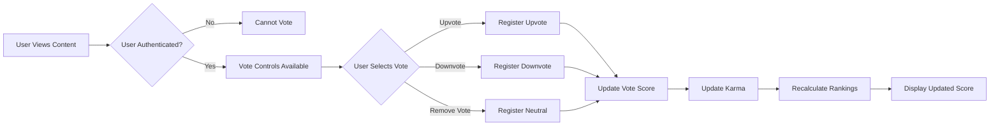
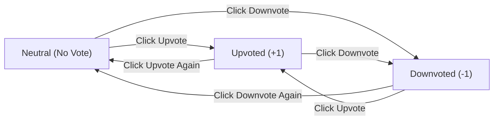

# Voting System Requirements

## 1. Voting System Overview

### 1.1 Introduction

The voting system is a core engagement mechanism that allows users to signal the quality and relevance of content within the community platform. Through upvotes and downvotes, users collectively determine which posts and comments rise to prominence and which sink into obscurity.

### 1.2 Business Purpose

The voting system serves multiple critical business functions:

- **Content Quality Signal**: Votes indicate community assessment of content value, helping surface high-quality contributions while suppressing low-quality or irrelevant content
- **Content Ranking Mechanism**: Vote scores directly influence how content appears in various sorting algorithms (hot, top, controversial), shaping user experience
- **User Reputation System**: Votes on a user's content contribute to their karma score, creating a reputation system that rewards valuable contributions
- **Community Self-Moderation**: Voting enables the community to self-regulate content quality before moderator intervention is necessary
- **User Engagement Driver**: The ability to vote creates interactive participation and investment in the platform

### 1.3 Votable Content Types

THE system SHALL support voting on the following content types:

- **Posts**: Text posts, link posts, and image posts within communities
- **Comments**: All comments and nested replies on posts

### 1.4 Vote Types

THE system SHALL support two vote types:

- **Upvote**: Positive endorsement indicating the content is valuable, relevant, or high-quality
- **Downvote**: Negative signal indicating the content is low-quality, irrelevant, or violates community standards

### 1.5 Voting Workflow Overview

The high-level voting interaction follows this flow:

## 2. Upvote Functionality

### 2.1 Upvote Definition

An upvote represents a positive endorsement of content, signaling that the content is valuable, informative, entertaining, or otherwise beneficial to the community.

### 2.2 User Permissions for Upvoting

**Guest Users (Unauthenticated)**

- WHEN a guest user attempts to upvote content, THE system SHALL deny the action
- WHEN a guest user clicks an upvote button, THE system SHALL prompt them to log in or register
- THE system SHALL preserve the content context so users can easily upvote after authentication

**Member Users**

- THE system SHALL allow authenticated members to upvote any post or comment
- THE system SHALL allow members to upvote content in communities they are not subscribed to
- THE system SHALL NOT allow members to upvote their own posts or comments

**Moderators**

- THE system SHALL allow moderators to upvote content with the same rules as regular members
- THE system SHALL NOT give moderators special upvoting privileges or weighted votes

**Administrators**

- THE system SHALL allow administrators to upvote content with the same rules as regular members
- THE system SHALL NOT give administrators special upvoting privileges or weighted votes

### 2.3 Upvote Interaction Requirements

**Upvote Submission**

- WHEN an authenticated member clicks the upvote button on content they have not previously voted on, THE system SHALL register an upvote
- WHEN an authenticated member clicks the upvote button on content they previously downvoted, THE system SHALL change the vote from downvote to upvote
- WHEN an authenticated member clicks the upvote button on content they previously upvoted, THE system SHALL remove the upvote (return to neutral state)

**Upvote Processing**

- WHEN a user successfully upvotes content, THE system SHALL increment the content's vote score by 1
- WHEN a user changes from downvote to upvote, THE system SHALL increment the vote score by 2 (removing -1 and adding +1)
- WHEN a user removes an upvote, THE system SHALL decrement the vote score by 1

### 2.4 Visual Feedback Requirements

**Upvote Button State Indication**

- THE system SHALL visually distinguish upvote buttons in three states: neutral (not voted), upvoted (user has upvoted), and disabled (cannot vote)
- WHEN content is upvoted by the current user, THE system SHALL highlight the upvote button to indicate active upvote state
- THE system SHALL display upvote state changes instantly without page reload

**Score Display Updates**

- WHEN a user submits an upvote, THE system SHALL update the displayed vote score within 1 second
- THE system SHALL display vote score updates optimistically (show the expected result immediately while processing the vote in the background)

### 2.5 Upvote Constraints

**Self-Voting Prevention**

- THE system SHALL NOT allow users to upvote their own posts
- THE system SHALL NOT allow users to upvote their own comments
- WHEN a user attempts to upvote their own content, THE system SHALL show an error message indicating self-voting is not allowed

**Content State Restrictions**

- WHEN a user attempts to upvote deleted content, THE system SHALL deny the action and display an appropriate message
- WHERE content is archived, THE system SHALL disable voting controls and prevent new votes

## 3. Downvote Functionality

### 3.1 Downvote Definition

A downvote represents a negative signal indicating content is low-quality, irrelevant, misleading, or otherwise detracts from community value. Downvotes should be used judiciously to maintain content quality, not to express simple disagreement.

### 3.2 User Permissions for Downvoting

**Guest Users (Unauthenticated)**

- WHEN a guest user attempts to downvote content, THE system SHALL deny the action
- WHEN a guest user clicks a downvote button, THE system SHALL prompt them to log in or register
- THE system SHALL preserve the content context so users can easily downvote after authentication

**Member Users**

- THE system SHALL allow authenticated members to downvote any post or comment
- THE system SHALL allow members to downvote content in communities they are not subscribed to
- THE system SHALL NOT allow members to downvote their own posts or comments

**Moderators**

- THE system SHALL allow moderators to downvote content with the same rules as regular members
- THE system SHALL NOT give moderators weighted downvotes or special downvoting privileges

**Administrators**

- THE system SHALL allow administrators to downvote content with the same rules as regular members
- THE system SHALL NOT give administrators weighted downvotes or special downvoting privileges

### 3.3 Downvote Interaction Requirements

**Downvote Submission**

- WHEN an authenticated member clicks the downvote button on content they have not previously voted on, THE system SHALL register a downvote
- WHEN an authenticated member clicks the downvote button on content they previously upvoted, THE system SHALL change the vote from upvote to downvote
- WHEN an authenticated member clicks the downvote button on content they previously downvoted, THE system SHALL remove the downvote (return to neutral state)

**Downvote Processing**

- WHEN a user successfully downvotes content, THE system SHALL decrement the content's vote score by 1
- WHEN a user changes from upvote to downvote, THE system SHALL decrement the vote score by 2 (removing +1 and adding -1)
- WHEN a user removes a downvote, THE system SHALL increment the vote score by 1

### 3.4 Visual Feedback Requirements

**Downvote Button State Indication**

- THE system SHALL visually distinguish downvote buttons in three states: neutral (not voted), downvoted (user has downvoted), and disabled (cannot vote)
- WHEN content is downvoted by the current user, THE system SHALL highlight the downvote button to indicate active downvote state
- THE system SHALL display downvote state changes instantly without page reload

**Score Display Updates**

- WHEN a user submits a downvote, THE system SHALL update the displayed vote score within 1 second
- THE system SHALL display vote score updates optimistically (show the expected result immediately while processing the vote in the background)

### 3.5 Downvote Constraints

**Self-Voting Prevention**

- THE system SHALL NOT allow users to downvote their own posts
- THE system SHALL NOT allow users to downvote their own comments
- WHEN a user attempts to downvote their own content, THE system SHALL show an error message indicating self-voting is not allowed

**Content State Restrictions**

- WHEN a user attempts to downvote deleted content, THE system SHALL deny the action and display an appropriate message
- WHERE content is archived, THE system SHALL disable voting controls and prevent new votes

## 4. Vote Counting and Scoring

### 4.1 Vote Score Calculation

**Basic Vote Score Formula**

- THE system SHALL calculate vote score as: `score = total_upvotes - total_downvotes`
- THE system SHALL store individual upvote count and downvote count separately
- THE system SHALL calculate and store the net score for display and ranking purposes

**Score Components**

- THE system SHALL track three vote metrics per content item:
  - **Total Upvotes**: Count of all upvotes received
  - **Total Downvotes**: Count of all downvotes received
  - **Net Score**: Calculated value (upvotes - downvotes)

### 4.2 Vote Score Display Requirements

**Primary Score Display**

- THE system SHALL display the net vote score prominently near each post and comment
- THE system SHALL display scores as integers (whole numbers)
- WHEN vote score is positive, THE system MAY display it with a "+" prefix (e.g., "+42")
- WHEN vote score is zero, THE system SHALL display "0" without prefix
- WHEN vote score is negative, THE system SHALL display it with a "-" prefix (e.g., "-5")

**Detailed Vote Breakdown**

- WHERE users request detailed vote information, THE system MAY display the breakdown of upvotes and downvotes separately
- THE system MAY display vote ratio or percentage of upvotes as supplementary information for posts

**Score Display Format Examples**

| Upvotes | Downvotes | Net Score Display | Vote Ratio |
|---------|-----------|-------------------|------------|
| 100 | 10 | +90 | 91% upvoted |
| 50 | 50 | 0 | 50% upvoted |
| 10 | 15 | -5 | 40% upvoted |
| 1000 | 100 | +900 | 91% upvoted |

### 4.3 Vote Score Update Performance

**Real-Time Requirements**

- WHEN a user votes on content, THE system SHALL update the displayed score within 1 second for the voting user
- THE system SHALL update vote scores for other users viewing the same content within 5 seconds
- THE system MAY use optimistic UI updates to display expected score changes immediately while background processing completes

**Score Consistency**

- THE system SHALL ensure vote scores are eventually consistent across all users viewing the same content
- THE system SHALL prevent race conditions that could result in inaccurate vote counts
- THE system SHALL handle concurrent voting actions correctly without losing votes

### 4.4 Initial Vote State

**New Content Default State**

- WHEN content (post or comment) is first created, THE system SHALL initialize it with:
  - Total upvotes: 0
  - Total downvotes: 0
  - Net score: 0
- THE system SHALL NOT automatically upvote content on behalf of the content creator
- THE system SHALL NOT apply any automatic initial votes or score bonuses

## 5. Vote Change and Removal

### 5.1 Vote State Transitions

Users can transition between three vote states for any piece of content:

### 5.2 Vote Change Requirements

**Upvote to Downvote Transition**

- WHEN a user who has upvoted content clicks the downvote button, THE system SHALL:
  - Remove the upvote
  - Register a downvote
  - Decrease the vote score by 2 (from +1 to -1)
  - Update the visual state to show active downvote

**Downvote to Upvote Transition**

- WHEN a user who has downvoted content clicks the upvote button, THE system SHALL:
  - Remove the downvote
  - Register an upvote
  - Increase the vote score by 2 (from -1 to +1)
  - Update the visual state to show active upvote

**Vote Removal (Return to Neutral)**

- WHEN a user who has upvoted content clicks the upvote button again, THE system SHALL:
  - Remove the upvote
  - Return the user to neutral voting state
  - Decrease the vote score by 1
  - Update the visual state to show neutral (no active vote)

- WHEN a user who has downvoted content clicks the downvote button again, THE system SHALL:
  - Remove the downvote
  - Return the user to neutral voting state
  - Increase the vote score by 1
  - Update the visual state to show neutral (no active vote)

### 5.3 Vote Change Limitations

**Frequency Restrictions**

- THE system SHALL allow users to change their votes on content unlimited times
- THE system SHALL NOT impose time delays or cooldowns between vote changes for the same content
- THE system SHALL allow instant vote state transitions

**No Vote History Tracking**

- THE system SHALL NOT publicly display a user's vote change history
- THE system SHALL NOT penalize users for changing votes
- THE system MAY track vote changes internally for anti-manipulation analysis

### 5.4 User Feedback on Vote Changes

**Visual Confirmation**

- WHEN a user changes their vote, THE system SHALL immediately update button states to reflect the new vote status
- WHEN a user changes their vote, THE system SHALL immediately update the displayed vote score
- THE system SHALL provide smooth visual transitions when vote states change

**No Additional Confirmation Required**

- THE system SHALL NOT require users to confirm vote changes
- THE system SHALL NOT display pop-up warnings when users change votes
- THE system SHALL treat vote changes as single-click actions identical to initial voting

## 6. Voting Restrictions and Rules

### 6.1 Authentication Requirements

**Mandatory Authentication**

- THE system SHALL require users to be authenticated (logged in) to vote on any content
- WHEN an unauthenticated user attempts to vote, THE system SHALL redirect them to the login page
- THE system SHALL preserve the content context so authenticated users can easily vote after logging in

**Session Validation**

- WHEN a user attempts to vote, THE system SHALL verify the user's session is valid and not expired
- IF a user's session expires during voting, THEN THE system SHALL prompt them to re-authenticate

### 6.2 Self-Voting Restrictions

**Own Content Voting Prevention**

- THE system SHALL prevent users from voting on their own posts
- THE system SHALL prevent users from voting on their own comments
- WHEN a user views their own content, THE system SHALL disable voting buttons or hide them
- IF a user attempts to vote on their own content through any means, THEN THE system SHALL reject the vote and return an error

**Rationale for Self-Voting Prevention**

Self-voting is prevented to:
- Maintain voting system integrity
- Prevent artificial score inflation
- Ensure votes represent genuine community assessment
- Preserve fairness in content ranking

### 6.3 Rate Limiting Rules

**Vote Submission Rate Limits**

- THE system SHALL limit users to a maximum of 100 votes per minute across all content
- WHEN a user exceeds the vote rate limit, THE system SHALL temporarily block voting actions
- WHEN vote rate limiting is triggered, THE system SHALL display a message: "You're voting too fast. Please wait a moment and try again."
- THE system SHALL reset the rate limit counter after 1 minute of reduced activity

**Anti-Spam Voting Protection**

- THE system MAY implement additional rate limiting for new accounts with low karma to prevent spam voting
- WHERE a new account (less than 7 days old) attempts to vote excessively, THE system MAY apply stricter rate limits

### 6.4 Deleted Content Voting Rules

**Voting on Deleted Posts**

- WHEN a post is deleted by its author or a moderator, THE system SHALL prevent all new votes on that post
- THE system SHALL preserve existing vote scores on deleted posts for karma calculation purposes
- THE system SHALL hide voting controls on deleted posts

**Voting on Deleted Comments**

- WHEN a comment is deleted by its author or a moderator, THE system SHALL prevent all new votes on that comment
- THE system SHALL preserve existing vote scores on deleted comments for karma calculation purposes
- THE system SHALL hide voting controls on deleted comments

**Vote Score Preservation Rationale**

Existing votes are preserved on deleted content to:
- Maintain accurate karma calculations for content creators
- Preserve historical vote data for moderation analysis
- Ensure users who previously voted are not penalized for voting on later-deleted content

### 6.5 Archived Content Voting Rules

**Archive Timeline**

- THE system MAY archive posts after a defined period (e.g., 6 months since creation)
- WHEN content is archived, THE system SHALL disable all voting functionality

**Archived Content Voting Restrictions**

- WHERE content is in archived status, THE system SHALL:
  - Prevent new votes from being submitted
  - Hide or disable voting buttons
  - Preserve all existing vote scores
  - Display a message indicating the content is archived when users attempt to interact

**Archive Status Display**

- THE system SHALL clearly indicate when content is archived
- THE system MAY display an "Archived" badge or label on archived posts

## 7. Vote Display and Privacy

### 7.1 Vote Anonymity

**Anonymous Voting Principle**

- THE system SHALL keep individual user votes anonymous
- THE system SHALL NOT publicly display which users upvoted or downvoted specific content
- THE system SHALL NOT allow users to see who voted on their content

**Vote Privacy Protection**

- THE system SHALL NOT provide API endpoints that expose individual voter identities
- THE system SHALL NOT allow vote history to be publicly browsed or queried
- THE system SHALL protect voter privacy to encourage honest voting behavior

### 7.2 Own Vote Visibility

**User's Own Vote Status**

- THE system SHALL display to each user whether they have upvoted, downvoted, or not voted on specific content
- WHEN a user views content they have voted on, THE system SHALL highlight the corresponding vote button (upvote or downvote)
- THE system SHALL allow users to see their complete voting history in their profile settings

**Own Vote History Access**

- WHERE users access their profile settings, THE system SHALL display:
  - List of recently upvoted posts
  - List of recently downvoted posts
  - Ability to filter and search their voting history
  - Option to remove votes from their history view

### 7.3 Vote Count Display Rules

**Public Vote Score Display**

- THE system SHALL display the net vote score (upvotes - downvotes) publicly on all posts and comments
- THE system SHALL display vote scores as integer values
- THE system SHALL update displayed vote scores in near real-time

**Vote Score Visibility by Content State**

- THE system SHALL display vote scores on active (non-deleted, non-removed) content
- THE system MAY hide vote scores on deleted or removed content
- THE system SHALL display vote scores on archived content but disable voting controls

**Vote Count Granularity**

- THE system SHALL display exact vote counts for content with scores below 1,000
- WHERE content scores exceed 10,000, THE system MAY round and abbreviate (e.g., "12.5k" for 12,500)

### 7.4 Vote Percentage Display

**Upvote Percentage Calculation**

- FOR posts, THE system MAY display the upvote percentage calculated as: `(upvotes / (upvotes + downvotes)) × 100%`
- THE system MAY display upvote percentage when content has received at least 10 total votes
- THE system SHALL round upvote percentages to the nearest whole number

**Upvote Percentage Display Example**

| Upvotes | Downvotes | Total Votes | Upvote % Display |
|---------|-----------|-------------|------------------|
| 95 | 5 | 100 | 95% upvoted |
| 800 | 200 | 1000 | 80% upvoted |
| 60 | 40 | 100 | 60% upvoted |
| 5 | 5 | 10 | 50% upvoted |

### 7.5 Moderator and Admin Vote Visibility

**No Special Vote Visibility**

- THE system SHALL NOT provide moderators special visibility into who voted on content
- THE system SHALL NOT provide administrators special visibility into individual voter identities
- THE system SHALL maintain vote anonymity even for privileged user roles

**Exception for Manipulation Investigation**

- WHERE administrators investigate vote manipulation, THE system MAY provide internal tools to analyze voting patterns
- THE system SHALL restrict access to vote investigation tools to administrators only
- THE system SHALL log all access to vote analysis tools for audit purposes

## 8. Anti-Manipulation Measures

### 8.1 Vote Manipulation Detection

**Suspicious Voting Patterns**

- THE system SHALL monitor for suspicious voting patterns including:
  - Rapid voting on multiple posts by the same user in a short time
  - Coordinated voting where multiple accounts vote on the same content simultaneously
  - Voting patterns that follow specific users rather than content quality
  - Vote timing that correlates suspiciously with content publication

**Automated Detection Triggers**

- WHEN a user votes on more than 50 items from the same author within 10 minutes, THE system SHALL flag this as suspicious behavior
- WHEN multiple accounts from the same IP address vote on the same content within 5 minutes, THE system SHALL flag potential vote manipulation
- WHEN voting patterns show statistically improbable correlation, THE system SHALL trigger automated review

### 8.2 Bot Voting Prevention

**CAPTCHA and Challenge Mechanisms**

- WHERE the system detects automated voting behavior, THE system SHALL challenge the user with CAPTCHA verification
- THE system MAY require CAPTCHA verification for users exhibiting bot-like voting patterns
- THE system SHALL log CAPTCHA challenges and responses for security analysis

**Automated Bot Detection**

- THE system SHALL monitor for voting behavior that indicates automated scripts or bots:
  - Perfectly regular voting intervals
  - Voting on content milliseconds after publication
  - Voting patterns that ignore content type or quality
  - Voting speed impossible for human interaction

- IF bot-like voting is detected, THEN THE system SHALL:
  - Invalidate the suspicious votes
  - Temporarily suspend voting privileges for the account
  - Flag the account for administrator review

### 8.3 Multiple Account Prevention

**IP Address Monitoring**

- THE system SHALL track IP addresses associated with voting actions
- WHEN multiple accounts from the same IP address vote on the same content, THE system SHALL investigate for vote manipulation
- THE system MAY reduce or invalidate vote weight from multiple accounts sharing the same IP address

**Device Fingerprinting**

- THE system MAY implement device fingerprinting to detect users operating multiple accounts
- WHEN the same device is used to vote from multiple accounts on the same content, THE system SHALL flag this as potential manipulation

**Account Relationship Detection**

- THE system SHALL detect accounts that consistently vote together on content
- WHEN accounts show coordinated voting patterns, THE system SHALL investigate for sockpuppet operations

### 8.4 Vote Brigade Detection

**Cross-Community Vote Brigading**

Vote brigading occurs when users from one community coordinate to manipulate votes in another community.

- THE system SHALL detect unusual voting surges on content from external referral sources
- WHEN a post receives a sudden influx of votes from users who are not subscribed to the community, THE system SHALL flag potential brigading
- THE system MAY reduce vote weight from users arriving from external links or other communities

**Brigade Mitigation Actions**

- IF vote brigading is detected, THEN THE system SHALL:
  - Alert community moderators of suspicious voting activity
  - Apply vote score adjustments to counteract artificial manipulation
  - Log the brigade source and involved accounts
  - Optionally lock voting on heavily brigaded content temporarily

### 8.5 Suspicious Voting Pattern Handling

**Automated Vote Invalidation**

- WHEN the system detects vote manipulation with high confidence, THE system SHALL automatically invalidate suspicious votes
- THE system SHALL recalculate vote scores after removing invalid votes
- THE system SHALL maintain logs of invalidated votes for audit purposes

**Account Penalties for Vote Manipulation**

- WHEN a user is confirmed to be manipulating votes, THE system SHALL:
  - Suspend the user's voting privileges temporarily (e.g., 7 days for first offense)
  - Flag the account for moderator and administrator review
  - Display a warning message to the user explaining the violation
  - For repeat offenses, permanently ban the account from voting

**Vote Manipulation Appeal Process**

- WHEN a user's votes are invalidated or privileges suspended, THE system SHALL notify the user with explanation
- THE system SHALL allow users to appeal vote manipulation penalties
- THE system SHALL provide administrators tools to review appeals and reinstate voting privileges if appropriate

### 8.6 Vote Weight Adjustments

**Trust-Based Vote Weighting**

- THE system MAY implement vote weight adjustments based on account trust factors:
  - Account age (newer accounts may have reduced vote weight)
  - Karma score (established users with high karma may have normal vote weight)
  - Voting history consistency (accounts with erratic voting patterns may be weighted lower)

**Vote Weight Calculation Factors**

The system may consider these factors for vote weighting:

| Factor | Weight Impact |
|--------|---------------|
| Account age < 7 days | Reduced weight (0.5x) |
| Account age 7-30 days | Partial weight (0.75x) |
| Account age > 30 days | Full weight (1.0x) |
| Karma score > 1000 | Full weight (1.0x) |
| Previous vote manipulation | Reduced weight or suspended |
| Suspicious voting patterns | Reduced weight (0.25x) |

**Transparent vs Hidden Weight Adjustments**

- THE system SHALL NOT publicly disclose individual vote weight calculations to prevent gaming the system
- THE system SHALL apply vote weights transparently in aggregate score calculations
- THE system SHALL maintain vote weight calculations as internal business logic

## 9. Integration Points

### 9.1 Integration with Karma System

The voting system is the primary driver of user karma scores. Detailed karma calculation rules are specified in the [Karma System Requirements](./07-karma-system.md).

**Karma Impact from Votes Received**

- WHEN a user's post receives an upvote, THE system SHALL increase the user's post karma
- WHEN a user's comment receives an upvote, THE system SHALL increase the user's comment karma
- WHEN a user's content receives a downvote, THE system SHALL decrease the corresponding karma type
- THE system SHALL calculate karma updates in near real-time as votes are cast

**Vote-to-Karma Calculation Reference**

- Vote score changes trigger karma updates according to rules defined in the Karma System document
- Karma calculations may not be 1:1 with vote counts (anti-manipulation adjustments apply)
- Karma updates are eventually consistent with vote score changes

### 9.2 Integration with Content Sorting Algorithms

Vote scores are critical inputs for content ranking and sorting. Detailed sorting algorithm specifications are defined in the [Content Sorting Algorithms Requirements](./08-content-sorting-algorithms.md).

**Vote Score as Sorting Factor**

- THE "Hot" sorting algorithm SHALL use vote score combined with time decay to rank content
- THE "Top" sorting algorithm SHALL rank content primarily by vote score within a time range
- THE "Controversial" sorting algorithm SHALL use the ratio of upvotes to downvotes to identify polarizing content
- THE "New" sorting algorithm SHALL prioritize recency but MAY use vote score as a secondary factor

**Real-Time Sorting Updates**

- WHEN vote scores change significantly, THE system SHALL update content rankings in sorted views
- THE system SHALL recalculate content positions in sorting algorithms within 5 seconds of vote score changes

### 9.3 Integration with User Profiles

User voting history and received votes are displayed on user profiles. Detailed profile specifications are defined in the [User Profiles and Feeds Requirements](./09-user-profiles-feeds.md).

**Voting History Display**

- THE system SHALL allow users to view their own voting history (upvoted and downvoted content)
- THE system SHALL display vote counts received on posts and comments in user profile views
- THE system SHALL show total karma derived from votes on the user profile

**Profile Voting Statistics**

User profiles may display:
- Total karma (derived from votes on user's content)
- Count of posts and comments created
- Top-voted posts and comments by the user

### 9.4 Integration with Moderation Tools

Vote scores and voting patterns provide signals for content moderation. Detailed moderation specifications are defined in the [Content Moderation and Reporting Requirements](./10-content-moderation-reporting.md).

**Vote-Based Moderation Signals**

- WHEN content receives an unusually high number of downvotes rapidly, THE system MAY flag it for moderator review
- THE system SHALL provide moderators visibility into vote scores when reviewing reported content
- THE system MAY automatically hide comments with very low vote scores (e.g., score below -5)

**Moderator Actions on Votes**

- THE system SHALL preserve vote scores when moderators remove content
- THE system SHALL NOT allow moderators to manipulate vote scores directly
- THE system SHALL log voting patterns associated with moderation actions for analysis

### 9.5 Integration with Post and Comment Creation

Voting controls are embedded in post and comment display. Detailed content creation specifications are defined in the [Content Creation - Posts Requirements](./04-content-creation-posts.md) and [Comment System Requirements](./06-comment-system.md).

**Vote Control Display Requirements**

- THE system SHALL display voting controls (upvote and downvote buttons) adjacent to all posts and comments
- THE system SHALL display current vote score near voting controls
- THE system SHALL update voting controls and scores in real-time as users interact

**Content Creation and Initial Votes**

- THE system SHALL initialize new posts and comments with zero votes
- THE system SHALL NOT automatically cast votes when content is created
- THE system SHALL make voting controls available immediately upon content publication

---

## Document Metadata

**Document Version**: 1.0  
**Last Updated**: 2025-10-13  
**Author**: Requirements Analysis Team  
**Status**: Complete Specification

## Related Documentation

This document should be read in conjunction with:

- [User Roles and Authentication Requirements](./02-user-roles-authentication.md) - User permission definitions
- [Content Creation - Posts Requirements](./04-content-creation-posts.md) - Votable content specifications
- [Comment System Requirements](./06-comment-system.md) - Comment voting integration
- [Karma System Requirements](./07-karma-system.md) - Vote-to-karma calculations
- [Content Sorting Algorithms Requirements](./08-content-sorting-algorithms.md) - Vote-based ranking
- [User Profiles and Feeds Requirements](./09-user-profiles-feeds.md) - Voting history display
- [Content Moderation and Reporting Requirements](./10-content-moderation-reporting.md) - Vote-based moderation signals
