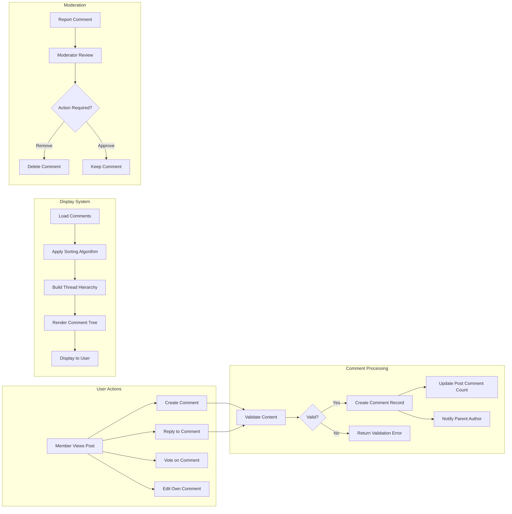
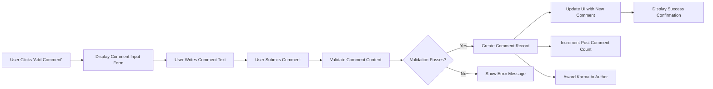
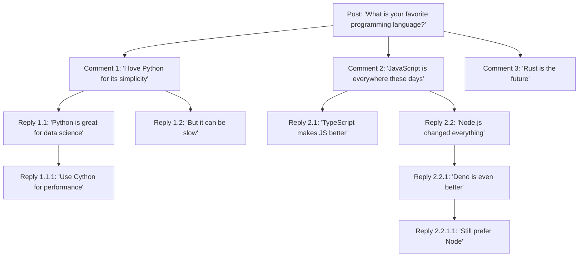

# Comment System Requirements Specification

## 1. Comment System Overview

### 1.1 Purpose and Business Value

Comments are the primary mechanism for community discussion and user engagement on the platform. They enable users to respond to posts, participate in conversations, build reputation through karma, and create vibrant community discussions. The comment system transforms static posts into dynamic conversations, which is essential for platform retention and user engagement metrics.

### 1.2 Comment System Scope

The comment system encompasses:
- **Comment Creation**: Members can write text-based responses to posts and other comments
- **Nested Threading**: Comments can have replies, creating threaded conversation trees
- **Voting Integration**: Comments can be upvoted and downvoted like posts
- **Lifecycle Management**: Comments can be edited, deleted, and moderated
- **Display and Sorting**: Comments are displayed with multiple sorting options
- **User Attribution**: All comments are attributed to their authors with karma implications

### 1.3 Core Comment Principles

1. **Open Participation**: Any authenticated member can comment on posts
2. **Threaded Conversations**: Replies create nested conversation threads for coherent discussions
3. **Democratic Ranking**: Voting determines comment visibility and prominence
4. **User Ownership**: Authors maintain control over their comments with edit/delete capabilities
5. **Moderation Oversight**: Moderators and admins can manage comments to maintain community standards

### 1.4 Comment System Architecture

## 2. Comment Creation Requirements

### 2.1 Who Can Create Comments

**WHEN a guest attempts to create a comment, THE system SHALL deny the action and prompt for login.**

**WHEN an authenticated member views a post, THE system SHALL display a comment creation interface.**

**WHEN a banned user attempts to create a comment, THE system SHALL deny the action and display a ban notification.**

### 2.2 Comment Creation Workflow

### 2.3 Comment Content Requirements

**THE comment text field SHALL accept between 1 and 10,000 characters.**

**WHEN a user submits a comment with less than 1 character, THE system SHALL reject the submission with error message 'Comment cannot be empty'.**

**WHEN a user submits a comment exceeding 10,000 characters, THE system SHALL reject the submission with error message 'Comment exceeds maximum length of 10,000 characters'.**

**THE system SHALL preserve formatting including line breaks and paragraph spacing in comment text.**

**THE system SHALL automatically detect and convert URLs into clickable links within comment text.**

### 2.4 Comment Metadata

**WHEN a comment is created, THE system SHALL record the following metadata:**
- Unique comment identifier
- Author user identifier
- Parent post identifier
- Parent comment identifier (if replying to another comment)
- Comment text content
- Creation timestamp
- Last edit timestamp (initially null)
- Vote score (initially 0)
- Depth level in comment tree
- Deleted status flag (initially false)

### 2.5 Comment Submission Performance

**WHEN a user submits a comment, THE system SHALL save the comment and display confirmation within 2 seconds.**

**WHEN a comment is created, THE system SHALL immediately display it in the comment thread without requiring page refresh.**

### 2.6 Comment Creation Validation Rules

**THE system SHALL validate that the parent post exists before allowing comment creation.**

**WHEN a user attempts to comment on a deleted post, THE system SHALL deny the action with error message 'Cannot comment on deleted posts'.**

**WHEN a user attempts to comment on a locked post, THE system SHALL deny the action with error message 'This post has been locked and no longer accepts comments'.**

**WHERE community moderators have disabled commenting, THE system SHALL prevent new comments with message 'Comments are disabled in this community'.**

## 3. Nested Reply Structure

### 3.1 Reply Functionality

**WHEN a member views any comment, THE system SHALL display a 'Reply' button beneath that comment.**

**WHEN a user clicks the 'Reply' button on a comment, THE system SHALL display a comment input form directly beneath that comment.**

**WHEN a reply is submitted, THE system SHALL create a new comment with the parent comment's identifier recorded.**

### 3.2 Comment Hierarchy Visualization

### 3.3 Parent-Child Relationship Rules

**THE system SHALL maintain a parent-child relationship between comments and their replies.**

**WHEN a comment has replies, THE system SHALL display all child comments indented beneath the parent.**

**THE system SHALL preserve the hierarchical relationship when displaying comment threads.**

**WHEN a user views a comment thread, THE system SHALL display all comments in their proper hierarchical position.**

### 3.4 Threading Display Requirements

**THE system SHALL visually indent each level of replies to indicate conversation depth.**

**THE system SHALL use increasing indentation levels (e.g., 40 pixels per level) to show comment hierarchy.**

**WHERE comments exceed the maximum display depth, THE system SHALL provide a 'Continue thread' link.**

## 4. Comment Threading and Depth Limits

### 4.1 Maximum Thread Depth

**THE system SHALL support a maximum comment nesting depth of 10 levels.**

**WHEN a comment thread reaches depth level 10, THE system SHALL disable the 'Reply' button on comments at that level.**

**WHEN a user attempts to reply at maximum depth, THE system SHALL display message 'Maximum comment depth reached. Please start a new thread.'**

### 4.2 Rationale for Depth Limits

Depth limits prevent:
- **UI/UX Issues**: Excessive indentation makes comments unreadable on smaller screens
- **Performance Degradation**: Deep recursion can slow comment loading
- **Conversation Fragmentation**: Very deep threads become hard to follow

### 4.3 Deep Thread Handling

**WHEN a comment thread reaches 8 levels deep, THE system SHALL display a visual indicator suggesting users start a new top-level comment.**

**WHERE comment threads approach maximum depth, THE system SHALL offer a 'View full conversation' link that displays the thread in a dedicated view.**

### 4.4 Thread Continuation

**WHEN a user clicks 'Continue thread' on a deeply nested comment, THE system SHALL navigate to a dedicated page showing only that comment branch.**

**THE dedicated thread view SHALL display the full conversation path from the original post to the deepest comment.**

## 5. Comment Editing and Deletion

### 5.1 Comment Editing Permissions

**WHEN a member views their own comment within 24 hours of creation, THE system SHALL display an 'Edit' button.**

**WHEN a member views their own comment after 24 hours, THE system SHALL not display an 'Edit' button.**

**WHERE a comment has received replies, THE system SHALL allow editing but display an 'edited' indicator.**

**THE system SHALL not allow editing of deleted comments.**

### 5.2 Comment Edit Workflow

**WHEN a user clicks 'Edit' on their comment, THE system SHALL display the comment text in an editable text field.**

**WHEN a user saves an edited comment, THE system SHALL update the comment text and record the edit timestamp.**

**WHEN a comment is edited, THE system SHALL display an 'edited X minutes/hours/days ago' indicator.**

**THE system SHALL preserve the original vote score when a comment is edited.**

### 5.3 Edit Validation Rules

**THE edited comment SHALL comply with the same validation rules as new comments (1-10,000 characters).**

**WHEN a user attempts to edit a comment to empty text, THE system SHALL reject the edit with error message 'Comment cannot be empty'.**

### 5.4 Comment Deletion by Author

**WHEN a member views their own comment, THE system SHALL display a 'Delete' button.**

**WHEN a user clicks 'Delete', THE system SHALL display a confirmation dialog 'Are you sure you want to delete this comment? This action cannot be undone.'**

**WHEN a user confirms deletion, THE system SHALL mark the comment as deleted but preserve the comment structure.**

**WHEN a comment is deleted by the author, THE system SHALL replace the comment text with '[deleted]' and remove the author username.**

**THE system SHALL preserve deleted comments that have replies to maintain thread continuity.**

**WHERE a deleted comment has no replies, THE system SHALL remove it from display entirely.**

### 5.5 Comment Deletion by Moderators

**WHEN a moderator views a comment in their community, THE system SHALL display a 'Remove' button.**

**WHEN a moderator removes a comment, THE system SHALL mark it as removed and replace the text with '[removed by moderator]'.**

**THE system SHALL preserve the comment structure even when removed by moderators.**

**WHEN a comment is removed, THE system SHALL log the moderation action with moderator identifier and reason.**

### 5.6 Comment Deletion by Administrators

**WHEN an administrator views any comment, THE system SHALL display a 'Remove' button.**

**Administrator removals SHALL follow the same behavior as moderator removals.**

**THE system SHALL log all administrator removals with admin identifier and reason.**

### 5.7 Deletion Impact on Child Comments

**WHEN a parent comment is deleted, THE system SHALL preserve all child replies.**

**THE deleted parent comment SHALL display as '[deleted]' with child comments still visible and threaded beneath it.**

**THE comment tree structure SHALL remain intact even when parent comments are deleted.**

## 6. Comment Voting Integration

### 6.1 Comment Voting Availability

**WHEN an authenticated member views any comment, THE system SHALL display upvote and downvote buttons.**

**WHEN a guest views comments, THE system SHALL display vote scores but not interactive voting buttons.**

**WHEN a user views their own comment, THE system SHALL display voting buttons but prevent self-voting.**

### 6.2 Comment Voting Behavior

**WHEN a user clicks the upvote button on a comment, THE system SHALL increment the comment score by 1.**

**WHEN a user clicks the downvote button on a comment, THE system SHALL decrement the comment score by 1.**

**WHEN a user clicks upvote on an already upvoted comment, THE system SHALL remove the upvote and return score to neutral.**

**WHEN a user clicks downvote on an already downvoted comment, THE system SHALL remove the downvote and return score to neutral.**

**WHEN a user clicks upvote on a previously downvoted comment, THE system SHALL remove the downvote and apply the upvote (net change of +2).**

**WHEN a user clicks downvote on a previously upvoted comment, THE system SHALL remove the upvote and apply the downvote (net change of -2).**

### 6.3 Vote Score Display

**THE system SHALL display the net vote score (upvotes minus downvotes) next to each comment.**

**WHEN a comment has a positive score, THE system SHALL display the score in an upvote color (e.g., orange).**

**WHEN a comment has a negative score, THE system SHALL display the score in a downvote color (e.g., blue).**

**WHEN a comment has a neutral score (0), THE system SHALL display the score in a neutral color (e.g., gray).**

### 6.4 Vote Impact on Karma

**WHEN a comment receives an upvote, THE system SHALL increase the author's comment karma by 1.**

**WHEN a comment receives a downvote, THE system SHALL decrease the author's comment karma by 1.**

**WHEN a vote is changed or removed, THE system SHALL adjust the author's karma accordingly.**

Detailed karma calculation rules are specified in [User Karma System Requirements](./07-karma-system.md).

### 6.5 Comment Voting Restrictions

**WHEN a user attempts to vote on a deleted comment, THE system SHALL disable voting and display message 'Cannot vote on deleted comments'.**

**WHEN a user attempts to vote on their own comment, THE system SHALL prevent the action and display message 'You cannot vote on your own comments'.**

### 6.6 Vote Performance Requirements

**WHEN a user votes on a comment, THE system SHALL update the vote score and visual indicators within 1 second.**

**THE system SHALL update vote scores in real-time without requiring page refresh.**

## 7. Comment Sorting Options

### 7.1 Available Sorting Methods

**THE system SHALL provide the following comment sorting options:**
- Best (default)
- Top
- New
- Controversial
- Old

**WHEN a user views a post's comments, THE system SHALL default to 'Best' sorting.**

**THE system SHALL display a sorting dropdown menu above the comment section.**

**WHEN a user selects a different sorting method, THE system SHALL re-order all comments according to the selected algorithm.**

### 7.2 Best Sorting Algorithm

**THE 'Best' sorting algorithm SHALL rank comments using a confidence-based scoring system that balances vote score and controversy.**

**Comments with higher scores and lower controversy SHALL appear higher in 'Best' sorting.**

**THE 'Best' algorithm SHALL favor comments with consistently positive votes over highly controversial ones.**

**Newly created comments with few votes SHALL receive initial visibility boost in 'Best' sorting to encourage engagement.**

### 7.3 Top Sorting Algorithm

**THE 'Top' sorting SHALL rank comments by highest net vote score (upvotes - downvotes) in descending order.**

**WHEN multiple comments have identical scores, THE system SHALL sort by creation time (newest first) as a tiebreaker.**

### 7.4 New Sorting Algorithm

**THE 'New' sorting SHALL rank comments by creation timestamp in descending order (newest first).**

**THE 'New' sorting SHALL ignore vote scores entirely.**

### 7.5 Controversial Sorting Algorithm

**THE 'Controversial' sorting SHALL rank comments that have similar numbers of upvotes and downvotes highest.**

**Comments with large vote counts but close to 50/50 split SHALL appear first in controversial sorting.**

**THE controversial score SHALL be calculated based on both total vote volume and vote ratio balance.**

### 7.6 Old Sorting Algorithm

**THE 'Old' sorting SHALL rank comments by creation timestamp in ascending order (oldest first).**

**THE 'Old' sorting SHALL ignore vote scores entirely.**

### 7.7 Nested Comment Sorting

**THE selected sorting algorithm SHALL apply to top-level comments first.**

**Within each comment thread, child replies SHALL be sorted using the same algorithm as their parent level.**

**THE sorting SHALL preserve the hierarchical thread structure while re-ordering comments at each depth level.**

### 7.8 Sorting Performance

**WHEN a user changes the comment sorting method, THE system SHALL re-render the comment section within 2 seconds.**

**THE system SHALL apply sorting efficiently even for posts with thousands of comments.**

## 8. Comment Permalinks

### 8.1 Permalink Functionality

**THE system SHALL generate a unique permanent URL for every comment.**

**WHEN a user clicks on a comment's timestamp, THE system SHALL navigate to that comment's permalink page.**

**THE permalink URL SHALL include the post identifier and comment identifier.**

**Example permalink format: `/r/{community}/comments/{post_id}/comment/{comment_id}`**

### 8.2 Permalink Page Display

**WHEN a user navigates to a comment permalink, THE system SHALL display the linked comment prominently.**

**THE permalink page SHALL display the full conversation thread leading to the linked comment.**

**THE system SHALL display the original post at the top of the permalink page for context.**

**THE linked comment SHALL be visually highlighted (e.g., with a colored border) to draw attention.**

### 8.3 Permalink Context Display

**THE system SHALL display up to 3 levels of parent comments above the linked comment for context.**

**THE system SHALL display all child replies beneath the linked comment.**

**WHERE the comment has more than 3 levels of parents, THE system SHALL provide a 'View full context' link.**

### 8.4 Permalink Sharing

**THE system SHALL display a 'Share' button on every comment that copies the permalink to the clipboard.**

**WHEN a user clicks 'Share', THE system SHALL copy the permalink URL and display confirmation message 'Link copied to clipboard'.**

### 8.5 Permalink for Deleted Comments

**WHEN a user navigates to a permalink for a deleted comment, THE system SHALL display '[deleted]' with preserved thread structure.**

**THE system SHALL maintain permalinks even after comments are deleted to preserve link integrity.**

## 9. Comment Collapse and Expansion

### 9.1 Comment Collapse Functionality

**WHEN a user views a comment thread, THE system SHALL display a collapse button ([-]) next to each parent comment.**

**WHEN a user clicks the collapse button, THE system SHALL hide all child replies beneath that comment.**

**WHEN a comment is collapsed, THE system SHALL display a summary indicator showing the number of hidden replies (e.g., '[+] 5 replies').**

**WHEN a user clicks on a collapsed comment, THE system SHALL expand it and display all child replies.**

### 9.2 Automatic Collapse Behavior

**WHERE a comment has negative score below -5, THE system SHALL automatically collapse the comment by default.**

**THE system SHALL display a message 'Comment below threshold' for auto-collapsed comments.**

**Users SHALL be able to expand auto-collapsed comments by clicking on them.**

### 9.3 Collapse State Persistence

**THE system SHALL remember collapse/expand states during a user's browsing session.**

**WHEN a user collapses a comment and navigates away, THE comment SHALL remain collapsed if they return to the same post.**

**THE collapse state SHALL reset when the user starts a new browsing session.**

### 9.4 Collapse All / Expand All

**THE system SHALL provide a 'Collapse All' button above the comment section.**

**WHEN a user clicks 'Collapse All', THE system SHALL collapse all top-level comment threads.**

**THE system SHALL provide an 'Expand All' button that expands all collapsed comments.**

### 9.5 Mobile Collapse Behavior

**On mobile devices, THE system SHALL use swipe gestures to collapse and expand comments.**

**Swiping left on a comment SHALL collapse it and its children.**

**Tapping on a collapsed comment SHALL expand it.**

## 10. Comment Performance Requirements

### 10.1 Loading Performance

**WHEN a user views a post with fewer than 100 comments, THE system SHALL load and display all comments within 2 seconds.**

**WHEN a post has more than 100 comments, THE system SHALL implement pagination or infinite scrolling.**

**THE system SHALL initially load the top 50 comments based on the selected sorting algorithm.**

**WHEN a user scrolls to the bottom of loaded comments, THE system SHALL automatically load the next 50 comments within 1 second.**

### 10.2 Comment Count Display

**THE system SHALL display the total comment count for each post (e.g., '342 comments').**

**THE comment count SHALL update in real-time when new comments are added.**

**THE comment count SHALL include all comments and replies in the thread.**

### 10.3 Real-Time Updates

**WHEN a new comment is added to a post the user is viewing, THE system SHALL display a notification 'New comments available' without disrupting reading.**

**Users SHALL be able to click the notification to refresh and view new comments.**

**THE system SHALL not automatically refresh comments while a user is actively reading or typing.**

### 10.4 Search Performance

**WHERE the platform implements comment search, THE system SHALL return results within 3 seconds.**

**Comment search results SHALL display the comment text with highlighted search terms and context.**

## 11. Comment Validation Rules

### 11.1 Content Validation

**THE system SHALL reject comments containing only whitespace characters.**

**THE system SHALL trim leading and trailing whitespace from comment text before saving.**

**THE system SHALL allow all Unicode characters in comment text.**

**THE system SHALL sanitize HTML and script tags to prevent XSS attacks.**

### 11.2 Spam Prevention

**WHEN a user submits identical comments within 5 minutes, THE system SHALL reject the duplicate with message 'You already posted this comment. Please wait before posting again.'**

**WHEN a user submits more than 10 comments within 1 minute, THE system SHALL rate-limit the user with message 'You are commenting too frequently. Please wait before posting again.'**

**THE system SHALL implement CAPTCHA verification for users who trigger rate limiting repeatedly.**

### 11.3 Link Validation

**WHEN a comment contains URLs, THE system SHALL validate that they use http:// or https:// protocols.**

**THE system SHALL block comments containing malicious or phishing URLs based on a blocklist.**

**THE system SHALL display a warning when users click external links in comments.**

### 11.4 Prohibited Content Detection

**THE system SHALL flag comments containing prohibited keywords for moderator review.**

**THE system SHALL automatically remove comments containing extreme profanity or hate speech.**

**WHEN a comment is auto-removed, THE system SHALL notify the author with reason.**

## 12. Error Handling and Edge Cases

### 12.1 Network Failure Scenarios

**WHEN a comment submission fails due to network error, THE system SHALL preserve the comment text and allow retry.**

**THE system SHALL display error message 'Failed to post comment. Please try again.' with a 'Retry' button.**

**THE user's typed comment text SHALL not be lost during network failures.**

### 12.2 Concurrent Editing

**WHEN a user edits a comment that has been deleted by a moderator, THE system SHALL reject the edit with message 'This comment has been removed and cannot be edited.'**

**WHEN two users attempt to vote on the same comment simultaneously, THE system SHALL process both votes atomically.**

### 12.3 Orphaned Comments

**WHEN a post is deleted, THE system SHALL preserve all comments for historical purposes.**

**Deleted post comments SHALL remain accessible via direct permalink.**

**THE system SHALL display '[deleted post]' at the top of orphaned comment threads.**

### 12.4 Invalid Parent References

**WHEN a user attempts to reply to a non-existent comment, THE system SHALL reject with error 'The comment you are replying to no longer exists.'**

**THE system SHALL validate parent comment existence before creating child comments.**

### 12.5 User Account Deletion

**WHEN a user account is deleted, THE system SHALL preserve their comments but replace the username with '[deleted]'.**

**THE comment text and vote scores SHALL remain intact after account deletion.**

**THE system SHALL dissociate deleted users' comments from karma calculations.**

## 13. Comment Moderation Integration

### 13.1 Moderator Comment Actions

**Moderators SHALL have access to all comment management actions within their communities.**

**THE system SHALL provide moderators with a 'Mod Actions' menu on every comment in their communities.**

**Available moderator actions SHALL include: Remove, Approve, Report, Lock, and Distinguish.**

Detailed moderation workflows are specified in [Content Moderation and Reporting Requirements](./10-content-moderation-reporting.md).

### 13.2 Comment Locking

**WHEN a moderator locks a comment, THE system SHALL prevent all new replies to that comment.**

**Locked comments SHALL display a lock icon and message 'This comment thread has been locked.'**

**Moderators and administrators SHALL still be able to reply to locked comments.**

### 13.3 Distinguished Comments

**WHEN a moderator comments in their own community, THE system SHALL provide a 'Distinguish' option.**

**Distinguished moderator comments SHALL display with a green '[M]' badge next to the username.**

**Administrator comments SHALL display with a red '[A]' badge when distinguished.**

## 14. Accessibility and Internationalization

### 14.1 Accessibility Requirements

**THE system SHALL support keyboard navigation for all comment interactions.**

**THE system SHALL provide screen reader compatibility with proper ARIA labels.**

**Comment vote buttons SHALL be accessible via Tab navigation and activated with Enter/Space keys.**

**Collapsed/expanded states SHALL be announced to screen readers.**

### 14.2 Internationalization Support

**THE system SHALL support displaying comments in all Unicode languages.**

**Comment timestamps SHALL be displayed in the user's local timezone.**

**THE system SHALL support right-to-left (RTL) text rendering for languages like Arabic and Hebrew.**

**All system messages and error notifications SHALL be translatable.**

---

**This document defines business requirements only. All technical implementations (architecture, APIs, database design, etc.) are at the discretion of the development team.**