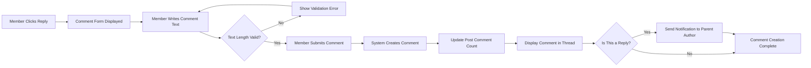
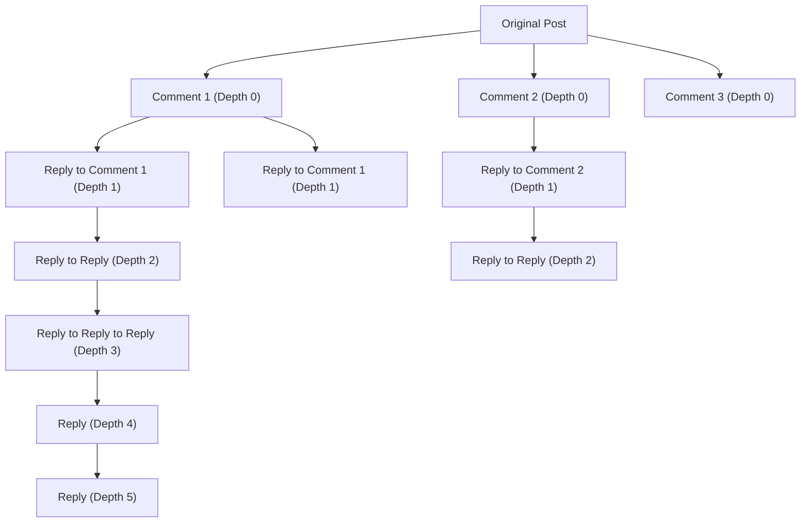
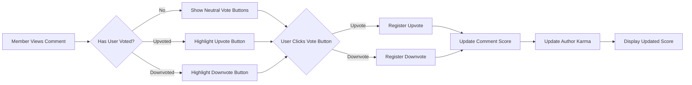
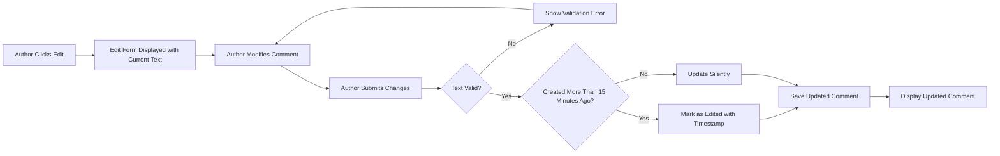
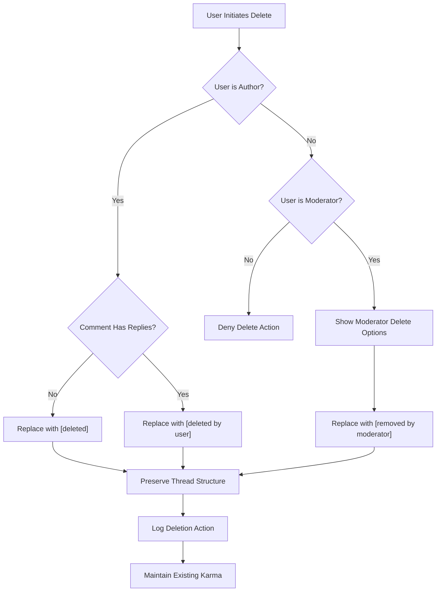
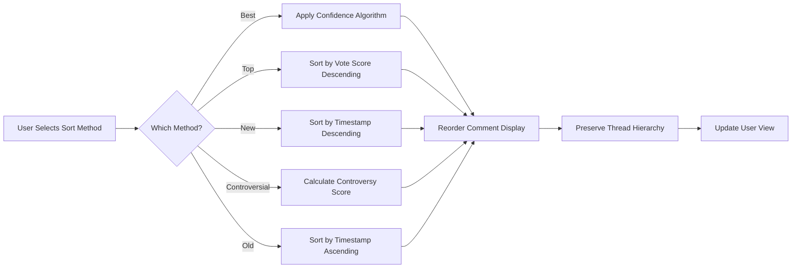
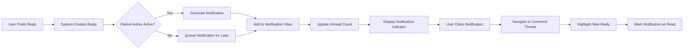

# Comments and Discussions System Requirements

## 1. Introduction and Overview

### 1.1 Purpose
This document defines the complete business requirements for the comment and discussion system in the Reddit-like community platform (redditCommunity). Comments enable users to engage in threaded discussions on posts, creating rich conversations that form the core of community interaction.

### 1.2 Document Scope
This specification covers all aspects of the comment system including creation, nested replies, voting, editing, deletion, sorting, and notifications. The document focuses on business requirements and user workflows in natural language, leaving technical implementation decisions to the development team.

### 1.3 Comment System Overview
The comment system allows authenticated users (members and moderators) to respond to posts and other comments, creating nested discussion threads. Each comment supports voting (upvotes and downvotes), can be edited or deleted by its author, and contributes to the user's karma score. Comments are displayed in hierarchical threads with configurable sorting options.

**Key Capabilities:**
- Members can write comments on any post in communities they can access
- Members can reply to other comments, creating nested discussion threads
- All comments support upvoting and downvoting by members
- Comment authors can edit their own comments within defined time limits
- Comment authors and moderators can delete comments
- Comments are displayed in threaded format with multiple sorting options
- Users receive notifications when their comments receive replies

### 1.4 Relationship to Other Systems
The comment system integrates with:
- **Posts** (defined in Content Creation and Posts Requirements): Comments belong to posts
- **Voting and Karma** (defined in Voting and Karma System Requirements): Comments can be voted on and generate karma
- **User Actors** (defined in User Actors and Authentication Requirements): Permissions control comment actions
- **Moderation** (defined in Content Moderation and Reporting Requirements): Comments can be reported and moderated

## 2. Comment Creation and Structure

### 2.1 Comment Creation Requirements

#### 2.1.1 Who Can Create Comments
THE system SHALL allow members to create comments on any post in public communities.

THE system SHALL allow moderators to create comments on any post in communities they moderate.

WHEN a guest user attempts to create a comment, THE system SHALL deny the action and prompt for login or registration.

WHEN a banned user attempts to comment in a community where they are banned, THE system SHALL deny the action and display a ban notification.

#### 2.1.2 Comment Content Requirements
THE system SHALL support comment content in plain text format with markdown formatting.

THE comment text field SHALL accept between 1 and 10,000 characters.

WHEN a user submits a comment with less than 1 character, THE system SHALL reject the comment and display a validation error.

WHEN a user submits a comment exceeding 10,000 characters, THE system SHALL reject the comment and display a character limit error.

THE system SHALL preserve line breaks and paragraph formatting in comment text.

THE system SHALL support markdown syntax including bold, italic, links, lists, and code blocks.

#### 2.1.3 Comment Submission Process
WHEN a member submits a valid comment on a post, THE system SHALL create the comment immediately and display it in the discussion thread.

WHEN a member submits a valid reply to an existing comment, THE system SHALL create the reply as a nested child comment.

THE system SHALL record the comment author, timestamp, parent post, and parent comment (if a reply).

THE system SHALL initialize the comment with zero upvotes and zero downvotes.

WHEN a comment is successfully created, THE system SHALL update the post's total comment count.

WHEN a reply is created, THE system SHALL trigger a notification to the parent comment's author.

### 2.2 Comment Metadata and Properties

#### 2.2.1 Required Comment Properties
THE system SHALL store the comment author's user identifier.

THE system SHALL record the exact timestamp when the comment was created.

THE system SHALL store the parent post identifier for all comments.

THE system SHALL store the parent comment identifier for nested replies.

THE system SHALL track the nesting depth level (0 for top-level comments).

THE system SHALL maintain the comment's current vote score (upvotes minus downvotes).

THE system SHALL track whether the comment has been edited and the last edit timestamp.

THE system SHALL record if the comment has been deleted and the deletion timestamp.

#### 2.2.2 Comment Identification
THE system SHALL assign each comment a unique identifier upon creation.

THE system SHALL use this identifier for voting, editing, replying, and moderation actions.

THE comment identifier SHALL remain permanent even if the comment content is edited or deleted.

## 3. Nested Reply System Architecture

### 3.1 Reply Hierarchy and Threading

#### 3.1.1 Parent-Child Relationships
THE system SHALL support members replying directly to any visible comment.

WHEN a member replies to a comment, THE system SHALL create a parent-child relationship between the original comment and the reply.

THE system SHALL display replies as nested beneath their parent comments.

THE system SHALL maintain the complete hierarchical structure of all comment threads.

THE system SHALL allow any comment to have unlimited direct child replies.

#### 3.1.2 Threading Visualization
Users interact with nested threads through a clear parent-child structure:

### 3.2 Nesting Depth Limits

#### 3.2.1 Maximum Nesting Depth
THE system SHALL support comment nesting up to a maximum depth of 10 levels.

THE top-level comments (direct replies to the post) SHALL be considered depth 0.

WHEN a comment reaches depth 10, THE system SHALL still allow replies but display them differently.

WHEN a user attempts to reply to a depth-10 comment, THE system SHALL create the reply at depth 10 and display a "Continue this thread" link.

#### 3.2.2 Deep Thread Handling
WHEN a comment thread reaches depth 6 or greater, THE system SHALL provide a "Continue this thread" link.

WHEN a user clicks "Continue this thread", THE system SHALL display the deep comment chain in a focused view.

THE focused view SHALL show the parent context and all nested replies below.

THE system SHALL maintain full threading functionality in the focused view.

#### 3.2.3 Thread Expansion and Collapse
THE system SHALL allow users to collapse any comment and all its nested replies.

WHEN a comment is collapsed, THE system SHALL hide all child replies and display a summary count.

WHEN a user clicks a collapsed comment, THE system SHALL expand it and display all child replies.

THE system SHALL remember collapse/expand state during the user's session.

THE default state SHALL be expanded for all comments.

## 4. Comment Threading and Depth Management

### 4.1 Thread Navigation

#### 4.1.1 Thread Context Display
THE system SHALL display each comment with a visual indicator of its nesting depth.

THE system SHALL use indentation to show the hierarchical structure of comment threads.

THE system SHALL display a vertical line connecting parent and child comments.

WHEN a comment thread becomes deeply nested (depth 6+), THE system SHALL provide navigation aids to move between thread levels.

#### 4.1.2 Parent Comment Context
THE system SHALL display the immediate parent comment's author username in reply contexts.

WHEN viewing a deeply nested comment, THE system SHALL provide a link to jump to the parent comment.

WHEN viewing a focused thread view, THE system SHALL display the full parent chain for context.

### 4.2 Thread Organization Rules

#### 4.2.1 Sibling Comment Ordering
THE system SHALL order sibling comments (comments at the same depth level with the same parent) according to the selected sorting method.

THE default sorting for comments SHALL be "Best" (based on vote score and time).

THE system SHALL maintain the selected sorting preference for the duration of the user's session.

#### 4.2.2 Reply Grouping
THE system SHALL keep all replies to a comment grouped together beneath their parent.

WHEN a parent comment is moved by sorting, THE system SHALL move all child replies with it.

THE hierarchical structure SHALL always be preserved regardless of sorting method.

## 5. Comment Voting Mechanics

### 5.1 Voting on Comments

#### 5.1.1 Who Can Vote on Comments
THE system SHALL allow members to upvote or downvote any comment in communities they can access.

THE system SHALL allow moderators to vote on any comment in communities they moderate.

WHEN a guest user attempts to vote on a comment, THE system SHALL deny the action and prompt for login.

THE system SHALL prevent users from voting on their own comments.

WHEN a user attempts to vote on their own comment, THE system SHALL display a message indicating self-voting is not allowed.

#### 5.1.2 Comment Voting Process
WHEN a member clicks the upvote button on a comment, THE system SHALL register an upvote and increase the comment's score by one.

WHEN a member clicks the downvote button on a comment, THE system SHALL register a downvote and decrease the comment's score by one.

THE system SHALL visually indicate which comments the user has upvoted or downvoted.

THE system SHALL display the net vote score (upvotes minus downvotes) for each comment.

WHEN a comment is voted on, THE system SHALL update the comment author's karma score accordingly.

#### 5.1.3 Changing Votes on Comments
THE system SHALL allow members to change their vote on any comment.

WHEN a user who upvoted a comment clicks upvote again, THE system SHALL remove the upvote and return the comment to neutral.

WHEN a user who downvoted a comment clicks downvote again, THE system SHALL remove the downvote and return the comment to neutral.

WHEN a user who upvoted a comment clicks downvote, THE system SHALL change the vote from upvote to downvote (net change of -2 to score).

WHEN a user who downvoted a comment clicks upvote, THE system SHALL change the vote from downvote to upvote (net change of +2 to score).

THE system SHALL update karma scores immediately when votes are changed.

### 5.2 Comment Karma Integration

#### 5.2.1 Karma Calculation for Comments
WHEN a comment receives an upvote, THE system SHALL increase the author's comment karma by one point.

WHEN a comment receives a downvote, THE system SHALL decrease the author's comment karma by one point.

WHEN a vote on a comment is removed or changed, THE system SHALL adjust the author's comment karma accordingly.

THE system SHALL maintain separate tracking for post karma and comment karma as defined in Voting and Karma System Requirements.

#### 5.2.2 Karma Display on Comments
THE system SHALL display each comment author's total karma score next to their username.

THE karma score displayed SHALL be the sum of the user's post karma and comment karma.

THE system SHALL update karma displays in real-time as votes are cast.

### 5.3 Vote Score Display

#### 5.3.1 Score Visibility
THE system SHALL display the net vote score (upvotes minus downvotes) for all comments.

WHEN a comment has a positive score, THE system SHALL display it in a neutral or positive color.

WHEN a comment has a negative score, THE system SHALL display it in a distinct color to indicate controversy.

THE system SHALL display vote scores for deleted comments if they are still visible.

#### 5.3.2 Voting Feedback
WHEN a user casts a vote on a comment, THE system SHALL provide immediate visual feedback.

THE vote button SHALL be highlighted to indicate the user's current vote state.

THE comment score SHALL update immediately to reflect the new vote.

THE system SHALL not require page refresh to display vote changes.

## 6. Comment Editing and Deletion Rules

### 6.1 Comment Editing

#### 6.1.1 Who Can Edit Comments
THE system SHALL allow comment authors to edit their own comments at any time.

THE system SHALL prevent users from editing comments written by other users.

WHEN a moderator views a comment, THE system SHALL not provide editing capability for comments they did not author.

THE system SHALL allow comment editing even after the comment has received replies.

#### 6.1.2 Edit Time Restrictions
THE system SHALL allow unrestricted editing of comments within 15 minutes of creation.

WHEN a comment is older than 15 minutes, THE system SHALL still allow editing but mark the comment as edited.

THE system SHALL display an "edited" indicator on comments that have been modified after the 15-minute grace period.

THE edited indicator SHALL include the timestamp of the last edit.

#### 6.1.3 Edit Validation and Rules
WHEN a user edits a comment, THE system SHALL apply the same validation rules as comment creation (1 to 10,000 characters).

THE system SHALL preserve the comment's original creation timestamp when edited.

THE system SHALL preserve all existing votes on the comment when edited.

THE system SHALL preserve all child replies when a parent comment is edited.

WHEN a comment is edited, THE system SHALL not send new notifications to users who previously replied.

#### 6.1.4 Edit History
THE system SHALL record the timestamp of each edit.

THE system SHALL display only the most recent edit timestamp to users.

THE system SHALL not display full edit history to regular users.

WHERE audit requirements exist for moderation purposes, THE system SHALL maintain an internal edit log.

### 6.2 Comment Deletion

#### 6.2.1 Who Can Delete Comments
THE system SHALL allow comment authors to delete their own comments at any time.

THE system SHALL allow moderators to delete any comment in communities they moderate.

WHEN a regular member attempts to delete another user's comment, THE system SHALL deny the action.

THE system SHALL log all comment deletions with user identifier, timestamp, and deletion reason (for moderator deletions).

#### 6.2.2 Deletion Behavior for Comments with Replies
WHEN a comment with no child replies is deleted by its author, THE system SHALL completely remove the comment content and display "[deleted]" placeholder.

WHEN a comment with child replies is deleted by its author, THE system SHALL preserve the comment structure but replace content with "[deleted by user]".

WHEN a comment is deleted by a moderator, THE system SHALL replace content with "[removed by moderator]".

THE system SHALL preserve the comment's position in the thread hierarchy to maintain reply context.

THE system SHALL maintain vote scores on deleted comments if they have child replies.

#### 6.2.3 Deletion Impact on Karma
WHEN a comment author deletes their own comment, THE system SHALL not reverse karma already earned from that comment.

THE system SHALL prevent new votes on deleted comments.

WHEN existing votes remain on a deleted comment (with replies), THE system SHALL continue counting that karma for the author.

#### 6.2.4 Permanent vs Soft Deletion
THE system SHALL use soft deletion for all comments (marking as deleted but preserving data).

THE system SHALL never permanently remove comment data to maintain thread integrity and moderation audit trails.

WHEN a comment is soft-deleted, THE system SHALL hide the content from public view but preserve it for moderation review.

THE deleted comment's metadata (author, timestamp, votes) SHALL remain accessible for moderation purposes.

### 6.3 Restoring Deleted Comments

#### 6.3.1 Author Restoration
THE system SHALL not allow comment authors to restore their own deleted comments.

WHEN a user deletes a comment, THE deletion SHALL be permanent from the user's perspective.

IF a user wants to restore deleted content, they must create a new comment.

#### 6.3.2 Moderator Restoration
THE system SHALL allow moderators to restore comments they previously removed in their communities.

WHEN a moderator restores a removed comment, THE system SHALL display the original content again.

THE system SHALL log all restoration actions for moderation transparency.

THE restored comment SHALL retain its original timestamp, votes, and position in the thread.

## 7. Comment Display and Sorting

### 7.1 Comment Display Requirements

#### 7.1.1 Comment Presentation
THE system SHALL display each comment with the author's username, karma score, and creation timestamp.

THE system SHALL display the comment's vote score prominently.

THE system SHALL show upvote and downvote buttons for each comment (for authenticated members).

THE system SHALL display a reply button to allow creating nested replies.

WHEN a comment has been edited, THE system SHALL display an "edited" indicator with the edit timestamp.

THE system SHALL display the number of child replies for collapsed comments.

#### 7.1.2 Comment Metadata Display
THE system SHALL show how long ago the comment was posted using relative time (e.g., "2 hours ago", "3 days ago").

WHEN a user hovers over the relative timestamp, THE system SHALL display the exact date and time.

THE system SHALL display the commenter's user flair if the community supports user flair.

THE system SHALL highlight comments from the original post author with a distinct badge or color.

#### 7.1.3 Loading and Pagination
THE system SHALL load the first 200 top-level comments by default when a post is opened.

WHEN there are more than 200 top-level comments, THE system SHALL provide a "Load more comments" option.

THE system SHALL load child replies for visible parent comments automatically.

WHEN a comment thread is very long (50+ nested replies), THE system SHALL paginate deep reply chains.

THE comment loading process SHALL feel immediate to users (target: under 1 second for initial load).

### 7.2 Comment Sorting Options

#### 7.2.1 Available Sorting Methods
THE system SHALL support the following comment sorting options: Best, Top, New, Controversial, Old.

THE default sorting method SHALL be "Best".

THE system SHALL allow users to change the sorting method using a dropdown or selector.

THE selected sorting method SHALL persist for the user's session.

THE system SHALL apply the sorting method only to top-level comments and sibling comments at each depth level.

#### 7.2.2 Best Sorting Algorithm
WHEN comments are sorted by "Best", THE system SHALL use a confidence-based algorithm that considers both vote score and vote volume.

THE algorithm SHALL favor comments with high upvote ratios and sufficient vote counts.

THE algorithm SHALL balance popular comments with newer potentially good comments.

THE system SHALL position highly-voted recent comments above older comments with similar scores.

#### 7.2.3 Top Sorting
WHEN comments are sorted by "Top", THE system SHALL order comments by their net vote score (upvotes minus downvotes) in descending order.

THE comment with the highest vote score SHALL appear first.

WHEN multiple comments have the same vote score, THE system SHALL use creation time as a tiebreaker (older first).

#### 7.2.4 New Sorting
WHEN comments are sorted by "New", THE system SHALL order comments by creation timestamp in descending order (newest first).

THE most recently created comment SHALL appear first.

THE oldest comment SHALL appear last.

#### 7.2.5 Controversial Sorting
WHEN comments are sorted by "Controversial", THE system SHALL prioritize comments with high vote volume but similar numbers of upvotes and downvotes.

THE algorithm SHALL calculate controversy as (upvotes + downvotes) × min(upvotes, downvotes).

THE comments with the highest controversy score SHALL appear first.

THE system SHALL favor comments that spark debate over one-sided comments.

#### 7.2.6 Old Sorting
WHEN comments are sorted by "Old", THE system SHALL order comments by creation timestamp in ascending order (oldest first).

THE oldest comment SHALL appear first.

THE most recently created comment SHALL appear last.

### 7.3 Comment Highlighting and Special States

#### 7.3.1 Comment Highlighting
WHEN a user navigates to a specific comment via a direct link, THE system SHALL highlight that comment.

THE highlighted comment SHALL have a distinct background color or border.

THE system SHALL automatically scroll the page to make the highlighted comment visible.

THE highlighting SHALL persist for 5 seconds before fading to normal appearance.

#### 7.3.2 New Comment Indicators
WHEN a user returns to a post they previously viewed, THE system SHALL indicate which comments are new since their last visit.

THE new comments SHALL have a visual indicator (e.g., blue highlight or "new" badge).

THE system SHALL track the user's last visit timestamp for each post.

THE new comment indicators SHALL disappear when the user visits the post again.

#### 7.3.3 Author and Moderator Badges
WHEN the comment author is also the post author, THE system SHALL display an "OP" (Original Poster) badge.

WHEN a moderator comments in their own community, THE system SHALL display a moderator badge.

THE moderator badge SHALL be optional and moderators can choose whether to distinguish their comments.

THE badges SHALL be visually distinct and positioned next to the author's username.

## 8. Reply Notifications and User Engagement

### 8.1 Reply Notification System

#### 8.1.1 Notification Triggers
WHEN a member receives a reply to their comment, THE system SHALL create a notification for the comment author.

WHEN a member receives a reply to their post, THE system SHALL create a notification for the post author.

THE system SHALL not send notifications for replies to deleted comments.

THE system SHALL not send duplicate notifications if multiple replies are made in quick succession to the same comment.

#### 8.1.2 Notification Content
THE notification SHALL include the replying user's username.

THE notification SHALL include a preview of the reply content (first 100 characters).

THE notification SHALL include a direct link to the reply in its thread context.

THE notification SHALL include the post title and community name for context.

THE notification SHALL include a timestamp indicating when the reply was posted.

#### 8.1.3 Notification Delivery
THE system SHALL display notifications in the user's notification inbox.

THE system SHALL show an unread notification indicator in the navigation bar when new notifications exist.

WHEN a user clicks a notification, THE system SHALL navigate to the comment thread and highlight the new reply.

WHEN a user views a notification, THE system SHALL mark it as read.

THE system SHALL preserve notification history for 30 days.

### 8.2 Notification Preferences

#### 8.2.1 User Notification Controls
THE system SHALL allow users to disable reply notifications entirely in their account settings.

THE system SHALL allow users to disable notifications for specific posts they have commented on.

THE system SHALL allow users to mute notifications from specific users.

WHEN a user disables notifications for a post, THE system SHALL not send notifications for any new replies to their comments on that post.

#### 8.2.2 Notification Batching
WHEN a user receives multiple reply notifications within 5 minutes, THE system SHALL batch them into a single notification.

THE batched notification SHALL indicate the total number of new replies.

THE batched notification SHALL link to the user's comment history showing all new replies.

THE system SHALL send immediate notifications for the first reply and batch subsequent rapid replies.

### 8.3 Comment Engagement Tracking

#### 8.3.1 User Comment History
THE system SHALL maintain a complete history of all comments a user has posted.

THE user's profile SHALL display their recent comments in reverse chronological order.

THE system SHALL allow filtering user comments by community.

THE system SHALL show the comment's vote score, post context, and timestamp in the user's comment history.

#### 8.3.2 Participation Metrics
THE system SHALL track the total number of comments each user has posted.

THE system SHALL display comment count on user profiles.

THE system SHALL track comment karma separately from post karma as defined in Voting and Karma System Requirements.

THE system SHALL allow users to view their most upvoted comments.

## 9. Comment Moderation Integration

### 9.1 Reportable Comments

#### 9.1.1 Reporting Comments
THE system SHALL allow any member to report any comment they find inappropriate.

THE report functionality SHALL be available via a "Report" button on each comment.

WHEN a member reports a comment, THE system SHALL add the report to the moderation queue as defined in Content Moderation and Reporting Requirements.

THE system SHALL allow users to select a report reason (spam, harassment, misinformation, rule violation, etc.).

THE system SHALL prevent users from reporting the same comment multiple times.

#### 9.1.2 Reported Comment Display
THE system SHALL continue displaying reported comments to regular users until a moderator takes action.

THE system SHALL indicate to moderators which comments have been reported.

THE system SHALL show moderators the number of reports and report reasons for each reported comment.

### 9.2 Moderator Comment Actions

#### 9.2.1 Comment Removal by Moderators
THE system SHALL allow moderators to remove any comment in communities they moderate.

WHEN a moderator removes a comment, THE system SHALL replace the content with "[removed by moderator]".

THE system SHALL preserve the comment structure and hierarchy when removed.

THE moderator removal action SHALL be logged with moderator identifier, timestamp, and reason.

THE system SHALL allow moderators to add removal reasons that are visible to users or internal-only.

#### 9.2.2 User Banning Based on Comments
WHEN a moderator reviews a problematic comment, THE system SHALL provide an option to ban the comment author from the community.

THE ban functionality SHALL follow the rules defined in Content Moderation and Reporting Requirements.

WHEN a user is banned, THE system SHALL not automatically remove their existing comments.

WHEN a banned user attempts to post new comments in the community, THE system SHALL deny the action.

#### 9.2.3 Moderator Comment Approval
WHERE communities have enabled comment moderation, THE system SHALL hold new comments in a queue for moderator approval.

THE moderator approval queue SHALL display pending comments with full context.

WHEN a moderator approves a comment, THE system SHALL make it visible to all users.

WHEN a moderator rejects a comment, THE system SHALL prevent it from being displayed and notify the author.

## 10. Performance and User Experience Requirements

### 10.1 Loading Performance

#### 10.1.1 Initial Comment Load
THE system SHALL load and display the first set of comments (200 top-level comments) within 1 second of the user opening a post.

THE system SHALL prioritize loading top-level comments before loading all nested replies.

WHEN a post has thousands of comments, THE system SHALL use pagination to maintain fast load times.

THE system SHALL display a loading indicator while comments are being fetched.

#### 10.1.2 Nested Reply Loading
THE system SHALL load nested replies for visible parent comments automatically.

WHEN a user expands a collapsed comment thread, THE system SHALL load child replies within 500 milliseconds.

THE system SHALL use lazy loading for deeply nested comment chains to optimize initial page load.

WHEN a user scrolls to view more comments, THE system SHALL load additional comments seamlessly without page refresh.

### 10.2 Real-Time Updates

#### 10.2.1 Vote Score Updates
WHEN a user votes on a comment, THE system SHALL update the vote score immediately without page refresh.

THE system SHALL use optimistic UI updates to show vote changes instantly.

IF the vote submission fails, THE system SHALL revert the optimistic update and display an error message.

#### 10.2.2 New Comment Indicators
WHEN a user is viewing a post and new comments are posted, THE system SHALL optionally display a notification banner indicating new comments are available.

THE user SHALL be able to click the banner to load new comments without full page refresh.

THE system SHALL preserve the user's current scroll position when loading new comments.

### 10.3 User Experience Requirements

#### 10.3.1 Responsive Comment Display
THE comment interface SHALL be fully functional on mobile devices, tablets, and desktop computers.

THE comment threading SHALL adapt to smaller screens by reducing indentation or using alternative visual indicators.

THE comment forms SHALL be touch-friendly on mobile devices with appropriately sized input areas and buttons.

#### 10.3.2 Comment Interaction Feedback
WHEN a user clicks reply, THE system SHALL display the comment form within 200 milliseconds.

WHEN a user submits a comment, THE system SHALL provide immediate visual feedback (loading state).

WHEN a comment is successfully posted, THE system SHALL display a success confirmation.

IF comment submission fails, THE system SHALL preserve the user's written text and display a clear error message with retry options.

#### 10.3.3 Accessibility Requirements
THE comment system SHALL support keyboard navigation for all actions (voting, replying, expanding threads).

THE comment threading structure SHALL be properly marked up for screen readers using semantic HTML.

THE vote buttons and interactive elements SHALL have appropriate ARIA labels.

THE system SHALL maintain sufficient color contrast for comment text and interactive elements.

### 10.4 Scalability Expectations

#### 10.4.1 High-Volume Comment Threads
THE system SHALL handle posts with up to 100,000 comments without performance degradation.

WHEN posts have extremely high comment counts (10,000+), THE system SHALL use aggressive pagination and lazy loading.

THE system SHALL maintain consistent comment sorting performance regardless of total comment count.

#### 10.4.2 Concurrent Comment Activity
THE system SHALL support multiple users commenting simultaneously on the same post.

THE system SHALL handle vote conflicts gracefully when multiple users vote on the same comment concurrently.

THE system SHALL prevent duplicate comment submissions when users click submit multiple times.

WHEN concurrent edits occur on the same comment (by author and moderator), THE system SHALL use last-write-wins strategy with conflict logging.

## 11. Business Rules Summary

### 11.1 Comment Creation Rules
1. Only authenticated members and moderators can create comments
2. Comment text must be between 1 and 10,000 characters
3. Comments support markdown formatting for rich text
4. Each comment is permanently associated with a parent post
5. Replies create parent-child relationships with existing comments

### 11.2 Threading and Nesting Rules
1. Comments can be nested up to 10 levels deep
2. Threads deeper than 6 levels provide "Continue this thread" navigation
3. Thread hierarchy is always preserved regardless of sorting method
4. Collapsed comments hide all child replies

### 11.3 Voting Rules
1. Members can upvote or downvote any comment except their own
2. Users can change or remove their votes at any time
3. Vote scores are displayed as net value (upvotes minus downvotes)
4. Comment votes contribute to comment karma for the author

### 11.4 Editing and Deletion Rules
1. Authors can edit their own comments at any time
2. Edits made after 15 minutes are marked with an "edited" timestamp
3. Authors and moderators can delete comments
4. Deleted comments with replies are preserved as placeholders to maintain thread structure
5. Deleted comments retain their karma contribution for the author

### 11.5 Notification Rules
1. Users receive notifications when their comments receive replies
2. Users can disable notifications globally or per-post
3. Notifications are batched if multiple replies arrive within 5 minutes
4. Notifications are preserved for 30 days

### 11.6 Moderation Rules
1. Any member can report any comment
2. Moderators can remove comments in their communities
3. Removed comments are replaced with "[removed by moderator]" placeholder
4. Moderator actions are logged for transparency and audit purposes

## 12. Success Criteria

The comment and discussion system will be considered successful when:

1. **Engagement Metrics**:
   - Users can create comments and nested replies without errors
   - Comments load within 1 second for posts with up to 1,000 comments
   - 95% of comment submissions succeed on the first attempt

2. **User Experience**:
   - Users can navigate nested threads intuitively
   - Vote changes are reflected immediately in the UI
   - Notifications are delivered within 5 seconds of reply creation

3. **Content Quality**:
   - Moderation tools effectively handle reported comments
   - Deleted comments preserve thread structure
   - Comment sorting provides meaningful content discovery

4. **System Performance**:
   - The system handles posts with 100,000+ comments without degradation
   - Concurrent commenting and voting work without conflicts
   - Mobile and desktop experiences are equally functional

## 13. Future Considerations

While not required for the initial implementation, the following enhancements may be considered for future iterations:

- **Comment Awards**: Allowing users to give awards or badges to exceptional comments
- **Comment Bookmarking**: Enabling users to save comments for later reference
- **Advanced Formatting**: Supporting embedded media, tables, or polls in comments
- **Comment Threading Options**: Providing alternative threading visualizations (e.g., flat mode)
- **Moderation Tools**: Auto-moderator rules for comments based on keywords or patterns
- **User Blocking**: Allowing users to block specific users and hide their comments
- **Comment Search**: Enabling search within comment threads
- **Live Comment Feeds**: Real-time comment updates for active discussions

---

**Document Version**: 1.0  
**Last Updated**: 2025-11-14  
**Related Documents**:
- User Actors and Authentication Requirements
- Content Creation and Posts Requirements
- Voting and Karma System Requirements
- Content Moderation and Reporting Requirements

*This document defines business requirements for the comment and discussion system. All technical implementation decisions including database schema, API design, and architecture are at the discretion of the development team.*
