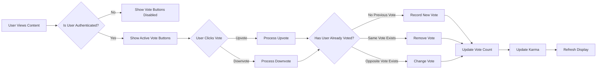
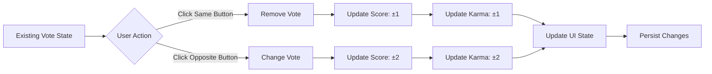

# Voting and Karma System

## Document Overview

This document defines the complete business requirements for the voting and karma system in the communityPlatform. The voting system enables users to express their opinion on content quality through upvotes and downvotes, while the karma system quantifies user reputation based on community feedback. These systems are fundamental to content ranking, user engagement, and maintaining content quality across the platform.

## Business Context

The voting and karma system serves as the democratic mechanism for content curation on the platform. Users collectively determine content value through voting, which influences content visibility, ranking, and user reputation. This creates a self-regulating community where quality content rises to prominence and users who consistently contribute valuable content build reputation through karma accumulation.

### Why Voting Matters
- **Content Quality Control**: Users collectively determine what content is valuable
- **Democratic Curation**: Community decides content visibility, not algorithms alone
- **User Engagement**: Voting provides instant, low-friction participation mechanism
- **Spam Prevention**: Low-quality content naturally gets downvoted and buried
- **User Motivation**: Karma provides gamification and recognition for contributions

### Why Karma Matters
- **Reputation System**: Quantifies user's contribution quality and community trust
- **User Recognition**: Rewards users who consistently provide valuable content
- **Trust Indicators**: Helps community assess credibility of content creators
- **Engagement Driver**: Motivates users to create quality content
- **Community Health**: Identifies valuable contributors and potential bad actors

## Voting System Overview

The voting system allows authenticated members to express their opinion on posts and comments through upvotes (positive feedback) and downvotes (negative feedback). Each piece of content (post or comment) can receive votes from multiple users, and the aggregate vote counts determine content scoring, ranking, and visibility.

### Core Voting Principles
- **Democratic**: Every member's vote carries equal weight
- **Anonymous**: Vote attribution is not revealed to content creators or other users
- **Reversible**: Users can change or remove their votes at any time
- **Protected**: Users cannot vote multiple times on the same content
- **Authentic**: Only authenticated members can vote

### Voting Workflow Overview



## Upvote and Downvote Mechanics

### Upvote Functionality

Upvoting expresses positive feedback on content, indicating that the user finds the content valuable, interesting, helpful, or contributing positively to the discussion.

**Business Requirements for Upvoting:**

**WHEN** a member clicks the upvote button on content they haven't voted on, **THE** system **SHALL** record an upvote and increase the content's score by 1.

**WHEN** a member clicks the upvote button on content they previously upvoted, **THE** system **SHALL** remove the upvote and decrease the content's score by 1.

**WHEN** a member clicks the upvote button on content they previously downvoted, **THE** system **SHALL** remove the downvote, record an upvote, and increase the content's score by 2.

**WHEN** an upvote is recorded, **THE** system **SHALL** increase the content creator's karma by 1.

**THE** system **SHALL** visually highlight the upvote button when the user has upvoted content.

### Downvote Functionality

Downvoting expresses negative feedback on content, indicating that the user finds the content low-quality, off-topic, misleading, or detracting from the discussion.

**Business Requirements for Downvoting:**

**WHEN** a member clicks the downvote button on content they haven't voted on, **THE** system **SHALL** record a downvote and decrease the content's score by 1.

**WHEN** a member clicks the downvote button on content they previously downvoted, **THE** system **SHALL** remove the downvote and increase the content's score by 1.

**WHEN** a member clicks the downvote button on content they previously upvoted, **THE** system **SHALL** remove the upvote, record a downvote, and decrease the content's score by 2.

**WHEN** a downvote is recorded, **THE** system **SHALL** decrease the content creator's karma by 1.

**THE** system **SHALL** visually highlight the downvote button when the user has downvoted content.

### Voting on Posts vs Comments

**THE** system **SHALL** apply identical voting mechanics to both posts and comments.

**THE** system **SHALL** track votes on posts separately from votes on comments.

**THE** system **SHALL** calculate post karma from post votes and comment karma from comment votes.

**THE** system **SHALL** allow users to vote on posts and comments independently.

### Vote State Management

For each piece of content and each user, the system must track one of three possible vote states:

1. **No Vote**: User has not voted on this content
2. **Upvoted**: User has upvoted this content
3. **Downvoted**: User has downvoted this content

**THE** system **SHALL** maintain the current vote state for each user-content pair.

**WHEN** a user votes on content, **THE** system **SHALL** update the vote state instantly.

**THE** system **SHALL** persist vote state across user sessions.

**WHEN** content is displayed to a user, **THE** system **SHALL** show the user's current vote state through visual indicators.

## Vote Validation and Business Rules

### Authentication Requirements

**WHEN** an unauthenticated user attempts to vote, **THE** system **SHALL** prevent the vote and prompt the user to log in.

**THE** system **SHALL** display vote buttons in a disabled or non-interactive state for unauthenticated users.

**WHEN** a user is authenticated, **THE** system **SHALL** enable vote buttons and allow voting interactions.

### Self-Voting Rules

**THE** system **SHALL** allow users to vote on their own posts and comments.

**WHEN** a user votes on their own content, **THE** system **SHALL** process the vote using standard voting mechanics.

**WHEN** a user upvotes their own content, **THE** system **SHALL** increase the content score but **SHALL** not increase the user's karma.

**WHEN** a user downvotes their own content, **THE** system **SHALL** decrease the content score but **SHALL** not decrease the user's karma.

### Duplicate Vote Prevention

**THE** system **SHALL** prevent users from casting multiple votes on the same content.

**WHEN** a user attempts to vote on content they've already voted on in the same direction, **THE** system **SHALL** interpret this as a vote removal action.

**THE** system **SHALL** ensure that each user can have at most one active vote (upvote or downvote) on any piece of content.

### Content State Validation

**WHEN** a user attempts to vote on deleted content, **THE** system **SHALL** prevent the vote and display an error message.

**WHEN** content is deleted, **THE** system **SHALL** preserve existing votes for karma calculation purposes.

**THE** system **SHALL** allow voting on content regardless of the content's age.

**THE** system **SHALL** allow voting on posts regardless of whether the post is locked or archived (unless business policy changes require otherwise).

### Vote Timing and Restrictions

**THE** system **SHALL** allow users to vote on content at any time after content creation.

**THE** system **SHALL** process votes instantly with no delay.

**WHEN** a user votes on content, **THE** system **SHALL** update vote counts within 2 seconds.

## Vote Changing and Removal

### Vote Change Functionality

Users can change their opinion on content at any time by clicking the opposite vote button or removing their vote entirely.

**WHEN** a user clicks an upvote button on content they previously downvoted, **THE** system **SHALL** remove the downvote, add an upvote, and update the score by +2.

**WHEN** a user clicks a downvote button on content they previously upvoted, **THE** system **SHALL** remove the upvote, add a downvote, and update the score by -2.

**WHEN** a vote changes from upvote to downvote, **THE** system **SHALL** decrease the content creator's karma by 2.

**WHEN** a vote changes from downvote to upvote, **THE** system **SHALL** increase the content creator's karma by 2.

### Vote Removal Functionality

**WHEN** a user clicks the same vote button they previously clicked, **THE** system **SHALL** remove the vote.

**WHEN** an upvote is removed, **THE** system **SHALL** decrease the content score by 1 and decrease the content creator's karma by 1.

**WHEN** a downvote is removed, **THE** system **SHALL** increase the content score by 1 and increase the content creator's karma by 1.

**WHEN** a vote is removed, **THE** system **SHALL** return the vote buttons to their neutral, unselected state.

### Vote Change Workflow



### Vote History Tracking

**THE** system **SHALL** track when votes are created, changed, and removed for abuse detection purposes.

**THE** system **SHALL** record timestamps for all vote actions.

**THE** system **SHALL** not expose individual vote history to users, maintaining vote anonymity.

### Real-Time Updates

**WHEN** a user changes or removes a vote, **THE** system **SHALL** update the displayed vote count instantly.

**WHEN** a user changes or removes a vote, **THE** system **SHALL** update the visual state of vote buttons instantly.

**THE** system **SHALL** reflect vote changes in content sorting and ranking within 5 seconds.

## Karma Calculation Logic

Karma is the numerical representation of a user's contribution quality, calculated from the votes their content receives. Karma serves as a reputation score that reflects how much value the community believes the user has contributed.

### Karma Calculation Formula

**Post Karma Formula:**
```
Post Karma = Sum of (Upvotes - Downvotes) on all posts created by the user
```

**Comment Karma Formula:**
```
Comment Karma = Sum of (Upvotes - Downvotes) on all comments created by the user
```

**Total Karma Formula:**
```
Total Karma = Post Karma + Comment Karma
```

### Karma Calculation Requirements

**WHEN** a user's post receives an upvote, **THE** system **SHALL** increase the user's post karma by 1.

**WHEN** a user's post receives a downvote, **THE** system **SHALL** decrease the user's post karma by 1.

**WHEN** a user's comment receives an upvote, **THE** system **SHALL** increase the user's comment karma by 1.

**WHEN** a user's comment receives a downvote, **THE** system **SHALL** decrease the user's comment karma by 1.

**WHEN** a vote is removed from a user's content, **THE** system **SHALL** adjust the user's karma by reversing the karma change caused by that vote.

**WHEN** a vote changes on a user's content, **THE** system **SHALL** adjust the user's karma by applying a net change of ±2.

**THE** system **SHALL** calculate total karma as the sum of post karma and comment karma.

### Karma Update Triggers

**THE** system **SHALL** update karma immediately when votes are cast, changed, or removed.

**THE** system **SHALL** recalculate total karma whenever post karma or comment karma changes.

**THE** system **SHALL** persist karma values to prevent recalculation from historical vote data.

### Karma Persistence and Accuracy

**THE** system **SHALL** maintain accurate karma counts even when content is deleted.

**WHEN** a user deletes their post, **THE** system **SHALL** preserve the post karma earned from that post.

**WHEN** a user deletes their comment, **THE** system **SHALL** preserve the comment karma earned from that comment.

**THE** system **SHALL** ensure karma values accurately reflect all votes received on non-deleted and deleted content.

### Negative Karma Handling

**THE** system **SHALL** allow karma values to be negative.

**WHEN** a user's content receives more downvotes than upvotes, **THE** system **SHALL** reflect this with negative karma values.

**THE** system **SHALL** display negative karma values without truncation or modification.

### Karma Calculation Edge Cases

**WHEN** a user votes on their own content, **THE** system **SHALL** not include this vote in karma calculations.

**WHEN** a banned or suspended user's content remains on the platform, **THE** system **SHALL** continue to calculate karma from votes on that content.

**THE** system **SHALL** prevent karma manipulation through vote creation and deletion by maintaining vote state integrity.

## Post Karma vs Comment Karma

The system tracks post karma and comment karma separately to provide insight into a user's contribution patterns and areas of strength.

### Separate Tracking Requirements

**THE** system **SHALL** maintain separate karma counters for posts and comments for each user.

**THE** system **SHALL** calculate post karma exclusively from votes on the user's posts.

**THE** system **SHALL** calculate comment karma exclusively from votes on the user's comments.

**THE** system **SHALL** never intermix post votes with comment karma or comment votes with post karma.

### Karma Type Definitions

**Post Karma:**
- Represents the quality and value of a user's original content submissions
- Calculated from upvotes and downvotes on all posts created by the user
- Indicates the user's ability to share valuable links, images, and discussion topics

**Comment Karma:**
- Represents the quality and value of a user's participation in discussions
- Calculated from upvotes and downvotes on all comments created by the user
- Indicates the user's ability to contribute meaningful discussion and insights

### Display Requirements for Karma Types

**THE** system **SHALL** display post karma and comment karma separately on user profiles.

**THE** system **SHALL** display total karma prominently on user profiles.

**THE** system **SHALL** label karma types clearly (e.g., "Post Karma: X", "Comment Karma: Y", "Total Karma: Z").

**WHEN** showing brief user information (e.g., in comment headers), **THE** system **SHALL** display total karma.

### Karma Type Business Value

Separate karma tracking provides several business benefits:

1. **Contribution Pattern Insights**: Users can see whether they're stronger at creating original content or participating in discussions
2. **Community Recognition**: Different users excel in different areas; separate karma acknowledges both content creators and discussion participants
3. **Balanced Participation**: Encourages users to engage in both content creation and discussion
4. **Trust Indicators**: High comment karma suggests thoughtful discussion participation; high post karma suggests valuable content curation

## Karma Display and User Reputation

### Karma Display Locations

**THE** system **SHALL** display user karma on user profile pages.

**THE** system **SHALL** display the content creator's karma next to their username on posts.

**THE** system **SHALL** display the comment author's karma next to their username on comments.

**THE** system **SHALL** update displayed karma values when users refresh the page or navigate to new pages.

### Karma Formatting and Presentation

**THE** system **SHALL** display karma as an integer number.

**WHEN** karma exceeds 1,000, **THE** system **SHALL** display it with comma separators (e.g., "1,234 karma").

**WHEN** karma exceeds 10,000, **THE** system **SHALL** optionally abbreviate it with "k" notation (e.g., "12.5k karma").

**WHEN** karma exceeds 1,000,000, **THE** system **SHALL** optionally abbreviate it with "m" notation (e.g., "1.2m karma").

**THE** system **SHALL** display negative karma with a minus sign (e.g., "-42 karma").

### User Reputation Indicators

**THE** system **SHALL** use karma as the primary indicator of user reputation.

**WHEN** displaying user information, **THE** system **SHALL** show karma alongside the username to provide reputation context.

**THE** system **SHALL** allow users to view the karma breakdown (post karma vs comment karma) on profile pages.

### Karma Privacy

**THE** system **SHALL** make all karma values public and visible to all users.

**THE** system **SHALL** not provide options to hide karma values.

**THE** system **SHALL** maintain transparency in reputation scoring.

### Karma Milestones and Achievements

**THE** system **SHALL** recognize significant karma milestones (e.g., 100, 1,000, 10,000, 100,000).

**WHEN** a user reaches a karma milestone, **THE** system **SHALL** optionally notify the user of their achievement.

**THE** system **SHALL** use karma milestones to create engagement and motivation for quality contributions.

## Vote Count Display Rules

### What Vote Information is Shown

**THE** system **SHALL** display the net score for each post and comment.

**THE** net score **SHALL** be calculated as: Score = Upvotes - Downvotes.

**THE** system **SHALL** display the score prominently next to each post and comment.

**THE** system **SHALL** update displayed scores when votes change.

### Score Calculation and Display

**WHEN** content receives an upvote, **THE** system **SHALL** increase the displayed score by 1.

**WHEN** content receives a downvote, **THE** system **SHALL** decrease the displayed score by 1.

**WHEN** a vote is removed, **THE** system **SHALL** adjust the displayed score accordingly.

**THE** system **SHALL** allow scores to be negative.

### Individual Vote Count Visibility

**THE** system **SHALL** optionally display separate upvote and downvote counts in addition to net score.

**IF** separate vote counts are displayed, **THEN** **THE** system **SHALL** show them in a format like "↑ 45 ↓ 12" or "(45 upvotes, 12 downvotes)".

**THE** system **SHALL** determine whether to show individual vote counts based on business policy (can be configured per community or platform-wide).

### Anonymous Voting Presentation

**THE** system **SHALL** never reveal which users voted on specific content.

**THE** system **SHALL** display aggregate vote counts only, maintaining individual vote privacy.

**THE** system **SHALL** prevent users from determining who voted on their content.

### Vote Count Refresh Frequency

**WHEN** a user votes on content, **THE** system **SHALL** update the vote count display instantly for that user.

**WHEN** other users vote on content, **THE** system **SHALL** update the vote count within 5 seconds for users viewing the content.

**THE** system **SHALL** display current vote counts when users navigate to or refresh content pages.

### Score Display Formatting

**THE** system **SHALL** display scores as integers without decimal places.

**THE** system **SHALL** display positive scores without a plus sign (e.g., "42" not "+42").

**THE** system **SHALL** display negative scores with a minus sign (e.g., "-7").

**THE** system **SHALL** display a score of zero as "0" or "0 points".

## Voting Restrictions and Abuse Prevention

### Rate Limiting Requirements

**THE** system **SHALL** implement rate limiting to prevent voting abuse.

**WHEN** a user votes excessively within a short time period, **THE** system **SHALL** temporarily slow down or block vote processing.

**THE** system **SHALL** allow reasonable voting activity without triggering rate limits (e.g., up to 100 votes per minute for normal users).

**WHEN** a user triggers rate limiting, **THE** system **SHALL** display a message indicating that they're voting too quickly and should slow down.

**THE** system **SHALL** lift rate limiting restrictions after the user stops the excessive voting behavior.

### Vote Manipulation Detection

**THE** system **SHALL** monitor voting patterns for suspicious activity.

**WHEN** the system detects vote manipulation patterns, **THE** system **SHALL** flag the activity for review.

Suspicious voting patterns include:
- **Coordinated voting**: Multiple accounts voting on the same content in rapid succession
- **Vote brigading**: Large numbers of votes from users who don't normally interact with a community
- **Bot voting**: Voting patterns that suggest automated behavior
- **Targeted harassment**: Systematic downvoting of all content from a specific user

**WHEN** vote manipulation is detected, **THE** system **SHALL** optionally invalidate the suspicious votes.

**WHEN** vote manipulation is confirmed, **THE** system **SHALL** adjust karma to remove the effect of manipulated votes.

### Handling Vote Brigading

**THE** system **SHALL** detect when content receives an unusual surge of votes from users outside the community.

**WHEN** vote brigading is detected, **THE** system **SHALL** review the votes and potentially discount votes from brigade participants.

**THE** system **SHALL** preserve the integrity of community-driven voting by protecting against external manipulation.

### Bot Prevention Measures

**THE** system **SHALL** implement CAPTCHA or similar verification for users exhibiting bot-like voting behavior.

**WHEN** a user's voting pattern suggests automated behavior, **THE** system **SHALL** require additional verification before processing further votes.

**THE** system **SHALL** block known bot accounts from voting.

### Consequences for Voting Abuse

**WHEN** a user is confirmed to be manipulating votes, **THE** system **SHALL** take appropriate action.

Consequences for voting abuse include:
- **Vote invalidation**: Removing all votes from the abusive user
- **Karma adjustment**: Correcting karma affected by manipulated votes
- **Temporary voting suspension**: Preventing the user from voting for a period (e.g., 24 hours, 7 days)
- **Account suspension**: Temporarily suspending the user's account for severe violations
- **Account ban**: Permanently banning users for repeated or egregious vote manipulation

**THE** system **SHALL** notify users when action is taken against their account for voting abuse.

**THE** system **SHALL** provide a process for users to appeal voting abuse penalties if they believe action was taken in error.

### Protecting Content Creators from Harassment

**WHEN** a user's content consistently receives coordinated downvotes, **THE** system **SHALL** investigate for targeted harassment.

**THE** system **SHALL** protect users from vote-based harassment by invalidating harassment votes.

**THE** system **SHALL** allow moderators and site admins to review suspected harassment campaigns.

### Vote Privacy and Security

**THE** system **SHALL** never expose which users voted on specific content to prevent retaliation.

**THE** system **SHALL** store vote data securely to prevent unauthorized access.

**THE** system **SHALL** prevent vote scraping or bulk vote data extraction.

## Integration with Other Platform Features

### Integration with Content Sorting

**THE** voting system **SHALL** provide vote count and score data to content sorting algorithms.

**WHEN** content is sorted by "hot", **THE** system **SHALL** use vote counts and timing to calculate hotness scores.

**WHEN** content is sorted by "top", **THE** system **SHALL** rank content by net score.

**WHEN** content is sorted by "controversial", **THE** system **SHALL** use the ratio of upvotes to downvotes to identify controversial content.

For detailed sorting algorithm specifications, see [Content Sorting Algorithms](./07-content-sorting-algorithms.md).

### Integration with User Profiles

**THE** voting system **SHALL** provide karma data to user profile displays.

**WHEN** users view profiles, **THE** system **SHALL** show the user's total karma, post karma, and comment karma.

**THE** system **SHALL** allow users to view their own voting history on their profile (which content they've upvoted and downvoted).

For detailed user profile specifications, see [User Profiles and Feeds](./08-user-profiles-feeds.md).

### Integration with Authentication

**THE** voting system **SHALL** require user authentication before allowing votes.

**THE** system **SHALL** use JWT tokens to identify users when recording votes.

**THE** system **SHALL** associate each vote with the authenticated user who cast it.

For detailed authentication specifications, see [User Actors and Authentication](./02-user-actors-authentication.md).

### Integration with Moderation

**THE** voting system **SHALL** continue to function on content that is under moderation review.

**WHEN** moderators remove content, **THE** system **SHALL** preserve vote counts and karma effects.

**THE** system **SHALL** allow moderators to review vote counts as part of moderation decisions.

For detailed moderation specifications, see [Moderation and Reporting](./09-moderation-reporting.md).

### Integration with Content Creation

**WHEN** new content is created (posts or comments), **THE** system **SHALL** initialize the vote count at 0.

**THE** system **SHALL** optionally auto-upvote content from the creator (this is configurable based on business policy).

**THE** system **SHALL** allow voting on content immediately after creation.

For detailed content creation specifications, see [Content Creation - Posts](./04-content-creation-posts.md) and [Commenting System](./05-commenting-system.md).

## Error Handling and Edge Cases

### Deleted Content Handling

**WHEN** a user deletes content that has received votes, **THE** system **SHALL** preserve the karma earned from those votes.

**WHEN** content is deleted, **THE** system **SHALL** prevent new votes on the deleted content.

**WHEN** a user attempts to vote on deleted content, **THE** system **SHALL** display an error message: "This content has been deleted and cannot be voted on."

### Network Failures and Vote Processing

**WHEN** a vote request fails due to network issues, **THE** system **SHALL** display an error message to the user.

**THE** system **SHALL** not record votes that failed to process completely.

**WHEN** vote processing fails, **THE** system **SHALL** allow users to retry voting.

**THE** system **SHALL** prevent duplicate votes from retry attempts.

### Concurrent Voting

**WHEN** multiple users vote on the same content simultaneously, **THE** system **SHALL** process all votes accurately.

**THE** system **SHALL** ensure vote count and karma updates are atomic and consistent.

**THE** system **SHALL** prevent race conditions from causing incorrect vote counts or karma values.

### Account Deletion

**WHEN** a user deletes their account, **THE** system **SHALL** determine whether to preserve or remove their votes based on business policy.

**IF** votes are preserved after account deletion, **THEN** **THE** system **SHALL** maintain vote counts and karma effects on content.

**IF** votes are removed after account deletion, **THEN** **THE** system **SHALL** recalculate vote counts and karma for affected content.

### Content Ban and Removal

**WHEN** content is removed by moderators for violating rules, **THE** system **SHALL** preserve vote data for record-keeping purposes.

**THE** system **SHALL** continue to count karma from banned content toward user totals (votes were legitimate at the time).

**THE** system **SHALL** prevent new votes on content that has been removed by moderators.

## Performance Expectations

### Vote Processing Speed

**THE** system **SHALL** process vote requests and respond within 2 seconds under normal load.

**WHEN** a user clicks a vote button, **THE** system **SHALL** provide instant visual feedback (button state change).

**THE** system **SHALL** update vote counts in the user interface within 2 seconds of vote processing.

### Karma Calculation Performance

**THE** system **SHALL** calculate karma updates instantly when votes are cast.

**THE** system **SHALL** update user karma displays within 5 seconds of karma changes.

**THE** system **SHALL** handle karma recalculation efficiently even for users with thousands of posts and comments.

### Scalability Requirements

**THE** system **SHALL** handle concurrent voting from thousands of users without degradation.

**THE** system **SHALL** maintain vote processing performance during peak usage times.

**THE** system **SHALL** scale voting infrastructure to accommodate platform growth.

### Database Performance

**THE** system **SHALL** query vote data efficiently to minimize database load.

**THE** system **SHALL** index vote data appropriately for fast retrieval.

**THE** system **SHALL** optimize karma calculations to avoid full table scans.

## Future Considerations

### Potential Enhancements

The following features may be considered for future implementation:

1. **Vote weight based on karma**: Higher-karma users' votes could carry more weight
2. **Vote decay over time**: Older votes could have reduced impact on ranking
3. **Award system**: Special upvotes with cost (e.g., Reddit Gold) that provide extra karma
4. **Vote reasoning**: Optional explanations for downvotes to provide constructive feedback
5. **Vote analytics**: Detailed insights into voting patterns for research purposes
6. **Community-specific karma**: Separate karma scores per community
7. **Karma milestones rewards**: Special badges or features unlocked at karma thresholds

These enhancements are not part of the current requirements but should be considered for future platform evolution.

## Summary

The voting and karma system is the foundation of content quality and user reputation on the communityPlatform. This document has defined comprehensive business requirements for:

- **Upvote and downvote mechanics**: Complete user interaction workflows for expressing content opinions
- **Vote validation rules**: Authentication, self-voting, duplicate prevention, and content state validation
- **Vote changing and removal**: Flexible voting that allows users to update their opinions
- **Karma calculation**: Precise formulas and update triggers for user reputation scoring
- **Separate karma tracking**: Post karma and comment karma tracked independently
- **Karma display**: Public reputation indicators shown across the platform
- **Vote count display**: Net scores and optional individual vote counts
- **Abuse prevention**: Rate limiting, manipulation detection, and consequence enforcement
- **System integration**: Voting effects on sorting, profiles, moderation, and content creation
- **Performance requirements**: Speed and scalability expectations for vote processing

This specification provides backend developers with complete, unambiguous business requirements for implementing a robust, scalable, and abuse-resistant voting and karma system that will drive content quality and community engagement on the platform.
