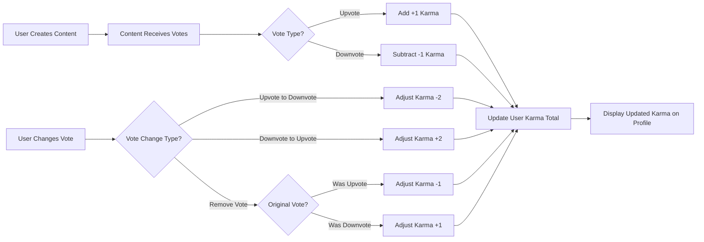
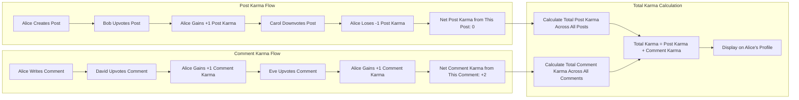

# Karma System Requirements Specification

## 1. Karma System Overview

### 1.1 Purpose and Concept

The karma system serves as the platform's reputation and engagement metric, quantifying user contributions and community recognition. Karma reflects the aggregate value that the community assigns to a user's posts and comments through voting behavior.

**Business Purpose:**
- **User Reputation**: Karma provides a transparent measure of user standing within the community
- **Quality Signal**: High karma users are recognized as valuable contributors
- **Engagement Incentive**: Karma gamification encourages quality content creation
- **Trust Indicator**: Karma helps users identify experienced, trusted community members
- **Behavioral Motivation**: The karma system motivates positive participation and discourages low-quality content

**Karma as Community Currency:**
Karma represents the cumulative recognition a user has earned from the community. Unlike traditional point systems, karma is earned exclusively through peer validation (upvotes and downvotes), making it a democratic measure of contribution quality.

### 1.2 Karma Philosophy

The karma system operates on these core principles:

1. **Peer Recognition**: Only community members determine karma through voting
2. **Contribution-Based**: Karma rewards active participation through posts and comments
3. **Transparent**: All users can view karma scores on profiles
4. **Persistent**: Karma accumulates over the user's lifetime on the platform
5. **Separate Tracking**: Post karma and comment karma are tracked independently to recognize different contribution types

### 1.3 Business Context

Karma serves multiple business objectives:
- **User Retention**: High karma users are more invested in the platform
- **Content Quality**: Karma incentivizes thoughtful, valuable contributions
- **Community Moderation**: Community self-regulates through voting behavior
- **User Engagement**: Karma creates a progression system that encourages continued participation
- **Social Proof**: Karma displays help new users identify authoritative voices

## 2. Karma Types and Categories

### 2.1 Karma Type Definitions

THE system SHALL track two distinct karma categories for each user:

1. **Post Karma**: Reputation earned from votes on user's submitted posts
2. **Comment Karma**: Reputation earned from votes on user's comments and replies

### 2.2 Separate Karma Tracking

**Requirement: Independent Karma Counters**

THE system SHALL maintain separate karma counters for posts and comments.

**Business Justification:**
- Recognizes users who excel at creating original posts vs. those who contribute valuable commentary
- Allows the community to distinguish between content creators and discussion participants
- Provides more nuanced reputation metrics than a single karma score

### 2.3 Total Karma Calculation

**Requirement: Aggregate Karma Display**

THE system SHALL calculate total karma as the sum of post karma and comment karma.

**Calculation:**
```
Total Karma = Post Karma + Comment Karma
```

**Example:**
- User has Post Karma: 1,247
- User has Comment Karma: 3,892
- Total Karma displayed: 5,139

### 2.4 Karma Breakdown Display

THE system SHALL display karma breakdown showing post karma and comment karma separately on user profiles.

Users can view:
- Total karma (prominent display)
- Post karma (detailed breakdown)
- Comment karma (detailed breakdown)

## 3. Karma Earning Rules

### 3.1 Post Karma Earning

**EARS Requirement: Post Upvote Karma**

WHEN a user's post receives an upvote, THE system SHALL increase that user's post karma by one point.

**Business Rules:**
- Each upvote on a post = +1 post karma for the post author
- Karma is awarded immediately when the upvote is registered
- The user who created the post receives the karma, not the community

**User Scenario: Earning Post Karma**

1. Member Alice creates a post in the "Technology" community
2. Member Bob finds Alice's post valuable and upvotes it
3. Alice's post karma increases by 1 point
4. Member Carol also upvotes Alice's post
5. Alice's post karma increases by another 1 point
6. Alice's total post karma reflects all accumulated upvotes across all her posts

### 3.2 Comment Karma Earning

**EARS Requirement: Comment Upvote Karma**

WHEN a user's comment receives an upvote, THE system SHALL increase that user's comment karma by one point.

**Business Rules:**
- Each upvote on a comment = +1 comment karma for the comment author
- Applies to all comment levels (top-level comments and nested replies)
- Karma is awarded immediately when the upvote is registered

**User Scenario: Earning Comment Karma**

1. Member David writes a helpful comment on Alice's post
2. Member Eve upvotes David's comment
3. David's comment karma increases by 1 point
4. Member Frank replies to David's comment, and David's original comment receives more upvotes
5. Each additional upvote adds 1 point to David's comment karma
6. David's total comment karma reflects all upvotes across all his comments

### 3.3 Vote Change Impact on Karma

**EARS Requirement: Vote Removal Karma Adjustment**

WHEN a user removes their upvote from content, THE system SHALL decrease the content author's karma by one point.

**Business Rules:**
- Removing an upvote reverses the karma gain
- If User A upvotes, author gains +1 karma
- If User A then removes the upvote, author loses -1 karma (net change: 0)

**EARS Requirement: Vote Change from Upvote to Downvote**

WHEN a user changes their vote from upvote to downvote on content, THE system SHALL decrease the content author's karma by two points (one point for upvote removal, one point for downvote application).

**Example:**
- Initial state: Alice's post has 10 upvotes, Alice has 10 post karma from this post
- Bob changes his upvote to a downvote
- Alice's karma decreases by 2 points (upvote removal: -1, downvote: -1)
- New state: Alice has 8 post karma from this post

### 3.4 Self-Voting Restriction

**EARS Requirement: No Self-Karma**

THE system SHALL NOT award karma to users for voting on their own content.

**Business Rules:**
- Users cannot upvote their own posts or comments
- Users cannot earn karma from their own votes
- This prevents artificial karma inflation

**Note:** This requirement relates to voting restrictions defined in the [Voting System Requirements](./05-voting-system.md).

## 4. Karma Loss Rules

### 4.1 Downvote Impact on Karma

**EARS Requirement: Post Downvote Karma Loss**

WHEN a user's post receives a downvote, THE system SHALL decrease that user's post karma by one point.

**Business Rules:**
- Each downvote on a post = -1 post karma for the post author
- Karma is reduced immediately when the downvote is registered
- Minimum karma can go to zero or negative values (no floor limit)

**EARS Requirement: Comment Downvote Karma Loss**

WHEN a user's comment receives a downvote, THE system SHALL decrease that user's comment karma by one point.

**Business Rules:**
- Each downvote on a comment = -1 comment karma for the comment author
- Applies to all comment levels
- Karma reduction is immediate

### 4.2 Negative Karma Handling

**EARS Requirement: Negative Karma Allowance**

THE system SHALL allow user karma scores to be negative.

**Business Justification:**
- Reflects community consensus when users consistently post low-quality or inappropriate content
- Provides transparent reputation metric even for poorly-received contributors
- Negative karma serves as a deterrent for poor behavior

**User Scenario: Negative Karma**

1. Member George posts spam content across multiple communities
2. Community members downvote George's posts heavily
3. George's post karma becomes negative (e.g., -15)
4. George's total karma reflects the negative post karma
5. George's profile displays the negative karma transparently

### 4.3 Karma Floor

**EARS Requirement: No Karma Minimum Limit**

THE system SHALL NOT impose a minimum karma limit.

**Business Rules:**
- Karma can decrease indefinitely based on downvotes
- No artificial floor prevents karma from going below a certain threshold
- Negative karma accumulates based on community voting behavior

### 4.4 Content Deletion Impact

**EARS Requirement: Karma Persistence After Deletion**

WHEN a user deletes their post or comment, THE system SHALL retain the karma earned or lost from that content.

**Business Justification:**
- Prevents karma manipulation through content creation and deletion cycles
- Karma represents historical community recognition, not current content
- Users cannot "erase" downvotes by deleting poorly-received content

**User Scenario: Content Deletion and Karma**

1. Member Helen creates a post that receives 50 upvotes
2. Helen's post karma increases by 50 points
3. Helen later deletes the post
4. Helen's post karma remains at the increased level
5. The 50 karma points are permanently part of Helen's reputation

### 4.5 Vote Change from Downvote to Upvote

**EARS Requirement: Vote Reversal Karma Adjustment**

WHEN a user changes their vote from downvote to upvote on content, THE system SHALL increase the content author's karma by two points (one point for downvote removal, one point for upvote application).

**Example:**
- Initial state: Alice's comment has 5 downvotes, Alice has -5 comment karma from this comment
- Bob changes his downvote to an upvote
- Alice's karma increases by 2 points (downvote removal: +1, upvote: +1)
- New state: Alice has -3 comment karma from this comment

## 5. Karma Calculation Logic

### 5.1 Post Karma Calculation Formula

**Calculation Method:**

```
Post Karma = Σ(Upvotes on all user posts) - Σ(Downvotes on all user posts)
```

**Step-by-Step Calculation:**

1. Sum all upvotes received across all user posts
2. Sum all downvotes received across all user posts
3. Subtract total downvotes from total upvotes
4. Result is the user's post karma

**Example Calculation:**

User Alice has created 3 posts:
- Post 1: 25 upvotes, 3 downvotes → Net: 22 karma
- Post 2: 10 upvotes, 1 downvote → Net: 9 karma
- Post 3: 5 upvotes, 8 downvotes → Net: -3 karma

Alice's Total Post Karma: 22 + 9 + (-3) = 28 post karma

### 5.2 Comment Karma Calculation Formula

**Calculation Method:**

```
Comment Karma = Σ(Upvotes on all user comments) - Σ(Downvotes on all user comments)
```

**Step-by-Step Calculation:**

1. Sum all upvotes received across all user comments (all levels of nesting)
2. Sum all downvotes received across all user comments
3. Subtract total downvotes from total upvotes
4. Result is the user's comment karma

**Example Calculation:**

User Bob has written 5 comments:
- Comment 1: 15 upvotes, 2 downvotes → Net: 13 karma
- Comment 2: 8 upvotes, 0 downvotes → Net: 8 karma
- Comment 3: 3 upvotes, 1 downvote → Net: 2 karma
- Comment 4: 1 upvote, 0 downvotes → Net: 1 karma
- Comment 5: 0 upvotes, 5 downvotes → Net: -5 karma

Bob's Total Comment Karma: 13 + 8 + 2 + 1 + (-5) = 19 comment karma

### 5.3 Total Karma Aggregation

**Calculation Method:**

```
Total Karma = Post Karma + Comment Karma
```

**Example Using Previous Calculations:**

- Alice's Post Karma: 28
- Alice's Comment Karma: 45 (from separate comments)
- Alice's Total Karma: 28 + 45 = 73

### 5.4 Real-Time Karma Updates

**EARS Requirement: Immediate Karma Calculation**

WHEN a vote is cast or changed on user content, THE system SHALL recalculate the affected user's karma immediately.

**Business Rules:**
- Karma updates happen in real-time as votes are registered
- Users see updated karma values without page refresh
- Karma changes reflect within 2 seconds of vote registration

**Performance Requirement:**

THE system SHALL update karma scores and display updated values to users within 2 seconds of a vote being cast or changed.

### 5.5 Karma Calculation Integrity

**EARS Requirement: Vote Count Accuracy**

THE system SHALL ensure karma calculations accurately reflect the current vote totals for all user content.

**Data Integrity Rules:**
- Karma must always equal the sum of net votes across all content
- System must reconcile karma if discrepancies are detected
- Audit logs should track karma changes for debugging

## 6. Karma Display Requirements

### 6.1 User Profile Karma Display

**EARS Requirement: Profile Karma Visibility**

THE system SHALL display total karma, post karma, and comment karma on every user profile page.

**Display Specifications:**

**Primary Display:**
- Total Karma: Prominently displayed at the top of the profile
- Font size: Larger than other profile metadata
- Position: Near username and account age

**Detailed Breakdown:**
- Post Karma: Displayed below total karma
- Comment Karma: Displayed below post karma
- Format: "X post karma • Y comment karma"

**Example Profile Display:**

```
Username: Alice_Community_Member
Member since: January 2025
Total Karma: 5,139

Karma Breakdown:
1,247 post karma • 3,892 comment karma
```

### 6.2 Karma Display on Content

**EARS Requirement: Author Karma on Posts**

WHEN displaying a post, THE system SHALL show the post author's total karma next to their username.

**Display Location:**
- Appears next to or below the username on post headers
- Format: "username (X karma)" or "username • X karma"

**EARS Requirement: Author Karma on Comments**

WHEN displaying a comment, THE system SHALL show the comment author's total karma next to their username.

**Display Consistency:**
- Same format as post author karma display
- Visible on all comment levels (top-level and nested replies)

### 6.3 Karma Formatting

**EARS Requirement: Large Karma Number Formatting**

WHEN displaying karma values above 1,000, THE system SHALL format numbers with comma separators for readability.

**Examples:**
- 1,247 karma (not "1247")
- 15,892 karma (not "15892")
- 1,234,567 karma (not "1234567")

**EARS Requirement: Negative Karma Display**

WHEN displaying negative karma, THE system SHALL show the negative sign clearly before the number.

**Examples:**
- -15 karma
- -342 karma

### 6.4 Karma Visibility Permissions

**EARS Requirement: Public Karma Visibility**

THE system SHALL make all user karma scores publicly visible to all users, including guests.

**Business Rules:**
- No privacy settings for karma
- Karma is part of public user reputation
- Guests can view karma without authentication

**Permission Matrix: Karma Visibility**

| User Role | View Own Karma | View Other Users' Karma |
|-----------|----------------|-------------------------|
| Guest | N/A | ✅ Yes |
| Member | ✅ Yes | ✅ Yes |
| Moderator | ✅ Yes | ✅ Yes |
| Admin | ✅ Yes | ✅ Yes |

### 6.5 Karma in User Lists

**EARS Requirement: Karma in Search Results**

WHEN displaying user search results or user lists, THE system SHALL show each user's total karma.

**Use Cases:**
- User search results
- Community member lists
- Leaderboards (if implemented)
- Moderator lists

## 7. Karma-Based Privileges

### 7.1 Privilege Philosophy

**Current Approach:**

For the initial platform release, karma serves purely as a reputation metric without unlocking special privileges.

**Business Rationale:**
- Simplifies initial implementation
- Karma provides intrinsic motivation through recognition
- Allows platform to gather data on karma distribution before setting thresholds

### 7.2 Future Privilege Considerations

**Potential Future Enhancements:**

The platform may introduce karma-based privileges in future iterations, such as:

- **Reduced Rate Limits**: High-karma users may post or comment more frequently
- **Community Creation**: Require minimum karma to create new communities
- **Special Badges**: Visual indicators for karma milestones
- **Moderation Nomination**: High-karma users may be eligible for moderator roles
- **Content Priority**: Slight boost in "hot" algorithm for high-karma users

**Implementation Note:**

IF the platform implements karma-based privileges in the future, THEN THE system SHALL define specific karma thresholds for each privilege level.

### 7.3 No Karma Requirements for Core Functions

**EARS Requirement: Unrestricted Member Actions**

THE system SHALL allow all authenticated members to post, comment, and vote regardless of karma level.

**Business Rules:**
- No minimum karma required to participate
- New users (0 karma) have full member privileges
- Negative karma users retain full participation rights
- Karma does not restrict access to core features

**Permission Matrix: Karma Impact on Permissions**

| Action | Karma Requirement |
|--------|-------------------|
| Create Post | None (authenticated member) |
| Write Comment | None (authenticated member) |
| Upvote Content | None (authenticated member) |
| Downvote Content | None (authenticated member) |
| Subscribe to Community | None (authenticated member) |
| Edit Own Content | None (authenticated member) |
| Delete Own Content | None (authenticated member) |

### 7.4 Karma and Moderation

**EARS Requirement: Karma-Independent Moderation**

THE system SHALL apply moderation rules equally regardless of user karma levels.

**Business Rules:**
- High karma does not exempt users from moderation
- Low or negative karma does not automatically flag content for moderation
- Moderators review reported content based on content, not author karma
- Admins and moderators enforce rules consistently across all karma levels

## 8. Karma History and Tracking

### 8.1 Karma Change Logging

**EARS Requirement: Karma Audit Trail**

THE system SHALL log all karma changes with timestamps and triggering events.

**Logged Information:**
- User ID whose karma changed
- Karma type affected (post or comment)
- Change amount (+1, -1, +2, -2)
- Timestamp of change
- Content ID that triggered the change (post ID or comment ID)
- Vote action that caused the change (upvote added, downvote added, vote removed, vote changed)

**Business Purpose:**
- Enables troubleshooting of karma calculation issues
- Provides audit trail for user inquiries
- Allows detection of anomalous karma patterns
- Supports system integrity verification

### 8.2 Karma History Display

**Current Scope:**

For the initial release, karma history is logged internally but not displayed to users.

**Future Enhancement:**

The platform may introduce a karma history feature showing:
- Daily or monthly karma changes
- Breakdown of karma sources (which posts/comments earned karma)
- Visual graphs of karma trends over time

**EARS Requirement: Historical Karma Data Retention**

THE system SHALL retain karma change logs for a minimum of 12 months.

**Data Retention Business Rules:**
- Logs older than 12 months may be archived or deleted
- User profile always shows current karma totals
- Historical logs are for system auditing, not user-facing features

### 8.3 Karma Milestone Notifications

**Current Scope:**

For the initial release, the system does not notify users of karma milestones.

**Future Enhancement:**

The platform may introduce notifications for karma milestones, such as:
- Reaching 100, 1,000, 10,000 karma
- Achieving specific karma growth rates
- Earning karma on highly-voted content

**Implementation Note:**

IF karma milestone notifications are implemented, THEN THE system SHALL allow users to opt out of these notifications in their account settings.

## 9. Anti-Manipulation Measures

### 9.1 Vote Manipulation Prevention

**EARS Requirement: Vote Fraud Detection**

THE system SHALL monitor voting patterns to detect potential karma manipulation attempts.

**Suspicious Patterns to Detect:**
- Multiple upvotes from the same IP address on the same user's content
- Coordinated voting rings (groups of users consistently upvoting each other)
- Rapid vote changes (upvote/downvote cycling)
- Bot-like voting behavior (mechanical timing patterns)

**Business Response:**

WHEN suspicious voting patterns are detected, THE system SHALL flag the activity for administrator review.

**Potential Actions:**
- Invalidate fraudulent votes
- Reverse karma gained from manipulated votes
- Issue warnings to users involved
- Suspend or ban accounts engaged in vote manipulation

### 9.2 Karma Farming Prevention

**Business Rules:**

- Users cannot create and delete content repeatedly to manipulate karma
- Deleted content's karma persists (see section 4.4)
- Self-voting does not award karma (see section 3.4)

**EARS Requirement: Spam Content Karma Reversal**

WHEN content is removed by moderators or admins as spam, THE system SHALL reverse any karma earned from that content.

**Example:**
- User posts spam that receives 10 upvotes before removal
- User gained 10 post karma
- Moderator removes the post as spam
- System reverses the 10 karma points
- User's post karma decreases by 10

### 9.3 Rate Limiting Integration

**Note:** Detailed rate limiting is specified in other documents. Karma system integrates with rate limiting policies.

**EARS Requirement: Karma Calculation Rate Limits**

THE system SHALL apply rate limiting to karma calculation processes to prevent system abuse through rapid vote changes.

**Business Rules:**
- Limit how frequently a single user can change votes on the same content
- Prevent rapid karma fluctuations from automated voting
- Protect system performance from karma calculation overload

### 9.4 Karma Reset Policy

**EARS Requirement: No Karma Resets**

THE system SHALL NOT provide users with the ability to reset their karma scores.

**Business Justification:**
- Karma represents historical reputation
- Allowing resets would undermine the reputation system
- Users cannot erase negative karma through resets

**Exception:**

IF a user account is found to have been compromised and fraudulent activity inflated or deflated their karma, THEN administrators MAY manually adjust karma to reflect legitimate activity.

## 10. Performance Requirements

### 10.1 Karma Calculation Performance

**EARS Requirement: Vote Processing Speed**

WHEN a vote is cast or changed, THE system SHALL process the vote and update karma within 2 seconds.

**Performance Targets:**
- Vote registration: < 500ms
- Karma calculation: < 1 second
- Karma display update: < 2 seconds total

**User Experience:**
- Users should see karma updates in near real-time
- No noticeable delay between voting and karma change

### 10.2 Karma Display Performance

**EARS Requirement: Profile Load Performance**

WHEN a user profile page loads, THE system SHALL display karma scores within 1 second.

**Performance Targets:**
- Karma data retrieval: < 500ms
- Profile page rendering with karma: < 1 second

**EARS Requirement: Content List Performance**

WHEN displaying lists of posts or comments, THE system SHALL show author karma for all items without degrading page load performance.

**Performance Expectations:**
- Karma display should not add more than 200ms to page load time
- Batch karma retrieval for multiple users efficiently

### 10.3 Scalability Requirements

**EARS Requirement: High-Volume Karma Processing**

THE system SHALL handle karma calculations for up to 10,000 votes per minute without performance degradation.

**Scalability Targets:**
- Support growing user base and voting activity
- Maintain sub-2-second karma updates even during peak traffic
- Scale karma calculation infrastructure horizontally as needed

## 11. Integration with Other Systems

### 11.1 Voting System Integration

The karma system is tightly integrated with the voting system defined in the [Voting System Requirements](./05-voting-system.md).

**Key Integration Points:**
- Every vote triggers a karma calculation
- Vote changes must propagate to karma immediately
- Karma reflects current vote totals at all times

### 11.2 User Authentication Integration

Karma is tied to user accounts as defined in the [User Roles and Authentication Requirements](./02-user-roles-authentication.md).

**Key Integration Points:**
- Karma is stored as part of user profile data
- Only authenticated members earn karma
- Karma persists across user sessions

### 11.3 Content Creation Integration

Karma is earned through content defined in:
- [Content Creation and Posts Requirements](./04-content-creation-posts.md)
- [Comment System Requirements](./06-comment-system.md)

**Key Integration Points:**
- Each post has an associated author who earns post karma
- Each comment has an associated author who earns comment karma
- Content deletion does not affect earned karma

### 11.4 User Profile Integration

Karma display is a core component of user profiles as defined in the [User Profiles and Feeds Requirements](./09-user-profiles-feeds.md).

**Key Integration Points:**
- Profile pages prominently display karma
- Karma breakdown shows post and comment karma separately
- Karma is visible to all users viewing the profile

## 12. Karma System Business Rules Summary

### 12.1 Core Business Rules

1. **Karma Earning**: Users earn +1 karma for each upvote on their content
2. **Karma Loss**: Users lose -1 karma for each downvote on their content
3. **Separate Tracking**: Post karma and comment karma are tracked independently
4. **Total Karma**: Total karma = post karma + comment karma
5. **No Self-Karma**: Users cannot earn karma from their own votes
6. **Persistent Karma**: Karma persists even after content deletion
7. **No Minimum**: Karma can be negative without limit
8. **Public Visibility**: All karma scores are publicly visible
9. **No Privileges**: Karma does not unlock special privileges in the initial release
10. **Real-Time Updates**: Karma updates within 2 seconds of vote changes

### 12.2 Karma Calculation Diagram



### 12.3 Karma Flow User Scenario



## 13. Error Handling and Edge Cases

### 13.1 Vote Processing Errors

**EARS Requirement: Vote Failure Karma Consistency**

IF a vote fails to register due to system error, THEN THE system SHALL NOT update karma until the vote is successfully processed.

**Business Rules:**
- Karma changes are transactional with vote registration
- Failed votes do not partially update karma
- System retries failed votes before abandoning karma updates

### 13.2 Karma Calculation Errors

**EARS Requirement: Karma Mismatch Detection**

WHEN the system detects that calculated karma does not match vote totals, THE system SHALL flag the discrepancy for administrator review and recalculate karma from source data.

**Recovery Process:**
1. Detect karma mismatch during periodic audits
2. Log the discrepancy with user ID and expected vs. actual karma
3. Recalculate karma from vote totals
4. Update user karma to correct value
5. Notify administrators of the correction

### 13.3 Deleted User Karma

**EARS Requirement: Deleted User Karma Handling**

WHEN a user account is deleted, THE system SHALL preserve karma awarded to other users from votes on the deleted user's content.

**Example:**
- Alice upvoted Bob's post, giving Bob +1 post karma
- Alice's account is later deleted
- Bob retains the +1 post karma from Alice's upvote

**Business Justification:**
- Karma represents community validation, not individual voter identity
- Deleting user accounts should not retroactively affect other users' karma
- Maintains karma system integrity

### 13.4 Content Removal by Moderators

**EARS Requirement: Moderation Karma Reversal**

WHEN moderators remove content as spam or rule violation, THE system SHALL reverse karma earned from that content.

**Business Rules:**
- Spam content: Karma fully reversed
- Rule violation content: Karma reversed based on moderation policy
- False positive removals: Admins can restore karma if content is reinstated

**User Notification:**

WHEN karma is reversed due to content removal, THE system SHALL notify the affected user of the karma change and reason.

### 13.5 Vote Brigade Detection

**EARS Requirement: Coordinated Voting Response**

WHEN the system detects coordinated voting (vote brigading) on user content, THE system SHALL invalidate those votes and reverse associated karma changes.

**Detection Indicators:**
- Unusual spike in votes from similar IP addresses or user patterns
- Coordinated timing of votes
- Historical voting relationships suggesting organized manipulation

**Administrator Action:**

Administrators review flagged vote brigading cases and determine appropriate responses, including karma reversal and user sanctions.

## 14. Future Enhancements and Considerations

### 14.1 Weighted Karma Systems

**Future Consideration:**

The platform may introduce weighted karma where votes from high-karma users carry more weight in karma calculations.

**Example:**
- Vote from 10,000+ karma user: +2 karma instead of +1
- Vote from new user (< 100 karma): +1 karma (standard)

**Implementation Note:**

This would require careful balancing to avoid creating karma oligarchies.

### 14.2 Community-Specific Karma

**Future Consideration:**

The platform may track karma separately for each community, showing users' reputation within specific communities.

**Example:**
- Alice has 500 total karma
- Alice has 250 karma in "Technology" community
- Alice has 150 karma in "Science" community

**Use Case:**
- Helps identify community experts
- Allows community-specific moderator selection based on community karma

### 14.3 Karma Decay Over Time

**Future Consideration:**

The platform may implement karma decay where older karma contributions gradually lose weight, emphasizing recent contributions.

**Business Rationale:**
- Reflects current user engagement
- Prevents inactive high-karma users from dominating reputation rankings
- Encourages continued participation

### 14.4 Karma-Based Content Filtering

**Future Consideration:**

Users may filter content to show only posts/comments from users above a certain karma threshold.

**Use Case:**
- Filter out potential spam or low-quality content from new users
- Focus on contributions from established community members

### 14.5 Karma Leaderboards

**Future Consideration:**

The platform may display karma leaderboards showing top contributors by:
- Total karma (all-time)
- Karma gained in the last 30 days
- Karma within specific communities

**Business Purpose:**
- Gamification and engagement
- Recognition for top contributors
- Community building

## 15. Success Metrics for Karma System

### 15.1 Engagement Metrics

**Key Performance Indicators:**

- **Karma Distribution**: Percentage of users with positive, zero, and negative karma
- **Karma Growth Rate**: Average karma earned per user per month
- **High-Karma User Retention**: Retention rate of users with >1,000 karma vs. low-karma users
- **Karma Per Post/Comment**: Average karma earned per piece of content

### 15.2 System Health Metrics

**Technical Performance Indicators:**

- **Karma Calculation Latency**: Average time to update karma after a vote (target: < 2 seconds)
- **Karma Accuracy**: Percentage of karma calculations that match vote totals (target: 99.9%+)
- **Karma Audit Failures**: Number of karma discrepancies detected per day

### 15.3 User Behavior Metrics

**Behavioral Indicators:**

- **Content Quality Correlation**: Relationship between user karma and content quality (measured by average votes per post)
- **Participation Rate by Karma**: Posting/commenting frequency segmented by karma brackets
- **Negative Karma User Behavior**: Tracking whether negative karma users reduce participation or improve content quality

## 16. Conclusion

The karma system serves as the foundation of the platform's reputation and engagement model. By tracking user contributions through community voting, karma provides transparent recognition of valuable participation while incentivizing quality content creation.

**Key Takeaways:**

1. **Separate Tracking**: Post karma and comment karma are tracked independently to recognize different contribution types
2. **Simple Calculation**: +1 karma per upvote, -1 karma per downvote, with immediate updates
3. **Public Transparency**: All karma scores are publicly visible, promoting accountability
4. **No Artificial Limits**: Karma can grow indefinitely or become negative based on community feedback
5. **Persistent Reputation**: Karma persists even after content deletion, representing historical community recognition
6. **No Privilege Gating**: Initial release treats karma as pure reputation metric without unlocking features
7. **Anti-Manipulation**: Built-in protections against vote manipulation and karma farming
8. **Performance Focus**: Real-time karma updates within 2 seconds of vote changes

The karma system integrates seamlessly with the voting system, user authentication, content creation, and user profiles to create a cohesive community platform experience. By quantifying user reputation through peer validation, the karma system empowers the community to self-regulate and recognize valuable contributors.

This specification provides backend developers with complete business requirements for implementing the karma tracking, calculation, display, and integrity systems necessary for a thriving Reddit-like community platform.

---

**Related Documentation:**
- [User Roles and Authentication Requirements](./02-user-roles-authentication.md)
- [Voting System Requirements](./05-voting-system.md)
- [Content Creation and Posts Requirements](./04-content-creation-posts.md)
- [Comment System Requirements](./06-comment-system.md)
- [User Profiles and Feeds Requirements](./09-user-profiles-feeds.md)
