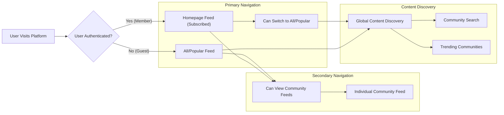
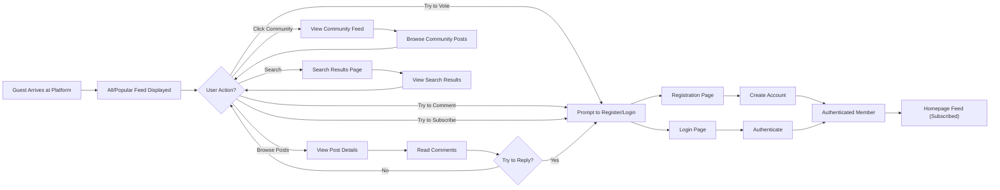
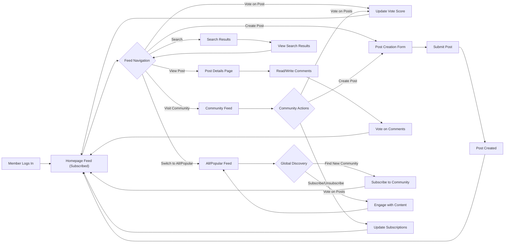
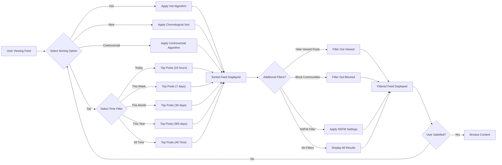

# Content Feeds and Discovery Requirements

## 1. Introduction and Purpose

This document specifies the complete requirements for content feeds, content discovery mechanisms, and navigation systems within the Reddit-like community platform. Feeds are the primary interface through which users consume content, discover communities, and engage with the platform.

The feed system serves multiple critical functions:
- **Content Aggregation**: Bringing together posts from multiple communities into unified, navigable streams
- **Personalization**: Tailoring content presentation based on user subscriptions and preferences
- **Discovery**: Helping users find new communities and interesting content beyond their subscriptions
- **Engagement**: Presenting content in ways that maximize user interaction and platform value

Different user types experience different feed compositions:
- **Guests** see public, global content to encourage exploration and registration
- **Members** see personalized feeds based on their subscriptions and activity
- **All users** can access global feeds for broader content discovery

This document defines the business requirements for how content is presented, discovered, and navigated throughout the platform, ensuring an intuitive and engaging user experience.

## 2. Feed Types and Architecture

### 2.1 Feed Type Definitions

The platform provides four primary feed types, each serving distinct user needs:

**Homepage Feed (Personalized)**

THE system SHALL provide an authenticated members-only feed aggregating posts from their subscribed communities.

WHEN an authenticated member accesses the platform, THE system SHALL display the homepage feed as the default landing page.

THE homepage feed SHALL serve as the primary content consumption interface for logged-in users.

**All/Popular Feed (Global)**

THE system SHALL provide a global feed showing posts from all public communities across the platform.

THE All/Popular feed SHALL be accessible to both guests and authenticated members.

WHEN a guest user visits the platform, THE system SHALL display the All/Popular feed as the default landing page.

**Community Feed (Scoped)**

THE system SHALL provide individual feeds for each community showing only posts within that community.

THE community feed SHALL allow focused exploration of specific topics.

THE community feed SHALL be available to all users, with guests able to view public communities.

**User Profile Feed (Historical)**

THE system SHALL provide feeds on user profiles showing that user's posts and comments separately.

THE user profile feed SHALL enable users to review their own activity and others to see public contribution history.

### 2.2 Feed Hierarchy and Navigation

### 2.3 Feed Relationship Matrix

| Feed Type | Available To | Default For | Content Source | Sorting Options |
|-----------|--------------|-------------|----------------|--------------------|
| Homepage Feed | Members only | Authenticated members | Subscribed communities only | Hot, New, Top (all time filters) |
| All/Popular Feed | Everyone | Guests | All public communities | Hot, New, Top (all time filters), Controversial |
| Community Feed | Everyone (public communities) | N/A | Single community | Hot, New, Top (all time filters), Controversial |
| User Profile Feed | Everyone | N/A | Single user's posts/comments | New (chronological) |

## 3. Homepage Feed (Subscribed Communities)

### 3.1 Core Homepage Feed Requirements

**FR-HF-001: Authenticated Member Access**

THE homepage feed SHALL be accessible only to authenticated members.

WHEN a guest attempts to access the homepage feed, THE system SHALL redirect them to the All/Popular feed.

WHEN a member successfully logs in, THE system SHALL display the homepage feed as the default landing page.

**FR-HF-002: Subscription-Based Content Aggregation**

THE homepage feed SHALL display posts exclusively from communities the user has subscribed to.

WHEN a user subscribes to a new community, THE system SHALL include posts from that community in the homepage feed immediately.

WHEN a user unsubscribes from a community, THE system SHALL remove posts from that community from the homepage feed immediately.

WHEN the system aggregates posts, THE system SHALL update the feed within 5 seconds of subscription changes.

**FR-HF-003: Multi-Community Aggregation**

THE homepage feed SHALL aggregate posts from all subscribed communities into a single chronologically or algorithmically sorted stream.

THE system SHALL clearly indicate which community each post belongs to within the feed.

WHEN posts from different communities are displayed, THE system SHALL interleave them based on the selected sorting algorithm.

THE system SHALL display the community name as a prominent, clickable element for each post.

### 3.2 Empty State Handling

**FR-HF-004: No Subscriptions Scenario**

WHEN a newly registered member has zero community subscriptions, THE system SHALL display an empty state message on the homepage feed.

THE empty state message SHALL include text encouraging the user to discover and subscribe to communities.

THE system SHALL provide direct links or buttons to community discovery features from the empty state.

THE empty state SHALL display within 1 second of homepage access to provide immediate feedback.

**FR-HF-005: Onboarding Recommendations**

WHEN a new member first accesses their homepage feed with no subscriptions, THE system SHALL suggest 5-10 popular or recommended communities.

THE system SHALL display these recommendations with community names, descriptions, and subscriber counts.

THE system SHALL allow users to subscribe to recommended communities directly from the onboarding interface with a single click.

WHEN a user subscribes to initial recommendations, THE system SHALL populate the homepage feed with content from newly subscribed communities within 5 seconds.

### 3.3 Feed Composition and Display

**FR-HF-006: Post Display Requirements**

THE homepage feed SHALL display each post with its title, author username, community name, timestamp, vote score, and comment count.

THE system SHALL show post previews with the first 300 characters for text posts, thumbnail images for image posts, and link preview for link posts.

THE system SHALL provide visual indicators distinguishing post types through icons or labels (text, link, image).

WHEN a post title exceeds 300 characters, THE system SHALL display the full title without truncation.

**FR-HF-007: Community Context**

THE system SHALL display the community name as a clickable link for each post in the homepage feed.

THE community name SHALL be visually prominent to provide clear context about the post's origin.

WHEN a user clicks a community name, THE system SHALL navigate to that community's feed.

THE system SHALL display the community name using a consistent format across all posts (e.g., "r/communityname").

**FR-HF-008: Sorting Integration**

THE homepage feed SHALL support all sorting options defined in the Content Sorting Algorithms document: Hot, New, Top with time filters, and Controversial.

THE system SHALL remember the user's last selected sorting preference for the homepage feed.

THE default sorting for the homepage feed SHALL be "Hot".

WHEN a user changes sorting, THE system SHALL reload the feed with the new sorting within 2 seconds.

### 3.4 Personalization Rules

**FR-HF-009: Subscription Weight**

THE homepage feed SHALL give equal weight to all subscribed communities by default.

THE system SHALL rank posts according to the selected sorting algorithm regardless of which subscribed community they belong to.

THE system SHALL NOT favor posts from communities with more subscribers over communities with fewer subscribers.

THE system SHALL NOT favor posts from communities the user subscribed to more recently.

**FR-HF-010: Activity-Based Filtering**

THE homepage feed SHALL include posts from subscribed communities regardless of the user's interaction history.

THE system SHALL display posts the user has already viewed in the feed unless the user has enabled "hide viewed posts" preference.

WHEN a user manually hides a post, THE system SHALL remove it from the feed permanently and not display it in future feed loads.

THE system SHALL maintain a hidden posts list per user for feed filtering purposes.

## 4. All/Popular Feed (Global Content Discovery)

### 4.1 Core Global Feed Requirements

**FR-AF-001: Universal Access**

THE All/Popular feed SHALL be accessible to all users, both guests and authenticated members.

WHEN an unauthenticated guest visits the platform root URL, THE system SHALL display the All/Popular feed as the default landing page.

THE system SHALL provide a navigation link allowing authenticated members to switch to the All/Popular feed from the homepage feed.

THE system SHALL allow switching between homepage and All/Popular feeds without requiring page reload.

**FR-AF-002: Global Content Aggregation**

THE All/Popular feed SHALL display posts from all public communities across the platform.

THE system SHALL include posts from communities the user has not subscribed to.

THE system SHALL exclude posts from private or restricted communities from the All/Popular feed.

THE system SHALL include posts created within the last 48 hours by default when using "Hot" sorting.

**FR-AF-003: Platform-Wide Discovery**

THE All/Popular feed SHALL serve as the primary discovery mechanism for new content and communities.

THE system SHALL expose users to diverse communities and topics they may not have encountered.

THE feed SHALL represent the full breadth of platform activity across all content categories.

WHEN displaying the All/Popular feed, THE system SHALL prioritize posts with high engagement (votes and comments) to showcase quality content.

### 4.2 Content Ranking and Visibility

**FR-AF-004: Popularity-Based Ranking**

THE All/Popular feed SHALL prioritize highly-voted and highly-engaged posts when using "Hot" or "Top" sorting.

WHEN calculating ranking, THE system SHALL consider upvotes, downvotes, comment count, and post age.

THE system SHALL apply the sorting algorithms defined in the Content Sorting Algorithms document.

WHEN two posts have similar scores, THE system SHALL use post age as a tiebreaker, with newer posts ranked higher.

**FR-AF-005: Community Diversity**

THE All/Popular feed SHALL provide reasonable diversity across different communities.

THE system SHALL avoid displaying more than 5 consecutive posts from the same community in the first 25 posts.

WHILE respecting sorting algorithms, THE system SHALL introduce posts from different communities to maintain variety.

THE system SHALL not artificially boost or suppress posts based solely on community size.

**FR-AF-006: Trending Content Promotion**

WHEN a post experiences rapid vote growth or comment activity, THE system SHALL identify it as trending.

THE system SHALL apply a temporary ranking boost to posts that receive 50+ votes within 1 hour of creation.

THE system SHALL identify trending posts within the last 24 hours for prominent display.

THE system SHALL display a "Trending" indicator badge on posts experiencing rapid engagement growth.

### 4.3 Guest User Experience

**FR-AF-007: Guest Landing Experience**

WHEN an unauthenticated guest visits the platform, THE system SHALL display the All/Popular feed within 2 seconds.

THE system SHALL load the first 25 posts immediately to provide a positive first impression.

THE system SHALL display compelling, high-quality content by using "Hot" as the default sorting for guests.

THE system SHALL ensure the initial feed load completes within 2 seconds under normal network conditions.

**FR-AF-008: Registration Call-to-Action**

THE All/Popular feed for guests SHALL include registration prompts after every 10 posts.

THE system SHALL highlight member-only features including voting, commenting, subscribing, and personalized feeds.

THE registration call-to-action SHALL be visible but not intrusive, occupying less than 20% of viewport height.

WHEN a guest attempts to interact with restricted features, THE system SHALL display a registration modal with benefits clearly explained.

**FR-AF-009: Limited Interactivity for Guests**

WHEN a guest attempts to vote on a post, THE system SHALL prompt them to register or log in.

WHEN a guest attempts to comment, THE system SHALL display a login prompt with account creation option.

WHEN a guest attempts to subscribe to a community, THE system SHALL redirect to registration with the subscription action queued for post-registration completion.

THE system SHALL allow guests to view posts, comments, and vote scores without authentication.

### 4.4 Member Experience with Global Feed

**FR-AF-010: Member Access to All Feed**

THE system SHALL provide authenticated members with a dedicated navigation link to access the All/Popular feed.

THE system SHALL allow members to switch between their personalized homepage feed and the All/Popular feed seamlessly.

WHEN a member views the All/Popular feed, THE system SHALL not affect their subscription list or homepage feed composition.

THE system SHALL remember the member's last viewed feed (homepage or All/Popular) across sessions.

**FR-AF-011: Discovery While Authenticated**

WHEN an authenticated member views the All/Popular feed, THE system SHALL indicate which communities they are already subscribed to with a visual badge or label.

THE system SHALL display a "Subscribe" button for communities the member is not subscribed to directly within post displays.

WHEN a member clicks subscribe from the All/Popular feed, THE system SHALL add the community to their subscriptions immediately.

WHEN a member votes or comments on posts in the All/Popular feed, THE system SHALL record these interactions identically to homepage feed interactions.

## 5. Individual Community Feeds

### 5.1 Core Community Feed Requirements

**FR-CF-001: Community-Scoped Content**

THE system SHALL provide a dedicated feed for each community showing only posts within that community.

WHEN a user navigates to a community, THE system SHALL display the community feed as the primary content.

THE system SHALL exclude posts from other communities from the community-specific feed.

THE system SHALL load the community feed within 1 second of navigation.

**FR-CF-002: Community Feed Access**

THE community feed SHALL be accessible to all users for public communities.

THE system SHALL allow guests to view community feeds without authentication.

THE system SHALL display the community name, description, and subscriber count at the top of the community feed.

WHEN a community is private, THE system SHALL restrict access to members only and display an access denied message to non-members.

**FR-CF-003: Community Context Display**

THE community feed page SHALL prominently display the community name, description, and community rules.

THE system SHALL show the number of current subscribers for the community.

THE system SHALL display the number of currently active users (users viewing the community in the last 15 minutes).

THE system SHALL show moderator information including moderator usernames and appointment dates.

THE system SHALL display the community creation date to provide historical context.

### 5.2 Community Feed Content and Sorting

**FR-CF-004: Post Display in Community Feeds**

THE community feed SHALL display all active posts created within that community.

THE system SHALL display posts with title, author, timestamp, vote score, and comment count.

THE system SHALL support the same post preview functionality as other feeds: 300-character text preview, thumbnails for images, link metadata for links.

WHEN a post is removed by moderators, THE system SHALL exclude it from the community feed for non-moderators.

**FR-CF-005: Community Feed Sorting**

THE community feed SHALL support all sorting options: Hot, New, Top (with time filters), and Controversial.

THE default sorting for community feeds SHALL be "Hot".

THE system SHALL remember the user's sorting preference per community during the session.

WHEN a user changes sorting, THE system SHALL reload the feed with new sorting within 1 second.

**FR-CF-006: Pinned Posts**

THE system SHALL allow moderators to pin up to 2 posts to the top of the community feed.

WHEN posts are pinned, THE system SHALL display them at the top regardless of sorting selection.

THE system SHALL clearly indicate pinned posts with a "Pinned" badge or distinctive styling.

WHEN multiple posts are pinned, THE system SHALL order them by pin timestamp (most recently pinned first).

WHEN viewing a community feed, THE system SHALL display pinned posts first, then regular posts sorted by the selected algorithm.

### 5.3 Community Feed Interactions

**FR-CF-007: Subscription from Community Feed**

WHEN an authenticated member views a community feed, THE system SHALL display a "Subscribe" button prominently in the community header.

WHEN a user clicks "Subscribe," THE system SHALL add the community to their subscription list immediately.

WHEN a user is already subscribed, THE system SHALL display an "Unsubscribe" button instead.

WHEN a user subscribes or unsubscribes, THE system SHALL update the button state within 1 second without page reload.

**FR-CF-008: Guest Interaction Prompts**

WHEN a guest attempts to subscribe to a community, THE system SHALL prompt them to register or log in.

WHEN a guest attempts to create a post in a community, THE system SHALL display a registration/login modal.

THE system SHALL allow guests to view all public community content without authentication prompts.

WHEN a guest interacts with restricted features, THE system SHALL preserve their intended action for completion after authentication.

**FR-CF-009: Post Creation from Community Feed**

THE system SHALL provide a visible "Create Post" button within the community feed interface.

WHEN an authenticated member clicks "Create Post," THE system SHALL open the post creation form with the community pre-selected.

THE "Create Post" button SHALL be positioned prominently in the community feed header.

WHEN a guest clicks "Create Post," THE system SHALL prompt for login/registration before allowing post creation.

### 5.4 Community Discovery Integration

**FR-CF-010: Related Communities**

THE community feed page SHALL display a sidebar section showing 3-5 related or similar communities.

THE system SHALL calculate related communities based on subscriber overlap and topic similarity.

THE system SHALL provide clickable links to navigate to related communities directly.

WHEN displaying related communities, THE system SHALL show community name, subscriber count, and brief description.

**FR-CF-011: Community Search Access**

THE community feed page SHALL provide access to the platform's community search functionality through a search box in the header or sidebar.

THE system SHALL allow users to search for other communities without leaving the current page context.

WHEN a user searches for communities, THE system SHALL display results in a dropdown or modal overlay.

THE system SHALL allow direct navigation to other community feeds from search results.

## 6. Feed Pagination and Performance

### 6.1 Pagination Strategy

**FR-FP-001: Page-Based Pagination**

THE system SHALL implement page-based pagination for all feed types.

THE system SHALL display 25 posts per page by default.

THE system SHALL provide clear "Next Page" and "Previous Page" navigation controls at the bottom of each feed page.

WHEN a user clicks "Next Page," THE system SHALL load the next 25 posts within 2 seconds.

**FR-FP-002: Pagination URL Parameters**

THE system SHALL use URL parameters to indicate the current page number using the format "?page=2".

WHEN a user navigates to a specific page, THE system SHALL update the browser URL to reflect the page number.

THE system SHALL support direct navigation to paginated URLs, allowing shareable links to specific feed pages.

WHEN a user bookmarks a paginated URL, THE system SHALL load that specific page when the bookmark is accessed.

**FR-FP-003: Infinite Scroll Option**

THE system SHALL implement optional infinite scroll as an alternative to traditional pagination.

WHEN infinite scroll is enabled, THE system SHALL automatically load the next 25 posts when the user scrolls within 200 pixels of the bottom.

THE system SHALL provide a user preference toggle between pagination and infinite scroll in account settings.

WHEN infinite scroll is active, THE system SHALL update the URL with the current page number for bookmarking support.

### 6.2 Page Size and Loading

**FR-FP-004: Configurable Page Size**

THE default page size SHALL be 25 posts per page.

THE system SHALL allow users to adjust page size in their preferences with options: 10, 25, 50, 100 posts per page.

THE system SHALL respect the user's page size preference across all feeds (homepage, All/Popular, community).

WHEN a user changes page size, THE system SHALL immediately reload the current feed with the new page size.

**FR-FP-005: Partial Page Handling**

WHEN the final page contains fewer than the configured page size, THE system SHALL display all remaining posts.

THE system SHALL disable the "Next Page" button when no more posts are available.

THE system SHALL hide the "Next Page" button on the final page to indicate end of content.

THE system SHALL display a message "You've reached the end" when users reach the final page.

### 6.3 Performance Requirements

**FR-FP-006: Feed Load Time**

THE system SHALL load and display feed pages within 2 seconds under normal network conditions.

THE system SHALL prioritize rendering visible content before loading below-the-fold elements.

WHEN loading a feed page, THE system SHALL display a loading skeleton or spinner within 200 milliseconds.

THE system SHALL complete initial page render within 1 second, with images loading progressively afterward.

**FR-FP-007: Lazy Loading of Images**

THE system SHALL implement lazy loading for post images and thumbnails.

THE system SHALL load images only when they are within 400 pixels of entering the viewport.

THE system SHALL display placeholder images with dimensions matching the actual image during loading.

WHEN images fail to load, THE system SHALL display a broken image placeholder with retry option.

**FR-FP-008: Caching Strategy**

THE system SHALL cache frequently accessed feed pages for 5 minutes to improve performance.

WHEN new posts are created, THE system SHALL invalidate relevant feed caches to ensure content freshness.

THE system SHALL use browser caching for static assets including images, CSS, and JavaScript.

WHEN a user refreshes a feed, THE system SHALL fetch fresh data while displaying cached content during loading.

### 6.4 Pagination State Management

**FR-FP-009: Page Navigation Persistence**

WHEN a user clicks a post from page 3 and then returns to the feed, THE system SHALL return them to page 3.

THE system SHALL maintain pagination state during browser back/forward navigation.

WHEN a user refreshes the browser, THE system SHALL preserve the current page number based on URL parameters.

THE system SHALL restore scroll position when returning to a previously viewed feed page within the same session.

**FR-FP-010: End of Feed Indication**

WHEN a user reaches the last page of a feed, THE system SHALL clearly indicate there are no more posts.

THE system SHALL display a message "You've reached the end" or "No more posts available".

THE "Next Page" button SHALL be disabled and visually grayed out on the final page.

WHEN using infinite scroll, THE system SHALL display the end message and stop attempting to load additional content.

## 7. Content Discovery Mechanisms

### 7.1 Community Discovery Features

**FR-CD-001: Community Discovery Page**

THE system SHALL provide a dedicated community discovery page accessible from main navigation.

THE discovery page SHALL showcase communities organized by trending, popular, new, and recommended categories.

WHEN a user accesses the discovery page, THE system SHALL load within 2 seconds with at least 20 communities displayed.

THE system SHALL provide category filters allowing users to browse communities by topic.

**FR-CD-002: Trending Communities**

THE system SHALL identify trending communities based on subscriber growth rate over the past 7 days.

THE system SHALL calculate trending score as: (new subscribers in last 7 days) / (total subscribers) × 100.

THE system SHALL display the top 10 trending communities in the discovery interface.

WHEN a community experiences subscriber growth exceeding 25% in 7 days, THE system SHALL mark it as trending.

THE system SHALL update trending community calculations every 6 hours.

**FR-CD-003: Popular Communities**

THE system SHALL maintain a list of popular communities ranked by total subscriber count.

THE system SHALL display the top 20 popular communities on the discovery page.

THE system SHALL update popularity rankings daily at midnight UTC.

WHEN displaying popular communities, THE system SHALL show subscriber count, growth percentage, and community description.

**FR-CD-004: New Communities**

THE system SHALL showcase newly created communities to give them visibility.

THE system SHALL define new communities as those created within the past 30 days.

THE system SHALL display 15 new communities on the discovery page, randomized daily.

WHEN displaying new communities, THE system SHALL show creation date, creator username, and initial post count.

### 7.2 Recommended Communities Algorithm

**FR-CD-005: Personalized Community Recommendations**

THE system SHALL recommend communities to authenticated members based on their current subscriptions.

THE system SHALL calculate recommendations by identifying communities with high subscriber overlap (20%+ shared subscribers).

THE system SHALL display 5-10 recommended communities on the homepage sidebar or discovery page.

WHEN calculating recommendations, THE system SHALL exclude communities the user is already subscribed to.

**FR-CD-006: Recommendation Diversity**

THE system SHALL ensure recommended communities span at least 3 different topic categories.

THE system SHALL avoid recommending only communities similar to the user's most popular subscription.

THE system SHALL include a mix of established communities (1000+ subscribers) and emerging communities (100-1000 subscribers).

WHEN generating recommendations, THE system SHALL prioritize communities with high activity (5+ posts per day).

**FR-CD-007: Guest Community Recommendations**

THE system SHALL display 10 general popular or featured communities to unauthenticated guests on the discovery page.

THE system SHALL select guest recommendations from communities with high engagement and quality content.

THE system SHALL showcase diverse topic categories to appeal to broad interests.

WHEN displaying guest recommendations, THE system SHALL highlight communities with recent viral posts.

### 7.3 Category-Based Discovery

**FR-CD-008: Community Categories**

THE system SHALL implement a category system for communities with categories including: Technology, Gaming, Sports, Arts, Science, Entertainment, Lifestyle, Education, News, and Hobbies.

THE system SHALL allow communities to be classified into one or more categories.

THE system SHALL provide category browsing on the discovery page with visual category icons.

WHEN a user selects a category, THE system SHALL filter communities to show only those in the selected category.

**FR-CD-009: Category Assignment**

THE system SHALL allow community creators to select up to 3 categories when creating a community.

THE system SHALL allow moderators to update community categories at any time.

WHEN a category is assigned, THE system SHALL immediately include the community in that category's discovery listings.

THE system SHALL validate that at least one category is selected for each community.

**FR-CD-010: Category Browse Experience**

THE system SHALL allow users to filter the discovery page by specific categories through a dropdown or filter panel.

WHEN a category is selected, THE system SHALL display only communities within that category sorted by popularity.

THE system SHALL show the number of communities within each category as a badge (e.g., "Technology (234)").

WHEN viewing a category, THE system SHALL display trending, popular, and new communities within that category.

### 7.4 Discovery Integration in Feeds

**FR-CD-011: Sidebar Recommendations**

THE homepage and All/Popular feeds SHALL display a sidebar with 5 recommended or trending communities.

THE sidebar SHALL be visible on desktop viewports wider than 1024 pixels.

THE sidebar SHALL position on the right side of the feed, occupying 25% of viewport width.

WHEN a user subscribes to a community from the sidebar, THE system SHALL update recommendations within 5 seconds.

**FR-CD-012: Discovery Prompts for New Users**

WHEN a new member has fewer than 3 subscriptions, THE system SHALL display a prominent discovery prompt at the top of the homepage.

THE prompt SHALL encourage new users to explore and subscribe to multiple communities.

THE system SHALL reduce discovery prompt frequency as users subscribe to more communities.

WHEN a user reaches 5 subscriptions, THE system SHALL stop displaying the new user discovery prompt.

## 8. Search Functionality

### 8.1 Search Scope and Types

**FR-SF-001: Multi-Scope Search**

THE system SHALL provide search functionality across three scopes: Posts, Communities, and Users.

THE system SHALL display scope selection as tabs or a dropdown in the search interface.

THE default search scope SHALL be "Posts".

WHEN a user switches search scope, THE system SHALL preserve the search query and re-execute the search in the new scope.

**FR-SF-002: Post Search**

THE system SHALL allow users to search for posts by title and content text.

THE system SHALL include posts from all public communities in search results.

THE system SHALL allow authenticated members to filter post search results to only their subscribed communities through a checkbox option.

WHEN searching posts, THE system SHALL return results within 2 seconds for typical queries.

**FR-SF-003: Community Search**

THE system SHALL allow users to search for communities by name and description text.

THE system SHALL display community search results with community name, description preview (100 characters), subscriber count, and subscribe button.

THE system SHALL rank community search results by relevance score and subscriber count.

WHEN a user searches for a community name, THE system SHALL prioritize exact name matches at the top of results.

**FR-SF-004: User Search**

THE system SHALL allow users to search for other users by username.

THE system SHALL display user search results with username, total karma score, and profile link.

THE system SHALL support partial username matching, returning results for usernames containing the search term.

WHEN searching users, THE system SHALL rank results alphabetically by username.

### 8.2 Search Ranking and Relevance

**FR-SF-005: Post Search Ranking**

THE system SHALL rank post search results by relevance score calculated from keyword matches.

THE system SHALL weight title matches 3× higher than content body matches.

THE system SHALL boost posts with vote scores above 50 by 20% in relevance ranking.

WHEN multiple posts have similar relevance scores, THE system SHALL use vote score as a tiebreaker.

**FR-SF-006: Community Search Ranking**

THE system SHALL prioritize exact or near-exact name matches in community search results.

THE system SHALL boost communities with subscriber counts above 1000 by 15% in relevance ranking.

THE system SHALL rank active communities (with posts in last 7 days) higher than inactive ones with similar relevance.

WHEN calculating community search ranking, THE system SHALL consider name match quality, subscriber count, and recent activity.

**FR-SF-007: Recency Consideration**

THE system SHALL provide a "Sort by: Relevance" or "Sort by: New" toggle for post search results.

WHEN sorting by "New", THE system SHALL rank posts by creation timestamp in descending order (newest first).

WHEN sorting by "Relevance", THE system SHALL boost posts created within the last 7 days by 10%.

THE system SHALL apply time-based boosting to ensure recent relevant posts rank above older posts with slightly better keyword matches.

### 8.3 Search Filters and Refinement

**FR-SF-008: Search Result Filtering**

THE system SHALL allow filtering post search results by community through a community dropdown.

THE system SHALL allow filtering post search results by post type using checkboxes for text, link, and image.

THE system SHALL allow filtering post search results by time range with options: past day, week, month, year, all time.

WHEN a filter is applied, THE system SHALL update search results within 1 second.

**FR-SF-009: Advanced Search Options**

THE system SHALL provide an advanced search option for author-specific searches using "author:username" syntax.

THE system SHALL allow excluding specific communities from search results using "-community:name" syntax.

THE system SHALL support phrase matching using quotation marks around multi-word search terms.

WHEN advanced search syntax is used, THE system SHALL parse and apply filters automatically.

**FR-SF-010: Saved Searches**

THE system SHALL allow authenticated members to save frequently used search queries.

WHEN a user saves a search, THE system SHALL store the search query, scope, and applied filters.

THE system SHALL display saved searches in a dropdown accessible from the search interface.

THE system SHALL allow users to delete saved searches through account settings.

### 8.4 Search Result Presentation

**FR-SF-011: Search Result Display**

THE system SHALL display search results in a list format with clear visual hierarchy.

THE system SHALL show post results with title, community name, author, vote score, comment count, and 150-character excerpt.

THE system SHALL show community results with name, subscriber count, 200-character description preview, and subscribe button.

THE system SHALL show user results with username, karma score, account age, and profile link.

**FR-SF-012: Search Result Pagination**

THE system SHALL paginate search results with 25 results per page.

THE system SHALL provide "Next" and "Previous" page navigation for search results.

THE system SHALL display the total number of results found (e.g., "Showing 1-25 of 432 results").

WHEN navigating between search result pages, THE system SHALL maintain all applied filters and sorting.

**FR-SF-013: No Results Handling**

WHEN a search query returns zero results, THE system SHALL display a "No results found" message.

THE system SHALL suggest alternative search terms or broader queries below the no results message.

THE system SHALL recommend popular communities or trending posts as alternatives when no results are found.

THE system SHALL allow users to easily modify their search query from the no results page.

### 8.5 Search Performance

**FR-SF-014: Search Response Time**

THE system SHALL return search results within 2 seconds under normal conditions for queries with fewer than 1000 results.

THE system SHALL display a loading indicator within 200 milliseconds of search submission.

THE system SHALL optimize search queries to complete within 1 second for 95% of searches.

WHEN search processing exceeds 2 seconds, THE system SHALL display a message indicating results are still loading.

**FR-SF-015: Search Indexing**

THE system SHALL maintain up-to-date search indexes for posts, communities, and users.

THE system SHALL index new posts within 1 minute of creation for search availability.

THE system SHALL index new communities immediately upon creation.

THE system SHALL implement fuzzy matching to handle misspellings and typos with edit distance up to 2 characters.

### 8.6 Recent and Popular Searches

**FR-SF-016: Recent Searches**

THE system SHALL store the user's last 10 search queries locally or server-side for authenticated users.

WHEN a user focuses the search box, THE system SHALL display recent searches in a dropdown.

THE system SHALL allow users to clear their recent search history through a "Clear" button.

WHEN a user clicks a recent search, THE system SHALL immediately execute that search.

**FR-SF-017: Popular Searches**

THE system SHALL calculate and display the top 5 trending search queries platform-wide.

THE system SHALL calculate popular searches based on search volume over the past 24 hours.

THE system SHALL display popular searches on the search interface to help users discover trending topics.

THE system SHALL update popular searches every 1 hour to reflect current trends.

## 9. Feed Personalization and Ranking

### 9.1 Personalization Factors

**FR-FPR-001: Subscription-Based Personalization**

THE homepage feed SHALL be personalized exclusively based on the user's community subscriptions.

THE system SHALL include posts only from communities the user has explicitly subscribed to.

THE system SHALL NOT include posts from non-subscribed communities in the homepage feed.

THE system SHALL update homepage feed composition within 5 seconds of subscription changes.

**FR-FPR-002: Activity-Based Adjustments**

THE system SHALL track user interaction patterns including posts viewed, voted on, and commented on.

THE system SHALL apply minor ranking adjustments (maximum 10% boost) to communities the user engages with frequently.

THE system SHALL calculate engagement frequency as interactions per post viewed within the last 30 days.

WHEN applying activity-based adjustments, THE system SHALL not violate the core sorting algorithm principles.

**FR-FPR-003: Time-Based Freshness**

THE homepage feed SHALL prioritize recent posts to ensure content freshness.

WHEN using "Hot" sorting, THE system SHALL apply time decay such that posts older than 7 days decrease in ranking by 50%.

THE system SHALL balance between showing new content and high-quality older content based on the selected sorting algorithm.

WHEN using "Top (All Time)" sorting, THE system SHALL not apply time-based adjustments.

### 9.2 Feed Diversity Requirements

**FR-FPR-004: Community Distribution**

THE homepage feed SHALL provide balanced representation of all subscribed communities.

THE system SHALL avoid showing more than 7 consecutive posts from the same community in the first 25 posts.

WHILE respecting sorting algorithms, THE system SHALL introduce posts from different communities to maintain variety.

WHEN a user is subscribed to fewer than 5 communities, THE system SHALL not apply diversity requirements.

**FR-FPR-005: Content Type Diversity**

THE feed SHALL include a mix of post types (text, link, image) when available in subscribed communities.

THE system SHALL NOT favor one post type over others in ranking calculations.

WHEN calculating feed composition, THE system SHALL apply identical ranking logic regardless of post type.

THE system SHALL ensure content diversity occurs naturally through varied community content rather than artificial boosting.

**FR-FPR-006: Avoiding Echo Chambers**

THE All/Popular feed SHALL occasionally surface highly-ranked posts from popular communities the user has not subscribed to.

THE system SHALL include discovery recommendations in the sidebar to encourage exploring beyond existing subscriptions.

THE platform SHALL facilitate exposure to diverse perspectives through the All/Popular feed and discovery features.

WHEN a member uses the All/Popular feed, THE system SHALL not filter content based on their subscription preferences.

### 9.3 User Preference Learning

**FR-FPR-007: Implicit Preference Signals**

THE system SHALL track time spent viewing posts (dwell time) to identify user interests.

THE system SHALL track upvote/downvote patterns to understand content preferences.

THE system SHALL track comment frequency per community to gauge engagement levels.

WHEN sufficient interaction data is available (minimum 100 interactions), THE system SHALL apply minor ranking adjustments (maximum 5% boost).

**FR-FPR-008: Explicit Preference Controls**

THE system SHALL allow users to hide posts from specific communities through a "Hide posts from this community" option.

THE system SHALL provide an option to hide posts the user has already viewed in account preferences.

THE system SHALL allow users to reset or clear their personalization settings through account settings.

WHEN a user hides a community, THE system SHALL exclude all posts from that community from feeds immediately.

**FR-FPR-009: Sorting Preference Memory**

THE system SHALL remember the user's last selected sorting option for each feed type separately (homepage, All/Popular, community).

WHEN a user returns to a feed, THE system SHALL apply their previously selected sorting preference.

THE system SHALL persist sorting preferences across sessions for authenticated members.

WHEN a user changes sorting, THE system SHALL update their preference immediately for future visits.

### 9.4 Feed Ranking Transparency

**FR-FPR-010: Ranking Explanation**

THE system SHALL provide optional explanations for why certain posts appear in the feed (e.g., "Popular in r/technology").

THE system SHALL clearly indicate the active sorting method through visual highlighting in the sorting selector.

WHEN displaying posts, THE system SHALL show post metadata (vote score, comment count, age) to help users understand ranking.

THE system SHALL provide a help link explaining how feed ranking and sorting algorithms work.

**FR-FPR-011: Algorithmic Fairness**

THE feed ranking algorithm SHALL NOT discriminate against specific users, communities, or post types.

THE system SHALL provide equal opportunity for all posts to rank based on merit (votes, engagement, recency).

THE system SHALL NOT artificially boost platform-promoted content or paid promotions in organic feeds.

THE system SHALL apply identical ranking logic to all posts within the same sorting algorithm context.

## 10. Guest vs. Authenticated User Experiences

### 10.1 Content Visibility Differences

**FR-GU-001: Guest Content Access**

THE system SHALL allow guests to view all public communities and posts without authentication.

THE system SHALL allow guests to see vote scores, comment counts, and read all comments.

THE system SHALL NOT allow guests to view private or restricted communities.

WHEN a guest attempts to access a private community, THE system SHALL display a message requiring login.

**FR-GU-002: Authenticated Member Content Access**

THE system SHALL grant authenticated members access to all content available to guests.

THE system SHALL additionally provide authenticated members with their personalized homepage feed.

THE system SHALL allow authenticated members to access private communities they are members of.

THE system SHALL grant members full interaction capabilities including voting, commenting, and posting.

**FR-GU-003: Identical Post Display**

THE system SHALL display posts identically to guests and authenticated members.

THE system SHALL show vote scores, comment counts, and post content to all users regardless of authentication status.

THE system SHALL differentiate only interactive elements (voting buttons, comment forms) between guest and member views.

WHEN displaying posts, THE system SHALL use the same layout and styling for guests and members.

### 10.2 Feature Access Restrictions

**FR-GU-004: Guest Interaction Limitations**

THE system SHALL NOT allow guests to upvote or downvote posts or comments.

THE system SHALL NOT allow guests to create posts or write comments.

THE system SHALL NOT allow guests to subscribe to communities.

THE system SHALL NOT allow guests to report content or access moderation features.

THE system SHALL display disabled voting buttons to guests to indicate the feature exists.

**FR-GU-005: Guest Action Prompts**

WHEN a guest attempts to vote, THE system SHALL display a modal prompt to register or log in.

WHEN a guest attempts to comment, THE system SHALL show a login prompt with clear account creation option.

WHEN a guest attempts to subscribe, THE system SHALL redirect to registration with the subscription queued for post-registration.

THE system SHALL display prompts within 500 milliseconds of guest interaction with restricted features.

**FR-GU-006: Member Interactive Features**

THE system SHALL allow authenticated members to upvote and downvote posts and comments with immediate effect.

THE system SHALL allow authenticated members to create posts in any community they are not banned from.

THE system SHALL allow authenticated members to write comments and replies at any nesting level.

THE system SHALL allow authenticated members to subscribe to unlimited communities.

### 10.3 Call-to-Action for Registration

**FR-GU-007: Registration Encouragement**

THE platform SHALL include registration calls-to-action after every 10 posts in guest feeds.

THE system SHALL highlight member benefits including voting, commenting, personalized feeds, and karma tracking.

THE system SHALL NOT block content access to encourage registration (no paywalls).

WHEN displaying registration prompts, THE system SHALL occupy less than 25% of viewport height to minimize intrusiveness.

**FR-GU-008: Strategic CTA Placement**

THE system SHALL display registration CTAs in strategic locations: after 5 posts viewed, in sidebar, and after interaction attempts.

WHEN a guest attempts a restricted action, THE system SHALL display a modal CTA explaining the benefit and providing registration link.

THE system SHALL limit CTA frequency to maximum once per 5 posts to avoid annoyance.

THE system SHALL use A/B tested messaging to optimize conversion rates.

**FR-GU-009: Value Proposition Communication**

THE system SHALL clearly communicate registration benefits: personalization, participation, community building, and karma reputation.

THE system SHALL display testimonials or statistics showing active community engagement to inspire registration.

THE platform SHALL showcase member features including custom avatars, saved posts, and personalized recommendations.

WHEN communicating value, THE system SHALL emphasize social benefits and community connection over feature lists.

### 10.4 Guest Feed Composition

**FR-GU-010: Guest Default Feed**

THE system SHALL display the All/Popular feed as the default landing page for guests.

THE guest feed SHALL showcase the platform's best and most engaging content using "Hot" sorting.

THE system SHALL prioritize high-quality posts with vote scores above 100 for guest first impressions.

THE system SHALL ensure the guest feed loads within 2 seconds to create positive first impressions.

**FR-GU-011: Guest Discovery Experience**

THE system SHALL grant guests full access to community discovery features.

THE system SHALL allow guests to browse communities, view community feeds, and explore content freely.

THE only restriction for guests SHALL be participation (voting, commenting, posting, subscribing).

WHEN guests browse discovery pages, THE system SHALL display subscribe prompts that redirect to registration.

**FR-GU-012: Guest Session Persistence**

THE system SHALL track guest browsing preferences during a session using browser localStorage.

THE system SHALL remember guest's selected sorting option across page navigations within the session.

THE system SHALL clear guest session data when the browser is closed or cookies are cleared.

THE system SHALL NOT require an account for basic preference persistence during active browsing.

## 11. Feed Refresh and Real-Time Updates

### 11.1 Feed Refresh Mechanisms

**FR-FR-001: Manual Refresh**

THE system SHALL allow users to manually refresh any feed by clicking a refresh button or using browser refresh (F5).

WHEN a user refreshes a feed, THE system SHALL reload with the latest posts reflecting new content created since last load.

THE system SHALL maintain the user's current page number and sorting preference during refresh.

THE system SHALL complete manual refresh within 2 seconds under normal network conditions.

**FR-FR-002: Automatic Refresh Interval**

THE system SHALL automatically check for new content every 5 minutes when the feed page is active and visible.

WHEN new content is detected, THE system SHALL display a notification banner indicating new posts are available.

THE system SHALL NOT automatically insert new posts while the user is actively scrolling or reading.

THE system SHALL allow users to disable automatic refresh checking in account preferences.

**FR-FR-003: Pull-to-Refresh (Mobile)**

THE system SHALL implement pull-to-refresh functionality for mobile web interfaces.

WHEN a user pulls down on a feed, THE system SHALL display a loading indicator and reload with latest content.

THE pull-to-refresh gesture SHALL require a minimum 80-pixel drag distance to activate.

THE system SHALL complete pull-to-refresh reload within 2 seconds on mobile networks.

### 11.2 New Content Notifications

**FR-FR-004: New Posts Indicator**

WHEN new posts are available at the top of the feed, THE system SHALL display a notification banner (e.g., "5 new posts available").

WHEN a user clicks the notification banner, THE system SHALL reload the feed and scroll to the top.

THE notification banner SHALL be dismissible by clicking a close button.

THE system SHALL display the notification banner within 10 seconds of detecting new content.

**FR-FR-005: Real-Time vs. Static Feeds**

THE system SHALL implement static feeds where content does not change without user action.

THE system SHALL require users to manually trigger refresh via button click, notification banner, or browser refresh.

THE system SHALL NOT automatically insert new posts while users are actively viewing the feed to avoid position jumping.

WHEN the feed page is inactive (tab not visible) for more than 30 minutes, THE system SHALL refresh automatically upon tab reactivation.

**FR-FR-006: Background Content Loading**

THE system SHALL pre-load new posts in the background while the user is viewing the current feed.

THE system SHALL store background-loaded content in memory without displaying it.

WHEN the user triggers a refresh, THE system SHALL instantly display the pre-loaded content.

THE system SHALL limit background loading to the next 25 posts to conserve bandwidth.

### 11.3 Update Frequency Requirements

**FR-FR-007: Content Freshness Balance**

THE system SHALL balance content freshness with server load by checking for updates every 5 minutes.

THE system SHALL ensure feed updates occur frequently enough to provide current content (within 5 minutes of creation).

THE system SHALL NOT refresh feeds more frequently than every 60 seconds to prevent performance issues.

WHEN server load is high, THE system SHALL extend refresh intervals to 10 minutes automatically.

**FR-FR-008: High-Activity Handling**

WHEN a community experiences high posting activity (10+ posts per hour), THE system SHALL prioritize showing new content.

THE system SHALL update high-activity community feeds every 2 minutes instead of 5 minutes.

THE system SHALL prevent feed overflow by maintaining the 25-post pagination limit.

WHEN high activity is detected, THE system SHALL display a badge indicating "High Activity" on the community.

## 12. Content Filtering and Preferences

### 12.1 User Content Preferences

**FR-CFP-001: Hide Viewed Posts**

THE system SHALL allow authenticated members to enable "hide viewed posts" option in account settings.

WHEN this option is enabled, THE system SHALL remove posts the user has clicked on from subsequent feed loads.

THE system SHALL maintain a viewed posts list per user for filtering purposes.

THE system SHALL allow users to view hidden posts in a dedicated "History" section accessible from account settings.

**FR-CFP-002: Custom Feed Filters**

THE system SHALL allow users to create custom filters to hide posts containing specific keywords.

THE system SHALL allow users to filter out posts from specific communities through a block list.

THE system SHALL apply custom filters across all feeds (homepage, All/Popular, community).

WHEN a user creates a filter, THE system SHALL apply it immediately and persist it across sessions.

**FR-CFP-003: Default Content Visibility**

THE system SHALL display all content by default without filters unless users opt in.

THE system SHALL apply user-created filters only to the individual user who created them.

THE system SHALL NOT apply platform-wide content filtering beyond removing rule-violating content.

WHEN no filters are active, THE system SHALL display all posts matching the current feed context and sorting.

### 12.2 NSFW and Sensitive Content Handling

**FR-CFP-004: NSFW Content Marking**

THE system SHALL allow community moderators and post creators to mark posts as NSFW (Not Safe For Work).

THE system SHALL blur or hide NSFW content thumbnails by default for users who have not opted in.

THE system SHALL allow users to enable NSFW content visibility in account settings through a toggle.

WHEN NSFW content is blurred, THE system SHALL display an "NSFW" badge and require click-through to view.

**FR-CFP-005: NSFW Content Warning**

WHEN a user without NSFW enabled encounters NSFW content, THE system SHALL display a warning requiring confirmation to view.

THE warning SHALL clearly indicate the content is marked NSFW and may contain sensitive material.

THE system SHALL provide options to "View Content" or "Go Back" in the warning dialog.

WHEN a user enables NSFW visibility, THE system SHALL remember this preference across sessions.

**FR-CFP-006: Guest NSFW Handling**

THE system SHALL NOT display NSFW content to guests by default.

THE system SHALL require age verification (18+ confirmation) or account creation to view NSFW content.

THE system SHALL exclude NSFW communities from guest discovery feeds and search results.

WHEN a guest attempts to view NSFW content, THE system SHALL display a registration prompt emphasizing age verification.

### 12.3 Blocked Communities and Users

**FR-CFP-007: Community Blocking**

THE system SHALL allow authenticated members to block specific communities through community settings.

WHEN a community is blocked, THE system SHALL exclude all posts from that community from all feeds for that user.

THE system SHALL maintain a blocked communities list per user accessible in account settings.

WHEN a user blocks a community, THE system SHALL immediately remove posts from that community from active feeds.

**FR-CFP-008: User Blocking**

THE system SHALL allow authenticated members to block specific users through user profiles.

WHEN a user is blocked, THE system SHALL hide all posts and comments from that user across all feeds and threads.

THE system SHALL NOT notify blocked users that they have been blocked.

THE system SHALL maintain a blocked users list per user accessible in account settings.

**FR-CFP-009: Block Management**

THE system SHALL allow users to view their complete list of blocked communities and users in account settings.

THE system SHALL allow users to unblock communities or users at any time with immediate effect.

WHEN a user unblocks a community or user, THE system SHALL restore content from that source in subsequent feed loads.

THE system SHALL NOT retroactively display content that was hidden while blocking was active.

### 12.4 Feed Customization Options

**FR-CFP-010: Post Preview Settings**

THE system SHALL allow users to customize post content preview length with options: full text, first 300 characters, or title only.

THE system SHALL allow users to choose whether to display image thumbnails in feeds through a toggle.

WHEN a user changes preview settings, THE system SHALL apply them immediately to all feed types.

THE system SHALL persist preview settings across sessions for authenticated members.

**FR-CFP-011: Feed Density Options**

THE system SHALL provide feed density settings: compact, normal, and expanded.

WHEN compact density is selected, THE system SHALL show more posts per screen (35 posts) with minimal preview.

WHEN expanded density is selected, THE system SHALL show full post previews with larger images (15 posts per screen).

THE default density SHALL be "normal" with 25 posts per screen.

**FR-CFP-012: Theme and Display Preferences**

THE system SHALL allow users to select light or dark theme for the platform interface.

THE system SHALL apply theme preferences across all pages and feeds immediately upon selection.

THE system SHALL remember theme preferences across sessions using browser localStorage or user account settings.

WHEN a user is not authenticated, THE system SHALL detect system theme preference and apply it automatically.

## 13. Error Handling and Edge Cases

### 13.1 Empty Feed Scenarios

**FR-EH-001: No Posts in Community**

WHEN a community has zero posts, THE system SHALL display an empty state message: "No posts yet. Be the first to post!"

THE system SHALL prominently display the "Create Post" button in the empty state.

THE system SHALL provide a link to community rules to guide first-time posters.

THE empty state SHALL render within 1 second to provide immediate feedback.

**FR-EH-002: No Subscriptions**

WHEN an authenticated member has zero subscriptions, THE system SHALL display an empty state on the homepage feed.

THE empty state SHALL include text: "Subscribe to communities to see posts here" with a link to discovery page.

THE system SHALL display 5-10 recommended communities directly in the empty state for immediate subscription.

THE system SHALL update the homepage feed within 5 seconds of first subscription completion.

**FR-EH-003: All Posts Hidden by Filters**

WHEN user filters hide all posts in a feed, THE system SHALL display: "All posts are hidden by your filters".

THE system SHALL provide a link to filter settings allowing users to adjust or remove filters.

THE system SHALL suggest temporarily disabling filters to view content.

THE system SHALL display currently active filters in the empty state message for transparency.

### 13.2 Deleted or Removed Content

**FR-EH-004: Deleted Post Display**

WHEN a post is deleted by its author, THE system SHALL immediately remove it from all feeds.

WHEN a user has a feed page loaded and a post is deleted, THE system SHALL show "[deleted]" for the post until page refresh.

THE system SHALL preserve vote score and comment count for deleted posts to maintain discussion context.

WHEN a user clicks a deleted post, THE system SHALL display a message: "This post has been deleted by the author".

**FR-EH-005: Removed Post Display**

WHEN a post is removed by a moderator, THE system SHALL exclude it from public feeds immediately.

THE system SHALL display removed posts only to the author and moderators with a "[removed]" indicator.

WHEN a non-author, non-moderator attempts to view a removed post, THE system SHALL display: "This post has been removed by moderators".

THE system SHALL maintain removed posts in the database for moderation audit purposes.

**FR-EH-006: Feed Consistency After Deletion**

WHEN multiple posts are deleted from a feed page, THE system SHALL not leave visual gaps.

THE system SHALL adjust pagination to fill deleted post positions with subsequent posts.

THE total post count SHALL update to reflect deletions when the user refreshes.

THE system SHALL maintain stable pagination by keeping page boundaries consistent.

### 13.3 Banned Community Handling

**FR-EH-007: Banned Community Removal**

WHEN a community is banned or deleted, THE system SHALL remove all posts from that community from all feeds immediately.

THE system SHALL automatically unsubscribe all users from the banned community.

THE system SHALL notify affected users via notification: "The community [name] has been removed from the platform".

THE system SHALL provide appeal or information links in the notification for transparency.

**FR-EH-008: Previously Loaded Content**

WHEN a user has a feed page loaded and a community is banned, THE system SHALL maintain previously loaded posts until refresh.

WHEN the user refreshes, THE system SHALL remove banned community content entirely.

THE system SHALL display an informational banner: "Some content has been removed due to community policy violations".

THE system SHALL log banned community removals for platform audit purposes.

### 13.4 Network and Loading Failures

**FR-EH-009: Feed Load Failure**

WHEN a feed fails to load due to network or server error, THE system SHALL display: "Unable to load feed. Please try again."

THE system SHALL provide a "Retry" button to attempt reloading the feed.

THE system SHALL log errors with error codes and timestamps for debugging.

WHEN retry fails after 3 attempts, THE system SHALL display: "Feed temporarily unavailable. Please check your connection."

**FR-EH-010: Partial Load Handling**

WHEN a feed partially loads (some posts load, others fail), THE system SHALL display successfully loaded posts.

THE system SHALL indicate which posts failed to load with placeholder cards showing "Failed to load. Retry?"

THE system SHALL allow retrying individual failed posts without reloading the entire feed.

WHEN partial loading occurs, THE system SHALL log the failure for server-side investigation.

**FR-EH-011: Timeout Handling**

WHEN a feed load exceeds 10 seconds, THE system SHALL display a timeout error message.

THE timeout message SHALL suggest: "The feed is taking longer than expected. Check your internet connection or try again."

THE system SHALL provide a "Retry" button and a "Go Back" option.

WHEN timeout occurs, THE system SHALL cancel the pending request to free resources.

### 13.5 Invalid State Recovery

**FR-EH-012: Invalid Page Number**

WHEN a user navigates to an invalid page number exceeding total pages, THE system SHALL redirect to the last valid page.

THE system SHALL display a message: "Requested page not found. Showing the last available page."

THE system SHALL update the URL to reflect the valid page number.

THE system SHALL log invalid page access attempts for analytics.

**FR-EH-013: Invalid Sorting Parameter**

WHEN an invalid sorting parameter is provided in the URL, THE system SHALL default to "Hot" sorting.

THE system SHALL display a notification: "Invalid sorting option. Showing Hot posts."

THE system SHALL log the invalid parameter for debugging and security monitoring.

THE system SHALL not display a broken page or error screen due to invalid sorting.

**FR-EH-014: Session Expiry During Browsing**

WHEN an authenticated user's session expires while browsing, THE system SHALL continue displaying content as a guest.

THE system SHALL display a notification banner: "Your session has expired. Log in to continue interacting."

WHEN the user attempts to vote, comment, or perform authenticated actions, THE system SHALL prompt for login.

THE system SHALL preserve the user's current viewing position during re-authentication.

## 14. Integration Requirements

### 14.1 Sorting Algorithm Integration

**FR-INT-001: Sorting Algorithm Application**

THE feed system SHALL integrate all sorting algorithms defined in document 07-content-sorting-algorithms.md.

THE system SHALL apply the selected sorting algorithm (Hot, New, Top, Controversial) to rank posts uniformly.

THE system SHALL maintain sorting consistency across all feed types (homepage, All/Popular, community).

WHEN a sorting algorithm is updated, THE system SHALL apply changes to all feeds without requiring code changes to feed logic.

**FR-INT-002: Hot Sorting Integration**

THE system SHALL apply the Hot sorting algorithm to prioritize posts with recent votes and comments.

THE Hot algorithm SHALL balance vote score with recency using time decay calculations.

THE system SHALL use Hot sorting as the default for homepage and All/Popular feeds.

WHEN applying Hot sorting, THE system SHALL calculate scores in real-time based on current vote data and post age.

**FR-INT-003: Top Sorting with Time Filters**

THE system SHALL support Top sorting with time filters: Past Hour, Today, This Week, This Month, This Year, All Time.

THE system SHALL allow users to select time filters via dropdown positioned adjacent to the sorting selector.

THE system SHALL remember the user's selected time filter preference across sessions.

WHEN a time filter is changed, THE system SHALL reload the feed with the new filter within 1 second.

**FR-INT-004: Controversial Sorting Integration**

THE system SHALL apply Controversial sorting to rank posts with similar upvote and downvote counts.

THE system SHALL calculate controversy score as posts with high engagement but divided opinions.

THE system SHALL make Controversial sorting available in All/Popular and community feeds.

WHEN Controversial sorting is selected, THE system SHALL highlight posts with near-equal upvote/downvote ratios.

### 14.2 Community Management Integration

**FR-INT-005: Community Subscription Integration**

THE feed system SHALL integrate with the community subscription system defined in document 03-community-management.md.

WHEN a user subscribes to a community, THE system SHALL include posts from that community in their homepage feed within 5 seconds.

WHEN a user unsubscribes, THE system SHALL remove posts from that community from their homepage feed within 5 seconds.

THE system SHALL maintain subscription state synchronization between community management and feed systems.

**FR-INT-006: Community Metadata Display**

THE system SHALL display community names, subscriber counts, and community icons from the community management system.

THE system SHALL provide clickable community links in feeds that navigate to community detail pages.

THE system SHALL keep community metadata current by refreshing it every 5 minutes.

WHEN community metadata changes (name, description, icon), THE system SHALL reflect updates in feeds within 10 minutes.

**FR-INT-007: Moderation Integration**

THE system SHALL filter removed posts from public feeds based on moderation actions.

THE system SHALL display pinned posts at the top of community feeds as defined by moderators.

THE system SHALL make community rules accessible from community feeds via a prominent link.

WHEN a post is removed by moderators, THE system SHALL exclude it from all public feeds within 30 seconds.

### 14.3 User Authentication Context

**FR-INT-008: Authentication State Integration**

THE feed system SHALL integrate with the user authentication system defined in document 02-user-actors-authentication.md.

THE system SHALL adapt feed composition based on authentication state (guest vs. member).

THE system SHALL provide personalized homepage feeds only to authenticated members.

WHEN authentication state changes (login/logout), THE system SHALL update feed composition within 2 seconds.

**FR-INT-009: Actor Permission Integration**

THE system SHALL respect actor permissions for feed interactions (voting, commenting, posting).

THE system SHALL display registration prompts to guests for restricted actions.

THE system SHALL enable full interactive elements for authenticated members and moderators.

WHEN a user's role changes, THE system SHALL update available actions in feeds immediately.

**FR-INT-010: Session Management**

THE system SHALL tie feed preferences (sorting, page size) to user sessions.

THE system SHALL maintain feed state during active sessions, preserving scroll position and page number.

WHEN session expiry occurs, THE system SHALL gracefully degrade to guest experience without data loss.

THE system SHALL restore session state when users re-authenticate within 30 minutes.

### 14.4 Content Type Integration

**FR-INT-011: Post Type Display Integration**

THE feed system SHALL integrate with all post types defined in document 04-content-creation-posts.md.

THE system SHALL display text posts, link posts, and image posts appropriately in feeds with type-specific layouts.

THE system SHALL show 300-character previews for text posts, link metadata for link posts, and thumbnails for image posts.

WHEN rendering posts, THE system SHALL apply identical styling rules across all feed types.

**FR-INT-012: Comment Count Integration**

THE system SHALL display accurate comment counts from the commenting system for each post.

THE system SHALL update comment counts in real-time or within 30 seconds of new comment creation.

WHEN a user clicks the comment count, THE system SHALL navigate to the post's comment section.

THE comment count SHALL include all nested replies in the total.

**FR-INT-013: Vote Score Integration**

THE system SHALL display vote scores calculated from the Voting and Karma System (document 05-voting-karma-system.md).

THE system SHALL update vote scores within 5 seconds when users cast votes.

THE system SHALL display net vote score (upvotes minus downvotes) prominently for each post.

WHEN vote scores change, THE system SHALL update displayed scores without requiring page refresh.

## 15. User Journey Diagrams

### 15.1 Guest User Journey

### 15.2 Authenticated Member Journey

### 15.3 Feed Sorting and Filtering Journey

## 16. Summary and Key Takeaways

### 16.1 Core Feed Requirements

This document has defined comprehensive requirements for the Reddit-like community platform's content feed and discovery systems. The key feed types are:

1. **Homepage Feed**: Personalized feed for authenticated members showing posts from subscribed communities
2. **All/Popular Feed**: Global feed showing posts from all public communities, accessible to all users
3. **Community Feed**: Community-specific feeds showing posts within a single community
4. **User Profile Feed**: Feeds showing a specific user's posts and comments

### 16.2 Critical Success Factors

**Performance**: All feeds must load within 2 seconds to provide instant, responsive user experiences.

**Personalization**: Authenticated members receive personalized homepage feeds based on their subscriptions, while maintaining access to global discovery through the All/Popular feed.

**Discovery**: The platform provides multiple discovery mechanisms including trending communities, recommended communities, category browsing, and comprehensive search functionality.

**Flexibility**: Users can sort feeds by Hot, New, Top (with time filters), and Controversial to find content that matches their interests.

**Scalability**: Pagination with 25 posts per page ensures feeds remain performant even with large volumes of content.

### 16.3 User Experience Principles

**Guest Experience**: Unauthenticated guests can browse all public content freely, with strategic prompts encouraging registration to unlock interactive features (voting, commenting, posting, subscribing).

**Member Experience**: Authenticated members enjoy personalized feeds, can interact with all content, and build their community presence through subscriptions and engagement.

**Progressive Disclosure**: The platform reveals features progressively, starting with simple browsing and gradually introducing more advanced capabilities as users engage.

**Balanced Discovery**: Feeds balance personalized content (homepage) with global discovery (All/Popular) to prevent echo chambers and encourage exploration.

### 16.4 Integration with Other Systems

The feed system integrates tightly with:
- **Sorting Algorithms** (07-content-sorting-algorithms.md): Applying Hot, New, Top, and Controversial ranking
- **Community Management** (03-community-management.md): Displaying community metadata, subscriptions, and moderation actions
- **Authentication** (02-user-actors-authentication.md): Adapting feed content and features based on user authentication state
- **Content Creation** (04-content-creation-posts.md): Displaying all post types (text, link, image) appropriately
- **Voting and Karma** (05-voting-karma-system.md): Showing vote scores and integrating voting interactions

### 16.5 Implementation Priorities

**Phase 1 - Core Feeds**:
- Implement Homepage Feed, All/Popular Feed, and Community Feeds
- Basic pagination and sorting (Hot, New)
- Guest vs. Member access differentiation

**Phase 2 - Discovery and Search**:
- Community discovery page with trending and popular communities
- Search functionality across posts, communities, and users
- Recommended communities for authenticated members

**Phase 3 - Personalization and Advanced Features**:
- Feed customization options (filters, preferences)
- Advanced sorting (Top with time filters, Controversial)
- NSFW content handling and blocking features

**Phase 4 - Optimization**:
- Performance optimization and caching
- Real-time feed updates and notifications
- Feed diversity algorithms and anti-echo-chamber measures

### 16.6 Business Value

The feed and discovery system is the primary user interface for the platform, directly impacting:
- **User Engagement**: Well-designed feeds keep users browsing, voting, and commenting
- **User Retention**: Personalized feeds encourage return visits and subscription growth
- **Community Growth**: Effective discovery mechanisms help new communities gain visibility and members
- **Platform Virality**: Trending and popular feeds surface the best content, attracting new users

By implementing these requirements, the platform will provide an intuitive, engaging content discovery experience that rivals established Reddit-like platforms while maintaining opportunities for differentiation and innovation.

---

**Document Version**: 1.0  
**Related Documents**:
- [Content Sorting Algorithms](./07-content-sorting-algorithms.md)
- [Community Management](./03-community-management.md)
- [User Actors and Authentication](./02-user-actors-authentication.md)
- [Content Creation and Posts](./04-content-creation-posts.md)
- [Voting and Karma System](./05-voting-karma-system.md)