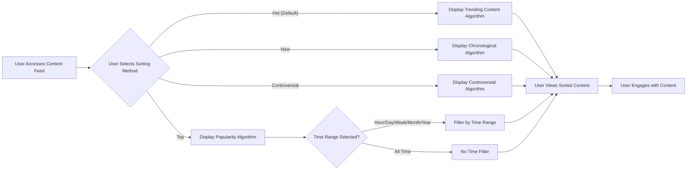
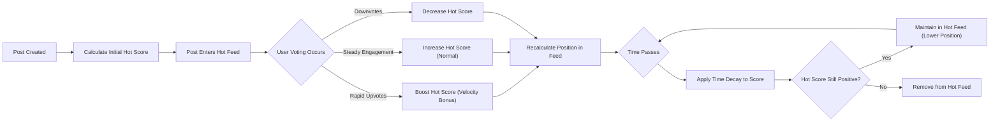
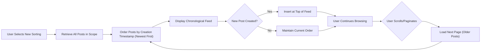
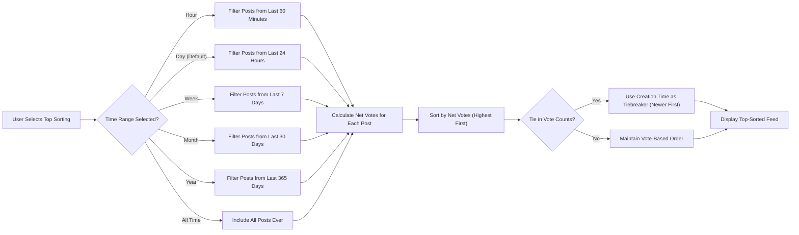
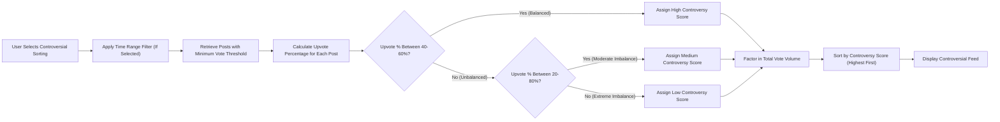

# Content Sorting Algorithms

## Overview

Content sorting algorithms are the foundation of content discovery on the Reddit-like community platform. These algorithms determine what users see, when they see it, and how content bubbles up from new submissions to platform-wide visibility. The sorting mechanisms directly impact user engagement, content creator satisfaction, and the overall health of community discussions.

This document defines the business requirements for four core sorting algorithms: **Hot** (trending content), **New** (chronological), **Top** (most popular), and **Controversial** (divisive discussions). Each algorithm serves distinct user needs and discovery patterns, ensuring users can find content that matches their current browsing intent.

### Business Context for Sorting

Effective content sorting is critical to platform success because:

- **User Retention**: Users stay engaged when they can easily find interesting, relevant content
- **Content Creator Motivation**: Good content gets visibility, encouraging quality submissions
- **Community Health**: Diverse sorting options prevent stagnation and echo chambers
- **Time Efficiency**: Users discover valuable content quickly without endless scrolling
- **Engagement Patterns**: Different sorting methods serve different user behaviors (browsing vs. deep-diving)

### Sorting Algorithm Portfolio

The platform provides four distinct sorting algorithms, each optimized for specific discovery scenarios:

1. **Hot**: Surfaces trending content that's gaining traction right now (default for most users)
2. **New**: Shows latest submissions chronologically (for community regulars and early adopters)
3. **Top**: Displays highest-voted content over time periods (for finding best-of-all-time content)
4. **Controversial**: Highlights polarizing content with mixed voting (for debate-focused users)

### Content Discovery User Scenarios

#### Scenario 1: Casual Daily Browsing
**User Journey**: A member logs in during lunch break to see what's interesting today

- User opens their home feed
- Default "Hot" sorting shows trending posts from subscribed communities
- User scrolls through a mix of rising posts and established popular content
- User finds 3-5 interesting posts within 2 minutes of browsing
- User engages by voting and commenting on compelling content

**Business Requirement**: Hot sorting must surface fresh, engaging content that balances recency with popularity to keep casual users engaged.

#### Scenario 2: Community Regular Checking for New Content
**User Journey**: An active community member wants to see everything new since their last visit

- User navigates to their favorite community
- User switches sorting to "New"
- System displays all posts created since user's last visit, newest first
- User reviews new submissions, voting to help surface quality content
- User comments on posts that interest them, often being first to engage

**Business Requirement**: New sorting must provide reliable chronological ordering so active members can efficiently process new submissions.

#### Scenario 3: Discovering Community's Best Content
**User Journey**: A new user discovers a community and wants to see its best content

- User finds a community through search or recommendation
- User selects "Top" sorting with "All Time" filter
- System displays the highest-voted posts in community history
- User browses top 20-30 posts to understand community culture and quality
- User decides to subscribe based on content quality

**Business Requirement**: Top sorting with time filters must accurately represent a community's best content over various time periods.

#### Scenario 4: Finding Active Debates
**User Journey**: A user interested in controversial topics seeks divisive discussions

- User visits a news or politics community
- User selects "Controversial" sorting
- System shows posts with high engagement but mixed voting patterns
- User finds active debates with diverse viewpoints
- User participates in nuanced discussions with multiple perspectives

**Business Requirement**: Controversial sorting must identify genuinely polarizing content, not just unpopular posts.

## Hot Algorithm Requirements

The "Hot" sorting algorithm surfaces content that is currently trending and gaining momentum. It balances recency with engagement velocity to show users what's exciting right now in their communities.

### Hot Sorting Business Purpose

Hot sorting is the default discovery mechanism because it:
- Gives newer posts opportunity to rise if they're gaining traction
- Rewards rapid early engagement, not just total votes
- Prevents old popular posts from dominating forever
- Creates dynamic, ever-changing feed that encourages frequent visits
- Surfaces breaking news and timely discussions effectively

### Hot Algorithm Functional Requirements

**HA-001: Hot Score Calculation**
THE system SHALL calculate hot scores for all posts based on vote score, post age, and engagement velocity.

**HA-002: Vote Score Factor**
WHEN calculating hot score, THE system SHALL use net votes (upvotes minus downvotes) as the primary popularity factor.

**HA-003: Time Decay Factor**
WHEN calculating hot score, THE system SHALL apply time decay so older posts gradually decrease in hot score even with high vote counts.

**HA-004: Engagement Velocity Boost**
WHEN a post receives rapid votes within first hours, THE system SHALL boost hot score to surface fast-rising content.

**HA-005: Hot Ranking Order**
WHEN displaying posts with hot sorting, THE system SHALL order posts from highest hot score to lowest hot score.

**HA-006: Hot Score Recalculation**
THE system SHALL recalculate hot scores periodically to ensure feed freshness and accurate trending status.

**HA-007: Negative Score Handling**
WHEN a post has net negative votes, THE system SHALL assign very low hot score to suppress poor quality content.

**HA-008: New Post Initial Visibility**
WHEN a post is newly created, THE system SHALL assign initial hot score that gives it brief visibility opportunity before time decay applies.

**HA-009: Vote Momentum Detection**
WHEN a post receives votes at accelerating rate, THE system SHALL increase hot score faster than linear vote accumulation would suggest.

**HA-010: Community Context Hot Scoring**
WHEN displaying hot posts in a specific community, THE system SHALL calculate hot scores relative to that community's typical engagement levels.

### Hot Sorting Business Rules

- **Freshness Priority**: Posts created within the last 6-12 hours have advantage over older posts with similar vote counts
- **Early Engagement Reward**: Posts gaining 10+ votes in first hour rank higher than posts with same votes over 6 hours
- **Time Decay Curve**: Hot score decreases exponentially with post age, not linearly
- **Threshold for Visibility**: Posts with net negative votes typically don't appear in hot feed unless community is very small
- **Recalculation Frequency**: Hot scores should update frequently enough that feed changes noticeably every 15-30 minutes
- **Zero-Engagement Handling**: Posts with zero votes decrease in hot ranking but don't disappear immediately to allow discovery

### Hot Sorting User Experience Requirements

**HA-UX-001: Dynamic Feed Updates**
WHEN a user refreshes their hot-sorted feed, THE system SHALL show updated rankings reflecting recent voting activity.

**HA-UX-002: Feed Variety**
THE hot algorithm SHALL ensure diverse content appears in feed, preventing single posts from dominating for extended periods.

**HA-UX-003: Predictable Time Window**
THE hot sorting SHALL surface content primarily from the last 24 hours, with older content appearing only if exceptionally popular.

**HA-UX-004: Performance Expectation**
WHEN a user loads hot-sorted feed, THE system SHALL display results within 2 seconds under normal load conditions.

## New Sorting Requirements

The "New" sorting algorithm displays posts in reverse chronological order, showing the most recently created content first. This sorting method serves users who want to see everything submitted to a community and help curate content through early voting.

### New Sorting Business Purpose

New sorting is essential because it:
- Allows community regulars to see all new submissions
- Enables early adopters to discover content before it trends
- Gives every post equal initial visibility regardless of early vote luck
- Empowers users to participate in content curation through early voting
- Supports time-sensitive content discovery (breaking news, event discussions)

### New Sorting Functional Requirements

**NS-001: Chronological Ordering**
WHEN displaying posts with new sorting, THE system SHALL order posts by creation timestamp from newest to oldest.

**NS-002: Timestamp Precision**
THE system SHALL order posts with precision to the second to ensure accurate chronological sequence.

**NS-003: No Vote Consideration**
WHEN sorting by new, THE system SHALL ignore vote counts, karma, and engagement metrics entirely.

**NS-004: Deleted Post Handling**
WHEN a post is deleted, THE system SHALL remove it from new sorting results immediately.

**NS-005: All Content Visibility**
THE new sorting SHALL display all posts regardless of vote score, including posts with negative net votes.

**NS-006: Pagination Consistency**
WHEN a user navigates through multiple pages of new posts, THE system SHALL maintain consistent chronological ordering without duplicates or gaps.

**NS-007: Real-Time Updates**
WHEN new posts are created, THE system SHALL include them at the top of new sorting feed immediately without requiring user refresh.

**NS-008: Time Zone Neutrality**
THE system SHALL use UTC timestamps for new sorting to ensure consistent ordering across all user time zones.

### New Sorting Business Rules

- **Strict Chronology**: Only factor is creation time—no other variables influence position
- **No Filtering**: All posts appear regardless of quality, votes, or user preferences (except user-blocked content)
- **Immediate Visibility**: New posts appear at top of feed within seconds of creation
- **No Time Decay**: Posts don't lose position over time except when newer posts appear above them
- **Equal Opportunity**: Every post gets same initial visibility in new feed regardless of author karma or community status

### New Sorting User Experience Requirements

**NS-UX-001: Clear Recency Indicators**
WHEN displaying new-sorted posts, THE system SHALL show clear timestamps indicating how recently each post was created.

**NS-UX-002: Performance Expectation**
WHEN a user loads new-sorted feed, THE system SHALL display results within 1 second under normal load conditions.

**NS-UX-003: Update Notification**
WHEN new posts are created while user is viewing new feed, THE system SHALL optionally notify user that newer content is available.

**NS-UX-004: Browsing History**
THE system SHALL help users track which posts they've already seen in new feed during current session to avoid re-reading.

## Top Sorting Requirements

The "Top" sorting algorithm displays posts with the highest net vote scores, optionally filtered by time period. This sorting method helps users discover the most popular and highest-quality content within specific time ranges.

### Top Sorting Business Purpose

Top sorting serves critical discovery needs:
- Showcases community's best content to new visitors
- Allows users to find proven high-quality posts from any time period
- Creates "best of" collections for various time ranges (day, week, month, year, all-time)
- Provides archive browsing for finding classic posts
- Rewards consistently excellent content creation over time

### Top Sorting Functional Requirements

**TS-001: Vote Score Ranking**
WHEN displaying posts with top sorting, THE system SHALL order posts by net vote score (upvotes minus downvotes) from highest to lowest.

**TS-002: Time Range Filtering**
THE system SHALL support filtering top posts by time ranges: Hour, Day, Week, Month, Year, and All Time.

**TS-003: Time Range Application**
WHEN a time range is selected, THE system SHALL only include posts created within that time period in top sorting results.

**TS-004: Absolute Vote Counting**
WHEN calculating top ranking, THE system SHALL use absolute net votes without time decay or algorithmic adjustments.

**TS-005: Tie Breaking**
WHEN multiple posts have identical net vote scores, THE system SHALL order them by creation time (newer first) as secondary sort.

**TS-006: Default Time Range**
WHEN user selects top sorting without specifying time range, THE system SHALL default to "Day" time range.

**TS-007: Zero Vote Handling**
WHEN displaying top-sorted posts, THE system SHALL include posts with zero net votes at bottom of results if no higher-voted posts exist.

**TS-008: Negative Vote Inclusion**
THE top sorting SHALL include posts with negative net votes if they rank within requested results after all positive-scored posts.

**TS-009: Time Range Boundary**
WHEN applying time range filter, THE system SHALL use post creation timestamp to determine inclusion, not last edit time.

**TS-010: Rolling Time Windows**
WHEN calculating time ranges (hour, day, week, etc.), THE system SHALL use rolling windows from current time, not calendar boundaries.

### Top Sorting Time Range Specifications

#### Hour Range
**TS-HOUR-001: Hour Window Definition**
WHEN "Hour" time range is selected, THE system SHALL display top posts created within the last 60 minutes.

**TS-HOUR-002: Hour Use Case**
THE hour range SHALL serve users seeking most popular very recent content, such as breaking news or live event discussions.

#### Day Range
**TS-DAY-001: Day Window Definition**
WHEN "Day" time range is selected, THE system SHALL display top posts created within the last 24 hours.

**TS-DAY-002: Day Default Behavior**
THE day range SHALL be default time filter for top sorting to show best recent content without overwhelming with all-time classics.

#### Week Range
**TS-WEEK-001: Week Window Definition**
WHEN "Week" time range is selected, THE system SHALL display top posts created within the last 7 days.

**TS-WEEK-002: Week Use Case**
THE week range SHALL help users catch up on best content if they haven't visited the platform in several days.

#### Month Range
**TS-MONTH-001: Month Window Definition**
WHEN "Month" time range is selected, THE system SHALL display top posts created within the last 30 days.

**TS-MONTH-002: Month Use Case**
THE month range SHALL surface monthly highlights and best content for occasional users.

#### Year Range
**TS-YEAR-001: Year Window Definition**
WHEN "Year" time range is selected, THE system SHALL display top posts created within the last 365 days.

**TS-YEAR-002: Year Use Case**
THE year range SHALL enable annual "best of" compilations and year-in-review browsing.

#### All Time Range
**TS-ALL-001: All Time Definition**
WHEN "All Time" time range is selected, THE system SHALL display top posts from entire platform or community history.

**TS-ALL-002: All Time Use Case**
THE all-time range SHALL showcase absolute best content ever posted, useful for new community members understanding community culture.

### Top Sorting Business Rules

- **Pure Popularity**: Only net votes determine ranking—no recency bias or algorithmic adjustments
- **Time Range Flexibility**: Users control time scope to match their discovery intent
- **Historical Stability**: Top posts for specific time ranges remain consistent over time (today's "Top Week" posts don't change tomorrow)
- **Vote Count Transparency**: Users should see vote counts to understand why posts rank as they do
- **Fair Comparison**: All posts within time range compete equally regardless of when within that range they were posted

### Top Sorting User Experience Requirements

**TS-UX-001: Time Range Selection Interface**
THE system SHALL provide clear, easily accessible controls for users to select time range when viewing top-sorted content.

**TS-UX-002: Current Time Range Display**
WHEN viewing top-sorted content, THE system SHALL clearly indicate which time range filter is currently active.

**TS-UX-003: Performance Expectation**
WHEN a user loads top-sorted feed with time filter, THE system SHALL display results within 2 seconds under normal load conditions.

**TS-UX-004: Empty Results Handling**
WHEN no posts exist within selected time range, THE system SHALL display clear message indicating no content available for that period.

**TS-UX-005: Vote Count Visibility**
WHEN displaying top-sorted posts, THE system SHALL prominently show net vote counts so users understand ranking.

## Controversial Sorting Requirements

The "Controversial" sorting algorithm identifies and surfaces posts that generate polarized reactions—content with high engagement but relatively balanced upvotes and downvotes. This sorting method helps users find active debates and divisive topics.

### Controversial Sorting Business Purpose

Controversial sorting serves unique discovery needs:
- Surfaces genuinely polarizing discussions where communities are divided
- Enables users interested in debate to find active controversial topics
- Highlights posts that generate strong opposing viewpoints
- Prevents echo chambers by showing content not uniformly up or downvoted
- Supports users seeking nuanced discussions with multiple perspectives

### Controversial Sorting Functional Requirements

**CS-001: Controversy Score Calculation**
THE system SHALL calculate controversy scores based on total vote volume and balance between upvotes and downvotes.

**CS-002: Vote Balance Factor**
WHEN calculating controversy score, THE system SHALL assign highest scores to posts with near-equal upvotes and downvotes.

**CS-003: Vote Volume Requirement**
WHEN calculating controversy score, THE system SHALL require minimum total vote count to prevent low-engagement posts from appearing controversial.

**CS-004: Controversy Ranking Order**
WHEN displaying posts with controversial sorting, THE system SHALL order posts by controversy score from highest to lowest.

**CS-005: Consensus Content Exclusion**
WHEN a post has overwhelmingly one-sided voting (95%+ upvotes or downvotes), THE system SHALL assign low controversy score regardless of total votes.

**CS-006: Minimum Engagement Threshold**
THE system SHALL set minimum threshold of total votes (upvotes plus downvotes) before post can be considered controversial.

**CS-007: Time Range Support**
THE controversial sorting SHALL support same time range filters as top sorting (Hour, Day, Week, Month, Year, All Time).

**CS-008: Controversy Score Recalculation**
THE system SHALL recalculate controversy scores as new votes are cast to reflect current voting patterns.

**CS-009: Zero Vote Handling**
WHEN a post has zero total votes, THE system SHALL exclude it from controversial sorting results.

**CS-010: Controversy Tie Breaking**
WHEN multiple posts have identical controversy scores, THE system SHALL order by total vote count (higher first) as secondary sort.

### Controversial Sorting Business Rules

- **Balance Over Volume**: A post with 100 upvotes and 95 downvotes is more controversial than 1000 upvotes and 50 downvotes
- **Minimum Engagement Gate**: Posts need at least 10 total votes to appear controversial (prevents noise from low-traffic posts)
- **Optimal Controversy Ratio**: Posts closest to 50/50 upvote/downvote split receive highest controversy scores
- **Active Debate Indicator**: High controversy score suggests active, divided discussion worth exploring
- **Not Just Unpopular**: Simply downvoted posts (5 upvotes, 50 downvotes) should not rank as highly controversial

### Controversial Sorting Algorithm Specifications

**CS-ALG-001: Controversy Calculation Formula**
THE controversial scoring algorithm SHALL heavily weight posts where upvote percentage is close to 50% while also considering total vote volume.

**CS-ALG-002: Optimal Controversy Range**
WHEN upvote percentage falls between 40% and 60%, THE system SHALL assign highest controversy multiplier.

**CS-ALG-003: Controversy Decline Outside Balance**
WHEN upvote percentage falls below 40% or above 60%, THE system SHALL progressively reduce controversy score.

**CS-ALG-004: Volume Amplification**
WHEN total vote count increases while maintaining balance, THE system SHALL increase controversy score proportionally.

**CS-ALG-005: Extreme Voting Suppression**
WHEN upvote percentage falls below 20% or above 80%, THE system SHALL assign minimal controversy score regardless of volume.

### Controversial Sorting User Experience Requirements

**CS-UX-001: Controversy Indicators**
WHEN displaying controversial posts, THE system SHALL provide visual indicators showing vote distribution to clarify why posts are controversial.

**CS-UX-002: Time Range Selection**
THE controversial sorting SHALL allow users to select time ranges to find controversial content from specific periods.

**CS-UX-003: Default Time Range**
WHEN user selects controversial sorting without time range, THE system SHALL default to "Day" time range.

**CS-UX-004: Performance Expectation**
WHEN a user loads controversial-sorted feed, THE system SHALL display results within 2 seconds under normal load conditions.

**CS-UX-005: Empty Results Communication**
WHEN no controversial posts exist in selected time range, THE system SHALL display message indicating no polarizing discussions currently active.

**CS-UX-006: Controversy Explanation**
THE system SHALL provide tooltip or help text explaining what "controversial" means to set user expectations.

### Controversial Sorting Use Cases

#### Political or News Communities
- Posts about polarizing political topics naturally generate divided voting
- Users seeking balanced debate can find discussions with multiple viewpoints
- Controversial sorting surfaces active policy discussions rather than one-sided articles

#### Product or Technology Communities
- Feature requests that divide community opinion appear in controversial feed
- Users can find nuanced discussions about trade-offs and alternatives
- Controversial sorting helps identify contentious design decisions

#### Entertainment Communities
- Subjective opinions about media that divide fans and critics
- Users interested in debate about artistic merit find active discussions
- Controversial sorting surfaces thought-provoking analyses not universally accepted

## Sorting Context and Application

Content sorting applies across multiple platform contexts, each with specific requirements and default behaviors.

### Home Feed Sorting

**SA-HOME-001: Home Feed Default**
WHEN a user views their personalized home feed, THE system SHALL default to hot sorting to show trending content from subscribed communities.

**SA-HOME-002: Home Feed Sorting Options**
WHEN viewing home feed, THE user SHALL be able to switch between hot, new, top, and controversial sorting.

**SA-HOME-003: Home Feed Sorting Persistence**
WHEN a user changes sorting preference on home feed, THE system SHALL remember preference for future sessions.

**SA-HOME-004: Multi-Community Aggregation**
WHEN displaying home feed with any sorting method, THE system SHALL aggregate posts from all subscribed communities and sort across all sources.

### Community-Specific Sorting

**SA-COMM-001: Community Feed Default**
WHEN a user views a specific community feed, THE system SHALL default to hot sorting for that community.

**SA-COMM-002: Community Sorting Options**
WHEN viewing community feed, THE user SHALL be able to switch between hot, new, top, and controversial sorting.

**SA-COMM-003: Community Sorting Scope**
WHEN sorting within a community, THE system SHALL only include posts from that specific community in results.

**SA-COMM-004: Community Sorting Independence**
WHEN a user changes sorting in a specific community, THE system SHALL not affect sorting preferences in other communities or home feed.

### User Profile Post Sorting

**SA-PROFILE-001: Profile Default Sorting**
WHEN viewing a user's post history on their profile, THE system SHALL default to new sorting to show most recent posts first.

**SA-PROFILE-002: Profile Sorting Options**
WHEN viewing user profile posts, THE user SHALL be able to switch to top sorting to see user's most popular posts.

**SA-PROFILE-003: Profile Sorting Scope**
WHEN sorting user profile posts, THE system SHALL only include posts created by that specific user.

### Search Results Sorting

**SA-SEARCH-001: Search Default Sorting**
WHEN displaying search results, THE system SHALL default to sorting by relevance to search query.

**SA-SEARCH-002: Search Sorting Override**
WHEN viewing search results, THE user SHALL be able to override relevance sorting with hot, new, or top sorting.

**SA-SEARCH-003: Search Sorting Scope**
WHEN applying sorting to search results, THE system SHALL only sort posts matching search criteria.

### Sorting Preference Management

**SA-PREF-001: User Default Sorting**
THE system SHALL allow authenticated users to set their preferred default sorting method for home feed.

**SA-PREF-002: Guest User Defaults**
WHEN a guest (unauthenticated) user views content, THE system SHALL default to hot sorting.

**SA-PREF-003: Per-Context Preferences**
THE system SHALL support independent sorting preferences for home feed, community feeds, and profile views.

**SA-PREF-004: Preference Persistence**
WHEN a user sets sorting preference, THE system SHALL persist preference across sessions and devices.

## Performance and Scalability Requirements

### Sorting Performance Expectations

**PERF-001: Feed Load Time**
WHEN a user loads any sorted feed, THE system SHALL display initial results within 2 seconds under normal load conditions.

**PERF-002: Sort Switch Response**
WHEN a user switches sorting method on current feed, THE system SHALL display new sorted results within 1 second.

**PERF-003: Pagination Performance**
WHEN a user loads additional pages of sorted content, THE system SHALL maintain consistent load times regardless of page depth.

**PERF-004: High Traffic Resilience**
WHEN platform experiences high concurrent user load, THE system SHALL maintain sorting performance within acceptable degradation limits.

### Score Calculation Performance

**PERF-CALC-001: Hot Score Update Frequency**
THE system SHALL recalculate hot scores for active posts at least every 5 minutes to ensure feed freshness.

**PERF-CALC-002: Controversy Score Updates**
THE system SHALL recalculate controversy scores when new votes are cast on potentially controversial posts.

**PERF-CALC-003: Batch Processing**
THE system SHALL use batch processing for score calculations to optimize database performance.

**PERF-CALC-004: Incremental Updates**
WHEN posts receive new votes, THE system SHALL update scores incrementally rather than full recalculation when possible.

### Caching and Optimization

**PERF-CACHE-001: Popular Feed Caching**
THE system SHALL cache frequently accessed sorted feeds (home feed hot sorting, popular community feeds) to reduce database load.

**PERF-CACHE-002: Cache Invalidation**
WHEN sorting scores change significantly, THE system SHALL invalidate relevant cached feeds to ensure data freshness.

**PERF-CACHE-003: User-Specific Caching**
THE system SHALL cache personalized sorted feeds based on user's subscriptions and preferences.

**PERF-CACHE-004: Time Range Caching**
THE system SHALL cache top-sorted results for static time ranges (all-time, year) more aggressively than rolling time windows.

## Error Handling and Edge Cases

### Empty Results Handling

**ERR-EMPTY-001: No Content in Time Range**
WHEN no posts exist within selected time range for top or controversial sorting, THE system SHALL display friendly message explaining no content available for that period.

**ERR-EMPTY-002: No Controversial Content**
WHEN no posts meet controversy threshold in selected time range, THE system SHALL display message indicating no polarizing discussions currently active.

**ERR-EMPTY-003: New Community Empty State**
WHEN viewing new community with no posts, THE system SHALL display message encouraging users to create first post.

### Data Integrity

**ERR-DATA-001: Deleted Post Removal**
WHEN a post is deleted while user is viewing sorted feed, THE system SHALL gracefully remove it from view on next interaction.

**ERR-DATA-002: Vote Manipulation Detection**
WHEN voting patterns suggest manipulation, THE system SHALL exclude affected posts from sorted feeds until review.

**ERR-DATA-003: Timestamp Corruption**
WHEN post has invalid or corrupted timestamp, THE system SHALL exclude it from new sorting and assign default timestamp for other sorting methods.

### User Experience Edge Cases

**ERR-UX-001: Sorting Performance Degradation**
WHEN sorting cannot complete within performance targets, THE system SHALL display loading indicator and complete request without timeout.

**ERR-UX-002: Invalid Time Range**
WHEN user selects invalid or unsupported time range, THE system SHALL default to "Day" time range and notify user.

**ERR-UX-003: Preference Load Failure**
WHEN user's sorting preferences cannot be loaded, THE system SHALL default to hot sorting without blocking page load.

## Sorting Algorithm Summary and Comparison

| Sorting Method | Primary Factor | Time Consideration | Best For | Default Context |
|---------------|---------------|-------------------|----------|--------------------|
| **Hot** | Vote velocity + recency | Strong decay over time | Discovering trending content | Home feed, community feeds |
| **New** | Creation timestamp only | Pure chronological | Seeing all new submissions | Power users, community regulars |
| **Top** | Net vote count | Optional time range filter | Finding best content | Archive browsing, best-of lists |
| **Controversial** | Vote balance + volume | Optional time range filter | Finding polarizing debates | Debate seekers, diverse perspectives |

### Sorting Method Selection Guidance

**When to Use Hot Sorting:**
- Daily browsing for trending content
- Discovering what's currently popular
- Balanced mix of fresh and proven content
- General engagement and entertainment

**When to Use New Sorting:**
- Checking community for latest submissions
- Being first to engage with new content
- Helping curate content through early voting
- Following time-sensitive discussions

**When to Use Top Sorting:**
- Finding best content from specific time period
- Understanding community culture and quality
- Discovering classic or historically significant posts
- Creating best-of compilations

**When to Use Controversial Sorting:**
- Finding active debates and discussions
- Exploring topics with divided opinions
- Seeking multiple perspectives on issues
- Engaging with nuanced, complex topics

## Future Sorting Enhancements

### Potential Future Sorting Features

While not part of current requirements, the following sorting enhancements may be considered for future releases:

**Rising Algorithm**: Identify posts gaining momentum faster than typical hot algorithm patterns
**Best Algorithm**: Combine vote score with engagement quality metrics (comment depth, discussion quality)
**Community-Specific Hot Algorithms**: Tune hot algorithm parameters per community based on size and activity
**Personalized Sorting**: Machine learning-based sorting customized to individual user preferences
**Multi-Factor Sorting**: Allow users to combine sorting criteria (e.g., top + controversial)

These future enhancements are documented for planning purposes but are not required for initial platform launch.

---

*This document defines business requirements for content sorting and discovery mechanisms. All technical implementation decisions—including database query optimization, caching strategies, score calculation algorithms, and infrastructure architecture—are at the discretion of the development team.*
