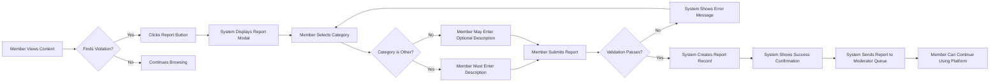
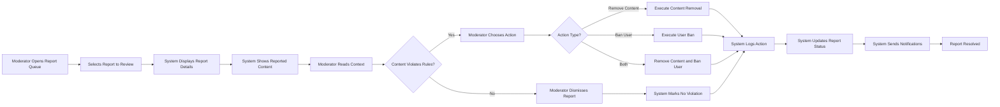

# Content Moderation and Reporting System

## 1. Document Overview

This document specifies the business requirements for the content moderation and reporting system within the Reddit-like community platform (redditCommunity). The moderation system empowers community members to identify and report inappropriate content while providing moderators with the tools necessary to maintain community standards and enforce rules.

The reporting system serves as the primary mechanism for community self-regulation, enabling members to flag posts and comments that violate community guidelines. Moderators can then review these reports and take appropriate action, including content removal and user bans at the community level.

This system is essential for maintaining healthy community environments, preventing abuse, protecting users from harmful content, and ensuring the platform remains a safe and welcoming space for constructive discussions.

### System Scope

The content moderation and reporting system encompasses:
- Member-initiated content reporting for posts and comments
- Categorized report types for efficient classification
- Moderator-only report review queues organized by community
- Moderation actions including content removal and community-level user bans
- Audit trails for all moderation decisions
- Notification mechanisms for affected users
- Appeal processes for contested moderation actions

### Key Principles

- **Community-Level Moderation**: Moderators have authority only within communities they manage
- **Transparency**: All moderation actions are logged and can be reviewed
- **User Protection**: Content creators and reporters are notified of relevant actions
- **Proportional Response**: Multiple report categories enable appropriate action levels
- **Accountability**: Audit trails ensure moderator actions can be reviewed and contested

## 2. Content Reporting System

### 2.1 Reporting Eligibility

**Actor Permissions**:
- THE system SHALL allow authenticated members to report any post or comment across all public communities
- THE system SHALL prevent guest users from submitting reports (authentication required)
- THE system SHALL allow members to report content they created themselves (for flagging their own mistakes)
- THE system SHALL allow members to report content multiple times if they select different report categories

### 2.2 Reportable Content Types

THE system SHALL support reporting for the following content types:
- Text posts within communities
- Link posts within communities  
- Image posts within communities
- Comments on posts (at any nesting level)
- Nested replies to comments

### 2.3 Report Submission Constraints

**Rate Limiting**:
- WHEN a member submits more than 20 reports within a 1-hour period, THE system SHALL temporarily prevent additional report submissions and display a rate limit message
- THE system SHALL reset the report submission counter after 1 hour from the first report in the current period
- THE system SHALL allow continued browsing and other platform activities during rate limiting

**Duplicate Prevention**:
- WHEN a member attempts to report the same content with the same category they previously used, THE system SHALL prevent the duplicate submission and display a message indicating they already reported this content for that reason
- THE system SHALL allow the same member to report the same content with a different category (as the violation type may differ)

### 2.4 Report Metadata Collection

WHEN a member submits a content report, THE system SHALL capture the following information:
- Report ID (unique identifier for tracking)
- Reported content ID (post or comment identifier)
- Reported content type (post or comment designation)
- Reporter user ID (member submitting the report)
- Report category (selected from predefined categories)
- Optional report description (free-text explanation, maximum 1000 characters)
- Community ID (where the reported content exists)
- Report timestamp (exact date and time of submission)
- Content creator user ID (author of the reported content)
- Report status (initially set to "pending")

## 3. Report Categories and Classification

### 3.1 Predefined Report Categories

THE system SHALL provide the following standardized report categories for member selection:

**Primary Categories**:

1. **Spam**: Unsolicited promotional content, repetitive posts, or commercial advertising not relevant to the community
2. **Harassment or Bullying**: Content targeting individuals with insults, threats, or persistent negative attention
3. **Hate Speech**: Content promoting hatred or violence against groups based on identity characteristics (race, religion, gender, sexuality, disability, nationality)
4. **Misinformation**: Deliberately false or misleading information presented as fact
5. **Sexual Content**: Explicit sexual material or unwanted sexual advances
6. **Violence or Gore**: Graphic violent content, threats of violence, or disturbing imagery
7. **Personal Information**: Sharing of private personal information without consent (doxxing)
8. **Copyright Violation**: Content that infringes on intellectual property rights
9. **Self-Harm or Suicide**: Content promoting or glorifying self-harm or suicide
10. **Other**: Violations not covered by specific categories (requires description)

### 3.2 Category Selection Requirements

- WHEN a member initiates a report, THE system SHALL display all available report categories for selection
- THE system SHALL require the member to select exactly one category before submission
- WHERE the member selects "Other" as the category, THE system SHALL require a text description (minimum 20 characters) explaining the violation
- THE system SHALL allow the member to provide an optional description for any category to add context

### 3.3 Category Severity Levels

THE system SHALL classify report categories by severity for prioritization purposes:

**Critical Severity** (highest priority for review):
- Hate Speech
- Violence or Gore
- Personal Information
- Self-Harm or Suicide

**High Severity**:
- Harassment or Bullying
- Sexual Content

**Medium Severity**:
- Misinformation
- Copyright Violation

**Low Severity**:
- Spam
- Other

## 4. Report Submission Process

### 4.1 User Workflow for Reporting

### 4.2 Report Submission Requirements

**Validation Rules**:
- WHEN a member submits a report, THE system SHALL validate that a report category has been selected
- WHERE the selected category is "Other", THE system SHALL validate that the description contains at least 20 characters
- IF the description exceeds 1000 characters, THEN THE system SHALL display an error message and prevent submission
- WHEN validation fails, THE system SHALL display specific error messages indicating what needs correction

**Confirmation and Feedback**:
- WHEN a report is successfully submitted, THE system SHALL display a confirmation message thanking the member for helping maintain community standards
- THE system SHALL inform the member that moderators will review the report
- THE system SHALL provide an estimated review timeframe (e.g., "typically reviewed within 24 hours")
- THE system SHALL allow the member to immediately continue browsing without interruption

### 4.3 Anonymous Reporting Considerations

- THE system SHALL store the reporter's user ID internally for audit purposes and to prevent abuse
- THE system SHALL NOT display the reporter's identity to the content creator or other members
- THE system SHALL display the reporter's identity to moderators reviewing the report (for credibility assessment and abuse detection)
- WHEN a moderator views a report, THE system SHALL show the reporter's username and profile link

## 5. Report Queue and Management

### 5.1 Report Queue Organization

**Community-Specific Queues**:
- THE system SHALL organize reports into separate queues for each community
- THE system SHALL only display reports to moderators for communities they moderate
- WHEN a moderator accesses the report queue, THE system SHALL show only reports from their moderated communities

**Queue Filtering and Sorting**:
- THE system SHALL provide filtering options by report status: "pending", "reviewed", "resolved", "dismissed"
- THE system SHALL provide filtering options by report category
- THE system SHALL provide filtering options by severity level
- THE system SHALL sort reports by default with critical severity first, then by submission timestamp (oldest first)
- THE system SHALL allow moderators to change sorting to newest first, most reported content, or by category

### 5.2 Report Status Lifecycle

THE system SHALL track reports through the following status progression:

1. **Pending**: Report has been submitted and awaits moderator review (initial status)
2. **Under Review**: A moderator has opened the report and is actively reviewing it
3. **Resolved - Action Taken**: Moderator took action (removed content or banned user)
4. **Resolved - No Violation**: Moderator determined content does not violate rules
5. **Dismissed**: Report was invalid, duplicate, or spam

**Status Transition Rules**:
- WHEN a report is created, THE system SHALL set status to "pending"
- WHEN a moderator opens a report for review, THE system SHALL automatically update status to "under review"
- WHEN a moderator takes a moderation action, THE system SHALL update status to "resolved - action taken"
- WHEN a moderator dismisses a report without action, THE system SHALL update status to "resolved - no violation" or "dismissed" based on moderator selection

### 5.3 Multiple Reports on Same Content

**Report Aggregation**:
- WHEN multiple members report the same post or comment, THE system SHALL aggregate all reports into a single queue entry
- THE system SHALL display the total count of reports for the content
- THE system SHALL show all report categories selected by different reporters
- THE system SHALL display all reporter descriptions in the aggregated view
- THE system SHALL highlight the most severe category selected among all reports

**Priority Escalation**:
- WHEN the same content receives 5 or more reports, THE system SHALL automatically escalate the priority to critical regardless of original severity
- WHEN the same content receives 10 or more reports, THE system SHALL send an urgent notification to all community moderators
- THE system SHALL visually highlight highly-reported content in the moderator queue with a distinctive badge or color

### 5.4 Report Queue Dashboard

WHEN a moderator accesses the report queue dashboard, THE system SHALL display:
- Total count of pending reports requiring review
- Count of reports currently under review by other moderators
- Count of reports resolved in the last 7 days
- Average time to resolution for reports in the last 30 days
- List of most frequently reported content types and categories
- Quick access filters for critical severity and highly-reported content

## 6. Moderator Review Workflow

### 6.1 Report Review Process

### 6.2 Report Details Display

WHEN a moderator opens a report for review, THE system SHALL display:
- Complete reported content (full post text, comment text, or image)
- Content metadata (post title, author, creation timestamp, vote score)
- All report information (category, descriptions, reporter count, submission time)
- WHERE multiple reports exist for the same content, THE system SHALL show all categories and descriptions
- Content context (for comments: parent post and parent comments; for posts: community name and rules)
- Reporter usernames (for credibility assessment)
- Content creator's history within the community (previous violations, contribution karma, account age)
- Community rules for reference during decision-making

### 6.3 Moderator Decision Options

WHEN reviewing a report, THE system SHALL provide moderators with the following action options:

**Option 1: Remove Content**
- Removes the reported post or comment from public view
- Content becomes invisible to all users except moderators
- Author can still see their removed content with a "removed by moderator" label

**Option 2: Ban User from Community**
- Prevents the content creator from posting or commenting in the community
- Can be temporary (specify duration in hours, days, or weeks) or permanent
- User can still view community content but cannot participate

**Option 3: Remove Content and Ban User**
- Combines both actions in a single moderation decision
- Appropriate for severe or repeated violations

**Option 4: Dismiss Report - No Violation**
- Indicates content does not violate community rules
- Report is marked as resolved without action
- Content remains visible and accessible

**Option 5: Dismiss Report - Invalid/Spam**
- Used when reports are false, abusive, or spam
- May trigger review of reporter's history for abuse patterns

### 6.4 Moderation Decision Requirements

**Mandatory Action Justification**:
- WHEN a moderator takes any action (remove, ban, or dismiss), THE system SHALL require the moderator to provide a reason (minimum 10 characters, maximum 500 characters)
- THE system SHALL provide suggested reason templates for common violations (e.g., "Spam: Commercial advertising", "Harassment: Personal attacks")
- THE system SHALL allow moderators to customize reason text to provide specific context

**Ban Duration Specification**:
- WHERE a moderator chooses to ban a user, THE system SHALL require selection of ban duration from predefined options:
  - 1 hour (cooling-off period)
  - 24 hours (1 day)
  - 72 hours (3 days)
  - 7 days (1 week)
  - 30 days (1 month)
  - Permanent (no expiration)
- THE system SHALL require moderators to select exactly one duration option before executing the ban

**Action Confirmation**:
- WHEN a moderator submits a moderation action, THE system SHALL display a confirmation dialog showing the action type, affected user, reason, and consequences
- THE system SHALL require explicit confirmation before executing the action
- IF the action is a permanent ban, THEN THE system SHALL display an additional warning about the irreversible nature and require secondary confirmation

## 7. Moderator Actions and Tools

### 7.1 Content Removal Mechanics

**Removal Execution**:
- WHEN a moderator removes a post, THE system SHALL hide the post from all community feeds and search results
- WHEN a moderator removes a comment, THE system SHALL hide the comment text and replace it with "[removed by moderator]" placeholder
- WHERE a removed comment has nested replies, THE system SHALL preserve the comment structure but hide the removed comment's content
- THE system SHALL prevent removed content from appearing in "hot", "new", "top", or "controversial" sorting

**Removed Content Visibility**:
- THE system SHALL allow the content creator to view their own removed content with a "removed by moderator" label and removal reason
- THE system SHALL allow moderators of the community to view all removed content for audit and review purposes
- THE system SHALL prevent guest users and other members from viewing removed content
- WHEN a member attempts to access a direct link to removed content, THE system SHALL display a message indicating the content was removed for violating community rules

**Content Restoration**:
- THE system SHALL allow moderators to restore previously removed content if the removal was determined to be incorrect
- WHEN content is restored, THE system SHALL make it visible again in all feeds and search results
- THE system SHALL log all restoration actions for audit trail purposes
- THE system SHALL notify the content creator when their content is restored

### 7.2 Vote Score Handling for Removed Content

**Karma Impact**:
- WHEN content is removed, THE system SHALL NOT reverse karma points already earned by the content creator from votes received before removal
- THE system SHALL prevent new votes on removed content
- THE system SHALL display the vote score as it existed at the time of removal to moderators viewing removed content
- THE system SHALL NOT display vote scores to regular members attempting to view removed content (since content is hidden)

### 7.3 Moderator Action Scope and Limitations

**Community-Level Authority**:
- THE system SHALL restrict moderator actions to only the communities they moderate
- THE system SHALL prevent moderators from removing content or banning users in communities they do not moderate
- WHEN a moderator attempts to take action outside their moderated communities, THE system SHALL display an error message indicating insufficient permissions

**Cross-Community Considerations**:
- THE system SHALL allow the same user to be banned from multiple communities independently
- WHERE a user is banned from one community, THE system SHALL allow them to continue participating in other communities where they are not banned
- THE system SHALL track each community ban separately with independent expiration times and reasons

**Moderator Hierarchy**:
- THE system SHALL distinguish between community creators (original moderators) and appointed moderators
- THE system SHALL allow community creators to remove appointed moderators
- THE system SHALL prevent appointed moderators from removing the community creator or other moderators
- THE system SHALL allow any moderator to take moderation actions (remove content, ban users) regardless of their position in the hierarchy

## 8. User Banning System

### 8.1 Ban Creation and Configuration

**Ban Execution Requirements**:
- WHEN a moderator bans a user, THE system SHALL create a ban record with the following information:
  - Banned user ID
  - Community ID where ban applies
  - Moderator ID (who issued the ban)
  - Ban reason (text provided by moderator)
  - Ban start timestamp
  - Ban expiration timestamp (or null for permanent bans)
  - Associated report ID (if ban originated from a report)
  - Ban status ("active", "expired", "lifted")

**Immediate Restriction Application**:
- WHEN a user is banned from a community, THE system SHALL immediately prevent them from creating new posts in that community
- THE system SHALL immediately prevent banned users from creating new comments in that community
- THE system SHALL immediately prevent banned users from voting on posts or comments in that community
- THE system SHALL allow banned users to continue viewing content in the community (read-only access)

### 8.2 Ban Duration and Expiration

**Temporary Ban Handling**:
- WHERE a ban has a specified expiration timestamp, THE system SHALL automatically change ban status to "expired" when the expiration time is reached
- WHEN a temporary ban expires, THE system SHALL automatically restore all posting, commenting, and voting privileges for the user in that community
- THE system SHALL send a notification to the user when their temporary ban expires, informing them their privileges are restored

**Permanent Ban Handling**:
- WHERE a ban is designated as permanent (no expiration timestamp), THE system SHALL maintain ban status as "active" indefinitely
- THE system SHALL only lift permanent bans through explicit moderator action (manual ban removal)

### 8.3 Ban Enforcement

**Content Creation Prevention**:
- WHEN a banned user attempts to create a post in a community where they are banned, THE system SHALL prevent the submission and display a message indicating they are banned from the community
- WHEN a banned user attempts to create a comment in a community where they are banned, THE system SHALL prevent the submission with the same ban notification
- THE system SHALL display the ban reason and expiration time (if applicable) in the notification message

**Voting Prevention**:
- WHEN a banned user attempts to upvote or downvote content in a community where they are banned, THE system SHALL prevent the vote and display a notification about their ban status
- THE system SHALL remove vote buttons from the user interface for banned users viewing content in communities where they are banned

**UI Indicators**:
- WHEN a banned user views a community where they are banned, THE system SHALL display a prominent banner at the top of the page indicating their ban status, reason, and expiration (if applicable)
- THE system SHALL disable all interaction buttons (post, comment, vote) in the banned community
- THE system SHALL display the ban information in the user's account settings showing all active bans across communities

### 8.4 Ban Lifting (Early Removal)

**Moderator Ban Removal**:
- THE system SHALL allow moderators to manually lift bans before expiration
- WHEN a moderator lifts a ban early, THE system SHALL update ban status to "lifted"
- THE system SHALL require the moderator to provide a reason for lifting the ban (optional but recommended)
- THE system SHALL log the ban lift action with timestamp and moderator ID for audit purposes
- THE system SHALL send a notification to the previously banned user informing them their ban has been lifted early

## 9. Ban Appeal and Review Process

### 9.1 Appeal Submission

**Appeal Eligibility**:
- THE system SHALL allow banned users to submit one appeal per ban
- THE system SHALL prevent users from submitting multiple appeals for the same ban
- WHERE a ban has already expired, THE system SHALL not allow appeal submission (appeals only for active bans)

**Appeal Process**:
- WHEN a banned user wishes to appeal, THE system SHALL provide an "Appeal Ban" button in their account ban notifications
- WHEN a user initiates an appeal, THE system SHALL display a form requiring appeal text (minimum 50 characters, maximum 2000 characters)
- THE system SHALL require the user to explain why they believe the ban was unjustified or should be reconsidered
- WHEN an appeal is submitted, THE system SHALL create an appeal record linked to the original ban record

### 9.2 Appeal Review by Moderators

**Appeal Notification**:
- WHEN a user submits a ban appeal, THE system SHALL notify all moderators of the relevant community
- THE system SHALL add the appeal to a separate "Ban Appeals" queue in the moderator dashboard
- THE system SHALL display appeal details including original ban reason, appeal text, user history, and time elapsed since ban

**Appeal Decision Options**:
- THE system SHALL provide moderators with two options when reviewing appeals:
  - **Approve Appeal**: Lift the ban immediately and restore user privileges
  - **Deny Appeal**: Maintain the ban with no changes
- WHEN a moderator makes an appeal decision, THE system SHALL require a response message to the user (minimum 20 characters) explaining the decision
- THE system SHALL log the appeal decision with moderator ID, decision type, response text, and timestamp

**Appeal Resolution**:
- WHEN an appeal is approved, THE system SHALL immediately update the ban status to "lifted" and restore user privileges
- WHEN an appeal is denied, THE system SHALL update appeal status to "denied" and maintain the original ban
- THE system SHALL send a notification to the user with the moderator's response message
- THE system SHALL prevent further appeals for the same ban after a decision is made

### 9.3 Appeal Time Limits

**Review Timeframe**:
- THE system SHALL highlight appeals that have been pending for more than 72 hours in the moderator dashboard
- WHEN an appeal has been pending for 7 days without moderator review, THE system SHALL send a reminder notification to all community moderators
- IF an appeal remains unreviewed for 30 days, THEN THE system SHALL automatically close the appeal with status "expired - no review" and maintain the original ban

## 10. Moderation Audit Trail

### 10.1 Action Logging Requirements

**Comprehensive Logging**:
- THE system SHALL create detailed audit log entries for every moderation action performed
- WHEN a moderator takes any action, THE system SHALL log the following information:
  - Action type (content removal, user ban, ban lift, appeal decision, report dismissal)
  - Moderator user ID (who performed the action)
  - Target content ID or user ID (what was affected)
  - Community ID (where action occurred)
  - Action timestamp (exact date and time)
  - Action reason (moderator-provided justification)
  - Associated report ID (if action originated from report)
  - Previous state and new state (for status changes)

**Audit Log Retention**:
- THE system SHALL retain all moderation audit logs permanently for accountability and transparency
- THE system SHALL never delete or modify audit log entries once created
- THE system SHALL protect audit logs from unauthorized access or tampering

### 10.2 Audit Log Access

**Moderator Audit Access**:
- THE system SHALL provide moderators with access to view all moderation actions taken in their communities
- WHEN a moderator views the audit log, THE system SHALL display actions in reverse chronological order (most recent first)
- THE system SHALL provide filtering options by action type, moderator, date range, and affected user
- THE system SHALL allow moderators to view detailed information for each logged action

**Transparency Features**:
- THE system SHALL provide a public-facing moderation log showing recent moderation actions in each community (optional transparency feature)
- WHERE communities enable public moderation logs, THE system SHALL display removed posts (titles only, not full content), banned users (usernames only), and action reasons
- THE system SHALL allow community creators to enable or disable public moderation logs for their communities
- THE system SHALL protect user privacy by not displaying reporter identities in public logs

### 10.3 Audit Review and Accountability

**Moderator Action Review**:
- THE system SHALL allow community creators to review all actions taken by appointed moderators
- THE system SHALL highlight patterns such as excessive removals, frequent bans, or mass actions by individual moderators
- WHEN suspicious moderation patterns are detected (e.g., more than 50 actions in 1 hour by a single moderator), THE system SHALL flag these for community creator review

**Statistical Reporting**:
- THE system SHALL generate monthly moderation statistics for each community including:
  - Total reports received and resolved
  - Average report resolution time
  - Content removal count by category
  - User ban count (temporary vs permanent)
  - Appeal submission and approval rates
  - Actions taken per moderator

## 11. Notification System

### 11.1 Reporter Notifications

**Report Status Updates**:
- WHEN a moderator takes action on a report, THE system SHALL send a notification to the reporter thanking them for their report
- THE system SHALL inform the reporter that action was taken (without disclosing specific action details for privacy reasons)
- WHERE no violation was found, THE system SHALL send a notification indicating the report was reviewed but no action was necessary
- THE system SHALL not disclose specific moderation actions (removal, ban) to reporters to protect content creator privacy

### 11.2 Content Creator Notifications

**Content Removal Notifications**:
- WHEN a moderator removes a user's post or comment, THE system SHALL immediately send a notification to the content creator
- THE system SHALL include the removal reason provided by the moderator
- THE system SHALL include a link to the community rules
- THE system SHALL inform the user they can view their removed content in their profile but it is hidden from others

**Ban Notifications**:
- WHEN a user is banned from a community, THE system SHALL immediately send a notification with the following information:
  - Community name where ban applies
  - Ban duration (expiration timestamp or "permanent")
  - Ban reason provided by moderator
  - Appeal process instructions
  - Link to submit an appeal
- THE system SHALL send a reminder notification 24 hours before a temporary ban expires
- WHEN a ban expires or is lifted, THE system SHALL send a notification informing the user their privileges are restored

### 11.3 Moderator Notifications

**Report Queue Notifications**:
- WHEN a new report is submitted in a community, THE system SHALL send notifications to all moderators of that community
- WHERE a report reaches critical priority (5+ reports on same content), THE system SHALL send urgent notifications to all moderators
- THE system SHALL allow moderators to configure notification preferences (immediate, daily digest, or disabled)

**Appeal Notifications**:
- WHEN a banned user submits an appeal, THE system SHALL immediately notify all moderators of the relevant community
- THE system SHALL send reminder notifications for pending appeals after 72 hours

### 11.4 Notification Delivery Methods

THE system SHALL support the following notification delivery methods:
- In-platform notifications (notification bell icon with unread count)
- Email notifications (configurable per user preferences)
- Notification history accessible in user account settings

WHEN a notification is sent, THE system SHALL record delivery status and timestamp for audit purposes.

## 12. Performance and User Experience Requirements

### 12.1 Report Submission Performance

**Response Time Requirements**:
- WHEN a member submits a report, THE system SHALL display the submission confirmation within 2 seconds
- THE system SHALL process report validation and creation in the background without blocking the user
- IF report processing takes longer than 2 seconds, THEN THE system SHALL display a loading indicator and complete submission within 5 seconds maximum

### 12.2 Moderator Queue Performance

**Queue Loading Speed**:
- WHEN a moderator opens the report queue, THE system SHALL display the queue interface within 1 second
- THE system SHALL load the first page of reports (20 reports) within 2 seconds
- WHEN a moderator applies filters or sorting, THE system SHALL update the queue view within 1 second

**Pagination**:
- THE system SHALL display reports in pages of 20 items
- THE system SHALL provide "Load More" functionality or page navigation controls
- THE system SHALL preload the next page in the background for instant navigation

### 12.3 Action Execution Performance

**Immediate Feedback**:
- WHEN a moderator executes a moderation action (remove, ban, dismiss), THE system SHALL provide immediate visual feedback with a success or error message within 1 second
- THE system SHALL update the UI to reflect the new state (removed content, updated ban list) immediately after action execution
- THE system SHALL send all related notifications within 5 seconds of action execution

### 12.4 User Experience Expectations

**Intuitive Interface**:
- THE report submission interface SHALL be accessible from every post and comment with a clearly labeled "Report" button or link
- THE moderator queue SHALL provide clear visual indicators for report severity, report count, and pending status
- THE system SHALL use consistent terminology throughout the interface (e.g., always "remove" not "delete" or "hide")

**Error Handling**:
- WHEN a report submission fails due to network issues, THE system SHALL display a clear error message and offer a retry option
- WHERE a moderator lacks permissions for an action, THE system SHALL display a helpful message explaining the limitation
- IF a user is already banned when a moderator attempts to ban them, THEN THE system SHALL display the existing ban details and ask if the moderator wants to modify the ban

**Mobile Responsiveness**:
- THE system SHALL provide a mobile-friendly report submission interface with large touch targets
- THE moderator queue SHALL be usable on mobile devices with appropriate layout adjustments
- All moderation actions SHALL be accessible and functional on mobile devices

### 12.5 Accessibility Requirements

**Screen Reader Support**:
- THE system SHALL provide descriptive alt text and ARIA labels for all report and moderation interface elements
- THE system SHALL ensure keyboard navigation works for all reporting and moderation functions
- THE system SHALL announce status changes and notifications to screen reader users

**Visual Clarity**:
- THE system SHALL use color-coded severity indicators that are also distinguishable by shape or icon (not color alone)
- THE system SHALL provide sufficient text contrast for all interface elements (WCAG AA compliance minimum)
- THE system SHALL use clear, readable fonts at appropriate sizes for all text content

## 13. Edge Cases and Error Scenarios

### 13.1 Reported Content Deletion

**Content Already Removed**:
- WHEN a moderator reviews a report for content that was already removed by another moderator or the content creator, THE system SHALL display a message indicating the content no longer exists
- THE system SHALL allow the moderator to mark the report as "resolved - content removed"
- THE system SHALL show the removal timestamp and removing moderator in the report details

**User Account Deletion**:
- WHERE reported content belongs to a user who deleted their account, THE system SHALL maintain the report for audit purposes
- THE system SHALL display a message indicating the user account no longer exists
- THE system SHALL allow moderators to dismiss the report as "resolved - account deleted"

### 13.2 Moderator Conflict Scenarios

**Simultaneous Report Review**:
- WHEN multiple moderators attempt to review the same report simultaneously, THE system SHALL lock the report for the first moderator who opens it
- THE system SHALL display a message to other moderators indicating another moderator is currently reviewing the report
- WHEN the first moderator completes their action or closes the report, THE system SHALL release the lock

**Contradictory Actions**:
- WHERE one moderator removes content while another moderator is reviewing the same report, THE system SHALL notify the reviewing moderator that action was already taken
- THE system SHALL prevent duplicate actions (e.g., banning an already banned user) and display the existing action details

### 13.3 Reporter Abuse Detection

**Spam Report Detection**:
- WHEN a member submits more than 50 reports in a single day with 90%+ dismissal rate, THE system SHALL flag the user for potential report abuse
- THE system SHALL notify moderators of flagged users with suspicious reporting patterns
- THE system SHALL allow moderators to review the reporter's history and determine if restrictions are needed

**False Reporting Consequences**:
- THE system SHALL log all reports marked as "invalid/spam" by moderators
- WHERE a user accumulates 10+ invalid/spam reports, THE system SHALL send a warning notification to the user about proper report usage
- THE system SHALL provide moderators with the option to ban users for persistent false reporting (same ban mechanics as content violations)

### 13.4 Ban Overlap Scenarios

**Multiple Bans from Different Communities**:
- WHERE a user is banned from multiple communities simultaneously, THE system SHALL display all active bans in the user's account settings
- THE system SHALL track each community ban independently with separate expiration times
- THE system SHALL allow users to submit separate appeals for each community ban

**Ban Duration Modification**:
- WHEN a moderator bans a user who is already banned from the same community, THE system SHALL display the existing ban and ask if the moderator wants to:
  - Extend the ban duration
  - Change from temporary to permanent
  - Add additional notes to the ban reason
- THE system SHALL log all ban modifications as separate audit events

## 14. Business Rules Summary

### 14.1 Core Business Rules

1. **Report Eligibility**: Only authenticated members can submit reports; guests cannot report content
2. **Report Scope**: Members can report any post or comment in public communities across the platform
3. **Moderator Authority**: Moderators can only take actions within communities they moderate
4. **Ban Scope**: User bans apply to specific communities only, not platform-wide
5. **Community-Level Moderation**: Each community maintains independent moderation policies and actions
6. **Transparency**: All moderation actions are logged and can be audited
7. **Appeal Rights**: Users can submit one appeal per ban to contest moderation decisions
8. **Automatic Expiration**: Temporary bans expire automatically at the specified timestamp
9. **Content Preservation**: Removed content remains accessible to moderators and original authors for audit purposes
10. **Reporter Anonymity**: Reporter identities are hidden from content creators but visible to moderators

### 14.2 Moderation Action Hierarchy

**Severity-Based Response Guidelines** (recommended, not enforced by system):
- **Low Severity Violations** (spam, minor rule breaks): Content removal only
- **Medium Severity Violations** (harassment, misinformation): Content removal + temporary ban (1-7 days)
- **High Severity Violations** (hate speech, threats): Content removal + longer temporary ban (7-30 days) or permanent ban
- **Critical Violations** (illegal content, doxxing, severe threats): Immediate permanent ban + content removal

These guidelines are recommendations for moderators, not system-enforced rules. Moderators have discretion to choose appropriate actions based on context and community standards.

### 14.3 Success Criteria

The content moderation and reporting system will be considered successful when:
- Members can easily report violations within 3 clicks from any content
- Reports are processed by moderators with average resolution time under 24 hours
- 95%+ of critical severity reports are reviewed within 6 hours
- Moderator action execution completes within 2 seconds
- Less than 10% of moderation decisions result in appeals
- Audit trail completeness is 100% (all actions logged without exception)
- User satisfaction with moderation transparency and fairness improves community health metrics

---

## Related Documentation

For complete system context, please refer to:
- [User Actors and Authentication System](./02-user-actors-authentication.md) - Defines moderator permissions and authentication requirements
- [Community Management Requirements](./03-community-management.md) - Explains community creation, moderator appointment, and community rules

---

> *Developer Note: This document defines **business requirements only**. All technical implementations (architecture, APIs, database design, etc.) are at the discretion of the development team.*