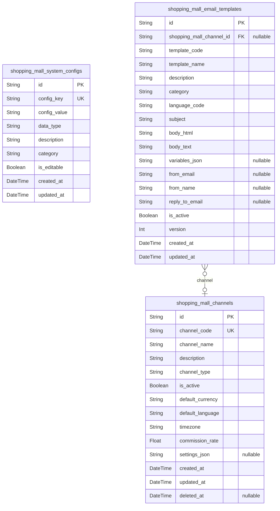
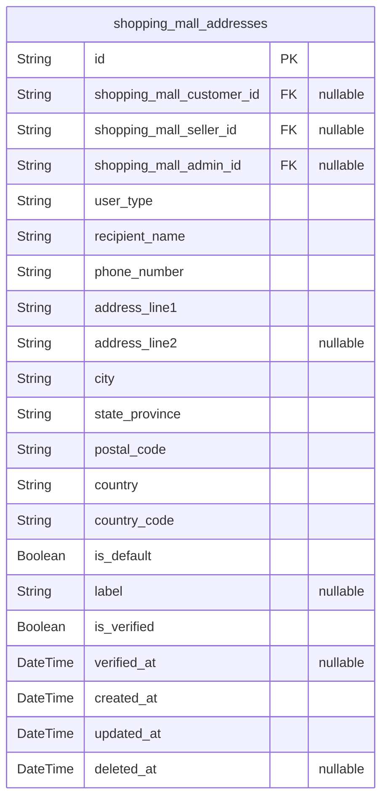
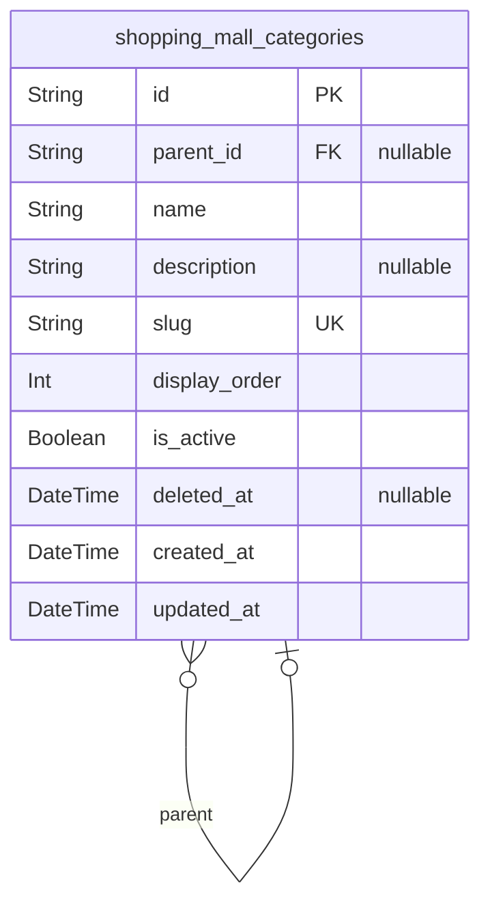
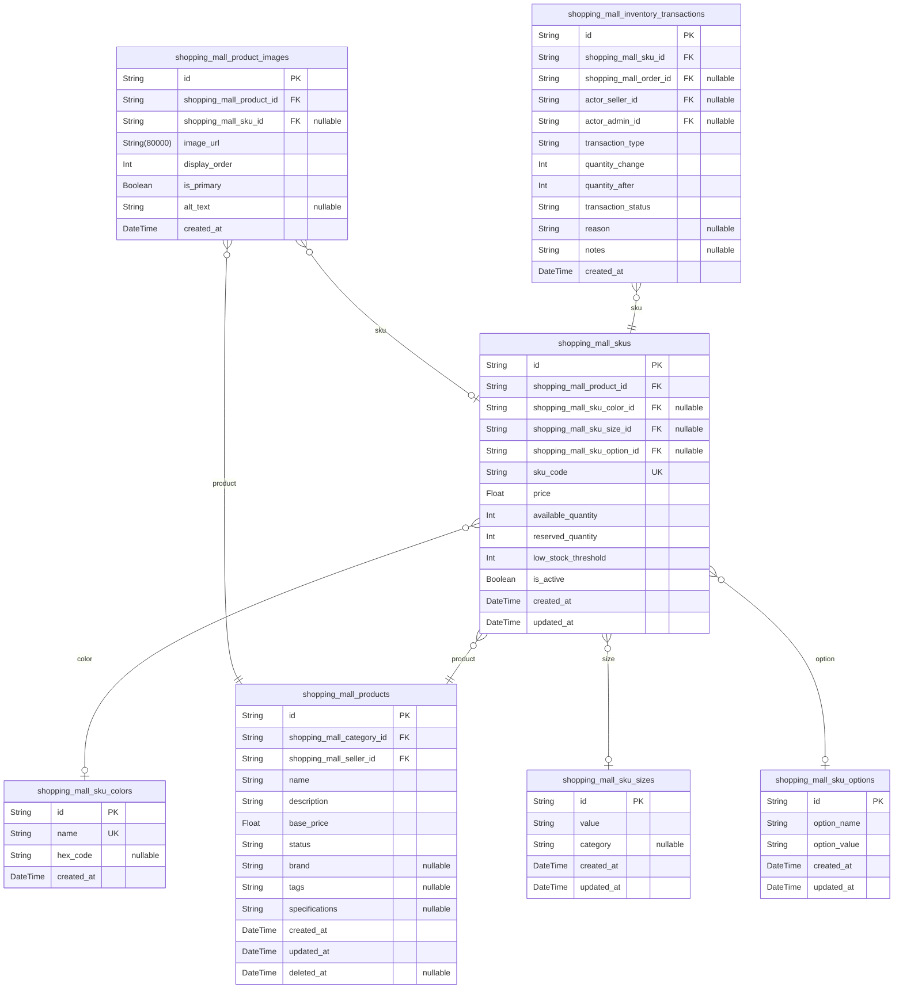
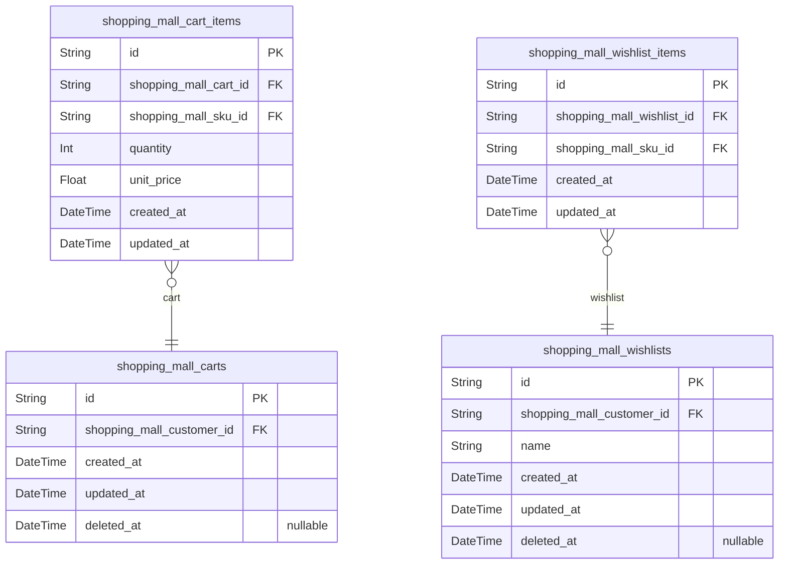
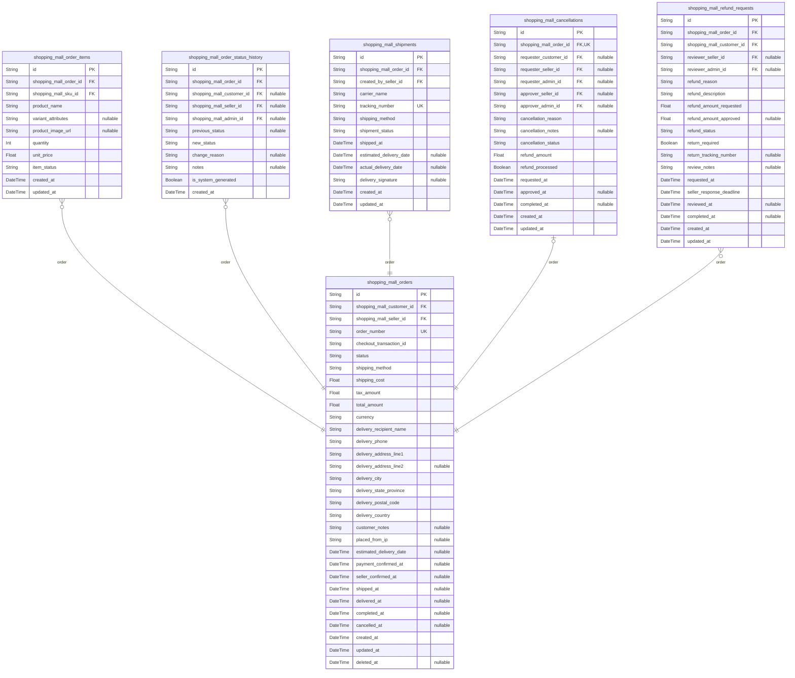
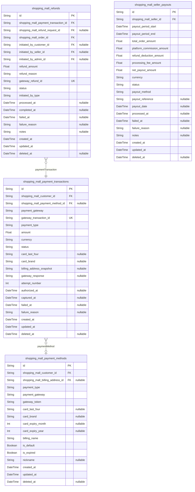
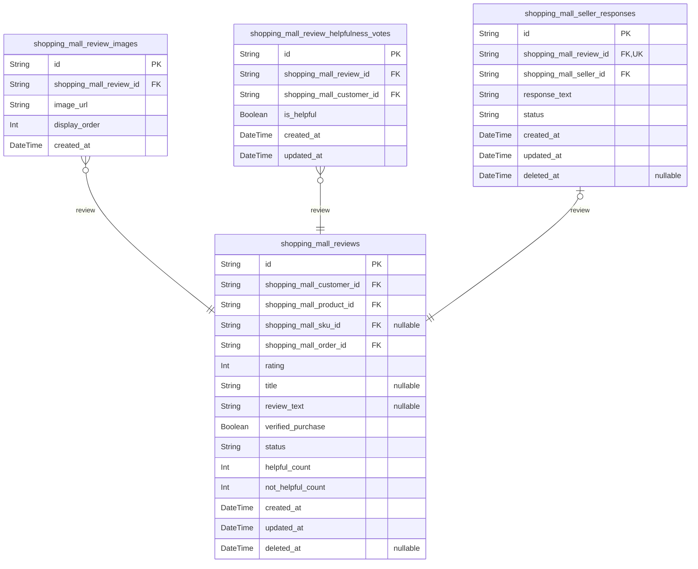

# Prisma Markdown

> Generated by [`prisma-markdown`](https://github.com/samchon/prisma-markdown)

- [Systematic](#systematic)
- [Actors](#actors)
- [Addresses](#addresses)
- [Categories](#categories)
- [Products](#products)
- [Shopping](#shopping)
- [Orders](#orders)
- [Payments](#payments)
- [Reviews](#reviews)

## Systematic

### `shopping_mall_system_configs`

Global platform configuration settings and operational parameters. Stores
key-value pairs for system-wide settings including feature toggles,
business thresholds, default values, and platform behavior controls. This
table provides centralized configuration management for the entire
e-commerce platform.

Properties as follows:

- `id`: Primary Key.
- `config_key`
  > Unique configuration key identifier using dot notation (e.g.,
  > 'platform.commission.default_rate', 'order.cancellation.window_hours').
  > Used to retrieve specific configuration values.
- `config_value`
  > Configuration value stored as string. Can represent various data types
  > (numbers, booleans, JSON) that are parsed by the application layer based
  > on the config_key.
- `data_type`
  > Data type indicator for the config_value (e.g., 'string', 'integer',
  > 'decimal', 'boolean', 'json'). Helps application layer parse the value
  > correctly.
- `description`
  > Human-readable description explaining the purpose and usage of this
  > configuration setting. Helps administrators understand what the setting
  > controls.
- `category`
  > Configuration category for grouping related settings (e.g., 'platform',
  > 'payment', 'shipping', 'notification', 'security'). Enables organized
  > configuration management.
- `is_editable`
  > Whether this configuration can be modified through admin interface.
  > System-critical configurations are marked as non-editable to prevent
  > accidental changes.
- `created_at`: Timestamp when this configuration entry was created.
- `updated_at`: Timestamp when this configuration entry was last modified.

### `shopping_mall_channels`

Sales channels and marketplace segmentation configuration. Represents
different distribution channels through which products are sold (e.g.,
web platform, mobile app, regional marketplaces, partner channels).
Channels allow segmentation of products, customers, and orders for
business analytics and operational management.

Properties as follows:

- `id`: Primary Key.
- `channel_code`
  > Unique channel identifier code (e.g., 'WEB', 'MOBILE_APP', 'US_MARKET',
  > 'EU_MARKET'). Used as short reference in application logic and analytics.
- `channel_name`
  > Human-readable channel name displayed in admin dashboard and reports
  > (e.g., 'Web Platform', 'Mobile Application', 'United States Market').
- `description`
  > Detailed description of the channel's purpose, target audience, and
  > operational scope. Helps administrators understand channel segmentation
  > strategy.
- `channel_type`
  > Channel classification type (e.g., 'platform', 'regional', 'partner',
  > 'mobile'). Used for grouping and filtering channels by operational
  > category.
- `is_active`
  > Whether this channel is currently active and accepting orders. Inactive
  > channels are hidden from customer-facing interfaces but data is retained.
- `default_currency`
  > Default currency code for this channel following ISO 4217 standard (e.g.,
  > 'USD', 'EUR', 'GBP'). Used for pricing display and transaction
  > processing.
- `default_language`
  > Default language code for this channel following ISO 639-1 standard
  > (e.g., 'en', 'es', 'fr'). Used for content localization and communication
  > templates.
- `timezone`
  > Channel timezone identifier in IANA format (e.g., 'America/New_York',
  > 'Europe/London'). Used for displaying dates/times and scheduling
  > operations.
- `commission_rate`
  > Platform commission rate for this channel as decimal percentage (e.g.,
  > 0.10 for 10%). Channel-specific commission overrides global platform
  > defaults.
- `settings_json`
  > Channel-specific configuration settings stored as JSON. Contains
  > customizable parameters like shipping methods, payment gateways, feature
  > flags specific to this channel.
- `created_at`: Timestamp when this channel was created.
- `updated_at`: Timestamp when this channel configuration was last modified.
- `deleted_at`
  > Soft delete timestamp. When set, the channel is marked as deleted but
  > data is retained for historical orders and analytics.

### `shopping_mall_email_templates`

Email template management for transactional and marketing communications.
Stores reusable email templates with dynamic content placeholders for
order confirmations, shipping notifications, account verification,
password reset, and promotional campaigns. Supports multi-language and
channel-specific customization.

Properties as follows:

- `id`: Primary Key.
- `shopping_mall_channel_id`
  > Optional channel association. [shopping_mall_channels.id](#shopping_mall_channels). When
  > set, this template is specific to a channel; null indicates platform-wide
  > template.
- `template_code`
  > Unique template identifier code (e.g., 'ORDER_CONFIRMATION',
  > 'SHIPMENT_NOTIFICATION', 'PASSWORD_RESET', 'WELCOME_EMAIL'). Used by
  > application to select appropriate template.
- `template_name`
  > Human-readable template name displayed in admin interface (e.g., 'Order
  > Confirmation Email', 'Shipping Notification').
- `description`
  > Description of template purpose, usage context, and available variables.
  > Helps administrators understand when this template is sent.
- `category`
  > Template category for organization (e.g., 'transactional', 'marketing',
  > 'authentication', 'notification'). Enables filtering and management by
  > business function.
- `language_code`
  > Language code for template content following ISO 639-1 standard (e.g.,
  > 'en', 'es', 'fr'). Supports multi-language email communications.
- `subject`
  > Email subject line with support for variable placeholders (e.g., 'Your
  > Order {{order_number}} has been confirmed'). Placeholders are replaced
  > with actual values when email is sent.
- `body_html`
  > HTML email body content with variable placeholders and styling. Used for
  > rich-formatted email display in modern email clients supporting HTML.
- `body_text`
  > Plain text email body content with variable placeholders. Used as
  > fallback for email clients that don't support HTML or for accessibility.
- `variables_json`
  > JSON array of available template variables with descriptions (e.g.,
  > [{"key": "order_number", "description": "Order ID"}, {"key":
  > "customer_name", "description": "Customer full name"}]). Documents
  > available placeholders for template customization.
- `from_email`
  > Sender email address for this template (e.g., 'noreply@shoppingmall.com',
  > 'support@shoppingmall.com'). Overrides default platform sender if
  > specified.
- `from_name`
  > Sender name displayed to recipients (e.g., 'Shopping Mall Support',
  > 'Order Team'). Provides friendly sender identification.
- `reply_to_email`
  > Reply-to email address if different from sender. Allows customers to
  > respond to specific departments or support channels.
- `is_active`
  > Whether this template is active and can be used for sending emails.
  > Inactive templates are retained but not available for selection.
- `version`
  > Template version number incremented on each update. Enables version
  > tracking and rollback capability for template changes.
- `created_at`: Timestamp when this template was created.
- `updated_at`: Timestamp when this template was last modified.

## Actors

```mermaid
erDiagram
"shopping_mall_customers" {
  String id PK
  String email UK
  String password_hash
  String name
  String phone "nullable"
  String account_status
  Boolean email_verified
  String email_verification_token "nullable"
  DateTime email_verification_sent_at "nullable"
  String password_reset_token "nullable"
  DateTime password_reset_expires_at "nullable"
  Int failed_login_attempts
  DateTime failed_login_window_start_at "nullable"
  DateTime account_locked_until "nullable"
  DateTime password_changed_at "nullable"
  String password_history "nullable"
  DateTime created_at
  DateTime updated_at
  DateTime deleted_at "nullable"
}
"shopping_mall_sellers" {
  String id PK
  String approved_by_admin_id FK "nullable"
  String email UK
  String password_hash
  String business_name
  String business_type
  String business_registration_number "nullable"
  String tax_id
  String contact_person_name
  String phone
  String business_address
  String bank_account_number "nullable"
  String bank_routing_number "nullable"
  String bank_account_holder_name "nullable"
  String store_url_slug UK "nullable"
  String store_description "nullable"
  String(80000) store_logo_url "nullable"
  String(80000) store_banner_url "nullable"
  String account_status
  Boolean email_verified
  String email_verification_token "nullable"
  DateTime email_verification_sent_at "nullable"
  Boolean documents_verified
  DateTime approved_at "nullable"
  Float commission_rate
  Float free_shipping_threshold "nullable"
  String return_policy "nullable"
  String shipping_policy "nullable"
  String password_reset_token "nullable"
  DateTime password_reset_expires_at "nullable"
  Int failed_login_attempts
  DateTime failed_login_window_start_at "nullable"
  DateTime account_locked_until "nullable"
  DateTime password_changed_at "nullable"
  String password_history "nullable"
  DateTime created_at
  DateTime updated_at
  DateTime deleted_at "nullable"
}
"shopping_mall_admins" {
  String id PK
  String created_by_admin_id FK "nullable"
  String email UK
  String password_hash
  String name
  String role_level
  Boolean is_active
  Boolean email_verified
  String email_verification_token "nullable"
  DateTime email_verification_sent_at "nullable"
  Boolean mfa_enabled
  String mfa_secret "nullable"
  DateTime last_login_at "nullable"
  String last_login_ip "nullable"
  String password_reset_token "nullable"
  DateTime password_reset_expires_at "nullable"
  Int failed_login_attempts
  DateTime failed_login_window_start_at "nullable"
  DateTime account_locked_until "nullable"
  DateTime password_changed_at "nullable"
  String password_history "nullable"
  DateTime created_at
  DateTime updated_at
}
"shopping_mall_sessions" {
  String id PK
  String customer_id FK "nullable"
  String seller_id FK "nullable"
  String admin_id FK "nullable"
  String user_type
  String refresh_token UK
  DateTime refresh_token_expires_at
  String ip_address
  String user_agent
  String device_type "nullable"
  String device_name "nullable"
  String browser_name "nullable"
  String operating_system "nullable"
  String approximate_location "nullable"
  Boolean is_revoked
  DateTime revoked_at "nullable"
  DateTime last_activity_at
  DateTime created_at
}
"shopping_mall_sellers" }o--o| "shopping_mall_admins" : approvedByAdmin
"shopping_mall_admins" }o--o| "shopping_mall_admins" : createdByAdmin
"shopping_mall_sessions" }o--o| "shopping_mall_customers" : customer
"shopping_mall_sessions" }o--o| "shopping_mall_sellers" : seller
"shopping_mall_sessions" }o--o| "shopping_mall_admins" : admin
```

### `shopping_mall_customers`

Customer accounts representing individual shoppers on the platform.
Customers can browse products, manage shopping carts and wishlists, place
orders, write reviews, and manage delivery addresses. This is a primary
user role with independent account management and full e-commerce
capabilities.

Properties as follows:

- `id`: Primary Key.
- `email`
  > Customer's email address used for authentication and communication. Must
  > be unique across all customers.
- `password_hash`
  > Hashed password for customer authentication. Stored using bcrypt or
  > Argon2, never in plain text.
- `name`: Customer's full name for profile display and order processing.
- `phone`
  > Customer's phone number for order delivery contact and account
  > verification.
- `account_status`
  > Current status of the customer account. Values: active (normal
  > operation), suspended (temporary restriction due to policy violations),
  > deleted (account deactivated by customer or admin). Controls access to
  > platform features.
- `email_verified`
  > Whether the customer has verified their email address. Unverified
  > accounts have restricted access to features like purchasing and
  > reviewing.
- `email_verification_token`
  > Unique token sent to customer email for account verification. Expires
  > after 24 hours.
- `email_verification_sent_at`
  > Timestamp when the verification email was last sent. Used for rate
  > limiting resend requests.
- `password_reset_token`: Unique token for password reset requests. Expires after 1 hour.
- `password_reset_expires_at`: Expiration timestamp for the password reset token.
- `failed_login_attempts`
  > Count of consecutive failed login attempts. Resets to zero on successful
  > login. Account locks after 5 failed attempts.
- `failed_login_window_start_at`
  > Timestamp when the current failed login attempt window started. Used to
  > implement the 15-minute window rule: account locks after 5 failures
  > within 15 minutes. Reset when window expires or login succeeds.
- `account_locked_until`
  > Timestamp until which the account is locked due to failed login attempts.
  > Automatically unlocks after 30 minutes.
- `password_changed_at`
  > Timestamp of the last password change. Used for security auditing and
  > password age policies.
- `password_history`
  > JSON array storing hashes of the last 5 passwords to prevent password
  > reuse. Format: [{"hash": "bcrypt_hash", "changed_at": "timestamp"}].
  > Enforces password history policy.
- `created_at`: Timestamp when the customer account was created.
- `updated_at`: Timestamp when the customer account was last updated.
- `deleted_at`
  > Soft delete timestamp. When set, the account is marked as deleted but
  > data is retained for legal and audit purposes.

### `shopping_mall_sellers`

Seller accounts representing vendors who list and manage products on the
platform. Sellers can create product listings, manage inventory per SKU,
process orders, access sales analytics, and configure shipping and payout
settings. This is a primary business user role requiring verification and
approval.

Properties as follows:

- `id`: Primary Key.
- `approved_by_admin_id`
  > Admin who approved this seller account. [shopping_mall_admins.id](#shopping_mall_admins).
  > Null for pending or rejected sellers. SET NULL on admin deletion to
  > preserve seller account while losing approval reference.
- `email`
  > Seller's email address used for authentication, business communication,
  > and notifications. Must be unique across all sellers.
- `password_hash`
  > Hashed password for seller authentication. Stored using bcrypt or Argon2,
  > never in plain text.
- `business_name`: Legal business name or store name publicly displayed to customers.
- `business_type`
  > Type of business entity. Values: individual, LLC, corporation,
  > partnership.
- `business_registration_number`
  > Government-issued business registration number or business license number
  > for verification purposes.
- `tax_id`
  > Tax identification number (EIN or SSN) for tax reporting and payout
  > processing.
- `contact_person_name`: Full name of the primary contact person for the seller account.
- `phone`: Business phone number for customer service and platform communication.
- `business_address`: Physical business address for verification and legal compliance.
- `bank_account_number`: Bank account number for seller payouts. Stored encrypted for security.
- `bank_routing_number`: Bank routing number for payout transfers.
- `bank_account_holder_name`: Name on the bank account, must match business name for verification.
- `store_url_slug`
  > Unique URL slug for the seller's store page. Customizable by seller, must
  > be unique across platform.
- `store_description`: Seller's store description and about information displayed on store page.
- `store_logo_url`
  > URL to the seller's store logo image. JPEG, PNG, or WebP format, maximum
  > 500KB.
- `store_banner_url`
  > URL to the seller's store banner image for store page header. JPEG, PNG,
  > or WebP format, maximum 2MB.
- `account_status`
  > Current status of the seller account. Values: pending_approval
  > (application submitted, awaiting admin verification), active (approved
  > and can sell), suspended (temporary restriction due to policy violations
  > or performance issues), banned (permanent removal), on_hold (account
  > frozen pending investigation). Controls ability to list products and
  > receive orders.
- `email_verified`
  > Whether the seller has verified their email address. Required before
  > account approval.
- `email_verification_token`
  > Unique token sent to seller email for account verification. Expires after
  > 24 hours.
- `email_verification_sent_at`
  > Timestamp when the verification email was last sent. Used for rate
  > limiting resend requests (max 1 per 5 minutes).
- `documents_verified`
  > Whether admin has verified business documents (registration, tax ID, bank
  > info). Required for account activation.
- `approved_at`: Timestamp when the seller account was approved by admin.
- `commission_rate`
  > Platform commission rate for this seller as decimal (0.10 = 10%). Can be
  > customized per seller, default is platform standard rate.
- `free_shipping_threshold`
  > Minimum order value for free shipping offered by this seller. Null if
  > seller does not offer free shipping.
- `return_policy`: Seller's return and refund policy text displayed to customers.
- `shipping_policy`
  > Seller's shipping policy including processing times and shipping methods
  > offered.
- `password_reset_token`: Unique token for password reset requests. Expires after 1 hour.
- `password_reset_expires_at`: Expiration timestamp for the password reset token.
- `failed_login_attempts`
  > Count of consecutive failed login attempts. Resets to zero on successful
  > login. Account locks after 5 failed attempts within 15-minute window.
- `failed_login_window_start_at`
  > Timestamp when the current failed login attempt window started. Used to
  > implement the 15-minute window rule. Reset when window expires or login
  > succeeds.
- `account_locked_until`
  > Timestamp until which the account is locked due to failed login attempts.
  > Automatically unlocks after 30 minutes.
- `password_changed_at`
  > Timestamp of the last password change. Used for security auditing and
  > password age policies.
- `password_history`
  > JSON array storing hashes of the last 5 passwords to prevent password
  > reuse. Format: [{"hash": "bcrypt_hash", "changed_at": "timestamp"}].
  > Enforces password history policy.
- `created_at`
  > Timestamp when the seller account was created and application was
  > submitted.
- `updated_at`: Timestamp when the seller account was last updated.
- `deleted_at`
  > Soft delete timestamp. When set, the seller account is marked as deleted
  > but data is retained for order history and compliance.

### `shopping_mall_admins`

Administrator accounts with platform-wide management capabilities. Admins
can manage all orders, products, users, sellers, approve refunds,
moderate content, and configure system settings. Admin accounts cannot be
self-registered and must be created by existing admins. This is a primary
privileged user role with full platform access.

Properties as follows:

- `id`: Primary Key.
- `created_by_admin_id`
  > Admin who created this admin account. Self-referential foreign key.
  > [shopping_mall_admins.id](#shopping_mall_admins)
- `email`
  > Admin's email address used for authentication and platform notifications.
  > Must be unique across all admins.
- `password_hash`
  > Hashed password for admin authentication. Stored using bcrypt or Argon2,
  > never in plain text. Requires strong password policy.
- `name`: Admin's full name for identification in audit logs and admin interface.
- `role_level`
  > Admin role defining permission level. Values: super_admin (full platform
  > access, can create other admins), order_manager (order and refund
  > management only), content_moderator (product and review moderation only),
  > support_admin (customer service and basic operations). Roles are
  > hierarchical with super_admin having all permissions.
- `is_active`
  > Whether the admin account is currently active. Inactive admins cannot log
  > in or perform administrative actions.
- `email_verified`
  > Whether the admin has verified their email address. Required before
  > granting admin access.
- `email_verification_token`
  > Unique token sent to admin email for account verification. Expires after
  > 24 hours.
- `email_verification_sent_at`
  > Timestamp when the verification email was last sent. Used for rate
  > limiting resend requests.
- `mfa_enabled`
  > Whether multi-factor authentication is enabled for this admin account.
  > Required for super_admin role.
- `mfa_secret`: Encrypted MFA secret key for TOTP-based two-factor authentication.
- `last_login_at`: Timestamp of the admin's most recent successful login.
- `last_login_ip`
  > IP address from which the admin last logged in. Used for security
  > monitoring.
- `password_reset_token`: Unique token for password reset requests. Expires after 1 hour.
- `password_reset_expires_at`: Expiration timestamp for the password reset token.
- `failed_login_attempts`
  > Count of consecutive failed login attempts. Resets to zero on successful
  > login. Account locks after 5 failed attempts within 15-minute window.
- `failed_login_window_start_at`
  > Timestamp when the current failed login attempt window started. Used to
  > implement the 15-minute window rule. Reset when window expires or login
  > succeeds.
- `account_locked_until`
  > Timestamp until which the account is locked due to failed login attempts.
  > Automatically unlocks after 30 minutes.
- `password_changed_at`
  > Timestamp of the last password change. Used for security auditing and
  > enforcing password rotation policies.
- `password_history`
  > JSON array storing hashes of the last 5 passwords to prevent password
  > reuse. Format: [{"hash": "bcrypt_hash", "changed_at": "timestamp"}].
  > Enforces password history policy.
- `created_at`: Timestamp when the admin account was created.
- `updated_at`: Timestamp when the admin account was last updated.

### `shopping_mall_sessions`

User session records for authentication and session management across all
user types (customers, sellers, admins). Tracks active sessions with JWT
refresh tokens, device information, and activity monitoring. Sessions
support multi-device login and provide security features like session
revocation and timeout. This is a subsidiary entity managed by the
authentication system.

Properties as follows:

- `id`: Primary Key.
- `customer_id`
  > Customer who owns this session. Null if session belongs to seller or
  > admin. [shopping_mall_customers.id](#shopping_mall_customers)
- `seller_id`
  > Seller who owns this session. Null if session belongs to customer or
  > admin. [shopping_mall_sellers.id](#shopping_mall_sellers)
- `admin_id`
  > Admin who owns this session. Null if session belongs to customer or
  > seller. [shopping_mall_admins.id](#shopping_mall_admins)
- `user_type`
  > Type of user this session belongs to. Values: customer, seller, admin.
  > Used as discriminator to determine which foreign key (customer_id,
  > seller_id, admin_id) is populated. Must be kept in sync with populated
  > foreign key.
- `refresh_token`
  > JWT refresh token for generating new access tokens. Unique per session,
  > used for token refresh flow.
- `refresh_token_expires_at`
  > Expiration timestamp for the refresh token. Typically 30 days from
  > session creation.
- `ip_address`
  > IP address from which the session was initiated. Used for security
  > monitoring and fraud detection.
- `user_agent`
  > Browser user agent string for device identification and session display
  > to users.
- `device_type`
  > Detected device type. Values: mobile, tablet, desktop. Parsed from user
  > agent.
- `device_name`
  > User-friendly device name for session display (e.g., 'Chrome on Windows',
  > 'Safari on iPhone'). Shown to users in active sessions list.
- `browser_name`: Browser name parsed from user agent (Chrome, Firefox, Safari, etc.).
- `operating_system`
  > Operating system parsed from user agent (Windows, macOS, iOS, Android,
  > Linux).
- `approximate_location`
  > Approximate geographic location based on IP address (e.g., 'New York,
  > US', 'London, UK'). Used for security monitoring and session display.
- `is_revoked`
  > Whether this session has been manually revoked by the user or admin.
  > Revoked sessions cannot be used for token refresh.
- `revoked_at`: Timestamp when the session was revoked. Null if session is still active.
- `last_activity_at`
  > Timestamp of the last activity in this session. Updated on each token
  > refresh or important action. Sessions auto-expire after 30 days of
  > inactivity.
- `created_at`: Timestamp when the session was created (user logged in).

## Addresses

### `shopping_mall_addresses`

Delivery addresses for customers, sellers, and admins. Supports multiple
addresses per user with default address designation. Addresses are
soft-deleted to preserve historical order data. Used during checkout for
order delivery destination and preserved as snapshots in completed
orders.

Properties as follows:

- `id`: Primary Key.
- `shopping_mall_customer_id`
  > Customer who owns this address (null if owned by seller or admin). {@link
  > shopping_mall_customers.id}
- `shopping_mall_seller_id`
  > Seller who owns this address (null if owned by customer or admin). {@link
  > shopping_mall_sellers.id}
- `shopping_mall_admin_id`
  > Admin who owns this address (null if owned by customer or seller). {@link
  > shopping_mall_admins.id}
- `user_type`
  > Type of user who owns this address. Valid values: 'customer', 'seller',
  > 'admin'. Must match the populated foreign key (customer_id, seller_id, or
  > admin_id).
- `recipient_name`
  > Full name of the person who will receive deliveries at this address. May
  > differ from account holder name for gift deliveries or business
  > addresses.
- `phone_number`
  > Contact phone number for delivery coordination. Used by shipping carriers
  > to contact recipient. Format validated by application layer for
  > international compatibility.
- `address_line1`
  > Primary street address including house/building number and street name.
  > Required field for all delivery addresses.
- `address_line2`
  > Secondary address information such as apartment number, suite, unit,
  > floor, or building name. Optional field for additional address details.
- `city`
  > City or locality name for the delivery address. Required for address
  > validation and shipping cost calculation.
- `state_province`
  > State, province, or administrative region for the delivery address. Used
  > for tax calculation and address validation.
- `postal_code`
  > ZIP code or postal code for the delivery address. Format varies by
  > country. Used for address validation, shipping cost calculation, and
  > delivery routing.
- `country`
  > Country name or ISO 3166-1 alpha-2 country code for the delivery address.
  > Determines address format validation rules, postal code format, and
  > international shipping availability.
- `country_code`
  > ISO 3166-1 alpha-2 country code (US, GB, FR, etc.) for standardized
  > country identification. Enables consistent filtering, grouping, and
  > international shipping logic.
- `is_default`
  > Whether this address is the user's default delivery address. Only one
  > address per user should be marked as default. Default address is
  > pre-selected during checkout.
- `label`
  > Optional user-defined label for the address such as 'Home', 'Office',
  > 'Parents House'. Helps users identify addresses quickly. Must be unique
  > per user if provided.
- `is_verified`
  > Whether this address has been verified through address validation
  > service. Unverified addresses may require customer confirmation during
  > checkout.
- `verified_at`
  > Timestamp when the address was last verified through validation service.
  > Used to determine if revalidation is needed.
- `created_at`
  > Timestamp when the address was first created by the user. Used for audit
  > trail and chronological ordering of addresses.
- `updated_at`
  > Timestamp of the last modification to the address. Updated whenever any
  > address field is changed. Used for tracking address changes and
  > validation updates.
- `deleted_at`
  > Soft delete timestamp. When set, indicates the address has been deleted
  > by the user but preserved for historical order references. Null for
  > active addresses.

## Categories

### `shopping_mall_categories`

Product category hierarchy supporting unlimited depth parent-child
relationships. Categories organize the product catalog with
self-referential structure enabling breadcrumb navigation, taxonomy
management, and flexible product organization. Root categories have null
parent_id, and each category can have multiple children.

Properties as follows:

- `id`: Primary Key.
- `parent_id`
  > Parent category's [shopping_mall_categories.id](#shopping_mall_categories). Null for
  > root-level categories. Creates hierarchical tree structure enabling
  > unlimited depth taxonomy.
- `name`
  > Category name displayed to users (e.g., 'Electronics', 'Laptops', 'Gaming
  > Laptops'). Required for category identification and navigation.
- `description`
  > Optional detailed description of the category explaining what products
  > belong here. Helps customers understand category scope and improves SEO.
- `slug`
  > URL-friendly unique identifier for category (e.g., 'gaming-laptops').
  > Used in category page URLs and routing. Must be globally unique across
  > all categories.
- `display_order`
  > Sort order for displaying categories at the same hierarchy level. Lower
  > numbers appear first. Used to control category presentation order in
  > navigation and listings.
- `is_active`
  > Whether the category is active and visible to customers. Inactive
  > categories are hidden but preserved for historical product associations.
  > Allows toggling visibility without deletion.
- `deleted_at`
  > Soft deletion timestamp. When set, category is considered deleted but
  > data preserved for audit trail and historical product-category
  > relationships. Null indicates active category.
- `created_at`
  > Timestamp when the category was created. Used for audit trail and
  > chronological tracking of category additions.
- `updated_at`
  > Timestamp when the category was last modified. Updated whenever category
  > properties change. Used for audit trail and change tracking.

## Products

### `shopping_mall_products`

Core product entity representing items available for sale in the
marketplace. Each product can have multiple variants (SKUs) with
different color, size, and option combinations. Products are owned by
sellers and organized into categories. Supports complete product
lifecycle from draft to discontinued states with soft deletion
capability.

Properties as follows:

- `id`: Primary Key.
- `shopping_mall_category_id`: Product category assignment. [shopping_mall_categories.id](#shopping_mall_categories)
- `shopping_mall_seller_id`: Seller who owns and manages this product. [shopping_mall_sellers.id](#shopping_mall_sellers)
- `name`: Product name displayed to customers. Must be between 3-200 characters.
- `description`
  > Detailed product description with minimum 20 characters, maximum 5000
  > characters. Supports rich text formatting.
- `base_price`
  > Base product price in USD. Individual SKU variants may have different
  > prices. Must be positive number greater than zero.
- `status`
  > Product lifecycle status: draft (being created), active (published and
  > visible), inactive (temporarily hidden), out_of_stock (all variants
  > unavailable), discontinued (permanently removed).
- `brand`: Brand or manufacturer name. Optional branding information.
- `tags`
  > Comma-separated keywords for improved searchability and filtering.
  > Examples: waterproof, eco-friendly, bestseller.
- `specifications`
  > Technical details in JSON format storing key-value pairs like weight,
  > dimensions, materials, etc.
- `created_at`: Timestamp when product was created.
- `updated_at`: Timestamp when product was last modified.
- `deleted_at`
  > Soft deletion timestamp. When set, product is hidden but preserved for
  > order history.

### `shopping_mall_skus`

Stock Keeping Unit representing a specific product variant with unique
combination of attributes (color, size, options). Each SKU has
independent pricing and inventory tracking. The actual purchasable unit
in orders and carts.

Properties as follows:

- `id`: Primary Key.
- `shopping_mall_product_id`
  > Parent product this SKU variant belongs to. {@link
  > shopping_mall_products.id}
- `shopping_mall_sku_color_id`: Color variant attribute if applicable. [shopping_mall_sku_colors.id](#shopping_mall_sku_colors)
- `shopping_mall_sku_size_id`: Size variant attribute if applicable. [shopping_mall_sku_sizes.id](#shopping_mall_sku_sizes)
- `shopping_mall_sku_option_id`
  > Custom option variant attribute if applicable (storage, material, etc.).
  > [shopping_mall_sku_options.id](#shopping_mall_sku_options)
- `sku_code`
  > Unique SKU identifier code combining product ID and variant attributes.
  > Must be unique platform-wide.
- `price`
  > SKU-specific price which may differ from base product price. Positive
  > number greater than zero.
- `available_quantity`: Current stock available for purchase. Non-negative integer.
- `reserved_quantity`: Stock reserved for pending orders and active carts. Non-negative integer.
- `low_stock_threshold`
  > Inventory level that triggers low stock alerts to seller. Default 10
  > units.
- `is_active`
  > Whether this SKU variant is currently available for purchase. Inactive
  > SKUs are hidden from customers.
- `created_at`: Timestamp when SKU was created.
- `updated_at`: Timestamp when SKU was last modified.

### `shopping_mall_sku_colors`

Color variant attribute for SKUs. Stores color name and optional hex code
for visual representation. Used to differentiate product variants by
color.

Properties as follows:

- `id`: Primary Key.
- `name`
  > Color name displayed to customers. Examples: Navy Blue, Forest Green,
  > Crimson Red.
- `hex_code`: Optional hex color code for visual swatch display. Format: #RRGGBB.
- `created_at`: Timestamp when color was created.

### `shopping_mall_sku_sizes`

Size variant attribute for SKUs. Stores size value and optional category
for different sizing systems (US, EU, One Size, etc.).

Properties as follows:

- `id`: Primary Key.
- `value`
  > Size value displayed to customers. Examples: Small, Medium, Large, 38,
  > 40, 42.
- `category`: Size category or system. Examples: US Sizes, EU Sizes, One Size, Numeric.
- `created_at`: Timestamp when size was created.
- `updated_at`: Timestamp when size was last modified.

### `shopping_mall_sku_options`

Custom option variant attribute for SKUs. Stores seller-defined product
options beyond color and size, such as storage capacity, material type,
package quantity, subscription period, etc.

Properties as follows:

- `id`: Primary Key.
- `option_name`
  > Name of the custom option. Examples: Storage Capacity, Material Type,
  > Package Quantity.
- `option_value`: Value of the custom option. Examples: 128GB, Cotton, 12-Pack.
- `created_at`: Timestamp when option was created.
- `updated_at`: Timestamp when option was last modified.

### `shopping_mall_inventory_transactions`

Complete audit trail of all inventory changes for SKUs. Records every
inventory movement including sales, restocks, adjustments, returns, and
cancellations with timestamp, reason, and actor tracking. Append-only
historical data for compliance and reconciliation.

Properties as follows:

- `id`: Primary Key.
- `shopping_mall_sku_id`: SKU whose inventory changed. [shopping_mall_skus.id](#shopping_mall_skus)
- `shopping_mall_order_id`
  > Related order if transaction is due to sale or cancellation. {@link
  > shopping_mall_orders.id}
- `actor_seller_id`
  > Seller who initiated the inventory change if manual adjustment. {@link
  > shopping_mall_sellers.id}
- `actor_admin_id`
  > Admin who initiated the inventory change if administrative action. {@link
  > shopping_mall_admins.id}
- `transaction_type`
  > Type of inventory transaction: sale, restock, adjustment, damage_loss,
  > return, cancellation.
- `quantity_change`
  > Quantity change - positive for additions (restock, return), negative for
  > reductions (sale, damage).
- `quantity_after`
  > Resulting available quantity after this transaction. For audit
  > verification.
- `transaction_status`
  > Processing status of the inventory transaction: pending (reservation),
  > completed (permanent allocation), reversed (cancellation/refund).
  > Critical for tracking concurrent inventory operations and order state.
- `reason`
  > Explanation or reason for the inventory change. Required for adjustments
  > and corrections.
- `notes`: Additional notes or details about the transaction.
- `created_at`: Timestamp when inventory transaction occurred.

### `shopping_mall_product_images`

Product images for visual display in catalog and detail pages. Supports
multiple images per product with ordering for gallery display. Includes
variant-specific images when applicable.

Properties as follows:

- `id`: Primary Key.
- `shopping_mall_product_id`: Product this image belongs to. [shopping_mall_products.id](#shopping_mall_products)
- `shopping_mall_sku_id`
  > Specific SKU variant this image represents, if variant-specific. {@link
  > shopping_mall_skus.id}
- `image_url`
  > URL to the stored product image. JPEG, PNG, or WebP format, minimum
  > 800x800 pixels.
- `display_order`
  > Order position for image gallery display. Lower numbers appear first.
  > First image (0) is main product image.
- `is_primary`
  > Whether this is the primary/main product image shown in listings. Only
  > one image per product should be primary.
- `alt_text`: Alternative text for accessibility and SEO. Describes the image content.
- `created_at`: Timestamp when image was uploaded.

## Shopping

### `shopping_mall_carts`

Shopping cart for customers. Each customer has one active cart that
persists across sessions. Carts are soft-deleted when cleared but
retained for analytics. The cart serves as a container for cart items and
enables customers to collect products before checkout.

Properties as follows:

- `id`: Primary Key.
- `shopping_mall_customer_id`: Customer who owns this cart. [shopping_mall_customers.id](#shopping_mall_customers)
- `created_at`: Timestamp when the cart was created.
- `updated_at`: Timestamp when the cart was last updated.
- `deleted_at`
  > Soft deletion timestamp. Null means cart is active, non-null means cart
  > was cleared or abandoned.

### `shopping_mall_cart_items`

Individual items within a shopping cart. Each item represents a specific
SKU with quantity and price snapshot. Customers manage cart items by
adding, updating quantities, or removing items. Price is snapshotted at
addition time to track price changes.

Properties as follows:

- `id`: Primary Key.
- `shopping_mall_cart_id`: Cart that contains this item. [shopping_mall_carts.id](#shopping_mall_carts)
- `shopping_mall_sku_id`: Product SKU being added to cart. [shopping_mall_skus.id](#shopping_mall_skus)
- `quantity`: Quantity of this SKU in the cart. Must be positive integer.
- `unit_price`
  > Price per unit at the time item was added to cart. Snapshot for price
  > change tracking.
- `created_at`: Timestamp when the item was added to cart.
- `updated_at`: Timestamp when the item was last updated (quantity or price change).

### `shopping_mall_wishlists`

Customer wishlists for saving products for future purchase. Customers can
create multiple named wishlists to organize products (e.g., 'Holiday
Gifts', 'Favorites', 'Birthday Ideas'). Wishlists are soft-deleted when
removed but retained for analytics.

Properties as follows:

- `id`: Primary Key.
- `shopping_mall_customer_id`: Customer who owns this wishlist. [shopping_mall_customers.id](#shopping_mall_customers)
- `name`
  > Name of the wishlist for organization (e.g., 'Favorites', 'Holiday
  > Gifts', 'Birthday Ideas').
- `created_at`: Timestamp when the wishlist was created.
- `updated_at`: Timestamp when the wishlist was last updated.
- `deleted_at`
  > Soft deletion timestamp. Null means wishlist is active, non-null means
  > wishlist was deleted.

### `shopping_mall_wishlist_items`

Individual items within a wishlist. Each item represents a specific SKU
that the customer wants to save for future purchase. Customers can add
items to wishlist from product pages and later move them to cart when
ready to buy.

Properties as follows:

- `id`: Primary Key.
- `shopping_mall_wishlist_id`: Wishlist that contains this item. [shopping_mall_wishlists.id](#shopping_mall_wishlists)
- `shopping_mall_sku_id`: Product SKU saved in the wishlist. [shopping_mall_skus.id](#shopping_mall_skus)
- `created_at`: Timestamp when the item was added to wishlist.
- `updated_at`: Timestamp when the item was last updated.

## Orders

### `shopping_mall_orders`

Core order entity representing a customer's purchase from a single
seller. Multi-seller carts result in multiple order records, one per
seller. Tracks complete order lifecycle from placement through delivery
or cancellation. Orders snapshot critical data at checkout time (address,
prices) to preserve historical accuracy even when products or addresses
are later modified.

Properties as follows:

- `id`: Primary Key.
- `shopping_mall_customer_id`: Customer who placed this order. [shopping_mall_customers.id](#shopping_mall_customers)
- `shopping_mall_seller_id`
  > Seller fulfilling this order. Multi-seller carts create separate orders
  > per seller. [shopping_mall_sellers.id](#shopping_mall_sellers)
- `order_number`
  > Unique human-readable order identifier in format ORD-YYYYMMDD-NNNNNN
  > (e.g., ORD-20251013-000001) displayed to customers and sellers.
- `checkout_transaction_id`
  > Groups orders created from the same checkout session. Multi-seller carts
  > result in multiple orders sharing the same checkout_transaction_id,
  > enabling display of 'orders from same purchase'.
- `status`
  > Current order status: pending_payment, payment_confirmed,
  > awaiting_seller_confirmation, confirmed, processing, preparing_shipment,
  > shipped, in_transit, out_for_delivery, delivered, completed, cancelled,
  > refund_requested, refund_approved, refunded, failed.
- `shipping_method`
  > Shipping method selected at checkout: standard (5-7 days), express (2-3
  > days), overnight (1 day), free_shipping. Required for shipping cost
  > calculation and delivery estimation.
- `shipping_cost`
  > Shipping fee for this order calculated based on shipping method and
  > destination.
- `tax_amount`: Tax amount calculated based on delivery address jurisdiction.
- `total_amount`
  > Final order total: sum of order_items subtotals + shipping_cost +
  > tax_amount. Calculated at checkout and preserved as snapshot.
- `currency`: ISO 4217 currency code for order amounts (e.g., USD, EUR, GBP).
- `delivery_recipient_name`
  > Recipient name snapshotted from delivery address at checkout. Preserved
  > for historical order display.
- `delivery_phone`: Delivery contact phone snapshotted from address at checkout.
- `delivery_address_line1`: Primary street address snapshotted at checkout.
- `delivery_address_line2`
  > Secondary address information snapshotted at checkout (apartment, suite,
  > etc.).
- `delivery_city`: Delivery city snapshotted at checkout.
- `delivery_state_province`: Delivery state/province snapshotted at checkout.
- `delivery_postal_code`: Delivery postal code snapshotted at checkout.
- `delivery_country`: Delivery country snapshotted at checkout.
- `customer_notes`
  > Optional special instructions or notes from customer for order
  > fulfillment.
- `placed_from_ip`
  > IP address from which order was placed. Used for fraud detection and
  > security monitoring.
- `estimated_delivery_date`
  > Estimated delivery date based on shipping method and seller processing
  > time.
- `payment_confirmed_at`
  > Timestamp when payment was successfully confirmed. Denormalized from
  > status history for efficient timeline queries.
- `seller_confirmed_at`
  > Timestamp when seller confirmed they can fulfill the order. Required for
  > tracking 24-hour confirmation deadline. Null if seller hasn't confirmed
  > yet.
- `shipped_at`
  > Timestamp when order was marked as shipped. Denormalized from status
  > history for efficient timeline display.
- `delivered_at`
  > Timestamp when order was delivered to customer. Denormalized from status
  > history for performance.
- `completed_at`
  > Timestamp when order was marked as completed (customer confirmed receipt
  > or auto-completed after 7 days).
- `cancelled_at`: Timestamp when order was cancelled.
- `created_at`: Timestamp when order was created (placed by customer).
- `updated_at`: Timestamp when order was last modified.
- `deleted_at`: Soft delete timestamp for cancelled orders. Null indicates active order.

### `shopping_mall_order_items`

Individual line items within an order representing specific SKUs
purchased with quantities and prices at time of order. Snapshots product
display information (name, variant details, images) to preserve
historical accuracy even when products are updated or deleted. Enables
partial fulfillment tracking and accurate order detail display.

Properties as follows:

- `id`: Primary Key.
- `shopping_mall_order_id`: Parent order containing this item. [shopping_mall_orders.id](#shopping_mall_orders)
- `shopping_mall_sku_id`
  > Product SKU variant that was ordered. Preserves SKU reference even if
  > product later discontinued. [shopping_mall_skus.id](#shopping_mall_skus)
- `product_name`
  > Product name snapshotted at time of purchase. Preserved for historical
  > order display even if seller later renames product.
- `variant_attributes`
  > SKU variant attributes as JSON (color, size, options) snapshotted at
  > purchase time. Example: {"color": "Navy Blue", "size": "Large"}. Enables
  > accurate historical variant display.
- `product_image_url`
  > Primary product image URL snapshotted at purchase time for order history
  > display.
- `quantity`: Quantity of this SKU ordered by customer.
- `unit_price`
  > Price per unit at time of order placement (captured from SKU price at
  > checkout).
- `item_status`
  > Individual item status for partial fulfillment: pending, confirmed,
  > preparing, shipped, delivered, cancelled, refunded.
- `created_at`: Timestamp when order item was created.
- `updated_at`: Timestamp when order item was last modified.

### `shopping_mall_order_status_history`

Audit trail tracking all order status transitions with timestamps and
actors. Implements snapshot pattern for compliance and order lifecycle
visibility. Append-only table preserving complete order history.

Properties as follows:

- `id`: Primary Key.
- `shopping_mall_order_id`: Order whose status changed. [shopping_mall_orders.id](#shopping_mall_orders).
- `shopping_mall_customer_id`
  > Customer who triggered status change (if customer-initiated). {@link
  > shopping_mall_customers.id}.
- `shopping_mall_seller_id`
  > Seller who triggered status change (if seller-initiated). {@link
  > shopping_mall_sellers.id}.
- `shopping_mall_admin_id`
  > Admin who triggered status change (if admin-initiated). {@link
  > shopping_mall_admins.id}.
- `previous_status`: Order status before this change.
- `new_status`: Order status after this change.
- `change_reason`
  > Explanation for status change (e.g., payment_confirmed, seller_shipped,
  > customer_cancelled).
- `notes`: Additional notes or details about the status change.
- `is_system_generated`
  > True if status change was automatic (e.g., payment gateway callback),
  > false if manually triggered by user.
- `created_at`: Timestamp when status change occurred.

### `shopping_mall_shipments`

Shipping and tracking information for order fulfillment. Links orders to
carriers and provides tracking capabilities. Created by sellers when
marking orders as shipped. Tracks shipment status through carrier
integration.

Properties as follows:

- `id`: Primary Key.
- `shopping_mall_order_id`: Order being shipped. [shopping_mall_orders.id](#shopping_mall_orders)
- `created_by_seller_id`
  > Seller who created this shipment record and provided tracking
  > information. [shopping_mall_sellers.id](#shopping_mall_sellers)
- `carrier_name`: Shipping carrier name (e.g., FedEx, UPS, USPS, DHL).
- `tracking_number`: Carrier tracking number for shipment tracking.
- `shipping_method`: Shipping service level used: standard, express, overnight, free_shipping.
- `shipment_status`
  > Current shipment status: label_created, picked_up, in_transit,
  > out_for_delivery, delivered, exception, failed_delivery.
- `shipped_at`: Timestamp when seller marked order as shipped and handed to carrier.
- `estimated_delivery_date`: Carrier's estimated delivery date.
- `actual_delivery_date`: Actual delivery timestamp from carrier confirmation.
- `delivery_signature`: Delivery signature or proof of delivery if provided by carrier.
- `created_at`: Timestamp when shipment record was created.
- `updated_at`: Timestamp when shipment information was last updated.

### `shopping_mall_cancellations`

Order cancellation requests and approvals. Tracks cancellation workflow
including requester, reason, approval status, and refund processing.
Supports customer, seller, and admin-initiated cancellations.

Properties as follows:

- `id`: Primary Key.
- `shopping_mall_order_id`: Order being cancelled. [shopping_mall_orders.id](#shopping_mall_orders).
- `requester_customer_id`
  > Customer who requested cancellation (if customer-initiated). {@link
  > shopping_mall_customers.id}.
- `requester_seller_id`
  > Seller who requested cancellation (if seller-initiated). {@link
  > shopping_mall_sellers.id}.
- `requester_admin_id`
  > Admin who requested cancellation (if admin-initiated). {@link
  > shopping_mall_admins.id}.
- `approver_seller_id`
  > Seller who approved cancellation request (if approval required). {@link
  > shopping_mall_sellers.id}.
- `approver_admin_id`
  > Admin who approved cancellation request (if admin approval required).
  > [shopping_mall_admins.id](#shopping_mall_admins).
- `cancellation_reason`
  > Reason for cancellation: customer_changed_mind, found_better_price,
  > order_mistake, delivery_too_long, out_of_stock, pricing_error, other.
- `cancellation_notes`: Additional details or explanation for cancellation.
- `cancellation_status`
  > Cancellation workflow status: pending_approval, approved, rejected,
  > completed.
- `refund_amount`: Amount to be refunded to customer (typically full order total).
- `refund_processed`: True if refund payment has been processed to customer.
- `requested_at`: Timestamp when cancellation was requested.
- `approved_at`: Timestamp when cancellation was approved.
- `completed_at`: Timestamp when cancellation and refund were fully completed.
- `created_at`: Timestamp when cancellation record was created.
- `updated_at`: Timestamp when cancellation record was last updated.

### `shopping_mall_refund_requests`

Post-delivery refund requests from customers with approval workflow.
Supports full and partial refunds with seller and admin review. Tracks
refund reason, evidence, approval status, and payment processing.
Customers and sellers need independent access to search and manage refund
requests, requiring primary stance for dedicated API endpoints.

Properties as follows:

- `id`: Primary Key.
- `shopping_mall_order_id`: Order for which refund is requested. [shopping_mall_orders.id](#shopping_mall_orders)
- `shopping_mall_customer_id`: Customer requesting the refund. [shopping_mall_customers.id](#shopping_mall_customers)
- `reviewer_seller_id`: Seller who reviewed the refund request. [shopping_mall_sellers.id](#shopping_mall_sellers)
- `reviewer_admin_id`
  > Admin who reviewed or overrode refund decision. {@link
  > shopping_mall_admins.id}
- `refund_reason`
  > Reason for refund request: defective_damaged, wrong_item,
  > does_not_match_description, changed_mind, found_better_price,
  > quality_not_expected, other.
- `refund_description`: Detailed explanation from customer about why refund is requested.
- `refund_amount_requested`: Amount customer is requesting for refund.
- `refund_amount_approved`: Amount approved by seller or admin (can be partial refund).
- `refund_status`
  > Refund workflow status: pending_review, pending_seller_response,
  > approved, rejected, processing, completed.
- `return_required`: True if customer must return product for refund to be processed.
- `return_tracking_number`: Tracking number for returned product shipment (if return required).
- `review_notes`: Notes from seller or admin during refund review.
- `requested_at`: Timestamp when customer submitted refund request.
- `seller_response_deadline`
  > Deadline for seller to respond (3 business days from request).
  > Auto-approves if seller doesn't respond by this time.
- `reviewed_at`: Timestamp when seller or admin reviewed the request.
- `completed_at`: Timestamp when refund payment was processed.
- `created_at`: Timestamp when refund request was created.
- `updated_at`: Timestamp when refund request was last updated.

## Payments

### `shopping_mall_payment_transactions`

Payment transaction records for customer order payments. Stores payment
gateway integration details, transaction status, and payment method
information. Each transaction represents a financial payment processed
through a payment gateway (Stripe, PayPal, etc.) for a specific order.
Supports PCI-compliant tokenized payment processing and maintains
complete audit trail for financial compliance. Links to orders,
customers, and payment methods.

Properties as follows:

- `id`: Primary Key.
- `shopping_mall_customer_id`: Customer making the payment. [shopping_mall_customers.id](#shopping_mall_customers).
- `shopping_mall_payment_method_id`
  > Saved payment method used for this transaction (if applicable). {@link
  > shopping_mall_payment_methods.id}.
- `payment_gateway`: Payment gateway provider name (Stripe, PayPal, Braintree, etc.).
- `gateway_transaction_id`
  > Unique transaction identifier from the payment gateway for idempotency
  > and reconciliation.
- `payment_type`
  > Payment method type (credit_card, debit_card, paypal, apple_pay,
  > google_pay, bank_transfer).
- `amount`: Total payment amount in the specified currency.
- `currency`: ISO 4217 currency code (USD, EUR, GBP, etc.).
- `status`
  > Payment transaction status (pending, authorized, captured, failed,
  > cancelled, refunded).
- `card_last_four`: Last 4 digits of card number for customer reference (PCI compliant).
- `card_brand`: Card brand or issuer (Visa, MasterCard, American Express, Discover).
- `billing_address_snapshot`
  > JSON snapshot of billing address at time of payment for audit and fraud
  > prevention.
- `gateway_response`
  > Raw JSON response from payment gateway for audit trail and dispute
  > resolution.
- `attempt_number`
  > Payment attempt number for this order (1 for first attempt, up to 3 for
  > retries). Supports payment retry limit enforcement per business rules.
- `authorized_at`: Timestamp when payment was authorized by the gateway.
- `captured_at`: Timestamp when payment was captured (funds transferred).
- `failed_at`: Timestamp when payment failed.
- `failure_reason`
  > Reason for payment failure (insufficient_funds, card_declined,
  > invalid_cvv, fraud_detection, etc.).
- `created_at`: Timestamp when the payment transaction record was created.
- `updated_at`: Timestamp when the payment transaction was last updated.
- `deleted_at`
  > Soft delete timestamp for audit compliance (financial records must be
  > preserved).

### `shopping_mall_payment_methods`

Saved customer payment methods for repeat purchases. Stores tokenized
payment instruments (credit cards, digital wallets, bank accounts) in
PCI-compliant manner. Payment methods are tokenized by payment gateways
and only tokens are stored, never full card numbers. Customers can save
multiple payment methods and designate one as default. Links to {@link
shopping_mall_customers} and [shopping_mall_addresses](#shopping_mall_addresses).

Properties as follows:

- `id`: Primary Key.
- `shopping_mall_customer_id`: Customer who owns this payment method. [shopping_mall_customers.id](#shopping_mall_customers).
- `shopping_mall_billing_address_id`
  > Billing address associated with this payment method. {@link
  > shopping_mall_addresses.id}.
- `payment_type`
  > Payment method type (credit_card, debit_card, paypal, bank_account,
  > digital_wallet).
- `payment_gateway`
  > Payment gateway storing the tokenized payment method (Stripe, PayPal,
  > Braintree).
- `gateway_token`
  > Tokenized payment method identifier from the gateway (PCI compliant
  > token).
- `card_last_four`: Last 4 digits of card number for customer identification.
- `card_brand`: Card brand (Visa, MasterCard, American Express, Discover).
- `card_expiry_month`: Card expiration month (1-12).
- `card_expiry_year`: Card expiration year (4-digit year).
- `billing_name`: Name on the payment method (cardholder name).
- `is_default`: Whether this is the customer's default payment method for checkout.
- `is_expired`
  > Whether the payment method is expired (calculated from expiry date or
  > manually set).
- `nickname`: User-friendly label for the payment method (My Visa, Work Card, etc.).
- `created_at`: Timestamp when the payment method was saved.
- `updated_at`: Timestamp when the payment method was last updated.
- `deleted_at`: Soft delete timestamp when customer removed the payment method.

### `shopping_mall_refunds`

Financial refund transactions reversing original payments. Records all
refund operations including full and partial refunds for cancelled or
returned orders. Each refund references the original payment transaction
and may be linked to a refund request. Tracks refund lifecycle through
payment gateway and maintains audit trail for financial compliance.
Supports polymorphic actor tracking to identify who initiated the refund
(customer, seller, admin, or system).

Properties as follows:

- `id`: Primary Key.
- `shopping_mall_payment_transaction_id`
  > Original payment transaction being refunded. {@link
  > shopping_mall_payment_transactions.id}.
- `shopping_mall_refund_request_id`
  > Associated customer refund request that initiated this refund (if
  > applicable). Null for cancellation refunds. {@link
  > shopping_mall_refund_requests.id}.
- `shopping_mall_order_id`
  > Order being refunded for context and reporting. {@link
  > shopping_mall_orders.id}.
- `initiated_by_customer_id`
  > Customer who initiated the refund (if customer-initiated). Null if
  > initiated by seller, admin, or system. {@link
  > shopping_mall_customers.id}.
- `initiated_by_seller_id`
  > Seller who initiated the refund (if seller-initiated cancellation). Null
  > if initiated by customer, admin, or system. {@link
  > shopping_mall_sellers.id}.
- `initiated_by_admin_id`
  > Admin who initiated the refund (if admin override or admin-initiated
  > cancellation). Null if initiated by customer, seller, or system. {@link
  > shopping_mall_admins.id}.
- `refund_amount`
  > Amount being refunded (can be partial refund, must not exceed original
  > payment).
- `refund_reason`
  > Reason for refund (order_cancellation, defective_product,
  > customer_request, wrong_item, policy_violation, etc.).
- `gateway_refund_id`: Unique refund transaction identifier from the payment gateway.
- `status`: Refund processing status (pending, processing, completed, failed).
- `initiated_by_type`
  > Type of actor who initiated the refund (customer, seller, admin, system).
  > Used with initiated_by_*_id foreign keys for polymorphic pattern.
- `processed_at`: Timestamp when refund processing began.
- `completed_at`: Timestamp when refund was successfully completed and funds returned.
- `failed_at`: Timestamp when refund processing failed.
- `failure_reason`
  > Reason for refund failure (gateway_error, insufficient_funds,
  > invalid_account, etc.).
- `notes`: Administrative notes or additional context about the refund.
- `created_at`: Timestamp when the refund record was created.
- `updated_at`: Timestamp when the refund was last updated.
- `deleted_at`: Soft delete timestamp for audit compliance.

### `shopping_mall_seller_payouts`

Platform-to-seller payment settlements with commission and fee
deductions. Records periodic payouts to sellers after deducting platform
commission, refunds, and processing fees. Each payout represents a
settlement period (typically weekly or monthly) and calculates net amount
owed to seller. Tracks payout processing status through bank transfer or
other payout methods. Essential for multi-seller marketplace financial
operations.

Properties as follows:

- `id`: Primary Key.
- `shopping_mall_seller_id`: Seller receiving the payout. [shopping_mall_sellers.id](#shopping_mall_sellers).
- `payout_period_start`: Start date of the settlement period covered by this payout.
- `payout_period_end`: End date of the settlement period covered by this payout.
- `total_order_amount`: Total gross revenue from seller's orders in the payout period.
- `platform_commission_amount`
  > Platform commission deducted from seller's revenue (typically
  > percentage-based).
- `refund_deduction_amount`: Amount deducted for refunds processed during the payout period.
- `processing_fee_amount`: Payment processing fees deducted from seller's earnings.
- `net_payout_amount`
  > Final net amount paid to seller after all deductions (total_order -
  > commission - refunds - fees).
- `currency`: ISO 4217 currency code for the payout (USD, EUR, GBP, etc.).
- `status`
  > Payout processing status (pending, processing, completed, failed,
  > on_hold).
- `payout_method`
  > Method used for payout (bank_transfer, paypal, stripe_connect,
  > wire_transfer).
- `payout_reference`: Bank transfer reference number or payment service transaction ID.
- `payout_date`: Scheduled or actual date when payout was processed.
- `processed_at`: Timestamp when payout processing was initiated.
- `failed_at`: Timestamp when payout processing failed.
- `failure_reason`
  > Reason for payout failure (invalid_bank_account,
  > insufficient_platform_funds, account_on_hold, etc.).
- `notes`: Administrative notes or adjustments made to the payout calculation.
- `created_at`: Timestamp when the payout record was created.
- `updated_at`: Timestamp when the payout was last updated.
- `deleted_at`: Soft delete timestamp for audit compliance.

## Reviews

### `shopping_mall_reviews`

Customer product reviews with star ratings and optional written feedback.
Reviews can only be submitted by verified purchasers (customers who
completed an order for the product). Each customer can submit one review
per product. Reviews support text content, star ratings (1-5), and
optional customer-uploaded images. All reviews go through moderation
workflow before publication. Customers can edit reviews within 30 days
and delete at any time. Admins can moderate and remove policy-violating
reviews. The review system builds marketplace trust through verified
purchase badges and helpfulness voting.

Properties as follows:

- `id`: Primary Key.
- `shopping_mall_customer_id`
  > Customer who wrote this review (reviewer). {@link
  > shopping_mall_customers.id}
- `shopping_mall_product_id`: Product being reviewed. [shopping_mall_products.id](#shopping_mall_products)
- `shopping_mall_sku_id`
  > Specific SKU variant reviewed (optional, if customer wants to review
  > specific color/size). [shopping_mall_skus.id](#shopping_mall_skus)
- `shopping_mall_order_id`
  > Order that enabled this verified purchase review. {@link
  > shopping_mall_orders.id}
- `rating`
  > Star rating from 1 to 5 stars (required). 5=Excellent, 4=Good, 3=Average,
  > 2=Poor, 1=Terrible.
- `title`: Optional review title or short summary (maximum 100 characters).
- `review_text`
  > Optional detailed review text (minimum 10 characters, maximum 5000
  > characters). Customer can submit rating-only reviews without text.
- `verified_purchase`
  > Whether this review is from a verified purchase through the platform.
  > Always true since only verified purchasers can review.
- `status`
  > Review moderation status: pending_moderation (awaiting approval),
  > approved (published and visible), rejected (violates policies). Reviews
  > go through moderation before publication.
- `helpful_count`
  > Count of helpful votes (customers who found this review helpful).
  > Aggregated from shopping_mall_review_helpfulness_votes where is_helpful
  > is true.
- `not_helpful_count`
  > Count of not-helpful votes (tracked internally, not publicly displayed).
  > Aggregated from shopping_mall_review_helpfulness_votes where is_helpful
  > is false.
- `created_at`: Timestamp when the review was originally submitted.
- `updated_at`
  > Timestamp when the review was last edited. Reviews can be edited within
  > 30 days of submission. Shows 'edited' badge to customers.
- `deleted_at`
  > Soft delete timestamp. Reviews can be deleted by customer (any time) or
  > removed by admin (policy violations). Null if review is active.

### `shopping_mall_review_images`

Customer-uploaded images attached to product reviews. Customers can
upload up to 5 images per review (JPEG, PNG, WebP formats, 5MB max per
image). Images provide visual evidence and context for the review,
especially valuable for defective/damaged product claims in refund
requests. Images are displayed in review gallery and included in
moderation review. Managed entirely through the parent review lifecycle
(subsidiary entity).

Properties as follows:

- `id`: Primary Key.
- `shopping_mall_review_id`: Parent review containing this image. [shopping_mall_reviews.id](#shopping_mall_reviews)
- `image_url`
  > Storage path or URL for the uploaded review image. System generates
  > thumbnails and optimized versions for display.
- `display_order`
  > Display order of this image in the review image gallery (1-based index).
  > Customer can reorder images when editing review.
- `created_at`: Timestamp when the image was uploaded with the review.

### `shopping_mall_review_helpfulness_votes`

Customer votes on whether reviews were helpful. Any customer (including
non-purchasers) can vote 'Helpful' or 'Not Helpful' on reviews. One vote
per customer per review. Customers can change their vote (updates
existing record). Reviewers cannot vote on their own reviews. Helpful
vote counts are displayed publicly with reviews and influence 'Most
Helpful' sorting. Not-helpful counts are tracked internally but not
publicly displayed to avoid negative sentiment. Subsidiary entity managed
entirely through review context.

Properties as follows:

- `id`: Primary Key.
- `shopping_mall_review_id`: Review being voted on. [shopping_mall_reviews.id](#shopping_mall_reviews)
- `shopping_mall_customer_id`: Customer who cast this vote. [shopping_mall_customers.id](#shopping_mall_customers)
- `is_helpful`
  > Whether the customer found this review helpful. True = Helpful vote,
  > False = Not Helpful vote. Customer can update this value to change their
  > vote.
- `created_at`: Timestamp when the vote was originally cast.
- `updated_at`
  > Timestamp when the vote was last changed (if customer changed from
  > helpful to not helpful or vice versa).

### `shopping_mall_seller_responses`

Seller responses to customer reviews on their products. Sellers can post
one response per review to address customer concerns, provide
explanations, or thank customers for positive feedback. Responses are
limited to 2000 characters. All seller responses require admin moderation
before publication. Sellers can edit responses within 7 days of
submission. After 7 days, responses become locked and cannot be modified.
Sellers can delete their responses at any time (soft delete). Seller
responses are displayed directly below the customer review with clear
visual distinction. Independent management entity requiring dedicated
CRUD operations and moderation workflows.

Properties as follows:

- `id`: Primary Key.
- `shopping_mall_review_id`: Customer review being responded to. [shopping_mall_reviews.id](#shopping_mall_reviews)
- `shopping_mall_seller_id`
  > Seller who posted this response (must be the seller of the reviewed
  > product). [shopping_mall_sellers.id](#shopping_mall_sellers)
- `response_text`
  > Seller's response text (maximum 2000 characters). Should be professional,
  > address customer concerns, and avoid promotional content or requests to
  > remove reviews.
- `status`
  > Moderation status: pending_moderation (awaiting admin approval), approved
  > (published and visible), rejected (violates response guidelines). All
  > responses require admin approval before publication.
- `created_at`: Timestamp when the response was originally submitted.
- `updated_at`
  > Timestamp when the response was last edited. Responses can be edited
  > within 7 days of creation, after which they become locked.
- `deleted_at`
  > Soft delete timestamp. Sellers can delete their responses at any time.
  > Null if response is active.
