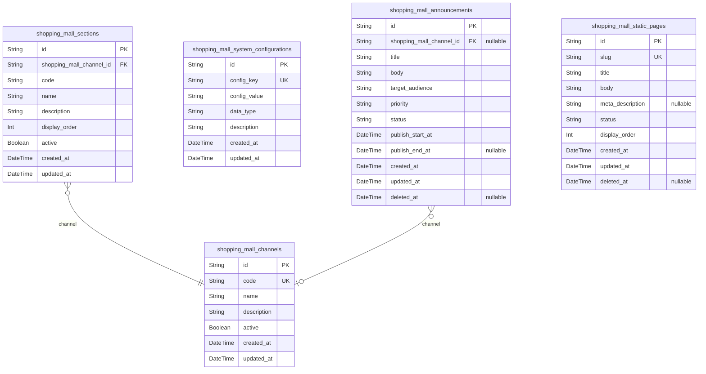
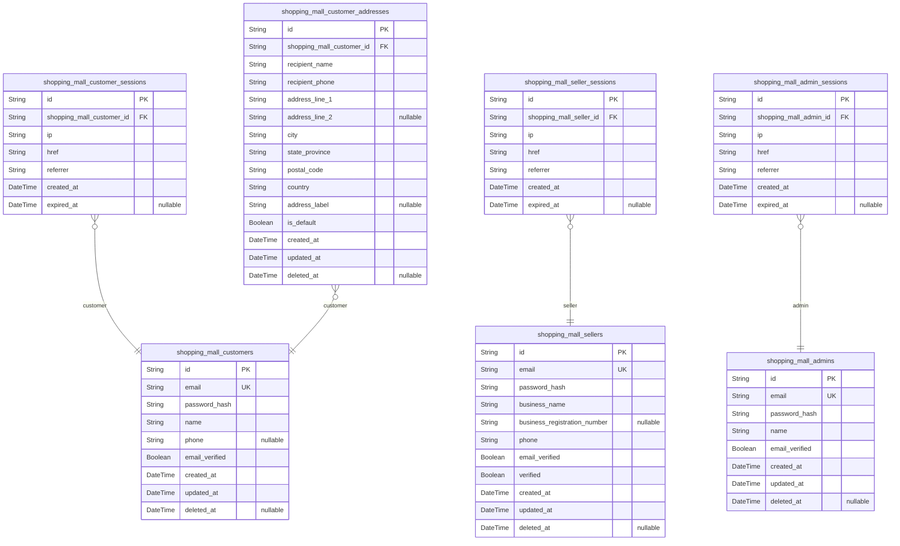
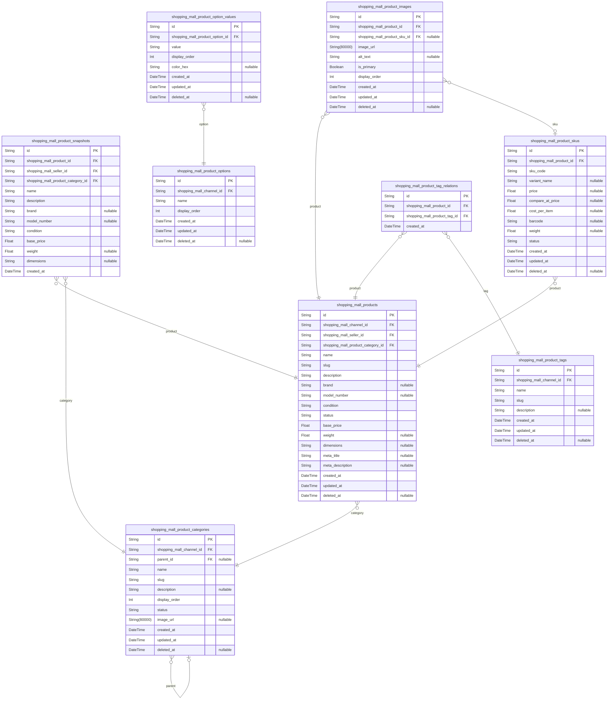
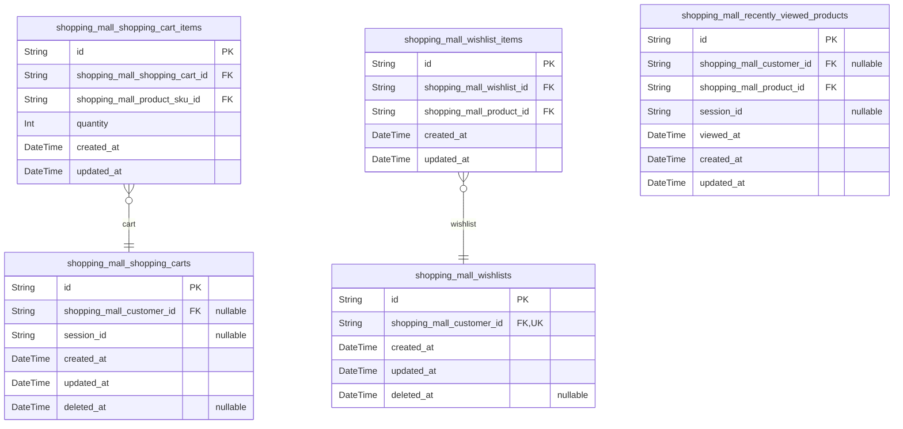
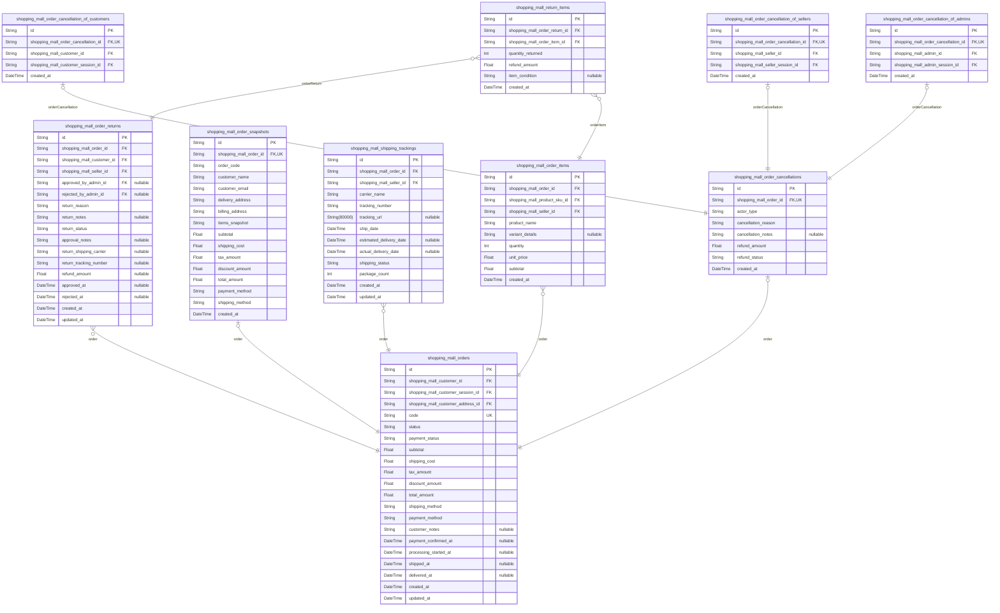
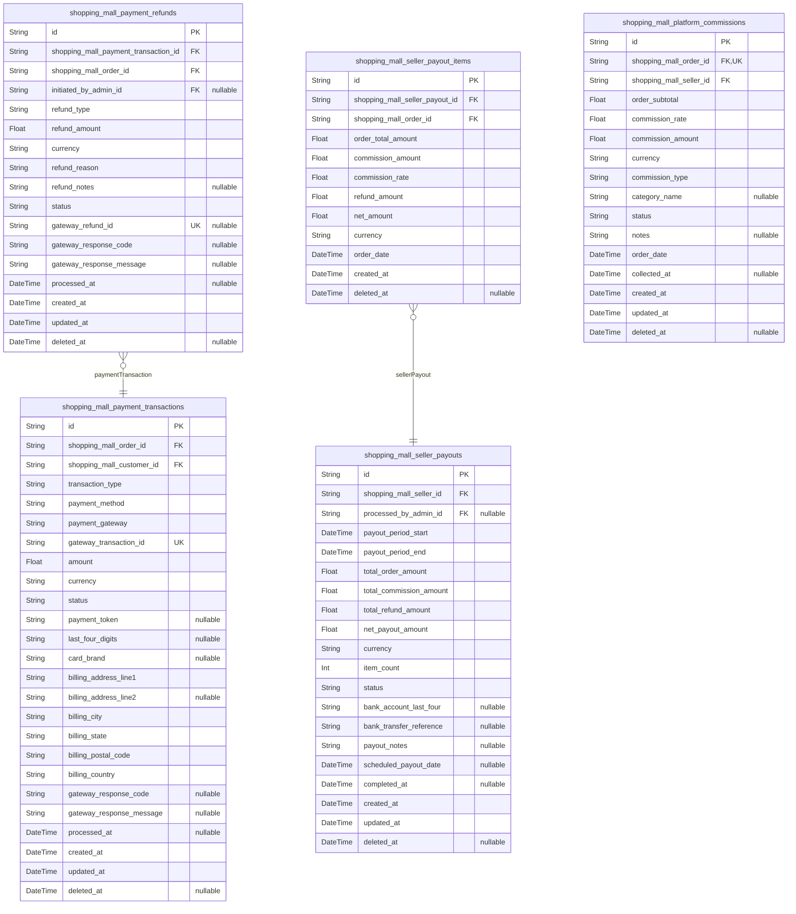
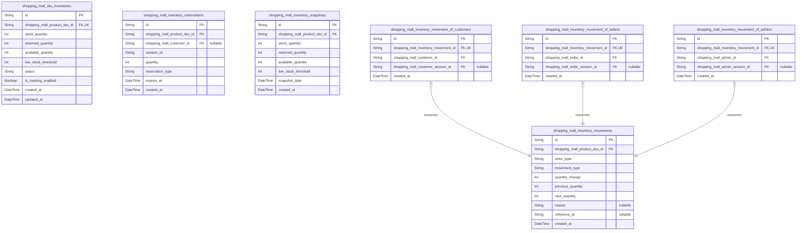
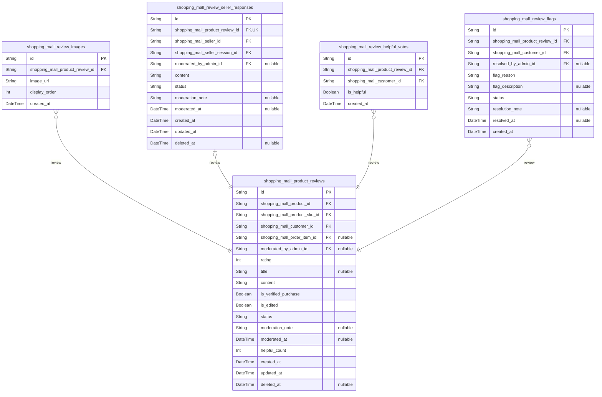
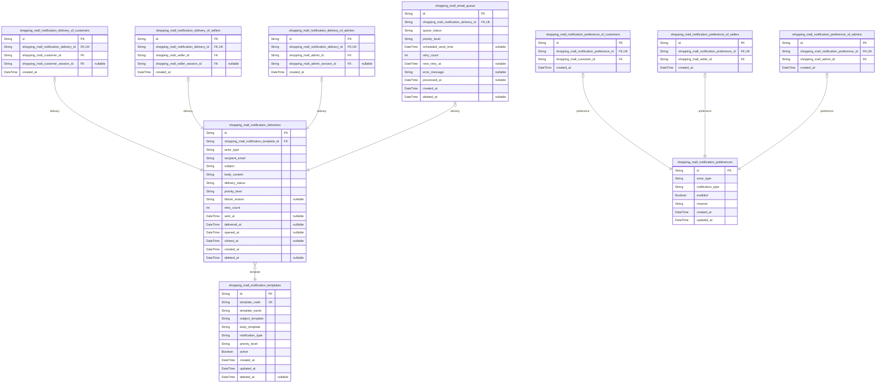
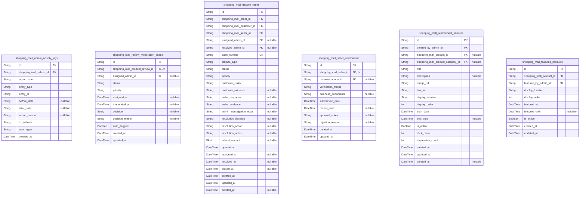

# Prisma Markdown

> Generated by [`prisma-markdown`](https://github.com/samchon/prisma-markdown)

- [Systematic](#systematic)
- [Actors](#actors)
- [Products](#products)
- [Shopping](#shopping)
- [Orders](#orders)
- [Payments](#payments)
- [Inventory](#inventory)
- [Reviews](#reviews)
- [Notifications](#notifications)
- [Administration](#administration)

## Systematic

```mermaid
erDiagram
"shopping_mall_channels" {
  String id PK
  String code UK
  String name
  String description
  Boolean active
  DateTime created_at
  DateTime updated_at
}
"shopping_mall_sections" {
  String id PK
  String shopping_mall_channel_id FK
  String code
  String name
  String description
  Int display_order
  Boolean active
  DateTime created_at
  DateTime updated_at
}
"shopping_mall_system_configurations" {
  String id PK
  String config_key UK
  String config_value
  String data_type
  String description
  DateTime created_at
  DateTime updated_at
}
"shopping_mall_announcements" {
  String id PK
  String shopping_mall_channel_id FK "nullable"
  String title
  String body
  String target_audience
  String priority
  String status
  DateTime publish_start_at
  DateTime publish_end_at "nullable"
  DateTime created_at
  DateTime updated_at
  DateTime deleted_at "nullable"
}
"shopping_mall_static_pages" {
  String id PK
  String slug UK
  String title
  String body
  String meta_description "nullable"
  String status
  Int display_order
  DateTime created_at
  DateTime updated_at
  DateTime deleted_at "nullable"
}
"shopping_mall_sections" }o--|| "shopping_mall_channels" : channel
"shopping_mall_announcements" }o--o| "shopping_mall_channels" : channel
```

### `shopping_mall_channels`

Sales channels through which customers access the platform. Represents
different access points such as web storefront, mobile application, API
marketplace, or partner integrations. Each channel may have distinct
configurations, sections, and operational parameters. Referenced by
[shopping_mall_sections](#shopping_mall_sections) for channel-specific content organization.

Properties as follows:

- `id`: Primary Key.
- `code`
  > Unique business identifier for the channel. Examples: WEB, MOBILE_APP,
  > API, PARTNER_PORTAL. Used for programmatic channel reference.
- `name`
  > Human-readable display name of the channel. Examples: Web Storefront,
  > Mobile Application, API Marketplace.
- `description`
  > Detailed description of the channel purpose and characteristics. Explains
  > how customers access the platform through this channel.
- `active`
  > Whether this channel is currently operational and accepting traffic.
  > Inactive channels are hidden from customer access but configuration is
  > preserved.
- `created_at`: Timestamp when this channel was created in the system.
- `updated_at`: Timestamp when this channel configuration was last modified.

### `shopping_mall_sections`

Organizational sections within platform channels for grouping products,
content, or features. Examples include category sections like
Electronics, Fashion, Home & Garden, or functional sections like Featured
Products, New Arrivals, Best Sellers. Each section belongs to a specific
channel. Referenced by product categorization and content organization
systems.

Properties as follows:

- `id`: Primary Key.
- `shopping_mall_channel_id`: Channel to which this section belongs. [shopping_mall_channels.id](#shopping_mall_channels).
- `code`
  > Unique business identifier for the section within its channel. Examples:
  > ELECTRONICS, FASHION, HOME_GARDEN. Used for programmatic section
  > reference.
- `name`
  > Human-readable display name of the section. Examples: Electronics,
  > Fashion & Apparel, Home & Garden.
- `description`
  > Detailed description of the section purpose and what content or products
  > it contains. Helps admins understand section organization.
- `display_order`
  > Numeric value controlling the display sequence of sections within a
  > channel. Lower numbers appear first. Allows admins to control section
  > ordering in navigation menus.
- `active`
  > Whether this section is currently visible to users. Inactive sections are
  > hidden but configuration is preserved for future reactivation.
- `created_at`: Timestamp when this section was created.
- `updated_at`: Timestamp when this section configuration was last modified.

### `shopping_mall_system_configurations`

Platform-wide system settings and configuration parameters stored as
key-value pairs. Examples include platform commission rates, feature
toggles, checkout settings, tax calculation rules, email service
settings, payment gateway configurations. Allows admins to control
platform behavior without code deployment. Each configuration has a
unique key for programmatic access.

Properties as follows:

- `id`: Primary Key.
- `config_key`
  > Unique configuration key identifier. Examples: platform.commission_rate,
  > checkout.guest_enabled, email.smtp_host, payment.gateway_mode. Uses dot
  > notation for hierarchical organization.
- `config_value`
  > Configuration value stored as string. Can contain simple values, numbers
  > as strings, or JSON-encoded complex values. Application layer parses
  > based on data_type field.
- `data_type`
  > Data type indicator for parsing config_value. Valid values: string,
  > number, boolean, json. Helps application layer correctly interpret and
  > validate configuration values.
- `description`
  > Human-readable description of what this configuration parameter controls.
  > Provides guidance to admins when modifying settings.
- `created_at`: Timestamp when this configuration was created.
- `updated_at`
  > Timestamp when this configuration value was last modified. Important for
  > tracking configuration changes and troubleshooting.

### `shopping_mall_announcements`

Platform-wide announcements and notices displayed to users. Examples
include maintenance notifications, promotional campaign announcements,
policy updates, special events. Announcements can target specific
audiences (all users, customers only, sellers only, admins only), belong
to specific channels, and have scheduled publication periods. Supports
content lifecycle with draft, published, and archived statuses.

Properties as follows:

- `id`: Primary Key.
- `shopping_mall_channel_id`
  > Channel where this announcement is displayed. {@link
  > shopping_mall_channels.id}. Null indicates announcement is shown across
  > all channels.
- `title`
  > Announcement headline or title. Displayed prominently to attract user
  > attention. Should be concise and descriptive.
- `body`
  > Complete announcement content. Supports rich text or HTML formatting for
  > detailed information, links, and formatting. Contains the full message to
  > be communicated to users.
- `target_audience`
  > Intended audience for this announcement. Valid values: all, customers,
  > sellers, admins. Determines who can see this announcement in the
  > platform.
- `priority`
  > Announcement importance level affecting display prominence. Valid values:
  > normal, important, urgent. Higher priority announcements are displayed
  > more prominently.
- `status`
  > Publication workflow status. Valid values: draft, published, archived.
  > Draft announcements are not visible to users, published are active,
  > archived are historical.
- `publish_start_at`
  > Scheduled start date and time for displaying this announcement.
  > Announcement becomes visible to users at or after this timestamp if
  > status is published.
- `publish_end_at`
  > Scheduled end date and time for displaying this announcement.
  > Announcement is automatically hidden after this timestamp. Null means no
  > end date and announcement remains visible until manually archived.
- `created_at`: Timestamp when this announcement was created.
- `updated_at`: Timestamp when this announcement was last modified.
- `deleted_at`
  > Soft delete timestamp. When set, announcement is marked as deleted but
  > data is preserved for audit trail. Supports announcement lifecycle
  > management.

### `shopping_mall_static_pages`

CMS-managed static content pages for platform information and policies.
Examples include About Us, Terms of Service, Privacy Policy, FAQ, Help
Center, Contact Us, Shipping Policy, Return Policy. Each page has a
unique URL slug and supports draft/published workflow for content
management. Supports SEO optimization with meta descriptions.

Properties as follows:

- `id`: Primary Key.
- `slug`
  > URL-friendly unique identifier for the page. Examples: about-us,
  > privacy-policy, terms-of-service, faq, contact-us. Used in page URLs like
  > /pages/about-us.
- `title`
  > Page title displayed as heading and in browser title bar. Examples: About
  > Us, Privacy Policy, Terms of Service, Frequently Asked Questions.
- `body`
  > Complete page content. Supports rich text or HTML formatting for complex
  > layouts, headings, lists, links, and embedded media. Contains the full
  > page content displayed to users.
- `meta_description`
  > SEO meta description for search engine results. Brief summary of page
  > content (150-160 characters recommended) displayed in search engine
  > snippets.
- `status`
  > Publication workflow status. Valid values: draft, published. Draft pages
  > are not publicly accessible, published pages are visible to all users.
  > Supports content review workflow.
- `display_order`
  > Numeric value controlling the display order in footer menus or
  > navigation. Lower numbers appear first. Allows admins to control page
  > ordering in site navigation.
- `created_at`: Timestamp when this page was created.
- `updated_at`
  > Timestamp when this page content was last modified. Important for
  > tracking content freshness and editorial changes.
- `deleted_at`
  > Soft delete timestamp. When set, page is marked as deleted but content is
  > preserved for audit trail. Supports page lifecycle management and content
  > archival.

## Actors

```mermaid
erDiagram
"shopping_mall_customers" {
  String id PK
  String email UK
  String password_hash
  String name
  String phone "nullable"
  Boolean email_verified
  DateTime created_at
  DateTime updated_at
  DateTime deleted_at "nullable"
}
"shopping_mall_customer_sessions" {
  String id PK
  String shopping_mall_customer_id FK
  String ip
  String href
  String referrer
  DateTime created_at
  DateTime expired_at "nullable"
}
"shopping_mall_sellers" {
  String id PK
  String email UK
  String password_hash
  String business_name
  String business_registration_number "nullable"
  String phone
  Boolean email_verified
  Boolean verified
  DateTime created_at
  DateTime updated_at
  DateTime deleted_at "nullable"
}
"shopping_mall_seller_sessions" {
  String id PK
  String shopping_mall_seller_id FK
  String ip
  String href
  String referrer
  DateTime created_at
  DateTime expired_at "nullable"
}
"shopping_mall_admins" {
  String id PK
  String email UK
  String password_hash
  String name
  Boolean email_verified
  DateTime created_at
  DateTime updated_at
  DateTime deleted_at "nullable"
}
"shopping_mall_admin_sessions" {
  String id PK
  String shopping_mall_admin_id FK
  String ip
  String href
  String referrer
  DateTime created_at
  DateTime expired_at "nullable"
}
"shopping_mall_customer_addresses" {
  String id PK
  String shopping_mall_customer_id FK
  String recipient_name
  String recipient_phone
  String address_line_1
  String address_line_2 "nullable"
  String city
  String state_province
  String postal_code
  String country
  String address_label "nullable"
  Boolean is_default
  DateTime created_at
  DateTime updated_at
  DateTime deleted_at "nullable"
}
"shopping_mall_customer_sessions" }o--|| "shopping_mall_customers" : customer
"shopping_mall_seller_sessions" }o--|| "shopping_mall_sellers" : seller
"shopping_mall_admin_sessions" }o--|| "shopping_mall_admins" : admin
"shopping_mall_customer_addresses" }o--|| "shopping_mall_customers" : customer
```

### `shopping_mall_customers`

Customer accounts representing registered buyers who browse products,
make purchases, and manage their orders. Customers authenticate with
email and password, maintain delivery addresses, shopping carts,
wishlists, and order history. Each customer can have multiple orders and
addresses but requires separate accounts if they also want to be sellers.

Properties as follows:

- `id`: Primary Key.
- `email`
  > Customer email address used for authentication and communications. Must
  > be unique across all customer accounts.
- `password_hash`
  > Hashed password for customer authentication. Never stored in plain text,
  > always hashed using secure one-way hashing algorithm (bcrypt).
- `name`: Customer full name for personalization and order shipping purposes.
- `phone`
  > Customer phone number for order delivery coordination and account
  > recovery.
- `email_verified`
  > Whether the customer has verified their email address through
  > verification link. Required before full account access is granted.
- `created_at`: Timestamp when the customer account was created.
- `updated_at`: Timestamp when the customer account was last updated.
- `deleted_at`
  > Timestamp when the customer account was soft deleted. NULL indicates
  > active account. Used for account suspension and deletion with data
  > retention.

### `shopping_mall_customer_sessions`

Customer authentication sessions for JWT-based session management and
audit trail. Each session represents a customer login instance with
connection context (IP, referrer). Sessions expire after defined timeout
or explicit logout.

Properties as follows:

- `id`: Primary Key.
- `shopping_mall_customer_id`
  > Customer who owns this authentication session. {@link
  > shopping_mall_customers.id}.
- `ip`: IP address from which the customer session was initiated.
- `href`: Connection URL where the session was created.
- `referrer`: Referrer URL indicating how the customer arrived at the platform.
- `created_at`: Timestamp when the session was created (login time).
- `expired_at`
  > Timestamp when the session expires or was terminated. NULL indicates
  > active session.

### `shopping_mall_sellers`

Seller accounts representing vendors who operate storefronts within the
marketplace. Sellers authenticate with business email and password,
manage product catalogs, process orders, and track sales performance.
Each seller undergoes verification before being allowed to list products.

Properties as follows:

- `id`: Primary Key.
- `email`
  > Seller business email address used for authentication and business
  > communications. Must be unique across all seller accounts.
- `password_hash`
  > Hashed password for seller authentication. Never stored in plain text,
  > always hashed using secure one-way hashing algorithm (bcrypt).
- `business_name`: Official business or store name displayed to customers.
- `business_registration_number`
  > Business registration or tax identification number for verification and
  > compliance purposes.
- `phone`: Business phone number for customer service and platform communications.
- `email_verified`
  > Whether the seller has verified their business email address through
  > verification link.
- `verified`
  > Whether the seller account has been verified and approved by platform
  > administrators. Sellers cannot list products until verified.
- `created_at`: Timestamp when the seller account was registered.
- `updated_at`: Timestamp when the seller account information was last updated.
- `deleted_at`
  > Timestamp when the seller account was soft deleted or suspended. NULL
  > indicates active account.

### `shopping_mall_seller_sessions`

Seller authentication sessions for JWT-based session management and audit
trail. Each session represents a seller login instance with connection
context (IP, referrer). Sessions expire after defined timeout or explicit
logout.

Properties as follows:

- `id`: Primary Key.
- `shopping_mall_seller_id`
  > Seller who owns this authentication session. {@link
  > shopping_mall_sellers.id}.
- `ip`: IP address from which the seller session was initiated.
- `href`: Connection URL where the session was created.
- `referrer`: Referrer URL indicating how the seller arrived at the platform.
- `created_at`: Timestamp when the session was created (login time).
- `expired_at`
  > Timestamp when the session expires or was terminated. NULL indicates
  > active session.

### `shopping_mall_admins`

Administrator accounts with elevated permissions to manage the entire
marketplace ecosystem. Admins oversee users, orders, products, reviews,
disputes, and system configuration. Admin accounts are created only by
existing admins, never through public registration.

Properties as follows:

- `id`: Primary Key.
- `email`
  > Administrator email address used for authentication and admin
  > communications. Must be unique across all admin accounts.
- `password_hash`
  > Hashed password for admin authentication. Never stored in plain text,
  > always hashed using secure one-way hashing algorithm (bcrypt).
- `name`: Administrator full name for identification in audit logs and admin panel.
- `email_verified`
  > Whether the admin has verified their email address. Required before full
  > admin access is granted.
- `created_at`: Timestamp when the admin account was created.
- `updated_at`: Timestamp when the admin account was last updated.
- `deleted_at`
  > Timestamp when the admin account was soft deleted or deactivated. NULL
  > indicates active account.

### `shopping_mall_admin_sessions`

Administrator authentication sessions for JWT-based session management
and audit trail. Each session represents an admin login instance with
connection context (IP, referrer). Admin sessions have shorter expiration
for enhanced security.

Properties as follows:

- `id`: Primary Key.
- `shopping_mall_admin_id`
  > Administrator who owns this authentication session. {@link
  > shopping_mall_admins.id}.
- `ip`: IP address from which the admin session was initiated.
- `href`: Connection URL where the session was created.
- `referrer`: Referrer URL indicating how the admin arrived at the platform.
- `created_at`: Timestamp when the session was created (login time).
- `expired_at`
  > Timestamp when the session expires or was terminated. NULL indicates
  > active session.

### `shopping_mall_customer_addresses`

Delivery addresses saved by customers for order shipping. Each customer
can maintain multiple addresses with one marked as default. Addresses
store recipient information, full address details, and are used during
checkout for order fulfillment.

Properties as follows:

- `id`: Primary Key.
- `shopping_mall_customer_id`
  > Customer who owns this delivery address. {@link
  > shopping_mall_customers.id}.
- `recipient_name`: Full name of the person who will receive deliveries at this address.
- `recipient_phone`: Phone number for delivery coordination and contact.
- `address_line_1`: Primary street address or building information.
- `address_line_2`
  > Secondary address information such as apartment number, suite, or unit
  > number.
- `city`: City or locality name for the delivery address.
- `state_province`: State, province, or region name for the delivery address.
- `postal_code`: Postal code or ZIP code for the delivery address.
- `country`: Country name or code for the delivery address.
- `address_label`
  > Optional label for the address such as Home, Office, or Warehouse for
  > easy identification.
- `is_default`
  > Whether this is the customer's default delivery address. Used to
  > pre-select address during checkout. Only one address per customer should
  > have this set to true.
- `created_at`: Timestamp when the address was added to customer's address book.
- `updated_at`: Timestamp when the address information was last modified.
- `deleted_at`
  > Timestamp when the address was deleted from customer's address book. NULL
  > indicates active address. Deleted addresses are retained for historical
  > order records.

## Products

```mermaid
erDiagram
"shopping_mall_product_categories" {
  String id PK
  String shopping_mall_channel_id FK
  String parent_id FK "nullable"
  String name
  String slug
  String description "nullable"
  Int display_order
  String status
  String(80000) image_url "nullable"
  DateTime created_at
  DateTime updated_at
  DateTime deleted_at "nullable"
}
"shopping_mall_products" {
  String id PK
  String shopping_mall_channel_id FK
  String shopping_mall_seller_id FK
  String shopping_mall_product_category_id FK
  String name
  String slug
  String description
  String brand "nullable"
  String model_number "nullable"
  String condition
  String status
  Float base_price
  Float weight "nullable"
  String dimensions "nullable"
  String meta_title "nullable"
  String meta_description "nullable"
  DateTime created_at
  DateTime updated_at
  DateTime deleted_at "nullable"
}
"shopping_mall_product_snapshots" {
  String id PK
  String shopping_mall_product_id FK
  String shopping_mall_seller_id FK
  String shopping_mall_product_category_id FK
  String name
  String description
  String brand "nullable"
  String model_number "nullable"
  String condition
  Float base_price
  Float weight "nullable"
  String dimensions "nullable"
  DateTime created_at
}
"shopping_mall_product_options" {
  String id PK
  String shopping_mall_channel_id FK
  String name
  Int display_order
  DateTime created_at
  DateTime updated_at
  DateTime deleted_at "nullable"
}
"shopping_mall_product_option_values" {
  String id PK
  String shopping_mall_product_option_id FK
  String value
  Int display_order
  String color_hex "nullable"
  DateTime created_at
  DateTime updated_at
  DateTime deleted_at "nullable"
}
"shopping_mall_product_skus" {
  String id PK
  String shopping_mall_product_id FK
  String sku_code
  String variant_name "nullable"
  Float price "nullable"
  Float compare_at_price "nullable"
  Float cost_per_item "nullable"
  String barcode "nullable"
  Float weight "nullable"
  String status
  DateTime created_at
  DateTime updated_at
  DateTime deleted_at "nullable"
}
"shopping_mall_product_images" {
  String id PK
  String shopping_mall_product_id FK
  String shopping_mall_product_sku_id FK "nullable"
  String(80000) image_url
  String alt_text "nullable"
  Boolean is_primary
  Int display_order
  DateTime created_at
  DateTime updated_at
  DateTime deleted_at "nullable"
}
"shopping_mall_product_tags" {
  String id PK
  String shopping_mall_channel_id FK
  String name
  String slug
  String description "nullable"
  DateTime created_at
  DateTime updated_at
  DateTime deleted_at "nullable"
}
"shopping_mall_product_tag_relations" {
  String id PK
  String shopping_mall_product_id FK
  String shopping_mall_product_tag_id FK
  DateTime created_at
}
"shopping_mall_product_categories" }o--o| "shopping_mall_product_categories" : parent
"shopping_mall_products" }o--|| "shopping_mall_product_categories" : category
"shopping_mall_product_snapshots" }o--|| "shopping_mall_products" : product
"shopping_mall_product_snapshots" }o--|| "shopping_mall_product_categories" : category
"shopping_mall_product_option_values" }o--|| "shopping_mall_product_options" : option
"shopping_mall_product_skus" }o--|| "shopping_mall_products" : product
"shopping_mall_product_images" }o--|| "shopping_mall_products" : product
"shopping_mall_product_images" }o--o| "shopping_mall_product_skus" : sku
"shopping_mall_product_tag_relations" }o--|| "shopping_mall_products" : product
"shopping_mall_product_tag_relations" }o--|| "shopping_mall_product_tags" : tag
```

### `shopping_mall_product_categories`

Product category taxonomy supporting hierarchical organization of
products. Categories can have parent categories to create multi-level
hierarchies (e.g., Electronics > Computers > Laptops). Each category has
unique identification, display information, and position in the category
tree. Categories enable customers to browse products by classification
and support faceted navigation.

Properties as follows:

- `id`: Primary Key.
- `shopping_mall_channel_id`: Channel to which this category belongs. [shopping_mall_channels.id](#shopping_mall_channels).
- `parent_id`
  > Parent category for hierarchical taxonomy. {@link
  > shopping_mall_product_categories.id}. Null for top-level categories.
- `name`
  > Category name displayed to users (e.g., Electronics, Fashion, Home &
  > Garden).
- `slug`
  > URL-friendly category identifier for SEO and routing (e.g., electronics,
  > fashion-apparel).
- `description`: Category description explaining the types of products in this category.
- `display_order`
  > Display order for sorting categories at the same hierarchy level. Lower
  > numbers appear first.
- `status`
  > Category status: active (visible to customers), inactive (hidden but
  > preserved).
- `image_url`: Category icon or banner image URL for visual display.
- `created_at`: Timestamp when the category was created.
- `updated_at`: Timestamp when the category was last modified.
- `deleted_at`: Soft delete timestamp. Non-null when category is deleted.

### `shopping_mall_products`

Core product entity representing sellable items in the marketplace. Each
product is owned by a seller and belongs to a category. Products contain
descriptive information and can have multiple variants (SKUs) with
different attributes. Products serve as the foundation for the catalog,
with SKUs representing the actual purchasable inventory units.

Properties as follows:

- `id`: Primary Key.
- `shopping_mall_channel_id`: Channel where this product is listed. [shopping_mall_channels.id](#shopping_mall_channels).
- `shopping_mall_seller_id`
  > Seller who owns and manages this product. {@link
  > shopping_mall_sellers.id}.
- `shopping_mall_product_category_id`
  > Primary category classification for this product. {@link
  > shopping_mall_product_categories.id}.
- `name`: Product name or title displayed to customers (3-200 characters).
- `slug`: URL-friendly product identifier for SEO and routing.
- `description`
  > Detailed product description with rich text content (minimum 20
  > characters).
- `brand`: Product brand name or manufacturer.
- `model_number`: Manufacturer model number or part number for product identification.
- `condition`: Product condition: new, refurbished, or used.
- `status`
  > Product lifecycle status: draft (not visible), active (published),
  > inactive (hidden), archived (permanently removed from catalog).
- `base_price`
  > Base selling price before variant adjustments or discounts. Must be
  > positive.
- `weight`: Product weight in kilograms for shipping calculations.
- `dimensions`: Product dimensions in format length×width×height (e.g., 10×8×5 cm).
- `meta_title`: SEO meta title for search engine optimization.
- `meta_description`: SEO meta description for search engine results.
- `created_at`: Timestamp when the product was created.
- `updated_at`: Timestamp when the product was last modified.
- `deleted_at`: Soft delete timestamp. Non-null when product is deleted.

### `shopping_mall_product_snapshots`

Historical snapshots of product data preserving point-in-time product
state for audit trails and order records. When product information
changes (price, description, specifications), snapshots maintain the
exact product details as they were when customers placed orders. This
ensures order history accuracy and supports regulatory compliance.

Properties as follows:

- `id`: Primary Key.
- `shopping_mall_product_id`
  > Product for which this snapshot was created. {@link
  > shopping_mall_products.id}.
- `shopping_mall_seller_id`
  > Seller who owned the product at snapshot time. {@link
  > shopping_mall_sellers.id}.
- `shopping_mall_product_category_id`
  > Category the product belonged to at snapshot time. {@link
  > shopping_mall_product_categories.id}.
- `name`: Product name at snapshot time.
- `description`: Product description at snapshot time.
- `brand`: Product brand at snapshot time.
- `model_number`: Model number at snapshot time.
- `condition`: Product condition at snapshot time: new, refurbished, or used.
- `base_price`: Base price at snapshot time.
- `weight`: Product weight at snapshot time.
- `dimensions`: Product dimensions at snapshot time.
- `created_at`: Timestamp when this snapshot was created.

### `shopping_mall_product_options`

Product variant option types that define how products can vary (e.g.,
Color, Size, Material, Style). Each option type can be reused across
multiple products. Options have values that represent specific choices
customers can select. This enables the product variant system where
products can have multiple SKUs based on option combinations.

Properties as follows:

- `id`: Primary Key.
- `shopping_mall_channel_id`: Channel where this option is defined. [shopping_mall_channels.id](#shopping_mall_channels).
- `name`: Option type name (e.g., Color, Size, Material, Capacity, Style).
- `display_order`
  > Display order for presenting options to customers. Lower numbers appear
  > first.
- `created_at`: Timestamp when the option type was created.
- `updated_at`: Timestamp when the option type was last modified.
- `deleted_at`: Soft delete timestamp. Non-null when option type is deleted.

### `shopping_mall_product_option_values`

Specific values for product option types (e.g., Red/Blue/Green for Color
option, S/M/L/XL for Size option). Each value belongs to an option type
and can be assigned to product SKUs. Option values enable customers to
select specific product variants and help generate unique SKU
combinations.

Properties as follows:

- `id`: Primary Key.
- `shopping_mall_product_option_id`
  > Option type to which this value belongs. {@link
  > shopping_mall_product_options.id}.
- `value`: Specific option value (e.g., Red, Medium, Cotton, 64GB).
- `display_order`
  > Display order for presenting values within the option type. Lower numbers
  > appear first.
- `color_hex`
  > Hexadecimal color code for color swatches (applicable only for Color
  > option types).
- `created_at`: Timestamp when the option value was created.
- `updated_at`: Timestamp when the option value was last modified.
- `deleted_at`: Soft delete timestamp. Non-null when option value is deleted.

### `shopping_mall_product_skus`

Individual Stock Keeping Units representing unique purchasable product
variants. Each SKU represents a specific combination of product options
(e.g., T-Shirt in Red color, Medium size). SKUs have unique identifiers,
individual pricing, and independent inventory tracking. Customers
purchase specific SKUs, not generic products.

Properties as follows:

- `id`: Primary Key.
- `shopping_mall_product_id`: Product to which this SKU belongs. [shopping_mall_products.id](#shopping_mall_products).
- `sku_code`
  > Unique SKU identifier code for inventory tracking and order fulfillment
  > (e.g., TSHIRT-RED-M-001).
- `variant_name`
  > Human-readable variant description combining all option values (e.g., Red
  > / Medium, 64GB / Black).
- `price`
  > SKU-specific selling price. If null, inherits product base_price. Must be
  > positive when set.
- `compare_at_price`: Original price before discount for showing savings to customers.
- `cost_per_item`
  > Seller's cost for this SKU for profit margin calculation. Not visible to
  > customers.
- `barcode`: UPC, EAN, ISBN, or other barcode identifier for the SKU.
- `weight`: SKU-specific weight in kilograms. If null, inherits product weight.
- `status`
  > SKU availability status: active (purchasable), inactive (hidden),
  > discontinued (no longer sold).
- `created_at`: Timestamp when the SKU was created.
- `updated_at`: Timestamp when the SKU was last modified.
- `deleted_at`: Soft delete timestamp. Non-null when SKU is deleted.

### `shopping_mall_product_images`

Product media assets including photos and visual content. Each product
can have multiple images displayed in galleries. Images can be associated
with the overall product or specific SKU variants. Primary images are
featured in listings and search results, while additional images provide
detailed product views.

Properties as follows:

- `id`: Primary Key.
- `shopping_mall_product_id`: Product to which this image belongs. [shopping_mall_products.id](#shopping_mall_products).
- `shopping_mall_product_sku_id`
  > Specific SKU variant this image represents. {@link
  > shopping_mall_product_skus.id}. Null for general product images.
- `image_url`: URL or path to the product image file.
- `alt_text`: Alternative text description for accessibility and SEO.
- `is_primary`
  > Whether this is the primary/featured image displayed in product listings
  > and search results.
- `display_order`: Display order for image gallery sequence. Lower numbers appear first.
- `created_at`: Timestamp when the image was uploaded.
- `updated_at`: Timestamp when the image record was last modified.
- `deleted_at`: Soft delete timestamp. Non-null when image is deleted.

### `shopping_mall_product_tags`

Product tags and keywords for enhanced searchability and product
discovery. Tags are shared across products and enable customers to find
related products through tag-based browsing. Common tags include
materials, features, occasions, or themes (e.g., organic, waterproof,
wedding, vintage).

Properties as follows:

- `id`: Primary Key.
- `shopping_mall_channel_id`: Channel where this tag is used. [shopping_mall_channels.id](#shopping_mall_channels).
- `name`: Tag name or keyword (e.g., organic, waterproof, handmade, eco-friendly).
- `slug`: URL-friendly tag identifier for tag-based browsing pages.
- `description`: Tag description explaining what products with this tag represent.
- `created_at`: Timestamp when the tag was created.
- `updated_at`: Timestamp when the tag was last modified.
- `deleted_at`: Soft delete timestamp. Non-null when tag is deleted.

### `shopping_mall_product_tag_relations`

Many-to-many junction table connecting products to tags. Each product can
have multiple tags, and each tag can be applied to multiple products.
This enables flexible product classification beyond hierarchical
categories and supports tag-based product discovery and filtering.

Properties as follows:

- `id`: Primary Key.
- `shopping_mall_product_id`: Product being tagged. [shopping_mall_products.id](#shopping_mall_products).
- `shopping_mall_product_tag_id`: Tag being applied to the product. [shopping_mall_product_tags.id](#shopping_mall_product_tags).
- `created_at`: Timestamp when the tag was applied to the product.

## Shopping

```mermaid
erDiagram
"shopping_mall_shopping_carts" {
  String id PK
  String shopping_mall_customer_id FK "nullable"
  String session_id "nullable"
  DateTime created_at
  DateTime updated_at
  DateTime deleted_at "nullable"
}
"shopping_mall_shopping_cart_items" {
  String id PK
  String shopping_mall_shopping_cart_id FK
  String shopping_mall_product_sku_id FK
  Int quantity
  DateTime created_at
  DateTime updated_at
}
"shopping_mall_wishlists" {
  String id PK
  String shopping_mall_customer_id FK,UK
  DateTime created_at
  DateTime updated_at
  DateTime deleted_at "nullable"
}
"shopping_mall_wishlist_items" {
  String id PK
  String shopping_mall_wishlist_id FK
  String shopping_mall_product_id FK
  DateTime created_at
  DateTime updated_at
}
"shopping_mall_recently_viewed_products" {
  String id PK
  String shopping_mall_customer_id FK "nullable"
  String shopping_mall_product_id FK
  String session_id "nullable"
  DateTime viewed_at
  DateTime created_at
  DateTime updated_at
}
"shopping_mall_shopping_cart_items" }o--|| "shopping_mall_shopping_carts" : cart
"shopping_mall_wishlist_items" }o--|| "shopping_mall_wishlists" : wishlist
```

### `shopping_mall_shopping_carts`

Shopping cart entity storing temporary product collections before
checkout. Supports both authenticated customer carts (persisted across
sessions for 90 days) and guest carts (session-based, retained for 7
days). Carts maintain items from multiple sellers for unified checkout
experience. Related entities: [shopping_mall_shopping_cart_items](#shopping_mall_shopping_cart_items)
for cart contents, [shopping_mall_customers](#shopping_mall_customers) for authenticated cart
ownership.

Properties as follows:

- `id`: Primary Key.
- `shopping_mall_customer_id`
  > Customer who owns this cart. Nullable to support guest carts identified
  > by session_id. [shopping_mall_customers.id](#shopping_mall_customers)
- `session_id`
  > Session identifier for guest cart tracking. Used when
  > shopping_mall_customer_id is null. Enables cart persistence across guest
  > browsing sessions.
- `created_at`
  > Timestamp when the cart was created. Used for cart expiration and cleanup
  > policies.
- `updated_at`
  > Timestamp when the cart was last modified. Updated when items are added,
  > removed, or quantities changed.
- `deleted_at`
  > Soft delete timestamp for cart cleanup. Guest carts deleted after 7 days,
  > authenticated carts after 90 days of inactivity.

### `shopping_mall_shopping_cart_items`

Individual items within shopping carts. Each cart item references a
specific product SKU with quantity selection. Supports multi-seller carts
where items from different sellers coexist. Cart items are managed
exclusively through cart operations and removed when cart is cleared or
order is placed. Related entities: [shopping_mall_shopping_carts](#shopping_mall_shopping_carts)
for parent cart, [shopping_mall_product_skus](#shopping_mall_product_skus) for product variant.

Properties as follows:

- `id`: Primary Key.
- `shopping_mall_shopping_cart_id`
  > Parent shopping cart containing this item. {@link
  > shopping_mall_shopping_carts.id}
- `shopping_mall_product_sku_id`
  > Specific product SKU variant selected by customer. References exact
  > variant with color, size, and other attributes. {@link
  > shopping_mall_product_skus.id}
- `quantity`
  > Number of units of this SKU in the cart. Must be positive integer between
  > 1-99 per business rules.
- `created_at`: Timestamp when item was added to cart. Used for sorting and display order.
- `updated_at`
  > Timestamp when item quantity was last modified. Updated when customer
  > changes quantity.

### `shopping_mall_wishlists`

Customer wishlist for saving products for future purchase. Each
authenticated customer has exactly one wishlist that persists
indefinitely across sessions. Supports price drop notifications and
back-in-stock alerts. Wishlists are customer-only features not available
to guest users. Related entities: [shopping_mall_wishlist_items](#shopping_mall_wishlist_items)
for saved products, [shopping_mall_customers](#shopping_mall_customers) for ownership.

Properties as follows:

- `id`: Primary Key.
- `shopping_mall_customer_id`
  > Customer who owns this wishlist. Not nullable as wishlists require
  > authentication. [shopping_mall_customers.id](#shopping_mall_customers)
- `created_at`
  > Timestamp when wishlist was created. Typically created on first item
  > addition.
- `updated_at`
  > Timestamp when wishlist was last modified. Updated when items are added
  > or removed.
- `deleted_at`
  > Soft delete timestamp for wishlist cleanup. Used when customer account is
  > deleted.

### `shopping_mall_wishlist_items`

Individual products saved in customer wishlists. Each item references the
product (not specific SKU) as customers may want different variants when
purchasing. System monitors wishlisted products for price changes and
stock availability to send notifications. Items stored in reverse
chronological order (most recent first). Related entities: {@link
shopping_mall_wishlists} for parent wishlist, {@link
shopping_mall_products} for saved product.

Properties as follows:

- `id`: Primary Key.
- `shopping_mall_wishlist_id`: Parent wishlist containing this item. [shopping_mall_wishlists.id](#shopping_mall_wishlists)
- `shopping_mall_product_id`
  > Product saved to wishlist. References product level (not SKU) as
  > customers select variants when adding to cart. {@link
  > shopping_mall_products.id}
- `created_at`
  > Timestamp when product was added to wishlist. Used for sorting wishlist
  > items (most recent first).
- `updated_at`
  > Timestamp when wishlist item was last modified. Tracks any updates to the
  > wishlist entry.

### `shopping_mall_recently_viewed_products`

Tracking of recently viewed products for recommendation and discovery
features. Maintains last 20 products viewed per customer or guest
session. Used for personalized recommendations and Recently Viewed
sections. Automatically cleaned up when exceeding 20 items per
customer/session. Supports both authenticated customers and guest
tracking. Related entities: [shopping_mall_customers](#shopping_mall_customers) for
authenticated tracking, [shopping_mall_products](#shopping_mall_products) for viewed
product.

Properties as follows:

- `id`: Primary Key.
- `shopping_mall_customer_id`
  > Customer who viewed the product. Nullable for guest user tracking via
  > session_id. [shopping_mall_customers.id](#shopping_mall_customers)
- `shopping_mall_product_id`
  > Product that was viewed by the customer or guest. {@link
  > shopping_mall_products.id}
- `session_id`
  > Session identifier for guest user tracking. Used when
  > shopping_mall_customer_id is null to track guest browsing history.
- `viewed_at`
  > Timestamp when the product was viewed. Used for sorting (most recent
  > first) and enforcing 20-item limit per customer.
- `created_at`: Record creation timestamp. Typically same as viewed_at for new entries.
- `updated_at`
  > Record last update timestamp. Updated if same product is viewed again to
  > bump it to top of list.

## Orders

```mermaid
erDiagram
"shopping_mall_orders" {
  String id PK
  String shopping_mall_customer_id FK
  String shopping_mall_customer_session_id FK
  String shopping_mall_customer_address_id FK
  String code UK
  String status
  String payment_status
  Float subtotal
  Float shipping_cost
  Float tax_amount
  Float discount_amount
  Float total_amount
  String shipping_method
  String payment_method
  String customer_notes "nullable"
  DateTime payment_confirmed_at "nullable"
  DateTime processing_started_at "nullable"
  DateTime shipped_at "nullable"
  DateTime delivered_at "nullable"
  DateTime created_at
  DateTime updated_at
}
"shopping_mall_order_items" {
  String id PK
  String shopping_mall_order_id FK
  String shopping_mall_product_sku_id FK
  String shopping_mall_seller_id FK
  String product_name
  String variant_details "nullable"
  Int quantity
  Float unit_price
  Float subtotal
  DateTime created_at
}
"shopping_mall_order_snapshots" {
  String id PK
  String shopping_mall_order_id FK,UK
  String order_code
  String customer_name
  String customer_email
  String delivery_address
  String billing_address
  String items_snapshot
  Float subtotal
  Float shipping_cost
  Float tax_amount
  Float discount_amount
  Float total_amount
  String payment_method
  String shipping_method
  DateTime created_at
}
"shopping_mall_shipping_trackings" {
  String id PK
  String shopping_mall_order_id FK
  String shopping_mall_seller_id FK
  String carrier_name
  String tracking_number
  String(80000) tracking_url "nullable"
  DateTime ship_date
  DateTime estimated_delivery_date "nullable"
  DateTime actual_delivery_date "nullable"
  String shipping_status
  Int package_count
  DateTime created_at
  DateTime updated_at
}
"shopping_mall_order_cancellations" {
  String id PK
  String shopping_mall_order_id FK,UK
  String actor_type
  String cancellation_reason
  String cancellation_notes "nullable"
  Float refund_amount
  String refund_status
  DateTime created_at
}
"shopping_mall_order_returns" {
  String id PK
  String shopping_mall_order_id FK
  String shopping_mall_customer_id FK
  String shopping_mall_seller_id FK
  String approved_by_admin_id FK "nullable"
  String rejected_by_admin_id FK "nullable"
  String return_reason
  String return_notes "nullable"
  String return_status
  String approval_notes "nullable"
  String return_shipping_carrier "nullable"
  String return_tracking_number "nullable"
  Float refund_amount "nullable"
  DateTime approved_at "nullable"
  DateTime rejected_at "nullable"
  DateTime created_at
  DateTime updated_at
}
"shopping_mall_return_items" {
  String id PK
  String shopping_mall_order_return_id FK
  String shopping_mall_order_item_id FK
  Int quantity_returned
  Float refund_amount
  String item_condition "nullable"
  DateTime created_at
}
"shopping_mall_order_cancellation_of_customers" {
  String id PK
  String shopping_mall_order_cancellation_id FK,UK
  String shopping_mall_customer_id FK
  String shopping_mall_customer_session_id FK
  DateTime created_at
}
"shopping_mall_order_cancellation_of_sellers" {
  String id PK
  String shopping_mall_order_cancellation_id FK,UK
  String shopping_mall_seller_id FK
  String shopping_mall_seller_session_id FK
  DateTime created_at
}
"shopping_mall_order_cancellation_of_admins" {
  String id PK
  String shopping_mall_order_cancellation_id FK,UK
  String shopping_mall_admin_id FK
  String shopping_mall_admin_session_id FK
  DateTime created_at
}
"shopping_mall_order_items" }o--|| "shopping_mall_orders" : order
"shopping_mall_order_snapshots" |o--|| "shopping_mall_orders" : order
"shopping_mall_shipping_trackings" }o--|| "shopping_mall_orders" : order
"shopping_mall_order_cancellations" |o--|| "shopping_mall_orders" : order
"shopping_mall_order_returns" }o--|| "shopping_mall_orders" : order
"shopping_mall_return_items" }o--|| "shopping_mall_order_returns" : orderReturn
"shopping_mall_return_items" }o--|| "shopping_mall_order_items" : orderItem
"shopping_mall_order_cancellation_of_customers" |o--|| "shopping_mall_order_cancellations" : orderCancellation
"shopping_mall_order_cancellation_of_sellers" |o--|| "shopping_mall_order_cancellations" : orderCancellation
"shopping_mall_order_cancellation_of_admins" |o--|| "shopping_mall_order_cancellations" : orderCancellation
```

### `shopping_mall_orders`

Customer orders representing completed purchases. Each order contains
items from one or more sellers, delivery information, and payment
details. Orders are permanent transaction records with detailed lifecycle
timestamp tracking through their fulfillment journey. Multi-seller orders
contain items from multiple sellers but present as a single order to
customers.

Properties as follows:

- `id`: Primary Key.
- `shopping_mall_customer_id`: Customer who placed this order. [shopping_mall_customers.id](#shopping_mall_customers)
- `shopping_mall_customer_session_id`
  > Customer session when order was placed for audit trail. {@link
  > shopping_mall_customer_sessions.id}
- `shopping_mall_customer_address_id`
  > Delivery address for this order. {@link
  > shopping_mall_customer_addresses.id}
- `code`
  > Unique order number displayed to customers for reference and tracking.
  > Format: ORD-YYYYMMDD-XXXXXX.
- `status`
  > Current order status tracking fulfillment lifecycle. Values: pending,
  > payment_confirmed, processing, shipped, in_transit, out_for_delivery,
  > delivered, completed, cancelled, refunded, partially_refunded.
- `payment_status`
  > Payment processing status. Values: pending, completed, failed, refunded,
  > partially_refunded.
- `subtotal`: Sum of all order item prices before shipping, taxes, and discounts.
- `shipping_cost`: Total shipping cost for this order across all sellers.
- `tax_amount`: Tax amount calculated based on delivery address jurisdiction.
- `discount_amount`: Total discount amount from promotional codes or campaigns.
- `total_amount`
  > Final order total: subtotal + shipping_cost + tax_amount -
  > discount_amount.
- `shipping_method`
  > Shipping method selected by customer. Values: standard, express,
  > overnight, same_day.
- `payment_method`
  > Payment method used for this order. Values: credit_card, debit_card,
  > paypal, apple_pay, google_pay, bank_transfer.
- `customer_notes`: Optional delivery instructions or notes provided by customer.
- `payment_confirmed_at`
  > Timestamp when payment was successfully confirmed by payment gateway.
  > Critical lifecycle milestone for order processing initiation.
- `processing_started_at`
  > Timestamp when seller marked order as processing and began fulfillment.
  > Tracks seller response time to new orders.
- `shipped_at`
  > Timestamp when order was marked as shipped with tracking information.
  > Indicates fulfillment completion by seller.
- `delivered_at`
  > Timestamp when carrier confirmed successful delivery to customer.
  > Completes the order fulfillment lifecycle.
- `created_at`: Timestamp when order was placed by customer.
- `updated_at`: Timestamp when order was last modified.

### `shopping_mall_order_items`

Individual line items within an order representing specific products
purchased. Each item references the product SKU, captures price at time
of purchase, and identifies which seller fulfills this item. This enables
multi-seller order support where different items in the same order are
fulfilled by different sellers.

Properties as follows:

- `id`: Primary Key.
- `shopping_mall_order_id`: Parent order containing this item. [shopping_mall_orders.id](#shopping_mall_orders)
- `shopping_mall_product_sku_id`: Product SKU variant purchased. [shopping_mall_product_skus.id](#shopping_mall_product_skus)
- `shopping_mall_seller_id`
  > Seller responsible for fulfilling this item. {@link
  > shopping_mall_sellers.id}
- `product_name`
  > Product name at time of purchase, preserved for historical accuracy even
  > if product is later modified or deleted.
- `variant_details`
  > Product variant information at time of purchase (color, size, etc.),
  > preserved as JSON or text.
- `quantity`: Quantity of this item ordered.
- `unit_price`: Price per unit at time of purchase, preserved for historical accuracy.
- `subtotal`: Line item subtotal: quantity × unit_price.
- `created_at`: Timestamp when order item was created.

### `shopping_mall_order_snapshots`

Historical snapshot of complete order state at time of placement.
Captures all order details, items, pricing, and product information as
they existed at purchase time. This denormalized snapshot ensures
historical accuracy even if products, prices, or sellers change later.
One snapshot created per order at placement time.

Properties as follows:

- `id`: Primary Key.
- `shopping_mall_order_id`: Order this snapshot preserves. [shopping_mall_orders.id](#shopping_mall_orders)
- `order_code`: Order number at time of snapshot.
- `customer_name`: Customer name at time of order.
- `customer_email`: Customer email at time of order.
- `delivery_address`
  > Complete delivery address at time of order, stored as formatted text or
  > JSON.
- `billing_address`
  > Complete billing address at time of order, stored as formatted text or
  > JSON.
- `items_snapshot`
  > Complete order items data at time of purchase, stored as JSON containing
  > product names, SKUs, prices, quantities, seller information.
- `subtotal`: Order subtotal at time of purchase.
- `shipping_cost`: Shipping cost at time of purchase.
- `tax_amount`: Tax amount at time of purchase.
- `discount_amount`: Discount amount at time of purchase.
- `total_amount`: Final total amount at time of purchase.
- `payment_method`: Payment method used at time of purchase.
- `shipping_method`: Shipping method selected at time of purchase.
- `created_at`: Timestamp when snapshot was created (order placement time).

### `shopping_mall_shipping_trackings`

Shipping and delivery tracking information for orders. Records carrier
details, tracking numbers, shipment dates, and delivery status. Each
record represents one shipment, with multi-seller orders having multiple
tracking records (one per seller). Updated by sellers when orders ship
and by system when carrier tracking updates are received.

Properties as follows:

- `id`: Primary Key.
- `shopping_mall_order_id`: Order being tracked. [shopping_mall_orders.id](#shopping_mall_orders)
- `shopping_mall_seller_id`
  > Seller responsible for this shipment portion. Required for multi-seller
  > order tracking. [shopping_mall_sellers.id](#shopping_mall_sellers)
- `carrier_name`: Shipping carrier company name (FedEx, UPS, USPS, DHL, etc.).
- `tracking_number`: Carrier tracking number for shipment lookup.
- `tracking_url`: Direct URL to carrier tracking page for this shipment.
- `ship_date`: Date when package was handed to carrier.
- `estimated_delivery_date`: Estimated delivery date based on carrier and shipping method.
- `actual_delivery_date`: Actual delivery timestamp when package was delivered.
- `shipping_status`
  > Current shipping status. Values: in_transit, out_for_delivery, delivered,
  > delivery_failed, returned_to_sender.
- `package_count`: Number of packages in this shipment for multi-package orders.
- `created_at`: Timestamp when tracking information was created.
- `updated_at`: Timestamp when tracking information was last updated.

### `shopping_mall_order_cancellations`

Order cancellation main entity capturing when and why orders were
cancelled. Cancellations can be initiated by customers, sellers, or
admins through polymorphic actor pattern. Records cancellation reason,
refund details, and links to actor-specific subtype tables for session
tracking and actor metadata.

Properties as follows:

- `id`: Primary Key.
- `shopping_mall_order_id`: Order that was cancelled. [shopping_mall_orders.id](#shopping_mall_orders)
- `actor_type`
  > Type of actor who initiated cancellation. Values: customer, seller,
  > admin. Indicates which subtype table contains actor-specific details.
- `cancellation_reason`
  > Reason for order cancellation. Common values: customer_request,
  > out_of_stock, unable_to_ship, pricing_error, fraud_suspicion,
  > customer_changed_mind, other.
- `cancellation_notes`: Additional details or explanation for cancellation.
- `refund_amount`: Amount refunded to customer for this cancellation.
- `refund_status`: Refund processing status. Values: pending, processing, completed, failed.
- `created_at`: Timestamp when cancellation was initiated.

### `shopping_mall_order_returns`

Customer return requests for delivered orders. Customers can request
returns within the return window (typically 30 days) for various reasons
including defects, wrong items, or dissatisfaction. Return requests go
through approval workflow with seller and admin involvement. Requires
independent management including search, moderation, and tracking across
all orders.

Properties as follows:

- `id`: Primary Key.
- `shopping_mall_order_id`: Order for which return is requested. [shopping_mall_orders.id](#shopping_mall_orders)
- `shopping_mall_customer_id`: Customer requesting the return. [shopping_mall_customers.id](#shopping_mall_customers)
- `shopping_mall_seller_id`
  > Seller responsible for processing this return request. Added for direct
  > seller access and query optimization. [shopping_mall_sellers.id](#shopping_mall_sellers)
- `approved_by_admin_id`
  > Admin who approved this return request if admin approval was required.
  > [shopping_mall_admins.id](#shopping_mall_admins)
- `rejected_by_admin_id`
  > Admin who rejected this return request if admin rejection occurred.
  > [shopping_mall_admins.id](#shopping_mall_admins)
- `return_reason`
  > Reason for return request. Values: defective, damaged, wrong_item,
  > not_as_described, quality_issues, changed_mind, other.
- `return_notes`: Detailed explanation from customer about why they are returning items.
- `return_status`
  > Current return request status. Values: requested, pending_approval,
  > approved, rejected, return_shipped, return_received, refund_processing,
  > refunded, cancelled.
- `approval_notes`: Seller or admin notes regarding return approval or rejection decision.
- `return_shipping_carrier`: Carrier customer used to ship return package.
- `return_tracking_number`: Tracking number for return shipment from customer to seller.
- `refund_amount`: Total refund amount approved for this return.
- `approved_at`: Timestamp when return request was approved by seller or admin.
- `rejected_at`: Timestamp when return request was rejected by seller or admin.
- `created_at`: Timestamp when return request was submitted.
- `updated_at`: Timestamp when return request was last updated.

### `shopping_mall_return_items`

Individual items being returned within a return request. Links return
requests to specific order items with quantity and refund amount per
item. Enables partial returns where customers return only some items from
an order.

Properties as follows:

- `id`: Primary Key.
- `shopping_mall_order_return_id`
  > Parent return request containing this item. {@link
  > shopping_mall_order_returns.id}
- `shopping_mall_order_item_id`: Original order item being returned. [shopping_mall_order_items.id](#shopping_mall_order_items)
- `quantity_returned`
  > Quantity of this item being returned (can be less than original quantity
  > ordered).
- `refund_amount`: Refund amount for this specific item: quantity_returned × unit_price.
- `item_condition`
  > Condition of returned item as reported by customer or inspected by
  > seller. Values: unopened, opened_unused, used, damaged, defective.
- `created_at`: Timestamp when return item was added to return request.

### `shopping_mall_order_cancellation_of_customers`

Customer-initiated order cancellation subtype entity. Links cancellations
to customer actor with session context for complete audit trail.
Customers can cancel orders before shipment through customer account
interface.

Properties as follows:

- `id`: Primary Key.
- `shopping_mall_order_cancellation_id`
  > Main cancellation entity this customer cancellation belongs to. {@link
  > shopping_mall_order_cancellations.id}
- `shopping_mall_customer_id`: Customer who cancelled the order. [shopping_mall_customers.id](#shopping_mall_customers)
- `shopping_mall_customer_session_id`
  > Customer session when cancellation was performed. {@link
  > shopping_mall_customer_sessions.id}
- `created_at`: Timestamp when customer cancelled the order.

### `shopping_mall_order_cancellation_of_sellers`

Seller-initiated order cancellation subtype entity. Links cancellations
to seller actor with session context for complete audit trail. Sellers
cancel orders when unable to fulfill due to inventory issues or other
business reasons.

Properties as follows:

- `id`: Primary Key.
- `shopping_mall_order_cancellation_id`
  > Main cancellation entity this seller cancellation belongs to. {@link
  > shopping_mall_order_cancellations.id}
- `shopping_mall_seller_id`: Seller who cancelled the order. [shopping_mall_sellers.id](#shopping_mall_sellers)
- `shopping_mall_seller_session_id`
  > Seller session when cancellation was performed. {@link
  > shopping_mall_seller_sessions.id}
- `created_at`: Timestamp when seller cancelled the order.

### `shopping_mall_order_cancellation_of_admins`

Admin-initiated order cancellation subtype entity. Links cancellations to
admin actor with session context for complete audit trail. Admins cancel
orders for dispute resolution, fraud prevention, or exceptional
circumstances.

Properties as follows:

- `id`: Primary Key.
- `shopping_mall_order_cancellation_id`
  > Main cancellation entity this admin cancellation belongs to. {@link
  > shopping_mall_order_cancellations.id}
- `shopping_mall_admin_id`: Admin who cancelled the order. [shopping_mall_admins.id](#shopping_mall_admins)
- `shopping_mall_admin_session_id`
  > Admin session when cancellation was performed. {@link
  > shopping_mall_admin_sessions.id}
- `created_at`: Timestamp when admin cancelled the order.

## Payments

```mermaid
erDiagram
"shopping_mall_payment_transactions" {
  String id PK
  String shopping_mall_order_id FK
  String shopping_mall_customer_id FK
  String transaction_type
  String payment_method
  String payment_gateway
  String gateway_transaction_id UK
  Float amount
  String currency
  String status
  String payment_token "nullable"
  String last_four_digits "nullable"
  String card_brand "nullable"
  String billing_address_line1
  String billing_address_line2 "nullable"
  String billing_city
  String billing_state
  String billing_postal_code
  String billing_country
  String gateway_response_code "nullable"
  String gateway_response_message "nullable"
  DateTime processed_at "nullable"
  DateTime created_at
  DateTime updated_at
  DateTime deleted_at "nullable"
}
"shopping_mall_payment_refunds" {
  String id PK
  String shopping_mall_payment_transaction_id FK
  String shopping_mall_order_id FK
  String initiated_by_admin_id FK "nullable"
  String refund_type
  Float refund_amount
  String currency
  String refund_reason
  String refund_notes "nullable"
  String status
  String gateway_refund_id UK "nullable"
  String gateway_response_code "nullable"
  String gateway_response_message "nullable"
  DateTime processed_at "nullable"
  DateTime created_at
  DateTime updated_at
  DateTime deleted_at "nullable"
}
"shopping_mall_seller_payouts" {
  String id PK
  String shopping_mall_seller_id FK
  String processed_by_admin_id FK "nullable"
  DateTime payout_period_start
  DateTime payout_period_end
  Float total_order_amount
  Float total_commission_amount
  Float total_refund_amount
  Float net_payout_amount
  String currency
  Int item_count
  String status
  String bank_account_last_four "nullable"
  String bank_transfer_reference "nullable"
  String payout_notes "nullable"
  DateTime scheduled_payout_date "nullable"
  DateTime completed_at "nullable"
  DateTime created_at
  DateTime updated_at
  DateTime deleted_at "nullable"
}
"shopping_mall_seller_payout_items" {
  String id PK
  String shopping_mall_seller_payout_id FK
  String shopping_mall_order_id FK
  Float order_total_amount
  Float commission_amount
  Float commission_rate
  Float refund_amount
  Float net_amount
  String currency
  DateTime order_date
  DateTime created_at
  DateTime deleted_at "nullable"
}
"shopping_mall_platform_commissions" {
  String id PK
  String shopping_mall_order_id FK,UK
  String shopping_mall_seller_id FK
  Float order_subtotal
  Float commission_rate
  Float commission_amount
  String currency
  String commission_type
  String category_name "nullable"
  String status
  String notes "nullable"
  DateTime order_date
  DateTime collected_at "nullable"
  DateTime created_at
  DateTime updated_at
  DateTime deleted_at "nullable"
}
"shopping_mall_payment_refunds" }o--|| "shopping_mall_payment_transactions" : paymentTransaction
"shopping_mall_seller_payout_items" }o--|| "shopping_mall_seller_payouts" : sellerPayout
```

### `shopping_mall_payment_transactions`

Payment transaction records capturing all payment processing activities
for customer orders. Each transaction represents a payment attempt or
successful payment processed through the payment gateway. Supports
complete financial audit trails and reconciliation with payment gateway
records. References [shopping_mall_orders](#shopping_mall_orders) for order association.

Properties as follows:

- `id`: Primary Key.
- `shopping_mall_order_id`
  > Order associated with this payment transaction. {@link
  > shopping_mall_orders.id}.
- `shopping_mall_customer_id`
  > Customer who initiated the payment transaction. {@link
  > shopping_mall_customers.id}.
- `transaction_type`
  > Type of payment transaction (payment, authorization, capture, void).
  > Indicates the nature of the payment operation.
- `payment_method`
  > Payment method used for this transaction (credit_card, debit_card,
  > paypal, apple_pay, google_pay, bank_transfer). Identifies how the
  > customer paid.
- `payment_gateway`
  > Payment gateway provider used to process this transaction (stripe,
  > paypal, square, etc.). Identifies the external payment processor.
- `gateway_transaction_id`
  > Unique transaction identifier from the payment gateway. Used for
  > reconciliation with external payment records.
- `amount`
  > Total payment amount in the transaction currency. Represents the monetary
  > value processed.
- `currency`
  > Currency code for the transaction amount (USD, EUR, GBP, etc.). ISO 4217
  > currency code.
- `status`
  > Current status of the payment transaction (pending, processing,
  > completed, failed, cancelled, refunded). Tracks payment lifecycle state.
- `payment_token`
  > Tokenized payment method reference from payment gateway. Secure token for
  > saved payment methods, never raw card numbers.
- `last_four_digits`
  > Last four digits of card number for customer reference. Only stored
  > portion of card number for display purposes.
- `card_brand`
  > Card brand or network (Visa, Mastercard, Amex, Discover). Identifies the
  > card type used for payment.
- `billing_address_line1`
  > Billing address street line 1. Snapshot of billing address for this
  > transaction.
- `billing_address_line2`
  > Billing address street line 2 (apartment, suite, unit). Optional
  > additional address information.
- `billing_city`: Billing address city. City where the payment method is registered.
- `billing_state`: Billing address state or province. State/province for billing address.
- `billing_postal_code`: Billing address postal or ZIP code. Postal code for billing address.
- `billing_country`: Billing address country. ISO country code for billing address.
- `gateway_response_code`
  > Response code from payment gateway. Gateway-specific code indicating
  > transaction result.
- `gateway_response_message`
  > Response message from payment gateway. Human-readable message from
  > gateway about transaction result.
- `processed_at`
  > Timestamp when payment gateway processed the transaction. Records exact
  > processing time from gateway.
- `created_at`
  > Transaction creation timestamp. Records when the payment transaction was
  > initiated.
- `updated_at`
  > Transaction last update timestamp. Tracks when transaction status or
  > details were last modified.
- `deleted_at`
  > Transaction soft deletion timestamp. For audit trail purposes, financial
  > records are never physically deleted.

### `shopping_mall_payment_refunds`

Refund transaction records for processing customer refunds on completed
payments. Each refund represents a monetary return to the customer,
either full or partial. Links to the original payment transaction and the
order being refunded. Supports complete refund workflow from request
through completion. References [shopping_mall_payment_transactions](#shopping_mall_payment_transactions)
and [shopping_mall_orders](#shopping_mall_orders).

Properties as follows:

- `id`: Primary Key.
- `shopping_mall_payment_transaction_id`
  > Original payment transaction being refunded. {@link
  > shopping_mall_payment_transactions.id}.
- `shopping_mall_order_id`
  > Order for which the refund is being processed. {@link
  > shopping_mall_orders.id}.
- `initiated_by_admin_id`
  > Administrator who initiated the refund if admin-processed. {@link
  > shopping_mall_admins.id}.
- `refund_type`
  > Type of refund (full_refund, partial_refund, cancellation_refund,
  > return_refund). Categorizes the refund reason and scope.
- `refund_amount`: Amount being refunded to the customer. Monetary value to be returned.
- `currency`
  > Currency code for the refund amount (USD, EUR, GBP, etc.). ISO 4217
  > currency code.
- `refund_reason`
  > Reason for the refund (customer_request, order_cancelled,
  > product_defective, seller_out_of_stock, admin_resolution, etc.).
  > Documents why the refund was issued.
- `refund_notes`
  > Additional notes or details about the refund. Optional context for the
  > refund transaction.
- `status`
  > Current refund processing status (pending, processing, completed, failed,
  > cancelled). Tracks refund lifecycle.
- `gateway_refund_id`
  > Refund transaction identifier from payment gateway. Used for
  > reconciliation with gateway refund records.
- `gateway_response_code`
  > Response code from payment gateway for refund processing.
  > Gateway-specific code for refund result.
- `gateway_response_message`
  > Response message from payment gateway. Human-readable message about
  > refund processing result.
- `processed_at`
  > Timestamp when the refund was successfully processed by payment gateway.
  > Records exact refund completion time.
- `created_at`: Refund request creation timestamp. Records when the refund was initiated.
- `updated_at`
  > Refund record last update timestamp. Tracks when refund status or details
  > were modified.
- `deleted_at`
  > Refund record soft deletion timestamp. For audit purposes, refund records
  > are never physically deleted.

### `shopping_mall_seller_payouts`

Seller payment settlement records representing batched payouts to sellers
for their fulfilled orders. Each payout aggregates multiple order
payments over a settlement period (weekly, bi-weekly, monthly) and
transfers net amounts to seller bank accounts after platform commission
deductions. Supports complete payout workflow from calculation through
bank transfer completion. References [shopping_mall_sellers](#shopping_mall_sellers).

Properties as follows:

- `id`: Primary Key.
- `shopping_mall_seller_id`: Seller receiving this payout settlement. [shopping_mall_sellers.id](#shopping_mall_sellers).
- `processed_by_admin_id`
  > Administrator who processed the payout if manually triggered. {@link
  > shopping_mall_admins.id}.
- `payout_period_start`
  > Start date of the settlement period covered by this payout. Defines the
  > beginning of the timeframe for included orders.
- `payout_period_end`
  > End date of the settlement period covered by this payout. Defines the end
  > of the timeframe for included orders.
- `total_order_amount`
  > Total gross amount from all orders in this payout period before
  > commission deductions. Sum of all order values.
- `total_commission_amount`
  > Total platform commission deducted from seller earnings. Sum of all
  > commission charges for included orders.
- `total_refund_amount`
  > Total amount refunded during this period that reduces seller earnings.
  > Sum of all refunds processed.
- `net_payout_amount`
  > Net amount to be paid to seller after all deductions. Calculated as
  > total_order_amount - total_commission_amount - total_refund_amount.
- `currency`
  > Currency code for all amounts in this payout (USD, EUR, GBP, etc.). ISO
  > 4217 currency code.
- `item_count`
  > Number of individual order items included in this payout. Count of payout
  > items for this settlement.
- `status`
  > Current payout processing status (pending, ready_for_payout,
  > payout_initiated, completed, failed, cancelled). Tracks payout lifecycle
  > state.
- `bank_account_last_four`
  > Last four digits of seller bank account receiving the payout. Snapshot
  > for verification and audit purposes.
- `bank_transfer_reference`
  > Bank transfer reference number or transaction ID. External reference for
  > bank transfer tracking.
- `payout_notes`
  > Additional notes or comments about the payout. Optional context for
  > special handling or issues.
- `scheduled_payout_date`
  > Scheduled date for payout bank transfer. When the payout is planned to be
  > executed.
- `completed_at`
  > Timestamp when the payout was successfully completed and funds
  > transferred. Records actual payout completion time.
- `created_at`
  > Payout record creation timestamp. Records when the payout batch was
  > calculated and created.
- `updated_at`
  > Payout record last update timestamp. Tracks when payout status or details
  > were modified.
- `deleted_at`
  > Payout record soft deletion timestamp. For audit purposes, payout records
  > are never physically deleted.

### `shopping_mall_seller_payout_items`

Individual order items included in a seller payout batch. Each item
represents a single order's contribution to the seller's payout
settlement, detailing the order amount, commission deducted, and net
earning from that specific order. Provides detailed breakdown of payout
calculations for transparency and reconciliation. References {@link
shopping_mall_seller_payouts} and [shopping_mall_orders](#shopping_mall_orders).

Properties as follows:

- `id`: Primary Key.
- `shopping_mall_seller_payout_id`
  > Parent payout batch containing this item. {@link
  > shopping_mall_seller_payouts.id}.
- `shopping_mall_order_id`
  > Order that generated earnings for this payout item. {@link
  > shopping_mall_orders.id}.
- `order_total_amount`
  > Total order amount before commission deduction. Gross revenue from this
  > order for the seller.
- `commission_amount`
  > Platform commission deducted from this order. Amount retained by platform
  > from this order.
- `commission_rate`
  > Commission percentage rate applied to this order (e.g., 0.15 for 15%).
  > Snapshot of rate at time of order for audit.
- `refund_amount`
  > Refund amount deducted from seller earnings for this order. Amount
  > returned to customer that reduces seller payout.
- `net_amount`
  > Net amount earned by seller from this order after commission and refunds.
  > Calculated as order_total_amount - commission_amount - refund_amount.
- `currency`
  > Currency code for all amounts in this payout item (USD, EUR, GBP, etc.).
  > ISO 4217 currency code.
- `order_date`
  > Date when the original order was placed. Snapshot for payout item
  > tracking and reporting.
- `created_at`
  > Payout item creation timestamp. Records when this item was added to the
  > payout batch.
- `deleted_at`
  > Payout item soft deletion timestamp. For audit purposes, financial
  > records are never physically deleted but can be marked as deleted for
  > corrections or adjustments.

### `shopping_mall_platform_commissions`

Platform commission records tracking commission charges on each order for
platform revenue calculation. Each record represents the commission
amount earned by the platform from a specific order based on the
applicable commission rate. Supports financial reporting, revenue
analytics, and seller commission reconciliation. References {@link
shopping_mall_orders} and [shopping_mall_sellers](#shopping_mall_sellers).

Properties as follows:

- `id`: Primary Key.
- `shopping_mall_order_id`: Order for which commission is calculated. [shopping_mall_orders.id](#shopping_mall_orders).
- `shopping_mall_seller_id`
  > Seller from whom commission is collected. {@link
  > shopping_mall_sellers.id}.
- `order_subtotal`
  > Order subtotal amount (product costs only, excluding shipping and taxes).
  > Base amount for commission calculation.
- `commission_rate`
  > Commission percentage rate applied to this order (e.g., 0.12 for 12%,
  > 0.15 for 15%). Rate effective at time of order placement.
- `commission_amount`
  > Platform commission amount calculated from order subtotal. Calculated as
  > order_subtotal × commission_rate.
- `currency`
  > Currency code for commission amount (USD, EUR, GBP, etc.). ISO 4217
  > currency code.
- `commission_type`
  > Type of commission charge (standard_commission, category_commission,
  > promotional_commission, custom_commission). Categorizes commission
  > calculation method.
- `category_name`
  > Product category name for category-based commission rates. Snapshot of
  > category at time of order for audit.
- `status`
  > Commission collection status (pending, collected, refunded, adjusted,
  > waived). Tracks commission lifecycle state.
- `notes`
  > Additional notes about commission calculation or adjustments. Optional
  > context for special handling.
- `order_date`
  > Date when the order was placed. Snapshot for commission tracking and
  > reporting.
- `collected_at`
  > Timestamp when commission was collected from seller. Records when
  > commission was deducted from seller payout.
- `created_at`
  > Commission record creation timestamp. Records when commission was
  > calculated for the order.
- `updated_at`
  > Commission record last update timestamp. Tracks when commission status or
  > amount was modified.
- `deleted_at`
  > Commission record soft deletion timestamp. For audit purposes, commission
  > records are never physically deleted.

## Inventory

```mermaid
erDiagram
"shopping_mall_sku_inventories" {
  String id PK
  String shopping_mall_product_sku_id FK,UK
  Int stock_quantity
  Int reserved_quantity
  Int available_quantity
  Int low_stock_threshold
  String status
  Boolean is_tracking_enabled
  DateTime created_at
  DateTime updated_at
}
"shopping_mall_inventory_reservations" {
  String id PK
  String shopping_mall_product_sku_id FK
  String shopping_mall_customer_id FK "nullable"
  String session_id
  Int quantity
  String reservation_type
  DateTime expires_at
  DateTime created_at
}
"shopping_mall_inventory_movements" {
  String id PK
  String shopping_mall_product_sku_id FK
  String actor_type
  String movement_type
  Int quantity_change
  Int previous_quantity
  Int new_quantity
  String reason "nullable"
  String reference_id "nullable"
  DateTime created_at
}
"shopping_mall_inventory_snapshots" {
  String id PK
  String shopping_mall_product_sku_id FK
  Int stock_quantity
  Int reserved_quantity
  Int available_quantity
  Int low_stock_threshold
  DateTime snapshot_date
  DateTime created_at
}
"shopping_mall_inventory_movement_of_customers" {
  String id PK
  String shopping_mall_inventory_movement_id FK,UK
  String shopping_mall_customer_id FK
  String shopping_mall_customer_session_id FK "nullable"
  DateTime created_at
}
"shopping_mall_inventory_movement_of_sellers" {
  String id PK
  String shopping_mall_inventory_movement_id FK,UK
  String shopping_mall_seller_id FK
  String shopping_mall_seller_session_id FK "nullable"
  DateTime created_at
}
"shopping_mall_inventory_movement_of_admins" {
  String id PK
  String shopping_mall_inventory_movement_id FK,UK
  String shopping_mall_admin_id FK
  String shopping_mall_admin_session_id FK "nullable"
  DateTime created_at
}
"shopping_mall_inventory_movement_of_customers" |o--|| "shopping_mall_inventory_movements" : movement
"shopping_mall_inventory_movement_of_sellers" |o--|| "shopping_mall_inventory_movements" : movement
"shopping_mall_inventory_movement_of_admins" |o--|| "shopping_mall_inventory_movements" : movement
```

### `shopping_mall_sku_inventories`

Current inventory state for each product SKU tracking stock quantities,
reservations, and availability status. Maintains real-time stock levels
with atomic updates to prevent overselling. Each SKU has exactly one
inventory record. Links to [shopping_mall_product_skus](#shopping_mall_product_skus) for SKU
definitions.

Properties as follows:

- `id`: Primary Key.
- `shopping_mall_product_sku_id`: Product SKU being tracked. [shopping_mall_product_skus.id](#shopping_mall_product_skus)
- `stock_quantity`
  > Total physical stock quantity available in warehouse or store. Updated by
  > seller manual adjustments and system order processing.
- `reserved_quantity`
  > Quantity currently reserved by customers in active checkout sessions.
  > Prevents overselling during concurrent purchases. Auto-released when
  > reservations expire.
- `available_quantity`
  > Quantity available for immediate purchase, calculated as stock_quantity
  > minus reserved_quantity. Denormalized for performance - must be updated
  > atomically with stock_quantity and reserved_quantity changes.
- `low_stock_threshold`
  > Seller-configured threshold for low stock alerts. When available_quantity
  > falls below this value, system triggers low stock notifications to
  > seller. Default value is 10 units if not specified by seller.
- `status`
  > Inventory lifecycle status for business workflow management. Valid
  > values: active (normal operations), discontinued (no longer selling),
  > backordered (accepting orders but out of stock). Controls purchase
  > availability and restock workflows.
- `is_tracking_enabled`
  > Whether inventory tracking is enabled for this SKU. If false, allows
  > unlimited purchases without stock validation (useful for digital products
  > or made-to-order items).
- `created_at`: Timestamp when inventory record was created for this SKU.
- `updated_at`: Timestamp when inventory quantities were last modified.

### `shopping_mall_inventory_reservations`

Temporary inventory reservations during customer checkout process to
prevent overselling. Reserves specific quantities for limited time (15-30
minutes) while customer completes payment. Automatically expires and
releases inventory if checkout not completed. Supports both soft
reservations (cart) and hard reservations (checkout). Links to {@link
shopping_mall_product_skus} for SKU and [shopping_mall_customers](#shopping_mall_customers)
for customer identification.

Properties as follows:

- `id`: Primary Key.
- `shopping_mall_product_sku_id`
  > Product SKU being reserved during checkout. {@link
  > shopping_mall_product_skus.id}
- `shopping_mall_customer_id`
  > Customer who created the reservation. Nullable for guest checkout
  > sessions. [shopping_mall_customers.id](#shopping_mall_customers)
- `session_id`
  > Checkout session identifier for tracking guest user reservations. Used
  > when shopping_mall_customer_id is null to track guest checkout sessions
  > and release reservations on session expiration.
- `quantity`
  > Quantity reserved for this checkout session. Must not exceed available
  > inventory at reservation time.
- `reservation_type`
  > Type of reservation: soft (added to cart, low priority) or hard (in
  > checkout, guaranteed hold). Hard reservations prevent other purchases.
  > Valid values: soft, hard.
- `expires_at`
  > Expiration timestamp for this reservation. Typically 30 minutes for soft
  > reservations, 15 minutes for hard checkout reservations. System
  > auto-releases inventory when this time passes.
- `created_at`: Timestamp when reservation was created.

### `shopping_mall_inventory_movements`

Complete audit trail of all inventory quantity changes with reason
tracking and actor identification. Records every stock adjustment
including seller manual updates, order fulfillments, reservation
conversions, returns, and admin corrections. Immutable append-only log
for compliance and analytics. Links to [shopping_mall_product_skus](#shopping_mall_product_skus)
for SKU tracking.

Properties as follows:

- `id`: Primary Key.
- `shopping_mall_product_sku_id`
  > Product SKU affected by this inventory movement. {@link
  > shopping_mall_product_skus.id}
- `actor_type`
  > Type of actor who triggered this movement: customer (purchase), seller
  > (manual update), admin (correction), system (automated). Indicates which
  > subtype table contains the specific actor reference. Valid values:
  > customer, seller, admin, system.
- `movement_type`
  > Type of inventory movement: manual_increase (seller restock),
  > manual_decrease (seller adjustment), order_deduction (order placed),
  > reservation_created (checkout hold), reservation_released (abandoned
  > cart), reservation_converted (order confirmed), return_credit (item
  > returned), bulk_update (CSV import), admin_adjustment (admin correction).
- `quantity_change`
  > Quantity change amount. Positive for stock increases (restocks, returns),
  > negative for decreases (sales, damages). Zero for status-only changes.
- `previous_quantity`: Stock quantity before this movement for audit trail verification.
- `new_quantity`: Stock quantity after this movement for audit trail verification.
- `reason`
  > Reason for inventory change. Required for manual adjustments (received
  > shipment, damaged goods, inventory correction). Optional for
  > system-generated movements.
- `reference_id`
  > External reference identifier for related entities. Contains order_id for
  > order deductions, reservation_id for reservation movements, or other
  > tracking identifiers.
- `created_at`: Timestamp when this inventory movement occurred.

### `shopping_mall_inventory_snapshots`

Point-in-time snapshots of SKU inventory state for historical reporting,
compliance auditing, and analytics. Captures daily inventory levels to
support trend analysis and discrepancy investigation. Immutable
historical records. Links to [shopping_mall_product_skus](#shopping_mall_product_skus) for SKU
identification.

Properties as follows:

- `id`: Primary Key.
- `shopping_mall_product_sku_id`
  > Product SKU captured in this snapshot. {@link
  > shopping_mall_product_skus.id}
- `stock_quantity`: Total physical stock quantity at snapshot time.
- `reserved_quantity`: Quantity reserved in checkout sessions at snapshot time.
- `available_quantity`: Quantity available for purchase at snapshot time (stock minus reserved).
- `low_stock_threshold`: Low stock alert threshold at snapshot time.
- `snapshot_date`
  > Date and time this snapshot represents. Typically end-of-day snapshots
  > for daily inventory reporting.
- `created_at`: Timestamp when this snapshot record was created.

### `shopping_mall_inventory_movement_of_customers`

Customer-specific inventory movements linking to customer actors. Tracks
inventory changes triggered by customer purchases and order placements.

Properties as follows:

- `id`: Primary Key.
- `shopping_mall_inventory_movement_id`
  > Inventory movement record for this customer action. {@link
  > shopping_mall_inventory_movements.id}
- `shopping_mall_customer_id`
  > Customer who triggered this inventory movement through purchase or order
  > action. [shopping_mall_customers.id](#shopping_mall_customers)
- `shopping_mall_customer_session_id`
  > Customer session when the inventory movement occurred. {@link
  > shopping_mall_customer_sessions.id}
- `created_at`: Timestamp when this customer movement record was created.

### `shopping_mall_inventory_movement_of_sellers`

Seller-specific inventory movements linking to seller actors. Tracks
manual inventory updates, bulk imports, and restocking activities
performed by sellers.

Properties as follows:

- `id`: Primary Key.
- `shopping_mall_inventory_movement_id`
  > Inventory movement record for this seller action. {@link
  > shopping_mall_inventory_movements.id}
- `shopping_mall_seller_id`
  > Seller who performed this inventory update or adjustment. {@link
  > shopping_mall_sellers.id}
- `shopping_mall_seller_session_id`
  > Seller session when the inventory movement occurred. {@link
  > shopping_mall_seller_sessions.id}
- `created_at`: Timestamp when this seller movement record was created.

### `shopping_mall_inventory_movement_of_admins`

Admin-specific inventory movements linking to administrator actors.
Tracks administrative inventory corrections, adjustments, and dispute
resolution actions.

Properties as follows:

- `id`: Primary Key.
- `shopping_mall_inventory_movement_id`
  > Inventory movement record for this admin action. {@link
  > shopping_mall_inventory_movements.id}
- `shopping_mall_admin_id`
  > Administrator who performed this inventory correction or adjustment.
  > [shopping_mall_admins.id](#shopping_mall_admins)
- `shopping_mall_admin_session_id`
  > Admin session when the inventory movement occurred. {@link
  > shopping_mall_admin_sessions.id}
- `created_at`: Timestamp when this admin movement record was created.

## Reviews

```mermaid
erDiagram
"shopping_mall_product_reviews" {
  String id PK
  String shopping_mall_product_id FK
  String shopping_mall_product_sku_id FK
  String shopping_mall_customer_id FK
  String shopping_mall_order_item_id FK "nullable"
  String moderated_by_admin_id FK "nullable"
  Int rating
  String title "nullable"
  String content
  Boolean is_verified_purchase
  Boolean is_edited
  String status
  String moderation_note "nullable"
  DateTime moderated_at "nullable"
  Int helpful_count
  DateTime created_at
  DateTime updated_at
  DateTime deleted_at "nullable"
}
"shopping_mall_review_images" {
  String id PK
  String shopping_mall_product_review_id FK
  String image_url
  Int display_order
  DateTime created_at
}
"shopping_mall_review_seller_responses" {
  String id PK
  String shopping_mall_product_review_id FK,UK
  String shopping_mall_seller_id FK
  String shopping_mall_seller_session_id FK
  String moderated_by_admin_id FK "nullable"
  String content
  String status
  String moderation_note "nullable"
  DateTime moderated_at "nullable"
  DateTime created_at
  DateTime updated_at
  DateTime deleted_at "nullable"
}
"shopping_mall_review_helpful_votes" {
  String id PK
  String shopping_mall_product_review_id FK
  String shopping_mall_customer_id FK
  Boolean is_helpful
  DateTime created_at
}
"shopping_mall_review_flags" {
  String id PK
  String shopping_mall_product_review_id FK
  String shopping_mall_customer_id FK
  String resolved_by_admin_id FK "nullable"
  String flag_reason
  String flag_description "nullable"
  String status
  String resolution_note "nullable"
  DateTime resolved_at "nullable"
  DateTime created_at
}
"shopping_mall_review_images" }o--|| "shopping_mall_product_reviews" : review
"shopping_mall_review_seller_responses" |o--|| "shopping_mall_product_reviews" : review
"shopping_mall_review_helpful_votes" }o--|| "shopping_mall_product_reviews" : review
"shopping_mall_review_flags" }o--|| "shopping_mall_product_reviews" : review
```

### `shopping_mall_product_reviews`

Customer product reviews with ratings, text content, and verified
purchase indicators. Reviews are linked to specific product SKUs (not
just products) to enforce variant-specific reviewing as per business
requirements. Reviews support moderation workflow, customer editing,
seller responses, and helpful voting. Primary entity requiring
independent management for customer review operations and moderation
workflows.

Properties as follows:

- `id`: Primary Key.
- `shopping_mall_product_id`: Product being reviewed. [shopping_mall_products.id](#shopping_mall_products).
- `shopping_mall_product_sku_id`
  > Specific product SKU variant being reviewed. Ensures reviews are linked
  > to exact variants purchased by customer (e.g., specific color/size
  > combination). [shopping_mall_product_skus.id](#shopping_mall_product_skus).
- `shopping_mall_customer_id`: Customer who wrote the review. [shopping_mall_customers.id](#shopping_mall_customers).
- `shopping_mall_order_item_id`
  > Order item linking to verified purchase for verification badge. {@link
  > shopping_mall_order_items.id}.
- `moderated_by_admin_id`: Admin who moderated this review. [shopping_mall_admins.id](#shopping_mall_admins).
- `rating`: Star rating from 1 to 5 stars.
- `title`
  > Review title, maximum 100 characters. Optional field that can be
  > auto-generated if not provided.
- `content`
  > Review text content, minimum 20 characters, maximum 5000 characters.
  > Contains customer feedback and experience.
- `is_verified_purchase`
  > Whether this review is from a verified purchase. True when customer
  > purchased the exact product SKU being reviewed.
- `is_edited`
  > Whether the review has been edited after initial submission. Used to
  > display edited indicator.
- `status`
  > Review moderation status: pending, approved, rejected, removed. Controls
  > public visibility.
- `moderation_note`
  > Admin notes or rejection reason for moderation decisions. Visible to
  > admins only.
- `moderated_at`
  > Timestamp when review was moderated by admin. Null if still pending
  > moderation.
- `helpful_count`
  > Cached count of helpful votes (yes votes minus no votes). Updated when
  > votes change for sorting performance.
- `created_at`: Review submission timestamp.
- `updated_at`: Review last modification timestamp. Updated when customer edits review.
- `deleted_at`
  > Soft delete timestamp. When set, review is hidden from public view but
  > preserved for audit trail.

### `shopping_mall_review_images`

Images uploaded by customers with their product reviews. Supports up to 5
images per review to illustrate customer experience. Subsidiary entity
managed through review APIs.

Properties as follows:

- `id`: Primary Key.
- `shopping_mall_product_review_id`: Review this image belongs to. [shopping_mall_product_reviews.id](#shopping_mall_product_reviews).
- `image_url`
  > URL or path to the uploaded review image. Stored after image processing
  > and optimization.
- `display_order`
  > Display order of this image within the review's image gallery. Lower
  > numbers display first.
- `created_at`: Image upload timestamp.

### `shopping_mall_review_seller_responses`

Seller responses to customer product reviews. Sellers can submit one
response per review for their own products, subject to moderation.
Includes session tracking for complete audit trail compliance. Primary
entity requiring independent management for seller response operations.

Properties as follows:

- `id`: Primary Key.
- `shopping_mall_product_review_id`: Review being responded to. [shopping_mall_product_reviews.id](#shopping_mall_product_reviews).
- `shopping_mall_seller_id`: Seller who wrote the response. [shopping_mall_sellers.id](#shopping_mall_sellers).
- `shopping_mall_seller_session_id`
  > Seller session when response was submitted for audit trail tracking.
  > [shopping_mall_seller_sessions.id](#shopping_mall_seller_sessions).
- `moderated_by_admin_id`: Admin who moderated this seller response. [shopping_mall_admins.id](#shopping_mall_admins).
- `content`
  > Seller response text content, maximum 1000 characters. Professional
  > response to customer review.
- `status`
  > Response moderation status: pending, approved, rejected. Controls public
  > visibility.
- `moderation_note`
  > Admin notes or rejection reason for moderation decisions. Visible to
  > admins and seller.
- `moderated_at`
  > Timestamp when response was moderated by admin. Null if still pending
  > moderation.
- `created_at`: Response submission timestamp.
- `updated_at`: Response last modification timestamp. Updated when seller edits response.
- `deleted_at`
  > Soft delete timestamp. When set, response is hidden from public view but
  > preserved for audit trail.

### `shopping_mall_review_helpful_votes`

Customer votes on review helpfulness. Tracks whether customers found
reviews helpful (yes/no votes). Each customer can vote once per review.
Subsidiary entity managed through review interaction APIs.

Properties as follows:

- `id`: Primary Key.
- `shopping_mall_product_review_id`: Review being voted on. [shopping_mall_product_reviews.id](#shopping_mall_product_reviews).
- `shopping_mall_customer_id`: Customer who cast the vote. [shopping_mall_customers.id](#shopping_mall_customers).
- `is_helpful`: Vote value: true for helpful (yes vote), false for not helpful (no vote).
- `created_at`: Vote submission timestamp.

### `shopping_mall_review_flags`

Customer reports of inappropriate or policy-violating reviews. Tracks
user-reported reviews for moderation queue. Subsidiary entity managed
through moderation workflow.

Properties as follows:

- `id`: Primary Key.
- `shopping_mall_product_review_id`
  > Review being flagged as inappropriate. {@link
  > shopping_mall_product_reviews.id}.
- `shopping_mall_customer_id`: Customer who flagged the review. [shopping_mall_customers.id](#shopping_mall_customers).
- `resolved_by_admin_id`: Admin who resolved this flag. [shopping_mall_admins.id](#shopping_mall_admins).
- `flag_reason`
  > Reason for flagging: offensive content, spam, fake review, irrelevant
  > content, other. Predefined category selected by reporter.
- `flag_description`
  > Additional context provided by customer explaining why review was
  > flagged. Optional detailed explanation.
- `status`
  > Flag resolution status: pending, reviewed, resolved, dismissed. Tracks
  > moderation progress.
- `resolution_note`
  > Admin notes on flag resolution decision. Explains why flag was upheld or
  > dismissed.
- `resolved_at`: Timestamp when flag was resolved by admin. Null if still pending review.
- `created_at`: Flag submission timestamp.

## Notifications

```mermaid
erDiagram
"shopping_mall_notification_templates" {
  String id PK
  String template_code UK
  String template_name
  String subject_template
  String body_template
  String notification_type
  String priority_level
  Boolean active
  DateTime created_at
  DateTime updated_at
  DateTime deleted_at "nullable"
}
"shopping_mall_notification_deliveries" {
  String id PK
  String shopping_mall_notification_template_id FK
  String actor_type
  String recipient_email
  String subject
  String body_content
  String delivery_status
  String priority_level
  String failure_reason "nullable"
  Int retry_count
  DateTime sent_at "nullable"
  DateTime delivered_at "nullable"
  DateTime opened_at "nullable"
  DateTime clicked_at "nullable"
  DateTime created_at
  DateTime deleted_at "nullable"
}
"shopping_mall_notification_delivery_of_customers" {
  String id PK
  String shopping_mall_notification_delivery_id FK,UK
  String shopping_mall_customer_id FK
  String shopping_mall_customer_session_id FK "nullable"
  DateTime created_at
}
"shopping_mall_notification_delivery_of_sellers" {
  String id PK
  String shopping_mall_notification_delivery_id FK,UK
  String shopping_mall_seller_id FK
  String shopping_mall_seller_session_id FK "nullable"
  DateTime created_at
}
"shopping_mall_notification_delivery_of_admins" {
  String id PK
  String shopping_mall_notification_delivery_id FK,UK
  String shopping_mall_admin_id FK
  String shopping_mall_admin_session_id FK "nullable"
  DateTime created_at
}
"shopping_mall_notification_preferences" {
  String id PK
  String actor_type
  String notification_type
  Boolean enabled
  String channel
  DateTime created_at
  DateTime updated_at
}
"shopping_mall_notification_preference_of_customers" {
  String id PK
  String shopping_mall_notification_preference_id FK,UK
  String shopping_mall_customer_id FK
  DateTime created_at
}
"shopping_mall_notification_preference_of_sellers" {
  String id PK
  String shopping_mall_notification_preference_id FK,UK
  String shopping_mall_seller_id FK
  DateTime created_at
}
"shopping_mall_notification_preference_of_admins" {
  String id PK
  String shopping_mall_notification_preference_id FK,UK
  String shopping_mall_admin_id FK
  DateTime created_at
}
"shopping_mall_email_queue" {
  String id PK
  String shopping_mall_notification_delivery_id FK,UK
  String queue_status
  String priority_level
  DateTime scheduled_send_time "nullable"
  Int retry_count
  DateTime next_retry_at "nullable"
  String error_message "nullable"
  DateTime processed_at "nullable"
  DateTime created_at
  DateTime deleted_at "nullable"
}
"shopping_mall_notification_deliveries" }o--|| "shopping_mall_notification_templates" : template
"shopping_mall_notification_delivery_of_customers" |o--|| "shopping_mall_notification_deliveries" : delivery
"shopping_mall_notification_delivery_of_sellers" |o--|| "shopping_mall_notification_deliveries" : delivery
"shopping_mall_notification_delivery_of_admins" |o--|| "shopping_mall_notification_deliveries" : delivery
"shopping_mall_notification_preference_of_customers" |o--|| "shopping_mall_notification_preferences" : preference
"shopping_mall_notification_preference_of_sellers" |o--|| "shopping_mall_notification_preferences" : preference
"shopping_mall_notification_preference_of_admins" |o--|| "shopping_mall_notification_preferences" : preference
"shopping_mall_email_queue" |o--|| "shopping_mall_notification_deliveries" : delivery
```

### `shopping_mall_notification_templates`

Reusable notification message templates for various platform events.
Templates contain message structure with variable placeholders for
dynamic content insertion. Managed by admins to ensure consistent
communication across all notification types including order
confirmations, shipping updates, inventory alerts, and review
notifications.

Properties as follows:

- `id`: Primary Key.
- `template_code`
  > Unique identifier code for the template type (e.g., ORDER_CONFIRMATION,
  > SHIPPING_UPDATE, LOW_STOCK_ALERT). Used by application logic to select
  > appropriate template.
- `template_name`
  > Human-readable name describing the template purpose for admin management
  > interface.
- `subject_template`
  > Email subject line template with variable placeholders (e.g., 'Order
  > {{order_number}} Confirmed'). Variables are replaced with actual values
  > during notification sending.
- `body_template`
  > Email body content template with variable placeholders and formatting.
  > Supports HTML for rich email formatting. Variables are replaced with
  > actual values during notification sending.
- `notification_type`
  > Category of notification for classification purposes (e.g.,
  > transactional, promotional, system, security). Used for organizing
  > templates and applying user preferences.
- `priority_level`
  > Delivery priority level (urgent, high, normal, low). Determines sending
  > speed and queue priority. Urgent notifications sent immediately, low
  > priority can be batched.
- `active`
  > Whether this template is currently active and available for use. Inactive
  > templates are retained for historical reference but not used for new
  > notifications.
- `created_at`: Timestamp when the template was created.
- `updated_at`
  > Timestamp when the template was last modified. Updated when admins change
  > template content or settings.
- `deleted_at`
  > Soft delete timestamp for template lifecycle management. Allows archiving
  > obsolete templates while preserving historical notification records that
  > used them.

### `shopping_mall_notification_deliveries`

Complete tracking record of every notification sent to users. Tracks
delivery status, timestamps, recipient information, and failure reasons
for audit trail and troubleshooting. Supports polymorphic recipients
(customers, sellers, admins) through actor_type pattern.

Properties as follows:

- `id`: Primary Key.
- `shopping_mall_notification_template_id`
  > Template used for this notification delivery. {@link
  > shopping_mall_notification_templates.id}.
- `actor_type`
  > Type of recipient actor (customer, seller, admin). Indicates which
  > subtype table contains the specific recipient reference.
- `recipient_email`
  > Email address where the notification was sent. Captured for delivery
  > tracking and audit purposes.
- `subject`
  > Final rendered email subject line after variable substitution from
  > template.
- `body_content`
  > Final rendered email body content after variable substitution from
  > template. May contain HTML formatting.
- `delivery_status`
  > Current delivery status (queued, sent, delivered, failed, bounced).
  > Tracks notification lifecycle from queuing through final delivery or
  > failure.
- `priority_level`
  > Delivery priority level inherited from template (urgent, high, normal,
  > low). Determines sending order in queue processing.
- `failure_reason`
  > Detailed reason for delivery failure if status is failed or bounced. Used
  > for troubleshooting and improving delivery success rates.
- `retry_count`
  > Number of delivery retry attempts made for this notification. Incremented
  > on each retry for failed deliveries.
- `sent_at`
  > Timestamp when the notification was successfully sent to email service
  > provider. Null if not yet sent.
- `delivered_at`
  > Timestamp when email service provider confirmed successful delivery to
  > recipient inbox. Null if not yet delivered.
- `opened_at`
  > Timestamp when recipient opened the email. Null if not yet opened or
  > tracking not available. Used for email engagement analytics.
- `clicked_at`
  > Timestamp when recipient clicked a link in the email. Null if no clicks
  > or tracking not available. Used for email engagement analytics.
- `created_at`
  > Timestamp when the notification delivery record was created and queued
  > for sending.
- `deleted_at`
  > Soft delete timestamp for audit trail purposes. Allows archiving old
  > delivery records while maintaining historical data.

### `shopping_mall_notification_delivery_of_customers`

Customer-specific notification delivery tracking. Links notification
deliveries to customer recipients with session context for audit trail.

Properties as follows:

- `id`: Primary Key.
- `shopping_mall_notification_delivery_id`
  > Notification delivery record for this customer recipient. {@link
  > shopping_mall_notification_deliveries.id}.
- `shopping_mall_customer_id`
  > Customer who received this notification. {@link
  > shopping_mall_customers.id}.
- `shopping_mall_customer_session_id`
  > Customer session that triggered this notification if applicable. {@link
  > shopping_mall_customer_sessions.id}.
- `created_at`: Timestamp when this customer notification record was created.

### `shopping_mall_notification_delivery_of_sellers`

Seller-specific notification delivery tracking. Links notification
deliveries to seller recipients with session context for audit trail.

Properties as follows:

- `id`: Primary Key.
- `shopping_mall_notification_delivery_id`
  > Notification delivery record for this seller recipient. {@link
  > shopping_mall_notification_deliveries.id}.
- `shopping_mall_seller_id`: Seller who received this notification. [shopping_mall_sellers.id](#shopping_mall_sellers).
- `shopping_mall_seller_session_id`
  > Seller session that triggered this notification if applicable. {@link
  > shopping_mall_seller_sessions.id}.
- `created_at`: Timestamp when this seller notification record was created.

### `shopping_mall_notification_delivery_of_admins`

Admin-specific notification delivery tracking. Links notification
deliveries to admin recipients with session context for audit trail.

Properties as follows:

- `id`: Primary Key.
- `shopping_mall_notification_delivery_id`
  > Notification delivery record for this admin recipient. {@link
  > shopping_mall_notification_deliveries.id}.
- `shopping_mall_admin_id`: Admin who received this notification. [shopping_mall_admins.id](#shopping_mall_admins).
- `shopping_mall_admin_session_id`
  > Admin session that triggered this notification if applicable. {@link
  > shopping_mall_admin_sessions.id}.
- `created_at`: Timestamp when this admin notification record was created.

### `shopping_mall_notification_preferences`

User notification preferences controlling which notification types each
user wants to receive. Allows users to opt-in or opt-out of optional
notifications while critical notifications remain mandatory. Supports
polymorphic user types (customers, sellers, admins) through actor_type
pattern. PRIMARY stance because users independently manage their
preferences across all notification types, requiring search, filtering,
and cross-user analytics capabilities.

Properties as follows:

- `id`: Primary Key.
- `actor_type`
  > Type of user actor (customer, seller, admin). Indicates which subtype
  > table contains the specific user reference.
- `notification_type`
  > Type of notification this preference controls (e.g., order_updates,
  > inventory_alerts, promotional_emails, review_reminders). Matches
  > notification_type in templates.
- `enabled`
  > Whether the user has enabled this notification type. True means user will
  > receive these notifications, false means opt-out.
- `channel`
  > Notification delivery channel for this preference (email, in_platform,
  > sms). Allows per-channel opt-in/opt-out if multiple channels are
  > supported.
- `created_at`: Timestamp when this preference was initially created.
- `updated_at`: Timestamp when the preference was last modified by the user.

### `shopping_mall_notification_preference_of_customers`

Customer-specific notification preferences. Links notification
preferences to customer accounts for preference management.

Properties as follows:

- `id`: Primary Key.
- `shopping_mall_notification_preference_id`
  > Notification preference record for this customer. {@link
  > shopping_mall_notification_preferences.id}.
- `shopping_mall_customer_id`
  > Customer who owns this notification preference. {@link
  > shopping_mall_customers.id}.
- `created_at`: Timestamp when this customer preference record was created.

### `shopping_mall_notification_preference_of_sellers`

Seller-specific notification preferences. Links notification preferences
to seller accounts for preference management.

Properties as follows:

- `id`: Primary Key.
- `shopping_mall_notification_preference_id`
  > Notification preference record for this seller. {@link
  > shopping_mall_notification_preferences.id}.
- `shopping_mall_seller_id`
  > Seller who owns this notification preference. {@link
  > shopping_mall_sellers.id}.
- `created_at`: Timestamp when this seller preference record was created.

### `shopping_mall_notification_preference_of_admins`

Admin-specific notification preferences. Links notification preferences
to admin accounts for preference management.

Properties as follows:

- `id`: Primary Key.
- `shopping_mall_notification_preference_id`
  > Notification preference record for this admin. {@link
  > shopping_mall_notification_preferences.id}.
- `shopping_mall_admin_id`
  > Admin who owns this notification preference. {@link
  > shopping_mall_admins.id}.
- `created_at`: Timestamp when this admin preference record was created.

### `shopping_mall_email_queue`

Asynchronous email processing queue for managing notification delivery
workflow. Queued emails are processed by background workers with retry
logic for failed deliveries. Supports priority-based processing to ensure
urgent notifications send immediately.

Properties as follows:

- `id`: Primary Key.
- `shopping_mall_notification_delivery_id`
  > Notification delivery record that this queue item will process. {@link
  > shopping_mall_notification_deliveries.id}.
- `queue_status`
  > Current processing status of this queue item (pending, processing,
  > completed, failed, cancelled). Tracks queue item lifecycle.
- `priority_level`
  > Priority level for queue processing (urgent, high, normal, low). Higher
  > priority items are processed first by queue workers.
- `scheduled_send_time`
  > Scheduled time for sending this notification. Allows delayed sending for
  > batched or time-optimized notifications. Null for immediate sending.
- `retry_count`
  > Number of processing retry attempts for this queue item. Incremented on
  > each retry for failed processing.
- `next_retry_at`
  > Timestamp for next retry attempt if processing failed. Calculated using
  > exponential backoff strategy. Null if no retry scheduled.
- `error_message`
  > Error message from last processing failure if queue_status is failed.
  > Used for troubleshooting and monitoring queue health.
- `processed_at`
  > Timestamp when the queue item was successfully processed and notification
  > sent. Null if not yet processed.
- `created_at`: Timestamp when this queue item was created and added to processing queue.
- `deleted_at`
  > Soft delete timestamp for audit trail purposes. Allows archiving
  > processed queue items while maintaining historical data.

## Administration

```mermaid
erDiagram
"shopping_mall_admin_activity_logs" {
  String id PK
  String shopping_mall_admin_id FK
  String action_type
  String entity_type
  String entity_id
  String before_data "nullable"
  String after_data "nullable"
  String action_reason "nullable"
  String ip_address
  String user_agent
  DateTime created_at
}
"shopping_mall_review_moderation_queue" {
  String id PK
  String shopping_mall_product_review_id FK,UK
  String assigned_admin_id FK "nullable"
  String status
  String priority
  DateTime assigned_at "nullable"
  DateTime moderated_at "nullable"
  String decision "nullable"
  String decision_reason "nullable"
  Boolean auto_flagged
  DateTime created_at
  DateTime updated_at
}
"shopping_mall_dispute_cases" {
  String id PK
  String shopping_mall_order_id FK
  String shopping_mall_customer_id FK
  String shopping_mall_seller_id FK
  String assigned_admin_id FK "nullable"
  String resolved_admin_id FK "nullable"
  String case_number UK
  String dispute_type
  String status
  String priority
  String customer_claim
  String customer_evidence "nullable"
  String seller_response "nullable"
  String seller_evidence "nullable"
  String admin_investigation_notes "nullable"
  String resolution_decision "nullable"
  String resolution_action "nullable"
  String resolution_notes "nullable"
  Float refund_amount "nullable"
  DateTime opened_at
  DateTime assigned_at "nullable"
  DateTime resolved_at "nullable"
  DateTime closed_at "nullable"
  DateTime created_at
  DateTime updated_at
  DateTime deleted_at "nullable"
}
"shopping_mall_seller_verifications" {
  String id PK
  String shopping_mall_seller_id FK,UK
  String reviewer_admin_id FK "nullable"
  String verification_status
  String business_documents "nullable"
  DateTime submission_date
  DateTime review_date "nullable"
  String approval_notes "nullable"
  String rejection_reason "nullable"
  DateTime created_at
  DateTime updated_at
}
"shopping_mall_promotional_banners" {
  String id PK
  String created_by_admin_id FK
  String shopping_mall_product_id FK "nullable"
  String shopping_mall_product_category_id FK "nullable"
  String title
  String description "nullable"
  String image_url
  String link_url
  String display_location
  Int display_order
  DateTime start_date
  DateTime end_date "nullable"
  Boolean is_active
  Int click_count
  Int impression_count
  DateTime created_at
  DateTime updated_at
  DateTime deleted_at "nullable"
}
"shopping_mall_featured_products" {
  String id PK
  String shopping_mall_product_id FK
  String featured_by_admin_id FK
  String display_location
  Int display_order
  DateTime featured_at
  DateTime featured_until "nullable"
  Boolean is_active
  DateTime created_at
  DateTime updated_at
}
```

### `shopping_mall_admin_activity_logs`

Comprehensive audit trail logging all administrative actions performed by
admins across the platform. Captures complete before/after state changes,
action metadata, and security context for compliance, dispute resolution,
and accountability. This table is system-managed and automatically
populated on every admin operation.

Properties as follows:

- `id`: Primary Key.
- `shopping_mall_admin_id`: Administrator who performed this action. [shopping_mall_admins.id](#shopping_mall_admins).
- `action_type`
  > Type of administrative action performed (e.g., user_suspended,
  > order_refunded, product_deleted, review_approved, seller_verified).
- `entity_type`
  > Type of entity affected by this action (e.g., customer, seller, order,
  > product, review).
- `entity_id`: Unique identifier of the specific entity affected by this action.
- `before_data`
  > JSON representation of entity state before the action was performed,
  > enabling complete audit trail reconstruction.
- `after_data`
  > JSON representation of entity state after the action was performed,
  > capturing the changes made.
- `action_reason`: Admin-provided reason or notes explaining why this action was taken.
- `ip_address`
  > IP address from which the admin performed this action, for security
  > tracking.
- `user_agent`
  > Browser user agent string of the admin session, for security and audit
  > context.
- `created_at`: Timestamp when this administrative action was performed.

### `shopping_mall_review_moderation_queue`

Workflow queue managing the review moderation process. Tracks pending,
in-progress, and completed review moderation tasks assigned to admin
moderators. Supports prioritization and workload distribution across
moderation team.

Properties as follows:

- `id`: Primary Key.
- `shopping_mall_product_review_id`: Product review being moderated. [shopping_mall_product_reviews.id](#shopping_mall_product_reviews).
- `assigned_admin_id`
  > Admin moderator assigned to review this item. {@link
  > shopping_mall_admins.id}.
- `status`: Current moderation status (pending, in_progress, approved, rejected).
- `priority`
  > Moderation priority level (normal, high, urgent) based on flags or
  > content sensitivity.
- `assigned_at`: Timestamp when this moderation task was assigned to an admin.
- `moderated_at`: Timestamp when moderation decision was made and completed.
- `decision`: Moderation decision made by admin (approved, rejected, requires_edit).
- `decision_reason`: Explanation or notes from moderator regarding their decision.
- `auto_flagged`
  > Whether this review was automatically flagged by content filters for
  > moderation.
- `created_at`: Timestamp when this moderation queue entry was created.
- `updated_at`: Timestamp when this moderation queue entry was last updated.

### `shopping_mall_dispute_cases`

Customer-seller dispute resolution cases requiring admin investigation
and decision. Tracks dispute claims, evidence, seller responses, admin
investigation notes, and resolution outcomes. Admins independently
search, assign, investigate, and resolve disputes to maintain marketplace
fairness.

Properties as follows:

- `id`: Primary Key.
- `shopping_mall_order_id`: Order associated with this dispute case. [shopping_mall_orders.id](#shopping_mall_orders).
- `shopping_mall_customer_id`: Customer who initiated this dispute. [shopping_mall_customers.id](#shopping_mall_customers).
- `shopping_mall_seller_id`: Seller involved in this dispute. [shopping_mall_sellers.id](#shopping_mall_sellers).
- `assigned_admin_id`
  > Admin assigned to investigate and resolve this dispute. {@link
  > shopping_mall_admins.id}.
- `resolved_admin_id`
  > Admin who made the final resolution decision. {@link
  > shopping_mall_admins.id}.
- `case_number`
  > Human-readable unique case identifier for reference (e.g.,
  > DISP-20251031-001).
- `dispute_type`
  > Category of dispute (item_not_received, item_damaged, wrong_item,
  > not_as_described, quality_issue, other).
- `status`
  > Current dispute case status (open, under_review, awaiting_customer_info,
  > awaiting_seller_response, resolved, closed).
- `priority`
  > Case priority level (low, normal, high, urgent) based on dispute value
  > and customer impact.
- `customer_claim`
  > Detailed claim description provided by the customer explaining the
  > dispute.
- `customer_evidence`
  > JSON array of evidence URLs (photos, documents) provided by customer to
  > support their claim.
- `seller_response`
  > Seller's response to the customer claim with their explanation or
  > counter-evidence.
- `seller_evidence`: JSON array of evidence URLs provided by seller to support their response.
- `admin_investigation_notes`: Internal notes from admin investigator documenting findings and reasoning.
- `resolution_decision`
  > Final resolution decision (favor_customer, favor_seller, compromise,
  > no_fault).
- `resolution_action`
  > Action taken to resolve dispute (full_refund, partial_refund,
  > replacement, seller_warning, close_no_action).
- `resolution_notes`
  > Admin explanation of resolution decision and actions taken, communicated
  > to both parties.
- `refund_amount`
  > Monetary refund amount issued as part of dispute resolution, if
  > applicable.
- `opened_at`: Timestamp when the dispute case was opened by the customer.
- `assigned_at`: Timestamp when the case was assigned to an admin for investigation.
- `resolved_at`: Timestamp when the dispute was resolved with final decision.
- `closed_at`: Timestamp when the dispute case was officially closed.
- `created_at`: Record creation timestamp.
- `updated_at`: Record last update timestamp.
- `deleted_at`: Soft deletion timestamp for audit trail preservation.

### `shopping_mall_seller_verifications`

Seller account verification records tracking the admin approval workflow
for new seller registrations. Manages verification status, submission
documentation, admin review decisions, and rejection reasons to ensure
only legitimate businesses operate on the platform.

Properties as follows:

- `id`: Primary Key.
- `shopping_mall_seller_id`: Seller account undergoing verification. [shopping_mall_sellers.id](#shopping_mall_sellers).
- `reviewer_admin_id`
  > Admin who reviewed and made verification decision. {@link
  > shopping_mall_admins.id}.
- `verification_status`: Current verification status (pending, under_review, approved, rejected).
- `business_documents`
  > JSON array of URLs to uploaded business verification documents (business
  > license, tax ID, etc.).
- `submission_date`: Timestamp when seller submitted verification request.
- `review_date`: Timestamp when admin completed verification review.
- `approval_notes`: Admin notes recorded during approval process.
- `rejection_reason`: Reason provided by admin for rejecting seller verification.
- `created_at`: Record creation timestamp.
- `updated_at`: Record last update timestamp.

### `shopping_mall_promotional_banners`

Marketing promotional banners displayed on homepage, category pages, or
other strategic locations. Admins create, schedule, and manage banner
campaigns with display periods, positioning, and targeting. Supports
time-based activation for scheduled promotions.

Properties as follows:

- `id`: Primary Key.
- `created_by_admin_id`
  > Admin who created this promotional banner. {@link
  > shopping_mall_admins.id}.
- `shopping_mall_product_id`
  > Optional specific product this banner promotes. {@link
  > shopping_mall_products.id}.
- `shopping_mall_product_category_id`
  > Optional product category this banner promotes. {@link
  > shopping_mall_product_categories.id}.
- `title`: Banner title or headline text for admin reference and optional display.
- `description`
  > Internal description of banner purpose and campaign details for admin
  > reference.
- `image_url`: URL to the banner image asset to be displayed.
- `link_url`
  > Destination URL when customers click on this banner (product page,
  > category page, external URL).
- `display_location`
  > Location where banner should be displayed (homepage_hero,
  > homepage_sidebar, category_top, search_results).
- `display_order`
  > Sort order for multiple banners in the same location (lower numbers
  > display first).
- `start_date`
  > Scheduled start date/time when banner becomes active and visible to
  > customers.
- `end_date`
  > Scheduled end date/time when banner automatically deactivates and becomes
  > hidden.
- `is_active`
  > Manual activation flag allowing admins to enable/disable banner
  > independent of schedule.
- `click_count`: Total number of customer clicks on this banner for performance tracking.
- `impression_count`: Total number of times this banner was displayed to customers.
- `created_at`: Record creation timestamp.
- `updated_at`: Record last update timestamp.
- `deleted_at`
  > Soft deletion timestamp for archiving old campaigns while preserving
  > analytics data.

### `shopping_mall_featured_products`

Junction table managing which products are featured on homepage or
category pages with enhanced visibility. Admins curate featured product
selections to highlight quality products, promotions, or strategic
inventory. Supports time-limited featuring and display ordering.

Properties as follows:

- `id`: Primary Key.
- `shopping_mall_product_id`: Product being featured. [shopping_mall_products.id](#shopping_mall_products).
- `featured_by_admin_id`
  > Admin who added this product to featured list. {@link
  > shopping_mall_admins.id}.
- `display_location`
  > Location where this product is featured (homepage, category_page,
  > search_results).
- `display_order`
  > Sort order for featured products in the same location (lower numbers
  > display first).
- `featured_at`: Timestamp when product was added to featured list.
- `featured_until`
  > Optional end date when product should be automatically removed from
  > featured list.
- `is_active`
  > Manual activation flag allowing admins to temporarily hide featured
  > products without removing them.
- `created_at`: Record creation timestamp.
- `updated_at`: Record last update timestamp.
