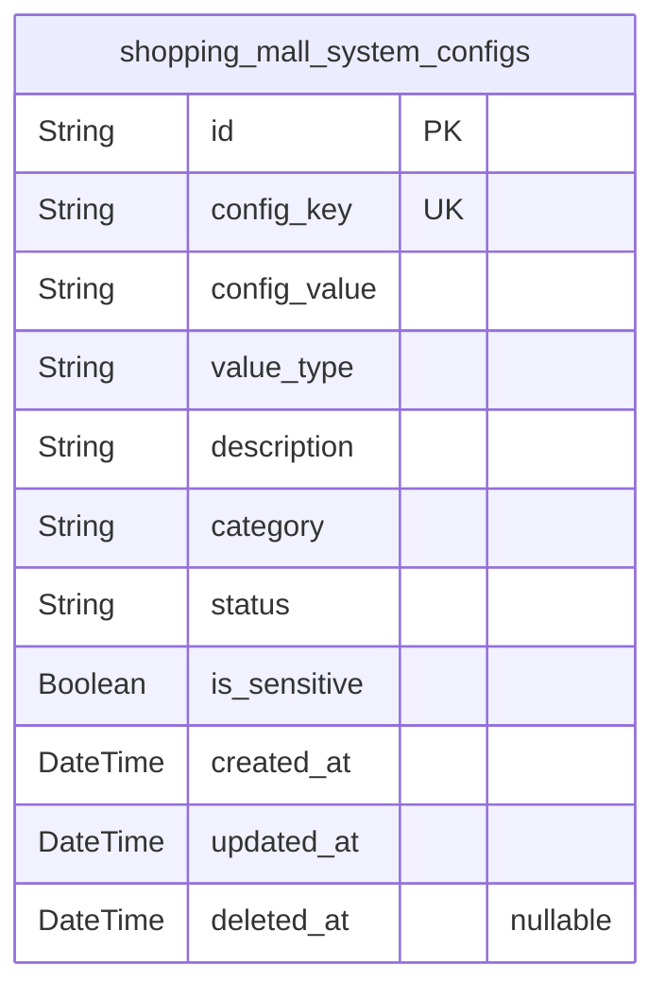
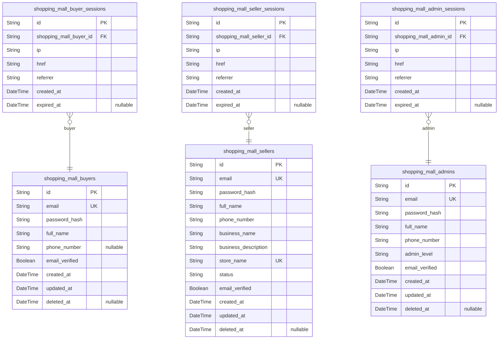
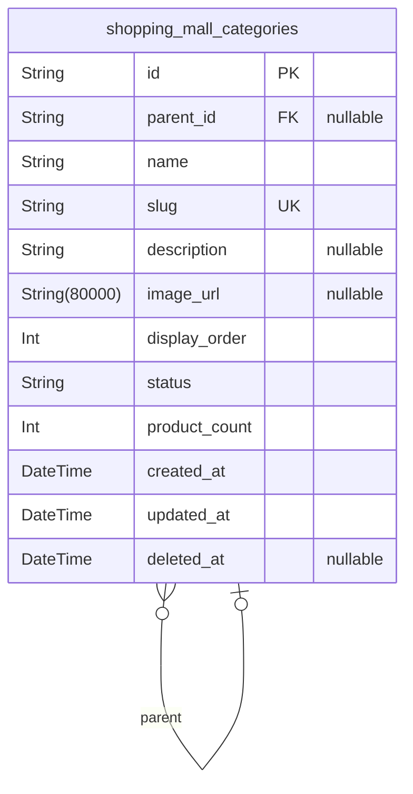
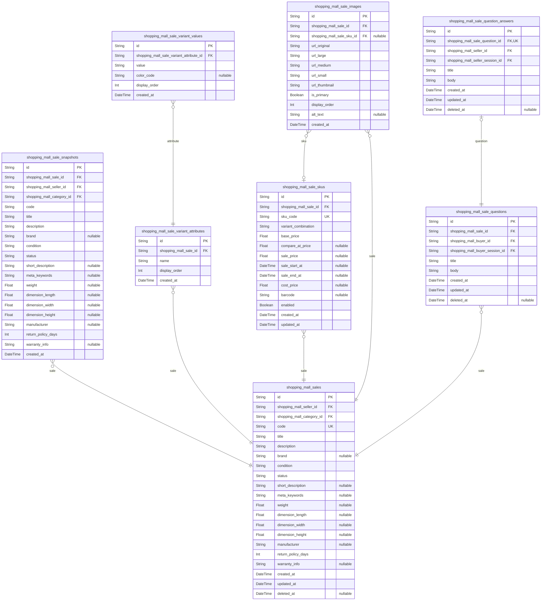
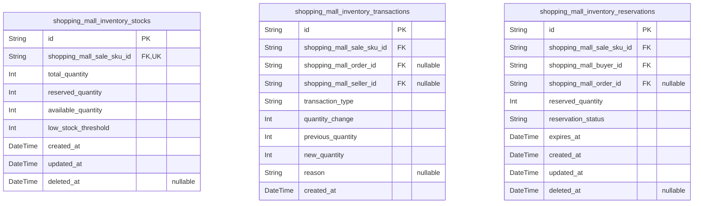
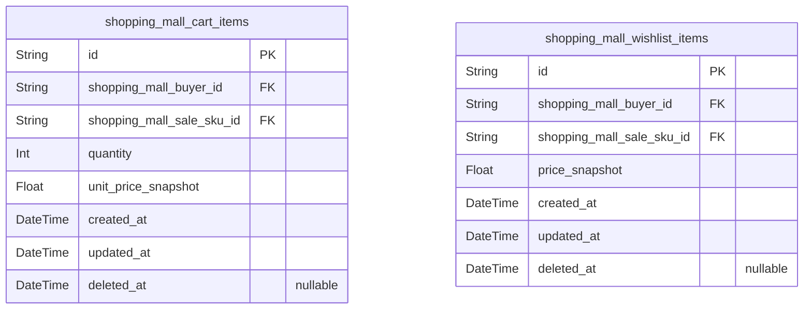
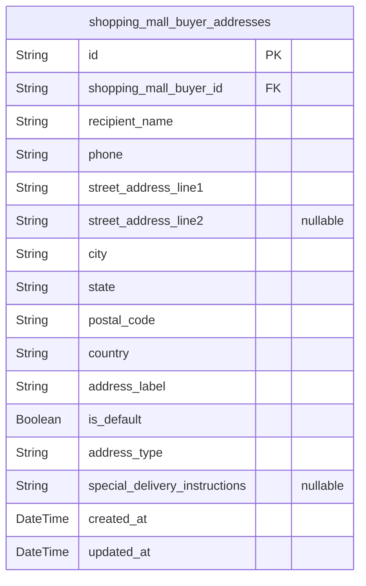
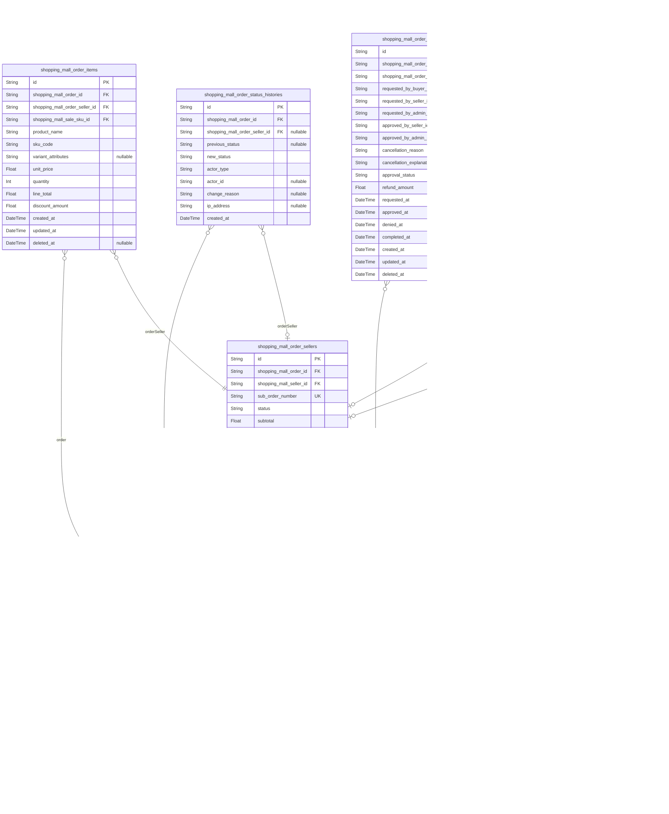
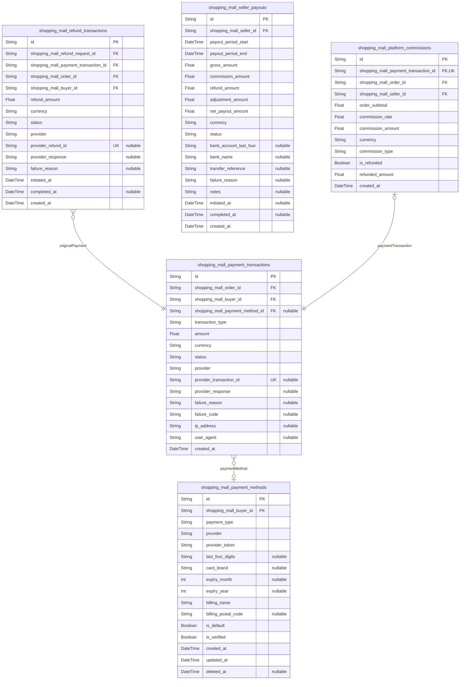
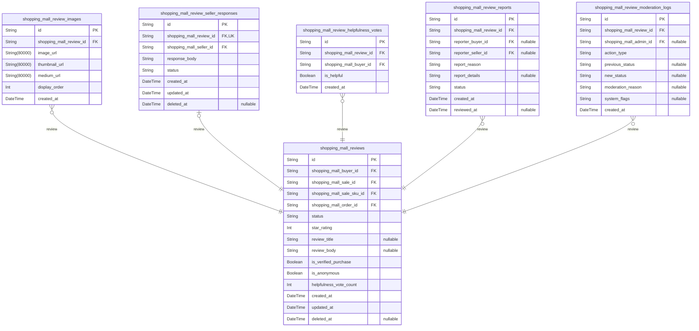

# Prisma Markdown

> Generated by [`prisma-markdown`](https://github.com/samchon/prisma-markdown)

- [Systematic](#systematic)
- [Actors](#actors)
- [Categories](#categories)
- [Products](#products)
- [Inventory](#inventory)
- [Carts](#carts)
- [Addresses](#addresses)
- [Orders](#orders)
- [Payments](#payments)
- [Reviews](#reviews)

## Systematic

```mermaid
erDiagram
"shopping_mall_system_configs" {
  String id PK
  String config_key UK
  String config_value
  String value_type
  String description
  String category
  String status
  Boolean is_sensitive
  DateTime created_at
  DateTime updated_at
  DateTime deleted_at "nullable"
}
```

### `shopping_mall_system_configs`

Platform-wide system configuration settings that control core platform
behavior and features.

This table stores foundational configuration parameters used throughout
the e-commerce shopping mall platform including business settings,
operational parameters, feature flags, and integration configurations.
Each configuration entry is identified by a unique key and contains a
value that can be of various data types.

Configurations include critical platform settings such as default
commission rates, payment gateway credentials, email service settings,
feature toggles, platform branding information, operational hours, tax
calculation rules, and other system-level parameters that affect
platform-wide behavior.

Admins manage these configurations through secure system configuration
interfaces. Changes to configurations are audit-logged with timestamps to
track when settings were modified and by whom. Configurations can be
activated or deactivated using the status field without permanent
deletion, allowing temporary disabling of features or settings.

Soft deletion is supported to maintain configuration history and allow
recovery of accidentally deleted settings. The deleted_at field enables
filtering out deleted configurations while preserving them for audit
trails and potential restoration.

Properties as follows:

- `id`: Primary Key.
- `config_key`
  > Unique configuration key identifier used to reference this setting
  > throughout the platform. Examples: platform_name,
  > default_commission_rate, max_product_images, free_shipping_threshold,
  > email_smtp_host, payment_gateway_mode.
- `config_value`
  > Configuration value stored as string. Can represent various data types
  > including text, numbers, booleans, or JSON-encoded complex values.
  > Examples: 15.5 for commission percentage, true for feature flags,
  > {api_key: xxx, secret: yyy} for integration configs.
- `value_type`
  > Data type indicator for the configuration value to assist with proper
  > parsing and validation. Valid values: string, integer, decimal, boolean,
  > json, url. Helps application layer interpret the config_value correctly.
- `description`
  > Human-readable description explaining the purpose and usage of this
  > configuration setting. Helps admins understand what the configuration
  > controls and the impact of changing its value. Should include valid value
  > examples and constraints.
- `category`
  > Configuration category for organizational grouping. Examples: payment,
  > shipping, email, platform, commission, features, security. Enables
  > filtering and organizing configurations by functional area in admin
  > interfaces.
- `status`
  > Current status of the configuration setting. Valid values: active
  > (configuration is in use), inactive (configuration is disabled but
  > preserved). Allows temporary disabling of configurations without
  > permanent deletion.
- `is_sensitive`
  > Flag indicating whether this configuration contains sensitive data such
  > as API keys, passwords, or credentials. When true, the value should be
  > encrypted at rest and masked in admin interfaces for security.
- `created_at`
  > Timestamp when this configuration entry was first created. Used for audit
  > trails and tracking when settings were introduced to the platform.
- `updated_at`
  > Timestamp when this configuration was last modified. Updated whenever
  > config_value, status, or other fields are changed. Essential for tracking
  > configuration change history and troubleshooting.
- `deleted_at`
  > Soft deletion timestamp. When not null, indicates the configuration has
  > been deleted but is preserved for audit trails and potential recovery.
  > Deleted configurations are filtered from active configuration lookups.

## Actors

```mermaid
erDiagram
"shopping_mall_buyers" {
  String id PK
  String email UK
  String password_hash
  String full_name
  String phone_number "nullable"
  Boolean email_verified
  DateTime created_at
  DateTime updated_at
  DateTime deleted_at "nullable"
}
"shopping_mall_buyer_sessions" {
  String id PK
  String shopping_mall_buyer_id FK
  String ip
  String href
  String referrer
  DateTime created_at
  DateTime expired_at "nullable"
}
"shopping_mall_sellers" {
  String id PK
  String email UK
  String password_hash
  String full_name
  String phone_number
  String business_name
  String business_description
  String store_name UK
  String status
  Boolean email_verified
  DateTime created_at
  DateTime updated_at
  DateTime deleted_at "nullable"
}
"shopping_mall_seller_sessions" {
  String id PK
  String shopping_mall_seller_id FK
  String ip
  String href
  String referrer
  DateTime created_at
  DateTime expired_at "nullable"
}
"shopping_mall_admins" {
  String id PK
  String email UK
  String password_hash
  String full_name
  String phone_number
  String admin_level
  Boolean email_verified
  DateTime created_at
  DateTime updated_at
  DateTime deleted_at "nullable"
}
"shopping_mall_admin_sessions" {
  String id PK
  String shopping_mall_admin_id FK
  String ip
  String href
  String referrer
  DateTime created_at
  DateTime expired_at "nullable"
}
"shopping_mall_buyer_sessions" }o--|| "shopping_mall_buyers" : buyer
"shopping_mall_seller_sessions" }o--|| "shopping_mall_sellers" : seller
"shopping_mall_admin_sessions" }o--|| "shopping_mall_admins" : admin
```

### `shopping_mall_buyers`

Authenticated customer accounts representing buyers in the marketplace.

Buyers are the primary demand-side actors who browse products, make
purchases, and interact with sellers. Each buyer account requires email
verification and authentication to access platform features including
shopping cart, order placement, and product reviews.

Buyers can later apply to become sellers while retaining their buyer
capabilities, enabling a single user to operate in multiple roles.
Account lifecycle includes active, suspended, and soft-deleted states for
proper user management and compliance.

The system tracks buyer registration, authentication history through
sessions, and maintains profile information for personalized shopping
experiences.

Properties as follows:

- `id`: Primary Key.
- `email`
  > Buyer email address used for authentication and communication. Must be
  > unique across all buyer accounts. Serves as the primary identifier for
  > login and account recovery.
- `password_hash`
  > Bcrypt hashed password with minimum work factor of 12 rounds. Never
  > stores plain text passwords. Used for authentication during login
  > process.
- `full_name`
  > Buyer full name for personalization and order fulfillment. Displayed in
  > order confirmations and shipping labels. Minimum 2 characters, maximum
  > 100 characters.
- `phone_number`
  > Buyer contact phone number with country code. Optional during
  > registration but recommended for order delivery coordination and customer
  > support.
- `email_verified`
  > Email verification status indicating whether the buyer has confirmed
  > ownership of the email address. Unverified accounts have restricted
  > capabilities including inability to place orders.
- `created_at`
  > Account creation timestamp recording when the buyer registered on the
  > platform. Used for user analytics and account age tracking.
- `updated_at`
  > Last modification timestamp recording when buyer profile information was
  > last updated. Automatically updated on any profile changes.
- `deleted_at`
  > Soft deletion timestamp for account deactivation. When set, the account
  > is considered deactivated and login is prevented. Accounts can be
  > reactivated within 90 days by clearing this field.

### `shopping_mall_buyer_sessions`

Authentication session records for buyer login tracking and audit trails.

Each session represents a single authentication event when a buyer logs
into the platform. Sessions track connection context including IP
address, access URL, and referrer for security monitoring and fraud
detection.

Sessions are created upon successful login and expire after the refresh
token lifetime (typically 30 days). The expired_at field is set when the
buyer logs out or the session is terminated. Multiple concurrent sessions
are supported for multi-device access.

This audit trail enables detection of suspicious login patterns,
unauthorized access attempts, and provides forensic data for security
investigations.

Properties as follows:

- `id`: Primary Key.
- `shopping_mall_buyer_id`
  > Buyer who created this authentication session. {@link
  > shopping_mall_buyers.id}
- `ip`
  > IP address from which the buyer authenticated. Used for security
  > monitoring and geographic access analysis.
- `href`
  > Connection URL indicating the platform entry point for this session.
  > Tracks which page or service the buyer accessed.
- `referrer`
  > Referrer URL indicating the source that directed the buyer to the
  > platform. Used for marketing attribution and traffic source analysis.
- `created_at`
  > Session creation timestamp recording when the buyer successfully
  > authenticated and the session began.
- `expired_at`
  > Session expiration timestamp indicating when the buyer logged out or the
  > session was terminated. Null for active sessions.

### `shopping_mall_sellers`

Authenticated merchant accounts representing sellers in the marketplace.

Sellers are supply-side actors who list products, manage inventory, and
fulfill orders. Seller accounts require admin approval before gaining
full platform access, implementing a quality control mechanism to
maintain marketplace integrity.

Each seller operates an independent store with business information,
policies, and branding. Sellers retain all buyer capabilities, allowing
them to purchase from other sellers while managing their own business.

The approval workflow includes pending, approved, rejected, and suspended
states. Sellers in pending status cannot create product listings.
Approved sellers have full access to product management, order
fulfillment, and analytics tools.

Seller accounts track business registration information, store
configuration, and performance metrics. The system maintains seller
accountability through status management and soft deletion for
deactivated accounts.

Properties as follows:

- `id`: Primary Key.
- `email`
  > Seller email address used for authentication and business communication.
  > Must be unique across all seller accounts. Serves as primary contact for
  > order notifications and platform communications.
- `password_hash`
  > Bcrypt hashed password with minimum work factor of 12 rounds. Never
  > stores plain text passwords. Used for seller authentication during login.
- `full_name`
  > Seller contact person full name. Used for business correspondence and
  > account verification. May represent business owner or authorized
  > representative.
- `phone_number`
  > Business contact phone number with country code. Required for seller
  > accounts to enable direct communication for order fulfillment and
  > customer service.
- `business_name`
  > Legal business name or DBA (Doing Business As) name. Used for official
  > documentation, tax purposes, and business verification. Minimum 2
  > characters, maximum 200 characters.
- `business_description`
  > Business overview describing the seller store, product focus, and brand
  > identity. Displayed on seller store page to help buyers understand the
  > business. Maximum 2000 characters.
- `store_name`
  > Public-facing store brand name displayed to buyers throughout the
  > platform. Must be unique across all sellers. Used in product listings,
  > search results, and seller pages. Maximum 100 characters.
- `status`
  > Seller account approval and operational status. Valid values: pending
  > (awaiting admin approval), approved (active seller with full access),
  > rejected (application denied), suspended (temporarily restricted).
  > Determines seller capabilities and product visibility.
- `email_verified`
  > Email verification status indicating whether the seller has confirmed
  > ownership of the business email address. Unverified accounts cannot
  > access seller dashboard or create listings.
- `created_at`
  > Account creation timestamp recording when the seller registered on the
  > platform. Used for seller onboarding analytics and account age tracking.
- `updated_at`
  > Last modification timestamp recording when seller profile or business
  > information was last updated. Automatically updated on any changes.
- `deleted_at`
  > Soft deletion timestamp for account deactivation. When set, the seller
  > account is deactivated, all product listings are hidden, and login is
  > prevented. Accounts can be reactivated within 90 days.

### `shopping_mall_seller_sessions`

Authentication session records for seller login tracking and audit trails.

Each session represents a single authentication event when a seller logs
into the platform. Sessions track connection context including IP
address, access URL, and referrer for security monitoring, fraud
detection, and business activity analysis.

Sessions are created upon successful seller login and expire after the
refresh token lifetime (typically 30 days). The expired_at field is set
when the seller logs out or the session is terminated. Multiple
concurrent sessions are supported for multi-device access and team
collaboration.

This audit trail enables detection of suspicious login patterns,
unauthorized access attempts, seller activity monitoring, and provides
forensic data for security investigations and compliance requirements.

Properties as follows:

- `id`: Primary Key.
- `shopping_mall_seller_id`
  > Seller who created this authentication session. {@link
  > shopping_mall_sellers.id}
- `ip`
  > IP address from which the seller authenticated. Used for security
  > monitoring and geographic access analysis.
- `href`
  > Connection URL indicating the platform entry point for this session.
  > Tracks which page or service the seller accessed.
- `referrer`
  > Referrer URL indicating the source that directed the seller to the
  > platform. Used for marketing attribution and traffic source analysis.
- `created_at`
  > Session creation timestamp recording when the seller successfully
  > authenticated and the session began.
- `expired_at`
  > Session expiration timestamp indicating when the seller logged out or the
  > session was terminated. Null for active sessions.

### `shopping_mall_admins`

Platform administrator accounts with elevated permissions for marketplace
governance.

Admins are trusted platform operators responsible for maintaining
marketplace integrity, moderating content, resolving disputes, and
managing platform-wide configurations. Admin accounts are created through
secure system-level processes rather than public registration.

Each admin has an assigned privilege level determining their access
scope: super_admin (full platform access), moderator (content moderation
and seller approval), or support (customer service and basic operations).
This hierarchical permission model enables appropriate delegation while
maintaining security.

Admins have all capabilities of buyers and sellers for testing and
support purposes, plus exclusive administrative functions. The system
enforces mandatory two-factor authentication for all admin accounts to
protect against unauthorized access.

Admin actions are comprehensively logged for accountability and
compliance. Account lifecycle includes active and soft-deleted states
with strict access controls.

Properties as follows:

- `id`: Primary Key.
- `email`
  > Admin email address used for authentication and platform notifications.
  > Must be unique across all admin accounts. Serves as primary identifier
  > for secure admin access.
- `password_hash`
  > Bcrypt hashed password with minimum work factor of 12 rounds. Never
  > stores plain text passwords. Used for admin authentication along with
  > mandatory two-factor authentication.
- `full_name`
  > Admin user full name for identification and audit logging. Used in admin
  > action records and accountability tracking.
- `phone_number`
  > Admin contact phone number for two-factor authentication and emergency
  > contact. Required for all admin accounts to enable SMS-based 2FA
  > verification.
- `admin_level`
  > Admin privilege level determining access scope and permissions. Valid
  > values: super_admin (full access to all functions), moderator (content
  > moderation and seller approval), support (customer service and basic
  > operations).
- `email_verified`
  > Email verification status indicating whether the admin has confirmed
  > ownership of the email address. All admin accounts must be verified
  > before accessing administrative functions.
- `created_at`
  > Account creation timestamp recording when the admin account was created
  > through system-level processes. Used for admin tenure tracking and audit
  > purposes.
- `updated_at`
  > Last modification timestamp recording when admin account information was
  > last updated. Automatically updated on any changes including privilege
  > level adjustments.
- `deleted_at`
  > Soft deletion timestamp for admin account deactivation. When set, the
  > admin account is deactivated and all access is revoked. Used for former
  > administrators or compromised accounts.

### `shopping_mall_admin_sessions`

Authentication session records for admin login tracking and audit trails.

Each session represents a single authentication event when an admin logs
into the platform. Sessions track connection context including IP
address, access URL, and referrer for comprehensive security monitoring
and compliance auditing.

Sessions are created upon successful admin authentication (including
two-factor authentication verification) and have shorter expiration times
than buyer or seller sessions (typically 15 minutes for access tokens).
The expired_at field is set when the admin logs out or the session is
terminated.

All admin actions are traceable back to specific sessions for
accountability. This audit trail is critical for compliance requirements,
security investigations, and detecting unauthorized access attempts.
Multiple concurrent sessions support multi-device admin workflows.

Properties as follows:

- `id`: Primary Key.
- `shopping_mall_admin_id`
  > Admin who created this authentication session. {@link
  > shopping_mall_admins.id}
- `ip`
  > IP address from which the admin authenticated. Used for security
  > monitoring and detecting unauthorized access patterns.
- `href`
  > Connection URL indicating the platform entry point for this admin
  > session. Tracks which admin interface or service was accessed.
- `referrer`
  > Referrer URL indicating the source that directed the admin to the
  > platform. Used for access pattern analysis and security auditing.
- `created_at`
  > Session creation timestamp recording when the admin successfully
  > authenticated and the session began. Critical for audit trails and
  > compliance reporting.
- `expired_at`
  > Session expiration timestamp indicating when the admin logged out or the
  > session was terminated. Null for active sessions. Used to track session
  > duration and detect abandoned sessions.

## Categories

```mermaid
erDiagram
"shopping_mall_categories" {
  String id PK
  String parent_id FK "nullable"
  String name
  String slug UK
  String description "nullable"
  String(80000) image_url "nullable"
  Int display_order
  String status
  Int product_count
  DateTime created_at
  DateTime updated_at
  DateTime deleted_at "nullable"
}
"shopping_mall_categories" }o--o| "shopping_mall_categories" : parent
```

### `shopping_mall_categories`

Hierarchical product category taxonomy for organizing the marketplace
product catalog.

Categories form a tree structure enabling buyers to browse products by
classification and sellers to organize their listings.
Each category can have a parent category, creating unlimited nesting
depth for flexible taxonomy management.

Admins create and manage the category hierarchy, defining the
organizational structure that all products reference.
Categories can be active or inactive, allowing admins to temporarily hide
categories without deleting historical relationships.

The display order field enables precise control over category
presentation in navigation menus and browsing interfaces.
Soft deletion preserves category references in historical product data
while removing categories from active use.

Properties as follows:

- `id`: Primary Key.
- `parent_id`
  > Parent category for hierarchical organization. {@link
  > shopping_mall_categories.id}. Null for root-level categories.
- `name`
  > Category name displayed to buyers and sellers. Must be between 2 and 100
  > characters. Examples: Electronics, Men's Clothing, Laptops, Gaming
  > Laptops.
- `slug`
  > URL-friendly identifier generated from category name. Used for
  > SEO-friendly category URLs. Must be unique globally across all
  > categories.
- `description`
  > Detailed category description explaining the types of products included.
  > Maximum 1000 characters. Helps buyers understand category scope and
  > assists sellers in correct categorization.
- `image_url`
  > Category banner or icon image URL. Used in category navigation and
  > browsing interfaces. Optional for leaf categories, recommended for
  > top-level categories.
- `display_order`
  > Numeric ordering value controlling category display sequence within the
  > same parent level. Lower values appear first. Allows admin-controlled
  > category positioning in navigation menus.
- `status`
  > Category visibility status. Values: active (visible to buyers and
  > sellers), inactive (hidden from public display but preserved for
  > historical product references). Inactive categories prevent new product
  > assignments.
- `product_count`
  > Cached count of active products directly assigned to this category.
  > Updated when products are added, removed, or status changes. Used for
  > displaying product counts in category browsing without expensive
  > real-time queries.
- `created_at`: Timestamp when the category was created by an admin.
- `updated_at`
  > Timestamp when the category information was last modified. Updated on any
  > field change including name, description, parent reassignment, or status
  > change.
- `deleted_at`
  > Soft deletion timestamp. When set, category is archived and hidden from
  > active use while preserving historical product categorization data. Null
  > for active categories.

## Products

```mermaid
erDiagram
"shopping_mall_sales" {
  String id PK
  String shopping_mall_seller_id FK
  String shopping_mall_category_id FK
  String code UK
  String title
  String description
  String brand "nullable"
  String condition
  String status
  String short_description "nullable"
  String meta_keywords "nullable"
  Float weight "nullable"
  Float dimension_length "nullable"
  Float dimension_width "nullable"
  Float dimension_height "nullable"
  String manufacturer "nullable"
  Int return_policy_days
  String warranty_info "nullable"
  DateTime created_at
  DateTime updated_at
  DateTime deleted_at "nullable"
}
"shopping_mall_sale_snapshots" {
  String id PK
  String shopping_mall_sale_id FK
  String shopping_mall_seller_id FK
  String shopping_mall_category_id FK
  String code
  String title
  String description
  String brand "nullable"
  String condition
  String status
  String short_description "nullable"
  String meta_keywords "nullable"
  Float weight "nullable"
  Float dimension_length "nullable"
  Float dimension_width "nullable"
  Float dimension_height "nullable"
  String manufacturer "nullable"
  Int return_policy_days
  String warranty_info "nullable"
  DateTime created_at
}
"shopping_mall_sale_variant_attributes" {
  String id PK
  String shopping_mall_sale_id FK
  String name
  Int display_order
  DateTime created_at
}
"shopping_mall_sale_variant_values" {
  String id PK
  String shopping_mall_sale_variant_attribute_id FK
  String value
  String color_code "nullable"
  Int display_order
  DateTime created_at
}
"shopping_mall_sale_skus" {
  String id PK
  String shopping_mall_sale_id FK
  String sku_code UK
  String variant_combination
  Float base_price
  Float compare_at_price "nullable"
  Float sale_price "nullable"
  DateTime sale_start_at "nullable"
  DateTime sale_end_at "nullable"
  Float cost_price "nullable"
  String barcode "nullable"
  Boolean enabled
  DateTime created_at
  DateTime updated_at
}
"shopping_mall_sale_images" {
  String id PK
  String shopping_mall_sale_id FK
  String shopping_mall_sale_sku_id FK "nullable"
  String url_original
  String url_large
  String url_medium
  String url_small
  String url_thumbnail
  Boolean is_primary
  Int display_order
  String alt_text "nullable"
  DateTime created_at
}
"shopping_mall_sale_questions" {
  String id PK
  String shopping_mall_sale_id FK
  String shopping_mall_buyer_id FK
  String shopping_mall_buyer_session_id FK
  String title
  String body
  DateTime created_at
  DateTime updated_at
  DateTime deleted_at "nullable"
}
"shopping_mall_sale_question_answers" {
  String id PK
  String shopping_mall_sale_question_id FK,UK
  String shopping_mall_seller_id FK
  String shopping_mall_seller_session_id FK
  String title
  String body
  DateTime created_at
  DateTime updated_at
  DateTime deleted_at "nullable"
}
"shopping_mall_sale_snapshots" }o--|| "shopping_mall_sales" : sale
"shopping_mall_sale_variant_attributes" }o--|| "shopping_mall_sales" : sale
"shopping_mall_sale_variant_values" }o--|| "shopping_mall_sale_variant_attributes" : attribute
"shopping_mall_sale_skus" }o--|| "shopping_mall_sales" : sale
"shopping_mall_sale_images" }o--|| "shopping_mall_sales" : sale
"shopping_mall_sale_images" }o--o| "shopping_mall_sale_skus" : sku
"shopping_mall_sale_questions" }o--|| "shopping_mall_sales" : sale
"shopping_mall_sale_question_answers" |o--|| "shopping_mall_sale_questions" : question
```

### `shopping_mall_sales`

Core product listing entity representing products sold by merchants on
the platform.

Stores base product information including title, description, category
assignment, and seller association.
Each sale represents a distinct product offering that may have multiple
variants (SKUs) with different colors, sizes, and options.

Products progress through a lifecycle with statuses: draft (being
created), pending_approval (awaiting admin review), published (live on
marketplace), suspended (temporarily hidden), and archived (permanently
delisted).
The status field controls product visibility and purchasing capability
for buyers.

Supports soft deletion through deleted_at for maintaining order history
and data integrity.
Created_at and updated_at provide audit timestamps for product lifecycle
tracking.

Products reference sellers (merchants who own the listing), categories
(for product organization), and may have associated variant attributes,
SKUs, images, questions, and snapshots.

Properties as follows:

- `id`: Primary Key.
- `shopping_mall_seller_id`
  > Seller who owns and manages this product listing. {@link
  > shopping_mall_sellers.id}.
- `shopping_mall_category_id`
  > Category assignment for product organization and discovery. {@link
  > shopping_mall_categories.id}.
- `code`
  > Unique business identifier for the product. Used for seller's internal
  > SKU tracking and product references.
- `title`
  > Product name displayed to buyers. Must be between 3 and 200 characters in
  > length.
- `description`
  > Detailed product description displayed to buyers. Must be between 50 and
  > 5000 characters. Supports plain text formatting.
- `brand`: Brand name of the product. Optional field up to 100 characters.
- `condition`
  > Product condition. Valid values: new, refurbished, used. Indicates
  > product state for buyer transparency.
- `status`
  > Current product lifecycle status. Valid values: draft, pending_approval,
  > published, suspended, archived. Controls visibility and purchasing
  > capability.
- `short_description`
  > Brief product summary for listing displays. Optional field between
  > 100-500 characters.
- `meta_keywords`
  > SEO keywords for search optimization. Optional comma-separated keyword
  > list.
- `weight`
  > Product weight in kilograms. Used for shipping cost calculations.
  > Optional field.
- `dimension_length`
  > Product length dimension in centimeters. Optional field for shipping
  > calculations.
- `dimension_width`
  > Product width dimension in centimeters. Optional field for shipping
  > calculations.
- `dimension_height`
  > Product height dimension in centimeters. Optional field for shipping
  > calculations.
- `manufacturer`: Manufacturer name. Optional field up to 100 characters.
- `return_policy_days`
  > Number of days buyers can request returns after delivery. Valid values:
  > 7, 14, 30, 60, or 0 for no returns.
- `warranty_info`
  > Warranty details and duration provided by seller. Optional field up to
  > 1000 characters.
- `created_at`: Timestamp when the product was first created by the seller.
- `updated_at`
  > Timestamp when the product was last modified. Updated on any product
  > information change.
- `deleted_at`
  > Soft deletion timestamp. When set, product is logically deleted while
  > preserving order history and data integrity.

### `shopping_mall_sale_snapshots`

Historical point-in-time captures of product sale information for audit
trails and version control.

Stores complete product state at specific moments to preserve historical
data accuracy.
Snapshots are created when significant product changes occur, enabling
tracking of price changes, description modifications, and product
evolution over time.

Each snapshot denormalizes product information from the main sale entity
to maintain historical accuracy even if current product data changes.
This ensures orders reference the product information as it existed at
purchase time.

Snapshots are append-only with no updates after creation.
Used for compliance, dispute resolution, and historical reporting.

Properties as follows:

- `id`: Primary Key.
- `shopping_mall_sale_id`: Reference to the base product sale entity. [shopping_mall_sales.id](#shopping_mall_sales).
- `shopping_mall_seller_id`
  > Seller who owned the product at snapshot time. {@link
  > shopping_mall_sellers.id}.
- `shopping_mall_category_id`: Category assignment at snapshot time. [shopping_mall_categories.id](#shopping_mall_categories).
- `code`: Product code at snapshot time. Denormalized for historical accuracy.
- `title`
  > Product title at snapshot time. Denormalized to preserve historical
  > product naming.
- `description`
  > Product description at snapshot time. Denormalized to preserve historical
  > product details.
- `brand`: Brand name at snapshot time. Denormalized for historical preservation.
- `condition`: Product condition at snapshot time. Values: new, refurbished, used.
- `status`
  > Product status at snapshot time. Values: draft, pending_approval,
  > published, suspended, archived.
- `short_description`: Short description at snapshot time. Denormalized for historical accuracy.
- `meta_keywords`: SEO keywords at snapshot time. Denormalized for historical preservation.
- `weight`
  > Product weight at snapshot time in kilograms. Denormalized for shipping
  > calculation history.
- `dimension_length`: Length dimension at snapshot time in centimeters.
- `dimension_width`: Width dimension at snapshot time in centimeters.
- `dimension_height`: Height dimension at snapshot time in centimeters.
- `manufacturer`: Manufacturer name at snapshot time. Denormalized for historical accuracy.
- `return_policy_days`
  > Return policy at snapshot time. Number of days for returns: 0, 7, 14, 30,
  > or 60.
- `warranty_info`
  > Warranty information at snapshot time. Denormalized for historical
  > preservation.
- `created_at`
  > Timestamp when this snapshot was created. Represents the point-in-time
  > captured.

### `shopping_mall_sale_variant_attributes`

Variant attribute definitions for products with multiple configuration
options.

Stores the attribute types (dimensions) that create product variations,
such as Color, Size, Material, or Style.
Each attribute represents one dimension of variation that buyers can
select when purchasing a product.

Supports up to 3 variant attributes per product to enable complex product
configurations while preventing combinatorial explosion.
Attribute names describe the variation type (e.g., Color, Size, Material).

Variant attributes contain multiple variant values (stored in
shopping_mall_sale_variant_values) representing specific options within
the attribute.
The combination of all variant values across all attributes generates the
SKU matrix.

Display order controls the sequence in which variant selectors appear to
buyers on product pages.

Properties as follows:

- `id`: Primary Key.
- `shopping_mall_sale_id`
  > Product sale to which this variant attribute belongs. {@link
  > shopping_mall_sales.id}.
- `name`
  > Attribute name representing the variation dimension. Examples: Color,
  > Size, Material, Style. Must be between 2 and 50 characters.
- `display_order`
  > Display sequence order for variant selector presentation to buyers. Lower
  > numbers appear first.
- `created_at`: Timestamp when the variant attribute was created.

### `shopping_mall_sale_variant_values`

Specific option values within variant attributes for product configuration.

Stores individual selectable options for each variant attribute dimension.
For a Color attribute, values might include Red, Blue, Green, Black, White.
For a Size attribute, values might include S, M, L, XL, XXL.

Each value represents one selectable option that buyers can choose when
configuring product variants.
Supports up to 50 values per variant attribute to accommodate extensive
option ranges.

Values combine across attributes to generate unique SKU combinations.
For example, Color values {Red, Blue} × Size values {S, M, L} = 6 SKUs.

Display order controls the sequence in which options appear to buyers
within each attribute selector.
Optional color codes enable visual color swatches for enhanced buyer
experience.

Properties as follows:

- `id`: Primary Key.
- `shopping_mall_sale_variant_attribute_id`
  > Parent variant attribute to which this value belongs. {@link
  > shopping_mall_sale_variant_attributes.id}.
- `value`
  > Option value text displayed to buyers. Examples: Red, Large, Cotton,
  > Classic. Must be between 1 and 100 characters.
- `color_code`
  > Hexadecimal color code for visual swatch display. Optional field for
  > color attributes (e.g., #FF0000 for red).
- `display_order`
  > Display sequence order for option presentation within the attribute
  > selector. Lower numbers appear first.
- `created_at`: Timestamp when the variant value was created.

### `shopping_mall_sale_skus`

Individual stock keeping units representing unique product variant
combinations.

Each SKU represents a specific, purchasable product configuration
combining all variant attribute selections.
For a product with Color and Size variants, each SKU represents one
color-size combination (e.g., Red-Medium, Blue-Large).

SKUs are the fundamental unit of inventory tracking, pricing, and
purchasing.
Each SKU has independent price, stock quantity, and availability status.

The SKU code uniquely identifies each variant combination within the
product.
Variant combination is stored as JSON containing selected values from
each variant attribute.

SKUs can be individually enabled or disabled to control which
combinations are offered to buyers.
Disabled SKUs preserve data for historical orders while hiding
unavailable options from buyers.

Pricing supports base price (regular selling price), compare-at price
(original MSRP for discount display), and sale price (temporary
promotional pricing).
Sale prices have defined start and end timestamps for automated promotion
activation and deactivation.

Properties as follows:

- `id`: Primary Key.
- `shopping_mall_sale_id`
  > Base product sale to which this SKU belongs. {@link
  > shopping_mall_sales.id}.
- `sku_code`
  > Unique SKU identifier within the product. Format: BASE-SKU-ATTR1-ATTR2.
  > Must be unique across seller's catalog.
- `variant_combination`
  > JSON object containing selected variant attribute values. Example:
  > {"Color": "Red", "Size": "Large"}. Defines this SKU's specific
  > configuration.
- `base_price`
  > Regular selling price for this SKU. Must be greater than 0 with maximum 2
  > decimal places.
- `compare_at_price`
  > Original or manufacturer's suggested retail price. Used to display
  > discounts. Must be greater than or equal to base price if provided.
- `sale_price`
  > Temporary promotional price. Must be less than base price if provided.
  > Active between sale_start_at and sale_end_at.
- `sale_start_at`
  > Timestamp when sale price becomes active. Optional field accompanying
  > sale_price.
- `sale_end_at`
  > Timestamp when sale price expires and base price resumes. Optional field
  > accompanying sale_price.
- `cost_price`
  > Seller's cost for profit tracking. Not visible to buyers. Optional field
  > for seller analytics.
- `barcode`
  > Barcode, UPC, or EAN identifier for this SKU. Optional field for
  > inventory integration.
- `enabled`
  > Whether this SKU is offered to buyers. Disabled SKUs hide from product
  > pages while preserving order history.
- `created_at`: Timestamp when this SKU was created.
- `updated_at`
  > Timestamp when this SKU was last modified. Updated on price or
  > configuration changes.

### `shopping_mall_sale_images`

Product images for visual product representation to buyers.

Stores uploaded product photos that showcase product appearance,
features, and details.
Images can be associated with the base product (displayed for all
variants) or specific SKUs (variant-specific images).

When a SKU has specific images, those display when buyers select that
variant.
When a SKU has no specific images, the system falls back to product-level
images.

The primary image flag designates which image appears first in galleries
and product listings.
Display order controls image sequence in product galleries.

Supports multiple image URLs (original, large, medium, small, thumbnail)
generated during image processing for responsive display optimization.
Image processing creates size variants optimized for different display
contexts while maintaining visual quality.

Properties as follows:

- `id`: Primary Key.
- `shopping_mall_sale_id`: Product sale to which this image belongs. [shopping_mall_sales.id](#shopping_mall_sales).
- `shopping_mall_sale_sku_id`
  > Specific SKU variant to which this image applies. Null for product-level
  > images shared across all variants. [shopping_mall_sale_skus.id](#shopping_mall_sale_skus).
- `url_original`
  > URL to original uploaded image. Highest quality version stored without
  > compression.
- `url_large`
  > URL to large image variant (1600x1600 pixels). Used for product page main
  > display and zoom.
- `url_medium`
  > URL to medium image variant (800x800 pixels). Used for product page
  > gallery thumbnails.
- `url_small`
  > URL to small image variant (400x400 pixels). Used for product listings
  > and search results.
- `url_thumbnail`
  > URL to thumbnail image variant (150x150 pixels). Used for cart and order
  > history displays.
- `is_primary`
  > Whether this is the primary image displayed first in galleries and
  > listings. Only one image per product or SKU should be primary.
- `display_order`
  > Display sequence order for image gallery presentation. Lower numbers
  > appear first.
- `alt_text`
  > Alternative text for accessibility compliance and SEO. Describes image
  > content.
- `created_at`: Timestamp when the image was uploaded.

### `shopping_mall_sale_questions`

Customer questions about products seeking additional information before
purchase.

Stores buyer inquiries regarding product details, specifications,
compatibility, or seller policies.
Questions are associated with specific product sales and created by
authenticated buyers through active sessions.

Customers can ask multiple questions per product to clarify purchase
decisions.
Each question captures the buyer's specific inquiry with title and
detailed body content.

Questions remain attached to the product even if product details change,
providing historical context for buyer-seller communication.
Supports soft deletion to maintain audit trails while allowing content
moderation.

Answers are stored separately in shopping_mall_sale_question_answers as
distinct entities with their own lifecycle and seller ownership.

Properties as follows:

- `id`: Primary Key.
- `shopping_mall_sale_id`
  > Product sale about which the buyer is asking. {@link
  > shopping_mall_sales.id}.
- `shopping_mall_buyer_id`: Buyer who asked this question. [shopping_mall_buyers.id](#shopping_mall_buyers).
- `shopping_mall_buyer_session_id`
  > Session through which the question was submitted for audit tracking.
  > [shopping_mall_buyer_sessions.id](#shopping_mall_buyer_sessions).
- `title`: Question title or subject summarizing the inquiry. Maximum 200 characters.
- `body`
  > Detailed question content with buyer's specific inquiry. Between 10 and
  > 2000 characters.
- `created_at`: Timestamp when the question was asked by the buyer.
- `updated_at`: Timestamp when the question was last modified.
- `deleted_at`
  > Soft deletion timestamp. When set, question is hidden from public display
  > while preserving data for audit trails.

### `shopping_mall_sale_question_answers`

Seller responses to customer product questions.

Stores answers provided by sellers addressing buyer questions about their
products.
Each answer is a distinct entity with its own lifecycle, creation
timestamp, and seller ownership.

Maintains 1:1 relationship with questions through unique constraint on
shopping_mall_sale_question_id.
One question can have exactly one answer, ensuring clear communication
without confusion from multiple conflicting responses.

Answers are created by sellers through authenticated sessions after
reviewing customer questions.
Captures both title (brief summary) and detailed body content for
comprehensive responses.

Supports soft deletion to maintain audit trails while allowing content
moderation.
Answer timestamps track when sellers responded, distinct from question
timestamps.

Properties as follows:

- `id`: Primary Key.
- `shopping_mall_sale_question_id`
  > Question being answered by this response. {@link
  > shopping_mall_sale_questions.id}.
- `shopping_mall_seller_id`: Seller who provided this answer. [shopping_mall_sellers.id](#shopping_mall_sellers).
- `shopping_mall_seller_session_id`
  > Session through which the answer was submitted for audit tracking. {@link
  > shopping_mall_seller_sessions.id}.
- `title`: Answer title or summary. Maximum 200 characters.
- `body`
  > Detailed answer content addressing the buyer's question. Between 10 and
  > 2000 characters.
- `created_at`: Timestamp when the seller provided this answer.
- `updated_at`: Timestamp when the answer was last modified by the seller.
- `deleted_at`
  > Soft deletion timestamp. When set, answer is hidden from public display
  > while preserving audit trails.

## Inventory

```mermaid
erDiagram
"shopping_mall_inventory_stocks" {
  String id PK
  String shopping_mall_sale_sku_id FK,UK
  Int total_quantity
  Int reserved_quantity
  Int available_quantity
  Int low_stock_threshold
  DateTime created_at
  DateTime updated_at
  DateTime deleted_at "nullable"
}
"shopping_mall_inventory_transactions" {
  String id PK
  String shopping_mall_sale_sku_id FK
  String shopping_mall_order_id FK "nullable"
  String shopping_mall_seller_id FK "nullable"
  String transaction_type
  Int quantity_change
  Int previous_quantity
  Int new_quantity
  String reason "nullable"
  DateTime created_at
}
"shopping_mall_inventory_reservations" {
  String id PK
  String shopping_mall_sale_sku_id FK
  String shopping_mall_buyer_id FK
  String shopping_mall_order_id FK "nullable"
  Int reserved_quantity
  String reservation_status
  DateTime expires_at
  DateTime created_at
  DateTime updated_at
  DateTime deleted_at "nullable"
}
```

### `shopping_mall_inventory_stocks`

Current inventory stock levels for each product SKU variant.

Tracks the real-time available quantity for each SKU across the platform.
This table maintains the single source of truth for how many units of
each product variant are currently in stock and available for purchase.

Every SKU must have a corresponding inventory stock record to support
purchase operations. When buyers add items to cart or place orders, the
system validates against these stock levels to prevent overselling.

Stock quantities are updated through inventory transactions (additions,
sales, returns, adjustments). The available quantity is calculated as
total quantity minus reserved quantity. Reserved quantities represent
units in pending checkouts that are temporarily held but not yet sold.

Low stock thresholds trigger seller alerts when inventory falls below
configured levels. Out-of-stock SKUs (quantity zero) prevent purchasing
until restocked.

This table integrates with the order management system for inventory
deduction on sales and restoration on cancellations. It provides
real-time availability data to the product catalog for displaying stock
status to buyers.

Properties as follows:

- `id`: Primary Key.
- `shopping_mall_sale_sku_id`
  > Product SKU variant that this inventory stock record tracks. {@link
  > shopping_mall_sale_skus.id}.
- `total_quantity`
  > Total inventory quantity including both available and reserved units.
  > Must be non-negative integer. Represents the complete stock level before
  > accounting for reservations.
- `reserved_quantity`
  > Quantity currently reserved during checkout processes. Temporarily held
  > units that are in pending orders but not yet sold. Must be non-negative
  > and cannot exceed total quantity.
- `available_quantity`
  > Calculated available quantity for immediate purchase (total_quantity
  > minus reserved_quantity). This is the quantity buyers can add to cart.
  > Must be non-negative integer.
- `low_stock_threshold`
  > Seller-configured threshold triggering low stock alerts. When available
  > quantity falls below or equals this value, the system notifies sellers to
  > restock. Default 10 units if not configured.
- `created_at`: Timestamp when this inventory stock record was first created.
- `updated_at`: Timestamp when this inventory stock record was last modified.
- `deleted_at`
  > Soft deletion timestamp. When set, indicates the inventory record is
  > archived but preserved for historical data integrity.

### `shopping_mall_inventory_transactions`

Historical audit trail of all inventory quantity changes and movements.

Records every inventory operation including seller manual adjustments,
automated sales deductions, order cancellations restoring stock, returns
adding inventory back, and system reconciliation corrections.

Each transaction captures the before and after quantities, the change
amount, the transaction type, and the reason or context for the change.
This provides complete traceability for inventory discrepancies,
financial auditing, and seller analytics.

Transaction types include addition (new stock received), reduction
(damaged goods removed), sale (order placed), cancellation (order
cancelled restoring stock), return (refunded product restocked),
adjustment (manual correction), and reconciliation (system correction).

This table enables sellers to review inventory movement history,
investigate discrepancies, and analyze stock performance. It supports
daily reconciliation processes that detect and correct data
inconsistencies.

Transactions are immutable once recorded, creating a permanent audit
trail. The related order identifier links inventory changes to specific
orders when applicable. Seller or system identifiers track who or what
triggered each transaction.

Properties as follows:

- `id`: Primary Key.
- `shopping_mall_sale_sku_id`
  > Product SKU variant affected by this inventory transaction. {@link
  > shopping_mall_sale_skus.id}.
- `shopping_mall_order_id`
  > Related order that triggered this inventory transaction. Nullable for
  > non-order transactions like manual adjustments. {@link
  > shopping_mall_orders.id}.
- `shopping_mall_seller_id`
  > Seller who owns the SKU and triggered manual inventory changes. Nullable
  > for system-triggered transactions. [shopping_mall_sellers.id](#shopping_mall_sellers).
- `transaction_type`
  > Type of inventory transaction. Valid values: addition (new stock),
  > reduction (damaged/removed), sale (order placed), cancellation (order
  > cancelled), return (refunded product), adjustment (manual correction),
  > reconciliation (system correction).
- `quantity_change`
  > Quantity change amount. Positive for additions/returns/cancellations.
  > Negative for sales/reductions. Zero not allowed. Represents the delta
  > applied to inventory.
- `previous_quantity`
  > Inventory total quantity before this transaction was applied. Captured
  > for audit trail and reconciliation purposes.
- `new_quantity`
  > Inventory total quantity after this transaction was applied. Should equal
  > previous_quantity plus quantity_change. Captured for validation and
  > audit.
- `reason`
  > Explanation or reason for this inventory transaction. Required for manual
  > adjustments and reductions. Optional for automated system transactions.
  > Maximum 500 characters.
- `created_at`
  > Timestamp when this inventory transaction occurred. Immutable once
  > recorded for audit integrity.

### `shopping_mall_inventory_reservations`

Temporary inventory holds during the checkout process to prevent
overselling.

When buyers initiate checkout, the system creates inventory reservations
to temporarily lock the requested quantities and prevent other buyers
from purchasing the same units. This prevents race conditions where
multiple buyers attempt to purchase the last available units
simultaneously.

Reservations have a limited lifetime (typically 30 minutes) to ensure
inventory is not held indefinitely if checkout is abandoned. When the
reservation expires, the held quantities are released back to available
inventory.

Reservation status tracks the lifecycle: active (currently holding
inventory), released (manually released or checkout abandoned), expired
(timeout occurred), converted (payment confirmed and converted to sale).

When payment is successfully confirmed, the reservation is converted to a
sale by creating an inventory transaction with type sale and releasing
the reservation. This atomic operation ensures inventory accuracy.

This table supports the business requirement that inventory is reserved
during checkout but released if payment is not completed within the
timeout window. It enables accurate available quantity calculations by
subtracting active reservations from total inventory.

The system performs periodic cleanup to automatically expire reservations
past their timeout threshold and release the held inventory.

Properties as follows:

- `id`: Primary Key.
- `shopping_mall_sale_sku_id`
  > Product SKU variant being reserved during checkout. {@link
  > shopping_mall_sale_skus.id}.
- `shopping_mall_buyer_id`
  > Buyer who is checking out and has reserved this inventory. {@link
  > shopping_mall_buyers.id}.
- `shopping_mall_order_id`
  > Order created from this reservation when payment is confirmed. Nullable
  > until payment completes and order is created. {@link
  > shopping_mall_orders.id}.
- `reserved_quantity`
  > Quantity of units temporarily reserved for this checkout session. Must be
  > positive integer. Released when reservation expires or converts to order.
- `reservation_status`
  > Current status of this reservation. Valid values: active (currently
  > holding inventory), released (manually released or checkout abandoned),
  > expired (timeout occurred), converted (payment confirmed and converted to
  > sale).
- `expires_at`
  > Timestamp when this reservation automatically expires if not converted to
  > order. Typically 30 minutes from creation. System releases inventory when
  > this time passes.
- `created_at`
  > Timestamp when this inventory reservation was created (checkout
  > initiated).
- `updated_at`: Timestamp when this reservation status was last modified.
- `deleted_at`
  > Soft deletion timestamp. When set, indicates the reservation is archived
  > after being released, expired, or converted.

## Carts

```mermaid
erDiagram
"shopping_mall_cart_items" {
  String id PK
  String shopping_mall_buyer_id FK
  String shopping_mall_sale_sku_id FK
  Int quantity
  Float unit_price_snapshot
  DateTime created_at
  DateTime updated_at
  DateTime deleted_at "nullable"
}
"shopping_mall_wishlist_items" {
  String id PK
  String shopping_mall_buyer_id FK
  String shopping_mall_sale_sku_id FK
  Float price_snapshot
  DateTime created_at
  DateTime updated_at
  DateTime deleted_at "nullable"
}
```

### `shopping_mall_cart_items`

Shopping cart items representing products that authenticated buyers
intend to purchase.

Maintains persistent cart state across sessions and devices for
authenticated buyers. Each cart item references a specific product SKU
variant with selected options (color, size, etc.) and requested quantity.
The cart serves as the active purchasing workspace where buyers
accumulate products before checkout.

Cart items store price snapshots at the time of addition to enable price
change detection and buyer notification when prices increase or decrease.
Quantities are validated against real-time inventory availability during
cart viewing and checkout to prevent overselling.

Cart persistence follows business rules: indefinite retention for
authenticated buyers until checkout or manual removal, with soft deletion
supporting undo functionality within 10-second windows. Cart
synchronization across multiple devices occurs within 5 seconds for
authenticated buyers.

The cart serves as the source of truth for order placement, transferring
all item and quantity information to the order system during successful
checkout completion.

Properties as follows:

- `id`: Primary Key.
- `shopping_mall_buyer_id`: Buyer who owns this cart item. [shopping_mall_buyers.id](#shopping_mall_buyers).
- `shopping_mall_sale_sku_id`
  > Specific product SKU variant added to cart with selected color, size, and
  > options. [shopping_mall_sale_skus.id](#shopping_mall_sale_skus).
- `quantity`
  > Requested quantity for this cart item. Must be positive integer validated
  > against available inventory. Updated when buyer modifies cart quantities
  > through increment/decrement controls or direct input.
- `unit_price_snapshot`
  > Unit price of the SKU at the time of adding to cart. Used to detect price
  > changes and notify buyers when current price differs from snapshot.
  > Enables display of old vs new prices during cart validation.
- `created_at`
  > Timestamp when the item was added to cart. Used for chronological display
  > (newest first by default), cart abandonment analysis, and cleanup logic
  > for guest carts (7-day retention rule).
- `updated_at`
  > Timestamp of last modification to this cart item. Updated when quantity
  > changes, price snapshot refreshes, or item is moved between cart states.
  > Supports cross-device synchronization and conflict resolution using
  > last-write-wins strategy.
- `deleted_at`
  > Soft deletion timestamp supporting undo functionality within 10-second
  > window. Enables cart item recovery if buyer accidentally removes items.
  > Permanently removed items have this field set, filtered from active cart
  > displays.

### `shopping_mall_wishlist_items`

Wishlist items representing products that authenticated buyers saved for
future purchase consideration.

Enables buyers to bookmark products of interest without committing to
immediate purchase. Serves as a passive collection space for deferred
purchase intent, supporting gift registries, price tracking, and product
comparison. Each wishlist item references a specific product SKU variant
with selected options preserved.

Wishlist persistence is indefinite for authenticated buyers until manual
removal or product permanent unavailability. Unlike cart items, wishlist
entries do not store quantities since they represent interest rather than
immediate purchase intent.

The system monitors wishlist items for business events triggering buyer
notifications: price decreases of 10% or more, out-of-stock items
returning to availability, and product discontinuation warnings. Wishlist
items can be converted to cart items with a single click, prompting for
quantity selection during the move operation.

Wishlist sharing via unique URLs enables gift registry functionality
where others can view and purchase wishlist items. Maximum 200 items per
buyer enforced for performance and usability.

Properties as follows:

- `id`: Primary Key.
- `shopping_mall_buyer_id`: Buyer who owns this wishlist item. [shopping_mall_buyers.id](#shopping_mall_buyers).
- `shopping_mall_sale_sku_id`
  > Specific product SKU variant saved to wishlist with selected color, size,
  > and options preserved. [shopping_mall_sale_skus.id](#shopping_mall_sale_skus).
- `price_snapshot`
  > Unit price of the SKU at the time of adding to wishlist. Used to detect
  > price drops of 10% or more triggering automatic buyer notifications.
  > Enables price drop alert calculations and savings display when prices
  > decrease.
- `created_at`
  > Timestamp when the item was added to wishlist. Used for reverse
  > chronological display (most recently added first), wishlist analytics,
  > and determining how long products have been wishlisted.
- `updated_at`
  > Timestamp of last modification to this wishlist item. Updated when price
  > snapshot refreshes during monitoring checks or when item metadata
  > changes. Supports cross-device synchronization with 5-second sync target.
- `deleted_at`
  > Soft deletion timestamp supporting undo functionality within 10-second
  > window. Enables wishlist item recovery if buyer accidentally removes
  > items. Permanently removed items have this field set, filtered from
  > active wishlist displays.

## Addresses

```mermaid
erDiagram
"shopping_mall_buyer_addresses" {
  String id PK
  String shopping_mall_buyer_id FK
  String recipient_name
  String phone
  String street_address_line1
  String street_address_line2 "nullable"
  String city
  String state
  String postal_code
  String country
  String address_label
  Boolean is_default
  String address_type
  String special_delivery_instructions "nullable"
  DateTime created_at
  DateTime updated_at
}
```

### `shopping_mall_buyer_addresses`

Buyer delivery addresses for order fulfillment and shipping.

Stores multiple saved delivery addresses for each authenticated buyer,
enabling convenient address selection during checkout and reuse across
multiple orders.
Each buyer can save up to 10 delivery addresses with complete recipient
and location information required for successful package delivery.

Addresses are managed independently of orders - buyers create and
maintain their address book, and orders reference these addresses at the
time of placement.
When an order is placed, the address data is captured in the order record
as a snapshot, allowing buyers to modify or delete addresses from their
address book without affecting historical order records.

One address per buyer can be designated as the default address, which is
pre-selected during checkout for streamlined purchasing.
The first address created by a buyer automatically becomes their default
address.
Addresses support both residential and commercial delivery types with
optional special delivery instructions for carriers.

Address validation ensures data quality through format validation of
postal codes, phone numbers, and required field completeness.
Duplicate addresses are prevented based on matching street address, city,
state, and postal code to maintain address book integrity.

Properties as follows:

- `id`: Primary Key.
- `shopping_mall_buyer_id`: Buyer who owns this delivery address. [shopping_mall_buyers.id](#shopping_mall_buyers).
- `recipient_name`
  > Full name of the recipient who will receive deliveries at this address.
  > May differ from the buyer's account name when shipping gifts or to other
  > individuals. Maximum 100 characters containing letters, spaces, hyphens,
  > and apostrophes.
- `phone`
  > Contact phone number for delivery coordination and carrier communication.
  > Must include country code for international compatibility. Used by
  > carriers to contact recipient for delivery issues or access questions.
- `street_address_line1`
  > Primary street address line containing street number, street name, and
  > unit/apartment/suite number if applicable. Required field for delivery
  > location identification. Maximum 200 characters.
- `street_address_line2`
  > Additional address details such as building name, floor number, company
  > name, or supplementary location information. Optional field for complex
  > addresses requiring extra detail. Maximum 200 characters.
- `city`
  > City or district name for the delivery address. Required for carrier
  > routing and delivery zone determination. Maximum 100 characters.
- `state`
  > State, province, or region name for the delivery address. Required for
  > carrier routing, shipping cost calculation, and shipping restriction
  > validation. Maximum 100 characters.
- `postal_code`
  > Postal code, ZIP code, or postcode for the delivery address. Format
  > validated based on country-specific patterns (US: 5-digit or ZIP+4,
  > Canada: A1A 1A1, UK: SW1A 1AA, etc.). Required for precise delivery
  > location and shipping cost calculation. Maximum 20 characters.
- `country`
  > Country name for the delivery address selected from supported countries
  > list. Required for international shipping validation, customs
  > documentation, and shipping method availability determination. Maximum
  > 100 characters.
- `address_label`
  > Custom label assigned by buyer for easy address identification in their
  > address book. Examples: Home, Office, Parents House, Vacation Home. Must
  > be unique within the buyer's address list. Maximum 50 characters.
- `is_default`
  > Indicates whether this address is the buyer's default shipping address.
  > Default address is automatically pre-selected during checkout for
  > convenience. Only one address per buyer can have this flag set to true at
  > any time. First created address automatically becomes default.
- `address_type`
  > Type of delivery location indicating whether the address is residential
  > or commercial. Affects carrier delivery procedures, delivery time
  > windows, and signature requirements. Values: residential, commercial.
- `special_delivery_instructions`
  > Optional delivery instructions for carriers such as gate codes, building
  > access details, safe drop-off locations, or recipient availability notes.
  > Helps ensure successful delivery on first attempt. Maximum 500
  > characters.
- `created_at`
  > Timestamp when the address was first created and added to the buyer's
  > address book. Used for sorting addresses by recency and tracking address
  > book growth over time.
- `updated_at`
  > Timestamp when the address was last modified. Tracks changes to recipient
  > information, location details, or delivery instructions. Updated whenever
  > any address field is edited by the buyer.

## Orders

```mermaid
erDiagram
"shopping_mall_orders" {
  String id PK
  String shopping_mall_buyer_id FK
  String shopping_mall_buyer_address_id FK
  String order_number UK
  String status
  Float subtotal
  Float shipping_total
  Float tax_total
  Float discount_total
  Float total_amount
  DateTime estimated_delivery_start "nullable"
  DateTime estimated_delivery_end "nullable"
  DateTime actual_delivery_at "nullable"
  DateTime cancelled_at "nullable"
  DateTime completed_at "nullable"
  DateTime created_at
  DateTime updated_at
  DateTime deleted_at "nullable"
}
"shopping_mall_order_sellers" {
  String id PK
  String shopping_mall_order_id FK
  String shopping_mall_seller_id FK
  String sub_order_number UK
  String status
  Float subtotal
  Float shipping_cost
  String shipping_method
  String tracking_number "nullable"
  String carrier_name "nullable"
  DateTime shipped_at "nullable"
  DateTime delivered_at "nullable"
  DateTime created_at
  DateTime updated_at
  DateTime deleted_at "nullable"
}
"shopping_mall_order_items" {
  String id PK
  String shopping_mall_order_id FK
  String shopping_mall_order_seller_id FK
  String shopping_mall_sale_sku_id FK
  String product_name
  String sku_code
  String variant_attributes "nullable"
  Float unit_price
  Int quantity
  Float line_total
  Float discount_amount
  DateTime created_at
  DateTime updated_at
  DateTime deleted_at "nullable"
}
"shopping_mall_order_status_histories" {
  String id PK
  String shopping_mall_order_id FK
  String shopping_mall_order_seller_id FK "nullable"
  String previous_status "nullable"
  String new_status
  String actor_type
  String actor_id "nullable"
  String change_reason "nullable"
  String ip_address "nullable"
  DateTime created_at
}
"shopping_mall_order_cancellations" {
  String id PK
  String shopping_mall_order_id FK
  String shopping_mall_order_seller_id FK "nullable"
  String requested_by_buyer_id FK "nullable"
  String requested_by_seller_id FK "nullable"
  String requested_by_admin_id FK "nullable"
  String approved_by_seller_id FK "nullable"
  String approved_by_admin_id FK "nullable"
  String cancellation_reason
  String cancellation_explanation "nullable"
  String approval_status
  Float refund_amount "nullable"
  DateTime requested_at
  DateTime approved_at "nullable"
  DateTime denied_at "nullable"
  DateTime completed_at "nullable"
  DateTime created_at
  DateTime updated_at
  DateTime deleted_at "nullable"
}
"shopping_mall_refund_requests" {
  String id PK
  String shopping_mall_order_id FK
  String shopping_mall_order_seller_id FK "nullable"
  String shopping_mall_buyer_id FK
  String reviewed_by_admin_id FK "nullable"
  String refund_request_number UK
  String refund_reason
  String refund_explanation
  Float requested_amount
  String status
  String admin_decision "nullable"
  String admin_decision_notes "nullable"
  Float approved_refund_amount "nullable"
  Boolean return_required
  String return_tracking_number "nullable"
  DateTime return_received_at "nullable"
  DateTime requested_at
  DateTime reviewed_at "nullable"
  DateTime approved_at "nullable"
  DateTime denied_at "nullable"
  DateTime completed_at "nullable"
  DateTime created_at
  DateTime updated_at
  DateTime deleted_at "nullable"
}
"shopping_mall_order_sellers" }o--|| "shopping_mall_orders" : order
"shopping_mall_order_items" }o--|| "shopping_mall_orders" : order
"shopping_mall_order_items" }o--|| "shopping_mall_order_sellers" : orderSeller
"shopping_mall_order_status_histories" }o--|| "shopping_mall_orders" : order
"shopping_mall_order_status_histories" }o--o| "shopping_mall_order_sellers" : orderSeller
"shopping_mall_order_cancellations" }o--|| "shopping_mall_orders" : order
"shopping_mall_order_cancellations" }o--o| "shopping_mall_order_sellers" : orderSeller
"shopping_mall_refund_requests" }o--|| "shopping_mall_orders" : order
"shopping_mall_refund_requests" }o--o| "shopping_mall_order_sellers" : orderSeller
```

### `shopping_mall_orders`

Parent order record representing a buyer's complete purchase transaction.

Stores the main order information including buyer, delivery address,
payment details, and order totals.
Serves as the parent entity for multi-seller orders where items come from
different sellers.

Each order is created when a buyer completes checkout and payment is
confirmed.
The order may contain items from multiple sellers, with each seller
portion tracked in shopping_mall_order_sellers.
Order items are stored in shopping_mall_order_items referencing specific
product SKUs.

Order status progresses through a defined lifecycle tracked in
shopping_mall_order_status_histories.
Buyers can independently search, filter, and manage their orders
including cancellation and refund requests.

Soft deletion is supported to maintain historical records while allowing
order removal from active views.

Properties as follows:

- `id`: Primary Key.
- `shopping_mall_buyer_id`: Buyer who placed this order. [shopping_mall_buyers.id](#shopping_mall_buyers).
- `shopping_mall_buyer_address_id`: Delivery address for this order. [shopping_mall_buyer_addresses.id](#shopping_mall_buyer_addresses).
- `order_number`
  > Unique order number displayed to buyers and used for tracking. Format:
  > ORD-YYYYMMDD-NNNNNN.
- `status`
  > Current order status. Values: pending_payment, payment_confirmed,
  > processing, ready_to_ship, shipped, in_transit, out_for_delivery,
  > delivered, completed, cancelled_payment_failed, cancelled_buyer_request,
  > cancelled_seller_unavailable, cancelled_admin_action, delivery_failed,
  > returned_to_sender, refund_requested, refund_approved, refund_denied,
  > refunded.
- `subtotal`: Sum of all order item line totals before shipping and taxes.
- `shipping_total`: Total shipping cost for all items in the order across all sellers.
- `tax_total`: Total tax amount charged on the order.
- `discount_total`: Total discount amount applied to the order from promotions or coupons.
- `total_amount`
  > Final total amount paid by buyer. Calculated as subtotal + shipping_total
  > + tax_total - discount_total.
- `estimated_delivery_start`
  > Earliest estimated delivery date based on shipping method and processing
  > time.
- `estimated_delivery_end`
  > Latest estimated delivery date based on shipping method and processing
  > time.
- `actual_delivery_at`
  > Actual delivery timestamp when package was successfully delivered to
  > recipient.
- `cancelled_at`: Timestamp when the order was cancelled.
- `completed_at`
  > Timestamp when the order reached completed status after successful
  > delivery and completion period.
- `created_at`: Timestamp when the order was created and placed by the buyer.
- `updated_at`: Timestamp when the order record was last modified.
- `deleted_at`
  > Soft deletion timestamp. Orders marked as deleted are retained for
  > historical records but hidden from active views.

### `shopping_mall_order_sellers`

Seller-specific portion of a multi-seller order.

When a buyer's order contains items from multiple sellers, the order is
split into sub-orders for each seller.
Each sub-order is represented by one record in this table, containing
seller-specific information and totals.

Each seller processes and fulfills their portion of the order
independently with their own shipping and tracking.
The parent order maintains the buyer's unified view while this table
enables seller-specific fulfillment workflows.

This table is managed through the parent order and does not require
independent buyer operations.

Properties as follows:

- `id`: Primary Key.
- `shopping_mall_order_id`
  > Parent order this seller portion belongs to. {@link
  > shopping_mall_orders.id}.
- `shopping_mall_seller_id`
  > Seller fulfilling this portion of the order. {@link
  > shopping_mall_sellers.id}.
- `sub_order_number`
  > Unique sub-order number for this seller portion. Format:
  > ORD-YYYYMMDD-NNNNNN-S#.
- `status`
  > Current status for this seller's portion. Same status values as parent
  > order but tracked independently.
- `subtotal`
  > Sum of all item line totals for this seller's items before shipping and
  > taxes.
- `shipping_cost`: Shipping cost for this seller's items based on selected shipping method.
- `shipping_method`
  > Shipping method selected for this seller's items. Values: standard,
  > express, next_day, economy, international.
- `tracking_number`: Carrier tracking number provided by seller when order is shipped.
- `carrier_name`
  > Shipping carrier name (UPS, FedEx, USPS, DHL, etc.) for tracking and
  > delivery.
- `shipped_at`
  > Timestamp when seller marked this sub-order as shipped and provided
  > tracking.
- `delivered_at`: Timestamp when carrier confirmed delivery for this seller's shipment.
- `created_at`: Timestamp when this seller sub-order was created from the parent order.
- `updated_at`: Timestamp when this seller sub-order was last modified.
- `deleted_at`: Soft deletion timestamp for this seller sub-order.

### `shopping_mall_order_items`

Individual line items within an order representing purchased products.

Each record represents one product SKU variant purchased with specific
quantity and pricing.
Order items capture product information as it existed at the time of
purchase for historical accuracy.

Items reference the specific sale SKU variant purchased, preserving
color, size, and option selections.
Pricing is captured at order time to maintain accurate records even if
product prices change later.

This table is managed through the parent order and supports order
fulfillment, invoicing, and buyer order history.

Properties as follows:

- `id`: Primary Key.
- `shopping_mall_order_id`: Parent order this item belongs to. [shopping_mall_orders.id](#shopping_mall_orders).
- `shopping_mall_order_seller_id`
  > Seller sub-order this item is part of for multi-seller order management.
  > [shopping_mall_order_sellers.id](#shopping_mall_order_sellers).
- `shopping_mall_sale_sku_id`
  > Product SKU variant that was purchased. {@link
  > shopping_mall_sale_skus.id}.
- `product_name`: Product name captured at time of purchase for historical accuracy.
- `sku_code`: SKU code captured at time of purchase for reference.
- `variant_attributes`
  > JSON string capturing selected variant attributes (color, size, options)
  > at time of purchase.
- `unit_price`: Price per unit at the time of purchase, preserving historical pricing.
- `quantity`: Number of units purchased for this line item.
- `line_total`: Total price for this line item calculated as unit_price × quantity.
- `discount_amount`
  > Discount amount applied to this specific line item from promotions or
  > coupons.
- `created_at`: Timestamp when this order item was created as part of order placement.
- `updated_at`: Timestamp when this order item record was last modified.
- `deleted_at`: Soft deletion timestamp for this order item.

### `shopping_mall_order_status_histories`

Historical record of all order status transitions for complete audit trail.

Captures every status change throughout the order lifecycle including
timestamps and the actor who triggered the change.
Provides transparency into order progression from placement through
completion, cancellation, or refund.

Each record represents a single status transition with the previous
status, new status, and optional change reason.
The actor type and actor ID identify whether the change was triggered by
buyer, seller, admin, or system automation.

This snapshot table enables audit trail review, dispute resolution, and
performance analytics on order processing speed.

Properties as follows:

- `id`: Primary Key.
- `shopping_mall_order_id`: Order whose status changed. [shopping_mall_orders.id](#shopping_mall_orders).
- `shopping_mall_order_seller_id`
  > Seller sub-order whose status changed, for tracking seller-specific
  > fulfillment progress. [shopping_mall_order_sellers.id](#shopping_mall_order_sellers).
- `previous_status`: Order status before this transition occurred.
- `new_status`: Order status after this transition occurred.
- `actor_type`
  > Type of actor who triggered the status change. Values: buyer, seller,
  > admin, system.
- `actor_id`
  > ID of the actor who triggered the status change (buyer_id, seller_id,
  > admin_id, or system identifier).
- `change_reason`
  > Optional explanation or reason for the status change provided by the
  > actor.
- `ip_address`
  > IP address of the actor when the status change occurred for security
  > audit.
- `created_at`: Timestamp when this status change occurred.

### `shopping_mall_order_cancellations`

Order cancellation requests and approvals tracking the cancellation
workflow.

Records all cancellation attempts including buyer-initiated,
seller-initiated, and admin-initiated cancellations.
Captures the cancellation reason, approval status, and resolution
timeline for accountability.

Buyers can request cancellation before shipment, which may require seller
or admin approval based on order status.
Sellers can cancel orders they cannot fulfill due to inventory or other
issues.
Admins can cancel orders for fraud, policy violations, or dispute
resolution.

This table supports independent cancellation workflow management with
search and filtering capabilities for all actors.

Properties as follows:

- `id`: Primary Key.
- `shopping_mall_order_id`: Order being cancelled. [shopping_mall_orders.id](#shopping_mall_orders).
- `shopping_mall_order_seller_id`
  > Seller sub-order being cancelled for multi-seller order partial
  > cancellations. [shopping_mall_order_sellers.id](#shopping_mall_order_sellers).
- `requested_by_buyer_id`
  > Buyer who requested the cancellation if buyer-initiated. {@link
  > shopping_mall_buyers.id}.
- `requested_by_seller_id`
  > Seller who requested the cancellation if seller-initiated. {@link
  > shopping_mall_sellers.id}.
- `requested_by_admin_id`
  > Admin who requested the cancellation if admin-initiated. {@link
  > shopping_mall_admins.id}.
- `approved_by_seller_id`
  > Seller who approved the cancellation request if seller approval was
  > required. [shopping_mall_sellers.id](#shopping_mall_sellers).
- `approved_by_admin_id`
  > Admin who approved the cancellation request if admin approval was
  > required. [shopping_mall_admins.id](#shopping_mall_admins).
- `cancellation_reason`
  > Reason code for cancellation. Values: buyer_changed_mind,
  > buyer_ordered_by_mistake, seller_out_of_stock, seller_cannot_deliver,
  > seller_product_discontinued, seller_pricing_error, admin_fraud_detected,
  > admin_policy_violation, payment_failed, other.
- `cancellation_explanation`
  > Detailed explanation or notes about the cancellation reason provided by
  > the requestor.
- `approval_status`
  > Current approval status of the cancellation request. Values: pending,
  > auto_approved, seller_approved, admin_approved, denied, expired.
- `refund_amount`: Amount refunded to buyer as a result of this cancellation.
- `requested_at`: Timestamp when the cancellation was requested.
- `approved_at`: Timestamp when the cancellation was approved.
- `denied_at`: Timestamp when the cancellation request was denied.
- `completed_at`: Timestamp when the cancellation was fully processed and refund completed.
- `created_at`: Timestamp when this cancellation record was created.
- `updated_at`: Timestamp when this cancellation record was last modified.
- `deleted_at`: Soft deletion timestamp for this cancellation record.

### `shopping_mall_refund_requests`

Buyer refund requests for delivered orders requiring admin review and
approval.

Records all refund requests submitted by buyers after receiving orders,
capturing the reason, evidence, and resolution.
Each request initiates an admin review workflow where admins evaluate the
claim and decide on full, partial, or no refund.

Refund requests can be submitted within the refund window (typically 7-30
days after delivery) for various reasons including defective products,
incorrect items, or buyer remorse.
The system tracks the complete refund workflow from initial request
through admin decision and payment processing.

Buyers need to independently search and track their refund requests,
making this a primary entity with dedicated management UI.

Properties as follows:

- `id`: Primary Key.
- `shopping_mall_order_id`: Order for which refund is requested. [shopping_mall_orders.id](#shopping_mall_orders).
- `shopping_mall_order_seller_id`
  > Seller sub-order for which refund is requested, supporting partial
  > refunds in multi-seller orders. [shopping_mall_order_sellers.id](#shopping_mall_order_sellers).
- `shopping_mall_buyer_id`: Buyer who submitted the refund request. [shopping_mall_buyers.id](#shopping_mall_buyers).
- `reviewed_by_admin_id`
  > Admin who reviewed and decided on the refund request. {@link
  > shopping_mall_admins.id}.
- `refund_request_number`
  > Unique refund request number for tracking and reference. Format:
  > REF-YYYYMMDD-NNNNNN.
- `refund_reason`
  > Reason category for the refund request. Values: defective_product,
  > not_as_described, wrong_item, damaged_in_shipping, never_arrived,
  > buyer_changed_mind, other.
- `refund_explanation`
  > Detailed explanation provided by buyer describing the issue and reason
  > for refund request.
- `requested_amount`
  > Amount buyer is requesting to be refunded (may be full order amount or
  > partial).
- `status`
  > Current status of the refund request. Values: requested, under_review,
  > information_requested, approved, processing, completed, denied,
  > cancelled.
- `admin_decision`
  > Admin decision on the refund request. Values: approve_full,
  > approve_partial, deny, escalate, pending.
- `admin_decision_notes`
  > Admin notes explaining the decision rationale for transparency and
  > record-keeping.
- `approved_refund_amount`
  > Actual refund amount approved by admin, which may differ from requested
  > amount for partial refunds.
- `return_required`: Whether buyer must return the product to receive the refund.
- `return_tracking_number`: Tracking number provided by buyer when returning the product.
- `return_received_at`: Timestamp when seller confirmed receipt of returned product.
- `requested_at`: Timestamp when the buyer submitted the refund request.
- `reviewed_at`: Timestamp when admin reviewed the refund request.
- `approved_at`: Timestamp when the refund was approved.
- `denied_at`: Timestamp when the refund request was denied.
- `completed_at`
  > Timestamp when the refund processing was completed and funds returned to
  > buyer.
- `created_at`: Timestamp when this refund request record was created.
- `updated_at`: Timestamp when this refund request record was last modified.
- `deleted_at`: Soft deletion timestamp for this refund request.

## Payments

```mermaid
erDiagram
"shopping_mall_payment_methods" {
  String id PK
  String shopping_mall_buyer_id FK
  String payment_type
  String provider
  String provider_token
  String last_four_digits "nullable"
  String card_brand "nullable"
  Int expiry_month "nullable"
  Int expiry_year "nullable"
  String billing_name
  String billing_postal_code "nullable"
  Boolean is_default
  Boolean is_verified
  DateTime created_at
  DateTime updated_at
  DateTime deleted_at "nullable"
}
"shopping_mall_payment_transactions" {
  String id PK
  String shopping_mall_order_id FK
  String shopping_mall_buyer_id FK
  String shopping_mall_payment_method_id FK "nullable"
  String transaction_type
  Float amount
  String currency
  String status
  String provider
  String provider_transaction_id UK "nullable"
  String provider_response "nullable"
  String failure_reason "nullable"
  String failure_code "nullable"
  String ip_address "nullable"
  String user_agent "nullable"
  DateTime created_at
}
"shopping_mall_refund_transactions" {
  String id PK
  String shopping_mall_refund_request_id FK
  String shopping_mall_payment_transaction_id FK
  String shopping_mall_order_id FK
  String shopping_mall_buyer_id FK
  Float refund_amount
  String currency
  String status
  String provider
  String provider_refund_id UK "nullable"
  String provider_response "nullable"
  String failure_reason "nullable"
  DateTime initiated_at
  DateTime completed_at "nullable"
  DateTime created_at
}
"shopping_mall_seller_payouts" {
  String id PK
  String shopping_mall_seller_id FK
  DateTime payout_period_start
  DateTime payout_period_end
  Float gross_amount
  Float commission_amount
  Float refund_amount
  Float adjustment_amount
  Float net_payout_amount
  String currency
  String status
  String bank_account_last_four "nullable"
  String bank_name "nullable"
  String transfer_reference "nullable"
  String failure_reason "nullable"
  String notes "nullable"
  DateTime initiated_at "nullable"
  DateTime completed_at "nullable"
  DateTime created_at
}
"shopping_mall_platform_commissions" {
  String id PK
  String shopping_mall_payment_transaction_id FK,UK
  String shopping_mall_order_id FK
  String shopping_mall_seller_id FK
  Float order_subtotal
  Float commission_rate
  Float commission_amount
  String currency
  String commission_type
  Boolean is_refunded
  Float refunded_amount
  DateTime created_at
}
"shopping_mall_payment_transactions" }o--o| "shopping_mall_payment_methods" : paymentMethod
"shopping_mall_refund_transactions" }o--|| "shopping_mall_payment_transactions" : originalPayment
"shopping_mall_platform_commissions" |o--|| "shopping_mall_payment_transactions" : paymentTransaction
```

### `shopping_mall_payment_methods`

Buyer saved payment methods for checkout convenience.

Stores tokenized payment method information including credit cards, debit
cards, and digital wallets that buyers save for future purchases.
Each payment method is securely tokenized through the payment provider to
avoid storing sensitive card details directly.

Buyers can save multiple payment methods and designate one as their
default for streamlined checkout.
Payment methods support soft deletion to maintain audit trails while
allowing buyers to remove unused methods.

The system never stores full card numbers or CVV codes, only payment
provider tokens and last four digits for identification.
Payment methods must be validated through the payment provider before
being marked as verified and usable for transactions.

Properties as follows:

- `id`: Primary Key.
- `shopping_mall_buyer_id`: Buyer who owns this payment method. [shopping_mall_buyers.id](#shopping_mall_buyers).
- `payment_type`
  > Type of payment method. Values: credit_card, debit_card, paypal,
  > apple_pay, google_pay, bank_transfer.
- `provider`: Payment provider name. Examples: Stripe, PayPal, Square, Braintree.
- `provider_token`
  > Tokenized payment method identifier from payment provider. Secure token
  > reference instead of storing sensitive card data.
- `last_four_digits`
  > Last four digits of card number or account identifier for buyer
  > recognition. Used for display purposes only.
- `card_brand`
  > Card brand if payment type is card. Values: visa, mastercard, amex,
  > discover. Null for non-card payment methods.
- `expiry_month`
  > Card expiration month (1-12) if payment type is card. Used to warn buyers
  > of expiring cards.
- `expiry_year`
  > Card expiration year (four digits) if payment type is card. Used to
  > validate card is not expired.
- `billing_name`
  > Name on the payment method as provided by payment provider. Used for
  > verification and display.
- `billing_postal_code`
  > Billing postal code for address verification. Used for fraud prevention
  > and payment authorization.
- `is_default`
  > Whether this payment method is the buyer's default for checkout. Only one
  > method can be default per buyer.
- `is_verified`
  > Whether the payment method has been verified through the payment
  > provider. Unverified methods cannot be used for transactions.
- `created_at`: Timestamp when the payment method was added to buyer's account.
- `updated_at`: Timestamp when the payment method information was last modified.
- `deleted_at`
  > Timestamp when the payment method was soft-deleted by the buyer. Null for
  > active payment methods.

### `shopping_mall_payment_transactions`

Payment transaction records for order purchases.

Records all payment processing attempts and outcomes for orders placed on
the platform.
Each order payment goes through authorization, capture, and confirmation
stages tracked through transaction status.

Payment transactions are immutable audit records maintaining complete
financial history including amount, payment method, provider transaction
ID, and processing timestamps.
Transactions support multiple states throughout the payment lifecycle
from pending authorization through successful capture or failure.

The platform uses payment provider tokens to process payments securely
without storing sensitive card data.
All transactions record the payment provider's response for
reconciliation and dispute resolution.

Refund transactions are tracked separately in
shopping_mall_refund_transactions table, not as modifications to original
payment transactions.
This ensures clean audit trails and supports partial refunds without
corrupting original payment records.

Properties as follows:

- `id`: Primary Key.
- `shopping_mall_order_id`: Order this payment transaction is for. [shopping_mall_orders.id](#shopping_mall_orders).
- `shopping_mall_buyer_id`: Buyer who initiated the payment. [shopping_mall_buyers.id](#shopping_mall_buyers).
- `shopping_mall_payment_method_id`
  > Payment method used for this transaction. {@link
  > shopping_mall_payment_methods.id}.
- `transaction_type`
  > Type of transaction. Values: authorization, capture, void, refund.
  > Authorization holds funds, capture completes payment.
- `amount`
  > Transaction amount in the order currency. Stored as decimal value for
  > precise financial calculations.
- `currency`
  > Currency code for the transaction amount. Three-letter ISO 4217 code such
  > as USD, EUR, GBP.
- `status`
  > Current transaction status. Values: pending, authorized, captured,
  > failed, voided, refunded. Tracks payment lifecycle.
- `provider`
  > Payment provider that processed this transaction. Examples: Stripe,
  > PayPal, Square, Braintree.
- `provider_transaction_id`
  > Unique transaction identifier from the payment provider. Used for
  > reconciliation and dispute resolution with provider.
- `provider_response`
  > Raw JSON response from payment provider. Stored for debugging,
  > reconciliation, and compliance. Contains provider-specific transaction
  > details.
- `failure_reason`
  > Reason for transaction failure if status is failed. Examples:
  > insufficient_funds, card_declined, invalid_card, fraud_detected. Null for
  > successful transactions.
- `failure_code`
  > Provider-specific error code for failed transactions. Used for detailed
  > error analysis and retry logic.
- `ip_address`
  > IP address from which the payment was initiated. Used for fraud detection
  > and security auditing.
- `user_agent`
  > Browser user agent string for the payment request. Used for fraud
  > analysis and device fingerprinting.
- `created_at`
  > Timestamp when the payment transaction was initiated. Immutable audit
  > timestamp.

### `shopping_mall_refund_transactions`

Refund payment processing records for approved refund requests.

Records actual refund payment processing that occurs after refund
requests are approved by admins or sellers.
This table is distinct from shopping_mall_refund_requests which tracks
buyer refund requests and approval workflow.

Each refund transaction represents a financial operation returning funds
to the buyer through the payment provider.
Refund transactions reference both the original payment transaction being
refunded and the refund request that authorized the refund.

Refunds can be full (entire order amount) or partial (percentage or
specific amount based on refund reason).
The system tracks refund status through the payment provider lifecycle
from initiation through completion or failure.

Refund transactions are immutable audit records that cannot be modified
after creation.
All refund processing details including provider responses and timestamps
are permanently logged for financial reconciliation and compliance.

Properties as follows:

- `id`: Primary Key.
- `shopping_mall_refund_request_id`
  > Refund request that authorized this refund transaction. {@link
  > shopping_mall_refund_requests.id}.
- `shopping_mall_payment_transaction_id`
  > Original payment transaction being refunded. {@link
  > shopping_mall_payment_transactions.id}.
- `shopping_mall_order_id`: Order associated with this refund. [shopping_mall_orders.id](#shopping_mall_orders).
- `shopping_mall_buyer_id`: Buyer receiving the refund. [shopping_mall_buyers.id](#shopping_mall_buyers).
- `refund_amount`
  > Amount being refunded to the buyer. May be partial or full order amount
  > depending on refund approval decision.
- `currency`
  > Currency code for the refund amount. Three-letter ISO 4217 code matching
  > original payment currency.
- `status`
  > Refund processing status. Values: processing, completed, failed. Tracks
  > refund lifecycle through payment provider.
- `provider`
  > Payment provider processing the refund. Must match the original payment
  > provider.
- `provider_refund_id`
  > Unique refund transaction identifier from payment provider. Used for
  > reconciliation and tracking refund status.
- `provider_response`
  > Raw JSON response from payment provider for refund processing. Stored for
  > debugging and audit purposes.
- `failure_reason`
  > Reason for refund failure if status is failed. Examples:
  > insufficient_balance, account_closed, provider_error. Null for successful
  > refunds.
- `initiated_at`
  > Timestamp when the refund transaction was initiated with the payment
  > provider.
- `completed_at`
  > Timestamp when the refund was successfully completed and funds returned
  > to buyer. Null if refund is still processing or failed.
- `created_at`
  > Timestamp when this refund transaction record was created. Immutable
  > audit timestamp.

### `shopping_mall_seller_payouts`

Seller payout records for earnings settlement.

Tracks platform payouts to sellers for their completed sales after
commission deduction.
Payouts aggregate earnings from multiple orders and are processed
according to seller-configured payout schedules (weekly, bi-weekly,
monthly).

Each payout record represents a single bank transfer or payment to the
seller's verified account.
Payouts are held for 7 days after order delivery confirmation to protect
against fraudulent transactions and allow time for buyer disputes.

The system calculates net payout amounts by summing order totals minus
platform commissions for the payout period.
Payout status tracks the transfer lifecycle from pending through
processing to completed or failed.

Sellers can view detailed payout history including which orders
contributed to each payout and the commission breakdown.
All payout transactions are immutable audit records maintaining complete
financial history for tax reporting and reconciliation.

Properties as follows:

- `id`: Primary Key.
- `shopping_mall_seller_id`: Seller receiving this payout. [shopping_mall_sellers.id](#shopping_mall_sellers).
- `payout_period_start`
  > Start date of the period covered by this payout. Inclusive boundary for
  > orders included in settlement.
- `payout_period_end`
  > End date of the period covered by this payout. Inclusive boundary for
  > orders included in settlement.
- `gross_amount`
  > Total gross sales amount before commission deduction. Sum of all order
  > totals in the payout period.
- `commission_amount`
  > Total platform commission deducted from gross amount. Sum of all
  > commission charges for included orders.
- `refund_amount`
  > Total refund amount deducted from payout. Refunds processed during the
  > period reduce seller payout.
- `adjustment_amount`
  > Manual adjustments to payout amount. Can be positive (credits) or
  > negative (charges). Examples: dispute resolutions, fee corrections.
- `net_payout_amount`
  > Final payout amount transferred to seller. Calculated as gross_amount
  > minus commission_amount minus refund_amount plus adjustment_amount.
- `currency`: Currency code for all amounts in this payout. Three-letter ISO 4217 code.
- `status`
  > Payout processing status. Values: pending, processing, completed, failed.
  > Tracks bank transfer lifecycle.
- `bank_account_last_four`
  > Last four digits of seller's bank account receiving the payout. Used for
  > seller verification and record-keeping.
- `bank_name`
  > Name of the bank receiving the payout transfer. Captured for seller
  > reference and audit purposes.
- `transfer_reference`
  > Bank transfer reference number or transaction ID. Used to track the
  > transfer in banking systems.
- `failure_reason`
  > Reason for payout failure if status is failed. Examples: invalid_account,
  > insufficient_funds, bank_rejected. Null for successful payouts.
- `notes`
  > Admin notes or explanations for adjustments and special circumstances.
  > Used for documenting manual interventions.
- `initiated_at`: Timestamp when the payout transfer was initiated with the banking system.
- `completed_at`
  > Timestamp when the payout was successfully completed and funds
  > transferred to seller. Null if still processing or failed.
- `created_at`: Timestamp when this payout record was created. Immutable audit timestamp.

### `shopping_mall_platform_commissions`

Platform commission tracking for revenue accounting.

Records platform commission earned on each order transaction for
financial reporting and revenue tracking.
Commissions are calculated as a percentage of order subtotal before
shipping and taxes based on configured commission rates.

Each commission record links to the payment transaction that generated
the revenue and tracks the commission amount, rate applied, and
calculation details.
Commission rates may vary by product category, seller tier, or
promotional periods.

Commissions are recorded when orders are completed and funds are released
to sellers.
If an order is refunded, commission adjustments are tracked separately to
maintain accurate revenue accounting.

This table serves as the authoritative source for platform revenue
reporting, financial reconciliation, and seller settlement calculations.
All commission records are immutable audit entries ensuring financial
data integrity and compliance with accounting standards.

Properties as follows:

- `id`: Primary Key.
- `shopping_mall_payment_transaction_id`
  > Payment transaction that generated this commission. {@link
  > shopping_mall_payment_transactions.id}.
- `shopping_mall_order_id`: Order associated with this commission. [shopping_mall_orders.id](#shopping_mall_orders).
- `shopping_mall_seller_id`
  > Seller from whose sale this commission was earned. {@link
  > shopping_mall_sellers.id}.
- `order_subtotal`
  > Order subtotal amount before shipping and taxes. Commission base
  > calculation amount.
- `commission_rate`
  > Commission rate percentage applied to this transaction. Stored as decimal
  > (0.15 for 15%). May vary by category or seller tier.
- `commission_amount`
  > Commission amount earned by the platform. Calculated as order_subtotal
  > multiplied by commission_rate.
- `currency`
  > Currency code for amounts. Three-letter ISO 4217 code matching the order
  > currency.
- `commission_type`
  > Type of commission calculation. Values: standard, category_specific,
  > seller_tier, promotional. Indicates which rate structure was applied.
- `is_refunded`
  > Whether this commission has been reversed due to order refund. True when
  > refund adjusts commission revenue.
- `refunded_amount`
  > Commission amount refunded if partial or full order refund occurred. Zero
  > if no refund. Used for net revenue calculations.
- `created_at`
  > Timestamp when the commission record was created. Immutable audit
  > timestamp.

## Reviews

```mermaid
erDiagram
"shopping_mall_reviews" {
  String id PK
  String shopping_mall_buyer_id FK
  String shopping_mall_sale_id FK
  String shopping_mall_sale_sku_id FK
  String shopping_mall_order_id FK
  String status
  Int star_rating
  String review_title "nullable"
  String review_body "nullable"
  Boolean is_verified_purchase
  Boolean is_anonymous
  Int helpfulness_vote_count
  DateTime created_at
  DateTime updated_at
  DateTime deleted_at "nullable"
}
"shopping_mall_review_images" {
  String id PK
  String shopping_mall_review_id FK
  String(80000) image_url
  String(80000) thumbnail_url
  String(80000) medium_url
  Int display_order
  DateTime created_at
}
"shopping_mall_review_seller_responses" {
  String id PK
  String shopping_mall_review_id FK,UK
  String shopping_mall_seller_id FK
  String response_body
  String status
  DateTime created_at
  DateTime updated_at
  DateTime deleted_at "nullable"
}
"shopping_mall_review_helpfulness_votes" {
  String id PK
  String shopping_mall_review_id FK
  String shopping_mall_buyer_id FK
  Boolean is_helpful
  DateTime created_at
}
"shopping_mall_review_reports" {
  String id PK
  String shopping_mall_review_id FK
  String reporter_buyer_id FK "nullable"
  String reporter_seller_id FK "nullable"
  String report_reason
  String report_details "nullable"
  String status
  DateTime created_at
  DateTime reviewed_at "nullable"
}
"shopping_mall_review_moderation_logs" {
  String id PK
  String shopping_mall_review_id FK
  String shopping_mall_admin_id FK "nullable"
  String action_type
  String previous_status "nullable"
  String new_status "nullable"
  String moderation_reason "nullable"
  String system_flags "nullable"
  DateTime created_at
}
"shopping_mall_review_images" }o--|| "shopping_mall_reviews" : review
"shopping_mall_review_seller_responses" |o--|| "shopping_mall_reviews" : review
"shopping_mall_review_helpfulness_votes" }o--|| "shopping_mall_reviews" : review
"shopping_mall_review_reports" }o--|| "shopping_mall_reviews" : review
"shopping_mall_review_moderation_logs" }o--|| "shopping_mall_reviews" : review
```

### `shopping_mall_reviews`

Product reviews submitted by verified buyers after purchase.

Captures buyer feedback including star ratings, written content, and
optional product images.
Each review is associated with a specific product SKU variant and
verified against the buyer's purchase history through order records.

Reviews require verified purchase validation to ensure authenticity and
build platform trust.
Buyers can submit one review per product purchase transaction, and can
edit or delete their reviews at any time.

The review system supports moderation workflows with pending, approved,
and rejected statuses.
Reviews contribute to aggregate product ratings and influence product
discovery through search ranking algorithms.
Seller responses are stored separately as distinct entities with their
own lifecycle management.

Properties as follows:

- `id`: Primary Key.
- `shopping_mall_buyer_id`: Buyer who submitted the review. [shopping_mall_buyers.id](#shopping_mall_buyers).
- `shopping_mall_sale_id`: Product being reviewed. [shopping_mall_sales.id](#shopping_mall_sales).
- `shopping_mall_sale_sku_id`
  > Specific product variant (SKU) being reviewed. {@link
  > shopping_mall_sale_skus.id}.
- `shopping_mall_order_id`
  > Order that verifies the purchase for verified purchase validation. {@link
  > shopping_mall_orders.id}.
- `status`
  > Review moderation status. Valid values: pending_moderation, approved,
  > rejected. Determines public visibility.
- `star_rating`
  > Star rating from 1 to 5 stars. Required field representing buyer
  > satisfaction level.
- `review_title`
  > Optional review title or summary. Maximum 100 characters. Provides quick
  > overview of review content.
- `review_body`
  > Detailed review text content. Minimum 10 characters when provided,
  > maximum 5000 characters. Contains substantive buyer feedback about
  > product quality, features, and experience.
- `is_verified_purchase`
  > Whether this review is from a verified purchase. True when buyer
  > purchased the product through the platform and order was delivered
  > successfully.
- `is_anonymous`
  > Whether buyer chose to submit review anonymously. When true, reviewer
  > name displays as Anonymous Buyer instead of actual name.
- `helpfulness_vote_count`
  > Total count of helpful votes from other buyers. Used for Most Helpful
  > sorting algorithm. Incremented when buyers vote review as helpful.
- `created_at`
  > Review submission timestamp. Recorded when buyer initially submits the
  > review.
- `updated_at`
  > Last modification timestamp. Updated when buyer edits review content or
  > admin moderates the review.
- `deleted_at`
  > Soft deletion timestamp. Set when buyer or admin deletes the review.
  > Deleted reviews excluded from public display and rating calculations.

### `shopping_mall_review_images`

Product images uploaded by buyers as part of their reviews.

Buyers can upload up to 5 images per review to provide visual evidence of
product quality, appearance, and condition.
Images are processed and stored in multiple sizes for optimal display
performance across different contexts.

Review images help other buyers make informed purchase decisions by
showing real-world product appearance beyond seller-provided marketing
images.
Images are displayed in review galleries with thumbnail, lightbox, and
full-size viewing capabilities.

All images undergo automatic validation for format, size, and quality
requirements before acceptance.

Properties as follows:

- `id`: Primary Key.
- `shopping_mall_review_id`: Review that this image belongs to. [shopping_mall_reviews.id](#shopping_mall_reviews).
- `image_url`
  > URL path to the uploaded review image. Points to the original
  > high-resolution image stored in the platform's media storage.
- `thumbnail_url`
  > URL path to the generated thumbnail version. Size 200x200 pixels for
  > efficient display in review lists.
- `medium_url`
  > URL path to the medium-sized version. Size 800x800 pixels for lightbox
  > preview displays.
- `display_order`
  > Display position order within the review's image gallery. Lower numbers
  > appear first. Allows buyer to control image sequence.
- `created_at`
  > Image upload timestamp. Recorded when buyer uploads the image during
  > review submission or editing.

### `shopping_mall_review_seller_responses`

Seller responses to buyer reviews on their products.

Sellers can submit one response per review to address buyer feedback,
provide explanations, or offer resolutions.
Responses demonstrate seller customer service quality and engagement with
buyer feedback.

Each response is a distinct entity with its own creation timestamp and
ownership separate from the buyer review.
Responses undergo the same moderation checks as buyer reviews to ensure
professional tone and policy compliance.

When buyers edit their original reviews, associated seller responses are
automatically removed to maintain contextual accuracy.
Sellers must submit fresh responses to edited review content.

Properties as follows:

- `id`: Primary Key.
- `shopping_mall_review_id`: Review being responded to. [shopping_mall_reviews.id](#shopping_mall_reviews).
- `shopping_mall_seller_id`: Seller who submitted the response. [shopping_mall_sellers.id](#shopping_mall_sellers).
- `response_body`
  > Seller response text content. Minimum 10 characters, maximum 2000
  > characters. Contains seller's reply to buyer feedback including
  > explanations, apologies, or solutions offered.
- `status`
  > Response moderation status. Valid values: pending_moderation, approved,
  > rejected. Controls public visibility.
- `created_at`
  > Response submission timestamp. Recorded when seller initially submits the
  > response.
- `updated_at`
  > Last modification timestamp. Updated when seller edits response or admin
  > moderates it.
- `deleted_at`
  > Soft deletion timestamp. Set when seller deletes their response or system
  > auto-removes due to review edit. Deleted responses excluded from public
  > display.

### `shopping_mall_review_helpfulness_votes`

Buyer votes indicating whether reviews were helpful.

Authenticated buyers can vote on reviews to surface the most valuable
feedback for other customers.
Each buyer can submit one vote per review choosing either helpful or not
helpful.

Helpfulness votes determine review ranking in Most Helpful sort order and
influence review visibility.
Votes are used to calculate helpfulness scores that prioritize useful
reviews over less informative ones.

The system prevents duplicate voting, self-voting, and seller voting on
their own product reviews to maintain vote integrity.

Properties as follows:

- `id`: Primary Key.
- `shopping_mall_review_id`: Review being voted on. [shopping_mall_reviews.id](#shopping_mall_reviews).
- `shopping_mall_buyer_id`: Buyer who submitted the vote. [shopping_mall_buyers.id](#shopping_mall_buyers).
- `is_helpful`
  > Whether the buyer found the review helpful. True for helpful vote, false
  > for not helpful vote. Only helpful votes increment the review's
  > helpfulness count.
- `created_at`
  > Vote submission timestamp. Recorded when buyer votes on review
  > helpfulness.

### `shopping_mall_review_reports`

User-submitted reports flagging reviews for policy violations.

Buyers and sellers can report reviews they believe violate platform
policies including spam, offensive content, fake reviews, or irrelevant
feedback.
Each report requires a reason selection and optional detailed explanation
to help admins investigate.

Reports are routed to the admin moderation queue for manual review.
Multiple reports on the same review escalate priority and may trigger
automatic temporary hiding pending admin investigation.

The system tracks report patterns to identify users who abuse the
reporting system and legitimate reviews that are frequently falsely
reported.

Properties as follows:

- `id`: Primary Key.
- `shopping_mall_review_id`: Review being reported. [shopping_mall_reviews.id](#shopping_mall_reviews).
- `reporter_buyer_id`: Buyer who submitted the report. [shopping_mall_buyers.id](#shopping_mall_buyers).
- `reporter_seller_id`: Seller who submitted the report. [shopping_mall_sellers.id](#shopping_mall_sellers).
- `report_reason`
  > Reason category for the report. Valid values: spam, offensive_language,
  > fake_review, not_about_product, personal_information, other. Helps admins
  > prioritize and categorize violations.
- `report_details`
  > Optional detailed explanation from reporter. Maximum 1000 characters.
  > Provides context for admin investigation.
- `status`
  > Report resolution status. Valid values: pending, reviewed_valid,
  > reviewed_invalid, dismissed. Tracks admin moderation outcome.
- `created_at`: Report submission timestamp. Recorded when user flags the review.
- `reviewed_at`
  > Admin review completion timestamp. Set when admin completes investigation
  > and makes moderation decision.

### `shopping_mall_review_moderation_logs`

Audit trail of review moderation actions and status changes.

Captures complete history of review lifecycle including submission,
moderation decisions, status transitions, and admin actions.
Each log entry records who performed the action, what changed, and why
the action was taken.

Moderation logs enable accountability, dispute resolution, and quality
assurance for moderation consistency.
Admins can review moderation history to understand decision patterns and
identify training opportunities.

Logs are append-only and immutable to maintain audit trail integrity for
compliance and investigation purposes.

Properties as follows:

- `id`: Primary Key.
- `shopping_mall_review_id`: Review being moderated. [shopping_mall_reviews.id](#shopping_mall_reviews).
- `shopping_mall_admin_id`
  > Admin who performed the moderation action. {@link
  > shopping_mall_admins.id}.
- `action_type`
  > Type of moderation action performed. Valid values: auto_approved,
  > auto_flagged, manual_approved, manual_rejected, edited_by_admin,
  > deleted_by_admin, deleted_by_buyer, restored. Describes what happened to
  > the review.
- `previous_status`
  > Review status before this action. Valid values: pending_moderation,
  > approved, rejected. Captures state transition.
- `new_status`
  > Review status after this action. Valid values: pending_moderation,
  > approved, rejected. Records resulting state.
- `moderation_reason`
  > Reason for the moderation decision. Includes policy violation details,
  > rejection reasons, or approval notes. Maximum 1000 characters.
- `system_flags`
  > Automatic system flags that triggered moderation. JSON array of flag
  > types detected by automated content analysis including profanity, spam
  > patterns, or personal information.
- `created_at`: Action timestamp. Recorded when the moderation action was performed.
