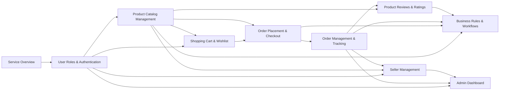

# E-Commerce Shopping Mall Platform - Documentation Table of Contents

## Welcome to the Project Documentation

This documentation collection provides a complete requirements analysis and specification for building an e-commerce shopping mall platform. The platform is designed to support multiple vendors (sellers), customers, and administrators in a comprehensive marketplace environment.

Whether you're a business stakeholder, developer, project manager, or team member, this table of contents will guide you through the complete documentation landscape and help you find the information you need.

## Documentation Overview

This documentation set follows a structured approach to defining the e-commerce platform:

- **Business Foundation**: Establishing the vision, business model, and market opportunity
- **User Management**: Defining roles, authentication, and access control
- **Core Features**: Specifying product catalog, shopping cart, and order management
- **Advanced Features**: Detailing reviews, seller management, and administrative functions
- **Business Rules**: Consolidating all validation rules, workflows, and performance requirements

Each document is written to provide complete, unambiguous requirements that enable developers to build the system with confidence and clarity.

## Complete Document List

### Foundation Documents

#### [Service Overview](./01-service-overview.md)
**Audience**: Business stakeholders, product owners, project managers

This document establishes the foundation for the entire platform by defining:
- Business vision and market opportunity
- Revenue model and monetization strategy
- Target market segments and user personas
- Competitive advantages and unique value proposition
- Success metrics and key performance indicators

**Why read this**: Understand the business rationale, market context, and strategic goals driving the platform development.

---

#### [User Roles and Authentication](./02-user-roles-authentication.md)
**Audience**: Development team, security engineers, architects

This document specifies the complete authentication and authorization system:
- User registration and login workflows
- Three user roles: Customer, Seller, and Admin
- Complete permission matrix for all roles
- JWT token management and session handling
- Password security and account recovery
- Email verification requirements

**Why read this**: Understand who can access the system, what they can do, and how authentication security is implemented.

---

### Core Feature Documents

#### [Product Catalog Management](./03-product-catalog-management.md)
**Audience**: Development team, product managers

This document details the product catalog structure and management:
- Product organization with hierarchical categories
- Product variant system (SKU) supporting colors, sizes, and options
- Inventory tracking at the SKU level
- Product search and filtering capabilities
- Product images and media management
- Product lifecycle and status management

**Why read this**: Understand how products are structured, organized, searched, and managed throughout the platform.

---

#### [Shopping Cart and Wishlist](./04-shopping-cart-wishlist.md)
**Audience**: Development team, UX designers

This document specifies pre-purchase customer engagement features:
- Shopping cart functionality and item management
- Cart persistence across sessions
- Wishlist creation and management
- Moving items between cart and wishlist
- Real-time price calculations
- Stock availability validation

**Why read this**: Understand how customers collect and manage products before purchase.

---

#### [Order Placement and Checkout](./05-order-placement-checkout.md)
**Audience**: Development team, payment integration specialists

This document defines the complete checkout and order placement process:
- Multi-step checkout workflow
- Delivery address selection and management
- Shipping method selection
- Payment processing requirements
- Order validation and confirmation
- Multi-seller order splitting logic
- Tax and pricing calculations

**Why read this**: Understand the complete journey from cart to confirmed order, including payment integration.

---

#### [Order Management and Tracking](./06-order-management-tracking.md)
**Audience**: Development team, operations team

This document specifies order lifecycle management:
- Order status states and transitions
- Real-time order tracking for customers
- Shipping status updates
- Order history access
- Order cancellation workflows
- Refund request and approval processes
- Order notifications
- Seller order management capabilities

**Why read this**: Understand how orders are tracked, managed, and fulfilled from placement to delivery.

---

### Advanced Feature Documents

#### [Product Reviews and Ratings](./07-product-reviews-ratings.md)
**Audience**: Development team, content moderators

This document details the customer feedback system:
- Review submission requirements
- 5-star rating system
- Review validation and moderation
- Verified purchase badges
- Review helpfulness voting
- Seller response capabilities
- Aggregate rating calculations

**Why read this**: Understand how customer feedback is collected, validated, and displayed to build marketplace trust.

---

#### [Seller Management](./08-seller-management.md)
**Audience**: Development team, seller operations team

This document specifies vendor account functionality:
- Seller registration and onboarding
- Product listing and management tools
- SKU-level inventory management
- Order processing for seller products
- Sales analytics and reporting
- Performance metrics
- Commission and payout structure

**Why read this**: Understand how vendors manage their business operations within the marketplace.

---

#### [Admin Dashboard](./09-admin-dashboard.md)
**Audience**: Development team, platform administrators

This document defines platform-wide administrative functions:
- Comprehensive admin dashboard overview
- Order management and oversight
- Product and catalog management
- User and seller account management
- Refund and dispute resolution tools
- Platform-wide analytics
- System configuration options
- Content moderation capabilities

**Why read this**: Understand the administrative tools for managing the entire marketplace ecosystem.

---

### Business Rules and Consolidation

#### [Business Rules and Workflows](./10-business-rules-workflows.md)
**Audience**: Development team, QA engineers, business analysts

This document consolidates all business logic and validation requirements:
- Product business rules and constraints
- Order processing rules and workflows
- Payment and refund policies
- Inventory management rules
- Review and rating validation
- User and seller account rules
- Performance expectations and SLAs
- Data validation requirements
- Comprehensive error handling scenarios

**Why read this**: Access the complete reference for all business logic, validation rules, and performance requirements.

---

## Documentation Structure

The documentation is organized in a logical progression:

### Document Categories

**Foundation Layer** (Documents 01-02)
- Business context and strategic direction
- Authentication and authorization framework

**Core Features Layer** (Documents 03-06)
- Essential marketplace functionality
- Product catalog, shopping, and order management

**Advanced Features Layer** (Documents 07-09)
- Customer engagement tools
- Vendor and administrative capabilities

**Integration Layer** (Document 10)
- Consolidated business rules
- Cross-cutting concerns and workflows

## Recommended Reading Order

### For Business Stakeholders
1. [Service Overview](./01-service-overview.md) - Understand the business vision
2. [Business Rules and Workflows](./10-business-rules-workflows.md) - Review business logic and policies
3. [Seller Management](./08-seller-management.md) - Understand vendor operations
4. [Admin Dashboard](./09-admin-dashboard.md) - Review administrative capabilities

### For Backend Developers (Complete System Understanding)
1. [Service Overview](./01-service-overview.md) - Business context
2. [User Roles and Authentication](./02-user-roles-authentication.md) - Security foundation
3. [Product Catalog Management](./03-product-catalog-management.md) - Core data model
4. [Shopping Cart and Wishlist](./04-shopping-cart-wishlist.md) - Pre-purchase features
5. [Order Placement and Checkout](./05-order-placement-checkout.md) - Transaction processing
6. [Order Management and Tracking](./06-order-management-tracking.md) - Post-purchase lifecycle
7. [Product Reviews and Ratings](./07-product-reviews-ratings.md) - Customer feedback
8. [Seller Management](./08-seller-management.md) - Vendor operations
9. [Admin Dashboard](./09-admin-dashboard.md) - Platform administration
10. [Business Rules and Workflows](./10-business-rules-workflows.md) - Complete business logic reference

### For Frontend Developers
1. [Service Overview](./01-service-overview.md) - Business context
2. [User Roles and Authentication](./02-user-roles-authentication.md) - User flows and permissions
3. [Product Catalog Management](./03-product-catalog-management.md) - Product display requirements
4. [Shopping Cart and Wishlist](./04-shopping-cart-wishlist.md) - Shopping experience
5. [Order Placement and Checkout](./05-order-placement-checkout.md) - Checkout flows
6. [Order Management and Tracking](./06-order-management-tracking.md) - Order status displays
7. [Product Reviews and Ratings](./07-product-reviews-ratings.md) - Review interfaces

### For Project Managers
1. [Service Overview](./01-service-overview.md) - Project scope and vision
2. [User Roles and Authentication](./02-user-roles-authentication.md) - User segmentation
3. [Business Rules and Workflows](./10-business-rules-workflows.md) - Complete feature set overview
4. All other documents as needed for specific feature planning

### For New Team Members
Start with:
1. [Service Overview](./01-service-overview.md) - High-level understanding
2. [User Roles and Authentication](./02-user-roles-authentication.md) - Who uses the system
3. [Business Rules and Workflows](./10-business-rules-workflows.md) - How the system works

Then dive into specific feature documents based on your assigned responsibilities.

## Document Dependencies

Understanding document relationships helps you navigate efficiently:

### Prerequisites
- **All documents** depend on [Service Overview](./01-service-overview.md) for business context
- **All feature documents** depend on [User Roles and Authentication](./02-user-roles-authentication.md) for permission context

### Feature Dependencies
- **Shopping Cart** requires understanding **Product Catalog**
- **Order Placement** requires understanding **Shopping Cart** and **Product Catalog**
- **Order Management** builds upon **Order Placement**
- **Product Reviews** requires understanding **Order Management** (verified purchases)
- **Seller Management** integrates with **Product Catalog** and **Order Management**
- **Admin Dashboard** encompasses all other features

### Integration Point
- **Business Rules and Workflows** consolidates rules from all feature documents

## Quick Reference Guide

### Finding Specific Requirements

**Authentication and Security**
→ [User Roles and Authentication](./02-user-roles-authentication.md)

**Product Structure and SKUs**
→ [Product Catalog Management](./03-product-catalog-management.md)

**Shopping Experience**
→ [Shopping Cart and Wishlist](./04-shopping-cart-wishlist.md)

**Payment and Checkout**
→ [Order Placement and Checkout](./05-order-placement-checkout.md)

**Order Lifecycle**
→ [Order Management and Tracking](./06-order-management-tracking.md)

**Customer Feedback**
→ [Product Reviews and Ratings](./07-product-reviews-ratings.md)

**Vendor Operations**
→ [Seller Management](./08-seller-management.md)

**Platform Administration**
→ [Admin Dashboard](./09-admin-dashboard.md)

**Business Logic and Validation**
→ [Business Rules and Workflows](./10-business-rules-workflows.md)

## Navigation Tips

1. **Use descriptive links**: All document links use clear, descriptive titles rather than filenames
2. **Follow the dependency graph**: Check the Mermaid diagram above to understand document relationships
3. **Start with context**: Always begin with the Service Overview for business understanding
4. **Reference Business Rules**: When implementing features, cross-reference with Business Rules and Workflows document
5. **Bookmark key documents**: Keep User Roles, Product Catalog, and Business Rules readily accessible

## Document Conventions

All documents in this collection follow these conventions:

- **EARS Format**: Requirements use Easy Approach to Requirements Syntax for clarity
- **Natural Language**: Business requirements written in plain English, focusing on WHAT not HOW
- **Visual Diagrams**: Mermaid diagrams illustrate complex workflows and relationships
- **Permission Context**: Features specify which user roles can perform actions
- **Business Focus**: Documents describe business requirements, not technical implementation details

## Living Documentation

This documentation represents the complete requirements analysis for the e-commerce shopping mall platform. As the project evolves, these documents serve as the authoritative reference for what the system should do and how it should behave from a business perspective.

---

Developer Note: This document defines **business requirements only**. All technical implementations (architecture, APIs, database design, etc.) are at the discretion of the development team.
