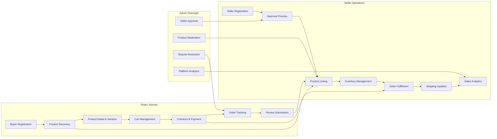
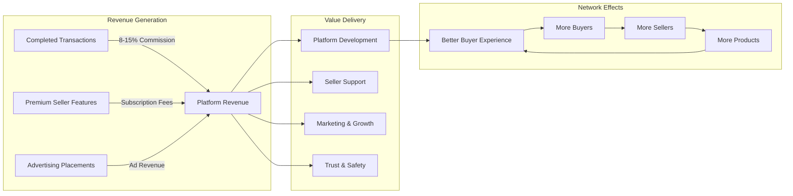

# Service Overview: E-commerce Shopping Mall Platform

## Executive Summary

The E-commerce Shopping Mall Platform is a comprehensive multi-vendor marketplace designed to connect buyers with diverse sellers in a unified, trust-driven online shopping environment. This platform enables merchants of all sizes to establish their digital storefronts while providing consumers with a seamless, feature-rich shopping experience that rivals leading e-commerce solutions.

**Mission**: To democratize online commerce by providing sellers with powerful, easy-to-use tools to reach customers, while delivering buyers a trustworthy marketplace with extensive product selection, transparent reviews, and reliable fulfillment.

**Vision**: To become a leading multi-vendor e-commerce platform recognized for seller empowerment, buyer satisfaction, and operational excellence in online retail.

**Core Differentiators**:
- Advanced product variant (SKU) management enabling sellers to offer detailed product options
- Comprehensive inventory tracking at the SKU level to prevent overselling
- Integrated review and rating system with verified purchase validation
- Robust order lifecycle management with flexible cancellation and refund policies
- Seller analytics and reporting tools for data-driven business decisions
- Multi-address management and wishlist functionality for enhanced buyer convenience

The platform operates on a three-sided marketplace model connecting **buyers** (customers seeking products), **sellers** (merchants offering products), and **admins** (platform operators ensuring quality and trust). This ecosystem creates network effects where value increases as more participants join each side of the marketplace.

## Business Model and Market Opportunity

### Market Analysis

The global e-commerce market continues to experience robust growth, with online retail sales expected to reach $6.3 trillion by 2024. Consumer behavior has fundamentally shifted toward online shopping, driven by convenience, product selection, price transparency, and mobile accessibility. Multi-vendor marketplaces represent the fastest-growing segment of e-commerce, capturing an increasing share of online transactions due to their ability to offer diverse product catalogs without holding inventory.

**Key Market Trends**:
- Mobile commerce accounting for over 60% of e-commerce transactions
- Consumers prioritizing platforms with verified reviews and ratings
- Small and medium businesses seeking low-barrier entry to online sales
- Demand for flexible product variants (size, color, options) in online shopping
- Expectation for real-time inventory visibility and order tracking

### Market Gap and Opportunity

While major marketplaces dominate the e-commerce landscape, significant opportunities exist for platforms that address specific market needs:

**Underserved Seller Segment**: Small to medium-sized merchants often struggle with existing platforms due to:
- Complex onboarding processes and high technical barriers
- Limited control over product presentation and variant management
- Inadequate inventory management tools leading to overselling issues
- Insufficient sales analytics for business decision-making
- High commission rates that erode profit margins

**Buyer Experience Gaps**: Consumers face challenges on many platforms including:
- Difficulty discovering products across multiple sellers
- Lack of transparency in product variants and availability
- Limited trust mechanisms beyond basic ratings
- Cumbersome checkout processes requiring repeated address entry
- Poor order tracking and post-purchase support

**Our Platform's Solution**: By providing sophisticated yet user-friendly tools for sellers and a seamless, trust-driven experience for buyers, we address these gaps while maintaining platform quality through admin oversight.

### Revenue Streams

The platform generates sustainable revenue through multiple channels:

**Primary Revenue: Transaction Commissions**
- THE platform SHALL collect a percentage-based commission on each completed transaction
- Commission rates are tiered based on product category and seller performance
- Typical commission range: 8-15% of gross merchandise value
- Commissions are deducted from seller payouts after order confirmation

**Secondary Revenue: Premium Seller Features**
- Subscription-based enhanced analytics and reporting tools
- Featured product placement in search results and category pages
- Priority customer support for seller operations
- Advanced marketing and promotional tools

**Tertiary Revenue: Advertising**
- Sponsored product listings in search results
- Category page advertising placements
- Banner advertising opportunities for brands

**Future Revenue Opportunities**
- Fulfillment services for sellers (warehousing and shipping)
- Financial services (seller financing, buyer payment plans)
- White-label platform licensing to enterprises

### Competitive Landscape

**Major Competitors**:
- **Large Marketplaces** (Amazon, eBay): Dominant market presence but complex seller experience and high fees
- **Specialized Marketplaces** (Etsy, Poshmark): Strong in specific niches but limited product scope
- **Regional Platforms**: Local market knowledge but limited technology investment
- **Direct E-commerce Platforms** (Shopify sellers): Complete seller control but individual marketing burden

**Our Competitive Advantages**:
1. **Seller-Centric Design**: Purpose-built tools for efficient product, variant, and inventory management
2. **SKU-Level Precision**: Comprehensive variant management preventing overselling and improving buyer confidence
3. **Trust Infrastructure**: Verified purchase reviews, seller ratings, and transparent dispute resolution
4. **Balanced Ecosystem**: Fair commission rates supporting both platform sustainability and seller profitability
5. **Operational Excellence**: Real-time inventory validation, flexible order management, comprehensive tracking

### Growth Strategy

**Phase 1: Platform Launch and Seller Acquisition (Months 1-6)**
- Recruit 500-1,000 initial sellers across diverse product categories
- Onboard 50,000-100,000 buyers through targeted digital marketing
- Establish core product categories with sufficient depth
- Achieve 10,000 monthly transactions

**Phase 2: Market Expansion and Feature Enhancement (Months 7-18)**
- Expand seller base to 5,000+ active merchants
- Grow buyer base to 500,000+ registered users
- Introduce premium seller features and advertising products
- Launch mobile applications for iOS and Android
- Achieve $5M+ monthly gross merchandise volume

**Phase 3: Market Leadership and Scaling (Months 19-36)**
- Establish market leadership in target categories
- Expand to 20,000+ sellers and 2M+ buyers
- Introduce fulfillment and financial services
- Consider geographic expansion to adjacent markets
- Achieve $25M+ monthly gross merchandise volume

**User Acquisition Channels**:
- Digital advertising (search, social media, display)
- Content marketing and SEO for organic discovery
- Seller referral programs incentivizing merchant recruitment
- Buyer referral programs rewarding customer acquisition
- Strategic partnerships with complementary services

## Service Vision and Objectives

### Long-Term Vision (3-5 Years)

THE platform SHALL evolve into a comprehensive commerce ecosystem WHERE sellers access integrated tools for product management, fulfillment, marketing, and financial services, WHILE buyers experience a trusted marketplace combining extensive selection, competitive pricing, and reliable service.

**Vision Pillars**:

1. **Seller Empowerment**: Enable merchants to build sustainable online businesses through powerful, accessible tools
2. **Buyer Trust**: Create a marketplace where consumers shop confidently through transparency, reviews, and reliable fulfillment
3. **Technology Leadership**: Continuously innovate in inventory management, search, and personalization
4. **Sustainable Growth**: Build a scalable, profitable business model benefiting all marketplace participants
5. **Community Building**: Foster a vibrant ecosystem where buyers and sellers interact positively

### Strategic Objectives (12-24 Months)

**Marketplace Liquidity**
- Achieve 5,000+ active sellers with products across 50+ categories
- Maintain minimum 80% seller retention rate year-over-year
- Ensure 95%+ of product searches return relevant results
- Reach 1 million registered buyers within 18 months

**Operational Excellence**
- Maintain 99.5%+ platform uptime and reliability
- Process orders with average confirmation time under 5 seconds
- Achieve 95%+ on-time shipping rate across all sellers
- Resolve 90%+ of disputes within 48 hours

**Trust and Quality**
- Achieve average platform rating of 4.3+ stars out of 5
- Ensure 70%+ of products have verified purchase reviews
- Maintain seller quality standards with 90%+ fulfillment rates
- Process refund requests within 24 hours

**Financial Performance**
- Reach $50M+ annual gross merchandise volume
- Achieve $5M+ annual commission revenue
- Maintain customer acquisition cost under $15 per buyer
- Achieve positive unit economics within 18 months

**Technology and Innovation**
- Launch mobile applications within 12 months
- Implement AI-powered product recommendations
- Introduce automated inventory forecasting for sellers
- Deploy advanced fraud detection and prevention

### Core Principles

**For Platform Development**:
1. **Simplicity**: Complex functionality should have simple, intuitive interfaces
2. **Reliability**: System uptime and data accuracy are non-negotiable
3. **Scalability**: Architecture must support 10x growth without fundamental redesign
4. **Security**: Protect user data and financial transactions with enterprise-grade security
5. **Transparency**: Clear communication of policies, fees, and processes to all participants

**For Marketplace Operations**:
1. **Fairness**: Balanced policies supporting both buyer and seller interests
2. **Quality**: Maintain high standards for products, sellers, and buyer experiences
3. **Accountability**: Clear dispute resolution and enforcement mechanisms
4. **Innovation**: Continuously improve based on user feedback and market trends
5. **Community**: Foster positive interactions and long-term relationships

## Core Value Propositions

### Value Proposition for Buyers

**Extensive Product Selection**
- WHEN buyers search for products, THE platform SHALL provide results across multiple sellers offering competitive options
- Access to thousands of products across diverse categories from a single marketplace
- Product variants (colors, sizes, options) clearly presented with real-time availability
- Comparison shopping capabilities across similar products and sellers

**Trust and Transparency**
- Verified purchase reviews ensure authentic buyer feedback
- Seller ratings and performance metrics visible before purchase
- Clear product descriptions, images, and specifications
- Transparent pricing with no hidden fees

**Seamless Shopping Experience**
- Persistent shopping cart maintaining items across sessions
- Wishlist functionality for saving products for future purchase
- Multiple saved addresses for convenient checkout
- Order tracking from purchase through delivery
- Flexible cancellation and refund policies

**Buyer Protection**
- Secure payment processing with multiple payment methods
- Refund guarantee for defective or misrepresented products
- Dispute resolution process with admin oversight
- Order history and receipt access for all purchases

### Value Proposition for Sellers

**Low-Barrier Market Access**
- Simple registration and approval process to start selling
- Access to established buyer base without individual marketing burden
- No upfront costs or inventory requirements to join platform
- Fair commission structure with transparent fee calculation

**Powerful Product Management**
- Comprehensive SKU variant system supporting colors, sizes, and custom options
- Real-time inventory tracking preventing overselling
- Bulk product upload and editing capabilities
- Product image management with multiple images per variant

**Order Management Efficiency**
- Centralized dashboard for all orders across products
- Automated order notifications and workflow
- Shipping status update interface with buyer notifications
- Order analytics and reporting for business insights

**Business Growth Tools**
- Sales analytics showing performance trends and bestsellers
- Customer review insights for product improvement
- Inventory forecasting to optimize stock levels
- Promotional tools for marketing products

**Seller Support**
- Dedicated seller support for platform questions
- Documentation and training materials
- Community forums for seller collaboration
- Platform updates and new feature notifications

### Value Proposition for Platform Operators

**Sustainable Revenue Model**
- Commission-based revenue scaling with marketplace growth
- Multiple revenue streams reducing dependency on single source
- Low marginal cost for additional transactions
- Recurring revenue from premium seller subscriptions

**Network Effects**
- More sellers attract more buyers through product variety
- More buyers attract more sellers through market opportunity
- Quality controls maintain platform value as it scales
- Data insights improve with increased transaction volume

**Operational Leverage**
- Technology platform serves unlimited buyers and sellers
- Automation reduces manual intervention in standard operations
- Admin tools enable efficient oversight at scale
- Metrics and analytics guide strategic decisions

**Strategic Positioning**
- First-mover advantage in seller-friendly marketplace segment
- Defensible position through network effects and technology
- Platform for future service expansion (fulfillment, financing)
- Valuable transaction and behavior data for business intelligence

## Target Market and User Segments

### Primary Buyer Segments

**Segment 1: Value-Conscious Shoppers**
- **Demographics**: Ages 25-45, middle-income households
- **Behaviors**: Compare prices across sellers, read reviews extensively, prioritize deals
- **Pain Points**: Difficulty finding competitive prices, concern about product quality
- **Platform Appeal**: Multi-seller competition driving competitive pricing, verified reviews

**Segment 2: Convenience Seekers**
- **Demographics**: Ages 30-55, higher-income professionals
- **Behaviors**: Prioritize fast checkout, prefer saved payment methods and addresses
- **Pain Points**: Time-consuming shopping processes, inconsistent fulfillment experiences
- **Platform Appeal**: Streamlined checkout, order tracking, reliable seller performance standards

**Segment 3: Product Specialists**
- **Demographics**: Ages 20-60, enthusiasts in specific categories (fashion, electronics, home goods)
- **Behaviors**: Research products extensively, seek specific variants and options
- **Pain Points**: Limited product variants on single-seller sites, difficulty comparing specifications
- **Platform Appeal**: Detailed SKU variants, comprehensive product information, specialist sellers

**Segment 4: Mobile-First Shoppers**
- **Demographics**: Ages 18-35, digital natives
- **Behaviors**: Shop primarily via mobile devices, expect instant responses
- **Pain Points**: Desktop-optimized sites with poor mobile experience
- **Platform Appeal**: Mobile-responsive design, fast load times, mobile-optimized checkout

### Primary Seller Segments

**Segment 1: Small Business Retailers**
- **Profile**: 1-10 employees, $100K-$2M annual revenue, physical retail presence
- **Products**: Curated product selection in specific categories
- **Pain Points**: Limited online presence, lack of technical expertise, high platform fees
- **Platform Appeal**: Easy onboarding, comprehensive management tools, reasonable commissions

**Segment 2: Individual Merchants and Artisans**
- **Profile**: Solo entrepreneurs, handmade or curated products
- **Products**: Unique or specialized items, often with customization options
- **Pain Points**: Difficulty reaching customers, complex platform requirements
- **Platform Appeal**: Low barrier to entry, variant management for customization, access to buyers

**Segment 3: Wholesale Distributors**
- **Profile**: Established businesses with inventory, serving B2C market
- **Products**: Brand-name products across multiple categories
- **Pain Points**: Need for sophisticated inventory management, high transaction volumes
- **Platform Appeal**: Real-time inventory sync, bulk operations, analytics for optimization

**Segment 4: Brand Direct Sellers**
- **Profile**: Manufacturers selling directly to consumers
- **Products**: Own-brand products with multiple variants
- **Pain Points**: Building direct customer relationships, managing complex SKUs
- **Platform Appeal**: Brand storefront capability, comprehensive variant management, customer insights

### Geographic Focus

**Initial Market**: United States
- Large e-commerce market with established buyer behavior
- Robust logistics infrastructure supporting reliable fulfillment
- High smartphone and internet penetration
- English-language platform minimizing localization requirements

**Expansion Markets (12-24 Months)**:
- Canada: Similar market characteristics, minimal platform adaptation
- United Kingdom: Strong e-commerce adoption, English-language advantage
- Australia: Growing online retail market, cultural affinity

**Future Consideration**:
- European Union: Large market requiring localization and regulatory compliance
- Southeast Asia: High mobile-commerce growth, competitive landscape
- Latin America: Emerging e-commerce markets with growth potential

### Market Size Estimation

**Total Addressable Market (TAM)**:
- US e-commerce market: $1.1 trillion annually
- Multi-vendor marketplace segment: ~40% of e-commerce = $440 billion

**Serviceable Available Market (SAM)**:
- Target categories within multi-vendor segment: ~25% = $110 billion
- Our platform's accessible market based on competitive positioning

**Serviceable Obtainable Market (SOM) - Year 3**:
- Realistic market capture: 0.1% of SAM = $110 million GMV
- At 12% average commission: $13.2 million annual revenue

## Success Metrics and KPIs

### User Metrics

**Buyer Metrics**
- **Monthly Active Users (MAU)**: Number of buyers visiting platform monthly
  - Target Year 1: 100,000 MAU
  - Target Year 2: 500,000 MAU
  - Target Year 3: 2,000,000 MAU

- **Buyer Retention Rate**: Percentage of buyers making repeat purchases
  - Target: 40% making second purchase within 90 days
  - Target: 60% making third purchase within 180 days

- **Average Sessions per User**: Frequency of platform visits
  - Target: 3.5 sessions per month per active user

**Seller Metrics**
- **Active Sellers**: Sellers with at least one product listing and active status
  - Target Year 1: 1,000 active sellers
  - Target Year 2: 5,000 active sellers
  - Target Year 3: 20,000 active sellers

- **Seller Retention Rate**: Percentage of sellers active after 12 months
  - Target: 80% annual seller retention

- **Products per Seller**: Average number of products listed per active seller
  - Target: 25 products per seller

- **SKUs per Seller**: Average SKUs considering product variants
  - Target: 75 SKUs per seller (3 variants per product average)

### Transaction Metrics

**Gross Merchandise Volume (GMV)**
- Total value of all transactions on platform (excluding cancelled/refunded orders)
- Target Year 1: $10 million GMV
- Target Year 2: $50 million GMV
- Target Year 3: $150 million GMV

**Average Order Value (AOV)**
- Average transaction value per completed order
- Target: $65 per order
- Benchmark: Industry average $50-$100 depending on category mix

**Conversion Rate**
- Percentage of sessions resulting in completed purchase
- Target: 2.5% overall conversion rate
- Target: 8% conversion rate for return buyers

**Orders per Buyer**
- Average number of orders per buyer per year
- Target: 4.2 orders per buyer annually

**Cart Abandonment Rate**
- Percentage of shopping carts not converted to orders
- Target: Below 70% (industry average 70-80%)

### Financial Metrics

**Revenue**
- Commission revenue from completed transactions
- Target Year 1: $1.2 million (12% of $10M GMV)
- Target Year 2: $6 million (12% of $50M GMV)
- Target Year 3: $18 million (12% of $150M GMV)

**Customer Acquisition Cost (CAC)**
- Average cost to acquire one new buyer
- Target: $12-15 per buyer
- Benchmark: Payback period under 6 months

**Lifetime Value (LTV)**
- Expected revenue from buyer over their lifetime
- Target: $180 LTV per buyer (15 orders × $65 AOV × 12% commission)
- Target LTV:CAC ratio: 12:1

**Gross Margin**
- Revenue minus variable costs (payment processing, hosting, support)
- Target: 75% gross margin on commission revenue

### Quality Metrics

**Platform Reliability**
- System uptime percentage
- Target: 99.9% uptime (less than 44 minutes downtime monthly)

**Order Fulfillment Rate**
- Percentage of orders successfully fulfilled
- Target: 97% successful fulfillment rate

**On-Time Shipping Rate**
- Percentage of orders shipped within seller's promised timeframe
- Target: 95% on-time shipping

**Review Coverage**
- Percentage of products with at least one review
- Target: 70% of active products have reviews

**Average Platform Rating**
- Aggregate rating across all reviewed products
- Target: 4.3 out of 5.0 stars

**Dispute Rate**
- Percentage of orders resulting in disputes
- Target: Below 2% of all orders

**Resolution Time**
- Average time to resolve buyer disputes and refund requests
- Target: 90% resolved within 48 hours

**Return/Refund Rate**
- Percentage of orders resulting in returns or refunds
- Target: Below 5% of completed orders

### Engagement Metrics

**Wishlist Usage**
- Percentage of buyers using wishlist functionality
- Target: 35% of active buyers maintain wishlists

**Review Submission Rate**
- Percentage of completed orders receiving reviews
- Target: 25% of fulfilled orders receive reviews within 30 days

**Search Success Rate**
- Percentage of product searches returning relevant results
- Target: 95% of searches return 10+ relevant results

**Mobile Traffic Share**
- Percentage of traffic from mobile devices
- Target: 60% mobile traffic share

## Competitive Advantages

### 1. Seller-Centric Product and Inventory Management

**Comprehensive SKU Variant System**
- THE platform SHALL support product variants across multiple dimensions (color, size, material, style, and custom options)
- WHEN sellers create product variants, THE system SHALL track inventory separately for each SKU combination
- WHERE competitors limit variant combinations, THE platform SHALL support unlimited variant permutations within reasonable performance constraints

**Real-Time Inventory Synchronization**
- THE platform SHALL validate inventory availability in real-time during cart operations and checkout
- WHEN inventory levels change, THE system SHALL immediately update product availability across all buyer touchpoints
- IF a product variant becomes unavailable during checkout, THEN THE system SHALL notify the buyer before payment processing

**Overselling Prevention**
- THE platform SHALL implement inventory locks during checkout to prevent overselling
- WHEN multiple buyers attempt to purchase the last item simultaneously, THE system SHALL ensure only one transaction succeeds
- This prevents the common marketplace problem of orders placed for unavailable inventory

### 2. Trust Infrastructure and Transparency

**Verified Purchase Reviews**
- WHEN buyers submit product reviews, THE system SHALL verify they purchased the product before allowing review publication
- Only authenticated buyers who completed orders can review products
- Review timestamps show how long after purchase the review was written

**Seller Performance Visibility**
- THE platform SHALL display seller performance metrics including fulfillment rate, on-time shipping percentage, and average rating
- Buyers can make informed decisions based on seller track record
- Poor-performing sellers face account review or suspension

**Transparent Dispute Resolution**
- THE platform SHALL provide clear dispute resolution processes with admin oversight
- All parties can view dispute status and resolution timeline
- Fair policies balance buyer protection with seller rights

### 3. Seamless Buyer Experience

**Persistent Shopping Cart**
- WHEN authenticated buyers add items to cart, THE system SHALL persist cart contents across sessions and devices
- Buyers can start shopping on mobile and complete purchase on desktop
- Cart items remain saved until buyer explicitly removes them or completes checkout

**Multi-Address Management**
- THE platform SHALL allow buyers to save multiple shipping addresses (home, work, gift recipients)
- WHEN buyers reach checkout, THE system SHALL present saved addresses for quick selection
- Buyers can set default shipping address for streamlined checkout

**Wishlist Functionality**
- THE platform SHALL provide wishlist capability for saving products for future purchase
- Buyers receive notifications when wishlisted items go on sale or low in stock
- Easy conversion from wishlist to cart with one action

**Order Tracking**
- WHEN sellers update shipping status, THE system SHALL notify buyers immediately
- Buyers can track orders from placement through delivery
- Order history provides complete purchase record with receipts

### 4. Balanced Marketplace Economics

**Fair Commission Structure**
- Commission rates competitive with or below major marketplaces
- Transparent fee calculation with no hidden charges
- Tiered commission enabling high-volume sellers to reduce costs

**Low Barrier to Entry**
- No upfront listing fees or monthly charges for basic seller accounts
- Simple registration and approval process
- Sellers only pay commissions on completed transactions

**Growth-Oriented Policies**
- Platform invests in seller success through tools and analytics
- Seller support and training resources included
- Long-term seller relationships prioritized over short-term revenue extraction

### 5. Operational Excellence Through Technology

**Advanced Search and Discovery**
- THE platform SHALL implement sophisticated product search with autocomplete, suggestions, and typo correction
- Multi-faceted filtering by category, price, rating, seller, availability
- Search results ranked by relevance, popularity, and personalization

**Automated Workflows**
- Order processing automated from placement to seller notification
- Payment processing and reconciliation handled systematically
- Shipping status updates trigger buyer notifications automatically

**Comprehensive Analytics**
- Sellers access detailed sales analytics, bestseller reports, and inventory insights
- Admins monitor platform-wide metrics in real-time dashboards
- Data-driven decision making for all marketplace participants

**Scalable Architecture**
- Platform designed to handle 10x growth without performance degradation
- Database optimization for SKU-level inventory queries
- Caching strategies for high-traffic product pages

### 6. Quality Control and Curation

**Seller Approval Process**
- THE platform SHALL review and approve seller applications before granting listing privileges
- Quality standards prevent low-quality sellers from degrading marketplace
- Ongoing performance monitoring ensures continued compliance

**Product Listing Moderation**
- Admin capabilities to review, approve, or reject product listings
- Enforcement of product quality standards and accurate descriptions
- Removal of counterfeit, prohibited, or misrepresented products

**Performance-Based Ranking**
- High-performing sellers and products receive better visibility in search results
- Incentive structure rewards quality, fulfillment, and customer satisfaction
- Poor performers demoted or removed from platform

## Platform Architecture Overview

## Business Model Diagram

## Implementation Priorities

### Phase 1: Core Marketplace (Months 1-6)

**Critical Features**:
1. User registration and authentication for buyers, sellers, and admins
2. Product listing with SKU variant support
3. Inventory management at SKU level
4. Shopping cart and checkout
5. Payment processing integration
6. Basic order management and tracking
7. Seller approval workflow
8. Admin moderation tools

**Success Criteria**:
- 500+ approved sellers
- 5,000+ products listed
- 50,000+ registered buyers
- 10,000+ completed transactions
- 95%+ successful fulfillment rate

### Phase 2: Trust and Engagement (Months 7-12)

**Feature Additions**:
1. Review and rating system with verified purchases
2. Wishlist functionality
3. Multi-address management
4. Order cancellation and refund workflows
5. Seller analytics dashboard
6. Advanced product search and filtering
7. Mobile-responsive optimization

**Success Criteria**:
- 60%+ products have reviews
- 4.2+ average platform rating
- 30%+ buyers use wishlists
- 40%+ buyer retention rate

### Phase 3: Growth and Optimization (Months 13-24)

**Feature Enhancements**:
1. Mobile native applications (iOS and Android)
2. AI-powered product recommendations
3. Premium seller features and advertising
4. Advanced seller analytics and reporting
5. Automated inventory forecasting
6. Enhanced admin analytics and insights
7. Performance-based search ranking

**Success Criteria**:
- 5,000+ active sellers
- 500,000+ registered buyers
- $50M+ annual GMV
- 60%+ mobile traffic share
- Positive unit economics achieved

## Risk Mitigation

**Market Risks**:
- **Competition from established marketplaces**: Mitigate through seller-centric differentiation and superior variant management
- **Difficulty attracting initial sellers**: Offer promotional commission rates and dedicated onboarding support
- **Buyer trust in new platform**: Implement robust review system and buyer protection policies from day one

**Operational Risks**:
- **Payment fraud and chargebacks**: Deploy comprehensive fraud detection and seller verification
- **Inventory overselling**: Implement real-time inventory validation and transaction locking
- **Platform downtime**: Invest in reliable infrastructure with 99.9% uptime SLA

**Financial Risks**:
- **High customer acquisition costs**: Focus on organic growth, SEO, and seller referral programs
- **Seller churn**: Provide exceptional tools, support, and fair economics to retain sellers
- **Scaling costs**: Design efficient architecture minimizing marginal costs per transaction

## Conclusion

The E-commerce Shopping Mall Platform addresses clear market opportunities through a balanced, technology-driven approach benefiting buyers, sellers, and platform operators. By focusing on seller empowerment through sophisticated product and inventory management, building buyer trust through verified reviews and transparent operations, and maintaining platform quality through admin oversight, we create a sustainable marketplace with strong competitive advantages.

Our success metrics provide clear targets for measuring progress, while our phased implementation approach ensures we build a solid foundation before scaling. The network effects inherent in multi-vendor marketplaces, combined with our technological advantages and fair economic model, position us for long-term growth and market leadership.