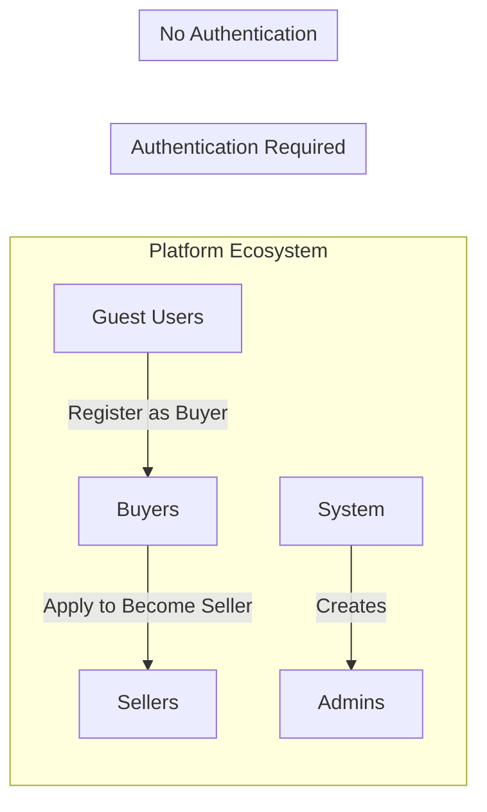
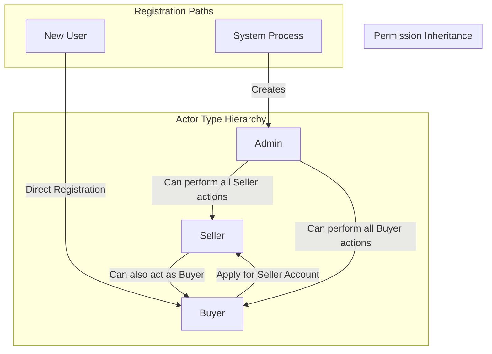
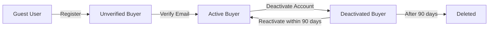
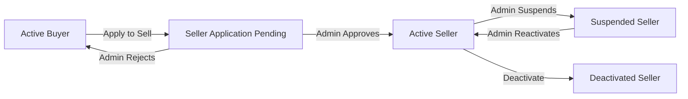
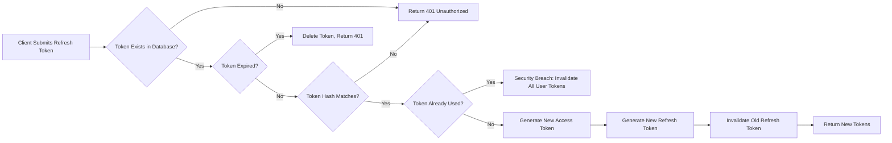

# User Actors and Authentication Requirements

## Introduction and Overview

### Purpose of This Document

This document establishes the complete authentication and authorization foundation for the e-commerce shopping mall platform. It defines all user actors within the system, their permission hierarchies, authentication flows, and JWT-based access control mechanisms that govern platform security and user capabilities.

Backend developers will use this document to implement:
- User registration and authentication services
- JWT token generation and validation logic
- Authorization middleware and permission checking
- Actor-specific business logic and access control
- Session management and security features

### Authentication Architecture Overview

The platform employs a modern, secure authentication architecture based on JSON Web Tokens (JWT) to manage user identity and permissions across all platform services. This architecture supports three distinct user actor types, each with carefully defined capabilities and restrictions that align with their business roles within the marketplace ecosystem.

**Core Authentication Principles:**
- Stateless authentication using JWT tokens for scalability
- Role-based access control (RBAC) with three primary actor types
- Email verification for account security and trust
- Secure password management with industry-standard hashing
- Refresh token rotation for extended sessions without compromising security
- Actor-specific token claims for fine-grained authorization

### User Actor Ecosystem

The e-commerce shopping mall platform operates with three distinct user actor types, each representing a different stakeholder in the marketplace ecosystem:



**Actor Overview:**

1. **Buyers**: Authenticated customers who purchase products from the marketplace
2. **Sellers**: Authenticated merchants who list and sell products on the platform
3. **Admins**: Platform administrators with elevated permissions to manage the entire ecosystem

**Actor Relationships:**
- A single user account can hold multiple roles simultaneously (e.g., a seller can also purchase as a buyer)
- Guest users can browse products but must register as buyers to make purchases
- Buyers can apply to become sellers while retaining their buyer capabilities
- Admins are created through system-level processes, not public registration

## Business Model Context

### Why Three Distinct Actor Types?

The e-commerce shopping mall platform operates as a **multi-vendor marketplace**, bringing together multiple independent sellers and numerous buyers on a single platform. This business model requires careful separation of capabilities and responsibilities:

**Marketplace Value Proposition:**
- **For Buyers**: Access to diverse products from multiple sellers in one convenient location
- **For Sellers**: Ready-made customer base and platform infrastructure to start selling immediately
- **For the Platform**: Revenue through seller commissions, premium features, and marketplace facilitation

**Actor Separation Rationale:**
- **Buyers** need focused shopping experiences without seller management complexity
- **Sellers** require business tools that buyers don't need (inventory, order fulfillment, analytics)
- **Admins** must maintain platform integrity, moderate content, and resolve disputes neutrally

This three-actor model enables the platform to scale efficiently while maintaining clear boundaries between customer-facing shopping experiences, merchant business operations, and platform governance.

## Authentication System Requirements

### Core Authentication Functions

The authentication system provides comprehensive identity management for all user actors on the platform.

#### User Registration

**WHEN a new user submits registration information, THE system SHALL create a new user account with the specified actor type.**

**WHEN a user registers, THE system SHALL validate that the email address is not already associated with an existing account.**

**IF a registration email is already in use, THEN THE system SHALL reject the registration and return an error indicating the email is already registered.**

**THE system SHALL require the following information for buyer registration:**
- Email address (valid format, maximum 255 characters)
- Password (minimum 8 characters, must contain at least one uppercase letter, one lowercase letter, one number, and one special character)
- Full name (minimum 2 characters, maximum 100 characters)

**THE system SHALL require the following information for seller registration:**
- All buyer registration fields
- Business name (minimum 2 characters, maximum 200 characters)
- Business description (maximum 2000 characters)
- Business contact phone number

**WHEN a user successfully registers, THE system SHALL send a verification email to the provided email address within 1 minute.**

**THE system SHALL create the user account in an unverified state until email verification is completed.**

#### Email Verification

**THE system SHALL generate a unique, time-limited verification token for each new registration.**

**THE verification token SHALL expire after 24 hours from generation.**

**WHEN a user clicks the verification link in their email, THE system SHALL validate the token and mark the account as verified.**

**IF a verification token has expired, THEN THE system SHALL reject the verification attempt and allow the user to request a new verification email.**

**THE system SHALL allow users to request a new verification email a maximum of 5 times per day to prevent abuse.**

**WHEN a user account is verified, THE system SHALL update the account status to active.**

#### User Login

**WHEN a user submits valid login credentials, THE system SHALL authenticate the user and generate JWT tokens.**

**THE system SHALL accept either email address and password for authentication.**

**WHEN login credentials are correct and the account is verified, THE system SHALL return an access token and a refresh token.**

**IF login credentials are incorrect, THEN THE system SHALL reject the authentication attempt and return an error after a 1-second delay to prevent timing attacks.**

**IF a user account is not verified, THEN THE system SHALL reject the login attempt and prompt the user to verify their email.**

**THE system SHALL track failed login attempts per account.**

**IF an account has 5 consecutive failed login attempts within 15 minutes, THEN THE system SHALL temporarily lock the account for 30 minutes.**

**WHEN an account is locked due to failed attempts, THE system SHALL send a security notification email to the account holder.**

#### Session Management

**WHEN a user successfully logs in, THE system SHALL create a session record tracking the login time and device information.**

**THE system SHALL allow users to maintain multiple active sessions across different devices.**

**THE system SHALL provide users the ability to view all active sessions associated with their account.**

**WHEN a user requests to terminate a specific session, THE system SHALL invalidate the associated refresh token immediately.**

**WHEN a user requests to terminate all sessions, THE system SHALL invalidate all refresh tokens except the current session's token.**

#### User Logout

**WHEN a user logs out, THE system SHALL invalidate the current refresh token to prevent reuse.**

**THE system SHALL remove the session record associated with the logout action.**

**WHEN a user logs out, THE access token SHALL remain valid until its natural expiration time.**

#### Password Management

**WHEN a user requests a password reset, THE system SHALL send a password reset email to the registered email address within 1 minute.**

**THE system SHALL generate a unique, time-limited password reset token valid for 1 hour.**

**WHEN a user submits a new password with a valid reset token, THE system SHALL update the password and invalidate the reset token.**

**WHEN a password is successfully reset, THE system SHALL invalidate all existing refresh tokens to force re-authentication on all devices.**

**THE system SHALL allow authenticated users to change their password by providing their current password and a new password.**

**IF the current password is incorrect during a password change, THEN THE system SHALL reject the request.**

**WHEN a password is changed, THE system SHALL send a confirmation email to the user.**

#### Account Deactivation

**THE system SHALL allow users to deactivate their own accounts.**

**WHEN a buyer account is deactivated, THE system SHALL cancel all pending orders and invalidate all sessions.**

**WHEN a seller account is deactivated, THE system SHALL hide all product listings and prevent new orders.**

**IF a seller has active orders during deactivation, THEN THE system SHALL require the seller to fulfill or cancel those orders before deactivation is completed.**

**THE system SHALL retain deactivated account data for 90 days to allow account recovery.**

**WHEN a user requests to reactivate a deactivated account within 90 days, THE system SHALL restore the account to active status.**

**THE system SHALL permanently delete account data after 90 days of deactivation unless legal or business requirements mandate retention.**

### JWT Token Architecture

#### Access Token Specifications

**THE system SHALL generate access tokens as JWTs signed with the HS256 algorithm.**

**THE access token SHALL expire after 30 minutes from issuance.**

**THE access token SHALL include the following claims:**
- `sub` (subject): User unique identifier (UUID format)
- `email`: User email address
- `role`: Primary actor type (buyer, seller, or admin)
- `roles`: Array of all actor types the user possesses (e.g., ["buyer", "seller"])
- `verified`: Boolean indicating email verification status
- `iat` (issued at): Token issuance timestamp
- `exp` (expiration): Token expiration timestamp
- `jti` (JWT ID): Unique token identifier for tracking

**WHERE a user is a seller, THE access token SHALL include additional claims:**
- `sellerId`: Unique seller identifier
- `sellerStatus`: Seller approval status (pending, approved, rejected, suspended)
- `storeName`: Seller's business name

**WHERE a user is an admin, THE access token SHALL include additional claims:**
- `adminId`: Unique admin identifier
- `adminLevel`: Admin privilege level (super_admin, moderator, support)

**THE system SHALL validate the access token signature on every authenticated request.**

**IF an access token signature is invalid, THEN THE system SHALL reject the request with HTTP 401 Unauthorized.**

**IF an access token has expired, THEN THE system SHALL reject the request with HTTP 401 Unauthorized and indicate token expiration.**

#### Refresh Token Specifications

**THE system SHALL generate refresh tokens as cryptographically secure random strings (256-bit minimum).**

**THE refresh token SHALL expire after 30 days from issuance.**

**THE system SHALL store refresh tokens in the database with the following information:**
- Token hash (bcrypt hashed)
- Associated user ID
- Issuance timestamp
- Expiration timestamp
- Device information (user agent, IP address)
- Last used timestamp

**WHEN a client submits a refresh token to obtain a new access token, THE system SHALL validate the token against the stored hash.**

**IF a refresh token is valid and not expired, THEN THE system SHALL issue a new access token with updated expiration.**

**THE system SHALL implement refresh token rotation for enhanced security.**

**WHEN a refresh token is used, THE system SHALL generate a new refresh token and invalidate the old one.**

**IF a refresh token is used more than once, THEN THE system SHALL treat it as a potential security breach and invalidate all tokens for that user.**

**THE system SHALL allow a maximum of 10 active refresh tokens per user account to support multiple devices.**

**WHEN the refresh token limit is exceeded, THE system SHALL automatically invalidate the oldest refresh token.**

#### Token Storage Recommendations

**THE system SHALL recommend storing access tokens in memory (JavaScript variable) for web clients to prevent XSS attacks.**

**THE system SHALL recommend storing refresh tokens in httpOnly cookies with Secure and SameSite=Strict flags for web clients.**

**THE system SHALL support alternative storage of refresh tokens in localStorage for clients that cannot use cookies, with clear security warnings.**

**THE system SHALL recommend mobile applications store tokens in secure device storage (iOS Keychain, Android Keystore).**

### Password Security Requirements

**THE system SHALL hash all passwords using bcrypt with a work factor of 12 rounds minimum.**

**THE system SHALL never store passwords in plain text or reversible encryption.**

**THE system SHALL never transmit passwords in plain text (all authentication must occur over HTTPS).**

**THE system SHALL enforce the following password complexity requirements:**
- Minimum 8 characters in length
- Maximum 128 characters in length
- At least one uppercase letter (A-Z)
- At least one lowercase letter (a-z)
- At least one digit (0-9)
- At least one special character (!@#$%^&*()_+-=[]{}|;:,.<>?)

**WHEN a user sets or changes a password, THE system SHALL validate against the password complexity requirements.**

**IF a password does not meet complexity requirements, THEN THE system SHALL reject the password and provide specific feedback on which requirements are not met.**

**THE system SHALL check new passwords against a list of commonly compromised passwords (top 10,000 most common passwords).**

**IF a password matches a commonly compromised password, THEN THE system SHALL reject the password and prompt the user to choose a more unique password.**

**THE system SHALL not enforce password expiration policies, as modern security practices recommend against forced periodic password changes.**

**THE system SHALL encourage but not require two-factor authentication (2FA) for enhanced security.**

## User Actor Definitions

### Actor Hierarchy and Relationships

The platform supports three primary actor types with a hierarchical permission structure:



**Hierarchy Principles:**

1. **Admin is the highest level**: Admins have all permissions of sellers and buyers, plus exclusive administrative functions
2. **Seller includes buyer capabilities**: Sellers can purchase products as buyers while managing their own store
3. **Buyer is the base level**: All authenticated users have at least buyer-level permissions
4. **Roles are cumulative**: A user can possess multiple roles simultaneously (e.g., ["buyer", "seller"])

### Actor Lifecycle Overview

**Guest to Buyer Lifecycle:**



**Buyer to Seller Lifecycle:**



**WHEN a buyer applies to become a seller, THE system SHALL retain all buyer capabilities while adding seller-specific features.**

**THE system SHALL allow a single user account to operate simultaneously as both buyer and seller.**

**WHEN a user has multiple roles, THE system SHALL include all roles in the JWT token claims.**

## Buyer Actor Specification

### Buyer Definition and Role

**Buyers** are authenticated customers who use the platform to discover, purchase, and review products offered by sellers in the marketplace.

**Primary Buyer Responsibilities:**
- Browse and search the product catalog
- Manage shopping cart and wishlist
- Place orders and complete payments
- Track order status and shipping
- Manage delivery addresses
- Write and manage product reviews
- View order history
- Request order cancellations and refunds

**Buyer Business Context:**

Buyers represent the demand side of the marketplace. Their satisfaction and trust directly impact platform success metrics including repeat purchase rate, customer lifetime value, and marketplace growth. The buyer experience is optimized for ease of product discovery, secure transactions, and transparent order fulfillment.

### Buyer Registration Flow

**WHEN a guest user initiates buyer registration, THE system SHALL collect email, password, and full name.**

**THE system SHALL create a buyer account in unverified status upon successful validation of registration data.**

**WHEN buyer registration is complete, THE system SHALL send a verification email within 1 minute.**

**THE buyer account SHALL remain in unverified status until email verification is completed.**

**WHEN a buyer verifies their email, THE system SHALL activate the account and allow full buyer capabilities.**

### Buyer Authentication Requirements

**WHEN a buyer logs in with valid credentials, THE system SHALL verify that the account is in active or unverified status.**

**IF a buyer account is deactivated, THEN THE system SHALL reject login attempts and offer account reactivation.**

**WHEN a verified buyer successfully authenticates, THE system SHALL issue JWT tokens with buyer role claims.**

**THE buyer access token SHALL include the following claims:**
```json
{
  "sub": "550e8400-e29b-41d4-a716-446655440001",
  "email": "buyer@example.com",
  "role": "buyer",
  "roles": ["buyer"],
  "verified": true,
  "iat": 1699564800,
  "exp": 1699566600,
  "jti": "unique-token-id-12345"
}
```

**WHERE a buyer has also been approved as a seller, THE buyer access token SHALL include both roles:**
```json
{
  "sub": "550e8400-e29b-41d4-a716-446655440001",
  "email": "buyer-seller@example.com",
  "role": "buyer",
  "roles": ["buyer", "seller"],
  "verified": true,
  "sellerId": "seller-uuid-67890",
  "sellerStatus": "approved",
  "storeName": "Example Store",
  "iat": 1699564800,
  "exp": 1699566600,
  "jti": "unique-token-id-12345"
}
```

### Buyer Permissions and Capabilities

**Buyers CAN perform the following actions:**

**Product Browsing and Discovery:**
- THE buyer SHALL browse all active product listings without authentication
- WHEN authenticated, THE buyer SHALL access personalized product recommendations
- THE buyer SHALL search products using keywords, categories, and filters
- THE buyer SHALL view detailed product information including variants, pricing, and reviews

**Shopping Cart Management:**
- THE buyer SHALL add products with specific variants to their shopping cart
- THE buyer SHALL modify cart item quantities
- THE buyer SHALL remove items from the cart
- THE buyer SHALL view cart total including item prices
- WHEN logged in, THE buyer cart SHALL persist across sessions and devices

**Wishlist Management:**
- THE buyer SHALL add products to their wishlist for future consideration
- THE buyer SHALL remove products from their wishlist
- THE buyer SHALL move items from wishlist to shopping cart
- THE buyer wishlist SHALL persist across sessions and devices

**Order Placement:**
- THE buyer SHALL proceed to checkout with items in their cart
- THE buyer SHALL select or add delivery addresses during checkout
- THE buyer SHALL choose shipping methods during checkout
- THE buyer SHALL complete payment for orders
- WHEN an order is placed, THE system SHALL send order confirmation to the buyer

**Order Management:**
- THE buyer SHALL view all past and current orders in their order history
- THE buyer SHALL track order status and shipping updates in real-time
- THE buyer SHALL view detailed order information including items, prices, and delivery addresses
- WHERE an order is in cancellable status, THE buyer SHALL request order cancellation
- WHERE an order has been delivered, THE buyer SHALL request a refund within the allowed time window

**Address Management:**
- THE buyer SHALL add multiple delivery addresses to their account
- THE buyer SHALL edit existing delivery addresses
- THE buyer SHALL delete addresses that are not associated with pending orders
- THE buyer SHALL set a default delivery address for checkout convenience

**Product Reviews:**
- WHERE a buyer has purchased a product, THE buyer SHALL submit a review with rating and written feedback
- THE buyer SHALL edit their own reviews within 30 days of submission
- THE buyer SHALL delete their own reviews
- THE buyer SHALL view all reviews they have written

**Account Management:**
- THE buyer SHALL update their profile information (name, email)
- THE buyer SHALL change their password
- THE buyer SHALL view active sessions and terminate sessions
- THE buyer SHALL deactivate their account
- THE buyer SHALL reactivate a deactivated account within 90 days

**Buyers CANNOT perform the following actions:**

- Create, edit, or delete product listings (seller function)
- Access seller dashboards or analytics (seller function)
- Manage inventory for any products (seller function)
- Approve or reject seller applications (admin function)
- Moderate product listings or reviews (admin function)
- Access admin analytics or platform-wide reports (admin function)
- Manage product categories (admin function)
- Handle disputes or refund requests from sellers (admin function)
- View or manage other users' accounts (admin function)

## Seller Actor Specification

### Seller Definition and Role

**Sellers** are authenticated merchants who operate stores on the platform, listing products, managing inventory, fulfilling orders, and growing their business within the marketplace ecosystem.

**Primary Seller Responsibilities:**
- Create and manage product listings with variants (SKUs)
- Set and update product pricing and inventory levels
- Manage product images and descriptions
- Process incoming orders from buyers
- Update order fulfillment and shipping status
- Respond to product reviews
- Monitor sales analytics and performance metrics
- Manage store settings and business information

**Seller Business Context:**

Sellers represent the supply side of the marketplace. They are independent merchants who leverage the platform's infrastructure, customer base, and trust to sell their products. The platform's revenue model includes taking a commission on sales, so seller success directly correlates with platform revenue. Seller capabilities are designed to provide comprehensive business management tools while maintaining platform quality standards through admin oversight.

### Seller Registration and Approval Workflow

**WHEN a buyer applies to become a seller, THE system SHALL collect additional business information:**
- Business name (required)
- Business description (required)
- Business contact phone number (required)
- Business registration documents (optional for initial application)

**WHEN the seller application is submitted, THE system SHALL create a seller profile in "pending" status.**

**THE system SHALL notify admins of the new seller application within 5 minutes.**

**WHILE a seller application is pending, THE applicant SHALL retain all buyer capabilities but SHALL NOT access seller features.**

**WHEN an admin reviews the seller application, THE admin SHALL approve, reject, or request additional information.**

**IF an admin approves the application, THEN THE system SHALL update the seller status to "approved" and grant seller permissions.**

**IF an admin rejects the application, THEN THE system SHALL update the seller status to "rejected" and notify the applicant with rejection reasons.**

**WHEN a seller application is approved, THE system SHALL send a welcome email with seller onboarding information.**

**THE system SHALL allow rejected applicants to reapply after 30 days with updated information.**

### Seller Authentication Requirements

**WHEN a seller logs in, THE system SHALL verify that the seller status is "approved" to grant seller-specific permissions.**

**IF a seller account is suspended, THEN THE system SHALL allow login but restrict seller functions while maintaining buyer capabilities.**

**WHEN an approved seller successfully authenticates, THE system SHALL issue JWT tokens with both buyer and seller role claims.**

**The seller access token SHALL include the following claims:**
```json
{
  "sub": "550e8400-e29b-41d4-a716-446655440002",
  "email": "seller@example.com",
  "role": "buyer",
  "roles": ["buyer", "seller"],
  "verified": true,
  "sellerId": "seller-uuid-67890",
  "sellerStatus": "approved",
  "storeName": "Example Electronics Store",
  "iat": 1699564800,
  "exp": 1699566600,
  "jti": "unique-token-id-67890"
}
```

**WHERE a seller is suspended, THE seller access token SHALL reflect the suspended status:**
```json
{
  "sub": "550e8400-e29b-41d4-a716-446655440002",
  "email": "seller@example.com",
  "role": "buyer",
  "roles": ["buyer", "seller"],
  "verified": true,
  "sellerId": "seller-uuid-67890",
  "sellerStatus": "suspended",
  "storeName": "Example Electronics Store",
  "iat": 1699564800,
  "exp": 1699566600,
  "jti": "unique-token-id-67890"
}
```

### Seller Permissions and Capabilities

**Sellers CAN perform the following actions:**

**All Buyer Capabilities:**
- THE seller SHALL retain all buyer permissions and capabilities
- THE seller SHALL purchase products from other sellers as a buyer
- THE seller SHALL manage their own orders placed as a buyer separately from orders received as a seller

**Product Management:**
- THE seller SHALL create new product listings with comprehensive product information
- THE seller SHALL define product variants (SKUs) with different colors, sizes, and custom options
- THE seller SHALL upload and manage product images (minimum 1, maximum 10 images per product)
- THE seller SHALL set pricing for each product variant independently
- THE seller SHALL edit product information for their own listings
- THE seller SHALL activate or deactivate product listings
- THE seller SHALL delete product listings that have never had orders
- WHERE a product has historical orders, THE seller SHALL deactivate but not delete the product

**Inventory Management:**
- THE seller SHALL set inventory quantities for each SKU variant
- THE seller SHALL update inventory levels as stock changes
- THE seller SHALL receive low stock alerts when inventory falls below defined thresholds
- THE seller SHALL view inventory history showing stock changes over time
- WHEN an order is placed, THE system SHALL automatically deduct inventory
- WHEN an order is cancelled, THE system SHALL automatically restore inventory

**Order Fulfillment:**
- THE seller SHALL view all orders placed for their products
- THE seller SHALL filter and search orders by status, date, buyer, or product
- THE seller SHALL update order status as orders are processed
- THE seller SHALL mark orders as shipped with tracking information
- THE seller SHALL view buyer shipping addresses for order fulfillment
- THE seller SHALL process order cancellations requested by buyers
- THE seller SHALL initiate refunds for cancelled or returned orders (subject to admin approval for disputes)

**Review Management:**
- THE seller SHALL view all reviews left on their products
- THE seller SHALL respond to product reviews with seller comments
- THE seller SHALL edit their own review responses
- THE seller SHALL delete their own review responses
- THE seller SHALL flag inappropriate reviews for admin moderation

**Sales Analytics:**
- THE seller SHALL view sales reports showing total revenue, order count, and trends over time
- THE seller SHALL view product performance metrics including views, conversion rate, and sales by SKU
- THE seller SHALL view customer analytics including repeat customer rate and average order value
- THE seller SHALL export sales data in CSV format for external analysis
- THE seller SHALL view real-time dashboard showing today's sales, pending orders, and low stock items

**Store Management:**
- THE seller SHALL update store information including business name and description
- THE seller SHALL update contact information
- THE seller SHALL configure shipping methods and rates for their products
- THE seller SHALL set store policies including return and refund policies
- THE seller SHALL customize store branding (logo, banner images)

**Sellers CANNOT perform the following actions:**

- Approve or reject other seller applications (admin function)
- Modify or delete other sellers' product listings (admin function)
- Access other sellers' sales data or analytics (admin function)
- Moderate reviews on other sellers' products (admin function)
- Manage product categories (admin function)
- Approve refund requests in disputed cases (admin function)
- Suspend or ban buyer accounts (admin function)
- Access platform-wide analytics (admin function)
- Modify platform fees or commission rates (admin function)

## Admin Actor Specification

### Admin Definition and Role

**Admins** are platform administrators with elevated permissions to manage the entire e-commerce ecosystem, ensuring marketplace integrity, quality, and smooth operations.

**Primary Admin Responsibilities:**
- Review and approve seller applications
- Moderate product listings for policy compliance
- Manage product categories and taxonomy
- Handle order disputes and complex refund requests
- Moderate user-generated content (reviews)
- Manage user accounts (suspend, ban, reactivate)
- Monitor platform-wide analytics and health metrics
- Configure platform settings and policies
- Provide customer support and dispute resolution

**Admin Business Context:**

Admins are trusted platform operators who maintain the balance between buyer satisfaction, seller success, and platform profitability. They ensure that the marketplace operates fairly, safely, and in compliance with platform policies and legal requirements. Admin capabilities are designed for oversight, moderation, and intervention rather than day-to-day marketplace participation.

### Admin Account Creation

**THE system SHALL create admin accounts through secure system-level processes, not public registration.**

**WHEN a new admin account is created, THE system SHALL assign an admin privilege level:**
- `super_admin`: Full administrative access to all platform functions
- `moderator`: Content moderation and seller approval capabilities
- `support`: Customer support and basic dispute resolution capabilities

**THE system SHALL require admin accounts to use strong authentication with mandatory two-factor authentication (2FA).**

**WHEN an admin account is created, THE system SHALL send a secure account setup email with temporary credentials.**

**THE system SHALL require admins to change temporary passwords on first login.**

### Admin Authentication Requirements

**WHEN an admin logs in, THE system SHALL require successful 2FA verification in addition to password authentication.**

**IF 2FA verification fails after 3 attempts, THEN THE system SHALL lock the admin account and notify super admins.**

**WHEN an admin successfully authenticates, THE system SHALL issue JWT tokens with admin role claims.**

**The admin access token SHALL include the following claims:**
```json
{
  "sub": "550e8400-e29b-41d4-a716-446655440003",
  "email": "admin@shoppingmall.com",
  "role": "admin",
  "roles": ["buyer", "seller", "admin"],
  "verified": true,
  "adminId": "admin-uuid-11111",
  "adminLevel": "super_admin",
  "iat": 1699564800,
  "exp": 1699566600,
  "jti": "unique-token-id-admin-1"
}
```

**THE admin access token SHALL have a shorter expiration time of 15 minutes for enhanced security.**

**THE system SHALL log all admin authentication events including login time, IP address, and device information.**

### Admin Permissions and Capabilities

**Admins CAN perform the following actions:**

**All Buyer and Seller Capabilities:**
- THE admin SHALL have all permissions of buyers and sellers for testing and support purposes
- THE admin SHALL purchase products and create test product listings
- THE admin SHALL experience the platform as end-users to understand their perspective

**Seller Management:**
- THE admin SHALL view all pending seller applications
- THE admin SHALL review seller application details including business information and documentation
- THE admin SHALL approve seller applications, granting seller permissions
- THE admin SHALL reject seller applications with documented reasons
- THE admin SHALL request additional information from seller applicants
- THE admin SHALL suspend active seller accounts for policy violations
- THE admin SHALL reactivate suspended seller accounts after review
- THE admin SHALL permanently ban seller accounts for severe violations

**Product Listing Moderation:**
- THE admin SHALL view all product listings across all sellers
- THE admin SHALL flag product listings that violate platform policies
- THE admin SHALL hide or remove prohibited product listings
- THE admin SHALL contact sellers regarding policy violations
- THE admin SHALL restore mistakenly flagged product listings
- THE admin SHALL search and filter products by seller, category, or status

**Category Management:**
- THE admin SHALL create new product categories
- THE admin SHALL edit existing category names and descriptions
- THE admin SHALL organize categories in hierarchical structures (parent and child categories)
- THE admin SHALL reorder categories for display priority
- THE admin SHALL merge duplicate or redundant categories
- THE admin SHALL delete empty categories with no associated products

**Order Dispute Resolution:**
- THE admin SHALL view all order disputes and refund requests
- THE admin SHALL review evidence from both buyers and sellers in disputes
- THE admin SHALL make binding decisions on disputed refund requests
- THE admin SHALL approve refunds and process them to buyers
- THE admin SHALL document dispute resolutions for record-keeping
- THE admin SHALL contact buyers or sellers for additional information during dispute review

**Review Moderation:**
- THE admin SHALL view all product reviews across the platform
- THE admin SHALL remove reviews that violate content policies (spam, abuse, inappropriate content)
- THE admin SHALL restore reviews that were mistakenly flagged
- THE admin SHALL review flagged reviews submitted by sellers
- THE admin SHALL contact review authors regarding policy violations

**User Account Management:**
- THE admin SHALL view all user accounts (buyers, sellers, admins)
- THE admin SHALL search users by email, name, or user ID
- THE admin SHALL suspend user accounts for policy violations
- THE admin SHALL permanently ban user accounts for severe or repeated violations
- THE admin SHALL reactivate suspended accounts after review
- THE admin SHALL reset user passwords for account recovery support
- THE admin SHALL view user activity history including orders, reviews, and logins

**Platform Analytics:**
- THE admin SHALL view real-time platform metrics including active users, current orders, and revenue
- THE admin SHALL access comprehensive sales reports showing total platform revenue, order volume, and trends
- THE admin SHALL view seller performance rankings and metrics
- THE admin SHALL view buyer engagement metrics including repeat purchase rate and average order value
- THE admin SHALL view product performance analytics including top-selling products and categories
- THE admin SHALL export all analytics data in CSV format for external analysis
- THE admin SHALL create custom date range reports for specific analysis periods

**System Configuration:**
- THE admin SHALL configure platform-wide settings including commission rates and fees
- THE admin SHALL manage email templates for automated notifications
- THE admin SHALL configure payment gateway settings
- THE admin SHALL set platform policies including return windows and refund rules
- THE admin SHALL manage featured product placements and promotions
- THE admin SHALL configure shipping zones and rate calculations

**Admins CANNOT perform the following actions:**

- Modify historical order data after order completion (data integrity)
- Delete user accounts with completed transactions (compliance and record-keeping)
- Access or modify payment credentials or financial account details (security)
- Override completed financial transactions (fraud prevention)

**WHERE admin level is "moderator", THE admin SHALL have restricted permissions:**
- CAN approve/reject seller applications
- CAN moderate product listings and reviews
- CAN view disputes but CANNOT make binding decisions
- CANNOT access system configuration
- CANNOT manage other admin accounts
- CANNOT access detailed financial analytics

**WHERE admin level is "support", THE admin SHALL have minimal permissions:**
- CAN view user accounts and orders for support purposes
- CAN reset user passwords
- CAN view but not moderate product listings
- CANNOT approve seller applications
- CANNOT make dispute decisions
- CANNOT access system configuration
- CANNOT access financial analytics

## Permission Matrix

The following comprehensive matrix defines access control for all major platform features across the three actor types:

| Feature / Action | Buyer | Seller | Admin |
|-----------------|-------|--------|-------|
| **Authentication & Account** |
| Register new account | ✅ | ✅ | ❌ (system-created) |
| Login with email/password | ✅ | ✅ | ✅ (with 2FA) |
| Verify email address | ✅ | ✅ | ✅ |
| Reset forgotten password | ✅ | ✅ | ✅ |
| Change password | ✅ | ✅ | ✅ |
| Update profile information | ✅ | ✅ | ✅ |
| Deactivate own account | ✅ | ✅ | ❌ |
| View active sessions | ✅ | ✅ | ✅ |
| Terminate sessions | ✅ | ✅ | ✅ |
| **Product Browsing** |
| Browse product catalog | ✅ | ✅ | ✅ |
| Search products | ✅ | ✅ | ✅ |
| Filter products by category/price/rating | ✅ | ✅ | ✅ |
| View product details | ✅ | ✅ | ✅ |
| View product reviews | ✅ | ✅ | ✅ |
| **Product Management** |
| Create product listings | ❌ | ✅ | ✅ |
| Edit own product listings | ❌ | ✅ | ✅ |
| Edit any product listing | ❌ | ❌ | ✅ |
| Delete own products (never ordered) | ❌ | ✅ | ✅ |
| Delete any product | ❌ | ❌ | ✅ |
| Deactivate product listings | ❌ | ✅ | ✅ |
| Create product variants (SKUs) | ❌ | ✅ | ✅ |
| Set product pricing | ❌ | ✅ | ✅ |
| Upload product images | ❌ | ✅ | ✅ |
| **Inventory Management** |
| Set inventory levels | ❌ | ✅ (own products) | ✅ (any product) |
| Update inventory quantities | ❌ | ✅ (own products) | ✅ (any product) |
| View inventory history | ❌ | ✅ (own products) | ✅ (any product) |
| Configure low stock alerts | ❌ | ✅ | ✅ |
| **Shopping Cart & Wishlist** |
| Add items to cart | ✅ | ✅ | ✅ |
| Modify cart quantities | ✅ | ✅ | ✅ |
| Remove items from cart | ✅ | ✅ | ✅ |
| Add items to wishlist | ✅ | ✅ | ✅ |
| Move wishlist items to cart | ✅ | ✅ | ✅ |
| **Order Placement** |
| Place orders as buyer | ✅ | ✅ | ✅ |
| Select shipping address | ✅ | ✅ | ✅ |
| Choose shipping method | ✅ | ✅ | ✅ |
| Complete payment | ✅ | ✅ | ✅ |
| **Order Management (as Buyer)** |
| View own order history | ✅ | ✅ | ✅ |
| Track order status | ✅ | ✅ | ✅ |
| Request order cancellation | ✅ | ✅ | ✅ |
| Request refund | ✅ | ✅ | ✅ |
| **Order Management (as Seller)** |
| View orders for own products | ❌ | ✅ | ✅ |
| Update order status | ❌ | ✅ (own orders) | ✅ (any order) |
| Mark orders as shipped | ❌ | ✅ (own orders) | ✅ (any order) |
| Add shipping tracking info | ❌ | ✅ (own orders) | ✅ (any order) |
| Process cancellations | ❌ | ✅ (own orders) | ✅ (any order) |
| Initiate refunds | ❌ | ✅ (own orders) | ✅ (any order) |
| View all platform orders | ❌ | ❌ | ✅ |
| **Address Management** |
| Add delivery addresses | ✅ | ✅ | ✅ |
| Edit delivery addresses | ✅ | ✅ | ✅ |
| Delete delivery addresses | ✅ | ✅ | ✅ |
| Set default address | ✅ | ✅ | ✅ |
| **Reviews & Ratings** |
| Write product reviews | ✅ (purchased) | ✅ (purchased) | ✅ |
| Edit own reviews | ✅ | ✅ | ✅ |
| Delete own reviews | ✅ | ✅ | ✅ |
| Respond to reviews on own products | ❌ | ✅ | ✅ |
| Flag reviews for moderation | ❌ | ✅ | ✅ |
| Moderate/remove any reviews | ❌ | ❌ | ✅ |
| **Seller Operations** |
| Apply to become seller | ✅ | N/A | N/A |
| Access seller dashboard | ❌ | ✅ | ✅ |
| View own sales analytics | ❌ | ✅ | ✅ |
| View any seller's analytics | ❌ | ❌ | ✅ |
| Export own sales data | ❌ | ✅ | ✅ |
| Configure store settings | ❌ | ✅ | ✅ |
| Set shipping rates | ❌ | ✅ | ✅ |
| **Seller Management (Admin)** |
| View seller applications | ❌ | ❌ | ✅ |
| Approve seller applications | ❌ | ❌ | ✅ |
| Reject seller applications | ❌ | ❌ | ✅ |
| Suspend seller accounts | ❌ | ❌ | ✅ |
| Reactivate seller accounts | ❌ | ❌ | ✅ |
| Ban seller accounts | ❌ | ❌ | ✅ |
| **Category Management** |
| View categories | ✅ | ✅ | ✅ |
| Create categories | ❌ | ❌ | ✅ |
| Edit categories | ❌ | ❌ | ✅ |
| Delete categories | ❌ | ❌ | ✅ |
| Organize category hierarchy | ❌ | ❌ | ✅ |
| **Dispute Resolution** |
| Submit dispute as buyer | ✅ | ✅ | ✅ |
| View own disputes | ✅ | ✅ | ✅ |
| View all platform disputes | ❌ | ❌ | ✅ |
| Make binding dispute decisions | ❌ | ❌ | ✅ |
| Approve disputed refunds | ❌ | ❌ | ✅ |
| **User Management (Admin)** |
| View all user accounts | ❌ | ❌ | ✅ |
| Suspend user accounts | ❌ | ❌ | ✅ |
| Ban user accounts | ❌ | ❌ | ✅ |
| Reactivate user accounts | ❌ | ❌ | ✅ |
| Reset user passwords | ❌ | ❌ | ✅ |
| **Platform Analytics** |
| View own purchase history analytics | ✅ | ✅ | ✅ |
| View own sales analytics | ❌ | ✅ | ✅ |
| View platform-wide analytics | ❌ | ❌ | ✅ |
| View seller performance rankings | ❌ | ❌ | ✅ |
| Export platform analytics | ❌ | ❌ | ✅ |
| **System Configuration** |
| Configure platform settings | ❌ | ❌ | ✅ (super_admin only) |
| Set commission rates | ❌ | ❌ | ✅ (super_admin only) |
| Manage payment gateways | ❌ | ❌ | ✅ (super_admin only) |
| Configure email templates | ❌ | ❌ | ✅ (super_admin only) |
| Manage featured placements | ❌ | ❌ | ✅ |

### Permission Notes

**Role Inheritance:**
- Sellers have ALL buyer permissions plus seller-specific permissions
- Admins have ALL buyer and seller permissions plus admin-specific permissions
- When a user has multiple roles, they can switch contexts within the application

**Action-Specific Permissions:**
- "Own" restrictions (e.g., "own products", "own orders") mean the actor can only perform the action on resources they created or are associated with
- Admin permissions marked with privilege levels (e.g., "super_admin only") are restricted to specific admin levels

**Conditional Permissions:**
- "Purchased" condition for reviews means only buyers who have purchased the specific product can review it
- Time-based restrictions (e.g., cancellations, refunds) are defined in the order management workflow document

## JWT Token Management Detailed Specifications

### Token Generation Process

**WHEN a user successfully authenticates, THE system SHALL generate both an access token and a refresh token simultaneously.**

**THE system SHALL use the following process for access token generation:**
1. Retrieve user information from the database including ID, email, roles, and verification status
2. WHERE the user is a seller, retrieve seller-specific information including sellerId, sellerStatus, and storeName
3. WHERE the user is an admin, retrieve admin-specific information including adminId and adminLevel
4. Construct the JWT payload with all required and conditional claims
5. Sign the JWT using HS256 algorithm with the platform's secret key
6. Set the expiration time to 30 minutes from issuance (15 minutes for admins)
7. Return the signed access token to the client

**THE system SHALL use the following process for refresh token generation:**
1. Generate a cryptographically secure random string of 256 bits minimum
2. Hash the refresh token using bcrypt with work factor 12
3. Store the hashed token in the database with associated user ID, device information, and expiration timestamp
4. Return the plain refresh token to the client (client stores it securely)

### Token Refresh Flow

**WHEN a client presents a refresh token to obtain a new access token, THE system SHALL validate and process the request as follows:**



**THE system SHALL implement refresh token rotation:**

**WHEN a valid refresh token is used, THE system SHALL:**
1. Mark the old refresh token as used with a timestamp
2. Generate a new refresh token
3. Store the new refresh token in the database
4. Return both a new access token and new refresh token to the client
5. Schedule deletion of the old refresh token after 5 minutes (grace period for network issues)

**IF a refresh token is used more than once within the 5-minute grace period, THEN THE system SHALL:**
1. Detect the reuse as a potential token theft
2. Immediately invalidate ALL refresh tokens for the affected user
3. Log a security event with user ID, IP addresses, and timestamps
4. Send a security alert email to the user
5. Optionally: Require the user to re-authenticate with password and 2FA

### Token Validation Process

**WHEN any authenticated API endpoint receives a request, THE system SHALL validate the access token as follows:**

**THE system SHALL verify:**
1. Token signature is valid using the platform's secret key
2. Token has not expired (exp claim is greater than current timestamp)
3. Token format conforms to expected JWT structure
4. Required claims (sub, email, role, roles, verified, iat, exp, jti) are present

**IF token validation fails, THEN THE system SHALL:**
- Return HTTP 401 Unauthorized
- Include error detail indicating the validation failure reason (expired, invalid signature, malformed)
- Log the failed validation attempt

**WHERE token validation succeeds, THE system SHALL:**
- Extract user information from token claims
- Make user ID, roles, and other claims available to request handlers
- Proceed with authorization checks based on required permissions

### Token Revocation Strategy

**THE system SHALL support immediate token revocation through refresh token invalidation:**

**WHEN a user logs out, THE system SHALL:**
1. Locate the refresh token associated with the current session
2. Delete the refresh token from the database
3. Return success response to the client
4. Note: The access token remains valid until natural expiration (stateless design)

**WHEN a user requests to terminate all sessions, THE system SHALL:**
1. Locate all refresh tokens associated with the user ID
2. Delete all refresh tokens except the current session's token
3. Return list of terminated sessions to the user
4. Send notification email about session terminations

**WHEN an admin suspends or bans a user account, THE system SHALL:**
1. Delete all refresh tokens for the affected user
2. Update the user account status to suspended or banned
3. Note: Existing access tokens remain valid until expiration, but refresh will fail

**For immediate access token invalidation (emergency cases), THE system SHALL maintain a token blacklist:**

**THE system SHALL implement a blacklist mechanism:**
- Store revoked access token JTI (unique token ID) in a fast-access cache (Redis recommended)
- Set blacklist entry expiration to match the token's remaining lifetime
- Check blacklist on every authenticated request before processing
- Use blacklist sparingly due to performance impact (only for security incidents)

### Token Storage and Security

**THE system SHALL provide the following guidance for token storage:**

**For Web Applications:**
- **Access Token**: Store in memory (JavaScript variable) or sessionStorage
  - Never store in localStorage (XSS vulnerability)
  - Token is automatically cleared when browser tab closes
  - Re-authenticate using refresh token on page reload
  
- **Refresh Token**: Store in httpOnly cookie with Secure and SameSite=Strict flags
  - httpOnly prevents JavaScript access (XSS protection)
  - Secure ensures transmission only over HTTPS
  - SameSite=Strict prevents CSRF attacks
  - Alternative: localStorage with clear security warnings to users

**For Mobile Applications:**
- **Access Token**: Store in secure memory during app session
- **Refresh Token**: Store in platform-specific secure storage
  - iOS: Keychain Services
  - Android: Android Keystore System
  - Encrypt tokens before storage as additional security layer

**For Single-Page Applications (SPA):**
- Implement token refresh logic that automatically requests new access tokens before expiration
- Use interceptors to attach access tokens to all authenticated requests
- Handle 401 responses by attempting token refresh before prompting re-authentication

**THE system SHALL enforce the following security requirements:**
- ALL token transmission MUST occur over HTTPS (TLS 1.2 or higher)
- Tokens MUST NOT be logged in application logs or error messages
- Tokens MUST NOT be transmitted in URL query parameters
- Refresh tokens MUST be treated with the same security as passwords

## Account Security Requirements

### Password Policy Summary

**THE system SHALL enforce comprehensive password security as detailed in the Authentication System Requirements section.**

**Password Complexity Requirements:**
- Minimum 8 characters, maximum 128 characters
- At least one uppercase letter (A-Z)
- At least one lowercase letter (a-z)
- At least one digit (0-9)
- At least one special character (!@#$%^&*()_+-=[]{}|;:,.<>?)
- Must not match top 10,000 commonly compromised passwords

**Password Storage:**
- Bcrypt hashing with minimum work factor of 12 rounds
- Never store or transmit passwords in plain text

### Account Lockout Mechanism

**THE system SHALL implement progressive account lockout to prevent brute force attacks:**

**WHEN tracking failed login attempts, THE system SHALL:**
- Increment failed attempt counter for each incorrect password
- Reset counter to zero upon successful login
- Track attempts by user account, not IP address (prevent account enumeration)

**IF an account reaches 5 failed login attempts within 15 minutes, THEN THE system SHALL:**
1. Lock the account temporarily for 30 minutes
2. Send security alert email to the account holder
3. Include lockout expiration time in the email
4. Return generic "invalid credentials" error (don't reveal account is locked to prevent enumeration)

**WHEN an account is locked, THE system SHALL:**
- Reject all login attempts during the lockout period
- Allow password reset requests (separate from lockout)
- Automatically unlock the account after 30 minutes
- Reset the failed attempt counter upon unlocking

**THE system SHALL allow users to unlock their account immediately by:**
- Clicking a secure unlock link sent to their registered email
- Completing the password reset process

### Email Verification Security

**THE system SHALL implement secure email verification to prevent unauthorized account creation:**

**WHEN generating email verification tokens, THE system SHALL:**
- Create cryptographically secure random tokens (minimum 128 bits of entropy)
- Set token expiration to 24 hours from generation
- Store token hash in the database (not plain text)
- Include user ID and email address in the token record

**THE verification link SHALL:**
- Use HTTPS for secure transmission
- Include the verification token as a URL parameter
- Direct users to a verification confirmation page
- Display clear success or error messages

**IF a verification token has expired, THEN THE system SHALL:**
- Allow the user to request a new verification email
- Invalidate the old token immediately
- Generate a fresh token with new 24-hour expiration

**THE system SHALL implement rate limiting on verification email requests:**
- Maximum 5 verification emails per email address per day
- 1-minute minimum interval between verification email requests from the same account
- Return rate limit error if exceeded

### Password Reset Security

**THE system SHALL implement secure password reset to prevent unauthorized account access:**

**WHEN a user requests a password reset, THE system SHALL:**
- Generate a cryptographically secure reset token (minimum 128 bits of entropy)
- Set token expiration to 1 hour from generation
- Store token hash in the database with associated user ID
- Send reset link to the registered email address within 1 minute
- NOT reveal whether the email address exists in the system (prevent enumeration)

**THE password reset link SHALL:**
- Use HTTPS for secure transmission
- Include the reset token as a URL parameter
- Direct users to a password reset form
- Require users to enter new password twice for confirmation

**WHEN a user submits a new password via reset, THE system SHALL:**
1. Validate the reset token (existence, expiration, hash match)
2. Validate the new password against complexity requirements
3. Update the password with new bcrypt hash
4. Invalidate the reset token immediately
5. Invalidate ALL refresh tokens (force re-authentication on all devices)
6. Send password change confirmation email

**THE system SHALL implement rate limiting on password reset requests:**
- Maximum 5 reset requests per email address per day
- 5-minute minimum interval between reset requests from the same account
- Return rate limit error if exceeded

### Multi-Session Management

**THE system SHALL allow users to manage multiple active sessions for convenience and security:**

**WHEN a user views their active sessions, THE system SHALL display:**
- Session creation timestamp
- Last activity timestamp
- Device information (user agent)
- IP address (optionally masked for privacy)
- Current session indicator (highlight the session being used)

**THE system SHALL allow users to:**
- View detailed information for each session
- Terminate individual sessions by deleting the associated refresh token
- Terminate all other sessions except the current one
- Receive confirmation before terminating sessions

**WHEN a session is terminated, THE system SHALL:**
- Delete the associated refresh token from the database
- Log the session termination event
- Return success confirmation to the user

**THE system SHALL limit concurrent sessions:**
- Maximum 10 active sessions (refresh tokens) per user account
- When limit is exceeded, automatically invalidate the oldest session
- Notify user when old sessions are automatically terminated

### Two-Factor Authentication (2FA)

**THE system SHALL support optional two-factor authentication for enhanced security:**

**WHERE a user enables 2FA, THE system SHALL:**
- Support Time-based One-Time Password (TOTP) using authenticator apps (Google Authenticator, Authy, etc.)
- Generate a secret key for the user
- Display QR code for easy authenticator app setup
- Require user to verify successful setup by entering a valid TOTP code

**WHEN 2FA is enabled for an account, THE login flow SHALL require:**
1. Correct email and password (first factor)
2. Valid TOTP code from authenticator app (second factor)
3. Both factors must be correct to issue authentication tokens

**IF 2FA verification fails, THEN THE system SHALL:**
- Count as a failed login attempt toward account lockout
- Allow retry with delay to prevent brute force attacks
- Provide backup codes for account recovery if authenticator is lost

**THE system SHALL require 2FA for all admin accounts (mandatory, not optional).**

**THE system SHALL provide backup recovery codes:**
- Generate 10 single-use backup codes when 2FA is enabled
- Allow users to download or print backup codes securely
- Permit login with backup code if authenticator is unavailable
- Prompt user to regenerate backup codes after use

### Security Best Practices

**THE system SHALL implement the following security measures:**

**Request Rate Limiting:**
- Login attempts: Maximum 10 attempts per IP address per minute
- Registration: Maximum 5 registrations per IP address per hour
- Password reset: Maximum 5 requests per email per day
- API endpoints: Vary by endpoint sensitivity (100-1000 requests per minute per user)

**Audit Logging:**
- Log all authentication events (login, logout, password changes)
- Log all admin actions with timestamp, admin ID, and action details
- Log security events (account lockouts, 2FA failures, suspicious activity)
- Retain audit logs for minimum 90 days

**Session Security:**
- Use cryptographically secure random session identifiers
- Regenerate session identifiers upon authentication (prevent session fixation)
- Set appropriate cookie security flags (HttpOnly, Secure, SameSite)
- Implement absolute session timeout (30 days for refresh tokens)

**Data Protection:**
- Encrypt sensitive data at rest (passwords via bcrypt, PII via AES-256)
- Use TLS 1.2 or higher for all data in transit
- Implement proper CORS policies to prevent unauthorized cross-origin requests
- Sanitize user input to prevent injection attacks

**Account Monitoring:**
- Detect unusual login patterns (new device, new location, unusual time)
- Send security notifications for suspicious activities
- Allow users to review recent account activity
- Provide easy mechanisms to report unauthorized access

## Business Rules and Constraints

### Authentication Business Rules

**THE system SHALL enforce the following authentication business rules:**

**Email Uniqueness:**
- WHEN a user registers, THE system SHALL ensure the email address is globally unique across all accounts
- IF an email is already registered, THEN THE system SHALL reject the new registration regardless of actor type
- THE system SHALL perform case-insensitive email matching (user@example.com equals User@Example.com)

**Email Verification Requirements:**
- WHEN a buyer account is created, THE account SHALL be in unverified status until email verification
- WHILE an account is unverified, THE user SHALL NOT place orders or perform critical buyer actions
- WHILE an account is unverified, THE user CAN browse products, add items to cart, and add items to wishlist
- WHEN email verification is completed, THE account SHALL be promoted to fully active status

**Session Persistence:**
- THE system SHALL maintain active sessions across browser restarts via refresh tokens
- WHEN a refresh token is valid, THE system SHALL issue new access tokens without requiring password re-entry
- THE system SHALL invalidate all sessions when a user changes their password for security

**Login Restrictions:**
- THE system SHALL prevent login to deactivated accounts
- THE system SHALL allow login to suspended seller accounts but restrict seller-specific features
- THE system SHALL prevent login to banned accounts permanently

### Actor Transition Rules

**THE system SHALL implement the following rules for actor role transitions:**

**Buyer to Seller Transition:**
- WHEN a buyer applies to become a seller, THE buyer SHALL retain all buyer capabilities during the application process
- WHILE a seller application is pending, THE applicant SHALL NOT access any seller features
- WHEN a seller application is approved, THE user SHALL gain seller permissions in addition to existing buyer permissions
- IF a seller application is rejected, THEN THE user SHALL remain as a buyer with no seller capabilities
- THE rejected applicant SHALL wait 30 days before reapplying

**Multi-Role Users:**
- THE system SHALL support users having both buyer and seller roles simultaneously
- WHEN a user has multiple roles, THE JWT token SHALL include all applicable roles in the "roles" array
- THE system SHALL provide role-switching UI to allow users to operate in buyer or seller context
- WHEN acting as a buyer, THE multi-role user SHALL NOT see seller-specific UI elements for their own products

**Admin Account Rules:**
- THE system SHALL NOT allow public registration of admin accounts
- THE system SHALL create admin accounts through secure administrative processes only
- THE system SHALL require approval from existing super_admin users for new admin account creation
- THE system SHALL assign appropriate admin levels (super_admin, moderator, support) based on responsibilities

### Account Deactivation and Deletion Rules

**THE system SHALL implement the following account lifecycle rules:**

**Buyer Account Deactivation:**
- WHEN a buyer deactivates their account, THE system SHALL immediately cancel all pending orders
- THE system SHALL invalidate all active sessions (delete all refresh tokens)
- THE system SHALL retain order history for 90 days for potential reactivation
- THE deactivated buyer SHALL NOT login during the deactivation period
- WHEN a buyer reactivates within 90 days, THE system SHALL restore the account with full history

**Seller Account Deactivation:**
- WHEN a seller requests deactivation, THE system SHALL check for pending or in-progress orders
- IF the seller has active orders, THEN THE system SHALL require the seller to fulfill or cancel those orders before deactivation
- WHEN deactivation proceeds, THE system SHALL hide all product listings immediately
- THE system SHALL prevent new orders on the seller's products
- THE system SHALL retain seller data for 90 days for potential reactivation
- WHEN a seller reactivates within 90 days, THE system SHALL restore the account and allow product listing reactivation

**Permanent Account Deletion:**
- THE system SHALL permanently delete account data after 90 days of deactivation
- THE system SHALL anonymize historical orders (replace user info with "Deleted User") rather than deleting order records
- THE system SHALL retain financial transaction records as required by law (typically 7 years)
- THE system SHALL provide data export functionality for users to download their data before deletion (GDPR compliance)

**Admin-Initiated Account Actions:**
- WHEN an admin suspends an account, THE system SHALL block login and invalidate all sessions
- THE suspended account SHALL retain all data for admin review
- WHEN an admin bans an account permanently, THE system SHALL mark the account as banned without data deletion
- THE banned account email SHALL be blacklisted to prevent re-registration
- WHEN an admin reactivates a suspended account, THE system SHALL restore full access immediately

### Token Expiration and Renewal Policies

**THE system SHALL enforce the following token lifecycle policies:**

**Access Token Expiration:**
- Buyer and seller access tokens: 30 minutes
- Admin access tokens: 15 minutes (shorter for enhanced security)
- THE system SHALL NOT extend access token lifetime
- Expired access tokens SHALL be rejected immediately

**Refresh Token Expiration:**
- All user types: 30 days from issuance
- THE system SHALL update "last used" timestamp each time a refresh token is used
- THE system SHALL delete expired refresh tokens from the database daily

**Automatic Token Cleanup:**
- THE system SHALL run a daily cleanup job to remove expired refresh tokens
- THE system SHALL remove blacklisted access tokens from cache after expiration
- THE system SHALL archive old session logs after 90 days

**Token Renewal Grace Period:**
- THE system SHALL allow a 5-minute grace period for refresh token reuse to handle network retries
- IF a refresh token is reused within the grace period, THE system SHALL allow the renewal
- IF a refresh token is reused after the grace period, THE system SHALL treat it as a security breach

## Summary and Implementation Guidance

This document establishes the complete authentication and authorization foundation for the e-commerce shopping mall platform. Backend developers implementing this system should:

1. **Start with core authentication**: Implement registration, login, logout, and password management first
2. **Build JWT infrastructure**: Create token generation, validation, and refresh mechanisms
3. **Implement role-based access control**: Use the permission matrix to build authorization middleware
4. **Add security layers**: Implement rate limiting, account lockout, email verification, and audit logging
5. **Test thoroughly**: Verify all authentication flows for each actor type and edge cases
6. **Monitor and iterate**: Track authentication failures, security events, and user feedback for improvements

The three-actor model (buyers, sellers, admins) provides a solid foundation for a scalable multi-vendor marketplace. Each actor type has clearly defined permissions that support their business role while maintaining platform security and integrity.

All authentication requirements in this document follow the EARS format for clarity and testability. Backend developers can use these requirements to build comprehensive test suites ensuring the authentication system meets all specified behaviors.