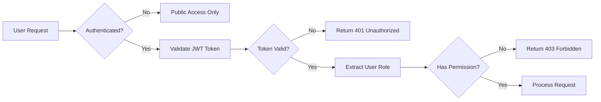
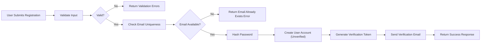
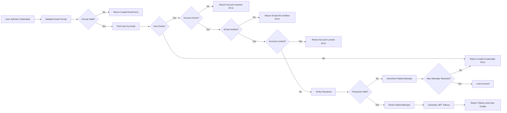
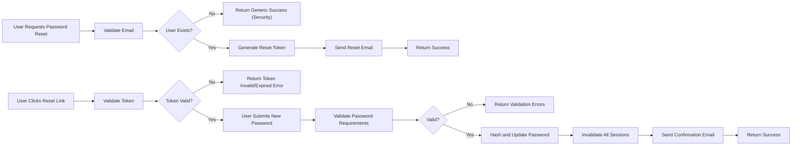
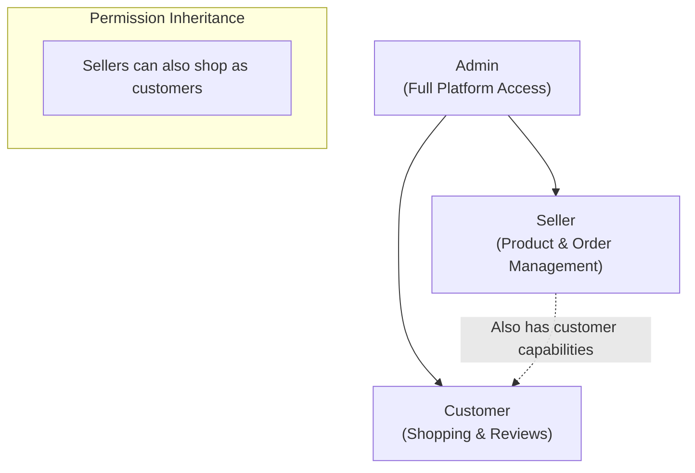
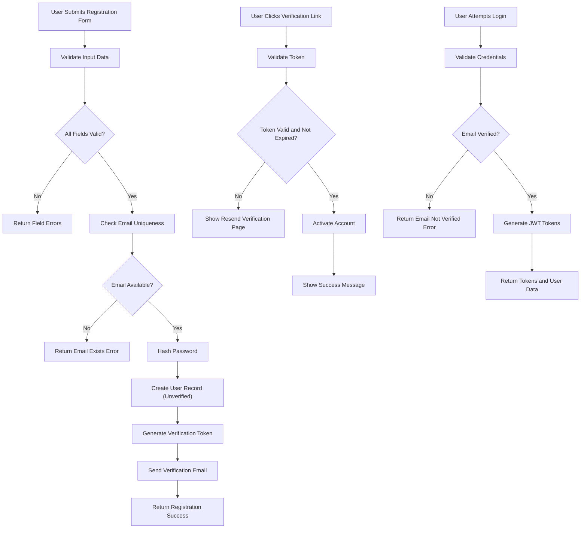
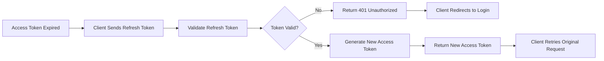
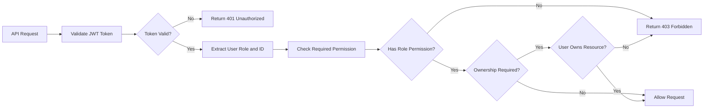

# User Roles and Authentication Requirements

## 1. Authentication System Overview

### 1.1 Purpose and Scope

The shoppingMall e-commerce platform requires a comprehensive authentication and authorization system to support three distinct user roles: customers, sellers, and administrators. This document defines all requirements for user registration, login, session management, and role-based access control.

### 1.2 Security Principles

THE system SHALL implement authentication and authorization based on the following principles:

- **Secure by Default**: All endpoints requiring user identity SHALL enforce authentication
- **Least Privilege**: Users SHALL have access only to resources and actions appropriate for their role
- **Token-Based Authentication**: THE system SHALL use JWT (JSON Web Tokens) for stateless authentication
- **Defense in Depth**: Multiple layers of security SHALL protect user accounts and sensitive operations

### 1.3 Authentication Architecture



## 2. User Registration and Login Requirements

### 2.1 User Registration

#### 2.1.1 Registration Process

WHEN a new user submits registration information, THE system SHALL validate all required fields and create a new user account.

**Required Registration Fields:**
- Email address (must be unique across the system)
- Password (must meet security requirements)
- Full name
- Phone number
- User role selection (customer or seller)

**Registration Business Rules:**

1. THE system SHALL reject registration IF the email address is already registered
2. THE system SHALL validate email format before account creation
3. THE system SHALL validate phone number format according to international standards
4. WHEN a user registers, THE system SHALL create the account in "unverified" status
5. THE system SHALL send a verification email immediately after registration
6. THE system SHALL hash passwords using bcrypt or Argon2 before storage
7. THE system SHALL never store passwords in plain text

#### 2.1.2 Email Verification

WHEN a user receives a verification email, THE system SHALL provide a verification link with a time-limited token.

**Verification Requirements:**

1. THE verification token SHALL expire after 24 hours
2. WHEN a user clicks the verification link, THE system SHALL verify the token and activate the account
3. IF the token is expired, THE system SHALL prompt the user to request a new verification email
4. THE system SHALL allow users to resend verification emails with a rate limit of one per 5 minutes
5. WHILE the account is unverified, THE system SHALL restrict user access to core platform features
6. WHEN email verification succeeds, THE system SHALL change account status to "active"

#### 2.1.3 Registration Flow Diagram



### 2.2 User Login

#### 2.2.1 Login Process

WHEN a user submits login credentials, THE system SHALL authenticate the user and issue access tokens.

**Login Requirements:**

1. THE system SHALL accept email and password for authentication
2. THE system SHALL validate credentials against stored user data
3. WHEN credentials are valid, THE system SHALL generate JWT access and refresh tokens
4. THE system SHALL return user profile information along with tokens
5. IF credentials are invalid, THE system SHALL return a generic authentication error
6. THE system SHALL implement rate limiting to prevent brute force attacks

#### 2.2.2 Login Validation Rules

1. THE system SHALL verify that the account exists
2. THE system SHALL verify that the account is active (not suspended or deleted)
3. THE system SHALL verify that the email is verified before allowing login
4. THE system SHALL compare the provided password with the stored hash
5. IF the account is locked due to failed attempts, THE system SHALL deny login and return lockout duration
6. WHEN login succeeds, THE system SHALL reset the failed login attempt counter

#### 2.2.3 Login Flow Diagram



### 2.3 Logout Process

WHEN a user initiates logout, THE system SHALL invalidate the current session.

**Logout Requirements:**

1. THE system SHALL invalidate the refresh token to prevent future access token generation
2. THE client SHALL discard stored access and refresh tokens
3. THE system SHALL support logout from all devices for a user
4. WHEN a user logs out from all devices, THE system SHALL invalidate all refresh tokens for that user

### 2.4 Password Management

#### 2.4.1 Password Requirements

THE system SHALL enforce the following password policies:

- Minimum length: 8 characters
- Maximum length: 128 characters
- Must contain at least one uppercase letter
- Must contain at least one lowercase letter
- Must contain at least one number
- Must contain at least one special character (@, $, !, %, *, ?, &, #)
- Cannot be the same as the email address
- Cannot be a commonly used weak password (system maintains a blocklist)

#### 2.4.2 Password Reset Flow

WHEN a user requests a password reset, THE system SHALL send a password reset email.

**Password Reset Requirements:**

1. THE user SHALL provide their registered email address
2. THE system SHALL generate a unique password reset token
3. THE reset token SHALL expire after 1 hour
4. THE system SHALL send a password reset email with a secure link
5. WHEN the user clicks the reset link, THE system SHALL validate the token
6. THE user SHALL provide a new password meeting all security requirements
7. WHEN the password is successfully reset, THE system SHALL invalidate all existing sessions
8. THE system SHALL send a confirmation email after password change

#### 2.4.3 Password Reset Flow Diagram



### 2.5 Account Security Features

#### 2.5.1 Account Lockout

WHEN a user fails to login with correct credentials multiple times, THE system SHALL temporarily lock the account.

**Lockout Rules:**

1. THE system SHALL allow 5 failed login attempts within a 15-minute window
2. WHEN 5 failed attempts are detected, THE system SHALL lock the account for 30 minutes
3. THE system SHALL send an email notification about the account lockout
4. THE system SHALL provide a "unlock account via email" option after lockout
5. WHEN the lockout period expires, THE system SHALL automatically unlock the account

#### 2.5.2 Session Security

1. THE system SHALL support concurrent sessions from multiple devices
2. THE system SHALL log all active sessions with device information and location
3. THE user SHALL be able to view all active sessions
4. THE user SHALL be able to revoke any specific session
5. WHEN suspicious activity is detected, THE system SHALL send security alert emails

## 3. User Role Definitions

### 3.1 Customer Role

**Role Name**: `customer`

**Description**: Registered users who can browse products, manage shopping carts and wishlists, place orders, track shipments, write reviews, and manage their delivery addresses.

**Key Capabilities:**
- Browse and search the product catalog
- Manage shopping cart and wishlist
- Place and pay for orders
- Track order status and shipping
- Manage multiple delivery addresses
- Write product reviews and ratings
- View order history
- Request order cancellations and refunds
- Update personal profile information

**Access Level**: Standard user with commerce capabilities

### 3.2 Seller Role

**Role Name**: `seller`

**Description**: Vendor accounts who can list and manage their own products, handle inventory per SKU, view and process orders for their products, and access sales analytics.

**Key Capabilities:**
- Create and manage product listings
- Manage product variants (SKUs) with different colors, sizes, and options
- Track and update inventory levels per SKU
- View and process orders for their products
- Update order fulfillment status
- Access sales analytics and reports
- Manage seller profile information
- Respond to product reviews
- View customer information related to their orders

**Access Level**: Business user with product and order management capabilities

**Restrictions:**
- Can only manage their own products
- Can only view and process orders containing their products
- Cannot access other sellers' data
- Cannot perform administrative functions

### 3.3 Admin Role

**Role Name**: `admin`

**Description**: System administrators who have full access to manage all orders, products, users, and sellers across the platform.

**Key Capabilities:**
- Manage all products across all sellers
- Manage all orders across the platform
- Manage all user accounts (customers, sellers, admins)
- Approve or reject refund requests
- Handle dispute resolution
- Moderate product reviews
- Access comprehensive platform analytics
- Configure system settings
- Manage product categories
- Suspend or activate user accounts
- View all platform data

**Access Level**: Full administrative access

**Restrictions:**
- Admin accounts cannot be created through self-registration
- Admin accounts must be created by existing admins

### 3.4 Role Hierarchy



**Role Inheritance Rules:**

1. THE admin role SHALL have all permissions of seller and customer roles
2. THE seller role SHALL have all permissions of the customer role
3. WHEN a seller places an order, THE system SHALL treat them as a customer for that transaction
4. THE system SHALL track role-specific actions separately from customer actions

## 4. Complete Authentication Flows

### 4.1 Registration to First Login Flow



### 4.2 Token Refresh Flow

WHEN an access token expires, THE system SHALL allow token refresh using a valid refresh token.



**Token Refresh Requirements:**

1. THE system SHALL validate the refresh token signature
2. THE system SHALL verify the refresh token has not expired
3. THE system SHALL verify the refresh token has not been revoked
4. WHEN refresh token is valid, THE system SHALL generate a new access token
5. THE system SHALL maintain the same refresh token unless it's near expiration
6. IF the refresh token expires within 7 days, THE system SHALL issue a new refresh token

## 5. JWT Token Management

### 5.1 Token Structure and Payload

THE system SHALL use JWT (JSON Web Tokens) for authentication with the following structure:

**Access Token Payload:**

```json
{
  "userId": "uuid-string",
  "email": "user@example.com",
  "role": "customer|seller|admin",
  "permissions": ["permission1", "permission2"],
  "iat": 1234567890,
  "exp": 1234569890,
  "type": "access"
}
```

**Refresh Token Payload:**

```json
{
  "userId": "uuid-string",
  "tokenId": "unique-token-id",
  "iat": 1234567890,
  "exp": 1234567890,
  "type": "refresh"
}
```

### 5.2 Token Specifications

#### 5.2.1 Access Token

THE access token SHALL have the following characteristics:

- **Expiration**: 30 minutes from issuance
- **Algorithm**: HS256 (HMAC with SHA-256)
- **Purpose**: Authenticate API requests
- **Storage**: Client-side in localStorage or sessionStorage
- **Transmission**: Sent in Authorization header as Bearer token

**Access Token Requirements:**

1. THE system SHALL validate access token on every authenticated request
2. THE system SHALL verify token signature using the secret key
3. THE system SHALL reject expired access tokens
4. THE system SHALL extract user role and permissions from the token
5. THE system SHALL not accept tokens with type other than "access" for API requests

#### 5.2.2 Refresh Token

THE refresh token SHALL have the following characteristics:

- **Expiration**: 30 days from issuance
- **Algorithm**: HS256 (HMAC with SHA-256)
- **Purpose**: Generate new access tokens
- **Storage**: Client-side in httpOnly cookie (recommended) or localStorage
- **Transmission**: Sent to dedicated refresh endpoint

**Refresh Token Requirements:**

1. THE system SHALL store refresh token IDs in a persistent database
2. THE system SHALL support refresh token revocation
3. WHEN a user logs out, THE system SHALL revoke the associated refresh token
4. WHEN a user changes password, THE system SHALL revoke all refresh tokens
5. THE system SHALL allow users to revoke refresh tokens for specific devices

### 5.3 Token Secret Key Management

**Secret Key Requirements:**

1. THE system SHALL use a strong, randomly generated secret key for JWT signing
2. THE secret key SHALL be at least 256 bits (32 bytes) in length
3. THE secret key SHALL be stored securely in environment variables
4. THE secret key SHALL never be committed to version control
5. THE system SHALL support secret key rotation without service disruption

### 5.4 Token Security Best Practices

1. THE system SHALL validate token signature before trusting token contents
2. THE system SHALL verify token expiration before processing requests
3. THE system SHALL implement token refresh mechanism to minimize access token lifetime
4. THE system SHALL use HTTPS for all token transmission
5. THE system SHALL sanitize and validate all data extracted from tokens

## 6. Permission Matrix

### 6.1 Complete Permission Table

THE following table defines exact permissions for each role across all platform features:

| Feature / Action | Customer | Seller | Admin |
|-----------------|----------|--------|-------|
| **User Account Management** |
| Register new account | ✅ | ✅ | ❌ (Created by admin) |
| Login to account | ✅ | ✅ | ✅ |
| View own profile | ✅ | ✅ | ✅ |
| Update own profile | ✅ | ✅ | ✅ |
| Change own password | ✅ | ✅ | ✅ |
| Delete own account | ✅ | ✅ | ❌ |
| View other user profiles | ❌ | ❌ | ✅ |
| Suspend/activate user accounts | ❌ | ❌ | ✅ |
| **Address Management** |
| Create delivery address | ✅ | ✅ | ✅ |
| View own addresses | ✅ | ✅ | ✅ |
| Update own addresses | ✅ | ✅ | ✅ |
| Delete own addresses | ✅ | ✅ | ✅ |
| Set default address | ✅ | ✅ | ✅ |
| View other users' addresses | ❌ | ❌ (except order-related) | ✅ |
| **Product Browsing** |
| Browse product catalog | ✅ | ✅ | ✅ |
| Search products | ✅ | ✅ | ✅ |
| View product details | ✅ | ✅ | ✅ |
| Filter products by category | ✅ | ✅ | ✅ |
| **Product Management** |
| Create new products | ❌ | ✅ (own only) | ✅ (all) |
| Update product details | ❌ | ✅ (own only) | ✅ (all) |
| Delete products | ❌ | ✅ (own only) | ✅ (all) |
| Manage product variants/SKUs | ❌ | ✅ (own only) | ✅ (all) |
| Upload product images | ❌ | ✅ (own only) | ✅ (all) |
| View all products | ❌ | ❌ (own only) | ✅ |
| **Inventory Management** |
| Update inventory levels | ❌ | ✅ (own products) | ✅ (all) |
| View inventory status | ❌ | ✅ (own products) | ✅ (all) |
| Set low stock alerts | ❌ | ✅ (own products) | ✅ (all) |
| **Shopping Cart** |
| Add items to cart | ✅ | ✅ | ✅ |
| View cart | ✅ | ✅ | ✅ |
| Update cart quantities | ✅ | ✅ | ✅ |
| Remove items from cart | ✅ | ✅ | ✅ |
| Clear cart | ✅ | ✅ | ✅ |
| **Wishlist** |
| Add items to wishlist | ✅ | ✅ | ✅ |
| View wishlist | ✅ | ✅ | ✅ |
| Remove items from wishlist | ✅ | ✅ | ✅ |
| Move items between cart and wishlist | ✅ | ✅ | ✅ |
| **Order Placement** |
| Place new orders | ✅ | ✅ | ✅ |
| Select delivery address | ✅ | ✅ | ✅ |
| Select shipping method | ✅ | ✅ | ✅ |
| Process payment | ✅ | ✅ | ✅ |
| **Order Management** |
| View own order history | ✅ | ✅ | ✅ |
| View order details (own) | ✅ | ✅ | ✅ |
| Track order status (own) | ✅ | ✅ | ✅ |
| View orders containing own products | ❌ | ✅ | ✅ |
| View all platform orders | ❌ | ❌ | ✅ |
| Update order fulfillment status | ❌ | ✅ (own products) | ✅ (all) |
| Update shipping status | ❌ | ✅ (own products) | ✅ (all) |
| **Order Cancellation & Refunds** |
| Request order cancellation | ✅ (own orders) | ✅ (own orders) | ✅ |
| Request refund | ✅ (own orders) | ✅ (own orders) | ✅ |
| Approve/reject cancellation | ❌ | ❌ | ✅ |
| Approve/reject refund | ❌ | ❌ | ✅ |
| Process refund payment | ❌ | ❌ | ✅ |
| **Product Reviews** |
| Write product review | ✅ (purchased only) | ✅ (purchased only) | ✅ |
| Rate products | ✅ (purchased only) | ✅ (purchased only) | ✅ |
| Edit own reviews | ✅ | ✅ | ✅ |
| Delete own reviews | ✅ | ✅ | ✅ |
| View all reviews | ✅ | ✅ | ✅ |
| Respond to reviews | ❌ | ✅ (own products) | ✅ (all) |
| Moderate/delete reviews | ❌ | ❌ | ✅ |
| **Analytics & Reports** |
| View own sales analytics | ❌ | ✅ | ✅ |
| View own order statistics | ✅ | ✅ | ✅ |
| View platform-wide analytics | ❌ | ❌ | ✅ |
| Export sales reports | ❌ | ✅ (own data) | ✅ (all data) |
| **Category Management** |
| View categories | ✅ | ✅ | ✅ |
| Create categories | ❌ | ❌ | ✅ |
| Update categories | ❌ | ❌ | ✅ |
| Delete categories | ❌ | ❌ | ✅ |
| **System Administration** |
| View system logs | ❌ | ❌ | ✅ |
| Configure system settings | ❌ | ❌ | ✅ |
| Manage admin accounts | ❌ | ❌ | ✅ |
| Handle dispute resolution | ❌ | ❌ | ✅ |

### 6.2 Permission Enforcement Requirements

**Permission Validation Rules:**

1. THE system SHALL validate user permissions on every API request requiring authorization
2. WHEN a user attempts an unauthorized action, THE system SHALL return HTTP 403 Forbidden
3. THE system SHALL log all permission denial attempts for security monitoring
4. THE system SHALL validate permissions based on both user role and specific resource ownership
5. WHEN checking ownership-based permissions, THE system SHALL verify the resource belongs to the requesting user

**Permission Check Flow:**



## 7. Session Management Requirements

### 7.1 Session Lifecycle

**Session Creation:**

1. WHEN a user successfully logs in, THE system SHALL create a new session
2. THE system SHALL generate a unique session identifier
3. THE system SHALL store session metadata including device information and IP address
4. THE system SHALL associate the refresh token with the session

**Session Persistence:**

1. THE system SHALL maintain session data for the duration of the refresh token validity
2. THE system SHALL track session last activity timestamp
3. WHILE a session is active, THE system SHALL allow token refresh operations
4. THE system SHALL automatically expire sessions after 30 days of inactivity

**Session Termination:**

1. WHEN a user logs out, THE system SHALL terminate the current session
2. WHEN a session is terminated, THE system SHALL revoke associated refresh tokens
3. THE system SHALL support "logout from all devices" functionality
4. WHEN a user changes password, THE system SHALL terminate all sessions except the current one

### 7.2 Multi-Device Support

**Multi-Device Requirements:**

1. THE system SHALL support concurrent sessions from multiple devices
2. THE system SHALL allow users to view all active sessions
3. THE system SHALL display device information for each session (device type, browser, location)
4. THE system SHALL allow users to terminate any specific session remotely
5. THE system SHALL send notifications when new device login is detected

**Active Session Display Information:**

- Device type (mobile, tablet, desktop)
- Browser name and version
- Operating system
- IP address and approximate location
- Login timestamp
- Last activity timestamp
- Session status (active/expired)

### 7.3 Session Security

**Security Requirements:**

1. THE system SHALL detect and flag suspicious login attempts from new locations
2. WHEN a login from a new device is detected, THE system SHALL send email notification
3. THE system SHALL implement rate limiting on authentication endpoints
4. THE system SHALL log all authentication events for security auditing
5. IF multiple failed login attempts are detected from the same IP, THE system SHALL implement temporary IP blocking

## 8. Password and Security Requirements

### 8.1 Password Policy

THE system SHALL enforce the following password requirements:

**Complexity Rules:**

1. Minimum length: 8 characters
2. Maximum length: 128 characters
3. Must contain at least one uppercase letter (A-Z)
4. Must contain at least one lowercase letter (a-z)
5. Must contain at least one digit (0-9)
6. Must contain at least one special character: @$!%*?&#

**Validation Rules:**

1. THE system SHALL validate password strength during registration and password changes
2. THE system SHALL reject passwords that match the user's email address
3. THE system SHALL reject commonly used weak passwords (maintain blocklist)
4. THE system SHALL provide real-time password strength feedback during entry
5. THE system SHALL reject passwords that have been previously used (maintain history of last 5 passwords)

### 8.2 Password Storage and Encryption

**Encryption Requirements:**

1. THE system SHALL hash all passwords using bcrypt with a cost factor of 12 or Argon2
2. THE system SHALL never store passwords in plain text
3. THE system SHALL never store passwords in reversible encryption
4. THE system SHALL use unique salt for each password
5. THE system SHALL never transmit passwords in plain text (HTTPS required)
6. THE system SHALL never log passwords in any form

### 8.3 Password Change Requirements

**Password Change Process:**

1. WHEN a user requests password change, THE system SHALL require current password verification
2. THE system SHALL validate the new password against all password policy rules
3. THE system SHALL reject new passwords that match any of the last 5 passwords
4. WHEN password change succeeds, THE system SHALL invalidate all existing sessions except the current one
5. THE system SHALL send confirmation email after password change
6. THE system SHALL send security alert if password change was not initiated by the user

### 8.4 Account Recovery Security

**Security Measures:**

1. THE system SHALL generate cryptographically secure random tokens for password reset
2. THE password reset token SHALL be at least 32 bytes of random data
3. THE password reset link SHALL expire after 1 hour
4. THE system SHALL invalidate password reset tokens after use
5. THE system SHALL allow only one active password reset token per user
6. THE system SHALL implement rate limiting on password reset requests (maximum 3 per hour)

## 9. Address Management (Customer Feature)

### 9.1 Address Management Overview

Customers, sellers (when purchasing), and admins require the ability to manage multiple delivery addresses for order fulfillment.

### 9.2 Address CRUD Operations

#### 9.2.1 Create Address

WHEN a user creates a new delivery address, THE system SHALL store all required address information.

**Required Address Fields:**

- Recipient name
- Phone number
- Address line 1 (street address)
- Address line 2 (apartment, suite, unit - optional)
- City
- State/Province
- Postal/ZIP code
- Country
- Address label (e.g., "Home", "Office") - optional

**Address Creation Rules:**

1. THE system SHALL validate all required fields are provided
2. THE system SHALL validate phone number format
3. THE system SHALL validate postal code format based on country
4. THE system SHALL allow users to create multiple delivery addresses
5. THE system SHALL not impose a limit on number of addresses per user
6. IF this is the user's first address, THE system SHALL automatically set it as default

#### 9.2.2 View Addresses

THE system SHALL allow users to view all their saved addresses.

**Address Display Requirements:**

1. THE system SHALL display all addresses belonging to the user
2. THE system SHALL indicate which address is set as default
3. THE system SHALL display addresses in order of most recently used
4. THE system SHALL show complete address details for each saved address

#### 9.2.3 Update Address

WHEN a user updates an existing address, THE system SHALL validate and save changes.

**Update Requirements:**

1. THE user SHALL be able to update any field of their own addresses
2. THE system SHALL validate all fields according to address creation rules
3. THE system SHALL prevent users from updating addresses they don't own
4. WHEN an address is updated, THE system SHALL preserve address history for order tracking purposes

#### 9.2.4 Delete Address

WHEN a user deletes an address, THE system SHALL handle address removal safely.

**Delete Requirements:**

1. THE user SHALL be able to delete their own addresses
2. THE system SHALL prevent deletion of addresses associated with pending orders
3. IF the deleted address was the default, THE system SHALL prompt user to select a new default
4. IF the deleted address was the default and only address, THE system SHALL clear the default designation
5. THE system SHALL soft-delete addresses to maintain order history integrity

### 9.3 Default Address Selection

**Default Address Rules:**

1. THE system SHALL allow users to designate one address as default
2. WHEN a user sets a new default address, THE system SHALL remove default status from previous address
3. WHEN a user initiates checkout, THE system SHALL pre-select the default address
4. THE system SHALL allow users to change address during checkout regardless of default setting
5. IF no default address is set, THE system SHALL require address selection during checkout

### 9.4 Address Usage in Orders

**Address and Order Relationship:**

1. WHEN an order is placed, THE system SHALL snapshot the delivery address at that moment
2. THE system SHALL preserve original address details even if user later updates or deletes the address
3. THE system SHALL display the order-time address snapshot in order history
4. THE system SHALL allow users to select different addresses for different order items if shipped separately

## 10. Role-Based Access Control Rules

### 10.1 Access Control Principles

THE system SHALL implement role-based access control (RBAC) with the following principles:

**Core RBAC Principles:**

1. **Role Assignment**: Every user SHALL be assigned exactly one primary role (customer, seller, or admin)
2. **Permission Association**: Each role SHALL have a defined set of permissions
3. **Least Privilege**: Users SHALL have access only to resources necessary for their role
4. **Separation of Duties**: Critical operations SHALL require appropriate role permissions

### 10.2 Permission Enforcement

**Enforcement Requirements:**

1. THE system SHALL verify user authentication before checking permissions
2. THE system SHALL validate role-based permissions on every protected API endpoint
3. THE system SHALL validate resource ownership for ownership-based permissions
4. WHEN permission check fails, THE system SHALL return HTTP 403 Forbidden
5. THE system SHALL never expose protected data even in error messages

### 10.3 Role Transition Scenarios

#### 10.3.1 Customer to Seller Transition

WHEN a customer requests to become a seller, THE system SHALL support role upgrade.

**Seller Upgrade Process:**

1. THE customer SHALL submit a seller registration request with business information
2. THE system SHALL require additional seller-specific information (business name, tax ID, etc.)
3. THE admin SHALL review and approve seller applications
4. WHEN approved, THE system SHALL change the user's role from customer to seller
5. THE system SHALL preserve all customer data (orders, reviews, addresses)
6. THE seller SHALL retain access to all previous customer features
7. THE seller SHALL gain access to product and inventory management features

#### 10.3.2 Seller Downgrade or Suspension

WHEN a seller violates policies or requests account downgrade, THE system SHALL handle role changes.

**Seller Suspension:**

1. THE admin SHALL be able to suspend seller accounts
2. WHEN a seller is suspended, THE system SHALL hide all their products from the catalog
3. WHEN a seller is suspended, THE system SHALL prevent new product creation
4. THE seller SHALL retain access to existing orders and communications
5. THE system SHALL notify customers with pending orders from suspended sellers

### 10.4 Admin Account Management

**Admin Creation Rules:**

1. THE system SHALL not allow self-registration as admin
2. THE existing admin SHALL create new admin accounts manually
3. THE system SHALL require secure approval process for admin creation
4. THE admin accounts SHALL have additional security requirements (2FA recommended for future)

### 10.5 Permission Inheritance

**Inheritance Rules:**

1. THE seller role SHALL inherit all customer permissions
2. THE admin role SHALL inherit all seller and customer permissions
3. WHEN a seller performs customer actions (shopping, reviews), THE system SHALL treat them as a customer
4. WHEN an admin performs seller actions, THE system SHALL track admin activity separately

## 11. Authentication Error Handling

### 11.1 Common Authentication Errors

THE system SHALL handle authentication errors with appropriate responses:

| Error Scenario | HTTP Status | Error Code | User Message |
|---------------|-------------|------------|--------------|
| Invalid credentials | 401 | AUTH_INVALID_CREDENTIALS | "Invalid email or password" |
| Account not verified | 403 | AUTH_EMAIL_NOT_VERIFIED | "Please verify your email address before logging in" |
| Account locked | 403 | AUTH_ACCOUNT_LOCKED | "Your account has been locked due to multiple failed login attempts. Please try again in 30 minutes or reset your password" |
| Account suspended | 403 | AUTH_ACCOUNT_SUSPENDED | "Your account has been suspended. Please contact support" |
| Token expired | 401 | AUTH_TOKEN_EXPIRED | "Your session has expired. Please login again" |
| Invalid token | 401 | AUTH_INVALID_TOKEN | "Invalid authentication token" |
| Missing token | 401 | AUTH_TOKEN_REQUIRED | "Authentication required" |
| Insufficient permissions | 403 | AUTH_PERMISSION_DENIED | "You do not have permission to perform this action" |
| Password too weak | 400 | AUTH_WEAK_PASSWORD | "Password does not meet security requirements" |
| Email already exists | 409 | AUTH_EMAIL_EXISTS | "An account with this email address already exists" |
| Reset token invalid | 400 | AUTH_RESET_TOKEN_INVALID | "Password reset link is invalid or has expired" |

### 11.2 Error Response Format

THE system SHALL return authentication errors in the following format:

```json
{
  "success": false,
  "error": {
    "code": "AUTH_INVALID_CREDENTIALS",
    "message": "Invalid email or password",
    "details": null
  },
  "timestamp": "2025-10-13T06:48:40.582Z"
}
```

### 11.3 Security Considerations for Errors

**Secure Error Handling:**

1. THE system SHALL never reveal whether an email exists during login failures
2. THE system SHALL use generic error messages for authentication failures
3. THE system SHALL never expose password requirements in error messages after hash comparison
4. THE system SHALL log detailed error information server-side without exposing to clients
5. THE system SHALL implement rate limiting on endpoints returning authentication errors

## 12. Performance Requirements

### 12.1 Authentication Performance

THE system SHALL meet the following performance expectations:

**Response Time Requirements:**

1. WHEN a user submits login credentials, THE system SHALL respond within 2 seconds
2. WHEN validating a JWT token, THE system SHALL complete validation within 100 milliseconds
3. WHEN refreshing an access token, THE system SHALL respond within 1 second
4. WHEN creating a new user account, THE system SHALL complete registration within 3 seconds
5. WHEN sending verification or password reset emails, THE system SHALL queue emails within 1 second

**Throughput Requirements:**

1. THE system SHALL support at least 100 concurrent login requests
2. THE system SHALL support at least 1000 concurrent token validation operations
3. THE system SHALL handle authentication operations without degrading other platform performance

### 12.2 Scalability Considerations

**Scalability Requirements:**

1. THE authentication system SHALL scale horizontally to handle increased load
2. THE system SHALL use stateless JWT tokens to avoid session storage bottlenecks
3. THE system SHALL implement caching for frequently accessed user permission data
4. THE system SHALL support database read replicas for user authentication data

## 13. Business Rules Summary

### 13.1 Registration and Verification

1. Users can self-register as customers or sellers
2. Email addresses must be unique across the entire platform
3. All accounts require email verification before full platform access
4. Verification links expire after 24 hours
5. Users can request new verification emails with 5-minute rate limiting

### 13.2 Authentication and Sessions

1. Login requires verified email and correct password
2. Access tokens expire after 30 minutes
3. Refresh tokens expire after 30 days
4. Failed login attempts trigger account lockout after 5 failures
5. Account lockout duration is 30 minutes
6. Password changes invalidate all existing sessions
7. Users can maintain multiple concurrent sessions from different devices

### 13.3 Password Security

1. Passwords must be 8-128 characters with complexity requirements
2. Passwords cannot match email address or be commonly weak passwords
3. System maintains history of last 5 passwords to prevent reuse
4. Password reset tokens expire after 1 hour
5. Only 3 password reset requests allowed per hour per user

### 13.4 Role and Permission Management

1. Every user has exactly one role: customer, seller, or admin
2. Sellers inherit all customer permissions
3. Admins inherit all seller and customer permissions
4. Sellers can only manage their own products and related orders
5. Admins cannot self-register and must be created by existing admins
6. Customers can upgrade to sellers through admin approval process

### 13.5 Address Management

1. Users can maintain unlimited delivery addresses
2. First address is automatically set as default
3. Addresses cannot be deleted if associated with pending orders
4. Order addresses are snapshotted and preserved even after address updates
5. Each user must have at least one address to complete checkout

## 14. Conclusion

This document provides comprehensive authentication and authorization requirements for the shoppingMall e-commerce platform. Backend developers must implement:

- Complete user registration with email verification
- Secure login with JWT token-based authentication
- Role-based access control with three distinct user roles
- Multi-device session management
- Robust password security and account recovery
- Address management for delivery
- Comprehensive permission enforcement across all platform features

All authentication requirements must be implemented according to EARS specifications and security best practices to ensure a secure, scalable, and user-friendly authentication system.

> *Developer Note: This document defines **business requirements only**. All technical implementations (architecture, APIs, database design, etc.) are at the discretion of the development team.*
