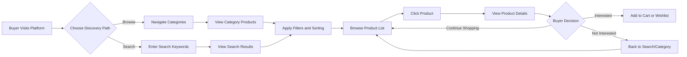
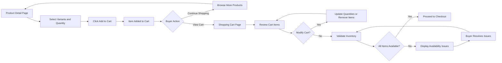
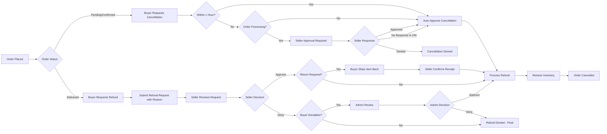

# Buyer User Journey - E-commerce Shopping Mall Platform

## 1. Introduction

### 1.1 Document Purpose

This document defines the complete buyer user journey for the e-commerce shopping mall platform. It specifies all interactions, workflows, and business requirements from a buyer's perspective, covering registration, product discovery, purchasing, and post-purchase activities.

### 1.2 Buyer Actor Definition

**Buyers** are authenticated customers who represent the primary revenue-generating users of the platform. They interact with the marketplace to discover products from multiple sellers, make purchases, track orders, and provide feedback through reviews.

### 1.3 Buyer Capabilities Overview

Buyers can perform the following activities:
- Register and manage their account with profile and addresses
- Browse and search the product catalog across all sellers
- Add products to shopping cart and wishlist
- Complete purchases through secure checkout
- Track order status and shipping information
- Submit reviews and ratings for purchased products
- Manage order history and request cancellations or refunds
- Save multiple delivery addresses for convenience

### 1.4 Document Scope

This document focuses exclusively on buyer-facing business requirements and user workflows. Technical implementation details such as API specifications, database schemas, and infrastructure architecture are outside the scope of this document and are at the discretion of the development team.

For related information:
- Authentication mechanisms: See [User Actors and Authentication Document](./02-user-actors-authentication.md)
- Product catalog structure: See [Product Catalog Requirements](./06-product-catalog-requirements.md)
- Shopping cart details: See [Shopping Cart and Wishlist](./07-shopping-cart-wishlist.md)
- Order processing: See [Order Management Workflow](./08-order-management-workflow.md)
- Review system: See [Reviews and Ratings System](./09-reviews-ratings-system.md)

---

## 2. Buyer Registration and Onboarding

### 2.1 Registration Process

#### 2.1.1 Account Creation Requirements

**REQ-BUY-REG-001**: THE system SHALL allow new users to register as buyers using email and password.

**REQ-BUY-REG-002**: WHEN a user submits registration information, THE system SHALL validate that the email address is unique and not already registered.

**REQ-BUY-REG-003**: THE system SHALL enforce password requirements including minimum 8 characters with at least one uppercase letter, one lowercase letter, one number, and one special character.

**REQ-BUY-REG-004**: WHEN a user provides an email that is already registered, THE system SHALL return an error message indicating the email is already in use and suggest login or password recovery.

**REQ-BUY-REG-005**: THE system SHALL collect the following information during buyer registration:
- Email address (required, unique)
- Password (required, meeting complexity requirements)
- Full name (required)
- Phone number (optional)

**REQ-BUY-REG-006**: WHEN registration is successful, THE system SHALL create a buyer account in inactive status pending email verification.

#### 2.1.2 Email Verification Workflow

**REQ-BUY-VER-001**: WHEN a buyer account is created, THE system SHALL send a verification email to the registered email address within 30 seconds.

**REQ-BUY-VER-002**: THE verification email SHALL contain a unique verification link valid for 24 hours.

**REQ-BUY-VER-003**: WHEN a buyer clicks the verification link, THE system SHALL activate the account and redirect to login page.

**REQ-BUY-VER-004**: IF the verification link has expired, THEN THE system SHALL allow the buyer to request a new verification email.

**REQ-BUY-VER-005**: WHILE a buyer account is unverified, THE system SHALL prevent login and display a message prompting email verification.

**REQ-BUY-VER-006**: THE system SHALL allow a maximum of 3 verification email resend requests per hour per account to prevent abuse.

#### 2.1.3 Login and Session Management

**REQ-BUY-LOGIN-001**: WHEN a verified buyer submits correct email and password credentials, THE system SHALL authenticate the user and create an active session within 2 seconds.

**REQ-BUY-LOGIN-002**: THE system SHALL issue a JWT access token valid for 30 minutes and a refresh token valid for 30 days upon successful authentication.

**REQ-BUY-LOGIN-003**: WHEN login credentials are invalid, THE system SHALL return an error message without specifying whether the email or password was incorrect (security best practice).

**REQ-BUY-LOGIN-004**: THE system SHALL implement rate limiting of 5 failed login attempts per email address within a 15-minute window.

**REQ-BUY-LOGIN-005**: IF a buyer exceeds failed login attempts, THEN THE system SHALL temporarily lock the account for 15 minutes and send a security notification email.

**REQ-BUY-LOGIN-006**: THE system SHALL provide "Remember Me" functionality that extends the refresh token validity to 90 days when enabled.

**REQ-BUY-SESSION-001**: THE system SHALL automatically log out buyers after 30 days of inactivity.

**REQ-BUY-SESSION-002**: WHEN an access token expires, THE system SHALL allow token refresh using a valid refresh token without requiring re-authentication.

### 2.2 Profile Management

#### 2.2.1 Profile Information

**REQ-BUY-PROF-001**: THE system SHALL allow buyers to view and edit their profile information including:
- Full name
- Email address (with re-verification if changed)
- Phone number
- Profile photo (optional)

**REQ-BUY-PROF-002**: WHEN a buyer changes their email address, THE system SHALL require email verification before the change takes effect.

**REQ-BUY-PROF-003**: THE system SHALL allow buyers to change their password by providing the current password and new password meeting complexity requirements.

**REQ-BUY-PROF-004**: WHEN a buyer changes their password, THE system SHALL invalidate all existing sessions except the current one and send a security notification email.

#### 2.2.2 Password Recovery

**REQ-BUY-PASS-001**: THE system SHALL provide a "Forgot Password" function accessible from the login page.

**REQ-BUY-PASS-002**: WHEN a buyer requests password recovery, THE system SHALL send a password reset link to the registered email address within 30 seconds.

**REQ-BUY-PASS-003**: THE password reset link SHALL be valid for 1 hour and can only be used once.

**REQ-BUY-PASS-004**: WHEN a buyer uses a valid reset link, THE system SHALL allow setting a new password without requiring the old password.

**REQ-BUY-PASS-005**: THE system SHALL limit password reset requests to 3 per hour per email address to prevent abuse.

### 2.3 Address Management

#### 2.3.1 Saved Addresses

**REQ-BUY-ADDR-001**: THE system SHALL allow buyers to save multiple delivery addresses for future orders.

**REQ-BUY-ADDR-002**: THE system SHALL collect the following address information:
- Address label (e.g., "Home", "Office") - required
- Recipient name - required
- Phone number - required
- Street address line 1 - required
- Street address line 2 - optional
- City - required
- State/Province - required
- Postal/ZIP code - required
- Country - required
- Special delivery instructions - optional

**REQ-BUY-ADDR-003**: THE system SHALL allow buyers to designate one address as the default shipping address.

**REQ-BUY-ADDR-004**: WHEN a buyer creates their first address, THE system SHALL automatically set it as the default address.

**REQ-BUY-ADDR-005**: THE system SHALL allow buyers to edit and delete saved addresses.

**REQ-BUY-ADDR-006**: IF a buyer attempts to delete the default address while other addresses exist, THEN THE system SHALL require selecting a new default address first.

**REQ-BUY-ADDR-007**: THE system SHALL support a maximum of 10 saved addresses per buyer account.

**REQ-BUY-ADDR-008**: WHEN a buyer exceeds the address limit, THE system SHALL require deleting an existing address before adding a new one.

---

## 3. Product Discovery and Search Journey

### 3.1 Homepage and Category Browsing

#### 3.1.1 Homepage Experience

**REQ-BUY-HOME-001**: THE system SHALL display a homepage featuring:
- Featured products from multiple sellers
- Popular categories
- New arrivals (products added within 7 days)
- Top-rated products (rating 4.5 stars and above)
- Special promotions and deals

**REQ-BUY-HOME-002**: THE homepage SHALL load and display initial content within 2 seconds for optimal user experience.

**REQ-BUY-HOME-003**: THE system SHALL personalize the homepage based on buyer browsing history and past purchases WHERE the buyer is logged in.

**REQ-BUY-HOME-004**: THE system SHALL display products from all approved sellers without bias toward specific sellers on the homepage.

#### 3.1.2 Category Navigation

**REQ-BUY-CAT-001**: THE system SHALL organize products in a hierarchical category structure with parent and child categories.

**REQ-BUY-CAT-002**: THE system SHALL display top-level categories prominently in the main navigation menu.

**REQ-BUY-CAT-003**: WHEN a buyer clicks a parent category, THE system SHALL display all child categories and products within that category.

**REQ-BUY-CAT-004**: THE system SHALL support category browsing depth up to 3 levels (parent → child → grandchild).

**REQ-BUY-CAT-005**: THE system SHALL display the number of available products in each category to help buyers make browsing decisions.

**REQ-BUY-CAT-006**: WHEN browsing a category, THE system SHALL display products in paginated format with 24 products per page.

### 3.2 Product Search

#### 3.2.1 Search Functionality

**REQ-BUY-SEARCH-001**: THE system SHALL provide a search bar accessible from all pages allowing buyers to search for products by keywords.

**REQ-BUY-SEARCH-002**: WHEN a buyer enters search keywords, THE system SHALL return relevant results within 1 second for common queries.

**REQ-BUY-SEARCH-003**: THE system SHALL search across the following product attributes:
- Product title
- Product description
- Category names
- Seller name
- Product tags/keywords

**REQ-BUY-SEARCH-004**: THE system SHALL implement fuzzy search to handle minor spelling errors and suggest corrections.

**REQ-BUY-SEARCH-005**: WHEN no products match the search query, THE system SHALL display a helpful message and suggest:
- Checking spelling
- Using fewer or different keywords
- Browsing popular categories
- Similar search terms used by other buyers

**REQ-BUY-SEARCH-006**: THE system SHALL display search results in paginated format with 24 products per page.

**REQ-BUY-SEARCH-007**: THE system SHALL provide autocomplete suggestions as buyers type in the search bar, displaying relevant product names and categories.

#### 3.2.2 Search Filtering

**REQ-BUY-FILTER-001**: THE system SHALL provide the following filter options for search and category results:
- Price range (minimum and maximum)
- Customer ratings (5 stars, 4+ stars, 3+ stars)
- Seller name
- Product availability (in stock only)
- Product variants (color, size, specific options)

**REQ-BUY-FILTER-002**: WHEN a buyer applies filters, THE system SHALL update results instantly (within 500 milliseconds).

**REQ-BUY-FILTER-003**: THE system SHALL allow buyers to apply multiple filters simultaneously in an additive manner (AND logic).

**REQ-BUY-FILTER-004**: THE system SHALL display the count of products matching current filter selections.

**REQ-BUY-FILTER-005**: THE system SHALL provide a "Clear All Filters" option to reset to unfiltered results.

**REQ-BUY-FILTER-006**: THE system SHALL preserve selected filters when buyers navigate between search result pages.

#### 3.2.3 Search Sorting

**REQ-BUY-SORT-001**: THE system SHALL provide the following sorting options for search and category results:
- Relevance (default for search results)
- Price: Low to High
- Price: High to Low
- Newest Arrivals
- Customer Rating: High to Low
- Best Selling (based on order volume)

**REQ-BUY-SORT-002**: WHEN a buyer changes the sort order, THE system SHALL re-order results instantly (within 500 milliseconds).

**REQ-BUY-SORT-003**: THE system SHALL preserve the selected sort order when buyers navigate between result pages.

**REQ-BUY-SORT-004**: WHERE the buyer is browsing a category without search keywords, THE system SHALL default to "Newest Arrivals" sort order.

### 3.3 Product Discovery Workflow

---

## 4. Product Detail Exploration

### 4.1 Product Information Display

#### 4.1.1 Essential Product Details

**REQ-BUY-PROD-001**: THE system SHALL display the following product information on the product detail page:
- Product title
- Product description (full text)
- Category breadcrumb navigation
- Seller name with link to seller's store
- Current price per selected variant
- Original price (if on sale)
- Discount percentage (if applicable)
- Average rating and total number of reviews
- Product availability status (in stock, out of stock, limited quantity)
- Estimated delivery timeframe

**REQ-BUY-PROD-002**: THE product detail page SHALL load and display core information within 2 seconds for optimal user experience.

**REQ-BUY-PROD-003**: THE system SHALL display product images in a gallery format with:
- Main large image display
- Thumbnail images for additional product photos
- Zoom functionality on hover or click
- Support for at least 8 product images
- Variant-specific images where applicable

**REQ-BUY-PROD-004**: THE system SHALL display detailed product specifications in a structured format (table or list) including dimensions, materials, features, and technical details WHERE provided by the seller.

#### 4.1.2 Product Variant Selection

**REQ-BUY-VAR-001**: WHERE a product has variants (color, size, options), THE system SHALL display all available variant options with clear selection interfaces.

**REQ-BUY-VAR-002**: WHEN a buyer selects a variant option, THE system SHALL update the following instantly:
- Product images to show the selected variant
- Price specific to the selected variant
- Stock availability for the selected variant
- SKU identifier

**REQ-BUY-VAR-003**: THE system SHALL visually indicate out-of-stock variants by displaying them as disabled or crossed-out options.

**REQ-BUY-VAR-004**: IF a buyer selects a variant combination that is out of stock, THEN THE system SHALL display a clear message indicating unavailability and suggest similar in-stock variants.

**REQ-BUY-VAR-005**: THE system SHALL require buyers to select all required variant options before allowing add-to-cart action.

**REQ-BUY-VAR-006**: WHEN a buyer has not selected all required variants, THE system SHALL display a validation message indicating which variant options must be selected.

**REQ-BUY-VAR-007**: THE system SHALL display variant-specific pricing clearly, showing any price differences between variant options.

### 4.2 Seller Information

**REQ-BUY-SELLER-001**: THE system SHALL display the following seller information on the product detail page:
- Seller name
- Seller rating (if available)
- Number of products sold
- Seller response time (average)
- Link to seller's full store page

**REQ-BUY-SELLER-002**: WHEN a buyer clicks the seller name or store link, THE system SHALL navigate to the seller's dedicated store page showing all their products.

**REQ-BUY-SELLER-003**: THE system SHALL display seller policies on the product page including:
- Return policy
- Shipping policy
- Estimated processing time

### 4.3 Reviews and Ratings Display

**REQ-BUY-REV-DISP-001**: THE system SHALL display the following review information on the product detail page:
- Overall average rating (1-5 stars with decimal precision)
- Total number of reviews
- Rating distribution breakdown (count of 5-star, 4-star, 3-star, 2-star, 1-star reviews)
- Recent reviews (at least 5 most recent)

**REQ-BUY-REV-DISP-002**: THE system SHALL allow buyers to filter reviews by:
- Star rating (show only 5-star, 4-star, etc.)
- Verified purchase only
- Reviews with photos
- Most recent or most helpful

**REQ-BUY-REV-DISP-003**: THE system SHALL sort reviews by "Most Helpful" by default, based on helpfulness votes from other buyers.

**REQ-BUY-REV-DISP-004**: THE system SHALL display review content including:
- Reviewer name (or anonymous)
- Rating (1-5 stars)
- Review title
- Review text
- Review photos (if provided)
- Purchase verification badge
- Date of review
- Seller response (if provided)
- Helpfulness vote count

**REQ-BUY-REV-DISP-005**: THE system SHALL paginate reviews with 10 reviews per page for readability.

### 4.4 Related Products

**REQ-BUY-RELATED-001**: THE system SHALL display a "Related Products" section showing products that are:
- In the same category
- From the same seller
- Frequently bought together
- Similar in attributes

**REQ-BUY-RELATED-002**: THE system SHALL display at least 8 related products in a horizontal scrollable carousel format.

**REQ-BUY-RELATED-003**: WHEN a buyer clicks a related product, THE system SHALL navigate to that product's detail page.

### 4.5 Add to Cart and Wishlist Actions

**REQ-BUY-ATC-001**: THE system SHALL provide prominent "Add to Cart" and "Add to Wishlist" buttons on the product detail page.

**REQ-BUY-ATC-002**: THE system SHALL allow buyers to specify quantity before adding to cart, with default quantity of 1.

**REQ-BUY-ATC-003**: WHEN a buyer clicks "Add to Cart" with all required variants selected, THE system SHALL add the item to cart and display a confirmation message within 500 milliseconds.

**REQ-BUY-ATC-004**: IF a buyer attempts to add a quantity exceeding available stock, THEN THE system SHALL limit the quantity to available stock and display a notification.

**REQ-BUY-ATC-005**: THE system SHALL allow buyers to add products to wishlist without selecting variants, saving the product generally for later consideration.

**REQ-BUY-ATC-006**: WHEN a buyer adds an item to cart or wishlist, THE system SHALL provide options to:
- Continue shopping
- View cart
- Proceed to checkout (for add to cart)

---

## 5. Shopping Cart Management

### 5.1 Cart Functionality

#### 5.1.1 Adding and Viewing Cart Items

**REQ-BUY-CART-001**: THE system SHALL maintain a persistent shopping cart for authenticated buyers that persists across browser sessions and devices.

**REQ-BUY-CART-002**: THE system SHALL allow buyers to view their shopping cart at any time through a cart icon with item count badge in the header.

**REQ-BUY-CART-003**: THE system SHALL display the following information for each cart item:
- Product image (variant-specific)
- Product title
- Selected variant details (color, size, options)
- Price per unit
- Quantity selector
- Subtotal (price × quantity)
- Seller name
- Stock availability status
- Remove item button

**REQ-BUY-CART-004**: THE system SHALL group cart items by seller to facilitate multi-seller order processing.

**REQ-BUY-CART-005**: THE system SHALL display cart summary information including:
- Total number of items
- Subtotal (sum of all item subtotals)
- Estimated shipping cost (if calculable at cart stage)
- Estimated taxes (if applicable)
- Order total

#### 5.1.2 Cart Item Modifications

**REQ-BUY-CART-MOD-001**: THE system SHALL allow buyers to update item quantities directly in the cart using increment/decrement controls or direct input.

**REQ-BUY-CART-MOD-002**: WHEN a buyer changes item quantity, THE system SHALL update the subtotal and cart total instantly (within 500 milliseconds).

**REQ-BUY-CART-MOD-003**: THE system SHALL allow buyers to remove individual items from the cart.

**REQ-BUY-CART-MOD-004**: THE system SHALL provide a "Clear Cart" option to remove all items at once, with confirmation prompt.

**REQ-BUY-CART-MOD-005**: THE system SHALL allow buyers to move items from cart to wishlist for later consideration.

**REQ-BUY-CART-MOD-006**: THE system SHALL allow buyers to change variant selections (color, size) for cart items, which updates the cart with the new variant SKU.

### 5.2 Cart Validation

#### 5.2.1 Inventory Validation

**REQ-BUY-CART-VAL-001**: WHEN a buyer views their cart, THE system SHALL validate inventory availability for all items in real-time.

**REQ-BUY-CART-VAL-002**: IF any cart item is out of stock or has insufficient quantity, THEN THE system SHALL display a clear warning message for that item and prevent checkout.

**REQ-BUY-CART-VAL-003**: THE system SHALL automatically adjust cart quantities to match available stock when stock levels decrease below cart quantity.

**REQ-BUY-CART-VAL-004**: WHEN stock becomes unavailable for a cart item, THE system SHALL notify the buyer and suggest:
- Removing the item
- Moving to wishlist for future availability
- Similar alternative products

**REQ-BUY-CART-VAL-005**: THE system SHALL re-validate inventory immediately before allowing checkout to prevent race conditions.

#### 5.2.2 Price Validation

**REQ-BUY-CART-PRICE-001**: WHEN a buyer views their cart, THE system SHALL display current prices for all items, which may differ from prices when items were added.

**REQ-BUY-CART-PRICE-002**: IF prices have changed since items were added to cart, THEN THE system SHALL display a notification indicating the price change.

**REQ-BUY-CART-PRICE-003**: THE system SHALL reflect any active discounts or promotions automatically in cart pricing.

### 5.3 Cart Persistence and Recovery

**REQ-BUY-CART-PERS-001**: THE system SHALL retain cart contents for authenticated buyers for 90 days of inactivity.

**REQ-BUY-CART-PERS-002**: WHEN a buyer logs in from a different device, THE system SHALL synchronize and display their cart contents.

**REQ-BUY-CART-PERS-003**: IF a buyer adds items to cart while logged out and then logs in, THEN THE system SHALL merge the guest cart with the authenticated user's cart.

**REQ-BUY-CART-PERS-004**: WHEN merging carts, THE system SHALL combine quantities for identical items (same product, same variant).

**REQ-BUY-CART-ABANDON-001**: THE system SHALL send cart abandonment reminder emails to buyers who have items in cart for 24 hours without checkout.

**REQ-BUY-CART-ABANDON-002**: THE system SHALL limit cart abandonment emails to one per 7-day period per buyer to avoid spam.

### 5.4 Shopping Cart Flow

---

## 6. Wishlist Functionality

### 6.1 Wishlist Management

**REQ-BUY-WISH-001**: THE system SHALL provide authenticated buyers with a personal wishlist to save products for future consideration.

**REQ-BUY-WISH-002**: THE system SHALL allow buyers to add products to their wishlist from:
- Product detail pages
- Search and category result listings
- Cart (move from cart to wishlist)

**REQ-BUY-WISH-003**: THE system SHALL display wishlist items with the following information:
- Product image
- Product title
- Current price
- Original price (if on sale)
- Stock availability status
- Date added to wishlist
- Option to move to cart
- Option to remove from wishlist

**REQ-BUY-WISH-004**: THE system SHALL allow buyers to add products to wishlist without selecting specific variants.

**REQ-BUY-WISH-005**: THE system SHALL persist wishlist items indefinitely until the buyer manually removes them.

**REQ-BUY-WISH-006**: THE system SHALL support unlimited wishlist items per buyer.

### 6.2 Wishlist Actions

**REQ-BUY-WISH-ACT-001**: THE system SHALL allow buyers to move wishlist items to cart, which requires selecting variants if the product has variants.

**REQ-BUY-WISH-ACT-002**: WHEN a buyer moves a wishlist item to cart, THE system SHALL prompt for variant selection if variants exist.

**REQ-BUY-WISH-ACT-003**: THE system SHALL provide a "Move All to Cart" option that moves all in-stock wishlist items to cart simultaneously.

**REQ-BUY-WISH-ACT-004**: THE system SHALL allow buyers to share their wishlist via unique URL for gift registries and social sharing.

**REQ-BUY-WISH-ACT-005**: THE system SHALL display wishlist count in the header navigation for quick access.

### 6.3 Wishlist Notifications

**REQ-BUY-WISH-NOT-001**: WHERE a wishlist item goes on sale or has a price drop, THE system SHALL notify the buyer via email within 24 hours.

**REQ-BUY-WISH-NOT-002**: WHERE a wishlist item that was out of stock becomes available, THE system SHALL notify the buyer immediately.

**REQ-BUY-WISH-NOT-003**: THE system SHALL allow buyers to configure wishlist notification preferences including:
- Price drop alerts (on/off)
- Back-in-stock alerts (on/off)
- Weekly wishlist summary (on/off)

---

## 7. Checkout and Payment Process

### 7.1 Checkout Initiation

**REQ-BUY-CHKOUT-001**: WHEN a buyer clicks "Proceed to Checkout" from the cart, THE system SHALL navigate to the checkout page.

**REQ-BUY-CHKOUT-002**: THE system SHALL require buyers to be logged in to proceed to checkout, redirecting to login page if not authenticated.

**REQ-BUY-CHKOUT-003**: THE checkout page SHALL display a summary of cart items grouped by seller, including:
- Product images and titles
- Selected variants
- Quantities
- Prices
- Subtotals per seller

**REQ-BUY-CHKOUT-004**: THE system SHALL perform final inventory validation before displaying the checkout page.

**REQ-BUY-CHKOUT-005**: IF any cart items are no longer available at checkout, THEN THE system SHALL prevent checkout and display clear messages about unavailable items.

### 7.2 Shipping Address Selection

**REQ-BUY-SHIP-ADDR-001**: THE system SHALL display the buyer's saved addresses and allow selection of a shipping address.

**REQ-BUY-SHIP-ADDR-002**: THE system SHALL pre-select the buyer's default shipping address if one exists.

**REQ-BUY-SHIP-ADDR-003**: THE system SHALL allow buyers to add a new shipping address during checkout without leaving the checkout flow.

**REQ-BUY-SHIP-ADDR-004**: THE system SHALL provide an option to save a new address for future use when adding during checkout.

**REQ-BUY-SHIP-ADDR-005**: THE system SHALL validate that a shipping address is selected before allowing payment step.

### 7.3 Shipping Method Selection

**REQ-BUY-SHIP-METHOD-001**: THE system SHALL display available shipping methods with:
- Shipping method name (e.g., Standard Shipping, Express Shipping)
- Estimated delivery timeframe
- Shipping cost per seller (as orders may ship from multiple sellers)

**REQ-BUY-SHIP-METHOD-002**: THE system SHALL calculate shipping costs based on the selected delivery address and order contents.

**REQ-BUY-SHIP-METHOD-003**: THE system SHALL allow buyers to select different shipping methods for items from different sellers.

**REQ-BUY-SHIP-METHOD-004**: THE system SHALL pre-select the most economical shipping method by default.

**REQ-BUY-SHIP-METHOD-005**: WHEN shipping methods or costs cannot be determined, THE system SHALL display an error message and prevent checkout continuation.

### 7.4 Payment Processing

#### 7.4.1 Payment Method Selection

**REQ-BUY-PAY-001**: THE system SHALL support the following payment methods:
- Credit/Debit Cards (Visa, Mastercard, American Express, Discover)
- Digital Wallets (PayPal, Apple Pay, Google Pay)
- Bank Transfer (for certain regions)

**REQ-BUY-PAY-002**: THE system SHALL allow buyers to save payment methods securely for future purchases with tokenization.

**REQ-BUY-PAY-003**: THE system SHALL display saved payment methods with masked card numbers (e.g., •••• •••• •••• 1234).

**REQ-BUY-PAY-004**: THE system SHALL allow buyers to add new payment methods during checkout.

**REQ-BUY-PAY-005**: THE system SHALL validate payment method information before processing payment.

#### 7.4.2 Order Review and Confirmation

**REQ-BUY-ORDER-REV-001**: THE system SHALL display a complete order summary before final payment submission including:
- All cart items with quantities and prices
- Shipping address
- Shipping method and cost per seller
- Payment method
- Itemized costs (subtotal per seller, shipping costs, taxes, discounts)
- Order grand total

**REQ-BUY-ORDER-REV-002**: THE system SHALL allow buyers to edit shipping address, shipping method, and payment method from the order review screen.

**REQ-BUY-ORDER-REV-003**: THE system SHALL require buyers to accept terms and conditions before placing the order.

**REQ-BUY-ORDER-REV-004**: THE system SHALL display estimated delivery date range based on selected shipping method and seller processing time.

#### 7.4.3 Payment Execution

**REQ-BUY-PAY-EXEC-001**: WHEN a buyer clicks "Place Order", THE system SHALL process payment through the selected payment gateway within 10 seconds.

**REQ-BUY-PAY-EXEC-002**: THE system SHALL perform final inventory validation immediately before payment processing to prevent overselling.

**REQ-BUY-PAY-EXEC-003**: IF inventory validation fails after order placement, THEN THE system SHALL cancel the payment authorization and notify the buyer of unavailable items.

**REQ-BUY-PAY-EXEC-004**: WHEN payment is successful, THE system SHALL:
- Create order records (one per seller if multi-seller cart)
- Deduct inventory for purchased items
- Send order confirmation email to buyer within 2 minutes
- Display order confirmation page with order number(s)

**REQ-BUY-PAY-EXEC-005**: IF payment fails, THEN THE system SHALL display a clear error message indicating:
- Payment was not processed
- Reason for failure (if provided by payment gateway)
- Instructions to try again or use alternative payment method
- Cart contents are preserved

**REQ-BUY-PAY-EXEC-006**: THE system SHALL handle payment timeouts gracefully by notifying the buyer and providing retry options.

**REQ-BUY-PAY-EXEC-007**: THE system SHALL ensure idempotency so duplicate order submissions do not create multiple orders.

### 7.5 Order Confirmation

**REQ-BUY-CONFIRM-001**: THE order confirmation page SHALL display:
- Order number(s) for each seller
- Estimated delivery date
- Shipping address
- Order summary with all items
- Payment amount charged
- Links to track orders

**REQ-BUY-CONFIRM-002**: THE order confirmation email SHALL include:
- Order number and date
- List of items purchased
- Shipping address
- Payment summary
- Estimated delivery information
- Link to order tracking
- Seller contact information

**REQ-BUY-CONFIRM-003**: THE system SHALL clear the shopping cart after successful order placement.

### 7.6 Checkout Flow Diagram

```mermaid
graph LR
    A["Shopping Cart"] --> B["Click Proceed to Checkout"]
    B --> C{"Buyer Logged In?"}
    C -->|"No"| D["Redirect to Login"]
    D --> E["Login Successful"]
    E --> F["Checkout Page"]
    C -->|"Yes"| F
    
    F --> G["Validate Inventory"]
    G --> H{"All Items Available?"}
    H -->|"No"| I["Display Error - Remove Unavailable Items"]
    I --> A
    H -->|"Yes"| J["Select Shipping Address"]
    
    J --> K["Select Shipping Method"]
    K --> L["Review Order Summary"]
    L --> M["Enter Payment Information"]
    M --> N["Review Final Order"]
    
    N --> O{"Confirm Order"}
    O -->|"Edit"| J
    O -->|"Place Order"| P["Process Payment"]
    
    P --> Q{"Payment Successful?"}
    Q -->|"Yes"| R["Create Order Records"]
    R --> S["Deduct Inventory"]
    S --> T["Send Confirmation Email"]
    T --> U["Display Order Confirmation"]
    
    Q -->|"No"| V["Display Payment Error"]
    V --> W["Preserve Cart"]
    W --> M
```

---

## 8. Order Tracking Experience

### 8.1 Order Status Visibility

**REQ-BUY-TRACK-001**: THE system SHALL allow buyers to view all their orders from an "Order History" page accessible from their account menu.

**REQ-BUY-TRACK-002**: THE system SHALL display orders with the following summary information:
- Order number
- Order date
- Seller name
- Order status (Pending, Confirmed, Processing, Shipped, Delivered, Cancelled, Refunded)
- Total amount
- Quick link to order details

**REQ-BUY-TRACK-003**: THE system SHALL sort orders by date with most recent orders first by default.

**REQ-BUY-TRACK-004**: THE system SHALL allow buyers to filter order history by:
- Order status
- Date range
- Seller name

**REQ-BUY-TRACK-005**: THE system SHALL allow buyers to search orders by order number or product name.

### 8.2 Order Detail View

**REQ-BUY-ORDER-DET-001**: WHEN a buyer clicks an order, THE system SHALL display complete order details including:
- Order number and date
- Order status with timestamp of each status change
- Shipping address
- Shipping method
- Tracking number (when available)
- Estimated delivery date
- Itemized list of products with images, titles, variants, quantities, and prices
- Payment method used
- Cost breakdown (subtotal, shipping, taxes, discounts, total)
- Seller information

**REQ-BUY-ORDER-DET-002**: THE system SHALL display a visual timeline of order status progression showing:
- Order Placed
- Payment Confirmed
- Processing
- Shipped
- Out for Delivery
- Delivered

**REQ-BUY-ORDER-DET-003**: THE system SHALL highlight the current order status in the timeline.

### 8.3 Shipping Tracking

**REQ-BUY-SHIP-TRACK-001**: WHERE a tracking number is provided by the seller, THE system SHALL display it prominently on the order detail page.

**REQ-BUY-SHIP-TRACK-002**: THE system SHALL provide a direct link to the carrier's tracking page using the tracking number.

**REQ-BUY-SHIP-TRACK-003**: WHERE available, THE system SHALL integrate tracking information directly from carriers and display package location updates.

**REQ-BUY-SHIP-TRACK-004**: THE system SHALL update order status to "Delivered" when tracking indicates successful delivery.

### 8.4 Order Notifications

**REQ-BUY-ORDER-NOT-001**: THE system SHALL send email notifications to buyers for the following order events:
- Order placed (confirmation)
- Payment confirmed
- Order shipped (with tracking number)
- Order out for delivery
- Order delivered
- Order cancelled
- Refund processed

**REQ-BUY-ORDER-NOT-002**: THE system SHALL send notifications within 15 minutes of the event occurring.

**REQ-BUY-ORDER-NOT-003**: THE system SHALL allow buyers to configure notification preferences for order updates.

**REQ-BUY-ORDER-NOT-004**: WHERE a buyer opts in, THE system SHALL send SMS notifications for critical order events (shipped, delivered).

### 8.5 Delivery Confirmation

**REQ-BUY-DELIV-001**: WHEN an order status changes to "Delivered", THE system SHALL prompt the buyer to confirm receipt of the package.

**REQ-BUY-DELIV-002**: IF a buyer disputes delivery (claims non-receipt), THEN THE system SHALL flag the order for admin review and investigation.

**REQ-BUY-DELIV-003**: THE system SHALL allow buyers to report delivery issues such as damaged packages or incorrect items.

---

## 9. Product Review Submission

### 9.1 Review Eligibility

**REQ-BUY-REV-ELIG-001**: THE system SHALL allow buyers to submit reviews ONLY for products they have purchased (verified purchase requirement).

**REQ-BUY-REV-ELIG-002**: THE system SHALL enable review submission after order status reaches "Delivered".

**REQ-BUY-REV-ELIG-003**: THE system SHALL allow one review per buyer per product SKU purchased.

**REQ-BUY-REV-ELIG-004**: THE system SHALL prompt buyers to leave reviews 7 days after delivery via email notification.

**REQ-BUY-REV-ELIG-005**: THE system SHALL allow review submission indefinitely after delivery (no time limit).

### 9.2 Review Submission Process

**REQ-BUY-REV-SUB-001**: THE system SHALL provide a review submission form accessible from:
- Order detail page for delivered items
- Product detail page for purchased products
- Direct link in review reminder emails

**REQ-BUY-REV-SUB-002**: THE review submission form SHALL collect:
- Star rating (1-5 stars, required)
- Review title (optional, max 100 characters)
- Review text (required, 20-5000 characters)
- Product photos uploaded by buyer (optional, up to 5 images)

**REQ-BUY-REV-SUB-003**: WHEN a buyer submits a review, THE system SHALL validate:
- Rating is selected
- Review text meets length requirements (20-5000 characters)
- Images are valid formats (JPEG, PNG) and under 5MB each

**REQ-BUY-REV-SUB-004**: THE system SHALL display a preview of the review before final submission.

**REQ-BUY-REV-SUB-005**: WHEN a review is successfully submitted, THE system SHALL:
- Save the review with "pending moderation" status
- Display a confirmation message to the buyer
- Queue the review for moderation (if required)
- Publish the review immediately if auto-approval is enabled

**REQ-BUY-REV-SUB-006**: THE system SHALL associate reviews with the specific product variant (SKU) purchased.

### 9.3 Review Management

**REQ-BUY-REV-MGT-001**: THE system SHALL allow buyers to view all reviews they have submitted from their account dashboard.

**REQ-BUY-REV-MGT-002**: THE system SHALL allow buyers to edit their reviews within 30 days of submission.

**REQ-BUY-REV-MGT-003**: WHEN a buyer edits a review, THE system SHALL update the review timestamp and mark it as edited.

**REQ-BUY-REV-MGT-004**: THE system SHALL allow buyers to delete their reviews at any time.

**REQ-BUY-REV-MGT-005**: WHEN a review is deleted, THE system SHALL remove it from public display and recalculate product ratings.

### 9.4 Review Interaction

**REQ-BUY-REV-INT-001**: THE system SHALL allow buyers to mark other buyers' reviews as helpful or not helpful.

**REQ-BUY-REV-INT-002**: THE system SHALL display the count of "helpful" votes for each review.

**REQ-BUY-REV-INT-003**: THE system SHALL prevent buyers from voting on their own reviews.

**REQ-BUY-REV-INT-004**: THE system SHALL limit each buyer to one helpfulness vote per review (helpful or not helpful).

**REQ-BUY-REV-INT-005**: THE system SHALL allow buyers to view seller responses to reviews directly below the review content.

**REQ-BUY-REV-INT-006**: THE system SHALL notify buyers via email when a seller responds to their review.

### 9.5 Review Guidelines and Moderation

**REQ-BUY-REV-GUIDE-001**: THE system SHALL display review guidelines during submission prohibiting:
- Profanity and offensive language
- Personal information disclosure
- Spam or promotional content
- Reviews for wrong products
- Duplicate reviews

**REQ-BUY-REV-GUIDE-002**: IF a review violates guidelines, THEN admins can remove the review and notify the buyer of the violation.

**REQ-BUY-REV-GUIDE-003**: THE system SHALL allow buyers to report inappropriate reviews submitted by others.

---

## 10. Order History Management

### 10.1 Order History Display

**REQ-BUY-HIST-001**: THE system SHALL provide a comprehensive order history page showing all orders placed by the buyer.

**REQ-BUY-HIST-002**: THE system SHALL display orders in reverse chronological order (newest first) by default.

**REQ-BUY-HIST-003**: THE system SHALL paginate order history with 20 orders per page.

**REQ-BUY-HIST-004**: THE system SHALL allow buyers to search order history by:
- Order number
- Product name
- Seller name
- Date range

**REQ-BUY-HIST-005**: THE system SHALL allow buyers to filter orders by status:
- All Orders
- Active Orders (Pending, Processing, Shipped)
- Completed Orders (Delivered)
- Cancelled Orders
- Refunded Orders

### 10.2 Reordering Functionality

**REQ-BUY-REORDER-001**: THE system SHALL provide a "Reorder" button for delivered orders.

**REQ-BUY-REORDER-002**: WHEN a buyer clicks "Reorder", THE system SHALL add all items from the original order to the shopping cart.

**REQ-BUY-REORDER-003**: IF any items from the original order are no longer available or out of stock, THEN THE system SHALL:
- Add available items to cart
- Display a notification listing unavailable items
- Suggest similar alternative products

**REQ-BUY-REORDER-004**: THE system SHALL allow buyers to reorder individual items from an order (not just entire orders).

### 10.3 Invoice and Receipt Access

**REQ-BUY-INVOICE-001**: THE system SHALL provide downloadable invoices for all completed orders.

**REQ-BUY-INVOICE-002**: THE invoice SHALL include:
- Order number and date
- Buyer information (name, address)
- Seller information
- Itemized list of products with quantities and prices
- Subtotal, shipping, taxes, discounts, and total
- Payment method
- Transaction ID

**REQ-BUY-INVOICE-003**: THE system SHALL generate invoices in PDF format.

**REQ-BUY-INVOICE-004**: THE system SHALL send invoices automatically via email upon order completion.

**REQ-BUY-INVOICE-005**: THE system SHALL allow buyers to download invoices from order detail pages at any time.

---

## 11. Cancellation and Refund Process

### 11.1 Order Cancellation

#### 11.1.1 Cancellation Eligibility

**REQ-BUY-CANCEL-ELIG-001**: THE system SHALL allow buyers to cancel orders that are in "Pending" or "Confirmed" status.

**REQ-BUY-CANCEL-ELIG-002**: THE system SHALL NOT allow order cancellation once the order status is "Shipped" or "Delivered".

**REQ-BUY-CANCEL-ELIG-003**: THE system SHALL allow cancellation within 1 hour of order placement regardless of seller processing status.

**REQ-BUY-CANCEL-ELIG-004**: WHERE the order status is "Processing" (seller has begun fulfillment), THE system SHALL require seller approval for cancellation.

#### 11.1.2 Cancellation Process

**REQ-BUY-CANCEL-PROC-001**: THE system SHALL provide a "Cancel Order" button on order detail pages for eligible orders.

**REQ-BUY-CANCEL-PROC-002**: WHEN a buyer clicks "Cancel Order", THE system SHALL display a confirmation dialog explaining:
- Cancellation is final
- Refund will be processed to original payment method
- Estimated refund timeframe (5-10 business days)

**REQ-BUY-CANCEL-PROC-003**: THE system SHALL require buyers to select a cancellation reason from:
- Ordered by mistake
- Found better price elsewhere
- Changed mind
- Shipping time too long
- Other (with text input)

**REQ-BUY-CANCEL-PROC-004**: WHEN cancellation is confirmed, THE system SHALL:
- Update order status to "Cancelled"
- Restore inventory for cancelled items
- Initiate refund processing
- Send cancellation confirmation email to buyer
- Notify seller of the cancellation

**REQ-BUY-CANCEL-PROC-005**: WHERE seller approval is required, THE system SHALL:
- Submit cancellation request to seller
- Display "Cancellation Pending" status to buyer
- Notify seller via email to approve or deny cancellation
- Update buyer when seller responds

**REQ-BUY-CANCEL-PROC-006**: THE system SHALL give sellers 24 hours to respond to cancellation requests, after which the cancellation is automatically approved.

#### 11.1.3 Partial Cancellation

**REQ-BUY-CANCEL-PART-001**: WHERE an order contains multiple items, THE system SHALL allow buyers to cancel individual items rather than the entire order.

**REQ-BUY-CANCEL-PART-002**: WHEN partial cancellation occurs, THE system SHALL:
- Recalculate order totals
- Process partial refund for cancelled items
- Update order to show remaining items only
- Maintain order number for remaining items

### 11.2 Refund Requests

#### 11.2.1 Refund Eligibility

**REQ-BUY-REFUND-ELIG-001**: THE system SHALL allow buyers to request refunds for delivered orders within 30 days of delivery.

**REQ-BUY-REFUND-ELIG-002**: THE system SHALL allow refund requests for the following reasons:
- Item not as described
- Defective or damaged product
- Wrong item received
- Item arrived too late
- Changed mind (subject to seller return policy)

**REQ-BUY-REFUND-ELIG-003**: THE system SHALL display the seller's return policy on the product page and order detail page.

**REQ-BUY-REFUND-ELIG-004**: WHERE a seller's return policy is more restrictive (e.g., 14 days instead of 30), THE system SHALL enforce the seller's policy.

#### 11.2.2 Refund Request Process

**REQ-BUY-REFUND-REQ-001**: THE system SHALL provide a "Request Refund" or "Return Item" button on order detail pages for eligible delivered orders.

**REQ-BUY-REFUND-REQ-002**: THE refund request form SHALL collect:
- Reason for refund (dropdown selection)
- Detailed description (required, 20-500 characters)
- Photos of the product issue (optional but recommended, up to 5 images)
- Preferred resolution (refund or replacement)

**REQ-BUY-REFUND-REQ-003**: WHEN a buyer submits a refund request, THE system SHALL:
- Create a refund request record
- Assign a unique refund request number
- Notify the seller immediately
- Update order detail page to show "Refund Requested" status
- Send confirmation email to buyer with refund request number

**REQ-BUY-REFUND-REQ-004**: THE system SHALL require sellers to respond to refund requests within 3 business days.

**REQ-BUY-REFUND-REQ-005**: THE system SHALL allow sellers to:
- Approve refund (full or partial)
- Request item return before refund
- Deny refund with explanation
- Request additional information from buyer

#### 11.2.3 Refund Approval and Processing

**REQ-BUY-REFUND-APP-001**: WHEN a seller approves a refund, THE system SHALL:
- Update refund request status to "Approved"
- Initiate refund to original payment method
- Send refund approval notification to buyer
- Update order status to "Refunded"

**REQ-BUY-REFUND-APP-002**: THE system SHALL process refunds to the original payment method within 2 business days of approval.

**REQ-BUY-REFUND-APP-003**: THE system SHALL notify buyers of the expected timeframe for refund to appear in their account (typically 5-10 business days depending on payment provider).

**REQ-BUY-REFUND-APP-004**: WHERE a seller requires item return before refund, THE system SHALL:
- Provide return shipping instructions to buyer
- Generate return shipping label (if seller provides)
- Track return shipment status
- Process refund upon confirmed receipt by seller

**REQ-BUY-REFUND-APP-005**: THE system SHALL allow partial refunds where only some items in an order are refunded.

#### 11.2.4 Refund Disputes

**REQ-BUY-REFUND-DISP-001**: IF a seller denies a refund request, THEN THE system SHALL notify the buyer with the seller's reason.

**REQ-BUY-REFUND-DISP-002**: THE system SHALL allow buyers to escalate denied refund requests to admin review.

**REQ-BUY-REFUND-DISP-003**: WHEN a refund dispute is escalated, THE system SHALL:
- Notify admins of the dispute
- Freeze the order status pending review
- Collect evidence from both buyer and seller
- Allow admin to make final decision

**REQ-BUY-REFUND-DISP-004**: THE system SHALL provide admins with dispute resolution tools including:
- Viewing full order details and communication history
- Reviewing photos and evidence from both parties
- Issuing full refund, partial refund, or denying refund
- Mediating between buyer and seller

**REQ-BUY-REFUND-DISP-005**: THE system SHALL notify both buyer and seller of the final admin decision within 5 business days of escalation.

### 11.3 Cancellation and Refund Tracking

**REQ-BUY-CANCEL-TRACK-001**: THE system SHALL provide a dedicated section in the buyer account for tracking all cancellation and refund requests.

**REQ-BUY-CANCEL-TRACK-002**: THE system SHALL display the following information for each refund request:
- Refund request number
- Order number
- Request date
- Current status (Pending, Approved, Denied, Escalated, Completed)
- Refund amount
- Seller response (if any)
- Admin notes (if escalated)

**REQ-BUY-CANCEL-TRACK-003**: THE system SHALL allow buyers to view full history and timeline of refund request progress.

**REQ-BUY-CANCEL-TRACK-004**: THE system SHALL send email notifications to buyers for all refund status updates.

### 11.4 Refund and Cancellation Flow

---

## 12. Performance and User Experience Requirements

### 12.1 Response Time Expectations

**REQ-BUY-PERF-001**: THE system SHALL load the homepage within 2 seconds under normal network conditions.

**REQ-BUY-PERF-002**: THE system SHALL return search results within 1 second for common queries.

**REQ-BUY-PERF-003**: THE system SHALL load product detail pages within 2 seconds.

**REQ-BUY-PERF-004**: THE system SHALL update cart totals and inventory within 500 milliseconds when buyers modify cart contents.

**REQ-BUY-PERF-005**: THE system SHALL process payment and create orders within 10 seconds.

**REQ-BUY-PERF-006**: THE system SHALL apply filters and sorting to search results within 500 milliseconds.

### 12.2 Error Handling and Recovery

**REQ-BUY-ERR-001**: WHEN a system error occurs, THE system SHALL display user-friendly error messages avoiding technical jargon.

**REQ-BUY-ERR-002**: IF a page fails to load, THEN THE system SHALL provide options to:
- Retry the action
- Return to previous page
- Contact customer support

**REQ-BUY-ERR-003**: THE system SHALL preserve user input data (forms, cart contents) when errors occur to prevent data loss.

**REQ-BUY-ERR-004**: WHEN payment processing fails, THE system SHALL clearly explain the issue and provide actionable next steps.

**REQ-BUY-ERR-005**: THE system SHALL log all errors for admin review and system improvement while maintaining buyer privacy.

### 12.3 Accessibility and Usability

**REQ-BUY-ACCESS-001**: THE system SHALL provide clear navigation with breadcrumbs showing the buyer's location within the site hierarchy.

**REQ-BUY-ACCESS-002**: THE system SHALL maintain consistent navigation elements across all pages.

**REQ-BUY-ACCESS-003**: THE system SHALL provide helpful tooltips and inline help text for complex features.

**REQ-BUY-ACCESS-004**: THE system SHALL display clear calls-to-action with descriptive button labels (avoid vague labels like "Click Here").

**REQ-BUY-ACCESS-005**: THE system SHALL provide progress indicators during multi-step processes like checkout.

---

## 13. Security and Privacy Requirements

### 13.1 Data Privacy

**REQ-BUY-PRIV-001**: THE system SHALL display a privacy policy clearly explaining how buyer data is collected, used, and protected.

**REQ-BUY-PRIV-002**: THE system SHALL allow buyers to download all their personal data in a portable format (data export).

**REQ-BUY-PRIV-003**: THE system SHALL allow buyers to request account deletion, which removes all personal information except legally required transaction records.

**REQ-BUY-PRIV-004**: THE system SHALL NOT share buyer contact information with sellers without explicit buyer consent.

**REQ-BUY-PRIV-005**: THE system SHALL anonymize buyer data in analytics and reporting.

### 13.2 Payment Security

**REQ-BUY-PAY-SEC-001**: THE system SHALL never store complete credit card numbers, only tokenized references.

**REQ-BUY-PAY-SEC-002**: THE system SHALL use PCI-DSS compliant payment processing services.

**REQ-BUY-PAY-SEC-003**: THE system SHALL encrypt all payment data in transit using TLS 1.2 or higher.

**REQ-BUY-PAY-SEC-004**: THE system SHALL require CVV entry for each transaction (not stored with saved payment methods).

### 13.3 Account Security

**REQ-BUY-SEC-001**: THE system SHALL implement rate limiting on authentication endpoints to prevent brute force attacks.

**REQ-BUY-SEC-002**: THE system SHALL send security notification emails when:
- Password is changed
- New login from unrecognized device
- Payment method is added or removed
- Email address is changed

**REQ-BUY-SEC-003**: THE system SHALL provide two-factor authentication (2FA) as an optional security enhancement.

**REQ-BUY-SEC-004**: THE system SHALL automatically log out buyers from inactive sessions after 30 days.

---

## 14. Conclusion

This document has comprehensively defined the buyer user journey for the e-commerce shopping mall platform, covering all interactions from registration through post-purchase activities. The requirements specified herein provide a complete blueprint for implementing buyer-facing functionality that prioritizes user experience, security, and business value.

### 14.1 Key Takeaways

- **Seamless Registration and Authentication**: Buyers can easily create accounts with email verification and robust session management
- **Powerful Product Discovery**: Comprehensive search, filtering, and category navigation enable buyers to find products efficiently
- **Flexible Shopping Experience**: Cart and wishlist functionality with persistence ensures buyers can shop at their own pace
- **Streamlined Checkout**: Multi-step checkout with address management, shipping options, and secure payment processing
- **Complete Order Visibility**: Order tracking, status updates, and delivery notifications keep buyers informed
- **Trust Through Reviews**: Verified purchase reviews build transparency and help buyers make informed decisions
- **Buyer Protection**: Comprehensive cancellation and refund processes protect buyer interests

### 14.2 Integration Points

This document integrates with other platform documentation:
- **Authentication**: [User Actors and Authentication](./02-user-actors-authentication.md) for security implementation
- **Product Management**: [Product Catalog Requirements](./06-product-catalog-requirements.md) for product data structures
- **Cart and Wishlist**: [Shopping Cart and Wishlist](./07-shopping-cart-wishlist.md) for detailed shopping cart logic
- **Order Processing**: [Order Management Workflow](./08-order-management-workflow.md) for order lifecycle management
- **Reviews**: [Reviews and Ratings System](./09-reviews-ratings-system.md) for review functionality
- **Seller Interaction**: [Seller User Journey](./04-seller-user-journey.md) for seller-buyer touchpoints

### 14.3 Success Criteria

The buyer journey is successful when:
- New buyers can complete registration and make their first purchase within 10 minutes
- Product search returns relevant results instantly
- Checkout completion rate exceeds 70%
- Order tracking provides real-time visibility into shipment status
- Cancellation and refund requests are processed within defined timeframes
- Buyers feel confident in the security and reliability of the platform

All technical implementation decisions, including API design, database architecture, and infrastructure choices, are at the discretion of the development team, guided by these business requirements and user experience specifications.
