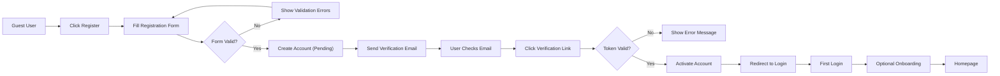
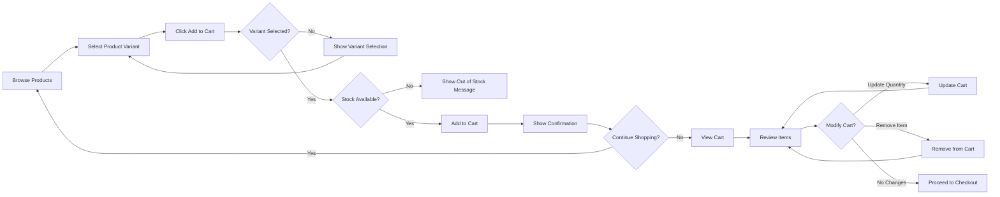
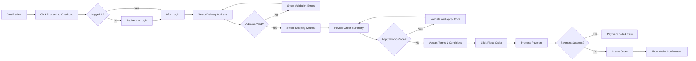

# Customer User Journeys - E-Commerce Shopping Mall Platform

## 1. Introduction

This document provides comprehensive business requirements for all customer-facing workflows and interactions in the e-commerce shopping mall platform. It describes complete user journeys from the perspective of the **customer** actor - registered buyers who browse products, make purchases, and manage their orders.

### Customer Actor Overview

Customers are registered users who authenticate with email and password to access personalized shopping experiences. They can discover products through browsing and search, manage shopping carts and wishlists, complete purchases, track orders, submit reviews, and manage their account information including multiple delivery addresses.

### Document Scope

This document covers all customer workflows including:
- Account registration and authentication
- Product discovery and shopping
- Cart and wishlist management
- Checkout and payment
- Order tracking and history
- Reviews and ratings
- Cancellation and refund requests
- Address and profile management

For seller workflows, see [Seller User Journeys](./04-seller-user-journeys.md). For authentication specifications, see [User Actors and Authentication](./02-user-actors-authentication.md).

## 2. Customer Registration and Onboarding Journey

### Registration Workflow

**Registration Initiation**

WHEN a guest user clicks the registration button, THE system SHALL display the registration form with required fields for email address, password, and password confirmation.

THE registration form SHALL include fields for:
- Email address (required)
- Password (required, minimum 8 characters)
- Password confirmation (required, must match password)
- Full name (required)
- Agreement to terms and conditions (required checkbox)

**Registration Validation**

WHEN a user submits the registration form, THE system SHALL validate all input fields before creating the account.

THE system SHALL enforce the following validation rules:
- Email must be a valid email format
- Email must not already exist in the system
- Password must be at least 8 characters
- Password must contain at least one uppercase letter, one lowercase letter, and one number
- Password confirmation must exactly match password
- Full name must be at least 2 characters
- Terms and conditions must be accepted

IF the email address already exists, THEN THE system SHALL display the error message "An account with this email already exists. Please login or use a different email."

IF password validation fails, THEN THE system SHALL display specific error messages indicating which password requirements are not met.

**Account Creation**

WHEN all validation passes, THE system SHALL create the customer account in pending verification status.

THE system SHALL generate a unique email verification token with 24-hour expiration.

WHEN the account is created, THE system SHALL send a verification email to the provided email address containing a verification link.

THE verification email SHALL include:
- Welcome message
- Email verification link with embedded token
- Link expiration information (24 hours)
- Instructions for requesting a new verification email if expired

**Email Verification**

WHEN a user clicks the verification link, THE system SHALL validate the verification token.

IF the token is valid and not expired, THEN THE system SHALL activate the customer account and redirect to the login page with success message "Your email has been verified. Please login to continue."

IF the token is expired, THEN THE system SHALL display an error message with option to request a new verification email.

IF the token is invalid, THEN THE system SHALL display an error message "Invalid verification link. Please check your email or request a new verification link."

**Onboarding Experience**

WHEN a newly verified customer logs in for the first time, THE system SHALL present an optional onboarding guide introducing key features.

The onboarding guide SHALL highlight:
- How to search and browse products
- How to add items to cart and wishlist
- How to manage delivery addresses
- How to track orders

Users can skip the onboarding guide and proceed directly to the homepage.

### Registration Flow Diagram

## 3. Authentication and Account Management

### Login Process

**Login Initiation**

WHEN a guest user accesses a customer-only feature, THE system SHALL redirect to the login page.

THE login form SHALL include fields for:
- Email address
- Password
- "Remember me" checkbox (optional)
- "Forgot password?" link

**Login Validation**

WHEN a user submits login credentials, THE system SHALL validate the email and password combination.

THE system SHALL respond within 2 seconds for typical login requests.

IF credentials are valid and email is verified, THEN THE system SHALL generate a JWT access token valid for 30 minutes and a refresh token valid for 30 days.

IF credentials are valid but email is not verified, THEN THE system SHALL display message "Please verify your email address before logging in" with option to resend verification email.

IF credentials are invalid, THEN THE system SHALL display generic error message "Invalid email or password" and increment failed login attempt counter.

IF a user has 5 consecutive failed login attempts within 15 minutes, THEN THE system SHALL temporarily lock the account for 30 minutes and send a security alert email.

**Session Management**

WHEN a customer successfully logs in, THE system SHALL create a secure session.

THE JWT access token SHALL contain:
- Customer user ID
- Customer role identifier
- Token expiration timestamp
- Session identifier

WHEN the "Remember me" option is selected, THE system SHALL extend the refresh token validity to 90 days.

THE system SHALL automatically refresh the access token when it expires if a valid refresh token exists.

WHEN a customer explicitly logs out, THE system SHALL invalidate both access and refresh tokens.

### Password Management

**Password Reset Request**

WHEN a user clicks "Forgot password?", THE system SHALL display a password reset request form asking for email address.

WHEN a user submits the password reset request, THE system SHALL generate a password reset token valid for 1 hour.

THE system SHALL send a password reset email containing:
- Password reset link with embedded token
- Token expiration information (1 hour)
- Security notice that this was requested
- Instructions to ignore if not requested by the user

IF the email address does not exist in the system, THE system SHALL still display success message to prevent email enumeration attacks.

**Password Reset Completion**

WHEN a user clicks the password reset link, THE system SHALL validate the reset token.

IF the token is valid and not expired, THEN THE system SHALL display a password reset form requiring new password and password confirmation.

THE new password SHALL meet the same validation requirements as registration (minimum 8 characters, uppercase, lowercase, number).

WHEN the user submits the new password, THE system SHALL update the password, invalidate all existing sessions and tokens for that customer, and redirect to login page.

**Password Change**

WHEN a logged-in customer accesses password change functionality, THE system SHALL require current password verification before allowing password change.

THE password change form SHALL include:
- Current password (required)
- New password (required)
- New password confirmation (required)

WHEN a customer changes their password, THE system SHALL invalidate all other active sessions except the current one and send a notification email.

### Profile Information Management

**Viewing Profile**

WHEN a customer accesses their profile, THE system SHALL display:
- Full name
- Email address (verified status indicated)
- Account creation date
- Profile completeness indicator

**Updating Profile**

WHEN a customer updates their full name, THE system SHALL validate that the name is at least 2 characters.

THE system SHALL not allow email address changes without re-verification process.

WHEN a customer requests email change, THE system SHALL:
- Send verification email to the new email address
- Keep the old email active until new email is verified
- Update email only after new email verification
- Send notification to old email about the change

## 4. Address Management System

### Address Creation

**Adding New Address**

WHEN a customer creates a new delivery address, THE system SHALL require the following fields:
- Recipient full name (required)
- Phone number (required)
- Address line 1 (required, street address)
- Address line 2 (optional, apartment/unit number)
- City (required)
- State/Province (required)
- Postal/ZIP code (required)
- Country (required)
- Address label (optional, e.g., "Home", "Office")

THE system SHALL validate:
- Recipient name is at least 2 characters
- Phone number matches valid format for selected country
- Postal code matches valid format for selected country
- All required fields are provided

**Default Address Setting**

WHEN a customer creates their first address, THE system SHALL automatically set it as the default delivery address.

WHEN a customer has multiple addresses, THE system SHALL allow designation of one address as default.

THE default address SHALL be automatically selected during checkout.

### Address Management Operations

**Viewing Addresses**

WHEN a customer views their address book, THE system SHALL display all saved addresses with:
- Address label (if provided)
- Full formatted address
- Default address indicator
- Edit and delete options

THE addresses SHALL be sorted with default address displayed first.

**Editing Addresses**

WHEN a customer edits an address, THE system SHALL allow modification of all address fields.

WHEN an address is edited, THE system SHALL validate all fields using the same rules as address creation.

IF the edited address is set as default and the customer unchecks the default option, THEN THE system SHALL require selection of a different default address.

**Deleting Addresses**

WHEN a customer attempts to delete a non-default address, THE system SHALL remove the address immediately.

IF a customer attempts to delete the default address, THEN THE system SHALL display warning "This is your default address. Please set another address as default before deleting this one."

WHEN an address that has been used in past orders is deleted, THE system SHALL retain the address data in historical orders for record-keeping.

### Address Usage in Checkout

WHEN a customer proceeds to checkout, THE system SHALL display all saved addresses for selection.

THE system SHALL allow customers to add a new address during checkout without leaving the checkout flow.

WHEN a new address is added during checkout, THE system SHALL offer option to save the address to the customer's address book.

## 5. Product Discovery and Browsing Journey

### Homepage Product Display

**Featured and Promotional Products**

WHEN a customer visits the homepage, THE system SHALL display featured products selected by admin.

THE homepage SHALL include sections for:
- Featured products (curated by admin)
- New arrivals (newest products, sorted by creation date)
- Trending products (based on view count and purchase frequency)
- Recommended products for logged-in customers (based on browsing and purchase history)

Each product display SHALL show:
- Product primary image
- Product name
- Price (showing lowest variant price if multiple variants exist)
- Average rating (if reviews exist)
- "Out of Stock" indicator if all variants are unavailable

**Quick Actions**

WHEN a customer hovers over or taps a product card, THE system SHALL display quick action buttons for:
- Add to cart (if single variant or default variant available)
- Add to wishlist
- Quick view (display key product details in overlay)

### Category Browsing

**Category Navigation**

THE system SHALL organize products into hierarchical categories with up to 3 levels (Category → Subcategory → Sub-subcategory).

WHEN a customer clicks a category, THE system SHALL display all products in that category and its subcategories.

THE category page SHALL show:
- Category name and description
- Breadcrumb navigation
- Subcategory links
- Product grid with pagination
- Filter and sort options

**Category Product Listing**

THE system SHALL display products in grid layout with 20 products per page by default.

WHEN a customer scrolls to the bottom of the product list, THE system SHALL provide pagination controls or infinite scroll option.

THE system SHALL remember the customer's position when navigating back from product detail page.

### Product Detail Viewing

**Product Detail Page**

WHEN a customer clicks on a product, THE system SHALL display comprehensive product information including:
- Product image gallery (primary image plus additional images)
- Product name and description
- Seller information (seller name, seller rating)
- Price per variant
- Available product variants with options (color, size, etc.)
- Stock availability per variant
- Product specifications
- Aggregate rating and review count
- Customer reviews (paginated)
- Related products

**Variant Selection**

WHEN a customer selects variant options (e.g., color, size), THE system SHALL update:
- Displayed price for selected variant
- Stock availability for selected variant
- Product images relevant to selected variant
- SKU identifier

IF selected variant combination is out of stock, THEN THE system SHALL disable the "Add to Cart" button and display "Out of Stock" message.

THE system SHALL indicate which variant options are required before adding to cart.

### Recently Viewed Products

THE system SHALL track the last 20 products viewed by each customer.

WHEN a customer views their recently viewed products, THE system SHALL display products in reverse chronological order (most recent first).

THE recently viewed list SHALL persist across sessions for logged-in customers.

THE system SHALL automatically remove products from recently viewed list if they are deleted by sellers.

### Related and Recommended Products

**Related Products**

WHEN a customer views a product detail page, THE system SHALL display related products based on:
- Same category
- Similar price range
- Common tags or attributes

THE system SHALL display up to 10 related products.

**Personalized Recommendations**

WHEN a logged-in customer browses the platform, THE system SHALL provide personalized product recommendations based on:
- Previous purchase history
- Browsing history
- Wishlist items
- Products frequently purchased together

## 6. Product Search and Filtering Journey

### Search Query Submission

**Search Interface**

THE system SHALL provide a search bar prominently displayed on all pages.

WHEN a customer types in the search bar, THE system SHALL provide autocomplete suggestions showing:
- Matching product names
- Matching categories
- Popular search terms

THE autocomplete suggestions SHALL appear instantly as the customer types.

**Search Execution**

WHEN a customer submits a search query, THE system SHALL return results instantly for common queries.

THE system SHALL search across:
- Product names
- Product descriptions
- Product categories
- Seller names
- Product SKUs

THE search SHALL be case-insensitive and handle minor spelling variations.

### Search Results Display

**Result Presentation**

THE search results page SHALL display:
- Search query entered
- Total number of matching products
- Product grid with pagination (20 products per page)
- Available filters and sort options
- "No results found" message with suggestions if no matches

WHEN no results are found, THE system SHALL suggest:
- Check spelling of search terms
- Try more general keywords
- Browse categories
- Contact customer support

**Search Result Ranking**

THE system SHALL rank search results by relevance using factors including:
- Exact keyword matches in product name (highest priority)
- Keyword matches in description
- Product popularity (sales volume)
- Product rating
- Recency (newer products ranked higher with similar relevance)

### Filtering and Faceting

**Available Filters**

THE search results and category pages SHALL provide filters for:
- Price range (slider or min/max input)
- Category and subcategory
- Seller
- Average rating (4+ stars, 3+ stars, etc.)
- Availability (in stock only)
- Product attributes specific to category (e.g., brand, size, color)

**Filter Application**

WHEN a customer selects one or more filters, THE system SHALL update the product list to show only matching products.

THE system SHALL update the filter options to show only values applicable to current result set.

THE system SHALL display count of products matching each filter option.

WHEN a customer applies filters, THE system SHALL maintain the current sort order.

THE system SHALL allow customers to clear individual filters or all filters at once.

**Active Filter Display**

THE system SHALL display all active filters prominently with option to remove each filter individually.

WHEN filters are applied, THE system SHALL update the URL to allow bookmarking or sharing of filtered results.

### Sorting Options

**Available Sort Options**

THE system SHALL provide sorting options including:
- Relevance (default for search results)
- Price: Low to High
- Price: High to Low
- Newest Arrivals
- Best Rating
- Most Popular (based on sales volume)

WHEN a customer changes sort order, THE system SHALL update the product list immediately while maintaining applied filters.

THE system SHALL remember the customer's preferred sort order for the current session.

### Search Refinement

**Guided Refinement**

WHEN search results are too broad (more than 100 results), THE system SHALL suggest refinement options based on:
- Popular categories in results
- Common attributes in results
- Price ranges

**Search History**

THE system SHALL maintain search history for logged-in customers showing their last 20 searches.

WHEN a customer views search history, THE system SHALL allow re-execution of previous searches with one click.

## 7. Shopping Cart Management Journey

### Adding Products to Cart

**Add to Cart Action**

WHEN a customer clicks "Add to Cart" for a product with a single variant, THE system SHALL add one unit of that product to the cart.

WHEN a customer clicks "Add to Cart" for a product with multiple variants, THE system SHALL require variant selection before adding to cart.

IF the customer has not selected all required variant options, THEN THE system SHALL highlight the unselected options and display message "Please select all product options."

WHEN a product is successfully added to cart, THE system SHALL:
- Display confirmation message "Product added to cart"
- Update cart item count indicator
- Provide option to view cart or continue shopping

**Quantity Selection**

WHEN adding a product to cart, THE system SHALL allow customers to specify quantity.

THE system SHALL enforce minimum quantity of 1 and maximum quantity based on available stock for the selected variant.

IF a customer attempts to add quantity exceeding available stock, THEN THE system SHALL display message "Only X items available in stock" and limit the quantity to available stock.

### Viewing Cart Contents

**Cart Page Display**

WHEN a customer views their cart, THE system SHALL display:
- List of all cart items
- For each item: product image, name, selected variant options, unit price, quantity, subtotal
- Seller information for each item
- Quantity adjustment controls
- Remove item option
- Estimated subtotal (sum of all item subtotals)
- "Proceed to Checkout" button

THE cart SHALL group items by seller for multi-seller orders.

**Cart Item Information**

For each cart item, THE system SHALL display:
- Product thumbnail image
- Product name (linked to product detail page)
- Selected variant options (color, size, etc.)
- Seller name
- Unit price
- Quantity selector
- Item subtotal (unit price × quantity)
- Stock availability status

IF an item's price has changed since adding to cart, THEN THE system SHALL display both old and new prices with notification "Price updated."

### Updating Cart Quantities

**Quantity Modification**

WHEN a customer changes the quantity of a cart item, THE system SHALL update the item subtotal and cart total immediately.

THE system SHALL validate that new quantity does not exceed available stock.

IF requested quantity exceeds available stock, THEN THE system SHALL adjust quantity to maximum available stock and display message "Quantity adjusted to available stock (X items)."

THE system SHALL enforce minimum quantity of 1 for all cart items.

**Stock Validation**

THE system SHALL reserve cart item stock for 30 minutes to prevent overselling during checkout.

WHEN a customer's cart session approaches expiration, THE system SHALL display countdown notification "Your cart items are reserved for X more minutes."

IF stock reservation expires, THE system SHALL re-check stock availability when customer proceeds to checkout.

### Removing Cart Items

**Item Removal**

WHEN a customer clicks remove button for a cart item, THE system SHALL immediately remove the item from cart without confirmation dialog.

WHEN an item is removed, THE system SHALL update cart totals and display temporary notification with "Undo" option for 5 seconds.

IF a customer clicks "Undo" within 5 seconds, THEN THE system SHALL restore the removed item to cart.

**Clear Cart**

THE system SHALL provide option to clear all items from cart.

WHEN a customer chooses to clear cart, THE system SHALL display confirmation dialog "Are you sure you want to remove all items from your cart?"

IF confirmed, THEN THE system SHALL remove all cart items and display empty cart message.

### Cart Persistence

**Logged-in Customer Cart**

THE system SHALL persist cart contents across sessions for logged-in customers.

WHEN a customer logs out and logs back in, THE system SHALL restore their cart exactly as it was.

THE system SHALL store cart data for up to 90 days of customer inactivity.

**Guest Cart Migration**

WHEN a guest user adds items to cart and then logs in or registers, THE system SHALL merge the guest cart with the customer's saved cart.

IF duplicate items exist (same product variant in both carts), THEN THE system SHALL combine quantities up to available stock limit.

### Price Calculations

**Cart Subtotal**

THE system SHALL calculate cart subtotal as the sum of all item subtotals (unit price × quantity for each item).

THE cart subtotal SHALL update automatically when quantities change or items are added/removed.

**Price Display**

THE system SHALL display prices in the customer's selected currency.

THE system SHALL clearly separate:
- Item subtotals
- Cart subtotal
- Estimated shipping costs (calculated at checkout)
- Estimated taxes (calculated at checkout)
- Estimated total

THE cart page SHALL display message "Final shipping costs and taxes calculated at checkout" to set clear expectations.

### Proceeding to Checkout

**Checkout Button**

THE "Proceed to Checkout" button SHALL be prominently displayed on the cart page.

IF the cart is empty, THEN THE system SHALL disable the checkout button and display message "Your cart is empty. Add items to proceed."

WHEN a customer clicks "Proceed to Checkout", THE system SHALL validate:
- Customer is logged in (redirect to login if not)
- All cart items are still in stock
- All cart items are still active (not deleted by sellers)

IF any cart items are out of stock or no longer available, THEN THE system SHALL display notification listing the affected items and remove them from cart before allowing checkout.

### Cart Flow Diagram

## 8. Wishlist Management Journey

### Adding Products to Wishlist

**Add to Wishlist Action**

WHEN a customer clicks "Add to Wishlist" button on a product, THE system SHALL add the product to the customer's wishlist.

THE customer SHALL be able to add products to wishlist from:
- Product listing pages
- Product detail pages
- Search results
- Quick view modals

WHEN a product is successfully added to wishlist, THE system SHALL:
- Display confirmation message "Added to wishlist"
- Update wishlist item count indicator
- Change the heart/wishlist icon to filled state

IF a product already exists in the wishlist, THEN THE system SHALL display message "This product is already in your wishlist."

**Wishlist Button State**

THE system SHALL visually indicate whether a product is currently in the customer's wishlist using filled heart icon or highlighted button state.

WHEN a customer views a product already in their wishlist, THE system SHALL show "Remove from Wishlist" option instead of "Add to Wishlist."

### Viewing Wishlist

**Wishlist Page Display**

WHEN a customer accesses their wishlist, THE system SHALL display all saved products with:
- Product image
- Product name
- Current price
- Stock availability status
- Average rating
- "Add to Cart" button
- "Remove from Wishlist" button

THE wishlist SHALL display products in reverse chronological order (most recently added first).

THE system SHALL show total count of items in wishlist.

**Stock and Price Monitoring**

IF a wishlisted product's price changes, THE system SHALL display both old and new prices with "Price changed" indicator.

IF a wishlisted product goes out of stock, THE system SHALL display "Out of Stock" status and disable "Add to Cart" button.

IF a wishlisted product comes back in stock, THE system SHALL send notification to customer (if notification preferences allow).

IF a wishlisted product is deleted by the seller, THE system SHALL display "No longer available" message with option to remove from wishlist.

### Moving Items from Wishlist to Cart

**Add to Cart from Wishlist**

WHEN a customer clicks "Add to Cart" for a wishlist item, THE system SHALL add the product to cart.

IF the product has multiple variants, THEN THE system SHALL display variant selection interface before adding to cart.

WHEN a product is added to cart from wishlist, THE system SHALL:
- Add item to cart with quantity 1
- Keep the item in wishlist
- Display confirmation message
- Update cart count indicator

THE system SHALL allow adding multiple wishlist items to cart simultaneously via "Add all to cart" button.

### Removing Items from Wishlist

**Individual Item Removal**

WHEN a customer clicks "Remove" for a wishlist item, THE system SHALL remove the item immediately.

THE system SHALL display temporary notification with "Undo" option for 5 seconds.

IF customer clicks "Undo," THEN THE system SHALL restore the item to wishlist.

**Clear Wishlist**

THE system SHALL provide option to remove all items from wishlist.

WHEN a customer chooses to clear wishlist, THE system SHALL display confirmation "Remove all items from your wishlist?"

IF confirmed, THEN THE system SHALL remove all wishlist items.

### Wishlist Persistence

**Cross-Session Persistence**

THE system SHALL persist wishlist contents indefinitely for logged-in customers across all sessions and devices.

THE wishlist data SHALL sync automatically when customer logs in on different devices.

**Guest User Limitation**

THE system SHALL not support wishlist functionality for guest users.

WHEN a guest user clicks "Add to Wishlist," THE system SHALL display message "Please log in to save items to your wishlist" with login/register options.

### Wishlist Notifications

**Price Drop Alerts**

WHEN a wishlisted product's price decreases by 10% or more, THE system SHALL send notification to customer (if enabled in notification preferences).

**Back in Stock Alerts**

WHEN a previously out-of-stock wishlisted product becomes available, THE system SHALL send notification to customer (if enabled in notification preferences).

## 9. Checkout Process Journey

### Checkout Initiation

**Starting Checkout**

WHEN a customer clicks "Proceed to Checkout" from cart, THE system SHALL verify the customer is logged in.

IF customer is not logged in, THEN THE system SHALL redirect to login page with return URL to resume checkout after authentication.

WHEN checkout begins, THE system SHALL validate:
- Cart is not empty
- All cart items are in stock
- All cart items are still active products

IF validation fails, THEN THE system SHALL display specific error messages and prevent checkout until issues are resolved.

### Delivery Address Selection

**Address Step**

THE checkout process SHALL display the delivery address selection as the first step.

WHEN a customer has saved addresses, THE system SHALL display all addresses with:
- Default address pre-selected
- Radio button selection for each address
- Full formatted address display
- "Deliver to this address" confirmation button

WHEN a customer has no saved addresses, THE system SHALL display address creation form.

**New Address During Checkout**

THE system SHALL allow customers to add a new delivery address during checkout.

WHEN "Add new address" is selected, THE system SHALL display address form with all required fields.

WHEN a new address is added during checkout, THE system SHALL offer checkbox option "Save this address to my address book for future orders."

IF customer chooses to save the address, THEN THE system SHALL add it to their address book after order placement.

**Address Validation**

WHEN a customer confirms delivery address, THE system SHALL validate:
- Address is complete with all required fields
- Phone number is reachable format
- Postal code matches city/state if validation service available

IF address validation fails, THEN THE system SHALL display specific error messages and prevent proceeding to next step.

### Shipping Method Selection

**Available Shipping Options**

WHEN delivery address is confirmed, THE system SHALL display available shipping methods for the order.

For multi-seller orders, THE system SHALL display shipping options grouped by seller.

Each shipping method SHALL display:
- Shipping method name (e.g., "Standard Shipping," "Express Delivery")
- Estimated delivery timeframe
- Shipping cost
- Carrier information if applicable

THE system SHALL calculate shipping costs based on:
- Delivery address location
- Total order weight/dimensions
- Selected shipping speed
- Seller's shipping policies

**Shipping Selection**

WHEN a customer selects a shipping method, THE system SHALL update the order total to include shipping costs.

THE system SHALL pre-select the most economical shipping method by default.

FOR multi-seller orders, THE system SHALL allow independent shipping method selection per seller.

### Order Review and Confirmation

**Order Summary Display**

THE checkout review step SHALL display complete order summary including:
- All order items with quantities and prices
- Delivery address
- Selected shipping methods
- Itemized price breakdown
- Payment method to be used

**Price Breakdown**

THE order summary SHALL clearly display:
- Items subtotal
- Shipping cost (itemized by seller for multi-seller orders)
- Tax amount (if applicable)
- Discount amount (if promo code applied)
- Grand total

THE system SHALL display all amounts in customer's selected currency.

**Promotional Codes**

THE checkout review SHALL include option to enter promotional or discount codes.

WHEN a customer applies a promo code, THE system SHALL validate:
- Code exists and is active
- Code has not expired
- Code usage limits not exceeded
- Customer meets code eligibility requirements
- Cart meets minimum purchase requirements

IF promo code is valid, THEN THE system SHALL apply discount and update order total.

IF promo code is invalid, THEN THE system SHALL display specific error message explaining why code cannot be applied.

### Terms and Conditions Acceptance

**Required Acknowledgment**

THE checkout SHALL require customers to review and accept terms before order placement.

THE system SHALL display checkbox with text "I have read and agree to the [Terms and Conditions] and [Privacy Policy]" with linked documents.

THE "Place Order" button SHALL remain disabled until terms are accepted.

### Final Order Confirmation

**Place Order Action**

WHEN a customer clicks "Place Order," THE system SHALL:
- Perform final stock availability check
- Reserve inventory for ordered items
- Process payment (see payment flow)
- Create order records
- Generate order confirmation

THE system SHALL display loading indicator during order processing with message "Processing your order, please wait..."

THE system SHALL process the order within 10 seconds for typical transactions.

IF any item becomes unavailable during final processing, THEN THE system SHALL cancel the order attempt and display message listing unavailable items.

### Checkout Flow Diagram

## 10. Payment Process Journey

### Payment Method Selection

**Available Payment Options**

THE system SHALL support multiple payment methods including:
- Credit/Debit cards
- Digital wallets (PayPal, Apple Pay, Google Pay, etc.)
- Bank transfers (if applicable)

THE checkout SHALL display all available payment methods with recognizable icons.

WHEN a customer selects a payment method, THE system SHALL display the appropriate payment form or redirect to payment gateway.

### Payment Information Entry

**Card Payment**

WHEN a customer selects card payment, THE system SHALL display secure payment form requiring:
- Cardholder name
- Card number
- Expiration date (month/year)
- CVV/security code
- Billing address (if different from delivery address)

THE system SHALL use secure payment gateway integration and SHALL NOT store complete card numbers.

THE payment form SHALL provide real-time validation for:
- Card number format and validity (Luhn algorithm)
- Expiration date (must be future date)
- CVV length (3-4 digits based on card type)

**Digital Wallet Payment**

WHEN a customer selects digital wallet payment, THE system SHALL redirect to the payment provider's authentication page.

THE system SHALL handle the OAuth or redirect flow for wallet authentication.

WHEN payment provider authentication is complete, THE system SHALL receive payment authorization and return customer to order confirmation.

### Payment Processing Flow

**Payment Initiation**

WHEN a customer confirms payment, THE system SHALL:
- Send payment request to payment gateway
- Display loading indicator with message "Processing payment securely..."
- Disable all form buttons to prevent duplicate submissions

THE system SHALL set payment processing timeout of 60 seconds.

**Payment Authorization**

THE system SHALL wait for payment gateway response indicating:
- Payment approved
- Payment declined
- Payment requires additional authentication (3D Secure)
- Payment processing error

IF payment requires additional authentication (3D Secure), THEN THE system SHALL redirect customer to authentication page and await completion.

### Payment Confirmation

**Successful Payment**

WHEN payment is successfully authorized, THE system SHALL:
- Generate payment transaction record
- Create order with "Payment Confirmed" status
- Send payment confirmation to customer via email
- Display order confirmation page with order number

THE payment confirmation SHALL include:
- Transaction ID
- Payment amount
- Payment method used (last 4 digits for cards)
- Payment date and time

**Payment Receipt**

THE system SHALL send payment receipt email containing:
- Order number
- Payment transaction ID
- Itemized order details
- Payment amount breakdown
- Billing address
- Payment method used

### Failed Payment Handling

**Payment Decline**

IF payment is declined by payment gateway, THEN THE system SHALL:
- Display user-friendly error message "Payment could not be processed. Please check your payment information and try again."
- NOT create an order
- Keep cart items intact
- Return customer to payment step

THE system SHALL display specific guidance based on decline reason:
- Insufficient funds: "Payment declined due to insufficient funds"
- Invalid card details: "Payment declined. Please verify your card information"
- Expired card: "Payment declined. Your card has expired"
- Security decline: "Payment declined for security reasons. Please contact your bank"

**Payment Retry**

WHEN payment fails, THE system SHALL allow customers to:
- Update payment information and retry
- Select different payment method
- Return to cart to modify order

THE system SHALL allow up to 3 payment retry attempts within 30 minutes.

IF all retry attempts fail, THEN THE system SHALL suggest contacting customer support.

**Payment Error Recovery**

IF payment processing encounters technical error (timeout, gateway unavailable), THEN THE system SHALL:
- Display message "Payment processing error. Your order has not been charged. Please try again."
- Log the error for investigation
- Preserve cart contents
- Allow customer to retry when ready

THE system SHALL not charge the customer unless payment confirmation is received from gateway.

### Payment Security

**Secure Payment Processing**

THE system SHALL transmit all payment information over HTTPS encryption.

THE system SHALL integrate with PCI-DSS compliant payment gateway.

THE system SHALL never log or store complete card numbers in system databases.

THE system SHALL store only:
- Last 4 digits of card number
- Card brand (Visa, Mastercard, etc.)
- Expiration month/year (for saved cards)
- Tokenized payment method reference from gateway

**Fraud Prevention**

THE system SHALL implement fraud detection measures including:
- Unusual order pattern detection
- Multiple failed payment attempt monitoring
- Billing/shipping address mismatch validation
- Suspicious activity alerting

IF fraud indicators are detected, THEN THE system SHALL flag the order for manual admin review before fulfillment.

### Multi-Seller Payment Distribution

**Payment Splitting**

For multi-seller orders, THE system SHALL:
- Collect total payment from customer in single transaction
- Record individual seller amounts
- Process seller payouts according to platform policies

THE system SHALL calculate seller payout amounts based on:
- Item prices from that seller
- Applicable shipping fees charged by that seller
- Platform commission deductions
- Payment processing fee allocations

**Seller Payout Records**

THE system SHALL maintain detailed records of:
- Amount owed to each seller per order
- Platform commission amounts
- Payment processing fees
- Net payout amounts
- Payout status and dates

## 11. Order Placement and Confirmation

### Order Creation Workflow

**Order Record Generation**

WHEN payment is successfully confirmed, THE system SHALL create order records with the following information:
- Unique order number (sequential or UUID-based)
- Order date and timestamp
- Customer information
- Delivery address snapshot
- Billing address snapshot
- Order items with quantities and prices at time of purchase
- Shipping method selected
- Payment method used
- Transaction ID from payment gateway
- Order subtotal, shipping cost, tax, discounts, and grand total
- Initial order status "Payment Confirmed"

FOR multi-seller orders, THE system SHALL create:
- One parent order visible to customer
- Separate sub-orders per seller visible to respective sellers

**Inventory Deduction**

WHEN an order is created, THE system SHALL immediately deduct ordered quantities from available inventory for each SKU.

THE inventory deduction SHALL be atomic to prevent overselling.

IF inventory deduction fails for any item (due to concurrent purchases), THEN THE system SHALL:
- Initiate automatic refund
- Notify customer of unavailable items
- Update order status to "Cancelled - Stock Unavailable"

### Order Number Generation

**Order Number Format**

THE system SHALL generate unique order numbers using format: ORD-YYYYMMDD-XXXXXX where:
- ORD = prefix indicating order
- YYYYMMDD = order creation date
- XXXXXX = sequential number or unique identifier

THE order number SHALL be displayed prominently on order confirmation page and all order-related communications.

### Order Confirmation Display

**Confirmation Page**

WHEN an order is successfully created, THE system SHALL display order confirmation page showing:
- "Order Confirmed" success message
- Order number
- Estimated delivery date
- Order summary (items, quantities, prices)
- Delivery address
- Shipping method
- Payment confirmation
- "Track Order" button
- "View Order Details" button
- "Continue Shopping" button

THE confirmation page SHALL provide clear next steps for the customer.

**Order Confirmation Email**

THE system SHALL send order confirmation email within 1 minute of order creation.

The email SHALL include:
- Order number
- Thank you message
- Itemized order details with images
- Delivery address
- Estimated delivery timeframe
- Payment confirmation
- Link to track order
- Link to view full order details
- Customer support contact information

FOR multi-seller orders, THE email SHALL clearly indicate which items are from which sellers and may have different delivery timelines.

### Initial Order Status

**Order Status Assignment**

THE system SHALL set initial order status to "Payment Confirmed" when order is created.

THE order status SHALL automatically progress through lifecycle stages:
1. Payment Confirmed
2. Processing (when seller acknowledges)
3. Shipped (when seller updates shipping)
4. Out for Delivery
5. Delivered
6. Completed (after delivery confirmation)

**Status Visibility**

THE customer SHALL be able to view current order status at any time through:
- Order tracking page
- Order history
- Order detail page

THE system SHALL send notifications when order status changes to key milestones.

## 12. Order Tracking Journey

### Accessing Order Details

**Order Tracking Entry Points**

THE customer SHALL be able to access order tracking through:
- Order confirmation email link
- "My Orders" section in account menu
- Order history page
- Direct URL with order number

WHEN a customer accesses order tracking, THE system SHALL display complete order information and current status.

### Order Status Tracking

**Order Status Display**

THE order tracking page SHALL display:
- Current order status with visual progress indicator
- Order number and order date
- Estimated delivery date
- Delivery address
- Ordered items with images and quantities
- Order total
- Shipping carrier and tracking number (when available)
- Status change timeline showing all status transitions with timestamps

**Status Progression Visualization**

THE system SHALL display order status using visual progress tracker showing stages:
1. Order Placed
2. Processing
3. Shipped
4. Out for Delivery
5. Delivered

THE visual tracker SHALL highlight completed stages and indicate current stage.

FOR multi-seller orders, THE system SHALL display separate progress tracking for each sub-order from different sellers.

### Shipment Tracking Information

**Tracking Number Display**

WHEN a seller ships an order, THE system SHALL display:
- Shipping carrier name
- Tracking number
- Ship date and time
- Link to carrier's tracking page

WHEN a customer clicks carrier tracking link, THE system SHALL open carrier's tracking page in new tab.

**Delivery Updates**

THE system SHALL receive and display shipping status updates from carriers including:
- Package picked up
- In transit
- Out for delivery
- Delivered
- Delivery attempted
- Delivery exceptions

THE order tracking page SHALL refresh shipping status at regular intervals or when customer reloads page.

**Estimated Delivery Date**

THE system SHALL display estimated delivery date calculated based on:
- Shipping method selected
- Ship date
- Delivery location
- Carrier's estimated transit time

IF delivery date changes, THE system SHALL update the estimate and notify customer.

### Multi-Seller Order Tracking

**Sub-Order Tracking**

FOR orders containing items from multiple sellers, THE system SHALL:
- Display unified order view showing all items
- Clearly indicate which items are from which sellers
- Show separate tracking information per seller
- Display separate delivery timelines per seller

WHEN one sub-order is delivered while others are still in transit, THE system SHALL clearly show partial delivery status.

**Delivery Coordination**

THE system SHALL display message "This order contains items from multiple sellers and may arrive in separate packages on different dates."

THE system SHALL show estimated delivery dates for each sub-order independently.

### Delivery Status Updates

**Delivery Confirmation**

WHEN a package is marked as delivered by carrier, THE system SHALL:
- Update order status to "Delivered"
- Record delivery date and time
- Send delivery confirmation notification to customer
- Display "Order Delivered" message on tracking page

IF all items in a multi-seller order are delivered, THEN THE system SHALL update overall order status to "Delivered."

**Delivery Issues**

IF delivery attempt fails, THE system SHALL:
- Display "Delivery Attempted" status
- Show reason for failed delivery if provided by carrier
- Display next delivery attempt date
- Provide customer service contact option

IF package is returned to sender, THE system SHALL update status to "Return in Progress" and notify customer.

### Delivery Confirmation by Customer

**Confirm Receipt Option**

WHEN order status is "Delivered," THE system SHALL display "Confirm Receipt" button on order tracking page.

WHEN a customer confirms receipt, THE system SHALL:
- Update order status to "Completed"
- Record confirmation date
- Trigger any post-delivery workflows (review requests, loyalty points, etc.)

IF customer does not manually confirm receipt, THE system SHALL automatically mark order as "Completed" 7 days after delivery.

## 13. Order History Access

### Viewing Order History

**Order History Page**

WHEN a customer accesses "My Orders," THE system SHALL display all orders in reverse chronological order (newest first).

THE order history SHALL display orders in paginated list with 20 orders per page.

Each order in the list SHALL show:
- Order number
- Order date
- Order status
- Total amount
- Thumbnail images of ordered products (up to 3)
- Quick action buttons (Track Order, View Details, Buy Again)

**Order History Timeframe**

THE system SHALL display all orders from customer's account creation date to present.

THE system SHALL maintain order history indefinitely unless customer deletes their account.

### Filtering and Searching Orders

**Order Filters**

THE order history SHALL provide filter options for:
- Order status (All, Processing, Shipped, Delivered, Cancelled, Refunded)
- Date range (Last 30 days, Last 3 months, Last 6 months, Last year, Custom range)
- Order total amount range

WHEN filters are applied, THE system SHALL update the order list to show only matching orders.

**Order Search**

THE system SHALL provide search functionality allowing customers to search orders by:
- Order number
- Product name
- Seller name

THE search SHALL return results instantly as customer types.

### Order Detail Retrieval

**Detailed Order View**

WHEN a customer clicks on an order, THE system SHALL display complete order details including:
- Order number and status
- Order date and time
- All ordered items with images, names, variants, quantities, and prices
- Delivery address
- Billing address
- Payment method used
- Itemized price breakdown (subtotal, shipping, tax, discounts, total)
- Tracking information (if shipped)
- Order timeline showing all status changes with timestamps
- Available actions (Track, Cancel, Request Refund, Write Review, Download Invoice)

**Order Item Details**

For each item in order details, THE system SHALL display:
- Product image
- Product name (linked to current product page if still available)
- Selected variant options
- Quantity ordered
- Unit price
- Item subtotal
- Seller name
- Individual item status (if different from overall order status)
- Review status (whether customer has reviewed this product)

### Reordering from History

**Buy Again Functionality**

THE order history SHALL provide "Buy Again" button for each past order.

WHEN a customer clicks "Buy Again," THE system SHALL:
- Check if all products from the order are still available
- Add available products to cart with same quantities
- Display notification listing any unavailable products that could not be added

IF product variants have changed or are no longer available, THEN THE system SHALL notify customer and suggest similar products or variants.

**Quick Reorder Individual Items**

THE order detail page SHALL provide "Add to Cart" button for each individual item.

WHEN a customer clicks "Add to Cart" for an individual item, THE system SHALL add that item to cart if still available.

### Downloading Invoices and Receipts

**Invoice Generation**

THE system SHALL generate downloadable invoice for each order in PDF format.

The invoice SHALL include:
- Order number and date
- Customer name and billing address
- Itemized list of products with quantities and prices
- Subtotal, shipping, tax, discounts, and total
- Payment method and transaction ID
- Seller information
- Invoice number and date

**Download Invoice Action**

WHEN a customer clicks "Download Invoice," THE system SHALL generate and download PDF invoice immediately.

THE invoice SHALL be formatted for printing and record-keeping.

### Order History Analytics for Customer

**Order Summary Statistics**

THE order history page SHALL display summary statistics showing:
- Total number of orders
- Total amount spent
- Number of orders in each status category

THE statistics SHALL update automatically as order status changes.

## 14. Review and Rating Submission Journey

### Accessing Review Submission

**Review Eligibility**

THE system SHALL allow customers to review products only after the order containing that product has been delivered.

WHEN an order is marked as "Delivered" or "Completed," THE system SHALL enable review submission for all items in that order.

THE customer SHALL NOT be able to review products they have not purchased.

**Review Invitation**

THE system SHALL send review invitation email 3 days after order delivery.

The invitation email SHALL:
- Thank customer for their purchase
- List all delivered items eligible for review
- Provide direct links to review each product
- Explain the value of reviews to the community

**Review Entry Points**

THE customer SHALL be able to access review submission through:
- Review invitation email links
- Order detail page ("Write Review" button per item)
- Product detail page (if customer has purchased the product)
- "My Reviews" section in account menu

### Writing Product Reviews

**Review Submission Form**

THE review form SHALL include:
- Star rating selector (1-5 stars, required)
- Review title field (optional, max 100 characters)
- Review text area (required, min 20 characters, max 2000 characters)
- Product variant confirmation (showing which variant was purchased)
- Review guidelines and content policy link
- Submit button

**Star Rating System**

THE system SHALL use 5-star rating scale where:
- 1 star = Very Poor
- 2 stars = Poor
- 3 stars = Average
- 4 stars = Good
- 5 stars = Excellent

WHEN a customer selects a star rating, THE system SHALL highlight all stars up to and including the selected rating.

**Review Content Requirements**

THE review text SHALL meet the following requirements:
- Minimum 20 characters to ensure meaningful content
- Maximum 2000 characters
- No email addresses or phone numbers
- No promotional content or external links
- No profanity or offensive language

THE system SHALL validate review content in real-time and display character count.

### Review Guidelines and Validation

**Content Validation**

WHEN a customer submits a review, THE system SHALL validate:
- Star rating is selected
- Review text meets minimum length requirement
- Review text does not exceed maximum length
- Review content does not contain prohibited content (profanity, personal information, promotional links)

IF validation fails, THEN THE system SHALL display specific error messages indicating which requirements are not met.

**Duplicate Review Prevention**

THE system SHALL allow only one review per customer per product.

IF a customer has already reviewed a product, THEN THE system SHALL display their existing review with option to edit instead of submit new review.

**Verified Purchase Indicator**

THE system SHALL automatically mark reviews as "Verified Purchase" when the review is submitted by a customer who purchased and received the product.

The verified purchase badge SHALL be displayed prominently with the review.

### Review Submission Confirmation

**Successful Submission**

WHEN a review is successfully submitted, THE system SHALL:
- Display confirmation message "Thank you for your review!"
- Redirect to the product page showing the newly submitted review
- Send confirmation email to customer

IF review requires moderation (based on content flags), THEN THE system SHALL display message "Your review has been submitted and will appear after moderation."

**Review Moderation**

THE system SHALL flag reviews for admin moderation if:
- Review contains potential profanity or offensive terms
- Review is unusually short or long
- Review contains suspected spam patterns

Flagged reviews SHALL be held in pending status until admin approves or rejects.

### Viewing Own Submitted Reviews

**My Reviews Section**

THE system SHALL provide "My Reviews" section in customer account menu.

WHEN a customer accesses "My Reviews," THE system SHALL display all reviews they have submitted with:
- Product information and image
- Star rating given
- Review title and text
- Submission date
- Review status (Published, Pending Moderation, Rejected)
- Seller response (if seller has responded)
- Edit and delete options

### Editing Reviews

**Review Edit Capability**

THE system SHALL allow customers to edit their reviews within 30 days of submission.

WHEN a customer clicks "Edit Review," THE system SHALL display the review form pre-populated with existing content.

WHEN an edited review is submitted, THE system SHALL:
- Update the review content
- Maintain original submission date
- Add "Last edited: [date]" indicator
- Re-run content validation
- Send for moderation if content changes are significant

### Review Deletion

**Delete Review Option**

THE system SHALL allow customers to delete their own reviews at any time.

WHEN a customer clicks "Delete Review," THE system SHALL display confirmation dialog "Are you sure you want to delete this review? This action cannot be undone."

IF deletion is confirmed, THEN THE system SHALL:
- Permanently remove the review
- Recalculate product's aggregate rating
- Update review count on product page

## 15. Order Cancellation Request Journey

### Cancellation Eligibility

**Cancellation Window**

THE system SHALL allow order cancellation only before the order is shipped.

WHEN an order status is "Payment Confirmed" or "Processing," THE customer SHALL be able to request cancellation.

WHEN an order status is "Shipped" or later stages, THE cancellation option SHALL be disabled and refund request option shown instead.

**Cancellation Time Limits**

THE system SHALL allow cancellation within specific timeframes:
- Full order cancellation allowed until seller marks order as shipped
- For express/same-day shipping orders, cancellation must be within 1 hour of order placement

THE order detail page SHALL clearly display cancellation eligibility status and remaining cancellation window if applicable.

### Cancellation Request Submission

**Initiate Cancellation**

WHEN a customer clicks "Cancel Order" on an eligible order, THE system SHALL display cancellation confirmation dialog.

The cancellation dialog SHALL display:
- Order number and items to be cancelled
- Refund amount to be processed
- Cancellation reason selection (required)
- Cancellation policy information
- Confirm and Cancel buttons

**Cancellation Reasons**

THE system SHALL require customers to select cancellation reason from:
- Found better price elsewhere
- Ordered by mistake
- Changed mind about purchase
- Delivery time too long
- Want to modify order
- Other (with text field for explanation)

### Partial Order Cancellation

**Multi-Item Order Cancellation**

FOR orders containing multiple items, THE system SHALL allow cancellation of individual items if order has not been shipped.

WHEN a customer selects partial cancellation, THE system SHALL:
- Display checklist of all order items
- Allow selection of which items to cancel
- Recalculate refund amount based on cancelled items
- Update order total

IF all items from one seller are cancelled in multi-seller order, THEN THE system SHALL cancel that entire sub-order.

**Partial Cancellation Restrictions**

IF items have already been shipped, THEN THE system SHALL prevent cancellation of those items and display message "These items have already shipped and cannot be cancelled. You may request a refund after delivery."

### Cancellation Confirmation

**Processing Cancellation**

WHEN a customer confirms cancellation, THE system SHALL:
- Update order status to "Cancelled" (or "Partially Cancelled" for partial cancellations)
- Release reserved inventory back to available stock
- Initiate refund process
- Send cancellation confirmation email
- Notify seller of cancellation

**Cancellation Confirmation Display**

THE system SHALL display cancellation confirmation page showing:
- "Order Cancelled" success message
- Order number
- Cancelled items list
- Refund amount
- Estimated refund processing time (typically 5-7 business days)
- Refund method (original payment method)

**Cancellation Email**

THE system SHALL send cancellation confirmation email containing:
- Order number
- Cancelled items
- Cancellation date and time
- Refund amount
- Refund processing timeline
- Customer support contact information

### Cancellation Restrictions

**Non-Cancellable Scenarios**

THE system SHALL prevent cancellation when:
- Order has already been shipped
- Order is marked as delivered
- Cancellation window has expired
- Order contains non-cancellable items (if applicable, e.g., custom-made products)

WHEN cancellation is not allowed, THE system SHALL:
- Disable "Cancel Order" button
- Display clear message explaining why cancellation is not available
- Suggest refund request as alternative for shipped orders

### Cancellation Refund Processing

**Automatic Refund Initiation**

WHEN an order is cancelled, THE system SHALL automatically initiate refund to the original payment method.

THE refund amount SHALL include:
- Full item costs for cancelled items
- Proportional shipping costs
- Applied taxes
- Any discounts applied (refunded proportionally)

**Refund Timeline Communication**

THE system SHALL inform customers that:
- Refund is processed within 24 hours of cancellation
- Refund appears in customer's account within 5-7 business days depending on payment provider
- Customer will receive email notification when refund is processed

## 16. Refund Request Journey

### Refund Request Eligibility

**Refund Window**

THE system SHALL allow refund requests for delivered orders within 30 days of delivery date.

WHEN an order is marked as "Delivered" or "Completed," THE customer SHALL be able to request refund.

THE order detail page SHALL display refund eligibility status and remaining refund request window.

**Refund Eligible Scenarios**

THE system SHALL allow refund requests when:
- Product is defective or damaged
- Product does not match description
- Wrong item was delivered
- Product quality is unsatisfactory
- Customer changed mind (subject to seller's return policy)

### Refund Request Submission

**Initiate Refund Request**

WHEN a customer clicks "Request Refund" on an eligible order, THE system SHALL display refund request form.

The refund request form SHALL include:
- Order number and items available for refund
- Refund reason selection (required)
- Detailed description field (required, min 20 characters)
- Photo upload option (up to 5 images for damage/defect cases)
- Refund policy information
- Submit button

**Refund Reasons**

THE system SHALL require customers to select refund reason from:
- Product damaged or defective
- Product not as described
- Wrong item received
- Product quality issues
- Changed mind
- Other (with detailed explanation required)

**Evidence Upload**

WHEN a customer selects defect or damage as refund reason, THE system SHALL strongly encourage photo evidence upload.

THE system SHALL accept image uploads in JPEG, PNG formats up to 5MB per image.

WHEN images are uploaded, THE system SHALL display thumbnails with option to remove or replace images before submission.

### Partial Refund Requests

**Multi-Item Refund**

FOR orders containing multiple items, THE system SHALL allow refund request for individual items.

WHEN a customer selects which items to refund, THE system SHALL:
- Display checklist of all delivered items
- Allow selection of items for refund
- Calculate refund amount based on selected items
- Require separate refund reason for each item if reasons differ

**Partial Quantity Refund**

IF a customer ordered multiple quantities of same item, THE system SHALL allow refund request for partial quantity.

The refund amount SHALL be calculated proportionally based on quantity being returned.

### Refund Request Submission Confirmation

**Request Submission**

WHEN a customer submits refund request, THE system SHALL:
- Generate unique refund request ID
- Record all refund request details
- Assign refund request status "Pending Review"
- Send request to appropriate seller for review
- Send confirmation email to customer
- Display refund request confirmation page

**Confirmation Display**

THE refund request confirmation page SHALL show:
- "Refund Request Submitted" message
- Refund request ID
- Items included in refund request
- Requested refund amount
- Current status: "Pending Seller Review"
- Estimated review timeline (typically 2-3 business days)
- Link to track refund request status

**Confirmation Email**

THE system SHALL send refund request confirmation email containing:
- Refund request ID
- Order number
- Requested refund items and reason
- Current status
- Next steps and timeline
- Link to track refund request

### Refund Status Tracking

**Tracking Refund Request**

WHEN a customer accesses refund request tracking, THE system SHALL display:
- Refund request ID and status
- Refund request submission date
- Items included in request
- Refund amount
- Current status (Pending, Approved, Rejected, Refund Processing, Refunded)
- Status timeline with timestamps
- Seller messages or admin notes (if any)
- Estimated resolution timeline

**Refund Request Statuses**

THE system SHALL use the following refund request statuses:
1. Pending Review - Awaiting seller/admin review
2. Additional Information Required - Seller/admin needs more details
3. Approved - Refund approved, awaiting item return (if applicable)
4. Return Shipped - Customer has shipped item back
5. Return Received - Seller received returned item
6. Refund Processing - Refund payment being processed
7. Refunded - Refund completed
8. Rejected - Refund request denied

### Refund Approval/Rejection Notification

**Approval Notification**

WHEN a refund request is approved, THE system SHALL:
- Update refund request status to "Approved"
- Send approval notification email to customer
- Provide return shipping instructions if product return required
- Display refund processing timeline

IF product return is required, THE approval notification SHALL include:
- Return shipping address
- Return deadline (typically 14 days from approval)
- Return shipping instructions
- Whether return shipping is prepaid or customer's responsibility

**Rejection Notification**

WHEN a refund request is rejected, THE system SHALL:
- Update refund request status to "Rejected"
- Send rejection notification email with explanation
- Display rejection reason on refund tracking page
- Provide option to contact customer support if customer disagrees

The rejection notification SHALL include:
- Clear explanation of rejection reason
- Relevant policy information
- Customer support contact information
- Option to appeal decision (if applicable)

### Refund Processing Timeline

**Expected Timeframes**

THE system SHALL communicate the following refund processing timeline:
1. Seller review: 2-3 business days
2. If return required: Customer ships within 14 days
3. Return receipt verification: 1-2 business days after delivery
4. Refund processing: 1-2 business days
5. Refund appearing in customer account: 5-7 business days

**Refund Completion Notification**

WHEN refund is successfully processed, THE system SHALL:
- Update refund request status to "Refunded"
- Send refund completion email
- Update order status to "Refunded" or "Partially Refunded"
- Display refund amount and date on order details

The refund completion email SHALL include:
- Refund amount
- Refund date
- Refund method (original payment method)
- Refund transaction ID
- Expected timeline for funds to appear in account

## 17. Customer Support and Help

### Accessing Help Resources

**Help Center Access**

THE system SHALL provide "Help Center" link prominently in website header and footer.

THE Help Center SHALL be accessible to both guest users and logged-in customers.

**Help Topics Organization**

THE Help Center SHALL organize content into categories:
- Account and Registration
- Shopping and Checkout
- Payments and Refunds
- Shipping and Delivery
- Returns and Exchanges
- Product Reviews
- Seller Information
- Safety and Security

WHEN a customer selects a category, THE system SHALL display related articles and FAQs.

### Viewing FAQs

**Frequently Asked Questions**

THE system SHALL provide comprehensive FAQ section covering common customer questions.

Each FAQ SHALL include:
- Clear question title
- Detailed answer with step-by-step instructions if applicable
- Related articles links
- "Was this helpful?" feedback option

**FAQ Search**

THE Help Center SHALL provide search functionality allowing customers to search FAQs by keywords.

THE search SHALL return relevant results ranked by relevance and popularity.

WHEN no results are found, THE system SHALL suggest browsing categories or contacting customer support.

### Contacting Customer Support

**Support Contact Methods**

THE system SHALL provide multiple customer support contact methods:
- Contact form
- Support email address
- Live chat (if available)
- Phone support (if available)

THE contact information SHALL be prominently displayed on Help Center and contact pages.

**Support Contact Form**

THE customer support contact form SHALL include:
- Customer name (pre-filled if logged in)
- Email address (pre-filled if logged in)
- Order number (optional but helpful for order-related issues)
- Issue category selection (required)
- Subject line (required)
- Detailed message (required, min 20 characters)
- Attachment upload option (for screenshots, photos)
- Submit button

**Support Issue Categories**

THE system SHALL provide issue category options:
- Order status and tracking
- Payment and billing
- Refunds and returns
- Product information
- Account issues
- Technical problems
- Other

**Support Ticket Submission**

WHEN a customer submits support request, THE system SHALL:
- Generate unique support ticket ID
- Send confirmation email with ticket ID
- Assign ticket to appropriate support team
- Set expected response time (typically 24-48 hours)

**Support Ticket Tracking**

THE system SHALL allow customers to track their support tickets.

WHEN a customer views their support tickets, THE system SHALL display:
- Ticket ID
- Submission date
- Issue category and subject
- Current status (Open, In Progress, Resolved, Closed)
- Last response date
- Full conversation history
- Option to add additional information

### Order-Specific Help

**Contextual Help**

WHEN a customer views an order, THE system SHALL provide quick links to order-specific help topics:
- Track my order
- Modify delivery address
- Cancel order
- Request refund
- Report problem

WHEN a customer clicks these links, THE system SHALL display relevant help content or initiate appropriate action.

## 18. Notification and Communication

### Order Status Notifications

**Notification Triggers**

THE system SHALL send notifications to customers when:
- Order is confirmed (immediately after order placement)
- Payment is confirmed
- Order is being prepared/processed by seller
- Order is shipped (with tracking information)
- Order is out for delivery
- Order is delivered
- Order requires customer action (e.g., delivery issue)

Each notification SHALL be sent via email as primary channel.

**Order Confirmation Notification**

WHEN an order is placed, THE system SHALL send order confirmation notification within 1 minute.

The notification SHALL include:
- Order number
- Order summary with items and prices
- Delivery address
- Estimated delivery date
- Payment confirmation
- Link to track order
- Link to view full order details

**Shipping Notification**

WHEN a seller ships an order, THE system SHALL send shipping notification immediately.

The notification SHALL include:
- Order number
- Items shipped
- Shipping carrier name
- Tracking number with link to carrier tracking
- Estimated delivery date
- Delivery address

**Delivery Notification**

WHEN an order is marked as delivered, THE system SHALL send delivery confirmation notification.

The notification SHALL include:
- Order number
- Delivery date and time
- Delivery location confirmation
- Option to confirm receipt
- Invitation to review products
- Customer support contact if there are delivery issues

### Shipping Update Notifications

**Shipment Progress Updates**

THE system SHALL send notifications for significant shipping milestones:
- Package picked up by carrier
- Package in transit
- Package out for delivery
- Delivery attempted (if unsuccessful)

Each shipping update notification SHALL include:
- Current shipment status
- Location information (if available from carrier)
- Updated estimated delivery date
- Link to detailed tracking information

**Delivery Delay Notifications**

IF estimated delivery date is delayed, THEN THE system SHALL send delay notification to customer.

The delay notification SHALL include:
- Original estimated delivery date
- New estimated delivery date
- Reason for delay (if provided by carrier)
- Apology message
- Customer support contact information

### Account Security Notifications

**Security Alert Triggers**

THE system SHALL send immediate security notifications when:
- New login from unrecognized device or location
- Password is changed
- Email address is changed
- Payment method is added or updated
- Multiple failed login attempts detected
- Account is locked due to security concerns

**Security Notification Content**

Security notifications SHALL include:
- Description of the security event
- Date and time of event
- Location or device information (if applicable)
- Action taken by system (if any)
- Instructions if customer did not authorize the action
- Link to secure account settings
- Customer support contact for security issues

### Promotional and Marketing Communications

**Marketing Notification Types**

THE system MAY send promotional communications including:
- New product announcements
- Sales and special offers
- Personalized product recommendations
- Abandoned cart reminders
- Price drop alerts for wishlisted items
- Back-in-stock notifications for wishlisted items

**Promotional Notification Consent**

THE system SHALL require explicit opt-in for promotional communications during registration or in notification preferences.

THE customer SHALL be able to opt-out of promotional communications at any time.

Every promotional email SHALL include clear unsubscribe link at bottom.

### Notification Preferences Management

**Notification Settings**

THE system SHALL provide notification preference management in customer account settings.

WHEN a customer accesses notification preferences, THE system SHALL display options to enable/disable:
- Order status updates (required, cannot be disabled)
- Shipping updates (required, cannot be disabled)
- Delivery confirmations (required, cannot be disabled)
- Account security alerts (required, cannot be disabled)
- Product review invitations (optional)
- Promotional emails (optional)
- Price drop alerts (optional)
- Back-in-stock alerts (optional)

**Notification Channel Preferences**

THE system SHALL support email as primary notification channel.

Future enhancement MAY include SMS notifications and push notifications with separate opt-in preferences.

**Preference Updates**

WHEN a customer changes notification preferences, THE system SHALL:
- Apply changes immediately
- Send confirmation of preference changes to customer's email
- Respect new preferences for all future communications

### Review Request Notifications

**Review Invitation Timing**

THE system SHALL send product review invitation 3 days after order delivery.

The review invitation SHALL be sent only if customer has enabled review invitation notifications.

**Review Invitation Content**

The review invitation notification SHALL include:
- Thank you message for purchase
- List of delivered products eligible for review
- Direct links to review each product individually
- Explanation of review importance to community
- Option to opt-out of future review invitations

### Wishlist Notifications

**Price Drop Alerts**

WHEN a wishlisted product's price decreases by 10% or more, THE system SHALL send price drop notification (if customer has enabled price drop alerts).

The price drop notification SHALL include:
- Product name and image
- Original price
- New price
- Discount percentage
- Link to product page
- "Add to Cart" quick action

**Back-in-Stock Alerts**

WHEN a previously out-of-stock wishlisted product becomes available, THE system SHALL send back-in-stock notification (if customer has enabled stock alerts).

The notification SHALL include:
- Product name and image
- Stock availability confirmation
- Current price
- Link to product page
- "Add to Cart" quick action
- Urgency message if stock is limited

### Notification Delivery Requirements

**Delivery Timing**

THE system SHALL send transactional notifications (order, shipping, delivery) immediately when triggering event occurs.

THE system SHALL send promotional notifications during customer's local business hours (8 AM - 8 PM) based on delivery address timezone.

**Delivery Reliability**

THE system SHALL ensure notification delivery with:
- Retry mechanism for failed email delivery (up to 3 attempts)
- Logging of all notification attempts and delivery status
- Monitoring of email delivery rates
- Alternative notification methods if email repeatedly fails

**Notification Content Quality**

All notifications SHALL:
- Have clear, descriptive subject lines
- Include customer's name for personalization
- Be mobile-responsive and render correctly on all devices
- Include company branding and logo
- Contain clear calls-to-action
- Provide customer support contact information
- Include unsubscribe option (for promotional emails)

## 19. Error Scenarios and Edge Cases

### Out of Stock Product Handling

**Stock Unavailability Detection**

WHEN a customer views a product that is out of stock, THE system SHALL:
- Display prominent "Out of Stock" indicator
- Disable "Add to Cart" button
- Show "Notify When Available" option
- Display estimated restock date if available from seller

WHEN a customer attempts to add out-of-stock product to cart via API or direct URL manipulation, THE system SHALL reject the request and return error message "This product is currently out of stock."

**Cart Item Stock Validation**

WHEN a customer proceeds to checkout, THE system SHALL validate current stock availability for all cart items.

IF any cart item has become out of stock since being added to cart, THEN THE system SHALL:
- Display error notification listing unavailable items
- Remove unavailable items from cart
- Prevent checkout until customer acknowledges the changes
- Offer to add customer to waitlist for out-of-stock items

**Stock Changes During Checkout**

IF an item goes out of stock while customer is in checkout process, THEN THE system SHALL:
- Detect the stock change during final order placement
- Cancel the order attempt
- Display clear error message "Item no longer available: [product name]"
- Remove unavailable item from cart
- Return customer to cart page to review and retry

### Payment Failure Scenarios

**Insufficient Funds**

WHEN payment is declined due to insufficient funds, THE system SHALL:
- Display message "Payment declined due to insufficient funds. Please use a different payment method or contact your bank."
- Preserve cart contents
- Allow customer to try different payment method
- Not create any order record

**Card Declined**

WHEN payment is declined by issuing bank, THE system SHALL:
- Display generic message "Payment could not be processed. Please verify your payment information and try again."
- Log specific decline reason for internal troubleshooting
- Allow up to 3 retry attempts
- Suggest contacting bank after multiple failures

**Payment Gateway Timeout**

WHEN payment processing times out (no response after 60 seconds), THE system SHALL:
- Display message "Payment processing timed out. Your card has not been charged. Please try again."
- Not create order
- Release inventory reservation
- Log timeout incident for investigation
- Allow customer to retry immediately

**Duplicate Payment Prevention**

WHEN a customer clicks "Place Order" multiple times rapidly, THE system SHALL:
- Process only the first click
- Disable the button after first click
- Display loading indicator
- Ignore subsequent clicks
- Prevent duplicate payment charges and orders

### Address Validation Errors

**Invalid Address Format**

WHEN a customer enters address with invalid format or missing required fields, THE system SHALL:
- Highlight fields with errors in red
- Display specific error messages per field (e.g., "Postal code must be 5 or 9 digits")
- Prevent proceeding to next checkout step
- Maintain entered data for correction

**Undeliverable Address**

IF address validation service flags address as undeliverable, THEN THE system SHALL:
- Display warning message "This address may be undeliverable. Please verify your address."
- Allow customer to edit and correct address
- Provide option to proceed anyway with customer acknowledgment
- Log undeliverable address for seller review

**Address Service Unavailable**

IF address validation service is unavailable, THE system SHALL:
- Allow order to proceed without validation
- Display message "Address validation temporarily unavailable"
- Accept address as entered
- Flag order for manual review if shipping fails

### Invalid Search Query Handling

**Empty Search Query**

WHEN a customer submits empty search query, THE system SHALL:
- Display message "Please enter a search term"
- Not execute search
- Keep search input focused for customer to try again

**Special Characters in Search**

WHEN a customer enters special characters or symbols in search, THE system SHALL:
- Sanitize input to prevent injection attacks
- Treat most special characters as separators
- Handle common wildcards appropriately
- Return relevant results or "no results found" message

**Very Long Search Queries**

WHEN a customer enters search query exceeding 200 characters, THE system SHALL:
- Truncate query to 200 characters
- Display notification "Search query truncated to 200 characters"
- Execute search with truncated query

**No Search Results**

WHEN search returns zero results, THE system SHALL:
- Display "No results found for '[query]'" message
- Suggest checking spelling
- Recommend trying different keywords
- Show popular categories
- Display recently viewed products
- Provide contact support option

### Session Expiration During Checkout

**Session Timeout Detection**

WHEN a customer's session expires during checkout, THE system SHALL:
- Detect expired session on next action
- Preserve cart contents server-side
- Redirect to login page with message "Your session has expired. Please log in to continue checkout."
- Return to checkout page after successful login
- Restore cart and checkout progress

**Inactive Session Warning**

WHEN a customer has been inactive for 25 minutes (5 minutes before 30-minute timeout), THE system SHALL:
- Display warning notification "Your session will expire in 5 minutes due to inactivity"
- Provide "Stay Logged In" button to refresh session
- Auto-refresh session if customer clicks button

### Network Connectivity Issues

**Connection Lost During Action**

WHEN a network request fails due to connectivity issues, THE system SHALL:
- Display user-friendly error message "Connection lost. Please check your internet connection."
- Provide "Retry" button
- Preserve user input and state
- Not lose cart contents or form data

**Offline Mode Indication**

WHEN the customer's device goes offline, THE system SHALL:
- Detect offline status
- Display offline indicator
- Queue actions for retry when connection restored
- Prevent form submissions that would fail
- Show cached content when possible

**Partial Page Load**

WHEN page resources fail to load completely, THE system SHALL:
- Detect missing resources
- Attempt to reload failed resources
- Display error message if critical resources fail
- Provide "Reload Page" option
- Maintain functionality with available resources when possible

### Concurrent Cart Modifications

**Multiple Device Cart Sync**

WHEN a customer modifies cart on multiple devices simultaneously, THE system SHALL:
- Sync cart changes across all devices
- Use most recent update in case of conflicts
- Display notification "Your cart was updated from another device"
- Refresh cart display to show current state

**Stock Competition**

WHEN multiple customers attempt to purchase the last available item simultaneously, THE system SHALL:
- Use inventory reservation system
- First customer to reserve gets the item
- Other customers receive "Out of stock" message
- Handle race condition gracefully without errors

**Price Change During Checkout**

WHEN product price changes while item is in customer's cart, THE system SHALL:
- Display notification of price change on cart page
- Show both old and new prices
- Update cart total with new price
- Require customer acknowledgment before checkout
- Allow customer to remove item if price increase is unacceptable

### System Error Recovery

**Database Connectivity Issues**

WHEN database connection is lost during customer action, THE system SHALL:
- Display generic error message "We're experiencing technical difficulties. Please try again."
- Log error details for technical team
- Preserve customer input where possible
- Provide retry mechanism
- Not expose technical error details to customer

**Critical System Failures**

WHEN critical system component fails, THE system SHALL:
- Display maintenance page if necessary
- Preserve customer session and cart data
- Queue critical operations (order placement, payment) for retry
- Notify technical team immediately
- Restore service with minimal data loss

**Graceful Degradation**

WHEN non-critical features fail (e.g., product recommendations, reviews), THE system SHALL:
- Continue core shopping functionality
- Hide failed feature sections
- Log errors for investigation
- Not disrupt customer's shopping experience
- Restore features automatically when available

---

## Conclusion

This document provides comprehensive business requirements for all customer user journeys in the e-commerce shopping mall platform. The requirements focus on user workflows, business processes, and system behavior from the customer's perspective, providing developers with complete understanding of expected functionality.

For technical implementation details on authentication and user actors, refer to [User Actors and Authentication](./02-user-actors-authentication.md). For seller-specific workflows, see [Seller User Journeys](./04-seller-user-journeys.md). For product management details, refer to [Product Management Requirements](./05-product-management-requirements.md).