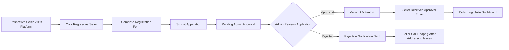
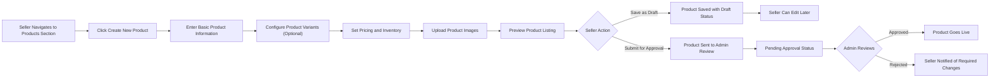
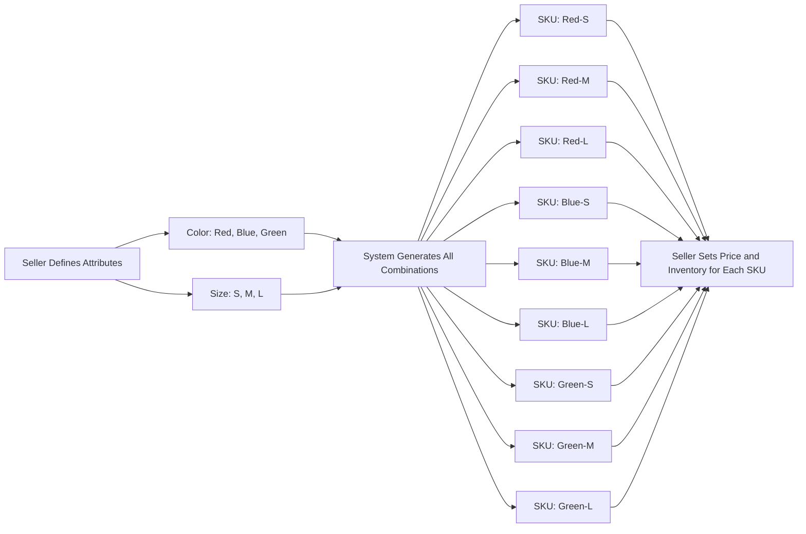
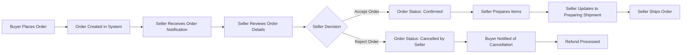

# Seller User Journey

## 1. Introduction

### 1.1 Seller Role in the Marketplace

**Sellers** are authenticated merchants who use the platform to discover, purchase, and review products offered by sellers in the marketplace.

**Primary Seller Responsibilities:**
- Browse and search the product catalog
- Manage shopping cart and wishlist
- Place orders and complete payments
- Track order status and shipping
- Manage delivery addresses
- Write and manage product reviews
- View order history
- Request order cancellations and refunds

**Seller Business Context:**

Sellers represent the demand side of the marketplace. Their satisfaction and trust directly impact platform success metrics including repeat purchase rate, customer lifetime value, and marketplace growth. The seller experience is optimized for ease of product discovery, secure transactions, and transparent order fulfillment.

### 1.2 Seller Capabilities Overview

Sellers have comprehensive business management capabilities including:

- Creating and managing product listings with multiple variants
- Tracking and updating inventory levels per SKU
- Processing and fulfilling customer orders
- Updating shipping and delivery status
- Responding to product reviews
- Viewing sales analytics and performance metrics
- Configuring store settings and policies

### 1.3 Seller Responsibilities

THE seller SHALL maintain accurate product information, inventory levels, and pricing.

THE seller SHALL fulfill orders within agreed timeframes according to platform policies.

THE seller SHALL provide accurate shipping information and tracking updates to buyers.

THE seller SHALL respond professionally to product reviews and customer feedback.

THE seller SHALL comply with platform policies, category guidelines, and legal requirements.

## 2. Seller Registration and Approval Process

### 2.1 Seller Registration Flow

### 2.2 Registration Information Requirements

WHEN a prospective seller initiates registration, THE system SHALL collect the following required information:

**Personal/Business Contact Information:**
- Full name or business legal name
- Email address (serves as primary contact and username)
- Phone number with country code
- Business registration number (if applicable for business entities)

**Store Information:**
- Store name (public-facing brand name)
- Store description (business overview, up to 500 characters)
- Business category/industry sector

**Business Verification Documents:**
- Government-issued business license or registration certificate
- Tax identification number
- Bank account information for payment settlements
- Business address (physical location)

**Legal Agreements:**
- Acceptance of seller terms and conditions
- Acceptance of commission structure and fee schedule
- Acceptance of platform policies and guidelines

### 2.3 Registration Validation Rules

THE system SHALL validate that the email address is unique and not already registered.

THE system SHALL validate that the store name is unique across the platform.

THE system SHALL validate that the email address follows standard email format patterns.

THE system SHALL validate that phone numbers include valid country codes and number formats.

THE system SHALL require all mandatory fields to be completed before submission.

IF the email address is already registered, THEN THE system SHALL display an error message "This email address is already in use" and prevent registration.

IF the store name is already taken, THEN THE system SHALL display an error message "This store name is unavailable" and suggest alternatives.

### 2.4 Application Submission and Pending Status

WHEN a prospective seller submits a complete registration application, THE system SHALL create a seller account in "Pending Approval" status.

THE system SHALL send a confirmation email to the applicant acknowledging receipt of the application.

THE system SHALL notify platform admins that a new seller application requires review.

WHILE a seller account is in "Pending Approval" status, THE seller SHALL NOT be able to access the seller dashboard or create product listings.

### 2.5 Admin Approval Workflow

WHEN an admin reviews a seller application, THE admin SHALL have the ability to approve or reject the application.

IF an admin approves the application, THEN THE system SHALL change the seller account status to "Active" and grant full seller permissions.

IF an admin rejects the application, THEN THE system SHALL change the seller account status to "Rejected" and record the rejection reason.

THE system SHALL send an email notification to the seller immediately upon approval or rejection.

WHEN a seller account is approved, THE approval email SHALL include login credentials, dashboard access instructions, and next steps for creating product listings.

WHEN a seller account is rejected, THE rejection email SHALL include the specific reasons for rejection and guidance on how to address issues for reapplication.

### 2.6 Account Activation and First Login

WHEN an approved seller logs in for the first time, THE system SHALL display an onboarding welcome screen with platform overview.

THE system SHALL guide the seller through essential setup steps including store profile completion and payment information verification.

THE seller SHALL be able to skip onboarding and proceed directly to the dashboard.

### 2.7 Reapplication Process

WHERE a seller application has been rejected, THE seller SHALL be able to submit a new application after addressing the rejection reasons.

THE system SHALL retain the previous application data to help admins identify reapplications.

THE system SHALL NOT automatically block sellers from reapplying unless specifically flagged by admins for policy violations.

### 2.8 Registration Error Scenarios

IF the registration form submission fails due to network errors, THEN THE system SHALL preserve all entered data and allow the seller to resubmit without re-entering information.

IF required documents are missing or invalid during submission, THEN THE system SHALL display specific error messages indicating which documents need correction.

IF the system experiences technical issues during registration, THEN THE system SHALL display a user-friendly error message and provide support contact information.

THE system SHALL respond to registration form validation within 2 seconds.

THE system SHALL complete the registration submission process within 5 seconds under normal conditions.

## 3. Seller Dashboard Overview

### 3.1 Dashboard Access and Authentication

WHEN a seller logs in with valid credentials, THE system SHALL authenticate the seller using JWT tokens and grant access to the seller dashboard.

THE seller SHALL access the dashboard through a dedicated seller portal URL distinct from the buyer interface.

For detailed authentication mechanisms and JWT token structure, please refer to the User Actors and Authentication Document.

### 3.2 Dashboard Home Screen

WHEN a seller accesses the dashboard home screen, THE system SHALL display the following key performance indicators:

**Sales Metrics:**
- Total revenue for current month
- Total revenue for previous month
- Percentage change month-over-month
- Total number of orders for current month
- Total number of orders for previous month

**Product Performance:**
- Total active product listings
- Total products out of stock
- Total products with low stock (below threshold)
- Products pending admin approval

**Order Status Summary:**
- New orders requiring processing (count)
- Orders ready to ship (count)
- Orders shipped and in transit (count)
- Orders delivered in past 7 days (count)

**Recent Activity Feed:**
- Latest 10 orders received with timestamp and status
- Recent product reviews received
- Inventory alerts and notifications
- System announcements from platform admins

### 3.3 Dashboard Navigation Structure

THE seller dashboard SHALL provide navigation to the following primary sections:

- **Products**: Product listing management, variant configuration, inventory control
- **Orders**: Order processing, fulfillment, shipping updates
- **Reviews**: Product review monitoring and seller responses
- **Analytics**: Sales reports, product performance, customer insights
- **Settings**: Store profile, payment information, notification preferences, policies

THE system SHALL highlight navigation items with pending actions (e.g., badge showing count of unprocessed orders).

### 3.4 Dashboard Performance Expectations

THE system SHALL load the dashboard home screen within 2 seconds.

THE system SHALL update real-time metrics (order counts, inventory alerts) within 5 seconds of data changes.

THE dashboard SHALL refresh automatically when new orders are received or inventory changes occur.

### 3.5 Dashboard Personalization

WHERE a seller has configured notification preferences, THE dashboard SHALL display alerts according to those preferences.

THE seller SHALL be able to customize which metrics appear on the dashboard home screen.

THE system SHALL remember the seller's last active dashboard section and return to it upon next login.

## 4. Product Listing Creation

### 4.1 Product Creation Workflow

### 4.2 Basic Product Information Requirements

WHEN a seller creates a new product listing, THE system SHALL require the following basic information:

**Essential Product Details:**
- Product title (minimum 10 characters, maximum 200 characters)
- Product description (minimum 50 characters, maximum 5000 characters)
- Product category (selected from hierarchical category tree)
- Brand name (optional, maximum 100 characters)
- Product condition (new, refurbished, used)

**Product Identification:**
- SKU base code (optional, seller-defined product identifier)
- Barcode/UPC/EAN (optional, for inventory integration)
- Manufacturer part number (optional)

### 4.3 Product Category Selection

THE system SHALL display a hierarchical category tree with parent and child categories.

THE seller SHALL select the most specific applicable category for the product.

THE system SHALL display category-specific attribute fields based on the selected category.

IF a category has specific requirements or guidelines, THEN THE system SHALL display these to the seller during category selection.

For detailed category structure specifications, please refer to the Product Catalog Requirements Document.

### 4.4 Product Description Guidelines

THE system SHALL provide a rich text editor for product descriptions allowing formatting including bold, italic, bullet points, and numbered lists.

THE seller SHALL be able to preview how the description will appear to buyers.

THE system SHALL validate that the description meets minimum length requirements before allowing submission.

THE system SHALL NOT allow scripts, external links, or contact information in product descriptions to maintain marketplace integrity.

### 4.5 Product Pricing Configuration

WHEN a seller sets product pricing, THE system SHALL require the following:

- Base price (mandatory, must be greater than 0)
- Currency (automatically set based on seller's market/region)
- Discount price (optional, must be less than base price if provided)
- Tax applicability (whether price includes tax or tax is added separately)

IF a seller sets a discount price, THEN THE system SHALL calculate and display the discount percentage automatically.

THE system SHALL validate that all price values are positive numbers with maximum 2 decimal places.

THE system SHALL display price validation errors immediately upon input.

### 4.6 Product Image Management

THE seller SHALL upload at least 1 product image and up to 10 images per product.

WHEN a seller uploads product images, THE system SHALL validate the following:

- File format: JPEG, PNG, or WebP
- File size: Maximum 5 MB per image
- Image dimensions: Minimum 800x800 pixels, recommended 1200x1200 pixels
- Image aspect ratio: Square (1:1) recommended

THE system SHALL allow the seller to reorder images by drag-and-drop.

THE first image SHALL be designated as the primary product thumbnail displayed in search results and category listings.

IF an uploaded image fails validation, THEN THE system SHALL display a specific error message indicating the validation failure reason (format, size, or dimensions).

### 4.7 Product Status Lifecycle

THE system SHALL support the following product statuses:

**Draft**: Product is saved but not submitted for review. Only visible to the seller.

**Pending Approval**: Product has been submitted and is awaiting admin review. Not visible to buyers.

**Active**: Product is approved and live on the marketplace. Visible to buyers in search and category listings.

**Inactive**: Product is temporarily hidden from buyers but can be reactivated by the seller. Inventory is preserved.

**Rejected**: Product failed admin review and requires seller modifications before resubmission.

**Archived**: Product is permanently removed from active listings but order history is preserved.

WHEN a seller saves a product as draft, THE product SHALL remain editable without admin approval.

WHEN a seller submits a product for approval, THE product status SHALL change to "Pending Approval" and an admin notification SHALL be created.

WHILE a product is in "Pending Approval" status, THE seller SHALL NOT be able to edit product details.

### 4.8 Product Submission Validation

WHEN a seller attempts to submit a product for approval, THE system SHALL validate that:

- All required fields are completed
- At least one product image is uploaded
- Product category is selected
- Base price is set and valid
- Product description meets minimum length
- If variants exist, all variants have valid pricing and SKU codes

IF validation fails, THEN THE system SHALL prevent submission and display all validation errors in a consolidated error message.

THE system SHALL allow the seller to save incomplete products as drafts without validation errors.

### 4.9 Product Admin Approval Process

WHEN an admin approves a product, THE product status SHALL change to "Active" and the product SHALL become visible to buyers immediately.

WHEN an admin rejects a product, THE product status SHALL change to "Rejected" and THE system SHALL send a notification to the seller with rejection reasons.

THE seller SHALL be able to edit and resubmit rejected products after addressing the rejection reasons.

For detailed admin product moderation workflows, please refer to the Admin Operations Document.

### 4.10 Product Editing and Updates

WHERE a product is in "Active" status, THE seller SHALL be able to edit product details.

WHEN a seller updates an active product, THE changes SHALL apply immediately without requiring admin re-approval for minor edits (description, images, price adjustments).

IF a seller changes the product category or makes significant alterations, THEN THE system SHALL require admin re-approval and change status to "Pending Approval".

THE system SHALL maintain an audit log of all product edits with timestamps and changed fields.

### 4.11 Product Activation and Deactivation

THE seller SHALL be able to temporarily deactivate an active product to hide it from buyers.

WHEN a seller deactivates a product, THE product status SHALL change to "Inactive" and the product SHALL be immediately removed from search results and category listings.

THE seller SHALL be able to reactivate an inactive product at any time without admin approval.

WHEN a product is deactivated, existing inventory levels SHALL be preserved.

## 5. Product Variant (SKU) Management

### 5.1 Product Variant Concept

Product variants represent different configurations of the same base product, such as different colors, sizes, or material options. Each unique combination of variant attributes creates a distinct SKU (Stock Keeping Unit) with its own inventory count, price, and potentially unique images.

### 5.2 Variant Attribute Definition

THE seller SHALL define variant attributes during product creation or editing.

THE system SHALL support the following common variant attribute types:

- **Color**: Visual color options (e.g., Red, Blue, Black, White)
- **Size**: Dimensional sizing (e.g., S, M, L, XL, or numerical sizes)
- **Material**: Product material composition (e.g., Cotton, Polyester, Leather)
- **Style**: Design variations (e.g., Classic, Modern, Vintage)
- **Custom Attributes**: Seller-defined attributes specific to product category

WHEN a seller creates a variant attribute, THE system SHALL require:

- Attribute name (e.g., "Color", "Size")
- Attribute values (e.g., for Color: "Red", "Blue", "Green")

THE seller SHALL add multiple values per attribute type.

THE system SHALL allow up to 5 variant attributes per product.

THE system SHALL support up to 20 values per attribute.

### 5.3 Variant Combination Generation

WHEN a seller defines multiple variant attributes with values, THE system SHALL automatically generate all possible combinations of those attributes.

THE system SHALL display all generated SKU combinations in a table for the seller to configure.

THE system SHALL limit the total number of variant combinations to 200 per product.

IF the combination of attributes would exceed 200 variants, THEN THE system SHALL display a warning message and prevent adding additional attribute values.

### 5.4 SKU Code Generation and Management

THE system SHALL automatically generate a unique SKU code for each variant combination based on the base product SKU and variant attributes.

THE SKU code format SHALL follow the pattern: `{BASE-SKU}-{ATTR1}-{ATTR2}-{ATTR3}`

For example, if base SKU is "TSHIRT-001" and variant is Red-Large, the generated SKU would be "TSHIRT-001-RED-L".

THE seller SHALL have the option to override the auto-generated SKU codes with custom codes.

THE system SHALL validate that all SKU codes are unique across the seller's entire product catalog.

IF a seller enters a duplicate SKU code, THEN THE system SHALL display an error message "This SKU code is already in use" and prevent saving.

### 5.5 Variant-Specific Pricing

THE seller SHALL set an individual price for each variant SKU.

THE system SHALL allow the seller to apply the base product price to all variants simultaneously as a starting point.

THE seller SHALL be able to adjust individual variant prices to reflect cost differences (e.g., larger sizes cost more).

WHEN a seller sets variant pricing, THE system SHALL validate that all prices are greater than 0 and in the correct currency format.

THE seller SHALL be able to set discount prices per variant independently.

### 5.6 Variant-Specific Inventory

THE seller SHALL set inventory quantity for each variant SKU independently.

THE system SHALL track inventory at the SKU level, not at the product level.

WHEN a buyer purchases a specific variant, THE system SHALL decrement only that variant's inventory count.

THE seller SHALL be able to update inventory levels for individual variants or multiple variants simultaneously through bulk operations.

For detailed inventory tracking mechanisms, please refer to the Inventory and Shipping Management Document.

### 5.7 Variant-Specific Images

THE seller SHALL be able to assign specific images to individual variants.

WHEN a seller uploads variant-specific images, THE system SHALL associate those images with the selected variant combination.

WHERE a variant does not have specific images assigned, THE system SHALL use the base product images as defaults.

WHEN a buyer selects a variant on the product detail page, THE system SHALL display the variant-specific images if available.

THE system SHALL support up to 5 images per variant.

### 5.8 Bulk Variant Operations

THE seller SHALL be able to perform bulk operations on multiple variants simultaneously:

- Set the same price across multiple variants
- Update inventory levels for multiple variants
- Apply the same discount percentage to multiple variants
- Enable or disable multiple variants at once

WHEN a seller performs bulk operations, THE system SHALL require confirmation before applying changes to prevent accidental modifications.

THE system SHALL display a summary of affected variants before executing bulk operations.

### 5.9 Variant Enabling and Disabling

THE seller SHALL be able to enable or disable individual variants without deleting them.

WHEN a seller disables a variant, THE variant SHALL NOT appear as an option to buyers on the product page.

WHILE a variant is disabled, THE inventory levels SHALL be preserved for future re-enabling.

THE seller SHALL be able to re-enable disabled variants at any time.

### 5.10 Variant Deletion

THE seller SHALL be able to delete individual variants that have never been ordered.

IF a variant has existing order history, THEN THE system SHALL prevent deletion and require the seller to disable the variant instead.

WHEN a seller deletes a variant, THE system SHALL require confirmation and display a warning that the action cannot be undone.

### 5.11 Variant Display to Buyers

WHEN a buyer views a product with variants, THE system SHALL display all available variant options as selectable controls (dropdowns, color swatches, size buttons).

THE system SHALL update the displayed price, images, and inventory availability when a buyer selects different variant combinations.

THE system SHALL disable variant options that result in out-of-stock combinations.

### 5.12 Variant Limits and Constraints

THE system SHALL enforce a maximum of 5 variant attributes per product.

THE system SHALL enforce a maximum of 20 values per attribute.

THE system SHALL enforce a maximum of 200 total variant combinations per product.

IF a seller attempts to exceed these limits, THEN THE system SHALL display an error message explaining the constraint and prevent the action.

### 5.13 Variant Management Error Scenarios

IF variant data fails to save due to technical errors, THEN THE system SHALL preserve all entered variant information and allow retry.

IF bulk operations fail partially, THEN THE system SHALL report which variants succeeded and which failed with specific error messages.

THE system SHALL validate variant pricing and inventory in real-time as the seller enters data.

THE system SHALL respond to variant configuration changes within 2 seconds.

## 6. Inventory Management Workflow

### 6.1 Inventory Tracking Overview

THE system SHALL track inventory at the SKU level for all product variants.

WHERE a product has no variants, THE system SHALL track inventory at the product level.

THE seller SHALL view current inventory levels for all SKUs in a centralized inventory dashboard.

### 6.2 Setting Initial Inventory Levels

WHEN a seller creates a new product or variant, THE system SHALL require the seller to set an initial inventory quantity.

THE initial inventory quantity SHALL be a non-negative integer (0 or greater).

THE seller SHALL be able to set inventory to 0 to indicate the product is not yet in stock.

### 6.3 Inventory Updates and Adjustments

THE seller SHALL be able to update inventory levels at any time through the inventory management interface.

WHEN a seller updates inventory, THE system SHALL require:

- SKU identifier
- New inventory quantity (or adjustment amount)
- Optional reason/note for the adjustment (e.g., "Received new shipment", "Damaged items removed")

THE system SHALL support two inventory update modes:

**Set Absolute Quantity**: Replace current inventory with a new total (e.g., set to 100 units)

**Adjust Relative Quantity**: Increase or decrease inventory by a specified amount (e.g., add 50 units, remove 10 units)

WHEN a seller adjusts inventory, THE system SHALL immediately update the inventory count and apply the change.

### 6.4 Automatic Inventory Deduction

WHEN a buyer places an order containing a specific SKU, THE system SHALL automatically deduct the ordered quantity from that SKU's inventory.

THE inventory deduction SHALL occur immediately upon successful order placement and payment confirmation.

IF an order is cancelled before shipment, THEN THE system SHALL automatically restore the deducted inventory quantity back to the SKU.

IF an order is refunded after delivery, THEN THE system SHALL NOT automatically restore inventory (seller must manually adjust if items are restocked).

### 6.5 Low Stock Alerts and Notifications

THE seller SHALL configure low stock threshold levels per SKU or apply a default threshold to all products.

WHEN a SKU's inventory level falls below the configured threshold, THE system SHALL create a low stock alert.

THE system SHALL display low stock alerts prominently on the seller dashboard.

WHERE a seller has enabled low stock notifications, THE system SHALL send email or in-app notifications when inventory falls below the threshold.

THE seller SHALL be able to customize low stock threshold values (e.g., alert when inventory drops below 10 units).

### 6.6 Out-of-Stock Handling

WHEN a SKU's inventory reaches 0, THE system SHALL mark the SKU as "Out of Stock".

WHILE a SKU is out of stock, THE system SHALL prevent buyers from adding that specific variant to their shopping cart.

THE system SHALL display "Out of Stock" status clearly on the product page for unavailable variants.

THE seller SHALL be able to update inventory for out-of-stock SKUs to bring them back in stock immediately.

WHEN inventory is added to an out-of-stock SKU, THE system SHALL automatically change the status to "In Stock" and make the variant purchasable again.

### 6.7 Overselling Prevention

THE system SHALL validate inventory availability in real-time before allowing buyers to complete checkout.

IF inventory becomes insufficient between cart addition and checkout completion, THEN THE system SHALL prevent order placement and notify the buyer that the item is no longer available in the requested quantity.

THE system SHALL use inventory locking during the checkout process to prevent overselling.

WHEN a buyer initiates checkout, THE system SHALL temporarily reserve the cart items' inventory for 15 minutes.

IF checkout is not completed within 15 minutes, THEN THE system SHALL release the reserved inventory back to available stock.

### 6.8 Bulk Inventory Updates

THE seller SHALL be able to update inventory for multiple SKUs simultaneously through bulk operations.

THE system SHALL support bulk inventory updates via:

- CSV file upload with SKU codes and new quantities
- Manual selection of multiple SKUs in the dashboard with batch quantity update
- API integration for automated inventory synchronization

WHEN a seller uploads a bulk inventory CSV file, THE system SHALL validate:

- File format is valid CSV
- All SKU codes exist in the seller's catalog
- All quantity values are non-negative integers

IF bulk upload validation fails for some rows, THEN THE system SHALL process valid rows and report errors for invalid rows with specific error messages.

### 6.9 Inventory History Tracking

THE system SHALL maintain a complete audit log of all inventory changes for each SKU.

THE inventory history log SHALL record:

- Timestamp of change
- Previous quantity
- New quantity
- Change amount (increase or decrease)
- Reason for change (order placed, manual adjustment, restocking, cancellation, etc.)
- User who made the change (seller or system)

THE seller SHALL be able to view inventory history for any SKU over specified date ranges.

THE inventory history SHALL be exportable as a CSV report for seller's record-keeping.

### 6.10 Inventory Synchronization with External Systems

WHERE a seller uses external inventory management systems, THE system SHALL provide API endpoints for automated inventory synchronization.

THE seller SHALL be able to configure automatic inventory sync schedules (e.g., hourly, daily).

WHEN external inventory sync occurs, THE system SHALL validate all incoming inventory data and reject updates that fail validation.

IF inventory sync conflicts occur (e.g., simultaneous updates from seller dashboard and API), THEN THE system SHALL use the most recent timestamp as the authoritative update.

### 6.11 Multi-Warehouse Inventory (Future Consideration)

For sellers operating multiple warehouse locations, the platform may support multi-location inventory tracking in future iterations. The current system tracks aggregate inventory per SKU without location differentiation.

### 6.12 Inventory Management Error Scenarios

IF inventory updates fail due to system errors, THEN THE system SHALL preserve the previous inventory state and display an error message to the seller.

IF bulk inventory upload fails, THEN THE system SHALL NOT apply partial updates and SHALL require the seller to correct errors and re-upload.

THE system SHALL validate inventory quantities in real-time as sellers enter data.

THE system SHALL process inventory updates within 1 second under normal conditions.

THE system SHALL reflect inventory changes on product pages within 5 seconds of update.

## 7. Order Reception and Processing

### 7.1 Order Reception Workflow

### 7.2 New Order Notifications

WHEN a buyer places an order containing the seller's products, THE system SHALL immediately create a notification for the seller.

THE seller SHALL receive order notifications through:

- In-dashboard notification badge showing unread order count
- Email notification sent to seller's registered email address
- Optional push notifications if seller has enabled mobile app notifications

THE order notification SHALL include:

- Order number (unique identifier)
- Order timestamp
- Buyer information (name, delivery address)
- Ordered items with SKU details and quantities
- Total order amount for the seller's items
- Payment status

THE seller SHALL access detailed order information by clicking the notification.

### 7.3 Order Details Review

WHEN a seller views order details, THE system SHALL display:

**Buyer Information:**
- Buyer name
- Delivery address (full address with postal code)
- Contact phone number
- Special delivery instructions (if provided by buyer)

**Order Items:**
- Product name and variant details (color, size, etc.)
- SKU code
- Quantity ordered
- Unit price at time of order
- Subtotal per item
- Product thumbnail image

**Order Summary:**
- Items subtotal
- Shipping fees (if applicable)
- Tax amount
- Discount applied (if any)
- Total amount
- Payment method used
- Payment status (paid, pending, failed)

**Order Timeline:**
- Order placed timestamp
- Payment confirmed timestamp
- Expected delivery date range

### 7.4 Order Acceptance Process

WHEN a seller receives a new order, THE initial order status SHALL be "Pending Seller Confirmation".

THE seller SHALL have the option to accept or reject the order within 24 hours of order placement.

WHEN a seller accepts an order, THE order status SHALL change to "Confirmed" and the buyer SHALL receive a confirmation notification.

THE seller SHALL not need to provide a reason for accepting an order (acceptance is the default expected action).

IF a seller does not take action within 24 hours, THEN THE system SHALL automatically accept the order on behalf of the seller and change status to "Confirmed".

### 7.5 Order Rejection Process

THE seller SHALL be able to reject an order only if the order has not yet been shipped.

WHEN a seller rejects an order, THE system SHALL require the seller to select a rejection reason from predefined options:

- Out of stock (inventory error)
- Pricing error
- Cannot deliver to buyer's location
- Suspected fraudulent order
- Other (with mandatory text explanation)

WHEN a seller rejects an order, THE order status SHALL change to "Cancelled by Seller".

THE system SHALL immediately notify the buyer of the order cancellation via email and in-app notification.

THE system SHALL automatically process a full refund to the buyer's original payment method within 24 hours.

THE system SHALL restore the ordered inventory quantities back to available stock for the cancelled items.

IF a seller frequently rejects orders (more than 10% rejection rate), THEN THE system SHALL flag the seller account for admin review.

### 7.6 Order Preparation Process

WHEN a seller accepts an order, THE seller SHALL proceed to prepare the items for shipment.

THE seller SHALL update the order status to "Preparing Shipment" when beginning the preparation process.

WHILE an order is in "Preparing Shipment" status, THE buyer SHALL see this status when tracking their order.

THE seller SHALL complete order preparation and proceed to shipment within 3 business days of order confirmation.

IF a seller does not ship the order within 3 business days, THEN THE system SHALL send a reminder notification to the seller.

### 7.7 Order Processing Time Requirements

THE seller SHALL acknowledge new orders (accept or reject) within 24 hours.

THE seller SHALL ship confirmed orders within 3 business days of confirmation.

THE system SHALL display seller's average processing time on the seller's store profile as a performance metric.

IF a seller consistently exceeds processing time expectations, THEN THE system SHALL display a performance warning on the seller dashboard.

### 7.8 Multiple Items from Different Sellers

WHERE a buyer's order contains items from multiple sellers, THE system SHALL split the order into separate sub-orders per seller.

Each seller SHALL only see and process their own sub-order items.

Each sub-order SHALL have its own order number and independent tracking.

The buyer SHALL see the complete order as a unified view but with separate tracking per seller.

For detailed multi-seller order management specifications, please refer to the Order Management Workflow Document.

### 7.9 Order Modification After Acceptance

WHILE an order is in "Confirmed" or "Preparing Shipment" status, THE seller SHALL NOT be able to modify order details (items, quantities, prices).

IF a buyer requests order changes after placement, THE seller SHALL communicate with the buyer outside the platform and handle modifications as cancellation and new order if necessary.

THE system SHALL maintain order integrity by preventing modifications once payment is confirmed.

### 7.10 Order Cancellation by Buyer

WHERE a buyer requests order cancellation before shipment, THE system SHALL route the cancellation request to the seller.

THE seller SHALL approve or deny the buyer's cancellation request.

WHEN a seller approves a buyer's cancellation request, THE order status SHALL change to "Cancelled by Buyer" and a refund SHALL be processed.

WHEN a seller denies a buyer's cancellation request, THE seller SHALL provide a reason, and the order SHALL proceed with fulfillment.

IF an order has already shipped, THEN THE system SHALL NOT allow cancellation and SHALL guide the buyer to the return/refund process after delivery.

### 7.11 Order List Management

THE seller SHALL view all orders in a centralized order management dashboard.

THE system SHALL provide filtering options for orders by:

- Order status (Pending, Confirmed, Preparing, Shipped, Delivered, Cancelled)
- Date range (custom date selection)
- Order number search
- Buyer name search
- Payment status

THE system SHALL provide sorting options by:

- Order date (newest to oldest or oldest to newest)
- Order amount (high to low or low to high)
- Order status

THE system SHALL display order lists in paginated format with 20 orders per page.

THE seller SHALL be able to export filtered order lists as CSV files for record-keeping.

### 7.12 Order Processing Error Scenarios

IF the seller attempts to accept an order that has already been cancelled by the buyer, THEN THE system SHALL display an error message "This order has been cancelled and cannot be processed".

IF inventory becomes insufficient after order placement but before acceptance, THEN THE system SHALL alert the seller and suggest rejecting the order due to stock unavailability.

IF payment verification fails after order placement, THEN THE system SHALL prevent the seller from processing the order and mark it as "Payment Pending".

THE system SHALL load order details within 2 seconds.

THE system SHALL process order status updates within 1 second.

## 8. Shipping Status Updates

### 8.1 Shipping Preparation

WHEN a seller is ready to ship an order, THE seller SHALL update the order status to "Ready to Ship".

THE system SHALL prompt the seller to enter shipping information:

- Shipping carrier/courier service name (e.g., FedEx, UPS, DHL, local courier)
- Tracking number (alphanumeric code provided by carrier)
- Shipping method (standard, express, same-day, etc.)
- Estimated delivery date range

### 8.2 Marking Order as Shipped

WHEN a seller ships an order, THE seller SHALL update the order status to "Shipped".

THE system SHALL require the seller to provide:

- Tracking number (mandatory)
- Shipping carrier name (mandatory)
- Actual ship date (defaults to current date, can be adjusted)

WHEN an order is marked as shipped, THE system SHALL:

- Update order status to "Shipped"
- Send email notification to buyer with tracking information
- Display tracking number on buyer's order tracking page
- Update order timeline with shipment timestamp

### 8.3 Tracking Number Validation

THE system SHALL validate that tracking numbers are not empty and contain only alphanumeric characters and common separators (hyphens, spaces).

THE system SHALL allow sellers to update or correct tracking numbers if entered incorrectly.

WHEN a tracking number is updated, THE system SHALL send an updated notification to the buyer with the corrected tracking information.

### 8.4 Shipping Status Tracking

THE system SHALL support the following shipping statuses:

- **Preparing Shipment**: Seller is packing and preparing items
- **Shipped**: Package has been handed to carrier and is in transit
- **In Transit**: Package is moving through carrier's delivery network
- **Out for Delivery**: Package is on delivery vehicle for final delivery
- **Delivered**: Package has been successfully delivered to buyer
- **Delivery Failed**: Delivery attempt failed (buyer not available, incorrect address, etc.)
- **Returned to Sender**: Package could not be delivered and is being returned

THE seller SHALL manually update shipping status as the package progresses through delivery.

WHERE carrier integration is available, THE system MAY automatically update shipping status based on carrier tracking APIs (future enhancement).

### 8.5 Buyer Notification on Shipping Updates

WHEN a seller updates the shipping status, THE system SHALL send a notification to the buyer via:

- Email notification with current status and tracking link
- In-app notification in buyer's order history

THE notification SHALL include:

- Order number
- Current shipping status
- Tracking number with link to carrier's tracking page (if available)
- Estimated delivery date (if available)

### 8.6 Delivery Confirmation

WHEN a package is delivered, THE seller SHALL update the order status to "Delivered".

THE system SHALL prompt the buyer to confirm receipt of the package.

WHEN a buyer confirms delivery, THE order SHALL be marked as completed.

IF a buyer does not confirm delivery within 7 days of the "Delivered" status update, THEN THE system SHALL automatically mark the order as completed.

WHERE delivery confirmation occurs, THE system SHALL consider the order successfully fulfilled.

### 8.7 Delivery Failure Handling

IF delivery fails (buyer not available, incorrect address, delivery refused), THEN THE seller SHALL update the status to "Delivery Failed" and provide a reason.

THE system SHALL notify the buyer of the delivery failure and provide instructions for resolution (reschedule delivery, update address, etc.).

THE seller SHALL coordinate with the buyer and carrier to resolve delivery issues.

IF delivery fails multiple times and cannot be completed, THEN THE seller SHALL initiate a return process and process a refund after the package returns to the seller.

### 8.8 Shipping Method Selection

THE seller SHALL select the shipping method when preparing the shipment:

- **Standard Shipping**: Regular delivery timeframe (5-7 business days)
- **Express Shipping**: Expedited delivery (2-3 business days)
- **Same-Day Delivery**: Delivery on the same day (if available in buyer's location)
- **International Shipping**: Cross-border delivery with customs handling

THE shipping method selected by the seller SHALL match the shipping option chosen by the buyer during checkout.

IF the seller cannot fulfill the shipping method selected by the buyer, THEN THE seller SHALL communicate with the buyer and offer alternatives or issue a refund.

### 8.9 Shipping Address Verification

WHEN preparing to ship an order, THE seller SHALL verify the buyer's delivery address for completeness and accuracy.

IF the seller identifies issues with the delivery address (incomplete, incorrect format, undeliverable location), THEN THE seller SHALL contact the buyer to confirm or update the address before shipping.

THE system SHALL display the full delivery address clearly on the order details page.

### 8.10 Handling Multiple Items in One Order

WHERE an order contains multiple items from the same seller, THE seller SHALL have the option to:

- Ship all items together in one package (single tracking number)
- Ship items separately in multiple packages (multiple tracking numbers)

IF items are shipped separately, THEN THE seller SHALL add multiple tracking numbers to the order.

THE system SHALL support multiple tracking numbers per order.

THE buyer SHALL see all tracking numbers associated with their order.

### 8.11 Shipping Cost Management

THE shipping cost charged to the buyer SHALL be calculated at checkout based on buyer's location and selected shipping method.

THE seller SHALL not adjust shipping costs after the order is placed.

For detailed shipping cost calculation specifications, please refer to the Inventory and Shipping Management Document.

### 8.12 Late Shipment Handling

IF a seller does not ship an order within 3 business days of confirmation, THEN THE system SHALL send a reminder notification to the seller.

IF a seller does not ship an order within 7 business days of confirmation, THEN THE system SHALL allow the buyer to cancel the order and receive a full refund.

THE system SHALL track the seller's on-time shipment rate as a performance metric.

IF a seller's on-time shipment rate falls below 90%, THEN THE system SHALL display a performance warning on the seller's dashboard and potentially flag the account for admin review.

### 8.13 Shipping Status Update Error Scenarios

IF a seller attempts to mark an order as shipped without providing a tracking number, THEN THE system SHALL display an error message "Tracking number is required" and prevent the status update.

IF a seller attempts to update shipping status for a cancelled order, THEN THE system SHALL display an error message "Cannot update shipping status for cancelled orders".

THE system SHALL process shipping status updates within 2 seconds.

THE system SHALL send buyer notifications within 10 seconds of status updates.

## 9. Review Management and Responses

### 9.1 Review Notification System

WHEN a buyer submits a review for a seller's product, THE system SHALL create a notification for the seller.

THE seller SHALL receive review notifications through:

- In-dashboard notification badge
- Email notification to seller's registered email
- Review summary in seller analytics dashboard

THE review notification SHALL include:

- Product name and variant reviewed
- Buyer name (or anonymous identifier based on platform privacy settings)
- Star rating (1 to 5 stars)
- Review text content
- Review submission timestamp
- Order number associated with the review

### 9.2 Review Display for Sellers

THE seller SHALL view all product reviews in a centralized review management section of the dashboard.

THE system SHALL display reviews with filtering options by:

- Star rating (1-star, 2-star, 3-star, 4-star, 5-star)
- Product name
- Date range
- Responded vs. not responded
- Review status (published, pending moderation, flagged)

THE system SHALL provide sorting options by:

- Most recent first
- Oldest first
- Highest rating first
- Lowest rating first

THE seller SHALL see the following information for each review:

- Buyer name or identifier
- Star rating
- Review text
- Review submission date
- Product and variant reviewed
- Whether the seller has responded
- Seller response (if already provided)

### 9.3 Seller Response Capabilities

THE seller SHALL be able to respond to any product review.

WHEN a seller responds to a review, THE system SHALL require:

- Response text (minimum 10 characters, maximum 1000 characters)
- Professional tone validation (system checks for inappropriate language)

WHEN a seller submits a response, THE response SHALL appear publicly on the product page beneath the buyer's review.

THE system SHALL display the seller's response with:

- "Seller Response" label
- Seller's store name
- Response timestamp
- Response text content

THE seller SHALL be able to edit their response after submission.

WHEN a seller edits a response, THE system SHALL display "Edited" label with the last edit timestamp.

### 9.4 Response Time Tracking

THE system SHALL track the time between review submission and seller response.

THE seller's average response time SHALL be displayed as a performance metric on the seller analytics dashboard.

THE system SHALL categorize response times as:

- Responded within 24 hours
- Responded within 1 week
- Responded after 1 week
- Not yet responded

### 9.5 Response Guidelines and Moderation

THE seller SHALL follow response guidelines including:

- Maintain professional and respectful tone
- Address buyer concerns constructively
- Do not include external links or contact information
- Do not offer incentives for review changes or deletions

THE system SHALL scan seller responses for prohibited content including:

- Profanity or offensive language
- External URLs or contact information
- Promotional content unrelated to the review
- Requests to remove or modify the review

IF a seller response contains prohibited content, THEN THE system SHALL prevent publication and display specific error messages indicating the violation.

THE seller SHALL be able to revise and resubmit rejected responses.

### 9.6 Review Flagging by Sellers

WHERE a seller believes a review violates platform policies (spam, fraudulent, abusive, unrelated to product), THE seller SHALL be able to flag the review for admin investigation.

WHEN a seller flags a review, THE system SHALL require the seller to select a flagging reason:

- Spam or irrelevant content
- Offensive or abusive language
- Fraudulent review (not a real purchase)
- Review for wrong product
- Other (with text explanation)

WHEN a seller flags a review, THE system SHALL create an admin moderation task.

THE review SHALL remain visible to buyers while under admin investigation unless the admin determines it violates policies.

For detailed review moderation workflows, please refer to the Admin Operations Document.

### 9.7 Review Analytics for Sellers

THE seller SHALL view review analytics and statistics for their products:

**Overall Review Metrics:**
- Average star rating across all products
- Total number of reviews received
- Review distribution (count per star rating: 5-star, 4-star, etc.)
- Percentage of products with reviews
- Average response time to reviews

**Product-Specific Metrics:**
- Average rating per product
- Number of reviews per product
- Most reviewed products
- Lowest-rated products (requiring attention)

**Time-Based Trends:**
- Reviews received over time (daily, weekly, monthly)
- Rating trends (improving or declining)
- Response rate trends

THE seller SHALL be able to export review analytics reports as CSV files.

### 9.8 Encouraging Positive Reviews

THE system SHALL NOT allow sellers to:

- Offer incentives or discounts in exchange for positive reviews
- Request buyers to remove or modify negative reviews
- Post fake reviews or have related parties post biased reviews

THE seller MAY:

- Politely request reviews from buyers through platform-approved messaging
- Thank buyers for positive reviews in responses
- Address concerns raised in negative reviews constructively

### 9.9 Review Impact on Product Visibility

THE system SHALL use product review ratings and counts as factors in search ranking algorithms.

Products with higher average ratings and more reviews SHALL rank higher in search results (all else being equal).

THE system SHALL display average rating and review count prominently on product listings to influence buyer decisions.

### 9.10 Review Management Error Scenarios

IF a seller attempts to respond to a review that has been deleted by the buyer or admin, THEN THE system SHALL display an error message "This review is no longer available".

IF a seller's response submission fails due to technical errors, THEN THE system SHALL preserve the entered response text and allow retry.

THE system SHALL validate response content in real-time as the seller types.

THE system SHALL process response submissions within 2 seconds.

THE system SHALL publish seller responses and make them visible to buyers within 10 seconds of submission.

For comprehensive review system specifications including buyer review submission and verification, please refer to the Reviews and Ratings System Document.

## 10. Sales Analytics and Reporting

### 10.1 Analytics Dashboard Overview

THE seller SHALL access a comprehensive analytics dashboard displaying key business performance metrics.

THE analytics dashboard SHALL provide both high-level overview metrics and detailed drill-down capabilities.

THE seller SHALL be able to customize the analytics date range using predefined periods or custom date selection:

- Today
- Yesterday
- Last 7 days
- Last 30 days
- Last 90 days
- This month
- Last month
- This year
- Custom date range (seller selects start and end dates)

### 10.2 Sales Performance Metrics

THE system SHALL display the following sales metrics:

**Revenue Metrics:**
- Total revenue for selected period
- Revenue comparison with previous period (percentage change)
- Average order value
- Revenue breakdown by product category
- Revenue trend over time (daily, weekly, monthly graph)

**Order Metrics:**
- Total number of orders
- Orders comparison with previous period (percentage change)
- Average number of orders per day
- Order status distribution (confirmed, shipped, delivered, cancelled)
- Order fulfillment rate (percentage of orders successfully delivered)

**Product Metrics:**
- Total units sold
- Best-selling products (top 10 by units sold)
- Best-selling products (top 10 by revenue)
- Slowest-moving products
- Products with most reviews
- Products with highest average ratings

**Customer Metrics:**
- Number of unique buyers
- New buyers vs. returning buyers
- Average orders per buyer
- Buyer geographic distribution (if available)

### 10.3 Revenue Tracking

THE system SHALL track revenue at multiple levels:

- Total gross revenue (sum of all order amounts)
- Net revenue (after platform commission deduction)
- Revenue per product
- Revenue per product category
- Revenue per day/week/month

THE seller SHALL see both gross revenue and net revenue (after commission) clearly labeled.

THE system SHALL display revenue in the seller's designated currency.

### 10.4 Platform Commission Tracking

THE system SHALL clearly display the platform's commission rate applied to the seller's sales.

THE seller SHALL view commission breakdown:

- Commission percentage
- Total commission amount for selected period
- Commission per order
- Net earnings (revenue minus commission)

THE system SHALL provide a detailed transaction log showing each sale with commission calculation.

### 10.5 Product Performance Analytics

THE seller SHALL view detailed performance analytics per product:

**Product Sales Data:**
- Units sold
- Revenue generated
- Average selling price
- Discount usage (if discounts were applied)
- Conversion rate (views to purchases ratio)

**Product Engagement Data:**
- Product page views
- Add-to-cart rate
- Wishlist additions
- Review count and average rating

**Inventory Performance:**
- Current stock level
- Inventory turnover rate
- Days of inventory remaining (based on current sales velocity)

THE system SHALL highlight products requiring attention (low stock, poor performance, negative reviews).

### 10.6 Order Statistics

THE seller SHALL view order statistics including:

- Total orders by status (pending, confirmed, shipped, delivered, cancelled)
- Order cancellation rate
- Refund rate
- Average order processing time
- Average shipping time
- On-time delivery rate

THE system SHALL provide visual charts showing order status distribution and trends over time.

### 10.7 Customer Insights

THE seller SHALL view customer analytics including:

- Number of unique customers
- First-time buyers vs. repeat buyers
- Customer retention rate
- Average customer lifetime value
- Top customers by order count
- Top customers by total spend

THE system SHALL display customer geographic distribution if location data is available.

### 10.8 Time-Period Based Reporting

THE seller SHALL generate reports for specific time periods comparing performance:

**Daily Reports:**
- Sales per day
- Orders per day
- Revenue trends over days

**Weekly Reports:**
- Sales per week
- Week-over-week growth
- Busiest days of the week

**Monthly Reports:**
- Sales per month
- Month-over-month growth
- Seasonal trends

**Yearly Reports:**
- Annual sales summary
- Year-over-year growth
- Yearly revenue breakdown by quarter

THE system SHALL visualize time-period reports using line charts, bar charts, and trend indicators.

### 10.9 Export Capabilities

THE seller SHALL be able to export analytics data as downloadable files:

- CSV format for spreadsheet analysis
- PDF format for presentation and archival

THE exported files SHALL include:

- Report generation date and time
- Selected date range
- All metrics and data points from the analytics dashboard
- Summary statistics

THE seller SHALL be able to schedule automated report exports (e.g., weekly sales summary emailed every Monday).

### 10.10 Real-Time Analytics Updates

THE system SHALL update analytics metrics in near real-time (within 5 minutes of transaction occurrence).

WHEN a new order is placed, THE system SHALL reflect the sale in the seller's analytics dashboard within 5 minutes.

WHEN an order status changes (shipped, delivered, cancelled), THE system SHALL update relevant metrics accordingly.

### 10.11 Comparative Analytics

THE seller SHALL be able to compare performance across different time periods:

- Current period vs. previous period (e.g., this month vs. last month)
- Year-over-year comparison (e.g., this November vs. last November)
- Custom period comparison (seller selects two date ranges to compare)

THE system SHALL display comparison results with:

- Absolute difference (e.g., +$5,000 revenue)
- Percentage change (e.g., +25% growth)
- Visual indicators (up/down arrows, color coding)

### 10.12 Performance Benchmarks

THE system SHALL display seller performance indicators:

- Order fulfillment rate (target: >95%)
- On-time shipment rate (target: >90%)
- Customer review rating (target: >4.0 stars)
- Order cancellation rate (target: <5%)
- Response rate to reviews (target: >80%)

THE system SHALL alert sellers when performance falls below benchmarks.

### 10.13 Analytics Access and Permissions

THE seller SHALL have full access to all analytics related to their own store and products.

THE seller SHALL NOT have access to platform-wide analytics or other sellers' data.

WHERE a seller has multiple team members with dashboard access, THE seller SHALL be able to grant analytics viewing permissions to team members.

### 10.14 Analytics Performance

THE system SHALL load the analytics dashboard within 3 seconds.

THE system SHALL generate complex reports and visualizations within 10 seconds.

THE system SHALL process export file generation within 30 seconds for standard date ranges.

### 10.15 Analytics Error Scenarios

IF analytics data is temporarily unavailable due to system maintenance, THEN THE system SHALL display a message indicating when data will be available.

IF report export fails, THEN THE system SHALL allow the seller to retry the export and preserve the report parameters.

THE system SHALL cache frequently accessed analytics data to improve performance.

## 11. Store Settings Management

### 11.1 Store Profile Configuration

THE seller SHALL be able to configure and update their store profile information at any time.

The store profile SHALL include:

**Public Store Information:**
- Store name (public-facing brand name, maximum 100 characters)
- Store description (business overview, maximum 1000 characters)
- Store logo image (JPEG or PNG, maximum 2 MB, recommended 400x400 pixels)
- Store banner image (JPEG or PNG, maximum 5 MB, recommended 1200x400 pixels)
- Business category/industry
- Store contact email (public, for buyer inquiries)

**Business Legal Information:**
- Business legal name
- Business registration number
- Tax identification number
- Business address (headquarters or primary location)
- Business contact phone number

WHEN a seller updates store profile information, THE changes SHALL apply immediately on the seller's public store page.

THE system SHALL validate that the store name remains unique across the platform when updating.

### 11.2 Business Information Updates

THE seller SHALL be able to update business verification documents if legal information changes (e.g., change of business structure, new tax ID).

WHEN a seller updates critical business information (legal name, tax ID, bank account), THE system SHALL require admin re-verification before applying changes.

THE system SHALL notify the seller that updated business documents are under admin review and will be processed within 2 business days.

### 11.3 Payment and Payout Settings

THE seller SHALL configure payment payout settings to receive earnings from sales.

The payment settings SHALL include:

**Bank Account Information:**
- Bank name
- Account holder name (must match business legal name)
- Account number
- Routing number or SWIFT code (for international transactions)
- Currency preference

**Payout Schedule:**
- Weekly payouts (every Monday)
- Bi-weekly payouts (1st and 15th of month)
- Monthly payouts (1st of each month)

**Payout Threshold:**
- Minimum payout amount (seller can set minimum balance before payout is triggered, e.g., $100 minimum)

WHEN a seller updates bank account information, THE system SHALL require verification (e.g., small test deposit verification) before activating the new account for payouts.

THE system SHALL display the next scheduled payout date and estimated payout amount on the seller dashboard.

For detailed payout processing and commission calculations, please refer to the Order Management Workflow Document.

### 11.4 Notification Preferences

THE seller SHALL customize notification settings for different event types.

The notification preferences SHALL include:

**Email Notifications:**
- New order received (enabled/disabled)
- Order cancellation request (enabled/disabled)
- Low stock alerts (enabled/disabled)
- New product review (enabled/disabled)
- Payout processed (enabled/disabled)
- Performance warnings (enabled/disabled)

**In-Dashboard Notifications:**
- Real-time notifications for new orders (enabled/disabled)
- Daily summary digest (enabled/disabled)

**Mobile Push Notifications (if mobile app is used):**
- New order push notifications (enabled/disabled)
- Urgent alerts only (enabled/disabled)

WHEN a seller disables email notifications for specific events, THE seller SHALL still see in-dashboard notifications unless those are also disabled.

THE system SHALL send critical notifications (e.g., account suspension, policy violations) regardless of seller preferences.

### 11.5 Shipping Policies Configuration

THE seller SHALL configure shipping policies that apply to their store:

**Shipping Methods Offered:**
- Standard shipping (delivery timeframe: 5-7 business days)
- Express shipping (delivery timeframe: 2-3 business days)
- Same-day delivery (if seller supports it, specific geographic areas)
- International shipping (enabled/disabled)

**Shipping Cost Rules:**
- Flat rate per order (fixed shipping fee regardless of order size)
- Variable rate by weight (shipping cost calculated based on total order weight)
- Free shipping threshold (e.g., free shipping for orders over $50)
- Regional shipping rates (different rates for different geographic zones)

**Processing Time:**
- Expected order processing time before shipment (e.g., 1-3 business days)

**Shipping Restrictions:**
- Countries or regions where seller cannot ship
- Maximum package weight or dimensions

WHEN a seller updates shipping policies, THE changes SHALL apply to new orders immediately.

THE system SHALL display the seller's shipping policies on the product pages and checkout process for buyer transparency.

For detailed shipping cost calculation and management, please refer to the Inventory and Shipping Management Document.

### 11.6 Return and Refund Policies

THE seller SHALL configure return and refund policies for their store:

**Return Window:**
- Number of days buyers can request returns after delivery (e.g., 7 days, 14 days, 30 days, or no returns)

**Return Conditions:**
- Items must be unused and in original packaging
- Items must have tags attached
- Buyer pays return shipping vs. seller pays return shipping
- Specific product categories excluded from returns (e.g., perishables, intimate items)

**Refund Method:**
- Full refund to original payment method
- Store credit only
- Exchange only (no cash refunds)

**Restocking Fee:**
- Percentage restocking fee applied to returns (e.g., 10% restocking fee, or no fee)

WHEN a seller updates return and refund policies, THE changes SHALL apply only to new orders and SHALL NOT affect existing orders.

THE system SHALL display the seller's return and refund policies clearly on product pages and order confirmation emails.

### 11.7 Store Operating Hours

THE seller SHALL set store operating hours indicating when customer support or inquiries will be answered:

- Days of operation (Monday-Friday, weekends, 24/7)
- Business hours (e.g., 9 AM - 6 PM, time zone)
- Holiday closures (dates when store will not process orders)

THE system SHALL display store operating hours on the seller's public store page.

WHEN a seller sets holiday closures, THE system SHALL display a notice on the store page during those dates indicating the store is temporarily closed.

### 11.8 Multi-User Access Management (Future Enhancement)

For sellers with teams, the platform may support multiple user accounts with different permission levels (e.g., admin, product manager, customer support). This feature is planned for future iterations.

### 11.9 Store Settings Validation

THE system SHALL validate all store settings updates in real-time as the seller enters data.

IF a seller attempts to save invalid settings (e.g., invalid bank account format), THEN THE system SHALL display specific error messages and prevent saving until corrected.

THE system SHALL provide helpful tooltips and examples for each setting field.

### 11.10 Store Settings Audit Log

THE system SHALL maintain an audit log of all store settings changes including:

- Timestamp of change
- Setting field changed
- Previous value
- New value
- User who made the change (seller account or team member)

THE seller SHALL be able to view the settings change history for security and record-keeping purposes.

### 11.11 Store Settings Error Scenarios

IF store settings updates fail due to system errors, THEN THE system SHALL preserve all entered data and allow the seller to retry saving.

IF critical business information updates require admin verification but the admin review is delayed, THEN THE system SHALL notify the seller of the review timeline.

THE system SHALL process store settings updates within 2 seconds.

THE system SHALL reflect updated settings on the public store page within 10 seconds.

## 12. Business Rules and Constraints

### 12.1 Seller Operational Limits

THE system SHALL enforce the following operational limits for sellers:

**Product Listing Limits:**
- New sellers (less than 30 days): Maximum 100 active product listings
- Established sellers (30-90 days, good standing): Maximum 500 active product listings
- Mature sellers (over 90 days, excellent performance): Maximum 10,000 active product listings

**Variant Limits:**
- Maximum 5 variant attributes per product
- Maximum 20 values per variant attribute
- Maximum 200 variant combinations per product

**Image Limits:**
- Maximum 10 images per product
- Maximum 5 images per variant
- Maximum 5 MB per image file

**Order Processing Limits:**
- Maximum order acceptance time: 24 hours (auto-accept after)
- Maximum order shipment time: 3 business days after confirmation

### 12.2 Commission Structure

THE platform SHALL apply the following commission structure to all seller transactions:

**Standard Commission Rate:**
- Platform commission: 10% of order subtotal (before shipping and tax)
- Payment processing fee: 2.9% + $0.30 per transaction

**Commission Calculation:**
- Commission is calculated on the product price only, not on shipping fees or taxes
- Discounts applied by sellers reduce the commission base (commission calculated on discounted price)

**Commission Deduction:**
- Commission is deducted automatically before payout to seller
- Sellers receive net revenue (gross revenue minus commission and fees)

**Commission Transparency:**
- All commission rates are clearly displayed during seller registration
- Sellers can view commission breakdown for each order in analytics

IF the platform changes commission rates, THEN THE system SHALL provide 30 days advance notice to all sellers before the new rates take effect.

### 12.3 Payment Terms and Schedules

THE system SHALL process seller payouts according to the following terms:

**Payout Holding Period:**
- Funds from delivered orders are held for 7 days after delivery confirmation before becoming available for payout
- This holding period protects against fraudulent transactions and allows time for buyer disputes

**Payout Processing:**
- Payouts are processed according to seller's configured schedule (weekly, bi-weekly, or monthly)
- Payouts are initiated on the scheduled day and typically arrive in seller's bank account within 2-5 business days

**Minimum Payout Amount:**
- Sellers can configure minimum payout threshold (recommended: $50 minimum)
- If available balance is below threshold on payout date, funds roll over to next payout period

**Payout Currency:**
- Payouts are processed in the seller's configured currency
- Currency conversion (if applicable) uses the exchange rate on the payout processing date

### 12.4 Performance Requirements

THE system SHALL track and enforce the following seller performance requirements:

**Order Fulfillment Rate:**
- Target: Minimum 95% of orders successfully fulfilled and delivered
- Sellers falling below 90% fulfillment rate receive performance warnings

**On-Time Shipment Rate:**
- Target: Minimum 90% of orders shipped within 3 business days
- Sellers falling below 80% on-time rate receive performance warnings

**Order Cancellation Rate:**
- Target: Maximum 5% of orders cancelled by seller
- Sellers exceeding 10% cancellation rate may face account restrictions

**Customer Review Rating:**
- Target: Minimum 4.0 average star rating
- Sellers falling below 3.5 average rating receive performance warnings and improvement guidance

**Review Response Rate:**
- Target: Minimum 80% of reviews receive seller responses
- High response rates improve customer trust and seller reputation

IF a seller consistently fails to meet performance requirements over 30 days, THEN THE system SHALL flag the account for admin review and potential restrictions.

### 12.5 Product Listing Quality Standards

THE system SHALL enforce quality standards for product listings:

**Required Information Completeness:**
- All mandatory fields must be completed (title, description, category, price, images)
- Descriptions must meet minimum length requirements (50 characters)
- At least one product image must be provided

**Prohibited Content:**
- No external links or contact information in product descriptions
- No counterfeit, illegal, or restricted items
- No misleading or false product information
- No inappropriate or offensive content

**Image Quality Standards:**
- Images must clearly show the actual product (no stock photos unless explicitly stated)
- Images must meet minimum resolution requirements (800x800 pixels)
- Primary image must show the complete product on neutral background

IF a product listing violates quality standards, THEN admins SHALL reject the listing and provide specific feedback for corrections.

### 12.6 Inventory Accuracy Requirements

THE seller SHALL maintain accurate inventory levels at all times.

THE system SHALL validate inventory availability in real-time before allowing order placement.

IF a seller frequently experiences orders that cannot be fulfilled due to inventory inaccuracy (overselling), THEN THE system SHALL issue warnings and potentially restrict the seller's account.

### 12.7 Customer Communication Guidelines

THE seller SHALL communicate with buyers professionally and exclusively through platform-provided messaging systems (if available).

THE seller SHALL NOT:

- Request buyers to complete transactions outside the platform
- Share external contact information (personal email, phone, social media)
- Offer incentives for positive reviews or review manipulation
- Harass or abuse buyers

IF a seller violates communication guidelines, THEN THE system SHALL suspend the seller's account pending admin investigation.

### 12.8 Dispute Resolution and Seller Responsibility

WHEN a buyer raises a dispute regarding an order (item not received, item not as described, damaged in shipping), THE seller SHALL:

- Respond to the dispute within 48 hours
- Provide evidence supporting their position (shipping proof, product documentation)
- Attempt to resolve the dispute amicably with the buyer

IF a seller fails to respond to disputes in a timely manner, THEN THE platform may automatically rule in favor of the buyer and process refunds from the seller's account.

### 12.9 Account Suspension and Termination

THE platform SHALL reserve the right to suspend or terminate seller accounts for:

- Repeated policy violations
- Fraudulent activity or deceptive practices
- Sale of prohibited or illegal items
- Consistent poor performance (below minimum thresholds)
- Failure to fulfill orders or process refunds
- Abuse of buyers or platform staff

WHEN a seller account is suspended, THE seller SHALL be notified via email with specific reasons and steps for appeal or reinstatement.

WHEN a seller account is terminated, THE seller SHALL receive final payout of available funds (minus any outstanding disputes or chargebacks) within 30 days.

### 12.10 Data Retention and Privacy

THE platform SHALL retain seller data including product listings, order history, and analytics for the duration of the seller's active account and for 7 years after account closure for legal and tax compliance purposes.

THE seller SHALL comply with buyer data privacy requirements and SHALL NOT use buyer contact information for marketing purposes outside the platform.

## 13. Error Scenarios and Edge Cases

### 13.1 Handling Rejected Seller Applications

WHEN a seller application is rejected by admins, THE seller SHALL receive a detailed rejection email explaining:

- Specific reasons for rejection (e.g., incomplete documents, invalid business registration)
- Required actions to address the issues
- Instructions for reapplication

THE seller SHALL be able to submit a new application after addressing rejection reasons.

THE system SHALL retain the previous application data to help admins identify reapplication and verify improvements.

IF a seller's application is rejected multiple times (3 or more), THEN THE system SHALL flag the applicant for enhanced admin review before allowing further applications.

### 13.2 Inventory Conflicts and Overselling Prevention

WHEN multiple buyers attempt to purchase the same low-stock SKU simultaneously, THE system SHALL use inventory locking to prevent overselling:

- When a buyer adds an item to cart and proceeds to checkout, inventory is temporarily reserved for 15 minutes
- If checkout is not completed within 15 minutes, inventory is released back to available stock
- Real-time inventory validation occurs at checkout to ensure availability

IF inventory becomes insufficient between cart addition and checkout completion, THEN THE system SHALL prevent order placement and notify the buyer that the item is no longer available in the requested quantity.

IF a seller manually adjusts inventory while orders are being processed, THE system SHALL prioritize confirmed orders and prevent inventory reduction below the quantity needed to fulfill pending orders.

### 13.3 Order Processing Failures

IF a seller attempts to accept an order but the system experiences technical issues, THEN THE system SHALL:

- Preserve the order in pending status
- Notify the seller of the technical issue
- Allow the seller to retry order acceptance
- Automatically retry the action if the failure was transient

IF order acceptance fails repeatedly, THE system SHALL escalate the issue to technical support and notify the admin team.

### 13.4 Payment and Payout Issues

IF a seller's bank account information is invalid or the payout transfer fails, THEN THE system SHALL:

- Notify the seller immediately via email and dashboard alert
- Hold the payout amount in the seller's account balance
- Request the seller to verify and update bank account information
- Retry the payout once updated information is provided

IF payouts fail multiple times due to seller's account issues, THE system SHALL require admin verification before further payout attempts.

IF there are insufficient funds in the seller's account to cover a refund or chargeback, THEN THE system SHALL:

- Notify the seller of the negative balance
- Request payment to cover the deficit
- Suspend seller privileges until the balance is resolved

### 13.5 Product Approval Delays

IF admin product approval is delayed beyond 48 hours due to high review volume, THE system SHALL:

- Notify the seller of the expected review timeline
- Prioritize reviews based on seller tier and submission order
- Display estimated approval time on the seller dashboard

IF a product remains in pending approval for over 7 days, THE system SHALL automatically escalate to senior admin review.

### 13.6 Shipping and Delivery Disputes

IF a buyer claims an item was not delivered but the seller has marked it as delivered with tracking, THEN THE system SHALL:

- Initiate a dispute resolution process
- Request the seller to provide delivery proof (tracking history, signature confirmation)
- Allow both buyer and seller to submit evidence
- Admin reviews the case and makes a final decision

IF tracking information shows delivery but the buyer disputes receipt, THE system SHALL consider delivery confirmation from the carrier as primary evidence.

### 13.7 Bulk Operation Failures

IF a seller's bulk inventory upload CSV file contains errors (invalid SKU codes, negative quantities, formatting issues), THEN THE system SHALL:

- Validate the entire file before processing
- Display all errors in a consolidated error report
- Allow the seller to download an error report indicating specific row and column issues
- Prevent partial updates (all-or-nothing processing)
- Allow the seller to correct errors and re-upload

IF bulk operations fail due to system errors (database timeout, server issues), THEN THE system SHALL:

- Roll back any partial changes
- Preserve the seller's uploaded file for retry
- Notify the seller of the technical issue
- Allow retry once the system is stable

### 13.8 Variant Configuration Conflicts

IF a seller attempts to delete a variant that has existing order history, THEN THE system SHALL:

- Prevent deletion
- Display an error message: "This variant cannot be deleted because it has existing orders"
- Suggest disabling the variant instead to hide it from buyers while preserving order history

IF a seller attempts to create variant combinations that exceed the 200-variant limit, THEN THE system SHALL:

- Display a warning when approaching the limit (e.g., at 180 variants)
- Prevent adding new variant values that would exceed the limit
- Suggest optimizing variant structure or splitting into separate products

### 13.9 Review Management Edge Cases

IF a seller attempts to respond to a review that has been deleted by the buyer or removed by admin moderation, THEN THE system SHALL:

- Display an error message: "This review is no longer available"
- Remove the review from the seller's review management list
- Prevent response submission

IF a seller flags a review as fraudulent but admin investigation determines the review is legitimate, THEN THE system SHALL:

- Notify the seller of the investigation outcome
- Recommend the seller respond constructively to the review
- Keep the review published on the product page

### 13.10 Multi-Seller Order Complications

WHERE a buyer's order contains items from multiple sellers and one seller cancels their portion of the order, THE system SHALL:

- Process the cancellation only for the specific seller's items
- Allow other sellers' items to proceed with fulfillment
- Issue a partial refund to the buyer for the cancelled items
- Update the buyer's order summary to reflect the partial cancellation

### 13.11 Store Settings Update Conflicts

IF a seller updates critical business information (bank account, tax ID) but admin verification fails or is rejected, THEN THE system SHALL:

- Preserve the original verified information until new information is approved
- Notify the seller of the verification failure with specific reasons
- Allow the seller to correct and resubmit the information
- Continue processing payouts using the previously verified account information

### 13.12 Performance Metric Discrepancies

IF a seller disputes performance metrics displayed on their dashboard (e.g., believes the on-time shipment rate is incorrectly calculated), THE seller SHALL:

- Contact platform support with specific order examples
- Request an audit of the performance calculation

THE system SHALL:

- Provide transparency into how metrics are calculated
- Allow admin review of disputed metrics
- Correct any system calculation errors and update the seller's performance record

### 13.13 Session Timeout During Critical Operations

IF a seller's session times out while creating a product, uploading images, or performing bulk operations, THE system SHALL:

- Automatically save draft progress at regular intervals (every 2 minutes)
- Preserve all entered data in browser local storage
- Restore the draft data when the seller logs back in
- Display a message: "Your session expired, but your work has been saved. Please review and continue."

### 13.14 Account Compromise and Security

IF suspicious activity is detected on a seller account (e.g., login from unusual location, rapid price changes, mass product deletions), THE system SHALL:

- Temporarily lock the account
- Send an immediate security alert email to the seller's registered email
- Require the seller to verify identity and reset password before regaining access
- Review recent account activity for unauthorized changes

IF a seller reports account compromise, THE system SHALL:

- Immediately suspend the account to prevent further unauthorized actions
- Roll back recent changes made during the suspected compromise period
- Require multi-factor authentication setup before restoring access
- Provide an audit log of all actions taken during the compromise period