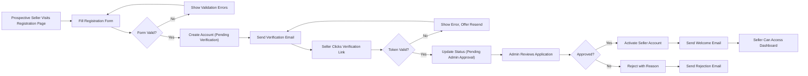
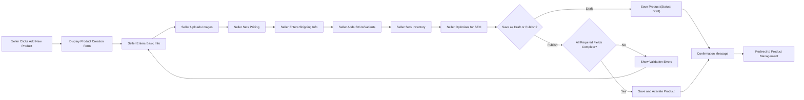

# Seller User Journeys and Workflows

## Document Overview

This document provides comprehensive specifications for all seller-related user journeys and workflows within the e-commerce marketplace platform. It defines the complete seller experience from registration through daily business operations including product management, order fulfillment, inventory control, and customer engagement.

**Scope**: This document covers all business processes, workflows, and functional requirements specific to seller actors within the marketplace. It focuses on what sellers can do, how they interact with the system, and the business rules governing their operations.

**Audience**: Backend developers responsible for implementing seller-facing features and business logic.

**Related Documentation**: 
- For seller authentication and permissions, see [User Actors and Authentication Requirements](./02-user-actors-authentication.md)
- For customer perspective on the same marketplace, see [Customer User Journeys](./03-customer-user-journeys.md)
- For detailed product data structures, see [Product Management Requirements](./05-product-management-requirements.md)
- For complete order lifecycle details, see [Order Management and Fulfillment](./07-order-management-fulfillment.md)
- For inventory system specifications, see [Inventory Management](./09-inventory-management.md)
- For review system details, see [Review and Rating System](./10-review-rating-system.md)

## Seller Registration and Onboarding Journey

### Business Context

Sellers are vendors who want to operate their own storefronts within the marketplace. The registration process must collect sufficient business information to verify seller legitimacy while maintaining a smooth onboarding experience. Unlike customers, sellers require additional verification before they can begin listing products.

### Seller Registration Process

#### Initial Registration

**WHEN** a prospective seller accesses the seller registration page, **THE** system **SHALL** display a registration form requesting business information.

**THE** seller registration form **SHALL** collect the following information:
- Business email address (unique identifier for seller authentication)
- Password (minimum 8 characters, must include uppercase, lowercase, number, and special character)
- Business name (official company or individual business name)
- Business type (sole proprietorship, partnership, corporation, LLC)
- Business registration number (if applicable based on business type)
- Business phone number
- Primary business address (street, city, state/province, postal code, country)
- Business category (electronics, fashion, home goods, books, etc.)
- Tax identification number (for financial reporting and compliance)
- Bank account information for payment settlements (account holder name, bank name, account number, routing number)

**WHEN** a seller submits the registration form, **THE** system **SHALL** validate all required fields are completed.

**WHEN** a seller submits the registration form, **THE** system **SHALL** validate the email address format.

**WHEN** a seller submits the registration form with an email already registered, **THE** system **SHALL** reject the registration and display an error message indicating the email is already in use.

**WHEN** a seller submits the registration form, **THE** system **SHALL** validate the password meets complexity requirements.

**IF** password validation fails, **THEN** **THE** system **SHALL** display specific error messages indicating which requirements are not met.

**WHEN** a seller successfully submits a valid registration form, **THE** system **SHALL** create a seller account in "pending verification" status.

**WHEN** a seller account is created, **THE** system **SHALL** send a verification email to the provided business email address.

**THE** verification email **SHALL** contain a unique verification link valid for 24 hours.

#### Email Verification

**WHEN** a seller clicks the verification link in the email, **THE** system **SHALL** verify the token validity.

**IF** the verification token is expired, **THEN** **THE** system **SHALL** display an error message and provide an option to resend the verification email.

**IF** the verification token is valid, **THEN** **THE** system **SHALL** mark the seller's email as verified and update account status to "pending admin approval".

**WHEN** a seller's email is verified, **THE** system **SHALL** send a notification email confirming email verification and informing them that their account is under review.

#### Admin Approval Process

**WHEN** a seller account reaches "pending admin approval" status, **THE** system **SHALL** create a notification for administrators to review the seller application.

**THE** system **SHALL** allow administrators to review seller business information, documentation, and credentials.

**WHEN** an administrator approves a seller account, **THE** system **SHALL** update the seller status to "active".

**WHEN** a seller account is approved, **THE** system **SHALL** send a welcome email to the seller with next steps for setting up their storefront.

**WHEN** an administrator rejects a seller account, **THE** system **SHALL** update the seller status to "rejected" and record the rejection reason.

**WHEN** a seller account is rejected, **THE** system **SHALL** send a notification email to the seller explaining the rejection reason.

#### Seller Onboarding Flow

### Seller Authentication

**WHEN** an approved seller accesses the seller login page, **THE** system **SHALL** display email and password fields.

**WHEN** a seller submits login credentials, **THE** system **SHALL** validate the email and password against stored seller credentials.

**IF** the credentials are invalid, **THEN** **THE** system **SHALL** display an error message indicating invalid email or password.

**IF** the seller account status is not "active", **THEN** **THE** system **SHALL** prevent login and display a message indicating the account status.

**WHEN** a seller successfully authenticates, **THE** system **SHALL** generate a JWT access token valid for 30 minutes.

**WHEN** a seller successfully authenticates, **THE** system **SHALL** generate a JWT refresh token valid for 30 days.

**THE** JWT access token **SHALL** include the following claims:
- Seller ID (unique identifier)
- Seller role ("seller")
- Business name
- Account status
- Token expiration timestamp

**WHEN** a seller's access token expires, **THE** system **SHALL** allow the seller to obtain a new access token using the valid refresh token.

**WHEN** a seller logs out, **THE** system **SHALL** invalidate the current session and clear authentication tokens.

### Business Rules for Seller Registration

**THE** system **SHALL** require unique business email addresses for each seller account.

**THE** system **SHALL** not allow a seller to list products or access full dashboard features until account status is "active".

**THE** system **SHALL** retain seller registration data for rejected accounts for 90 days for audit purposes.

**THE** system **SHALL** require sellers to verify their email before admin approval process begins.

**WHERE** a seller's account is inactive for 365 days without any product listings, **THE** system **SHALL** send a notification asking if they wish to continue or close the account.

## Seller Dashboard and Overview

### Dashboard Purpose

The seller dashboard serves as the central hub for sellers to monitor their business performance, manage pending tasks, and access key operational features. It provides an at-a-glance view of critical business metrics and actionable items.

### Dashboard Access

**WHEN** an authenticated seller accesses the seller dashboard, **THE** system **SHALL** display the dashboard homepage.

**THE** seller dashboard **SHALL** be accessible only to sellers with "active" account status.

### Dashboard Components

#### Business Performance Summary

**THE** dashboard **SHALL** display the following performance metrics:

**Total Sales Revenue**:
- Revenue for today
- Revenue for the current week
- Revenue for the current month
- Revenue for the current year

**Order Statistics**:
- Number of pending orders requiring action
- Number of orders shipped today
- Number of orders completed this month
- Total number of orders all-time

**Product Statistics**:
- Total number of active product listings
- Number of products with low inventory (below threshold)
- Number of products out of stock
- Number of recently added products (last 7 days)

**Customer Engagement**:
- Number of new reviews awaiting seller response
- Average product rating across all seller products
- Number of products added to customer wishlists this week

**WHEN** a seller views the dashboard, **THE** system **SHALL** calculate and display these metrics in real-time based on current data.

#### Pending Actions and Notifications

**THE** dashboard **SHALL** display a section highlighting pending actions requiring seller attention:

- **New Orders**: Orders placed but not yet processed
- **Low Stock Alerts**: Products with inventory below the seller-defined threshold
- **Out of Stock**: Products with zero inventory
- **Unanswered Reviews**: Customer reviews without seller response
- **Payment Issues**: Orders with payment processing failures
- **Return Requests**: Customer-initiated return requests awaiting seller action

**WHEN** a seller clicks on a pending action item, **THE** system **SHALL** navigate the seller to the relevant management page to address the issue.

**THE** system **SHALL** display the count of pending items for each action category.

#### Quick Access Navigation

**THE** dashboard **SHALL** provide quick access links to primary seller functions:
- Product Management (view all products, add new product)
- Order Management (view orders, process shipments)
- Inventory Management (update stock levels, bulk updates)
- Sales Analytics (detailed reports and charts)
- Review Management (respond to customer reviews)
- Profile Settings (update business information, bank details)

#### Recent Activity Feed

**THE** dashboard **SHALL** display a chronological feed of recent activities:
- Recent orders placed by customers
- Recent product reviews submitted
- Recent inventory updates made by the seller
- Recent product additions or modifications
- Recent customer inquiries or messages (if messaging feature exists)

**THE** activity feed **SHALL** display the 20 most recent activities with timestamps.

**WHEN** there are more than 20 activities, **THE** system **SHALL** provide pagination or a "view all" option.

### Dashboard Business Rules

**THE** dashboard metrics **SHALL** refresh automatically when the seller performs actions that affect the data.

**THE** dashboard **SHALL** display all monetary values in the seller's configured currency.

**THE** dashboard **SHALL** display dates and times in the seller's configured timezone.

**WHERE** a seller has multiple storefronts or business accounts, **THE** system **SHALL** allow switching between accounts from the dashboard.

## Product Creation and Management Workflows

### Product Creation Journey

Sellers create products to build their catalog and make items available for customer purchase. Each product represents a distinct item with its own description, images, pricing, and variants.

#### Starting Product Creation

**WHEN** a seller accesses the product creation page, **THE** system **SHALL** display a product creation form.

**THE** product creation form **SHALL** be organized into logical sections for better usability.

#### Basic Product Information

**THE** product creation form **SHALL** collect the following basic information:

**Required Fields**:
- Product name (2-200 characters)
- Product description (50-5000 characters, rich text format supported)
- Primary product category (selected from predefined category hierarchy)
- Product condition (new, refurbished, used)
- Brand name

**Optional Fields**:
- Secondary categories (up to 3 additional categories for cross-listing)
- Model number
- Manufacturer part number
- Product dimensions (length, width, height, weight)
- Package contents description
- Warranty information

**WHEN** a seller enters product information, **THE** system **SHALL** validate character limits for text fields.

**WHEN** a seller selects a product category, **THE** system **SHALL** display the category hierarchy to help sellers choose the most specific category.

#### Product Images and Media

**THE** product creation form **SHALL** allow sellers to upload product images.

**THE** system **SHALL** require at least one product image for each product.

**THE** system **SHALL** allow up to 10 images per product.

**WHEN** a seller uploads an image, **THE** system **SHALL** validate the file format (JPEG, PNG, WebP only).

**WHEN** a seller uploads an image, **THE** system **SHALL** validate the file size does not exceed 5MB per image.

**IF** an uploaded image does not meet requirements, **THEN** **THE** system **SHALL** reject the upload and display an error message specifying the issue.

**THE** system **SHALL** allow sellers to designate one image as the primary product image.

**THE** system **SHALL** allow sellers to reorder images by drag-and-drop or using up/down controls.

**WHEN** a seller uploads product images, **THE** system **SHALL** store the original images and generate optimized versions for different display contexts.

#### Pricing Information

**THE** product creation form **SHALL** collect pricing information:

**Base Price**:
- Regular price (the standard selling price)
- Currency (automatically set to seller's configured currency)

**Optional Pricing Fields**:
- Compare-at price (original price before discount, for showing savings)
- Cost per item (seller's cost, for profit margin calculation, not visible to customers)
- Tax settings (taxable or tax-exempt, tax category if applicable)

**WHEN** a seller enters a compare-at price, **THE** system **SHALL** validate it is higher than the regular price.

**IF** the compare-at price is lower than or equal to the regular price, **THEN** **THE** system **SHALL** display a warning message.

**THE** system **SHALL** allow pricing in decimal format with up to 2 decimal places.

**THE** system **SHALL** require prices to be greater than zero.

#### Shipping Information

**THE** product creation form **SHALL** collect shipping-related information:

- Shipping weight
- Shipping dimensions (if different from product dimensions)
- Shipping origin location (city, state, country)
- Ships from warehouse/fulfillment center identifier (if applicable)

**THE** system **SHALL** use shipping information to calculate shipping costs during customer checkout.

#### SEO and Discoverability

**THE** product creation form **SHALL** allow sellers to optimize products for search:

- SEO title (optional, defaults to product name if not provided)
- Meta description (optional, for search engine results)
- Product tags/keywords (comma-separated, up to 20 tags)
- Custom URL slug (optional, auto-generated from product name if not provided)

**WHEN** a seller adds product tags, **THE** system **SHALL** suggest existing popular tags to maintain consistency.

#### Product Status and Visibility

**THE** product creation form **SHALL** allow sellers to set product status:

- **Draft**: Product is saved but not visible to customers
- **Active**: Product is live and visible in the marketplace
- **Archived**: Product is hidden from customers but retained in seller's catalog

**WHEN** a seller creates a new product, **THE** system **SHALL** default the status to "Draft".

**THE** system **SHALL** allow sellers to change product status at any time.

**WHEN** a product status is changed from "Draft" to "Active", **THE** system **SHALL** validate that all required information is complete before allowing activation.

**IF** required information is missing when activating a product, **THEN** **THE** system **SHALL** prevent activation and display a list of missing required fields.

#### Saving and Publishing Products

**WHEN** a seller clicks "Save as Draft", **THE** system **SHALL** save all entered product information without making the product visible to customers.

**WHEN** a seller clicks "Publish" or "Save and Activate", **THE** system **SHALL** validate all required fields are complete.

**IF** validation passes, **THEN** **THE** system **SHALL** save the product and set status to "Active", making it visible in the marketplace.

**IF** validation fails, **THEN** **THE** system **SHALL** display error messages indicating which fields need attention.

**WHEN** a product is successfully saved, **THE** system **SHALL** display a confirmation message.

**WHEN** a product is successfully published, **THE** system **SHALL** redirect the seller to the product management page or display the product details.

#### Product Creation Flow Diagram

### Product Editing and Updates

**WHEN** a seller accesses their product list, **THE** system **SHALL** display all products created by that seller.

**THE** product list **SHALL** display key information for each product:
- Product image (thumbnail)
- Product name
- SKU count (number of variants)
- Status (Draft, Active, Archived)
- Price range (if multiple SKUs with different prices)
- Total inventory across all SKUs
- Creation date
- Last modified date

**WHEN** a seller clicks on a product, **THE** system **SHALL** navigate to the product editing page.

**THE** product editing page **SHALL** display the same form structure as product creation, pre-populated with existing product data.

**WHEN** a seller modifies product information, **THE** system **SHALL** track the modification timestamp.

**WHEN** a seller saves changes to a product, **THE** system **SHALL** validate the updated information using the same rules as product creation.

**WHEN** a product is updated, **THE** system **SHALL** update the "last modified" timestamp.

**IF** a product is currently active and a seller makes changes, **THEN** **THE** system **SHALL** keep the product active unless the seller explicitly changes the status.

### Bulk Product Operations

**THE** product management page **SHALL** allow sellers to select multiple products using checkboxes.

**WHEN** sellers have selected multiple products, **THE** system **SHALL** display bulk action options:
- Bulk status change (activate, deactivate, archive)
- Bulk category update
- Bulk tag addition
- Bulk export (download product data as CSV)
- Bulk delete (for draft products only)

**WHEN** a seller performs a bulk action, **THE** system **SHALL** apply the action to all selected products.

**WHEN** a bulk action is completed, **THE** system **SHALL** display a summary showing how many products were successfully updated and how many failed (if any).

**IF** some products fail during a bulk operation, **THEN** **THE** system **SHALL** display error details for the failed items while completing the operation for successful items.

### Product Search and Filtering (Seller View)

**THE** product management page **SHALL** provide search functionality for sellers to find their products.

**WHEN** a seller enters a search query, **THE** system **SHALL** search across product names, descriptions, SKUs, and tags.

**THE** product management page **SHALL** provide filtering options:
- Filter by status (Draft, Active, Archived)
- Filter by category
- Filter by inventory status (In Stock, Low Stock, Out of Stock)
- Filter by date range (created date, modified date)
- Filter by price range

**WHEN** a seller applies filters, **THE** system **SHALL** update the product list to show only matching products.

**THE** system **SHALL** allow sellers to combine multiple filters.

**THE** system **SHALL** provide sorting options:
- Sort by product name (A-Z, Z-A)
- Sort by creation date (newest first, oldest first)
- Sort by last modified date (newest first, oldest first)
- Sort by price (lowest to highest, highest to lowest)
- Sort by inventory level (lowest to highest, highest to lowest)
- Sort by sales volume (best-selling first)

### Product Duplication

**WHEN** a seller views an existing product, **THE** system **SHALL** provide a "Duplicate Product" option.

**WHEN** a seller duplicates a product, **THE** system **SHALL** create a new product with all the same information except:
- Product name (appended with "- Copy")
- Status (set to "Draft" regardless of original status)
- SKU codes (regenerated to ensure uniqueness)
- Creation date (set to current date/time)

**WHEN** a product is duplicated, **THE** system **SHALL** redirect the seller to the editing page for the new duplicated product.

**THE** product duplication feature **SHALL** help sellers quickly create similar products with minor variations.

### Product Archival and Deletion

**WHEN** a seller archives a product, **THE** system **SHALL** change the product status to "Archived" and hide it from customers.

**THE** system **SHALL** retain all product information for archived products.

**THE** system **SHALL** allow sellers to reactivate archived products at any time.

**WHEN** a seller attempts to delete a product, **THE** system **SHALL** check if the product has any associated order history.

**IF** a product has been ordered at least once, **THEN** **THE** system **SHALL** prevent deletion and suggest archiving instead.

**IF** a product has never been ordered, **THEN** **THE** system **SHALL** allow permanent deletion.

**WHEN** a seller confirms product deletion, **THE** system **SHALL** permanently remove the product and all associated data (images, SKUs, inventory records).

**THE** system **SHALL** require sellers to confirm deletion actions to prevent accidental data loss.

### Business Rules for Product Management

**THE** system **SHALL** require at least one SKU (variant) for each product before it can be activated.

**THE** system **SHALL** prevent sellers from activating products that have zero inventory across all SKUs.

**THE** system **SHALL** enforce unique SKU codes across all products for a given seller.

**THE** system **SHALL** allow sellers to have a maximum of 10,000 active products.

**WHERE** a seller reaches the product limit, **THE** system **SHALL** display a message indicating they must archive or delete products before adding new ones.

**THE** system **SHALL** automatically set products to "Out of Stock" status when all SKUs reach zero inventory, but keep the product listing visible with "Out of Stock" indicator.

**WHEN** inventory is replenished for an out-of-stock product, **THE** system **SHALL** automatically restore the product to "In Stock" status.

## SKU and Product Variant Management

### Understanding SKUs and Variants

In the e-commerce marketplace, products can have multiple variations based on different attributes such as color, size, material, or other options. Each unique combination of these attributes represents a distinct SKU (Stock Keeping Unit) with its own price, inventory, and tracking.

**Example**: A t-shirt product might have variants:
- Color: Red, Blue, Green
- Size: Small, Medium, Large, XL

This creates 12 unique SKUs (3 colors × 4 sizes = 12 combinations), each with its own inventory count and potentially different pricing.

### Variant Option Management

#### Creating Product Options

**WHEN** a seller creates or edits a product, **THE** system **SHALL** allow the seller to define variant options.

**THE** system **SHALL** support up to 3 variant option types per product (e.g., Color, Size, Material).

**FOR each variant option type**, **THE** seller **SHALL** specify:
- Option name (e.g., "Color", "Size", "Style")
- Option values (e.g., for Color: "Red", "Blue", "Green")

**WHEN** a seller adds an option type, **THE** system **SHALL** allow adding up to 100 option values per option type.

**THE** system **SHALL** allow sellers to add option values by:
- Typing and pressing Enter or comma to add each value
- Bulk adding by pasting comma-separated values
- Selecting from commonly used values suggested by the system

**WHEN** a seller modifies option names or values for an existing product with SKUs, **THE** system **SHALL** display a warning that changes may affect existing SKUs.

#### Variant Combination Generation

**WHEN** a seller defines variant options, **THE** system **SHALL** automatically generate all possible SKU combinations.

**Example**:
- Option 1 - Color: Red, Blue (2 values)
- Option 2 - Size: Small, Large (2 values)
- Generated SKUs: Red/Small, Red/Large, Blue/Small, Blue/Large (4 combinations)

**THE** system **SHALL** calculate the total number of SKUs before generation and display it to the seller.

**IF** the number of SKU combinations exceeds 1,000, **THEN** **THE** system **SHALL** display a warning and ask the seller to confirm before proceeding.

**WHEN** SKUs are generated, **THE** system **SHALL** create unique SKU codes for each combination automatically.

**THE** auto-generated SKU code format **SHALL** include:
- Seller identifier prefix
- Product identifier
- Variant combination identifier
- Random unique suffix

Example SKU code: `SEL123-PROD456-RD-SM-A7B9`

**THE** system **SHALL** allow sellers to customize SKU codes manually if desired.

**WHEN** a seller customizes a SKU code, **THE** system **SHALL** validate that the code is unique across all seller's products.

### Individual SKU Management

#### SKU Data Fields

**FOR each generated SKU**, **THE** system **SHALL** allow sellers to specify:

**Required Fields**:
- SKU code (auto-generated or custom)
- Price (can inherit from product base price or be set individually)
- Inventory quantity

**Optional Fields**:
- Compare-at price (for showing discounts)
- Barcode/UPC/EAN
- Weight (if different from product-level weight)
- Cost per item (for profit tracking)
- Images specific to this variant
- Availability status (available, discontinued)

**WHEN** a seller generates SKUs, **THE** system **SHALL** pre-populate price and weight fields with the product-level values as defaults.

**THE** system **SHALL** allow sellers to override default values for individual SKUs.

#### SKU-Specific Images

**THE** system **SHALL** allow sellers to assign specific images to individual SKUs.

**WHEN** a customer selects a variant option (e.g., color), **THE** marketplace **SHALL** display the images associated with that SKU.

**IF** no SKU-specific images are assigned, **THEN** **THE** system **SHALL** display the product-level images.

**THE** system **SHALL** allow sellers to assign multiple images to each SKU.

#### Bulk SKU Editing

**THE** system **SHALL** provide a spreadsheet-like interface for editing multiple SKUs at once.

**THE** bulk SKU editor **SHALL** display all SKUs in a table format with columns for:
- Variant combination (Color/Size/etc.)
- SKU code
- Price
- Inventory
- Barcode
- Status

**WHEN** a seller edits SKU data in the bulk editor, **THE** system **SHALL** validate each field according to the same rules as individual editing.

**THE** system **SHALL** allow sellers to export SKU data to CSV format for offline editing.

**THE** system **SHALL** allow sellers to import SKU data from CSV to bulk update prices, inventory, and other fields.

**WHEN** importing SKU data from CSV, **THE** system **SHALL** validate:
- CSV format is correct
- SKU codes match existing SKUs in the product
- All data types are valid (numbers for price and inventory, valid status values, etc.)
- Required fields are not empty

**IF** CSV import validation fails, **THEN** **THE** system **SHALL** display detailed error messages indicating which rows have issues and what the problems are.

**IF** CSV import validation passes, **THEN** **THE** system **SHALL** display a preview of changes before applying them.

**THE** system **SHALL** require seller confirmation before applying bulk changes from CSV import.

### Enabling and Disabling SKUs

**THE** system **SHALL** allow sellers to enable or disable individual SKUs without deleting them.

**WHEN** a SKU is disabled, **THE** system **SHALL** hide that specific variant option from customers while keeping other SKUs of the same product visible.

**Example**: If "Red/Small" SKU is disabled, customers can still purchase "Red/Medium", "Blue/Small", etc.

**THE** system **SHALL** retain all data (price, inventory, history) for disabled SKUs.

**THE** system **SHALL** allow sellers to re-enable disabled SKUs at any time.

**WHEN** all SKUs of a product are disabled, **THE** system **SHALL** display the product as "Out of Stock" to customers.

### Managing SKUs After Orders

**THE** system **SHALL** prevent sellers from deleting SKUs that have been included in customer orders.

**WHEN** a seller attempts to delete a SKU with order history, **THE** system **SHALL** display an error message and suggest disabling the SKU instead.

**THE** system **SHALL** allow sellers to modify prices of SKUs with order history, but price changes only affect future orders.

**THE** system **SHALL** retain historical SKU information for all past orders regardless of current SKU status.

### Variant Option Modification After SKU Creation

**WHEN** a seller attempts to modify variant options (add, remove, or rename option values) after SKUs have been created, **THE** system **SHALL** display a warning about the impact.

**IF** a seller adds a new option value (e.g., adding "Yellow" to existing colors), **THEN** **THE** system **SHALL** offer to automatically generate new SKU combinations with the new value.

**IF** a seller removes an option value, **THEN** **THE** system **SHALL** identify all SKUs using that value and require the seller to decide whether to:
- Disable those SKUs
- Delete those SKUs (only if they have no order history)
- Map those SKUs to a different option value

**WHEN** a seller renames an option value (e.g., changing "Red" to "Crimson Red"), **THE** system **SHALL** update all associated SKUs without breaking existing data.

### SKU Inventory Management

**THE** inventory for each SKU **SHALL** be tracked independently.

**WHEN** a customer purchases a product, **THE** system **SHALL** decrement the inventory for the specific SKU ordered.

**THE** system **SHALL** display inventory status at the SKU level:
- In Stock (inventory > low stock threshold)
- Low Stock (inventory ≤ low stock threshold but > 0)
- Out of Stock (inventory = 0)

**THE** system **SHALL** allow sellers to set low stock thresholds at the product level (applies to all SKUs) or per individual SKU.

For detailed inventory management workflows, see [Inventory Management](./09-inventory-management.md).

### SKU Pricing Strategies

**THE** system **SHALL** support different pricing strategies for SKUs:

**Uniform Pricing**: All SKUs of a product have the same price.

**WHEN** uniform pricing is used, **THE** system **SHALL** allow sellers to set the price at the product level, and all SKUs inherit this price.

**Variant-Based Pricing**: Different SKUs have different prices based on their attributes.

**WHEN** variant-based pricing is used, **THE** system **SHALL** allow sellers to set individual prices for each SKU.

**WHEN** displaying products to customers with variant-based pricing, **THE** system **SHALL** show the price range (e.g., "$19.99 - $39.99") or the starting price (e.g., "From $19.99").

### Business Rules for SKU Management

**THE** system **SHALL** enforce unique SKU codes within a seller's entire product catalog.

**THE** system **SHALL** allow a maximum of 1,000 SKUs per individual product.

**IF** a seller's variant combinations would exceed 1,000 SKUs, **THEN** **THE** system **SHALL** prevent the creation and suggest reducing the number of variant options or values.

**THE** system **SHALL** require at least one enabled SKU with available inventory for a product to be purchasable.

**WHEN** a product has multiple SKUs, **THE** system **SHALL** calculate the total product inventory as the sum of all SKU inventories.

**THE** system **SHALL** preserve SKU data for audit and historical purposes even after SKUs are disabled or products are archived.

## Inventory Management Operations

### Inventory Tracking Overview

Inventory is tracked at the individual SKU level. Each SKU maintains its own inventory quantity, and sellers are responsible for keeping inventory counts accurate to prevent overselling and ensure customer satisfaction.

For comprehensive inventory system specifications, see [Inventory Management](./09-inventory-management.md). This section focuses on seller workflows and operations.

### Viewing Inventory Status

**WHEN** a seller accesses the inventory management page, **THE** system **SHALL** display a list of all SKUs across all products with their current inventory levels.

**THE** inventory list **SHALL** display the following information for each SKU:
- Product name and thumbnail image
- Variant details (color, size, etc.)
- SKU code
- Current inventory quantity
- Low stock threshold
- Inventory status (In Stock, Low Stock, Out of Stock)
- Reserved quantity (inventory reserved for pending orders)
- Available quantity (inventory minus reserved)

**THE** system **SHALL** highlight SKUs with low stock or out of stock status using visual indicators (colors, icons).

**THE** system **SHALL** allow sellers to filter the inventory list by:
- Inventory status (In Stock, Low Stock, Out of Stock)
- Product category
- Product name or SKU code (search)
- Date range of last inventory update

**THE** system **SHALL** allow sellers to sort the inventory list by:
- Product name
- Inventory quantity (lowest to highest, highest to lowest)
- Last updated date

### Updating Inventory Quantities

#### Individual SKU Update

**WHEN** a seller clicks on a SKU in the inventory list, **THE** system **SHALL** display an inventory update form.

**THE** inventory update form **SHALL** allow the seller to:
- View current inventory quantity
- Add to inventory (receive stock)
- Subtract from inventory (account for damage, loss, etc.)
- Set absolute inventory quantity (replace current with new value)

**WHEN** a seller adds or subtracts inventory, **THE** system **SHALL** require the seller to enter:
- Quantity change amount
- Reason for change (received shipment, damaged goods, inventory correction, etc.)
- Optional notes

**WHEN** a seller sets an absolute inventory quantity, **THE** system **SHALL** display a confirmation dialog showing the change from current quantity to new quantity.

**WHEN** an inventory change is submitted, **THE** system **SHALL** validate the quantity is a non-negative integer.

**IF** the quantity change would result in negative inventory, **THEN** **THE** system **SHALL** reject the change and display an error message.

**WHEN** an inventory update is successfully saved, **THE** system **SHALL** record:
- Previous quantity
- New quantity
- Change amount
- Timestamp
- Reason
- Seller user who made the change

**WHEN** inventory is updated, **THE** system **SHALL** immediately reflect the new quantity in all relevant displays (product listings, seller dashboard, etc.).

#### Bulk Inventory Update

**THE** system **SHALL** allow sellers to update inventory for multiple SKUs simultaneously.

**THE** bulk inventory update interface **SHALL** allow sellers to:
- Select multiple SKUs using checkboxes
- Upload a CSV file containing SKU codes and new inventory quantities
- Enter inventory changes in a spreadsheet-like grid interface

**WHEN** using CSV upload for bulk inventory update, **THE** system **SHALL** validate:
- CSV format matches the required structure (SKU code, quantity)
- All SKU codes exist in the seller's catalog
- All quantities are non-negative integers

**IF** CSV validation fails, **THEN** **THE** system **SHALL** display error details indicating which rows have issues.

**IF** CSV validation passes, **THEN** **THE** system **SHALL** display a preview showing current vs. new quantities for all affected SKUs.

**THE** system **SHALL** require seller confirmation before applying bulk inventory changes.

**WHEN** bulk inventory changes are applied, **THE** system **SHALL** record the change history for each affected SKU.

**WHEN** bulk inventory update completes, **THE** system **SHALL** display a summary report showing:
- Number of SKUs successfully updated
- Number of SKUs that failed (if any)
- Details of any errors

### Inventory Reservation System

**WHEN** a customer adds a product to their cart, **THE** system **SHALL** NOT reserve inventory.

**WHEN** a customer initiates checkout, **THE** system **SHALL** reserve the inventory for items in the cart.

**THE** inventory reservation **SHALL** remain active for 15 minutes during the checkout process.

**IF** the customer completes the order within 15 minutes, **THEN** **THE** system **SHALL** convert the reservation to a permanent inventory deduction.

**IF** the customer does not complete the order within 15 minutes, **THEN** **THE** system **SHALL** release the reserved inventory back to available stock.

**WHEN** inventory is reserved, **THE** system **SHALL** subtract the reserved quantity from "available inventory" but not from "total inventory".

**THE** seller inventory dashboard **SHALL** display both "total inventory" and "available inventory" (total minus reserved).

**THE** system **SHALL** prevent overselling by ensuring customers cannot checkout if available inventory (after accounting for reservations) is insufficient.

### Low Stock Alerts

**THE** system **SHALL** allow sellers to set low stock threshold values for each SKU or apply a default threshold to all SKUs.

**WHEN** a SKU's available inventory falls to or below the low stock threshold, **THE** system **SHALL** mark the SKU with "Low Stock" status.

**WHEN** a SKU reaches low stock status, **THE** system **SHALL** display an alert on the seller dashboard.

**THE** system **SHALL** send a notification email to the seller when SKUs reach low stock status.

**THE** low stock notification email **SHALL** include:
- List of all SKUs currently at low stock
- Current inventory level for each SKU
- Suggested action (restock)

**THE** system **SHALL** allow sellers to configure notification preferences:
- Enable/disable low stock email notifications
- Set notification frequency (immediate, daily digest, weekly digest)
- Set minimum threshold for notifications

**WHEN** inventory is replenished above the low stock threshold, **THE** system **SHALL** automatically clear the low stock status.

### Out of Stock Handling

**WHEN** a SKU's inventory reaches zero, **THE** system **SHALL** mark the SKU as "Out of Stock".

**WHEN** a SKU is out of stock, **THE** system **SHALL** display "Out of Stock" indicator to customers viewing that product variant.

**THE** system **SHALL** prevent customers from adding out of stock SKUs to their cart.

**IF** all SKUs of a product are out of stock, **THEN** **THE** product listing **SHALL** remain visible with "Out of Stock" indication, but purchase shall be disabled.

**THE** system **SHALL** allow customers to sign up for back-in-stock notifications for out of stock items (customer-facing feature, seller receives notification data).

**WHEN** a seller restocks an out of stock SKU, **THE** system **SHALL** automatically notify customers who signed up for back-in-stock alerts.

### Inventory History and Audit Trail

**THE** system **SHALL** maintain a complete history of all inventory changes for each SKU.

**THE** inventory history **SHALL** record:
- Timestamp of change
- Previous quantity
- New quantity
- Change amount
- Change type (addition, subtraction, absolute set, order fulfillment, order cancellation, etc.)
- Reason for change
- User who made the change (seller or system)
- Reference (e.g., order ID if change was due to order)

**WHEN** a seller views a SKU's inventory details, **THE** system **SHALL** provide access to the complete inventory change history.

**THE** inventory history **SHALL** be filterable by:
- Date range
- Change type
- User

**THE** system **SHALL** retain inventory history indefinitely for audit and compliance purposes.

### Inventory Reporting

**THE** system **SHALL** provide inventory reports to sellers including:

**Inventory Status Report**:
- Current snapshot of all SKUs with inventory levels
- Breakdown by In Stock, Low Stock, Out of Stock
- Total inventory value (quantity × cost per item)

**Inventory Movement Report**:
- Inventory changes over a specified date range
- Quantity added (restocks)
- Quantity sold (orders fulfilled)
- Quantity adjusted (corrections, damages, etc.)
- Net change

**Inventory Turnover Report**:
- SKUs with highest sales velocity
- SKUs with slowest movement
- Average days to sell through inventory

**THE** system **SHALL** allow sellers to export inventory reports to CSV or PDF format.

**THE** system **SHALL** allow sellers to schedule automated inventory reports to be emailed daily, weekly, or monthly.

### Business Rules for Inventory Operations

**THE** system **SHALL** enforce non-negative inventory quantities at all times.

**THE** system **SHALL** prevent order fulfillment if inventory becomes unavailable between order placement and fulfillment.

**IF** inventory discrepancies occur (e.g., reserved inventory cannot be fulfilled), **THEN** **THE** system **SHALL** alert the seller and provide options to resolve the issue.

**THE** system **SHALL** automatically deduct inventory when orders are marked as shipped or fulfilled.

**THE** system **SHALL** automatically restore inventory when orders are cancelled before shipment.

**WHEN** a customer requests a return and it's approved, **THE** system **SHALL** restore inventory only after the seller confirms receipt of returned goods.

**THE** system **SHALL** handle concurrent inventory updates safely to prevent race conditions (e.g., two orders trying to purchase the last item simultaneously).

## Incoming Order Processing Workflow

### Order Notification and Discovery

**WHEN** a customer places an order that includes products from a seller, **THE** system **SHALL** create an order record associated with that seller.

**WHEN** a new order is created, **THE** system **SHALL** send an immediate notification email to the seller.

**THE** order notification email **SHALL** include:
- Order number
- Customer name
- Order date and time
- List of items ordered from this seller
- Total order amount for seller's items
- Link to view full order details

**WHEN** a seller logs into the dashboard after receiving new orders, **THE** system **SHALL** display a notification badge indicating the number of unprocessed orders.

**THE** seller dashboard **SHALL** prominently display new orders in the "Pending Actions" section.

### Order Management Page

**WHEN** a seller accesses the order management page, **THE** system **SHALL** display a list of all orders containing the seller's products.

**THE** order list **SHALL** display the following information for each order:
- Order number (unique identifier)
- Order date and time
- Customer name
- Order status (Pending, Processing, Shipped, Delivered, Cancelled, etc.)
- Number of items in the order (from this seller)
- Order total (for seller's items only)
- Payment status (Paid, Pending, Failed, Refunded)
- Shipping method selected by customer

**THE** order list **SHALL** allow sellers to filter orders by:
- Order status
- Date range
- Payment status
- Shipping method
- Customer name or order number (search)

**THE** order list **SHALL** allow sellers to sort orders by:
- Order date (newest first, oldest first)
- Order total (highest to lowest, lowest to highest)
- Customer name (A-Z, Z-A)

**THE** system **SHALL** provide separate tabs or sections for:
- All Orders
- Pending Orders (requiring seller action)
- Processing Orders (seller is preparing shipment)
- Shipped Orders (awaiting delivery)
- Completed Orders (delivered)
- Cancelled/Returned Orders

### Viewing Order Details

**WHEN** a seller clicks on an order, **THE** system **SHALL** display the complete order details page.

**THE** order details page **SHALL** display:

**Customer Information**:
- Customer name
- Customer email
- Customer phone number (if provided)

**Shipping Information**:
- Shipping address (street, city, state/province, postal code, country)
- Shipping method selected
- Expected delivery timeframe

**Order Items**:
- For each item:
  - Product name
  - Product image (thumbnail)
  - SKU code and variant details (color, size, etc.)
  - Quantity ordered
  - Price per unit
  - Subtotal (quantity × price)

**Order Summary**:
- Items subtotal (sum of all item subtotals)
- Shipping cost
- Tax amount
- Order total

**Payment Information**:
- Payment method used
- Payment status (Paid, Pending, Failed)
- Payment date and time (if paid)
- Transaction ID

**Order Timeline**:
- Order placed date/time
- Payment confirmed date/time
- Order processed date/time (when seller marked as processing)
- Shipped date/time (when tracking added)
- Delivered date/time (when delivery confirmed)
- Any status change history

**Actions Available**:
- Mark as Processing (if pending)
- Add Tracking Information (if processing)
- Mark as Shipped (if tracking added)
- Cancel Order (if not yet shipped and within cancellation policy)
- Print Packing Slip
- Print Shipping Label
- Contact Customer (if messaging feature exists)

### Order Processing Workflow

#### Step 1: Acknowledge Order (Mark as Processing)

**WHEN** a seller receives a new order with status "Pending", **THE** system **SHALL** allow the seller to mark the order as "Processing".

**WHEN** a seller marks an order as "Processing", **THE** system **SHALL**:
- Update the order status to "Processing"
- Record the timestamp when processing started
- Send a notification email to the customer confirming the seller is preparing their order
- Remove the order from the "Pending" list and move it to "Processing" list

**THE** system **SHALL** expect sellers to mark orders as processing within 24 hours of order placement.

**IF** a seller does not mark an order as processing within 24 hours, **THEN** **THE** system **SHALL** send a reminder notification to the seller.

#### Step 2: Prepare Order for Shipment

During this phase, sellers physically pick, pack, and prepare the order for shipment. This is an offline activity, but the system supports it with:

**THE** system **SHALL** provide a printable packing slip for each order.

**THE** packing slip **SHALL** include:
- Order number
- Customer name and shipping address
- List of items with SKU codes, quantities, and product names
- Special instructions (if customer provided any)
- Barcode for scanning (if warehouse system integration exists)

**THE** system **SHALL** allow sellers to print packing slips in bulk for multiple orders.

#### Step 3: Add Shipping and Tracking Information

**WHEN** a seller has prepared an order for shipment, **THE** system **SHALL** require the seller to add shipping information before marking as shipped.

**THE** shipping information form **SHALL** collect:
- Shipping carrier name (e.g., FedEx, UPS, USPS, DHL, or custom carrier)
- Tracking number
- Shipping date (defaults to current date)
- Estimated delivery date (optional)
- Number of packages (if order shipped in multiple packages)

**WHEN** a seller enters a tracking number, **THE** system **SHALL** validate the format based on the selected carrier (basic format validation).

**WHEN** shipping information is saved, **THE** system **SHALL**:
- Associate the tracking information with the order
- Update order status to "Shipped"
- Record the ship date
- Send a shipping confirmation email to the customer with tracking details
- Update seller dashboard metrics

**THE** shipping confirmation email to customer **SHALL** include:
- Order number
- Items shipped
- Shipping carrier name
- Tracking number with clickable link to carrier tracking page
- Estimated delivery date (if provided)

**THE** system **SHALL** allow sellers to add tracking information for multiple orders in bulk (e.g., after batch processing shipments).

#### Step 4: Order Shipped Status

**WHEN** an order is marked as shipped, **THE** order **SHALL** move to "Shipped" status.

**THE** system **SHALL** display shipped orders separately from pending and processing orders.

**WHEN** an order is shipped, **THE** system **SHALL** deduct the ordered quantities from inventory (if not already deducted at order placement).

**THE** seller **SHALL** no longer be able to cancel an order after it has been shipped.

**THE** system **SHALL** allow sellers to update tracking information for shipped orders if corrections are needed.

### Handling Multi-Seller Orders

In a marketplace where a customer's single order contains items from multiple sellers, each seller only sees and manages their portion of the order.

**WHEN** a customer order includes items from multiple sellers, **THE** system **SHALL** create separate order records for each seller.

**THE** order number format **SHALL** indicate the relationship (e.g., main order #10001, seller-specific sub-orders #10001-A, #10001-B).

**EACH** seller **SHALL** only see the items they need to fulfill, along with the customer's shipping information.

**EACH** seller **SHALL** process and ship their portion of the order independently.

**THE** customer **SHALL** receive separate shipping notifications from each seller with individual tracking numbers.

**THE** system **SHALL** track the fulfillment status of each seller's portion separately.

**THE** overall customer order status **SHALL** reflect the combined status of all seller portions (e.g., "Partially Shipped" if some sellers have shipped but others have not).

### Order Cancellation by Seller

**THE** system **SHALL** allow sellers to cancel orders under specific conditions.

**WHEN** a seller attempts to cancel an order, **THE** system **SHALL** check if cancellation is allowed based on:
- Order has not been shipped yet
- Payment has been received (to process refund)
- Order is not already in cancelled status

**IF** cancellation is allowed, **THEN** **THE** system **SHALL** display a cancellation confirmation dialog.

**THE** cancellation dialog **SHALL** require the seller to:
- Select a reason for cancellation (out of stock, customer request, pricing error, unable to fulfill, etc.)
- Enter optional notes explaining the cancellation

**WHEN** a seller confirms order cancellation, **THE** system **SHALL**:
- Update order status to "Cancelled"
- Restore the ordered quantities back to inventory
- Initiate a refund to the customer (processed according to payment processor rules)
- Send a cancellation notification email to the customer explaining the reason
- Remove the order from the active orders list and move it to cancelled orders

**THE** cancellation notification email to customer **SHALL** include:
- Order number
- Reason for cancellation
- Refund amount and expected refund timeline
- Apology message
- Link to customer support if they have questions

**THE** system **SHALL** record the cancellation in the order timeline with timestamp, seller user who cancelled, and reason.

### Handling Customer Cancellation Requests

**WHEN** a customer requests to cancel an order (via the customer interface), **THE** system **SHALL** notify the seller of the cancellation request.

**IF** the order has not been shipped, **THEN** **THE** system **SHALL** allow the seller to approve or deny the cancellation request.

**WHEN** a seller approves a customer cancellation request, **THE** system **SHALL** process the cancellation following the same workflow as seller-initiated cancellation.

**IF** the order has already been shipped when the customer requests cancellation, **THEN** **THE** system **SHALL** inform the customer that the order cannot be cancelled and they should use the return process instead.

For complete order lifecycle and cancellation policies, see [Order Management and Fulfillment](./07-order-management-fulfillment.md).

### Order Processing Flow Diagram

```mermaid
graph LR
    A["Customer Places Order"] --> B["Seller Receives Order Notification"]
    B --> C["Seller Views Order Details"]
    C --> D{"Seller Can Fulfill?"}
    D -->|"No"| E["Seller Cancels Order"]
    E --> F["Inventory Restored"]
    F --> G["Customer Refunded"]
    G --> H["Cancellation Email Sent"]
    D -->|"Yes"| I["Seller Marks as Processing"]
    I --> J["Processing Email Sent to Customer"]
    J --> K["Seller Prepares Order"]
    K --> L["Seller Prints Packing Slip"]
    L --> M["Seller Packs Items"]
    M --> N["Seller Adds Tracking Info"]
    N --> O["Order Marked as Shipped"]
    O --> P["Inventory Deducted"]
    P --> Q["Shipping Email Sent to Customer"]
    Q --> R["Order Tracked Until Delivery"]
```

### Business Rules for Order Processing

**THE** seller **SHALL** mark orders as "Processing" within 24 hours of receiving the order.

**THE** seller **SHALL** ship orders within 2 business days of marking as "Processing" (or according to the shipping timeframe promised at checkout).

**IF** a seller consistently fails to process orders within the expected timeframe, **THEN** **THE** system **SHALL** flag the seller account for admin review.

**THE** system **SHALL** prevent sellers from editing order item quantities, prices, or shipping addresses after the order is placed.

**IF** a seller needs to modify order details, **THEN** they must cancel the original order and request the customer place a new order with corrections.

**THE** system **SHALL** require tracking information for all shipped orders to protect both sellers and customers.

**WHEN** payment for an order fails or is disputed, **THE** system **SHALL** prevent the seller from shipping the order until payment is resolved.

**THE** system **SHALL** hold seller payments in escrow until orders are marked as delivered or a specified holding period expires (e.g., 7 days after delivery).

## Shipping Status Updates

### Tracking Information Display

**WHEN** a seller has added tracking information to an order, **THE** system **SHALL** display the tracking details in the order details page.

**THE** tracking details display **SHALL** include:
- Shipping carrier name
- Tracking number
- Ship date
- Estimated delivery date
- Link to carrier's tracking page

**THE** system **SHALL** provide a clickable link that opens the carrier's tracking page in a new browser tab.

### Automatic Tracking Updates (Optional Integration)

**WHERE** the platform integrates with shipping carrier APIs, **THE** system **SHALL** automatically update order delivery status based on carrier tracking data.

**WHEN** a carrier reports an order as "Delivered", **THE** system **SHALL** automatically update the order status to "Delivered".

**WHEN** an order is marked as delivered, **THE** system **SHALL** send a delivery confirmation notification to the customer.

**WHEN** an order is marked as delivered, **THE** system **SHALL** update the seller's dashboard metrics (completed orders).

**WHERE** automatic tracking is not available, **THE** seller **SHALL** be responsible for manually updating order status to "Delivered" based on carrier information.

### Handling Shipping Issues

**IF** a customer reports a shipping issue (package lost, damaged, not delivered), **THE** system **SHALL** allow the seller to view the issue report.

**THE** system **SHALL** provide communication tools for the seller to respond to customer shipping inquiries.

**WHEN** a shipping issue is reported, **THE** seller **SHALL** be responsible for:
- Investigating the issue with the carrier
- Providing resolution to the customer (replacement shipment, refund, etc.)
- Updating the order status and notes accordingly

**THE** system **SHALL** track shipping issue reports and resolution status as part of the order timeline.

### Delivery Confirmation

**WHEN** an order reaches "Delivered" status, **THE** system **SHALL** consider the order complete from the seller's perspective.

**THE** system **SHALL** move delivered orders to the "Completed Orders" section.

**THE** system **SHALL** release seller payment from escrow after delivery (subject to platform's payment settlement rules).

**THE** completed order **SHALL** remain accessible to the seller for reference and customer support purposes.

**WHEN** an order is delivered, **THE** customer **SHALL** have a window of time (e.g., 30 days) to request a return or report issues.

For return and refund processing, see [Order Management and Fulfillment](./07-order-management-fulfillment.md).

### Business Rules for Shipping Updates

**THE** seller **SHALL** provide accurate tracking information to ensure customers can monitor their shipments.

**IF** a seller provides invalid or fake tracking numbers, **THEN** **THE** system **SHALL** flag the seller account for review and potential penalties.

**THE** system **SHALL** consider an order as automatically delivered if tracking shows delivery or if 15 days pass since shipment without delivery confirmation.

**THE** system **SHALL** require sellers to respond to customer shipping inquiries within 24 hours.

## Sales Analytics and Reporting

### Analytics Dashboard

**WHEN** a seller accesses the sales analytics page, **THE** system **SHALL** display comprehensive business metrics and visualizations.

**THE** analytics dashboard **SHALL** provide data for customizable date ranges:
- Today
- Last 7 days
- Last 30 days
- Last 90 days
- This month
- Last month
- This year
- Custom date range (seller selects start and end dates)

### Revenue and Sales Metrics

**THE** analytics dashboard **SHALL** display revenue metrics:

**Total Sales Revenue**:
- Gross revenue (total sales before fees and refunds)
- Net revenue (gross revenue minus platform fees, refunds, and returns)
- Revenue trend chart (line chart showing revenue over time)

**Order Metrics**:
- Total number of orders
- Average order value (total revenue ÷ number of orders)
- Orders trend chart (bar chart showing order count over time)

**Product Performance**:
- Best-selling products (by quantity sold)
- Highest revenue products (by total revenue)
- Product sales distribution chart (pie chart or bar chart showing sales by product)

**THE** system **SHALL** allow sellers to drill down into specific metrics by clicking on chart elements or product names.

### Inventory and Product Metrics

**THE** analytics dashboard **SHALL** display inventory insights:

**Inventory Value**:
- Total inventory value (sum of all inventory quantities × cost per item)
- Inventory value by category

**Stock Status**:
- Number of products in stock
- Number of products low in stock
- Number of products out of stock

**Inventory Turnover**:
- Average days to sell inventory
- Fast-moving products (high turnover rate)
- Slow-moving products (low turnover rate)

### Customer Insights

**THE** analytics dashboard **SHALL** display customer-related metrics:

**Customer Acquisition**:
- Number of new customers (first-time buyers) during the period
- Returning customers (customers who made multiple purchases)
- Customer acquisition trend

**Customer Behavior**:
- Average items per order
- Most popular product categories purchased
- Peak shopping times (day of week, hour of day)

**Customer Geography**:
- Sales by country (if applicable)
- Sales by state/region
- Geographic sales distribution map or chart

### Performance Metrics

**THE** analytics dashboard **SHALL** display operational performance metrics:

**Order Fulfillment**:
- Average time from order to shipment
- Percentage of orders shipped within promised timeframe
- Order fulfillment trend

**Return and Cancellation Rate**:
- Percentage of orders cancelled
- Percentage of orders returned
- Trend over time

**Customer Satisfaction**:
- Average product rating across all products
- Number of reviews received
- Rating distribution (5-star, 4-star, etc.)

### Financial Reports

**THE** system **SHALL** provide detailed financial reports to sellers:

**Sales Report**:
- Date range
- List of all orders with order number, date, customer, items, and total
- Subtotals and grand totals
- Export to CSV or PDF

**Payout Report**:
- Date range
- Revenue earned
- Platform fees deducted
- Refunds processed
- Net payout amount
- Payout status (pending, processed, paid)
- Export to CSV or PDF

**Tax Report**:
- Date range
- Taxable sales
- Tax collected by jurisdiction
- Export for tax filing purposes

**Product Performance Report**:
- Each product's total sales, quantity sold, revenue
- Profit margins (if cost per item is tracked)
- Export to CSV or PDF

### Report Customization and Export

**THE** system **SHALL** allow sellers to customize reports by:
- Selecting specific date ranges
- Filtering by product category
- Filtering by order status
- Filtering by customer location

**THE** system **SHALL** allow sellers to export reports in the following formats:
- CSV (for spreadsheet analysis)
- PDF (for printing and record-keeping)
- Excel (XLSX format, if supported)

**THE** system **SHALL** allow sellers to schedule automated reports to be emailed on a recurring basis:
- Daily
- Weekly (specify day of week)
- Monthly (specify day of month)
- Quarterly

**WHEN** a scheduled report is generated, **THE** system **SHALL** send it to the seller's registered email address.

### Real-Time vs. Cached Analytics

**THE** system **SHALL** calculate critical metrics (today's sales, pending orders) in real-time for accuracy.

**THE** system **SHALL** use cached or pre-calculated data for historical analytics to ensure fast page load times.

**THE** analytics dashboard **SHALL** display a timestamp indicating when data was last updated.

**THE** system **SHALL** provide a "Refresh" button allowing sellers to manually update analytics data.

### Business Rules for Analytics

**THE** system **SHALL** only display data for the seller's own products and orders.

**THE** system **SHALL** protect customer privacy by anonymizing personal data in reports (e.g., showing customer ID instead of full name in downloadable reports).

**THE** system **SHALL** retain analytics data for at least 2 years for historical analysis and tax purposes.

**THE** system **SHALL** clearly indicate whether metrics include or exclude cancelled and returned orders.

**WHERE** platform fees vary by product category or seller tier, **THE** financial reports **SHALL** accurately reflect the applicable fees for each transaction.

## Customer Review Response Management

### Viewing Product Reviews

**WHEN** a seller accesses the review management page, **THE** system **SHALL** display all customer reviews for the seller's products.

**THE** review list **SHALL** display the following information for each review:
- Product name and thumbnail image
- Customer display name or username
- Rating (1-5 stars)
- Review title
- Review text
- Review date
- Verification status (verified purchase or not)
- Seller response status (responded or pending response)
- Number of helpful votes from other customers

**THE** review list **SHALL** allow sellers to filter reviews by:
- Product
- Rating (5-star, 4-star, 3-star, 2-star, 1-star)
- Response status (responded, pending response, all)
- Verification status (verified purchase only, all)
- Date range

**THE** review list **SHALL** allow sellers to sort reviews by:
- Most recent
- Oldest first
- Highest rated
- Lowest rated
- Most helpful (based on customer votes)

### Responding to Reviews

**WHEN** a seller views an individual review, **THE** system **SHALL** provide an option to add a seller response.

**THE** seller response form **SHALL** allow sellers to enter a text response (up to 1,000 characters).

**WHEN** a seller submits a response, **THE** system **SHALL** validate the response text is not empty and within character limits.

**WHEN** a valid response is submitted, **THE** system **SHALL**:
- Save the response associated with the review
- Display the response publicly beneath the customer review
- Update the review status to "Responded"
- Send a notification email to the customer who wrote the review informing them the seller has responded

**THE** seller response **SHALL** be publicly visible to all customers viewing the product reviews.

**THE** seller response **SHALL** display the seller's business name and response date.

**THE** system **SHALL** allow sellers to edit their responses after posting.

**WHEN** a seller edits a response, **THE** system **SHALL** display an "edited" indicator showing the response was modified.

**THE** system **SHALL** allow sellers to delete their responses if they wish to retract them.

### Review Response Best Practices Guidance

**THE** review response interface **SHALL** provide guidance to sellers on effective review responses:
- Suggestions to thank customers for positive reviews
- Tips for addressing negative reviews professionally
- Reminders to offer solutions for customer issues
- Warning against inappropriate or defensive language

**THE** system **SHALL** not enforce these as requirements but present them as helpful recommendations.

### Monitoring Review Sentiment

**THE** review management page **SHALL** display an overview of review sentiment:
- Average rating across all seller products
- Rating distribution (percentage of 5-star, 4-star, 3-star, 2-star, 1-star reviews)
- Trend over time (average rating by month or week)

**THE** system **SHALL** highlight products with declining ratings or increased negative reviews to alert sellers to potential issues.

**WHEN** a product receives a 1-star or 2-star review, **THE** system **SHALL** send an immediate notification to the seller encouraging a timely response.

### Review Notification Settings

**THE** system **SHALL** allow sellers to configure review notification preferences:
- Enable/disable new review email notifications
- Set notification frequency (immediate, daily digest, weekly digest)
- Configure which rating levels trigger immediate notifications (e.g., only 1-2 star reviews)

**WHEN** a seller receives a new review and notifications are enabled, **THE** system **SHALL** send an email notification.

**THE** review notification email **SHALL** include:
- Product name
- Customer rating
- Review text excerpt
- Link to view full review and respond

### Reporting Inappropriate Reviews

**THE** system **SHALL** allow sellers to flag reviews that violate platform policies.

**WHEN** a seller flags a review, **THE** system **SHALL** require the seller to select a reason:
- Contains offensive language or hate speech
- Contains personal information
- Is not related to the product
- Is spam or fake
- Violates platform review policies
- Other (with required explanation)

**WHEN** a review is flagged, **THE** system **SHALL** submit it to platform administrators for moderation.

**THE** seller **SHALL** not be able to delete customer reviews directly.

**THE** system **SHALL** notify the seller of the moderation outcome (review removed, review upheld).

For complete review system specifications including customer review submission and moderation policies, see [Review and Rating System](./10-review-rating-system.md).

### Business Rules for Review Responses

**THE** system **SHALL** encourage sellers to respond to all reviews, especially negative ones, to demonstrate customer service commitment.

**THE** system **SHALL** allow only one seller response per review (editable but not multiple separate responses).

**THE** seller response **SHALL** be subject to the same content policies as customer reviews (no offensive language, spam, etc.).

**IF** a seller's responses frequently violate content policies, **THEN** **THE** system **SHALL** restrict the seller's ability to respond to reviews and flag the account for admin review.

**THE** system **SHALL** not allow sellers to offer incentives or compensation for customers to change their reviews within the response text.

**THE** system **SHALL** display seller responses in a visually distinct format to differentiate them from customer reviews.

## Seller Profile and Business Information Management

### Accessing Seller Profile

**WHEN** a seller accesses the profile settings page, **THE** system **SHALL** display the current business information registered during seller onboarding.

**THE** seller profile settings **SHALL** be organized into sections for clarity.

### Business Information Section

**THE** business information section **SHALL** display and allow editing of:

**Basic Business Details**:
- Business name
- Business type (sole proprietorship, partnership, corporation, LLC)
- Business registration number
- Tax identification number

**Contact Information**:
- Business email address (login email)
- Business phone number
- Customer service email (if different from login email)
- Customer service phone number

**Business Address**:
- Street address
- City
- State/Province
- Postal code
- Country

**WHEN** a seller updates business information, **THE** system **SHALL** validate the changes:
- Email format is valid
- Phone number format is valid (based on country)
- Required fields are not empty

**WHEN** a seller changes their business email address, **THE** system **SHALL** send a verification email to the new address before updating.

**THE** seller **SHALL** verify the new email address by clicking a verification link.

**WHEN** the new email is verified, **THE** system **SHALL** update the login email and send a confirmation to both old and new email addresses for security.

### Storefront Information

**THE** seller profile **SHALL** include a storefront section visible to customers when they view the seller's products or seller page.

**THE** storefront information **SHALL** include:

**Public Seller Profile**:
- Seller display name (public-facing name, can be different from business legal name)
- Seller logo or brand image
- Seller description/bio (1,000 characters max, describing the business, values, and products)
- Return policy (seller's specific return policy statement)
- Shipping policy (seller's specific shipping policy statement)

**WHEN** a seller uploads a logo image, **THE** system **SHALL** validate:
- File format is JPEG, PNG, or SVG
- File size does not exceed 2MB
- Image dimensions are at least 200x200 pixels

**THE** system **SHALL** display the seller logo on the seller's storefront page and next to seller products in search results (if design permits).

**THE** seller description **SHALL** support basic text formatting (bold, italic, links).

**THE** return policy and shipping policy fields **SHALL** allow sellers to clearly communicate their specific policies to customers, which may differ from platform-wide policies.

### Payment and Settlement Information

**THE** seller profile **SHALL** include a payment settings section for managing payout accounts.

**THE** payment settings section **SHALL** display:

**Bank Account Information** (for receiving payouts):
- Account holder name
- Bank name
- Account number (partially masked for security, e.g., ****1234)
- Routing number (partially masked)
- Account country and currency

**WHEN** a seller wants to update bank account information, **THE** system **SHALL** require re-authentication (password verification) for security.

**WHEN** a seller updates bank account information, **THE** system **SHALL** send a confirmation email to the seller's registered email.

**THE** system **SHALL** validate bank account information format based on the country (e.g., routing number format for US banks, IBAN for European banks).

**Payout Schedule**:
- Display the current payout schedule (e.g., weekly, bi-weekly, monthly)
- Allow sellers to change payout frequency (if platform supports it)

**Tax Information**:
- Display tax forms on file (e.g., W-9 for US sellers, tax registration details for other countries)
- Allow sellers to upload updated tax forms
- Indicate whether tax information is complete and valid

**WHEN** tax information is missing or invalid, **THE** system **SHALL** display a prominent alert notifying the seller to complete tax information to avoid payout delays.

### Notification Preferences

**THE** seller profile **SHALL** include a notification preferences section.

**THE** notification preferences **SHALL** allow sellers to configure:

**Email Notifications**:
- New order notifications (enable/disable, frequency)
- Low inventory alerts (enable/disable, threshold)
- Customer review notifications (enable/disable, frequency)
- Payment and payout notifications (enable/disable)
- Policy and platform update notifications (enable/disable)

**SMS Notifications** (if supported):
- New order SMS alerts (enable/disable)
- Critical inventory alerts (enable/disable)

**WHEN** a seller updates notification preferences, **THE** system **SHALL** save the changes immediately.

**THE** system **SHALL** respect seller notification preferences for all communications except critical security and legal notices.

### Password and Security Settings

**THE** seller profile **SHALL** include a security settings section.

**THE** security settings **SHALL** allow sellers to:

**Change Password**:
- Enter current password
- Enter new password (must meet complexity requirements)
- Confirm new password

**WHEN** a seller changes their password, **THE** system **SHALL** validate:
- Current password is correct
- New password meets requirements (minimum 8 characters, uppercase, lowercase, number, special character)
- New password matches confirmation

**WHEN** password change is successful, **THE** system **SHALL** send a confirmation email to the seller's email address.

**Two-Factor Authentication (Optional)**:
- Enable/disable two-factor authentication (2FA)
- Configure 2FA method (SMS, authenticator app, email)

**WHERE** the platform supports two-factor authentication, **THE** system **SHALL** provide setup instructions and QR codes for authenticator apps.

**Active Sessions**:
- Display list of active login sessions (device, location, last active time)
- Allow sellers to log out of individual sessions remotely
- Provide "Log out all other sessions" option

### Deactivation and Account Closure

**THE** seller profile **SHALL** provide an option to temporarily deactivate or permanently close the seller account.

**Temporary Deactivation**:

**WHEN** a seller chooses to temporarily deactivate their account, **THE** system **SHALL**:
- Hide all seller products from customer view
- Prevent new orders
- Retain all seller data and settings
- Display a notice to the seller that their account is deactivated

**THE** system **SHALL** allow sellers to reactivate their account at any time.

**WHEN** a seller reactivates their account, **THE** system **SHALL** restore all products to their previous visibility status.

**Permanent Account Closure**:

**WHEN** a seller requests permanent account closure, **THE** system **SHALL**:
- Display a warning explaining the consequences (data deletion, cannot be undone)
- Require the seller to confirm the decision
- Check if there are any pending orders or unresolved issues

**IF** there are pending orders, **THEN** **THE** system **SHALL** prevent account closure until all orders are fulfilled or cancelled.

**IF** there are financial obligations (unpaid fees, pending payouts), **THEN** **THE** system **SHALL** prevent account closure until resolved.

**WHEN** account closure is confirmed and all checks pass, **THE** system **SHALL**:
- Deactivate the seller account
- Archive all seller data for legal retention period
- Send a final confirmation email
- Remove seller products from the marketplace

**THE** system **SHALL** retain order history and transaction records for legal compliance even after account closure.

### Business Rules for Seller Profile Management

**THE** seller **SHALL** keep business information accurate and up-to-date to maintain trust and comply with platform policies.

**THE** system **SHALL** verify significant changes to business information (email, bank account) to prevent fraud.

**THE** system **SHALL** display a profile completion indicator encouraging sellers to fill out all optional fields for a more complete storefront.

**WHERE** a seller has incomplete profile information (missing logo, description, policies), **THE** system **SHALL** display a notice on the dashboard prompting completion.

**THE** system **SHALL** allow sellers to preview their public storefront page to see how customers view their seller profile.

## Seller Performance Metrics

### Performance Indicators

**THE** system **SHALL** track and display seller performance metrics to encourage high-quality service.

**THE** seller dashboard **SHALL** display key performance indicators:

**Order Fulfillment Rate**:
- Percentage of orders successfully fulfilled (shipped and delivered) vs. total orders
- Target: 95% or higher

**On-Time Shipment Rate**:
- Percentage of orders shipped within promised timeframe
- Target: 90% or higher

**Order Cancellation Rate**:
- Percentage of orders cancelled by the seller
- Target: 5% or lower

**Response Time to Reviews**:
- Average time to respond to customer reviews
- Target: Within 48 hours

**Customer Satisfaction Score**:
- Average product rating across all seller products
- Target: 4.0 stars or higher

**Return Rate**:
- Percentage of orders returned by customers
- Target: 10% or lower (varies by category)

**THE** system **SHALL** calculate these metrics based on the last 90 days of activity.

**THE** system **SHALL** display each metric with:
- Current value
- Trend indicator (improving, stable, declining)
- Comparison to platform average (if available)
- Target or benchmark value

### Performance Tiers and Badges

**WHERE** the platform implements seller performance tiers, **THE** system **SHALL** assign sellers to tiers based on performance metrics:

- **Standard**: Default tier for all new sellers
- **Preferred Seller**: Sellers meeting higher performance standards
- **Top Rated Seller**: Sellers consistently exceeding performance expectations

**THE** criteria for performance tiers **SHALL** be based on:
- Minimum number of orders fulfilled (e.g., 50+ orders)
- High order fulfillment rate (e.g., 98%+)
- Low cancellation rate (e.g., <3%)
- High customer rating (e.g., 4.5+ stars average)
- Fast response time to customer inquiries and reviews

**WHEN** a seller achieves a higher performance tier, **THE** system **SHALL** display a badge on the seller's storefront and product listings.

**THE** performance tier badge **SHALL** be visible to customers to build trust.

**THE** system **SHALL** provide benefits to higher-tier sellers such as:
- Lower platform fees
- Higher visibility in search results
- Access to promotional opportunities
- Priority customer support

### Performance Alerts and Improvement Recommendations

**WHEN** a seller's performance metrics fall below targets, **THE** system **SHALL** display alerts on the seller dashboard.

**THE** alerts **SHALL** specify:
- Which metric is below target
- Current value vs. target value
- Potential consequences if performance does not improve
- Actionable recommendations to improve the metric

**THE** system **SHALL** send email notifications to sellers when critical performance issues are detected (e.g., fulfillment rate drops below 85%).

**THE** system **SHALL** provide resources and best practices guides to help sellers improve their performance.

### Business Rules for Performance Metrics

**THE** system **SHALL** calculate performance metrics fairly, excluding factors outside seller control (e.g., customer-initiated cancellations, carrier shipping delays beyond seller's control).

**THE** system **SHALL** allow a grace period for new sellers to establish a performance history before penalizing low metrics (e.g., first 30 days or first 10 orders).

**IF** a seller's performance consistently fails to meet minimum standards, **THEN** **THE** system **SHALL** flag the account for admin review and potential suspension.

**THE** system **SHALL** provide sellers with transparent access to how metrics are calculated and the data used.

## Error Scenarios and Business Rules

### Common Error Scenarios

This section outlines common error scenarios sellers may encounter and how the system should handle them.

#### Invalid Product Data Entry

**IF** a seller submits a product creation form with invalid data, **THEN** **THE** system **SHALL** display specific error messages for each invalid field without losing other entered data.

**THE** error messages **SHALL** clearly indicate what is wrong and how to fix it.

**THE** system **SHALL** highlight invalid fields visually (e.g., red border, error icon).

#### Inventory Sync Issues

**IF** a seller's inventory becomes out of sync due to concurrent order processing, **THEN** **THE** system **SHALL** use inventory reservation and locking mechanisms to prevent overselling.

**IF** overselling occurs despite safeguards, **THEN** **THE** system **SHALL** immediately notify the seller of the issue and provide options to resolve it (cancel excess orders, arrange alternative fulfillment).

#### Payment and Payout Failures

**IF** a seller's bank account information is invalid or a payout fails, **THEN** **THE** system **SHALL**:
- Notify the seller immediately via email and dashboard alert
- Hold the payout amount securely
- Provide clear instructions to update bank account information
- Retry the payout once information is corrected

**IF** payout failures occur repeatedly, **THEN** **THE** system **SHALL** flag the account for admin review.

#### Order Processing Delays

**IF** a seller does not mark an order as "Processing" within 24 hours, **THEN** **THE** system **SHALL** send a reminder notification.

**IF** a seller does not ship an order within the promised timeframe, **THEN** **THE** system **SHALL**:
- Send an alert to the seller
- Notify the customer of the delay
- Track the delay in performance metrics
- Offer the customer the option to cancel the order if delay is significant

#### Prohibited Product Listing

**IF** a seller attempts to list a product that violates platform policies (prohibited items, intellectual property infringement, etc.), **THEN** **THE** system **SHALL**:
- Reject the product listing
- Display a clear error message explaining which policy was violated
- Provide guidance on acceptable products
- Log the attempt for admin review if violations are repeated

#### Unauthorized Access Attempts

**IF** multiple failed login attempts occur for a seller account, **THEN** **THE** system **SHALL**:
- Temporarily lock the account after 5 failed attempts
- Send a security alert email to the registered email address
- Require password reset or additional verification to unlock

### General Business Rules Summary

**THE** seller **SHALL** comply with all platform policies, terms of service, and legal requirements for e-commerce operations.

**THE** seller **SHALL** provide accurate product information, pricing, and availability to customers.

**THE** seller **SHALL** fulfill orders within promised timeframes and provide tracking information.

**THE** seller **SHALL** respond professionally to customer reviews and inquiries.

**THE** seller **SHALL** maintain accurate inventory to prevent overselling.

**THE** system **SHALL** enforce these rules through validation, alerts, performance tracking, and administrative oversight.

**THE** system **SHALL** provide sellers with clear feedback when rules are violated and opportunities to correct issues before penalties are applied.

## Conclusion

This document has outlined the complete seller user journey and workflows within the e-commerce marketplace platform, from initial registration through ongoing business operations. Sellers are equipped with tools to manage their products, inventory, orders, and customer relationships effectively.

All functional requirements in this document are designed to be implemented by backend developers, focusing on business logic, workflows, and data management rather than technical implementation details. The actual system architecture, API design, and database schema are at the discretion of the development team.

For additional context and related requirements, please refer to the related documents listed in the Document Overview section.