# Order Placement and Checkout

## 1. Introduction and Overview

### 1.1 Document Purpose
This document defines the complete business requirements for the order placement and checkout process in the shoppingMall e-commerce platform. It specifies how customers proceed from their shopping cart to successfully placing orders, including address management, shipping selection, payment processing, and order confirmation.

### 1.2 Scope
This document covers:
- Complete checkout workflow from cart to order confirmation
- Delivery address selection and management during checkout
- Shipping method selection and cost calculation
- Payment processing and validation
- Order summary and final validation
- Multi-seller order splitting logic
- Pricing, tax, and shipping calculations
- Error handling and recovery scenarios

This document does NOT cover:
- Post-checkout order management (see [Order Management and Tracking](./06-order-management-tracking.md))
- Shopping cart functionality (see [Shopping Cart and Wishlist](./04-shopping-cart-wishlist.md))
- User authentication (see [User Roles and Authentication](./02-user-roles-authentication.md))
- Product inventory updates (see [Product Catalog Management](./03-product-catalog-management.md))

### 1.3 Related Systems
The checkout process integrates with:
- User authentication system for session validation
- Shopping cart system for retrieving cart items
- Product catalog for SKU details and pricing
- Inventory management for stock validation
- Payment gateway for payment processing
- Order management system for order creation
- Notification system for order confirmations

---

## 2. Checkout Process Flow

### 2.1 Complete Checkout Journey

The checkout process follows this sequence:

1. **Checkout Initiation**: Customer clicks "Proceed to Checkout" from shopping cart
2. **Authentication Verification**: System verifies customer is logged in
3. **Cart Validation**: System validates cart items are still available and in stock
4. **Address Selection**: Customer selects or adds delivery address
5. **Shipping Method Selection**: Customer chooses shipping method per seller
6. **Order Review**: Customer reviews complete order summary
7. **Payment Processing**: Customer completes payment
8. **Order Confirmation**: System confirms order and provides order numbers

### 2.2 Checkout Flow Diagram

```mermaid
graph LR
    A["Customer Clicks Checkout"] --> B{"User Logged In?"}
    B -->|"No"| C["Redirect to Login"]
    C --> D["Return to Checkout"]
    B -->|"Yes"| E["Load Cart Items"]
    E --> F["Validate Cart Items"]
    F --> G{"All Items Available?"}
    G -->|"No"| H["Show Out of Stock Warning"]
    H --> I["Remove/Update Unavailable Items"]
    I --> J["Display Address Selection"]
    G -->|"Yes"| J
    J --> K["Customer Selects/Adds Address"]
    K --> L["Display Shipping Options"]
    L --> M["Customer Selects Shipping Method"]
    M --> N["Display Order Summary"]
    N --> O["Customer Reviews Order"]
    O --> P{"Customer Confirms?"}
    P -->|"No"| Q["Return to Cart"]
    P -->|"Yes"| R["Process Payment"]
    R --> S{"Payment Successful?"}
    S -->|"No"| T["Show Payment Error"]
    T --> U["Retry Payment or Cancel"]
    S -->|"Yes"| V["Create Orders per Seller"]
    V --> W["Send Order Confirmation"]
    W --> X["Display Order Success"]
```



### 2.3 User Journey Description

**Step 1: Checkout Initiation**
- Customer views their shopping cart with items from one or more sellers
- Customer clicks "Proceed to Checkout" button
- System validates user session is active

**Step 2: Cart Validation**
- System retrieves all cart items with current pricing and availability
- System checks each SKU for stock availability
- If items are out of stock or price has changed, customer is notified
- Customer can choose to remove unavailable items or update quantities

**Step 3: Address Selection**
- System displays customer's saved delivery addresses
- Customer can select existing address or add new address
- For multi-seller orders, customer can use same address or different addresses per seller
- System validates address format and completeness

**Step 4: Shipping Selection**
- System groups cart items by seller
- For each seller, system displays available shipping methods with costs and estimated delivery times
- Customer selects shipping method for each seller group
- System calculates total shipping cost

**Step 5: Order Review**
- System displays complete order summary including:
  - All items grouped by seller
  - Item prices and quantities
  - Subtotal per seller
  - Shipping costs per seller
  - Tax calculations
  - Final total amount
- Customer reviews all details before proceeding

**Step 6: Payment Processing**
- Customer enters payment information or selects saved payment method
- System validates payment details
- System processes payment authorization through payment gateway
- For multi-seller orders, system handles payment splitting internally

**Step 7: Order Confirmation**
- Upon successful payment, system creates separate orders for each seller
- System generates unique order numbers for each seller order
- System reduces inventory for all purchased SKUs
- System sends order confirmation email to customer
- System notifies each seller of new orders
- Customer is shown order success page with all order numbers and details

---

## 3. Address Selection and Management

### 3.1 Delivery Address Requirements

**Address Display**
- THE system SHALL display all saved delivery addresses for the logged-in customer
- THE system SHALL show address details including recipient name, phone number, street address, city, state, postal code, and country
- THE system SHALL indicate which address is marked as default
- THE system SHALL allow customers to select any saved address for delivery

**Adding New Address During Checkout**
- THE system SHALL provide an "Add New Address" option during checkout
- WHEN a customer adds a new address during checkout, THE system SHALL validate all required fields
- THE system SHALL require recipient name, phone number, complete street address, city, state, postal code, and country
- WHEN a new address is successfully added, THE system SHALL make it available for immediate selection
- THE system SHALL allow customers to mark the new address as default

**Address Validation**
- WHEN a customer submits an address, THE system SHALL validate the postal code format matches the country
- THE system SHALL validate phone number format is valid
- IF address validation fails, THEN THE system SHALL display specific error messages indicating which fields need correction
- THE system SHALL prevent checkout progress until a valid address is selected

**Default Address Handling**
- WHEN a customer has a default address saved, THE system SHALL pre-select it during checkout
- THE system SHALL allow customers to change from default address to any other saved address
- WHEN a customer marks a new address as default, THE system SHALL update the previous default address status

### 3.2 Multiple Addresses for Multi-Seller Orders

**Single Address Option**
- THE system SHALL allow customers to use the same delivery address for all items from all sellers
- WHEN a single address is selected, THE system SHALL apply it to all order segments

**Multiple Address Option**
- THE system SHALL allow customers to specify different delivery addresses for items from different sellers
- WHEN items are grouped by seller, THE system SHALL allow address selection per seller group
- THE system SHALL clearly indicate which items will be shipped to which address
- THE system SHALL calculate shipping costs separately for each address

---

## 4. Shipping Method Selection

### 4.1 Available Shipping Options

**Shipping Method Display**
- THE system SHALL display available shipping methods for each seller's items
- THE system SHALL show shipping method name, estimated delivery time, and shipping cost for each option
- THE system SHALL group shipping options by seller when multiple sellers are involved

**Standard Shipping Options**
- THE system SHALL support "Standard Shipping" with 5-7 business day delivery estimate
- THE system SHALL support "Express Shipping" with 2-3 business day delivery estimate
- THE system SHALL support "Next Day Delivery" with 1 business day delivery estimate
- WHERE a seller offers "Free Shipping" promotions, THE system SHALL display this option with zero cost

### 4.2 Shipping Cost Calculation

**Cost Calculation Rules**
- WHEN a customer selects a shipping method, THE system SHALL calculate shipping cost based on seller's shipping rates
- THE system SHALL calculate shipping costs separately for each seller in multi-seller orders
- THE system SHALL consider item weight, dimensions, and destination address for shipping cost calculation
- THE system SHALL display shipping cost in real-time as customer selects shipping methods

**Free Shipping Eligibility**
- WHERE a seller offers free shipping above a minimum order value, THE system SHALL automatically apply free shipping when eligible
- WHEN a customer's order meets free shipping criteria, THE system SHALL display "FREE" as the shipping cost
- THE system SHALL clearly indicate the minimum order value required for free shipping

### 4.3 Delivery Time Estimation

**Estimated Delivery Display**
- THE system SHALL display estimated delivery date range for each shipping method
- THE system SHALL calculate delivery estimates based on current date, shipping method, and destination
- THE system SHALL exclude weekends and holidays from delivery estimates
- WHEN a customer selects a shipping method, THE system SHALL show the expected delivery date prominently in the order summary

---

## 5. Payment Processing Requirements

### 5.1 Payment Gateway Integration

**Payment Method Support**
- THE system SHALL integrate with secure payment gateways for payment processing
- THE system SHALL support credit card payments (Visa, MasterCard, American Express)
- THE system SHALL support debit card payments
- THE system SHALL support digital wallet payments (PayPal, Apple Pay, Google Pay)
- THE system SHALL allow customers to save payment methods for future use

**Payment Security**
- THE system SHALL use HTTPS encryption for all payment-related communications
- THE system SHALL NOT store complete credit card numbers in the platform database
- THE system SHALL use payment gateway tokenization for saved payment methods
- THE system SHALL comply with PCI DSS requirements for payment data handling
- THE system SHALL implement 3D Secure authentication for credit card transactions

### 5.2 Payment Validation and Authorization

**Pre-Payment Validation**
- WHEN a customer initiates payment, THE system SHALL validate all order details are complete
- THE system SHALL validate delivery address is selected
- THE system SHALL validate shipping method is selected for all seller groups
- THE system SHALL perform final stock availability check before payment processing
- IF any items are out of stock, THEN THE system SHALL prevent payment and notify the customer

**Payment Authorization Process**
- WHEN a customer submits payment, THE system SHALL send payment authorization request to payment gateway
- THE system SHALL display payment processing indicator to customer
- THE system SHALL wait for payment gateway authorization response
- THE system SHALL timeout payment requests after 60 seconds and notify customer of timeout
- WHEN payment authorization succeeds, THE system SHALL receive authorization code and transaction ID

**Payment Amount Verification**
- THE system SHALL calculate total payment amount including all items, shipping costs, and taxes
- THE system SHALL send exact total amount to payment gateway for authorization
- THE system SHALL verify payment gateway authorization amount matches calculated total
- IF amounts do not match, THEN THE system SHALL reject the transaction and log the discrepancy

### 5.3 Payment Failure Handling

**Failed Payment Scenarios**
- WHEN payment authorization fails, THE system SHALL display user-friendly error message
- THE system SHALL indicate reason for payment failure (insufficient funds, invalid card, declined, etc.)
- THE system SHALL allow customer to retry payment with same or different payment method
- THE system SHALL allow customer to cancel checkout and return to cart
- THE system SHALL NOT reduce inventory or create orders when payment fails

**Payment Retry Process**
- WHEN a customer retries payment after failure, THE system SHALL re-validate cart items and availability
- THE system SHALL allow up to 3 payment retry attempts before requiring checkout restart
- WHEN maximum retry attempts are reached, THE system SHALL return customer to shopping cart
- THE system SHALL log all payment failure attempts for fraud detection analysis

### 5.4 Multi-Seller Payment Splitting

**Payment Distribution Logic**
- WHEN an order contains items from multiple sellers, THE system SHALL process single payment from customer
- THE system SHALL internally allocate payment amounts to each seller based on their items' subtotal and shipping
- THE system SHALL track payment allocation per seller for settlement processing
- THE system SHALL deduct platform commission from seller payment allocations
- THE system SHALL maintain audit trail of payment splitting calculations

**Settlement Tracking**
- THE system SHALL record total customer payment amount
- THE system SHALL record allocated amount for each seller
- THE system SHALL record platform commission amount
- THE system SHALL record payment gateway fees
- THE system SHALL maintain transaction records for financial reconciliation

---

## 6. Order Summary and Validation

### 6.1 Order Summary Display

**Summary Components**
- THE system SHALL display complete order summary before payment
- THE system SHALL group items by seller in the order summary
- THE system SHALL show item name, SKU variant details, quantity, unit price, and subtotal for each item
- THE system SHALL show delivery address for each seller group
- THE system SHALL show selected shipping method and cost for each seller group
- THE system SHALL display itemized breakdown of subtotal, shipping, tax, and total per seller
- THE system SHALL display grand total for entire order

**Order Summary Example Structure**
```
Order Summary

Seller: Electronics Store
  - Product: Wireless Headphones (Black, Large) x1 @ $99.99 = $99.99
  - Product: USB Cable (2m) x2 @ $9.99 = $19.98
  Subtotal: $119.97
  Shipping (Express): $12.00
  Tax: $9.60
  Seller Total: $141.57

Seller: Fashion Boutique
  - Product: Cotton T-Shirt (Blue, Medium) x3 @ $24.99 = $74.97
  Subtotal: $74.97
  Shipping (Standard): $5.00
  Tax: $6.00
  Seller Total: $85.97

Grand Total: $227.54
```

### 6.2 Pre-Order Validation

**Final Stock Availability Check**
- WHEN a customer reviews order summary, THE system SHALL perform real-time stock check for all items
- IF any item is out of stock, THEN THE system SHALL display warning message and prevent checkout
- THE system SHALL indicate which specific items are unavailable
- THE system SHALL offer to remove out-of-stock items or return to cart for modification

**Price Consistency Validation**
- THE system SHALL verify current product prices match prices in order summary
- IF prices have changed since cart was loaded, THEN THE system SHALL update order summary and notify customer
- THE system SHALL require customer to review updated prices before proceeding to payment
- THE system SHALL recalculate totals when prices change

**Address and Shipping Validation**
- THE system SHALL verify delivery address is complete and valid
- THE system SHALL verify shipping method is selected for all seller groups
- IF any required information is missing, THEN THE system SHALL prevent payment and highlight missing fields
- THE system SHALL ensure shipping costs are calculated for all selected methods

**Order Limits and Restrictions**
- THE system SHALL enforce minimum order value requirements if configured per seller
- THE system SHALL enforce maximum quantity limits per SKU if configured
- IF order violates limits, THEN THE system SHALL notify customer and prevent checkout
- THE system SHALL validate customer account is in good standing before allowing checkout

---

## 7. Order Confirmation

### 7.1 Order Creation Process

**Successful Payment Handling**
- WHEN payment authorization succeeds, THE system SHALL immediately create order records
- THE system SHALL create separate order records for each seller involved in the transaction
- THE system SHALL generate unique order number for each seller's order
- THE system SHALL assign order status "Pending" to newly created orders
- THE system SHALL record payment transaction ID with each order

**Order Number Generation**
- THE system SHALL generate order numbers in format: ORD-YYYYMMDD-NNNNNN (e.g., ORD-20250113-000001)
- THE system SHALL ensure order numbers are unique across the platform
- THE system SHALL increment sequence number for each new order
- THE system SHALL include order creation date in order number for easy reference

**Inventory Reduction**
- WHEN orders are successfully created, THE system SHALL reduce inventory quantities for all purchased SKUs
- THE system SHALL reduce inventory atomically to prevent overselling
- THE system SHALL record inventory transaction with order reference
- IF inventory reduction fails, THEN THE system SHALL cancel the order and initiate refund

### 7.2 Order Confirmation Notifications

**Customer Notification**
- WHEN orders are created, THE system SHALL send order confirmation email to customer
- THE system SHALL include all order numbers in confirmation email
- THE system SHALL include complete order details: items, quantities, prices, shipping addresses, shipping methods
- THE system SHALL include estimated delivery dates for each order
- THE system SHALL include payment receipt details
- THE system SHALL provide links to track each order

**Seller Notification**
- WHEN an order is created for a seller, THE system SHALL send new order notification to seller
- THE system SHALL include order number, customer information, items ordered, delivery address, and shipping method
- THE system SHALL notify seller to prepare items for shipment
- THE system SHALL include order fulfillment deadline based on selected shipping method

### 7.3 Order Success Page

**Success Page Display**
- WHEN checkout completes successfully, THE system SHALL redirect customer to order success page
- THE system SHALL display "Order Successful" confirmation message
- THE system SHALL list all order numbers created from the checkout
- THE system SHALL provide order details summary for each order
- THE system SHALL display estimated delivery dates
- THE system SHALL provide "Track Order" links for each order
- THE system SHALL provide "Continue Shopping" and "View Order History" buttons

**Post-Checkout Actions**
- WHEN orders are confirmed, THE system SHALL clear the customer's shopping cart
- THE system SHALL update customer's order history with new orders
- THE system SHALL track order events for analytics (conversion tracking)

---

## 8. Multi-Seller Order Splitting

### 8.1 Order Grouping Logic

**Automatic Seller Grouping**
- WHEN a shopping cart contains items from multiple sellers, THE system SHALL automatically group items by seller
- THE system SHALL identify seller for each cart item based on product ownership
- THE system SHALL maintain item grouping throughout the checkout process
- THE system SHALL clearly display seller name for each item group

**Order Splitting Rules**
- THE system SHALL create separate order for each seller involved in the transaction
- THE system SHALL ensure each order contains only items belonging to that seller
- THE system SHALL assign unique order number to each seller's order
- THE system SHALL link all orders from same checkout transaction for reference

### 8.2 Independent Order Tracking

**Separate Order Management**
- THE system SHALL allow each seller to manage their order independently
- THE system SHALL track order status separately for each seller's order
- THE system SHALL allow different fulfillment timelines for each seller
- THE system SHALL enable each seller to update shipping status independently

**Customer View of Split Orders**
- THE system SHALL display all orders from single checkout transaction together in customer's order history
- THE system SHALL clearly indicate these orders originated from same purchase
- THE system SHALL allow customer to track each order separately
- THE system SHALL provide separate tracking numbers when orders ship

### 8.3 Shipping and Fulfillment per Seller

**Independent Shipping**
- THE system SHALL allow each seller to ship their items separately
- THE system SHALL calculate shipping costs independently for each seller
- THE system SHALL allow different shipping methods per seller
- THE system SHALL provide separate tracking information for each shipment

**Delivery Coordination**
- THE system SHALL display estimated delivery dates separately for each seller's order
- THE system SHALL notify customer when each order ships
- THE system SHALL notify customer when each order is delivered
- THE system SHALL NOT require all orders to arrive together

### 8.4 Payment Distribution

**Seller Payment Allocation**
- WHEN customer payment is processed, THE system SHALL allocate payment to each seller based on their order subtotal and shipping
- THE system SHALL calculate platform commission from each seller's allocated amount
- THE system SHALL record net payment due to each seller
- THE system SHALL track payment allocation in transaction records

**Commission Calculation**
- THE system SHALL apply configured commission rate to each seller's order subtotal
- THE system SHALL deduct commission from seller payment allocation
- THE system SHALL record commission amount for each seller order
- THE system SHALL maintain commission calculation audit trail

**Settlement Schedule**
- THE system SHALL hold seller payments until order is marked as delivered or completed
- THE system SHALL release seller payments according to platform settlement schedule
- THE system SHALL account for refunds and cancellations before final settlement
- THE system SHALL provide seller payment breakdown showing order amount, commission, and net payout

---

## 9. Pricing and Tax Calculations

### 9.1 Subtotal Calculation

**Item Subtotal**
- THE system SHALL calculate subtotal for each cart item as: quantity × unit price
- THE system SHALL use current product price at time of checkout
- THE system SHALL round subtotals to two decimal places
- THE system SHALL sum all item subtotals to get order subtotal per seller

**Seller Order Subtotal**
- WHEN items are grouped by seller, THE system SHALL calculate subtotal for each seller's items
- THE system SHALL display subtotal per seller in order summary
- THE system SHALL sum all seller subtotals to get cart total before shipping and tax

### 9.2 Shipping Cost Aggregation

**Shipping Cost per Seller**
- THE system SHALL calculate shipping cost for each seller based on selected shipping method
- THE system SHALL retrieve shipping rate from seller's shipping configuration
- THE system SHALL consider item weight, dimensions, and destination for calculation
- THE system SHALL display shipping cost separately for each seller

**Total Shipping Cost**
- THE system SHALL sum shipping costs from all sellers to get total shipping cost
- THE system SHALL display total shipping cost in grand total calculation
- THE system SHALL itemize shipping costs per seller in detailed breakdown

### 9.3 Tax Calculation Rules

**Tax Rate Determination**
- THE system SHALL determine applicable tax rate based on delivery address
- THE system SHALL apply state/provincial tax rates where applicable
- THE system SHALL apply local tax rates where applicable
- THE system SHALL support tax-exempt customer accounts where configured

**Tax Amount Calculation**
- THE system SHALL calculate tax on order subtotal plus shipping cost per seller
- THE system SHALL apply formula: tax = (subtotal + shipping) × tax rate
- THE system SHALL round tax amounts to two decimal places
- THE system SHALL display tax amount separately for each seller in detailed view

**Tax Display**
- THE system SHALL show tax breakdown per seller when expanded
- THE system SHALL show total tax for entire order in grand total
- THE system SHALL indicate tax rate applied in order summary
- THE system SHALL include tax amount in order confirmation and receipts

### 9.4 Discount Application

**Discount Types**
- WHERE a customer has applied promo code, THE system SHALL validate code is active and applicable
- THE system SHALL apply percentage discounts to order subtotal before tax
- THE system SHALL apply fixed amount discounts to order subtotal before tax
- THE system SHALL apply free shipping discounts by reducing shipping cost to zero

**Discount Calculation**
- WHEN a discount applies, THE system SHALL calculate discount amount
- THE system SHALL deduct discount from subtotal or shipping as applicable
- THE system SHALL recalculate tax based on discounted subtotal
- THE system SHALL display discount as separate line item showing amount saved

**Discount Restrictions**
- THE system SHALL enforce minimum purchase requirements for discount codes
- THE system SHALL enforce discount expiration dates
- THE system SHALL prevent stacking of incompatible discount codes
- IF discount code is invalid or expired, THEN THE system SHALL notify customer and remove discount

### 9.5 Final Total Computation

**Grand Total Calculation**
- THE system SHALL calculate grand total as: sum of all (subtotal + shipping + tax - discounts) per seller
- THE system SHALL display grand total prominently in order summary
- THE system SHALL ensure grand total matches payment amount sent to payment gateway
- THE system SHALL display breakdown showing how grand total was calculated

**Total Breakdown Example**
```
Subtotal (all sellers): $194.94
Shipping (all sellers): $17.00
Tax (all sellers): $15.60
Discounts: -$10.00
---
Grand Total: $227.54
```

---

## 10. Functional Requirements (EARS Format)

### 10.1 Checkout Initiation Requirements

- **REQ-CHK-001**: WHEN a customer clicks "Proceed to Checkout" from shopping cart, THE system SHALL verify the user is authenticated with valid session.

- **REQ-CHK-002**: IF the customer is not logged in, THEN THE system SHALL redirect to login page and return to checkout after successful authentication.

- **REQ-CHK-003**: WHEN checkout is initiated, THE system SHALL retrieve all items from the customer's shopping cart.

- **REQ-CHK-004**: THE system SHALL validate that the shopping cart contains at least one item before allowing checkout.

- **REQ-CHK-005**: IF the shopping cart is empty, THEN THE system SHALL display message "Your cart is empty" and prevent checkout.

### 10.2 Cart and Inventory Validation Requirements

- **REQ-CHK-010**: WHEN checkout begins, THE system SHALL validate stock availability for all cart items in real-time.

- **REQ-CHK-011**: IF any cart item is out of stock, THEN THE system SHALL display warning message indicating which items are unavailable.

- **REQ-CHK-012**: WHEN an item is out of stock during checkout, THE system SHALL offer options to remove the item or update quantity.

- **REQ-CHK-013**: THE system SHALL verify that requested quantity for each SKU does not exceed available inventory.

- **REQ-CHK-014**: WHEN product price has changed since item was added to cart, THE system SHALL update price and notify customer of the change.

- **REQ-CHK-015**: THE system SHALL require customer acknowledgment of price changes before proceeding to payment.

### 10.3 Address Selection Requirements

- **REQ-ADDR-001**: THE system SHALL display all saved delivery addresses for the logged-in customer during checkout.

- **REQ-ADDR-002**: WHEN a customer has a default address, THE system SHALL pre-select it as delivery address.

- **REQ-ADDR-003**: THE system SHALL allow customers to select any saved address or add new address during checkout.

- **REQ-ADDR-004**: WHEN a customer adds a new address, THE system SHALL require recipient name, phone number, street address, city, state, postal code, and country.

- **REQ-ADDR-005**: THE system SHALL validate postal code format matches the selected country.

- **REQ-ADDR-006**: THE system SHALL validate phone number format is valid.

- **REQ-ADDR-007**: IF address validation fails, THEN THE system SHALL display specific error messages for invalid fields and prevent checkout progress.

- **REQ-ADDR-008**: THE system SHALL allow customers to mark a new address as default during checkout.

- **REQ-ADDR-009**: WHERE an order contains items from multiple sellers, THE system SHALL allow same address for all items or different addresses per seller.

- **REQ-ADDR-010**: WHEN multiple addresses are used, THE system SHALL clearly indicate which items ship to which address.

### 10.4 Shipping Selection Requirements

- **REQ-SHIP-001**: THE system SHALL display available shipping methods for each seller's items.

- **REQ-SHIP-002**: THE system SHALL show shipping method name, estimated delivery time, and cost for each option.

- **REQ-SHIP-003**: THE system SHALL support Standard Shipping (5-7 business days), Express Shipping (2-3 business days), and Next Day Delivery (1 business day).

- **REQ-SHIP-004**: WHEN a customer selects a shipping method, THE system SHALL calculate and display shipping cost immediately.

- **REQ-SHIP-005**: THE system SHALL calculate shipping costs separately for each seller in multi-seller orders.

- **REQ-SHIP-006**: WHERE a seller offers free shipping above minimum order value, THE system SHALL automatically apply free shipping when order qualifies.

- **REQ-SHIP-007**: THE system SHALL display estimated delivery date range for each shipping method.

- **REQ-SHIP-008**: THE system SHALL exclude weekends and holidays from delivery date calculations.

- **REQ-SHIP-009**: THE system SHALL require shipping method selection for all seller groups before allowing payment.

### 10.5 Payment Processing Requirements

- **REQ-PAY-001**: THE system SHALL integrate with secure payment gateway using HTTPS encryption.

- **REQ-PAY-002**: THE system SHALL support credit card payments (Visa, MasterCard, American Express).

- **REQ-PAY-003**: THE system SHALL support debit card payments.

- **REQ-PAY-004**: THE system SHALL support digital wallet payments (PayPal, Apple Pay, Google Pay).

- **REQ-PAY-005**: THE system SHALL NOT store complete credit card numbers in the platform database.

- **REQ-PAY-006**: THE system SHALL use payment gateway tokenization for saved payment methods.

- **REQ-PAY-007**: THE system SHALL implement 3D Secure authentication for credit card transactions.

- **REQ-PAY-008**: WHEN a customer initiates payment, THE system SHALL perform final stock availability check before processing payment.

- **REQ-PAY-009**: IF any items are out of stock before payment, THEN THE system SHALL prevent payment and notify customer.

- **REQ-PAY-010**: WHEN payment is submitted, THE system SHALL send authorization request to payment gateway with exact order total.

- **REQ-PAY-011**: THE system SHALL display payment processing indicator while waiting for authorization.

- **REQ-PAY-012**: THE system SHALL timeout payment requests after 60 seconds and notify customer.

- **REQ-PAY-013**: WHEN payment authorization succeeds, THE system SHALL receive and store authorization code and transaction ID.

- **REQ-PAY-014**: WHEN payment authorization fails, THE system SHALL display user-friendly error message with failure reason.

- **REQ-PAY-015**: THE system SHALL allow up to 3 payment retry attempts after failure.

- **REQ-PAY-016**: WHEN maximum retry attempts are reached, THE system SHALL return customer to shopping cart.

- **REQ-PAY-017**: THE system SHALL NOT reduce inventory or create orders when payment fails.

- **REQ-PAY-018**: WHERE an order contains items from multiple sellers, THE system SHALL process single payment from customer and internally allocate amounts per seller.

### 10.6 Order Summary Requirements

- **REQ-SUM-001**: THE system SHALL display complete order summary before payment.

- **REQ-SUM-002**: THE system SHALL group items by seller in order summary.

- **REQ-SUM-003**: THE system SHALL show item name, SKU variant details, quantity, unit price, and line total for each item.

- **REQ-SUM-004**: THE system SHALL display selected delivery address for each seller group.

- **REQ-SUM-005**: THE system SHALL display selected shipping method and cost for each seller group.

- **REQ-SUM-006**: THE system SHALL show itemized breakdown: subtotal, shipping, tax, and total per seller.

- **REQ-SUM-007**: THE system SHALL display grand total for entire order.

- **REQ-SUM-008**: WHEN customer reviews order summary, THE system SHALL perform real-time stock check.

- **REQ-SUM-009**: IF prices have changed, THEN THE system SHALL update order summary, notify customer, and require review before payment.

- **REQ-SUM-010**: THE system SHALL recalculate all totals when prices or quantities change.

### 10.7 Order Confirmation Requirements

- **REQ-CONF-001**: WHEN payment authorization succeeds, THE system SHALL immediately create order records.

- **REQ-CONF-002**: THE system SHALL create separate order for each seller involved in the transaction.

- **REQ-CONF-003**: THE system SHALL generate unique order number for each seller's order in format ORD-YYYYMMDD-NNNNNN.

- **REQ-CONF-004**: THE system SHALL assign initial order status "Pending" to new orders.

- **REQ-CONF-005**: THE system SHALL record payment transaction ID with each order.

- **REQ-CONF-006**: WHEN orders are created, THE system SHALL reduce inventory quantities for all purchased SKUs atomically.

- **REQ-CONF-007**: IF inventory reduction fails, THEN THE system SHALL cancel the order and initiate refund process.

- **REQ-CONF-008**: WHEN orders are created, THE system SHALL send order confirmation email to customer with all order numbers and details.

- **REQ-CONF-009**: THE system SHALL send new order notification to each seller with order details and fulfillment information.

- **REQ-CONF-010**: WHEN checkout completes successfully, THE system SHALL redirect customer to order success page.

- **REQ-CONF-011**: THE system SHALL display all order numbers created from the checkout on success page.

- **REQ-CONF-012**: THE system SHALL provide order tracking links for each order on success page.

- **REQ-CONF-013**: WHEN orders are confirmed, THE system SHALL clear the customer's shopping cart.

- **REQ-CONF-014**: THE system SHALL update customer's order history with new orders.

### 10.8 Multi-Seller Order Requirements

- **REQ-MULTI-001**: WHEN a cart contains items from multiple sellers, THE system SHALL automatically group items by seller.

- **REQ-MULTI-002**: THE system SHALL display seller name for each item group throughout checkout.

- **REQ-MULTI-003**: THE system SHALL create separate order for each seller with unique order number.

- **REQ-MULTI-004**: THE system SHALL allow each seller to manage their order independently.

- **REQ-MULTI-005**: THE system SHALL calculate shipping costs independently for each seller.

- **REQ-MULTI-006**: THE system SHALL allow different shipping methods per seller.

- **REQ-MULTI-007**: THE system SHALL allocate customer payment to each seller based on their order subtotal and shipping.

- **REQ-MULTI-008**: THE system SHALL calculate and deduct platform commission from each seller's payment allocation.

- **REQ-MULTI-009**: THE system SHALL display all orders from single checkout together in customer's order history.

- **REQ-MULTI-010**: THE system SHALL provide separate tracking for each seller's order.

### 10.9 Pricing and Tax Requirements

- **REQ-PRICE-001**: THE system SHALL calculate item subtotal as quantity multiplied by current unit price.

- **REQ-PRICE-002**: THE system SHALL round all monetary amounts to two decimal places.

- **REQ-PRICE-003**: THE system SHALL sum item subtotals to get seller order subtotal.

- **REQ-PRICE-004**: THE system SHALL calculate shipping cost per seller based on selected shipping method.

- **REQ-PRICE-005**: THE system SHALL sum all shipping costs to get total shipping cost.

- **REQ-PRICE-006**: THE system SHALL determine tax rate based on delivery address.

- **REQ-PRICE-007**: THE system SHALL calculate tax as (subtotal + shipping) multiplied by tax rate per seller.

- **REQ-PRICE-008**: THE system SHALL display tax breakdown per seller.

- **REQ-PRICE-009**: WHERE a discount code is applied, THE system SHALL validate code is active and applicable.

- **REQ-PRICE-010**: WHEN a valid discount applies, THE system SHALL calculate and deduct discount amount before tax.

- **REQ-PRICE-011**: THE system SHALL calculate grand total as sum of all seller totals (subtotal + shipping + tax - discounts).

- **REQ-PRICE-012**: THE system SHALL verify grand total matches payment amount sent to gateway.

---

## 11. Error Handling and Edge Cases

### 11.1 Out of Stock Scenarios

**During Checkout Initiation**
- WHEN a customer proceeds to checkout and items are out of stock, THE system SHALL display clear warning identifying unavailable items
- THE system SHALL show current stock level for each out-of-stock item
- THE system SHALL offer to remove out-of-stock items from cart
- THE system SHALL allow customer to update quantities to match available stock
- THE system SHALL prevent checkout until cart contains only available items

**During Payment Processing**
- WHEN stock runs out between order review and payment, THE system SHALL detect this before charging customer
- THE system SHALL cancel payment attempt and notify customer of stock change
- THE system SHALL return customer to cart to review and update items
- THE system SHALL log concurrent purchase conflicts for inventory management analysis

**Partial Stock Availability**
- WHEN requested quantity exceeds available stock, THE system SHALL show maximum available quantity
- THE system SHALL offer to reduce quantity to available amount
- THE system SHALL recalculate order totals when quantity is reduced
- THE system SHALL allow customer to decide whether to proceed with reduced quantity

### 11.2 Payment Failure Scenarios

**Insufficient Funds**
- WHEN payment fails due to insufficient funds, THE system SHALL display message "Payment declined - insufficient funds"
- THE system SHALL suggest using alternative payment method
- THE system SHALL allow customer to retry with different card or payment option
- THE system SHALL NOT create orders or reduce inventory

**Invalid Card Details**
- WHEN payment fails due to invalid card, THE system SHALL display message "Payment failed - invalid card details"
- THE system SHALL indicate which field has error (card number, expiration, CVV)
- THE system SHALL allow customer to correct and resubmit
- THE system SHALL mask card number in error messages for security

**Payment Gateway Timeout**
- WHEN payment gateway does not respond within 60 seconds, THE system SHALL timeout the request
- THE system SHALL display message "Payment processing timed out - please try again"
- THE system SHALL NOT create orders until successful payment confirmation
- THE system SHALL allow customer to retry payment
- THE system SHALL contact payment gateway to verify no duplicate charge occurred

**Fraud Detection Decline**
- WHEN payment is declined for suspected fraud, THE system SHALL display message "Payment could not be processed - please contact your bank"
- THE system SHALL log transaction for fraud review
- THE system SHALL prevent retry attempts for suspected fraud cases
- THE system SHALL provide customer support contact information

**Payment Amount Mismatch**
- IF payment gateway authorization amount does not match calculated total, THEN THE system SHALL reject the transaction
- THE system SHALL log discrepancy for investigation
- THE system SHALL display message "Payment error occurred - please contact support"
- THE system SHALL provide transaction reference number for support inquiries

### 11.3 Address Validation Failures

**Invalid Postal Code**
- WHEN postal code format is invalid for selected country, THE system SHALL highlight postal code field
- THE system SHALL display message "Invalid postal code format for [country]"
- THE system SHALL provide example of correct format
- THE system SHALL prevent checkout until valid postal code is entered

**Missing Required Fields**
- WHEN address is incomplete, THE system SHALL highlight all missing required fields
- THE system SHALL display message "Please complete all required address fields"
- THE system SHALL list which specific fields are missing
- THE system SHALL prevent address save until all required fields are filled

**Undeliverable Address**
- WHEN address cannot be validated or is undeliverable, THE system SHALL display warning message
- THE system SHALL suggest address verification or correction
- THE system SHALL allow customer to confirm address is correct despite warning
- THE system SHALL proceed with customer-confirmed address

### 11.4 Network and System Errors

**Network Timeout**
- WHEN network request times out during checkout, THE system SHALL display user-friendly error message
- THE system SHALL offer to retry the failed operation
- THE system SHALL preserve customer's checkout progress (address, shipping selections)
- THE system SHALL log timeout for system monitoring

**Server Error**
- WHEN server error occurs during checkout, THE system SHALL display message "System error occurred - please try again"
- THE system SHALL preserve cart contents and customer selections
- THE system SHALL log error details for troubleshooting
- THE system SHALL provide customer support contact information

**Session Expiration**
- WHEN user session expires during checkout, THE system SHALL notify customer "Your session has expired"
- THE system SHALL redirect to login page
- THE system SHALL preserve cart contents after re-authentication
- THE system SHALL return customer to checkout step where they left off

### 11.5 Concurrent Checkout Scenarios

**Multiple Users Purchasing Same Item**
- WHEN multiple customers attempt to purchase the last units of an item simultaneously, THE system SHALL use atomic inventory operations to prevent overselling
- THE system SHALL allocate inventory to first successful payment
- THE system SHALL notify subsequent customers that item is no longer available
- THE system SHALL update stock levels immediately upon payment success

**Cart Reservation Timeout**
- THE system SHALL NOT reserve inventory when items are added to cart
- THE system SHALL only reduce inventory upon successful payment
- WHEN stock becomes unavailable during checkout, THE system SHALL notify customer before payment
- THE system SHALL prevent payment for unavailable items

---

## 12. Performance Requirements

### 12.1 Checkout Page Load Time

**Initial Checkout Load**
- WHEN a customer clicks "Proceed to Checkout", THE system SHALL display checkout page within 2 seconds
- THE system SHALL load cart items, addresses, and shipping options in initial page load
- THE system SHALL prioritize loading critical checkout components first
- THE system SHALL display loading indicators for asynchronous operations

**Address and Shipping Selection**
- WHEN a customer selects a delivery address, THE system SHALL update shipping options within 1 second
- WHEN a customer selects a shipping method, THE system SHALL recalculate totals and display updated summary within 1 second
- THE system SHALL provide instant feedback for all user interactions

### 12.2 Payment Processing Time

**Payment Authorization**
- WHEN a customer submits payment, THE system SHALL receive authorization response from payment gateway within 5-10 seconds under normal conditions
- THE system SHALL display payment processing indicator immediately upon submission
- THE system SHALL timeout payment requests after 60 seconds if no response
- THE system SHALL maintain responsive UI during payment processing

**Order Creation**
- WHEN payment authorization succeeds, THE system SHALL create orders and reduce inventory within 3 seconds
- THE system SHALL display order confirmation page immediately after order creation
- THE system SHALL send confirmation emails within 30 seconds of order creation

### 12.3 Real-Time Validation

**Stock Availability Checks**
- THE system SHALL perform stock availability checks in real-time without noticeable delay
- THE system SHALL validate stock before payment within 500 milliseconds
- THE system SHALL use caching strategies to optimize repeated availability checks

**Price and Tax Calculations**
- THE system SHALL calculate and display totals instantly as customer makes selections
- THE system SHALL update order summary within 500 milliseconds when items, shipping, or discounts change
- THE system SHALL perform all calculations client-side where possible for immediate feedback

---

## 13. Security and Compliance

### 13.1 Payment Data Security

**Data Transmission Security**
- THE system SHALL use HTTPS/TLS 1.2 or higher for all checkout pages and API calls
- THE system SHALL encrypt all payment data in transit using industry-standard encryption
- THE system SHALL validate SSL certificates for all payment gateway communications
- THE system SHALL prevent checkout page loading over insecure HTTP connections

**Data Storage Security**
- THE system SHALL NOT store complete credit card numbers in application database
- THE system SHALL use payment gateway tokenization for saved payment methods
- THE system SHALL store only last 4 digits of card number for customer reference
- THE system SHALL store payment tokens with encryption at rest
- THE system SHALL implement access controls limiting who can view payment-related data

**PCI DSS Compliance**
- THE system SHALL comply with PCI DSS requirements for handling payment card data
- THE system SHALL minimize storage of cardholder data to only what is necessary
- THE system SHALL maintain audit trails of payment data access
- THE system SHALL implement network segmentation between payment processing and other systems
- THE system SHALL conduct regular security assessments of payment handling processes

### 13.2 User Data Protection

**Personal Information Security**
- THE system SHALL encrypt customer addresses and contact information at rest
- THE system SHALL implement access controls for viewing customer data
- THE system SHALL log all access to customer personal information for audit
- THE system SHALL allow customers to view and delete their stored addresses

**Session Security**
- THE system SHALL use secure, httpOnly cookies for session management
- THE system SHALL implement session timeout after 30 minutes of inactivity during checkout
- THE system SHALL regenerate session IDs after successful authentication
- THE system SHALL invalidate session immediately upon logout

**HTTPS Enforcement**
- THE system SHALL redirect all HTTP requests to HTTPS for checkout pages
- THE system SHALL set HTTP Strict Transport Security (HSTS) headers
- THE system SHALL prevent mixed content warnings by serving all resources over HTTPS

### 13.3 Fraud Prevention

**Transaction Monitoring**
- THE system SHALL log all payment attempts including failed attempts
- THE system SHALL monitor for suspicious patterns (multiple failed payments, rapid retry attempts)
- THE system SHALL implement rate limiting on payment attempts per customer account
- THE system SHALL flag suspicious transactions for manual review

**Address Verification**
- THE system SHALL support Address Verification Service (AVS) through payment gateway
- THE system SHALL flag mismatches between billing and shipping addresses for review
- THE system SHALL allow customers to verify addresses before finalizing orders

**3D Secure Authentication**
- THE system SHALL implement 3D Secure (3DS) for credit card transactions
- THE system SHALL redirect customers to card issuer authentication when required
- THE system SHALL handle 3DS success and failure responses appropriately
- THE system SHALL provide liability shift protection through 3DS authentication

### 13.4 Compliance and Privacy

**GDPR Compliance** (where applicable)
- THE system SHALL obtain explicit consent before storing customer payment information
- THE system SHALL allow customers to request deletion of their payment data
- THE system SHALL provide transparency about how payment and order data is used
- THE system SHALL implement data retention policies for order and payment records

**Order Data Retention**
- THE system SHALL retain order records for minimum of 7 years for tax and legal compliance
- THE system SHALL anonymize customer data in archived orders after retention period
- THE system SHALL implement secure deletion procedures for expired data

**Audit Logging**
- THE system SHALL log all checkout and payment events with timestamps
- THE system SHALL log payment authorization requests and responses
- THE system SHALL log order creation and inventory updates
- THE system SHALL maintain audit logs for minimum of 2 years for compliance

---

## 14. Integration Points

### 14.1 Shopping Cart Integration

**Cart Data Retrieval**
- THE system SHALL retrieve complete cart contents from shopping cart system at checkout initiation
- THE system SHALL include item details: product ID, SKU ID, variant details, quantity, price
- THE system SHALL include seller information for each cart item
- THE system SHALL synchronize cart updates between cart system and checkout process

**Cart Clearing**
- WHEN checkout completes successfully, THE system SHALL trigger cart clearing in shopping cart system
- THE system SHALL remove all items from cart that were included in completed orders
- THE system SHALL preserve cart items that were not checked out (if customer had selected subset)

### 14.2 Product Catalog Integration

**Product Information Retrieval**
- THE system SHALL fetch current product details from product catalog during checkout
- THE system SHALL retrieve product name, images, SKU variant details for display
- THE system SHALL verify product is still active and available for purchase
- THE system SHALL retrieve current pricing from product catalog

**Inventory Validation**
- THE system SHALL query inventory management system for stock availability
- THE system SHALL validate requested quantities against available stock
- THE system SHALL lock inventory during payment processing to prevent overselling
- THE system SHALL release inventory locks if payment fails

### 14.3 User Authentication Integration

**Session Validation**
- THE system SHALL validate user authentication session at checkout initiation
- THE system SHALL retrieve user ID from authentication system
- THE system SHALL verify session is active and not expired
- THE system SHALL redirect to login if session is invalid

**User Profile Data**
- THE system SHALL retrieve saved delivery addresses from user profile
- THE system SHALL retrieve saved payment methods from user profile
- THE system SHALL retrieve user preferences (default address, etc.)
- THE system SHALL update user profile with new addresses added during checkout

### 14.4 Order Management Integration

**Order Creation**
- WHEN payment succeeds, THE system SHALL create orders in order management system
- THE system SHALL pass complete order details: items, quantities, prices, addresses, shipping methods
- THE system SHALL receive order IDs from order management system
- THE system SHALL update order status to "Pending" initially

**Order Tracking**
- THE system SHALL provide order IDs to customer for tracking in order management system
- THE system SHALL link to order tracking pages in confirmation emails
- THE system SHALL enable seamless transition from checkout confirmation to order tracking

### 14.5 Notification System Integration

**Email Notifications**
- THE system SHALL trigger order confirmation emails through notification system
- THE system SHALL provide order details, customer email, and email template selection
- THE system SHALL trigger seller notification emails for new orders
- THE system SHALL include order numbers and relevant details in notification requests

**SMS Notifications** (if supported)
- WHERE SMS notifications are enabled, THE system SHALL send order confirmation SMS to customer
- THE system SHALL include order number and estimated delivery date in SMS

### 14.6 Payment Gateway Integration

**Payment Processing**
- THE system SHALL send payment authorization requests to configured payment gateway
- THE system SHALL include order total, currency, customer billing info, and transaction reference
- THE system SHALL receive authorization response with transaction ID and status
- THE system SHALL handle payment gateway callbacks for async payment methods

**Payment Method Management**
- THE system SHALL tokenize payment methods through payment gateway
- THE system SHALL retrieve saved payment tokens for returning customers
- THE system SHALL delete payment tokens through gateway when customer removes saved methods

**Refund Processing**
- THE system SHALL support refund initiation through payment gateway when orders are cancelled
- THE system SHALL reference original transaction ID for refund requests
- THE system SHALL track refund status from payment gateway responses

---

## 15. Business Rules Summary

### 15.1 Core Checkout Business Rules

1. **Authentication Required**: Only authenticated customers can proceed to checkout
2. **Non-Empty Cart**: Shopping cart must contain at least one item to checkout
3. **Stock Availability**: All items must be in stock before payment can be processed
4. **Address Required**: Valid delivery address must be selected before payment
5. **Shipping Selection Required**: Shipping method must be selected for all seller groups
6. **Single Payment**: Customer makes one payment even for multi-seller orders
7. **Atomic Order Creation**: Orders are created atomically upon successful payment
8. **Inventory Reduction**: Inventory is reduced only after successful payment
9. **Multi-Seller Split**: Orders are automatically split by seller with unique order numbers
10. **Email Confirmation**: Order confirmation emails are sent to customer and sellers immediately

### 15.2 Validation Rules

1. **Postal Code**: Must match format for selected country
2. **Phone Number**: Must be valid format
3. **Address Completeness**: All required fields must be filled
4. **Payment Amount**: Must exactly match calculated order total
5. **Stock Quantity**: Requested quantity cannot exceed available inventory
6. **Price Consistency**: Current prices are used; customer is notified of changes
7. **Session Validity**: User session must be active throughout checkout

### 15.3 Security Rules

1. **HTTPS Only**: All checkout pages must be served over HTTPS
2. **No Card Storage**: Complete credit card numbers are never stored
3. **Token Only**: Payment methods stored as tokens from payment gateway
4. **3D Secure**: Credit card transactions must use 3D Secure authentication
5. **Session Timeout**: Sessions timeout after 30 minutes of inactivity
6. **Payment Retry Limit**: Maximum 3 payment retry attempts before reset

### 15.4 Multi-Seller Rules

1. **Order Separation**: Each seller gets separate order with unique order number
2. **Independent Fulfillment**: Sellers manage and ship their orders independently
3. **Separate Shipping**: Shipping costs calculated separately per seller
4. **Payment Allocation**: Customer payment is allocated to sellers based on their order totals
5. **Commission Deduction**: Platform commission is deducted from seller payment allocation
6. **Linked Orders**: Orders from same checkout are linked for customer reference

---

## Conclusion

This document has defined the complete business requirements for the order placement and checkout process in the shoppingMall e-commerce platform. The checkout system must provide a seamless, secure, and user-friendly experience for customers while handling the complexities of multi-seller order processing, payment splitting, and inventory management.

Key areas covered include:
- Complete checkout workflow from cart to order confirmation
- Address selection and management capabilities
- Shipping method selection with cost calculation
- Secure payment processing with multiple payment options
- Comprehensive order validation and error handling
- Multi-seller order splitting and independent fulfillment
- Accurate pricing, tax, and total calculations
- Robust security and compliance measures

Backend developers should implement these requirements with focus on:
- Real-time validation and instant user feedback
- Secure payment handling complying with PCI DSS
- Atomic operations for order creation and inventory reduction
- Comprehensive error handling for all failure scenarios
- Clear customer communication at every step
- Seamless integration with cart, product, user, and order management systems

This document serves as the foundation for implementing a production-ready checkout system that meets industry standards for e-commerce platforms while accommodating the unique multi-seller marketplace requirements of the shoppingMall platform.

For related business requirements, refer to:
- [User Roles and Authentication](./02-user-roles-authentication.md) for authentication requirements
- [Product Catalog Management](./03-product-catalog-management.md) for product and inventory details
- [Shopping Cart and Wishlist](./04-shopping-cart-wishlist.md) for cart functionality
- [Order Management and Tracking](./06-order-management-tracking.md) for post-checkout order handling
