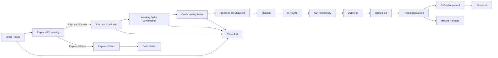

# Order Management and Tracking

## Introduction

### Purpose
This document defines the complete order management and tracking system for the e-commerce shopping mall platform. It specifies all business requirements for managing orders from placement through delivery, including order lifecycle management, tracking capabilities, cancellation workflows, refund processing, and multi-seller order coordination.

### Scope
This document covers:
- Order lifecycle states and transitions
- Real-time order tracking and status updates
- Shipping and delivery management
- Order history and retrieval
- Order cancellation workflows
- Refund request and approval processes
- Notification system for order events
- Seller-specific order management
- Multi-seller order coordination

### Integration Points
The order management system integrates with:
- **User Roles and Authentication**: Role-based access to order information and actions
- **Product Catalog**: Product and SKU information for order items
- **Shopping Cart**: Order creation from cart contents
- **Payment Processing**: Payment capture, holds, and refunds
- **Inventory Management**: Stock allocation and restoration
- **Notification System**: Email and status notifications

## Order Lifecycle States

### State Diagram

### State Definitions

#### Order Placed
- **Description**: Customer has submitted the order but payment processing has not yet completed
- **Duration**: Seconds to minutes
- **User Actions Available**: Cancel order
- **System Actions**: Initiate payment processing, reserve inventory
- **Next States**: Payment Processing

#### Payment Processing
- **Description**: Payment gateway is processing the transaction
- **Duration**: Seconds to minutes
- **User Actions Available**: None (system processing)
- **System Actions**: Communicate with payment gateway, verify payment
- **Next States**: Payment Confirmed, Payment Failed

#### Payment Confirmed
- **Description**: Payment has been successfully captured and funds are secured
- **Duration**: Minutes to hours
- **User Actions Available**: Cancel order (with refund)
- **System Actions**: Notify seller, allocate inventory, create seller order records
- **Next States**: Awaiting Seller Confirmation, Cancelled

#### Payment Failed
- **Description**: Payment processing failed due to insufficient funds, declined card, or technical error
- **Duration**: Terminal state
- **User Actions Available**: Retry payment, update payment method
- **System Actions**: Release reserved inventory, notify customer
- **Next States**: Order Failed (terminal)

#### Awaiting Seller Confirmation
- **Description**: Order is waiting for seller to acknowledge and confirm they can fulfill it
- **Duration**: Up to 24 hours
- **User Actions Available**: Cancel order (with refund)
- **Seller Actions Available**: Confirm order, reject order
- **System Actions**: Notify seller, start confirmation timer
- **Next States**: Confirmed by Seller, Cancelled

#### Confirmed by Seller
- **Description**: Seller has confirmed they will fulfill the order
- **Duration**: Hours to days
- **User Actions Available**: Cancel order (with refund, may require seller approval)
- **Seller Actions Available**: Begin preparation
- **System Actions**: Notify customer, update estimated delivery
- **Next States**: Preparing for Shipment, Cancelled

#### Preparing for Shipment
- **Description**: Seller is picking, packing, and preparing items for shipment
- **Duration**: 1-3 business days typically
- **User Actions Available**: Request cancellation (requires seller approval)
- **Seller Actions Available**: Mark as shipped, add tracking information
- **System Actions**: Monitor preparation timeline
- **Next States**: Shipped, Cancelled

#### Shipped
- **Description**: Package has been handed over to shipping carrier
- **Duration**: Minutes
- **User Actions Available**: Track shipment, contact seller
- **Seller Actions Available**: Update tracking information
- **System Actions**: Notify customer with tracking details
- **Next States**: In Transit

#### In Transit
- **Description**: Package is being transported by the carrier
- **Duration**: Days to weeks depending on shipping method
- **User Actions Available**: Track shipment, contact support
- **System Actions**: Update tracking status from carrier, notify of delays
- **Next States**: Out for Delivery, Delivered (for some carriers)

#### Out for Delivery
- **Description**: Package is on the delivery vehicle for final delivery
- **Duration**: Hours (same day)
- **User Actions Available**: Track delivery, update delivery instructions
- **System Actions**: Notify customer of imminent delivery
- **Next States**: Delivered

#### Delivered
- **Description**: Package has been delivered to the customer
- **Duration**: 1-7 days (confirmation period)
- **User Actions Available**: Confirm receipt, report issues, request refund
- **System Actions**: Request delivery confirmation, notify customer
- **Next States**: Completed, Refund Requested

#### Completed
- **Description**: Order is successfully completed and confirmed by customer or auto-confirmed after period
- **Duration**: Terminal state (permanent record)
- **User Actions Available**: Leave review, view receipt, request refund (within return window)
- **System Actions**: Release payment to seller, enable review submission
- **Next States**: Refund Requested (if within return window)

#### Cancelled
- **Description**: Order has been cancelled by customer, seller, or admin
- **Duration**: Terminal state
- **User Actions Available**: View cancellation reason, view refund status
- **System Actions**: Restore inventory, process refund if payment was captured
- **Next States**: None (terminal)

#### Refund Requested
- **Description**: Customer has requested a refund for a delivered order
- **Duration**: 1-7 business days for review
- **User Actions Available**: View refund status, provide additional information
- **Seller Actions Available**: Approve refund, reject refund, request return
- **Admin Actions Available**: Override decision, approve, reject
- **System Actions**: Notify seller, start review timer
- **Next States**: Refund Approved, Refund Rejected

#### Refund Approved
- **Description**: Refund request has been approved and is being processed
- **Duration**: 5-10 business days for refund processing
- **User Actions Available**: Track refund status
- **System Actions**: Process refund through payment gateway, notify customer
- **Next States**: Refunded

#### Refund Rejected
- **Description**: Refund request has been denied
- **Duration**: Terminal state
- **User Actions Available**: Appeal decision, contact support
- **System Actions**: Notify customer with rejection reason
- **Next States**: None (terminal, but can be reopened by admin)

#### Refunded
- **Description**: Refund has been successfully processed and funds returned to customer
- **Duration**: Terminal state
- **User Actions Available**: View refund details, view receipt
- **System Actions**: Update financial records, close order
- **Next States**: None (terminal)

#### Order Failed
- **Description**: Order failed due to payment issues or system errors
- **Duration**: Terminal state
- **User Actions Available**: Retry order, contact support
- **System Actions**: Release reserved inventory, log failure reason
- **Next States**: None (terminal)

### State Transition Rules

#### Business Rules for State Transitions

1. **Payment to Confirmation**: Orders can only move to "Payment Confirmed" when payment gateway confirms successful payment
2. **Cancellation Window**: Customers can freely cancel orders before "Preparing for Shipment" state
3. **Seller Confirmation Timeout**: If seller does not confirm within 24 hours, order is auto-cancelled with full refund
4. **Inventory Allocation**: Inventory is reserved at "Order Placed" and fully allocated at "Payment Confirmed"
5. **Inventory Restoration**: Inventory is restored immediately when order moves to "Cancelled" state
6. **Refund Timing**: Refunds can only be requested after "Delivered" state and within the return window (typically 7-30 days)
7. **Auto-Completion**: Orders auto-complete 7 days after "Delivered" if customer does not confirm or report issues
8. **Multi-Seller Orders**: Each seller's portion of the order has independent state tracking

## Order Tracking Requirements

### Real-Time Order Status

#### Customer Order Tracking
- Customers can view real-time status of all their orders
- Each order displays current state, estimated delivery date, and recent status updates
- Order detail page shows complete timeline of status changes with timestamps
- Visual progress indicator shows current position in order lifecycle
- Tracking numbers are prominently displayed when available

#### Status Update Frequency
- Order status updates should appear within 5 seconds of state change
- Shipping carrier tracking updates should sync every 2-4 hours
- Critical status changes (shipped, delivered) should update within 1 minute

#### Tracking Information Structure

Each order tracking record includes:
- **Order Number**: Unique identifier for the order
- **Current Status**: Current state in the order lifecycle
- **Order Date**: When the order was placed
- **Estimated Delivery Date**: Expected delivery date range
- **Items**: List of products with quantities and SKU details
- **Shipping Address**: Delivery destination
- **Seller Information**: Seller name and contact for each item
- **Tracking Number**: Shipping carrier tracking number (when available)
- **Status History**: Complete timeline of all status changes with timestamps and descriptions
- **Payment Status**: Payment confirmation and amount
- **Cancellation/Refund Status**: If applicable

#### Tracking History and Audit Trail

The system maintains a complete audit trail including:
- Every status change with exact timestamp
- User who initiated the change (customer, seller, admin, system)
- Reason for change (if applicable)
- Previous state and new state
- IP address and device information for security
- All customer, seller, and admin actions on the order
- Payment transaction records
- Refund transaction records
- Notification delivery records

### Order Notifications

#### Order Confirmation Notification
- **Trigger**: Order successfully placed and payment confirmed
- **Recipients**: Customer
- **Content**: Order number, items ordered, total amount, estimated delivery, seller information
- **Delivery Method**: Email
- **Timing**: Within 1 minute of order confirmation

#### Seller Confirmation Notification
- **Trigger**: New order assigned to seller
- **Recipients**: Seller
- **Content**: Order number, items to fulfill, customer shipping address, payment amount
- **Delivery Method**: Email
- **Timing**: Within 1 minute of payment confirmation

#### Shipment Notification
- **Trigger**: Order marked as shipped
- **Recipients**: Customer
- **Content**: Tracking number, carrier name, estimated delivery date, tracking link
- **Delivery Method**: Email
- **Timing**: Within 5 minutes of shipment

#### Delivery Notification
- **Trigger**: Order marked as delivered
- **Recipients**: Customer
- **Content**: Delivery confirmation, request to confirm receipt, review reminder
- **Delivery Method**: Email
- **Timing**: Within 1 hour of delivery

#### Cancellation Notification
- **Trigger**: Order cancelled
- **Recipients**: Customer and affected seller(s)
- **Content**: Cancellation reason, refund amount, refund timeline
- **Delivery Method**: Email
- **Timing**: Within 5 minutes of cancellation

#### Refund Notification
- **Trigger**: Refund approved or processed
- **Recipients**: Customer
- **Content**: Refund amount, processing timeline, expected refund date
- **Delivery Method**: Email
- **Timing**: Within 5 minutes of refund approval

#### Status Update Notification
- **Trigger**: Significant status changes (out for delivery, delayed)
- **Recipients**: Customer
- **Content**: New status, updated delivery estimate
- **Delivery Method**: Email
- **Timing**: Within 15 minutes of status change

## Shipping Status Updates

### Shipping Carrier Integration

#### Carrier Information Management
- Sellers can select from supported shipping carriers when marking orders as shipped
- Sellers must provide tracking number when marking order as shipped
- System validates tracking number format for selected carrier
- System stores carrier name, tracking number, and shipping date

#### Supported Carrier Information
The system should support common carriers including:
- National postal services
- International courier services (FedEx, UPS, DHL, etc.)
- Regional and local delivery services
- Custom/other carriers with manual tracking

#### Tracking Status Updates

The system retrieves and displays the following tracking information:
- **Package Location**: Current location of the package
- **Delivery Status**: In transit, out for delivery, delivered, exception
- **Delivery Exceptions**: Delays, failed delivery attempts, address issues
- **Delivery Attempts**: Number and timing of delivery attempts
- **Delivery Confirmation**: Signature or confirmation of delivery
- **Estimated Delivery Date**: Updated based on carrier information

#### Status Synchronization
- System polls carrier APIs every 2-4 hours for active shipments
- Critical status changes (delivered, exception) trigger immediate notification
- Tracking history is preserved even after delivery

### Estimated Delivery Time Management

#### Initial Delivery Estimate
- Estimated delivery date is calculated when order is confirmed
- Calculation considers: seller processing time, shipping method, destination distance, carrier estimates
- Delivery estimate is displayed as a date range (e.g., "January 15-18")

#### Delivery Estimate Updates
- Estimate is updated when order is shipped with carrier's estimated delivery date
- Estimate is updated if carrier reports delays or exceptions
- Updated estimates trigger customer notifications
- Historical estimate changes are preserved in audit trail

### Delivery Confirmation

#### Delivery Verification
- System marks order as "Delivered" based on carrier confirmation
- Delivery timestamp is recorded from carrier data
- Delivery signature or confirmation code is stored if provided by carrier
- Customer receives delivery notification within 1 hour

#### Customer Confirmation
- Customers are prompted to confirm receipt after delivery
- Customers can report delivery issues (not received, damaged, incorrect items)
- Order auto-completes 7 days after delivery if customer does not report issues
- Customer confirmation or auto-completion triggers payment release to seller

## Order History Access

### Customer Order History

#### Order List View
Customers can view a list of all their orders with:
- Order number
- Order date
- Total amount
- Current status
- Primary product image and item count
- Quick action buttons (view details, track, cancel, review)

#### Order History Filtering
Customers can filter orders by:
- **Status**: Active orders, completed orders, cancelled orders, refunded orders
- **Date Range**: Last 30 days, last 6 months, last year, custom range
- **Seller**: Orders from specific sellers
- **Price Range**: Orders within a certain price range

#### Order History Search
Customers can search orders by:
- Order number
- Product name
- Seller name
- Date

#### Order Detail View
Order detail page displays:
- Complete order information (items, quantities, prices, SKUs)
- Shipping address and contact information
- Payment information and transaction ID
- Current status with visual timeline
- Complete status history with timestamps
- Tracking information and carrier details
- Seller information for each item
- Available actions (cancel, request refund, contact seller, leave review)
- Invoice download option

### Seller Order History

#### Seller Order List View
Sellers can view orders for their products with:
- Order number
- Customer name (or identifier for privacy)
- Order date
- Items from their inventory
- Total amount for their items
- Current status
- Required action indicators

#### Seller Order Filtering
Sellers can filter orders by:
- **Status**: Pending confirmation, confirmed, preparing, shipped, delivered, completed, cancelled
- **Date Range**: Today, last 7 days, last 30 days, custom range
- **Fulfillment Status**: Needs confirmation, needs shipping, no action needed
- **Product**: Orders containing specific products
- **Payment Status**: Paid, pending payout, paid out

#### Seller Order Search
Sellers can search orders by:
- Order number
- Customer name
- Product name
- Tracking number

#### Seller Order Detail View
Seller order detail page displays:
- Customer shipping address
- Items to fulfill with SKU details
- Payment amount allocated to seller
- Current order status
- Required seller actions (confirm, ship, respond to cancellation)
- Shipping information entry form
- Order timeline specific to seller's items
- Customer contact information (limited for privacy)

### Admin Order History

#### Admin Order List View
Admins can view all platform orders with:
- Order number
- Customer and seller information
- Order date and status
- Total order value
- Platform commission
- Issue flags (disputed, delayed, refund requested)

#### Admin Order Filtering
Admins can filter orders by:
- **Status**: Any order state
- **Seller**: Orders from specific sellers
- **Customer**: Orders from specific customers
- **Date Range**: Any custom date range
- **Issue Type**: Refund requests, cancellations, disputes, delayed orders
- **Payment Status**: Successful, failed, refunded, pending
- **Value Range**: Orders above/below certain amounts

#### Admin Order Search
Admins can search orders by:
- Order number
- Customer name or ID
- Seller name or ID
- Product name
- Transaction ID
- Tracking number

#### Admin Order Detail View
Admin order detail page displays:
- Complete order information across all sellers
- Full customer and seller contact information
- Payment transaction details and gateway information
- Complete audit trail of all actions
- Admin action buttons (cancel order, approve refund, override decision, contact parties)
- Financial breakdown including platform fees
- Risk and fraud indicators
- Customer and seller historical behavior data

### Order Information Display

#### Essential Order Information
Every order view includes:
- **Order Number**: Unique identifier
- **Order Date and Time**: When order was placed
- **Items**: Product names, SKUs, quantities, individual prices
- **Subtotal**: Sum of item prices
- **Shipping Fee**: Delivery charge
- **Tax**: Applicable taxes
- **Discount**: Any coupon or promotion applied
- **Total Amount**: Final amount charged
- **Payment Method**: Card type, last 4 digits, or payment method used
- **Shipping Address**: Full delivery address
- **Current Status**: Current state in lifecycle

#### Performance Requirements for Order History
- Order list should load within 2 seconds for 50 orders
- Filtering and search should return results within 1 second
- Order detail page should load within 1 second
- Pagination should be smooth with no visible lag

## Order Cancellation Process

### Cancellation Eligibility Rules

#### Customer Cancellation Rights

**Free Cancellation (No Approval Required)**:
- WHEN the order is in "Order Placed", "Payment Processing", or "Payment Confirmed" state, THE customer SHALL be able to cancel the order immediately without seller approval
- WHEN the order is in "Awaiting Seller Confirmation" state, THE customer SHALL be able to cancel the order immediately without seller approval

**Cancellation Requiring Approval**:
- WHEN the order is in "Confirmed by Seller" or "Preparing for Shipment" state, THE customer SHALL be able to request cancellation which requires seller approval
- THE seller SHALL respond to cancellation requests within 24 hours
- IF the seller does not respond within 24 hours, THEN THE cancellation SHALL be automatically approved

**Cancellation Not Allowed**:
- WHEN the order is in "Shipped", "In Transit", "Out for Delivery", or "Delivered" state, THE customer SHALL NOT be able to cancel the order
- Customers must use the refund request process for delivered orders

#### Seller Cancellation Rights
- Sellers can cancel orders in "Awaiting Seller Confirmation" state if they cannot fulfill the order
- Sellers can request admin approval to cancel orders in later states for exceptional circumstances (inventory error, defective product)
- THE seller SHALL provide a clear reason for cancellation
- WHEN seller cancels an order, THE customer SHALL receive immediate full refund

#### Admin Cancellation Rights
- Admins can cancel orders in any state
- Admin cancellations are used for fraud prevention, policy violations, or dispute resolution
- THE admin SHALL provide a reason for cancellation visible to both customer and seller

### Customer-Initiated Cancellation Workflow

#### Free Cancellation Flow
1. Customer clicks "Cancel Order" button on order detail page
2. Customer selects cancellation reason from predefined list or provides custom reason
3. Customer confirms cancellation action
4. THE system SHALL immediately change order status to "Cancelled"
5. THE system SHALL restore inventory for all order items to available stock
6. IF payment was captured, THE system SHALL initiate refund process immediately
7. THE system SHALL send cancellation confirmation to customer
8. THE system SHALL notify affected sellers of the cancellation

#### Approval-Required Cancellation Flow
1. Customer clicks "Request Cancellation" button on order detail page
2. Customer provides cancellation reason (required)
3. THE system SHALL create a cancellation request with "Pending Seller Approval" status
4. THE system SHALL notify the seller immediately of the cancellation request
5. THE system SHALL display "Cancellation Requested" status to customer
6. Seller reviews cancellation request in their order management dashboard
7. Seller can approve or reject the cancellation request with optional message
8. IF seller approves, THE system SHALL proceed with cancellation and refund
9. IF seller rejects, THE customer SHALL be notified with seller's reason
10. IF seller does not respond within 24 hours, THE system SHALL automatically approve the cancellation

#### Cancellation Reason Categories
Customers must select from:
- Found better price elsewhere
- No longer need the item
- Ordered by mistake
- Want to change shipping address
- Want to change product variant (size, color)
- Delivery time too long
- Other (requires text explanation)

### Seller Cancellation Workflow

#### Seller-Initiated Cancellation Before Confirmation
1. Seller accesses order in "Awaiting Seller Confirmation" state
2. Seller clicks "Cannot Fulfill Order" button
3. Seller selects cancellation reason from predefined list
4. Seller submits cancellation
5. THE system SHALL immediately cancel the order and initiate full refund
6. THE system SHALL notify customer of cancellation with seller's reason
7. THE system SHALL restore inventory

#### Seller Cancellation Reasons
Sellers must select from:
- Out of stock (inventory error)
- Product discontinued
- Shipping address not serviceable
- Product damaged/defective
- Pricing error
- Other (requires text explanation)

#### Seller-Initiated Cancellation After Confirmation
1. Seller submits cancellation request to admin with detailed reason
2. Admin reviews request and order details
3. Admin approves or rejects seller's cancellation request
4. IF approved, order is cancelled with full refund to customer
5. IF rejected, seller must fulfill the order or face penalty

### Admin Cancellation Workflow

1. Admin accesses order detail page
2. Admin clicks "Cancel Order" button
3. Admin selects cancellation category: Fraud, Policy Violation, Dispute Resolution, Seller Request, System Error
4. Admin provides detailed cancellation reason
5. Admin confirms cancellation
6. THE system SHALL immediately cancel the order
7. THE system SHALL initiate appropriate refund (full or partial based on admin decision)
8. THE system SHALL restore inventory
9. THE system SHALL notify both customer and seller with cancellation details
10. THE system SHALL log admin action in audit trail

### Cancellation Processing

#### Inventory Restoration
- WHEN an order is cancelled, THE system SHALL immediately restore inventory quantities for all SKUs in the order
- THE inventory SHALL be returned to the seller's available stock
- THE inventory restoration SHALL occur within 5 seconds of cancellation confirmation
- THE system SHALL log inventory restoration in audit trail

#### Payment Refund Handling
- IF payment was not yet captured, THE system SHALL void the payment authorization
- IF payment was captured, THE system SHALL initiate refund through the payment gateway
- THE refund SHALL be processed to the original payment method
- THE customer SHALL receive refund confirmation with expected timeline (5-10 business days)
- THE refund status SHALL be trackable by customer

#### Cancellation Timeline
- Free cancellations process immediately (within 5 seconds)
- Approval-required cancellations process within 5 seconds of approval
- Refunds are initiated immediately but take 5-10 business days to appear in customer account
- Customers are notified at each step: request received, approved/rejected, refund initiated, refund completed

### Multi-Seller Order Cancellation

#### Partial Order Cancellation
- IF an order contains items from multiple sellers, THE customer SHALL be able to cancel items from specific sellers
- Each seller's portion can be cancelled independently based on that seller's fulfillment state
- Cancelling all items from an order results in full order cancellation
- Partial cancellations result in updated order total and partial refund

#### Cancellation Coordination
- THE system SHALL handle cancellation requests per seller
- Each seller receives notification only for their items being cancelled
- Order status reflects combined state (e.g., "Partially Cancelled" if only some sellers' items cancelled)
- Refund is calculated and processed for cancelled items only

## Refund Request Process

### Refund Eligibility Criteria

#### Time-Based Eligibility
- Customers can request refunds within the return window after delivery
- Standard return window is 30 days from delivery date
- Specific product categories may have different return windows (configurable per category)
- THE system SHALL clearly display the return deadline on order detail pages

#### Order State Eligibility
- Refunds can only be requested for orders in "Delivered" or "Completed" state
- WHEN an order is in "Delivered" state and within the return window, THE customer SHALL be able to request a refund
- WHEN an order is in "Completed" state and within the return window, THE customer SHALL be able to request a refund
- Orders outside the return window cannot request refunds through normal process (must contact support)

#### Product Condition Requirements
Customers must certify that:
- Product is unused and in original condition (for non-defective returns)
- Product is in original packaging with tags attached
- All accessories and components are included
- Product has not been damaged by customer

**Exceptions** (products eligible for refund even if used):
- Product is defective or damaged on arrival
- Product does not match description
- Wrong product was delivered

### Customer Refund Request Workflow

#### Initiating a Refund Request
1. Customer navigates to order detail page for delivered order
2. Customer clicks "Request Refund" button
3. THE system SHALL verify the order is within the return window
4. IF outside return window, THE system SHALL display message directing customer to support
5. IF within return window, THE system SHALL display refund request form

#### Refund Request Form
Customer must provide:
- **Refund Reason** (select from predefined list): Defective/damaged, wrong item received, does not match description, changed mind, found better price, quality not as expected, other
- **Detailed Explanation**: Text description of the issue (required)
- **Photos**: Upload photos showing defect or issue (required for defective/damaged claims)
- **Refund Type Preference**: Full refund, exchange for same product, exchange for different product
- **Return Shipping**: Whether customer will return the product

#### Refund Request Submission
1. Customer completes refund request form
2. Customer confirms submission
3. THE system SHALL create a refund request with "Pending Review" status
4. THE system SHALL change order status to "Refund Requested"
5. THE system SHALL notify the seller immediately
6. THE system SHALL display refund request status to customer
7. Customer can view refund request status and track progress

### Seller Refund Response Workflow

#### Seller Review Process
1. Seller receives notification of refund request
2. Seller accesses refund request in their order management dashboard
3. Seller reviews: refund reason, customer explanation, uploaded photos, order details
4. THE seller SHALL respond to refund requests within 3 business days
5. Seller can take one of the following actions:
   - **Approve Full Refund**: Accept refund and request product return
   - **Approve Partial Refund**: Offer partial refund with explanation
   - **Approve Exchange**: Agree to exchange product
   - **Reject Refund**: Deny refund with detailed reason

#### Seller Response Options

**Approve Full Refund**:
- Seller agrees to full refund
- Seller indicates if product return is required
- IF return required, seller provides return shipping instructions
- Refund is processed after customer ships return (with tracking) or immediately if no return needed

**Approve Partial Refund**:
- Seller offers partial refund amount with justification
- Customer can accept or reject partial refund offer
- IF customer accepts, partial refund is processed
- IF customer rejects, request escalates to admin review

**Approve Exchange**:
- Seller offers to send replacement product
- Customer can accept exchange or request refund instead
- IF customer accepts, seller ships replacement
- IF customer rejects, request escalates to admin review

**Reject Refund**:
- Seller provides detailed reason for rejection
- Request automatically escalates to admin review
- Customer is notified of rejection and admin review

#### Seller Response Timeout
- IF seller does not respond within 3 business days, THE refund request SHALL automatically be approved with full refund
- THE system SHALL notify seller of auto-approval
- THE system SHALL proceed with refund processing

### Admin Refund Approval Workflow

#### Admin Review Triggers
Admin review is required when:
- Seller rejects refund request
- Customer rejects seller's partial refund or exchange offer
- Refund amount exceeds platform threshold (e.g., over $500)
- Customer or seller disputes the other party's decision
- Seller does not respond within timeout period and refund is auto-approved for high-value orders

#### Admin Review Process
1. Admin accesses refund request in admin dashboard
2. Admin reviews complete information: order details, refund request, seller response, customer/seller communication, photos, order history
3. Admin can request additional information from customer or seller
4. Admin makes final decision:
   - **Approve Full Refund**: Override seller rejection or confirm seller approval
   - **Approve Partial Refund**: Determine fair partial refund amount
   - **Approve Exchange**: Mandate exchange if appropriate
   - **Reject Refund**: Final rejection with detailed reason
5. Admin decision is final and binding
6. THE system SHALL process refund according to admin decision

#### Admin Decision Factors
Admins consider:
- Evidence provided (photos, descriptions)
- Product category and condition requirements
- Customer and seller history and reputation
- Platform policies
- Previous similar cases
- Fraud indicators

### Refund Processing

#### Full Refund Processing
1. Refund request is approved (by seller or admin)
2. IF product return is required:
   - Customer ships product back to seller with tracking
   - Customer provides tracking number in system
   - Seller confirms receipt of returned product
   - THE system SHALL initiate refund within 24 hours of seller confirmation
3. IF no return required (damaged product, small value items):
   - THE system SHALL initiate refund immediately upon approval
4. THE system SHALL process refund through payment gateway to original payment method
5. THE customer SHALL receive refund confirmation with expected timeline
6. THE order status SHALL change to "Refund Approved" then "Refunded" when complete

#### Partial Refund Processing
1. Partial refund is approved (by seller or admin)
2. THE system SHALL calculate partial refund amount
3. THE system SHALL process partial refund through payment gateway
4. Customer keeps the product (no return required for partial refunds typically)
5. THE order status SHALL change to "Partially Refunded"
6. THE customer SHALL receive confirmation of partial refund amount and reason

#### Exchange Processing
1. Exchange is approved
2. Seller ships replacement product
3. Customer may need to return original product (depending on reason)
4. THE system SHALL create tracking record for replacement shipment
5. THE order status SHALL show "Exchange in Progress"
6. WHEN replacement is delivered, THE order status SHALL change to "Exchange Completed"
7. No refund is processed for exchanges

#### Refund Timeline
- Refund approval decision: 1-3 business days for seller, up to 5 business days with admin review
- Product return shipping: 5-10 business days typically
- Refund initiation: Within 24 hours of approval or return confirmation
- Refund processing by payment gateway: 5-10 business days
- Total refund timeline: 7-25 business days from request to funds in customer account

### Refund Status Tracking

#### Customer Refund Status View
Customers can track refund status through:
- Order detail page showing current refund status
- Dedicated "Refund Requests" section in account
- Status timeline showing: Request submitted → Under review → Approved/Rejected → Return shipped (if applicable) → Refund processing → Refunded

#### Refund Status States
- **Refund Requested**: Customer submitted refund request
- **Pending Seller Review**: Waiting for seller response
- **Seller Approved - Awaiting Return**: Customer needs to ship product back
- **Return in Transit**: Customer shipped return, tracking updated
- **Return Received**: Seller confirmed return receipt
- **Refund Processing**: Payment gateway processing refund
- **Refunded**: Refund completed, funds returned
- **Partially Refunded**: Partial refund completed
- **Refund Rejected**: Request denied with reason
- **Under Admin Review**: Escalated to admin
- **Exchange Approved**: Exchange in progress

### Refund Notifications

#### Customer Notifications
- **Request Received**: Confirmation that refund request was submitted
- **Seller Response**: Notification when seller approves, rejects, or offers alternative
- **Admin Review**: Notification when request escalates to admin
- **Final Decision**: Approval or rejection notification with next steps
- **Return Instructions**: If return is required, shipping instructions
- **Refund Processing**: When refund is initiated
- **Refund Completed**: When funds are returned to customer account

#### Seller Notifications
- **New Refund Request**: Immediate notification of new refund request
- **Customer Return Shipped**: When customer ships product back
- **Admin Review**: When request is escalated to admin
- **Admin Decision**: Final admin decision on disputed refund

## Seller Order Management

### Seller Order Dashboard

#### Dashboard Overview
Sellers have a dedicated order management dashboard displaying:
- **Orders Requiring Action**: Count and list of orders needing seller confirmation, shipping, or other action
- **Today's Orders**: Orders received today
- **Recent Orders**: Last 20 orders across all states
- **Order Statistics**: Total orders, pending fulfillment, shipped today, completed this month
- **Revenue Summary**: Today's revenue, this month's revenue, pending payouts
- **Performance Metrics**: Average fulfillment time, on-time shipping rate, cancellation rate

#### Action Required Indicators
Dashboard prominently highlights orders requiring seller action:
- **Needs Confirmation**: Orders in "Awaiting Seller Confirmation" with countdown timer
- **Needs Shipping**: Orders in "Preparing for Shipment" state
- **Cancellation Requests**: Pending customer cancellation requests
- **Refund Requests**: New refund requests needing response
- **Customer Messages**: Unread customer inquiries about orders

### Order Fulfillment Workflow

#### Order Confirmation Step
1. New order appears in "Orders Requiring Action" section
2. Seller reviews order details: products, quantities, SKUs, shipping address
3. THE seller SHALL verify inventory availability
4. THE seller SHALL confirm ability to fulfill within expected timeline
5. Seller clicks "Confirm Order" button
6. THE system SHALL change order status to "Confirmed by Seller"
7. THE system SHALL notify customer of confirmation
8. IF seller cannot fulfill, seller clicks "Cannot Fulfill" and selects reason

#### Preparing for Shipment
1. After confirmation, order appears in "Preparing for Shipment" list
2. Seller picks and packs products
3. Seller prepares shipping label
4. Seller updates order status through dashboard

#### Marking Order as Shipped
1. Seller clicks "Mark as Shipped" for order in "Preparing for Shipment"
2. THE system SHALL display shipping information form requiring:
   - **Carrier Name**: Select from supported carriers or "Other"
   - **Tracking Number**: Carrier tracking number (validated for format)
   - **Shipping Date**: Date package was shipped (defaults to today)
   - **Estimated Delivery**: Optional estimated delivery date
   - **Shipping Notes**: Optional notes for customer
3. Seller submits shipping information
4. THE system SHALL validate tracking number format
5. THE system SHALL change order status to "Shipped"
6. THE system SHALL send shipment notification to customer with tracking details
7. THE system SHALL begin tracking shipment status updates

#### Bulk Actions
Sellers can perform bulk actions on multiple orders:
- Confirm multiple orders at once
- Print shipping labels for multiple orders
- Mark multiple orders as shipped (with CSV upload for tracking numbers)
- Export order data to CSV

### Shipping Information Management

#### Shipping Methods
Sellers can configure preferred shipping methods for their products:
- Standard shipping (5-7 business days)
- Express shipping (2-3 business days)
- Overnight shipping (1 business day)
- International shipping

#### Shipping Templates
Sellers can create shipping templates including:
- Default carrier preferences
- Packaging types
- Insurance options
- Signature requirements
- Return address information

#### Tracking Number Validation
- THE system SHALL validate tracking number format for selected carrier
- IF tracking number format is invalid, THE system SHALL display error and prevent submission
- THE system SHALL verify tracking number becomes active with carrier within 24 hours
- IF tracking number does not activate, THE system SHALL notify seller

### Seller Order Filtering and Search

#### Quick Filters
Sellers can quickly filter orders by:
- **Needs Action**: Orders requiring seller action
- **Today**: Orders received today
- **This Week**: Orders from the current week
- **Pending**: Orders not yet shipped
- **Shipped**: Orders shipped but not delivered
- **Completed**: Successfully delivered and completed orders
- **Cancelled**: Cancelled orders
- **Refund Requests**: Orders with active refund requests

#### Advanced Filters
Sellers can apply multiple filters:
- Status (any combination of order states)
- Date range (custom start and end dates)
- Product (orders containing specific products)
- Customer (orders from specific customers, if repeat customers)
- Price range (orders above/below certain amounts)
- Shipping method
- Fulfillment status (on-time, delayed, at-risk)

#### Search Functionality
Sellers can search orders by:
- Order number
- Customer name
- Product name or SKU
- Tracking number

### Performance Metrics for Sellers

#### Key Performance Indicators
THE system SHALL display seller performance metrics:
- **On-Time Confirmation Rate**: Percentage of orders confirmed within 12 hours
- **On-Time Shipping Rate**: Percentage of orders shipped within promised timeline
- **Average Fulfillment Time**: Average time from order confirmation to shipment
- **Cancellation Rate**: Percentage of orders cancelled by seller
- **Refund Rate**: Percentage of orders resulting in refunds
- **Customer Satisfaction**: Based on reviews and ratings (if available)

#### Performance Tracking
- Metrics are calculated monthly and historically tracked
- Sellers can view performance trends over time
- THE system SHALL notify sellers when performance metrics fall below platform standards
- Poor performance may result in seller account review or restrictions

#### Fulfillment Timeline Tracking
For each order, the system tracks:
- Time from order placement to seller confirmation
- Time from confirmation to shipment
- Time from shipment to delivery
- Whether seller met expected timelines
- Color-coded indicators (green: on-time, yellow: at-risk, red: overdue)

## Functional Requirements (EARS Format)

### Order Lifecycle Management

**OL-001**: WHEN a customer successfully completes payment, THE system SHALL create an order record with "Payment Confirmed" status and allocate inventory for all order items.

**OL-002**: WHEN an order is created, THE system SHALL send order confirmation email to the customer within 1 minute.

**OL-003**: WHEN an order is created, THE system SHALL notify all sellers involved in the order within 1 minute.

**OL-004**: WHEN a seller does not confirm an order within 24 hours, THE system SHALL automatically cancel the order and initiate full refund.

**OL-005**: WHEN a seller confirms an order, THE system SHALL change order status to "Confirmed by Seller" and notify the customer.

**OL-006**: WHEN a seller marks an order as shipped, THE system SHALL validate the tracking number format and change order status to "Shipped".

**OL-007**: WHEN an order is marked as shipped, THE system SHALL send shipment notification to customer with tracking information within 5 minutes.

**OL-008**: WHEN shipping carrier confirms delivery, THE system SHALL update order status to "Delivered" and notify customer within 1 hour.

**OL-009**: WHEN an order has been in "Delivered" status for 7 days without customer action, THE system SHALL automatically change status to "Completed".

**OL-010**: WHEN an order is completed, THE system SHALL enable customer to submit product reviews.

### Order Tracking

**OT-001**: THE system SHALL display current order status to customers in real-time with updates appearing within 5 seconds of status change.

**OT-002**: THE system SHALL maintain complete audit trail of all order status changes with timestamps and initiating user.

**OT-003**: WHEN an order has a tracking number, THE system SHALL retrieve shipping status updates from carrier API every 2-4 hours.

**OT-004**: THE system SHALL display order tracking timeline showing all status changes in chronological order.

**OT-005**: WHEN a critical status change occurs (shipped, delivered, exception), THE system SHALL update order status within 1 minute.

**OT-006**: THE system SHALL calculate and display estimated delivery date based on seller processing time and shipping method.

**OT-007**: WHEN carrier updates estimated delivery date, THE system SHALL update the displayed estimate and notify customer if date changed significantly.

### Order History

**OH-001**: THE system SHALL allow customers to view all their orders sorted by date with most recent first.

**OH-002**: THE system SHALL allow customers to filter orders by status, date range, seller, and price range.

**OH-003**: THE system SHALL allow customers to search orders by order number, product name, or seller name.

**OH-004**: THE system SHALL load order history list within 2 seconds for up to 50 orders.

**OH-005**: THE system SHALL allow sellers to view all orders for their products with filtering by status and date.

**OH-006**: THE system SHALL allow admins to view all platform orders with advanced filtering and search capabilities.

**OH-007**: THE system SHALL display order detail page with complete order information loading within 1 second.

### Order Cancellation

**OC-001**: WHEN an order is in "Order Placed", "Payment Processing", "Payment Confirmed", or "Awaiting Seller Confirmation" state, THE customer SHALL be able to cancel immediately without approval.

**OC-002**: WHEN an order is in "Confirmed by Seller" or "Preparing for Shipment" state, THE customer SHALL be able to request cancellation requiring seller approval.

**OC-003**: WHEN a customer submits cancellation request, THE seller SHALL be notified immediately.

**OC-004**: WHEN a seller does not respond to cancellation request within 24 hours, THE system SHALL automatically approve the cancellation.

**OC-005**: WHEN an order is cancelled, THE system SHALL restore inventory for all order items within 5 seconds.

**OC-006**: WHEN an order is cancelled after payment capture, THE system SHALL initiate refund to original payment method immediately.

**OC-007**: WHEN an order is cancelled, THE system SHALL send cancellation confirmation to customer and notification to seller within 5 minutes.

**OC-008**: THE system SHALL allow sellers to cancel orders in "Awaiting Seller Confirmation" state with immediate full refund.

**OC-009**: THE system SHALL allow admins to cancel orders in any state with mandatory reason documentation.

**OC-010**: WHEN a multi-seller order is partially cancelled, THE system SHALL calculate and process partial refund for cancelled items only.

### Refund Processing

**RF-001**: WHEN an order is in "Delivered" or "Completed" state and within return window, THE customer SHALL be able to submit refund request.

**RF-002**: THE system SHALL verify order is within return window (default 30 days) before allowing refund request submission.

**RF-003**: WHEN a customer submits refund request, THE system SHALL notify the seller immediately.

**RF-004**: THE seller SHALL respond to refund requests within 3 business days.

**RF-005**: WHEN a seller does not respond to refund request within 3 business days, THE system SHALL automatically approve full refund.

**RF-006**: WHEN a seller rejects a refund request, THE system SHALL escalate to admin review automatically.

**RF-007**: WHEN admin approves refund, THE system SHALL initiate refund processing within 24 hours.

**RF-008**: THE system SHALL allow partial refunds with specified amount and justification.

**RF-009**: WHEN a refund requires product return, THE customer SHALL provide return tracking number before refund is processed.

**RF-010**: WHEN a seller confirms receipt of returned product, THE system SHALL process refund within 24 hours.

**RF-011**: THE system SHALL process all refunds to the original payment method used for purchase.

**RF-012**: THE system SHALL send refund status notifications to customer at each stage: requested, approved, processing, completed.

### Seller Order Management

**SM-001**: THE system SHALL display orders requiring seller action prominently in seller dashboard with count badge.

**SM-002**: THE seller SHALL be able to confirm orders within 24 hours of order placement.

**SM-003**: WHEN marking order as shipped, THE seller SHALL provide carrier name and tracking number.

**SM-004**: THE system SHALL validate tracking number format for selected carrier before accepting shipment.

**SM-005**: THE system SHALL allow sellers to filter and search orders by status, date, product, and customer.

**SM-006**: THE system SHALL display seller performance metrics including on-time rate, cancellation rate, and fulfillment time.

**SM-007**: THE seller SHALL be able to perform bulk actions on multiple orders including confirmation and shipping.

**SM-008**: THE system SHALL allow sellers to configure shipping templates with carrier preferences and return address.

### Notifications

**NT-001**: THE system SHALL send order confirmation email to customer within 1 minute of successful payment.

**NT-002**: THE system SHALL send shipment notification to customer within 5 minutes of order marked as shipped.

**NT-003**: THE system SHALL send delivery notification to customer within 1 hour of carrier confirming delivery.

**NT-004**: THE system SHALL send cancellation notification to customer and seller within 5 minutes of order cancellation.

**NT-005**: THE system SHALL send refund approval and completion notifications to customer.

**NT-006**: THE system SHALL send new order notification to seller within 1 minute of order creation.

**NT-007**: THE system SHALL send critical status update notifications (out for delivery, delayed) within 15 minutes.

**NT-008**: ALL notifications SHALL include order number, relevant details, and direct link to order detail page.

## Business Rules

### Order Processing Rules

**BR-001**: Orders cannot be modified after payment confirmation - customers must cancel and reorder.

**BR-002**: Inventory is reserved at order placement and fully allocated at payment confirmation.

**BR-003**: Multi-seller orders are split into separate fulfillment records per seller, each with independent status tracking.

**BR-004**: Order status can only transition forward in the lifecycle, never backward (except to cancelled state).

**BR-005**: Payment must be confirmed before sellers are notified of new orders.

**BR-006**: Sellers must confirm orders within 24 hours or order is auto-cancelled.

**BR-007**: Orders auto-complete 7 days after delivery if customer takes no action.

**BR-008**: Completed orders cannot be cancelled, only refunded.

**BR-009**: Order numbers are unique across the entire platform and never reused.

**BR-010**: All order state changes must be logged in audit trail with timestamp and initiating user.

### Cancellation Rules

**BR-011**: Customers can freely cancel orders before "Preparing for Shipment" state.

**BR-012**: Cancellations after seller confirmation require seller approval or auto-approve after 24 hours.

**BR-013**: Orders cannot be cancelled once shipped - customers must use refund process.

**BR-014**: Cancelled orders must have inventory restored immediately.

**BR-015**: Cancellation refunds must be processed to original payment method.

**BR-016**: Seller-initiated cancellations before confirmation result in zero penalty.

**BR-017**: Seller-initiated cancellations after confirmation may result in seller performance penalty.

**BR-018**: Partial cancellations in multi-seller orders result in partial refunds and updated order totals.

### Refund Eligibility Rules

**BR-019**: Refunds can only be requested for delivered orders within the return window (default 30 days).

**BR-020**: Specific product categories may have different return windows (e.g., electronics 15 days, clothing 30 days).

**BR-021**: Defective or incorrect products are eligible for refund regardless of condition.

**BR-022**: Non-defective returns require product to be unused and in original packaging.

**BR-023**: Digital products and personalized items are non-refundable unless defective.

**BR-024**: Sellers must respond to refund requests within 3 business days or refund is auto-approved.

**BR-025**: Refund requests rejected by sellers automatically escalate to admin review.

**BR-026**: Customers can reject partial refund offers from sellers, escalating to admin review.

**BR-027**: Admin refund decisions are final and binding.

**BR-028**: Refunds for orders over platform threshold (e.g., $500) require admin approval.

### Inventory Management Rules

**BR-029**: Inventory is allocated per SKU, not per product.

**BR-030**: Inventory allocation occurs at payment confirmation.

**BR-031**: Inventory is restored immediately upon order cancellation.

**BR-032**: Inventory restoration must complete before cancellation confirmation is sent.

**BR-033**: If inventory cannot be restored (e.g., SKU deleted), log error and notify admin.

**BR-034**: Overselling protection: orders cannot be placed if inventory is insufficient.

### Shipping and Delivery Rules

**BR-035**: Sellers must provide valid tracking numbers when marking orders as shipped.

**BR-036**: Tracking numbers must be validated for format before acceptance.

**BR-037**: The system must verify tracking numbers become active within 24 hours.

**BR-038**: Orders marked as shipped without valid tracking after 24 hours generate seller warning.

**BR-039**: Estimated delivery dates must be updated when carrier provides revised estimates.

**BR-040**: Delivery confirmation from carrier automatically marks order as delivered.

**BR-041**: Customers can manually confirm delivery if carrier status is not updated.

### Payment and Refund Rules

**BR-042**: All payments must be processed through approved payment gateways.

**BR-043**: Payment authorization is held until seller confirms order.

**BR-044**: Payment is captured at seller confirmation.

**BR-045**: Payment is released to seller 7 days after delivery or customer confirmation, whichever comes first.

**BR-046**: Refunds must be processed to the same payment method used for purchase.

**BR-047**: Partial refunds are allowed with justification.

**BR-048**: Platform fees are refunded to customer but deducted from seller refund amount.

**BR-049**: Refund processing must begin within 24 hours of approval.

**BR-050**: Customer must be notified of expected refund timeline (5-10 business days).

### Performance and Quality Rules

**BR-051**: Order status updates must be visible to customers within 5 seconds.

**BR-052**: Notifications must be sent within specified time limits (1 minute for critical, 5-15 minutes for others).

**BR-053**: Seller confirmation rate below 95% triggers account review.

**BR-054**: Seller on-time shipping rate below 90% triggers account review.

**BR-055**: Seller cancellation rate above 5% triggers account review.

**BR-056**: Refund rate above 10% triggers seller account review.

## Error Handling Scenarios

### Order State Transition Errors

**ERR-001: Payment Processing Failure**
- **Scenario**: Payment gateway returns error during payment processing
- **User Impact**: Customer cannot complete order
- **System Response**: 
  - Display user-friendly error message: "Payment could not be processed. Please check your payment information and try again."
  - Release reserved inventory immediately
  - Log error details for admin review
  - Offer alternative payment methods
- **Recovery**: Customer can retry with corrected payment information

**ERR-002: Inventory Allocation Failure**
- **Scenario**: Inventory becomes unavailable between cart and payment confirmation
- **User Impact**: Order cannot be completed despite successful payment
- **System Response**:
  - Immediately void or refund the payment
  - Display error: "One or more items are no longer available. Your payment has been refunded."
  - Show which items are out of stock
  - Offer to complete order with available items only
- **Recovery**: Customer can modify order and retry

**ERR-003: Seller Confirmation Timeout**
- **Scenario**: Seller does not confirm order within 24 hours
- **User Impact**: Order is automatically cancelled
- **System Response**:
  - Auto-cancel order with status "Cancelled - Seller Timeout"
  - Process full refund automatically
  - Send notification to customer: "Your order has been cancelled because the seller could not confirm availability. You will receive a full refund within 5-10 business days."
  - Notify seller of cancellation and performance impact
- **Recovery**: Customer can reorder if desired

**ERR-004: Invalid State Transition Attempt**
- **Scenario**: System or user attempts invalid state transition (e.g., "Delivered" to "Shipped")
- **User Impact**: Action is blocked
- **System Response**:
  - Reject the state change
  - Display error: "This action is not available for the current order status."
  - Log attempted invalid transition for security review
- **Recovery**: No action needed, order remains in valid state

### Cancellation Request Errors

**ERR-005: Cancellation After Shipment**
- **Scenario**: Customer attempts to cancel order that has already been shipped
- **User Impact**: Cancellation is not allowed
- **System Response**:
  - Block cancellation action
  - Display message: "This order has already been shipped and cannot be cancelled. You can request a refund after delivery."
  - Show tracking information and estimated delivery
  - Provide link to refund request process
- **Recovery**: Customer must wait for delivery and use refund process

**ERR-006: Seller Cancellation After Preparation**
- **Scenario**: Seller attempts to cancel order after starting preparation
- **User Impact**: Seller must seek admin approval
- **System Response**:
  - Block direct cancellation
  - Display message: "Orders in preparation cannot be cancelled directly. Please contact support to request cancellation."
  - Provide admin contact option
- **Recovery**: Seller must contact admin with valid reason

**ERR-007: Inventory Restoration Failure**
- **Scenario**: System cannot restore inventory during cancellation (e.g., SKU deleted)
- **User Impact**: Cancellation may be delayed
- **System Response**:
  - Complete cancellation and refund process
  - Log inventory restoration error
  - Send alert to admin for manual inventory review
  - Display to customer: "Your order has been cancelled and refund is being processed."
- **Recovery**: Admin manually reviews and corrects inventory records

### Refund Processing Errors

**ERR-008: Refund Request Outside Return Window**
- **Scenario**: Customer attempts refund request after return window expired
- **User Impact**: Normal refund process is not available
- **System Response**:
  - Block refund request form
  - Display message: "The return window for this order has expired. Please contact customer support if you have exceptional circumstances."
  - Provide customer support contact link
- **Recovery**: Customer can contact support for exceptional cases

**ERR-009: Payment Gateway Refund Failure**
- **Scenario**: Payment gateway returns error when processing refund
- **User Impact**: Refund is delayed
- **System Response**:
  - Retry refund automatically up to 3 times
  - If still failing, mark refund as "Processing - Delayed"
  - Send notification to customer: "Your refund is being processed but experiencing delays. Our team is working to resolve this."
  - Escalate to admin for manual processing
  - Log all retry attempts and errors
- **Recovery**: Admin manually processes refund or contacts payment gateway support

**ERR-010: Seller Refund Response Timeout**
- **Scenario**: Seller does not respond to refund request within 3 business days
- **User Impact**: Initial delay in refund processing
- **System Response**:
  - Automatically approve full refund
  - Send notification to customer: "Your refund has been automatically approved and is being processed."
  - Notify seller of auto-approval and performance impact
  - Proceed with refund processing
- **Recovery**: Automatic, no customer action needed

**ERR-011: Return Tracking Not Provided**
- **Scenario**: Customer does not provide return tracking number within required timeframe
- **User Impact**: Refund processing is paused
- **System Response**:
  - Send reminder notification: "Please provide return tracking information to complete your refund."
  - After 7 days without tracking, send final notice
  - After 14 days, mark refund request as "Expired - No Return"
  - Customer can reopen with valid reason
- **Recovery**: Customer provides tracking number to resume refund

### Tracking Update Failures

**ERR-012: Invalid Tracking Number**
- **Scenario**: Seller provides tracking number that fails format validation
- **User Impact**: Shipment cannot be marked as shipped
- **System Response**:
  - Reject shipping submission
  - Display error: "The tracking number format is invalid for the selected carrier. Please verify and try again."
  - Show expected format example for selected carrier
- **Recovery**: Seller corrects tracking number and resubmits

**ERR-013: Tracking Number Not Active**
- **Scenario**: Tracking number does not become active with carrier within 24 hours
- **User Impact**: Order shows shipped but tracking not available
- **System Response**:
  - Send notification to seller: "The tracking number provided has not been activated by the carrier. Please verify the tracking number is correct."
  - Display warning to customer: "Tracking information is being updated. Please check back later."
  - Mark seller order with "Tracking Issue" flag
  - Escalate to admin if not resolved within 48 hours
- **Recovery**: Seller verifies and corrects tracking number if needed

**ERR-014: Carrier API Unavailable**
- **Scenario**: Shipping carrier API is down or unreachable
- **User Impact**: Tracking updates are delayed
- **System Response**:
  - Continue attempting to sync every 4 hours
  - Display to customer: "Tracking updates may be delayed. Please check back later or use the carrier's website directly."
  - Provide direct link to carrier tracking page
  - Log API downtime for monitoring
- **Recovery**: Automatic when carrier API restored

**ERR-015: Delivery Confirmation Discrepancy**
- **Scenario**: Carrier shows delivered but customer reports not received
- **User Impact**: Dispute over delivery
- **System Response**:
  - Display to customer: "Our records show this order was delivered. If you did not receive it, please contact support immediately."
  - Provide support contact and dispute resolution process
  - Flag order for admin review
  - Preserve all tracking data and delivery confirmation details
- **Recovery**: Admin investigates with carrier and customer, makes final determination

### Notification Errors

**ERR-016: Email Delivery Failure**
- **Scenario**: Email notification fails to send (invalid email, server error)
- **User Impact**: Customer does not receive order updates
- **System Response**:
  - Retry email delivery up to 3 times over 1 hour
  - Log all delivery attempts and failures
  - If still failing, mark notification as "Delivery Failed"
  - Display in-app notification as backup
  - Alert admin if email continues failing for user
- **Recovery**: User can update email address; admin can manually resend

**ERR-017: Notification Delay**
- **Scenario**: Notification is not sent within specified timeframe
- **User Impact**: Customer receives delayed information
- **System Response**:
  - Send notification as soon as queue clears
  - Log delay duration and cause
  - If delay exceeds 1 hour for critical notifications, alert admin
  - Monitor notification queue performance
- **Recovery**: Automatic when queue processes

### Multi-Seller Order Errors

**ERR-018: Partial Order Cancellation Coordination**
- **Scenario**: One seller cancels their portion but others fulfill
- **User Impact**: Customer receives partial order
- **System Response**:
  - Process partial cancellation and partial refund
  - Send notification: "Part of your order has been cancelled. You will receive a partial refund of [amount]. The remaining items are being processed."
  - Update order total and item list
  - Continue fulfillment for remaining items
- **Recovery**: Customer can reorder cancelled items if desired

**ERR-019: Split Order Refund Complexity**
- **Scenario**: Customer requests refund for items from multiple sellers
- **User Impact**: Complex refund with multiple approvals needed
- **System Response**:
  - Create separate refund requests for each seller
  - Track each seller's response independently
  - Provide unified refund status view to customer
  - Process partial refunds as each seller approves
  - Consolidate communications to customer
- **Recovery**: Each seller portion processes independently

### Data Consistency Errors

**ERR-020: Order Data Corruption**
- **Scenario**: Order data becomes corrupted or inconsistent
- **User Impact**: Order may display incorrectly or be unprocessable
- **System Response**:
  - Immediately flag order for admin review
  - Prevent automated state transitions
  - Log all data inconsistencies detected
  - Display to user: "We are reviewing your order. Customer support will contact you shortly."
  - Alert admin with order details and data issues
- **Recovery**: Admin manually reviews and corrects data, contacts customer if needed

**ERR-021: Payment Record Mismatch**
- **Scenario**: Payment amount in system does not match payment gateway record
- **User Impact**: Potential overcharge or undercharge
- **System Response**:
  - Immediately halt order processing
  - Flag order for urgent admin review
  - Lock order from further state changes
  - Alert financial operations team
  - Log all discrepancy details
- **Recovery**: Admin investigates, corrects records, and may issue refund or request additional payment

## Performance Requirements

### Order Status Retrieval

**PERF-001**: Order status queries must return results within 1 second for single orders.

**PERF-002**: Order history list page must load within 2 seconds for up to 50 orders.

**PERF-003**: Order search and filtering must return results within 1 second.

**PERF-004**: Real-time order status updates must be visible to users within 5 seconds of state change.

### Tracking Updates

**PERF-005**: Shipping carrier tracking information must sync every 2-4 hours for active shipments.

**PERF-006**: Critical tracking status changes (shipped, delivered, exception) must update order status within 1 minute.

**PERF-007**: Tracking history timeline must load within 1 second on order detail page.

### Notification Delivery

**PERF-008**: Order confirmation emails must be sent within 1 minute of order placement.

**PERF-009**: Shipment notifications must be sent within 5 minutes of order marked as shipped.

**PERF-010**: Critical notifications (cancellation, refund approval) must be sent within 5 minutes of event.

**PERF-011**: Status update notifications must be sent within 15 minutes of non-critical status changes.

### Order History Query Performance

**PERF-012**: Customer order history must load within 2 seconds for up to 100 orders.

**PERF-013**: Seller order dashboard must load within 2 seconds with all metrics and order lists.

**PERF-014**: Admin order search across all platform orders must return results within 3 seconds.

**PERF-015**: Filtering orders by multiple criteria must complete within 1 second.

### Data Processing Performance

**PERF-016**: Order state transitions must complete within 5 seconds including all database updates.

**PERF-017**: Inventory restoration on cancellation must complete within 5 seconds.

**PERF-018**: Refund initiation must begin within 24 hours of approval, with payment gateway processing within 1 minute.

**PERF-019**: Multi-seller order splitting must complete within 5 seconds of order placement.

**PERF-020**: Bulk order actions (seller confirming multiple orders) must process at rate of at least 10 orders per second.

### System Scalability

**PERF-021**: The system must support 1,000 concurrent order status queries without performance degradation.

**PERF-022**: The system must handle 100 order placements per minute during peak times.

**PERF-023**: Notification queue must process 10,000 emails per hour without delay beyond specified timeframes.

**PERF-024**: Order tracking sync must handle 10,000 active shipments with scheduled updates.

### User Experience Performance

**PERF-025**: Order detail page must achieve "First Contentful Paint" within 1 second.

**PERF-026**: Order history pagination must be instant with no visible loading delay.

**PERF-027**: Filtering and searching must provide instant feedback (within 200ms) even if full results take longer.

**PERF-028**: Mobile order tracking views must load within 2 seconds on 3G network connections.

---

**Document Version**: 1.0  
**Last Updated**: 2025-10-13  
**Related Documents**:
- [User Roles and Authentication](./02-user-roles-authentication.md)
- [Order Placement and Checkout](./05-order-placement-checkout.md)
- [Product Catalog Management](./03-product-catalog-management.md)
- [Seller Management](./08-seller-management.md)
- [Admin Dashboard](./09-admin-dashboard.md)