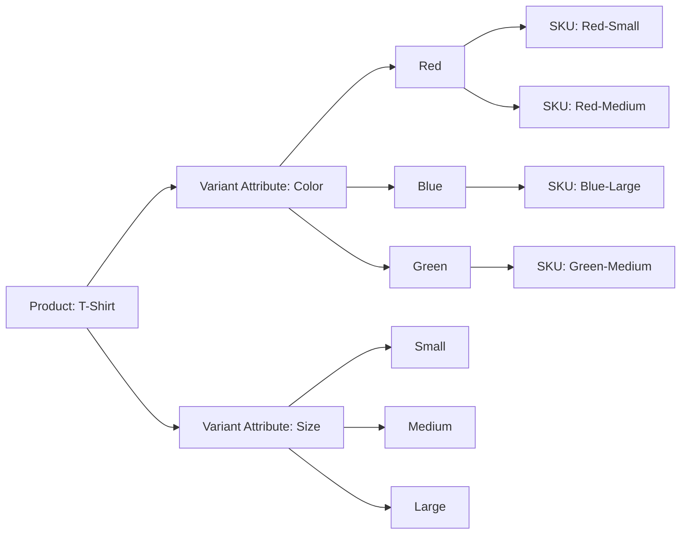
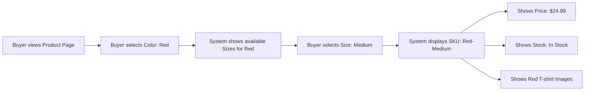
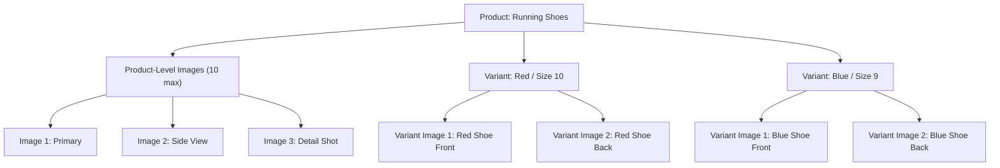
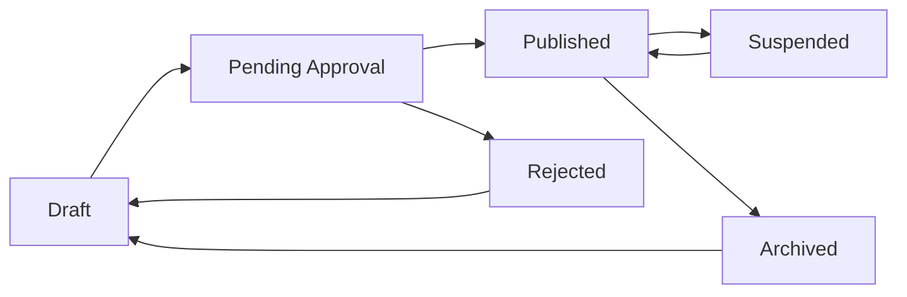

# Product Catalog Requirements

## Introduction and Overview

This document specifies the complete product catalog system for the e-commerce shopping mall platform. The product catalog serves as the foundation for the marketplace, enabling sellers to list their products with detailed information, variants, and pricing, while allowing buyers to discover, search, and explore products effectively.

The catalog system must support a flexible product variant (SKU) structure, hierarchical categorization, powerful search and filtering capabilities, comprehensive image management, and dynamic pricing across variants. The system must handle thousands of products with millions of potential variant combinations while maintaining instant search performance and real-time inventory visibility.

### Document Scope

This document covers:
- Product information structure and required data fields
- Product variant (SKU) system with colors, sizes, and custom options
- Category hierarchy and taxonomy management
- Search functionality with filtering and sorting
- Image management for products and variants
- Pricing rules and variant-specific pricing
- Inventory visibility and stock status display
- Product lifecycle and approval workflows

This document focuses on business requirements in natural language. All technical implementation decisions including database design, API architecture, and system infrastructure are at the discretion of the development team.

### Key Business Objectives

The product catalog system must achieve:
- **Seller Enablement**: Sellers can easily create and manage complex products with multiple variants
- **Buyer Discovery**: Buyers can find relevant products instantly through search and browsing
- **Inventory Accuracy**: Real-time stock availability prevents overselling and buyer frustration
- **Scalability**: System handles growing product counts without performance degradation
- **Flexibility**: Support diverse product types from simple items to complex configurable products

---

## Product Information Structure

### Core Product Fields

THE system SHALL capture the following product information for every product listing:

**Basic Information:**
- **Product Name**: THE product name SHALL be between 3 and 200 characters in length
- **Product Description**: THE product description SHALL be between 50 and 5000 characters in length
- **Brand Name**: THE brand name SHALL be optional and up to 100 characters when provided
- **Product Category**: THE product SHALL be assigned to exactly one category from the category hierarchy
- **Seller Association**: THE product SHALL be associated with the seller who created it

**Product Identifiers:**
- **Product ID**: THE system SHALL generate a unique product identifier for each product
- **Product Code**: THE seller MAY provide an optional SKU or product code up to 50 characters
- **Barcode/UPC**: THE seller MAY provide optional barcode or UPC information

**Product Status:**
- **Status**: THE product SHALL have one of the following statuses: draft, pending_approval, published, suspended, archived
- **Visibility**: WHEN a product status is "published", THE system SHALL make the product visible to buyers
- **Creation Date**: THE system SHALL record when the product was first created
- **Last Modified Date**: THE system SHALL update this timestamp whenever product information changes

### Product Metadata

THE system SHALL support the following product metadata:

**Condition and Attributes:**
- **Product Condition**: THE seller SHALL specify if the product is new, refurbished, or used
- **Weight**: THE seller MAY specify product weight for shipping calculations
- **Dimensions**: THE seller MAY specify length, width, and height dimensions
- **Manufacturer**: THE seller MAY specify the manufacturer name

**Marketing and SEO:**
- **Short Description**: THE seller MAY provide a short description (100-500 characters) for product listings
- **Product Tags**: THE seller MAY add up to 20 tags for product discovery
- **Meta Keywords**: THE seller MAY provide keywords for search optimization

**Seller Controls:**
- **Return Policy**: THE seller SHALL specify if returns are accepted and the return window (7, 14, 30, or 60 days)
- **Warranty Information**: THE seller MAY provide warranty details and duration

### Product Content Validation

**Content Quality Rules:**

WHEN a seller submits product information, THE system SHALL validate the following:
- Product name must not contain only special characters or numbers
- Product description must contain meaningful text (not just repeated characters)
- Product name and description must not contain prohibited content (profanity, discriminatory language)
- Images must meet minimum quality requirements (defined in Image Management section)

IF product content fails validation, THEN THE system SHALL reject the submission and provide specific error messages indicating which fields failed validation and why.

---

## Product Variant (SKU) System

### Variant Architecture Overview

The product variant system enables sellers to create products with multiple variations based on different attributes such as color, size, material, or custom options. Each unique combination of variant attributes represents a distinct SKU (Stock Keeping Unit) with its own inventory, pricing, and images.



### Variant Attribute Types

THE system SHALL support the following variant attribute types:

**Standard Attribute Types:**
- **Color**: Visual color selection with color name and optional hex code
- **Size**: Text-based size values (XS, S, M, L, XL, XXL, or numeric sizes)
- **Material**: Text-based material specification (Cotton, Polyester, Leather, etc.)
- **Style**: Text-based style variations
- **Custom Attributes**: Seller-defined attribute names and values

### Variant Definition Requirements

**Creating Variant Attributes:**

WHEN a seller creates a product with variants, THE system SHALL allow:
- Adding up to 3 variant attributes per product (e.g., Color, Size, Material)
- Each variant attribute can have up to 50 possible values
- Variant attribute names must be between 2 and 50 characters
- Variant attribute values must be between 1 and 100 characters

**Variant Combination Generation:**

WHEN a seller defines variant attributes, THE system SHALL:
- Generate all possible combinations of variant attributes as potential SKUs
- Allow sellers to enable or disable specific variant combinations
- Display the total number of possible SKU combinations before generation

IF a product has Color (3 values) and Size (4 values), THEN THE system SHALL indicate that 12 SKU combinations will be created.

**Example Variant Structure:**

```
Product: "Premium Cotton T-Shirt"
Variant Attributes:
  - Color: [Red, Blue, Green, Black, White]
  - Size: [XS, S, M, L, XL, XXL]
  
Generated SKUs: 30 combinations (5 colors × 6 sizes)

Individual SKU Example:
  - Product: Premium Cotton T-Shirt
  - Variant: Red / Medium
  - SKU Code: TSHIRT-RED-M
  - Price: $24.99
  - Stock: 150 units
  - Images: [red_tshirt_front.jpg, red_tshirt_back.jpg]
```

### SKU-Level Data Management

**Individual SKU Properties:**

THE system SHALL support the following properties at the SKU level:

**Pricing:**
- **SKU Price**: Each SKU SHALL have its own price, which may differ from other variants
- **Compare-at Price**: Each SKU MAY have an optional original price for showing discounts
- **Cost Price**: Sellers MAY record their cost price for profit tracking (not visible to buyers)

**Inventory:**
- **Stock Quantity**: Each SKU SHALL have its own inventory count
- **Low Stock Threshold**: Sellers MAY set a threshold for low stock warnings per SKU
- **Allow Backorders**: Sellers MAY enable or disable backorders per SKU

**Identifiers:**
- **SKU Code**: Each SKU SHALL have a unique identifier within the product
- **Barcode/UPC**: Each SKU MAY have its own barcode or UPC
- **Variant-Specific Product Code**: Sellers MAY assign unique codes per variant

**Media:**
- **Variant Images**: Each SKU MAY have its own set of product images
- **Image Inheritance**: IF a variant has no specific images, THEN THE system SHALL use the parent product images

### Variant Management Workflows

**Adding Variants to Existing Products:**

WHEN a seller adds a new variant attribute to an existing product, THE system SHALL:
- Generate new SKU combinations for all existing variants combined with the new attribute values
- Prompt the seller to set pricing and inventory for newly generated SKUs
- Preserve existing SKU data (prices, inventory, images) for combinations that already existed

**Disabling Variant Combinations:**

WHERE a seller determines certain variant combinations are not offered, THE system SHALL:
- Allow sellers to mark specific SKU combinations as "disabled" or "unavailable"
- Hide disabled SKU combinations from buyer-facing product pages
- Preserve disabled SKU data in case sellers later re-enable those combinations

**Variant Selection User Experience:**

WHEN a buyer views a product with variants, THE system SHALL:
- Display all available variant attributes (Color, Size, etc.) as selection options
- Show only values that are currently in stock or available for the selected combinations
- Update available options dynamically as the buyer selects each attribute
- Display the selected SKU's price, stock status, and images

**Example Variant Selection Flow:**



### Variant Search and Filtering

**Variant-Aware Search:**

WHEN buyers search for products, THE system SHALL:
- Search across both product names and variant attribute values
- Return products where any variant matches the search query
- Display matching variants prominently in search results

IF a buyer searches for "red shirt", THEN THE system SHALL return products that have "red" as a color variant, even if the product name doesn't contain "red".

**Filtering by Variant Attributes:**

WHEN buyers apply filters, THE system SHALL:
- Provide filter options for common variant attributes (Color, Size, Material)
- Show only products that have variants matching the selected filters
- Display the count of available products for each filter option

---

## Category Hierarchy

### Category Structure Requirements

THE system SHALL implement a hierarchical category taxonomy with the following capabilities:

**Hierarchy Depth:**
- THE category hierarchy SHALL support unlimited nesting levels
- THE system SHALL recommend a maximum practical depth of 4-5 levels for usability
- Each category SHALL have exactly one parent category (except root categories)

**Category Levels Example:**

```
Level 1 (Root): Electronics
  Level 2: Computers & Tablets
    Level 3: Laptops
      Level 4: Gaming Laptops
      Level 4: Business Laptops
      Level 4: Ultrabooks
    Level 3: Tablets
    Level 3: Desktop Computers
  Level 2: Mobile Phones & Accessories
    Level 3: Smartphones
    Level 3: Phone Cases
    Level 3: Screen Protectors

Level 1 (Root): Fashion
  Level 2: Men's Clothing
    Level 3: Shirts
    Level 3: Pants
    Level 3: Outerwear
  Level 2: Women's Clothing
  Level 2: Shoes
```

### Category Information Fields

**Core Category Data:**

THE system SHALL capture the following information for each category:

- **Category Name**: THE category name SHALL be between 2 and 100 characters
- **Category Description**: THE category MAY have a description up to 1000 characters
- **Category Slug**: THE system SHALL generate a URL-friendly slug from the category name
- **Parent Category**: THE category SHALL reference its parent (null for root categories)
- **Category Order**: THE system SHALL support manual ordering of categories at the same level
- **Category Status**: THE category SHALL be either active or inactive
- **Category Image**: THE category MAY have an associated banner or icon image

### Category Management Rules

**Category Assignment:**

WHEN a seller creates or edits a product, THE system SHALL:
- Require the seller to select exactly one category from the hierarchy
- Display the full category path (breadcrumb) for the selected category
- Allow sellers to browse or search categories during selection

**Category Display:**

WHEN buyers browse categories, THE system SHALL:
- Show the category hierarchy as a navigable tree structure
- Display product counts for each category (including subcategories)
- Show only active categories with at least one published product

**Category Navigation:**

WHEN a buyer selects a category, THE system SHALL:
- Display all products directly assigned to that category
- Optionally include products from all subcategories (configurable setting)
- Show the category breadcrumb path (Home > Electronics > Laptops > Gaming Laptops)

### Category-Specific Attributes

**Custom Attributes per Category:**

WHERE different product categories require unique attributes, THE system SHALL:
- Allow admins to define category-specific attributes
- Prompt sellers to fill category-specific fields when listing products
- Display category-specific filters on category browsing pages

**Example Category Attributes:**

```
Category: Laptops
  Required Attributes: Processor, RAM, Storage, Screen Size
  Optional Attributes: Graphics Card, Operating System, Battery Life

Category: Clothing
  Required Attributes: Material, Size Chart
  Optional Attributes: Care Instructions, Country of Origin

Category: Books
  Required Attributes: Author, ISBN, Publication Year
  Optional Attributes: Publisher, Page Count, Language
```

---

## Product Search System

### Search Functionality Requirements

THE product search system SHALL enable buyers to discover products quickly and accurately through text-based queries.

**Search Scope:**

WHEN a buyer enters a search query, THE system SHALL search across:
- Product names
- Product descriptions
- Brand names
- Product tags
- Category names
- Variant attribute values (colors, sizes, materials, etc.)
- Seller names (as secondary relevance)

### Search Performance Requirements

**Response Time:**

WHEN a buyer submits a search query, THE system SHALL return results within 500 milliseconds for queries returning up to 10,000 products.

**Search Indexing:**

WHEN sellers create or modify products, THE system SHALL:
- Update the search index within 5 minutes to ensure new products appear in search results
- Prioritize real-time indexing for published products over draft products

### Search Relevance and Ranking

**Result Ranking:**

WHEN the system returns search results, THE system SHALL rank products based on:
- **Relevance Score**: Calculated based on query match in product name (highest weight), description, and tags
- **Product Availability**: In-stock products ranked higher than out-of-stock products
- **Product Rating**: Higher-rated products receive ranking boost
- **Seller Reputation**: Products from highly-rated sellers receive slight ranking boost
- **Recency**: Recently listed products receive minor boost for freshness

**Search Query Processing:**

WHEN processing search queries, THE system SHALL:
- Support partial word matching (searching "lapt" returns "laptop" products)
- Ignore common stop words (the, a, an, is, etc.)
- Support plurals and singular forms interchangeably
- Apply basic spell correction for common misspellings

### Search Features

**Autocomplete Suggestions:**

WHEN a buyer types in the search box, THE system SHALL:
- Display autocomplete suggestions after 2 characters are entered
- Show up to 10 suggestions based on popular searches and product names
- Update suggestions instantly as the buyer continues typing
- Include product categories in suggestions alongside product names

**Search History:**

WHERE a buyer is authenticated, THE system SHALL:
- Record the buyer's search queries for their personal search history
- Allow buyers to view and clear their search history
- Use search history to personalize future search suggestions

**No Results Handling:**

IF a search query returns zero results, THEN THE system SHALL:
- Suggest alternative search terms based on similar queries
- Display popular or trending products as fallback recommendations
- Offer to broaden the search by removing filters

---

## Filtering and Sorting

### Filter Types and Options

THE system SHALL provide comprehensive filtering capabilities to help buyers narrow down product search results and category browsing.

**Standard Filter Categories:**

WHEN buyers browse or search products, THE system SHALL offer the following filter options:

**Price Range Filter:**
- THE system SHALL allow buyers to filter products by price range
- Buyers MAY enter custom minimum and maximum price values
- THE system SHALL provide preset price range options (Under $25, $25-$50, $50-$100, $100-$200, Over $200)

**Category Filter:**
- WHEN viewing search results, THE system SHALL display all relevant categories as filter options
- THE system SHALL show the count of products in each category
- Buyers MAY select multiple categories simultaneously

**Brand Filter:**
- THE system SHALL extract all unique brands from search results and display them as filter options
- THE system SHALL sort brands alphabetically
- Buyers MAY select multiple brands simultaneously
- THE system SHALL show product count per brand

**Rating Filter:**
- THE system SHALL allow filtering by minimum product rating (4+ stars, 3+ stars, 2+ stars, 1+ star)
- THE system SHALL only display rating filters where products exist at each rating level

**Availability Filter:**
- THE system SHALL offer an "In Stock Only" filter option
- WHEN enabled, THE system SHALL hide all out-of-stock products from results

**Condition Filter:**
- THE system SHALL allow filtering by product condition (New, Refurbished, Used)
- Buyers MAY select multiple condition options

### Dynamic Variant Attribute Filters

**Variant-Based Filters:**

WHEN the search results or category includes products with common variant attributes, THE system SHALL:
- Automatically generate filter options for those variant attributes
- Display Color filters if multiple products have color variants
- Display Size filters if multiple products have size variants
- Display Material filters if multiple products have material variants

**Filter Value Presentation:**

WHEN displaying variant attribute filters, THE system SHALL:
- Show all unique values across all products in the result set
- Display product count for each filter value
- Disable filter options that would result in zero products

**Example Dynamic Filters:**

```
Search Results: "men's shirts" (1,247 products)

Filters Generated:
  Price:
    - Under $20 (342)
    - $20 - $40 (589)
    - $40 - $60 (234)
    - Over $60 (82)
  
  Color (from variant attributes):
    - White (456)
    - Blue (389)
    - Black (312)
    - Red (156)
    - Other (234)
  
  Size (from variant attributes):
    - Small (678)
    - Medium (892)
    - Large (745)
    - X-Large (534)
  
  Material (from variant attributes):
    - Cotton (567)
    - Polyester (234)
    - Linen (123)
    - Blend (323)
```

### Filter Interaction Behavior

**Multi-Filter Application:**

WHEN buyers apply multiple filters, THE system SHALL:
- Combine filters using AND logic (all conditions must be met)
- Update product counts dynamically as filters are applied
- Update available filter options to show only combinations that yield results

**Filter State Management:**

WHEN buyers apply filters, THE system SHALL:
- Maintain filter selections when buyers navigate between pages of results
- Preserve filter state when buyers view product details and return to search results
- Allow buyers to clear individual filters or all filters at once
- Display active filters prominently with clear remove options

### Sorting Options

**Available Sort Options:**

THE system SHALL provide the following sorting options for product listings:

- **Relevance** (default for search results): Sort by search relevance score
- **Price: Low to High**: Sort by ascending price
- **Price: High to Low**: Sort by descending price
- **Newest First**: Sort by product creation date, newest first
- **Best Rated**: Sort by average product rating, highest first
- **Most Reviewed**: Sort by review count, most reviewed first
- **Best Selling**: Sort by total sales volume (where available)

**Sort Behavior:**

WHEN buyers select a sort option, THE system SHALL:
- Immediately re-order results according to the selected criteria
- Maintain the selected sort option when buyers navigate between result pages
- Display the current sort option clearly in the interface

**Variant-Aware Sorting:**

WHEN sorting products with variants by price, THE system SHALL:
- Use the minimum price across all SKUs for "Price: Low to High" sorting
- Use the maximum price across all SKUs for "Price: High to Low" sorting
- Display the price range (min - max) for products with varying SKU prices

---

## Product Image Management

### Image Requirements and Specifications

**Image Upload Requirements:**

WHEN sellers upload product images, THE system SHALL enforce:
- **Minimum Resolution**: Images MUST be at least 800 × 800 pixels
- **Recommended Resolution**: Images SHOULD be 2000 × 2000 pixels for optimal quality
- **Maximum File Size**: Each image file MUST NOT exceed 10 MB
- **Supported Formats**: THE system SHALL accept JPEG, PNG, and WebP formats
- **Image Aspect Ratio**: THE system SHALL recommend square (1:1) aspect ratio but accept other ratios

**Image Quantity Limits:**

THE system SHALL enforce the following image quantity limits:
- **Product-Level Images**: Sellers MAY upload up to 10 images per product
- **Variant-Level Images**: Sellers MAY upload up to 8 images per individual SKU
- **Primary Image Requirement**: Each product MUST have at least 1 primary image

### Image Organization and Display

**Image Hierarchy:**

THE system SHALL organize product images in the following hierarchy:



**Image Inheritance Rules:**

WHEN displaying product images to buyers, THE system SHALL:
- Use variant-specific images when the buyer selects that specific variant
- Fall back to product-level images if the selected variant has no specific images
- Always display the primary image first in the image gallery

**Primary Image Selection:**

THE system SHALL handle primary image selection as follows:
- Sellers MUST designate one image as the primary product image
- THE primary image SHALL be used in search results and product listings
- WHEN a buyer selects a variant with variant-specific images, THE system SHALL display that variant's primary image as the main image

### Image Processing and Optimization

**Automatic Image Processing:**

WHEN sellers upload images, THE system SHALL automatically:
- Generate multiple image sizes for different display contexts (thumbnail, medium, large, original)
- Compress images to optimize file size while maintaining visual quality
- Convert images to WebP format for modern browsers with JPEG fallbacks
- Extract dominant colors for use in UI elements

**Image Size Variants:**

THE system SHALL generate the following image sizes:
- **Thumbnail**: 150 × 150 pixels (for cart and order history)
- **Small**: 400 × 400 pixels (for product listings)
- **Medium**: 800 × 800 pixels (for product page gallery thumbnails)
- **Large**: 1600 × 1600 pixels (for product page main display)
- **Original**: Store original uploaded image for maximum quality zoom

### Image Display on Product Pages

**Image Gallery Behavior:**

WHEN buyers view a product page, THE system SHALL:
- Display the primary image prominently in the main viewing area
- Show thumbnail images in a gallery for quick navigation
- Allow buyers to click thumbnails to view different images in the main area
- Support image zoom functionality when buyers hover or click the main image

**Variant Image Switching:**

WHEN a buyer selects a different product variant, THE system SHALL:
- Instantly switch the main image to the selected variant's primary image
- Update the thumbnail gallery to show variant-specific images
- Maintain image zoom functionality for variant images

### Image Content Guidelines

**Prohibited Image Content:**

THE system SHALL reject images that contain:
- Watermarks from other websites or platforms
- Placeholder or stock photo watermarks (unless original to seller)
- Blurry or extremely low-quality photos
- Images with excessive text overlays that obstruct the product
- Images unrelated to the product being sold

**Image Quality Validation:**

WHEN sellers upload images, THE system SHALL:
- Validate minimum resolution requirements before accepting uploads
- Detect and warn about overly blurry images using automated quality detection
- Prevent uploads of images below minimum quality thresholds

IF an image fails quality validation, THEN THE system SHALL display an error message explaining the specific quality issue and requirements.

---

## Price Management

### Pricing Structure

**Price Components:**

THE system SHALL support the following price types for products and SKUs:

- **Base Price**: The regular selling price for the product or SKU
- **Compare-at Price** (Optional): The original or manufacturer's suggested retail price, used to show discounts
- **Sale Price** (Optional): A temporary promotional price lower than the base price
- **Cost Price** (Optional, Seller-Only): The seller's cost, not visible to buyers, used for profit calculations

**Variant Price Independence:**

WHERE a product has multiple SKUs, THE system SHALL:
- Allow each SKU to have a completely independent price
- Display price ranges on product listings when SKU prices vary (e.g., "$19.99 - $49.99")
- Update the displayed price dynamically when a buyer selects a specific variant

### Price Display Rules

**Price Formatting:**

WHEN displaying prices to buyers, THE system SHALL:
- Format prices according to the platform's primary currency (e.g., USD: $19.99)
- Display prices with two decimal places for currency precision
- Use thousand separators for prices over 999 (e.g., $1,299.99)

**Discount Display:**

WHERE a product has both a base price and a compare-at price, THE system SHALL:
- Calculate and display the discount percentage: ((Compare-at Price - Base Price) / Compare-at Price) × 100
- Display the discount percentage alongside the base price (e.g., "Save 25%")
- Show the compare-at price with strikethrough formatting

**Price Range Display:**

WHEN a product has variants with different prices, THE system SHALL:
- Display the price range format: "From $19.99" or "$19.99 - $49.99"
- Update to show the specific price when a buyer selects a variant
- Use the lowest variant price for sorting and filtering operations

### Promotional Pricing

**Sale Price Management:**

WHERE sellers want to run temporary promotions, THE system SHALL:
- Allow sellers to set a sale price lower than the base price
- Require sellers to specify sale start and end dates/times
- Automatically activate the sale price at the specified start time
- Automatically revert to base price at the specified end time
- Display a "Sale" badge on products with active sale prices

**Sale Price Validation:**

WHEN sellers set a sale price, THE system SHALL validate:
- Sale price MUST be lower than the base price
- Sale end date MUST be after the sale start date
- Sale dates MUST be in the future (for new sales)

IF sale price validation fails, THEN THE system SHALL reject the sale price and display specific error messages.

### Price Change Tracking

**Price History:**

THE system SHALL maintain a price change history for each SKU:
- Record the previous price whenever a seller changes the base price
- Record the date and time of each price change
- Store this history for analytics and reporting purposes (seller-only visibility)

**Active Order Price Protection:**

WHEN a buyer has items in their shopping cart and the seller changes the price, THE system SHALL:
- Maintain the original price in the cart for 24 hours
- Notify the buyer if the price increased before checkout
- Allow the buyer to complete the purchase at the original cart price within the 24-hour window

---

## Product Availability and Stock Display

### Stock Status Display

**Stock Level Visibility:**

THE system SHALL display stock availability to buyers using the following status indicators:

**In Stock:**
- WHEN a SKU has stock quantity greater than 10, THE system SHALL display "In Stock"
- THE system SHALL NOT display the exact stock count to buyers when quantity is above 10

**Low Stock:**
- WHEN a SKU has stock quantity between 1 and 10, THE system SHALL display "Only X left in stock" where X is the exact quantity
- THE system SHALL highlight low stock status to create urgency

**Out of Stock:**
- WHEN a SKU has stock quantity of 0 and backorders are disabled, THE system SHALL display "Out of Stock"
- THE system SHALL disable the "Add to Cart" button for out-of-stock items
- THE system MAY offer a "Notify Me When Available" option for buyers to receive restocking alerts

**Backorder Available:**
- WHEN a SKU has stock quantity of 0 but backorders are enabled, THE system SHALL display "Available on Backorder"
- THE system SHALL allow buyers to add the item to cart with an estimated availability date

### Stock Validation During Purchase

**Cart Validation:**

WHEN a buyer adds a product to their cart, THE system SHALL:
- Validate that the selected SKU has sufficient stock available
- Reserve the stock quantity temporarily (soft reservation)
- Update the available stock display for other buyers immediately

**Checkout Validation:**

WHEN a buyer proceeds to checkout, THE system SHALL:
- Revalidate stock availability for all cart items
- Remove or reduce quantities for items that are no longer available in the requested quantity
- Notify the buyer of any stock availability changes before completing the order

IF a cart item becomes unavailable during checkout, THEN THE system SHALL:
- Display a prominent notification explaining which items are affected
- Provide options to remove the item or adjust the quantity
- Prevent order completion until the buyer resolves the availability conflict

### Stock Reservation Rules

**Temporary Stock Reservation:**

WHEN items are in a buyer's cart, THE system SHALL:
- Soft-reserve the stock for 30 minutes to prevent overselling
- Release the soft reservation after 30 minutes if the buyer hasn't checked out
- Allow other buyers to purchase the item after the reservation expires

**Hard Stock Reservation:**

WHEN a buyer completes payment for an order, THE system SHALL:
- Permanently deduct the ordered quantities from available stock
- Prevent any other buyers from purchasing the reserved quantities
- Maintain the hard reservation until the order is fulfilled or cancelled

### Inventory Updates for Sellers

**Real-Time Inventory Tracking:**

WHEN sellers update inventory quantities for their SKUs, THE system SHALL:
- Reflect the new stock levels immediately on buyer-facing product pages
- Update stock status indicators based on the new quantities
- Log all inventory changes with timestamps for audit purposes

**Bulk Inventory Updates:**

WHERE sellers manage many SKUs, THE system SHALL:
- Allow sellers to update inventory quantities for multiple SKUs simultaneously
- Support CSV upload for bulk inventory updates
- Validate all bulk updates before applying changes

**Low Stock Alerts:**

WHEN a SKU's inventory falls below the seller-defined low stock threshold, THE system SHALL:
- Send a notification to the seller alerting them of low stock
- Display a low stock warning in the seller's dashboard
- Allow sellers to configure notification preferences per SKU

---

## Product Status Workflow

### Product Lifecycle States

THE system SHALL manage products through the following lifecycle states:



**Status Definitions:**

- **Draft**: Product is being created by the seller and is not visible to buyers or admins
- **Pending Approval**: Product has been submitted by the seller and is awaiting admin review
- **Published**: Product is approved and visible to buyers in search and browsing
- **Rejected**: Product was reviewed and rejected by admins, returned to seller for corrections
- **Suspended**: Product was published but has been temporarily hidden due to policy violations or seller request
- **Archived**: Product has been removed from active listings but data is preserved for historical records

### Status Transition Rules

**Draft to Pending Approval:**

WHEN a seller submits a product for approval, THE system SHALL:
- Validate that all required fields are completed
- Validate that at least one product image is uploaded
- Validate that at least one SKU has price and inventory set
- Change product status from "Draft" to "Pending Approval"
- Notify admins that a new product requires review

IF validation fails, THEN THE system SHALL prevent submission and display specific error messages for each validation failure.

**THE system SHALL allow the seller to save incomplete products as drafts without validation errors.**

**Pending Approval to Published:**

WHEN an admin approves a product, THE system SHALL:
- Change product status from "Pending Approval" to "Published"
- Make the product visible in search results and category browsing immediately
- Notify the seller that their product has been approved and is now live
- Record the approval timestamp and admin user who approved

**Pending Approval to Rejected:**

WHEN an admin rejects a product, THE system SHALL:
- Change product status from "Pending Approval" to "Rejected"
- Require the admin to provide a rejection reason
- Notify the seller with the rejection reason
- Allow the seller to edit and resubmit the product

**Published to Suspended:**

WHEN a product is suspended (by admin action or seller request), THE system SHALL:
- Change product status from "Published" to "Suspended"
- Immediately hide the product from buyer-facing search and browsing
- Preserve all product data and reviews
- Prevent new orders for the suspended product
- Allow the seller to view and edit suspended products

**Published to Archived:**

WHEN a seller archives a product, THE system SHALL:
- Change product status from "Published" to "Archived"
- Hide the product from buyer-facing search and browsing
- Preserve all historical order data associated with the product
- Maintain product reviews for data integrity
- Allow sellers to restore archived products to Draft status for re-listing

### Visibility Rules by Status

**Buyer Visibility:**

THE system SHALL enforce the following visibility rules for buyers:
- **Draft, Pending Approval, Rejected**: Not visible to buyers under any circumstances
- **Published**: Fully visible in search, browsing, and direct URL access
- **Suspended, Archived**: Not visible in search or browsing; direct URL access shows "Product Unavailable"

**Seller Visibility:**

THE system SHALL allow sellers to view and manage their own products in all statuses:
- Sellers CAN view, edit, and delete products in "Draft" status
- Sellers CAN view products in "Pending Approval" status but cannot edit until approved or rejected
- Sellers CAN view and edit products in "Rejected" status to make corrections
- Sellers CAN view, edit, and suspend/archive products in "Published" status
- Sellers CAN view and restore products in "Suspended" or "Archived" status

**Admin Visibility:**

THE system SHALL allow admins to view and manage all products:
- Admins CAN view all products regardless of status
- Admins CAN approve or reject products in "Pending Approval" status
- Admins CAN suspend products in "Published" status
- Admins CAN force-archive products for policy violations

### Auto-Suspension Rules

**Out-of-Stock Auto-Suspension:**

WHERE a seller configures auto-suspension for out-of-stock products, THE system SHALL:
- Automatically change product status to "Suspended" when all SKUs reach zero inventory
- Automatically restore product status to "Published" when inventory is replenished
- Notify the seller when auto-suspension occurs

**Policy Violation Suspension:**

WHEN an admin identifies a policy violation, THE system SHALL:
- Allow admins to immediately suspend the product
- Require the admin to specify the policy violation reason
- Notify the seller with details of the violation
- Require seller corrections and admin re-approval before republishing

---

## Performance Requirements

### Search and Browse Performance

**Search Response Time:**

WHEN buyers perform product searches, THE system SHALL:
- Return search results within 500 milliseconds for queries matching up to 10,000 products
- Return autocomplete suggestions within 200 milliseconds
- Support at least 1,000 concurrent search requests without performance degradation

**Category Browse Performance:**

WHEN buyers browse category pages, THE system SHALL:
- Load category product listings within 1 second for categories with up to 5,000 products
- Support pagination with instant page navigation (under 300 milliseconds)
- Load filter options and product counts within 400 milliseconds

### Image Loading Performance

**Image Delivery:**

WHEN buyers view product listings and detail pages, THE system SHALL:
- Load thumbnail images within 300 milliseconds
- Use progressive image loading to display low-resolution previews instantly
- Lazy-load images that are below the fold (not initially visible)
- Deliver images via CDN for geographic performance optimization

### Inventory Update Performance

**Real-Time Inventory Synchronization:**

WHEN inventory levels change, THE system SHALL:
- Update product availability status on buyer-facing pages within 5 seconds
- Process inventory updates from sellers within 2 seconds
- Handle at least 100 concurrent inventory update requests per second

---

## Business Rules and Validation

### Product Creation Validation

**Required Field Validation:**

WHEN a seller creates a new product, THE system SHALL enforce:
- Product name is required and between 3-200 characters
- Product description is required and between 50-5000 characters
- At least one category must be selected
- At least one product image must be uploaded
- At least one SKU must be created with price and inventory

**Price Validation:**

WHEN sellers set prices, THE system SHALL validate:
- Base price MUST be greater than 0
- Sale price (if provided) MUST be less than base price
- Compare-at price (if provided) MUST be greater than or equal to base price
- All prices MUST be numeric with up to 2 decimal places

**Inventory Validation:**

WHEN sellers set inventory quantities, THE system SHALL validate:
- Stock quantity MUST be a non-negative integer (0 or greater)
- Low stock threshold (if set) MUST be less than or equal to stock quantity
- Inventory quantities cannot exceed 999,999 units per SKU

### Variant Validation Rules

**Variant Attribute Validation:**

WHEN sellers create product variants, THE system SHALL:
- Require at least 1 and at most 3 variant attributes per product
- Ensure each variant attribute has at least 1 value and at most 50 values
- Prevent duplicate variant attribute names within the same product
- Prevent duplicate variant attribute values within the same attribute

**SKU Uniqueness:**

WHEN the system generates SKUs, THE system SHALL:
- Ensure each SKU code is unique within the product
- Prevent sellers from creating duplicate SKU combinations
- Validate that at least one SKU is enabled and available for each product

### Content Moderation Rules

**Prohibited Content Detection:**

WHEN sellers submit product information, THE system SHALL:
- Scan product names and descriptions for prohibited keywords (profanity, banned substances, etc.)
- Reject submissions containing prohibited content with specific error messages
- Flag suspicious content for admin review even if not explicitly prohibited

**Image Moderation:**

WHEN sellers upload product images, THE system SHALL:
- Validate image file formats and sizes
- Detect and reject images with excessive watermarks or text overlays
- Flag images for admin review if automated quality detection identifies potential issues

### Data Integrity Rules

**Category Assignment:**

THE system SHALL enforce:
- Every published product MUST be assigned to exactly one active category
- IF a category is deleted, THEN all products in that category MUST be reassigned or suspended
- Sellers CANNOT publish products without a valid category assignment

**Seller Association:**

THE system SHALL enforce:
- Every product MUST be associated with exactly one seller account
- Products CANNOT be transferred between seller accounts (data integrity)
- IF a seller account is suspended, THEN all their products MUST be automatically suspended

### Business Constraint Rules

**Variant Combination Limits:**

THE system SHALL enforce:
- Maximum of 3 variant attributes per product to prevent combinatorial explosion
- Maximum of 50 values per variant attribute
- Maximum total SKU combinations: 1,500 per product (calculated as attribute1_values × attribute2_values × attribute3_values)

IF a seller attempts to create variant combinations exceeding 1,500 SKUs, THEN THE system SHALL reject the configuration and suggest reducing attribute values or splitting into multiple products.

**Pricing Constraints:**

THE system SHALL enforce:
- Minimum price: $0.01 (no free products; promotions handled separately)
- Maximum price: $999,999.99 per SKU
- Price changes cannot occur more than once per hour per SKU to prevent abuse

---

## Related Documents

For complete understanding of the product catalog system in context, please refer to:

- **[Buyer User Journey Documentation](./03-buyer-user-journey.md)** - Details how buyers discover, search, and interact with products
- **[Seller User Journey Documentation](./04-seller-user-journey.md)** - Describes how sellers create and manage product listings with variants
- **[Shopping Cart and Wishlist Requirements](./07-shopping-cart-wishlist.md)** - Explains cart validation against product availability and variants
- **[Order Management Workflow](./08-order-management-workflow.md)** - Covers order placement with variant selection and inventory deduction
- **[Reviews and Ratings System](./09-reviews-ratings-system.md)** - Defines how reviews are associated with products and displayed
- **[Inventory and Shipping Management](./10-inventory-shipping-management.md)** - Details inventory tracking per SKU and stock management

---

> *Developer Note: This document defines **business requirements only**. All technical implementations (database architecture, search indexing technology, API design, caching strategies, etc.) are at the discretion of the development team. The focus is on WHAT the product catalog system should do from a business and user perspective, not HOW to build it technically.*