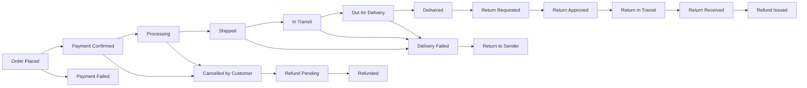

# Order Management & Fulfillment Requirements

## Introduction and Overview

### Purpose of This Document
This document defines the complete business requirements for the order management and fulfillment system within the e-commerce shopping mall platform. It specifies how orders are created, tracked, fulfilled, cancelled, returned, and refunded throughout their entire lifecycle. This document provides backend developers with comprehensive business logic and requirements for implementing a robust order management system that serves customers, sellers, and platform administrators.

### Scope of Order Management System
The order management system encompasses all business processes from the moment a customer places an order through final delivery, including post-purchase actions such as cancellations, returns, and refunds. The system must handle single-seller and multi-seller orders, coordinate between multiple stakeholders, maintain accurate order status throughout the lifecycle, and ensure timely notifications to all parties.

### Key Stakeholders
- **Customers**: Place orders, track shipments, request cancellations or returns, and view order history
- **Sellers**: Receive orders, update fulfillment status, process shipments, handle returns, and manage their order queue
- **Administrators**: Oversee all orders across the platform, resolve disputes, approve refunds, and ensure marketplace integrity

For detailed authentication and permission requirements for each stakeholder, refer to the [User Actors & Authentication Document](./02-user-actors-authentication.md).

## Order Creation Process

### Order Placement from Checkout
WHEN a customer completes the checkout process successfully, THE system SHALL create a new order record with all necessary information captured during checkout.

WHEN an order is created, THE system SHALL generate a unique order identifier that can be used for tracking and reference throughout the order lifecycle.

THE system SHALL capture the exact timestamp of order creation in ISO 8601 format for audit and tracking purposes.

### Order Validation Requirements
WHEN creating an order, THE system SHALL validate that all required order information is present including customer details, delivery address, product items with SKUs, quantities, prices, and payment information.

WHEN creating an order, THE system SHALL validate that all ordered SKUs have sufficient inventory available at the time of order placement.

IF any validation fails during order creation, THEN THE system SHALL prevent order creation and return specific error information to the customer indicating what needs to be corrected.

### Order Confirmation Process
WHEN an order is successfully created, THE system SHALL immediately send an order confirmation notification to the customer via email containing order number, order date, complete item list with quantities and prices, delivery address, total amount charged, and estimated delivery timeframe.

WHEN an order involves multiple sellers, THE system SHALL send order notifications to each seller containing only the items they need to fulfill from the complete order.

THE system SHALL display an order confirmation page to the customer immediately after successful order placement showing complete order details and next steps.

### Initial Order Status Assignment
WHEN an order is created, THE system SHALL assign the initial order status of "Pending" indicating the order has been placed and is awaiting seller processing.

WHEN payment processing is asynchronous, THE system SHALL assign the status "Payment Pending" until payment confirmation is received.

For complete checkout and payment flow details, refer to the [Shopping & Checkout Process Document](./06-shopping-checkout-process.md) and [Payment Processing Document](./08-payment-processing.md).

## Order Data Requirements

### Complete Order Information Structure
THE system SHALL maintain comprehensive order records containing all information necessary for order fulfillment, tracking, customer service, and business analytics.

Each order record must include:
- **Order Identification**: Unique order number, creation timestamp, last update timestamp
- **Customer Information**: Customer account reference, contact email, contact phone number
- **Delivery Information**: Recipient name, delivery address (street, city, state/province, postal code, country), delivery instructions
- **Order Items**: For each item - product reference, SKU reference, product name, variant details (color, size, options), quantity ordered, unit price at time of order, subtotal, seller reference
- **Financial Information**: Items subtotal, shipping cost, tax amount, discount amount (if applicable), grand total, payment method used, payment transaction reference
- **Fulfillment Information**: Current order status, shipping carrier (when assigned), tracking number (when available), estimated delivery date, actual delivery date (when completed)
- **Timeline Information**: Order placed timestamp, payment confirmed timestamp, shipped timestamp, delivered timestamp
- **Metadata**: Cancellation reason (if cancelled), return reason (if returned), refund amount (if refunded), special handling notes

### Order Information Immutability
THE system SHALL preserve the original order information including product names, prices, and variant details as they were at the time of order placement, even if product information changes later in the catalog.

WHEN displaying historical orders, THE system SHALL show the exact prices and product details that were valid at the time of purchase, not current catalog information.

### Order Information Access Control
WHEN a customer requests their order information, THE system SHALL return only orders belonging to that customer's account.

WHEN a seller requests order information, THE system SHALL return only order items that belong to products they sell.

WHEN an administrator requests order information, THE system SHALL provide access to all orders across the platform with full details.

## Order Status Lifecycle

### Order Status Flow Diagram

### Status Definitions and Meanings

**Order Placed**: The customer has submitted the order and it has been created in the system. The order is awaiting payment confirmation.

**Payment Confirmed**: Payment has been successfully processed and confirmed. The order is ready for seller processing.

**Processing**: The seller is preparing the order for shipment, including picking items from inventory, packaging, and arranging shipping.

**Shipped**: The seller has handed the package to the shipping carrier and the order is en route to the customer.

**In Transit**: The package is actively moving through the shipping carrier's network toward the delivery destination.

**Out for Delivery**: The package is on the delivery vehicle and will be delivered to the customer today.

**Delivered**: The package has been successfully delivered to the customer's address and the order is complete.

**Payment Failed**: The payment transaction could not be completed successfully and the order cannot proceed.

**Cancelled by Customer**: The customer has requested cancellation and the order has been cancelled before shipment.

**Refund Pending**: A refund has been approved and is being processed by the payment system.

**Refunded**: The refund transaction has been completed and funds have been returned to the customer.

**Return Requested**: The customer has submitted a request to return the delivered order.

**Return Approved**: The return request has been approved and the customer can ship the items back.

**Return in Transit**: The customer has shipped the return package and it is on its way back to the seller.

**Return Received**: The seller has received the returned items and is inspecting them.

**Refund Issued**: The refund for the returned items has been processed and completed.

**Delivery Failed**: The carrier was unable to deliver the package to the specified address.

**Return to Sender**: The package is being returned to the seller due to delivery failure or customer refusal.

### Status Transition Rules

WHEN payment is confirmed for an order in "Order Placed" status, THE system SHALL automatically transition the order to "Payment Confirmed" status.

WHEN a seller begins processing an order in "Payment Confirmed" status, THE system SHALL transition the order to "Processing" status.

WHEN a seller submits shipping information for an order in "Processing" status, THE system SHALL transition the order to "Shipped" status.

WHEN shipping carrier tracking information indicates the package is moving, THE system SHALL transition the order to "In Transit" status.

WHEN shipping carrier tracking indicates the package is on the delivery vehicle, THE system SHALL transition the order to "Out for Delivery" status.

WHEN shipping carrier confirms successful delivery, THE system SHALL transition the order to "Delivered" status.

IF payment processing fails for an order, THEN THE system SHALL transition the order to "Payment Failed" status and prevent further processing.

WHEN a customer cancels an order before it reaches "Shipped" status, THE system SHALL transition the order to "Cancelled by Customer" status.

WHEN a cancellation or return is approved for refund, THE system SHALL transition the order to "Refund Pending" status.

WHEN a refund transaction is completed, THE system SHALL transition the order to "Refunded" status.

### Status Change Authorization

WHEN a seller updates an order to "Processing" status, THE system SHALL verify that the seller owns the products in that order before allowing the status change.

WHEN a seller updates an order to "Shipped" status, THE system SHALL require shipping carrier information and tracking number before allowing the status change.

WHEN an administrator updates any order status, THE system SHALL allow the change and record the administrator's action in the audit log.

THE system SHALL prevent customers from directly changing order status, but SHALL allow customers to initiate actions (cancellation, return requests) that trigger status changes through proper workflows.

### Automated vs Manual Status Updates

THE system SHALL automatically update order status to "Payment Confirmed" when payment gateway confirms successful transaction.

THE system SHALL automatically update order status based on shipping carrier tracking updates when carrier integration provides real-time tracking data.

THE system SHALL require manual seller action to update status to "Processing" and "Shipped" as these represent physical fulfillment activities.

THE system SHALL require manual review and approval for status transitions involving refunds or dispute resolution.

## Multi-Seller Order Handling

### Order Splitting by Seller

WHEN an order contains items from multiple sellers, THE system SHALL logically split the order into separate seller fulfillment units while maintaining a single customer-facing order number.

WHEN displaying order details to the customer, THE system SHALL show all items under the single order number, but SHALL clearly group items by seller for clarity.

THE system SHALL assign a unique sub-order identifier to each seller's portion of a multi-seller order for internal tracking purposes.

### Individual Seller Order Management

WHEN a seller views their orders, THE system SHALL display only the items from multi-seller orders that belong to that seller's products.

WHEN a seller updates fulfillment status, THE system SHALL apply the status update only to their portion of the order, not the entire customer order.

THE system SHALL allow each seller to independently process, ship, and manage their portion of a multi-seller order according to their own fulfillment capabilities.

### Coordinated Order Tracking

WHEN a customer views a multi-seller order, THE system SHALL display the status of each seller's portion separately, showing which items have been shipped and which are still being processed.

THE system SHALL calculate overall order status for multi-seller orders as "Partially Shipped" when some sellers have shipped their items and others have not.

WHEN all sellers have completed fulfillment of their portions, THE system SHALL update the overall order status to "Delivered" once all tracking confirms delivery.

### Multi-Seller Order Display to Customers

THE system SHALL present multi-seller orders to customers with clear visual separation of items by seller, including seller name, items from that seller, individual shipping status, and tracking information for each seller's shipment.

WHEN a customer tracks a multi-seller order, THE system SHALL provide separate tracking numbers and carrier information for each seller's shipment.

### Payment Distribution Considerations

For multi-seller orders, the payment processing system must distribute funds to the appropriate sellers based on the items they fulfilled. Refer to the [Payment Processing Document](./08-payment-processing.md) for detailed payment distribution requirements.

## Order Tracking Requirements

### Customer Order Tracking Capabilities

WHEN a customer views their order history, THE system SHALL display all orders they have placed, sorted by most recent first.

WHEN a customer selects a specific order, THE system SHALL display complete order details including items, quantities, prices, delivery address, current status, and estimated delivery date.

WHEN an order has tracking information available, THE system SHALL display the tracking number and shipping carrier, and SHALL provide a direct link to the carrier's tracking page.

THE system SHALL allow customers to access their order tracking information without requiring login by using the order number and email address used for the order.

### Seller Order Tracking Capabilities

WHEN a seller views their order queue, THE system SHALL display orders containing their products, organized by status (pending processing, processing, shipped, completed).

WHEN a seller selects a specific order, THE system SHALL display the items they need to fulfill, customer delivery address, order date, and payment confirmation status.

THE system SHALL allow sellers to filter and search their orders by status, date range, order number, and customer name.

### Real-Time Status Updates

WHEN an order status changes, THE system SHALL immediately update the status in the customer's order tracking view without requiring page refresh.

WHEN shipping carrier tracking information is updated, THE system SHALL reflect the updates in the order tracking view within a reasonable timeframe (within 15 minutes of carrier update).

### Tracking Number Integration

WHEN a seller provides a tracking number, THE system SHALL validate the tracking number format matches the specified carrier's tracking number pattern.

THE system SHALL store the tracking number, carrier name, and the timestamp when tracking information was added.

THE system SHALL provide customers with clickable tracking links that open the carrier's tracking page in a new window with the tracking number pre-filled.

### Estimated Delivery Date Management

WHEN an order is placed, THE system SHALL calculate and display an estimated delivery date range based on seller processing time and standard shipping duration.

WHEN a seller ships an order, THE system SHALL update the estimated delivery date based on the carrier's estimated delivery timeframe if available.

WHEN actual delivery occurs, THE system SHALL record the actual delivery date and compare it to the estimated date for fulfillment performance metrics.

## Shipping Status Updates

### Shipping Preparation Workflow

WHEN a seller begins preparing an order for shipment, THE system SHALL allow the seller to update the order status to "Processing".

WHEN a seller is ready to ship, THE system SHALL require the seller to provide shipping carrier name and tracking number before allowing status update to "Shipped".

THE system SHALL validate that all items in the order have been marked as ready for shipment before allowing the seller to complete the shipping process.

### Carrier Integration Requirements

WHERE the platform integrates with shipping carriers, THE system SHALL automatically retrieve tracking updates from the carrier's API and update order status accordingly.

WHERE carrier integration is available, THE system SHALL provide sellers with options to generate shipping labels directly through the platform.

WHERE carrier integration provides delivery confirmation, THE system SHALL automatically update order status to "Delivered" when the carrier confirms successful delivery.

### Tracking Information Capture

WHEN a seller submits tracking information, THE system SHALL capture the shipping carrier name, tracking number, ship date, and estimated delivery date.

THE system SHALL allow sellers to update or correct tracking information if an error was made during initial entry.

THE system SHALL maintain a history of all tracking information updates including timestamps and which seller user made the update.

### Delivery Confirmation

WHEN a shipping carrier confirms delivery, THE system SHALL update the order status to "Delivered" and record the actual delivery timestamp.

THE system SHALL send a delivery confirmation notification to the customer when the order reaches "Delivered" status.

WHEN delivery is confirmed, THE system SHALL start the return eligibility window timer based on the platform's return policy timeframe.

### Failed Delivery Handling

IF a shipping carrier reports delivery failure, THEN THE system SHALL update the order status to "Delivery Failed" and notify both the customer and seller.

WHEN delivery fails, THE system SHALL provide the customer with options to update the delivery address or contact the seller for re-shipment arrangements.

IF multiple delivery attempts fail, THEN THE system SHALL update the status to "Return to Sender" and initiate the refund process according to platform policies.

## Order Cancellation Rules

### Customer-Initiated Cancellation

WHILE an order is in "Order Placed" or "Payment Confirmed" status, THE system SHALL allow customers to cancel the order directly through their order management interface.

WHILE an order is in "Processing" status, THE system SHALL allow customers to submit a cancellation request that requires seller approval.

WHEN an order reaches "Shipped" status, THE system SHALL not allow cancellation and SHALL instead direct customers to the return process after delivery.

### Seller-Initiated Cancellation

WHEN a seller cannot fulfill an order due to inventory issues or other problems, THE system SHALL allow the seller to initiate order cancellation with a required reason explanation.

WHEN a seller cancels an order, THE system SHALL immediately notify the customer with the cancellation reason and expected refund timeline.

THE system SHALL require sellers to provide a specific reason from a predefined list (out of stock, unable to ship to location, pricing error, suspected fraud, other with explanation) when cancelling orders.

### Admin-Initiated Cancellation

WHEN an administrator identifies a fraudulent or problematic order, THE system SHALL allow the admin to cancel the order at any status with a documented reason.

WHEN an administrator cancels an order, THE system SHALL notify both the customer and seller (if applicable) of the cancellation and reason.

THE system SHALL maintain a complete audit trail of all admin-initiated cancellations including admin user, timestamp, reason, and any notes.

### Cancellation Time Windows

THE system SHALL allow instant cancellation without approval for orders that have not yet reached "Processing" status.

WHEN an order is in "Processing" status, THE system SHALL impose a 2-hour approval window for sellers to approve or deny customer cancellation requests.

IF a seller does not respond to a cancellation request within the approval window, THEN THE system SHALL automatically approve the cancellation and process the refund.

### Cancellation Eligibility Rules

THE system SHALL evaluate cancellation eligibility based on current order status, time since order placement, and whether the order has been shipped.

WHEN a customer attempts to cancel an ineligible order, THE system SHALL display a clear message explaining why cancellation is not available and what alternatives exist (such as returning after delivery).

THE system SHALL enforce different cancellation rules for digital products or custom-made items if such products are supported by the platform.

### Partial Order Cancellation

WHERE an order contains multiple items, THE system SHALL allow customers to cancel individual items rather than the entire order, as long as none of the items have been shipped.

WHEN partial cancellation occurs, THE system SHALL recalculate the order total, adjust shipping costs if applicable, and process a partial refund for the cancelled items.

THE system SHALL update the order record to clearly indicate which items remain active and which items have been cancelled.

### Cancellation Notification Requirements

WHEN an order is cancelled, THE system SHALL immediately send cancellation confirmation to the customer via email with the order number, cancellation reason, and refund details.

WHEN an order is cancelled, THE system SHALL notify the seller (if the seller was preparing the order) to stop fulfillment activities.

THE system SHALL send a refund confirmation notification once the cancellation refund has been processed successfully.

For complete notification specifications, refer to the [Notification & Communication Document](./12-notification-communication.md).

## Return Request Processing

### Return Eligibility Criteria

WHEN a customer requests a return, THE system SHALL verify that the order has been delivered and is within the return eligibility window (typically 30 days from delivery date).

THE system SHALL verify that the items being returned are eligible for return based on product category and condition requirements.

IF an item is marked as non-returnable (such as perishable goods, custom items, or intimate apparel), THEN THE system SHALL prevent return request submission for those items and display the reason.

### Return Request Submission

WHEN a customer submits a return request, THE system SHALL require the customer to select the items to return, specify the quantity for each item, provide a return reason from a predefined list, and optionally add detailed comments.

THE system SHALL capture photos uploaded by the customer showing the product condition or defect as supporting evidence for the return request.

WHEN a return request is submitted, THE system SHALL generate a unique return request identifier and display it to the customer for tracking purposes.

### Return Approval Workflow

WHEN a return request is submitted, THE system SHALL notify the seller of the return request including items, quantities, customer reason, and any uploaded photos.

THE system SHALL allow sellers to review return requests and either approve, request more information, or deny the return within 48 hours.

WHEN a seller approves a return, THE system SHALL provide the customer with return shipping instructions, return address, and any required return authorization number.

IF a seller denies a return request, THEN THE system SHALL require the seller to provide a specific denial reason and SHALL notify the customer with the reason and option to escalate to administrator review.

WHEN a seller does not respond to a return request within 48 hours, THE system SHALL automatically approve the return request to protect customer rights.

### Return Shipping Handling

WHEN a return is approved, THE system SHALL provide the customer with the seller's return shipping address and any specific packaging or labeling instructions.

WHERE the platform provides return shipping labels, THE system SHALL generate a prepaid return label and email it to the customer for printing.

THE system SHALL allow customers to enter return tracking information once they have shipped the return package to the seller.

### Return Item Inspection

WHEN a seller receives returned items, THE system SHALL allow the seller to inspect the items and confirm they were received in acceptable condition for refund.

IF returned items are not in acceptable condition, THEN THE system SHALL allow the seller to dispute the return and escalate to administrator review with photos and explanation.

WHEN a seller confirms satisfactory return item condition, THE system SHALL proceed with the refund process automatically.

### Return Completion Process

WHEN return inspection is completed satisfactorily, THE system SHALL update the return request status to "Return Received" and initiate the refund transaction.

THE system SHALL maintain a complete history of the return request including all status changes, communications, inspection results, and refund details.

WHEN a return is completed, THE system SHALL send a confirmation notification to the customer indicating the return has been processed and the refund has been issued.

## Refund Processing Requirements

### Refund Eligibility Rules

THE system SHALL process refunds for cancelled orders, approved returns, and administrator-resolved disputes.

WHEN calculating refund amounts, THE system SHALL refund the item price and applicable taxes, but may retain or refund shipping costs based on the reason for return (defective items get full refund including shipping, buyer's remorse may not include shipping refund).

THE system SHALL enforce refund eligibility windows based on order status and platform policies (cancellations before shipping get full refund, returns within 30 days get full refund, etc.).

### Full Refund Processing

WHEN a customer cancels an order before shipment, THE system SHALL process a full refund including all item costs, taxes, and shipping fees.

WHEN a seller cancels an order due to inability to fulfill, THE system SHALL automatically process a full refund to the customer without requiring approval.

WHEN a return is approved for seller error or defective product, THE system SHALL process a full refund including original shipping costs.

### Partial Refund Processing

WHEN a customer cancels some items but not all from an order, THE system SHALL calculate and process a partial refund for the cancelled items while maintaining the remaining order.

WHEN a return is approved but shipping costs are not refundable per policy, THE system SHALL process a partial refund for items and taxes only.

THE system SHALL allow administrators to manually specify partial refund amounts for dispute resolutions or special circumstances.

### Refund Approval Workflow

WHEN a refund is initiated automatically by cancellation, THE system SHALL process the refund immediately without requiring manual approval.

WHEN a refund is part of a return process, THE system SHALL wait for seller confirmation of received items before processing the refund.

WHEN a refund involves a dispute or special circumstances, THE system SHALL require administrator approval before processing.

### Refund Transaction Execution

WHEN a refund is approved, THE system SHALL submit the refund transaction to the payment gateway immediately.

THE system SHALL update the order status to "Refund Processing" upon refund submission.

WHEN the payment gateway confirms refund processing, THE system SHALL update the order status to "Refunded".

THE system SHALL notify customers that refunds typically appear in their account within 5-10 business days depending on their financial institution.

### Refund Status Tracking

THE system SHALL maintain a complete refund history for each order showing refund requests, approvals, and completion.

THE system SHALL track refund amounts, refund dates, refund reasons, and who initiated the refund.

THE system SHALL allow customers to view refund status in their order history.

THE system SHALL allow sellers to view refund status for their orders.

WHEN a refund is completed, THE system SHALL record the refund completion date and payment gateway transaction ID.

### Customer Notification for Refunds

WHEN a refund is approved, THE system SHALL send an email notification to the customer confirming refund approval.

WHEN a refund is processed to the payment gateway, THE system SHALL send an email notification with expected refund timeline.

WHEN a refund is declined, THE system SHALL notify the customer with the decline reason.

THE system SHALL include refund amount, original order number, and refund transaction ID in all refund notifications.

## Order History Management

### Customer Order History Access

WHEN a customer accesses their order history, THE system SHALL display all orders associated with their account in reverse chronological order (most recent first).

THE system SHALL allow customers to filter their order history by order status (all orders, active orders, completed orders, cancelled orders, returned orders).

THE system SHALL allow customers to search their order history by order number, product name, or order date range.

### Seller Order History Access

WHEN a seller accesses their order history, THE system SHALL display all orders containing products they sell, organized by fulfillment status and date.

THE system SHALL provide sellers with filtering options by status (pending, processing, shipped, delivered, returned, cancelled) and date range.

THE system SHALL allow sellers to export their order history data for business analytics and record-keeping purposes.

### Order Search and Filtering

THE system SHALL support search functionality allowing customers to find specific orders by entering order number or product name keywords.

THE system SHALL support filtering by multiple criteria simultaneously (e.g., orders from last 3 months that are in delivered status).

WHEN search or filter criteria return no results, THE system SHALL display a helpful message and suggest broadening search criteria.

### Order Details Retrieval

WHEN a customer or seller selects an order from history, THE system SHALL retrieve and display complete order details including all items, quantities, prices, delivery information, current status, and all status history.

THE system SHALL display the complete timeline of order status changes with timestamps showing the progression from order placement through final delivery or cancellation.

THE system SHALL provide access to all communications and notifications related to the order including order confirmation, shipping notifications, and any customer service interactions.

### Historical Order Status Tracking

THE system SHALL maintain a permanent record of all status changes throughout the order lifecycle with timestamps and the actor who triggered each change.

WHEN displaying historical orders, THE system SHALL show not just the current status but the complete status progression timeline.

THE system SHALL allow customers and sellers to view the full history of an order even years after completion for record-keeping and dispute resolution purposes.

## Order Notifications

### Order Confirmation Notifications

WHEN an order is successfully created, THE system SHALL immediately send an order confirmation notification to the customer via email containing the order number, ordered items, total amount, delivery address, and expected delivery timeframe.

WHEN an order involves multiple sellers, THE system SHALL send order notifications to each seller containing only the items they need to fulfill from the complete order.

THE system SHALL display an order confirmation page to the customer immediately after successful order placement showing complete order details and next steps.

### Status Change Notifications

WHEN an order status changes to "Processing", THE system SHALL notify the customer that their order is being prepared for shipment.

WHEN an order status changes to "Shipped", THE system SHALL notify the customer with shipping carrier name, tracking number, clickable tracking link, and estimated delivery date.

WHEN an order status changes to "Out for Delivery", THE system SHALL notify the customer that delivery will occur today.

WHEN an order status changes to "Delivered", THE system SHALL notify the customer of successful delivery and prompt them to review their purchased products.

### Shipping Update Notifications

WHEN tracking information is first added to an order, THE system SHALL notify the customer immediately with the tracking details.

WHERE carrier integration provides real-time tracking updates, THE system SHALL send notifications when the package reaches key milestones (departed facility, arrived at local facility, out for delivery).

WHEN an estimated delivery date changes, THE system SHALL notify the customer of the updated expected delivery timeframe.

### Delivery Notifications

WHEN an order is marked as delivered, THE system SHALL send a delivery confirmation email to the customer including the delivery date and time.

THE system SHALL include information in delivery notifications about return eligibility and the return window timeframe.

IF delivery fails or is delayed, THEN THE system SHALL notify the customer immediately with the reason and next steps.

### Cancellation Notifications

WHEN a customer cancels an order, THE system SHALL send a cancellation confirmation email to the customer and cancellation notification to the seller.

WHEN a seller cancels an order, THE system SHALL send a cancellation notification to the customer with cancellation reason.

WHEN an administrator cancels an order, THE system SHALL notify both customer and seller with the reason for administrative cancellation.

### Refund Notifications

WHEN a refund is initiated, THE system SHALL send a refund initiated notification to the customer.

WHEN a refund is successfully processed, THE system SHALL send a refund confirmation email.

The refund confirmation email SHALL include:
- Original order number
- Refund amount
- Refund date
- Refund method (e.g., "Refunded to credit card ending in 1234")
- Expected timeframe for refund to appear in customer account (e.g., "3-5 business days")
- Transaction ID for refund
- Link to view refund details

All notification messages must be clear, professional, and include actionable information where appropriate. For comprehensive notification system specifications including delivery methods, timing, and user preference management, refer to the [Notification & Communication Document](./12-notification-communication.md).

---

> *Developer Note: This document defines business requirements only. All technical implementations (architecture, APIs, database design, etc.) are at the discretion of the development team.*