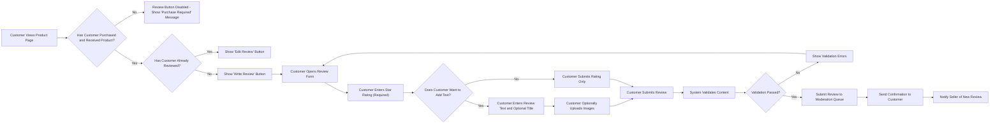
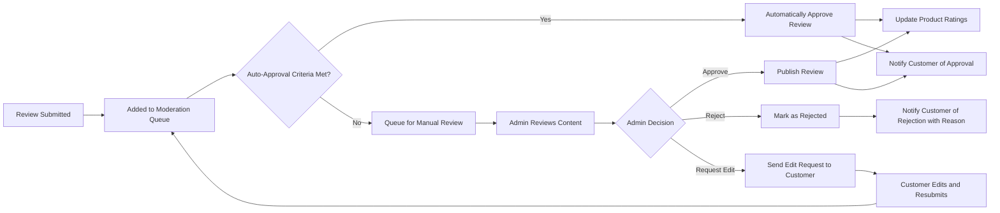

# Product Reviews and Ratings - Requirements Specification

## 1. Overview

### 1.1 Purpose and Business Context

The product review and rating system is a critical component of the e-commerce shopping mall platform that enables customers to share their experiences and provide feedback on purchased products. This system serves multiple business objectives:

- **Trust Building**: Authentic customer reviews build credibility and trust in the marketplace
- **Purchase Decision Support**: Ratings and reviews help potential customers make informed purchasing decisions
- **Seller Accountability**: Reviews provide feedback to sellers about product quality and customer satisfaction
- **Platform Quality Control**: Review data helps identify problematic products or sellers
- **Customer Engagement**: The review system encourages ongoing customer interaction with the platform

The review system integrates closely with the order management system to ensure only verified purchasers can submit reviews, maintaining review authenticity and credibility. All reviews are associated with specific product SKUs and contribute to product-level aggregate ratings displayed throughout the catalog.

### 1.2 System Integration Points

The review system integrates with several core platform components:

- **Order Management**: Validates that reviewers have completed purchases before allowing review submission
- **Product Catalog**: Associates reviews with specific products and SKUs, displays aggregate ratings
- **User Authentication**: Enforces role-based permissions for review submission, moderation, and seller responses
- **Notification System**: Sends notifications to customers about review status and to sellers about new reviews

## 2. User Roles and Permissions

### 2.1 Customer Permissions

**Review Submission**:
- WHEN a customer has received a product from a completed order, THE system SHALL allow the customer to submit one review per product SKU.
- Customers can submit ratings without written reviews (rating-only submissions).
- Customers can edit their own reviews within 30 days of submission.
- Customers can delete their own reviews at any time.

**Review Interaction**:
- Customers can mark other reviews as helpful or not helpful.
- Customers can report reviews that violate platform policies.
- Customers can view all reviews for any product regardless of purchase history.

### 2.2 Seller Permissions

**Seller Response Capabilities**:
- WHEN a review is published for a seller's product, THE system SHALL allow the seller to submit one response per review.
- Sellers can edit their responses within 7 days of submission.
- Sellers can view all reviews for their products with aggregate analytics.
- Sellers cannot delete customer reviews or modify review ratings.

**Review Analytics Access**:
- Sellers can access review statistics for their products including average ratings, review counts, and rating distribution.
- Sellers can filter reviews by rating level and time period for their products.

### 2.3 Admin Permissions

**Full Moderation Control**:
- Admins can approve, reject, or remove any review across the entire platform.
- Admins can remove seller responses that violate policies.
- Admins can override review statuses and manage flagged content.
- Admins can access comprehensive review analytics across all products and sellers.

## 3. Review Submission Requirements

### 3.1 Eligibility Requirements

**Verified Purchase Requirement**:
- THE system SHALL allow review submission ONLY for customers who have received the product in a completed order.
- WHEN a customer attempts to submit a review, THE system SHALL verify the customer has a completed order containing the product with shipping status "delivered".
- IF a customer has not purchased the product, THEN THE system SHALL deny review submission and display message "Only verified purchasers can review this product".

**One Review Per Product Rule**:
- THE system SHALL allow each customer to submit only one review per product SKU.
- WHEN a customer attempts to submit a second review for the same product, THE system SHALL reject the submission and display message "You have already reviewed this product. You can edit your existing review instead."
- Customers can edit their existing review instead of creating a new one.

**Order Completion Timeframe**:
- THE system SHALL allow review submission starting from the moment the order status changes to "delivered".
- There is no time limit for submitting reviews after order delivery - customers can review products months or years after purchase.

### 3.2 Review Content Requirements

**Required Fields**:
- THE system SHALL require a star rating (1-5 stars) for all review submissions.
- Review text content is optional - customers can submit rating-only reviews.

**Optional Fields**:
- Review title (short summary, maximum 100 characters)
- Review text body (detailed feedback, minimum 10 characters, maximum 5,000 characters)
- Product images uploaded by the customer (maximum 5 images per review)

**Content Validation**:
- WHEN a customer includes review text, THE system SHALL require minimum 10 characters to ensure meaningful content.
- THE system SHALL reject reviews exceeding 5,000 characters and display message "Review text cannot exceed 5,000 characters".
- WHEN a customer uploads images, THE system SHALL accept only JPEG, PNG, and WebP formats with maximum 5MB per image.

### 3.3 Review Submission Workflow

**Submission Process**:
- WHEN a verified customer clicks "Write Review", THE system SHALL display a review submission form with star rating selector, optional title field, optional text area, and optional image upload.
- WHEN a customer submits the review form, THE system SHALL validate all content against validation rules before accepting the submission.
- WHEN validation passes, THE system SHALL create the review record with status "pending_moderation" and display confirmation message "Thank you for your review! It will be published after moderation."
- THE system SHALL send an email notification to the customer confirming review submission.

### 3.4 Review Editing Rules

**Edit Timeframe**:
- THE system SHALL allow customers to edit their reviews within 30 days of original submission.
- WHEN a customer attempts to edit a review older than 30 days, THE system SHALL deny the edit and display message "Reviews can only be edited within 30 days of submission".

**Edit Workflow**:
- WHEN a customer edits a review, THE system SHALL allow modification of rating, title, text, and images.
- WHEN a customer saves edited review, THE system SHALL update the review record and set status to "pending_moderation" for re-review.
- THE system SHALL display "edited" badge on reviews that have been modified, showing the last edit date.

**Edit History**:
- THE system SHALL maintain an edit history for each review including original content, edit timestamps, and modified content.
- Only admins can access the complete edit history for moderation purposes.

## 4. Rating System Specifications

### 4.1 Star Rating Scale

**5-Star Rating System**:
- THE system SHALL use a 5-star rating scale where 1 star represents "very poor" and 5 stars represents "excellent".
- THE system SHALL display star ratings as whole numbers (1, 2, 3, 4, or 5) - half-stars are not allowed in customer submissions.
- THE system SHALL display aggregate ratings with decimal precision (e.g., 4.3 stars average).

**Rating Display**:
- Star ratings must be visually represented with filled star icons for clarity.
- The rating scale interpretation guide should be shown on review forms: 1 star = Poor, 2 stars = Fair, 3 stars = Good, 4 stars = Very Good, 5 stars = Excellent.

### 4.2 Aggregate Rating Calculations

**Average Rating Calculation**:
- THE system SHALL calculate the average rating for each product by summing all approved review ratings and dividing by the total number of approved reviews.
- THE system SHALL round average ratings to one decimal place (e.g., 4.3, 3.7).
- WHEN a product has no approved reviews, THE system SHALL display "No reviews yet" instead of a rating.

**Rating Distribution**:
- THE system SHALL calculate the count and percentage of reviews at each star level (1-star, 2-star, 3-star, 4-star, 5-star).
- THE system SHALL display rating distribution as a horizontal bar chart showing the percentage of reviews at each star level.

**Real-Time Updates**:
- WHEN a new review is approved or removed, THE system SHALL immediately recalculate aggregate ratings and distribution.
- THE system SHALL update product catalog displays with the new aggregate rating within seconds.

### 4.3 Rating-Only Submissions

**Quick Rating Feature**:
- THE system SHALL allow customers to submit star ratings without written review text.
- Rating-only submissions contribute to aggregate ratings with the same weight as full text reviews.
- THE system SHALL display rating-only submissions in the review list with format: "[Customer Name] rated this product [X] stars" without review text section.

## 5. Review Validation and Quality Rules

### 5.1 Content Validation Rules

**Prohibited Content Detection**:
- THE system SHALL scan all review submissions for prohibited content including profanity, personal information, external URLs, promotional content, and spam.
- WHEN prohibited content is detected, THE system SHALL flag the review for manual moderation and notify the customer that their review requires admin approval.
- THE system SHALL reject reviews containing obvious spam patterns such as repeated characters, excessive capitalization, or gibberish text.

**Content Quality Requirements**:
- WHEN review text is provided, THE system SHALL require minimum 10 characters to ensure meaningful feedback.
- THE system SHALL reject single-word reviews or reviews consisting only of punctuation marks.
- THE system SHALL encourage detailed reviews by displaying character count and suggesting minimum 50 characters for helpful reviews.

**Language Detection**:
- THE system SHALL detect the primary language of review text to enable language-based filtering and display.
- Reviews in any language are accepted - no language restrictions apply.

### 5.2 Duplicate and Spam Prevention

**Duplicate Review Prevention**:
- THE system SHALL prevent customers from submitting multiple reviews for the same product SKU.
- WHEN a customer attempts duplicate submission, THE system SHALL redirect to their existing review with an "Edit Review" option.

**Spam Detection**:
- THE system SHALL limit review submissions to 5 reviews per customer per day to prevent spam.
- WHEN a customer exceeds this limit, THE system SHALL display message "You have reached the daily review limit. Please try again tomorrow."
- THE system SHALL flag accounts that submit identical or near-identical review text across multiple products for admin investigation.

**Review Bombing Prevention**:
- THE system SHALL monitor for suspicious patterns such as multiple negative reviews for a single product within a short timeframe from new accounts.
- Suspicious patterns should automatically trigger manual moderation review.

### 5.3 Image Validation

**Image Requirements**:
- THE system SHALL accept image uploads in JPEG, PNG, and WebP formats only.
- THE system SHALL enforce maximum file size of 5MB per image.
- THE system SHALL allow maximum 5 images per review.
- THE system SHALL reject images containing inappropriate content, detected through automated content scanning.

**Image Processing**:
- WHEN a customer uploads review images, THE system SHALL automatically resize and optimize images for web display while maintaining aspect ratio.
- THE system SHALL generate thumbnail versions of images for review list displays.

## 6. Review Moderation Workflow

### 6.1 Moderation Queue Management

**Automatic Moderation Queue**:
- WHEN a review is submitted, THE system SHALL automatically add it to the moderation queue with status "pending_moderation".
- THE system SHALL prioritize reviews flagged for prohibited content or suspicious patterns for manual review.
- Reviews without flags can be automatically approved based on configurable rules.

**Auto-Approval Criteria**:
- THE system SHALL automatically approve reviews that meet all of the following criteria:
  - Customer has at least 3 previous approved reviews on the platform
  - No prohibited content detected
  - Not flagged by spam detection systems
  - No customer reports filed against previous reviews
- Auto-approved reviews immediately appear on product pages and contribute to ratings.

**Manual Review Queue**:
- Admins can access the moderation queue showing all pending reviews sorted by submission date.
- Each queue item displays review content, customer information, product details, and any automated flags.

### 6.2 Moderation Actions and Workflow

**Admin Moderation Actions**:
- WHEN an admin reviews a pending review, THE system SHALL provide options to approve, reject, or request edits.
- WHEN an admin approves a review, THE system SHALL publish the review immediately, update aggregate ratings, and send approval notification to the customer.
- WHEN an admin rejects a review, THE system SHALL require a rejection reason from predefined categories (inappropriate content, spam, policy violation, etc.) and notify the customer.
- WHEN an admin requests edits, THE system SHALL send a notification to the customer with specific feedback and allow resubmission.

**Rejection Reasons**:
- Inappropriate or offensive content
- Contains personal information (email, phone number, address)
- Contains external links or promotional content
- Spam or fake review
- Not related to the product
- Violates review guidelines

**Review Removal**:
- Admins can remove published reviews if they are reported and found to violate policies.
- WHEN an admin removes a published review, THE system SHALL recalculate aggregate ratings immediately and optionally notify the customer with the removal reason.

### 6.3 Customer Reporting and Flagging

**Report Review Feature**:
- THE system SHALL allow any customer to report a published review that violates platform policies.
- WHEN a customer reports a review, THE system SHALL require selection of a report reason (offensive content, spam, fake review, not helpful, etc.).
- THE system SHALL add reported reviews to the admin moderation queue for investigation.

**Report Threshold**:
- WHEN a review receives 5 or more reports from different customers, THE system SHALL automatically hide the review from public display pending admin investigation.
- THE system SHALL notify admins when a review reaches the report threshold.

## 7. Review Display and Organization

### 7.1 Product Page Review Display

**Review Section Layout**:
- THE system SHALL display the review section on product detail pages showing aggregate rating summary at the top followed by individual reviews.
- The aggregate rating summary includes: overall average star rating, total review count, and rating distribution chart.

**Aggregate Rating Display**:
- THE system SHALL prominently display the average star rating (e.g., "4.3 out of 5 stars") with visual star representation.
- THE system SHALL show the total number of reviews (e.g., "Based on 247 reviews").
- THE system SHALL display a rating distribution bar chart showing the count and percentage of reviews at each star level (1-5 stars).

**Individual Review Display**:
- Each review displays the following information:
  - Reviewer name (customer's display name)
  - Star rating given
  - Review title (if provided)
  - Review text (if provided)
  - Review submission date or "edited" badge with edit date
  - Verified purchase badge
  - Customer-uploaded images (if any)
  - Helpfulness vote count ("X people found this helpful")
  - Seller response (if exists)

### 7.2 Review Sorting and Filtering

**Sorting Options**:
- THE system SHALL provide the following sorting options for review lists:
  - Most recent (default) - newest reviews first
  - Most helpful - reviews with highest helpful vote count first
  - Highest rating - 5-star reviews first
  - Lowest rating - 1-star reviews first
- WHEN a customer selects a sorting option, THE system SHALL reorder the review list immediately without page reload.

**Filtering Options**:
- THE system SHALL allow customers to filter reviews by star rating (show only 5-star, 4-star, etc.).
- THE system SHALL allow filtering for verified purchase reviews only.
- THE system SHALL allow filtering for reviews with images.
- Multiple filters can be applied simultaneously (e.g., "5-star reviews with images").

**Pagination**:
- THE system SHALL display reviews in pages of 10 reviews per page.
- THE system SHALL provide pagination controls to navigate through multiple pages of reviews.
- The system should display total page count and current page number.

### 7.3 Review Search Functionality

**Review Search**:
- THE system SHALL provide a search box within the review section allowing customers to search review text for specific keywords.
- WHEN a customer searches reviews, THE system SHALL return reviews containing the search term in the title or text body, highlighting matching terms.
- Search results respect applied filters and sorting options.

## 8. Helpful Review Voting System

### 8.1 Vote Submission

**Voting Mechanism**:
- THE system SHALL allow any customer (including those who haven't purchased the product) to mark reviews as helpful or not helpful.
- WHEN a customer clicks "Helpful", THE system SHALL increment the helpful vote count for that review.
- WHEN a customer clicks "Not Helpful", THE system SHALL increment the not-helpful vote count (displayed only to admins, not publicly visible).
- THE system SHALL allow each customer to vote once per review - subsequent votes replace the previous vote.

**Vote Display**:
- THE system SHALL display the helpful vote count beneath each review (e.g., "47 people found this helpful").
- The not-helpful count is tracked internally but not displayed to regular customers to avoid negative sentiment.

### 8.2 Vote Manipulation Prevention

**Vote Validity Rules**:
- THE system SHALL prevent customers from voting on their own reviews.
- THE system SHALL track vote history per customer to prevent repeated vote changes intended to manipulate counts.
- THE system SHALL flag reviews with suspicious voting patterns (e.g., sudden spike in votes from new accounts) for admin investigation.

**Vote Impact on Sorting**:
- WHEN customers sort reviews by "Most Helpful", THE system SHALL rank reviews by net helpful votes (helpful votes minus not-helpful votes).
- Reviews with higher helpful vote counts appear first in "Most Helpful" sorting.

## 9. Verified Purchase Badge System

### 9.1 Badge Display Criteria

**Verified Purchase Verification**:
- THE system SHALL display a "Verified Purchase" badge on all reviews submitted by customers who purchased and received the product through the platform.
- THE system SHALL verify purchase status by checking that the customer has a completed order with status "delivered" containing the product SKU.
- All reviews in the system qualify for the verified purchase badge since only verified purchasers can submit reviews.

**Badge Visual Design**:
- The verified purchase badge should be prominently displayed next to the reviewer name or rating.
- The badge provides a trust indicator to help customers identify authentic reviews from actual purchasers.

### 9.2 Badge Purpose and Trust Building

**Trust Indicators**:
- The verified purchase badge helps customers distinguish between reviews from confirmed buyers versus seller incentivized reviews (which are not allowed in this platform).
- The badge increases review credibility and helps customers make confident purchase decisions.
- Since all reviews are from verified purchasers, the platform maintains high review authenticity.

## 10. Seller Response Functionality

### 10.1 Seller Response Permissions

**Response Eligibility**:
- THE system SHALL allow sellers to respond to reviews of their products.
- WHEN a review is published for a seller's product, THE system SHALL notify the seller and provide a "Respond to Review" option.
- THE system SHALL allow sellers to submit only one response per review.

**Response Restrictions**:
- Sellers can only respond to reviews of products they own - sellers cannot respond to reviews of other sellers' products.
- Sellers cannot delete or modify customer reviews.
- Sellers cannot view customer personal information beyond what is publicly displayed on the review.

### 10.2 Response Submission Workflow

**Response Creation**:
- WHEN a seller clicks "Respond to Review", THE system SHALL display a response form with a text area (maximum 2,000 characters).
- THE system SHALL validate response content for prohibited content and profanity before accepting submission.
- WHEN a seller submits a response, THE system SHALL add the response to the moderation queue with status "pending_moderation".

**Response Moderation**:
- THE system SHALL require admin approval for all seller responses before publication.
- Admins can approve, reject, or request edits to seller responses.
- WHEN a seller response is approved, THE system SHALL publish it beneath the corresponding customer review and notify the seller.

**Response Display**:
- THE system SHALL display approved seller responses directly below the customer review with clear visual distinction (e.g., "Seller Response" label).
- Seller responses show the seller's business name, response text, and response date.

### 10.3 Response Editing Rules

**Edit Timeframe**:
- THE system SHALL allow sellers to edit their responses within 7 days of original submission.
- WHEN a seller edits a response, THE system SHALL require re-moderation before publishing the updated response.

**Edit Restrictions**:
- Sellers cannot delete published responses - they can only edit content within the allowed timeframe.
- After 7 days, responses become locked and cannot be modified.

## 11. Review Analytics and Reporting

### 11.1 Seller Analytics

**Seller Dashboard Metrics**:
- THE system SHALL provide sellers with analytics for their products including:
  - Average star rating per product
  - Total review count per product
  - Rating distribution (count of 1-star, 2-star, 3-star, 4-star, 5-star reviews)
  - Review trends over time (monthly review count and average rating)
  - Most helpful reviews for each product
- Sellers can filter analytics by date range and product.

**Review Insights**:
- Sellers can view common keywords or themes in reviews for their products (positive and negative feedback trends).
- Sellers can identify products with declining ratings that may need quality improvements.

### 11.2 Admin Analytics

**Platform-Wide Analytics**:
- Admins can access comprehensive review analytics across the entire platform including:
  - Total review count across all products
  - Average platform rating
  - Review submission trends over time
  - Moderation queue statistics (pending reviews, approval rate, average moderation time)
  - Top-rated products and sellers
  - Products with the most reviews
  - Flagged review statistics and resolution rates

**Quality Monitoring**:
- Admins can monitor review quality metrics such as average review length, percentage of reviews with images, and helpful vote rates.
- Admins can identify sellers or products with suspicious review patterns for investigation.

## 12. Business Rules and Constraints

### 12.1 Review Ownership and Lifecycle

**Review Ownership**:
- THE system SHALL associate each review with the customer who submitted it, the specific product SKU reviewed, and the order that enabled the review.
- Customers maintain ownership of their reviews and control editing/deletion within allowed timeframes.
- Reviews remain associated with products even if the product is discontinued or removed from the catalog (for historical data).

**Review Visibility**:
- THE system SHALL display only approved reviews on public product pages.
- Pending and rejected reviews are visible only to the review author and admins.
- Customers can view their own review submission history including pending and rejected reviews.

**Review Deletion**:
- WHEN a customer deletes their own review, THE system SHALL remove it from public display and recalculate product aggregate ratings immediately.
- Deleted reviews are soft-deleted (retained in the database for audit purposes) but not displayed anywhere on the platform.
- Admins can permanently delete reviews if required for legal or policy reasons.

### 12.2 Review Notification Requirements

**Customer Notifications**:
- THE system SHALL send email notifications to customers when:
  - Their review is submitted successfully
  - Their review is approved and published
  - Their review is rejected (with reason)
  - A seller responds to their review
  - An admin requests edits to their review
- Customers can opt out of review-related email notifications in their account preferences.

**Seller Notifications**:
- THE system SHALL send email notifications to sellers when:
  - A new review is published for their product
  - A customer edits an existing review of their product
  - Their response is approved or rejected
  - A review for their product receives high visibility (e.g., marked as helpful by many customers)
- Sellers can configure notification preferences in their seller dashboard.

**Admin Notifications**:
- THE system SHALL notify admins when:
  - A review is flagged for prohibited content
  - A review reaches the report threshold (5+ customer reports)
  - A seller response is submitted for moderation
  - Suspicious review patterns are detected

### 12.3 Performance Requirements

**Response Time**:
- WHEN a customer submits a review, THE system SHALL process the submission and display confirmation within 2 seconds.
- WHEN a customer changes review sorting or filtering, THE system SHALL update the display within 1 second.
- Aggregate rating calculations and updates must complete within 5 seconds of review approval or removal.

**Scalability**:
- The system must support thousands of concurrent review submissions during peak shopping periods without performance degradation.
- Product pages with thousands of reviews must load the initial review display within 3 seconds.

**Search Performance**:
- Review search queries must return results within 2 seconds even for products with thousands of reviews.

### 12.4 Data Retention

**Review Data Retention**:
- THE system SHALL retain all approved reviews indefinitely as they provide ongoing value to customers and sellers.
- Rejected reviews should be retained for 90 days for audit purposes, then permanently deleted.
- Deleted reviews (customer-initiated deletion) should be soft-deleted and retained for 1 year before permanent deletion.

**Edit History Retention**:
- THE system SHALL retain complete edit history for all reviews for audit and moderation purposes.
- Edit history is retained for the lifetime of the review.

## 13. Error Handling Scenarios

### 13.1 Review Submission Errors

**Validation Failures**:
- WHEN review text is too short (less than 10 characters), THE system SHALL display error message "Please provide at least 10 characters of feedback to help other customers".
- WHEN review text exceeds 5,000 characters, THE system SHALL display error message "Review text cannot exceed 5,000 characters. Please shorten your review."
- WHEN no star rating is selected, THE system SHALL display error message "Please select a star rating for this product".

**Image Upload Errors**:
- WHEN an uploaded image exceeds 5MB, THE system SHALL display error message "Image file size cannot exceed 5MB. Please upload a smaller image."
- WHEN an unsupported image format is uploaded, THE system SHALL display error message "Only JPEG, PNG, and WebP image formats are supported".
- WHEN a customer attempts to upload more than 5 images, THE system SHALL display error message "You can upload a maximum of 5 images per review".

**Duplicate Submission**:
- WHEN a customer attempts to submit a second review for the same product, THE system SHALL display error message "You have already reviewed this product. You can edit your existing review from your account dashboard."

### 13.2 Permission and Eligibility Errors

**Non-Purchaser Attempt**:
- WHEN a customer who has not purchased a product attempts to write a review, THE system SHALL display error message "Only verified purchasers can review this product. Purchase this product to leave a review."

**Undelivered Order**:
- WHEN a customer who purchased a product but has not received delivery attempts to write a review, THE system SHALL display error message "You can review this product after your order is delivered".

**Edit Timeframe Exceeded**:
- WHEN a customer attempts to edit a review older than 30 days, THE system SHALL display error message "Reviews can only be edited within 30 days of submission. Your review was submitted on [date]."

### 13.3 Voting and Interaction Errors

**Self-Vote Attempt**:
- WHEN a customer attempts to vote on their own review, THE system SHALL prevent the vote and display message "You cannot vote on your own review".

**Daily Review Limit**:
- WHEN a customer exceeds 5 review submissions in one day, THE system SHALL display error message "You have reached the daily review limit of 5 reviews. Please try again tomorrow."

### 13.4 System Failure Scenarios

**Review Submission Failure**:
- IF the review submission fails due to system error, THEN THE system SHALL display user-friendly error message "We're sorry, your review could not be submitted at this time. Please try again later" and log the error for admin investigation.
- THE system SHALL save the customer's review draft locally so they do not lose their written content and can retry submission.

**Rating Calculation Failure**:
- IF aggregate rating calculation fails, THEN THE system SHALL log the error, display the last successfully calculated rating, and retry the calculation automatically.
- Admins are notified of repeated calculation failures for investigation.

**Image Upload Failure**:
- IF image upload fails due to server error, THEN THE system SHALL allow the customer to retry uploading that specific image without losing other form data.

## 14. Integration Requirements

### 14.1 Order System Integration

**Verified Purchase Validation**:
- THE system SHALL query the order management system to verify that a customer has a completed order with status "delivered" for the product before allowing review submission.
- THE system SHALL check the order line items to confirm the specific product SKU matches the product being reviewed.

**Review Eligibility Indicator**:
- Product pages should display "You can review this product" indicator for customers who have received delivery but have not yet submitted a review.

### 14.2 Product Catalog Integration

**Aggregate Rating Display**:
- THE system SHALL provide product aggregate ratings (average star rating and review count) to the product catalog for display on search results and category pages.
- Product catalog pages display aggregate ratings alongside product information.

**Review Link**:
- Product listings should include a link to the review section (e.g., "See all 127 reviews") that navigates to the product detail page review section.

### 14.3 Notification System Integration

**Email Notifications**:
- THE system SHALL integrate with the platform email notification system to send review-related notifications to customers, sellers, and admins.
- All notification content should be customizable through email templates.

**In-App Notifications**:
- Sellers and customers should receive in-app notifications for review events (new reviews, responses, approvals) accessible through their dashboard notification center.

## 15. Review Guidelines and Policies

### 15.1 Customer Review Guidelines

**Content Guidelines**:
- Reviews should focus on product quality, features, performance, and customer experience.
- Reviews should be honest and based on actual product usage.
- Reviews should not contain personal information (email addresses, phone numbers, physical addresses).
- Reviews should not contain profanity, hate speech, or offensive content.
- Reviews should not contain promotional content, external links, or competitor comparisons.
- Reviews should be written in a respectful tone even when expressing negative feedback.

**Prohibited Content**:
- Spam or fake reviews
- Reviews written in exchange for compensation
- Reviews for products not purchased through the platform
- Reviews containing malicious content or misinformation
- Reviews that violate intellectual property rights

### 15.2 Seller Response Guidelines

**Response Best Practices**:
- Seller responses should be professional and respectful.
- Responses should address customer concerns and provide helpful information or solutions.
- Responses should not be defensive or argumentative.
- Responses should not request the customer to delete or modify their review.
- Responses should not contain promotional content or sales pitches.

**Prohibited Response Content**:
- Offensive or unprofessional language
- Personal attacks on customers
- Requests to remove negative reviews
- Offers of compensation in exchange for review modification
- Disclosure of customer personal information

## 16. Future Enhancements (Out of Scope for Initial Release)

The following features are noted for potential future development but are not required for the initial platform launch:

- **Video Reviews**: Allowing customers to upload short video reviews alongside images
- **Review Questions and Answers**: Enabling customers to ask questions on reviews that other customers or sellers can answer
- **Expert Reviews**: Featuring professional or expert reviews alongside customer reviews
- **Review Incentive Programs**: Rewarding customers with loyalty points for submitting helpful reviews
- **Multi-Language Review Translation**: Automatically translating reviews into the customer's preferred language
- **Review Highlighting**: Using AI to extract and highlight key product pros and cons from review text
- **Sentiment Analysis**: Automatically categorizing reviews as positive, neutral, or negative using natural language processing
- **Review Templates**: Providing structured review templates for specific product categories (e.g., electronics with specific attribute ratings)

---

**Document End**

For related documentation, please refer to:
- [User Roles and Authentication](./02-user-roles-authentication.md) - Complete authentication and permission system
- [Product Catalog Management](./03-product-catalog-management.md) - Product structure and catalog organization
- [Order Management and Tracking](./06-order-management-tracking.md) - Order lifecycle and verified purchase validation
- [Business Rules and Workflows](./10-business-rules-workflows.md) - Comprehensive business logic and validation rules
