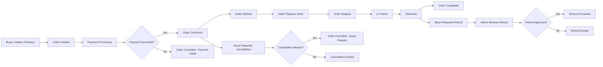
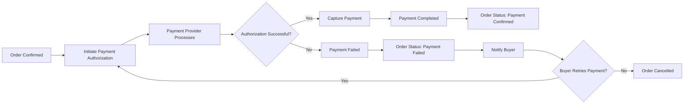
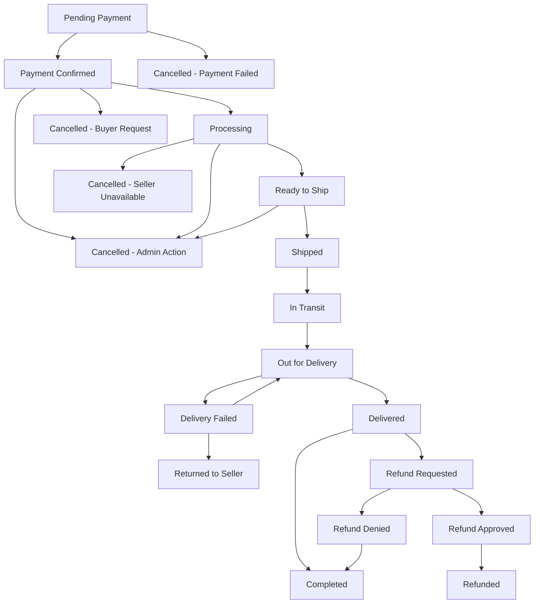

# Order Management Workflow Requirements

## 1. Introduction and Overview

### 1.1 Purpose

This document specifies the complete order management system for the e-commerce shopping mall platform. The order management system is the core business process that transforms shopping cart selections into fulfilled purchases, managing the entire lifecycle from order placement through payment, fulfillment, shipping, and post-order operations including cancellations and refunds.

### 1.2 Business Objectives

The order management system must achieve the following business objectives:

- **Revenue Generation**: Process orders accurately and efficiently to generate platform revenue
- **Customer Satisfaction**: Provide transparent order tracking and flexible cancellation/refund options
- **Seller Success**: Enable sellers to fulfill orders smoothly with clear workflows and notifications
- **Trust Building**: Maintain order accuracy, payment security, and delivery reliability
- **Dispute Minimization**: Reduce conflicts through clear status tracking and automated rules
- **Scalability**: Handle high order volumes during peak shopping periods
- **Financial Integrity**: Ensure accurate payment processing, commission tracking, and refund handling

### 1.3 Order Workflow Summary

The order management workflow consists of several interconnected processes:

1. **Order Placement**: Buyer converts shopping cart into a confirmed order
2. **Payment Processing**: Payment is authorized and captured through payment provider
3. **Order Fulfillment**: Seller prepares and ships the order
4. **Delivery Tracking**: Buyer and seller track shipment until delivery
5. **Order Completion**: Order is marked as delivered and completed
6. **Post-Order Operations**: Cancellations, refunds, and reviews occur after order placement

The system must support orders containing products from multiple sellers, treating each seller's items as a separate sub-order while maintaining a unified buyer experience.



---

## 2. Order Placement Process

### 2.1 Order Creation from Shopping Cart

**THE system SHALL allow buyers to convert their shopping cart into an order through the checkout process.**

**WHEN a buyer initiates checkout, THE system SHALL validate all cart items for availability and pricing accuracy.**

The order placement process transforms the buyer's shopping cart into one or more orders:

- **Single-Seller Orders**: If all cart items belong to one seller, one order is created
- **Multi-Seller Orders**: If cart items belong to multiple sellers, separate sub-orders are created for each seller while maintaining a parent order for the buyer's view
- **Each sub-order**: Contains only items from a single seller and is fulfilled independently

### 2.2 Order Data Capture Requirements

**WHEN creating an order, THE system SHALL capture the following information:**

**Order Identification:**
- Unique order ID (platform-wide unique identifier)
- Sub-order IDs for multi-seller orders (unique per seller portion)
- Order creation timestamp
- Order source (web platform)

**Buyer Information:**
- Buyer account ID
- Buyer name
- Buyer email
- Buyer phone number

**Product Details (per order line item):**
- Product ID
- Product name (captured at order time)
- SKU ID (specific variant)
- SKU attributes (color, size, options - captured at order time)
- Unit price (captured at order time to preserve historical pricing)
- Quantity ordered
- Line item subtotal
- Product image URL (primary image captured at order time)

**Seller Information:**
- Seller account ID
- Seller name
- Seller contact information

**Pricing Breakdown:**
- Subtotal (sum of all line items)
- Shipping cost
- Platform service fee (if applicable to buyer)
- Tax amount (if applicable)
- Discount amount (if coupons or promotions applied)
- Total order amount

**Shipping Information:**
- Delivery address (full address captured at order time)
- Selected shipping method (standard, express, etc.)
- Estimated delivery date range

**Payment Information:**
- Payment method type (credit card, PayPal, etc.)
- Payment transaction ID (from payment provider)
- Payment status

### 2.3 Address and Shipping Method Selection

**WHEN a buyer proceeds to checkout, THE system SHALL require selection of a delivery address.**

**THE system SHALL allow buyers to choose from their saved addresses or enter a new address.**

**WHEN a buyer enters a new address during checkout, THE system SHALL offer to save the address for future orders.**

Address information must include:
- Recipient name
- Phone number
- Street address line 1
- Street address line 2 (optional)
- City
- State/Province
- Postal/ZIP code
- Country

**THE system SHALL display available shipping methods with estimated delivery times and costs.**

Shipping method selection:
- Buyers select one shipping method per seller (in multi-seller orders)
- Shipping cost is calculated based on seller's shipping settings
- Estimated delivery date is calculated from seller's fulfillment time plus carrier transit time

### 2.4 Order Validation Rules

**WHEN a buyer attempts to place an order, THE system SHALL validate the following conditions:**

**Inventory Validation:**
- **WHEN validating inventory, THE system SHALL confirm that each SKU has sufficient stock for the requested quantity.**
- **IF any SKU has insufficient inventory, THEN THE system SHALL prevent order placement and notify the buyer which items are out of stock.**

**Price Validation:**
- **THE system SHALL verify that cart item prices match current product prices.**
- **IF prices have changed since items were added to cart, THEN THE system SHALL notify the buyer and require confirmation to proceed.**

**Address Validation:**
- **THE system SHALL verify that all required address fields are completed.**
- **THE system SHALL validate that the shipping address is deliverable by the selected shipping method.**

**Payment Method Validation:**
- **THE system SHALL verify that a valid payment method is selected.**
- **THE system SHALL confirm that payment method details are complete.**

**Business Rule Validation:**
- **THE system SHALL enforce minimum order amounts if configured by the seller.**
- **THE system SHALL verify that the buyer account is in good standing (not suspended or banned).**
- **THE system SHALL confirm that seller accounts are active and accepting orders.**

### 2.5 Order Creation Confirmation

**WHEN all validations pass, THE system SHALL create the order and reserve inventory for the ordered quantities.**

**WHEN order creation succeeds, THE system SHALL generate a unique order number and display order confirmation to the buyer.**

**WHEN an order is created, THE system SHALL send order confirmation notifications to:**
- Buyer email with order details and tracking information
- Seller notification for each sub-order requiring fulfillment

**THE system SHALL empty the buyer's shopping cart after successful order creation.**

**IF order creation fails due to system error, THEN THE system SHALL preserve the shopping cart and allow the buyer to retry.**

---

## 3. Payment Processing Requirements

### 3.1 Payment Initiation Workflow

**WHEN a buyer confirms order placement, THE system SHALL initiate payment processing immediately.**

The payment processing workflow follows these steps:

1. **Payment Authorization Request**: System sends payment details to payment provider
2. **Authorization Hold**: Payment provider places hold on buyer's payment method
3. **Authorization Response**: Payment provider returns success or failure
4. **Payment Capture**: Upon successful authorization, system captures the payment
5. **Payment Confirmation**: System records payment confirmation and updates order status



### 3.2 Payment Provider Integration Expectations

**THE system SHALL integrate with payment providers to process transactions securely.**

Payment provider integration must support:

- **Credit/Debit Cards**: Visa, Mastercard, American Express, Discover
- **Digital Wallets**: PayPal, Apple Pay, Google Pay
- **Bank Transfers**: Direct bank account payments (where applicable)

**THE system SHALL NOT store sensitive payment information such as full card numbers or CVV codes.**

**THE system SHALL use payment provider tokens to reference payment methods securely.**

**THE system SHALL comply with PCI DSS standards for payment security.**

### 3.3 Payment Status Tracking

**THE system SHALL track payment status independently from order status.**

Payment statuses include:

- **Pending**: Payment authorization initiated but not yet confirmed
- **Authorized**: Payment provider has authorized the transaction and placed hold
- **Captured**: Payment has been captured and funds are being transferred
- **Completed**: Payment funds have been successfully transferred to platform account
- **Failed**: Payment authorization or capture failed
- **Refunded**: Payment has been refunded to buyer (partially or fully)
- **Disputed**: Buyer has disputed the payment with their payment provider

**WHEN payment status changes, THE system SHALL update the corresponding order status accordingly.**

**THE system SHALL record payment status change timestamps and reasons for audit purposes.**

### 3.4 Payment Failure Handling

**IF payment authorization fails, THEN THE system SHALL mark the order as payment failed and notify the buyer.**

**WHEN payment fails, THE system SHALL allow the buyer to retry payment with the same or different payment method.**

**THE system SHALL allow a maximum of 3 payment retry attempts within 24 hours.**

**IF all payment attempts fail within 24 hours, THEN THE system SHALL automatically cancel the order and release reserved inventory.**

Payment failure scenarios:

- **Insufficient Funds**: Buyer's payment method has insufficient balance
- **Declined by Bank**: Buyer's bank declined the transaction
- **Invalid Payment Details**: Payment information is incorrect or expired
- **Fraud Detection**: Payment provider flags transaction as potentially fraudulent
- **Technical Error**: Payment provider or system experiences technical issues

**WHEN payment fails, THE system SHALL provide clear error messages to buyers indicating the failure reason.**

**THE system SHALL log all payment attempts, failures, and retry actions for security monitoring.**

### 3.5 Payment Security Requirements

**THE system SHALL use HTTPS/TLS encryption for all payment-related communications.**

**THE system SHALL tokenize payment methods to avoid storing sensitive card data.**

**THE system SHALL implement fraud detection measures including:**
- Unusual order amount detection
- Multiple failed payment attempts monitoring
- Shipping address and billing address mismatch alerts
- High-risk transaction flagging for manual review

**THE system SHALL require additional authentication (3D Secure, two-factor authentication) for high-value transactions exceeding platform-defined thresholds.**

**WHEN suspicious payment activity is detected, THE system SHALL flag the order for admin review before allowing fulfillment.**

### 3.6 Payment Timeout Rules

**THE system SHALL enforce payment completion timeout rules to prevent indefinite inventory reservation.**

**IF payment authorization is pending for more than 15 minutes, THEN THE system SHALL cancel the payment attempt and release inventory.**

**THE system SHALL notify the buyer when payment timeout occurs and allow order re-submission.**

---

## 4. Order Status Lifecycle

### 4.1 Complete Order Status Definitions

**THE system SHALL track order status through predefined status values representing the order lifecycle.**

Order statuses include:

#### **Pending Payment**
- **Definition**: Order has been created but payment has not been confirmed
- **Entry Condition**: Order created successfully with payment initiated
- **Business Rules**: Inventory is reserved; order is visible to buyer but not yet to seller
- **Automatic Transitions**: Moves to "Payment Confirmed" on successful payment; moves to "Cancelled - Payment Failed" if payment fails

#### **Payment Confirmed**
- **Definition**: Payment has been successfully processed and captured
- **Entry Condition**: Payment provider confirms successful payment capture
- **Business Rules**: Order is now committed; seller is notified; cancellation requires refund processing
- **Automatic Transitions**: None (requires seller action)

#### **Processing**
- **Definition**: Seller has acknowledged the order and begun preparing items for shipment
- **Entry Condition**: Seller accepts the order from their dashboard
- **Business Rules**: Seller is gathering and packing items; buyer cannot cancel without seller approval
- **Automatic Transitions**: None (requires seller action)

#### **Ready to Ship**
- **Definition**: Order is packed and ready for carrier pickup
- **Entry Condition**: Seller marks order as packed and ready
- **Business Rules**: Cancellation requires admin approval; shipping label should be generated
- **Automatic Transitions**: None (requires seller action)

#### **Shipped**
- **Definition**: Order has been handed over to shipping carrier
- **Entry Condition**: Seller provides tracking number and marks as shipped
- **Business Rules**: Order is in transit; buyer can track shipment; cancellation not allowed
- **Automatic Transitions**: None (requires carrier update or manual confirmation)

#### **In Transit**
- **Definition**: Shipping carrier has confirmed receipt and order is being delivered
- **Entry Condition**: Carrier tracking confirms shipment is in transit
- **Business Rules**: Expected delivery date is active; buyer receives tracking updates
- **Automatic Transitions**: Moves to "Delivered" when carrier confirms delivery

#### **Out for Delivery**
- **Definition**: Carrier is attempting delivery today
- **Entry Condition**: Carrier tracking indicates delivery attempt in progress
- **Business Rules**: Buyer should be available to receive package
- **Automatic Transitions**: Moves to "Delivered" on successful delivery or "Delivery Failed" if recipient unavailable

#### **Delivered**
- **Definition**: Carrier has confirmed successful delivery to recipient
- **Entry Condition**: Carrier tracking confirms delivery or buyer confirms receipt
- **Business Rules**: Order completion countdown begins; buyer can submit reviews; refund window opens
- **Automatic Transitions**: Moves to "Completed" after 7 days if no issues reported

#### **Completed**
- **Definition**: Order has been successfully fulfilled with no outstanding issues
- **Entry Condition**: 7 days pass after delivery without refund requests or disputes
- **Business Rules**: Funds are released to seller; order enters history; refund requests require admin review
- **Automatic Transitions**: None (final status)

#### **Cancelled - Buyer Request**
- **Definition**: Buyer requested cancellation and it was approved
- **Entry Condition**: Buyer cancels order before shipment and within cancellation window
- **Business Rules**: Inventory is released; full refund is processed; order removed from seller queue
- **Automatic Transitions**: None (final status)

#### **Cancelled - Payment Failed**
- **Definition**: Order was cancelled due to payment failure
- **Entry Condition**: All payment retry attempts failed or payment timeout occurred
- **Business Rules**: Inventory is released; order visible in buyer's history as failed
- **Automatic Transitions**: None (final status)

#### **Cancelled - Seller Unavailable**
- **Definition**: Seller cannot fulfill the order due to inventory issues or other reasons
- **Entry Condition**: Seller cancels order before shipping
- **Business Rules**: Full refund is processed; buyer is notified; seller performance metrics affected
- **Automatic Transitions**: None (final status)

#### **Cancelled - Admin Action**
- **Definition**: Admin cancelled the order due to fraud, policy violation, or dispute
- **Entry Condition**: Admin manually cancels order
- **Business Rules**: Refund processing depends on admin decision; order flagged for review
- **Automatic Transitions**: None (final status)

#### **Delivery Failed**
- **Definition**: Carrier was unable to deliver the order
- **Entry Condition**: Multiple delivery attempts failed or address undeliverable
- **Business Rules**: Seller and buyer are notified; order may be returned to seller; address update may be attempted
- **Automatic Transitions**: Moves to "Returned to Seller" if package returns or "Out for Delivery" if redelivery attempted

#### **Returned to Seller**
- **Definition**: Package was returned to seller after failed delivery
- **Entry Condition**: Carrier returns package to seller
- **Business Rules**: Seller decides whether to reattempt delivery or issue refund; buyer and seller coordinate
- **Automatic Transitions**: None (requires seller or admin action)

#### **Refund Requested**
- **Definition**: Buyer has requested a refund after delivery
- **Entry Condition**: Buyer submits refund request with reason
- **Business Rules**: Admin reviews request; order is flagged; seller is notified
- **Automatic Transitions**: Moves to "Refund Approved" or "Refund Denied" based on admin decision

#### **Refund Approved**
- **Definition**: Refund request was approved and refund is being processed
- **Entry Condition**: Admin approves refund request
- **Business Rules**: Refund amount is calculated; payment provider processes refund; seller may need to accept return
- **Automatic Transitions**: Moves to "Refunded" when refund completes

#### **Refund Denied**
- **Definition**: Refund request was reviewed and denied
- **Entry Condition**: Admin denies refund request
- **Business Rules**: Order remains completed; buyer is notified of denial reason
- **Automatic Transitions**: None (final status)

#### **Refunded**
- **Definition**: Refund has been successfully processed and funds returned to buyer
- **Entry Condition**: Payment provider confirms refund completion
- **Business Rules**: Order is closed; funds are deducted from seller account; platform commission may be adjusted
- **Automatic Transitions**: None (final status)

### 4.2 Order Status Transition Rules

**THE system SHALL only allow status transitions according to predefined business logic.**

**WHEN an order status changes, THE system SHALL record the timestamp, actor who triggered the change, and reason for the change.**



### 4.3 Status Change Triggers

**Order status changes are triggered by:**

- **Buyer Actions**: Order placement, payment submission, cancellation request, delivery confirmation, refund request
- **Seller Actions**: Order acceptance, preparation completion, shipment dispatch, cancellation
- **Admin Actions**: Manual status override, cancellation, refund approval/denial
- **System Actions**: Payment timeout, automatic completion after delivery period
- **External Systems**: Payment provider confirmation, shipping carrier tracking updates

**THE system SHALL validate that the triggering actor has permission to perform the status change.**

### 4.4 Business Rules Per Status

**WHILE order status is "Pending Payment", THE system SHALL reserve inventory but NOT notify sellers.**

**WHILE order status is "Payment Confirmed", THE system SHALL send order notifications to sellers and allow buyer cancellation with full refund.**

**WHILE order status is "Processing" or "Ready to Ship", THE system SHALL require seller approval for buyer cancellations.**

**WHILE order status is "Shipped", "In Transit", or "Out for Delivery", THE system SHALL NOT allow order cancellation.**

**WHILE order status is "Delivered", THE system SHALL allow buyers to submit product reviews and request refunds within the refund window.**

**WHEN order status reaches "Completed", THE system SHALL release payment funds to seller accounts minus platform commission.**

### 4.5 Status Visibility by Actor

**THE system SHALL display appropriate order status information to each actor type:**

**Buyers can view:**
- All order statuses for their own orders
- Detailed status descriptions and next steps
- Estimated delivery dates
- Tracking information when available
- Cancellation and refund options based on current status

**Sellers can view:**
- All statuses for orders containing their products
- Orders requiring action (Payment Confirmed, Processing)
- Shipment tracking they provided
- Cancellation and refund notifications

**Admins can view:**
- All order statuses across the entire platform
- Status change history and audit trails
- Flagged orders requiring review
- Dispute and refund request queues

**THE system SHALL provide real-time status updates through:**
- Order detail pages
- Email notifications on status changes
- Push notifications for mobile apps (future enhancement)
- Seller dashboard alerts for action-required orders

---

## 5. Order Fulfillment Workflow

### 5.1 Seller Order Notification

**WHEN an order reaches "Payment Confirmed" status, THE system SHALL notify the seller immediately.**

Seller notifications must include:
- Order number and sub-order ID
- Buyer shipping address
- Items to be fulfilled (product names, SKU details, quantities)
- Shipping method selected by buyer
- Expected ship-by date (to meet delivery estimate)
- Order total and seller earnings (after platform commission)

**THE system SHALL deliver notifications through:**
- Email to seller's registered email address
- In-app notification on seller dashboard
- SMS notification if seller has enabled SMS alerts

**THE system SHALL display new orders prominently on the seller dashboard with visual indicators for urgent orders.**

### 5.2 Order Acceptance by Seller

**WHEN a seller views a new order, THE system SHALL allow the seller to accept or reject the order.**

**IF a seller accepts an order, THEN THE system SHALL change order status to "Processing".**

**IF a seller rejects an order, THEN THE system SHALL require the seller to provide a rejection reason.**

Rejection reasons include:
- Out of stock (inventory not available)
- Cannot deliver to address (shipping restrictions)
- Product discontinued
- Other reason (requires text explanation)

**WHEN a seller rejects an order, THE system SHALL:**
- Change order status to "Cancelled - Seller Unavailable"
- Initiate full refund to the buyer
- Notify the buyer with the rejection reason
- Record the rejection in seller performance metrics

**THE system SHALL set an acceptance deadline of 24 hours from order notification.**

**IF a seller does not respond within 24 hours, THEN THE system SHALL send escalation reminders.**

**IF a seller does not respond within 48 hours, THEN THE system SHALL flag the order for admin review and may automatically cancel with refund.**

### 5.3 Order Preparation Process

**WHILE order status is "Processing", THE system SHALL allow sellers to manage preparation tasks.**

Sellers should be able to:
- View picking lists for items to be packed
- Mark individual items as picked
- Print packing slips with order details
- Print shipping labels (if integrated with carrier)
- Add internal notes about preparation

**THE system SHALL display expected ship-by date to ensure sellers meet delivery commitments.**

**THE system SHALL send reminder notifications to sellers if orders approach ship-by date without status update.**

### 5.4 Packing and Ready-to-Ship Status

**WHEN a seller completes packing, THE system SHALL allow the seller to mark the order as "Ready to Ship".**

**WHEN order status changes to "Ready to Ship", THE system SHALL:**
- Notify the buyer that their order is being prepared for shipment
- Update expected delivery timeline
- Prepare the order for carrier handover

**THE system SHALL allow sellers to generate shipping labels from integrated carrier services.**

**THE system SHALL support manual shipping label upload if sellers use external carrier accounts.**

### 5.5 Handover to Shipping Carrier

**WHEN a seller hands the package to the carrier, THE system SHALL require the seller to provide:**
- Tracking number from carrier
- Carrier name/service (e.g., UPS Ground, FedEx Express)
- Ship date
- Package weight and dimensions (optional but recommended)

**WHEN the seller provides tracking information, THE system SHALL:**
- Change order status to "Shipped"
- Notify the buyer with tracking information
- Provide clickable tracking link to carrier's tracking page
- Begin monitoring carrier tracking updates

**THE system SHALL validate tracking number format based on selected carrier.**

**IF tracking number is invalid or not found by carrier, THEN THE system SHALL alert the seller to correct the information.**

---

## 6. Shipping Status Updates

### 6.1 Shipping Status Values

**THE system SHALL track shipping status independently from order status to provide granular tracking.**

Shipping statuses include:

- **Label Created**: Shipping label has been generated but package not yet picked up
- **Picked Up**: Carrier has collected the package from seller
- **In Transit**: Package is moving through carrier network
- **Out for Delivery**: Package is on delivery vehicle for final delivery
- **Delivered**: Package successfully delivered to recipient
- **Delivery Attempted**: Carrier attempted delivery but recipient unavailable
- **Exception**: Carrier encountered an issue (weather delay, damaged package, etc.)
- **Returned to Sender**: Package is being returned to seller

**THE system SHALL update shipping status based on carrier tracking information.**

### 6.2 Tracking Number Management

**THE system SHALL store tracking numbers and associated carrier information for all shipped orders.**

**THE system SHALL provide tracking number visibility to:**
- Buyers in order detail view
- Sellers in order management view
- Admins in order administration view

**THE system SHALL generate clickable tracking links that direct users to the carrier's official tracking page.**

**THE system SHALL support multiple tracking numbers for orders with multiple packages.**

### 6.3 Carrier Integration Expectations

**THE system SHOULD integrate with major carriers to retrieve real-time tracking updates.**

Carrier integrations should support:
- Tracking number validation
- Real-time status updates via webhook or API polling
- Delivery confirmation
- Delivery proof (signature, photo) retrieval
- Exception and delay notifications

**WHEN carrier tracking indicates status change, THE system SHALL update shipping status automatically.**

**THE system SHALL poll carrier tracking APIs periodically for orders in "Shipped" or "In Transit" status.**

**IF carrier integration is unavailable, THEN THE system SHALL allow manual tracking updates by sellers.**

### 6.4 Delivery Confirmation

**WHEN carrier tracking indicates successful delivery, THE system SHALL:**
- Update order status to "Delivered"
- Update shipping status to "Delivered"
- Record delivery date and time
- Notify buyer of successful delivery
- Start the order completion countdown (7 days to report issues)

**THE system SHALL allow buyers to manually confirm delivery if carrier tracking is delayed.**

**WHEN a buyer confirms delivery, THE system SHALL update order status to "Delivered" and record buyer confirmation.**

**THE system SHALL display delivery proof (signature, photo) to buyers if available from carrier.**

### 6.5 Failed Delivery Handling

**IF carrier tracking indicates delivery failure, THEN THE system SHALL:**
- Update order status to "Delivery Failed"
- Update shipping status to "Delivery Attempted"
- Notify both buyer and seller
- Provide carrier's reason for failed delivery
- Display next delivery attempt date if scheduled

**THE system SHALL allow buyers to update delivery address for redelivery attempt if the original address was incorrect.**

**IF multiple delivery attempts fail, THEN THE system SHALL:**
- Update order status to "Returned to Seller"
- Notify seller of incoming return
- Initiate coordination between buyer and seller for resolution
- Allow admin to mediate if buyer and seller cannot agree on resolution

**THE system SHALL allow sellers to choose resolution options for returned packages:**
- Reship to corrected address (buyer may pay additional shipping)
- Issue full refund
- Escalate to admin for dispute resolution

---

## 7. Order Tracking for Buyers

### 7.1 Order History Display Requirements

**THE system SHALL provide buyers with a complete order history view.**

**WHEN a buyer views order history, THE system SHALL display:**
- Orders sorted by date (most recent first)
- Order number and date placed
- Order status badge with visual status indicator
- Total order amount
- Number of items in order
- Primary product image from order
- Quick action buttons (view details, track shipment, cancel, request refund)

**THE system SHALL allow buyers to filter order history by:**
- Order status (all, pending, shipped, delivered, cancelled, refunded)
- Date range (last 30 days, last 6 months, last year, custom range)
- Seller name
- Price range

**THE system SHALL allow buyers to search order history by:**
- Order number
- Product name
- SKU attributes (color, size)

### 7.2 Order Detail View Specifications

**WHEN a buyer views order details, THE system SHALL display complete order information:**

**Order Summary:**
- Order number
- Order date and time
- Current order status with status timeline
- Estimated delivery date (for active orders)
- Actual delivery date (for delivered orders)

**Item Details:**
- Product images
- Product names
- SKU attributes (color, size, options)
- Quantities
- Unit prices
- Line item totals

**Pricing Breakdown:**
- Subtotal
- Shipping cost
- Taxes and fees
- Discounts applied
- Total amount paid

**Shipping Information:**
- Delivery address
- Shipping method
- Tracking number with carrier link
- Shipment status updates timeline

**Payment Information:**
- Payment method used (last 4 digits of card)
- Payment status
- Payment date

**Order Actions:**
- Cancel order button (if cancellation allowed)
- Request refund button (if refund window open)
- Contact seller button
- Download invoice
- Reorder button (for completed orders)

### 7.3 Real-Time Status Visibility

**THE system SHALL display order status in real-time without requiring page refresh.**

**THE system SHALL provide a visual status timeline showing:**
- Completed statuses (with checkmarks and timestamps)
- Current status (highlighted)
- Upcoming statuses (grayed out)

Example status timeline:
```
✅ Order Placed - Nov 14, 2025 2:30 PM
✅ Payment Confirmed - Nov 14, 2025 2:31 PM
✅ Processing - Nov 14, 2025 3:15 PM
✅ Shipped - Nov 15, 2025 10:00 AM
🔵 In Transit - Expected Delivery: Nov 18, 2025
⚪ Delivered
⚪ Completed
```

**THE system SHALL update status timeline automatically when carrier tracking provides updates.**

### 7.4 Shipping Tracking Information

**THE system SHALL provide integrated shipment tracking within the order detail view.**

**WHEN tracking information is available, THE system SHALL display:**
- Current shipment location (city, state)
- Latest tracking event with timestamp
- Complete tracking history timeline
- Carrier name and service level
- Clickable tracking number linking to carrier site
- Estimated delivery date
- Delivery instructions (if provided)

**THE system SHALL refresh tracking information automatically every 4 hours for orders in transit.**

**THE system SHALL allow buyers to manually refresh tracking information.**

### 7.5 Notification Requirements

**THE system SHALL send email notifications to buyers for significant order events:**

**Order Confirmation Email:**
- Sent immediately after order placement
- Contains order number, items ordered, total amount, delivery address
- Includes estimated delivery date

**Payment Confirmation Email:**
- Sent when payment is successfully processed
- Contains payment amount, payment method, transaction ID

**Order Shipped Email:**
- Sent when seller marks order as shipped
- Contains tracking number with clickable link
- Estimated delivery date

**Out for Delivery Email:**
- Sent when carrier indicates delivery attempt scheduled for today
- Reminds buyer to be available for delivery

**Delivery Confirmation Email:**
- Sent when carrier confirms successful delivery
- Invites buyer to review products
- Provides customer service contact if issues exist

**Order Status Change Email:**
- Sent for significant status changes (cancellation, refund approval, etc.)
- Explains the status change and any required buyer actions

**THE system SHALL allow buyers to configure notification preferences (email, SMS, push notifications).**

**THE system SHALL NOT send excessive notifications that may annoy buyers.**

---

## 8. Order Cancellation Rules

### 8.1 Cancellation Eligibility Overview

**THE system SHALL allow order cancellation under specific conditions based on order status and timing.**

Cancellation permissions by actor:
- **Buyers**: Can request cancellation before order ships
- **Sellers**: Can cancel if unable to fulfill (inventory issues, etc.)
- **Admins**: Can cancel any order for policy violations or fraud

**THE system SHALL enforce different cancellation rules based on current order status.**

### 8.2 Buyer Cancellation Rules

**WHILE order status is "Pending Payment", THE system SHALL allow buyers to cancel the order freely.**

**WHEN a buyer cancels during "Pending Payment", THE system SHALL:**
- Mark order as "Cancelled - Buyer Request"
- Release reserved inventory
- Cancel pending payment authorization
- Remove order from seller notification queue

**WHILE order status is "Payment Confirmed", THE system SHALL allow buyers to cancel with automatic approval.**

**WHEN a buyer cancels during "Payment Confirmed", THE system SHALL:**
- Mark order as "Cancelled - Buyer Request"
- Release reserved inventory
- Initiate full refund to buyer's original payment method
- Notify seller of cancellation
- Record cancellation timestamp

**WHILE order status is "Processing" or "Ready to Ship", THE system SHALL allow buyers to request cancellation but require seller approval.**

**WHEN a buyer requests cancellation during "Processing" or "Ready to Ship", THE system SHALL:**
- Send cancellation request to seller
- Display pending cancellation status to buyer
- Give seller 12 hours to approve or deny
- Notify buyer of seller's decision

**IF seller approves cancellation, THEN THE system SHALL process full refund and mark order as cancelled.**

**IF seller denies cancellation, THEN THE system SHALL notify buyer and allow order to proceed to shipment.**

**IF seller does not respond within 12 hours, THEN THE system SHALL automatically approve the cancellation.**

**WHILE order status is "Shipped", "In Transit", "Out for Delivery", or "Delivered", THE system SHALL NOT allow buyer-initiated cancellation.**

**THE system SHALL inform buyers that cancellation is not available once order has shipped.**

### 8.3 Time-Based Cancellation Windows

**THE system SHALL enforce time-based cancellation windows from order placement:**

- **0-1 hour after order placement**: Buyer can cancel immediately without seller notification
- **1-24 hours after order placement**: Buyer can cancel with automatic approval before shipping
- **24+ hours or after "Processing" status**: Buyer cancellation requires seller approval
- **After "Shipped" status**: Cancellation not allowed (buyer must use refund request instead)

**THE system SHALL display remaining cancellation window time to buyers in order detail view.**

Example display:
```
Cancellation available for 3 hours 45 minutes
```

### 8.4 Seller Cancellation Rules

**THE system SHALL allow sellers to cancel orders they cannot fulfill.**

**WHEN a seller initiates cancellation, THE system SHALL require a cancellation reason:**
- Out of stock - inventory not available
- Product discontinued - no longer selling this item
- Cannot ship to address - shipping restrictions apply
- Pricing error - product price was incorrect
- Other reason - requires text explanation

**WHEN a seller cancels an order, THE system SHALL:**
- Mark order as "Cancelled - Seller Unavailable"
- Initiate full automatic refund to buyer
- Notify buyer with cancellation reason
- Record cancellation in seller performance metrics
- Affect seller's reliability score

**THE system SHALL penalize sellers who frequently cancel orders by:**
- Displaying seller reliability rating to buyers
- Lowering seller ranking in search results
- Flagging sellers with high cancellation rates for admin review
- Potentially suspending sellers with excessive cancellations

**THE system SHALL NOT allow seller cancellation after order status reaches "Shipped".**

### 8.5 Admin Cancellation Rules

**THE system SHALL allow admins to cancel any order at any status.**

**WHEN an admin cancels an order, THE system SHALL require:**
- Cancellation reason selection (fraud detected, policy violation, buyer request, seller request, system error, other)
- Optional detailed explanation
- Refund decision (full refund, partial refund, no refund)

**WHEN an admin cancels an order, THE system SHALL:**
- Mark order as "Cancelled - Admin Action"
- Process refund according to admin decision
- Notify both buyer and seller with cancellation reason
- Record admin action in audit log
- Flag accounts if cancellation is due to fraud or policy violation

**THE system SHALL allow admins to override normal cancellation rules in exceptional circumstances.**

### 8.6 Post-Cancellation Actions

**WHEN an order is cancelled, THE system SHALL:**

**Inventory Management:**
- Release reserved inventory quantities back to available stock
- Update SKU inventory counts immediately
- Make products available for other buyers to purchase

**Payment Processing:**
- Cancel payment authorization if payment was not yet captured
- Initiate refund process if payment was captured
- Process refund to buyer's original payment method
- Record refund transaction ID and timestamp

**Notification Requirements:**
- Send cancellation confirmation email to buyer
- Notify seller of cancellation (except for seller-initiated cancellations)
- Provide cancellation reason to all relevant parties
- Include expected refund timeline (typically 5-7 business days)

**Order Record:**
- Maintain cancelled order in order history
- Display cancellation reason and timestamp
- Preserve all order data for audit and analytics purposes
- Allow buyers and sellers to view cancelled order details

**THE system SHALL complete refund processing within 24 hours of cancellation approval.**

**THE system SHALL send refund confirmation email when refund is successfully processed.**

---

## 9. Refund Request Process

### 9.1 Refund Request Initiation

**THE system SHALL allow buyers to request refunds for delivered orders within the refund window.**

**THE system SHALL set the refund request window as 7 days after delivery confirmation.**

**WHEN order status is "Delivered" or "Completed", THE system SHALL display a "Request Refund" button to buyers.**

**WHEN a buyer initiates a refund request, THE system SHALL require:**
- Refund reason selection (from predefined list)
- Detailed explanation of the issue
- Photo evidence (optional but recommended)
- Desired resolution (full refund, partial refund, replacement)

**THE system SHALL change order status to "Refund Requested" when buyer submits a refund request.**

### 9.2 Refund Reasons and Categorization

**THE system SHALL provide predefined refund reason categories:**

**Product Quality Issues:**
- Product defective or damaged
- Product not as described
- Product missing parts or accessories
- Product quality below expectations

**Delivery Issues:**
- Wrong item received
- Item arrived damaged
- Incomplete order (missing items)
- Package never arrived (but marked delivered)

**Buyer Remorse:**
- Changed mind about purchase
- No longer needed
- Found better price elsewhere
- Ordered by mistake

**Compatibility Issues:**
- Product doesn't fit (wrong size)
- Product doesn't work with buyer's setup
- Product incompatible as expected

**Other:**
- Requires detailed text explanation

**THE system SHALL categorize refund requests to help admins prioritize review.**

**THE system SHALL flag high-priority refund reasons (defective product, never arrived) for immediate admin attention.**

### 9.3 Refund Approval Workflow

**WHEN a refund request is submitted, THE system SHALL notify admins for review.**

**THE system SHALL assign refund requests to admin review queue in order of submission.**

**THE system SHALL display refund request details to admins including:**
- Order information (order number, items, amount paid)
- Buyer information and order history
- Seller information and performance metrics
- Refund reason and buyer explanation
- Photo evidence if provided
- Recommended resolution based on platform policies

**THE system SHALL allow admins to take the following actions:**

**Approve Full Refund:**
- Admin approves complete refund of order amount
- System initiates refund to buyer's original payment method
- Order status changes to "Refund Approved"
- Seller is notified and may be required to accept product return

**Approve Partial Refund:**
- Admin approves refund of partial amount
- Admin specifies refund amount and reason for partial refund
- System initiates partial refund
- Order status changes to "Refund Approved"

**Deny Refund:**
- Admin denies refund request
- Admin provides denial reason to buyer
- Order status changes to "Refund Denied"
- Order returns to "Completed" status

**Request More Information:**
- Admin requests additional evidence or explanation from buyer
- System sends notification to buyer requesting information
- Refund review is paused until buyer responds
- Admin sets deadline for buyer response (typically 3 days)

**Escalate to Dispute:**
- Admin escalates to formal dispute resolution process
- Requires mediation between buyer and seller
- May involve third-party dispute resolution

**THE system SHALL require admins to review refund requests within 48 hours of submission.**

**IF admin does not review within 48 hours, THEN THE system SHALL send escalation alerts to senior admins.**

### 9.4 Partial vs Full Refund Rules

**THE system SHALL support both full and partial refunds based on refund circumstances.**

**Full Refund Scenarios (100% of order amount):**
- Product defective or significantly not as described
- Wrong item shipped
- Item never arrived
- Seller requests buyer return product
- Item arrived damaged due to shipping

**Partial Refund Scenarios (percentage of order amount):**
- Minor defect or quality issue (buyer keeps product)
- Missing accessory but main product functional
- Buyer remorse with restocking fee applied
- Product used but returnable under policy
- Shipping cost non-refundable for buyer remorse

**THE system SHALL calculate partial refund amounts based on:**
- Platform refund policies
- Seller return policies
- Refund reason category
- Product condition
- Admin discretion for unique situations

**THE system SHALL deduct return shipping costs from refund amount if return shipping is buyer's responsibility.**

### 9.5 Refund Processing Timeline

**THE system SHALL process approved refunds according to defined timelines:**

**Refund Initiation:**
- **WHEN admin approves refund, THE system SHALL initiate refund processing immediately.**
- **THE system SHALL send refund initiation request to payment provider within 1 hour.**

**Payment Provider Processing:**
- **THE system SHALL track refund status with payment provider.**
- Payment providers typically process refunds in 5-7 business days
- Refund appears on buyer's payment method statement according to their bank's timeline

**Buyer Notification:**
- **WHEN refund is initiated, THE system SHALL notify buyer with expected refund timeline.**
- **WHEN payment provider confirms refund completion, THE system SHALL notify buyer that refund has been processed.**

**Seller Settlement Adjustment:**
- **WHEN refund is approved, THE system SHALL deduct refund amount from seller's pending settlement.**
- **IF seller has already been paid, THE system SHALL deduct from future settlements or request seller to remit funds.**

**THE system SHALL display refund processing status to buyers in order detail view:**
- Refund Requested - Under Review
- Refund Approved - Processing Refund
- Refund Processed - Funds Returning to Payment Method
- Refund Completed - Funds Returned

### 9.6 Refund Status Tracking

**THE system SHALL track refund status throughout the refund lifecycle.**

Refund statuses:
- **Requested**: Buyer submitted refund request, awaiting admin review
- **Under Review**: Admin is reviewing the refund request
- **Information Requested**: Admin requested more information from buyer
- **Approved**: Admin approved refund, processing initiated
- **Processing**: Payment provider is processing refund
- **Completed**: Refund successfully returned to buyer
- **Denied**: Admin denied refund request
- **Cancelled**: Buyer cancelled their refund request

**THE system SHALL allow buyers to view refund status in order detail view.**

**THE system SHALL send email notifications for refund status changes:**
- Refund request received
- Refund approved
- Refund processing
- Refund completed
- Refund denied (with reason)

**THE system SHALL provide refund transaction ID from payment provider for buyer reference.**

### 9.7 Product Return Handling

**IF refund requires product return, THE system SHALL coordinate return process:**

**Return Authorization:**
- **WHEN refund is approved with return required, THE system SHALL generate return authorization number.**
- **THE system SHALL provide return shipping label if platform provides free returns.**
- **THE system SHALL provide seller's return address to buyer.**

**Return Shipping Responsibility:**
- **IF product is defective or incorrect, THEN platform or seller pays return shipping.**
- **IF buyer remorse or non-quality issue, THEN buyer pays return shipping.**

**Return Tracking:**
- **THE system SHALL allow buyer to provide return tracking number.**
- **THE system SHALL monitor return shipment status.**
- **WHEN seller receives returned product, THE system SHALL require seller to confirm receipt and condition.**

**Refund Completion:**
- **WHEN seller confirms receipt of returned product in acceptable condition, THE system SHALL complete refund processing.**
- **IF returned product condition is disputed, THE system SHALL escalate to admin for resolution.**

**Return Window:**
- **THE system SHALL allow 14 days from refund approval for buyer to ship product return.**
- **IF buyer does not ship return within 14 days, THEN THE system SHALL cancel the refund and close the request.**

---

## 10. Order History Requirements

### 10.1 Order History Filtering and Search

**THE system SHALL provide comprehensive filtering options for order history:**

**Filter by Order Status:**
- All orders
- Active orders (pending, processing, shipped, in transit)
- Delivered orders
- Completed orders
- Cancelled orders
- Refunded orders

**Filter by Date Range:**
- Last 30 days
- Last 3 months
- Last 6 months
- Last year
- All time
- Custom date range (buyer selects start and end dates)

**Filter by Seller:**
- **THE system SHALL display a list of sellers from whom the buyer has ordered.**
- **THE system SHALL allow filtering orders to show only orders from selected seller.**

**Filter by Price Range:**
- Under $50
- $50 - $100
- $100 - $200
- $200 - $500
- Over $500
- Custom range (buyer enters min and max)

**Search Functionality:**
- **THE system SHALL provide search box to search order history.**
- **THE system SHALL search across:**
  - Order number
  - Product names
  - Product SKU attributes (color, size)
  - Seller names

**THE system SHALL allow combining multiple filters simultaneously.**

**THE system SHALL persist filter selections during the user's session.**

### 10.2 Order Archival Rules

**THE system SHALL maintain all order records indefinitely for buyer access.**

**THE system SHALL allow buyers to access their complete order history at any time.**

**THE system SHALL NOT delete order records even after completion or cancellation.**

**THE system SHALL archive orders older than 2 years to separate historical database for performance optimization.**

**WHEN accessing archived orders, THE system SHALL retrieve data from historical database with slightly longer load times (acceptable).**

**THE system SHALL maintain the same order detail information for archived orders as for active orders.**

### 10.3 Historical Order Data Retention

**THE system SHALL preserve the following historical data for all orders:**

**Product Information at Time of Order:**
- Product name, description, and images as they appeared when ordered
- SKU attributes and pricing at time of purchase
- Seller information as it existed when ordered

**Pricing Information:**
- Unit prices paid (preserve historical pricing even if current price differs)
- Discounts and promotions applied
- Shipping costs charged
- Tax amounts
- Total amount paid

**Transaction Records:**
- Payment transaction IDs
- Payment method used
- Payment timestamps
- Refund transaction IDs if applicable

**Status History:**
- Complete timeline of status changes
- Timestamps for each status transition
- Actors who triggered status changes

**Communication Records:**
- Notifications sent to buyer
- Refund request details and admin responses
- Cancellation reasons

**THE system SHALL maintain data integrity and accuracy of historical records.**

**THE system SHALL NOT allow modification of historical order data (immutable records).**

### 10.4 Reorder Functionality

**THE system SHALL provide "Reorder" functionality for completed orders.**

**WHEN a buyer clicks "Reorder" on a past order, THE system SHALL:**
- Add all items from that order to the buyer's current shopping cart
- Use current product prices and availability (not historical prices)
- Validate that all products and SKUs are still available
- Notify buyer if any items are no longer available or out of stock
- Allow buyer to modify quantities before checkout

**IF any items from the original order are no longer available, THEN THE system SHALL:**
- Add available items to cart
- Display list of unavailable items to buyer
- Suggest similar products if available

**THE system SHALL allow buyers to reorder individual items from an order rather than the entire order.**

### 10.5 Export Capabilities

**THE system SHALL allow buyers to export their order history data.**

**Export Formats Supported:**
- CSV (Comma-Separated Values) for spreadsheet applications
- PDF for printable records
- JSON for programmatic access

**Export Data Included:**
- Order number and date
- Order status
- Items ordered (product names, SKUs, quantities)
- Prices and totals
- Shipping information
- Payment information (excluding sensitive card details)

**THE system SHALL allow buyers to select date range for export.**

**THE system SHALL generate export file and provide download link.**

**THE system SHALL limit export to 1000 orders per file for performance reasons.**

**IF buyer has more than 1000 orders, THE system SHALL allow multiple exports by date range.**

---

## 11. Business Rules and Constraints

### 11.1 Inventory Reservation During Order

**WHEN a buyer adds items to cart, THE system SHALL NOT reserve inventory.**

**WHEN a buyer initiates checkout, THE system SHALL perform real-time inventory check.**

**WHEN an order is created with "Pending Payment" status, THE system SHALL reserve inventory for the ordered quantities.**

**THE system SHALL hold inventory reservation for 15 minutes during payment processing.**

**IF payment is not completed within 15 minutes, THEN THE system SHALL release reserved inventory and cancel the order.**

**IF inventory becomes unavailable between cart viewing and checkout, THEN THE system SHALL notify buyer and prevent order placement for out-of-stock items.**

**THE system SHALL decrement inventory counts immediately upon successful order placement, not upon shipment.**

**WHEN an order is cancelled, THE system SHALL return reserved quantities to available inventory immediately.**

### 11.2 Payment Timeout Rules

**THE system SHALL enforce strict payment timeout rules to prevent indefinite inventory holds.**

**Payment Authorization Timeout:**
- **THE system SHALL allow 15 minutes for payment authorization to complete.**
- **IF payment provider does not respond within 15 minutes, THEN THE system SHALL cancel the payment attempt and release inventory.**

**Payment Retry Timeout:**
- **THE system SHALL allow 24 hours for buyers to retry failed payments.**
- **THE system SHALL allow maximum 3 payment retry attempts within 24 hours.**
- **IF all payment attempts fail within 24 hours, THEN THE system SHALL cancel the order permanently.**

**Pending Payment Order Timeout:**
- **IF order remains in "Pending Payment" status for more than 1 hour, THEN THE system SHALL send reminder notification to buyer.**
- **IF order remains in "Pending Payment" status for more than 24 hours, THEN THE system SHALL automatically cancel the order.**

### 11.3 Order Modification Restrictions

**THE system SHALL NOT allow modification of order details after order is placed.**

**Buyers cannot modify:**
- Items in the order (add, remove, or change quantities)
- Delivery address (after order confirmation)
- Shipping method
- Payment method (after successful payment)

**IF buyer needs to change order details, THE system SHALL require:**
- Cancelling the current order (if cancellation is allowed)
- Placing a new order with desired changes

**Exception - Address Correction:**
- **WHILE order status is "Payment Confirmed" or "Processing", THE system SHALL allow buyers to request address correction.**
- **THE system SHALL send address correction request to seller for approval.**
- **THE seller SHALL approve or deny address change within 6 hours.**
- **IF address correction significantly increases shipping cost, THE seller may request buyer to pay additional shipping.**

### 11.4 Multi-Seller Order Handling

**WHEN a buyer's cart contains items from multiple sellers, THE system SHALL create separate sub-orders for each seller.**

**THE system SHALL maintain a parent order ID for buyer's unified view.**

**Each sub-order SHALL:**
- Have a unique sub-order ID
- Be fulfilled independently by its respective seller
- Have its own shipping cost based on seller's shipping settings
- Have its own order status lifecycle
- Be trackable separately with distinct tracking numbers

**THE system SHALL display multi-seller orders to buyers as:**
- Single unified order in order summary views
- Expandable to show each seller's sub-order with independent status
- Separate tracking information per sub-order

**THE system SHALL calculate total order amount as:**
- Sum of all sub-order subtotals
- Sum of all sub-order shipping costs
- Platform-level discounts applied to total (if applicable)
- Single payment transaction for buyer convenience

**WHEN buyer cancels a multi-seller order:**
- **IF cancellation occurs before any sub-order ships, THE system SHALL cancel all sub-orders.**
- **IF one sub-order has already shipped, THE buyer SHALL be able to cancel only unshipped sub-orders.**

**WHEN processing refunds for multi-seller orders:**
- **THE system SHALL allow partial refunds for specific sub-orders without affecting other sub-orders.**
- **THE system SHALL calculate refund amounts per sub-order.**

### 11.5 Platform Commission Tracking

**THE system SHALL track platform commission on all orders for revenue management.**

**Commission Calculation:**
- **THE system SHALL calculate platform commission as a percentage of order subtotal (before shipping).**
- **THE system SHALL support different commission rates per product category.**
- **THE system SHALL support different commission rates per seller tier (if tiered seller program exists).**

**Default Commission Rate:**
- **THE system SHALL apply a default commission rate of 15% unless otherwise specified.**

**Commission Deduction:**
- **WHEN order status reaches "Completed", THE system SHALL deduct commission from seller's earnings.**
- **THE system SHALL transfer seller's net earnings (order total minus commission) to seller's account balance.**

**Commission on Cancelled Orders:**
- **WHEN order is cancelled before shipment, THE system SHALL NOT charge commission.**

**Commission on Refunded Orders:**
- **WHEN order is refunded after completion, THE system SHALL refund commission to seller's account.**
- **THE system SHALL adjust platform revenue accordingly.**

**Commission Reporting:**
- **THE system SHALL provide commission reports to sellers showing:**
  - Gross sales amount
  - Commission amount deducted
  - Net earnings
  - Commission rate applied
- **THE system SHALL provide platform-wide commission reports to admins for revenue analysis.**

### 11.6 Order Number Generation Rules

**THE system SHALL generate unique order numbers for all orders.**

**Order Number Format:**
- Format: `ORD-YYYYMMDD-NNNNNN`
- `YYYY`: Year
- `MM`: Month
- `DD`: Day
- `NNNNNN`: Sequential number within the day (000001-999999)

**Example:** `ORD-20251114-000123`

**Sub-Order Number Format (for multi-seller orders):**
- Format: `ORD-YYYYMMDD-NNNNNN-S#`
- `S#`: Sub-order sequence (S1, S2, S3, etc.)

**Example:** `ORD-20251114-000123-S1`, `ORD-20251114-000123-S2`

**THE system SHALL ensure order number uniqueness across the entire platform.**

**THE system SHALL use order numbers for:**
- Buyer order tracking and reference
- Seller order management
- Customer service inquiries
- Invoice generation
- Financial reporting

---

## 12. Error Scenarios and Handling

### 12.1 Payment Failure Recovery

**IF payment authorization fails, THEN THE system SHALL:**
- Display clear error message to buyer indicating failure reason
- Preserve order details and cart contents
- Offer buyer options to retry payment or change payment method
- Maintain inventory reservation for 15 minutes to allow retry
- Log payment failure details for fraud detection analysis

**Payment Failure Error Messages (Buyer-Facing):**

- **Insufficient Funds**: "Your payment method has insufficient funds. Please use a different payment method or add funds to your account."
- **Declined by Bank**: "Your bank declined this transaction. Please contact your bank or try a different payment method."
- **Invalid Payment Details**: "The payment information provided is invalid. Please check your card number, expiration date, and CVV."
- **Fraud Detection**: "This transaction could not be completed for security reasons. Please contact our customer service for assistance."
- **Technical Error**: "We're experiencing technical difficulties processing your payment. Please try again in a few minutes."

**Retry Workflow:**
- **THE system SHALL allow buyer to retry payment immediately after failure.**
- **THE system SHALL allow buyer to change payment method for retry.**
- **THE system SHALL track number of retry attempts to prevent abuse.**
- **IF 3 consecutive payment attempts fail, THE system SHALL require buyer to wait 1 hour before additional attempts.**

**Automatic Order Cancellation:**
- **IF buyer does not successfully complete payment within 24 hours, THE system SHALL automatically cancel the order and release inventory.**
- **THE system SHALL send order cancellation notification to buyer explaining payment timeout.**

### 12.2 Inventory Shortage After Order

**IF inventory becomes insufficient after order placement but before fulfillment, THEN THE system SHALL:**

**Immediate Detection:**
- **THE system SHALL detect inventory shortage when seller attempts to fulfill the order.**
- **THE system SHALL prevent seller from marking order as shipped if inventory is insufficient.**

**Seller Notification:**
- **THE system SHALL notify seller immediately of inventory shortage.**
- **THE system SHALL require seller to take action within 12 hours.**

**Seller Action Options:**
- **Partial Fulfillment**: Ship available quantity and refund buyer for missing items
- **Order Cancellation**: Cancel entire order and issue full refund
- **Delay Shipment**: Wait for inventory restock (requires buyer approval)

**Buyer Notification:**
- **THE system SHALL notify buyer of inventory shortage situation.**
- **THE system SHALL present seller's proposed resolution to buyer for approval.**
- **THE system SHALL allow buyer to accept proposed resolution or request full cancellation.**

**Automatic Resolution:**
- **IF seller does not respond within 12 hours, THE system SHALL automatically cancel the order and issue full refund.**

**Seller Performance Impact:**
- **THE system SHALL record inventory shortage incidents in seller performance metrics.**
- **THE system SHALL penalize sellers with frequent inventory shortages by lowering search ranking.**

### 12.3 Shipping Address Issues

**IF shipping carrier identifies address issues, THEN THE system SHALL:**

**Invalid Address Detection:**
- **WHEN carrier indicates address is invalid or undeliverable, THE system SHALL notify both buyer and seller.**
- **THE system SHALL provide carrier's specific address issue details (e.g., incomplete address, wrong format).**

**Address Correction Workflow:**
- **THE system SHALL allow buyer to submit corrected address.**
- **THE system SHALL send corrected address to seller for approval.**
- **IF seller approves and carrier has not yet attempted delivery, THE seller SHALL update shipping address with carrier.**
- **IF carrier already attempted delivery, THE package may need to be returned and reshipped.**

**Redelivery or Reshipping:**
- **IF address correction requires redelivery, THE system SHALL allow seller to request additional shipping payment from buyer.**
- **THE buyer SHALL approve additional shipping cost or request refund.**

**Undeliverable Address:**
- **IF address cannot be corrected and package is returned to seller, THE system SHALL:**
  - Change order status to "Returned to Seller"
  - Require buyer and seller to coordinate resolution
  - Allow seller to reship to corrected address (buyer pays additional shipping)
  - Allow seller to issue refund minus restocking fee
  - Escalate to admin if buyer and seller cannot agree

### 12.4 Seller Unavailability

**IF seller becomes unavailable to fulfill orders, THE system SHALL protect buyer interests:**

**Seller Account Suspension:**
- **WHEN seller account is suspended by admin, THE system SHALL:**
  - Immediately stop assigning new orders to the seller
  - Identify all pending orders (Payment Confirmed, Processing, Ready to Ship)
  - Notify all affected buyers of seller suspension
  - Offer automatic order cancellation with full refund
  - Escalate in-transit orders to admin for monitoring

**Seller Inactivity:**
- **IF seller does not respond to order notifications within 48 hours, THE system SHALL:**
  - Send escalation alerts to seller
  - Notify buyers of potential delay
  - Offer buyers option to cancel with full refund
  - Flag seller account for admin review

**Seller Account Closure:**
- **IF seller closes their account, THE system SHALL:**
  - Require seller to fulfill all pending orders before account closure
  - Prevent account closure if orders are pending
  - Automatically cancel any remaining orders if seller insists on closure
  - Issue full refunds to all affected buyers
  - Maintain seller data for order history and customer service

**Buyer Protection Guarantee:**
- **THE system SHALL guarantee full refund to buyers if seller fails to fulfill orders due to unavailability.**
- **THE system SHALL prioritize buyer protection over seller interests in seller unavailability scenarios.**

### 12.5 System Error Handling

**WHEN system errors occur during order processing, THE system SHALL:**

**Order Placement Errors:**
- **IF order creation fails due to database error, THE system SHALL:**
  - Not charge buyer's payment method
  - Preserve shopping cart contents
  - Display user-friendly error message: "We're unable to process your order right now. Please try again in a few minutes. Your cart has been saved."
  - Log error details for technical team investigation
  - Allow buyer to retry order placement

**Payment Processing Errors:**
- **IF payment processing encounters technical error, THE system SHALL:**
  - Not deduct funds from buyer
  - Not create order record
  - Display error message: "Payment processing is temporarily unavailable. Please try again shortly."
  - Log payment error for troubleshooting
  - Notify technical team for urgent resolution

**Inventory Update Errors:**
- **IF inventory cannot be decremented after order placement, THE system SHALL:**
  - Still process the order (prioritize buyer experience)
  - Flag order for manual inventory reconciliation
  - Alert admin and seller of inventory discrepancy
  - Prevent overselling by monitoring inventory thresholds

**Status Update Errors:**
- **IF order status cannot be updated, THE system SHALL:**
  - Retry status update automatically (up to 3 attempts)
  - Queue status update for background processing
  - Log error for investigation
  - Notify admin if status update repeatedly fails

**Notification Delivery Errors:**
- **IF email or SMS notification fails, THE system SHALL:**
  - Retry notification delivery (up to 3 attempts)
  - Queue notification for retry with exponential backoff
  - Log notification failure for monitoring
  - Display notification content in user's account dashboard as fallback

**Data Consistency Errors:**
- **IF data inconsistency is detected (e.g., order total doesn't match line items), THE system SHALL:**
  - Flag order for admin review
  - Prevent order from progressing to shipment
  - Notify admin immediately
  - Require manual verification before allowing order to proceed

**General Error Recovery:**
- **THE system SHALL implement automatic retry mechanisms for transient errors.**
- **THE system SHALL maintain transaction logs to enable error recovery and data restoration.**
- **THE system SHALL provide admin tools to manually correct data affected by system errors.**

---

## 13. Performance and Data Requirements

### 13.1 Order Processing Speed Expectations

**THE system SHALL process order operations within defined performance targets to ensure smooth user experience:**

**Order Placement:**
- **WHEN buyer submits order, THE system SHALL complete order creation within 3 seconds.**
- **THE system SHALL display order confirmation page within 2 seconds after payment authorization.**

**Payment Processing:**
- **THE system SHALL initiate payment authorization within 1 second of order submission.**
- **THE system SHALL receive payment provider response within 5 seconds under normal conditions.**
- **THE system SHALL display payment result to buyer within 2 seconds of receiving payment provider response.**

**Order Status Updates:**
- **THE system SHALL update order status within 1 second of status change trigger.**
- **THE system SHALL reflect status changes in buyer and seller dashboards within 5 seconds.**

**Order History Loading:**
- **THE system SHALL load order history page within 2 seconds for lists up to 100 orders.**
- **THE system SHALL load order detail page within 1 second.**

**Search and Filtering:**
- **THE system SHALL return order search results within 2 seconds.**
- **THE system SHALL apply filters to order history within 1 second.**

**Notification Delivery:**
- **THE system SHALL send order confirmation email within 1 minute of order placement.**
- **THE system SHALL send status update notifications within 5 minutes of status change.**

### 13.2 Concurrent Order Handling

**THE system SHALL support high-volume concurrent order processing:**

**Concurrent Order Creation:**
- **THE system SHALL handle at least 1,000 concurrent order placements without performance degradation.**
- **THE system SHALL scale to support peak shopping periods (holidays, sales events) with 10x normal traffic.**

**Inventory Locking:**
- **THE system SHALL use database-level locking to prevent race conditions in inventory management.**
- **THE system SHALL ensure atomic inventory decrements during concurrent order placements for the same SKU.**

**Payment Processing Queue:**
- **THE system SHALL queue payment requests to avoid overwhelming payment provider APIs.**
- **THE system SHALL process payment queue with sufficient throughput to maintain 5-second payment response time.**

**Status Update Processing:**
- **THE system SHALL process status updates asynchronously to avoid blocking user requests.**
- **THE system SHALL use message queue for status change notifications to ensure reliable delivery.**

### 13.3 Data Consistency Requirements

**THE system SHALL maintain strict data consistency for order-related data:**

**Order Data Integrity:**
- **THE system SHALL use database transactions to ensure all order data is saved atomically.**
- **IF any part of order creation fails, THE system SHALL rollback entire order transaction.**
- **THE system SHALL validate data integrity constraints before committing order records.**

**Inventory Consistency:**
- **THE system SHALL ensure inventory counts accurately reflect reserved, sold, and available quantities.**
- **THE system SHALL reconcile inventory daily to detect and correct discrepancies.**
- **THE system SHALL prevent negative inventory counts through database constraints.**

**Payment Consistency:**
- **THE system SHALL ensure payment records match order totals exactly.**
- **THE system SHALL reconcile payment transactions with payment provider daily.**
- **THE system SHALL flag any discrepancies for admin investigation.**

**Order Status Consistency:**
- **THE system SHALL enforce valid status transitions through business logic.**
- **THE system SHALL prevent invalid status changes through application and database constraints.**
- **THE system SHALL maintain complete status change history for audit trails.**

**Cross-System Consistency:**
- **WHEN order status changes affect inventory, THE system SHALL update both order and inventory records in the same transaction.**
- **WHEN payment status changes, THE system SHALL update both payment and order records consistently.**

### 13.4 Audit Trail Specifications

**THE system SHALL maintain comprehensive audit trails for all order-related operations:**

**Order Audit Log:**
- **THE system SHALL record every order status change with:**
  - Timestamp of change
  - Actor who triggered the change (buyer, seller, admin, system)
  - Previous status
  - New status
  - Reason for change (if applicable)
  - IP address of actor (for security)

**Payment Audit Log:**
- **THE system SHALL record all payment transactions with:**
  - Payment attempt timestamp
  - Payment amount
  - Payment method used (masked)
  - Payment provider transaction ID
  - Payment status
  - Success or failure reason

**Inventory Audit Log:**
- **THE system SHALL record inventory changes related to orders:**
  - Order ID that triggered inventory change
  - SKU affected
  - Quantity change (reserved, sold, released)
  - Timestamp of change
  - Resulting inventory level

**Refund Audit Log:**
- **THE system SHALL record refund request and processing details:**
  - Refund request timestamp
  - Buyer's refund reason
  - Admin review timestamp and decision
  - Refund amount
  - Refund processing status changes
  - Refund completion timestamp

**Access Audit Log:**
- **THE system SHALL record access to sensitive order information:**
  - Order views by admins
  - Order modifications or overrides
  - Bulk data exports
  - Admin actions on orders

**Audit Log Retention:**
- **THE system SHALL retain audit logs for minimum 7 years for compliance and dispute resolution.**
- **THE system SHALL make audit logs accessible to authorized admins for investigation.**
- **THE system SHALL protect audit logs from unauthorized modification or deletion.**

**Audit Log Privacy:**
- **THE system SHALL exclude sensitive payment details (full card numbers, CVV) from audit logs.**
- **THE system SHALL comply with data privacy regulations in audit log retention and access.**

---

## 14. Integration Points and Dependencies

### 14.1 Payment Provider Integration

**THE system SHALL integrate with payment providers to process order payments.**

**Required Payment Provider Capabilities:**
- Payment authorization (hold funds)
- Payment capture (complete transaction)
- Payment refund (full and partial)
- Payment status webhooks (real-time updates)
- Payment fraud detection
- 3D Secure authentication for high-value transactions

**THE system SHALL handle payment provider webhooks for:**
- Payment authorization success/failure
- Payment capture confirmation
- Refund completion
- Chargeback notifications
- Fraud alerts

**THE system SHALL retry payment provider API calls on temporary failures with exponential backoff.**

**THE system SHALL log all payment provider communications for troubleshooting and reconciliation.**

### 14.2 Shipping Carrier Integration

**THE system SHALL integrate with shipping carriers for tracking and delivery confirmation.**

**Required Shipping Carrier Capabilities:**
- Tracking number validation
- Real-time tracking status updates
- Delivery confirmation
- Delivery proof retrieval (signature, photo)
- Shipping label generation (optional)
- Shipping rate calculation (optional)

**THE system SHALL poll carrier tracking APIs periodically for active shipments (every 4 hours).**

**THE system SHALL process carrier webhook notifications for real-time tracking updates if available.**

**THE system SHALL handle carrier API failures gracefully and allow manual tracking updates as fallback.**

### 14.3 Inventory Management System

**THE system SHALL maintain real-time synchronization with inventory management:**

**Inventory Operations:**
- Reserve inventory on order placement
- Decrement inventory on payment confirmation
- Release inventory on order cancellation
- Update inventory on refund with product return

**THE system SHALL validate inventory availability in real-time during checkout.**

**THE system SHALL prevent overselling through inventory locking mechanisms.**

**THE system SHALL reconcile inventory counts daily to detect discrepancies.**

### 14.4 Notification Service

**THE system SHALL integrate with notification service for multi-channel communications:**

**Notification Channels:**
- Email notifications (primary)
- SMS notifications (optional, user preference)
- Push notifications (mobile app, future)
- In-app notifications (dashboard alerts)

**THE system SHALL queue notifications for reliable delivery.**

**THE system SHALL retry failed notifications with exponential backoff.**

**THE system SHALL track notification delivery status for monitoring.**

### 14.5 Analytics and Reporting

**THE system SHALL provide order data to analytics systems for business intelligence:**

**Order Metrics:**
- Total orders placed (daily, weekly, monthly)
- Order value (average, total)
- Order status distribution
- Order cancellation rate
- Order refund rate
- Payment success rate

**Performance Metrics:**
- Order processing time
- Payment processing time
- Fulfillment time (order to shipment)
- Delivery time (shipment to delivery)

**Seller Metrics:**
- Orders per seller
- Seller fulfillment speed
- Seller cancellation rate
- Seller customer satisfaction (based on reviews)

**THE system SHALL update analytics data in near real-time (within 5 minutes of events).**

**THE system SHALL provide APIs for external business intelligence tools to access order data.**

---

## 15. Security and Compliance Requirements

### 15.1 Data Privacy and Protection

**THE system SHALL protect sensitive order and payment data according to privacy regulations.**

**Personal Data Protection:**
- **THE system SHALL encrypt personally identifiable information (PII) at rest.**
- **THE system SHALL use HTTPS/TLS for all data transmission.**
- **THE system SHALL mask sensitive data in logs and audit trails.**

**Payment Data Security:**
- **THE system SHALL comply with PCI DSS standards for payment card data.**
- **THE system SHALL NOT store full credit card numbers, CVV codes, or PIN data.**
- **THE system SHALL use payment provider tokens to reference payment methods.**

**Access Control:**
- **THE system SHALL enforce role-based access control for order data.**
- **THE system SHALL allow buyers to access only their own order data.**
- **THE system SHALL allow sellers to access only orders containing their products.**
- **THE system SHALL restrict admin access to authorized personnel only.**

**Data Retention:**
- **THE system SHALL retain order data as required by legal and tax regulations.**
- **THE system SHALL allow buyers to request deletion of personal data in compliance with GDPR/CCPA (while preserving transaction records as legally required).**

### 15.2 Fraud Prevention

**THE system SHALL implement fraud detection and prevention measures:**

**Order Fraud Detection:**
- Unusual order amounts or quantities
- Multiple orders from same buyer in short time
- Shipping address and billing address in different countries
- High-value orders from new accounts
- Multiple failed payment attempts

**Payment Fraud Detection:**
- Card testing (multiple small transactions)
- Stolen card usage patterns
- Velocity checks (too many transactions too quickly)
- Device fingerprinting (unusual devices)

**Fraud Response Actions:**
- **WHEN fraud is suspected, THE system SHALL flag order for admin review.**
- **THE system SHALL delay order fulfillment until admin approval for high-risk orders.**
- **THE system SHALL require additional authentication (phone verification, identity verification) for flagged orders.**

**Seller Fraud Detection:**
- Fake product listings
- Bait-and-switch tactics
- Failure to ship after payment
- Excessive order cancellations

**THE system SHALL monitor seller behavior and flag suspicious patterns for admin investigation.**

### 15.3 Compliance Requirements

**THE system SHALL comply with applicable e-commerce regulations:**

**Consumer Protection Laws:**
- Right to cancel orders within defined time windows
- Right to refund for defective or misrepresented products
- Transparent pricing and fee disclosure
- Clear terms and conditions

**Tax Compliance:**
- Calculate and collect applicable sales tax
- Provide tax receipts and invoices
- Report taxable transactions to authorities

**Data Protection Regulations:**
- GDPR compliance (for EU customers)
- CCPA compliance (for California customers)
- Privacy policy disclosure
- User consent for data processing

**Financial Regulations:**
- Anti-money laundering (AML) monitoring
- Know Your Customer (KYC) for high-value sellers
- Transaction reporting for suspicious activities

**THE system SHALL maintain compliance documentation and audit trails to demonstrate regulatory adherence.**

---

## 16. Conclusion and Summary

This document has specified the comprehensive order management workflow for the e-commerce shopping mall platform, covering the complete order lifecycle from placement through fulfillment, delivery, and post-order operations.

### Key Functional Areas Covered:

1. **Order Placement Process**: Cart to order conversion, validation, and confirmation
2. **Payment Processing**: Secure payment authorization, capture, and failure handling
3. **Order Status Lifecycle**: 18 defined statuses with clear transition rules
4. **Order Fulfillment**: Seller workflows for order acceptance, preparation, and shipment
5. **Shipping Management**: Tracking integration, delivery confirmation, and failed delivery handling
6. **Order Tracking**: Buyer visibility into order status and shipment progress
7. **Order Cancellation**: Time-based and status-based cancellation rules for all actors
8. **Refund Processing**: Request workflow, approval process, and refund execution
9. **Order History**: Comprehensive filtering, search, and data export capabilities
10. **Business Rules**: Inventory reservation, payment timeouts, multi-seller handling, commission tracking
11. **Error Handling**: Recovery processes for payment failures, inventory shortages, address issues, and system errors
12. **Performance Requirements**: Speed expectations, concurrency handling, and data consistency
13. **Integration Points**: Payment providers, shipping carriers, inventory systems, and analytics
14. **Security and Compliance**: Data protection, fraud prevention, and regulatory compliance

### Business Value Delivered:

The order management system enables the platform to:
- **Generate Revenue**: Process orders accurately and securely
- **Build Trust**: Provide transparent tracking and fair refund policies
- **Empower Sellers**: Give sellers tools to fulfill orders efficiently
- **Protect Buyers**: Guarantee refunds and dispute resolution
- **Scale Operations**: Handle high order volumes with automated workflows
- **Ensure Compliance**: Meet legal and regulatory requirements

### Implementation Readiness:

This requirements specification provides backend developers with:
- Complete business requirements in natural language
- Clear EARS-formatted functional requirements
- Detailed workflow descriptions with Mermaid diagrams
- Comprehensive error scenarios and recovery processes
- Performance expectations and data consistency rules
- Integration requirements with external systems

All technical implementation decisions (database schemas, API designs, architecture patterns) are left to the development team's discretion, ensuring developer autonomy while providing complete business context.

**Document Version**: 1.0  
**Last Updated**: November 14, 2025  
**Document Status**: Production-Ready Requirements Specification