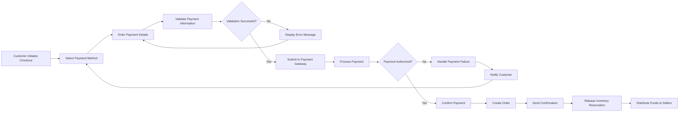

# Payment Processing Requirements

## Introduction and Overview

This document defines the complete payment processing requirements for the e-commerce shopping mall platform. Payment processing is a critical component that enables customers to securely purchase products from multiple sellers while ensuring proper fund distribution, transaction security, and financial compliance.

The payment system must handle the complete transaction lifecycle from payment method selection through final settlement, including successful payments, failed transactions, refunds, and multi-seller payment distribution. All payment operations must maintain the highest security standards while providing a seamless, user-friendly experience.

### Business Context

The payment processing system serves as the financial backbone of the marketplace, enabling:

- **Customer transactions**: Secure purchase completion with multiple payment options
- **Seller revenue**: Automatic payment distribution to sellers after commission deduction
- **Platform revenue**: Commission collection from each transaction
- **Financial integrity**: Complete audit trails and reconciliation capabilities
- **Trust and security**: PCI-compliant payment handling protecting customer financial data

### Integration Points

Payment processing integrates with several other system components:

- **Shopping cart system**: Receives final order totals and item details
- **Order management**: Triggers order creation upon successful payment
- **Inventory system**: Coordinates with stock reservation during payment
- **Notification system**: Sends payment confirmations and failure alerts
- **Seller dashboard**: Provides payment tracking and payout information
- **Admin system**: Enables refund processing and financial oversight

## Payment Method Support

### Supported Payment Methods

THE system SHALL support multiple payment methods to accommodate diverse customer preferences and geographic requirements.

#### Credit and Debit Cards

WHEN a customer selects card payment, THE system SHALL accept major card networks including Visa, MasterCard, American Express, and Discover.

THE system SHALL validate card numbers using the Luhn algorithm before submission to the payment gateway.

WHEN a customer enters card information, THE system SHALL validate expiration dates to ensure cards are not expired.

THE system SHALL require CVV/CVC security codes for all card transactions to enhance security.

#### Digital Wallets

THE system SHALL support popular digital wallet payment methods including PayPal, Apple Pay, Google Pay, and similar services.

WHEN a customer selects digital wallet payment, THE system SHALL redirect to the wallet provider's authentication interface.

WHEN digital wallet authentication completes, THE system SHALL receive payment authorization tokens from the wallet provider.

#### Bank Transfers

WHERE bank transfer payment is enabled, THE system SHALL provide customers with payment instructions including account details and reference numbers.

WHEN a customer selects bank transfer, THE system SHALL generate a unique payment reference number for transaction matching.

THE system SHALL mark bank transfer orders as "pending payment verification" until funds are confirmed.

### Payment Method Validation

WHEN a customer adds a payment method, THE system SHALL validate all required fields are completed correctly.

THE system SHALL verify card expiration dates are in the future (not expired).

WHEN validating card numbers, THE system SHALL check the number matches the expected length for the card type.

THE system SHALL validate billing address postal codes match expected formats for the selected country.

IF payment method validation fails, THEN THE system SHALL display specific error messages indicating which fields need correction.

### Saved Payment Methods

THE system SHALL allow customers to save payment methods securely for future purchases.

WHEN a customer saves a payment method, THE system SHALL store only tokenized payment data, never raw card numbers.

THE system SHALL display saved payment methods with masked numbers showing only the last four digits.

WHEN a customer selects a saved payment method, THE system SHALL require CVV re-entry for card payments to ensure security.

THE system SHALL allow customers to delete saved payment methods from their account at any time.

## Payment Processing Flow

### Standard Payment Flow

The payment process follows a carefully orchestrated sequence to ensure transaction security and proper order creation.

### Step-by-Step Payment Process

#### Step 1: Payment Method Selection

WHEN a customer reaches the payment step in checkout, THE system SHALL display all available payment methods.

THE system SHALL show saved payment methods first, followed by options to add new payment methods.

WHEN a customer selects a payment method, THE system SHALL display the appropriate input form for that method type.

#### Step 2: Payment Information Entry

WHEN a customer enters payment information, THE system SHALL validate each field in real-time as the customer types.

THE system SHALL mask credit card numbers after entry, displaying only the last four digits.

THE system SHALL never log or display CVV/CVC codes in any system interface or log file.

WHEN a customer enters billing address information, THE system SHALL validate address formats for the selected country.

#### Step 3: Payment Validation

WHEN a customer submits payment information, THE system SHALL perform client-side validation before gateway submission.

THE system SHALL check all required fields are completed.

THE system SHALL validate card expiration dates are current.

THE system SHALL verify card numbers pass Luhn algorithm validation.

IF any validation fails, THEN THE system SHALL display specific error messages without submitting to the payment gateway.

#### Step 4: Payment Gateway Submission

WHEN payment information passes validation, THE system SHALL submit the transaction to the payment gateway.

THE system SHALL include the order total, currency, customer information, and payment details in the gateway request.

THE system SHALL generate a unique transaction identifier for tracking purposes.

WHILE waiting for gateway response, THE system SHALL display a loading indicator to the customer with messaging like "Processing your payment securely."

THE system SHALL set a timeout of 60 seconds for payment gateway responses.

#### Step 5: Payment Authorization

WHEN the payment gateway returns an authorization response, THE system SHALL process the result immediately.

IF the payment is authorized, THEN THE system SHALL proceed to order creation.

IF the payment is declined, THEN THE system SHALL handle the failure according to the failed payment handling requirements.

IF the payment requires additional authentication (3D Secure), THEN THE system SHALL redirect the customer to the authentication interface.

#### Step 6: Order Creation and Confirmation

WHEN payment authorization succeeds, THE system SHALL create the order immediately.

THE system SHALL update inventory to reflect the purchased quantities.

THE system SHALL send order confirmation notifications to the customer.

THE system SHALL send new order notifications to all sellers involved in the order.

THE system SHALL display the order confirmation page with order number and delivery estimates.

### User Experience Requirements

WHEN processing payments, THE system SHALL provide clear status updates at each step.

THE system SHALL never display technical error codes to customers; all error messages SHALL be user-friendly and actionable.

WHEN a payment is processing, THE system SHALL prevent duplicate submissions by disabling the payment button.

THE system SHALL complete the entire payment flow and return confirmation within 10 seconds for standard transactions.

WHEN additional authentication is required, THE system SHALL guide customers through the process with clear instructions.

## Payment Gateway Integration Requirements

### Gateway Selection Criteria

The payment gateway integration must meet specific business and technical requirements to ensure reliable, secure payment processing.

#### Required Gateway Capabilities

THE payment gateway SHALL support all required payment methods including major credit cards and digital wallets.

THE payment gateway SHALL provide PCI DSS Level 1 compliance to ensure the highest security standards.

THE payment gateway SHALL support multi-currency transactions for international expansion.

THE payment gateway SHALL offer webhook notifications for asynchronous payment status updates.

THE payment gateway SHALL provide sandbox environments for development and testing.

THE payment gateway SHALL support payment tokenization to secure customer payment data.

#### Integration Requirements

WHEN integrating with the payment gateway, THE system SHALL use server-side integration to protect sensitive payment data.

THE system SHALL never transmit raw credit card data through the client browser to backend servers.

THE system SHALL use the payment gateway's client-side SDK for secure card data collection when available.

WHEN submitting transactions, THE system SHALL include all required metadata including order ID, customer ID, and transaction amount.

### Webhook Handling

THE system SHALL implement webhook endpoints to receive asynchronous payment status updates from the payment gateway.

WHEN a webhook is received, THE system SHALL validate the webhook signature to ensure authenticity.

THE system SHALL process webhooks idempotently to handle duplicate webhook deliveries safely.

WHEN a payment status update is received via webhook, THE system SHALL update the order status accordingly.

IF a webhook indicates payment failure after initial authorization, THEN THE system SHALL cancel the order and restore inventory.

THE system SHALL respond to webhook requests within 5 seconds to prevent gateway retries.

THE system SHALL log all webhook receipts with full payload data for reconciliation and debugging.

### Error Handling and Retry Logic

WHEN a payment gateway request times out, THE system SHALL retry the request up to 2 additional times with exponential backoff.

IF all retry attempts fail, THEN THE system SHALL mark the payment as failed and notify the customer.

WHEN a payment gateway returns an error response, THE system SHALL categorize the error type (network error, validation error, decline, etc.).

THE system SHALL provide appropriate user guidance based on error type (e.g., "Please check your card details" for validation errors).

WHEN network errors occur, THE system SHALL allow customers to retry the payment without re-entering all information.

## Transaction Security Requirements

### PCI DSS Compliance

THE system SHALL never store complete credit card numbers in any database, log file, or system component.

THE system SHALL never store CVV/CVC security codes under any circumstances.

WHEN handling payment data, THE system SHALL use payment gateway tokenization to avoid touching raw card data.

THE system SHALL maintain PCI DSS compliance by minimizing the scope of systems that handle cardholder data.

### Data Encryption

WHEN transmitting payment data, THE system SHALL use TLS 1.2 or higher encryption for all communications.

THE system SHALL encrypt stored payment tokens using industry-standard encryption algorithms.

THE system SHALL use separate encryption keys for different data types and rotate keys according to security policies.

WHEN displaying saved payment methods, THE system SHALL show only masked card numbers (e.g., "**** **** **** 1234").

### Secure Token Handling

WHEN a payment gateway provides a payment token, THE system SHALL store the token securely in the database.

THE system SHALL associate payment tokens only with the customer who created them.

WHEN a customer uses a saved payment method, THE system SHALL verify the token belongs to the authenticated customer.

THE system SHALL invalidate payment tokens immediately when a customer deletes a saved payment method.

### Fraud Prevention Measures

WHEN processing payments, THE system SHALL implement velocity checks to detect suspicious transaction patterns.

THE system SHALL flag orders for review if multiple payment attempts are made within a short time period.

WHEN a customer's billing address differs significantly from their shipping address, THE system SHALL apply additional fraud checks.

THE system SHALL maintain a list of blocked IP addresses, email addresses, and card fingerprints associated with fraudulent activity.

WHERE fraud is suspected, THE system SHALL require additional verification before processing the order.

### 3D Secure Authentication

WHEN a card transaction requires 3D Secure authentication, THE system SHALL redirect the customer to the card issuer's authentication page.

THE system SHALL maintain session state during the 3D Secure redirect flow.

WHEN the customer completes 3D Secure authentication, THE system SHALL receive the authentication result and proceed accordingly.

IF 3D Secure authentication fails, THEN THE system SHALL decline the payment and allow the customer to try a different payment method.

THE system SHALL support both 3D Secure 1.0 and 3D Secure 2.0 protocols for maximum card compatibility.

## Payment Confirmation Process

### Payment Verification

WHEN a payment gateway indicates successful authorization, THE system SHALL verify the authorized amount matches the order total.

THE system SHALL verify the transaction ID provided by the gateway is unique and not previously processed.

WHEN payment verification completes successfully, THE system SHALL mark the payment as confirmed.

THE system SHALL record the payment confirmation timestamp for audit purposes.

### Order Confirmation Triggers

WHEN payment is confirmed, THE system SHALL immediately create the order record with status "Payment Confirmed."

THE system SHALL link the payment transaction ID to the order for reference.

THE system SHALL trigger inventory deduction for all purchased items at the SKU level.

WHEN order creation succeeds, THE system SHALL advance the order status to "Processing" or "Awaiting Fulfillment."

### Customer Notification Requirements

WHEN payment and order confirmation complete, THE system SHALL send a confirmation email to the customer within 1 minute.

THE confirmation email SHALL include the order number, purchased items, payment amount, and estimated delivery date.

THE confirmation email SHALL include a link to track the order status.

THE system SHALL display an order confirmation page immediately after successful payment with order details and next steps.

### Receipt Generation

WHEN an order is confirmed, THE system SHALL generate a digital receipt with complete transaction details.

THE receipt SHALL include the order number, date and time, itemized product list with prices, subtotal, taxes, shipping costs, and total amount paid.

THE receipt SHALL include payment method information (masked card number or payment method type).

THE receipt SHALL include billing and shipping addresses.

THE system SHALL make receipts available for download from the customer's order history.

THE system SHALL allow customers to request receipt re-sends via email.

## Failed Payment Handling

### Payment Failure Scenarios

The system must gracefully handle various payment failure scenarios while guiding customers toward successful completion.

#### Card Declined Scenarios

WHEN a payment gateway declines a card due to insufficient funds, THE system SHALL display a message: "Your card was declined due to insufficient funds. Please try a different payment method."

WHEN a payment is declined due to incorrect card details, THE system SHALL display: "Payment failed. Please verify your card number, expiration date, and security code."

WHEN a card is declined for suspected fraud, THE system SHALL display: "This transaction could not be processed. Please contact your card issuer or try a different payment method."

#### Network and Technical Failures

IF a payment gateway request times out after all retries, THEN THE system SHALL display: "We're experiencing connectivity issues. Your payment was not processed. Please try again."

WHEN a payment gateway returns a system error, THE system SHALL display: "Payment processing is temporarily unavailable. Please try again in a few minutes."

### Error Message Requirements

THE system SHALL display error messages that are clear, actionable, and do not expose technical details.

THE system SHALL never display raw error codes from the payment gateway to customers.

WHEN displaying payment errors, THE system SHALL suggest specific next steps (e.g., "Try a different card" or "Verify your billing address").

THE system SHALL use friendly, reassuring language in error messages to maintain customer confidence.

### Retry Mechanisms

WHEN a payment fails, THE system SHALL allow customers to retry payment immediately without re-entering all checkout information.

THE system SHALL preserve the customer's shopping cart contents during payment failures.

THE system SHALL allow customers to change payment methods after a failure.

WHEN a customer retries payment, THE system SHALL re-validate inventory availability before processing.

### Cart Preservation During Failures

WHEN a payment fails, THE system SHALL maintain the customer's shopping cart exactly as it was.

THE system SHALL preserve any applied discount codes or promotions.

THE system SHALL release temporary inventory reservations after 15 minutes if the customer does not retry payment.

THE system SHALL allow customers to return to their cart from the payment failure page with one click.

### Customer Communication for Failed Payments

WHEN a payment fails, THE system SHALL display an immediate on-screen notification with the failure reason.

THE system SHALL send a payment failure email to the customer if the payment failure occurs after initial submission.

The failure email SHALL include the order items, failure reason, and a link to retry the purchase.

THE system SHALL not send failure emails for validation errors that occur before gateway submission.

## Refund Transaction Processing

### Refund Initiation Rules

THE system SHALL allow customers to request refunds for orders that meet refund eligibility criteria.

THE system SHALL allow sellers to initiate refunds for orders they cannot fulfill.

THE system SHALL allow administrators to process refunds for any order when resolving disputes.

WHEN a refund request is submitted, THE system SHALL validate the order is eligible for refund based on business rules.

### Refund Eligibility

THE system SHALL allow refunds for orders that have not yet shipped within 24 hours of order placement.

THE system SHALL allow refunds for orders where items arrive damaged or defective, with photographic evidence.

THE system SHALL allow refunds for orders that do not match the product description.

THE system SHALL not allow refunds for orders explicitly marked as "final sale" or "non-refundable."

THE system SHALL enforce a refund request window of 30 days from delivery date for standard returns.

### Partial vs Full Refund Handling

WHEN an entire order is being refunded, THE system SHALL process a full refund including product costs, taxes, and shipping fees.

WHEN individual items are being refunded from a multi-item order, THE system SHALL calculate a partial refund for those items.

WHEN processing partial refunds, THE system SHALL recalculate taxes based on the refunded amount.

WHEN processing partial refunds, THE system SHALL not refund shipping costs unless all items are returned.

THE system SHALL allow administrators to process custom refund amounts for dispute resolution.

### Refund Processing Timeline

WHEN a refund is approved, THE system SHALL submit the refund transaction to the payment gateway immediately.

THE system SHALL update the order status to "Refund Processing" upon refund submission.

WHEN the payment gateway confirms refund processing, THE system SHALL update the order status to "Refunded."

THE system SHALL notify customers that refunds typically appear in their account within 5-10 business days depending on their financial institution.

### Refund Status Tracking

THE system SHALL maintain a complete refund history for each order showing refund requests, approvals, and completion.

THE system SHALL track refund amounts, refund dates, refund reasons, and who initiated the refund.

THE system SHALL allow customers to view refund status in their order history.

THE system SHALL allow sellers to view refund status for their orders.

WHEN a refund is completed, THE system SHALL record the refund completion date and payment gateway transaction ID.

### Customer Notification for Refunds

WHEN a refund is approved, THE system SHALL send an email notification to the customer confirming refund approval.

WHEN a refund is processed to the payment gateway, THE system SHALL send an email notification with expected refund timeline.

WHEN a refund is declined, THE system SHALL notify the customer with the decline reason.

THE system SHALL include refund amount, original order number, and refund transaction ID in all refund notifications.

## Payment Record Management

### Transaction Data Storage

THE system SHALL store complete transaction records for all payment attempts including successful and failed transactions.

Each transaction record SHALL include transaction ID, order ID, customer ID, payment method type, amount, currency, timestamp, and status.

THE system SHALL record the payment gateway transaction ID for reconciliation purposes.

THE system SHALL store payment gateway response codes and messages for troubleshooting.

WHEN storing payment data, THE system SHALL never store complete credit card numbers or CVV codes.

### Audit Trail Requirements

THE system SHALL maintain a complete audit trail of all payment-related events including submissions, authorizations, captures, failures, and refunds.

Each audit entry SHALL include timestamp, user or system component that initiated the action, action type, and result.

THE system SHALL log all payment status changes with before and after states.

THE system SHALL maintain audit trails for a minimum of 7 years to meet financial compliance requirements.

THE system SHALL ensure audit logs are immutable and cannot be modified after creation.

### Financial Reporting Data

THE system SHALL aggregate payment data for financial reporting including total sales, refunds, and net revenue.

THE system SHALL calculate daily, weekly, and monthly transaction summaries.

THE system SHALL track transaction volumes by payment method type.

THE system SHALL calculate average transaction values and payment success rates.

THE system SHALL provide transaction data exports in standard formats (CSV, Excel) for accounting purposes.

### Data Retention Policies

THE system SHALL retain complete transaction records for at least 7 years to comply with financial regulations.

THE system SHALL retain payment gateway transaction IDs permanently for reconciliation purposes.

WHEN deleting customer accounts, THE system SHALL retain anonymized transaction records for financial compliance.

THE system SHALL archive transaction data older than 2 years to separate archival storage for performance optimization.

### Transaction History Access

THE system SHALL allow customers to view their complete payment history including successful payments and refunds.

THE system SHALL allow sellers to view payment history for orders associated with their products.

THE system SHALL allow administrators to search and view all transaction records across the platform.

WHEN displaying transaction history, THE system SHALL show masked payment information protecting sensitive data.

THE system SHALL allow filtering transaction history by date range, payment status, and payment method.

## Multi-Seller Payment Distribution

### Payment Splitting Logic

The marketplace handles orders that may contain products from multiple sellers, requiring sophisticated payment distribution logic.

WHEN an order contains products from multiple sellers, THE system SHALL calculate each seller's portion of the payment based on their product subtotals.

THE system SHALL deduct platform commission from each seller's portion before settlement.

WHEN calculating seller payments, THE system SHALL allocate shipping costs to the seller who shipped each item.

THE system SHALL allocate taxes proportionally based on each seller's product subtotal.

### Platform Commission Structure

THE system SHALL apply a configurable commission percentage to each seller's sales.

THE commission percentage SHALL be defined per seller category or individual seller agreement.

WHEN calculating commission, THE system SHALL apply the commission to the product subtotal excluding shipping and taxes.

THE system SHALL track total commission collected for platform revenue reporting.

### Seller Payout Calculations

WHEN an order is delivered and the return window expires, THE system SHALL mark seller payments as "ready for payout."

THE system SHALL calculate each seller's payout as: (product subtotal + shipping revenue) - platform commission.

THE system SHALL aggregate all "ready for payout" amounts for each seller into periodic settlement batches.

THE system SHALL allow sellers to view pending payouts and payout history in their dashboard.

### Settlement Timeline Requirements

THE system SHALL batch seller payouts on a defined schedule (e.g., weekly, bi-weekly, or monthly).

THE system SHALL hold funds for a minimum period (e.g., 14 days) after delivery to account for potential returns.

WHEN the settlement period arrives, THE system SHALL automatically initiate payouts to seller bank accounts.

THE system SHALL notify sellers 2 days before scheduled payout with payout amount and included orders.

WHEN a payout is completed, THE system SHALL send confirmation to sellers with transfer details.

### Payout Methods

THE system SHALL support bank transfer (ACH/wire) as the primary payout method for sellers.

THE system SHALL allow sellers to configure their payout bank account details securely.

THE system SHALL validate bank account information before processing the first payout.

WHERE available, THE system SHALL support instant payout options for sellers who need faster access to funds.

### Seller Payment Tracking

THE system SHALL maintain detailed records of all payments owed to each seller.

Each payment record SHALL include the order ID, product details, sale amount, commission deducted, and net payout amount.

THE system SHALL track payout status through states: pending, ready for payout, payout initiated, payout completed.

THE system SHALL allow sellers to download payout statements showing all transactions included in each payout batch.

THE system SHALL provide year-to-date earning summaries for sellers for tax reporting purposes.

### Handling Refunds in Multi-Seller Orders

WHEN a refund occurs for a multi-seller order, THE system SHALL reverse only the portion related to the refunded seller's items.

THE system SHALL recalculate platform commission based on the adjusted seller payment.

THE system SHALL deduct refunded amounts from the seller's next scheduled payout.

IF a seller's account has insufficient pending payouts to cover a refund, THE system SHALL create a negative balance requiring seller action.

THE system SHALL notify sellers immediately when refunds affect their payout amounts.

## Financial Reconciliation Requirements

### Daily Reconciliation Process

THE system SHALL perform automated daily reconciliation comparing internal transaction records with payment gateway settlement reports.

THE reconciliation process SHALL run automatically at the end of each business day.

WHEN reconciliation completes, THE system SHALL generate a reconciliation report showing total processed payments, refunds, and net settlement.

THE system SHALL flag any discrepancies between internal records and gateway reports for investigation.

### Transaction Matching

THE system SHALL match internal payment records to gateway transactions using transaction IDs.

WHEN a transaction cannot be matched automatically, THE system SHALL flag it for manual review.

THE system SHALL categorize unmatched transactions by type (missing internal record, missing gateway record, amount mismatch).

THE system SHALL track reconciliation status for each transaction (matched, unmatched, under review, resolved).

### Discrepancy Handling

WHEN reconciliation detects a discrepancy, THE system SHALL create a discrepancy record with full transaction details.

THE system SHALL notify finance administrators immediately of any discrepancies exceeding a threshold amount.

THE system SHALL allow administrators to investigate discrepancies and mark them as resolved with notes.

THE system SHALL maintain a history of all discrepancies and their resolutions for audit purposes.

### Financial Reporting Requirements

THE system SHALL generate daily financial summary reports including gross sales, refunds, net sales, and platform commission.

THE system SHALL provide monthly financial reports broken down by seller for payout verification.

THE system SHALL generate tax reports showing total sales and taxes collected by jurisdiction.

THE system SHALL allow exporting financial data in formats compatible with accounting software (QuickBooks, Xero, etc.).

THE system SHALL provide real-time financial dashboards showing key metrics like daily revenue, transaction volume, and payment success rates.

### Accounting System Integration

THE system SHALL support exporting transaction data in standard accounting formats (CSV, QBO, OFX).

THE system SHALL categorize transactions with appropriate accounting codes (sales revenue, refunds, commission income, fees).

THE system SHALL generate journal entries suitable for import into accounting systems.

WHERE direct integration is available, THE system SHALL support automated synchronization with popular accounting platforms.

THE system SHALL maintain a mapping between internal transaction types and accounting categories for consistent reporting.

## Performance and Reliability Requirements

### Payment Processing Performance

WHEN a customer submits a payment, THE system SHALL return a response within 5 seconds under normal conditions.

THE system SHALL process payment gateway requests with a timeout of 60 seconds.

THE system SHALL handle at least 100 concurrent payment transactions without performance degradation.

WHEN load increases during peak shopping periods, THE system SHALL scale to handle up to 1,000 concurrent payment transactions.

### Payment Success Rates

THE system SHALL achieve a payment success rate of at least 98% for valid payment attempts (excluding legitimate card declines).

THE system SHALL monitor payment gateway uptime and switch to backup providers if primary provider availability drops below 99.5%.

WHEN payment failures exceed normal thresholds, THE system SHALL alert administrators for investigation.

### Data Consistency

THE system SHALL ensure payment records and order records remain synchronized at all times.

THE system SHALL use database transactions to ensure payment confirmation and order creation occur atomically.

IF order creation fails after payment authorization, THEN THE system SHALL automatically initiate a refund to prevent payment without order.

THE system SHALL implement idempotency controls to prevent duplicate charges from accidental retry submissions.

### Disaster Recovery

THE system SHALL maintain backup records of all payment transactions in geographically separate data centers.

THE system SHALL be able to recover complete payment transaction history within 4 hours in case of primary database failure.

THE system SHALL maintain webhook processing queues to prevent lost payment status updates during system outages.

## Edge Cases and Special Scenarios

### Expired Cart During Payment

WHEN a customer's cart contains items that go out of stock during the payment process, THE system SHALL detect the inventory conflict before charging payment.

THE system SHALL notify the customer which items are no longer available and adjust the cart accordingly.

THE system SHALL allow the customer to proceed with available items at the adjusted price or cancel the transaction.

### Price Changes During Checkout

WHEN product prices change after a customer adds items to their cart, THE system SHALL honor the price at the time of cart addition for 30 minutes.

WHEN the price lock period expires, THE system SHALL notify customers of price changes before payment submission.

THE system SHALL require customer acknowledgment of price changes before accepting payment.

### Partial Authorization

WHEN a payment gateway returns a partial authorization for less than the requested amount, THE system SHALL decline the transaction.

THE system SHALL not support partial payment or split payment across multiple cards for a single order.

THE system SHALL notify customers that the full amount must be available on a single payment method.

### Currency Conversion

WHERE international sales are supported, THE system SHALL display prices in the customer's local currency.

THE system SHALL process payments in the customer's selected currency when supported by the payment gateway.

THE system SHALL clearly display exchange rates and final charges in the customer's billing currency before payment submission.

WHEN currency conversion is required, THE system SHALL lock exchange rates at the time of order placement to prevent discrepancies.

### Payment Method Expiration

WHEN a saved payment method's expiration date passes, THE system SHALL notify customers to update their payment information.

THE system SHALL prevent customers from using expired saved payment methods.

THE system SHALL allow customers to update expiration dates for saved cards without re-entering full card details.

### Zero-Value Orders

WHEN an order total is zero due to discounts or promotional credits, THE system SHALL bypass payment gateway processing.

THE system SHALL create the order directly and mark it as "paid" with payment method "promotional credit."

THE system SHALL still validate customer information and shipping details for zero-value orders.

---

## Document Navigation

This document is part of a comprehensive requirements analysis for the e-commerce shopping mall platform. Related documents include:

- [Shopping & Checkout Process](./06-shopping-checkout-process.md) - Detailed cart and checkout requirements
- [Order Management & Fulfillment](./07-order-management-fulfillment.md) - Order lifecycle and fulfillment processes
- [Security & Compliance Requirements](./13-security-compliance.md) - Platform security and compliance standards
- [Admin Operations & Management](./15-admin-operations.md) - Administrative oversight and management capabilities

For the complete documentation structure, please refer to the [Table of Contents](./00-toc.md).