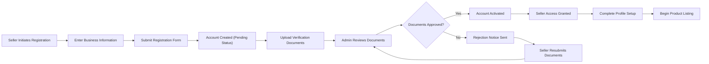
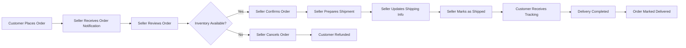

# Seller Management Requirements

## Overview

This document specifies the complete requirements for seller account functionality in the e-commerce shopping mall platform. Sellers are vendor users who list and manage their own products, handle inventory, process orders, and access sales analytics. This document defines all business requirements related to seller operations, from registration through product management, order fulfillment, and financial settlement.

The seller management system is a core component of the marketplace model, enabling multiple independent vendors to operate within a unified platform while maintaining control over their products, inventory, and customer interactions.

## Seller Registration and Onboarding

### Registration Process

THE system SHALL provide a dedicated seller registration flow separate from customer registration.

WHEN a prospective seller initiates registration, THE system SHALL collect the following business information:
- Business name and legal entity name
- Business registration number or tax ID
- Business type (individual, partnership, corporation)
- Business address and contact information
- Primary contact person name, email, and phone number
- Bank account information for payouts
- Business category and product types to be sold

WHEN a seller submits registration information, THE system SHALL validate all required fields are complete and properly formatted.

THE system SHALL validate business registration numbers against acceptable formats for the jurisdiction.

WHEN seller registration is submitted, THE system SHALL create a seller account in pending status.

### Business Verification Requirements

WHEN a seller account is created, THE system SHALL require document verification before activation.

THE system SHALL support upload of the following verification documents:
- Business registration certificate
- Tax registration document
- Identity verification for primary contact
- Bank account verification document

THE system SHALL store uploaded documents securely and associate them with the seller account.

WHEN verification documents are uploaded, THE system SHALL notify administrators for review and approval.

### Onboarding Workflow

### Account Approval Process

THE system SHALL maintain seller accounts in pending status until administrator approval.

WHEN an administrator reviews seller verification documents, THE system SHALL provide options to approve or reject the application.

IF a seller application is approved, THEN THE system SHALL activate the seller account and send approval notification via email.

IF a seller application is rejected, THEN THE system SHALL send rejection notification with reasons and allow resubmission.

WHEN a seller account is activated, THE system SHALL grant access to the seller dashboard and product management tools.

THE system SHALL record the approval date, approving administrator, and any notes in the seller account history.

## Seller Profile Management

### Profile Information Requirements

THE system SHALL maintain a comprehensive seller profile for each seller account containing:
- Store name (publicly displayed)
- Store description and about information
- Business contact information
- Customer service email and phone number
- Business hours and response time expectations
- Return and refund policy
- Shipping policy and processing times

WHEN a seller updates profile information, THE system SHALL validate all required fields are present.

THE system SHALL allow sellers to update their profile information at any time.

### Store Branding and Customization

THE system SHALL allow sellers to upload a store logo image.

THE system SHALL allow sellers to upload a store banner image.

WHEN sellers upload images, THE system SHALL validate file formats (JPEG, PNG, WebP) and size limits (logo: 500KB max, banner: 2MB max).

THE system SHALL provide a store URL slug based on the store name that sellers can customize.

WHEN a seller customizes their store URL slug, THE system SHALL validate uniqueness across all sellers.

THE system SHALL display seller store pages showing their profile, products, ratings, and policies.

### Contact and Support Information

THE system SHALL require sellers to maintain current contact information for customer inquiries.

THE system SHALL display seller response time metrics on store pages based on historical performance.

WHEN customers have questions about seller products, THE system SHALL provide contact methods to reach the seller.

THE system SHALL track seller response times to customer inquiries for performance metrics.

## Product Listing Management

### Creating New Product Listings

THE system SHALL allow sellers to create new product listings for items they wish to sell.

WHEN a seller creates a product listing, THE system SHALL collect the following information:
- Product name (required)
- Product description (required, minimum 50 characters)
- Product category (required, selected from platform categories)
- Product images (required, minimum 1, maximum 10)
- Base price (required)
- Product attributes (color, size, material, etc.)
- Product specifications
- Product tags for searchability

THE system SHALL validate that all required product information is provided before allowing listing creation.

THE system SHALL automatically associate new product listings with the seller's account.

WHEN a seller creates a product listing, THE system SHALL set the initial status to draft.

### Product Variant (SKU) Creation

THE system SHALL allow sellers to create multiple variants for each product with different combinations of attributes.

WHEN a seller defines product variants, THE system SHALL support the following variant attributes:
- Color
- Size
- Material
- Style
- Any custom attribute defined by the seller

THE system SHALL generate unique SKU codes for each product variant automatically.

WHEN a seller creates variants, THE system SHALL allow specification of:
- Variant-specific price adjustments
- Variant-specific inventory quantity
- Variant-specific images
- Variant availability status

THE system SHALL validate that each variant combination is unique within a product.

THE system SHALL allow sellers to add, edit, or remove variants after product creation.

### Product Information Management

THE system SHALL allow sellers to edit product information for their own products at any time.

WHEN a seller edits a product, THE system SHALL validate all changes against product data requirements.

THE system SHALL maintain an edit history for product listings showing who made changes and when.

THE system SHALL allow sellers to update product images, add new images, or remove existing images.

WHEN sellers upload product images, THE system SHALL validate file formats (JPEG, PNG, WebP) and size limits (5MB per image).

THE system SHALL generate multiple image sizes (thumbnail, medium, large) automatically for performance optimization.

### Product Status Control

THE system SHALL support the following product status values:
- Draft: Product not visible to customers, still being prepared
- Active: Product visible and available for purchase
- Inactive: Product not visible to customers, temporarily disabled
- Out of Stock: Product visible but cannot be purchased due to zero inventory

WHEN a seller changes product status to active, THE system SHALL validate that all required information is complete and at least one variant has inventory.

THE system SHALL allow sellers to change product status between draft, active, and inactive.

WHEN all variants of a product have zero inventory, THE system SHALL automatically set product status to out of stock.

WHEN a seller restocks inventory for an out-of-stock product, THE system SHALL automatically change status back to active.

### Bulk Product Operations

THE system SHALL provide bulk operations for sellers to manage multiple products efficiently.

THE system SHALL support bulk operations for:
- Changing product status (activate, deactivate)
- Updating prices by percentage or fixed amount
- Updating inventory quantities
- Assigning products to categories
- Applying promotional tags

WHEN a seller performs bulk operations, THE system SHALL process changes and provide confirmation of successful updates and any errors.

THE system SHALL allow sellers to export their product catalog to CSV format.

THE system SHALL allow sellers to import product updates from CSV files with validation.

## Inventory Management per SKU

### Stock Level Tracking per SKU

THE system SHALL maintain separate inventory quantities for each product variant (SKU).

THE system SHALL track the following inventory metrics per SKU:
- Available quantity: Current stock available for sale
- Reserved quantity: Stock reserved for pending orders
- Total quantity: Available + Reserved
- Sold quantity: Historical total sold

WHEN a customer places an order, THE system SHALL reduce available quantity and increase reserved quantity for the SKUs in the order.

WHEN an order is confirmed and shipped, THE system SHALL reduce reserved quantity.

WHEN an order is cancelled, THE system SHALL return reserved quantity to available quantity.

### Inventory Updates and Adjustments

THE system SHALL allow sellers to update inventory quantities for their SKUs at any time.

WHEN a seller updates inventory quantity, THE system SHALL validate the new quantity is a non-negative integer.

THE system SHALL support inventory adjustments with the following types:
- Restock: Adding new inventory
- Adjustment: Correcting inventory discrepancies
- Damage/Loss: Reducing inventory for damaged or lost items
- Return: Adding inventory from customer returns

WHEN a seller makes an inventory adjustment, THE system SHALL require a reason or note.

THE system SHALL record all inventory adjustments with timestamp, seller user, adjustment type, quantity change, and notes.

### Low Stock Alerts

THE system SHALL allow sellers to configure low stock thresholds for each SKU.

WHEN a SKU's available quantity falls below the configured threshold, THE system SHALL send a low stock alert notification to the seller via email and dashboard notification.

THE system SHALL display low stock warnings prominently in the seller's inventory dashboard.

THE system SHALL allow sellers to configure whether they want low stock alerts enabled per SKU.

### Out-of-Stock Handling

WHEN a SKU's available quantity reaches zero, THE system SHALL mark that variant as out of stock.

WHEN all variants of a product are out of stock, THE system SHALL update the product status to out of stock.

THE system SHALL prevent customers from adding out-of-stock SKUs to their shopping cart.

WHEN a product is out of stock, THE system SHALL display "Out of Stock" status on product pages.

THE system SHALL allow customers to sign up for back-in-stock notifications for out-of-stock products.

WHEN a seller restocks an out-of-stock SKU, THE system SHALL notify customers who requested back-in-stock alerts.

### Inventory History and Audit

THE system SHALL maintain a complete inventory transaction history for each SKU.

THE system SHALL record inventory transactions including:
- Transaction timestamp
- Transaction type (sale, restock, adjustment, return, cancellation)
- Quantity change (positive or negative)
- Resulting quantity after transaction
- Order reference (if applicable)
- User who initiated the transaction
- Notes or reason

THE system SHALL allow sellers to view inventory history for any SKU with filtering by date range and transaction type.

THE system SHALL provide inventory audit reports showing all inventory movements for reconciliation purposes.

## Order Management for Sellers

### Viewing Orders for Seller's Products

THE system SHALL display orders containing the seller's products in the seller's order dashboard.

WHEN an order contains products from multiple sellers, THE system SHALL show each seller only the items relevant to their products.

THE system SHALL provide order filtering by:
- Order status (pending, processing, shipped, delivered, cancelled)
- Date range
- Product or SKU
- Customer name
- Order total amount

THE system SHALL allow sellers to search orders by order number or customer email.

THE system SHALL display order details including:
- Order number and date
- Customer name and shipping address
- Products and SKUs ordered (only seller's items)
- Quantity and price for each item
- Order subtotal for seller's items
- Shipping method and tracking information
- Order status

### Order Processing Workflow

### Shipping and Fulfillment

WHEN a seller receives a new order, THE system SHALL send immediate notification via email and dashboard alert.

THE system SHALL allow sellers to confirm orders they can fulfill.

WHEN a seller confirms an order, THE system SHALL update order status to processing.

THE system SHALL require sellers to provide shipping information including:
- Shipping carrier name
- Tracking number
- Estimated delivery date

WHEN a seller provides shipping information, THE system SHALL validate that tracking number format is valid.

THE system SHALL allow sellers to update shipping information if corrections are needed.

WHEN a seller marks an order as shipped, THE system SHALL send shipping confirmation to the customer with tracking details.

THE system SHALL allow sellers to mark orders as delivered when delivery is confirmed.

### Order Status Updates

THE system SHALL allow sellers to update order status for their products through the following workflow:
- Pending → Processing (when seller confirms order)
- Processing → Shipped (when seller ships the order)
- Shipped → Delivered (when delivery is confirmed)

THE system SHALL send automatic notifications to customers whenever order status changes.

THE system SHALL record all order status changes with timestamp and the seller user who made the change.

### Order Cancellation Handling

WHEN a customer requests order cancellation before shipping, THE system SHALL notify the seller of the cancellation request.

THE system SHALL allow sellers to approve cancellation requests for orders not yet shipped.

WHEN a seller approves a cancellation, THE system SHALL:
- Update order status to cancelled
- Return inventory to available stock
- Initiate refund process
- Notify customer of cancellation confirmation

IF a customer requests cancellation after shipping, THEN THE system SHALL handle it as a return request rather than cancellation.

THE system SHALL allow sellers to cancel orders if they cannot fulfill them due to inventory issues.

WHEN a seller initiates cancellation, THE system SHALL require a cancellation reason.

## Sales Analytics and Reporting

### Sales Performance Metrics

THE system SHALL provide a seller analytics dashboard showing key performance indicators.

THE system SHALL display the following sales metrics:
- Total revenue (daily, weekly, monthly, yearly)
- Total orders processed
- Average order value
- Total items sold
- Revenue trends over time
- Conversion rate (views to purchases)

THE system SHALL allow sellers to select date ranges for analytics views.

THE system SHALL display sales metrics with visual charts and graphs for easy interpretation.

### Revenue Tracking

THE system SHALL track gross revenue (total sales) and net revenue (after platform commission) separately.

THE system SHALL display revenue breakdown by:
- Product category
- Individual products
- Time period (daily, weekly, monthly)
- Payment method

THE system SHALL show pending revenue (orders not yet completed) and confirmed revenue (delivered orders).

### Product Performance Analysis

THE system SHALL provide product-level performance analytics showing:
- Total units sold per product
- Revenue generated per product
- Average rating per product
- Number of reviews per product
- Product views and click-through rate
- Add-to-cart rate
- Purchase conversion rate

THE system SHALL rank products by performance metrics to help sellers identify top performers and underperformers.

THE system SHALL allow sellers to compare product performance across different time periods.

### Customer Insights

THE system SHALL provide customer analytics including:
- Total unique customers who purchased
- Repeat customer rate
- Average customer lifetime value
- Customer geographic distribution
- Customer acquisition trends

THE system SHALL display customer review summaries and sentiment analysis for seller's products.

### Export Capabilities

THE system SHALL allow sellers to export analytics reports to CSV and PDF formats.

THE system SHALL allow export of:
- Sales reports with transaction details
- Product performance reports
- Inventory reports
- Customer order history
- Revenue reports for accounting purposes

WHEN a seller requests a report export, THE system SHALL generate the file and provide download link within 30 seconds.

## Seller Performance Metrics

### Performance Indicators

THE system SHALL calculate and display overall seller performance scores based on multiple factors.

THE system SHALL track the following performance indicators:
- Order fulfillment rate (percentage of orders successfully fulfilled)
- On-time shipping rate (percentage of orders shipped within promised timeframe)
- Order cancellation rate (percentage of orders cancelled by seller)
- Average shipping time (days from order to shipment)
- Response time to customer inquiries
- Customer satisfaction rating

THE system SHALL display performance indicators prominently in the seller dashboard.

THE system SHALL compare seller performance against platform averages to provide context.

### Customer Satisfaction Metrics

THE system SHALL aggregate customer ratings and reviews for all seller's products to calculate overall seller rating.

THE system SHALL display seller rating on a 5-star scale with average score.

THE system SHALL track customer feedback sentiment (positive, neutral, negative) for seller performance assessment.

THE system SHALL allow customers to rate their overall experience with the seller separately from product ratings.

### Fulfillment Metrics

THE system SHALL calculate order fulfillment time as the duration from order placement to shipment.

THE system SHALL track the percentage of orders shipped within 24 hours, 48 hours, and 72 hours.

THE system SHALL calculate order accuracy rate (percentage of orders delivered without issues or returns).

THE system SHALL display fulfillment metrics with trend analysis to show improvement or decline over time.

### Rating and Review Impact

THE system SHALL display the impact of product ratings on sales performance.

THE system SHALL show correlation between average product rating and conversion rates.

THE system SHALL highlight products with declining ratings that may need attention.

THE system SHALL notify sellers when products receive low ratings (below 3 stars) for immediate response.

## Payout and Commission Structure

### Commission Model

THE system SHALL deduct a platform commission from each sale before calculating seller payout.

THE platform commission SHALL be a percentage of the product sale price, configured by administrators.

WHEN a sale is completed, THE system SHALL calculate:
- Gross sale amount (product price × quantity)
- Platform commission (gross sale × commission rate)
- Net payout to seller (gross sale - commission)

THE system SHALL display commission rates clearly to sellers in their dashboard and on product pages.

THE system SHALL allow administrators to configure different commission rates for different product categories.

### Payment Settlement Process

THE system SHALL accumulate seller earnings in a pending payout balance until settlement.

WHEN an order is delivered successfully, THE system SHALL move the net payout amount from pending to available balance.

THE system SHALL maintain the following balance categories for sellers:
- Pending balance: Revenue from orders not yet delivered
- Available balance: Revenue ready for payout
- Paid balance: Total revenue already paid out to seller

THE system SHALL hold funds in pending balance for a configurable hold period (e.g., 7 days after delivery) before making them available for payout.

### Payout Schedules

THE system SHALL process seller payouts on a regular schedule configured by administrators (e.g., weekly, bi-weekly, monthly).

WHEN a payout is processed, THE system SHALL transfer the available balance to the seller's registered bank account.

THE system SHALL send payout confirmation to sellers via email with transaction details.

THE system SHALL maintain a minimum payout threshold (e.g., $50) below which payouts are not processed.

IF a seller's available balance is below the minimum threshold, THEN THE system SHALL carry the balance forward to the next payout period.

### Transaction History

THE system SHALL maintain a complete transaction history for each seller showing:
- Order number and date
- Product and SKU sold
- Sale amount
- Commission deducted
- Net payout amount
- Transaction status (pending, available, paid)
- Payout date (when applicable)

THE system SHALL allow sellers to view transaction history with filtering by date range, status, and product.

THE system SHALL provide transaction search by order number or customer email.

### Financial Reporting

THE system SHALL generate monthly financial statements for sellers showing:
- Total gross sales
- Total commission deducted
- Total net revenue
- Total payouts received
- Current balance (pending + available)
- Transaction breakdown by product

THE system SHALL allow sellers to download financial statements in PDF and CSV formats for accounting purposes.

THE system SHALL provide year-end tax reporting documents showing annual revenue for tax filing.

## Business Rules and Validation

### Seller-Specific Business Rules

THE system SHALL enforce that sellers can only view and manage their own products and orders.

THE system SHALL prevent sellers from viewing or accessing other sellers' products, inventory, or analytics.

WHEN a seller attempts to access resources not owned by them, THE system SHALL deny access and return an authorization error.

THE system SHALL require seller accounts to be in active status to create or edit products.

THE system SHALL prevent creation of duplicate products with identical names and descriptions within a seller's catalog.

THE system SHALL enforce that product prices must be positive numbers greater than zero.

THE system SHALL validate that inventory quantities cannot be negative.

THE system SHALL prevent sellers from shipping orders to addresses outside their configured shipping regions.

### Data Validation Requirements

WHEN a seller enters product information, THE system SHALL validate:
- Product name is between 10 and 200 characters
- Product description is at least 50 characters
- Product price is a valid decimal number with maximum 2 decimal places
- Product images are valid image file formats (JPEG, PNG, WebP)
- SKU codes contain only alphanumeric characters and hyphens

WHEN a seller updates bank account information, THE system SHALL validate:
- Account number format matches standard banking formats
- Routing number is valid
- Account holder name matches seller business name

WHEN a seller provides shipping tracking information, THE system SHALL validate:
- Carrier name is selected from supported carriers
- Tracking number format is valid for the selected carrier

### Error Handling Scenarios

IF a seller attempts to activate a product without complete information, THEN THE system SHALL display specific validation errors for missing fields.

IF a seller tries to update inventory to an invalid value, THEN THE system SHALL reject the update and display an error message explaining the valid range.

IF a seller attempts to confirm an order when inventory is insufficient, THEN THE system SHALL prevent confirmation and display an out-of-stock error.

IF a file upload fails due to file size exceeding limits, THEN THE system SHALL display a clear error message with the maximum allowed size.

IF a payout transfer fails due to invalid bank account information, THEN THE system SHALL notify the seller via email and mark the payout as failed for manual resolution.

WHEN network errors occur during critical operations (order confirmation, inventory updates), THE system SHALL retry the operation automatically up to 3 times before displaying an error to the seller.

IF a seller's account is suspended by administrators, THEN THE system SHALL prevent all product and order management operations and display a suspension notice.

## Related Documents

For complete system context, refer to:
- [User Roles and Authentication](./02-user-roles-authentication.md) - Details on seller authentication and permissions
- [Product Catalog Management](./03-product-catalog-management.md) - Product structure and categorization system
- [Order Management and Tracking](./06-order-management-tracking.md) - Complete order lifecycle and customer-facing order management
- [Service Overview](./01-service-overview.md) - Business model and marketplace strategy

---

**Document Version**: 1.0  
**Last Updated**: 2025-10-13  
**Target Audience**: Backend Development Team  
**Status**: Requirements Specification