# Reviews and Ratings System Requirements

## Introduction and Overview

### Purpose of the Review and Rating System

The review and rating system is a critical trust-building component of the e-commerce shopping mall platform. It enables buyers to share their authentic experiences with products, helping other customers make informed purchase decisions while providing valuable feedback to sellers about product quality and service.

**Strategic Business Objectives:**

**Trust and Transparency**: WHEN buyers read verified purchase reviews, THE system SHALL provide authentic customer feedback that builds confidence in product quality and seller reliability.

**Purchase Decision Support**: THE review system SHALL help buyers evaluate products through aggregated ratings, detailed written feedback, customer photos, and seller responses.

**Seller Accountability**: THE system SHALL create transparency around product quality and seller service, incentivizing sellers to maintain high standards.

**Community Engagement**: THE review system SHALL foster an active buyer community where customers help each other through shared experiences and helpful voting.

**Platform Differentiation**: THE verified purchase requirement SHALL ensure review authenticity superior to platforms allowing unverified reviews.

**Business Value Delivery:**

This system serves multiple strategic purposes:
- **Buyer Confidence**: Authentic reviews from verified purchasers help buyers trust the platform and make confident purchasing decisions
- **Seller Feedback**: Constructive reviews provide sellers with actionable insights to improve products and service quality
- **Platform Transparency**: A robust review system demonstrates the platform's commitment to honest, transparent commerce
- **Product Discovery**: High-rated products gain visibility and credibility, supporting the platform's recommendation algorithms
- **Community Building**: Reviews foster a sense of community where buyers help each other through shared experiences
- **Revenue Impact**: Products with positive reviews convert at higher rates, increasing platform transaction volume and commission revenue

### System Scope

This document specifies the complete review and rating system including:
- Review submission workflows and eligibility rules
- Rating scale and calculation methodologies
- Purchase verification mechanisms ensuring review authenticity
- Content moderation and quality control processes
- Seller response capabilities for customer engagement
- Review display, sorting, and filtering for optimal discovery
- Helpfulness voting system for surfacing valuable reviews
- Statistical aggregation and display of ratings
- Integration with product catalog, order management, and user profiles
- Performance requirements for review operations
- Business rules governing review lifecycle and moderation

### Integration with Platform Workflows

The review system integrates seamlessly with core platform components:

**Product Catalog Integration**: THE system SHALL display aggregate ratings and review counts on product listings, search results, and product detail pages to influence purchase decisions.

**Order Management Integration**: THE system SHALL verify completed purchases before allowing review submission, ensuring all reviews come from verified buyers.

**Buyer Journey Integration**: THE system SHALL send post-purchase review invitations, enable review submission from order history, and display reviews during product discovery.

**Seller Operations Integration**: THE system SHALL notify sellers of new reviews, enable seller responses, and provide review analytics in seller dashboards.

**Admin Oversight Integration**: THE system SHALL route flagged reviews to admin moderation queues and provide tools for content quality management.

### Review System Architecture Overview

```mermaid
graph LR
    A["Buyer Receives Order"] --> B["Order Status: Delivered"]
    B --> C["Review Invitation Email Sent"]
    C --> D["Buyer Submits Review"]
    D --> E["Verify Purchase Validation"]
    E --> F{"Verified Purchase?"}
    F -->|"Yes"| G["Apply Verified Badge"]
    F -->|"No"| H["Reject Review Submission"]
    G --> I["Automatic Content Moderation"]
    I --> J{"Content Passes Checks?"}
    J -->|"Yes"| K["Auto-Approve Review"]
    J -->|"No"| L["Flag for Manual Moderation"]
    L --> M["Admin Reviews Content"]
    M --> N{"Admin Decision"}
    N -->|"Approve"| K
    N -->|"Reject"| O["Notify Buyer of Rejection"]
    K --> P["Publish Review on Product Page"]
    P --> Q["Update Product Ratings"]
    Q --> R["Notify Seller of New Review"]
    R --> S["Seller Submits Response"]
    S --> T["Display Response Below Review"]
```



---

## Review Submission Requirements

### Review Eligibility and Verified Purchase Validation

**REQ-REV-ELIG-001**: WHEN a buyer attempts to submit a review, THE system SHALL validate that the buyer has completed a verified purchase of the product.

**REQ-REV-ELIG-002**: THE system SHALL define a verified purchase as:
- An order containing the specific product SKU variant being reviewed
- Order status is "delivered" or "completed"
- Order has not been fully refunded or cancelled
- The authenticated buyer submitting the review matches the order buyer account
- The purchase was made through the platform

**REQ-REV-ELIG-003**: WHEN a buyer has not purchased the product being reviewed, THE system SHALL prevent review submission and display a message: "Only verified buyers who have purchased this product can submit reviews."

**REQ-REV-ELIG-004**: THE system SHALL allow review submission immediately after order delivery confirmation.

**REQ-REV-ELIG-005**: THE system SHALL NOT impose a time limit on review submission - buyers may review products at any time after delivery, including years later.

**REQ-REV-ELIG-006**: THE system SHALL maintain purchase verification indefinitely for all completed orders to support unlimited review submission timeframes.

**REQ-REV-ELIG-007**: THE system SHALL NOT allow review submission from:
- Unauthenticated users or guest checkouts
- Buyers who cancelled orders before delivery
- Buyers who received full refunds for products
- Buyers who have not yet received the product (order still in transit)
- Sellers reviewing their own products
- Admin users attempting to pose as buyers

**REQ-REV-ELIG-008**: WHERE a buyer returns a product and receives a full refund, THE system SHALL revoke review eligibility and hide any previously submitted reviews for that purchase.

**REQ-REV-ELIG-009**: WHERE a buyer receives a partial refund, THE system SHALL maintain review eligibility and verified purchase status.

### One Review Per Purchase Rule

**REQ-REV-ONE-001**: THE system SHALL enforce a one-review-per-purchase-per-buyer limitation.

**REQ-REV-ONE-002**: WHEN a buyer has already submitted a review for a specific product purchase, THE system SHALL prevent submission of additional reviews for the same purchase transaction.

**REQ-REV-ONE-003**: WHEN a buyer attempts to submit a duplicate review, THE system SHALL display a message: "You have already reviewed this purchase. Would you like to edit your existing review?"

**REQ-REV-ONE-004**: WHEN a buyer purchases the same product multiple times in separate transactions, THE system SHALL allow one review per separate purchase.

**REQ-REV-ONE-005**: THE system SHALL distinguish between reviews from different purchases of the same product in the buyer's review history.

**REQ-REV-ONE-006**: THE system SHALL count each verified purchase review towards the product's total review count.

**REQ-REV-ONE-007**: WHERE a buyer purchases a product with different variant options (different color or size), THE system SHALL treat each variant purchase as an independent eligible review opportunity.

### Review Submission Workflow

**REQ-REV-SUBMIT-001**: WHEN a buyer accesses the review submission interface, THE system SHALL present a form requiring:
- Star Rating (required): 1 to 5 stars
- Review Title (optional): Maximum 100 characters
- Review Body (optional): Minimum 10 characters, maximum 5,000 characters
- Review Images (optional): Up to 5 product images, maximum 5MB per image, accepted formats: JPEG, PNG, WebP

**REQ-REV-SUBMIT-002**: WHEN a buyer submits only a star rating without written content, THE system SHALL:
- Accept the submission as a valid rating contribution
- Include the rating in aggregate product rating calculations
- Count it towards the total rating count
- NOT display the submission in the written reviews section
- NOT count it towards the written review count

**REQ-REV-SUBMIT-003**: WHEN a buyer submits both a star rating and written content (title and/or body), THE system SHALL:
- Accept the submission as a complete review
- Include it in both rating calculations and written review displays
- Mark it with a "Verified Purchase" badge
- Display it publicly after moderation approval

**REQ-REV-SUBMIT-004**: THE system SHALL validate review submission by:
- Ensuring star rating is between 1 and 5 (inclusive)
- Verifying review body length is at least 10 characters if written content is provided
- Confirming review body does not exceed 5,000 characters
- Validating review title does not exceed 100 characters if provided
- Checking image file sizes do not exceed 5MB each if images are uploaded
- Verifying image formats are JPEG, PNG, or WebP
- Ensuring at least a star rating is provided (cannot submit completely empty review)

**REQ-REV-SUBMIT-005**: WHEN review submission fails validation, THE system SHALL:
- Display specific error messages indicating which fields failed validation
- Highlight the fields requiring correction with visual indicators
- Preserve all buyer input data to prevent data loss during correction
- Allow the buyer to correct errors and resubmit without re-entering all data

**REQ-REV-SUBMIT-006**: WHEN a buyer successfully submits a review, THE system SHALL:
- Display a confirmation message: "Thank you for your review! It will appear after moderation."
- Send the review to the moderation queue for automated and/or manual approval
- Notify the seller that a new review is pending moderation for their product
- Add the review to the buyer's review history with "Pending Moderation" status
- Return the buyer to the product page or order history page

**REQ-REV-SUBMIT-007**: THE system SHALL complete review submission processing within 2 seconds to provide responsive feedback.

**REQ-REV-SUBMIT-008**: WHEN review submission encounters system errors, THE system SHALL:
- Preserve all entered review data in browser storage
- Display a user-friendly error message: "Unable to submit your review right now. Please try again in a moment. Your review has been saved."
- Allow the buyer to retry submission without re-entering data
- Log the error for technical investigation

### Review Editing Capabilities

**REQ-REV-EDIT-001**: THE system SHALL allow buyers to edit their submitted reviews at any time after submission.

**REQ-REV-EDIT-002**: WHEN a buyer accesses the edit function, THE system SHALL pre-populate the review form with the existing review content including star rating, title, body text, and images.

**REQ-REV-EDIT-003**: WHEN a buyer edits a review, THE system SHALL allow modification of:
- Star rating
- Review title
- Review body text
- Review images (add, remove, or replace)

**REQ-REV-EDIT-004**: WHEN a buyer saves edited review content, THE system SHALL:
- Re-submit the edited review to the moderation queue for approval
- Temporarily unpublish the review during re-moderation if significant content changes are detected
- Preserve the original review submission date
- Add an "Edited" indicator showing the last edit date
- Maintain the verified purchase status
- Remove any existing seller responses (seller must re-respond to the edited content)

**REQ-REV-EDIT-005**: THE system SHALL apply the same content validation rules to edited reviews as new submissions.

**REQ-REV-EDIT-006**: WHEN a seller has previously responded to a review and the buyer edits that review, THE system SHALL:
- Automatically delete the seller's response
- Notify the seller that the review was edited and their response was removed
- Allow the seller to submit a new response to the edited review content

**REQ-REV-EDIT-007**: THE system SHALL display the edit timestamp clearly on edited reviews with text such as "Reviewed on June 15, 2025 | Edited on July 2, 2025"

**REQ-REV-EDIT-008**: THE system SHALL allow unlimited review edits without restriction on edit frequency.

### Review Deletion Capabilities

**REQ-REV-DEL-001**: THE system SHALL allow buyers to delete their submitted reviews at any time.

**REQ-REV-DEL-002**: WHEN a buyer initiates review deletion, THE system SHALL display a confirmation dialog: "Are you sure you want to delete this review? This action cannot be undone."

**REQ-REV-DEL-003**: WHEN a buyer confirms review deletion, THE system SHALL:
- Permanently remove the review from public display on product pages
- Remove the rating from product aggregate rating calculations
- Update product rating statistics immediately
- Remove the review from the buyer's public review profile
- Notify the seller that a review has been deleted
- Delete any associated seller responses
- Archive the deleted review content for fraud investigation purposes (not publicly visible)
- Remove all helpfulness votes associated with the review

**REQ-REV-DEL-004**: WHEN a review is deleted, THE system SHALL recalculate product rating statistics within 5 seconds and update all product displays.

**REQ-REV-DEL-005**: THE system SHALL maintain deleted review data in secure archives accessible only to admins for potential fraud investigations or dispute resolution.

**REQ-REV-DEL-006**: THE system SHALL display the deletion in the buyer's review management history with status "Deleted" and deletion timestamp for buyer's personal record-keeping.

### Review Image Upload and Management

**REQ-REV-IMG-001**: THE system SHALL allow buyers to upload up to 5 product images with their review submissions.

**REQ-REV-IMG-002**: THE system SHALL enforce the following image upload requirements:
- Accepted formats: JPEG, PNG, WebP
- Maximum file size: 5MB per image
- Recommended minimum resolution: 800x800 pixels
- Maximum total images per review: 5

**REQ-REV-IMG-003**: WHEN a buyer uploads review images, THE system SHALL validate:
- File format is JPEG, PNG, or WebP
- File size does not exceed 5MB
- File is a valid image file (not corrupted or malicious)

**REQ-REV-IMG-004**: IF image validation fails, THEN THE system SHALL:
- Display specific error messages indicating the validation failure reason
- Prevent review submission until invalid images are removed or replaced
- Preserve other review content and successfully uploaded images

**REQ-REV-IMG-005**: THE system SHALL automatically process uploaded images by:
- Generating thumbnail versions for review list displays (200x200 pixels)
- Generating medium versions for lightbox previews (800x800 pixels)
- Compressing images to optimize file size while maintaining visual quality
- Stripping EXIF metadata for privacy protection
- Storing original uploaded images

**REQ-REV-IMG-006**: WHEN displaying review images, THE system SHALL:
- Show image thumbnails in the review display (clickable for full-size viewing)
- Display images in a gallery format if multiple images are present
- Allow users to click images to view in a lightbox or modal overlay
- Provide navigation controls to browse through multiple review images
- Include proper alt text for accessibility compliance

**REQ-REV-IMG-007**: THE system SHALL allow buyers to remove or replace uploaded images before final review submission.

**REQ-REV-IMG-008**: WHEN editing a review, THE system SHALL allow buyers to add new images, remove existing images, or replace images while respecting the 5-image maximum limit.

**REQ-REV-IMG-009**: THE system SHALL use lazy loading for review images to prevent blocking page rendering and optimize page load performance.

**REQ-REV-IMG-010**: THE system SHALL serve review images through a content delivery network (CDN) for optimal global performance.

### Review Invitation and Encouragement

**REQ-REV-INV-001**: WHEN an order status changes to "Delivered", THE system SHALL schedule a review invitation email to be sent to the buyer 3 days after delivery.

**REQ-REV-INV-002**: THE review invitation email SHALL include:
- Personalized greeting with buyer name
- List of delivered products eligible for review
- Direct links to review submission forms for each product
- Visual star rating interface preview
- Incentive messaging highlighting the value of buyer feedback

**REQ-REV-INV-003**: THE system SHALL send a maximum of 2 review invitation emails per order:
- First invitation: 3 days after delivery
- Second invitation: 14 days after delivery (only if no reviews submitted)

**REQ-REV-INV-004**: THE system SHALL allow buyers to unsubscribe from review invitation emails through account notification preferences.

**REQ-REV-INV-005**: WHEN a buyer has already reviewed all products in an order, THE system SHALL NOT send additional review invitations for that order.

**REQ-REV-INV-006**: THE system SHALL display review prompts on the order detail page for delivered orders, providing easy access to review submission.

**REQ-REV-INV-007**: THE system SHALL track review submission rates (percentage of delivered orders that receive reviews) as a platform health metric.

---

## Verified Purchase Validation

### Verified Purchase Definition and Logic

**REQ-VER-DEF-001**: THE system SHALL mark a review as "Verified Purchase" when ALL of the following conditions are met:
- The buyer has an order containing the exact product SKU variant being reviewed
- The order status is "delivered" or "completed"
- The order has not been fully refunded or cancelled
- The authenticated buyer submitting the review matches the order buyer account
- The order was placed and paid through the platform (not external or offline)

**REQ-VER-DEF-002**: THE system SHALL NOT mark a review as "Verified Purchase" when ANY of the following conditions exist:
- The buyer received the product as a gift without personally purchasing
- The order is still pending, processing, or in transit
- The order was cancelled before delivery
- The order was fully refunded after delivery
- The review is submitted by someone other than the original buyer
- The product was purchased outside the platform

**REQ-VER-DEF-003**: THE system SHALL perform verified purchase validation at the time of review submission, not at display time.

**REQ-VER-DEF-004**: THE system SHALL store the verified purchase status as a permanent attribute of the review record.

### Verified Purchase Badge Display

**REQ-VER-BADGE-001**: WHEN displaying reviews marked as verified purchases, THE system SHALL display a "Verified Purchase" badge prominently.

**REQ-VER-BADGE-002**: THE verified purchase badge SHALL include:
- Distinctive visual icon (e.g., checkmark symbol)
- Text label "Verified Purchase"
- Color styling that distinguishes verified reviews from non-verified
- Tooltip or hover text explaining: "This reviewer purchased the product on our platform"

**REQ-VER-BADGE-003**: THE system SHALL position the verified purchase badge:
- Near the reviewer name and review date
- Before or above the review title and content
- In a consistent location across all review displays

**REQ-VER-BADGE-004**: THE system SHALL display the verified purchase badge in all contexts where reviews appear:
- Product detail pages
- Review listing pages
- Buyer profile review history
- Seller dashboard review management
- Search result snippets showing reviews

**Example Badge Display:**
```
John D. ✓ Verified Purchase
★★★★★ 5.0 stars
Reviewed on June 15, 2025
```

### Verified Purchase Percentage Calculation

**REQ-VER-PCT-001**: THE system SHALL calculate the verified purchase percentage for each product.

**REQ-VER-PCT-002**: THE verified purchase percentage formula SHALL be:
```
Verified Purchase % = (Number of Verified Purchase Reviews / Total Number of Reviews) × 100
```

**REQ-VER-PCT-003**: THE system SHALL include only written reviews (not rating-only submissions) in the verified purchase percentage calculation.

**REQ-VER-PCT-004**: THE system SHALL display the verified purchase percentage:
- On product detail pages near the aggregate rating summary
- Rounded to the nearest whole number
- Updated in real-time as reviews are approved, edited, or deleted

**REQ-VER-PCT-005**: THE system SHALL recalculate the verified purchase percentage:
- Immediately when a new verified review is approved
- Immediately when a verified review is deleted
- Immediately when a review's verified status changes due to refund

**Example Display:**
```
4.3 out of 5 stars (200 reviews)
85% verified purchases
```

**REQ-VER-PCT-006**: WHERE a product has zero reviews, THE system SHALL NOT display a verified purchase percentage.

**REQ-VER-PCT-007**: WHERE a product has reviews but zero are verified purchases, THE system SHALL display "0% verified purchases" to highlight the lack of verified feedback.

### Review Eligibility Time Window

**REQ-VER-TIME-001**: THE system SHALL allow reviews to be submitted indefinitely after delivery confirmation with no expiration period.

**REQ-VER-TIME-002**: THE system SHALL maintain purchase verification data indefinitely for all completed orders to support unlimited review submission timeframes.

**REQ-VER-TIME-003**: WHERE a product is delisted or removed from the catalog, THE system SHALL still allow buyers who previously purchased that product to submit reviews.

**REQ-VER-TIME-004**: WHERE a seller account is suspended or terminated, THE system SHALL still maintain verified purchase status for reviews of that seller's products.

### Review Submission Access Points

**REQ-VER-ACCESS-001**: THE system SHALL provide review submission access from multiple user touchpoints:
- Order detail page for delivered orders (primary access point)
- Direct links in review invitation emails
- Product detail page for products the buyer has purchased
- Buyer's account review management section

**REQ-VER-ACCESS-002**: WHEN a buyer navigates to a product detail page for a product they have purchased, THE system SHALL display a "Write a Review" button instead of or in addition to the standard review display.

**REQ-VER-ACCESS-003**: WHEN a buyer clicks "Write a Review" from any access point, THE system SHALL:
- Verify the buyer's purchase eligibility
- Pre-populate the product information
- Display the review submission form
- Indicate the verified purchase status

**REQ-VER-ACCESS-004**: THE system SHALL display review submission forms within 1 second of buyer clicking review access points.

---

## Rating System Specifications

### Star Rating Scale

**REQ-RATE-SCALE-001**: THE system SHALL use a 5-star rating scale for all product reviews.

**REQ-RATE-SCALE-002**: THE system SHALL define star rating values as:
- 1 star = Very poor / Highly dissatisfied
- 2 stars = Poor / Dissatisfied  
- 3 stars = Average / Neutral
- 4 stars = Good / Satisfied
- 5 stars = Excellent / Highly satisfied

**REQ-RATE-SCALE-003**: THE system SHALL require buyers to select exactly one star rating value when submitting reviews.

**REQ-RATE-SCALE-004**: THE system SHALL display individual review ratings as whole stars (no half-stars for individual reviews).

**REQ-RATE-SCALE-005**: THE system SHALL display aggregate product ratings with half-star precision for visual representation.

**REQ-RATE-SCALE-006**: THE system SHALL display aggregate ratings numerically with one decimal place precision (e.g., 4.3 out of 5 stars).

### Rating Display Requirements

**REQ-RATE-DISP-001**: THE system SHALL display product ratings on:
- Product listing pages in search results
- Product listing pages in category browsing
- Product detail pages (prominently near product title)
- Shopping cart item displays
- Wishlist item displays
- Order history item displays
- Seller product management dashboards

**REQ-RATE-DISP-002**: WHEN displaying aggregate product ratings, THE system SHALL show:
- Average star rating with visual star icons
- Numerical rating value (e.g., 4.3)
- Total number of ratings received
- Total number of written reviews (may differ from total ratings)

**Example Aggregate Rating Display:**
```
★★★★☆ 4.3 out of 5 stars
Based on 200 ratings | 175 written reviews
85% verified purchases
```

**REQ-RATE-DISP-003**: WHEN a product has received no reviews, THE system SHALL:
- Display "No ratings yet" or similar messaging
- NOT show any star rating (no default or placeholder stars)
- Display a call-to-action inviting buyers to be the first to review
- Show 0 for rating and review counts

**REQ-RATE-DISP-004**: THE system SHALL use consistent visual styling for star ratings across all platform pages.

**REQ-RATE-DISP-005**: THE system SHALL display filled stars for the whole number portion of ratings and half-filled stars for decimal portions between 0.25 and 0.75.

**REQ-RATE-DISP-006**: THE system SHALL round ratings for visual display:
- 4.0 to 4.24 displays as 4 full stars
- 4.25 to 4.74 displays as 4.5 stars
- 4.75 to 5.0 displays as 5 full stars

### Aggregate Rating Calculation

**REQ-RATE-CALC-001**: THE system SHALL calculate aggregate product ratings as the arithmetic mean of all approved star ratings.

**REQ-RATE-CALC-002**: THE aggregate rating formula SHALL be:
```
Aggregate Rating = (Sum of all star ratings) / (Total number of ratings)
Display Precision = Round to 1 decimal place
```

**REQ-RATE-CALC-003**: THE system SHALL include the following in aggregate rating calculations:
- All approved reviews with star ratings
- All approved rating-only submissions (no written content)
- All verified purchase reviews
- All non-verified reviews (if any exist)

**REQ-RATE-CALC-004**: THE system SHALL exclude the following from aggregate rating calculations:
- Pending reviews awaiting moderation
- Rejected reviews
- Deleted reviews (buyer-deleted or admin-deleted)
- Archived reviews from refunded purchases

**REQ-RATE-CALC-005**: THE system SHALL weight all ratings equally regardless of:
- When the review was submitted (no recency weighting)
- Whether the review has written content or is rating-only
- The number of helpfulness votes the review received
- The reviewer's account age or review history

**REQ-RATE-CALC-006**: THE system SHALL recalculate aggregate ratings:
- Immediately when a new review is approved
- Immediately when a review is edited and re-approved with a different star rating
- Immediately when a review is deleted
- Immediately when a review's verified status changes due to order refund

**REQ-RATE-CALC-007**: THE system SHALL complete rating recalculations and update all product displays within 5 seconds of rating changes.

**Example Calculation:**
```
Product: Premium Wireless Headphones
Total Ratings: 247

Star Rating Distribution:
- 5 stars: 150 ratings
- 4 stars: 65 ratings  
- 3 stars: 20 ratings
- 2 stars: 8 ratings
- 1 star: 4 ratings

Calculation:
Sum = (150×5) + (65×4) + (20×3) + (8×2) + (4×1)
Sum = 750 + 260 + 60 + 16 + 4 = 1,090

Aggregate Rating = 1,090 / 247 = 4.412
Display: 4.4 out of 5 stars
```

### Star Distribution Breakdown

**REQ-RATE-DIST-001**: THE system SHALL calculate star distribution showing the count and percentage of ratings at each star level.

**REQ-RATE-DIST-002**: THE star distribution percentage formula for each rating level SHALL be:
```
Percentage = (Count of X-star ratings / Total number of ratings) × 100
Round to nearest whole number for display
```

**REQ-RATE-DIST-003**: THE system SHALL display star distribution with:
- Count of 5-star ratings and percentage
- Count of 4-star ratings and percentage
- Count of 3-star ratings and percentage
- Count of 2-star ratings and percentage
- Count of 1-star ratings and percentage
- Visual horizontal bar graph representing distribution proportionally

**REQ-RATE-DIST-004**: THE system SHALL display star distribution on product detail pages in the reviews section.

**Example Star Distribution Display:**
```
★★★★★ 5 stars    150 ratings (61%)  ████████████░░░░░░░░
★★★★☆ 4 stars     65 ratings (26%)  █████░░░░░░░░░░░░░░░
★★★☆☆ 3 stars     20 ratings (8%)   ██░░░░░░░░░░░░░░░░░░
★★☆☆☆ 2 stars      8 ratings (3%)   ░░░░░░░░░░░░░░░░░░░░
★☆☆☆☆ 1 star       4 ratings (2%)   ░░░░░░░░░░░░░░░░░░░░
```

**REQ-RATE-DIST-005**: THE system SHALL update star distribution displays in real-time as reviews are approved, edited, or deleted.

**REQ-RATE-DIST-006**: THE system SHALL make star rating levels clickable to filter reviews, showing only reviews matching the selected star level when clicked.

### Rating Count Display

**REQ-RATE-COUNT-001**: THE system SHALL distinguish between and display:
- **Total Ratings**: Count of all star ratings including rating-only submissions
- **Total Written Reviews**: Count of reviews with written content (title and/or body)

**REQ-RATE-COUNT-002**: THE system SHALL display these counts with clear labeling to avoid confusion:

**On Product Listing Pages:**
```
4.4 ★★★★☆ (247 ratings)
```

**On Product Detail Pages:**
```
4.4 out of 5 stars
247 ratings | 189 written reviews | 85% verified purchases
```

**REQ-RATE-COUNT-003**: THE system SHALL update rating and review counts immediately when reviews are approved or deleted.

**REQ-RATE-COUNT-004**: THE system SHALL display rating counts in short format for large numbers:
- 1,234 displays as "1.2K ratings"
- 45,678 displays as "45.6K ratings"
- 123,456 displays as "123K ratings"

---

## Review Content Guidelines and Validation

### Required and Optional Content Fields

**REQ-CONT-FIELD-001**: THE system SHALL structure review submissions with the following fields:

| Field | Requirement | Length Constraints | Validation Rules |
|-------|-------------|-------------------|-----------------|
| Star Rating | **Required** | 1-5 stars | Must select exactly one value |
| Review Title | Optional | 0-100 characters | No HTML, scripts, or special formatting |
| Review Body | Optional (required if submitting written review) | 10-5,000 characters | Minimum 10 chars if provided; no HTML or scripts |
| Review Images | Optional | 0-5 images, max 5MB each | JPEG, PNG, WebP formats only |

**REQ-CONT-FIELD-002**: THE system SHALL enforce that at minimum, a star rating must be provided - completely empty submissions are not allowed.

**REQ-CONT-FIELD-003**: WHERE a buyer provides review body text, THE system SHALL require minimum 10 characters to ensure substantive feedback.

**REQ-CONT-FIELD-004**: THE system SHALL allow plain text formatting in review bodies without supporting HTML, markdown, or rich text formatting to prevent security vulnerabilities and maintain display consistency.

### Prohibited Content Types

**REQ-CONT-PROHIB-001**: THE system SHALL reject or flag reviews containing:
- Profanity, obscene language, or offensive terms
- Hate speech, discriminatory language, or harassment
- Personal information including phone numbers, email addresses, physical addresses, social media handles
- Competitor product mentions or promotional content
- External URLs, links, or attempts to direct users off-platform
- HTML tags, scripts, or code injection attempts
- Spam or repetitive meaningless content
- Threats, intimidation, or illegal content
- Content completely unrelated to the product being reviewed
- Requests for direct contact or off-platform transactions
- Solicitation for positive reviews or review manipulation

**REQ-CONT-PROHIB-002**: WHEN prohibited content is detected through automated systems, THE system SHALL:
- Flag the review for manual moderation
- NOT automatically publish the review
- Move the review to "Pending Moderation" status
- Notify admins of the flagged content in the moderation queue
- Display a message to the buyer: "Your review is being reviewed by our moderation team and will appear once approved."

**REQ-CONT-PROHIB-003**: THE system SHALL use keyword filtering and pattern matching for initial prohibited content detection.

**REQ-CONT-PROHIB-004**: THE system SHALL maintain a regularly updated prohibited content keyword database covering common violations.

**REQ-CONT-PROHIB-005**: WHERE automated detection has low confidence about a violation, THE system SHALL err on the side of manual moderation rather than automatic rejection.

### Content Quality Validation

**REQ-CONT-QUAL-001**: WHEN validating review content quality, THE system SHALL check for:
- Minimum meaningful content length (10 characters minimum for body text)
- Excessive capitalization (more than 50% of words in all caps)
- Excessive punctuation or special characters
- Repetitive character patterns (e.g., "!!!!!!!!!!", "aaaaaaaaa")
- Gibberish or keyboard mashing patterns
- Extremely short or vague reviews (e.g., "good", "bad", "ok")

**REQ-CONT-QUAL-002**: WHEN quality issues are detected, THE system SHALL:
- Flag low-quality reviews for manual moderation
- Apply lower priority in "Most Helpful" sorting algorithms
- Display warnings to buyers during submission: "Please provide more detailed feedback to help other buyers."

**REQ-CONT-QUAL-003**: THE system SHALL NOT automatically reject reviews for quality issues alone but SHALL route them to moderation for human judgment.

### Review Language and Tone Guidelines

**REQ-CONT-TONE-001**: THE system SHALL provide buyers with review guidelines during submission emphasizing:
- Focus on product quality, features, and performance
- Describe personal experience with the product
- Be honest and constructive
- Avoid personal attacks on sellers or other reviewers
- Maintain respectful and professional tone
- Provide specific details to help other buyers

**REQ-CONT-TONE-002**: THE system SHALL display these guidelines:
- On the review submission form
- As a link to full review policy page
- With examples of helpful vs unhelpful reviews

**REQ-CONT-TONE-003**: THE system SHALL encourage constructive criticism by allowing negative reviews while prohibiting abusive or harassing language.

---

## Review Moderation Rules

### Automatic Moderation Process

**REQ-MOD-AUTO-001**: WHEN a review is submitted, THE system SHALL automatically analyze the content for policy compliance before publication.

**REQ-MOD-AUTO-002**: THE system SHALL perform automatic moderation checks for:
- Prohibited content keywords and phrases
- Profanity and offensive language patterns
- Personal information patterns (email, phone, address formats)
- URL and link detection
- HTML/script tag detection
- Excessive capitalization (>50% all caps)
- Repetitive character sequences
- Extremely short content (<10 characters if body provided)
- Duplicate content matching previous reviews
- Suspicious patterns indicating fake or bot-generated reviews

**REQ-MOD-AUTO-003**: WHEN all automatic moderation checks pass, THE system SHALL:
- Approve the review automatically for immediate public display
- Change review status to "Approved"
- Publish the review on the product page
- Update product rating statistics immediately
- Notify the seller of the new review
- Skip manual moderation queue

**REQ-MOD-AUTO-004**: WHEN any automatic moderation check fails or flags suspicious content, THE system SHALL:
- Move the review to "Pending Moderation" status
- Add the review to the admin moderation queue
- NOT display the review publicly
- Display a message to the buyer: "Your review is being reviewed and will appear once approved. This typically takes 24-48 hours."
- Include the specific flagging reason in the moderation queue entry

**REQ-MOD-AUTO-005**: THE system SHALL auto-approve approximately 80-90% of reviews to minimize moderation burden while catching clear policy violations.

**REQ-MOD-AUTO-006**: THE system SHALL process automatic moderation checks within 1 second of review submission to provide immediate feedback.

### Manual Moderation Workflow

**REQ-MOD-MAN-001**: THE system SHALL provide admins with a comprehensive moderation queue displaying flagged reviews.

**REQ-MOD-MAN-002**: THE moderation queue SHALL display for each flagged review:
- Review content (rating, title, body, images)
- Buyer information (name, account age, verified purchase status, review history)
- Product information (name, SKU, seller, category)
- Flagging reason (which automatic check triggered the flag)
- Submission timestamp and time in queue
- Priority level (based on report count and flag severity)

**REQ-MOD-MAN-003**: WHEN an admin reviews a flagged review, THE system SHALL allow the following actions:

**Approve:**
- Publish the review publicly
- Update review status to "Approved"
- Update product rating statistics
- Notify seller and buyer
- Remove from moderation queue

**Reject:**
- Permanently reject the review
- Update review status to "Rejected"
- Require admin to select rejection reason code
- Notify buyer with rejection reason
- NOT publish the review
- NOT include in rating calculations
- Allow buyer to submit a revised review addressing the issues

**Edit and Approve:**
- Make minor edits to remove specific prohibited content (e.g., removing a phone number while keeping substantive feedback)
- Approve the edited version
- Add a note indicating admin edit: "This review was edited by moderators to remove prohibited content"
- Notify buyer of the approved edited version
- Publish the edited review

**Request Revision:**
- Send the review back to buyer with specific feedback for revision
- Update status to "Revision Requested"
- Notify buyer with suggestions for correction
- Allow buyer to edit and resubmit
- Return to moderation queue after resubmission

**REQ-MOD-MAN-004**: WHEN an admin approves a review, THE system SHALL:
- Change review status from "Pending Moderation" to "Approved"
- Publish the review publicly on the product page immediately
- Recalculate and update aggregate ratings and star distribution
- Send notification to the seller: "A new review has been posted for [Product Name]"
- Send notification to the buyer: "Your review has been approved and is now live"
- Record the admin user who approved and approval timestamp

**REQ-MOD-MAN-005**: WHEN an admin rejects a review, THE system SHALL:
- Change review status to "Rejected"
- NOT display the review publicly anywhere on the platform
- Send notification to the buyer including:
  - Rejection reason code
  - Explanation of the policy violation
  - Guidance on submitting a compliant review
  - Link to platform review guidelines
- NOT count the rejected review in any statistics or ratings
- Archive the rejected review for audit purposes
- Record the admin user who rejected and rejection timestamp

**REQ-MOD-MAN-006**: THE system SHALL provide rejection reason codes including:
- Prohibited content violation (profanity, offensive language)
- Spam or fake review detected
- Not about the product (review discusses seller, shipping, or unrelated topics)
- Inappropriate language or personal attacks
- Personal information included
- Promotional or commercial content
- Duplicate review (same buyer submitting multiple reviews for same purchase)
- Other (requires custom admin notes)

**REQ-MOD-MAN-007**: THE system SHALL require admins to complete review moderation within 48 hours of submission.

**REQ-MOD-MAN-008**: IF a review remains in moderation queue for more than 48 hours, THE system SHALL:
- Send escalation alert to senior admins
- Prioritize the review in the moderation queue
- Display aging indicator to admins

**REQ-MOD-MAN-009**: IF a review remains unmoderated for 7 days, THE system SHALL:
- Automatically approve the review (assuming flagging was overly cautious)
- Log the auto-approval event
- Notify admins of the auto-approval for awareness

### Review Reporting by Users

**REQ-MOD-REPORT-001**: THE system SHALL allow both buyers and sellers to report reviews they believe violate platform policies.

**REQ-MOD-REPORT-002**: WHEN a user reports a review, THE system SHALL:
- Display a "Report Review" button or link on each review
- Require the reporting user to select a report reason from:
  - Spam or irrelevant content
  - Offensive or abusive language
  - Fake review or review manipulation
  - Not about the product
  - Contains personal information
  - Other (with mandatory text explanation)
- Allow optional additional comments from the reporting user
- Submit the report to the admin moderation queue
- Display confirmation: "Thank you for reporting. We'll review this within 48 hours."

**REQ-MOD-REPORT-003**: WHEN a review is reported, THE system SHALL:
- Add a "Reported" flag to the review in the moderation queue
- Increment the report count for the review
- Keep the review publicly visible until admin review (innocent until proven guilty)
- Notify admins of the reported review

**REQ-MOD-REPORT-004**: WHEN a review receives multiple reports from different users, THE system SHALL:
- Escalate priority in the admin moderation queue
- Display report count to admins (e.g., "10 users reported this review")
- Automatically hide reviews exceeding 20 unique reports pending admin review (temporary precautionary measure)
- Alert admins of high-report-count reviews for urgent review

**REQ-MOD-REPORT-005**: THE system SHALL prevent users from reporting the same review multiple times.

**REQ-MOD-REPORT-006**: THE system SHALL track false report patterns where users report legitimate reviews, and may limit reporting privileges for users who abuse the reporting system.

### Moderation Queue Management

**REQ-MOD-QUEUE-001**: THE system SHALL organize the moderation queue with filtering and sorting capabilities:

**Filter Options:**
- Flag reason (profanity, spam, reported by users, etc.)
- Priority level (high, medium, low)
- Product category
- Time in queue (oldest first, newest first)
- Report count (highest first)

**Sort Options:**
- Submission date (oldest first, newest first)
- Report count (highest to lowest)
- Priority level (high to low)
- Product rating (lowest rated products first, to identify potential issues)

**REQ-MOD-QUEUE-002**: THE system SHALL allow admins to assign reviews from the queue to specific moderators for workload distribution.

**REQ-MOD-QUEUE-003**: THE system SHALL display moderation queue statistics:
- Total reviews pending moderation
- Average time in queue
- Moderation completion rate (reviews moderated per day)
- Auto-approval rate vs manual review rate
- Rejection rate and common rejection reasons

**REQ-MOD-QUEUE-004**: THE system SHALL prioritize queue items by:
- **Highest Priority**: Reviews with 10+ user reports
- **High Priority**: Reviews flagged for profanity or offensive content
- **Medium Priority**: Reviews flagged for other policy concerns
- **Low Priority**: Reviews flagged for minor quality issues

**REQ-MOD-QUEUE-005**: THE system SHALL allow bulk moderation actions where admins can select multiple similar reviews and approve or reject them simultaneously.

### Moderation Decision Consistency

**REQ-MOD-CONSIST-001**: THE system SHALL provide admins with moderation guidelines and policy references during review to ensure consistent decision-making.

**REQ-MOD-CONSIST-002**: THE system SHALL display previous moderation decisions for similar reviews to help admins maintain consistency.

**REQ-MOD-CONSIST-003**: THE system SHALL track individual admin moderation statistics including:
- Total reviews moderated
- Approval rate
- Rejection rate  
- Average moderation time
- Overturned decisions (where other admins or appeals reversed the decision)

**REQ-MOD-CONSIST-004**: THE system SHALL conduct random quality audits where senior admins review a sample of moderation decisions to ensure policy compliance.

### Appeal Process for Moderation Decisions

**REQ-MOD-APPEAL-001**: WHEN a buyer's review is rejected, THE system SHALL allow the buyer to appeal the decision.

**REQ-MOD-APPEAL-002**: WHEN a buyer submits an appeal, THE system SHALL:
- Require the buyer to provide explanation or additional context
- Route the appeal to a different admin than the original moderator
- Display the original review, rejection reason, and buyer's appeal to the reviewing admin
- Give the appeal higher priority in the moderation queue

**REQ-MOD-APPEAL-003**: WHEN reviewing an appeal, THE admin SHALL have options to:
- Approve the review (overturn rejection)
- Uphold the rejection with additional explanation
- Request further revision from buyer

**REQ-MOD-APPEAL-004**: THE system SHALL notify buyers of appeal outcomes within 48 hours of appeal submission.

**REQ-MOD-APPEAL-005**: THE system SHALL track appeal rates and overturn rates as moderation quality metrics.

---

## Seller Response Functionality

### Seller Response Submission Rules

**REQ-SELL-RESP-001**: THE system SHALL allow sellers to respond to reviews posted on their products.

**REQ-SELL-RESP-002**: THE system SHALL enforce that only the seller who owns the product can respond to reviews on that product.

**REQ-SELL-RESP-003**: THE system SHALL allow sellers to submit one response per review.

**REQ-SELL-RESP-004**: WHEN a seller submits a response, THE system SHALL require:
- Response text between 10 and 2,000 characters
- Validation that the seller account owns the reviewed product
- Acceptance of seller response guidelines

**REQ-SELL-RESP-005**: THE system SHALL validate seller responses to ensure:
- Text length is between 10 and 2,000 characters
- Content does not violate response guidelines
- No HTML, scripts, or formatting tags
- No external links or contact information
- Professional and respectful tone

**REQ-SELL-RESP-006**: WHEN a seller successfully submits a response, THE system SHALL:
- Display the response directly beneath the buyer's review
- Add a "Seller Response" label or badge
- Show the seller's store/business name
- Display the response submission date
- Notify the buyer via email that the seller responded to their review
- Apply the same automatic moderation checks as buyer reviews

**REQ-SELL-RESP-007**: THE system SHALL NOT allow sellers to respond to reviews on other sellers' products.

**REQ-SELL-RESP-008**: THE system SHALL NOT allow admins to impersonate sellers in responses.

### Seller Response Display Format

**REQ-SELL-DISP-001**: WHEN displaying seller responses, THE system SHALL:
- Visually distinguish the response from the buyer review through indentation or background shading
- Display a "Seller Response" badge or label
- Show the seller's store name as a clickable link to the seller's store page
- Display the response submission date
- Include an "edited" indicator if the response was modified after initial submission

**Example Response Display:**
```
★★★★☆ 4.0 stars | John D. ✓ Verified Purchase | June 15, 2025
"Great product but shipping took longer than expected"

   🏪 Seller Response | TechStore Inc. | June 16, 2025
   "Thank you for your feedback! We apologize for the shipping delay. 
   We've upgraded our logistics to ensure faster delivery going forward."
```

**REQ-SELL-DISP-002**: THE system SHALL display seller responses with clear visual hierarchy showing they are replies to the buyer review, not independent content.

**REQ-SELL-DISP-003**: THE system SHALL display seller responses on:
- Product detail pages beneath each review
- Buyer profile review history
- Seller dashboard review management
- Review notification emails to buyers

### Seller Response Editing and Deletion

**REQ-SELL-EDIT-001**: THE system SHALL allow sellers to edit their responses after submission.

**REQ-SELL-EDIT-002**: WHEN a seller edits a response, THE system SHALL:
- Allow unlimited edits to response text
- Apply the same validation rules as new responses
- Add an "Edited" indicator showing last edit timestamp (e.g., "Edited on July 1, 2025")
- Preserve the original response submission date
- Re-submit to moderation if automatic checks flag the edited content
- Update the display immediately if auto-approved

**REQ-SELL-EDIT-003**: THE system SHALL allow sellers to delete their responses.

**REQ-SELL-EDIT-004**: WHEN a seller deletes a response, THE system SHALL:
- Permanently remove the response from public display
- NOT affect the buyer's original review
- Archive the deleted response for record-keeping
- NOT notify the buyer of the deletion
- Update the seller dashboard to show the review as having no response

### Seller Response Moderation

**REQ-SELL-MOD-001**: WHEN a seller submits a response, THE system SHALL apply the same automatic moderation checks as buyer reviews.

**REQ-SELL-MOD-002**: THE system SHALL flag seller responses containing:
- Promotional content or links to external sites
- Offensive language or personal attacks on the reviewer
- Requests for buyers to delete or change their reviews
- Offers of compensation or incentives to modify reviews
- Personal contact information or attempts at direct communication
- Threats or intimidation
- Spam or irrelevant content

**REQ-SELL-MOD-003**: WHEN a seller response is flagged, THE system SHALL:
- Send to admin moderation queue
- NOT display publicly until approved
- Notify the seller: "Your response is being reviewed"
- Allow admins to approve, reject, or request revision

**REQ-SELL-MOD-004**: WHEN admins reject a seller response, THE system SHALL:
- Notify the seller with specific rejection reason
- Allow the seller to revise and resubmit a compliant response
- Maintain the buyer's review without response
- Track repeated violations for potential seller account review

### Seller Response Guidelines

**REQ-SELL-GUIDE-001**: THE system SHALL provide sellers with response guidelines emphasizing:
- Thank buyers for feedback (positive or negative)
- Address concerns constructively and professionally
- Offer solutions or explanations for issues raised
- Keep responses focused on the review content
- Avoid making excuses or deflecting responsibility
- Do not request review changes or offer incentives
- Maintain professional tone even for negative reviews

**REQ-SELL-GUIDE-002**: THE system SHALL display these guidelines to sellers when they begin writing a response.

**REQ-SELL-GUIDE-003**: THE system SHALL provide examples of good seller responses:
- "Thank you for your feedback! We're glad you love the product quality. We've noted your shipping concern and are working to improve our fulfillment speed."
- "We're sorry to hear the product didn't meet your expectations. We'd like to make this right - please contact our customer service team and we'll arrange a replacement or refund."

### Notification Requirements for Seller Responses

**REQ-SELL-NOTIF-001**: WHEN a seller submits a response to a buyer's review, THE system SHALL notify the buyer via email.

**REQ-SELL-NOTIF-002**: THE seller response notification email SHALL include:
- Subject line: "[Seller Name] responded to your review"
- Product name and image
- Buyer's original review (excerpt)
- Full seller response text
- Link to view the review and response on the product page

**REQ-SELL-NOTIF-003**: THE system SHALL send response notifications within 15 minutes of seller response approval.

**REQ-SELL-NOTIF-004**: THE system SHALL allow buyers to configure whether they receive seller response notifications through account notification preferences.

### Impact of Review Edits on Seller Responses

**REQ-SELL-IMPACT-001**: WHEN a buyer edits their review after a seller has responded, THE system SHALL automatically remove the seller's previous response.

**REQ-SELL-IMPACT-002**: WHEN a seller response is automatically removed due to review edit, THE system SHALL:
- Delete the seller response from public display
- Notify the seller: "The buyer edited their review. Your previous response has been removed. You may submit a new response to the updated review."
- Archive the removed response for record-keeping
- Allow the seller to submit a fresh response to the edited review content

**REQ-SELL-IMPACT-003**: THE system SHALL enforce this automatic response removal to ensure seller responses remain contextually accurate to the review content.

---

## Review Display and Sorting

### Default Review Display Order

**REQ-DISP-SORT-001**: THE system SHALL display reviews in "Most Helpful" sort order by default on product detail pages.

**REQ-DISP-SORT-002**: THE "Most Helpful" sort algorithm SHALL prioritize:
- Reviews with the highest helpfulness vote counts
- Recent reviews within the same helpfulness tier (to give new reviews visibility)
- Verified purchase reviews over non-verified when helpfulness is equal
- Longer, more detailed reviews over very short reviews when other factors are equal

**REQ-DISP-SORT-003**: THE system SHALL provide the following sort options for buyers viewing reviews:
- Most Helpful (default)
- Most Recent
- Highest Rating
- Lowest Rating
- Verified Purchases First

### Review Sorting Options

**REQ-SORT-HELP-001**: WHEN users select "Most Helpful" sorting, THE system SHALL:
- Sort reviews by total helpfulness vote count (highest to lowest)
- Use review submission date as a tiebreaker for reviews with equal helpfulness votes (most recent first)
- Display the helpfulness vote count prominently on each review
- Update sort order immediately when helpfulness votes change

**REQ-SORT-REC-001**: WHEN users select "Most Recent" sorting, THE system SHALL:
- Sort reviews by submission date in reverse chronological order (newest first)
- Display the review submission date prominently
- Show the most recently approved reviews at the top

**REQ-SORT-HIGH-001**: WHEN users select "Highest Rating" sorting, THE system SHALL:
- Sort reviews by star rating in descending order (5 stars first, then 4, 3, 2, 1)
- Use submission date as a tiebreaker within the same star rating level (most recent first)
- Help buyers quickly find positive experiences and product strengths

**REQ-SORT-LOW-001**: WHEN users select "Lowest Rating" sorting, THE system SHALL:
- Sort reviews by star rating in ascending order (1 star first, then 2, 3, 4, 5)
- Use submission date as a tiebreaker within the same star rating level (most recent first)
- Help buyers understand potential product weaknesses and issues

**REQ-SORT-VER-001**: WHEN users select "Verified Purchases First" sorting, THE system SHALL:
- Display all verified purchase reviews first
- Sort verified reviews by helpfulness within the verified group
- Display non-verified reviews after all verified reviews
- Sort non-verified reviews by helpfulness within the non-verified group

**REQ-SORT-PERF-001**: THE system SHALL apply selected sort order and update review displays within 500 milliseconds.

**REQ-SORT-PERS-001**: THE system SHALL persist the user's selected sort preference during their browsing session.

### Review Filtering Capabilities

**REQ-FILT-STAR-001**: THE system SHALL allow users to filter reviews by star rating.

**REQ-FILT-STAR-002**: WHEN users select a star rating filter, THE system SHALL:
- Display only reviews matching the selected rating (e.g., show only 4-star reviews)
- Update the review count to show filtered count (e.g., "Showing 65 of 189 reviews")
- Maintain the selected sort order within filtered results
- Allow deselection to return to all reviews

**REQ-FILT-STAR-003**: THE system SHALL allow users to select multiple star ratings simultaneously (e.g., show both 4-star AND 5-star reviews together).

**REQ-FILT-STAR-004**: THE system SHALL display filter counts for each star level showing the number of available reviews:

**Example Filter Interface:**
```
Filter by rating:
☐ 5 stars (150)
☐ 4 stars (65)
☐ 3 stars (20)
☐ 2 stars (8)
☐ 1 star (4)

☐ Verified Purchases Only (161)
☐ With Photos (78)
```

**REQ-FILT-VER-001**: THE system SHALL provide a "Verified Purchases Only" filter option.

**REQ-FILT-VER-002**: WHEN users select "Verified Purchases Only", THE system SHALL:
- Display only reviews marked as verified purchases
- Update review count to show filtered count
- Maintain selected sort order and any star rating filters
- Display the verified purchase percentage of visible reviews

**REQ-FILT-PHOTO-001**: THE system SHALL provide a "With Photos" filter option.

**REQ-FILT-PHOTO-002**: WHEN users select "With Photos", THE system SHALL:
- Display only reviews that include buyer-uploaded product images
- Help buyers see visual evidence of product quality and appearance
- Maintain sort order and other active filters

**REQ-FILT-APPLY-001**: THE system SHALL apply filters and update review displays within 500 milliseconds.

**REQ-FILT-CLEAR-001**: THE system SHALL provide a "Clear All Filters" button to reset to unfiltered review display.

**REQ-FILT-PERSIST-001**: THE system SHALL preserve selected filters when users navigate between review pages during pagination.

### Review Pagination

**REQ-PAGE-001**: THE system SHALL paginate review displays to maintain page load performance.

**REQ-PAGE-002**: THE system SHALL display 10 reviews per page by default.

**REQ-PAGE-003**: THE system SHALL allow users to change reviews per page to 20 or 50 reviews.

**REQ-PAGE-004**: THE system SHALL display pagination controls including:
- Previous page button
- Next page button
- Current page number and total page count (e.g., "Page 3 of 19")
- Direct page number links for nearby pages
- Jump to first page and last page buttons

**REQ-PAGE-005**: WHEN users navigate to a different page, THE system SHALL:
- Load the next set of reviews within 1 second
- Maintain the selected sort order and active filters
- Scroll the page to the top of the review section
- Update the URL with page number for direct linking and bookmarking

**REQ-PAGE-006**: THE system SHALL display the total number of reviews matching current filters at the top of the review section (e.g., "Showing 189 reviews").

### Review Content Display

**REQ-CONT-DISP-001**: WHEN displaying each review, THE system SHALL show:
- Reviewer name (first name + last initial, or username if configured)
- Star rating (visual stars + numerical value if space permits)
- Verified Purchase badge (if applicable)
- Review submission date (e.g., "June 15, 2025")
- Edited indicator and timestamp (if review was edited)
- Review title in bold or prominent styling (if provided)
- Full review body text
- Review images displayed as clickable thumbnails (if uploaded)
- Helpfulness vote count (e.g., "42 people found this helpful")
- Helpfulness voting buttons ("Was this helpful? Yes | No")
- Seller response (if present, displayed beneath the review with visual distinction)
- Report review option

**REQ-CONT-DISP-002**: THE system SHALL truncate extremely long review bodies and provide "Read More" / "Read Less" expansion functionality for reviews exceeding 500 characters.

**REQ-CONT-DISP-003**: THE system SHALL highlight the product variant details reviewed (e.g., "Color: Red | Size: Large") when the product has multiple variants.

**REQ-CONT-DISP-004**: THE system SHALL display review content with proper text formatting including:
- Line breaks and paragraph separation as entered by the reviewer
- Special character escaping to prevent code injection
- URL auto-detection and disabling (convert to plain text)

### Review Summary Section

**REQ-SUMM-001**: THE system SHALL display a review summary section at the top of the product reviews area including:
- Overall average rating (large visual stars + numerical value)
- Total number of ratings
- Total number of written reviews
- Verified purchase percentage
- Star distribution breakdown with visual bars
- Filter and sort controls

**REQ-SUMM-002**: THE system SHALL make the review summary section sticky or fixed-position when users scroll through reviews, keeping rating information visible.

**REQ-SUMM-003**: THE system SHALL update the review summary section in real-time when filters are applied, showing filtered statistics (e.g., "4.8 average of 150 5-star reviews" when filtering by 5-star only).

---

## Review Helpfulness Voting

### Helpfulness Voting Mechanism

**REQ-HELP-VOTE-001**: THE system SHALL allow users to vote on whether a review was helpful to them.

**REQ-HELP-VOTE-002**: WHEN a user views a review, THE system SHALL display "Was this review helpful?" with Yes and No buttons.

**REQ-HELP-VOTE-003**: THE system SHALL display the current helpfulness vote count (e.g., "42 people found this helpful").

**REQ-HELP-VOTE-004**: THE system SHALL require user authentication to submit helpfulness votes.

**REQ-HELP-VOTE-005**: WHEN an unauthenticated user attempts to vote, THE system SHALL display a login prompt: "Please sign in to vote on review helpfulness."

**REQ-HELP-VOTE-006**: WHEN an authenticated user clicks "Yes" (helpful), THE system SHALL:
- Increment the review's helpfulness count by 1
- Record the user's vote in the database to prevent duplicate voting
- Update the displayed vote count immediately (within 500 milliseconds)
- Disable voting buttons for this user on this review
- Display confirmation: "Thank you for your feedback" or "You found this helpful"
- Update the review's position in "Most Helpful" sort order

**REQ-HELP-VOTE-007**: WHEN an authenticated user clicks "No" (not helpful), THE system SHALL:
- Record the negative vote for potential future use in ranking algorithms
- NOT decrement the helpfulness count (only positive votes contribute to displayed count)
- Disable voting buttons for this user on this review
- Display confirmation: "Thank you for your feedback"

**REQ-HELP-VOTE-008**: THE system SHALL enforce one vote per user per review - users cannot vote multiple times on the same review.

**REQ-HELP-VOTE-009**: THE system SHALL NOT allow users to change their vote after submission (cannot switch from Yes to No or vice versa).

### Vote Management Rules

**REQ-HELP-RULE-001**: WHEN a user has already voted on a review, THE system SHALL:
- Display their previous vote status (e.g., "You found this helpful")
- Disable the voting buttons to prevent re-voting
- Use visual styling to indicate the button the user previously clicked

**REQ-HELP-RULE-002**: THE system SHALL allow users to:
- Vote on multiple different reviews (no limit on total votes)
- Vote on reviews for products they have not purchased themselves
- Vote on both buyer reviews and reviews with seller responses

**REQ-HELP-RULE-003**: THE system SHALL NOT allow:
- Buyers to vote on their own reviews
- Sellers to vote on reviews of their own products
- Multiple votes from the same user account on the same review
- Votes from unauthenticated users

**REQ-HELP-RULE-004**: WHEN a buyer attempts to vote on their own review, THE system SHALL:
- Prevent the vote submission
- Display a message: "You cannot vote on your own review"
- Disable voting buttons on the buyer's own reviews

**REQ-HELP-RULE-005**: WHEN a seller attempts to vote on a review of their own product, THE system SHALL:
- Prevent the vote submission
- Display a message: "Sellers cannot vote on reviews of their own products"
- Disable voting buttons for sellers on their product reviews

### Helpfulness Score Display and Impact

**REQ-HELP-SCORE-001**: THE system SHALL display helpfulness scores as the total count of "Yes" votes (e.g., "42 people found this helpful").

**REQ-HELP-SCORE-002**: THE system SHALL display helpfulness counts beneath each review.

**REQ-HELP-SCORE-003**: THE system SHALL update helpfulness counts in real-time as users vote.

**REQ-HELP-SCORE-004**: WHEN a review has zero helpfulness votes, THE system SHALL:
- Display "0 people found this helpful" or "Be the first to find this helpful"
- Still display the voting buttons to encourage voting
- Position the review according to other ranking factors (recency, verified status)

**REQ-HELP-SCORE-005**: THE system SHALL use helpfulness scores as the primary ranking factor for "Most Helpful" sort order.

**REQ-HELP-SCORE-006**: WHEN reviews are sorted by "Most Helpful", THE system SHALL:
- Prioritize reviews with the highest helpfulness vote counts at the top
- Use review recency as a secondary tiebreaker for reviews with equal vote counts
- Give newer reviews opportunity to gain visibility even with fewer votes initially
- Consider both vote count and review age using a time-decay algorithm (optional advanced feature)

**REQ-HELP-SCORE-007**: THE system SHALL display high-helpfulness reviews prominently to maximize their value to prospective buyers.

### Voting Data and Analytics

**REQ-HELP-DATA-001**: THE system SHALL track voting patterns and statistics including:
- Total helpfulness votes across all reviews
- Average helpfulness votes per review
- Percentage of reviews receiving at least one vote
- Distribution of helpful vs not-helpful votes

**REQ-HELP-DATA-002**: THE system SHALL provide sellers with helpfulness analytics showing:
- Most helpful reviews on their products
- Average helpfulness score across their product reviews
- Trends in helpful positive vs helpful negative reviews

**REQ-HELP-DATA-003**: THE system SHALL use helpfulness data to inform product search ranking algorithms, giving weight to products with highly helpful positive reviews.

### Voting Fraud Prevention

**REQ-HELP-FRAUD-001**: THE system SHALL monitor voting patterns to detect potential manipulation including:
- Unusual voting spikes on specific reviews
- Coordinated voting from multiple accounts on the same reviews
- Vote pattern anomalies suggesting fake accounts

**REQ-HELP-FRAUD-002**: WHEN suspicious voting patterns are detected, THE system SHALL:
- Flag affected reviews for admin investigation
- Temporarily freeze helpfulness counts pending review
- Identify and potentially suspend accounts involved in vote manipulation
- Remove fraudulent votes from helpfulness calculations

**REQ-HELP-FRAUD-003**: THE system SHALL prevent sellers from artificially boosting positive reviews or suppressing negative reviews through vote manipulation.

---

## Review Statistics Calculation

### Overall Product Rating Calculation

**REQ-STAT-AGG-001**: THE system SHALL calculate the overall product rating as the arithmetic mean of all approved star ratings.

**REQ-STAT-AGG-002**: THE overall rating calculation formula SHALL be:
```
Overall Rating = (Sum of all star ratings) / (Total number of ratings)
Display Precision = Round to 1 decimal place
```

**REQ-STAT-AGG-003**: THE system SHALL include in the calculation:
- All approved reviews with star ratings
- All approved rating-only submissions (submissions with star rating but no written content)
- All verified purchase ratings
- All non-verified ratings (if the platform allows any)

**REQ-STAT-AGG-004**: THE system SHALL exclude from the calculation:
- Reviews in "Pending Moderation" status
- Reviews in "Rejected" status
- Deleted reviews (buyer-deleted or admin-deleted)
- Archived reviews from fully refunded orders

**REQ-STAT-AGG-005**: THE system SHALL weight all approved ratings equally without bias toward:
- Recency (new and old reviews count equally)
- Review length (rating-only and detailed reviews count equally)
- Helpfulness votes (helpful and non-helpful reviews count equally in rating calculation)
- Reviewer reputation or review history
- Verified vs non-verified status (both count equally in calculations)

**REQ-STAT-AGG-006**: THE system SHALL recalculate overall ratings:
- Immediately upon approval of a new review (within 2 seconds)
- Immediately upon edit and re-approval of a review with rating change
- Immediately upon deletion of a review
- Immediately upon review status change affecting eligibility

**REQ-STAT-AGG-007**: THE system SHALL propagate updated ratings to all product displays:
- Product detail pages
- Product listing in search results
- Product listing in category pages
- Shopping cart and wishlist displays
- Seller product management dashboards
- All locations within 5 seconds of calculation

**Detailed Calculation Example:**
```
Product: Premium Bluetooth Speaker
Total Approved Ratings: 312

Star Rating Breakdown:
- 5 stars: 185 ratings
- 4 stars: 89 ratings
- 3 stars: 25 ratings
- 2 stars: 9 ratings
- 1 star: 4 ratings

Calculation Steps:
Step 1: Multiply each rating level by its count
  5×185 = 925
  4×89 = 356
  3×25 = 75
  2×9 = 18
  1×4 = 4

Step 2: Sum all products
  Total = 925 + 356 + 75 + 18 + 4 = 1,378

Step 3: Divide by total number of ratings
  Overall Rating = 1,378 / 312 = 4.4166...

Step 4: Round to 1 decimal place
  Display Rating = 4.4 out of 5 stars

Visual Display: ★★★★☆ 4.4
```

### Star Distribution Breakdown Calculation

**REQ-STAT-DIST-001**: THE system SHALL calculate star distribution percentages for each rating level.

**REQ-STAT-DIST-002**: THE star distribution percentage formula SHALL be:
```
Star Level Percentage = (Count of X-star ratings / Total number of ratings) × 100
Round to nearest whole number for display
```

**REQ-STAT-DIST-003**: THE system SHALL display star distribution with:
- Count of ratings at each level (1 through 5 stars)
- Percentage of total ratings at each level
- Visual horizontal bar graph representing the proportion
- Interactive filtering (clicking a star level filters to show only those reviews)

**REQ-STAT-DIST-004**: THE system SHALL size the visual bars proportionally to the percentage values, with the highest percentage using 100% bar width.

**REQ-STAT-DIST-005**: THE system SHALL display star distribution on product detail pages in the review summary section.

**REQ-STAT-DIST-006**: THE system SHALL update star distribution calculations and displays immediately when ratings change (within 5 seconds).

**Detailed Distribution Calculation Example:**
```
Product: Premium Bluetooth Speaker
Total Ratings: 312

Star Distribution Calculation:
5 stars: 185 / 312 × 100 = 59.3% → Display as 59%
4 stars: 89 / 312 × 100 = 28.5% → Display as 29%
3 stars: 25 / 312 × 100 = 8.0% → Display as 8%
2 stars: 9 / 312 × 100 = 2.9% → Display as 3%
1 star: 4 / 312 × 100 = 1.3% → Display as 1%

Visual Display:
★★★★★ 5 stars    185 ratings (59%)  ███████████████████░
★★★★☆ 4 stars     89 ratings (29%)  ███████████░░░░░░░░░
★★★☆☆ 3 stars     25 ratings (8%)   ███░░░░░░░░░░░░░░░░░
★★☆☆☆ 2 stars      9 ratings (3%)   █░░░░░░░░░░░░░░░░░░░
★☆☆☆☆ 1 star       4 ratings (1%)   ░░░░░░░░░░░░░░░░░░░░
```

### Review Count Metrics

**REQ-STAT-COUNT-001**: THE system SHALL track and display multiple count metrics:
- **Total Ratings**: Count of all star ratings including rating-only submissions
- **Total Written Reviews**: Count of reviews with written content (title and/or body text)
- **Verified Purchase Reviews**: Count of reviews from verified purchases
- **Reviews with Photos**: Count of reviews that include buyer-uploaded images
- **Reviews with Seller Responses**: Count of reviews that have received seller responses

**REQ-STAT-COUNT-002**: THE system SHALL clearly label each count metric to prevent buyer confusion.

**REQ-STAT-COUNT-003**: THE system SHALL update all count metrics in real-time as reviews are approved, edited, or deleted.

**REQ-STAT-COUNT-004**: THE system SHALL display counts in appropriately sized formats:
- Full numbers for counts under 10,000 (e.g., "1,247 reviews")
- Abbreviated formats for large counts (e.g., "12.5K reviews", "1.2M reviews")

### Rating Recency and Trends

**REQ-STAT-TREND-001**: THE system SHALL calculate rating trends showing whether product ratings are improving, declining, or stable over time.

**REQ-STAT-TREND-002**: THE system SHALL provide rating trend metrics:
- Average rating for last 30 days
- Average rating for last 90 days
- Average rating for all time
- Trend direction (improving, declining, stable)

**REQ-STAT-TREND-003**: THE system SHALL display rating trends to sellers in their analytics dashboards to help them monitor product quality perception.

**REQ-STAT-TREND-004**: THE system SHALL optionally display recent rating trends to buyers on product pages (e.g., "4.2 stars in last 30 days" vs "4.4 overall").

**REQ-STAT-TREND-005**: THE system SHALL use rating trends to inform search ranking algorithms, potentially boosting products with improving ratings.

### Statistics Caching and Performance

**REQ-STAT-PERF-001**: THE system SHALL cache calculated rating statistics to optimize page load performance.

**REQ-STAT-PERF-002**: THE system SHALL invalidate cached statistics immediately when rating changes occur (new review, edit, deletion).

**REQ-STAT-PERF-003**: THE system SHALL recalculate statistics synchronously during rating-affecting operations to ensure display accuracy.

**REQ-STAT-PERF-004**: THE system SHALL complete statistics recalculation within 2 seconds for products with up to 10,000 reviews.

**REQ-STAT-PERF-005**: THE system SHALL use database indexing and query optimization to support efficient rating aggregation queries.

---

## Business Rules and Constraints

### Review Approval and Publication Timing

**REQ-BUS-TIME-001**: WHEN reviews pass automatic moderation, THE system SHALL publish them immediately without manual approval.

**REQ-BUS-TIME-002**: WHEN reviews are flagged for manual moderation, THE system SHALL target admin review completion within 24-48 hours.

**REQ-BUS-TIME-003**: IF a review is not moderated within 7 days, THE system SHALL automatically approve and publish the review to prevent indefinite pending status.

**REQ-BUS-TIME-004**: THE system SHALL notify admins of reviews approaching the 7-day auto-approval deadline to encourage timely moderation.

### Review Quantity Limits

**REQ-BUS-LIMIT-001**: THE system SHALL NOT impose a limit on the total number of reviews a single buyer can submit across all products.

**REQ-BUS-LIMIT-002**: THE system SHALL enforce the one-review-per-purchase-per-product rule to prevent duplicate reviews.

**REQ-BUS-LIMIT-003**: THE system SHALL NOT limit the number of reviews a single product can accumulate.

**REQ-BUS-LIMIT-004**: THE system SHALL support products with tens of thousands of reviews while maintaining display and calculation performance.

### Review Visibility Rules

**REQ-BUS-VIS-001**: THE system SHALL make approved reviews publicly visible to:
- All platform visitors (authenticated and unauthenticated)
- Search engines for SEO purposes
- Product catalog displays
- Review aggregation widgets

**REQ-BUS-VIS-002**: THE system SHALL NOT display:
- Pending reviews (awaiting moderation)
- Rejected reviews
- Deleted reviews
- Reviews for products that have been permanently deleted

**REQ-BUS-VIS-003**: WHERE a product is temporarily inactive or suspended, THE system SHALL:
- Hide the product from public catalog
- Maintain reviews for when product is reactivated
- Display reviews when product returns to active status

**REQ-BUS-VIS-004**: WHERE a seller account is suspended, THE system SHALL:
- Keep reviews visible for transparency
- Prevent new seller responses from suspended accounts
- Maintain review data for platform integrity

### Review Attribution and Anonymity

**REQ-BUS-ATTR-001**: THE system SHALL attribute reviews to buyer accounts by displaying reviewer names.

**REQ-BUS-ATTR-002**: THE system SHALL display reviewer names as:
- First name and last initial (e.g., "John D.")
- Full username if buyer has configured a public display name
- "Anonymous Buyer" for buyers who choose anonymous review submission (optional privacy feature)

**REQ-BUS-ATTR-003**: THE system SHALL allow buyers to choose anonymous review submission through a checkbox on the review form: "Submit this review anonymously"

**REQ-BUS-ATTR-004**: WHEN a review is submitted anonymously, THE system SHALL:
- Display "Anonymous Buyer" instead of buyer name
- Still show verified purchase badge if applicable
- Maintain review attribution in backend records for fraud detection
- NOT expose buyer identity publicly

**REQ-BUS-ATTR-005**: THE system SHALL maintain full buyer attribution in admin moderation interfaces for accountability even when public display is anonymous.

### Review Incentive Restrictions

**REQ-BUS-INCENT-001**: THE system SHALL prohibit sellers from:
- Offering discounts, refunds, or compensation in exchange for positive reviews
- Requesting buyers to remove or modify negative reviews
- Providing free products in exchange for reviews (outside legitimate review programs)
- Offering incentives to buyers who haven't purchased to submit fake reviews

**REQ-BUS-INCENT-002**: THE system SHALL prohibit buyers from:
- Submitting reviews for compensation from sellers
- Posting reviews on behalf of others
- Submitting fake or fraudulent reviews
- Coordinating with others to manipulate product ratings

**REQ-BUS-INCENT-003**: WHEN review manipulation or incentive violations are detected, THE system SHALL:
- Remove affected reviews immediately
- Suspend or ban involved seller accounts
- Suspend buyer accounts participating in manipulation
- Report serious violations to platform admins for investigation

**REQ-BUS-INCENT-004**: THE system SHALL allow legitimate review solicitation by sellers through:
- Post-purchase follow-up emails requesting honest feedback
- In-package inserts requesting reviews (without incentives)
- General store-wide messaging encouraging customer reviews

### Review Data Retention Policies

**REQ-BUS-RETAIN-001**: THE system SHALL retain review data according to the following policies:

**Active Reviews (Approved and Published):**
- Retained indefinitely while the product exists in the catalog
- Archived if the product is permanently deleted but retained for historical records
- Accessible to buyers, sellers, and admins at all times

**Pending Reviews (Awaiting Moderation):**
- Retained for 30 days while awaiting admin review
- Automatically approved if not moderated within 7 days (with notification to admins)
- Purged if auto-rejected after 30 days of inactivity

**Rejected Reviews:**
- Archived for 90 days for dispute resolution and audit purposes
- Accessible to admins and the buyer who submitted
- NOT displayed publicly or counted in statistics
- Permanently deleted after 90 days

**Deleted Reviews (Buyer or Admin Deleted):**
- Soft deleted (marked as deleted but data retained in archives)
- Archived indefinitely for fraud investigation and auditing
- NOT displayed publicly and NOT counted in statistics
- Accessible only to admins with appropriate permissions

**Review Edit History:**
- Retained for 1 year showing previous versions of edited reviews
- Accessible to admins for fraud detection
- Used to identify review manipulation patterns

**REQ-BUS-RETAIN-002**: THE system SHALL comply with data privacy regulations when retaining review data, allowing buyers to request deletion of their personal information while preserving review content in anonymized form.

### Review Import and Migration

**REQ-BUS-IMPORT-001**: WHERE sellers migrate to the platform from other systems, THE system SHALL support review import with verification.

**REQ-BUS-IMPORT-002**: WHEN importing external reviews, THE system SHALL:
- Require seller to provide proof of authenticity
- Mark imported reviews distinctly (e.g., "Imported Review - Not Verified Purchase")
- NOT include imported reviews in verified purchase percentage
- Allow admins to approve or reject imported review batches
- Maintain separation between platform reviews and imported reviews

**REQ-BUS-IMPORT-003**: THE system SHALL discourage review imports in favor of authentic platform-generated reviews.

---

## Performance and User Experience Requirements

### Review Submission Performance

**REQ-PERF-SUB-001**: THE system SHALL process review submission requests within 2 seconds.

**REQ-PERF-SUB-002**: THE system SHALL complete automatic moderation checks within 1 second of submission.

**REQ-PERF-SUB-003**: THE system SHALL upload and process review images asynchronously, allowing form submission without waiting for image processing completion.

**REQ-PERF-SUB-004**: THE system SHALL display submission confirmation to buyers immediately upon validation success, even if background processing continues.

### Review Display Performance

**REQ-PERF-DISP-001**: THE system SHALL load the initial 10 reviews on a product page within 1 second of page load.

**REQ-PERF-DISP-002**: THE system SHALL load aggregate rating statistics (overall rating, star distribution) within 500 milliseconds.

**REQ-PERF-DISP-003**: THE system SHALL paginate review displays to prevent performance degradation for products with thousands of reviews.

**REQ-PERF-DISP-004**: THE system SHALL lazy-load review images to prevent blocking page rendering.

**REQ-PERF-DISP-005**: WHEN users navigate to additional review pages, THE system SHALL load the next page within 1 second.

### Real-Time Updates

**REQ-PERF-REAL-001**: THE system SHALL update rating displays in real-time across all platform pages when new reviews are approved.

**REQ-PERF-REAL-002**: THE system SHALL update helpfulness vote counts immediately when users vote (within 500 milliseconds).

**REQ-PERF-REAL-003**: THE system SHALL reflect review edits and deletions in public displays within 5 seconds of the action.

**REQ-PERF-REAL-004**: THE system SHALL use caching strategies to serve rating data efficiently while maintaining accuracy through cache invalidation on updates.

### Scalability Requirements

**REQ-PERF-SCALE-001**: THE system SHALL support products with up to 50,000 reviews without performance degradation in rating calculations or display.

**REQ-PERF-SCALE-002**: THE system SHALL handle up to 1,000 concurrent review submissions without service disruption.

**REQ-PERF-SCALE-003**: THE system SHALL process up to 10,000 helpfulness votes per minute during peak traffic.

**REQ-PERF-SCALE-004**: THE system SHALL use database indexing and query optimization to maintain sub-second query response times for review retrieval operations.

---

## Error Handling and Edge Cases

### Review Submission Error Scenarios

**REQ-ERR-SUB-001**: WHEN a buyer attempts to submit a review without being logged in, THE system SHALL:
- Redirect to the login page
- Display a message: "Please sign in to submit your review"
- Preserve review content in browser session storage
- Restore review content after successful login
- Allow buyer to complete submission after authentication

**REQ-ERR-SUB-002**: WHEN a buyer attempts to review a product they have not purchased, THE system SHALL:
- Display an error message: "Only verified buyers who have purchased this product can submit reviews"
- Prevent review submission
- Suggest purchasing the product if interested in reviewing
- Provide a link to the product purchase page

**REQ-ERR-SUB-003**: WHEN a buyer attempts to submit a duplicate review (already reviewed this purchase), THE system SHALL:
- Display a message: "You have already reviewed this purchase"
- Offer a prominent "Edit Your Existing Review" button
- Redirect the buyer to their existing review for editing
- Prevent duplicate review creation

**REQ-ERR-SUB-004**: WHEN validation fails during submission (field length violations, missing required data), THE system SHALL:
- Display specific error messages for each validation failure
- Highlight invalid fields with visual indicators (red borders, error icons)
- Preserve all user input to prevent data loss
- Allow buyer to correct errors and resubmit
- NOT reset the form or clear entered data

**REQ-ERR-SUB-005**: WHEN image upload fails (file too large, unsupported format, corrupted file), THE system SHALL:
- Display an error message: "Image upload failed: [specific reason]"
- Allow buyer to remove the problematic image
- Allow buyer to replace with a different image
- Preserve other review content and successfully uploaded images
- Continue allowing submission without the failed image

**REQ-ERR-SUB-006**: WHEN system errors occur during submission (database failures, network issues), THE system SHALL:
- Display a user-friendly error message: "We're unable to submit your review right now. Your content has been saved. Please try again in a moment."
- Store review content in browser local storage as backup
- Log the error for technical investigation
- Allow retry without data re-entry
- Implement automatic retry with exponential backoff

### Review Display Error Scenarios

**REQ-ERR-DISP-001**: WHEN a product has been deleted but reviews exist, THE system SHALL:
- Hide reviews from public product pages (product no longer accessible)
- Retain reviews in buyer profile review history with note "Product no longer available"
- Retain reviews in seller dashboard for historical reference
- Archive reviews for potential restoration if product is re-listed

**REQ-ERR-DISP-002**: WHEN a buyer account is deleted or suspended, THE system SHALL:
- Keep the buyer's reviews visible on product pages
- Anonymize the reviewer name to "Anonymous Buyer" or "Deleted User"
- Maintain the verified purchase badge if applicable
- Prevent the suspended buyer from editing or deleting reviews during suspension
- Permanently retain reviews even if the buyer account is permanently deleted

**REQ-ERR-DISP-003**: WHEN a seller account is suspended, THE system SHALL:
- Keep all reviews of the seller's products publicly visible
- Remove seller responses if the seller account is permanently deleted
- Prevent new seller responses while account is suspended
- Display a notice on the seller's store page indicating account status

**REQ-ERR-DISP-004**: WHEN review images fail to load (broken URLs, storage issues), THE system SHALL:
- Display a placeholder image or error icon
- Continue displaying the text content of the review
- Provide a retry mechanism or refresh option
- Log image loading failures for investigation and repair

**REQ-ERR-DISP-005**: WHEN aggregate rating calculations encounter errors (division by zero, data corruption), THE system SHALL:
- Fall back to displaying "Rating temporarily unavailable"
- Log the calculation error with full context
- Alert admins of rating calculation failures
- Attempt automatic recalculation within 5 minutes
- Preserve raw review data to prevent data loss

### Rating Calculation Edge Cases

**REQ-ERR-CALC-001**: WHEN a product has only one review, THE system SHALL:
- Display that single review's rating as the overall rating
- Show star distribution with 100% in the submitted star level
- Indicate "1 rating" to communicate limited data
- Encourage additional reviews with messaging like "Be the second to review this product"

**REQ-ERR-CALC-002**: WHEN all reviews for a product are deleted simultaneously, THE system SHALL:
- Reset the overall rating to "No ratings yet"
- Clear star distribution display
- Reset review count to 0
- Update all product displays immediately
- Archive deleted reviews in system records

**REQ-ERR-CALC-003**: WHEN a highly-rated review with significant helpfulness votes is deleted and aggregate rating drops, THE system SHALL:
- Recalculate and update the rating immediately (within 5 seconds)
- Update all product displays to reflect the new rating
- NOT prevent the deletion (buyers have the right to delete their reviews)
- Log significant rating drops for seller awareness
- Optionally notify seller of rating change if drop is substantial (e.g., >0.3 points)

**REQ-ERR-CALC-004**: WHEN rating calculations result in edge values, THE system SHALL:
- Round 0.05 to 0.1 (e.g., 4.05 displays as 4.1, not 4.0)
- Round 4.95 to 5.0 (display as perfect 5 stars)
- Handle division by zero gracefully when all reviews are deleted
- Validate calculation outputs are within 1.0 to 5.0 range

### Seller Response Edge Cases

**REQ-ERR-RESP-001**: WHEN a buyer edits a review after a seller has responded, THE system SHALL:
- Automatically remove the seller's previous response from display
- Notify the seller: "The buyer edited their review. Your previous response has been removed. You may submit a new response."
- Archive the removed response for record-keeping
- Allow the seller to submit a fresh response to the edited content
- Maintain the buyer's right to edit without restriction

**REQ-ERR-RESP-002**: WHEN a seller attempts to respond to a review on a product they no longer own (transferred or deleted), THE system SHALL:
- Prevent response submission
- Display an error: "You can only respond to reviews on your current products"
- Retain previously submitted responses even if ownership changes

**REQ-ERR-RESP-003**: WHEN a seller response is flagged for moderation and rejected by admins, THE system SHALL:
- NOT display the rejected response publicly
- Notify the seller of rejection with specific reason code
- Allow the seller to revise and resubmit a compliant response
- Track rejection patterns for seller performance review
- NOT penalize seller rating for rejected responses (only track for quality monitoring)

**REQ-ERR-RESP-004**: WHEN a review is deleted after a seller has responded, THE system SHALL:
- Automatically delete the associated seller response
- NOT notify the seller (review and response are both gone)
- Archive both the review and response together

### Moderation Queue Edge Cases

**REQ-ERR-QUEUE-001**: WHEN the moderation queue becomes overwhelmed (exceeding 1,000 pending reviews), THE system SHALL:
- Automatically increase auto-approval threshold to reduce queue size
- Prioritize reviews by report count (most reported first)
- Auto-approve low-risk reviews (verified purchases, moderate length, no flags)
- Notify admins of backlog requiring additional moderation resources
- Extend auto-approval deadline from 7 days to 14 days during backlogs

**REQ-ERR-QUEUE-002**: WHEN a review is approved but later reported by multiple users, THE system SHALL:
- Return the review to the moderation queue for re-evaluation
- Keep the review publicly visible during re-review
- Temporarily hide the review if report count exceeds 20 unique reports
- Notify the original moderator of the re-flagged review
- Allow a different admin to re-review for objectivity

**REQ-ERR-QUEUE-003**: WHEN an admin accidentally rejects a legitimate review, THE system SHALL:
- Allow admins to reverse the rejection decision
- Approve the review and publish it
- Notify the buyer: "Your review has been approved after re-review. We apologize for the inconvenience."
- Log the reversal in moderation audit logs
- Restore the review with original submission date

**REQ-ERR-QUEUE-004**: WHEN admins disagree on moderation decisions, THE system SHALL:
- Support escalation to senior admins or moderation leads
- Track inter-admin disagreement rates
- Use disagreements to refine moderation guidelines
- Provide case law or precedent for ambiguous situations

### Helpfulness Voting Edge Cases

**REQ-ERR-VOTE-001**: WHEN a review is deleted after users have voted on it, THE system SHALL:
- Remove all helpfulness votes associated with the deleted review
- NOT affect users' ability to vote on other reviews
- Archive vote data with the deleted review for record-keeping
- Recalculate review ordering for "Most Helpful" sort

**REQ-ERR-VOTE-002**: WHEN the same user attempts to vote on a review from multiple devices or sessions, THE system SHALL:
- Detect the duplicate vote attempt through user account matching
- Prevent the duplicate vote
- Display "You have already voted on this review" message
- Maintain the original vote

**REQ-ERR-VOTE-003**: WHEN vote manipulation is suspected (coordinated voting rings, bot voting), THE system SHALL:
- Flag affected reviews for investigation
- Temporarily freeze helpfulness counts
- Investigate voting accounts for fraudulent activity
- Remove fraudulent votes from calculations
- Suspend or ban accounts involved in vote manipulation

### Product Lifecycle Integration

**REQ-ERR-PROD-001**: WHEN a product is temporarily delisted by a seller, THE system SHALL:
- Retain all reviews associated with the product
- Hide reviews from public product pages (product not accessible)
- Restore review visibility when product is re-listed
- Maintain review data and statistics

**REQ-ERR-PROD-002**: WHEN a product is permanently deleted, THE system SHALL:
- Archive all reviews for the deleted product
- Remove reviews from public displays
- Preserve reviews in buyer review history with "Product no longer available" note
- Preserve reviews in seller dashboard for historical reference
- Prevent new review submissions for the deleted product

**REQ-ERR-PROD-003**: WHEN product variants are discontinued, THE system SHALL:
- Maintain reviews for discontinued variants
- Display reviews with variant information (e.g., "Reviewed variant: Red / Size Large")
- Continue displaying reviews on remaining active variants
- Calculate aggregate ratings including all variant reviews

---

## Integration Requirements

### Product Catalog Integration

**REQ-INT-CAT-001**: THE system SHALL link reviews to specific product SKU variants in the product catalog.

**REQ-INT-CAT-002**: THE system SHALL display aggregate ratings and review counts on:
- Product listing cards in search results
- Product listing cards in category browsing
- Product detail pages
- Related product suggestions
- Shopping cart item displays

**REQ-INT-CAT-003**: THE system SHALL include product rating data in search ranking algorithms to boost high-rated products in search results.

**REQ-INT-CAT-004**: THE system SHALL include review counts and ratings in product recommendation algorithms to suggest well-reviewed products.

**REQ-INT-CAT-005**: WHEN a product variant is selected on a product detail page, THE system SHALL display reviews specific to that variant when available, or all product reviews when variant-specific reviews don't exist.

### Order Management Integration

**REQ-INT-ORD-001**: THE system SHALL integrate with order management to verify purchase history before allowing review submission.

**REQ-INT-ORD-002**: THE system SHALL query order records to determine verified purchase status based on:
- Order existence for the specific product SKU
- Order delivery confirmation
- Order refund status
- Buyer account matching

**REQ-INT-ORD-003**: THE system SHALL send review invitation emails triggered by order status changes to "Delivered".

**REQ-INT-ORD-004**: THE system SHALL prevent review eligibility for cancelled or fully refunded orders by monitoring order status changes.

**REQ-INT-ORD-005**: THE system SHALL track which orders have been reviewed to avoid duplicate review invitations.

### Buyer Profile Integration

**REQ-INT-BUYER-001**: THE system SHALL integrate with buyer account profiles to display review history.

**REQ-INT-BUYER-002**: THE buyer profile review section SHALL display:
- All reviews submitted by the buyer across all products
- Review status (approved, pending moderation, rejected, deleted)
- Product information for each reviewed item
- Star rating given in each review
- Edit and delete options for each review
- Seller responses to the buyer's reviews
- Review helpfulness votes received

**REQ-INT-BUYER-003**: THE system SHALL link reviews to buyer accounts and maintain attribution even if product or seller changes.

**REQ-INT-BUYER-004**: THE system SHALL allow buyers to manage all their reviews from a centralized review management page in their account settings.

**REQ-INT-BUYER-005**: THE system SHALL display buyer statistics on their profile:
- Total reviews submitted
- Average rating given across all reviews
- Total helpfulness votes received
- Reviewer ranking or badge for prolific reviewers (e.g., "Top Reviewer" badge for buyers with 50+ helpful reviews)

### Seller Dashboard Integration

**REQ-INT-SELL-001**: THE system SHALL integrate with seller dashboards to provide comprehensive review management.

**REQ-INT-SELL-002**: THE seller dashboard review section SHALL display:
- All reviews for the seller's products
- Aggregate rating statistics across all seller products
- Reviews requiring seller responses (not yet responded)
- Recent reviews (last 7 days)
- Flagged or reported reviews for seller awareness
- Review analytics and trends

**REQ-INT-SELL-003**: THE system SHALL notify sellers of new reviews through:
- In-dashboard notification badges showing unread review count
- Email notifications for each new review
- Daily or weekly review digest emails (configurable)

**REQ-INT-SELL-004**: THE system SHALL allow sellers to filter and search their product reviews by:
- Product name
- Star rating
- Date range
- Response status (responded vs not responded)
- Verified purchase status

**REQ-INT-SELL-005**: THE system SHALL provide sellers with review analytics including:
- Overall average rating across all products
- Total reviews received
- Star distribution breakdown
- Review volume trends over time
- Most reviewed products
- Lowest-rated products requiring attention
- Average response time to reviews
- Response rate percentage

**REQ-INT-SELL-006**: THE system SHALL allow sellers to export review data as CSV for external analysis.

### Admin Moderation Interface Integration

**REQ-INT-ADMIN-001**: THE system SHALL provide admins with a dedicated review moderation dashboard.

**REQ-INT-ADMIN-002**: THE admin moderation interface SHALL display:
- Total reviews pending moderation with count
- Total reviews reported by users with count
- Total reviews auto-approved today
- Total reviews rejected today
- Average moderation response time
- Moderation queue organized by priority

**REQ-INT-ADMIN-003**: THE system SHALL allow admins to:
- Filter reviews by status, flag reason, product, seller
- Search reviews by keyword, buyer name, product name
- Sort reviews by date, priority, report count
- Bulk approve reviews passing manual inspection
- View full moderation history and audit logs

**REQ-INT-ADMIN-004**: THE system SHALL display buyer and seller context to admins during moderation:
- Buyer's review history and account age
- Seller's product and performance metrics
- Product category and policy guidelines
- Previous moderation decisions for similar content

**REQ-INT-ADMIN-005**: THE system SHALL track admin moderation performance metrics:
- Reviews moderated per admin
- Average moderation time per admin
- Approval vs rejection rates per admin
- Quality scores based on appeal outcomes

---

## Conclusion

This comprehensive requirements specification defines the complete review and rating system for the e-commerce shopping mall platform. The system balances multiple objectives: building buyer trust through verified purchase reviews, providing sellers with valuable feedback and response capabilities, maintaining content quality through effective moderation, and delivering excellent user experiences through intuitive interfaces and responsive performance.

### Core Capabilities Delivered

**For Buyers:**
- Submit authentic reviews with star ratings, written feedback, and product photos
- View comprehensive review information during product discovery
- Filter and sort reviews to find most relevant feedback
- Vote on review helpfulness to surface valuable content
- Manage review history and edit or delete reviews at any time

**For Sellers:**
- Receive notifications of new reviews on their products
- Respond professionally to buyer feedback
- Access review analytics for business insights
- Monitor review trends and product quality perception

**For Platform Admins:**
- Automated moderation reducing manual workload
- Efficient moderation queue for flagged content
- Tools for consistent, fair moderation decisions
- Analytics for monitoring review system health
- Fraud detection and review manipulation prevention

**For Platform Success:**
- Verified purchase requirement ensures review authenticity
- Aggregate ratings influence product discovery and sales
- Seller responses demonstrate customer service quality
- Helpfulness voting surfaces valuable reviews
- Transparent moderation builds community trust

### Implementation Readiness

This document provides backend developers with complete business requirements using EARS format, detailed workflow descriptions, comprehensive error handling scenarios, performance expectations, and clear integration points with other platform systems.

All technical implementation decisions including database schema design, API architecture, caching strategies, search indexing, and infrastructure choices are at the discretion of the development team.