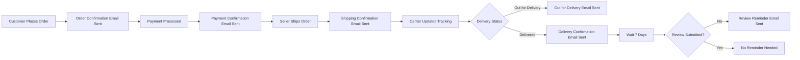
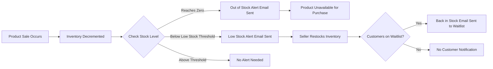
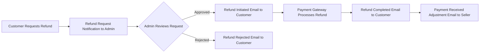

# Notification and Communication System Requirements

## 1. Notification System Overview

### 1.1 Business Context and Importance

The notification and communication system is a critical component of the e-commerce shopping mall platform, serving as the primary communication channel between the platform and its users (customers, sellers, and administrators). Effective notifications ensure users stay informed about important events, transactions, and actions requiring their attention.

**Business Value**:
- **Customer Trust**: Timely order and shipping notifications build customer confidence in the platform
- **Seller Efficiency**: Inventory alerts and new order notifications enable sellers to respond quickly to business events
- **Transaction Transparency**: Payment and refund notifications provide clear audit trails for financial transactions
- **User Engagement**: Relevant notifications encourage users to return to the platform and complete actions
- **Operational Excellence**: Admin notifications ensure platform issues are addressed promptly

### 1.2 Notification Channels

THE system SHALL support the following notification channels:

1. **Email Notifications**: Primary channel for detailed communications and formal transaction confirmations
2. **In-Platform Notifications**: Secondary channel for real-time alerts visible when users are logged into the platform

### 1.3 Notification Categories

Notifications are categorized by priority and purpose:

**Critical Notifications** (Cannot be disabled by users):
- Order confirmations
- Payment confirmations
- Refund notifications
- Account security alerts
- Password reset requests
- Email verification

**Important Notifications** (Default enabled, user can disable):
- Shipping status updates
- Delivery confirmations
- New order notifications for sellers
- Inventory alerts for sellers
- Review notifications

**Optional Notifications** (Default disabled, user can enable):
- Promotional communications
- Product recommendation emails
- Wishlist price drop alerts
- Newsletter subscriptions

### 1.4 Notification Priority Levels

THE system SHALL classify notifications into priority levels:

- **Urgent**: Sent immediately (e.g., payment confirmation, order placed)
- **High**: Sent within 5 minutes (e.g., shipping status updates, inventory alerts)
- **Normal**: Sent within 15 minutes (e.g., review notifications, delivery confirmations)
- **Low**: Can be batched and sent periodically (e.g., promotional emails, newsletters)

---

## 2. Email Notification Infrastructure Requirements

### 2.1 Email Delivery Requirements

WHEN the system triggers an email notification, THE system SHALL queue the email for delivery within the priority-defined timeframe.

WHEN an email delivery fails, THE system SHALL retry delivery using exponential backoff strategy (retry after 1 minute, 5 minutes, 15 minutes, 1 hour, 4 hours).

WHEN an email fails delivery after all retry attempts, THE system SHALL log the failure and mark the notification as undeliverable.

THE system SHALL track email delivery status including: queued, sent, delivered, bounced, failed.

THE system SHALL maintain email delivery logs for audit and troubleshooting purposes.

### 2.2 Email Template Structure

THE system SHALL use structured email templates for all notification types.

Each email template SHALL include:
- **Subject line**: Clear, concise description of notification purpose
- **Preheader text**: Brief summary visible in email preview
- **Header section**: Platform branding and logo
- **Body content**: Notification details with clear formatting
- **Call-to-action buttons**: Prominent buttons for required user actions
- **Footer section**: Unsubscribe link, contact information, legal disclaimers
- **Plain text alternative**: Text-only version for email clients that don't support HTML

### 2.3 Email Content Requirements

THE system SHALL personalize email content with recipient-specific information including recipient name, order numbers, product names, and transaction amounts.

THE system SHALL format currency amounts according to the transaction currency with proper symbols and decimal places.

THE system SHALL format dates and times in readable format (e.g., "January 15, 2025 at 3:30 PM").

THE system SHALL include direct action links that navigate users to relevant platform pages (e.g., "View Order" button linking to order details page).

### 2.4 Email Branding and Design

THE system SHALL apply consistent platform branding to all email communications including logo, color scheme, and typography.

THE system SHALL ensure email templates are mobile-responsive and render correctly on all major email clients.

THE system SHALL use clear visual hierarchy to emphasize important information such as order totals, tracking numbers, and action buttons.

---

## 3. Customer Notifications

### 3.1 Order Confirmation Notifications

WHEN a customer successfully places an order, THE system SHALL send an order confirmation email immediately.

The order confirmation email SHALL include:
- Order number and order date
- Complete list of ordered items with product names, SKU details, quantities, and prices
- Subtotal, shipping cost, taxes, discounts applied, and grand total
- Billing address and shipping address
- Expected delivery timeframe
- Payment method used
- Link to view complete order details
- Link to track order status
- Customer support contact information

WHEN an order contains items from multiple sellers, THE system SHALL include seller information for each item in the order confirmation.

### 3.2 Payment Confirmation Notifications

WHEN a payment is successfully processed, THE system SHALL send a payment confirmation email immediately.

The payment confirmation email SHALL include:
- Transaction ID and transaction date/time
- Payment amount with currency
- Payment method used (e.g., "Credit card ending in 1234")
- Associated order number
- Billing address
- Receipt download link
- Link to view payment details

WHEN a payment fails, THE system SHALL send a payment failure notification immediately with failure reason and instructions to retry payment.

### 3.3 Shipping Status Update Notifications

WHEN an order ships, THE system SHALL send a shipping confirmation email within 5 minutes.

The shipping confirmation email SHALL include:
- Order number
- Shipped items list with quantities
- Shipping carrier name
- Tracking number with clickable link to carrier tracking page
- Estimated delivery date
- Shipping address
- Link to track shipment on platform

WHEN tracking information shows the package is out for delivery, THE system SHALL send an "out for delivery" notification.

WHEN tracking information shows delivery attempt failed, THE system SHALL send a failed delivery notification with instructions for redelivery or pickup.

### 3.4 Delivery Confirmation Notifications

WHEN an order is marked as delivered, THE system SHALL send a delivery confirmation email.

The delivery confirmation email SHALL include:
- Order number
- Delivery date and time
- Delivered items list
- Delivery address
- Request for order review with direct link to review submission page
- Customer support contact for delivery issues

### 3.5 Order Cancellation Notifications

WHEN a customer cancels an order, THE system SHALL send a cancellation confirmation email immediately.

WHEN a seller cancels an order, THE system SHALL send a cancellation notification to the customer with cancellation reason.

The cancellation notification SHALL include:
- Order number
- Cancellation date
- Cancelled items list with refund amounts
- Cancellation reason
- Refund processing timeframe
- Refund method (original payment method)
- Link to view cancellation details

### 3.6 Refund Processing Notifications

WHEN a refund is initiated, THE system SHALL send a refund initiated notification to the customer.

WHEN a refund is successfully processed, THE system SHALL send a refund confirmation email.

The refund confirmation email SHALL include:
- Original order number
- Refund amount
- Refund date
- Refund method (e.g., "Refunded to credit card ending in 1234")
- Expected timeframe for refund to appear in customer account (e.g., "3-5 business days")
- Transaction ID for refund
- Link to view refund details

### 3.7 Account Security Notifications

WHEN a customer creates a new account, THE system SHALL send an email verification email immediately.

The email verification email SHALL include:
- Verification link that expires after 24 hours
- Instructions for completing email verification
- Resend verification link option

WHEN a customer requests password reset, THE system SHALL send a password reset email immediately.

The password reset email SHALL include:
- Password reset link that expires after 1 hour
- Instructions for resetting password
- Warning that the link is single-use only
- Security notice that if the customer did not request this reset, they should ignore the email

WHEN a customer successfully changes their password, THE system SHALL send a password change confirmation email.

WHEN a customer's email address is changed, THE system SHALL send confirmation emails to both old and new email addresses.

WHEN suspicious login activity is detected (e.g., login from new device or location), THE system SHALL send a security alert notification.

### 3.8 Wishlist Notifications

WHERE the wishlist notification feature is enabled, WHEN an item in a customer's wishlist becomes available after being out of stock, THE system SHALL send a back-in-stock notification.

WHERE the wishlist notification feature is enabled, WHEN an item in a customer's wishlist has a price reduction, THE system SHALL send a price drop notification.

### 3.9 Review Reminder Notifications

WHEN 7 days have passed since order delivery, IF the customer has not submitted a review, THE system SHALL send a review reminder email.

The review reminder email SHALL include:
- Order number and delivery date
- List of delivered products
- Direct link to submit review for each product
- Incentive information if applicable (e.g., "Share your experience and help other shoppers")

---

## 4. Seller Notifications

### 4.1 New Order Notifications

WHEN a new order is placed containing the seller's products, THE system SHALL send a new order notification to the seller immediately.

The new order notification SHALL include:
- Order number and order date
- Customer shipping address
- List of ordered items from the seller's inventory with SKU, quantity, and price
- Order subtotal for seller's items
- Expected shipping deadline
- Link to view complete order details
- Link to process order and update shipping status

WHEN multiple items from the same seller are in a single customer order, THE system SHALL send a single consolidated notification to the seller (not separate notifications per item).

### 4.2 Inventory Alert Notifications

WHEN a product SKU inventory falls below the seller-defined low stock threshold, THE system SHALL send a low stock alert notification to the seller.

The low stock alert SHALL include:
- Product name and SKU details
- Current inventory quantity
- Low stock threshold level
- Recent sales velocity (units sold in last 7 days)
- Link to update inventory
- Suggestion to restock

WHEN a product SKU inventory reaches zero, THE system SHALL send an out of stock alert notification to the seller immediately.

The out of stock alert SHALL include:
- Product name and SKU details
- Date inventory reached zero
- Number of missed sales opportunities (if customers added to cart but couldn't purchase)
- Link to update inventory
- Urgent restock recommendation

WHEN a seller has multiple SKUs that are low or out of stock, THE system SHALL send a consolidated inventory alert (not individual alerts per SKU) if alerts occur within the same 1-hour window.

### 4.3 Review Submission Notifications

WHEN a customer submits a review for the seller's product, THE system SHALL send a new review notification to the seller.

The review notification SHALL include:
- Product name reviewed
- Customer's rating (star rating)
- Review text content
- Review submission date
- Link to view review on product page
- Link to respond to review
- Review moderation status

### 4.4 Return Request Notifications

WHEN a customer requests a return for the seller's product, THE system SHALL send a return request notification to the seller.

The return request notification SHALL include:
- Order number
- Product name and SKU
- Return reason provided by customer
- Return request date
- Link to view return request details
- Instructions for approving or rejecting return request

### 4.5 Payment Received Notifications

WHEN payment for a completed order is distributed to the seller's account, THE system SHALL send a payment received notification.

The payment received notification SHALL include:
- Order number associated with payment
- Payment amount
- Payment date
- Transaction fee deducted (if applicable)
- Net payment amount to seller
- Link to view transaction details
- Link to seller financial dashboard

### 4.6 Account Performance Notifications

WHEN a seller's performance metrics fall below platform standards (e.g., late shipment rate exceeds threshold), THE system SHALL send a performance warning notification.

The performance warning notification SHALL include:
- Specific performance metric that triggered warning
- Current performance level
- Required performance standard
- Timeframe for improvement
- Consequences of continued poor performance
- Link to performance dashboard
- Recommendations for improvement

---

## 5. Admin Notifications

### 5.1 System Alert Notifications

WHEN critical system errors occur that require admin attention, THE system SHALL send an urgent system alert notification to administrators.

WHEN system performance metrics exceed defined thresholds (e.g., high error rates, slow response times), THE system SHALL send a performance alert notification.

### 5.2 Refund Request Notifications

WHEN a customer submits a refund request that requires admin review, THE system SHALL send a refund request notification to administrators.

The refund request notification SHALL include:
- Order number
- Customer name
- Refund amount requested
- Refund reason
- Order details and transaction history
- Link to review and approve/reject refund request

### 5.3 Review Moderation Notifications

WHEN a product review is flagged for moderation (e.g., contains inappropriate content), THE system SHALL send a review moderation notification to administrators.

The review moderation notification SHALL include:
- Product name
- Review content
- Reason for flagging
- Customer who submitted review
- Link to review moderation tools

### 5.4 Seller Verification Notifications

WHEN a new seller completes registration and submits verification documents, THE system SHALL send a seller verification notification to administrators.

The seller verification notification SHALL include:
- Seller business name
- Seller contact information
- Registration date
- Submitted documents list
- Link to review seller application

### 5.5 Platform Monitoring Alerts

WHEN unusual activity is detected on the platform (e.g., sudden spike in failed payments, unusual order patterns), THE system SHALL send a monitoring alert to administrators.

---

## 6. Notification Preferences Management

### 6.1 User Preference Settings

THE system SHALL provide notification preference settings accessible from user account settings.

THE system SHALL allow customers to manage notification preferences for:
- Order status updates (shipping, delivery)
- Review reminders
- Wishlist notifications
- Promotional emails
- Newsletter subscriptions

THE system SHALL allow sellers to manage notification preferences for:
- New order alerts
- Inventory alerts
- Review notifications
- Payment notifications
- Performance alerts

THE system SHALL NOT allow users to disable critical notifications including:
- Order confirmations
- Payment confirmations
- Refund notifications
- Account security alerts
- Password reset emails

### 6.2 Opt-in and Opt-out Mechanisms

THE system SHALL provide clear opt-in checkboxes during account registration for optional notification types.

THE system SHALL include unsubscribe links in all marketing and promotional emails.

WHEN a user clicks an unsubscribe link, THE system SHALL immediately opt the user out of that notification type and display a confirmation message.

THE system SHALL provide a global "unsubscribe from all marketing" option while maintaining critical transactional notifications.

### 6.3 Notification Frequency Controls

WHERE notification batching is supported, THE system SHALL allow users to choose notification frequency:
- Immediate (real-time notifications)
- Daily digest (once per day summary)
- Weekly digest (once per week summary)

THE system SHALL respect user-defined quiet hours where non-urgent notifications are delayed until the user's preferred time window.

### 6.4 Channel Preferences

THE system SHALL allow users to specify preferred notification channels for different notification types where multiple channels are available.

Example: Users can choose to receive order updates via email only, or email plus in-platform notifications.

---

## 7. Notification Delivery Requirements

### 7.1 Delivery Timing Requirements

THE system SHALL send urgent priority notifications (order confirmations, payment confirmations) immediately, with maximum 30-second delay from trigger event.

THE system SHALL send high priority notifications (shipping updates, inventory alerts) within 5 minutes of trigger event.

THE system SHALL send normal priority notifications within 15 minutes of trigger event.

THE system SHALL batch low priority notifications and send at scheduled intervals (e.g., daily digest emails sent at 8 AM user local time).

### 7.2 Retry Logic for Failed Deliveries

WHEN email delivery fails due to temporary issues (e.g., recipient server unavailable), THE system SHALL retry delivery using exponential backoff:
- First retry: 1 minute after failure
- Second retry: 5 minutes after first retry
- Third retry: 15 minutes after second retry
- Fourth retry: 1 hour after third retry
- Fifth retry: 4 hours after fourth retry

WHEN email delivery fails due to permanent issues (e.g., invalid email address), THE system SHALL mark the notification as permanently failed and not retry.

WHEN email bounces as "mailbox full", THE system SHALL retry up to 3 times over 24 hours.

### 7.3 Delivery Tracking and Confirmation

THE system SHALL track delivery status for all email notifications including:
- Queued timestamp
- Sent timestamp
- Delivered timestamp (when available from email service provider)
- Opened timestamp (when available)
- Clicked timestamp for links (when available)
- Bounced status with bounce reason
- Failed status with failure reason

THE system SHALL log all notification delivery attempts for audit purposes.

THE system SHALL provide delivery status visibility to administrators for troubleshooting.

### 7.4 Performance Requirements

THE system SHALL process and queue notification sending without blocking the primary business operation that triggered the notification.

Example: Order placement should complete successfully even if notification queuing experiences delays.

THE system SHALL handle notification sending asynchronously to prevent notification delivery issues from impacting core platform functionality.

THE system SHALL support sending thousands of notifications concurrently during peak periods (e.g., promotional campaigns, flash sales).

---

## 8. Notification Content Requirements

### 8.1 Message Content Structure

THE system SHALL structure notification messages with clear hierarchy:
- **Primary message**: Main notification purpose stated clearly in first sentence
- **Details section**: Relevant transaction or event details
- **Action required** (if applicable): Clear instructions for user action
- **Additional information**: Supporting details, policies, or helpful links

THE system SHALL write notification content in clear, concise, professional language appropriate for business communications.

### 8.2 Personalization Requirements

THE system SHALL personalize notification greetings with recipient's name (e.g., "Hi John," or "Dear Sarah,").

THE system SHALL include order-specific details (order numbers, product names, amounts) relevant to the recipient.

THE system SHALL include seller-specific information when notifying sellers (seller business name, store name).

THE system SHALL avoid generic, impersonal notification content that lacks user-specific context.

### 8.3 Localization Support

WHERE the platform supports multiple languages, THE system SHALL send notifications in the user's preferred language setting.

THE system SHALL format currency, dates, and numbers according to the user's locale settings.

### 8.4 Action Links and Call-to-Actions

THE system SHALL include clear call-to-action buttons for notifications requiring user action.

Examples:
- "View Order" button in order confirmation emails
- "Track Shipment" button in shipping notifications
- "Process Order" button in seller new order notifications
- "Update Inventory" button in low stock alerts
- "Write Review" button in review reminder emails

THE system SHALL ensure action links navigate directly to the relevant platform page (deep linking).

THE system SHALL ensure action links include authentication tokens when necessary to provide seamless access to user-specific pages.

THE system SHALL set action link tokens to expire after reasonable timeframes (e.g., 30 days for order tracking links, 24 hours for email verification links).

---

## 9. Notification Triggering Rules

### 9.1 Event-Based Triggers

THE system SHALL trigger notifications based on specific business events:

**Order Events**:
- Order placed → Order confirmation notification
- Payment received → Payment confirmation notification
- Order shipped → Shipping confirmation notification
- Order delivered → Delivery confirmation notification
- Order cancelled → Cancellation notification
- Refund processed → Refund notification

**Inventory Events**:
- Stock level below threshold → Low stock alert
- Stock level reaches zero → Out of stock alert
- Product back in stock → Back in stock notification (for wishlist users)

**Review Events**:
- Review submitted → Review notification to seller
- 7 days after delivery without review → Review reminder to customer

**Account Events**:
- Account created → Email verification notification
- Password reset requested → Password reset notification
- Password changed → Password change confirmation
- Suspicious login detected → Security alert notification

### 9.2 Time-Based Triggers

THE system SHALL trigger notifications based on time conditions:

WHEN 7 days have passed since order delivery, IF no review submitted, THE system SHALL send review reminder.

WHEN 24 hours have passed since email verification sent, IF email not verified, THE system SHALL send verification reminder.

WHEN a seller has not shipped an order within 24 hours of the expected shipping deadline, THE system SHALL send late shipment alert to seller.

### 9.3 Condition-Based Triggers

THE system SHALL trigger notifications based on system state or threshold conditions:

WHEN inventory quantity < low stock threshold, THE system SHALL send low stock alert.

WHEN seller late shipment rate > 10%, THE system SHALL send performance warning.

WHEN payment failure rate for a customer exceeds 3 attempts, THE system SHALL send payment issue alert.

### 9.4 Batch Notification Processing

THE system SHALL batch low-priority notifications to avoid overwhelming users:

WHEN multiple wishlist items have price drops on the same day, THE system SHALL send a single consolidated notification listing all items (not individual notifications per item).

WHEN a seller has multiple inventory alerts within 1 hour, THE system SHALL send a consolidated inventory report (not individual alerts).

WHERE users opt for daily or weekly digest, THE system SHALL collect and batch notifications into scheduled digest emails.

---

## 10. Security and Privacy Requirements

### 10.1 Personal Data Handling in Notifications

THE system SHALL NOT include sensitive information in email subject lines (e.g., order amounts, product names).

THE system SHALL limit personal data in notifications to what is necessary for the notification purpose.

THE system SHALL NOT include full credit card numbers in payment notifications, only masked numbers (e.g., "ending in 1234").

THE system SHALL NOT include passwords or password reset tokens in notification content, only secure reset links.

### 10.2 Secure Notification Delivery

THE system SHALL use encrypted connections (TLS) for sending email notifications.

THE system SHALL generate secure, time-limited tokens for action links that require authentication.

THE system SHALL validate recipient email addresses before sending to prevent notification delivery to unintended recipients.

### 10.3 Unsubscribe Mechanisms

THE system SHALL include unsubscribe links in all marketing and promotional emails as required by anti-spam regulations.

THE system SHALL process unsubscribe requests immediately and confirm unsubscribe action to the user.

THE system SHALL maintain unsubscribe preference records and respect them for all future communications.

### 10.4 Compliance with Communication Regulations

THE system SHALL comply with email marketing regulations including CAN-SPAM Act, GDPR email requirements, and other applicable laws.

THE system SHALL include required business information in email footers (business name, physical address, contact information).

THE system SHALL honor user communication preferences and consent requirements.

THE system SHALL maintain records of user consent for marketing communications.

---

## Notification Flow Diagrams

### Customer Order Notification Flow

### Seller Inventory Alert Flow

### Refund Processing Notification Flow

---

## 11. Additional Notification Scenarios

### 11.1 Cart Abandonment Notifications

WHEN a customer adds items to their cart but does not complete checkout within 24 hours, THE system SHALL send a cart abandonment reminder email.

The cart abandonment email SHALL include:
- Reminder that items are waiting in the cart
- List of cart items with images and prices
- Direct link to return to cart and complete checkout
- Indication if any items are low in stock
- Optional promotional discount code to encourage purchase completion

THE system SHALL send cart abandonment emails only to customers who have opted in to promotional communications.

THE system SHALL limit cart abandonment emails to one per cart session to avoid spam.

### 11.2 Price Drop and Back-in-Stock Notifications

WHEN a customer has added a product to their wishlist, THE system SHALL monitor that product for price changes and stock availability.

WHEN a wishlisted product's price decreases by 10% or more, THE system SHALL send a price drop notification to the customer.

The price drop notification SHALL include:
- Product name and image
- Original price and new price
- Discount percentage or amount saved
- Link to product page
- "Add to Cart" quick action button
- Indication if the sale is time-limited

WHEN a wishlisted product that was out of stock becomes available, THE system SHALL send a back-in-stock notification.

The back-in-stock notification SHALL include:
- Product name and image
- Confirmation that the product is now in stock
- Current price
- Link to product page
- "Add to Cart" quick action button
- Warning if stock is limited

### 11.3 Order Delay Notifications

WHEN an order shipment is delayed beyond the originally estimated delivery date, THE system SHALL send a delay notification to the customer.

The delay notification SHALL include:
- Order number
- Original estimated delivery date
- New estimated delivery date
- Reason for delay (if available from carrier or seller)
- Apology message
- Link to order tracking
- Customer support contact information

WHEN a seller has not shipped an order within the expected fulfillment timeframe, THE system SHALL send a late shipment alert to the seller.

### 11.4 Promotional Campaign Notifications

WHEN the platform runs promotional campaigns, sales events, or special offers, THE system SHALL send promotional notifications to customers who have opted in.

Promotional notification emails SHALL include:
- Campaign name and description
- Featured products or categories on sale
- Discount details and promo codes
- Campaign duration (start and end dates)
- Call-to-action to browse sale items
- Clear unsubscribe link

THE system SHALL respect user preferences and send promotional emails only to users who have opted in to marketing communications.

THE system SHALL limit promotional email frequency to prevent spam (e.g., maximum 2 promotional emails per week per user).

### 11.5 Account Verification Reminders

WHEN a customer registers but does not verify their email within 24 hours, THE system SHALL send an email verification reminder.

The verification reminder SHALL include:
- Reminder message about pending email verification
- New verification link (regenerated with 24-hour expiration)
- Benefits of verifying email (access to full account features)
- Instructions for verification

THE system SHALL send up to 2 verification reminders (at 24 hours and 72 hours after registration) before stopping reminder notifications.

### 11.6 Seller Onboarding Notifications

WHEN a seller's account is approved by admin, THE system SHALL send a welcome and onboarding email to the seller.

The seller welcome email SHALL include:
- Welcome message and congratulations on approval
- Overview of seller dashboard features
- Getting started guide with key next steps
- Link to seller resources and documentation
- Link to add first product
- Customer support contact information

WHEN a seller has not listed any products within 7 days of account approval, THE system SHALL send a product listing reminder encouraging the seller to add their first product.

### 11.7 Payment Failure Recovery Notifications

WHEN a customer's payment fails during checkout, THE system SHALL send a payment failure notification.

The payment failure notification SHALL include:
- Explanation that payment could not be processed
- Order items that were attempted
- Suggested actions (verify payment information, try different payment method)
- Link to retry checkout with cart preserved
- Expiration time for cart reservation (if applicable)

WHEN a scheduled seller payout fails due to invalid bank account information, THE system SHALL send a payout failure notification to the seller.

The seller payout failure notification SHALL include:
- Explanation of payout failure
- Amount that could not be transferred
- Reason for failure (invalid account number, bank details incorrect, etc.)
- Instructions to update bank account information
- Link to payment settings
- Notice that payout will be retried once information is corrected

### 11.8 Subscription Renewal Notifications

IF the platform offers seller subscription tiers, WHEN a seller's subscription is approaching renewal, THE system SHALL send a renewal reminder notification 7 days before renewal date.

The subscription renewal notification SHALL include:
- Current subscription plan name
- Renewal date
- Renewal amount
- Payment method to be charged
- Benefits of continued subscription
- Link to update payment method or cancel subscription

WHEN a subscription payment fails, THE system SHALL send a payment failure notification and retry according to the defined retry schedule.

### 11.9 Customer Support Ticket Notifications

WHEN a customer submits a support ticket, THE system SHALL send a ticket confirmation email immediately.

The support ticket confirmation SHALL include:
- Ticket number for reference
- Summary of issue submitted
- Expected response timeframe
- Link to view ticket status
- Customer support contact information

WHEN a support ticket receives a response from customer support, THE system SHALL send a ticket update notification to the customer.

WHEN a support ticket is resolved and closed, THE system SHALL send a resolution confirmation notification.

---

## 12. In-Platform Notification Requirements

### 12.1 Notification Bell and Inbox

THE system SHALL provide an in-platform notification center accessible via a notification icon (bell icon) in the platform header.

WHEN a user has unread notifications, THE system SHALL display a badge count on the notification icon.

WHEN a user clicks the notification icon, THE system SHALL display a dropdown or panel showing recent notifications.

### 12.2 In-Platform Notification Display

THE in-platform notification list SHALL display:
- Notification icon representing notification type
- Notification title or summary
- Timestamp (relative time, e.g., "5 minutes ago", "2 hours ago")
- Read/unread status (visual indicator for unread notifications)
- Link to related entity (order, product, review)

THE system SHALL display notifications in reverse chronological order (newest first).

THE system SHALL support pagination or infinite scroll for viewing older notifications.

### 12.3 Notification Mark as Read

WHEN a user clicks on an in-platform notification, THE system SHALL mark the notification as read automatically.

THE system SHALL provide a "Mark all as read" option to clear all unread notification badges.

THE system SHALL allow users to manually mark individual notifications as read or unread.

### 12.4 Notification Retention

THE system SHALL retain in-platform notifications for at least 30 days.

THE system SHALL automatically delete in-platform notifications older than 90 days to manage storage.

THE system SHALL allow users to manually delete individual notifications from their notification inbox.

### 12.5 Real-Time Notification Updates

WHILE a user is logged into the platform, THE system SHALL push new notifications to the notification center in real-time without requiring page refresh.

THE system SHALL use WebSocket connections, server-sent events, or polling mechanisms to deliver real-time notifications.

WHEN a new notification arrives, THE system SHALL display a visual indicator (notification bell animation, sound alert, or badge update) to draw user attention.

---

## 13. Notification Testing and Validation Requirements

### 13.1 Notification Triggering Validation

THE system SHALL validate that notifications are triggered correctly for all defined business events.

THE system SHALL prevent duplicate notifications for the same event (e.g., sending multiple order confirmations for a single order).

THE system SHALL ensure notifications are sent to the correct recipients based on user roles and order ownership.

### 13.2 Email Content Validation

THE system SHALL validate email content before sending:
- All required data fields are populated (no missing order numbers, names, etc.)
- All links are valid and navigate to correct destinations
- All currency and number formatting is correct
- All personalization tokens are replaced with actual data (no raw template variables)

IF content validation fails, THE system SHALL log the error and optionally send a fallback notification or alert admins.

### 13.3 Delivery Validation

THE system SHALL validate email addresses before attempting delivery using format validation and optionally email verification services.

THE system SHALL detect invalid email addresses and mark them as undeliverable without attempting to send.

THE system SHALL maintain a suppression list of email addresses that have hard bounced or complained about spam, and exclude them from future notifications.

### 13.4 Testing Capabilities

THE system SHALL provide testing capabilities for notification functionality:
- Ability to send test notifications to specific email addresses for validation
- Ability to preview notification content with sample data
- Ability to trigger notifications manually for testing purposes (without affecting production users)
- Ability to view notification logs and delivery status for debugging

---

## 14. Notification Analytics and Monitoring

### 14.1 Notification Metrics

THE system SHALL track notification metrics for monitoring and optimization:

**Delivery Metrics**:
- Total notifications sent (by type and time period)
- Successful delivery rate
- Bounce rate (hard bounces and soft bounces)
- Failed delivery rate
- Average delivery time

**Engagement Metrics**:
- Email open rate (percentage of emails opened)
- Click-through rate (percentage of emails with link clicks)
- Conversion rate (notifications leading to desired actions)
- Unsubscribe rate

**Performance Metrics**:
- Average time from trigger event to notification sent
- Notification queue depth (pending notifications)
- Retry counts per notification type

### 14.2 Notification Dashboard for Admins

THE system SHALL provide a notification analytics dashboard for admins showing:
- Notification volume trends over time
- Delivery success rates by notification type
- Engagement rates by notification type
- Failed deliveries with reasons
- Unsubscribe trends

### 14.3 Anomaly Detection

THE system SHALL detect notification anomalies and alert admins:

WHEN notification delivery failure rate exceeds normal threshold (e.g., >5% failure rate), THE system SHALL alert admins of potential email service issues.

WHEN notification open rates drop significantly below baseline, THE system SHALL flag potential deliverability or content issues.

WHEN unsubscribe rates spike, THE system SHALL alert admins to review notification frequency or content quality.

---

## 15. Error Handling and Recovery

### 15.1 Email Service Provider Failures

WHEN the email service provider is unavailable or returning errors, THE system SHALL:
- Queue notifications for delayed delivery
- Retry sending when service is restored
- Alert admins of email service outage
- Provide status updates to admins on queued notification backlog

WHEN email service is restored, THE system SHALL process the queued notifications in priority order (urgent first, then high, normal, low).

### 15.2 Invalid Recipient Handling

WHEN a notification is addressed to an invalid email address, THE system SHALL:
- Mark the notification as undeliverable
- Log the invalid email address
- Optionally alert admins if the user has important pending actions (e.g., order confirmations)
- Attempt to contact the user through alternative methods if available

### 15.3 Content Generation Errors

WHEN notification content cannot be generated due to missing data or template errors, THE system SHALL:
- Log the error with full context
- Alert admins of the notification failure
- Optionally send a simplified fallback notification without the problematic content
- Retry content generation if the error is transient

### 15.4 Notification Queue Overflow

WHEN the notification queue depth exceeds capacity during high-traffic periods, THE system SHALL:
- Prioritize critical notifications (order confirmations, payment confirmations)
- Delay or drop low-priority notifications if necessary
- Alert admins of queue overflow condition
- Scale notification processing capacity if auto-scaling is available

---

## Summary

This document defines comprehensive notification and communication requirements for the e-commerce shopping mall platform. The notification system ensures all user actors—customers, sellers, and administrators—receive timely, relevant, and actionable information throughout their platform interactions.

**Key Requirements**:
- Multi-channel notification support (email, in-platform)
- Priority-based notification delivery with defined timing requirements
- Actor-specific notification types covering complete user journeys
- Robust retry logic and delivery tracking
- User-controlled notification preferences with mandatory critical notifications
- Personalized, localized notification content
- Secure notification delivery with privacy protection
- Compliance with communication regulations

The notification system is essential for building trust, enabling efficient operations, maintaining transparency, and ensuring excellent user experience across the e-commerce platform.