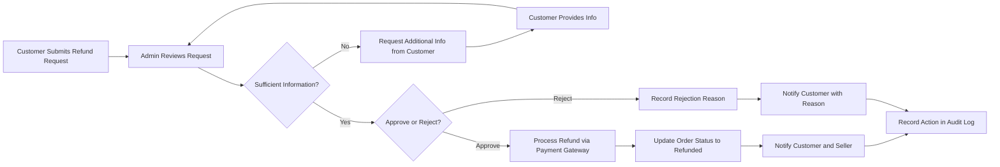
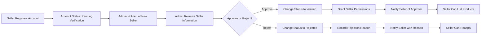
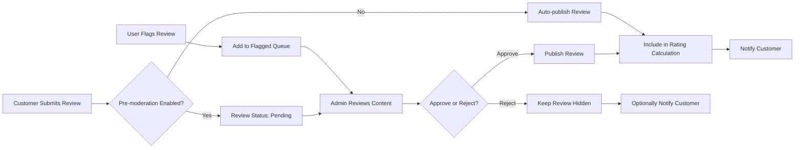
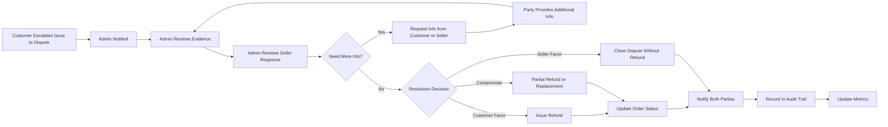

# Admin Operations & Management

## Executive Summary

This document defines the complete administrative operations and management capabilities required for platform administrators to effectively oversee and manage the e-commerce shopping mall marketplace. Administrators have elevated permissions to manage all aspects of the platform including user accounts, orders, products, reviews, seller accounts, disputes, system configuration, and platform analytics.

The admin operations system provides the necessary tools and workflows for platform administrators to maintain marketplace integrity, ensure compliance, resolve disputes, moderate content, monitor platform health, and make data-driven decisions for business growth.

For authentication and permission details, refer to the [User Actors & Authentication](./02-user-actors-authentication.md) document.

## Admin Dashboard Overview

### Dashboard Purpose and Scope

THE admin dashboard SHALL serve as the central command center for platform administrators to monitor, manage, and control all aspects of the e-commerce marketplace. The dashboard provides real-time visibility into platform operations, key performance metrics, pending actions, and critical alerts.

### Dashboard Key Metrics Display

WHEN an admin accesses the dashboard, THE system SHALL display the following real-time metrics:

- Total active customers (currently registered and active)
- Total active sellers (verified and selling)
- Total orders today, this week, and this month
- Total revenue today, this week, and this month
- Pending order count requiring attention
- Pending review moderation count
- Pending refund requests count
- Pending seller verification requests
- Low inventory alerts across all sellers
- Platform error rate and system health status
- Active user count (currently online)
- Conversion rate (visitors to completed purchases)

### Dashboard Navigation Structure

THE admin dashboard SHALL organize administrative functions into the following primary sections:

- User Management (customers and sellers)
- Order Management and Oversight
- Product and Category Management
- Review Moderation Center
- Seller Account Management
- Refund and Dispute Resolution Center
- Analytics and Reporting
- System Configuration
- Content Management
- Platform Monitoring and Alerts
- Admin Activity Logs

### Dashboard Quick Actions

THE system SHALL provide quick action shortcuts on the dashboard for common administrative tasks:

- View and process pending refund requests
- Moderate flagged reviews
- Approve pending seller accounts
- View recent high-value orders
- Access critical system alerts
- Generate daily sales report
- View recent customer support tickets
- Access inventory alerts requiring seller notification

### Real-Time Dashboard Updates

WHILE an admin is viewing the dashboard, THE system SHALL update metrics and notifications in real-time without requiring page refresh for critical information such as new orders, new refund requests, and system alerts.

## User Management Capabilities

### Customer Account Management

#### Customer Account Search and Filtering

WHEN an admin accesses the customer management section, THE system SHALL provide the ability to search and filter customers by:

- Email address (exact or partial match)
- Customer name (exact or partial match)
- Customer ID
- Registration date range
- Account status (active, suspended, deleted)
- Order count range (e.g., customers with 0 orders, 1-5 orders, 5+ orders)
- Total spending range
- Last login date range
- Email verification status

THE system SHALL display search results in a paginated table showing customer ID, name, email, registration date, total orders, total spending, account status, and quick action buttons.

#### Customer Account Details View

WHEN an admin views a specific customer account, THE system SHALL display comprehensive customer information including:

- Customer personal information (name, email, phone number)
- Account creation date and email verification status
- All saved delivery addresses
- Complete order history with order totals
- Total lifetime spending amount
- Total number of orders placed
- Average order value
- Last login date and time
- Account status (active, suspended, deleted)
- All submitted reviews and ratings
- Wishlist items count
- Current shopping cart items (if any)
- Account activity timeline (registrations, orders, reviews, login history)

#### Customer Account Actions

THE system SHALL allow admins to perform the following actions on customer accounts:

**Account Suspension:**
WHEN an admin suspends a customer account, THE system SHALL:
- Immediately prevent the customer from logging in
- Cancel any active sessions for that customer
- Display a suspension notice when the customer attempts to login
- Record the suspension action with admin ID, timestamp, and reason
- Optionally send an email notification to the customer explaining the suspension

**Account Reactivation:**
WHEN an admin reactivates a suspended customer account, THE system SHALL:
- Restore login access for the customer
- Record the reactivation action with admin ID and timestamp
- Optionally send an email notification to the customer confirming reactivation

**Account Deletion:**
WHEN an admin deletes a customer account, THE system SHALL:
- Mark the account as deleted (soft delete)
- Anonymize personal data in accordance with data retention policies
- Preserve order history for business records
- Record the deletion action with admin ID, timestamp, and reason
- Prevent the customer from logging in

**Password Reset:**
WHEN an admin initiates a password reset for a customer, THE system SHALL send a password reset email to the customer's registered email address with a secure reset link.

**Email Verification Override:**
WHEN an admin manually verifies a customer's email address, THE system SHALL mark the email as verified and record the admin action.

### Seller Account Management

#### Seller Account Search and Filtering

WHEN an admin accesses the seller management section, THE system SHALL provide the ability to search and filter sellers by:

- Seller business name
- Seller email address
- Seller ID
- Registration date range
- Verification status (pending, verified, rejected)
- Account status (active, suspended, deleted)
- Total products listed
- Total orders fulfilled
- Total revenue generated
- Seller rating (if applicable)

#### Seller Account Details View

WHEN an admin views a specific seller account, THE system SHALL display comprehensive seller information including:

- Seller business information (business name, contact email, phone number)
- Business registration details (if provided)
- Account registration date
- Verification status and verification date
- Account status (active, suspended, deleted)
- Total products listed (active and inactive)
- Total orders received and fulfilled
- Total revenue generated
- Average fulfillment time
- Seller performance metrics (on-time shipping rate, cancellation rate)
- Customer review ratings for seller's products
- Recent orders requiring fulfillment
- Inventory alerts for low-stock items
- Account activity timeline

#### Seller Verification Process

WHEN a new seller registers on the platform, THE system SHALL create a pending seller account requiring admin verification.

WHEN an admin reviews a pending seller account, THE system SHALL display:
- Submitted business information
- Business registration documents (if uploaded)
- Contact information
- Initial product listings (if any)

THE system SHALL allow admins to perform the following verification actions:

**Approve Seller Account:**
WHEN an admin approves a seller account, THE system SHALL:
- Change the seller status to "verified"
- Grant full seller permissions including product listing and order management
- Record the approval action with admin ID and timestamp
- Send an approval confirmation email to the seller
- Allow the seller's products to become publicly visible

**Reject Seller Account:**
WHEN an admin rejects a seller account, THE system SHALL:
- Change the seller status to "rejected"
- Record the rejection reason provided by the admin
- Send a rejection notification email to the seller with the reason
- Prevent the seller from accessing seller-specific features
- Optionally allow the seller to reapply with corrected information

#### Seller Account Suspension and Actions

**Seller Account Suspension:**
WHEN an admin suspends a seller account, THE system SHALL:
- Immediately prevent the seller from logging in
- Hide all of the seller's products from public view
- Prevent the seller from processing orders
- Notify customers with pending orders from this seller
- Record the suspension action with admin ID, timestamp, and reason
- Send a suspension notification email to the seller

**Seller Account Reactivation:**
WHEN an admin reactivates a suspended seller account, THE system SHALL:
- Restore login access for the seller
- Restore visibility of the seller's active products
- Allow the seller to resume order processing
- Record the reactivation action
- Send a reactivation confirmation email to the seller

**Seller Performance Review:**
THE system SHALL allow admins to view detailed seller performance metrics including:
- Order fulfillment rate (percentage of orders successfully fulfilled)
- Average shipping time (time from order placement to shipment)
- Order cancellation rate (percentage of orders cancelled by seller)
- Customer satisfaction rating (average review rating for seller's products)
- Response time to customer inquiries (if messaging is supported)
- Return and refund rate

### Bulk User Actions

THE system SHALL support bulk actions for user management:

**Bulk Email Notifications:**
WHEN an admin selects multiple users, THE system SHALL allow sending bulk email notifications with customizable message content.

**Bulk Status Changes:**
WHEN an admin selects multiple users, THE system SHALL allow changing account status (suspend, activate) for all selected users with a single action.

**User Export:**
THE system SHALL allow admins to export user lists (customers or sellers) to CSV format with selected fields for reporting and analysis purposes.

## Order Management and Oversight

### Order Search and Filtering

WHEN an admin accesses the order management section, THE system SHALL provide comprehensive search and filtering capabilities:

**Search Criteria:**
- Order ID (exact match)
- Customer name or email
- Seller name
- Order status (pending, processing, shipped, delivered, cancelled, refunded)
- Order date range
- Order total amount range
- Payment status (pending, completed, failed, refunded)
- Shipping status (not shipped, shipped, in transit, delivered)
- Product name or SKU

**Filter Options:**
- Orders requiring admin attention (disputes, refund requests)
- High-value orders (above specified threshold)
- Delayed orders (exceeding expected fulfillment time)
- Orders with customer complaints
- Multi-seller orders
- Orders by specific payment method

THE system SHALL display order search results in a paginated table showing order ID, customer name, order date, order total, order status, payment status, and quick action buttons.

### Order Details View

WHEN an admin views a specific order, THE system SHALL display complete order information including:

**Order Summary:**
- Order ID and order date/time
- Order status and status history timeline
- Customer information (name, email, shipping address)
- Billing address (if different from shipping)

**Order Items:**
- Product name, SKU, variant details (color, size, etc.)
- Quantity ordered
- Unit price and line item total
- Seller name for each item
- Product image thumbnail

**Financial Information:**
- Subtotal (sum of all items)
- Shipping cost
- Tax amount
- Discount amount (if applied)
- Grand total
- Payment method used
- Payment transaction ID
- Payment status and payment date

**Fulfillment Information:**
- Shipping method selected
- Tracking number (if available)
- Shipment date
- Expected delivery date
- Actual delivery date (if delivered)
- Current shipping status

**Order Timeline:**
- Order placement timestamp
- Payment confirmation timestamp
- Order processing started timestamp
- Shipment timestamp
- Delivery timestamp
- Any status changes with timestamps

**Customer Communication:**
- Customer notes or special instructions
- Order-related messages or communications
- Customer service tickets related to this order

### Order Status Management

THE system SHALL allow admins to manually update order status when necessary for exceptional cases:

**Status Transition Rules:**
WHEN an admin changes order status, THE system SHALL:
- Validate that the status transition is logically valid
- Record the status change with admin ID, timestamp, and reason
- Notify the customer of the status change via email
- Notify the seller if the status change affects their fulfillment workflow
- Update the order timeline with the new status

**Allowable Admin Status Changes:**
- Mark order as "processing" if stuck in "pending"
- Mark order as "shipped" if seller failed to update (with tracking number)
- Mark order as "delivered" if delivery confirmation is received externally
- Mark order as "cancelled" with cancellation reason
- Mark order as "refunded" after processing refund

**Force Order Cancellation:**
WHEN an admin force-cancels an order, THE system SHALL:
- Change order status to "cancelled"
- Initiate refund processing if payment was completed
- Notify both customer and seller of the cancellation
- Record the cancellation reason provided by admin
- Restore inventory for all order items
- Create an audit log entry for the forced cancellation

### Multi-Seller Order Management

WHEN an admin views a multi-seller order (order containing items from multiple sellers), THE system SHALL:
- Display items grouped by seller
- Show fulfillment status for each seller's items separately
- Indicate which sellers have shipped their items and which have not
- Allow tracking each seller's portion of the order independently
- Calculate shipping costs per seller if charged separately

### Order Intervention Actions

**Manual Refund Initiation:**
WHEN an admin manually initiates a refund for an order, THE system SHALL:
- Display refund amount options (full order refund or partial refund by item)
- Allow admin to specify refund reason
- Process the refund through the payment gateway
- Update order status to "refunded" or "partially refunded"
- Notify the customer of the refund with expected refund timeline
- Record the refund action in admin activity logs

**Address Correction:**
WHEN an admin corrects a shipping address for an order that has not yet shipped, THE system SHALL:
- Update the shipping address details
- Notify the seller of the address change
- Record the address correction with admin ID and timestamp
- Optionally notify the customer of the address correction

**Order Note Addition:**
THE system SHALL allow admins to add internal notes to orders for administrative purposes, visible only to admins and optionally to sellers.

### Order Analytics and Reporting

THE system SHALL provide order analytics accessible to admins:

**Order Volume Metrics:**
- Total orders per day, week, month
- Order count by status
- Average order value
- Peak ordering times (hourly, daily, weekly patterns)

**Order Performance Metrics:**
- Average time from order placement to shipment
- Average delivery time
- Order cancellation rate
- Order refund rate
- Delayed order count and percentage

**Revenue Metrics:**
- Total revenue per day, week, month
- Revenue by product category
- Revenue by seller
- Revenue by payment method
- Refunded amount per time period

## Product and Category Management

### Product Catalog Oversight

WHEN an admin accesses the product management section, THE system SHALL display all products across all sellers with search and filtering capabilities:

**Product Search and Filter:**
- Product name or description (keyword search)
- Product SKU
- Seller name
- Product category
- Product status (active, inactive, out of stock, pending approval)
- Price range
- Creation date range
- Last modified date range
- Inventory level (in stock, low stock, out of stock)

### Product Details View and Editing

WHEN an admin views a specific product, THE system SHALL display:
- Product name, description, and images
- Product category and tags
- Seller information
- All product variants (SKUs) with their specific attributes
- Pricing information for each variant
- Inventory levels for each SKU
- Product status (active/inactive)
- Product creation and last modification dates
- Product performance metrics (views, purchases, conversion rate)
- Customer reviews and ratings for this product

THE system SHALL allow admins to edit product information including:
- Product name and description (for correction purposes)
- Product category reassignment
- Product status (activate, deactivate)
- Product images (add, remove, reorder)

**Product Deactivation:**
WHEN an admin deactivates a product, THE system SHALL:
- Hide the product from public search and browsing
- Prevent new purchases of the product
- Allow existing orders containing the product to complete
- Notify the seller of the deactivation
- Record the deactivation reason and admin ID

**Product Deletion:**
WHEN an admin deletes a product, THE system SHALL:
- Perform a soft delete (mark as deleted, not physical removal)
- Preserve product data for historical order records
- Remove the product from all public listings
- Record the deletion action with admin ID and reason

### Category Management

THE system SHALL allow admins to manage the product category taxonomy:

**Category Creation:**
WHEN an admin creates a new product category, THE system SHALL:
- Require a unique category name
- Allow specifying parent category (for subcategories)
- Allow setting category description
- Allow uploading a category icon or image
- Set category display order/priority
- Set category status (active/inactive)

**Category Editing:**
THE system SHALL allow admins to edit existing categories including:
- Category name and description
- Parent category (move category in hierarchy)
- Category display order
- Category status

**Category Deletion:**
WHEN an admin deletes a category, THE system SHALL:
- Check if any products are assigned to this category
- IF products exist in the category, THEN prevent deletion and display error message indicating product count
- IF no products exist, THEN allow category deletion
- Optionally allow reassigning products to another category before deletion

**Category Hierarchy Management:**
THE system SHALL support multi-level category hierarchies (e.g., Electronics > Computers > Laptops) with the ability to:
- Create subcategories under parent categories
- Rearrange category hierarchy by changing parent assignments
- Display category tree view for easy navigation and management
- Set maximum category depth limits (recommended 3-4 levels)

### Bulk Product Operations

THE system SHALL support bulk operations for product management:

**Bulk Product Status Change:**
WHEN an admin selects multiple products, THE system SHALL allow activating or deactivating all selected products with a single action.

**Bulk Category Assignment:**
WHEN an admin selects multiple products, THE system SHALL allow reassigning all selected products to a different category.

**Bulk Product Export:**
THE system SHALL allow admins to export product data to CSV format for analysis, including all product details, variants, pricing, and inventory levels.

### Product Approval Workflow (Optional)

IF the platform implements product approval requirements, THEN THE system SHALL:

**Pending Product Review:**
WHEN a seller creates a new product, THE system SHALL set the product status to "pending approval" and notify admins.

**Product Approval:**
WHEN an admin approves a pending product, THE system SHALL:
- Change product status to "active"
- Make the product publicly visible
- Notify the seller of approval
- Record the approval action

**Product Rejection:**
WHEN an admin rejects a pending product, THE system SHALL:
- Change product status to "rejected"
- Record the rejection reason
- Notify the seller with the rejection reason
- Allow the seller to edit and resubmit the product

## Review Moderation Tools

### Review Moderation Queue

WHEN an admin accesses the review moderation section, THE system SHALL display all customer reviews requiring moderation or flagged for attention:

**Review Queue Display:**
- Pending reviews (if pre-moderation is enabled)
- Flagged reviews (reported by users or sellers)
- Recent reviews for monitoring
- Reviews sorted by submission date (newest first)

**Review Information Display:**
For each review in the queue, THE system SHALL show:
- Product name and link to product page
- Customer name and purchase verification status
- Review rating (1-5 stars)
- Review title and text content
- Review submission date
- Review status (pending, approved, rejected, flagged)
- Flag reason (if flagged)
- Seller response (if any)

### Review Search and Filtering

THE system SHALL provide review search and filtering capabilities:

**Search Options:**
- Product name or ID
- Customer name or email
- Review content (keyword search)
- Seller name

**Filter Options:**
- Review status (pending, approved, rejected, flagged)
- Rating (filter by star rating 1-5)
- Date range (review submission date)
- Verified purchase status
- Reviews with seller responses
- Flagged reviews only

### Review Moderation Actions

**Review Approval:**
WHEN an admin approves a review, THE system SHALL:
- Change review status to "approved"
- Make the review publicly visible on the product page
- Include the review in aggregate rating calculations
- Notify the customer that their review is published
- Record the approval action with admin ID and timestamp

**Review Rejection:**
WHEN an admin rejects a review, THE system SHALL:
- Change review status to "rejected"
- Keep the review hidden from public view
- Exclude the review from aggregate rating calculations
- Optionally notify the customer with rejection reason
- Record the rejection reason and admin ID

**Review Deletion:**
WHEN an admin deletes a review, THE system SHALL:
- Remove the review from public view
- Exclude from all rating calculations
- Preserve review data for audit purposes (soft delete)
- Record the deletion action with admin ID and reason

**Review Editing:**
IF the platform allows admin editing of reviews for minor corrections (e.g., removing profanity), THEN WHEN an admin edits a review, THE system SHALL:
- Update the review content
- Mark the review as "edited by admin"
- Record the original review content for audit trail
- Record the edit action with admin ID and timestamp

### Review Flag Management

**Flag Review for Attention:**
WHEN a user or seller flags a review as inappropriate, THE system SHALL:
- Add the review to the flagged review queue
- Record who flagged the review and the reason
- Notify admins of the new flagged review
- Keep the review visible until admin review (or optionally auto-hide based on configuration)

**Review Flag Resolution:**
WHEN an admin reviews a flagged review, THE system SHALL allow:
- Approving the review (dismiss the flag as invalid)
- Rejecting or deleting the review (flag is valid)
- Contacting the customer for clarification
- Recording resolution notes for the flag

### Review Analytics

THE system SHALL provide review analytics for admins:

**Review Metrics:**
- Total reviews submitted (by time period)
- Average review rating across platform
- Review approval rate
- Review rejection rate
- Flagged review count
- Average review length
- Products with most reviews
- Products with highest/lowest ratings

**Review Moderation Performance:**
- Average time to moderate a review
- Pending review count
- Moderation backlog age (oldest pending review)

## Seller Account Management (Advanced)

### Seller Performance Dashboard

WHEN an admin accesses a seller's performance dashboard, THE system SHALL display comprehensive seller metrics:

**Sales Performance:**
- Total revenue (lifetime, monthly, weekly)
- Total orders received and fulfilled
- Average order value
- Best-selling products
- Revenue trend over time (chart visualization)

**Operational Performance:**
- Average order fulfillment time (time from order to shipment)
- On-time shipping rate (percentage of orders shipped within expected timeframe)
- Order cancellation rate (percentage of orders cancelled by seller)
- Inventory accuracy (percentage of orders successfully fulfilled without stock issues)

**Customer Satisfaction:**
- Average product rating across all seller's products
- Total reviews received
- Customer complaint count
- Return and refund rate

**Seller Activity:**
- Total products listed (active and inactive)
- Products with low inventory (below threshold)
- Last login date and time
- Recent product updates

### Seller Communication

THE system SHALL allow admins to communicate with sellers:

**Send Message to Seller:**
WHEN an admin sends a message to a seller, THE system SHALL:
- Deliver the message via email to the seller's registered email
- Optionally display the message in the seller's dashboard
- Record the communication in the seller's account timeline
- Allow the seller to respond

**Seller Notifications:**
THE system SHALL allow admins to send platform-wide announcements or notifications to all sellers or selected sellers based on criteria (e.g., sellers with pending orders, sellers with low inventory).

### Seller Fee and Commission Management

IF the platform charges seller fees or commissions, THEN THE system SHALL allow admins to:

**View Seller Financial Summary:**
- Total sales revenue
- Platform commission amount (based on configured commission rate)
- Seller net earnings (revenue minus commission)
- Payment status (pending, paid)
- Payment history

**Configure Commission Rates:**
THE system SHALL allow admins to set commission rates:
- Global commission rate (applied to all sellers)
- Per-seller custom commission rate
- Category-based commission rates
- Commission rate effective dates

**Process Seller Payments:**
WHEN the platform pays sellers their earnings, THE system SHALL:
- Calculate net earnings (revenue minus commission)
- Record payment transaction details
- Update seller payment status to "paid"
- Generate payment report for the seller
- Record payment date and method

### Seller Tier Management (Optional)

IF the platform implements seller tier levels (e.g., Bronze, Silver, Gold), THEN THE system SHALL:

**Seller Tier Assignment:**
- Automatically assign seller tiers based on performance metrics (revenue, rating, fulfillment rate)
- Manually override seller tier assignment by admin
- Display seller tier badge on seller profile and product listings

**Tier Benefits Configuration:**
THE system SHALL allow admins to configure benefits for each seller tier:
- Lower commission rates for higher tiers
- Featured placement in search results
- Priority customer support
- Increased product listing limits

## Refund and Dispute Resolution

### Refund Request Management

WHEN an admin accesses the refund management section, THE system SHALL display all refund requests requiring admin review:

**Refund Request Queue:**
- Pending refund requests (awaiting admin approval)
- Approved refund requests (processing or completed)
- Rejected refund requests
- Refund requests sorted by submission date

**Refund Request Details:**
For each refund request, THE system SHALL display:
- Order ID and order details
- Customer information
- Refund request date
- Refund reason provided by customer
- Refund amount requested (full or partial)
- Order status and payment status
- Customer's order history and refund history (to detect patterns)
- Seller's response or notes (if any)

### Refund Request Processing

**Approve Refund Request:**
WHEN an admin approves a refund request, THE system SHALL:
- Initiate refund processing through the payment gateway
- Update order status to "refunded" or "partially refunded"
- Notify the customer of refund approval with expected refund timeline
- Notify the seller of the approved refund
- Record the approval action with admin ID and timestamp
- Update inventory if items are returned

**Reject Refund Request:**
WHEN an admin rejects a refund request, THE system SHALL:
- Change refund request status to "rejected"
- Record the rejection reason provided by admin
- Notify the customer of the rejection with the reason
- Close the refund request
- Record the rejection action with admin ID and timestamp

**Request Additional Information:**
WHEN an admin requires more information to process a refund request, THE system SHALL:
- Send a message to the customer requesting specific information or documentation
- Set refund request status to "awaiting customer response"
- Notify the customer via email
- Set a reminder for admin follow-up if customer doesn't respond within specified timeframe

### Dispute Resolution

**Customer-Seller Disputes:**
WHEN a customer and seller have a dispute regarding an order (e.g., item not as described, damaged item, shipping issues), THE system SHALL:

**Dispute Submission:**
- Allow customers to escalate issues to admin review
- Require dispute reason and supporting information (description, photos)
- Notify admin of new dispute for review

**Dispute Review:**
WHEN an admin reviews a dispute, THE system SHALL display:
- Complete order details
- Customer's dispute claim with evidence
- Seller's response and counter-evidence
- Order timeline and shipment tracking information
- Communication history between customer and seller
- Customer's order history (to assess credibility)
- Seller's performance history (to assess credibility)

**Dispute Resolution Actions:**
THE system SHALL allow admins to:
- Rule in favor of customer (issue refund, require seller action)
- Rule in favor of seller (close dispute without refund)
- Propose a compromise solution (partial refund, replacement)
- Request additional information from either party
- Escalate to senior admin or legal review

**Dispute Resolution Recording:**
WHEN an admin resolves a dispute, THE system SHALL:
- Record the resolution decision and reasoning
- Notify both customer and seller of the resolution
- Execute the resolution action (refund, order cancellation, etc.)
- Close the dispute case
- Record the resolution in both customer and seller account timelines
- Update any relevant metrics (seller dispute rate, customer satisfaction)

### Refund Analytics

THE system SHALL provide refund and dispute analytics:

**Refund Metrics:**
- Total refund requests (by time period)
- Refund approval rate
- Refund rejection rate
- Average refund amount
- Total refunded amount (by time period)
- Refund reasons breakdown (categorized)
- Customers with multiple refund requests

**Dispute Metrics:**
- Total disputes opened
- Average dispute resolution time
- Dispute resolution outcomes (customer favor, seller favor, compromise)
- Sellers with highest dispute rates
- Common dispute reasons

## Platform Analytics and Reporting

### Sales and Revenue Analytics

THE system SHALL provide comprehensive sales and revenue analytics accessible to admins:

**Revenue Reports:**
- Total revenue by time period (daily, weekly, monthly, yearly)
- Revenue trend visualization (line chart over time)
- Revenue by product category
- Revenue by seller (top sellers by revenue)
- Revenue by payment method
- Average order value over time

**Sales Volume Reports:**
- Total orders by time period
- Order volume trend visualization
- Orders by product category
- Orders by seller
- Best-selling products (by units sold and by revenue)
- Conversion rate (visitors to purchases)

**Geographic Reports:**
IF the platform collects location data, THEN THE system SHALL provide:
- Sales by geographic region (country, state, city)
- Top selling regions
- Regional revenue contribution

### User Analytics

**Customer Analytics:**
- Total registered customers
- New customer registrations over time
- Active customers (made at least one purchase)
- Customer retention rate
- Customer lifetime value (average revenue per customer)
- Customer acquisition cost (if marketing spend is tracked)
- Repeat customer rate

**Seller Analytics:**
- Total registered sellers
- Active sellers (sellers with at least one active product)
- New seller registrations over time
- Seller contribution to total revenue
- Top performing sellers
- Average products per seller

### Product Analytics

THE system SHALL provide product performance analytics:

**Product Performance:**
- Total products listed on platform
- Active vs inactive products
- Products by category distribution
- Top-selling products (by volume and revenue)
- Products with highest conversion rates
- Products with most reviews
- Products with highest ratings

**Inventory Analytics:**
- Total inventory value across all sellers
- Out of stock product count
- Low stock alert count
- Inventory turnover rate (if historical data available)

### Operational Analytics

**Order Fulfillment Metrics:**
- Average order processing time (order to shipment)
- Average delivery time (order to delivery)
- On-time delivery rate
- Order cancellation rate
- Order return rate

**Platform Health Metrics:**
- System uptime percentage
- Average page load time
- Error rate (system errors per time period)
- Active user sessions
- Peak traffic times

### Custom Report Generation

THE system SHALL allow admins to generate custom reports:

**Report Builder:**
WHEN an admin uses the report builder, THE system SHALL allow:
- Selecting report type (sales, users, products, orders)
- Choosing date range for the report
- Selecting specific metrics to include
- Applying filters (category, seller, status, etc.)
- Choosing report format (table, chart visualization)
- Exporting report to CSV or PDF format

**Scheduled Reports:**
THE system SHALL allow admins to schedule automated reports:
- Set report frequency (daily, weekly, monthly)
- Configure report recipients (admin emails)
- Automatically generate and email reports on schedule

## System Configuration Management

### Platform Settings

THE system SHALL allow admins to configure platform-wide settings:

**General Settings:**
- Platform name and branding
- Contact email addresses (customer support, admin notifications)
- Platform timezone
- Default currency
- Supported languages (if multi-language support exists)

**Business Settings:**
- Platform commission rate (default rate for all sellers)
- Minimum order amount (if applicable)
- Maximum order amount (if applicable)
- Order cancellation time window (how long customers can cancel)
- Refund processing time (expected days for refund completion)

**Email Settings:**
- SMTP server configuration for sending emails
- Email templates for various notifications (order confirmation, shipping, refund, etc.)
- Email sender name and address

**Payment Settings:**
- Enable/disable payment methods (credit card, PayPal, etc.)
- Payment gateway API credentials configuration
- Payment currency settings
- Tax calculation settings (tax rates by region)

**Shipping Settings:**
- Available shipping methods and carriers
- Shipping cost calculation rules (flat rate, weight-based, free shipping thresholds)
- Shipping zones and regions
- Estimated delivery timeframes

### Feature Toggles

THE system SHALL allow admins to enable or disable platform features:

**Feature Configuration:**
- Enable/disable product reviews and ratings
- Enable/disable wishlist functionality
- Enable/disable guest checkout (allow purchases without registration)
- Enable/disable seller registration (open platform vs closed marketplace)
- Enable/disable product approval workflow (auto-publish vs manual approval)
- Enable/disable review pre-moderation (auto-publish vs manual approval)

**Inventory Settings:**
- Enable/disable low stock alerts
- Set low stock threshold (e.g., alert when inventory below 10 units)
- Enable/disable inventory reservation during checkout
- Set inventory reservation timeout (e.g., 15 minutes)

### Security Settings

THE system SHALL allow admins to configure security settings:

**Authentication Settings:**
- Password minimum length requirement
- Password complexity requirements (uppercase, numbers, special characters)
- Password expiration policy (force password change after X days)
- Maximum failed login attempts before account lockout
- Account lockout duration

**Session Settings:**
- Session timeout duration (auto-logout after inactivity)
- Maximum concurrent sessions per user
- Require email verification for new accounts

**Access Control:**
- IP whitelist for admin access (restrict admin panel to specific IPs)
- Enable/disable two-factor authentication for admin accounts
- Admin role and permission configuration

### Maintenance Mode

THE system SHALL provide a maintenance mode feature:

**Enable Maintenance Mode:**
WHEN an admin enables maintenance mode, THE system SHALL:
- Display a maintenance message to all non-admin users
- Prevent customer and seller logins (only admins can access)
- Optionally allow viewing products but prevent purchases
- Display expected maintenance completion time

**Disable Maintenance Mode:**
WHEN an admin disables maintenance mode, THE system SHALL:
- Restore full platform functionality
- Allow all users to access the platform normally
- Remove maintenance message

## Content Management

### Static Page Management

THE system SHALL allow admins to manage static content pages:

**Page Types:**
- About Us page
- Terms of Service
- Privacy Policy
- Shipping and Returns Policy
- FAQ (Frequently Asked Questions)
- Contact Us page
- Help/Support Center

**Page Creation and Editing:**
WHEN an admin creates or edits a static page, THE system SHALL provide:
- Rich text editor for content creation (formatting, images, links)
- Page title and URL slug configuration
- Page meta description for SEO
- Page publish/unpublish status
- Page last modified date and admin who modified

### Banner and Promotion Management

THE system SHALL allow admins to manage promotional banners and featured content:

**Homepage Banner Management:**
- Upload banner images with links to products or categories
- Set banner display order and priority
- Schedule banner display period (start and end dates)
- Enable/disable specific banners

**Featured Product Management:**
THE system SHALL allow admins to feature specific products:
- Select products to feature on homepage or category pages
- Set featured product display duration
- Arrange featured product display order

### Announcement Management

THE system SHALL allow admins to create platform-wide announcements:

**Announcement Creation:**
- Create announcement title and message
- Select announcement target audience (all users, customers only, sellers only)
- Set announcement priority (normal, important, urgent)
- Schedule announcement display period
- Choose announcement display location (banner, popup, notification)

**Announcement Display:**
WHEN an announcement is active, THE system SHALL display it to the target audience in the configured location.

## Platform Monitoring Tools

### Real-Time Monitoring Dashboard

THE system SHALL provide real-time platform monitoring for admins:

**System Health Indicators:**
- Server status (online/offline)
- Database connection status
- Payment gateway connection status
- Email service status
- Current active user count
- Current server load (CPU, memory usage if accessible)

**Activity Monitoring:**
- Recent orders (live feed of new orders)
- Recent user registrations
- Recent product listings
- Recent reviews submitted
- Recent refund requests
- Recent errors or exceptions

### Alert and Notification System

THE system SHALL provide automated alerts for critical events:

**Critical Alerts:**
WHEN critical events occur, THE system SHALL send immediate notifications to admins:
- Payment gateway connection failure
- Database connection failure
- High error rate (exceeding threshold)
- System downtime
- Security breach attempts (multiple failed admin logins)

**Business Alerts:**
WHEN important business events occur, THE system SHALL notify admins:
- High-value order placed (exceeding configured threshold)
- Refund request submitted
- Seller verification request submitted
- Product inventory critically low across platform
- Unusual order volume spike (potential fraud detection)

**Alert Delivery Methods:**
THE system SHALL support multiple alert delivery methods:
- Email notifications to admin email addresses
- In-platform notifications (displayed in admin dashboard)
- Optionally SMS notifications for critical alerts

### Error and Exception Logging

THE system SHALL maintain comprehensive error logs accessible to admins:

**Error Log Information:**
For each error, THE system SHALL record:
- Error timestamp
- Error type and severity level (warning, error, critical)
- Error message and stack trace
- User affected (if applicable)
- Request URL and parameters
- Browser and device information
- Admin notes or resolution status

**Error Log Management:**
THE system SHALL allow admins to:
- Search and filter error logs by date, severity, type
- View error details and stack traces
- Mark errors as resolved or acknowledged
- Export error logs for technical analysis

### Performance Monitoring

THE system SHALL provide performance monitoring metrics:

**Response Time Metrics:**
- Average page load time
- Average API response time
- Slowest endpoints or pages
- Database query performance (slow query log)

**Traffic Metrics:**
- Total page views per time period
- Unique visitors per time period
- Most visited pages
- Traffic sources (if analytics integration exists)
- Peak traffic hours and days

## Admin Activity Audit Trail

### Admin Action Logging

THE system SHALL maintain a comprehensive audit trail of all admin actions:

**Logged Admin Actions:**
WHEN an admin performs any administrative action, THE system SHALL record:
- Admin user ID and name
- Action type (user suspended, order refunded, product deleted, etc.)
- Timestamp of the action
- Target entity (which user, order, product was affected)
- Action details (e.g., refund amount, suspension reason)
- IP address of the admin
- Before and after values for data modifications

**Auditable Actions Include:**
- User account modifications (suspend, activate, delete, password reset)
- Order modifications (status changes, refunds, cancellations)
- Product modifications (edit, deactivate, delete)
- Review moderation (approve, reject, delete)
- Seller account actions (verify, suspend, reject)
- System configuration changes
- Content management changes
- Dispute resolutions
- Manual inventory adjustments

### Audit Log Access

THE system SHALL provide audit log viewing capabilities for admins:

**Audit Log Search and Filter:**
- Filter by admin user (see actions by specific admin)
- Filter by action type
- Filter by date range
- Filter by target entity (user, order, product, etc.)
- Search by entity ID (e.g., find all actions on specific order)

**Audit Log Display:**
THE system SHALL display audit log entries showing:
- Timestamp
- Admin name
- Action description (human-readable)
- Entity affected (with link to view entity)
- Action details
- IP address

**Audit Log Export:**
THE system SHALL allow exporting audit logs to CSV format for compliance and reporting purposes.

### Admin Role and Permission Management

IF the platform supports multiple admin roles with different permissions, THEN THE system SHALL:

**Admin Role Definition:**
- Create custom admin roles (e.g., "Senior Admin", "Customer Support", "Content Manager")
- Assign specific permissions to each role (what actions each role can perform)
- Assign admins to roles

**Permission Categories:**
- User management permissions (view, edit, suspend users)
- Order management permissions (view, edit, refund orders)
- Product management permissions (view, edit, delete products)
- Review moderation permissions
- Seller management permissions
- Financial permissions (view revenue, process payouts)
- System configuration permissions (modify platform settings)
- Content management permissions
- Analytics access permissions

**Permission Enforcement:**
WHEN an admin attempts an action, THE system SHALL:
- Check if the admin's role has permission for that action
- Allow the action if permission exists
- Deny the action and display error message if permission is missing
- Log the permission denial attempt in audit trail

## Admin Workflow Diagrams

### Order Refund Processing Workflow

### Seller Verification Workflow

### Review Moderation Workflow

### Dispute Resolution Workflow

## Performance and Scalability Requirements for Admin Operations

### Admin Dashboard Performance

WHEN an admin accesses the admin dashboard, THE system SHALL load and display the dashboard with all key metrics within 2 seconds under normal load conditions.

WHEN an admin performs search or filtering operations across large datasets (users, orders, products), THE system SHALL return results within 3 seconds for typical queries.

### Concurrent Admin Users

THE system SHALL support at least 50 concurrent admin users accessing the admin panel simultaneously without performance degradation.

THE system SHALL handle at least 100 concurrent admin actions (viewing, editing, approving) across different modules without conflicts or delays.

### Data Volume Handling

THE system SHALL maintain responsive performance for admin operations even when the platform contains:
- 1,000,000+ customer accounts
- 10,000+ seller accounts
- 5,000,000+ orders
- 100,000+ products
- 500,000+ reviews

### Report Generation Performance

WHEN an admin generates a custom report covering large datasets, THE system SHALL:
- Display progress indication for long-running reports
- Complete report generation for typical date ranges (e.g., monthly reports) within 30 seconds
- Allow admins to continue using other admin functions while reports generate in the background
- Notify admins when reports are ready for download

### Real-Time Monitoring Performance

THE system SHALL update real-time monitoring dashboards and metrics at least every 10 seconds without requiring manual page refresh.

THE system SHALL deliver critical alerts to admins within 1 minute of the triggering event.

## Security Requirements for Admin Operations

### Admin Authentication

THE system SHALL require strong authentication for admin access:
- Admin passwords must meet complexity requirements (minimum 12 characters, uppercase, lowercase, numbers, special characters)
- Admin accounts should support two-factor authentication (2FA)
- Admin sessions must expire after 30 minutes of inactivity
- Failed admin login attempts must be logged and trigger account lockout after 5 consecutive failures

### Admin Authorization

THE system SHALL enforce strict authorization for all admin actions:
- Every admin action must verify the admin has permission to perform that action
- Admins must not be able to escalate their own permissions
- Changes to admin roles and permissions must be logged in audit trail

### Admin Access Security

THE system SHALL protect admin panel access:
- Admin panel should be accessible via HTTPS only
- Optionally restrict admin access to specific IP addresses (IP whitelist)
- Log all admin login attempts (successful and failed)
- Alert senior admins of suspicious admin activity (e.g., multiple failed logins, unusual access patterns)

### Data Protection in Admin Operations

THE system SHALL protect sensitive data in admin operations:
- Customer payment information (credit card numbers) must be masked in admin views
- Customer passwords must never be viewable by admins (only password reset capability)
- Sensitive customer data access must be logged in audit trail
- Export of customer data must be encrypted and audit logged

## Integration with Other Documents

This admin operations document defines the administrative capabilities required to manage the e-commerce platform. For complete system understanding, refer to these related documents:

- **[User Actors & Authentication](./02-user-actors-authentication.md)**: Admin actor definition and authentication requirements
- **[Order Management & Fulfillment](./07-order-management-fulfillment.md)**: Order lifecycle and status management details
- **[Payment Processing](./08-payment-processing.md)**: Payment transaction details and refund processing
- **[Inventory Management](./09-inventory-management.md)**: Inventory tracking system that admins oversee
- **[Review & Rating System](./10-review-rating-system.md)**: Review moderation and display requirements
- **[Security & Compliance](./13-security-compliance.md)**: Security standards for admin operations
- **[Performance & Scalability](./14-performance-scalability.md)**: Performance expectations for admin features

## Success Criteria

The admin operations system will be considered successfully implemented when:

1. ✅ Admins can search, view, and manage all customer and seller accounts with comprehensive filtering
2. ✅ Admins can oversee all orders, manually intervene when necessary, and process refunds
3. ✅ Admins can manage the complete product catalog and category taxonomy
4. ✅ Admins can moderate reviews with approval, rejection, and deletion capabilities
5. ✅ Admins can verify, manage, and monitor seller accounts and performance
6. ✅ Admins can resolve disputes and process refund requests with complete audit trails
7. ✅ Admins have access to comprehensive analytics and can generate custom reports
8. ✅ Admins can configure all platform settings, feature toggles, and business rules
9. ✅ Admins can manage static content, banners, and announcements
10. ✅ Admins can monitor platform health in real-time and receive critical alerts
11. ✅ All admin actions are logged in a comprehensive audit trail for compliance
12. ✅ Admin panel is secure, performant, and supports role-based access control
13. ✅ Admin dashboard loads within 2 seconds and search operations return results within 3 seconds
14. ✅ The system supports at least 50 concurrent admin users without performance issues

## Conclusion

This document has defined comprehensive administrative operations and management capabilities for the e-commerce shopping mall platform. The admin panel serves as the central control system for platform oversight, user management, order management, content moderation, dispute resolution, and business analytics.

Backend developers should implement these admin capabilities with a focus on security, auditability, performance, and usability. Every admin action must be logged, every operation must be authorized, and the admin interface must provide efficient tools for managing a large-scale multi-vendor marketplace.

The admin operations system is critical to maintaining marketplace quality, resolving customer issues, ensuring seller compliance, and making data-driven business decisions for platform growth and success.