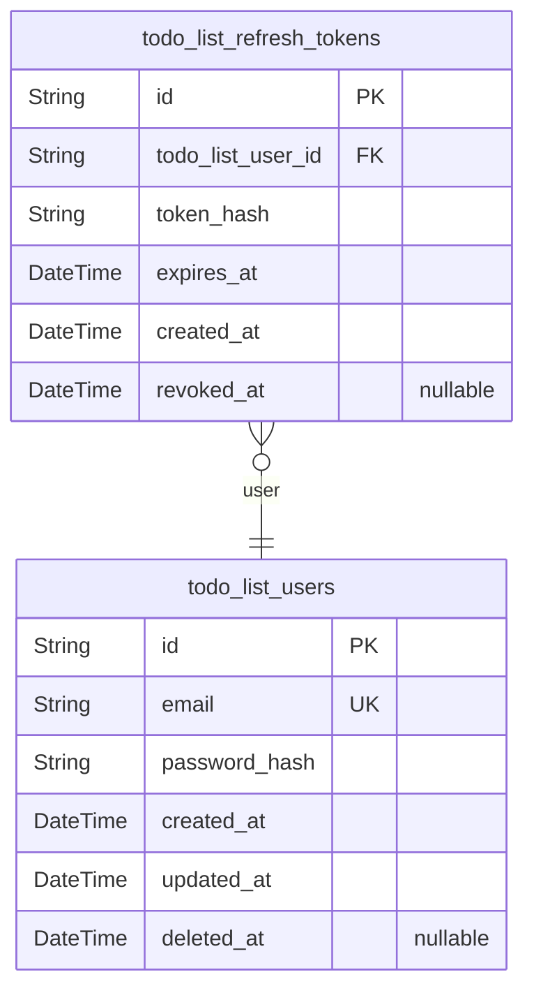
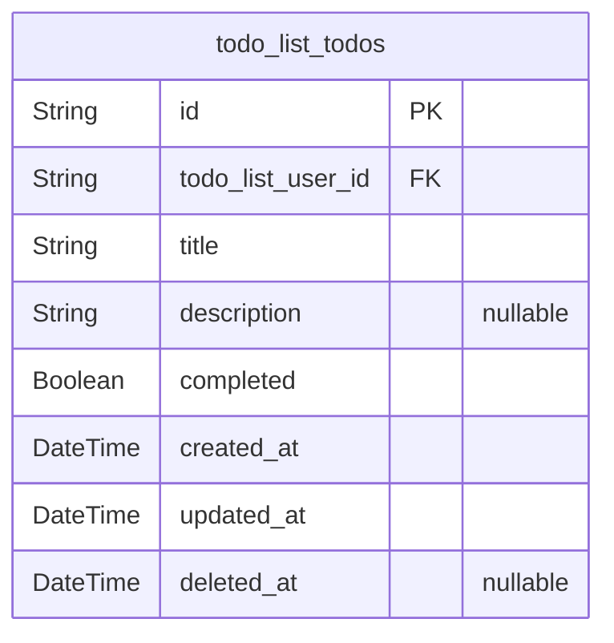

# Prisma Markdown

> Generated by [`prisma-markdown`](https://github.com/samchon/prisma-markdown)

- [Actors](#actors)
- [Todos](#todos)

## Actors

### `todo_list_users`

User accounts for the Todo list application. Represents authenticated
users who can create and manage their personal todo items. Each user
account stores authentication credentials and profile information. Users
are the foundation of the application - they must register and
authenticate before accessing any todo management features. This table
implements soft delete to support account closure while maintaining
referential integrity with existing todos.

Properties as follows:

- `id`: Primary Key.
- `email`
  > User's email address for authentication and identification. Must be
  > unique across all users. Used as the primary login credential. Normalized
  > to lowercase for case-insensitive comparison. Maximum 255 characters as
  > per validation requirements.
- `password_hash`
  > Securely hashed user password using bcrypt with minimum cost factor of
  > 10. Never stored in plain text. Used for authentication verification
  > during login. The hash is generated from passwords that meet minimum
  > security requirements: at least 8 characters, containing letters and
  > numbers.
- `created_at`
  > Timestamp when the user account was created. Immutable after creation.
  > Used for account age tracking and audit purposes.
- `updated_at`
  > Timestamp of the last modification to the user account. Updated
  > automatically whenever email or password is changed. Used for tracking
  > account activity and changes.
- `deleted_at`
  > Soft delete timestamp. When set, indicates the user account has been
  > deleted but data is retained temporarily. Null for active accounts.
  > Supports account deletion with grace period as per data management
  > requirements.

### `todo_list_refresh_tokens`

JWT refresh tokens for maintaining user sessions. Supports token-based
authentication system with automatic session renewal. Each token belongs
to a specific user and has a defined expiration period (30 days as per
authentication requirements). Tokens can be revoked when users log out or
change passwords. This table enables stateless JWT authentication while
providing server-side token validation and revocation capabilities.

Properties as follows:

- `id`: Primary Key.
- `todo_list_user_id`
  > Owner of this refresh token. References the user account this token
  > authenticates. [todo_list_users.id](#todo_list_users).
- `token_hash`
  > Securely hashed refresh token value. The actual token is hashed before
  > storage for security. Used to validate refresh token requests when users
  > need new access tokens.
- `expires_at`
  > Token expiration timestamp. Set to 30 days from issuance as per
  > authentication requirements. After this time, the token becomes invalid
  > and user must log in again.
- `created_at`
  > Timestamp when the refresh token was issued. Used for token age tracking
  > and audit purposes.
- `revoked_at`
  > Timestamp when the token was revoked. Null for active tokens. Set when
  > user logs out, changes password, or explicitly revokes the token. Revoked
  > tokens cannot be used even if not yet expired.

## Todos

### `todo_list_todos`

Core todo item entity representing user tasks. Each todo belongs to a
specific user and contains a title, optional description, and completion
status. This is the primary business entity of the application where
users manage their personal task lists. Todos support creation, viewing,
editing, status toggling, and deletion workflows. The table maintains
strict data isolation between users - each user can only access their own
todos.

Properties as follows:

- `id`: Primary Key.
- `todo_list_user_id`
  > Owner of this todo item. References the user who created this todo.
  > [todo_list_users.id](#todo_list_users)
- `title`
  > The main text describing the task. Required field with 1-200 characters.
  > Must contain at least one non-whitespace character. This is the primary
  > display text in todo lists.
- `description`
  > Optional detailed information about the task. Can be null or empty.
  > Maximum 2000 characters when provided. Provides additional context for
  > complex tasks.
- `completed`
  > Completion status indicating whether the task is finished. True means
  > completed, false means incomplete. Defaults to false for newly created
  > todos. Users can toggle this status unlimited times.
- `created_at`
  > Timestamp when this todo was created. System-generated upon todo
  > creation. Immutable - never changes after creation. Used for
  > chronological sorting and audit trails.
- `updated_at`
  > Timestamp when this todo was last modified. System-generated and
  > automatically updated on every modification. Changes whenever title,
  > description, or completion status is updated.
- `deleted_at`
  > Soft delete timestamp. Null indicates the todo is active. Non-null value
  > indicates when the todo was deleted. Supports data lifecycle management
  > and potential recovery processes.
