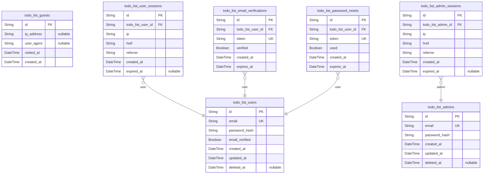
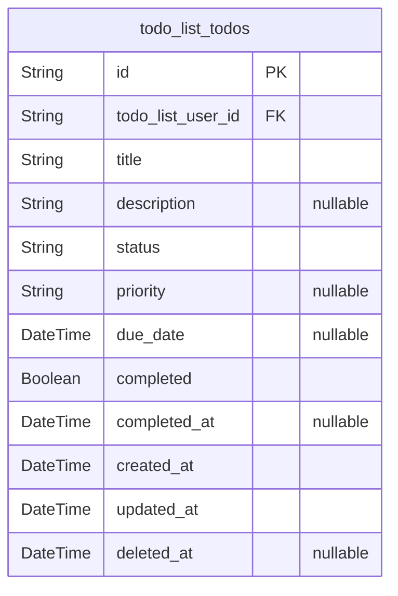

# Prisma Markdown

> Generated by [`prisma-markdown`](https://github.com/samchon/prisma-markdown)

- [Actors](#actors)
- [Todos](#todos)

## Actors

```mermaid
erDiagram
"todo_list_guests" {
  String id PK
  String ip_address "nullable"
  String user_agent "nullable"
  DateTime visited_at
  DateTime created_at
}
"todo_list_users" {
  String id PK
  String email UK
  String password_hash
  Boolean email_verified
  DateTime created_at
  DateTime updated_at
  DateTime deleted_at "nullable"
}
"todo_list_user_sessions" {
  String id PK
  String todo_list_user_id FK
  String ip
  String href
  String referrer
  DateTime created_at
  DateTime expired_at "nullable"
}
"todo_list_admins" {
  String id PK
  String email UK
  String password_hash
  DateTime created_at
  DateTime updated_at
  DateTime deleted_at "nullable"
}
"todo_list_admin_sessions" {
  String id PK
  String todo_list_admin_id FK
  String ip
  String href
  String referrer
  DateTime created_at
  DateTime expired_at "nullable"
}
"todo_list_email_verifications" {
  String id PK
  String todo_list_user_id FK
  String token UK
  Boolean verified
  DateTime created_at
  DateTime expires_at
}
"todo_list_password_resets" {
  String id PK
  String todo_list_user_id FK
  String token UK
  Boolean used
  DateTime created_at
  DateTime expires_at
}
"todo_list_user_sessions" }o--|| "todo_list_users" : user
"todo_list_admin_sessions" }o--|| "todo_list_admins" : admin
"todo_list_email_verifications" }o--|| "todo_list_users" : user
"todo_list_password_resets" }o--|| "todo_list_users" : user
```

### `todo_list_guests`

Unauthenticated visitor tracking for the Todo list application.

Represents anonymous visitors who have not registered or logged in. This
table tracks basic interaction data for guests accessing public pages
such as registration and login screens.

Guests have no access to todo management features and cannot create,
view, or modify any todo items. The primary purpose is to track visitor
engagement metrics and pre-registration behavior for analytics.

This is a subsidiary entity managed by the system for tracking purposes
rather than direct user management.

Properties as follows:

- `id`: Primary Key.
- `ip_address`: IP address of the guest visitor for tracking and security purposes.
- `user_agent`
  > Browser user agent string identifying the client application and device
  > type.
- `visited_at`: Timestamp when the guest first visited the application.
- `created_at`: Timestamp when this guest record was created in the system.

### `todo_list_users`

Authenticated user accounts for the Todo list application.

Represents registered members who can create, manage, and organize their
personal todo items. Each user account is identified by a unique email
address and secured with hashed password authentication.

Users have complete ownership and privacy of their todo data. Each user
can only access and modify their own todo items, ensuring strict data
isolation. The system enforces user-level permissions through JWT token
authentication.

This table stores core identity information including email credentials
and account status. Related user sessions are tracked in the
todo_list_user_sessions table for authentication management.

Users are the primary actors in the application, with full access to todo
creation, updating, completion tracking, filtering, sorting, and deletion
operations on their owned data.

Properties as follows:

- `id`: Primary Key.
- `email`
  > User email address used for authentication and account identification.
  > Must be unique across all user accounts.
- `password_hash`
  > Securely hashed user password using bcrypt with minimum cost factor of
  > 10. Never store plain text passwords.
- `email_verified`
  > Whether the user has verified their email address. Users must verify
  > email before accessing full application features.
- `created_at`: Timestamp when the user account was created during registration.
- `updated_at`: Timestamp when the user account information was last modified.
- `deleted_at`
  > Soft deletion timestamp. When set, indicates the user account has been
  > deleted but preserved for audit purposes.

### `todo_list_user_sessions`

Active authentication sessions for registered users.

Tracks user login sessions with connection context and temporal
information for security audit trails. Each session represents a distinct
login event from a specific device or location.

Users can have multiple concurrent sessions across different devices.
Session data enables tracking of user activity, detecting suspicious
login patterns, and providing users visibility into their active sessions
for security management.

Sessions are automatically created upon successful user authentication
and can be terminated through logout actions. The system invalidates all
sessions when security-sensitive operations occur, such as password
changes.

This subsidiary entity is managed through user authentication workflows
rather than direct user manipulation.

Properties as follows:

- `id`: Primary Key.
- `todo_list_user_id`
  > Reference to the authenticated user who owns this session. {@link
  > todo_list_users.id}
- `ip`: IP address from which the session connection was established.
- `href`: Connection URL where the session was initiated.
- `referrer`: Referrer URL that led to the session creation.
- `created_at`: Session creation timestamp when the user successfully authenticated.
- `expired_at`
  > Session expiration timestamp when the session ended or was terminated.
  > Null for active sessions.

### `todo_list_admins`

System administrator accounts with elevated privileges.

Represents administrative users who can manage user accounts, monitor
system health, and perform system-wide operations. Admins have access to
administrative functions including user management, system statistics,
and configuration.

For their personal todo management, admins follow the same data ownership
rules as regular users - they can only access and modify their own todo
items. Administrative privileges do not grant access to other users'
private todo data except for legitimate support purposes with audit
logging.

Admin accounts are created by existing administrators through elevated
authentication processes. Each admin action is logged for accountability
and security compliance.

This is a primary entity requiring independent account management and
authentication workflows separate from regular user accounts.

Properties as follows:

- `id`: Primary Key.
- `email`
  > Administrator email address used for authentication. Must be unique
  > across all admin accounts.
- `password_hash`
  > Securely hashed administrator password using bcrypt. Admin passwords
  > follow the same security requirements as user passwords.
- `created_at`: Timestamp when the administrator account was created.
- `updated_at`: Timestamp when the administrator account information was last modified.
- `deleted_at`
  > Soft deletion timestamp for admin accounts. Maintains audit trail for
  > removed administrator access.

### `todo_list_admin_sessions`

Active authentication sessions for system administrators.

Tracks administrator login sessions with connection metadata for security
monitoring and audit trails. Admin sessions are managed separately from
user sessions to enable distinct security policies and monitoring.

All administrative actions are associated with specific sessions for
accountability. The system logs session creation, activity, and
termination to maintain comprehensive audit trails of administrator
access.

Admin sessions follow the same concurrent session support as user
sessions, allowing administrators to maintain multiple active sessions
across different devices.

This subsidiary entity is managed through administrative authentication
workflows.

Properties as follows:

- `id`: Primary Key.
- `todo_list_admin_id`
  > Reference to the administrator who owns this session. {@link
  > todo_list_admins.id}
- `ip`: IP address from which the admin session connection was established.
- `href`: Connection URL where the admin session was initiated.
- `referrer`: Referrer URL that led to the admin session creation.
- `created_at`: Admin session creation timestamp when authentication succeeded.
- `expired_at`: Admin session expiration timestamp. Null for currently active sessions.

### `todo_list_email_verifications`

Email verification tokens for user account activation.

Stores unique verification tokens sent to users during registration to
confirm email ownership. Each token is associated with a user account and
has a limited validity period for security.

When a user registers, the system generates a verification token and
sends it via email. Users must click the verification link containing the
token to activate their account and gain full access to the application.

Tokens expire after 24 hours to prevent abuse. Expired tokens require
users to request a new verification email. Once a token is successfully
used for verification, it becomes invalid to prevent reuse.

This subsidiary entity is managed through the registration and email
verification workflow rather than direct user interaction.

Properties as follows:

- `id`: Primary Key.
- `todo_list_user_id`
  > Reference to the user account requiring email verification. {@link
  > todo_list_users.id}
- `token`
  > Unique verification token sent to the user's email address. Used to
  > verify email ownership.
- `verified`
  > Whether this verification token has been successfully used. Once
  > verified, the token cannot be reused.
- `created_at`: Timestamp when the verification token was generated and email was sent.
- `expires_at`
  > Timestamp when this verification token expires. Tokens are valid for 24
  > hours after creation.

### `todo_list_password_resets`

Password reset tokens for account recovery workflows.

Manages secure password reset tokens for users who have forgotten their
passwords. Each token provides time-limited access to reset account
credentials.

When a user requests password reset, the system generates a unique token
and sends it via email. The token is valid for 1 hour, providing a secure
window for password reset while minimizing exposure risk.

Tokens are single-use - once successfully used to reset a password, they
become invalid. All active user sessions are terminated when a password
is reset for security.

The system displays success messages for password reset requests
regardless of whether the email exists, preventing email enumeration
attacks.

This subsidiary entity is managed through the password reset workflow and
is not directly manipulated by users.

Properties as follows:

- `id`: Primary Key.
- `todo_list_user_id`
  > Reference to the user account requesting password reset. {@link
  > todo_list_users.id}
- `token`
  > Unique password reset token sent to the user's email. Used to
  > authenticate password reset requests.
- `used`
  > Whether this reset token has been used to successfully reset the
  > password. Prevents token reuse.
- `created_at`: Timestamp when the password reset token was generated and email was sent.
- `expires_at`
  > Timestamp when this password reset token expires. Tokens are valid for 1
  > hour after creation.

## Todos

```mermaid
erDiagram
"todo_list_todos" {
  String id PK
  String todo_list_user_id FK
  String title
  String description "nullable"
  String status
  String priority "nullable"
  DateTime due_date "nullable"
  Boolean completed
  DateTime completed_at "nullable"
  DateTime created_at
  DateTime updated_at
  DateTime deleted_at "nullable"
}
```

### `todo_list_todos`

Core todo item entity representing user tasks and their management
lifecycle.

Stores individual todo items created by authenticated users for personal
task tracking and productivity management.
Each todo represents a single actionable task with attributes for
organization, prioritization, and completion tracking.

Todos are owned by individual users with complete data isolation - users
can only access and modify their own todo items.
The system enforces strict ownership boundaries ensuring privacy and data
security across all operations.

Each todo contains essential task information including title, optional
description, due date, priority level, and completion status.
The status field tracks the todo's lifecycle through pending,
in_progress, completed, and cancelled states.
Completion tracking uses both a boolean flag and timestamp to record when
tasks are finished.

Soft deletion is supported through the deleted_at field, allowing todos
to be removed from active views while preserving data for potential
recovery and audit purposes.
All modifications are tracked via updated_at timestamp to maintain
comprehensive audit trails.

Todos support advanced organization through priority levels (low, medium,
high) and optional due dates for deadline management.
The system provides filtering, sorting, and searching capabilities to
help users efficiently manage large todo lists.

This is the primary business entity of the Todo List application,
requiring full CRUD API operations and independent user management
capabilities.

Properties as follows:

- `id`: Primary Key.
- `todo_list_user_id`: Owner user who created this todo item. [todo_list_users.id](#todo_list_users)
- `title`
  > Todo item title - the primary description of the task. Required field
  > with maximum 200 characters. This is the main text users see in their
  > todo list.
- `description`
  > Optional detailed description providing additional context, notes, or
  > instructions for the task. Maximum 2000 characters. Can be empty if the
  > title is self-explanatory.
- `status`
  > Current lifecycle status of the todo item. Valid values: pending (initial
  > state), in_progress (actively working), completed (finished), cancelled
  > (abandoned). Tracks the todo's workflow state.
- `priority`
  > Task priority level for organization and sorting. Valid values: low,
  > medium, high. Defaults to medium when not specified. Helps users identify
  > and focus on important tasks.
- `due_date`
  > Optional deadline for task completion. Supports past dates for backdating
  > and future dates for planning. Used for overdue detection and timeline
  > organization. Null indicates no specific deadline.
- `completed`
  > Boolean flag indicating whether the task is completed. True when status
  > is completed, false otherwise. Provides quick completion status checking
  > without parsing status field.
- `completed_at`
  > Timestamp recording when the todo was marked as completed. Set
  > automatically when status changes to completed. Cleared when todo is
  > marked incomplete. Null for incomplete todos.
- `created_at`
  > Timestamp when the todo item was created. Set automatically by the system
  > at creation time. Immutable field used for chronological ordering and
  > analytics.
- `updated_at`
  > Timestamp of the most recent modification to any field of the todo item.
  > Updated automatically by the system whenever the todo is changed. Used
  > for tracking recent activity and conflict detection.
- `deleted_at`
  > Soft deletion timestamp indicating when the todo was deleted. Null for
  > active todos. When set, the todo is excluded from normal queries while
  > preserved for audit trails and potential recovery.
