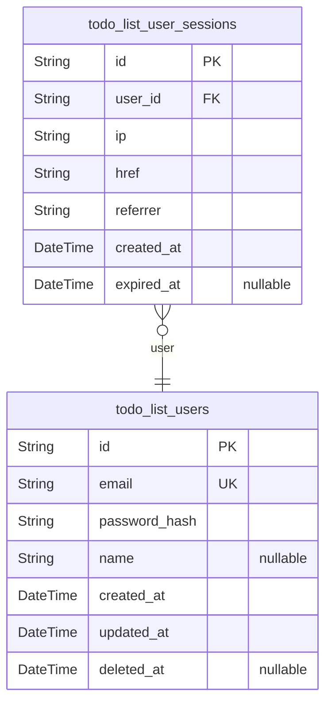
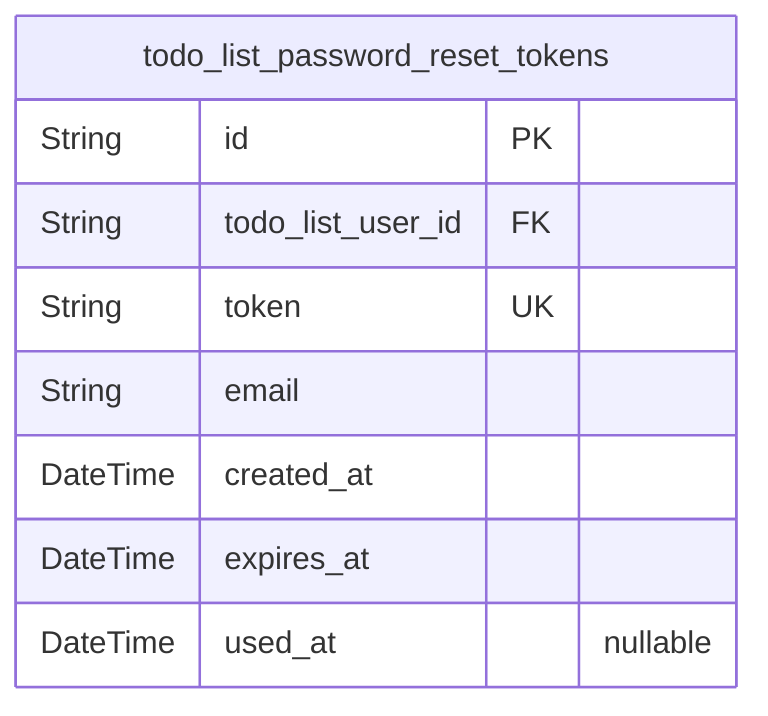
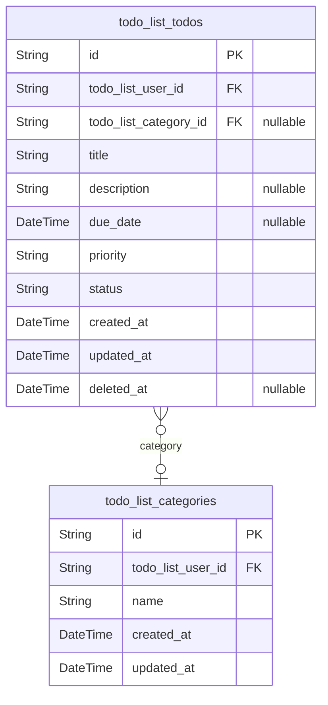

# Prisma Markdown

> Generated by [`prisma-markdown`](https://github.com/samchon/prisma-markdown)

- [Actors](#actors)
- [Auth](#auth)
- [Todos](#todos)

## Actors

```mermaid
erDiagram
"todo_list_users" {
  String id PK
  String email UK
  String password_hash
  String name "nullable"
  DateTime created_at
  DateTime updated_at
  DateTime deleted_at "nullable"
}
"todo_list_user_sessions" {
  String id PK
  String user_id FK
  String ip
  String href
  String referrer
  DateTime created_at
  DateTime expired_at "nullable"
}
"todo_list_user_sessions" }o--|| "todo_list_users" : user
```

### `todo_list_users`

Authenticated user accounts for the Todo list application.

Stores core user identity and authentication credentials for individuals
who register and use the system. Each user account provides complete data
isolation, ensuring users can only access their own todo items and
personal information.

Users authenticate using email and password, with passwords stored as
cryptographically secure hashes using bcrypt. The email address serves as
the unique identifier for login and account recovery purposes.

User accounts support the complete lifecycle from registration through
active use to optional deletion with 30-day soft delete recovery period.
The system maintains creation and modification timestamps for audit
purposes.

All user data is completely isolated - no user can access another user's
information or todo items under any circumstances. This table forms the
foundation of the application's security model through proper
authentication and authorization enforcement.

Properties as follows:

- `id`: Primary Key.
- `email`
  > User email address for authentication and communication. Must be unique
  > across all users and serves as the login identifier. Validated for proper
  > email format and used for account recovery.
- `password_hash`
  > Cryptographically hashed password using bcrypt with cost factor of at
  > least 12. Never stored in plain text. Used for authentication
  > verification during login.
- `name`
  > User's display name for personalization. Optional field that can be
  > provided during registration or updated later. Used in welcome messages
  > and user interface personalization.
- `created_at`
  > Timestamp when the user account was created during registration.
  > Immutable after creation and used for account age tracking and audit
  > purposes.
- `updated_at`
  > Timestamp of the last modification to user profile information. Updated
  > whenever email, password, or name is changed. Used for tracking account
  > activity.
- `deleted_at`
  > Soft delete timestamp indicating when user requested account deletion.
  > Null for active accounts. When set, account enters 30-day recovery period
  > before permanent deletion. Used to support account recovery and data
  > retention policies.

### `todo_list_user_sessions`

User authentication session tracking for JWT token management.

Records active user sessions for authenticated access to the Todo list
application. Each session represents a login instance from a specific
device or browser, tracking connection context and session lifecycle.

Sessions are created upon successful user login and store connection
metadata including IP address, connection URL, and referrer information
for security auditing. The session tracks when it was created and when it
expires to enforce authentication timeout policies.

Supports multiple concurrent sessions per user, allowing login from
different devices simultaneously. Sessions can be individually revoked
through logout functionality or bulk revoked when user changes password
or requests "logout from all devices".

Used for audit tracing of user actions and maintaining secure
authentication state through JWT refresh token management. Session
expiration follows configured timeout policies (7 days standard, 30 days
with "Remember Me").

Properties as follows:

- `id`: Primary Key.
- `user_id`: Reference to the user who owns this session. [todo_list_users.id](#todo_list_users)
- `ip`
  > IP address from which the user connected and created this session. Used
  > for security monitoring and detecting suspicious login patterns from
  > unusual locations.
- `href`
  > Connection URL where the session was initiated. Captures the full URL of
  > the login request for audit and debugging purposes.
- `referrer`
  > Referrer URL indicating where the user came from before logging in. Used
  > for tracking user acquisition sources and navigation patterns.
- `created_at`
  > Timestamp when the session was created during user login. Marks the
  > beginning of the authenticated session period.
- `expired_at`
  > Timestamp when the session expires or was explicitly terminated. Null for
  > active sessions. Set upon logout, password change, or automatic
  > expiration after timeout period.

## Auth

```mermaid
erDiagram
"todo_list_password_reset_tokens" {
  String id PK
  String todo_list_user_id FK
  String token UK
  String email
  DateTime created_at
  DateTime expires_at
  DateTime used_at "nullable"
}
```

### `todo_list_password_reset_tokens`

Password reset tokens for secure account recovery.

Stores temporary, time-limited tokens sent via email when users request
password resets. Each token is cryptographically secure, single-use, and
expires after 1 hour to maintain security.

Tokens are created when users initiate password reset through the "Forgot
Password" flow. The system generates a unique token, stores it with the
user's email, and sends a reset link containing the token. When users
click the reset link, the system validates the token hasn't expired or
been used, then allows password update.

After successful password reset or token expiration, tokens are
permanently deleted from the system. This table supports the self-service
password recovery mechanism while maintaining strict security controls.

Multiple tokens can exist for the same user if they request password
reset multiple times before using a token, though only unexpired tokens
are valid for password reset operations.

Properties as follows:

- `id`: Primary Key.
- `todo_list_user_id`: User who requested the password reset. [todo_list_users.id](#todo_list_users)
- `token`
  > Cryptographically secure random token sent in password reset email. Must
  > be unique across all active tokens to prevent collisions. Used to verify
  > password reset requests.
- `email`
  > Email address where the password reset link was sent. Stored for
  > validation to ensure the token is used with the correct email, providing
  > additional security layer.
- `created_at`
  > Timestamp when the password reset token was generated. Used to calculate
  > token expiration (tokens expire 1 hour after creation).
- `expires_at`
  > Timestamp when this token becomes invalid. Set to 1 hour after creation.
  > System rejects password reset attempts using expired tokens.
- `used_at`
  > Timestamp when the token was successfully used to reset password. Null
  > for unused tokens. Once set, the token cannot be reused, enforcing
  > single-use security requirement.

## Todos

```mermaid
erDiagram
"todo_list_todos" {
  String id PK
  String todo_list_user_id FK
  String todo_list_category_id FK "nullable"
  String title
  String description "nullable"
  DateTime due_date "nullable"
  String priority
  String status
  DateTime created_at
  DateTime updated_at
  DateTime deleted_at "nullable"
}
"todo_list_categories" {
  String id PK
  String todo_list_user_id FK
  String name
  DateTime created_at
  DateTime updated_at
}
"todo_list_todos" }o--o| "todo_list_categories" : category
```

### `todo_list_todos`

Todo items representing user tasks and action items.

Stores individual todo entries created by authenticated users to track
tasks, goals, and action items. Each todo belongs to exactly one user and
maintains complete data isolation between users.

Todos support rich metadata including titles, descriptions, due dates,
priority levels, and completion status. The status field tracks workflow
progression between pending and completed states, allowing users to mark
tasks as done while preserving the todo for historical reference.

The priority field enforces strict validation at the database level to
ensure only valid priority values (low, medium, high) are stored,
preventing data integrity issues from any data entry method including
direct database access, migrations, or third-party integrations.

Soft deletion is implemented through the deleted_at timestamp, providing
a 30-day recovery period before permanent deletion. Deleted todos remain
in the database but are filtered from normal queries, allowing users to
restore accidentally deleted items.

Categories provide optional organization capabilities, allowing users to
group related todos without requiring categorization for basic
functionality.

Properties as follows:

- `id`: Primary Key.
- `todo_list_user_id`: Owner user who created this todo item. [todo_list_users.id](#todo_list_users).
- `todo_list_category_id`
  > Optional category for organizing related todos. {@link
  > todo_list_categories.id}.
- `title`
  > Brief description of the task to be completed. Required field serving as
  > the primary identifier users see for each todo item. Maximum length 200
  > characters.
- `description`
  > Detailed notes or additional context about the todo item. Optional field
  > supporting longer explanations, instructions, or related information.
  > Maximum length 2000 characters.
- `due_date`
  > Optional deadline or target completion date for this todo item. Users can
  > set due dates to track time-sensitive tasks and receive reminders.
  > Supports past dates for tracking overdue items.
- `priority`
  > Priority level indicating task urgency or importance. Database-enforced
  > enum with valid values: low, medium, high. Defaults to medium if not
  > specified. Helps users identify which tasks require immediate attention.
  > CHECK constraint ensures data integrity at database level.
- `status`
  > Current completion status of the todo item. Database-enforced enum with
  > valid values: pending (incomplete), completed (finished). Defaults to
  > pending for new todos. Status can transition freely between pending and
  > completed as users toggle completion state. CHECK constraint ensures data
  > integrity at database level.
- `created_at`
  > Timestamp when this todo item was originally created. Automatically set
  > by the system upon creation and never modified. Used for displaying
  > creation dates and sorting todos chronologically.
- `updated_at`
  > Timestamp when this todo item was last modified. Automatically updated
  > whenever any field changes including status toggles, title edits, or
  > metadata updates. Tracks most recent activity on the todo.
- `deleted_at`
  > Soft deletion timestamp indicating when the user deleted this todo. Null
  > for active todos. When set, the todo is hidden from normal views but
  > retained for 30 days to support recovery. After 30 days, todos are
  > permanently deleted.

### `todo_list_categories`

Categories for organizing and grouping related todo items.

Provides optional organizational structure allowing users to group
related todos into named categories such as Work, Personal, Shopping, or
Health. Each category belongs to a specific user and maintains data
isolation.

Categories are entirely optional - users can manage todos without
categorization. When used, categories help users filter and organize
large todo lists by applying category-based views.

The system supports user-specific categories, meaning each user maintains
their own category list independent of other users. Category names are
validated for uniqueness per user to prevent confusion.

Future enhancements may include category sharing, hierarchical
categories, or default system categories, which this normalized structure
supports without schema modifications.

Properties as follows:

- `id`: Primary Key.
- `todo_list_user_id`: Owner user who created this category. [todo_list_users.id](#todo_list_users).
- `name`
  > Category name for organizing todos. Required field representing the
  > user-visible category label such as Work, Personal, Shopping, or Health.
  > Maximum length 50 characters. Must be unique per user.
- `created_at`
  > Timestamp when this category was originally created. Automatically set by
  > the system upon creation.
- `updated_at`
  > Timestamp when this category was last modified. Automatically updated
  > whenever the category name or other properties change.
