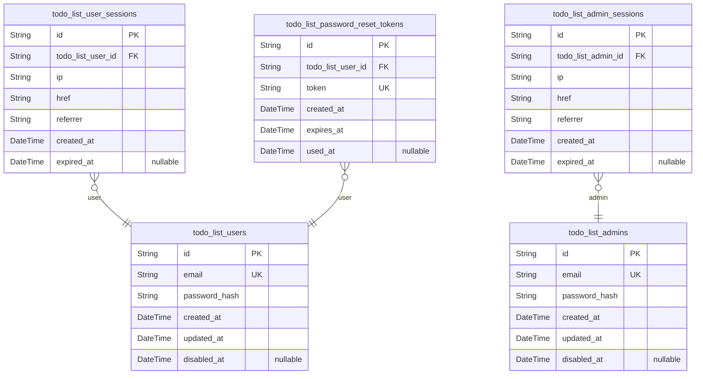
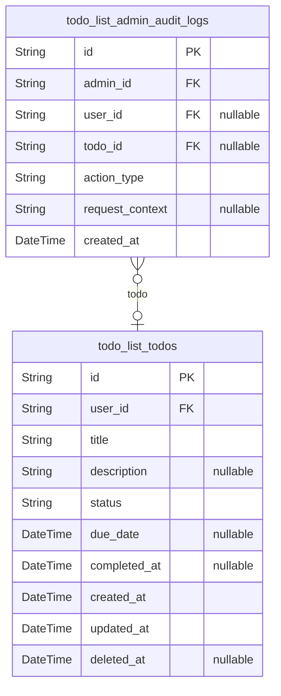

# Prisma Markdown

> Generated by [`prisma-markdown`](https://github.com/samchon/prisma-markdown)

- [Actors](#actors)
- [Todos](#todos)

## Actors

```mermaid
erDiagram
"todo_list_users" {
  String id PK
  String email UK
  String password_hash
  DateTime created_at
  DateTime updated_at
  DateTime disabled_at "nullable"
}
"todo_list_user_sessions" {
  String id PK
  String todo_list_user_id FK
  String ip
  String href
  String referrer
  DateTime created_at
  DateTime expired_at "nullable"
}
"todo_list_admins" {
  String id PK
  String email UK
  String password_hash
  DateTime created_at
  DateTime updated_at
  DateTime disabled_at "nullable"
}
"todo_list_admin_sessions" {
  String id PK
  String todo_list_admin_id FK
  String ip
  String href
  String referrer
  DateTime created_at
  DateTime expired_at "nullable"
}
"todo_list_password_reset_tokens" {
  String id PK
  String todo_list_user_id FK
  String token UK
  DateTime created_at
  DateTime expires_at
  DateTime used_at "nullable"
}
"todo_list_user_sessions" }o--|| "todo_list_users" : user
"todo_list_admin_sessions" }o--|| "todo_list_admins" : admin
"todo_list_password_reset_tokens" }o--|| "todo_list_users" : user
```

### `todo_list_users`

Registered user accounts for the Todo List application.

Each record uniquely identifies an end user by email and handles all
authentication, authorization, and session initiation actions. Stores
password hash for credential validation (never raw password). Designed
for personal and private account management, ensuring 100% data isolation
from other users. All user actions against Todos trace back to this
table. Enforces uniqueness on email and supports audit and compliance
requirements for minimal user data retention.

Properties as follows:

- `id`: Primary Key. Universally unique identifier for this user account.
- `email`
  > Unique email address for user login and correspondence. Must be globally
  > unique per requirements.
- `password_hash`
  > Bcrypt, Argon2 or similar salted password hash. Never store plaintext
  > passwords. Used only for login validation.
- `created_at`: Timestamp of account creation (ISO8601, always present).
- `updated_at`: Timestamp of most recent account update (ISO8601, always present).
- `disabled_at`
  > Timestamp indicating when the account was administratively disabled
  > (nullable; null means active).

### `todo_list_user_sessions`

User session records for authenticated access tracking.

Each session entry records a specific authenticated connection by a user,
supporting full audit and security best practices. Tracks creation and
expiry with environment/context fields for compliance. Sessions can be
invalidated (expired_at) either by timeout, logout, or security events.
Only references the user table for data isolation, never other
session/user types. Auditable for every access as required by system
policies.

Properties as follows:

- `id`: Primary Key. Unique identifier for this user session record.
- `todo_list_user_id`
  > Reference to the authenticated user for this session. {@link
  > todo_list_users.id}.
- `ip`
  > IP address at session initiation. Captured for audit and anomaly
  > detection.
- `href`
  > Connection URL (origin) for session. Provides traceability for session
  > context.
- `referrer`
  > Client referrer URL at session start. Used for security and compliance
  > investigation.
- `created_at`: Timestamp of session creation (ISO8601).
- `expired_at`
  > Timestamp when session was terminated, expired, or forcibly ended by
  > security policy (nullable if still active).

### `todo_list_admins`

Platform administrator accounts with privileged access over all user data
and Todos.

Admin records support authentication, credential management, and
audit/compliance oversight. Each admin account has its own unique email
and secure password hash; no mixing with user roles is permitted.
Administrators can log in for support, moderation, or audit functions.
Disabling of admin accounts is allowed for compliance and incident
response. All admin actions in the system are attributable to records in
this table.

Properties as follows:

- `id`: Primary Key. Universally unique identifier for admin account.
- `email`: Unique admin account email, used for login and audit tracking.
- `password_hash`
  > Hashed admin password for credential validation. Raw passwords are never
  > stored.
- `created_at`: Timestamp recording when admin account was first created.
- `updated_at`: Timestamp for last admin account update.
- `disabled_at`
  > Timestamp when admin account was deactivated or disabled for
  > compliance/security.

### `todo_list_admin_sessions`

Administrator session records for system and data access tracking.

Tracks individual admin logins and session histories with context fields
(IP, href, referrer). Sessions are recorded independently of user
sessions and only reference admin account table. Full audit trail for all
administrative access, in support of compliance and incident response
requirements. Sessions may be rendered inactive via expired_at when
forcibly terminated or logged out.

Properties as follows:

- `id`: Primary Key. Globally unique identifier for this admin session.
- `todo_list_admin_id`
  > Reference to the administrator owning this session. {@link
  > todo_list_admins.id}.
- `ip`: IP address for audit, risk management, and geo/country tracking.
- `href`: Session initiation URL for context/audit.
- `referrer`: Referrer URL at session start for anomaly or attack detection.
- `created_at`: Session start timestamp.
- `expired_at`: When session ended/expired. Null means currently active session.

### `todo_list_password_reset_tokens`

Password reset tokens for secure credential recovery flows.

Each record stores a per-user, one-time-use token valid for password
reset. Tokens are securely generated, time-limited, and are tightly
linked to a specific user. Only valid, unexpired, and unused tokens may
be applied for recovering access to a user account. Used token records
remain in the system for audit trail purposes. This table is solely for
credential reset/recovery and not for login/session flows.

Properties as follows:

- `id`: Primary Key. Unique identifier per token record.
- `todo_list_user_id`: Reference to user who owns this reset token. [todo_list_users.id](#todo_list_users).
- `token`
  > Reset token string. Securely random, used only for password reset
  > operations.
- `created_at`: Timestamp when the reset token was created.
- `expires_at`: Expiration datetime, after which further use is forbidden.
- `used_at`: Timestamp of use (if any). Null means token unused and active.

## Todos

```mermaid
erDiagram
"todo_list_todos" {
  String id PK
  String user_id FK
  String title
  String description "nullable"
  String status
  DateTime due_date "nullable"
  DateTime completed_at "nullable"
  DateTime created_at
  DateTime updated_at
  DateTime deleted_at "nullable"
}
"todo_list_admin_audit_logs" {
  String id PK
  String admin_id FK
  String user_id FK "nullable"
  String todo_id FK "nullable"
  String action_type
  String request_context "nullable"
  DateTime created_at
}
"todo_list_admin_audit_logs" }o--o| "todo_list_todos" : todo
```

### `todo_list_todos`

User-created task (Todo) entity representing an individual actionable
item in a personal task list.

Each todo belongs to exactly one registered user and records essential
details such as title, optional description, due date, and business
status (pending, completed, or deleted). Provides complete auditability
with timestamps for creation, modification, deletion, and completion
event. This model enforces strict user-only ownership and visibility,
supporting full CRUD lifecycle and compliance audit via foreign
references. Referential integrity protects against orphaned records and
ensures privacy.

Supporting indexes enable fast lookups by owner, status, and due date for
responsive user flows. All behaviors align with minimal, privacy-focused
product requirements and EARS-specified business rules.

Properties as follows:

- `id`: Primary Key. Universally unique identifier for each todo record.
- `user_id`
  > Reference to the owning user. Must point to an existing user. {@link
  > todo_list_users.id}.
- `title`
  > Todo item title. Required, non-empty text up to 100 characters.
  > Validation enforced on creation and update to maintain business
  > constraints.
- `description`
  > Optional descriptive text (max 500 characters). May be null or omitted if
  > not provided by user.
- `status`
  > Todo status: allowed values are 'pending', 'completed', or 'deleted'.
  > Used for business workflow, filtering, and access control. Status changes
  > follow task lifecycle state machine.
- `due_date`
  > Optional due date for the todo. Must be today or future, if present. Used
  > for sorting and reminders.
- `completed_at`
  > Timestamp marking the moment the todo was marked as completed by the
  > user. Null if not completed.
- `created_at`: Timestamp of initial creation. Immutable after insert.
- `updated_at`
  > Timestamp of the last update. Modified on every business change or status
  > transition.
- `deleted_at`: Timestamp indicating when the todo was soft deleted. Null if not deleted.

### `todo_list_admin_audit_logs`

Administrative action and compliance audit log capturing all critical
administrative interactions with user or todo data.

Stores immutable, append-only audit trail entries recording which admin
performed which tracked action (create, update, access, delete, etc.), on
what entity (user, todo), and with what context. Each log links the actor
(admin), optionally impacted user, and target todo (if any), supporting
detailed compliance and accountability reviews. Fields include mandatory
timestamps, request metadata, and detailed action descriptors. Indexes
support rapid security, audit, and compliance queries.

Never contains business entity data itself; provides operational
transparency without cross-contaminating business state.

Properties as follows:

- `id`: Primary Key. Universally unique audit log entry identifier.
- `admin_id`
  > Reference to the admin actor who performed the action. Always points to a
  > valid admin. [todo_list_admins.id](#todo_list_admins).
- `user_id`
  > User affected by the action, if applicable. May be null for purely admin
  > system operations. [todo_list_users.id](#todo_list_users).
- `todo_id`
  > Related todo item if the action targets a specific task. Null if the
  > action does not pertain to a specific todo. [todo_list_todos.id](#todo_list_todos).
- `action_type`
  > Categorical action label (e.g., 'create', 'update', 'delete', 'access').
  > Defines the type of operation performed by admin.
- `request_context`
  > Optional extended, machine-readable metadata about the admin request
  > context (e.g., IP, session, endpoint). Useful for forensics and
  > compliance situations.
- `created_at`
  > Timestamp of when the audit log record was created. Immutable and set
  > automatically at write time.
