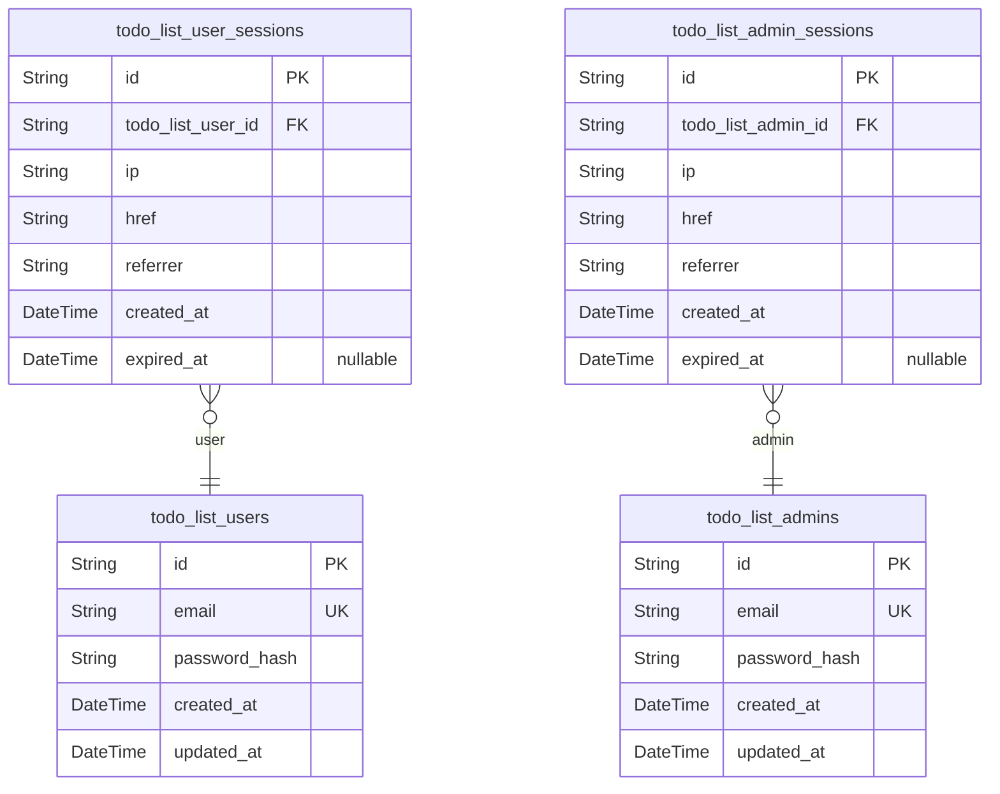
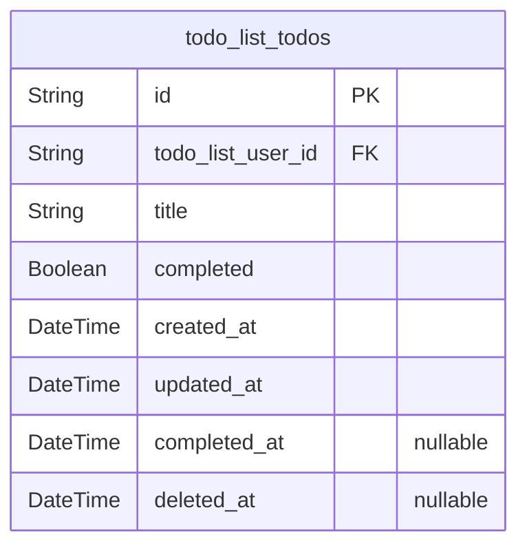

# Prisma Markdown

> Generated by [`prisma-markdown`](https://github.com/samchon/prisma-markdown)

- [Actors](#actors)
- [Todos](#todos)

## Actors

```mermaid
erDiagram
"todo_list_users" {
  String id PK
  String email UK
  String password_hash
  DateTime created_at
  DateTime updated_at
}
"todo_list_user_sessions" {
  String id PK
  String todo_list_user_id FK
  String ip
  String href
  String referrer
  DateTime created_at
  DateTime expired_at "nullable"
}
"todo_list_admins" {
  String id PK
  String email UK
  String password_hash
  DateTime created_at
  DateTime updated_at
}
"todo_list_admin_sessions" {
  String id PK
  String todo_list_admin_id FK
  String ip
  String href
  String referrer
  DateTime created_at
  DateTime expired_at "nullable"
}
"todo_list_user_sessions" }o--|| "todo_list_users" : user
"todo_list_admin_sessions" }o--|| "todo_list_admins" : admin
```

### `todo_list_users`

Regular user accounts for the Todo list application.

Represents authenticated users who can create and manage their personal
todo items. Each user account is identified by a unique email address and
secured with a hashed password. Users register through the public
registration flow and gain immediate access to create their personal todo
lists.

User accounts are completely isolated from each other - users can only
view and manage their own todo items. The system enforces strict data
boundaries to ensure privacy and security across all user operations.

This table stores core authentication credentials and account metadata.
Session management for users is handled through the related
todo_list_user_sessions table, which tracks JWT refresh tokens and
connection information for security and audit purposes.

Properties as follows:

- `id`: Primary Key.
- `email`
  > User's email address used for authentication and unique identification.
  > Must be unique across all user accounts. Email addresses are normalized
  > to lowercase for consistency and case-insensitive comparison.
- `password_hash`
  > Securely hashed user password using industry-standard hashing algorithms
  > (bcrypt or argon2). The original password is never stored in plain text.
  > This hash is used to verify user credentials during authentication.
- `created_at`
  > Timestamp when the user account was created. Automatically set during
  > registration and never modified thereafter. Used for account lifecycle
  > tracking and analytics.
- `updated_at`
  > Timestamp of the last modification to the user account. Updated whenever
  > account information changes, such as password updates or email
  > modifications.

### `todo_list_user_sessions`

User authentication sessions for JWT refresh token management.

Tracks active user sessions to support JWT-based authentication with
access and refresh tokens. Each session represents a user's authenticated
connection from a specific device or browser. Sessions store connection
context (IP address, URL, referrer) for security auditing and
troubleshooting.

Sessions are created when users log in and expire based on the refresh
token lifetime (typically 7-30 days). The expired_at field tracks when a
session ends, either through explicit logout, token expiration, or
security-related revocation (such as password changes).

This table enables session revocation capabilities essential for security
operations like logout, password resets, and "logout from all devices"
functionality. Multiple concurrent sessions per user are supported to
allow access from different devices simultaneously.

Properties as follows:

- `id`: Primary Key.
- `todo_list_user_id`: User who owns this session. [todo_list_users.id](#todo_list_users).
- `ip`
  > IP address from which the session was established. Used for security
  > monitoring, audit trails, and identifying suspicious authentication
  > patterns.
- `href`
  > Connection URL where the authentication request originated. Provides
  > context about the application entry point for this session.
- `referrer`
  > Referrer URL indicating the page or source that led to the authentication
  > request. Helps track user navigation patterns and authentication flow
  > origins.
- `created_at`
  > Timestamp when the session was created through user login. Marks the
  > beginning of this authenticated session period.
- `expired_at`
  > Timestamp when the session ended or will end. Null for active sessions.
  > Set when user logs out, token expires, or session is revoked for security
  > reasons (password change, admin action).

### `todo_list_admins`

Administrator accounts with elevated system privileges.

Represents system administrators who have elevated permissions for user
management, system monitoring, and administrative operations. Admins
authenticate using the same JWT-based mechanism as regular users but
receive tokens with admin role and expanded permissions.

Admins can perform operations beyond regular user capabilities including
viewing all user accounts, managing user status
(activation/deactivation), accessing system-wide statistics, and
supporting users by viewing their data for troubleshooting purposes. All
administrative actions are logged for accountability and security
auditing.

Admins also have their own personal todo lists separate from their
administrative functions. When managing todos, admins operate under the
same constraints as regular users - they can only manage their own
personal todo items.

Admin accounts are created through separate administrative processes
rather than public registration. The authentication and session
management follows the same secure patterns as regular users to maintain
consistent security posture across all actor types.

Properties as follows:

- `id`: Primary Key.
- `email`
  > Administrator's email address used for authentication and identification.
  > Must be unique across all admin accounts. Email addresses are normalized
  > to lowercase for consistency.
- `password_hash`
  > Securely hashed administrator password using industry-standard hashing
  > algorithms (bcrypt or argon2). Admins must use strong passwords meeting
  > the same security requirements as regular users.
- `created_at`
  > Timestamp when the administrator account was created. Used for account
  > lifecycle tracking and administrative auditing purposes.
- `updated_at`
  > Timestamp of the last modification to the administrator account. Updated
  > when account credentials or information changes.

### `todo_list_admin_sessions`

Administrator authentication sessions for JWT refresh token management.

Tracks active administrator sessions with the same JWT-based
authentication pattern used for regular users. Admin sessions store
refresh token information and connection context to enable secure session
management and revocation capabilities.

Administrative sessions follow identical lifecycle patterns to user
sessions but grant elevated permissions through the admin role encoded in
JWT tokens. Session tracking enables security features like logout,
password reset requiring re-authentication, and "logout from all devices"
functionality.

Connection context (IP, URL, referrer) is recorded for each admin session
to support security auditing and investigation of administrative actions.
This provides accountability and helps detect unauthorized access
attempts to administrative functions.

Multiple concurrent admin sessions are supported to allow administrators
to access the system from different devices or browsers simultaneously
without interfering with each other.

Properties as follows:

- `id`: Primary Key.
- `todo_list_admin_id`: Administrator who owns this session. [todo_list_admins.id](#todo_list_admins).
- `ip`
  > IP address from which the admin session was established. Critical for
  > security monitoring and detecting unauthorized administrative access
  > attempts.
- `href`
  > Connection URL where the admin authentication request originated.
  > Provides context about the admin interface entry point for this session.
- `referrer`
  > Referrer URL indicating the source that led to the admin authentication
  > request. Helps track administrative access patterns and entry points.
- `created_at`
  > Timestamp when the admin session was created through administrator login.
  > Marks the beginning of this authenticated administrative session.
- `expired_at`
  > Timestamp when the admin session ended or will end. Null for active
  > sessions. Set when admin logs out, token expires, or session is revoked
  > due to password change or security actions.

## Todos

```mermaid
erDiagram
"todo_list_todos" {
  String id PK
  String todo_list_user_id FK
  String title
  Boolean completed
  DateTime created_at
  DateTime updated_at
  DateTime completed_at "nullable"
  DateTime deleted_at "nullable"
}
```

### `todo_list_todos`

User todo items representing tasks to be completed.

Stores individual task entries created by authenticated users for
personal task management and productivity tracking. Each todo item
belongs to exactly one user and maintains complete data isolation between
users.

Todos capture essential task information including the task title,
completion status, and temporal metadata for creation, updates, and
completion tracking. The completion status allows users to track progress
on their tasks, while timestamps provide historical context.

Soft deletion is supported through the deleted_at field to maintain audit
trails while allowing content removal. Users can create unlimited todos,
mark them complete or incomplete, and delete them as needed.

The todo list is the core feature users interact with daily to manage
their personal productivity and track task completion.

Properties as follows:

- `id`: Primary Key.
- `todo_list_user_id`: User who owns this todo item. [todo_list_users.id](#todo_list_users).
- `title`
  > Todo item title describing the task to be completed. Required field
  > containing the main task description that users see in their todo list.
  > Supports up to 500 characters to allow detailed task descriptions.
- `completed`
  > Completion status indicating whether the task has been finished. False
  > indicates the todo is pending and needs to be done. True indicates the
  > task has been marked as complete by the user. Users can toggle this
  > status to mark tasks complete or revert them to incomplete.
- `created_at`
  > Timestamp when the todo item was created. Automatically set when the user
  > creates a new todo. Used for chronological ordering and displaying when
  > tasks were added. Immutable after creation.
- `updated_at`
  > Timestamp of the last modification to this todo item. Updated
  > automatically whenever the todo is modified, including completion status
  > changes. Tracks the most recent change for audit purposes.
- `completed_at`
  > Timestamp when the todo was marked as completed. Null when the todo is
  > not completed or has been reverted to incomplete status. Set
  > automatically when user marks the todo as complete. Provides historical
  > context about when tasks were finished.
- `deleted_at`
  > Soft deletion timestamp for audit trail support. Null for active todos.
  > Set when user deletes the todo to support potential recovery and maintain
  > historical records. Enables soft delete functionality while preserving
  > data integrity.
