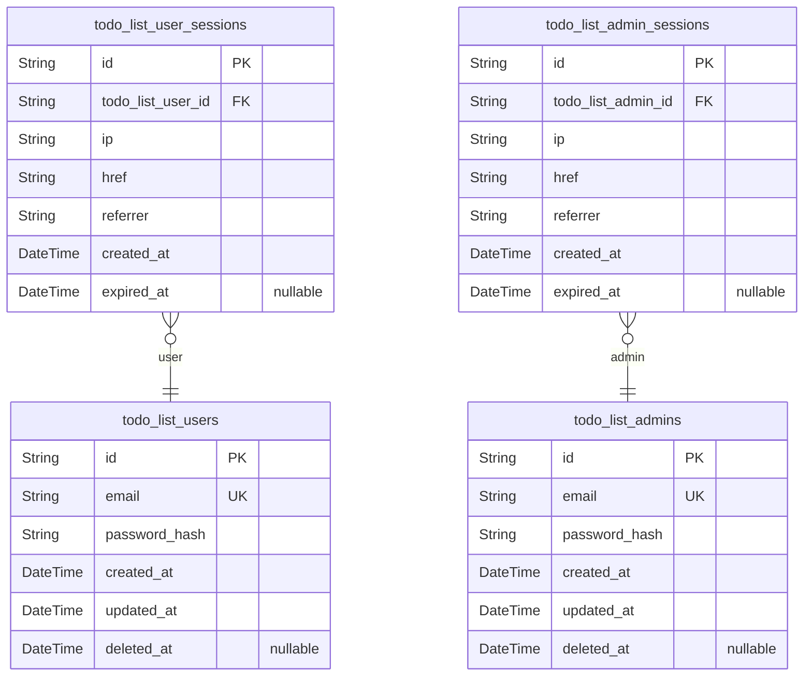
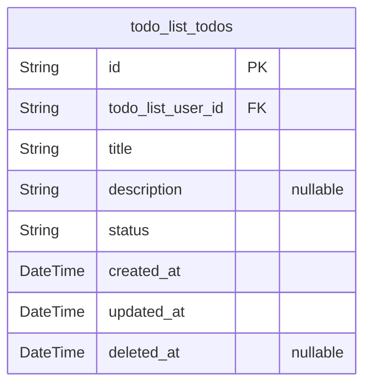

# Prisma Markdown

> Generated by [`prisma-markdown`](https://github.com/samchon/prisma-markdown)

- [Actors](#actors)
- [Todos](#todos)

## Actors

```mermaid
erDiagram
"todo_list_users" {
  String id PK
  String email UK
  String password_hash
  DateTime created_at
  DateTime updated_at
  DateTime deleted_at "nullable"
}
"todo_list_user_sessions" {
  String id PK
  String todo_list_user_id FK
  String ip
  String href
  String referrer
  DateTime created_at
  DateTime expired_at "nullable"
}
"todo_list_admins" {
  String id PK
  String email UK
  String password_hash
  DateTime created_at
  DateTime updated_at
  DateTime deleted_at "nullable"
}
"todo_list_admin_sessions" {
  String id PK
  String todo_list_admin_id FK
  String ip
  String href
  String referrer
  DateTime created_at
  DateTime expired_at "nullable"
}
"todo_list_user_sessions" }o--|| "todo_list_users" : user
"todo_list_admin_sessions" }o--|| "todo_list_admins" : admin
```

### `todo_list_users`

Regular authenticated users who manage their personal todo lists. Users
represent the primary user base of the application and have full control
over their personal data within security boundaries. Each user can
create, organize, and manage their own todo items.

Properties as follows:

- `id`: Primary Key.
- `email`
  > User's email address for authentication and account recovery. Must be
  > unique across all users and follow valid email format.
- `password_hash`
  > Securely hashed password for authentication. Never store passwords in
  > plain text. Uses industry-standard hashing algorithms like bcrypt,
  > argon2, or PBKDF2.
- `created_at`
  > Timestamp when the user account was created. Automatically set by the
  > system during registration.
- `updated_at`
  > Timestamp when the user account was last modified. Automatically updated
  > whenever any profile information changes.
- `deleted_at`
  > Timestamp when the user account was soft deleted. Null for active
  > accounts. Enables account recovery and audit trails.

### `todo_list_user_sessions`

Authentication sessions for regular users. Tracks user login sessions for
security auditing and session management. Each session represents a
distinct login from a specific device or browser.

Properties as follows:

- `id`: Primary Key.
- `todo_list_user_id`: User who owns this session. [todo_list_users.id](#todo_list_users)
- `ip`: IP address from which the user connected to establish this session.
- `href`: Connection URL where the session was initiated.
- `referrer`: Referrer URL that led to the session creation.
- `created_at`: Timestamp when the session was created (user logged in).
- `expired_at`: Timestamp when the session ended or expired. Null for active sessions.

### `todo_list_admins`

System administrators with elevated privileges for system management and
user support. Admins are trusted personnel responsible for maintaining
the system, supporting users, and monitoring overall application health.
They have broader visibility into system operations while respecting user
privacy.

Properties as follows:

- `id`: Primary Key.
- `email`
  > Administrator's email address for authentication and system
  > communications. Must be unique across all admins and follow valid email
  > format.
- `password_hash`
  > Securely hashed password for admin authentication. Never store passwords
  > in plain text. Uses industry-standard hashing algorithms like bcrypt,
  > argon2, or PBKDF2.
- `created_at`
  > Timestamp when the admin account was created. Automatically set by the
  > system during admin account creation.
- `updated_at`
  > Timestamp when the admin account was last modified. Automatically updated
  > whenever any admin information changes.
- `deleted_at`
  > Timestamp when the admin account was soft deleted. Null for active
  > accounts. Enables account recovery and audit trails.

### `todo_list_admin_sessions`

Authentication sessions for system administrators. Tracks admin login
sessions for security auditing and session management. Each session
represents a distinct admin login from a specific device or browser with
elevated privileges.

Properties as follows:

- `id`: Primary Key.
- `todo_list_admin_id`: Administrator who owns this session. [todo_list_admins.id](#todo_list_admins)
- `ip`
  > IP address from which the administrator connected to establish this
  > session.
- `href`: Connection URL where the admin session was initiated.
- `referrer`: Referrer URL that led to the admin session creation.
- `created_at`: Timestamp when the admin session was created (admin logged in).
- `expired_at`
  > Timestamp when the admin session ended or expired. Null for active
  > sessions.

## Todos

```mermaid
erDiagram
"todo_list_todos" {
  String id PK
  String todo_list_user_id FK
  String title
  String description "nullable"
  String status
  DateTime created_at
  DateTime updated_at
  DateTime deleted_at "nullable"
}
```

### `todo_list_todos`

Todo items representing tasks that users want to track and manage. Each
todo item is owned by a single user and contains the task information,
completion status, and temporal metadata. This is the core business
entity of the application, enabling users to create, organize, and
complete their personal tasks.

Properties as follows:

- `id`: Primary Key.
- `todo_list_user_id`: Owner of this todo item. [todo_list_users.id](#todo_list_users)
- `title`
  > Title of the todo item. A short, descriptive name for the task that users
  > want to track. This is the primary text users see when viewing their todo
  > list.
- `description`
  > Extended details about the todo item. Allows users to add additional
  > context, notes, or instructions about the task. Can contain multiple
  > paragraphs if needed.
- `status`
  > Completion status of the todo item. Valid values are 'complete' or
  > 'incomplete'. Defaults to 'incomplete' when a new todo is created. Users
  > can toggle this status at any time.
- `created_at`
  > Timestamp when the todo item was first created. Automatically set by the
  > system and cannot be modified by users. Used for sorting and organizing
  > todos chronologically.
- `updated_at`
  > Timestamp when the todo item was last modified. Automatically updated
  > whenever any property changes. Helps users track recent activity and
  > modifications.
- `deleted_at`
  > Timestamp when the todo item was soft deleted. Null indicates the todo is
  > active. When set, the todo is considered deleted but can potentially be
  > recovered. Enables soft delete functionality for future recovery
  > features.
