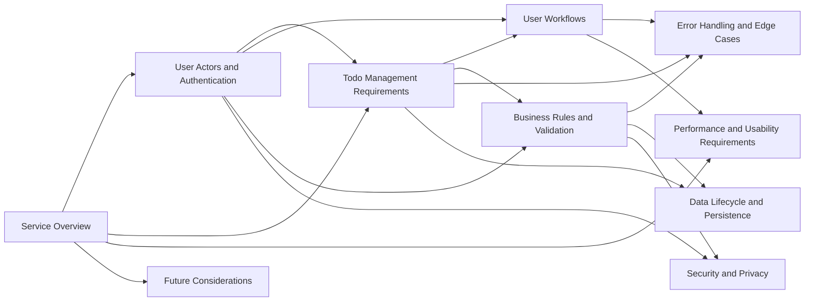

# Todo List Application - Documentation Table of Contents

## Documentation Overview

This documentation set provides complete business requirements and specifications for building a minimal Todo list application. The documentation is organized to guide you from high-level business context through detailed functional requirements, user workflows, and system constraints.

**Purpose**: These documents define WHAT the Todo list application should do from a business and user perspective, providing backend developers with clear, unambiguous requirements to build the system.

**Target Audience**: Backend developers, product managers, business stakeholders, and anyone involved in understanding or building the Todo list application.

## Complete Documentation Set

The documentation is organized in recommended reading order, from foundational concepts to detailed specifications:

### 1. [Service Overview](./01-service-overview.md)
**Purpose**: Establishes the foundation of the Todo list application  
**Contains**: Business vision, problem statement, value proposition, target users, key features overview, business model, and success metrics  
**Read this for**: Understanding why this application exists and what business value it provides  
**Audience**: Business stakeholders and development team

### 2. [User Actors and Authentication](./02-user-actors-and-authentication.md)
**Purpose**: Defines all user types and the complete authentication system  
**Contains**: User actor definitions (guest and authenticated user), complete authentication flows, registration process, login/session management, password management, JWT token specifications, permission matrix, and security requirements  
**Read this for**: Understanding who can use the system, how they authenticate, and what permissions each user type has  
**Audience**: Development team  
**Key Requirement**: Must use JWT for token-based authentication

### 3. [Todo Management Requirements](./03-todo-management-requirements.md)
**Purpose**: Defines the core functionality for managing todo items  
**Contains**: Todo item data structure, create/read/update/delete operations, complete/incomplete toggle, todo ownership and isolation rules, and validation requirements  
**Read this for**: Understanding all todo management features and how users interact with their tasks  
**Audience**: Development team  
**Key Requirement**: Must ensure complete data isolation between users

### 4. [User Workflows](./04-user-workflows.md)
**Purpose**: Documents complete user journeys through the application  
**Contains**: New user registration journey, login journey, creating first todo, daily todo management workflow, completing todos, organizing and filtering, and account management  
**Read this for**: Understanding step-by-step how users accomplish tasks in real-world scenarios  
**Audience**: Development team and product managers

### 5. [Business Rules and Validation](./05-business-rules-and-validation.md)
**Purpose**: Defines all business logic, validation rules, and constraints  
**Contains**: Todo item validation rules, user data validation, business constraints, data integrity rules, authorization rules, and operational constraints  
**Read this for**: Understanding what validation and business rules must be enforced  
**Audience**: Development team  
**Key Requirement**: All validation rules specified in EARS format

### 6. [Error Handling and Edge Cases](./06-error-handling-and-edge-cases.md)
**Purpose**: Documents all error scenarios and exception handling  
**Contains**: Authentication errors, todo operation errors, validation errors, authorization errors, system errors, edge cases, error message requirements, and recovery processes  
**Read this for**: Understanding how the system should behave when things go wrong  
**Audience**: Development team  
**Key Requirement**: Must cover all error scenarios from user perspective

### 7. [Data Lifecycle and Persistence](./07-data-lifecycle-and-persistence.md)
**Purpose**: Defines how data flows through the system over time  
**Contains**: Todo item lifecycle, user account lifecycle, data persistence requirements, data retention policies, modification tracking, and deletion policies  
**Read this for**: Understanding how data is created, modified, and managed throughout its existence  
**Audience**: Development team

### 8. [Performance and Usability Requirements](./08-performance-and-usability-requirements.md)
**Purpose**: Specifies performance expectations and usability standards  
**Contains**: Response time expectations, system performance requirements, data loading performance, concurrent user support, usability requirements, and accessibility considerations  
**Read this for**: Understanding performance targets and user experience expectations  
**Audience**: Development team  
**Key Requirement**: Must specify measurable performance criteria from user perspective

### 9. [Security and Privacy](./09-security-and-privacy.md)
**Purpose**: Defines security requirements and privacy protections  
**Contains**: Data privacy requirements, user data protection, authentication security, authorization security, data isolation requirements, security best practices, and compliance considerations  
**Read this for**: Understanding how user data must be protected and security measures required  
**Audience**: Development team and security stakeholders  
**Key Requirement**: Must ensure complete data isolation between users

### 10. [Future Considerations](./10-future-considerations.md)
**Purpose**: Documents potential future enhancements and scalability planning  
**Contains**: Potential future features, scalability considerations, integration opportunities, enhancement possibilities, architecture future-proofing guidance  
**Read this for**: Understanding what might be added later and how to avoid limiting future options  
**Audience**: Development team and product managers

## How to Navigate This Documentation

### Recommended Reading Order

**For Business Stakeholders**:
1. Start with [Service Overview](./01-service-overview.md) to understand the business context
2. Review [User Workflows](./04-user-workflows.md) to see user journeys
3. Check [Future Considerations](./10-future-considerations.md) for growth potential

**For Backend Developers (First Time)**:
1. [Service Overview](./01-service-overview.md) - Understand the business context
2. [User Actors and Authentication](./02-user-actors-and-authentication.md) - Know your users and auth system
3. [Todo Management Requirements](./03-todo-management-requirements.md) - Core functionality
4. [Business Rules and Validation](./05-business-rules-and-validation.md) - Validation logic
5. [User Workflows](./04-user-workflows.md) - See how it all flows together
6. [Error Handling and Edge Cases](./06-error-handling-and-edge-cases.md) - Handle failures
7. [Data Lifecycle and Persistence](./07-data-lifecycle-and-persistence.md) - Data management
8. [Performance and Usability Requirements](./08-performance-and-usability-requirements.md) - Performance targets
9. [Security and Privacy](./09-security-and-privacy.md) - Security requirements
10. [Future Considerations](./10-future-considerations.md) - Plan for the future

**For Quick Reference by Topic**:
- **Authentication/Users**: [User Actors and Authentication](./02-user-actors-and-authentication.md)
- **Todo Features**: [Todo Management Requirements](./03-todo-management-requirements.md)
- **User Experience**: [User Workflows](./04-user-workflows.md)
- **Validation**: [Business Rules and Validation](./05-business-rules-and-validation.md)
- **Error Handling**: [Error Handling and Edge Cases](./06-error-handling-and-edge-cases.md)
- **Performance**: [Performance and Usability Requirements](./08-performance-and-usability-requirements.md)
- **Security**: [Security and Privacy](./09-security-and-privacy.md)

### Document Categories

**Foundational Documents** (Read First):
- [Service Overview](./01-service-overview.md)
- [User Actors and Authentication](./02-user-actors-and-authentication.md)

**Core Requirements** (Essential Reading):
- [Todo Management Requirements](./03-todo-management-requirements.md)
- [Business Rules and Validation](./05-business-rules-and-validation.md)
- [Security and Privacy](./09-security-and-privacy.md)

**Workflow and UX Documents**:
- [User Workflows](./04-user-workflows.md)
- [Error Handling and Edge Cases](./06-error-handling-and-edge-cases.md)

**System Behavior Documents**:
- [Data Lifecycle and Persistence](./07-data-lifecycle-and-persistence.md)
- [Performance and Usability Requirements](./08-performance-and-usability-requirements.md)

**Strategic Planning**:
- [Future Considerations](./10-future-considerations.md)

## Document Relationships

**Dependency Flow**:
- **[Service Overview](./01-service-overview.md)** provides context for all other documents
- **[User Actors and Authentication](./02-user-actors-and-authentication.md)** defines who can access the system
- **[Todo Management Requirements](./03-todo-management-requirements.md)** builds on authentication to define core features
- **[Business Rules and Validation](./05-business-rules-and-validation.md)** refines requirements with specific rules
- **[User Workflows](./04-user-workflows.md)** shows how requirements connect in user journeys
- **[Error Handling and Edge Cases](./06-error-handling-and-edge-cases.md)** addresses failure scenarios
- **[Data Lifecycle and Persistence](./07-data-lifecycle-and-persistence.md)** defines data management
- **[Performance and Usability Requirements](./08-performance-and-usability-requirements.md)** sets experience standards
- **[Security and Privacy](./09-security-and-privacy.md)** ensures data protection
- **[Future Considerations](./10-future-considerations.md)** plans for growth

## Key Documentation Principles

### Business Requirements Focus
All documents focus on **business requirements** and **user needs** in natural language. Technical implementation details (database schemas, API designs, architecture decisions) are intentionally excluded to give developers full autonomy in technical solutions.

### EARS Format
Functional requirements use **EARS (Easy Approach to Requirements Syntax)** format for clarity and precision:
- **WHEN** [trigger], **THE** [system] **SHALL** [function]
- **WHILE** [state], **THE** [system] **SHALL** [function]
- **IF** [condition], **THEN THE** [system] **SHALL** [function]
- **WHERE** [feature/condition], **THE** [system] **SHALL** [function]
- **THE** [system] **SHALL** [function] (for always-active requirements)

### Comprehensive Coverage
Documentation is written to be **complete and production-ready** on first read. All business requirements, validation rules, error scenarios, and user workflows are fully specified without ambiguity.

### User Perspective
Requirements are written from the **user's perspective**, describing what users can do and how the system should respond to user actions, not how to implement technical solutions.

## Getting Started

1. **New to the project?** Start with [Service Overview](./01-service-overview.md)
2. **Ready to build?** Read documents 1-9 in order
3. **Looking for specific information?** Use the Quick Reference section above
4. **Planning future features?** Check [Future Considerations](./10-future-considerations.md)

## Documentation Standards

- **Minimum Length**: Technical documents contain 5,000-30,000+ characters for comprehensive coverage
- **Diagrams**: Mermaid diagrams used for flows and relationships (all using left-to-right orientation for readability)
- **Links**: All document links use descriptive text, never raw filenames
- **Language**: All content in English with formal, professional tone
- **Completeness**: Single-pass documentation with no iterations - everything included on first write

---

Developer Note: This documentation defines **business requirements only**. All technical implementations (architecture, APIs, database design, etc.) are at the discretion of the development team.