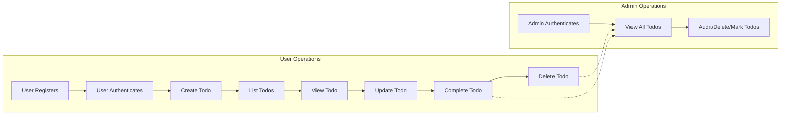

# Todo List Application: Comprehensive Business Requirements

## Introduction

These requirements specify the essential backend business logic for a minimal yet functional Todo List application. All content is expressed for backend developers but focuses only on business requirements, user logic, permission control, and error handling (no frontend or API documentation). Requirements are written in natural language, with actionable, testable statements conforming to the EARS methodology. Every scenario is specified such that any backend engineer can implement the system precisely as described, with no reliance on external context.

---

## Functional Requirements (EARS format)

### 1. User Account Registration and Authentication
- WHEN a new user wishes to use the service, THE system SHALL require successful registration using a unique email and password.
- IF a user attempts to register with an email already on record, THEN THE system SHALL reject the registration and respond with the reason, "Email already registered." 
- WHEN a registered user submits the correct credentials, THE system SHALL authenticate the user and initiate a 30-minute active session (tracked server-side).
- IF a user submits incorrect credentials, THEN THE system SHALL respond with an "Invalid email or password" error and deny access.
- WHEN any authenticated session times out (after 30 minutes inactivity), THE system SHALL invalidate the session and require the user to re-authenticate for access to protected resources.
- WHEN a non-authenticated user requests any Todo function, THE system SHALL reject the action and return an authentication error response.

### 2. Todo Creation
- WHEN an authenticated user creates a Todo by providing a title (required), and optionally a description and due date, THE system SHALL create and associate the Todo with that user.
- IF the provided title is empty or exceeds 255 characters, THEN THE system SHALL reject the creation and describe the validation error.
- IF the description is longer than 1,000 characters, THEN THE system SHALL reject the creation and state the validation error.
- WHEN a due date is provided, THE system SHALL ensure it is today or a future date; if not, THE system SHALL reject the creation and note the date limitation.

### 3. Todo Viewing and Listing
- WHEN an authenticated user requests their Todo list, THE system SHALL return only Todo items belonging to that user, sorted first by due date ascending, then by creation date descending.
- WHEN a user requests a specific Todo by ID, THE system SHALL allow access only if the Todo is owned by that user.
- IF a Todo does not exist or belongs to a different user, THEN THE system SHALL respond with a "Not Found" or "Forbidden" error as appropriate.

### 4. Todo Update
- WHEN a user requests to update their own Todo (title, description, due date), THE system SHALL validate new data against all constraints and, if valid, persist the changes.
- IF the updated data violates title/description length or uses a due date in the past, THEN THE system SHALL reject the change and return a validation error corresponding to the specific input problem.

### 5. Todo Deletion
- WHEN a user requests to delete their own Todo, THE system SHALL remove it from active lists for the user.
- IF a user attempts to delete a Todo not owned by them, THEN THE system SHALL return a forbidden error.
- AFTER deletion, THE system SHALL ensure the Todo does not appear in any standard user listings but may remain available to admin for compliance.

### 6. Todo Completion
- WHEN a user marks their own Todo as "Completed", THE system SHALL update its status and record the completion timestamp, keeping all details for later reference.
- THE system SHALL let users toggle status between "Completed" and "Not Completed" for their own Todos.
- IF a user attempts to change the completion status of a Todo they do not own, THEN THE system SHALL reject the request with a forbidden error.

### 7. Admin Operations
- WHEN an admin authenticates, THE system SHALL permit access to all Todo items and all user accounts for monitoring and support.
- THE system SHALL allow admins to view any user's Todos (completed or deleted).
- WHERE an admin discovers misuse or abusive content, THE system SHALL provide a way to mark, audit, or remove such records, logging all actions.

### 8. Data Isolation and Privacy
- THE system SHALL always isolate each user's data. Under no circumstances can a user access, view, or modify the Todos of another non-admin user.
- WHERE an admin performs actions on user data, THE system SHALL log each action with identity, action type, target, and timestamp for audit.

### 9. Error Handling (Business Perspective)
- IF required input is missing, malformed, or fails constraint checks, THEN THE system SHALL present a clear, actionable error tied directly to the user's error.
- WHEN a user performs an unauthorized or out-of-permission action, THE system SHALL deny access and return a forbidden error message.
- IF the backend experiences an unexpected error (e.g., server or database failure), THEN THE system SHALL provide a generic, non-technical error response to the user, and record full diagnostic details for admins.
- WHERE an error is fixable by correcting user input, THE system SHALL encourage a retry after remedial action.

### 10. Consistency and Idempotency
- THE system SHALL process repeated identical operations idempotently: completing, deleting, or toggling a Todo with same parameters multiple times results in a consistent single effect, never data duplication or corruption.
- WHEN retries are necessary after network/server failure, THE system SHALL guarantee no duplicate operations or lost data for the user upon safe retry.

---

## Non-functional Requirements

### 1. Performance
- WHEN a user requests their Todo list (max 100 items), THE system SHALL provide a response in less than 1 second.
- WHEN a Todo is created, updated, completed, or deleted, THE system SHALL visibly confirm the operation within 1 second.
- WHEN an admin runs bulk operations or audits (up to 10,000 records), THE system SHALL return results within 3 seconds.

### 2. Security
- THE system SHALL store all user passwords using secure salted hashing algorithms, never in plaintext.
- THE system SHALL enforce HTTPS/TLS for all backend communications.
- THE system SHALL authenticate users via JWT tokens with 30-minute access token expiry and maximum 7-day refresh period.
- THE system SHALL always verify user privileges in backend logic (never via frontend hints).

### 3. Data Integrity and Reliability
- THE system SHALL never lose, corrupt, or partially commit Todo data, even in case of routine failures (network/server/power).
- THE system SHALL persist all Todo operations atomically: create, update, complete, delete.
- THE system SHALL retain complete audit logs of admin actions for at least 90 days.

### 4. Compliance
- THE system SHALL comply with basic privacy standards: minimum required user data retained, no sharing with third parties, all admin actions audit logged.

---

## User Experience Expectations

- WHEN any valid, permitted action is taken (create, update, complete, delete), THE system SHALL always confirm the result to the user within 1 second.
- IF a user makes a mistake (invalid input, unauthorized operation), THE system SHALL return instant, detailed feedback explaining the reason and suggested correction.
- THE system SHALL use user-friendly, jargon-free language in all error and confirmation messages.
- ON unexpected errors, THE system SHALL prompt users to retry later and record the incident for admin troubleshooting.

---

## Mermaid Diagram: Core User Flows

---

## Measurable Success Criteria

- All above requirements (functional, non-functional, experience) SHALL be realized and testable in the final deployed system.
- All user and admin actions produce clear business-valid results or business-level error messages; no operation results in ambiguity or partial business state.
- All edge cases and recovery scenarios behave exactly as described above.
- Performance guarantees (all user and admin actions within strict response windows) are enforced in production.
- 100% isolation between user datasets with complete audit logging for all admin access or action upon data.
- No user, under any circumstances, is able to access or modify another user's Todos without admin privileges.
- Audit logs are clear, unambiguous, and sufficiently detailed to reconstruct any admin action for compliance review.