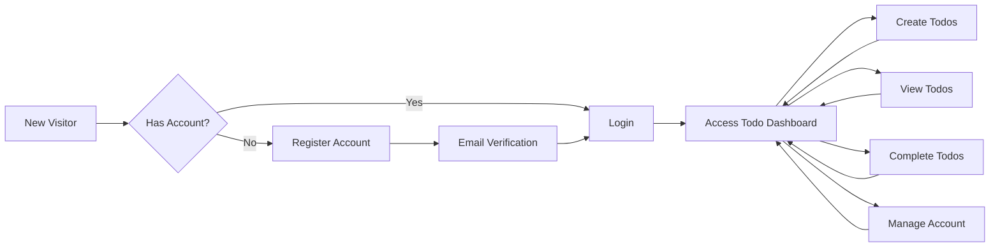
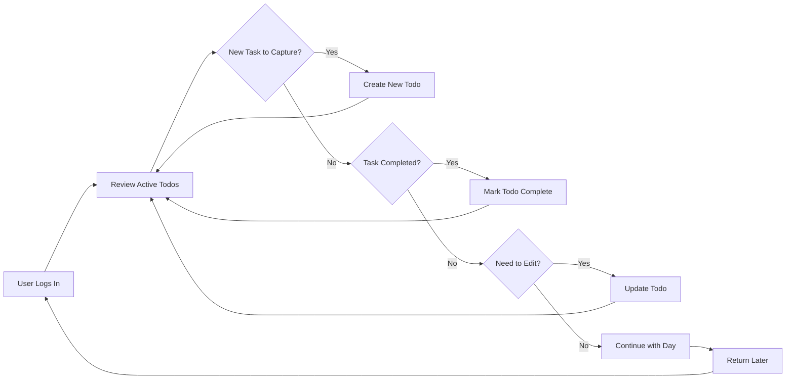

# Service Overview - Todo List Application

## Service Vision and Purpose

The Todo List Application is a streamlined personal productivity service designed to help individuals organize, track, and complete their daily tasks efficiently. In an increasingly complex world where people juggle multiple responsibilities across work, personal life, and social commitments, this application serves as a digital companion that simplifies task management through minimalist design and essential functionality.

### Vision Statement

To provide the most straightforward and friction-free todo list experience that helps users accomplish more by focusing on what truly matters—getting things done, not managing a complex productivity system.

### Core Purpose

WHEN authenticated users access the system, THE system SHALL provide a personal, isolated workspace where they can create, manage, and track their todo items without unnecessary complexity or feature bloat. WHEN users need to capture a task, organize their day, or track progress, THE system SHALL respond instantly with intuitive functionality that requires minimal cognitive overhead.

## Problem Statement and Market Context

### The Productivity Paradox

Modern individuals face a productivity paradox: while numerous todo list and task management applications exist, many suffer from feature creep that transforms simple task tracking into complex project management systems. Users who simply want to remember and complete daily tasks find themselves overwhelmed by:

- **Over-engineered interfaces** with dozens of features they never use
- **Steep learning curves** that require tutorials and onboarding
- **Subscription fatigue** from yet another service requiring monthly payments
- **Privacy concerns** with cloud-based services handling personal task data
- **Collaboration features** that complicate simple personal task management
- **Platform lock-in** with proprietary data formats

### Target Pain Points

This application directly addresses these specific user frustrations:

1. **Complexity Overload**: Users want a todo list, not a project management suite
2. **Privacy Concerns**: Personal tasks should remain private and isolated per user
3. **Performance Issues**: Slow-loading applications that add friction to quick task capture
4. **Access Barriers**: Applications requiring multiple authentications or complex setup
5. **Data Ownership**: Unclear data retention and deletion policies

### Market Opportunity

WHILE enterprise project management tools dominate the productivity software market, there exists a significant underserved segment of users who value simplicity over features. THE system SHALL target individuals seeking a back-to-basics approach to personal task management—users who have tried complex solutions and returned to paper lists or basic note-taking apps due to software complexity.

## Business Model and Revenue Strategy

### Business Model Overview

The Todo List Application operates on a freemium SaaS (Software as a Service) model with a clear value proposition: provide essential todo list functionality for free while offering premium enhancements for power users.

### Why This Service Should Exist

**Market Gap Identification**:
- **Simplicity-First Positioning**: Most todo applications compete on features; this service competes on simplicity and user experience
- **Privacy-Conscious Users**: Growing market segment values data privacy and minimal data collection
- **Productivity Minimalists**: Users embracing digital minimalism and essentialism philosophies
- **Mobile-First Professionals**: Individuals who need quick task capture without desktop complexity

**Competitive Differentiation**:
- **Zero Learning Curve**: Users can start managing todos within 30 seconds of registration
- **Performance First**: Sub-second response times for all core operations
- **Data Privacy**: Complete user isolation with transparent data policies
- **No Feature Bloat**: Committed to maintaining minimal, essential feature set

### Revenue Strategy

#### Phase 1: User Acquisition (Months 1-6)
- **Free Tier**: Unlimited basic todo management for all users
- **Goal**: Acquire 10,000 active users
- **Monetization**: None—focus on building user base and gathering usage data
- **Success Metric**: 40% monthly active user retention rate

#### Phase 2: Premium Features (Months 7-12)
- **Free Tier**: Continues with basic functionality
- **Premium Tier**: $3.99/month or $39.99/year offering:
  - Advanced filtering and search capabilities
  - Todo templates and recurring tasks
  - Data export and backup features
  - Priority customer support
- **Goal**: 5% conversion rate from free to premium
- **Success Metric**: 500 paying subscribers by month 12

#### Phase 3: Scale and Optimize (Year 2+)
- **Team Plans**: $9.99/month for 2-5 users with shared lists (future consideration)
- **API Access**: Developer tier for integrations
- **White-Label Licensing**: Enterprise customization options
- **Goal**: Achieve break-even on infrastructure costs
- **Success Metric**: Monthly Recurring Revenue (MRR) of $15,000+

### Growth Strategy

**User Acquisition Channels**:
1. **Content Marketing**: Productivity blogs, minimalism communities, digital wellness platforms
2. **Product Hunt Launch**: Target early adopters and tech enthusiasts
3. **Reddit/HackerNews**: Engage with communities valuing simplicity and privacy
4. **Word of Mouth**: Referral program offering premium features for successful referrals
5. **SEO Optimization**: Target "simple todo list," "minimalist task manager" keywords

**Retention Strategy**:
- **Daily Engagement**: Push notifications for incomplete tasks (opt-in)
- **Habit Formation**: Streak tracking and completion statistics
- **Progressive Enhancement**: Gradually introduce premium features after user establishes habits
- **Community Building**: User showcase of productivity achievements

### Key Business Metrics (KPIs)

**User Acquisition Metrics**:
- Monthly Active Users (MAU): Target 10,000 by month 6
- Daily Active Users (DAU): Target DAU/MAU ratio of 40%
- User Registration Rate: Unique registrations per day

**Engagement Metrics**:
- Average Todos Created Per User Per Week: Target 15+
- Average Session Duration: Target 2-5 minutes (quick capture sessions)
- Todo Completion Rate: Percentage of todos marked complete
- User Retention Rate: Percentage of users active after 30/60/90 days

**Revenue Metrics**:
- Free-to-Premium Conversion Rate: Target 5%
- Customer Lifetime Value (CLV): Average revenue per user over lifetime
- Churn Rate: Monthly percentage of premium subscribers canceling
- Monthly Recurring Revenue (MRR): Total predictable monthly revenue

**Technical Performance Metrics**:
- API Response Time: Average time for todo operations (target <200ms)
- System Uptime: Availability percentage (target 99.5%+)
- Error Rate: Percentage of failed requests (target <0.1%)

## Core Value Proposition

### For Individual Users

**Primary Value**: "Capture, organize, and complete your tasks in seconds, not minutes."

WHEN users access the system, THE system SHALL provide a digital todo list that:
- **Removes Friction**: Zero-setup task capture that works immediately after registration
- **Ensures Privacy**: Complete isolation—your todos are yours alone, never shared or exposed
- **Delivers Speed**: Instant response times that never interrupt your thought flow
- **Maintains Simplicity**: Only essential features that 95% of users need 95% of the time

### Unique Selling Points

1. **Minimalist by Design**: 
   - WHEN users access the application, THE system SHALL present a clean, distraction-free interface focused solely on todo management
   - No feature clutter, no upsell prompts, no unnecessary complexity

2. **Privacy-First Architecture**:
   - THE system SHALL maintain complete data isolation between all users
   - WHEN a user creates todo items, THE system SHALL store them exclusively within that user's isolated data space
   - No user can access, view, or modify another user's todo items under any circumstances

3. **Performance Obsessed**:
   - WHEN a user creates a todo item, THE system SHALL respond within 500 milliseconds
   - WHEN a user loads their todo list, THE system SHALL display results within 1 second
   - THE system SHALL support concurrent usage by multiple users without performance degradation

4. **Mobile-First Experience**:
   - WHILE accessing from any device, THE system SHALL provide a responsive interface optimized for quick interactions
   - WHEN users need to capture a thought on-the-go, THE system SHALL enable todo creation in under 5 seconds

## Target Users and User Personas

### Primary User Persona: "The Busy Professional"

**Demographics**:
- Age: 25-45 years old
- Occupation: Knowledge workers, freelancers, small business owners
- Tech Literacy: Moderate to high—comfortable with web applications
- Location: Global, English-speaking markets initially

**Characteristics**:
- Manages 10-30 tasks across personal and professional life daily
- Values time efficiency and minimal cognitive overhead
- Previously tried complex productivity systems but abandoned them
- Prefers digital over paper but wants similar simplicity
- Privacy-conscious about personal data

**Pain Points**:
- "Other todo apps have too many features I don't need"
- "I just want to write down tasks and check them off"
- "Complex apps slow me down instead of speeding me up"
- "I don't want my personal todos in a corporate project management tool"

**Goals**:
- Quickly capture tasks as they arise throughout the day
- Review and complete daily todos without hassle
- Maintain separation between work and personal tasks via simple categorization
- Access todos from any device without sync complexity

**Usage Patterns**:
- Creates 5-10 todos daily
- Checks todo list 3-5 times per day
- Completes 60-80% of created todos within 48 hours
- Prefers mobile for task creation, desktop for review and organization

### Secondary User Persona: "The Digital Minimalist"

**Demographics**:
- Age: 22-55 years old
- Occupation: Varied—students, creatives, remote workers
- Tech Literacy: High—actively chooses simple tools over complex ones
- Philosophy: Embraces digital minimalism and intentional technology use

**Characteristics**:
- Deliberately selects simple, focused applications
- Values privacy and data ownership
- Willing to pay for quality, ad-free experiences
- Seeks tools that reduce screen time rather than increase it
- Community-oriented—shares tool recommendations

**Pain Points**:
- "Every app wants to be an all-in-one solution"
- "I'm tired of learning new productivity systems"
- "Apps should help me use technology less, not more"
- "Why do I need social features in a personal todo list?"

**Goals**:
- Maintain focus on essential tasks only
- Minimize time spent in productivity applications
- Own and control personal data
- Use technology intentionally and mindfully

**Usage Patterns**:
- Creates 3-8 highly intentional todos daily
- Single daily review session (morning or evening planning)
- High completion rate (85%+)
- Prefers minimalist interfaces without notifications

### User Actor Definitions

The system recognizes two distinct user actors:

**Guest (Unauthenticated User)**:
- Can access public landing page and marketing content
- Can view registration and login forms
- Cannot create, view, or manage any todo items
- Cannot access any user-specific functionality

**User (Authenticated Member)**:
- Can create personal todo items with title and optional metadata
- Can view all their own todo items
- Can update their own todo items (edit, mark complete/incomplete)
- Can delete their own todo items
- Cannot access any other user's todo items under any circumstances
- Has complete data isolation from all other users

## Key Features Overview

This section provides a high-level summary of core functionality. Detailed specifications are documented in subsequent requirements documents.

### Core Todo Management

**Todo Creation**:
- WHEN an authenticated user wants to capture a task, THE system SHALL allow creation of a todo item with a title (required) and optional completion status
- THE system SHALL support rapid todo creation without mandatory metadata entry
- WHEN a user creates a todo, THE system SHALL associate it exclusively with that user's account

**Todo Viewing and Organization**:
- WHEN a user accesses their todo list, THE system SHALL display all their todo items in a clear, scannable format
- THE system SHALL support filtering between all todos, active todos, and completed todos
- WHEN displaying todos, THE system SHALL show most recently created items first by default

**Todo Completion Tracking**:
- WHEN a user completes a task, THE system SHALL allow toggling the todo between incomplete and complete states
- THE system SHALL visually differentiate completed todos from active todos
- WHEN a user marks a todo complete, THE system SHALL preserve the todo item for historical reference

**Todo Modification**:
- WHEN a user needs to update a todo, THE system SHALL allow editing the todo title
- WHEN a user no longer needs a todo, THE system SHALL allow permanent deletion
- THE system SHALL apply all modifications exclusively to the authenticated user's own todos

### User Account Management

**Registration Process**:
- WHEN a new user wants to join, THE system SHALL allow registration with email address and password
- THE system SHALL validate email format and password strength requirements
- WHEN registration succeeds, THE system SHALL create an isolated user account

**Authentication System**:
- WHEN a user wants to access their todos, THE system SHALL require login with email and password
- THE system SHALL use JWT (JSON Web Tokens) for session management
- WHEN authentication succeeds, THE system SHALL grant access only to that user's todo items
- THE system SHALL maintain user sessions for convenient access while ensuring security

**Account Security**:
- THE system SHALL store passwords using industry-standard hashing algorithms
- THE system SHALL enforce password complexity requirements during registration
- WHEN a user logs out, THE system SHALL invalidate the current session token

### Data Privacy and Isolation

**User Data Separation**:
- THE system SHALL maintain complete data isolation between all users
- WHEN any user requests todo data, THE system SHALL return only that user's own todos
- THE system SHALL prevent any user from accessing, viewing, or modifying another user's data through any system interface or API endpoint

**Data Ownership**:
- WHEN a user creates todo items, THE system SHALL store them exclusively within that user's data space
- THE system SHALL ensure all todo queries filter by authenticated user identity
- IF a user attempts to access another user's data, THEN THE system SHALL deny the request and return an authorization error

### Performance and Usability

**Response Time Expectations**:
- WHEN a user creates a todo item, THE system SHALL respond within 500 milliseconds under normal conditions
- WHEN a user loads their todo list, THE system SHALL display results within 1 second for lists up to 1,000 items
- WHEN a user updates or deletes a todo, THE system SHALL process the request within 300 milliseconds

**Usability Requirements**:
- THE system SHALL provide a clean, intuitive interface requiring no user documentation or tutorials
- WHEN users first access the application after registration, THE system SHALL present a self-explanatory interface
- THE system SHALL minimize the number of clicks required for common operations (target: 1-2 clicks for todo creation, completion toggle, and deletion)

## System Context and User Journey

### High-Level User Journey

### Typical Daily Workflow

## Success Metrics and Evaluation Criteria

### User Success Indicators

**Engagement Metrics**:
- **Daily Active Users (DAU)**: Percentage of registered users accessing the system daily (target: 40% of MAU)
- **Todo Creation Rate**: Average number of todos created per active user per week (target: 15+)
- **Completion Rate**: Percentage of created todos marked complete within 7 days (target: 70%+)
- **Session Frequency**: Average number of times users access the system daily (target: 3-5 sessions)

**Retention Metrics**:
- **Day 1 Retention**: Percentage of users returning the day after registration (target: 60%)
- **Week 1 Retention**: Percentage of users active within 7 days of registration (target: 50%)
- **Month 1 Retention**: Percentage of users active 30 days after registration (target: 40%)
- **Month 3 Retention**: Percentage of users active 90 days after registration (target: 30%)

### Business Success Indicators

**Growth Metrics**:
- **User Acquisition Rate**: New registrations per week (target: 500+ by month 3)
- **Viral Coefficient**: Average number of referrals per existing user (target: 0.3+)
- **Conversion Rate**: Percentage of website visitors who register (target: 10%+)

**Revenue Metrics** (Post-Premium Launch):
- **Free-to-Premium Conversion**: Percentage of free users upgrading to premium (target: 5%)
- **Customer Lifetime Value (CLV)**: Average revenue per user over their lifetime (target: $50+)
- **Churn Rate**: Monthly percentage of premium users downgrading or canceling (target: <5%)
- **Monthly Recurring Revenue (MRR)**: Total predictable monthly revenue (target: $2,000+ by month 12)

### Technical Success Indicators

**Performance Metrics**:
- **API Response Time**: Average response time for todo operations (target: <200ms at p95)
- **Page Load Time**: Time to interactive for todo dashboard (target: <1.5 seconds)
- **System Uptime**: Percentage of time system is available (target: 99.5%+)
- **Error Rate**: Percentage of failed API requests (target: <0.1%)

**Scalability Metrics**:
- **Concurrent Users**: Number of simultaneous active users supported (target: 1,000+ initially)
- **Database Query Performance**: Average query execution time (target: <50ms)
- **System Resource Utilization**: CPU and memory usage under normal load (target: <70%)

## Non-Functional Requirements Overview

### Performance Requirements

**User-Facing Performance**:
- WHEN a user performs any todo operation (create, read, update, delete), THE system SHALL respond within 500 milliseconds
- WHEN a user loads the todo dashboard, THE system SHALL display the interface within 1 second
- WHEN multiple users access the system simultaneously, THE system SHALL maintain response times without degradation for up to 1,000 concurrent users

**System Performance**:
- THE system SHALL support up to 100,000 registered users in the initial deployment phase
- THE system SHALL handle up to 10,000 todo operations per minute
- WHEN system load exceeds capacity, THE system SHALL gracefully degrade performance rather than failing completely

### Availability and Reliability

**Uptime Requirements**:
- THE system SHALL maintain 99.5% uptime measured on a monthly basis
- WHEN planned maintenance is required, THE system SHALL provide 48 hours advance notice to users
- THE system SHALL perform scheduled maintenance during low-usage periods (defined as 2-6 AM UTC)

**Data Reliability**:
- THE system SHALL ensure zero data loss for committed todo operations
- WHEN a user successfully creates or updates a todo, THE system SHALL persist the data permanently until explicitly deleted
- THE system SHALL implement automatic backup procedures to prevent data loss

### Security Requirements

**Authentication Security**:
- THE system SHALL store all user passwords using bcrypt hashing with appropriate salt rounds
- THE system SHALL enforce minimum password requirements: 8 characters, at least one letter and one number
- WHEN authentication fails, THE system SHALL implement rate limiting to prevent brute force attacks (maximum 5 failed attempts per 15 minutes per IP address)

**Authorization Security**:
- THE system SHALL validate user authorization for every todo operation
- WHEN any user requests todo data, THE system SHALL verify the requester owns the requested todos
- IF an authorization check fails, THEN THE system SHALL deny access and return HTTP 403 Forbidden

**Data Security**:
- THE system SHALL transmit all data over HTTPS encrypted connections
- THE system SHALL never expose user data to other users under any circumstances
- THE system SHALL implement secure session management with JWT tokens expiring after 7 days of inactivity

### Scalability Considerations

**User Growth**:
- THE system architecture SHALL support horizontal scaling to accommodate user growth
- WHEN user count exceeds initial capacity, THE system SHALL allow adding additional server resources without service interruption
- THE system SHALL support growth to 1,000,000 users within 2 years with architectural adjustments

**Data Growth**:
- THE system SHALL efficiently handle users with up to 10,000 todo items
- WHEN todo lists grow large, THE system SHALL implement pagination to maintain performance
- THE system SHALL archive or optimize old completed todos to maintain system performance

### Usability and Accessibility

**Usability Standards**:
- THE system SHALL provide an intuitive interface requiring no training or documentation for basic operations
- WHEN users first access the application, THE system SHALL allow todo creation within 30 seconds
- THE system SHALL minimize cognitive load by presenting only essential features on primary screens

**Accessibility Considerations**:
- THE system SHOULD follow WCAG 2.1 Level AA accessibility guidelines where practical for a minimum viable product
- THE system SHALL provide keyboard navigation for all primary todo operations
- THE system SHALL use sufficient color contrast for text readability (minimum 4.5:1 ratio)

**Device Compatibility**:
- THE system SHALL function on modern web browsers (Chrome, Firefox, Safari, Edge) released within the last 2 years
- THE system SHALL provide a responsive design that works on mobile devices (smartphones and tablets)
- WHEN accessed from different screen sizes, THE system SHALL adapt the interface for optimal usability

## Future Considerations

WHILE this document focuses on minimal viable functionality, the system architecture should consider potential future enhancements:

- **Recurring Todos**: Ability to create tasks that repeat on schedules (daily, weekly, monthly)
- **Todo Categories or Tags**: Simple organization beyond a single list
- **Due Dates and Reminders**: Optional deadline tracking with notification capabilities
- **Collaboration Features**: Shared lists for family or small teams (separate user tier)
- **Mobile Applications**: Native iOS and Android applications for enhanced mobile experience
- **Offline Capability**: Local data storage with synchronization when connectivity returns
- **Data Export**: Ability to export todo data in standard formats (JSON, CSV)
- **Third-Party Integrations**: Calendar sync, email-to-todo, API access

These features are explicitly OUT OF SCOPE for the initial release but should inform architectural decisions to avoid future technical debt.

## Document Relationships

This Service Overview document provides the business foundation for:

- **User Actors and Authentication** (02): Builds upon the user personas defined here
- **Todo Management Requirements** (03): Implements the core features outlined in this document
- **User Workflows** (04): Details the user journeys introduced at high level here
- **Business Rules and Validation** (05): Enforces the business logic principles established here
- **Error Handling and Edge Cases** (06): Addresses failure scenarios within the context defined here
- **Data Lifecycle and Persistence** (07): Manages the data described in feature overview
- **Performance and Usability Requirements** (08): Expands on the performance expectations outlined here
- **Security and Privacy** (09): Implements the privacy-first principles defined here
- **Future Considerations** (10): Explores the growth opportunities mentioned in business model section

---

**Document Version**: 1.0  
**Last Updated**: 2025-11-18  
**Document Owner**: Product Management  
**Review Cycle**: Quarterly or upon significant business model changes