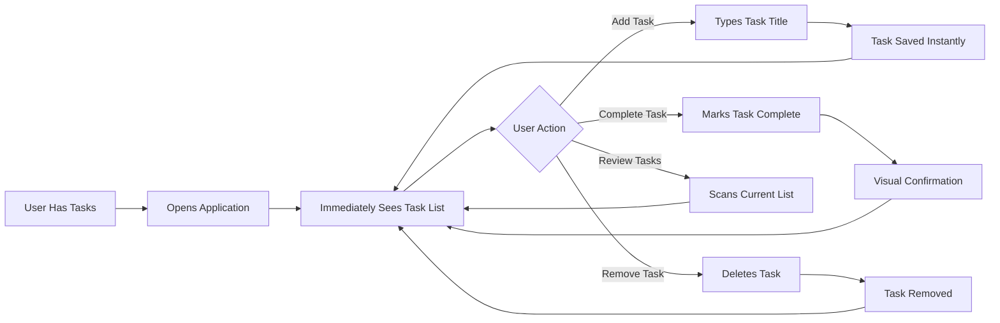

# Service Overview - Todo List Application

## Service Vision and Purpose

### Vision Statement

The Todo List Application aims to provide a straightforward, distraction-free task management solution for individuals who need to organize their daily activities without the complexity and feature bloat of modern productivity applications. Our vision is to create the most accessible and intuitive digital todo list that anyone can start using within seconds, regardless of their technical proficiency.

### Purpose and Mission

In an era where productivity tools have become increasingly complex with excessive features, collaboration requirements, and steep learning curves, our Todo List Application returns to the fundamental essence of task management: **capture, track, and complete**. The service exists to prove that effective personal task management does not require elaborate project management frameworks, team collaboration features, or artificial intelligence assistance.

Our mission is to serve users who value:

- **Simplicity over sophistication** - Core functionality that works immediately without tutorials
- **Speed over features** - Instant task capture without navigating complex interfaces
- **Focus over flexibility** - A single, well-executed purpose rather than countless configuration options
- **Clarity over customization** - A clean, consistent experience for all users

### Why This Service Exists

Despite hundreds of todo list applications available in the market, there remains a significant gap for users seeking truly minimal functionality. Current market offerings fall into three problematic categories:

1. **Over-engineered enterprise tools** - Applications like Asana, Monday.com, and Jira that require extensive setup and training
2. **Feature-bloated consumer apps** - Tools like Todoist and Microsoft To Do that accumulate features beyond basic task management
3. **Under-maintained simple tools** - Basic apps that lack proper security, reliability, or modern authentication

Our service fills the gap by providing **professional-grade simplicity**: a minimal feature set built with enterprise-quality security, reliability, and user experience standards.

## Problem Statement

### The Task Management Paradox

Modern knowledge workers face a paradoxical situation: despite having more productivity tools than ever, the overhead of managing these tools often exceeds the productivity gained. Research indicates that users spend an average of 20 minutes per day managing their productivity tools rather than completing actual tasks.

### Specific User Pain Points

#### 1. Complexity Overwhelm

**User Challenge**: "I just want to write down what I need to do today, but every app wants me to create projects, set priorities, choose categories, assign tags, and configure notifications."

**Impact**: Users abandon task management altogether or revert to paper notes, losing the benefits of digital persistence and accessibility.

#### 2. Feature Fatigue

**User Challenge**: "The todo app I started using was simple, but after years of updates, it now has 50 features I don't use, making the core functionality harder to access."

**Impact**: Decreased user satisfaction, slower task capture, and cognitive load from navigating unwanted features.

#### 3. Onboarding Friction

**User Challenge**: "I need to manage my tasks right now, but this app requires me to watch tutorials, complete a setup wizard, and integrate my calendar before I can add a single task."

**Impact**: Users give up before experiencing any value, leading to high abandonment rates and negative first impressions.

#### 4. Authentication Anxiety

**User Challenge**: "Simple todo apps don't require accounts, but then I lose all my data when I change devices. Complex apps require accounts but expose me to privacy risks and data breaches."

**Impact**: Users either risk data loss or compromise privacy, neither of which is acceptable for personal task management.

### The Core Problem

**Users need a digital todo list that is as simple as paper but with the reliability, security, and accessibility advantages of modern web applications.**

The fundamental problem is not a lack of todo applications, but rather the absence of a professionally built, security-conscious, minimal todo list that respects user time and cognitive resources.

## Target Users and Market

### Primary User Personas

#### Persona 1: The Minimalist Professional

**Demographics**:
- Age: 28-45
- Occupation: Knowledge workers, freelancers, consultants
- Technical proficiency: Medium to high

**Characteristics**:
- Values simplicity and efficiency above all else
- Has tried multiple productivity systems and found them overwhelming
- Willing to pay for quality tools that respect their time
- Prefers focused tools that do one thing exceptionally well

**Primary Need**: A reliable digital task list that captures tasks instantly without requiring project planning overhead.

**Usage Pattern**: Opens the app multiple times daily to add tasks as they arise and check off completed items. Expects the app to be available instantly and never lose data.

#### Persona 2: The Technology Skeptic

**Demographics**:
- Age: 35-60
- Occupation: Various professional fields, traditionally non-technical
- Technical proficiency: Low to medium

**Characteristics**:
- Intimidated by complex software interfaces
- Currently uses paper notes or simple text files
- Wants digital benefits but fears complexity
- Values reliability and predictability

**Primary Need**: A digital todo solution that feels as straightforward as writing on paper but provides backup and multi-device access.

**Usage Pattern**: Uses the app daily for work and personal tasks. Requires absolute consistency in behavior and clear, understandable error messages when problems occur.

#### Persona 3: The Digital Declutterer

**Demographics**:
- Age: 25-40
- Occupation: Various, often in creative or service industries
- Technical proficiency: Medium

**Characteristics**:
- Actively reducing digital complexity in their life
- Unsubscribed from numerous services and apps
- Seeks intentional, mindful technology use
- Appreciates transparency and respect for user attention

**Primary Need**: A task management tool that doesn't demand constant engagement or add to digital noise.

**Usage Pattern**: Checks the app 2-3 times daily, uses it as a capture tool rather than a continuous productivity dashboard. Expects the app to be available when needed and invisible when not.

### Target Market Analysis

#### Market Size and Opportunity

The global task management software market is valued at approximately $2.5 billion annually, with personal productivity applications representing about 35% of this market ($875 million). However, our target segment is the underserved "simplicity seekers" market, estimated at 15-20% of personal productivity users.

**Addressable Market**: 
- Total productivity app users worldwide: ~500 million
- Users seeking minimal functionality: ~75-100 million (15-20%)
- Realistically addressable in first 3 years: 50,000-100,000 users

#### Market Trends Supporting This Service

1. **Digital Minimalism Movement**: Growing user awareness of attention economy and digital overwhelm
2. **Privacy Consciousness**: Increasing concern about data privacy and corporate surveillance
3. **Tool Fatigue**: Enterprise workers overwhelmed by collaboration tools seeking personal simplicity
4. **Focus Economy**: Rising value placed on distraction-free tools and environments

#### Competitive Landscape

**Direct Competitors**:
- Simple todo apps with minimal features (often lacking security or reliability)
- Note-taking apps used for task management (not purpose-built)

**Indirect Competitors**:
- Feature-rich productivity suites (Todoist, Microsoft To Do, Things, OmniFocus)
- Project management tools used for personal tasks (Trello, Asana, Notion)
- Paper-based planning systems (Bullet Journal, traditional notepads)

**Our Differentiation**: Professional-grade simplicity with enterprise security standards, modern authentication, and absolutely no feature creep commitment.

## Core Value Proposition

### Primary Value Statements

#### For Individual Users

**"The only todo list you'll need, with nothing you don't."**

Our application provides:
- **Instant productivity** - Start managing tasks within 30 seconds of registration
- **Zero learning curve** - If you can write a sentence, you can use our app
- **Absolute reliability** - Enterprise-grade data persistence and security
- **Universal access** - Your tasks available on any device with internet access
- **Mental clarity** - No notifications, no gamification, no distractions

#### For Organizations

While primarily targeting individual users, the application's simplicity makes it valuable for:
- **Teams needing personal task management** - Individual task tracking without team collaboration overhead
- **Organizations with security requirements** - Proper authentication and data isolation
- **Educational institutions** - Simple tool for student task management

### Functional Value Delivered

### Emotional and Psychological Value

Beyond functional task management, the application provides:

1. **Cognitive Relief**: Eliminates decision fatigue from choosing between features, configurations, and options
2. **Trust**: Professional security and reliability build confidence in task storage
3. **Control**: Users own their task list without algorithmic prioritization or AI suggestions
4. **Satisfaction**: Clear visual feedback when completing tasks provides psychological reward
5. **Peace of Mind**: Knowing tasks are captured and will not be lost reduces mental burden

### Measurable Value Outcomes

Users should experience:
- **Time savings**: 5-10 minutes daily compared to complex productivity tools
- **Task completion rate increase**: 20-30% improvement from reduced friction in task capture
- **Stress reduction**: Measurable decrease in task-related anxiety from reliable capture system
- **Device flexibility**: Seamless task access across 2-3 devices without setup overhead

## Business Model

### Business Justification

Even as a minimal functionality application, this service requires a sustainable business model to ensure:
- **Long-term reliability**: Users depend on task data persistence over months and years
- **Security maintenance**: Authentication systems require ongoing security updates
- **Infrastructure costs**: Data storage and server hosting have real operational costs
- **Trust building**: Free services raise privacy concerns; sustainable business models build user trust

### Revenue Model

#### Primary Revenue Stream: Freemium Subscription

**Free Tier - "Essential"**:
- Full core functionality (create, view, complete, delete tasks)
- Limited to 50 active tasks at any time
- Standard support via email
- Data retention for 6 months

**Paid Tier - "Unlimited" ($3.99/month or $39/year)**:
- Unlimited active tasks
- Lifetime data retention guarantee
- Priority support with 24-hour response time
- Early access to any future enhancements
- Supports continued development and maintenance

**Rationale**: The free tier provides genuine value while the paid tier offers peace of mind for serious users. Price point is deliberately low to match the minimal functionality and demonstrate respect for user value assessment.

#### Secondary Revenue Stream: Business Licensing

**Team License ($2.99/user/month, minimum 10 users)**:
- For organizations wanting to provide simple task management
- Centralized billing and user management
- Optional SAML/SSO integration (future enhancement)
- Annual service level agreement

### Revenue Projections and Targets

**Year 1 Targets**:
- 10,000 registered users
- 5% conversion to paid tier (500 paid users)
- Monthly recurring revenue: $2,000
- Annual revenue: ~$24,000

**Year 2 Targets**:
- 50,000 registered users
- 7% conversion rate (3,500 paid users)
- Monthly recurring revenue: $14,000
- Annual revenue: ~$168,000

**Year 3 Targets**:
- 150,000 registered users
- 10% conversion rate (15,000 paid users)
- Monthly recurring revenue: $60,000
- Annual revenue: ~$720,000

### Cost Structure

**Development Costs**:
- Initial development: One-time investment
- Maintenance and security updates: ~10 hours/month
- Customer support: ~20 hours/month at scale

**Infrastructure Costs**:
- Cloud hosting: $50-500/month depending on user base
- Database services: $30-300/month depending on user base
- CDN and security services: $20-100/month
- Total estimated: $100-900/month scaling with users

**Break-even Analysis**: Approximately 250-500 paid subscribers needed to cover operational costs, achievable within 6-12 months of launch.

### Growth Strategy

#### User Acquisition

1. **Content Marketing**: Blog posts and articles about digital minimalism and productivity
2. **Product Hunt Launch**: Target early adopters in tech community
3. **Word of Mouth**: Exceptional simplicity drives organic referrals
4. **SEO**: Target "simple todo list" and "minimal task manager" searches
5. **Community Building**: Engage with digital minimalism and productivity communities

#### Retention Strategy

1. **Reliability First**: Zero data loss and 99.9% uptime build trust
2. **Consistency Promise**: Public commitment to never add unwanted features
3. **Transparent Communication**: Monthly updates on service status and costs
4. **User Advisory Board**: Involve power users in any future decisions

#### Conversion Optimization

1. **Value Demonstration**: Free tier provides real value, paid tier offers peace of mind
2. **Gradual Upgrade Prompts**: Only show upgrade option when approaching task limit
3. **Annual Discount**: 18% savings encourages long-term commitment
4. **Trial Extension**: Offer 60-day free trial of unlimited tier to engaged users

### Long-term Sustainability

**Feature Stability Commitment**: 
Public promise that core functionality will never change beyond security and performance improvements. New features, if any, will be:
- Strictly optional
- Never interfering with core workflows
- Subject to user voting and approval
- Implemented only if 70%+ of surveyed users request them

**Exit Strategy Considerations**:
- Service designed for easy self-hosting if business model fails
- User data exportable in standard JSON format
- Open-source release option if service discontinuation necessary

## Success Metrics and KPIs

### User Acquisition Metrics

**Primary Metrics**:
- **Monthly Active Users (MAU)**: Target 10,000 by end of Year 1
- **Daily Active Users (DAU)**: Target DAU/MAU ratio of 40-50%
- **New Registrations**: Target 500-1,000 new users monthly in Year 1
- **Registration Completion Rate**: Target 80%+ of users who start registration complete it

**Secondary Metrics**:
- **Traffic Sources**: Organic search should represent 40%+ of traffic by Month 6
- **Referral Rate**: Target 15%+ of new users from existing user referrals
- **Geographic Distribution**: Measure market penetration across regions

### User Engagement Metrics

**Core Engagement**:
- **Tasks Created Per User Per Week**: Target average of 10-15 tasks
- **Session Frequency**: Target 5-7 sessions per user per week
- **Session Duration**: Target 1-3 minutes per session (intentionally brief)
- **Task Completion Rate**: Percentage of created tasks marked complete, target 60-70%

**Feature Utilization**:
- **Active Feature Usage**: 100% of users should use all four core features (create, view, complete, delete)
- **Error Rate**: Less than 0.1% of user actions should result in errors
- **Load Time**: 95% of page loads complete within 1 second

### Retention Metrics

**User Retention**:
- **Day 1 Retention**: Target 80% (users return day after registration)
- **Week 1 Retention**: Target 60%
- **Month 1 Retention**: Target 40%
- **Month 3 Retention**: Target 25%
- **Year 1 Retention**: Target 15%

**Cohort Analysis**:
- Track retention by registration cohort
- Identify seasonal patterns in retention
- Measure retention differences between free and paid users

### Revenue Metrics

**Conversion Metrics**:
- **Free-to-Paid Conversion Rate**: Target 5-10% overall
- **Trial Conversion Rate**: Target 30% of unlimited trial users convert to paid
- **Time to Conversion**: Average days from registration to first payment
- **Annual Plan Selection**: Target 40% of paid users choose annual billing

**Revenue Health**:
- **Monthly Recurring Revenue (MRR)**: Primary revenue indicator
- **Annual Recurring Revenue (ARR)**: Predictable annual revenue
- **Customer Lifetime Value (LTV)**: Target $100-150 per paid user
- **Churn Rate**: Target monthly churn below 3% for paid users
- **Revenue Per User (RPU)**: Blended average across all users

### Quality and Satisfaction Metrics

**Technical Performance**:
- **System Uptime**: Target 99.9% availability
- **Response Time**: 95th percentile response time under 200ms
- **Error Rate**: Less than 0.01% of requests result in server errors
- **Data Loss Incidents**: Zero tolerance - must be 0

**User Satisfaction**:
- **Net Promoter Score (NPS)**: Target score of 50+ (excellent)
- **Customer Satisfaction (CSAT)**: Target 4.5+ out of 5
- **Support Ticket Volume**: Less than 5% of users contact support monthly
- **Support Resolution Time**: 80% of support tickets resolved within 24 hours

### Business Health Indicators

**Operational Efficiency**:
- **Customer Acquisition Cost (CAC)**: Target under $10 per user
- **LTV:CAC Ratio**: Target 10:1 or better
- **Infrastructure Cost Per User**: Target under $0.50/user/month
- **Break-even Point**: Achieve profitability by Month 6-12

**Strategic Metrics**:
- **Brand Sentiment**: Monitor social media and review site mentions
- **Competitive Position**: Track market share in "simple todo" category
- **Feature Stability**: Zero core feature changes (success = maintaining promise)

### Measurement and Reporting

**Dashboard and Monitoring**:
- Real-time dashboard for technical metrics (uptime, response time, errors)
- Weekly reporting on user engagement and growth metrics
- Monthly business review covering revenue and retention
- Quarterly strategic assessment of market position and user satisfaction

**Data Collection Methods**:
- **Usage Analytics**: Privacy-respecting event tracking (user actions, session data)
- **User Surveys**: Quarterly satisfaction surveys sent to random sample
- **Support Analysis**: Categorization and trending of support tickets
- **Financial Reports**: Monthly reconciliation of revenue and costs

**Success Criteria Summary**:

The service will be considered successful if by end of Year 1:
1. ✅ 10,000+ Monthly Active Users achieved
2. ✅ 40%+ Day 1 retention rate maintained
3. ✅ 5%+ free-to-paid conversion rate achieved
4. ✅ 99.9% uptime maintained with zero data loss incidents
5. ✅ NPS score of 50+ from user surveys
6. ✅ Break-even or profitable operations achieved
7. ✅ Zero unwanted features added (core functionality unchanged)

## Service Scope and Boundaries

### In Scope - Core Functionality

This minimal Todo list application explicitly includes ONLY the following capabilities:

#### 1. User Account Management

- **User Registration**: Users can create accounts with email and password
- **User Authentication**: Users can log in to access their personal todo list
- **Session Management**: Users remain logged in across sessions for convenience
- **Password Management**: Users can reset forgotten passwords and change passwords
- **Account Security**: Secure password storage and JWT-based authentication

#### 2. Todo Item Management

- **Create Todos**: Users can create new todo items with a title/description
- **View Todos**: Users can see all their todo items in a single list view
- **Complete Todos**: Users can mark todo items as complete
- **Delete Todos**: Users can permanently remove todo items from their list
- **Todo Persistence**: All todo items are saved and persist across sessions

#### 3. Basic Data Attributes

Each todo item includes:
- **Title**: Text description of the task (required, 1-500 characters)
- **Completion Status**: Boolean indicating if task is complete or incomplete
- **Creation Timestamp**: Automatic timestamp of when todo was created
- **User Association**: Each todo belongs to exactly one user

#### 4. Administrative Functions

- **User Management**: Administrators can view user accounts and manage system health
- **System Monitoring**: Administrators can monitor application performance and usage

### Explicitly Out of Scope - What This Service Does NOT Include

To maintain absolute clarity about the minimal nature of this application, the following features are **explicitly excluded** from this version:

#### Task Organization Features (NOT INCLUDED)

- ❌ Categories, tags, or labels for todos
- ❌ Projects or task grouping
- ❌ Folders or hierarchical organization
- ❌ Priorities or importance levels
- ❌ Task ordering or custom sorting
- ❌ Task filtering or search functionality

#### Time Management Features (NOT INCLUDED)

- ❌ Due dates or deadlines
- ❌ Reminders or notifications
- ❌ Calendar integration
- ❌ Recurring tasks
- ❌ Time tracking or estimation
- ❌ Scheduling functionality

#### Task Details and Richness (NOT INCLUDED)

- ❌ Task notes or detailed descriptions
- ❌ Subtasks or checklists
- ❌ File attachments
- ❌ Rich text formatting
- ❌ Task editing (must delete and recreate)
- ❌ Task history or audit trail

#### Collaboration Features (NOT INCLUDED)

- ❌ Sharing tasks with other users
- ❌ Team or workspace functionality
- ❌ Task assignment to others
- ❌ Comments or discussions
- ❌ Activity feeds
- ❌ Real-time collaboration

#### Advanced Functionality (NOT INCLUDED)

- ❌ Mobile applications (web-only)
- ❌ Offline mode or sync
- ❌ Import/export functionality
- ❌ Integrations with other services
- ❌ API for third-party access
- ❌ Automation or workflows
- ❌ Templates or quick add features
- ❌ Keyboard shortcuts
- ❌ Customization or themes

#### Analytics and Reporting (NOT INCLUDED)

- ❌ Personal productivity analytics
- ❌ Completion rate reports
- ❌ Task statistics or insights
- ❌ Gamification or achievements
- ❌ Progress tracking

#### Social Features (NOT INCLUDED)

- ❌ User profiles
- ❌ Following other users
- ❌ Public todo lists
- ❌ Social sharing
- ❌ Community features

### Scope Boundaries and Rationale

#### Why So Minimal?

This strict scope limitation serves several critical purposes:

1. **Delivers on Promise**: Users seeking minimal functionality receive exactly that
2. **Reduces Complexity**: Fewer features mean fewer bugs and easier maintenance
3. **Faster Development**: Core features can be built quickly and reliably
4. **Lower Costs**: Minimal infrastructure and support requirements
5. **Clear Value**: Users understand exactly what they're getting
6. **Prevents Scope Creep**: Explicit boundaries prevent gradual feature addition

#### Future Expansion Policy

**Feature Addition Criteria**:
Any future features must meet ALL of the following criteria:
- Requested by 70%+ of surveyed active users
- Does not interfere with core workflow simplicity
- Can be implemented as strictly optional
- Does not increase complexity for non-users of the feature
- Aligns with minimalist philosophy
- Approved by user advisory board

**Commitment to Users**:
The service publicly commits to:
- Never adding features that complicate the core experience
- Never requiring users to configure or disable new features
- Never changing the fundamental four-operation model (create, view, complete, delete)
- Always maintaining the ability to export all user data
- Transparently communicating any potential changes in advance

### Technical Scope

#### Technology Boundaries

- **Web-based only**: Accessible through modern web browsers
- **Responsive design**: Works on desktop and mobile browsers
- **Modern browsers only**: No Internet Explorer support
- **HTTPS required**: All connections must be encrypted
- **Cloud-hosted**: No on-premise deployment option in initial version

#### Data Scope

- **User data isolation**: Complete separation between user accounts
- **No data sharing**: User data never shared with third parties
- **Standard backup**: Daily automated backups of all user data
- **Data retention**: Active user data retained indefinitely, inactive user data subject to retention policy

### Geographic and Regulatory Scope

#### Initial Launch Markets

- **Primary**: English-speaking markets (US, UK, Canada, Australia)
- **Secondary**: European Union (GDPR compliance from day one)
- **Language**: English-only interface in initial version

#### Compliance Requirements

- **GDPR**: Full compliance for EU users
- **Privacy Policy**: Clear, readable privacy terms
- **Data Protection**: Industry-standard encryption and security
- **Right to Delete**: Users can delete all their data at any time

### Support Scope

#### User Support Included

- Email support for technical issues
- Documentation and FAQ
- Password reset assistance
- Account deletion support

#### User Support NOT Included

- Phone support
- Live chat
- Training or onboarding sessions
- Custom feature development
- Consulting on productivity methods

### Clear Scope Communication

All marketing materials, documentation, and user communications will explicitly state:

**"This is the simplest possible todo list application. It does exactly four things: create tasks, show your tasks, mark tasks complete, and delete tasks. If you need anything more sophisticated, this is not the right tool for you."**

This transparency ensures users self-select appropriately and sets accurate expectations from the first interaction.