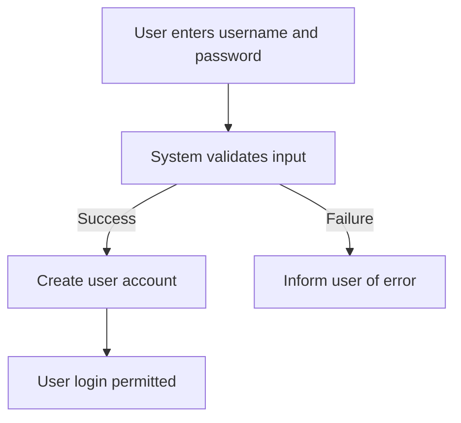
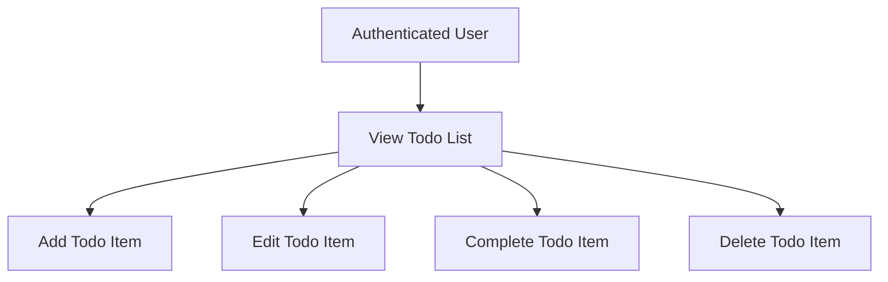
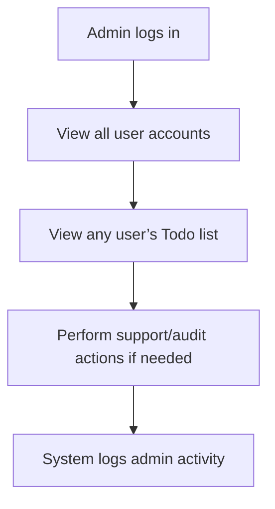

# Todo List Application: Minimum Requirements

## 1. Application Overview

The Todo List application provides users with a simple, bare-minimum platform to manage their personal tasks. Its focus is on clarity, speed, and privacy, ensuring users can maintain, complete, and delete their own tasks without distraction or unnecessary features. Only essential functionality and strict access controls are applied as per business vision.

## 2. User Actors, Permissions, and Access Control

There are two user actor types with well-defined permission boundaries:

| Actor | Description |
|-------|-------------|
| user  | A registered user who can create, view, update, complete, and delete their own Todo items. |
| admin | An administrator who can view and manage all user accounts and Todo lists; admin-only maintenance and audit tasks. |

All access to functionality and data is controlled by user roles, implemented via authentication and strict resource boundary checks.

### Permission Matrix

| Action                       | user | admin |
|------------------------------|:----:|:-----:|
| Register                     |  X   |   -   |
| Authenticate (Login/Logout)  |  X   |   X   |
| View personal Todos          |  X   |   X   |
| Create Todo                  |  X   |   -   |
| Update own Todo              |  X   |   -   |
| Complete own Todo            |  X   |   -   |
| Delete own Todo              |  X   |   -   |
| View all users’ Todos        |  -   |   X   |
| Disable user accounts        |  -   |   X   |
| Audit user activity/logs     |  -   |   X   |

- `X` = permitted; `-` = not permitted

Admin access to personal Todo content is used solely for legitimate support, audit, or moderation, and these actions are fully recorded for traceability.

## 3. Functional Requirements (EARS Format)

- WHEN a user registers, THE system SHALL require a unique username and password from the user AND respond with success only if both are present and valid.
- WHEN a user authenticates, THE system SHALL grant access to that user’s Todo list and restrict all other private data.
- WHEN authenticated, THE user SHALL be able to create a new Todo item by supplying at minimum a text description.
- WHEN the user requests their Todo list, THE system SHALL return ONLY that user’s Todos, sorted by creation or completion status as determined by user preference.
- WHEN a user updates a Todo (text or status), THE system SHALL check that the Todo belongs to the requesting user AND perform the update if so.
- WHEN a user marks a Todo as complete, THE system SHALL update that Todo’s status visibly and move it to the completed section for that user.
- WHEN a user deletes a Todo, THE system SHALL verify ownership and PERMANENTLY delete the Todo if authorized.
- WHEN an admin logs in, THE system SHALL allow the admin to view all user accounts and Todos for the purpose of audit, support, or moderation ONLY.
- WHEN an admin performs account disable or audit actions, THE system SHALL record these actions for later review and compliance.
- WHEN invalid access is detected (e.g., a user tries to access someone else’s data), THE system SHALL DENY the request and log the incident.

## 4. Minimal Business Processes and Flows

### User Registration and Authentication Flow

### Todo Management Flow (User)

### Admin Oversight Flow

## 5. Non-functional Requirements & Quality Standards

- WHEN a user performs any main operation (create, update, complete, delete todo), THE system SHALL respond within 1 second in 99% of requests.
- THE system SHALL be available 99.9% of the time (weekly uptime SLA).
- THE interface SHALL be intuitive so that a first-time user can add and complete a Todo within 1 minute without external help.
- WHEN errors occur, THE system SHALL return user-friendly, non-technical error messages.

## 6. Authentication and Security

- WHEN users register, THE system SHALL store credentials securely (e.g., using salted, hashed passwords).
- WHEN users authenticate, THE system SHALL issue a secure session token or JWT.
- THE system SHALL terminate sessions on logout or after 12 hours of inactivity.
- THE system SHALL restrict access to personal Todos only to authenticated users, and NEVER allow any user to access another’s data, unless performed by admin for legitimate audit/support.
- Admin actions SHALL be logged in detail, searchable for future audit.
- User data and sessions SHALL be encrypted in transit via HTTPS/TLS.
- All code SHALL meet OWASP best practices for web security.

## 7. Error Handling and Edge Cases

- WHEN a user enters invalid data (missing field, too short/long text), THE system SHALL notify the user within 1 second and reject the operation with a clear message.
- WHEN a server error occurs, THE system SHALL notify the user of temporary unavailability and encourage retry without exposing sensitive details.
- WHEN authentication credentials are invalid or expired, THE system SHALL reject access and provide a secure re-authentication prompt.
- WHEN a non-admin user attempts to access or modify another user’s Todos, THE system SHALL deny the request and log the security event.
- WHEN an admin accesses user data, THE system SHALL record this event for traceability.

## 8. Conclusion

The above requirements provide a complete, minimal, and actionable guide for implementing a production-grade Todo List backend service aligned with the business vision of essentialism, privacy, and reliability. Developers shall follow this as the single source of truth until further business expansion.