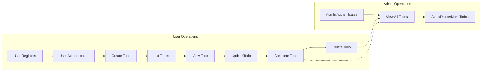

# Todo List Application: Comprehensive Business Requirements

## Introduction

The Todo List backend application delivers a minimum yet complete product for end users and administrative actors. All requirements are articulated using EARS (Easy Approach to Requirements Syntax), providing clear, testable, and production-ready expectations. Backend developers must strictly interpret these as business-centric, not as technical or low-level API/database details. Only functional, user-facing business logic, workflows, and quality attributes are specified.

---

## Functional Requirements (EARS Format)

### 1. User Account Registration and Authentication
- WHEN a new user attempts registration, THE system SHALL support account creation with a unique email (username) and password.
- IF an email is already registered, THEN THE system SHALL return a clear error message and prevent account creation.
- WHEN a user attempts login, THE system SHALL validate credentials (email and password), returning success on exact match only.
- IF credentials are incorrect, THE system SHALL reject login and respond with authentication error.
- THE system SHALL create and maintain user sessions upon successful login, expiring each session after 30 minutes of inactivity.
- WHEN a session expires, THE system SHALL require re-authentication for any protected resource access.
- IF an unauthenticated request targets a protected Todo route, THEN THE system SHALL reject the request and return an authentication error.
- WHEN an authenticated admin logs in, THE system SHALL allow access to admin features only after valid credential verification.

### 2. Todo Creation
- WHEN an authenticated user creates a Todo item with title (required), description (optional), and due date (optional), THE system SHALL save the Todo, associating only to that user.
- IF the Todo title is empty OR exceeds 255 characters, THEN THE system SHALL reject creation with a detailed validation error.
- IF the optional description exceeds 1,000 characters, THEN THE system SHALL reject creation with a validation error.
- THE system SHALL require any due date (if provided) to be today or later; past dates must be rejected.

### 3. Todo Viewing and Listing
- WHEN an authenticated user requests their Todo list, THE system SHALL return only their own Todos, ordered by due date (ascending) then creation time (descending).
- IF a user requests details for a Todo, THE system SHALL only return it if it belongs to that user.
- IF a user requests any Todo they do not own, THEN THE system SHALL return not found or forbidden error, never leaking existence of other users’ data.

### 4. Todo Update
- WHEN an authenticated user submits changes to their Todo (title, description, due date), THE system SHALL validate and save changes, subject to all validations above.
- IF input data is invalid (e.g., empty/overlength title or description, past due date), THEN THE system SHALL reject update with explicit validation errors.

### 5. Todo Deletion
- WHEN an authenticated user requests deletion of their Todo, THE system SHALL remove the Todo from their active Todo list.
- IF a user tries deleting a Todo they do not own, THE system SHALL reject with forbidden error.
- WHEN deleted, THE system SHALL ensure the Todo no longer appears in listings for the user or counts toward active item totals.

### 6. Todo Completion
- WHEN a user marks their Todo as complete, THE system SHALL persist the status as 'Completed', but retain all detail for subsequent review/restore.
- THE system SHALL allow toggling completion status between 'Completed' and 'Not Completed' by the owner only.
- WHEN a Todo is completed, THE system SHALL store a timestamp for the completion event.
- IF a user tries to mark as complete any Todo not owned by them, THE system SHALL reject with forbidden error.

### 7. Admin Operations
- WHEN an authenticated admin logs in, THE system SHALL grant access to view/edit all Todos and user accounts as needed for moderation/support.
- THE system SHALL allow admin to search, filter, and view any user’s Todos, including completed and deleted entries.
- WHEN an admin detects inappropriate or abusive content, THE system SHALL enable marking or removing these entries, and must log admin actions with timestamp, action, and actor identity.

### 8. Data Isolation and Privacy
- THE system SHALL segregate all user accounts and Todo data strictly: under no circumstance can a user access, view, or edit Todos belonging to another user.
- WHEN an admin performs data actions on a user’s data (view, update, delete, etc.), THE system SHALL log details (admin ID, action, affected user, timestamp) for auditing.

### 9. Error Handling (Business Perspective)
- IF required fields are missing or malformed in any request, THE system SHALL return a precise validation error, naming the problematic field.
- IF a user attempts operations for which they lack permission, THE system SHALL deny access, return a forbidden error, and log the attempt if from an admin.
- IF a server-side processing or system error occurs, THE system SHALL return a generic internal error (without implementation details), and suggest the user try again.
- WHERE a business error is fixable, THE system SHALL allow the user to repeat the request after remedy.

### 10. Consistency and Idempotency
- THE system SHALL ensure repeated identical operations by a user (e.g., trying to complete an already completed Todo) do not duplicate changes or data, and always result in correct state.
- WHEN network or server errors interrupt an action, THE system SHALL support safe client-side retry for idempotent operations (no duplicates, no data loss guaranteed).

---

## Non-functional Requirements

### 1. Performance
- WHEN a user requests their Todo list (up to 100 items), THE system SHALL respond within 1 second.
- WHEN a Todo is created, updated, completed, or deleted, THE system SHALL confirm operation within 1 second (end to end).
- WHEN an admin performs bulk queries (up to 10,000 records), THE system SHALL respond within 3 seconds.

### 2. Security
- THE system SHALL store all passwords with secure hashing and salt (not reversible).
- THE system SHALL enforce HTTPS for all client-server traffic.
- THE system SHALL use JWT for authentication, with 30 minute expiry (access), and 7 day expiry (refresh).
- THE system SHALL require privilege checks on all protected endpoints, never trusting only frontend state.

### 3. Data Integrity and Reliability
- THE system SHALL never lose or corrupt Todo data as a result of crashes, power loss, or normal use.
- THE system SHALL perform atomic writes for all create, update, delete, and complete operations.
- THE system SHALL store and retain admin audit logs for at least 90 days.

### 4. Compliance
- THE system SHALL observe basic privacy: minimizing retention to essential personal data only, never exposing or sharing info with third parties, and supporting GDPR-like requests for account removal.

---

## User Experience Expectations

- WHEN a user completes, updates, creates, or deletes a Todo, THE system SHALL display or return feedback immediately for every operation.
- WHEN a user encounters an input or permissions error, THE system SHALL show a clear business-level message, always stating the reason (e.g., invalid title, unauthorized access).
- THE system SHALL guarantee that error descriptions avoid technical jargon or implementation terms (e.g., 'server stack trace' must never be shown to user).
- WHERE a user experiences a system error, THE system SHALL prompt the user to retry, and the event is logged for admin review.

---

## Mermaid Diagram: Core User Flows

---

## Measurable Success Criteria

- 100% compliance: All requirements above must be met and be testable.
- Every user action’s outcomes (success & error) are correct and business-valid.
- All error and edge cases are handled as described—no unspecified behavior.
- App performance meets or exceeds all defined targets for latency and scalability.
- No cross-user data exposure under any circumstances.
- All admin actions generate full audit logs, reviewable for 90 days.

---

## End of Document